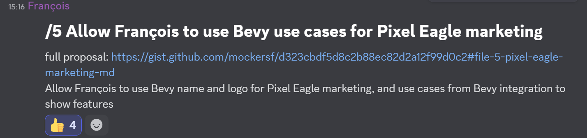

+++
title = "Allow use of Bevy in Pixel Eagle marketing"
date = 2025-03-30
authors = ["Alice I. Cecile"]
+++

<!-- more -->

**Proposal:** François wants to start offering Pixel Eagle as a paying service to other users.

He is asking if the foundation will allow him to use Bevy name and logo in Pixel Eagle marketing material and use example / screen recordings / screenshots of how Pixel Eagle is used for Bevy to demonstrate features.

**Proposed by:** Francois Mockers

**Votes:** Yes by Alice Cecile, Rob Swain, Carter Anderson, James Liu. Francois Mockers abstains.
