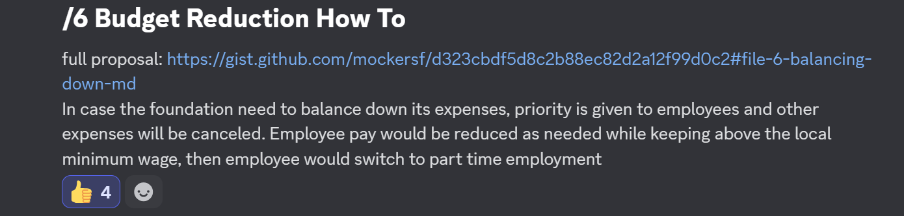

+++
title = "Budget Reduction Strategy"
date = 2025-03-30
authors = ["Alice I. Cecile"]
+++

<!-- more -->

**Proposal:** If the foundation lost sponsors and we would need to reduce employee payment, the foundation will:

- first reduce/cancel all extra spending, prioritizing employees
- then reduce pay while also reducing employee workload, resulting in fewer hours worked
- if reduction would go below the local minimum wage, switch to part time hourly employment

Rebalancing must happen as soon as the buffer can't cover expenses for the next 6 months

**Proposed by:** Francois Mockers

**Votes:** Yes by Alice Cecile, Rob Swain, Carter Anderson, Francois Mockers. James Liu did not vote.
