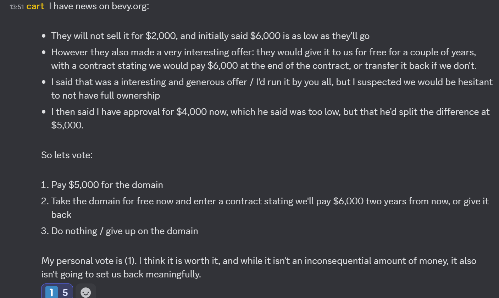

+++
title = "Buying Bevy.org"
date = 2025-06-02
authors = ["Alice I. Cecile"]
+++

<!-- more -->

**Proposal:** Carter Anderson proposes:

> I have news on bevy.org:
>
> They will not sell it for $2,000, and initially said $6,000 is as low as they'll go,
> However they also made a very interesting offer: they would give it to us for free for a couple of years, with a contract stating we would pay $6,000 at the end of the contract, or transfer it back if we don't.,
> I said that was a interesting and generous offer / I'd run it by you all, but I suspected we would be hesitant to not have full ownership,
> I then said I have approval for $4,000 now, which he said was too low, but that he'd split the difference at $5,000.,
>
> So lets vote:
>
> 1. Pay $5,000 for the domain,
> 2. Take the domain for free now and enter a contract stating we'll pay $6,000 two years from now, or give it back,
> 3. Do nothing / give up on the domain,
>
> My personal vote is (1). I think it is worth it, and while it isn't an inconsequential amount of money, it also isn't going to set us back meaningfully.

**Votes:** Option 1 by Alice Cecile, Rob Swain, Carter Anderson, Francois Mockers, James Liu
