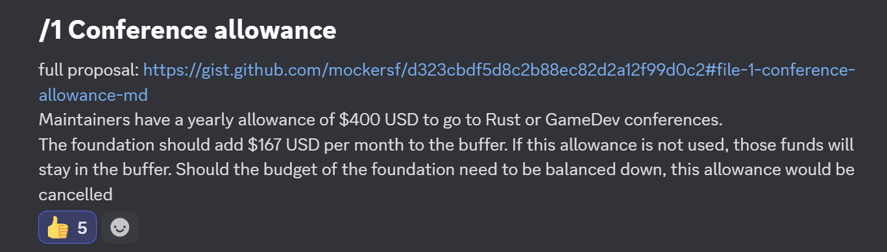

+++
title = "Conference Allowance"
date = 2025-03-30
authors = ["Alice I. Cecile"]
+++

<!-- more -->

**Proposal:** Francois Mockers proposes:

> Maintainers have a yearly allowance of $400 to go to Rust or GameDev conferences.
>
> If not used, those funds will stay in the foundation buffer.
>
> For special occasions, this allowance can be increased up to $1000 with the approval of 2 members of the board, excluding the one asking for the allowance.
>
> Larger budget would go through the normal process for expenses, needing approval by the majority of the board.
>
> With 5 maintainers, the foundation will need to put aside $167 per month (400 * 5 / 12).
>
> Should the budget for the foundation be reduced and re-balancing would bring employee payment down, this allowance would be cancelled.

**Votes:** Yes by Alice Cecile, Rob Swain, Carter Anderson, Francois Mockers, James Liu
