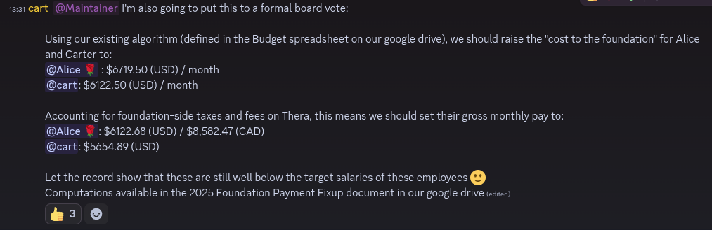

+++
title = "Correctly account for cost to foundation of employees"
date = 2025-11-03
authors = ["Alice I. Cecile"]
+++

<!-- more -->

**Proposal:** Carter Anderson proposes:

> Using our existing algorithm (defined in the Budget spreadsheet on our google drive), we should raise the "cost to the foundation" for Alice and Carter to:
> - @Alice 🌹 : $6719.50 (USD) / month
> - @cart: $6122.50 (USD) / month
> 
> Accounting for foundation-side taxes and fees on Thera, this means we should set their gross monthly pay to:
> @Alice 🌹: $6122.68 (USD) / $8,582.47 (CAD)
> @cart: $5654.89 (USD)
> 
> Let the record show that these are still well below the target salaries of these employees 🙂

**Context:** This is not intended as a raise: it is a correction to the accounting. The intent is that "total gross salary" is equal, regardless of the cost to the foundation with respect to various fees.

**Votes:** Yes from Rob Swain, François Mockers, and James Liu. Carter Anderson and Alice I. Cecile abstain due to a conflict of interest.
