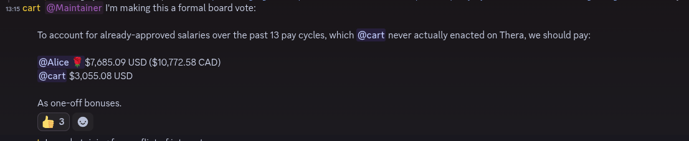

+++
title = "Error in raises"
date = 2025-11-03
authors = ["Alice I. Cecile"]
+++

<!-- more -->

**Proposal:** Carter Anderson proposes:

> To account for already-approved salaries over the past 13 pay cycles, which @cart never actually enacted on Thera, we should pay:
>
>- @Alice 🌹$7,685.09 USD ($10,772.58 CAD)
>- @cart $3,055.08 USD
>
> As one-off bonuses.

**Context:** This was verified in pay stubs as well.

**Votes:** Yes from Rob Swain, François Mockers, and James Liu. Carter Anderson and Alice I. Cecile abstain due to a conflict of interest.
