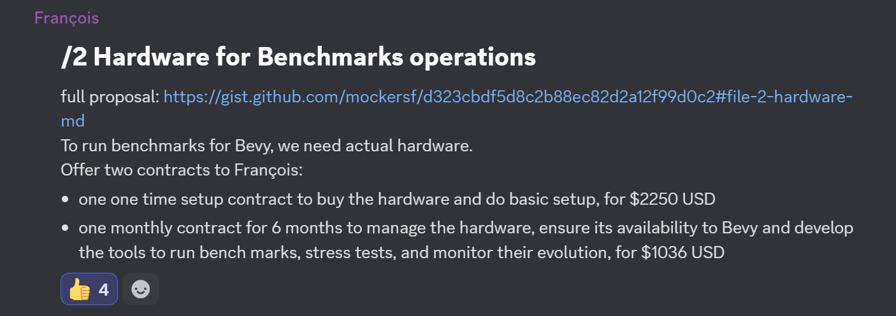

+++
title = "Hardware for Benchmarking"
date = 2025-03-30
authors = ["Alice I. Cecile"]
+++

<!-- more -->

**Proposal:** Francois Mockers proposes:

> We want to have dedicated hardware to be able to run timings and benches:
>
> - build duration with different parallel settings
> - binary size
> - benchmarks
> - stress tests (https://github.com/rparrett/bevy_benchy is a great effort by rparret/bestRanar to be able to use stress tests as benches)
> - run large scenes (https://github.com/DGriffin91/bevy_caldera_scene is an example of how to get a scene from Caldera to run on Bevy by DGriffin91/Griffin)
> - other tests as the need arise
>
> We decided the hardware we want is built around:
>
> - a fast CPU so that most rendering tests are GPU bound, and non rendering tests are fast
> - a mid tier GPU to test rendering under constraints, to be more representative of our users and to be cheaper when we'll want to replace it
>
> The configuration would be something like https://fr.pcpartpicker.com/list/M7nGdb
>
> François volunteered to host and manage the hardware.
>
> This can be done in two contracts:
>
> 1. a one-time setup contract covering the cost of the hardware and labor to get it up and running
> 2. a monthly operation contract for 6 hours per week plus hosting costs (electricity, internet, space, ...)
>
> ## One-Time Setup Contract
>
> Estimated cost of getting the setup done is $400
> Hardware cost is €1,728.91 / $1,876.65 USD
> Contract would cost the foundation $2,250 USD
> Monthly Operation Contract
>
> Scope of the contract is making sure the server is up and running, building the tooling to run the tests and report on results, and investigating failures to ensure they aren't hardware related
> Tools developed for this contract are owned by the Bevy Foundation and will be open source
> This contract would be for 6 months
> Estimated monthly hosting cost is $100 USD.
> Hourly rate of maintainers is $41.71 (see proposal 4 has the projected budget), 6 hours per week would be $1,001 USD monthly.
> Contract would cost the foundation $1,101 USD
> Adjusted with François personal donations, cost to the foundation is $1,036 USD

**Votes:** Yes by Alice Cecile, Rob Swain, Carter Anderson, James Liu. Francois Mockers abstains.
