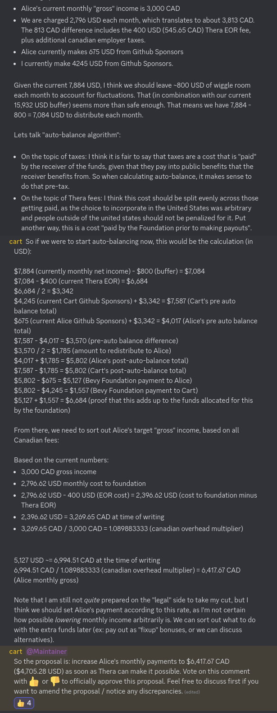

+++
title = "Increasing Alice's salary"
date = 2024-07-08
authors = ["Alice I. Cecile"]
+++

**Context:**

> Cart: Alrighty it is definitely time to bump Alice's pay. Consider this a start of one of our "async chat-driven board meetings". Here is my proposal, given the current numbers.
>
> First, lets look at our current numbers:
> Our current net volume (aka what we take home after stripe fees, credit card fees, failed payments / disputes, etc) for a 4 week period on Stripe is 7,884 USD
> We have 15,932 USD in our account (with the next monthly Thera charge coming up on the 11th)
> Alice's current monthly "gross" income is 3,000 CAD
> We are charged 2,796 USD each month, which translates to about 3,813 CAD. The 813 CAD difference includes the 400 USD (545.65 CAD) Thera EOR fee, plus additional canadian employer taxes.
> Alice currently makes 675 USD from Github Sponsors
> I currently make 4245 USD from Github Sponsors.
> Given the current 7,884 USD, I think we should leave ~800 USD of wiggle room each month to account for fluctuations. That (in combination with our current 15,932 USD buffer) seems more than safe enough. That means we have 7,884 - 800 = 7,084 USD to distribute each month.
> Lets talk "auto-balance algorithm":
>
> On the topic of taxes: I think it is fair to say that taxes are a cost that is "paid" by the receiver of the funds, given that they pay into public benefits that the receiver benefits from. So when calculating auto-balance, it makes sense to do that pre-tax.
On the topic of Thera fees: I think this cost should be split evenly across those getting paid, as the choice to incorporate in the United States was arbitrary and people outside of the united states should not be penalized for it. Put another way, this is a cost "paid by the Foundation prior to making payouts".
>
> > So if we were to start auto-balancing now, this would be the calculation (in USD):
>
> $7,884 (currently monthly net income) - $800 (buffer) = $7,084
> $7,084 - $400 (current Thera EOR) = $6,684
> $6,684 / 2 = $3,342
> $4,245 (current Cart Github Sponsors) + $3,342 = $7,587 (Cart's pre auto balance total)
> $675 (current Alice Github Sponsors) + $3,342 = $4,017 (Alice's pre auto balance total)
> $7,587 - $4,017 = $3,570 (pre-auto balance difference)
> $3,570 / 2 = $1,785 (amount to redistribute to Alice)
> $4,017 + $1,785 = $5,802 (Alice's post-auto-balance total)
> $7,587 - $1,785 = $5,802 (Cart's post-auto-balance total)
> $5,802 - $675 = $5,127 (Bevy Foundation payment to Alice)
> $5,802 - $4,245 = $1,557 (Bevy Foundation payment to Cart)
> $5,127 + $1,557 = $6,684 (proof that this adds up to the funds allocated for this by the foundation)
>
> From there, we need to sort out Alice's target "gross" income, based on all Canadian fees:
>
> Based on the current numbers:
> 3,000 CAD gross income
> 2,796.62 USD monthly cost to foundation
> 2,796.62 USD - 400 USD (EOR cost) = 2,396.62 USD (cost to foundation minus Thera EOR)
> 2,396.62 USD = 3,269.65 CAD at time of writing
> 3,269.65 CAD / 3,000 CAD = 1.089883333 (canadian overhead multiplier)
>
>
> 5,127 USD ~= 6,994.51 CAD at the time of writing
> 6,994.51 CAD / 1.089883333 (canadian overhead multiplier) = 6,417.67 CAD (Alice monthly gross)
>
> Note that I am still not quite prepared on the "legal" side to take my cut, but I think we should set Alice's payment according to this rate, as I'm not certain how possible lowering monthly income arbitrarily is. We can sort out what to do with the extra funds later (ex: pay out as "fixup" bonuses, or we can discuss alternatives).

**Proposal:** So the proposal is: increase Alice's monthly payments to $6,417.67 CAD ($4,705.28 USD) as soon as Thera can make it possible. Vote on this comment with 👍  or 👎 to officially approve this proposal. Feel free to discuss first if you want to amend the proposal / notice any discrepancies.

**Votes:** Alice I. Cecile abstains. All others voted yes.
