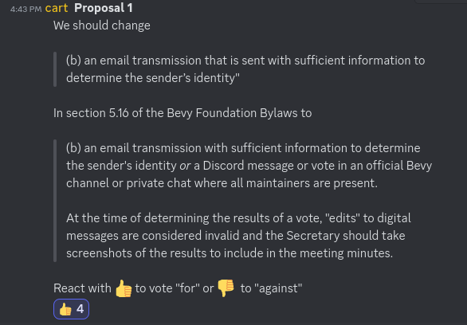

+++
title = "More relaxed voting rules"
date = 2024-09-09
authors = ["Alice I. Cecile"]
+++

**Proposal:** We should change "(b) an email transmission that is sent with sufficient information to determine the sender’s identity"" in section 5.16 of the Bevy Foundation Bylaws to "(b) an email transmission with sufficient information to determine the sender's identity or a Discord message or vote in an official Bevy channel or private chat where all maintainers are present." At the time of determining the results of a vote, "edits" to digital messages are considered invalid and the Secretary should take screenshots of the results to include in the meeting minutes.

**Proposed by:** Carter Anderson

**Votes:** Yes by Carter Anderson, Alice I. Cecile, Rob Swain and François Mockers. No vote by James Liu.
