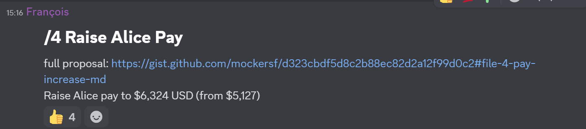

+++
title = "Raise Alice's Pay"
date = 2025-03-30
authors = ["Alice I. Cecile"]
+++

<!-- more -->

**Proposal:** Francois Mockers proposes:

> increase Alice cost to the foundation to $6,324 USD (from $5,127 USD).

**Supporting information:** Foundation donations and personal sponsors have changed since the last time (2024/08/07) we updated our budget.

With today (2025/03/07) numbers:

|                      | amount (monthly USD) |
| -------------------- | -------------------- |
| Foundation donations | 14880                |
| Cart donations       | 1300                 |
| Alice donations      | 350                  |
| François donations   | 65                   |
| total                | 16595                |

|                                           | cost (monthly USD) |
| ----------------------------------------- | ------------------ |
| thera                                     | 490                |
| buffer (`10% of Foundation donations`)    | 1488               |
| conference allowance                      | 167                |
| hardware operation contract hosting costs | 100                |
| total                                     | 2245               |

|                                                                      | amount (monthly USD) |
| -------------------------------------------------------------------- | -------------------- |
| remaining (`total donations - total costs`)                          | 14350                |
| hour volume (2 full time + 1 part time: `(40 + 40 + 6) * 4`)         | 344                  |
| hourly rate (`remaining / hour volume`)                              | 41.71                |
| Cart payment (`hourly rate * 40 * 4 - donations`)                    | 5374                 |
| Alice payment (`hourly rate * 40 * 4 - donations`)                   | 6324                 |
| François payment (`hourly rate * 6 * 4 + hosting costs - donations`) | 1036                 |

Spreadsheet with the current state and this proposal, with the calculations: https://docs.google.com/spreadsheets/d/1EXcwqWLO8yHHD1A_2msQXpGbNF2plvCy4kqdCeqxtzo/edit?gid=2076305514#gid=2076305514

**Votes:** Yes by Rob Swain, Carter Anderson, Francois Mockers, James Liu. Alice Cecile abstains.
