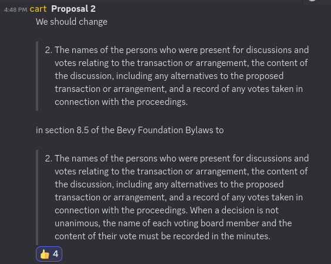

+++
title = "Recording who voted for which motions in the minutes"
date = 2024-09-09
authors = ["Alice I. Cecile"]
+++

<!-- more -->

**Proposal:** Carter Anderson proposes:

> We should change "The names of the persons who were present for discussions and votes relating to the transaction or arrangement, the content of the discussion, including any alternatives to the proposed transaction or arrangement, and a record of any votes taken in connection with the proceedings." in section 8.5 of the Bevy Foundation Bylaws to "The names of the persons who were present for discussions and votes relating to the transaction or arrangement, the content of the discussion, including any alternatives to the proposed transaction or arrangement, and a record of any votes taken in connection with the proceedings. When a decision is not unanimous, the name of each voting board member and the content of their vote must be recorded in the minutes."

**Votes:** Yes by Carter Anderson, Alice I. Cecile, Rob Swain and François Mockers. No vote by James Liu.
