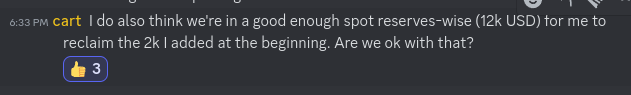

+++
title = "Repaying Cart for initial deposit into bank account"
date = 2024-06-16
authors = ["Alice I. Cecile"]
+++

<!-- more -->

**Proposal:** Carter Anderson proposes:

> I do also think we're in a good enough spot reserves-wise (12k USD) for me to reclaim the 2k I added at the beginning. Are we ok with that?

**Context:** The Bevy bank account needed funds in it to be opened. Cart lent the Foundation $2000 USD from his personal account to cover this.

**Votes:** Yes by Alice I. Cecile, Rob Swain and François Mockers. No vote from James Liu. Carter Anderson abstained.
