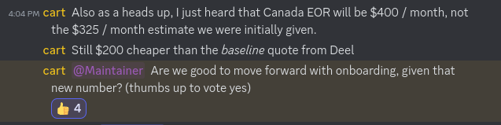

+++
title = "Using Thera as our Employer of Record"
date = 2024-04-15
authors = ["Alice I. Cecile"]
+++

<!-- more -->

**Context:** In order to readily employee folks from across the world, the Bevy Foundation uses an [employer of record](https://www.oysterhr.com/glossary/eor) to handle local compliance, taxation and benefits.

**Proposal:** Are we good to move forward with onboarding \[with thera\], given that \[the cost will be $400/month, $200 cheaper than that of Deel\]?

**Proposed by:** Carter Anderson

**Votes:** Yes from Rob Swain, Carter Anderson, Alice I. Cecile, François Mockers. No vote from James Liu.
