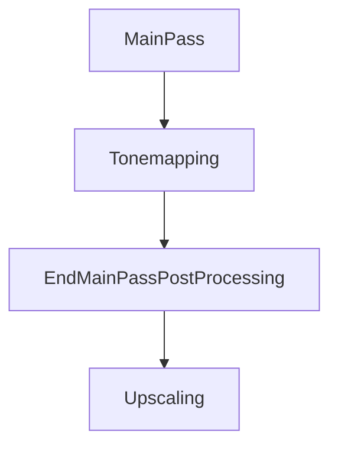
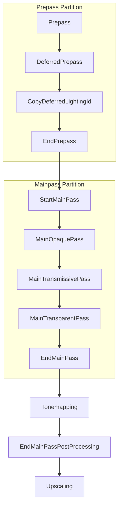

+++
title = "Technical Summary"
insert_anchor_links = "right"
[extra]
weight = 1
status = 'hidden'
+++

## Introduction
This document provides a technical summary of Bevy's rendering architecture as
of the 0.13 release.

Bevy's rendering code is largely concentrated in three loosely-coupled crates:
`bevy_render`, `bevy_core_pipeline`, and `bevy_pbr`. The foundation is
`bevy_render`, which manages how low-level rendering tasks are scheduled and
executed. Above this sits `bevy_core_pipeline`, which defines the individual
steps of rendering each frame. Above both is `bevy_pbr` which adds a material
abstraction and uses it to provide physically-based shaders.

These three crates sit roughly in "upper-middle" of bevy's default stack and do
not fully encompass all of bevy's rendering capabilities. Although we will not
cover them here, both `bevy_ui` and `bevy_sprite` also hook-into and interact
with rendering.

We will begin with the lowest levels of the stack and progress upwards towards
high-level concepts like materials. But before diving in, lets take a look at
the two big dependencies underpinning the rest of the rendering stack: `wgpu`
and `bevy_ecs`.

## `wgpu` Preliminaries
This is a quick overview of some important aspects of wgpu. Those experienced
with wgpu can skip this section. Those unfamiliar with wgpu should check out
[the wgpu book][wgpu book] and [the WebGPU spec][WebGPU spec].

`wgpu` is a rust package providing a cross platform implementation `WebGPU`, a
modern graphics api. It strikes a nice balance between the ergonomics and power,
and can run pretty much anywhere.

[wgpu book]: https://sotrh.github.io/learn-wgpu/
[WebGPU spec]: https://gpuweb.github.io/gpuweb/ 

### Layers of Abstraction
`wgpu` is a low level graphics library, but because it is designed to work
across a wide beret of platforms there are many layers of abstraction between it
and the graphics hardware. Going from lowest to highest level:
1. First, the GPU hardware itself.
2. The platform-specific GPU drivers (vendored by Nvidia, AMD, Apple, Windows or
   the Linux Kernel),
3. The native GPU api (`metal`, `vulkan`, `gles` etc.),
4. The platform-specific adapter (`wgpu_hal::vulkan`, `wgpu_hal::gles`,
   `wgpu_native` and the browser's own `WebGpu` adapter, etc.)
5. Finally the safe `WebGPU` api provided by `wgpu`.

It's good to be vaguely aware of this stack. `wgpu` does it's best to stay
consistent, but some features are not fully supported on all platforms.

TODO: Provide a brief list of features that differ across platforms.

The middle sections of this stack are represented in `wgpu` by a
[`wgpu::Adapter`] and [`wgpu::Device`]. The adapter provides access to the platform
specific `WebGPU` implementation (layers 2 and 3 of the stack). The device is a
logical representation of layers 4 and 5 obtained from the `Adapter`, and is
ultimately what allows us to submit work to the GPU.

[`wgpu::Adapter`]: https://docs.rs/wgpu/latest/wgpu/struct.Adapter.html
[`wgpu::Device`]: https://docs.rs/wgpu/latest/wgpu/struct.Device.html

### Buffers
Allocating memory is the most basic of all operations. In `wgpu`, GPU memory
management is done through buffers.

A `wgpu::Buffer` represents a continuous block of memory allocated on the GPU.
Buffers can be created by calls to [`wgpu::Device::create_buffer`] (which only
allocates the buffer) or [`wgpy::DeviceExt::create_buffer_init`] (which both
allocates and initializes the buffer).

You can reference a slice of a buffer using [`wgpu::Buffer::slice`]. This
returns a [`wgpu::BufferSlice`] which can be "mapped" to main program memory for
reading and writing. Writes are flushed by calling [`wgpu::Buffer::unmap`] and
can be deallocated with [`wgpu::Buffer::destroy`]. Writes can also be queued as part 
of commands using [`wgpu::Queue::write_buffer`].

When you create a buffer, you generally have to declare the intended use with
[`wgpu::BufferUses`]. Buffers must have `BufferUsages::MAP_READ` to be read from.

### Textures, Views, and Samplers
A `wgpu::Texture` represents an image stored in GPU memory. Textures can be
created by calling `wgpu::Device::create_texture`, which requires information
about the format, dimensions, and so on. The main way to write to a texture is
[`wgpu::Buffer::write_texture`], which is similar to
[`wgpu::Device::write_buffer`] in that it is delayed for dispatch until commands
are next sent to the GPU. It's also possible to copy a buffer to a texture using
[`wgpu::CommandEncoder::copy_buffer_to_texture`]. Like buffers, textures can be
deallocated using [`wgpu::Texture::destroy`].

Textures are usually accessed in shaders through views and samplers.

A [`wgpu::TextureView`] is a "view" on a specific texture. The view describes
how the raw texture data should be interpreted, and the subset of the texture to
access. Views are created using [`wgpu::Texture::create_view`]. They will be
very important when we get into bind groups later on.

A [`wgpu::Sampler`] is a method of sampling color values from a texture at a
given texture coordinate. They are created using
[`wgpu::Device::create_sampler`], and will also be important in the context of
bind groups.

### Pipelines and Shaders
A pipeline is like a highly-specialized program that runs on the GPU.
Currently `wgpu` supports two types of pipeline: [`wgpu::RenderPipeline`] for
rasterizing geometry, and [`wgpu::ComputePipeline`] for general computation.

Pipelines are composed of a sequence of stages, which can be either fixed or
programmable. Fixed stages are inflexible hardware-accelerated operations, with
no user control. Programmable stages, on the other hand, can be controlled by
user-supplied shader modules.

#### Shaders
Shaders are small highly-specialized programs that run on the GPU within the
programmable stages of pipelines. They are written in a language `WGSL`.

TODO: Expand the explanation of shaders.

#### Layouts and Bind Groups
Bindings allow buffers, texture views, and samplers (as well as arrays of the
same) to be accessed in pipelines just like global variables. Each binding is
assigned a unique (but not necessarily sequential) index from 0 to 1000, and one
of four bind group slots.

On the GPU side, the expected type for each binding must be hard-coded onto the
shader. On the CPU, the layout of bindings for each slot is specified by a bind
group layout ([`wgpu::BindGroupLayout`]). Up to four of these pipeline layouts
can be specified when creating a pipeline (one for each bind group slot).

Bind groups are be created on the CPU to assign specific buffers and textures to
each binding in a layout.

Once created, bind groups are bound to the four pipeline bind group slots using
GPU commands (which we will talk more about later). When a pipeline is invoked
(also via GPU commands) the group bound to each slot must match the layout of
the slot. Bind groups work as a stack: When a group is rebound, all bind groups
with higher slot index must be rebound as well.

Only certain types of bindings can be written to by shaders:
+ Storage buffers
+ Storage textures

#### Compute Pipelines
TODO: Explain compute shaders and work groups.

#### Render Pipelines
TODO: Explain vertex and fragment shaders and the graphics pipeline.

Render pipelines are more specialized than compute pipelines, but also have more
mechanisms for input and output than just bindings.

Render pipelines have the following additional inputs:
+ Vertex and Index Buffers
+ Color and Depth attachments

Render pipelines have the following outputs:
+ Color and Depth attachments

##### Render Attachments
Render attachments are textures that store the results of rendering; they are
what get rendered to. Render pipelines expect a specific number of color
attachments, and can also configure a depth attachment. Failing to provide the
attachments when invoking a pipeline will result in an error.

Attachments can be sampled from as well as written to. 
TODO: Double-check that this is correct.

##### Vertex and Index Buffers
The vertex buffer is a special buffer that is used as input for the pipeline.

TODO: Further explain vertex and index buffers.

### Commands and Passes
Comunication between the CPU and the GPU is asyncronuous; the CPU dispatches
commands to the GPU and must wait for the GPU to finish it's workload and
transmit a response. We'll reffer to these as GPU commands to differentiate them
from bevy ECS commands.

As previously said, a pipeline is like a highly-specialized program that runs on
the GPU. To "run" a pipeline, multiple GPU commands must be issued to set up the
various bindings, select the active pipeline, and finally invoke the pipeline
itself. These GPU commands are grouped together in a "pass".

Passes group and organize GPU commands. A [`wgpu::RenderPass`] allows issuing
GPU commands relating to render pipelines, and a similar structure
[`wgpu::ComputePass`] exists for compute pipelines.

Render attachments are set during render pass creation and fixed for the
duration; you can think of a render pass as a resource-scope for a certain set
of attachments. All pipelines executed within a pass must be compatible with the
provided set of attachments. Between passes, writes are flushed and attachments
can be swapped around or reconfigured.

Commands are queued together in a [`wgpu::CommandEncoder`] when they are added
to a pass. Calling `CommandEncoder::finish()` encodes the commands into a
[`wgpu::CommandBuffer`], which is ready to be sent off to the gpu for execution.
Work begins when command buffers are submitted to the GPU command queue.

[`wgpu::RenderPass`]: https://docs.rs/wgpu/latest/wgpu/struct.RenderPass.html
[`wgpu::ComputePass`]: https://docs.rs/wgpu/latest/wgpu/struct.ComputePass.html
[`wgpu::CommandEncoder`]: https://docs.rs/wgpu/latest/wgpu/struct.CommandEncoder.html
[`wgpu::CommandBuffer`]: https://docs.rs/wgpu/latest/wgpu/struct.CommandBuffer.html

### Limitations
As we have seen, `wgpu` sits atop many semi-interchangeable layers.
Unfortunately, it's often necessary to design features to accommodate the
lowest-common-denominator of supported platforms. Here are some limitations to
keep in mind:
+ Only 4 bind-groups are allowed in a pipeline layout.
+ Only 4 storage buffers with dynamic offsets are allowed in a pipeline layout.
+ Only 4 storage textures are allowed in a pipeline layout.
+ Only 8 color attachments can be added to a pass.
+ Only 16 variables can be passed between shader stages.

The full list is available [here](https://www.w3.org/TR/webgpu/#limits).

## `bevy_ecs` Preliminaries
This is a quick overview of some important aspects of bevy's Entity Component
System. Those experienced with the ECS can skip this section. Everyone else
should refer to the [the book](https://bevyengine.org/learn/book/ecs/) and
[the docs](https://docs.rs/bevy/latest/bevy/index.html) for more info.

### Systems and System Sets
A [`System`] is a stateful instance of a function that can access data stored in
a world. A [`SystemSet`] is logical group of systems (which can comprise other
system sets).

By default systems have neither strict execution order nor any conditions for
execution. For any system or system set, you can define: 

+ Its execution order relative to other systems or sets.
+ Any conditions that must be true for it to run.
+ Which set(s) it belongs to.

These properties are all additive, and properties can be added to existing sets.
Adding another does not replace an existing one, and they cannot be removed. If
incompatible properties are added, the schedule will panic at startup.

[`System`]: https://docs.rs/bevy/latest/bevy/ecs/system/trait.System.html
[`SystemSet`]: https://docs.rs/bevy/latest/bevy/ecs/prelude/trait.SystemSet.html

### Schedules
A [`Schedule`] is a collection of systems that are ordered, dispatched and
executed together as a batch. Every system belongs to exactly one schedule (If
the same function is added to two different schedules, it is considered a
different system). 

Systems in different schedules are independent; Each schedule has it's own
collection of SystemSets and it's own system execution ordering. 

[`Schedule`]: https://docs.rs/bevy/latest/bevy/ecs/schedule/struct.Schedule.html

### Apps
An [`App`] contains a [`World`], several schedules, and a runner function which
manages an event-loop.

Every app has one main schedule, which the runner (generally) executes once per
frame. Other schedules may be executed by calling [`World::run_schedule`].

[`App`]: https://docs.rs/bevy/latest/bevy/app/struct.App.html
[`World`]: https://docs.rs/bevy/latest/bevy/ecs/world/struct.World.html
[`World::run_schedule`]: https://docs.rs/bevy/latest/bevy/ecs/world/struct.World.html#method.run_schedule

### Sub-Apps
A [`SubApp`] is a secondary world with it's own set of schedules, which is
contained within the main app. Like the main app, a sub-app has a main schedule
which is (usually) executed by the main app's runner once per frame. Before the
runner executes the main schedule, it calls [`SubApp::extract`] to synchronize
the sub-app with the main world. No schedules can execute on the main world
during extraction.

[`SubApp`]: https://docs.rs/bevy/latest/bevy/app/struct.SubApp.html
[`SubApp::extract`]: https://docs.rs/bevy/latest/bevy/app/struct.SubApp.html#method.extract

## The `bevy_render` Crate
The `bevy_render` crate is a modular rendering toolkit. It's mostly concerned
with the nuts-and-bolts of scheduling and executing the rendering workload. The
tools it provides are largely independent, but they are intended to be used
together. We will start by investigating how the rendering code integrates with
`wgpu` through Render Resources, then take a look at the ECS side of things with
the render sub-app, before moving on to high level scheduling abstractions like
the Render Graph and Render Phases.

### Render Resources
The `bevy_render` crate wraps many primitive resources from `wgpu` in higher
level abstractions that are accessible through the [`RenderContext`]. There are
several things you can do with a `RenderContext`, including setting up a render
pass and queuing a task to generate command buffer in parallel.

Bevy provides it's own convenience wrappers around [`wgpu::Device`] and
[`wgpu::CommandEncoder`], called [`Device`] and [`CommandEncoder`] respectively.
These are both accessible through the [`RenderContext`].

#### Bind Groups
There are two ways to create bind groups in bevy, at different layers of
abstraction. The most direct path is with [`Device::create_bind_group_layout`].
Instead of specifying a slice of `BindGroupLayoutEntry` items, it is usually
more ergonomic to use the [`BindGroupLayoutEntries`]. Bind group instances can
be created from a layout using [`Device::create_bind_group`]. Here again, it is
usually preferable to use [`BindGroupEntries`] over manually constructing a
slice of [`BindGroupEntry`].

While it is possible to create bind groups directly in this manner, most users
will want to use an [`AsBindGroup`] trait derive instead. Types that implement
[`AsBindGroup`] provide two important functions:
[`AsBindGroup::bind_group_layout`] and [`AsBindGroup::as_bind_group`]. The
former is a static function which creates a bind group layout (which is the same
for all instances of the type) and the latter is a method which returns a bind
group instance with the appropriate layout. We will cover when these are called
later when we get into render workload scheduling.

#### Tracked Render Passes
In bevy, render passes can be created by calling
[`RenderContext::begin_tracked_render_pass`]. A [`TrackedRenderPass`] is a
wrapper around a `wgpu::RenderPass` with some handy automatic
resource-management built-in. It's a "Tracked" pass because it keeps track of
the current pipeline id, configured bind-groups, and bound vertex and index
buffers. This lets us treat several important render commands as idempotent.
Binding the same pipeline multiple times, for example, will only result in a
single `BindPipeline` command being sent to the GPU driver.

Note: This approach avoids redundant GPU instructions, which can be very costly,
but at the expense of additional state-management overhead on every frame. Some
rendering experts are experimenting with alternatives, and it's likely this will
change in the near future.

[`RenderContext::begin_tracked_render_pass`]: https://docs.rs/bevy/latest/bevy/render/renderer/struct.RenderContext.html#method.begin_tracked_render_pass
[`TrackedRenderPass`]: https://docs.rs/bevy/latest/bevy/render/render_phase/struct.TrackedRenderPass.html

#### Parallel Command Encoding
As covered in the `wgpu` preliminary, rendering involves queuing render commands
onto a `CommandEncoder`, so that they can be submitted to the gpu in a single
batch. Unfortunately, queuing a large number of commands can take quite a long
time. Command buffer generation tasks alleviate this issue by allowing us to
perform this costly work in parallel.

A "Command-Buffer Generation Task" is a function registered with
`RenderContext::add_command_buffer_generation_task` which takes a read-only
reference to the underlying `wgpu::Device` and returns a `wgpu::CommandBuffer`.
Before`RenderContext` finishes, it runs all registered tasks in parallel and
then joins the resulting commands back together in the order they were added. 

The `RenderContext` is not available within tasks. A new `wgpu::CommandEncoder`
and `wgpu::RenderPass` must be created from the provided `wgpu::Device`. Bevy's
wrapper types must be added to `wgpu` resources manually. Tracking, for
instance, can be added to an existing `wgpu::RenderPass` by passing it to
`TrackedRenderPass::new()`.

### The Render Sub-App
We are now going to move away from the `wgpu` side of things and look at how
rendering intersects with scheduling and the ECS. Bevy optionally supports
pipelined-rendering, which is a technique where the current frame is renderd at
the same time as the next game update runs.

Pipelined-rendering is achieved by moving rendering work into a sub-app which
(mostly) executes on its own thread. On single-threaded targets (like wasm),
pipelined-rendering is disabled and the render sub-app instead runs on the main
thread between executions of the main app.

The render sub-app is a very specialized use of the ecs. It relies upon a
Entity-sharing scheme with the main world that involves clearing all the
entities after every frame. Because entities don't stick around more than a
single frame most of the interesting stuff in the render world happens within
resources. One of these resources, the [`RenderGraph`], is what ultimately
drives the rendering work done each frame.

The render sub-app has two schedules, called [`ExtractSchedule`] and [`Render`]
(the inconsistent naming avoids conflict with the `Extract` system parameter,
which we will talk about later). The extract schedule is executed during the
`extract` function (which we discussed on the ecs preliminaries), and allows
access to both the main world and the render world. The render schedule is the
main schedule of the render sub-app, and runs after `ExtractSchedule`. All
entities are cleared at very end of the `Render` schedule.

[`RenderGraph`]: https://docs.rs/bevy/latest/bevy/render/render_graph/struct.RenderGraph.html
[`ExtractSchedule`]:https://docs.rs/bevy/latest/bevy/prelude/struct.ExtractSchedule.html
[`Render`]: https://docs.rs/bevy/latest/bevy/prelude/struct.ExtractSchedule.html

#### The Entity Sharing Scheme
As of 0.13, the docs on [`Entity`] have this to say about cross-world entity
use:

> [An entity is] only valid on the World it’s sourced from. Attempting to use an
> Entity to fetch entity components or metadata from a different world will
> either fail or return unexpected results.

The render world is an exception; it implements an explicit entity-sharing
scheme with the main world to enable cross-world use. It works like this:
+ [`World::flush_and_reserve_invalid_assuming_no_entities`] is called on the
  render world before each frame, to reserve all entities that are (or could be)
  used in the main world.
+ The reserved entities are spawned into the render world as "invalid", and
  won't really be used until components are assigned to them.
+ [`World::get_or_spawn`] lets render-world systems assign render-world
  components to entity ids initially derived from the main world.
+ During the frame, [`World::spawn`] can be used to spawn new render-world
  exclusive entities, which are guaranteed not to conflict with main world
  entities.
+ All entities are cleared from the render world at the end of each frame
  so that the reserve function can be safely called again at the top of the next
  frame.

From now on, a reference to a "reserved entity" in the render world will always
mean an entity that was reserved before extraction, with a corresponding entity
in the main world. "Unreserved entity" may sometimes be used to refer to an
entity that is spawned into the render world directly, without a corresponding
twin in the main world.

The up-side is that entities from the main world can be used in the render world
without fear of collisions. The down-side is that the entities need to be added
back to the render world every frame.

[`Entity`]: https://docs.rs/bevy/latest/bevy/ecs/entity/struct.Entity.html
[`World::flush_and_reserve_invalid_assuming_no_entities`]: https://docs.rs/bevy/latest/bevy/ecs/entity/struct.Entities.html#method.flush_and_reserve_invalid_assuming_no_entities
[`World::spawn`]: https://docs.rs/bevy/latest/bevy/ecs/world/struct.World.html#method.spawn
[`World::get_or_spawn`]: https://docs.rs/bevy/latest/bevy/ecs/world/struct.World.html#method.get_or_spawn

#### The Extract Schedule
The [`ExtractSchedule`] is a sync-point that allows the render-world to be
populated with data from the main world. Render-world systems in this schedule
access the main would through the special [`MainWorld`] resource (which can be
mutable), or the [`Extract`] parameter (which is read-only). Read-only access
through the `Extract` parameter is preferred.

While the `Extract` schedule runs, no other schedule can execute on either the
main app or the render sub app. It effectively locks both worlds, and is the
only part of bevy that can bottleneck both game logic and rendering. Bevy takes
great pains to keep the extract schedule as slim and efficient as possible, and
users should attempt to keep systems the extract schedule small.

The `RenderPlugin` only adds a single system to the extract schedule,
`PipelineCache::extract_shader`, which we will talk more about when we introduce
the `Shader` asset. Most of the systems in the extract schedule read some
main-world component `Foo` and add a matching `ExtractedFoo` render component to
the corresponding reserved entity in the render world.

[`MainWorld`]: https://docs.rs/bevy/latest/bevy/render/struct.MainWorld.html
[`Extract`]: https://docs.rs/bevy/latest/bevy/render/struct.Extract.html

#### The Render Schedule
The [`Render`] schedule runs directly after extraction. It comes with 16
built-in system sets, grouped as variants of the [`RenderSet`] enum.

[`RenderSet`]: https://docs.rs/bevy/latest/bevy/render/enum.RenderSet.html

##### The `ExtractCommands` Set
The first set to run in the render schedule is `ExtractCommands`. This set
usually contains a single system that applies ECS commands dispatched in the
extract schedule. Applying ECS commands in Render rather than Extract means the
main world spends less time locked in extraction.

##### The `ManageViews` Set
The `ManageViews` set runs after `ExtractCommands`, and contains three systems:
+ [`sort_cameras`] Sorts extracted cameras by [`Camera::order`].
+ [`prepare_windows`] Gets each window ready to be drawn to.
+ [`prepare_view_targets`] (after `prepare_windows`) Adds a [`ViewTarget`]
  component to each camera, so it knows what to draw to.
  
It will become more clear why this is called `ManageViews` when we talk about
views later.

[`sort_cameras`]: https://docs.rs/bevy/latest/bevy/render/camera/fn.sort_cameras.html
[`Camera::order`]: https://docs.rs/bevy/latest/bevy/prelude/struct.Camera.html#structfield.order
[`prepare_windows`]: https://docs.rs/bevy/latest/bevy/render/view/fn.prepare_windows.html
[`prepare_view_targets`]: https://docs.rs/bevy/latest/bevy/render/view/fn.prepare_view_targets.html
[`ViewTarget`]: https://docs.rs/bevy/latest/bevy/render/view/struct.ViewTarget.html

##### The `PrepareAssets` Set
The `PrepareAssets` runs between `ExtractCommands` and `Prepare`, in parallel
with `ManageViews`, `Queue` and `PhaseSort`. The purpose of the `PrepareAssets`
set is to run a bunch of instances of a generic system called [`prepare_assets`]
added by different [`RenderAssetPlugins`]. After this set completes, various
`RenderAssets<A>` resources are populated with data ready to be sent to the GPU.

See the section on the `RenderAssetPlugin` for more information.

[`RenderAssetPlugins`]: https://docs.rs/bevy/latest/bevy/render/render_asset/struct.RenderAssetPlugin.html
[`prepare_assets`]: https://docs.rs/bevy/latest/bevy/render/render_asset/fn.prepare_assets.html

##### The `Queue` Set
The `Queue` set runs after `ManageViews`. The `bevy_render` crate intentionally
leaves populating the `Queue` set to higher levels of the stack. The systems in
this set are expected to do stuff with render phases, which we will talk about
later.

The `Queue` set also contains a special subset `QueueMeshes` which executes
after `prepare_assets<Mesh>` completes. It is also empty by default.

##### The `PhaseSort` Set
The `PhaseSort` set runs after `Queue` and is also left empty by `bevy_render`.
We will talk more about this set along side render phases and the core pipeline.

##### The `Prepare` Set
The `Prepare` set runs after `PhaseSort` and `PrepareAssets` complete. It is
intended for use by systems which translate entities and components into
GPU-friendly formats and creates [`BindGroups`].

TODO: This may be wrong, creating bind groups probably happens in PrepareBindGroups. Fix or clarify...

[`BindGroups`]: https://docs.rs/bevy/latest/bevy/render/render_resource/struct.BindGroup.html

###### The `PrepareResources` Subset
TODO: Explain prepare the resources subset of `Prepare`.

###### The `PrepareBindGroups` Subset
TODO: Explain the bind groups subset of `Prepare`.

##### The `Render` Set
The `Render` set (not to be confused with the `Render` schedule to which it
belongs) runs after `Prepare`, and is when the actual draw calls get issued to
the GPU.

The `bevy_render` crate adds two systems to the `Render` set: 
+ First a system calls [`PipelineCache::process_queue`] to compile all
  the necessary shader pipelines.
+ The [`render_system`] does the rendering.

The `render_system` mostly triggers an execution of the render graph, bevy's
render workload scheduling system. We will talk more about the render graph in
it's own section.

[`PipelineCache::process_queue`]: https://docs.rs/bevy/latest/bevy/render/render_resource/struct.PipelineCache.html#method.process_queue 
[`render_system`]: https://docs.rs/bevy/latest/bevy/render/render_resource/struct.PipelineCache.html#method.process_queue

##### The `Cleanup` Set
The `Cleanup` set is the last set in the schedule, running after `Render`.

The `bevy_render` crate adds two systems to the `Cleanup` set: 
+ [`World::clear_entities`], which drops all the entities from the render world.
+ [`update_texture_cache_system`], which unloads textures that haven't been used
  in the last three frames.

### Views
The render world has one very special component, with no direct analog in the
main world: [`ExtractedView`]. Any entity that ends up with this component is
considered a 'View'. At time of writing, only two main-world components get an
`ExtractedView` attached to them in the render world:
+ cameras (added in `bevy_render::camera::extract_camera`),
+ and shadow-casting lights (added by a system in `bevy_pbr`, as we will see
  later)

A 'View' represents a point in space from which render commands can be
issued. Each `ExtractedView` contains a projection, a transform, a viewport
rectangle (width, height, origin), and a few other bits and bobs.

Views are important because of how they hook into the render graph: Each view
has the potential to execute a specialized render workload.

[`ExtractedView`]: https://docs.rs/bevy/latest/bevy/render/view/struct.ExtractedView.html

### The Render Graph
The [`RenderGraph`], is bevy's specialized task scheduler for render workloads. It
consists of a set of [`Nodes`] connected by [`Edges`] into a directed acyclic
computation-graph. Each node represents a self-contained unit of work (a task,
effectively) that needs to be performed to render a frame. The edges specify
dependencies between nodes.

Every node has a [`Node::run`] function, which takes as arguments immutable
references to the node itself, a [`RenderGraphContext`], a [`RenderContext`] and
the world. When the graph is executed, the nodes are ordered according to the
dependency graph and executed in sequence. The render graph is executed once per
frame (in the `Render` set) by the `render_system`.

What goes in a `Node::run` function? Whatever you want! Nodes can run arbitrary
code. They only get immutable access to the render world, but can generate GPU
work through the provided [`RenderContext`]. In practice, most nodes set up a
single render pass and queue up a bunch of draw commands (more or less).

[`Nodes`]: https://docs.rs/bevy/latest/bevy/render/render_graph/trait.Node.html
[`Edges`]: https://docs.rs/bevy/latest/bevy/render/render_graph/enum.Edge.html
[`Node::run`]: https://docs.rs/bevy/latest/bevy/render/render_graph/trait.Node.html#tymethod.run 
[`RenderGraphContext`]: https://docs.rs/bevy/latest/bevy/render/render_graph/struct.RenderGraphContext.html
[`RenderContext`]: https://docs.rs/bevy/latest/bevy/render/renderer/struct.RenderContext.html

#### Subgraphs
The render graph can have additional named child graphs associated with it.
These are called "subgraphs", even though they are not subgraphs in the
traditional graph-theory sense of the term. Instead, a subgraph is an auxiliary
graph of render tasks which can be executed (possibly multiple times) by nodes
in the main graph.

Subgraphs do not run when the main render graph is executed. Only invoking
[`RenderGraphContext::run_sub_graph`] within a top-level node's run function
will cause the subgraph to run. Subgraphs are queued and executed in sequence
after the main render graph finishes.

TODO: Redraft this section and merge it with CameraDriverNode and ViewNode.

[`RenderGraphContext::run_sub_graph`]: https://docs.rs/bevy/latest/bevy/render/render_graph/struct.RenderGraphContext.html#method.run_sub_graph

#### CameraDriverNode and ViewNode
With knowledge of subgraphs and views under our belt, we can approach one of the
most commonly misunderstood and underappreciated aspects of the render graph:
the [`CameraDriverNode`] and [`ViewNodes`].

These are both implementations of [`render_graph::Node`]. The `CameraDriverNode`
is automatically added to the main render graph by the `CameraPlugin`. When it
runs, it looks up every extracted camera entity and runs the subgraph specified
in [`ExtractedCamera::render_graph`]. The subgraphs are queued to run after the
main graph, and execute in sequence. The `CameraDriverNode` also passes along
the camera entity into the subgraph so it can be accessed through
`RenderGraphContext::view_entity`. 

[`ViewNodes`] are a convenient wrapper around `Node` which makes it easy to
query for data off of the `RenderGraphContext::view_entity`. It basically lets
you grab extracted data off the camera entity in a camera-driven subgraph. If
that all seems very abstract, just keep going for now. It will make more sense
when we move on to the `bevy_core_pipeline` crate.

[`render_graph::Node`]: https://docs.rs/bevy/latest/bevy/render/render_graph/trait.Node.html
[`CameraDriverNode`]: https://docs.rs/bevy/latest/bevy/render/camera/struct.CameraDriverNode.html
[`ViewNodes`]: https://docs.rs/bevy/latest/bevy/render/render_graph/trait.ViewNode.html
[`ExtractedCamera::render_graph`]: https://docs.rs/bevy/latest/bevy/render/camera/struct.ExtractedCamera.html#structfield.render_graph
[`RenderGraphContext::view_entity`]: https://docs.rs/bevy/latest/bevy/render/render_graph/struct.RenderGraphContext.html#method.view_entity
  
### Render Phases
`bevy_render` supplies a generic work queue called a "Render Phase" that is
intended to supply high-level render instructions for render graph nodes to
execute.

#### Phase Items
[`PhaseItem`] is a trait for types that contain renderable data. All instances
of a type that implements `PhaseItem` are expected to be drawn using a single
pipeline. `bevy_render` provides a convenient set of tools for grouping,
sorting, batching and rendering `PhaseItems`, but leaves the actual
implementation up to its dependencies (largely `bevy_core_pipeline`).

#### Draw Functions and Render Commands
Each `PhaseItem` defines how it should be drawn using [`Draw`] functions. This
is a trait with two methods: [`Draw::prepare`], and [`Draw::draw`]. The former
sets up the function for drawing, and the latter draws an individual item.

Multiple draw functions can be registered to a `PhaseItem` type using the
[`DrawFunctions`] resource. `PhaseItem::draw_function` determines which
registered `Draw` function is applied to any given instance of a `PhaseItem`.

Bevy also allows users to compose draw functions from an ordered set (eg. tuple)
of [`RenderCommands`]. [`RenderCommands`] offer a simple modular api and they
fulfill the same fundamental purpose as draw functions. Render commands must
also be registered by invoking `App::add_render_command` on the render sub-app.

#### Phases and The Render Schedule
Phase items are collected into a [`RenderPhase<I: PhaseItem>`] component on each
View. The `bevy_render` crate expects items to be added to each `RenderPhase`
during the `Queue` render set. The `PhaseSort` set is (as can probably guessed)
expected to contain systems that sort and batch render phases.

#### Phases and The Render Graph
After all the items are queued onto phases, the render graph runs. A specific
view-node is usually given the task of calling [`RenderPhase::render`], which
calls the registered [`Draw`] function on each of queued `PhaseItem`. This is
when the "actual rendering" happens.

[`PhaseItem`]: https://docs.rs/bevy/latest/bevy/render/render_phase/trait.PhaseItem.html
[`RenderPhase<I: PhaseItem>`]: https://docs.rs/bevy/latest/bevy/render/render_phase/struct.RenderPhase.html
[`Draw`]: https://docs.rs/bevy/latest/bevy/render/render_phase/trait.Draw.html

### The `RenderPlugin`
The [`RenderPlugin`] is responsible for:
+ Creating and configuring the render sub-app (as described above),
+ Starting `wgpu`, 
+ Adding the `Shader` asset type,
+ Adding a bunch of other self-contained plugins.

### The `RenderAssetsPlugin`
The `RenderAssetPlugin<A>` takes a type implementing [`RenderAsset`], a trait for
types that can be encoded into a GPU-friendly format. Each instance of the
`RenderAssetPlugin` adds two systems:
+ [`extract_render_asset::<A>`] in the extract schedule, which extracts new and
  changed instances of `A` into the render world cache. If
  `RenderAsset::asset_usage` returns `!RenderAssetUsages::MAIN_WORLD` then this
  system also unloads it from the main world.
+ [`prepare_asset::<A>`] in `PrepareAssets` calls `RenderAsset::prepare_asset`
  to get the GPU-friendly version.
  
The `bevy_render` crate contains two implementations of `RenderAsset`:
+ [`Image`] which transforms into a [`GpuImage`]
+ [`Mesh`] which transforms into a [`GpuMesh`].

Each gets their own `RenderAssetPlugin` instance added by [`MeshPlugin`] and
[`ImagePlugin`] (though for some reason `ImagePlugin` is part of the default
plugins and `MeshPlugin` is added directly by `RenderPlugin`).

[`RenderAssetPlugin`]: https://docs.rs/bevy/latest/bevy/render/render_asset/struct.RenderAssetPlugin.html
[`RenderAsset`]: https://docs.rs/bevy/latest/bevy/render/render_asset/trait.RenderAsset.html 
[`RenderAsset::prepare_asset`]: 3https://docs.rs/bevy/latest/bevy/render/render_asset/trait.RenderAsset.html#tymethod.prepare_asset

### The `Shader` Asset
TODO: Explain the lifecycle of the shader asset.

### The `WindowRenderPlugin`
The [`WindowRenderPlugin`] adds systems that extract window information from
the main world into the render world. It creates two resources:
+ [`ExtractedWindows`]: A mapping from entity ids to extracted window data.
+ [`WindowSurfaces`]: A mapping from entity ids to a `wgpu::Surface` (for each
  window).
  
In the extract schedule: 
+ [`extract_windows`] populates `ExtractedWindows`.

In the render schedule:
+ First [`create_surfaces`] creates a `wgpu::Surface` any window that need it.
+ Then, in `ManageViews`, [`prepare_windows`] prepares a texture for drawing to.

Note that `get_current_texture` has to wait for the GPU to be ready to draw.
`prepare_windows` may block waiting for the texture under heavy graphics
workload.

### The `CameraPlugin`
The [`CameraPlugin`] adds systems that extract and sort cameras. It creates one
resource: 
+ [`SortedCameras`]: A sorted list of camera information, including the camera
  render-target.
  
In the extract schedule:
+ [`extract_cameras`] adds [`ExtractedCamera`] and [`ExtractedView`] components
  to reserved camera entities.

### The `ViewPlugin`
TODO: Explain the view plugin (or remove this section because it is covered
partially in the render graph.

### `ImagePlugin` and `MeshPlugin`
TODO: Explain how the renderer sets up image and mesh extraction.

### Summary of `bevy_render`
The best way to think of `bevy_render` is as a toolbox, but thus far we've
mostly covered how these tools work. Now, as we move into the higher levels of
the rendering stack, we can now start to think about how to use these tools:
+ The render sub-app: For rendering in parallel with game logic.
+ Render resources: For automatically managing low-level rendering resources.
+ Views: For rendering from multiple different "camera-like" perspectives.
+ Phases: For many rendering objects (eg. meshes and lights).
+ The Render Graph: For scheduling render tasks for arbitrary numbers of views
  and queued phase items.

## The `bevy_core_pipeline` Crate
Now we can move on to `bevy_core_pipeline`: An opinionated rendering solution
built using the `bevy_render` toolbox. It doesn't touch the actual shading, but
it does set up a common `RenderGraph` and a set of standard `RenderPhases`.

The main thing `bevy_core_pipeline` does is add two new subgraphs to the render
graph: `Core2d` and `Core3d`, each introduced by their respective plugins.

### Forward vs Deferred Rendering
TODO: Explain how deferred rendering is implemented. 
See [the original pr][original pr].

[original pr]: https://github.com/bevyengine/bevy/pull/9258/files

### The Core 2d Subgraph
The `Core2d` subgraph is executed once for every 2d camera. Nodes are identified
by variants of the `Node2d` enum. We will look at the nodes of the graph
label-by-label, following the dependency graph:

The `MainPass` is implemented by view node [`MainPass2dNode`], which mostly just
renders the `Transparent2d` render phase. No draw functions are registered for
this phase, which allows higher-levels of the rendering architecture to hook in
their own rendering code.

Why is it called `Transparent2d`? Because it's drawn as if it might be
transparent. 
TODO: Elaborate on this.

Both `Tonemapping` and `Upscaling` use the same logic for both the 2d and 3d and
we will cover them in their own section.

### The Core 3d Subgraph
The `Core3d` subgraph is executed once for every 3d camera. Nodes are identified
by variants of the `Node3d` enum. Again, we will look at the graph label by
label following the dependency graph:

#### The Prepass Section
`Prepass` is implemented by view node [`PrepassNode`].

TODO: Explain what the prepass section is for.

#### The Mainpass Section
`MainOpaquePass` is implemented in view node [`MainOpaquePass3dNode`]. It
renders the [`Opaque3d`] and [`AlphaMask3d`] phases along with the skybox in a single
render pass.

`MainTransmissivePass` is implemented by view node
[`MainTransmissivePass3dNode`]. It draws the [`Transmissive3d`] render pass.

`MainTransparentPass` is implemented by view node [`MainTransparentPass3dNode`].
It draws the [`Transparent3d`] phase.

### Shared Logic

#### Tonemapping

#### Upscaling

## The `bevy_pbr` Crate
TODO: Give an overview of the `bevy_pbr` crate.

## License
MIT License

Permission is hereby granted, free of charge, to any person obtaining a copy of
this software and associated documentation files (the "Software"), to deal in
the Software without restriction, including without limitation the rights to
use, copy, modify, merge, publish, distribute, sublicense, and/or sell copies of
the Software, and to permit persons to whom the Software is furnished to do so,
subject to the following conditions:

The above copyright notice and this permission notice shall be included in all
copies or substantial portions of the Software.

THE SOFTWARE IS PROVIDED "AS IS", WITHOUT WARRANTY OF ANY KIND, EXPRESS OR
IMPLIED, INCLUDING BUT NOT LIMITED TO THE WARRANTIES OF MERCHANTABILITY, FITNESS
FOR A PARTICULAR PURPOSE AND NONINFRINGEMENT. IN NO EVENT SHALL THE AUTHORS OR
COPYRIGHT HOLDERS BE LIABLE FOR ANY CLAIM, DAMAGES OR OTHER LIABILITY, WHETHER
IN AN ACTION OF CONTRACT, TORT OR OTHERWISE, ARISING FROM, OUT OF OR IN
CONNECTION WITH THE SOFTWARE OR THE USE OR OTHER DEALINGS IN THE SOFTWARE.
