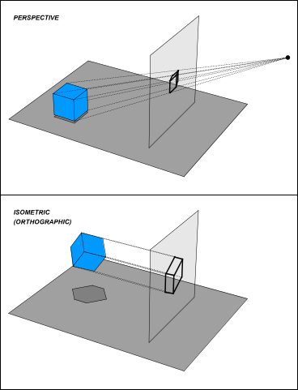
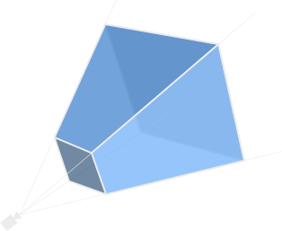

+++
title = "camera"
weight = 6
sort_by = "weight"
template = "book-section.html"
page_template = "book-section.html"
+++

<!-- Should this be in it's own section not nested under 3d or should the 2d section cover the Orthographic camera? -->

The first thing you will need if you want to render anything is a camera.

At it's core a camera is simply a 2d projection of the 3d scene. The most common type of projection used for 3d games is a perspective projection. Which is a projection that takes into account the distance between the camera and a vertex.

[](https://en.wikipedia.org/wiki/3D_projection#/media/File:Various_projections_of_cube_above_plane.svg)

In bevy just like most things in the engine a `Camera` is just a component. To simplify spawning a `Camera` with all the required components we can use a `PerspectiveCameraBundle`. This `Bundle` will spawn the camera and every other components required by bevy to render an image. If you prefer an orthographic projection you can use the `OrthographicCameraBundle`.

In the example at the beginning of the chapter we spawned a camera like this:

```rust
commands.spawn_bundle(PerspectiveCameraBundle {
    // This line spawns the camera at (-2.0, 2.5, 5.0) and rotates it
    // so that it looks at Vec3::ZERO, in other words it looks at the origin.
    transform: Transform::from_xyz(-2.0, 2.5, 5.0).looking_at(Vec3::ZERO, Vec3::Y),
    ..default()
});
```

## PerspectiveProjection

When spawning a `PerspectiveCameraBundle` it will spawn a `PerspectiveProjection` with default values.

```rust
struct PerspectiveProjection {
    // The field of view of the projection.
    pub fov: f32,
    // The aspect ratio, this is generally updated automatically based on the size of the window.
    pub aspect_ratio: f32,
    // The nearest part of the projection, anything that is in front of this plane will not be rendered by the camera.
    pub near: f32,
    // The farthest part of the projection, anything that is farther than this plane will not be rendered by the camera.
    pub far: f32,
}
```

## OrthographicProjection

<!-- TODO -->

```rust
struct OrthographicProjection {
    pub left: f32,
    pub right: f32,
    pub bottom: f32,
    pub top: f32,
    pub near: f32,
    pub far: f32,
    pub window_origin: WindowOrigin,
    pub scaling_mode: ScalingMode,
    pub scale: f32,
    pub depth_calculation: DepthCalculation,
}
```

## View Frustum and Frustum Culling

[](https://en.wikipedia.org/wiki/Viewing_frustum#/media/File:ViewFrustum.svg)
