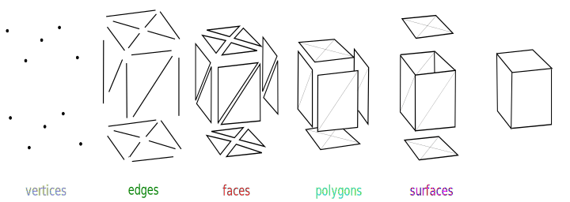

+++
title = "Shapes and meshes"
weight = 2
sort_by = "weight"
template = "book-section.html"
page_template = "book-section.html"
+++

Once you have a camera, the next thing you are probably going to want is to render some basic shapes on the screen.

## Built-in shapes

Currently bevy has these built-in shapes:

<!-- TODO: Maybe add a screenshot of a 3d scene with all shapes? -->

* Box: An axis-aligned box defined by its minimum and maximum point.
* Cube: A rectangle on the XY plane centered at the origin.
* Quad: A rectangle on the XY plane centered at the origin.
* Plane: A square on the XZ plane centered at the origin.
* Torus: A torus (donut) shape.
* Capsule: A cylinder with hemispheres at the top and bottom
* UV sphere: A sphere made of sectors and stacks.
* Icosphere: A sphere made from a subdivided Icosahedron.

There will eventually be more primitive shapes included with bevy, but this is what we have access to for now. Don't worry, you can easily add more shapes if you need to. In fact, this is exactly what we will do in the chapter on custom meshes.
<!-- TODO add link to custom mesh chaper -->

## PBR Bundle

We can use the `PbrBundle` to spawn the mesh of a shape that will be using all the pbr pipeline. This is how it looked in the example.

```rust
commands.spawn_bundle(PbrBundle {
    mesh: meshes.add(Mesh::from(shape::Cube { size: 1.0 })),
    material: materials.add(Color::rgb(0.8, 0.7, 0.6).into()),
    transform: Transform::from_xyz(0.0, 0.5, 0.0),
    ..default()
});
```

There's a few things here, first let's cover the mesh property.

### Mesh

When you want to render something, you first need a mesh which, in it's most basic form, is an array of points in 3d space that represents the points forming that shape. These points are called vertices.

[](https://en.wikipedia.org/wiki/Polygon_mesh#/media/File:Mesh_overview.svg)

```rust
// First, we define the shape we want. In this case it's just a cube with a size of 1.0.
let cube_shape = shape::Cube { size: 1.0 };
// We then need to create a `Mesh` from that shape definition
let cube_mesh = Mesh::from(cube_mesh)
// Finally, we need to add the mesh to the mesh asset collection
let mesh_handle = meshes.add(cube_mesh);
// This handle can then be used by the PbrBundle
```

If you want to spawn multiple cubes you can reuse the same mesh without needing to recreate it everytime.

```rust
// This will spawn 3 cubes of different color but all using the same mesh we defined earlier.

// Red cube
commands.spawn_bundle(PbrBundle {
    mesh: mesh_handle.clone_weak(),
    material: materials.add(Color::RED.into()),
    transform: Transform::from_xyz(0.0, 0.5, 0.0),
    ..default()
});
// Green cube
commands.spawn_bundle(PbrBundle {
    mesh: mesh_handle.clone_weak(),
    material: materials.add(Color::GREEN.into()),
    transform: Transform::from_xyz(0.0, 0.5, 0.0),
    ..default()
});
// Blue cube
commands.spawn_bundle(PbrBundle {
    mesh: mesh_handle.clone_weak(),
    material: materials.add(Color::BLUE.into()),
    transform: Transform::from_xyz(0.0, 0.5, 0.0),
    ..default()
});
```

### Material

<!-- TODO add link to chapter on Material and StandardMaterial.  -->

When spawning a `PbrBundle` we need to provide it a StandardMaterial. The easiest way to do that is to create one with a `Color`. We will cover this in more detail in a future chapter. The StandardMaterial let's you configure all the variables related to PBR. For now, we only want to give a color to our mesh.

```rust
// Create a StandardMaterial from a Color
let material = StandardMaterial::from(Color::RED);
// Add it to the StandardMaterial asset collection
let material_handle = materials.add(material);
// Then you can use the handle when spawning a cube
commands.spawn_bundle(PbrBundle {
    mesh: meshes.add(Mesh::from(shape::Cube { size: 1.0 })),
    material: material,
    transform: Transform::from_xyz(0.0, 0.5, 0.0),
    ..default()
});
```

The other examples used `materials.add(Color::RED.into())`, this is the exact same thing since the `StandardMaterial` implements the `From<Color>` trait.

Just like the mesh you can also reuse the material on multiple entity by using `clone_weak()`.

### Transform

The transform component is there to control the position and rotation in space for the mesh. In a later chapter we will cover in more details the difference between a local position and a world position and how the transform propagates through a hierarchy of parent/child meshes.

For now, you can simply use `Transform::from_xyz(x, y, z)` to spawn at a specific point.

### Visibility

When spawning a `PbrBundle` there's also a `Visibility` component that is added to the entity. This component let's you control if a mesh is visible or not.

First, we need to modify how we spawn the cube by adding a tag component.

```rust
// Use a tag component to make it easier to find the cube
#[derive(Component)]
struct CubeTag;

// Spawning the cube
commands
    .spawn_bundle(PbrBundle {
        mesh: meshes.add(Mesh::from(shape::Cube { size: 1.0 })),
        material: materials.add(Color::rgb(0.8, 0.7, 0.6).into()),
        transform: Transform::from_xyz(0.0, 0.5, 0.0),
        // This is the default value
        visibility: Visibility { is_visible: true },
        ..default()
    })
    // Make sure to add the tag
    .insert(CubeTag);
```

Then, we need to add a new system. It queries all cubes with the `CubeTag` component and toggles the visibility when you press space.

```rust
fn toggle_visiblity(
    keyboard_input: Res<Input<KeyCode>>,
    mut query: Query<&mut Visibility, With<CubeTag>>,
) {
    if keyboard_input.just_pressed(KeyCode::Space) {
        for mut visibility in query.iter_mut() {
            visibility.is_visible = !visibility.is_visible
        }
    }
}
```

Don't forget to add the system on the `App`

```rust
fn main() {
    App::new()
        .add_plugins(DefaultPlugins)
        .add_startup_system(setup)
        .add_system(toggle_visiblity)
        .run();
}
```

## Importing meshes

<!-- TODO -->