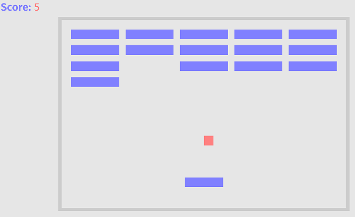
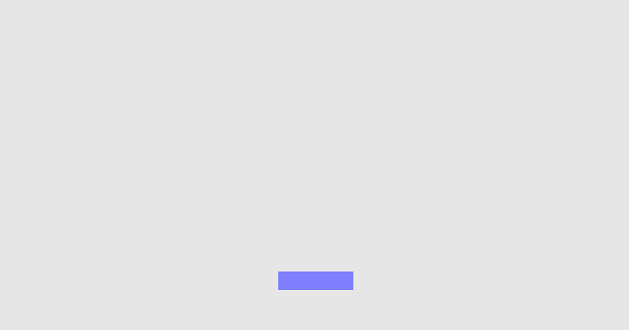
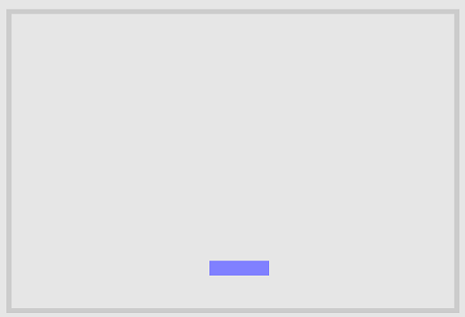
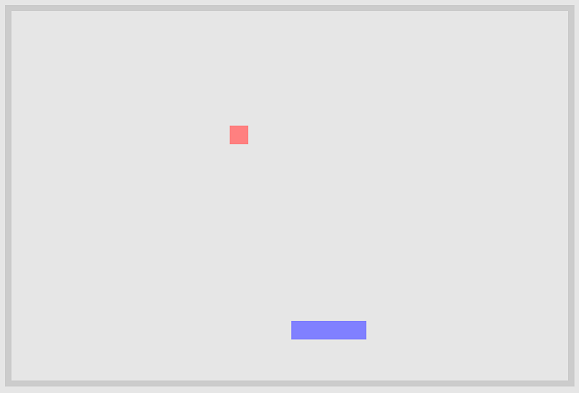
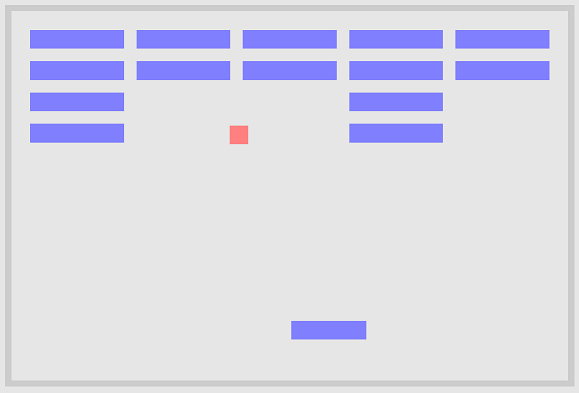

+++
title = "Your first game"
weight = 3
sort_by = "weight"
template = "book-section.html"
page_template = "book-section.html"
+++

Now that you know the basics of Bevy, let's build a simple game. Specifically, let's look at one of the examples that come with Bevy: Breakout.



In [Breakout](https://en.wikipedia.org/wiki/Breakout_(video_game)), a layer of bricks lines the top third of the screen and the goal is to destroy them all. A ball moves straight around the screen, bouncing off the top and two sides of the screen. When a brick is hit, the ball bounces back and the brick is destroyed.  The player has a horizontally movable paddle to bounce the ball upward, keeping it in play.

Here is a version of the game compiled to WebGL that you can play right away:  
[https://mrk.sed.pl/bevy-showcase/breakout.html](https://mrk.sed.pl/bevy-showcase/breakout.html)

You can take a look at the complete [source code of the game](https://github.com/bevyengine/bevy/blob/latest/examples/game/breakout.rs), but I suggest to follow along this tutorial first, since it will slowly build up to the example game one step at a time.

So what are the elements of the game ?

 * A paddle
 * A ball
 * Bricks
 * Walls
 * A score counter

Let's start with the paddle:

```rs
use bevy::{
    prelude::*,
    render::pass::ClearColor,
};

fn main() {
    App::build()
        .add_plugins(DefaultPlugins)
        .insert_resource(ClearColor(Color::rgb(0.9, 0.9, 0.9)))
        .add_startup_system(setup.system())
        .add_system(paddle_movement_system.system())
        .run();
}

struct Paddle {
    speed: f32,
}

enum Collider {
    Solid,
    Scorable,
    Paddle,
}

fn setup(
    commands: &mut Commands,
    mut materials: ResMut<Assets<ColorMaterial>>,
    asset_server: Res<AssetServer>,
) {
    commands
        // cameras
        .spawn(OrthographicCameraBundle::new_2d())
        .spawn(UiCameraBundle::default())
        // paddle
        .spawn(SpriteBundle {
            material: materials.add(Color::rgb(0.5, 0.5, 1.0).into()),
            transform: Transform::from_xyz(0.0, -215.0, 0.0),
            sprite: Sprite::new(Vec2::new(120.0, 30.0)),
            ..Default::default()
        })
        .with(Paddle { speed: 500.0 })
        .with(Collider::Paddle);
}

fn paddle_movement_system(
    time: Res<Time>,
    keyboard_input: Res<Input<KeyCode>>,
    mut query: Query<(&Paddle, &mut Transform)>,
) {
    for (paddle, mut transform) in query.iter_mut() {
        let mut direction = 0.0;
        if keyboard_input.pressed(KeyCode::Left) {
            direction -= 1.0;
        }

        if keyboard_input.pressed(KeyCode::Right) {
            direction += 1.0;
        }

        let translation = &mut transform.translation;
        // move the paddle horizontally
        translation.x += time.delta_seconds() * direction * paddle.speed;
        // bound the paddle
        translation.x = translation.x.min(380.0).max(-380.0);
    }
}

```

The code might be a lot to take in at first glance, but don't worry. We will take it one section at a time.

Before we do that however, let's see it in action!

Create a new folder and project on your hard drive using this command:

```bash
cargo new my_breakout_game
cd my_breakout_game
```
Edit `Cargo.toml` (found in the `my_breakout_game` folder you just created) to add a dependency on the latest version of Bevy as outlined in the [getting started guide](/learn/book/getting-started/).

```toml
[dependencies]
bevy = "0.5"

Then copy and paste the large piece of code above into the main.rs file in the my_breakout_game/src folder.

Finally execute this in your project folder:

```bash
cargo run
```
You will probably get 3 warnings. They are okay for now, we will have them fixed by the end of this tutorial.  

You should be able to move the paddle with your cursor keys and it should look like this:



Okay, so what is the code doing?

```rs
use bevy::{
    prelude::*,
    render::pass::ClearColor,
};
```
This brings the most common Bevy types and plugins into scope (those found in the `prelude` module), along with the `ClearColor` struct that we need.
`ClearColor` is a struct that contains the color we will use to clear the game's screen; it serves as the background color of our game.

```rs
fn main() {
    App::build()
        .add_plugins(DefaultPlugins)
        .insert_resource(ClearColor(Color::rgb(0.9, 0.9, 0.9)))
        .add_startup_system(setup.system())
        .add_system(paddle_movement_system.system())
        .run();
}
```
This is the main entry point into our program. This function will be called once the program is successfully compiled and executed.

[App::build()](https://docs.rs/bevy/latest/bevy/app/struct.App.html#impl) is a very simple function that just returns a new instance of [AppBuilder](https://docs.rs/bevy/latest/bevy/app/struct.AppBuilder.html)

As the other method calls suggest, the AppBuilder allows us to add plugins, (startup) systems and resources to our app.
Finally a call to run starts the game engine with all of the configured systems, plugins and resources.
Check the [Getting Started guide](/learn/book/getting-started/) for a refresher on the basics of these.

```rs
add_plugins(DefaultPlugins)
``` 
This call simply adds all the default plugins to the app.  
You can find a complete list of all of the default plugins in the source code on GitHub in the [default_plugins.rs](https://github.com/bevyengine/bevy/blob/latest/crates/bevy_internal/src/default_plugins.rs) file.

```rs
.insert_resource(ClearColor(Color::rgb(0.9, 0.9, 0.9)))
``` 
Here we insert a ClearColor resource, set to a light grey (rgb stands for the red, green and blue parts of the final color, and the values range between 0.0 for fully black and 1.0 for fully white).

```rs
.add_startup_system(setup.system())
``` 
Here we register our very own `setup` function as a startup system.
Startup systems are only called once and before any of the normal systems are called.
We will cover both of the systems we're adding in detail momentarily.

```rs
.add_system(paddle_movement_system.system())
``` 
Here we add our own `paddle_movement_system` function as a system.
Unlike startup systems, ordinary systems are automatically run once every frame.

```rs
.run();
``` 
Finally we tell the Bevy game engine to start with a call to run.  
If you're curious about the details of how the `run` function works its magic, you can follow the source code trail that begins in [app.rs](https://github.com/bevyengine/bevy/blob/latest/crates/bevy_app/src/app.rs).

## Let's take a look at that setup function.

```rs
struct Paddle {
    speed: f32,
}

enum Collider {
    Solid,
    Scorable,
    Paddle,
}

fn setup(
    commands: &mut Commands,
    mut materials: ResMut<Assets<ColorMaterial>>,
    asset_server: Res<AssetServer>,
) {
    commands
        // cameras
        .spawn(OrthographicCameraBundle::new_2d())
        .spawn(UiCameraBundle::default())
        // paddle
        .spawn(SpriteBundle {
            material: materials.add(Color::rgb(0.5, 0.5, 1.0).into()),
            transform: Transform::from_xyz(0.0, -215.0, 0.0),
            sprite: Sprite::new(Vec2::new(120.0, 30.0)),
            ..Default::default()
        })
        .with(Paddle { speed: 500.0 })
        .with(Collider::Paddle);
}
``` 
`struct Paddle` is a struct with one float field called speed.  
`enum Collider` is an enumeration with three fields. We will use it to declare the type of collisions the ball can hit.

Next our setup function expects three arguments:  
 * a reference to a [`Commands`](https://docs.rs/bevy_ecs/latest/bevy_ecs/struct.Commands.html) struct.
 * an instance of a collection of ColorMaterials.
 * an instance of AssetServer.

The `Commands` struct can be used to spawn `Bundles` and to add `Components`.  
Material is used to paint 2D or 3D objects on screen and `ColorMaterial` is the simplest Material as it only supports a single color as oposed to, for example, textures.  
The AssetServer will be used in the last section of this tutorial to load the font we will use to display the game score.

Inside the function (that is only run once, since it's a startup system) we then use the `Commands` struct
to spawn (or in another word, add) a couple of Bundles. Namely we spawn an orthographic and a separate UI camera.
This is done because it is usually easier to render the UI using a different camera then the one the game objects are using.  
This becomes especially clear when you think of combining a 3D game using a perspective camera and a UI.  
The requirements for a UI and a 3D scene camera are so different, that is becomes easier to simply and completely separate them out.  
Next we spawn a sprite to represent our paddle. A sprite is usually a simple little graphical 2D object, like a tree or a player character (like [2D Mario](https://i.imgur.com/ZqL6DG5h.jpg) for example).  
```rs
material: materials.add(Color::rgb(0.5, 0.5, 1.0).into()),
transform: Transform::from_xyz(0.0, -215.0, 0.0),
```
Here we define this sprite to have a color that is light blue and to sit -215 pixels downwards from the center of the play area.

```rs
sprite: Sprite::new(Vec2::new(120.0, 30.0)),
```
Here we define this sprite to be 120 pixels wide and 30 pixels tall.

```rs
..Default::default()
```
Then we just tell Rust to give the rest of the SpriteBundle fields their appropriate [default values](https://doc.rust-lang.org/std/default/trait.Default.html).

```rs
.with(Paddle { speed: 500.0 })
.with(Collider::Paddle);
```
Next we add a our Paddle as a `Component` that can be used in `Queries`. We will look at a `Query` in the next section.
Finally we add a Component of type Collider::Paddle to this entity so the ball can later bounce off of it.


## Let's take a look at the paddle_movement_system.

```rs
fn paddle_movement_system(
    time: Res<Time>,
    keyboard_input: Res<Input<KeyCode>>,
    mut query: Query<(&Paddle, &mut Transform)>,
) {
    for (paddle, mut transform) in query.iter_mut() {
        let mut direction = 0.0;
        if keyboard_input.pressed(KeyCode::Left) {
            direction -= 1.0;
        }

        if keyboard_input.pressed(KeyCode::Right) {
            direction += 1.0;
        }

        let translation = &mut transform.translation;
        // move the paddle horizontally
        translation.x += time.delta_seconds() * direction * paddle.speed;
        // bound the paddle
        translation.x = translation.x.min(380.0).max(-380.0);
    }
}
```
The paddle_movement_system function expects three arguments:  
 * an instance of the default [Time](https://docs.rs/bevy_core/latest/bevy_core/struct.Time.html) resource.
 * an instance of the default [Input](https://docs.rs/bevy_input/latest/bevy_input/struct.Input.html)<KeyCode> resource under the name keyboard_input.
 * an instance of a Query that references our Paddle and its [Transform](https://docs.rs/bevy/latest/bevy/prelude/struct.Transform.html).

The Time struct contains the following helpful [information](https://github.com/bevyengine/bevy/blob/latest/crates/bevy_core/src/time/time.rs):

```rs
pub struct Time {
    delta: Duration,
    last_update: Option<Instant>,
    delta_seconds_f64: f64,
    delta_seconds: f32,
    seconds_since_startup: f64,
    startup: Instant,
}
```
Inside the function, that is called every frame, we iterate over all `Components` in our scene that match the type Paddle.  
Then we check if the left or right cursor key is pressed and we set the direction variable accordingly.  
Finally we access the translation (a fancy word for position) field of the `Transform` instance and use it to change the horizontal (x) paddle position on the playing field.  
As done here, it is good practice to scale the amount of work that systems do by `time.delta_seconds()`. This makes sure that the behavior of the paddle is independent of the frame rate.
We also have to make sure that the paddle doesn't move off of the screen. So we limit the center of the paddle to be within 380 pixels to the right and left of the center of the screen.

## Next let's add some walls.

```rs
    let wall_material = materials.add(Color::rgb(0.8, 0.8, 0.8).into());
    let wall_thickness = 10.0;
    let bounds = Vec2::new(900.0, 600.0);

    commands
        // left
        .spawn(SpriteBundle {
            material: wall_material.clone(),
            transform: Transform::from_xyz(-bounds.x / 2.0, 0.0, 0.0),
            sprite: Sprite::new(Vec2::new(wall_thickness, bounds.y + wall_thickness)),
            ..Default::default()
        })
        .with(Collider::Solid)
        // right
        .spawn(SpriteBundle {
            material: wall_material.clone(),
            transform: Transform::from_xyz(bounds.x / 2.0, 0.0, 0.0),
            sprite: Sprite::new(Vec2::new(wall_thickness, bounds.y + wall_thickness)),
            ..Default::default()
        })
        .with(Collider::Solid)
        // bottom
        .spawn(SpriteBundle {
            material: wall_material.clone(),
            transform: Transform::from_xyz(0.0, -bounds.y / 2.0, 0.0),
            sprite: Sprite::new(Vec2::new(bounds.x + wall_thickness, wall_thickness)),
            ..Default::default()
        })
        .with(Collider::Solid)
        // top
        .spawn(SpriteBundle {
            material: wall_material,
            transform: Transform::from_xyz(0.0, bounds.y / 2.0, 0.0),
            sprite: Sprite::new(Vec2::new(bounds.x + wall_thickness, wall_thickness)),
            ..Default::default()
        })
        .with(Collider::Solid);
```
Add this code to the inside of the startup function, just before it ends and run the program with `cargo run`.
You should now see walls inside of your game just like this:



With all that we have learned so far, it should be pretty obvious what the code above does. But let's go over some interesting details.
You might have noticed that except for the last wall, every other wall has received a clone of the wall_material.
Why is that necessary?  
Well, the reason is twofold: it is usually good practice to give every object in a game its own material. Otherwise it can happen, that you change the color on one object and suddenly you
have changed the color on all objects that share the same material. This is usually not what you want. Secondly, Rust's ownership rules want a single material owner per `SpriteBundle` instance.
So in this case we can solve both requirements with a simple call to ```wall_material.clone()```.

## Next let's add the Ball. This is where the fun starts :-)

First add this line to our use section at the top:
```rs
sprite::collide_aabb::{collide, Collision},
```
So it looks like this:
```rs
use bevy::{
    prelude::*,
    render::pass::ClearColor,
    sprite::collide_aabb::{collide, Collision},
};
```
This line adds a couple of cool functions that allows us to detect collsions between our ball and the other objects in our game.

Next add these two lines into the middle of our main function at the top:
```rs
        .add_system(ball_collision_system.system())
        .add_system(ball_movement_system.system())
```
so it looks like this:
```rs
        .add_system(paddle_movement_system.system())
        .add_system(ball_collision_system.system())
        .add_system(ball_movement_system.system())
        .run();
```

Next add a struct that represents our ball right after the Paddle struct:
```rs
struct Ball {
    velocity: Vec3,
}
```
[Vec3](https://docs.rs/glam/latest/glam/f32/struct.Vec3.html) is a struct that contains three float fields: x,y and z.  
It is part of the [glam](https://docs.rs/glam/latest/glam/) Rust crate which is a simple and fast linear algebra library for games and graphics.

Add the following code to our setup function, just before we add our walls:
```rs
        commands.spawn(SpriteBundle {
            material: materials.add(Color::rgb(1.0, 0.5, 0.5).into()),
            transform: Transform::from_xyz(0.0, -50.0, 1.0),
            sprite: Sprite::new(Vec2::new(30.0, 30.0)),
            ..Default::default()
        })
        .with(Ball {
            velocity: 400.0 * Vec3::new(0.5, -0.5, 0.0).normalize(),
        });
```
This code should look very familiar by now. ;-)
`normalize()` simply sets the magnitude of the direction vector to 1, allowing us to freely change its direction without worrying about how it will impact our ball's speed.

Add the following two functions to the end of `main.rs`:

```rs
fn ball_movement_system(time: Res<Time>, mut ball_query: Query<(&Ball, &mut Transform)>) {
    let delta_seconds = f32::min(0.2, time.delta_seconds());
    for (ball, mut transform) in ball_query.iter_mut() {
        transform.translation += ball.velocity * delta_seconds;
    }
}
fn ball_collision_system(
    commands: &mut Commands,
    //mut scoreboard: ResMut<Scoreboard>,
    mut ball_query: Query<(&mut Ball, &Transform, &Sprite)>,
    collider_query: Query<(Entity, &Collider, &Transform, &Sprite)>,
) {
    for (mut ball, ball_transform, sprite) in ball_query.iter_mut() {
        let ball_size = sprite.size;
        let velocity = &mut ball.velocity;
        for (collider_entity, collider, transform, sprite) in collider_query.iter() {
            let collision = collide(
                ball_transform.translation,
                ball_size,
                transform.translation,
                sprite.size,
            );
            if let Some(collision) = collision {
                if let Collider::Scorable = *collider {
                    //scoreboard.score += 1;
                    commands.despawn(collider_entity);
                }
                let mut reflect_x = false;
                let mut reflect_y = false;
                match collision {
                    Collision::Left => reflect_x = velocity.x > 0.0,
                    Collision::Right => reflect_x = velocity.x < 0.0,
                    Collision::Top => reflect_y = velocity.y < 0.0,
                    Collision::Bottom => reflect_y = velocity.y > 0.0,
                }
                if reflect_x {
                    velocity.x = -velocity.x;
                }
                if reflect_y {
                    velocity.y = -velocity.y;
                }
                if let Collider::Solid = *collider {
                    break;
                }
            }
        }
    }
}

```

Let's run it with `cargo run`and see what happens. 

It should look like this:



Okay, so what's happening inside the two functions we just added?

```rs
fn ball_movement_system(time: Res<Time>, mut ball_query: Query<(&Ball, &mut Transform)>) {
    let delta_seconds = f32::min(0.2, time.delta_seconds());
    for (ball, mut transform) in ball_query.iter_mut() {
        transform.translation += ball.velocity * delta_seconds;
    }
}
```
This function is turned into a system in our setup function and is called every frame.  
The first line makes sure that the delta time can never be more than 0.2 seconds.  
This can happen at the beginning of a game, after some potentially slow loading resources are read from disk.
Without this line, the ball could potentially "teleport" outside of our game.  

Next we iterate over all instances of type `Ball` in our game using the familiar `Query` pattern
and we change the translation (position) using the ball's velocity combined with the delta_seconds.  
Again we are using `delta_seconds` in order to make the game independent of its framerate.


```rs
fn ball_collision_system(
    commands: &mut Commands,
    //mut scoreboard: ResMut<Scoreboard>,
    mut ball_query: Query<(&mut Ball, &Transform, &Sprite)>,
    collider_query: Query<(Entity, &Collider, &Transform, &Sprite)>,
) {
```
The second function, `ball_collision_system` takes four arguments:
 * A reference to the Commands instance. We can use it not only to add but also to remove entities. This will become very handy when we add the bricks in the next step.
 * A commented out instance of our scoreboard. We will need this in the last step of this tutorial.
 * An instance of a Query that references our Ball and its [Transform](https://docs.rs/bevy/latest/bevy/prelude/struct.Transform.html) and `Sprite`.
 * An instance of a Query that references all collidable Entities and its [Transform](https://docs.rs/bevy/latest/bevy/prelude/struct.Transform.html), `Collider` and `Sprite`.
 
I won't copy the complete code of the function body here again, since the code is easy enough to understand.
Basically the code iterates over all balls (of course the game only has one, but this is the way to get it) and then it iterates over all collidable objects.
The Query object is magic and only returns entities that contain ALL of the elements in the type list.  
Then the code uses the handy `collide` function we imported at the top of main.rs to check for any collisions.
If we have a collision, we check if it was with a scorable entity (a brick).  
If that is the case, we despawn (remove) the entity from the game and increment the score by one.  
(Since we don't have a scoreboard yet, the line to increment the score is commented out for now.)  
Then we use some basic math to implement the reflection of the ball and finally we break the loop if we hit a wall.

## Next let's add the Bricks.

Okay, we are almost done! Only two easy steps remain. The first step that remains is adding the bricks. The last step will be to add the scoreboard. Let's go!

Just before our `setup` function ends, add these lines:

```rs
    let brick_rows = 4;
    let brick_columns = 5;
    let brick_spacing = 20.0;
    let brick_size = Vec2::new(150.0, 30.0);
    let bricks_width = brick_columns as f32 * (brick_size.x + brick_spacing) - brick_spacing;
    // center the bricks and move them up a bit
    let bricks_offset = Vec3::new(-(bricks_width - brick_size.x) / 2.0, 100.0, 0.0);
    let brick_material = materials.add(Color::rgb(0.5, 0.5, 1.0).into());
    for row in 0..brick_rows {
        let y_position = row as f32 * (brick_size.y + brick_spacing);
        for column in 0..brick_columns {
            let brick_position = Vec3::new(
                column as f32 * (brick_size.x + brick_spacing),
                y_position,
                0.0,
            ) + bricks_offset;
            commands
                .spawn(SpriteBundle {
                    material: brick_material.clone(),
                    sprite: Sprite::new(brick_size),
                    transform: Transform::from_translation(brick_position),
                    ..Default::default()
                })
                .with(Collider::Scorable);
        }
    }
```
Not much explanation needed I think, it is all just basic math. Do note however that we give all bricks a `Component` of type Collider::Scorable.
In other words, we set the bricks to be colliders with the type `Scorable` from our `Collider` enum at the top of main.rs.  
If you rememeber, we use this in the `ball_collision_system` to check if we need to increment the score board.  

Execute the game with `cargo run` and it should look something like this:



## We are on the homestretch. Let's add the score and then we are done!

Next add these two lines to the main function:
```rs
        .insert_resource(Scoreboard { score: 0 })
        .add_system(scoreboard_system.system())
```
so it looks like this:
```rs
        .add_system(ball_movement_system.system())
        .insert_resource(Scoreboard { score: 0 })
        .add_system(scoreboard_system.system())
        .run();
```
Next add a struct that represents our score right after the `Ball` struct:
```rs
struct Scoreboard {
    score: usize,
}
```
[usize](https://doc.rust-lang.org/std/primitive.usize.html) is a basic unsigned Rust type and represents how many bytes it takes to reference a location in memory.
This type probably is overkill in our usecase, but it doesn't hurt either.

Add the following lines just before the end to our setup function:

```rs
        commands.spawn(TextBundle {
            text: Text {
                sections: vec![
                    TextSection {
                        value: "Score: ".to_string(),
                        style: TextStyle {
                            font: asset_server.load("fonts/FiraSans-Bold.ttf"),
                            font_size: 40.0,
                            color: Color::rgb(0.5, 0.5, 1.0),
                        },
                    },
                    TextSection {
                        value: "".to_string(),
                        style: TextStyle {
                            font: asset_server.load("fonts/FiraMono-Medium.ttf"),
                            font_size: 40.0,
                            color: Color::rgb(1.0, 0.5, 0.5),
                        },
                    },
                ],
                ..Default::default()
            },
            style: Style {
                position_type: PositionType::Absolute,
                position: Rect {
                    top: Val::Px(5.0),
                    left: Val::Px(5.0),
                    ..Default::default()
                },
                ..Default::default()
            },
            ..Default::default()
        });
```
This looks different than what we had before, so let's go over it.  
Here we are spawning a [`TextBundle`](https://docs.rs/bevy/latest/bevy/ui/entity/struct.TextBundle.html).

A `TextBundle` contains many useful fields:

```rs
pub struct TextBundle {
    pub node: Node,
    pub style: Style,
    pub draw: Draw,
    pub visible: Visible,
    pub text: Text,
    pub calculated_size: CalculatedSize,
    pub focus_policy: FocusPolicy,
    pub transform: Transform,
    pub global_transform: GlobalTransform,
}
```
In our case we set the text field to be two `TextSections`.
We do this so we can change the score number independently from the label in front of it.
And all of the `..Default::default()` calls just make sure that the rest of the respective struct fields will get sensible values.

Next we add a scoreboard system function:

```rs
fn scoreboard_system(scoreboard: Res<Scoreboard>, mut query: Query<&mut Text>) {
    for mut text in query.iter_mut() {
        text.sections[1].value = scoreboard.score.to_string();
    }
}
```
Add this right in front of the `ball_collision_system`.  

This system function asks the Bevy game engine for the resource of type `Scoreboard` that we added in the setup function.
It also asks the Bevy game engine for a Query object that is able to iterate over all Text instances in our game.
We only have one entity with a `Text` component of course, but it contains our two text sections.
Inside the function we then access the second section, the one that represents our score number, and we set it to the current score from our scoreboard instance.

Next we have to uncomment the two lines inside `ball_collision_system` that were temporarily commented out.
The two lines where: 
```rs
//mut scoreboard: ResMut<Scoreboard>,
```
and
```rs
//scoreboard.score += 1;
```
Find those two lines and remove the double slashes at the beginning.

Finally we have to copy the two font files from Bevy to our project.
The two font files are located in bevy/assets/fonts.
You can also download them from here: [bevy/tree/main/assets/fonts](https://github.com/bevyengine/bevy/tree/latest/assets/fonts)

Create the folder structure assets/fonts in your my_breakout_game project folder and copy the two font files into my_breakout_game/assets/fonts.

Done!
You successfully recreated the Breakout game from the Bevy examples.

Let's play a round, shall we?

Execute `cargo run` and have some fun.  
You earned it!
