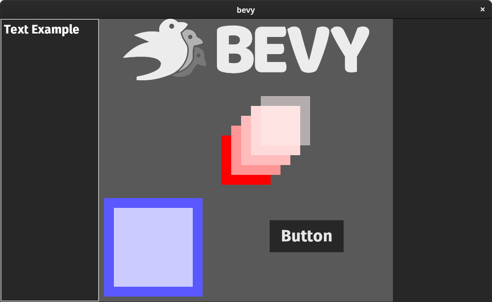
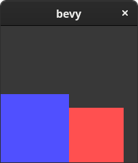
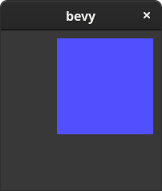
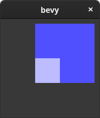
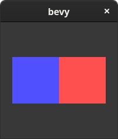
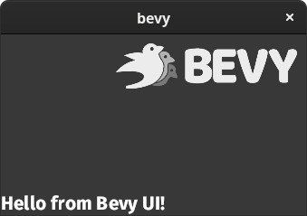
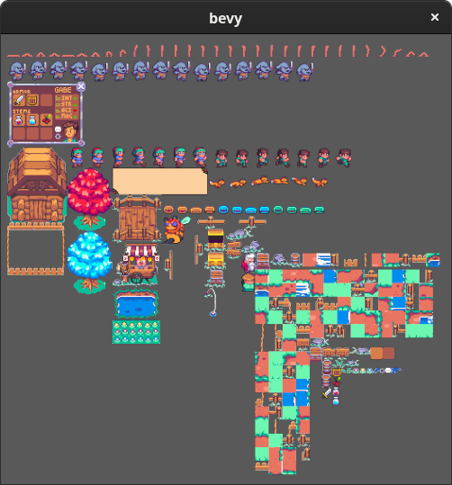
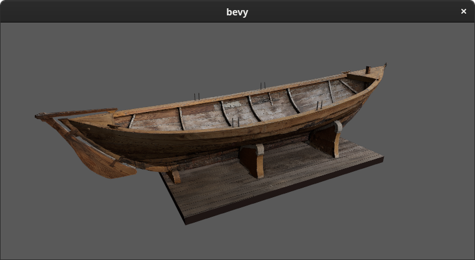
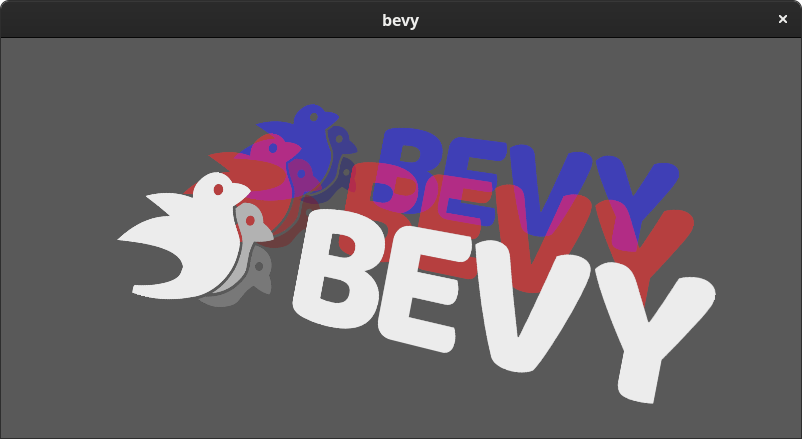
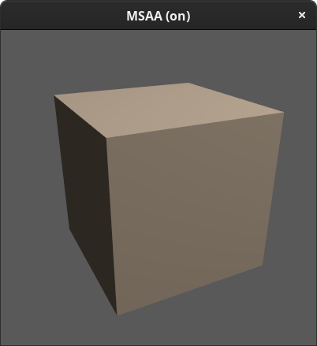

+++
title = "Introducing Bevy 0.1"
date = 2020-08-10
[extra]
author = "Carter Anderson"
twitter = "cart_cart"
github = "cart"
youtube = "cartdev"
+++

<video controls loop><source  src="hot_reloading.mp4" type="video/mp4"/></video>

After months of work, I am ecstatic to finally announce **Bevy Engine**!

Bevy is a refreshingly simple data-driven game engine and app framework built in Rust. It is [free and open-source](https://github.com/bevyengine/bevy) forever!

<!-- more -->

It has the following design goals:

* <b class="fun-list">Capable</b>: Offer a complete 2D and 3D feature set
* <b class="fun-list">Simple</b>: Easy for newbies to pick up, but infinitely flexible for power users
* <b class="fun-list">Data Focused</b>: Data-oriented architecture using the Entity Component System paradigm 
* <b class="fun-list">Modular</b>: Use only what you need. Replace what you don't like
* <b class="fun-list">Fast</b>: App logic should run quickly, and when possible, in parallel
* <b class="fun-list">Productive</b>: Changes should compile quickly ... waiting isn't fun

Bevy has a number of features that I think set it apart from other engines:

* <b class="fun-list">Bevy ECS</b>: A custom Entity Component System with unrivaled usability and blisteringly-fast performance
* <b class="fun-list">Render Graphs</b>: Easily build your own multi-threaded render pipelines using Render Graph nodes
* <b class="fun-list">Bevy UI</b>: A custom ECS-driven UI framework built specifically for Bevy
* <b class="fun-list">Productive Compile Times</b>: Expect changes to compile in ~0.8-3.0 seconds with the "fast compiles" config

It also has many features most people expect from a modern, general purpose engine:
* <b class="fun-list">Cross Platform</b>: Windows, MacOS, and Linux (with planned support for mobile and web)
* <b class="fun-list">3D</b>: Lights, meshes, textures, MSAA, and GLTF loading
* <b class="fun-list">Sprites</b>: Render individual images as sprites, render from sprite sheets, and dynamically generate new sprite sheets
* <b class="fun-list">Assets</b>: An extensible, event driven asset system that loads assets asynchronously in background threads
* <b class="fun-list">Scenes</b>: Save ECS Worlds to human-readable scene files and load scene files into ECS Worlds
* <b class="fun-list">Plugins</b>: All engine and app features are implemented as modular plugins
* <b class="fun-list">Sound</b>: Load audio files as assets and play them from within systems
* <b class="fun-list">Multiple Render Backends</b>: Vulkan, DirectX 12, and Metal (with more on the way thanks to [wgpu](https://github.com/gfx-rs/wgpu))
* <b class="fun-list">Data Driven Shaders</b>: Easily bind ECS components directly to shader uniforms
* <b class="fun-list">Hot Asset Reloading</b>: Automatically reload changes to assets at runtime without recompiles or restarts
* <b class="fun-list">Events</b>: Efficiently consume and produce Events from within ECS systems
* <b class="fun-list">Properties</b>: Dynamically get and set component fields using a string version of their names
* <b class="fun-list">Hierarchical Transforms</b>: Create parent-child relationships between entities that propagate Transforms down the hierarchy 

That being said, Bevy is still in the very early stages. I consider it to be in the "prototyping" phase: features are missing, APIs will change, and documentation is sparse. <span class="warning">I don't yet recommend using Bevy in serious projects unless you are willing to deal with gaps and instability</span>.


Hopefully at this point you are either (1) jazzed about Bevy or (2) not reading anymore. If you want to dive in right now, [The Bevy Book](https://bevyengine.org/learn/book/introduction/) is the best place to get started. You can also keep reading to find out what the current state of Bevy is and where we'd like to take it.

**Quick note to the reader**: in this article you will find text formatted like this: {{rust_type(type="struct" crate="bevy_render" version="0.1.0" mod="texture" name="Texture" no_mod=true)}}

This formatting indicates that the text is a Rust type that links to API documentation. I encourage you to click on anything that seems interesting to you!
 

## Bevy Apps

First, lets see what a Bevy App actually looks like. The simplest App looks like this:

```rs
use bevy::prelude::*;

fn main() {
    App::build().run();
}
```

Thats it! This App pulls in no features and literally does nothing. Running the program would just immediately terminate. We can make it a little more interesting by doing this:

```rs
fn main() {
    App::build()
        .add_default_plugins()
        .run();
}
```

{{rust_type(type="trait", crate="bevy" version="0.1.0" name="AddDefaultPlugins" method="add_default_plugins" no_mod=true no_struct=true)}} adds all of the features you probably expect from a game engine: a 2D / 3D renderer, asset loading, a UI system, windows, input, etc

You can also register the default {{rust_type(type="trait" name="Plugin" crate="bevy_app" version="0.1.0" plural=true)}} manually like this:

```rs
fn main() {
    App::build()
        .add_plugin(CorePlugin::default())
        .add_plugin(InputPlugin::default())
        .add_plugin(WindowPlugin::default())
        .add_plugin(RenderPlugin::default())
        .add_plugin(UiPlugin::default())
        /* more plugins here ... omitted for brevity */
        .run();
}
```

And of course you can also create your own plugins. In fact, all engine and game logic is built using plugins. Hopefully now you understand what we mean by modular: you are free to add/remove plugins based on your project's unique needs. However I expect that most people will stick to {{rust_type(type="trait" crate="bevy" version="0.1.0" name="AddDefaultPlugins" method="add_default_plugins" no_mod=true no_struct=true)}} for simplicity, at least initially.

## Bevy ECS

All Bevy engine and game logic is built on top of a custom [Entity Component System](https://en.wikipedia.org/wiki/Entity_component_system) (or ECS for short). Entity Component Systems are a software paradigm that involves breaking data up into Components. Entities are unique ids assigned to groups of Components. For example, one entity might might have a `Position` and `Velocity` component, whereas another entity might have a `Position` and `UI` component. Systems are logic that runs on a specific set of component types. You might have a `movement` system that runs on all entities with a `Position` and `Velocity` component.

The ECS pattern encourages clean, decoupled designs by forcing you to break up your app data and logic into its core components.

Unlike other Rust ECS implementations, which require complex lifetimes, traits, builder patterns, or macros, Bevy ECS uses normal Rust datatypes for all of these concepts:
* <b class="fun-list">Components</b>: normal Rust structs
* <b class="fun-list">Systems</b>: normal Rust functions
* <b class="fun-list">Entities</b>: a type containing a unique integer  

There are already plenty of [great introductions](https://www.youtube.com/watch?v=2rW7ALyHaas) to the ECS paradigm, so I'll leave "getting up to speed on ECS" as an exercise for the reader and skip right to what makes Bevy's ECS so special:

### Ergonomics

I'm going to make a wild (and unverifiable) claim here: Bevy ECS is the most ergonomic ECS _in existence_:

```rs
use bevy::prelude::*;

struct Velocity(f32);
struct Position(f32);

// this system spawns entities with the Position and Velocity components
fn setup(mut commands: Commands) {
    commands
        .spawn((Position(0.0), Velocity(1.0),))
        .spawn((Position(1.0), Velocity(2.0),));
}

// this system runs on each entity with a Position and Velocity component
fn movement(mut position: Mut<Position>, velocity: &Velocity) {
    position.0 += velocity.0;
}

// the app entry point. hopefully you recognize it from the examples above!
fn main() {
    App::build()
        .add_default_plugins()
        .add_startup_system(setup.system())
        .add_system(movement.system())
        .run();
}
```

That is a complete self-contained Bevy app with automatic parallel system scheduling and global change detection. In my opinion, you [won't](https://github.com/amethyst/specs/blob/master/examples/basic.rs) find [any](https://github.com/TomGillen/legion) ECS [with](https://github.com/leudz/shipyard/blob/master/bunny_demo/src/systems.rs) better [clarity](https://github.com/Unity-Technologies/EntityComponentSystemSamples/tree/master/ECSSamples/Assets/HelloCube) or ergonomics. Building games (and engines) involves writing a large number of systems, so I heavily invested in making ECS code easy to write _and_ easy to read.

### Performance

One of the reasons the ECS paradigm is so popular is that it has the potential to make game logic _super_ fast, primarily for these two reasons:
1. <b class="fun-list">Iteration Speed</b>: Components are packed tightly together to optimize for cache-locality, which makes iterating over them blazing fast
2. <b class="fun-list">Parallelism</b>: Systems declare read/write dependencies, which enables automatic and efficient lock-free parallel scheduling

Bevy ECS does both of these things about as well as it can. According to the popular `ecs_bench` benchmark, Bevy ECS is the fastest Rust ECS by a pretty wide margin:

#### System Iteration (in nanoseconds, less is better)


#### World Setup (in nanoseconds, less is better)


Note that `ecs_bench` is a single threaded benchmark, so it doesn't illustrate the multi-threading capabilities of these framework. And as always, please be aware that `ecs_bench` is a micro benchmark and it doesn't illustrate the performance of a complex game. There is a lot of nuance in the ECS performance space and each of the ECS implementations above will perform differently under different workloads. 

I have pushed my version of `ecs_bench` [here](https://github.com/cart/ecs_bench) if anyone wants to double-check my methodology. For some reasonable amount of time I will post updates here if anyone reports a problem or my results are not (on average) reproducible.

### Features

Now you might be thinking "Ok @cart, so Bevy ECS has great performance and ergonomics, but _surely_ this means you had to compromise on features!"

... **NOPE** Bevy has you covered:

#### For Each Systems

```rs
// "for each systems" run once on each entity containing the given components
fn system(position: Mut<Position>, velocity: &Velocity) {
    // do something
}
```

#### Query Systems

```rs
// this "query system" is the same as the system above, but gives you control over iteration
fn system(mut query: Query<(&Position, &mut Velocity)>) {
    for (position, mut velocity) in &mut query.iter() {
        // do something
    }
}
```

#### Change Detection
```rs
// Added<T> queries only run when the given component has been added
fn system(mut query: Query<Added<Position>>) {
    for position in &mut query.iter() {
        // do something
    }
}

// Mutated<T> queries only run when the given component has been mutated
fn system(mut query: Query<Mutated<Position>>) {
    for position in &mut query.iter() {
        // do something
    }
}

// Changed<T> queries only run when the given component has been added or mutated
fn system(mut query: Query<Changed<Position>>) {
    for position in &mut query.iter() {
        // do something
    }
}

// query.removed<T>() will iterate over every entity where the component T was removed this update
fn system(mut query: Query<&Position>>) {
    for entity in query.removed::<Velocity>() {
        // do something
    }
}
```

#### Multiple Queries
```rs
fn system(mut wall_query: Query<&Wall>, mut player_query: Query<&Player>) {
    for player in &mut player_query.iter() {
        for wall in &mut wall_query.iter() {
            if player.collides_with(wall) {
                println!("ouch");
            }
        }
    }
}
```

#### Entity Queries and Direct Component Access
```rs
fn system(mut entity_query: Query<Entity>, mut player_query: Query<&Player>) {
    for entity in &mut entity_query.iter() {
       if let Some(player) = player_query.get::<Player>(entity) {
           // the current entity has a player component
       }
    }
}
```

#### Resources
```rs
// Res and ResMut access global resources 
fn system(time: Res<Time>, score: ResMut<Score>) {
    // do something
}

// you can use Resources in any system type
fn system(time: Res<Time>, mut query: Query<&Position>) {
    // do something
}
fn system(time: Res<Time>, &Position) {
    // do something
}
```

#### "Local" System Resources
```rs
// Local<T> resources are unique per-system. Two instances of the same system will each have their own resource. Local resources are automatically initialized to their default value.
fn system(state: Local<State>, &Position) {
    // do something
}
```

#### Empty Systems
```rs
// for the hyper-minimalists
fn system() {
    // do something
}
```

#### With/Without Filters
```rs
// only runs on entities With or Without a given component
fn system(mut query: Query<Without<Parent, &Position>>) {
    for position in &mut query.iter() {
        // do something
    }
}
```

#### Thread-Local Systems
```rs
// systems that must run on the main thread with exclusive access to World and Resources
fn system(world: &mut World, resources: &mut Resources) {
    // do something
}
```

#### Stages
```rs
// the scheduler provides Stages as a way to run sets of systems in order  
fn main() {
    App::build()
        // adds a system to the default stage: "update" 
        .add_system(movement.system())
        // creates a new stage after "update"
        .add_stage_after("update", "do_things")
        .add_system_to_stage("do_things", something.system())
}
```

#### Commands
```rs
// use Commands to queue up World and Resource changes, which will be applied at the end of the current Stage
fn system(mut commands: Commands) {
    commands.spawn((Position(0.0), Velocity(1.0)));
}

// Commands can also be used alongside other types
fn system(mut commands: Commands, time: Res<Time>, mut query: Query<&Position>) {
    // do something
}
```

### How Do Function Systems Work?

Being able to use Rust functions directly as systems might feel like magic, but I promise it's not! You may have noticed that we do this when registering systems in our App:

```rs
fn some_system() { }

fn main() {
    App::build()
        .add_system(some_system.system())
        .run();
}
```

The `.system()` call takes the `some_system` function pointer and converts it to a `Box<dyn System>`. This works because we implement the {{rust_type(type="trait" crate="bevy_ecs" version="0.1.0" name="IntoQuerySystem")}} trait for all functions that match a certain set of function signatures.


### Good Bones

Bevy ECS actually uses a heavily forked version of the minimalist [Hecs ECS](https://github.com/Ralith/hecs). Hecs is an efficient single-threaded archetypal ECS. It provides the core {{rust_type(type="struct" crate="bevy_ecs" version="0.1.0" name="World")}}, {{rust_type(type="struct" crate="bevy_ecs" version="0.1.0" name="Archetype")}}, and internal {{rust_type(type="trait" crate="bevy_ecs" version="0.1.0" name="Query")}} data structures. Bevy ECS adds the following on top:

* <b class="fun-list">Function Systems</b>: Hecs actually has no concept of a "system" at all. You just run queries directly on the World. Bevy adds the ability to define portable, schedulable systems using normal Rust functions.
* <b class="fun-list">Resources</b>: Hecs has no concept of unique/global data. When building games, this is often needed. Bevy adds a `Resource` collection and resource queries
* <b class="fun-list">Parallel Scheduler</b>: Hecs is single threaded, but it was designed to allow parallel schedulers to be built on top. Bevy ECS adds a custom dependency-aware scheduler that builds on top of the "Function Systems" mentioned above.
* <b class="fun-list">Optimization</b>: Hecs is already plenty fast, but by modifying some of its internal data access patterns, we were able to improve performance significantly. This moved it from "fast enough" to "the fastest" (see the benchmark above to compare Bevy ECS to vanilla Hecs).
* <b class="fun-list">Query Wrappers</b>: The `Query` Bevy ECS exports is actually a wrapper around Hecs Queries. It provides safe, scoped access to the `World` in a multi-threaded context and improves the ergonomics of iteration.
* <b class="fun-list">Change Detection</b>: Automatically (and efficiently) tracks component add/remove/update operations and exposes them in the Query interface.
* <b class="fun-list">Stable Entity IDs</b>: Almost every ECS (including Hecs) uses unstable entity ids that cannot be used for serialization (scenes / save files) or networking. In Bevy ECS, entity ids are globally unique and stable. You can use them in any context!  

In the near future I will file an issue on the Hecs git repo offering to upstream whatever changes they want from Bevy ECS. I have a feeling they won't want the "high level" stuff like function systems and parallel scheduling, but I guess we'll see! 

## Bevy UI



Bevy has a custom, but familiar UI system based on the "flex box" model. Well... semi-custom, but more on that later. In the beginning, I heavily considered using [one](https://github.com/hecrj/iced) of the [many](https://github.com/emilk/emigui/) great [pre-made](https://github.com/linebender/druid) UI solutions in the Rust ecosystem. But each of these frameworks felt in some way "separate" from the data-driven ECS approach at the core of Bevy. If we took a framework like [Druid](https://github.com/linebender/druid), which is top-of-its class in terms of design, and then shoe-horned it into the Bevy data / event model, that would _compromise_ the Druid design and Bevy+Druid would end up being less compelling than just using Druid as a standalone framework.

I decided that the only way Bevy could even _hope_ to bring something compelling to the table was to fully embrace the Bevy way of doing things.

Bevy UI directly uses the existing ECS, hierarchy, transform, event, asset, and scene systems at the core of Bevy. Because of this, Bevy UI automatically gets features like hot-reloading of UI scene files, async texture loading, and change detection. A shared architecture means that improvements to any of these systems feed directly into Bevy UI. I am not yet convinced that this approach will produce the best UI framework, but I _am_ convinced that it will produce the best UI framework in the context of a Bevy App.

We are still in the experimental stages and I expect some things to change, but the patterns we've found so far are very promising. Also keep in mind that currently the best way to compose Bevy UIs is with code, but we are in the process of designing a new file format for scenes that should make declarative, file based UI composition much nicer than it currently is.

### Building Blocks

In Bevy, a UI element is just an ECS Entity with a {{rust_type(type="struct" name="Node" crate="bevy_ui" version="0.1.0")}} component. Nodes are rectangles with a width and height, and are positioned using the same {{rust_type(type="struct" name="Transform" crate="bevy_transform" version="0.1.0" mod="components" no_mod=true)}} component used elsewhere in Bevy. The {{rust_type(type="struct" name="Style" crate="bevy_ui" version="0.1.0" no_mod=true)}} component is used to determine how the Node is rendered, sized, and positioned.

The easiest way to add a new node (with all of the required components) is like this:

```rs
commands.spawn(NodeComponents::default())
```

{{rust_type(type="struct" name="NodeComponents" crate="bevy_ui" version="0.1.0" mod="entity" no_mod=true)}} is a "component bundle", which Bevy uses to make spawning entities of various "types" easier.

### Layout

For layout, Bevy uses a fantastic 100% Rust flexbox implementation called [Stretch](https://github.com/vislyhq/stretch). Stretch provides the algorithms for positioning rectangles in 2D space according to the flexbox spec. Bevy exposes flex properties inside the {{rust_type(type="struct" name="Style" version="0.1.0" crate="bevy_ui")}} component mentioned above and renders rectangles with the positions and sizes that Stretch outputs. Bevy uses its own z-layering algorithm to "stack" elements on top of each other, but its basically the same one that HTML/CSS uses.   

### Relative Positioning

Nodes are positioned relative to each other by default:



```rs
commands
    .spawn(NodeComponents {
        style: Style {
            size: Size::new(Val::Px(100.0), Val::Px(100.0)),
            ..Default::default()
        },
        material: materials.add(Color::rgb(0.08, 0.08, 1.0).into()),
        ..Default::default()
    })
    .spawn(NodeComponents {
        style: Style {
            size: Size::new(Val::Percent(40.0), Val::Percent(40.0)),
            ..Default::default()
        },
        material: materials.add(Color::rgb(1.0, 0.08, 0.08).into()),
        ..Default::default()
    });
```

### Absolute Positioning

You can "absolutely" position a Node relative to its parent's corners like this:



```rs
commands
    .spawn(NodeComponents {
        style: Style {
            size: Size::new(Val::Percent(40.0), Val::Percent(40.0)),
            position_type: PositionType::Absolute,
            position: Rect {
                top: Val::Px(10.0),
                right: Val::Px(10.0),
                ..Default::default()
            },
            ..Default::default()
        },
        material: materials.add(Color::rgb(0.08, 0.08, 1.0).into()),
        ..Default::default()
    });
```

### Parenting

Just like any other Entity, Nodes can have children. Children are positioned and scaled relative to their parent. By default, children will always appear in front of their parents.


```rs
commands
    .spawn(NodeComponents {
        style: Style {
            size: Size::new(Val::Percent(60.0), Val::Percent(60.0)),
            position_type: PositionType::Absolute,
            position: Rect {
                top: Val::Px(10.0),
                right: Val::Px(10.0),
                ..Default::default()
            },
            ..Default::default()
        },
        material: materials.add(Color::rgb(0.08, 0.08, 1.0).into()),
        ..Default::default()
    })
    .with_children(|parent| {
        parent
            .spawn(NodeComponents {
                style: Style {
                    size: Size::new(Val::Px(50.0), Val::Px(50.0)),
                    ..Default::default()
                },
                material: materials.add(Color::rgb(0.5, 0.5, 1.0).into()),
                ..Default::default()
            });
    });
```

### Flexbox

I won't cover how flexbox works here, but you can use all of the same "flex" properties you would use in a web context. Here is an example of how you would center two Nodes vertically and horizontally within their parent:



```rs
commands
    .spawn(NodeComponents {
        style: Style {
            size: Size::new(Val::Percent(100.0), Val::Percent(100.0)),
            justify_content: JustifyContent::Center,
            align_items: AlignItems::Center,
            ..Default::default()
        },
        material: materials.add(Color::rgb(0.04, 0.04, 0.04).into()),
        ..Default::default()
    })
    .with_children(|parent| {
        parent
            .spawn(NodeComponents {
                style: Style {
                    size: Size::new(Val::Px(80.0), Val::Px(80.0)),
                    ..Default::default()
                },
                material: materials.add(Color::rgb(0.08, 0.08, 1.0).into()),
                ..Default::default()
            })
            .spawn(NodeComponents {
                style: Style {
                    size: Size::new(Val::Px(80.0), Val::Px(80.0)),
                    ..Default::default()
                },
                material: materials.add(Color::rgb(1.0, 0.08, 0.08).into()),
                ..Default::default()
            });
    });
```

### Text and Images

Nodes can also have Text and Image components, which affect the inferred sizes of nodes.



```rs
commands
    .spawn(TextComponents {
        text: Text {
            value: "Hello from Bevy UI!".to_string(),
            font: asset_server.load("FiraSans-Bold.ttf").unwrap(),
            style: TextStyle {
                font_size: 25.0,
                color: Color::WHITE,
            },
        },
        ..Default::default()
    })
    .spawn(ImageComponents {
        style: Style {
            size: Size::new(Val::Px(200.0), Val::Auto),
            position_type: PositionType::Absolute,
            position: Rect {
                top: Val::Px(10.0),
                right: Val::Px(10.0),
                ..Default::default()
            },
            ..Default::default()
        },
        material: materials.add(asset_server.load("bevy_logo.png").unwrap().into()),
        ..Default::default()
    });
```

### Interaction Events

Nodes with the {{rust_type(type="enum" name="Interaction" crate="bevy_ui" version="0.1.0")}} component will track interaction state. You can easily build widgets like buttons this way:

<video controls loop><source  src="button.mp4" type="video/mp4"/></video>

For example, here is a system that only runs on Buttons where the Interaction state has changed:

```rs
fn system(_button: &Button, interaction: Mutated<Interaction>) {
    match *interaction {
        Interaction::Clicked => println!("clicked"),
        Interaction::Hovered => println!("hovered"),
        Interaction::None => {},
    }
}
```

## 2D Features

### [Sprites](https://github.com/bevyengine/bevy/blob/1d68094f59b01e14f44ed7db8907dbd011b59973/examples/2d/sprite.rs)

You can use any {{rust_type(type="struct" name="Texture" crate="bevy_render" version="0.1.0" mod="texture" no_mod=true)}} asset as a sprite directly:


```rs
let texture = asset_server.load("icon.png").unwrap();
commands.spawn(SpriteComponents {
    material: materials.add(texture.into()),
    ..Default::default()
});
```

### [Sprite Sheets](https://github.com/bevyengine/bevy/blob/1d68094f59b01e14f44ed7db8907dbd011b59973/examples/2d/sprite_sheet.rs)

Sprite sheets (also known as texture atlases) can be used for animations, tile sets, or just for optimized sprite rendering.

<video controls loop><source  src="sprite_sheet.mp4" type="video/mp4"/></video>

```rs
let texture_atlas = TextureAtlas::from_grid(texture_handle, texture.size, 7, 1);
let texture_atlas_handle = texture_atlases.add(texture_atlas);
commands
    .spawn(SpriteSheetComponents {
        texture_atlas: texture_atlas_handle,
        sprite: TextureAtlasSprite::new(0),
        ..Default::default()
    });
```

### [Dynamic Texture Atlas Generation](https://github.com/bevyengine/bevy/blob/1d68094f59b01e14f44ed7db8907dbd011b59973/examples/2d/texture_atlas.rs)

Sprites are often produced as individual files. Bevy can combine them into a single sprite sheet dynamically!



```rs
for sprite_handle in sprite_handles.iter() {
    let texture = textures.get(&handle).unwrap();
    texture_atlas_builder.add_texture(handle, &texture);
}

let texture_atlas = texture_atlas_builder.finish(&mut textures).unwrap();
```

## 3D Features

### [GLTF Model Loading](https://github.com/bevyengine/bevy/blob/1d68094f59b01e14f44ed7db8907dbd011b59973/examples/3d/load_model.rs)

Load GLTF files as Mesh assets 



```rs
.spawn(PbrComponents {
    // load the model
    mesh: asset_server.load("boat.gltf").unwrap(),
    // create a material for the model
    material: materials.add(asset_server.load("boat.png").into()),
    ..Default::default()
})
```

Note: in the near future we will add support for loading GLTF files as Scenes instead of meshes.

### [Depth Based Draw Order](https://github.com/bevyengine/bevy/blob/1d68094f59b01e14f44ed7db8907dbd011b59973/examples/3d/texture.rs)

Front-to-back drawing for fast "early fragment discarding" of opaque materials, and back-to-front drawing for correct transparent materials



### [Parenting](https://github.com/bevyengine/bevy/blob/1d68094f59b01e14f44ed7db8907dbd011b59973/examples/3d/parenting.rs)

Parent transforms are propagated to their descendants

<video controls loop><source  src="parenting.mp4" type="video/mp4"/></video>

```rs
.spawn(PbrComponents {
    mesh: cube_handle,
    ..Default::default()
}).with_children(|parent| {
    parent.spawn(PbrComponents {
        mesh: cube_handle,
        translation: Translation::new(0.0, 2.0, 0.0),
        ..Default::default()
    });
})
```

### [MSAA](https://github.com/bevyengine/bevy/blob/1d68094f59b01e14f44ed7db8907dbd011b59973/examples/3d/msaa.rs)

Get nice smooth edges by using Multi-Sample Anti-Aliasing




```rs
app.add_resource(Msaa { samples: 8 })
```

## Scenes

Scenes are a way to compose pieces of your game/app ahead of time. In Bevy, Scenes are simply a collection of entities and components. A Scene can be "spawned" into a `World` any number of times. "Spawning" copies the Scene's entities and components into the given `World`.

Scenes can also be saved to and loaded from "scene files". One of the primary goals of the future "Bevy Editor" will be to make it easy to compose scene files visually.

### File Format

Scene files are a saved and loaded as a flat list of entities and components:

```json
[
  (
    entity: 328997855,
    components: [
      {
        "type": "Position",
        "map": { "x": 3.0, "y": 4.0 },
      },
    ],
  ),
  (
    entity: 404566393,
    components: [
      {
        "type": "Position",
        "map": { "x": 1.0, "y": 2.0 },
      },
      {
        "type": "Name",
        "map": { "value": "Carter" },
      },
    ],
  ),
]
```

The numbers assigned to the `entity` fields are entity's id, which are completely optional. If no entity id is provided, one will be randomly generated when the scene is loaded. We have [plans to improve this format](https://gist.github.com/cart/3e77d6537e1a0979a69de5c6749b6bcb) in the future to be more ergonomic, indent entity hierarchies, and support nested scenes.

### Loading and Instancing

Scenes can be added to a `World` using the {{rust_type(type="struct" name="SceneSpawner" crate="bevy_scene" version="0.1.0" no_mod=true)}} resource. Spawning can be done with either {{rust_type(type="struct" name="SceneSpawner" method="load" crate="bevy_scene" version="0.1.0" no_mod=true)}} or {{rust_type(type="struct" name="SceneSpawner" method="instance" crate="bevy_scene" version="0.1.0" no_mod=true)}}. "Loading" a Scene preserves the entity IDs in it. This is useful for something like a save file where you want entity ids to be constant and changes to be applied on top of entities already in the world. "Instancing" adds entities to the `World` with brand-new IDs, which allows multiple "instances" of a scene to exist in the same World.

```rs
fn load_scene_system(asset_server: Res<AssetServer>, mut scene_spawner: ResMut<SceneSpawner>) {
    // Scenes are loaded just like any other asset.
    let scene: Handle<Scene> = asset_server.load("my_scene.scn").unwrap();
    // Spawns the scene with entity ids preserved
    scene_spawner.load(scene);
    // Spawns the scene with new entity ids
    scene_spawner.instance(scene);
}
```

### Saving ECS Worlds To Scenes

Any ECS `World` can be converted to a scene like this:

```rs
let scene = Scene::from_world(&world, &component_type_registry);
```

You can then convert the scene to a RON formatted string like this: 

```rs
let ron_string = scene.serialize_ron(&property_type_registry)?;
```

### Hot Scene Reloading

Changes to Scene files can be automatically applied to spawned Scenes at runtime. This allows for immediate feedback without restarts or recompiles.

<video controls loop><source  src="hot_reloading.mp4" type="video/mp4"/></video>

Note that the video above is not sped up. Scene changes are effectively applied instantaneously.

### How Does This Work?

Scenes are built on top of Bevy's Property and Asset systems. Components can be used in scenes provided they derive the `Properties` trait. Properties are what enable scene serialization, deserialization, and patching changes at runtime. Check out the next section for more details.

## Properties

In a nutshell, Bevy Properties add some dynamism to Rust, which is a notoriously static language. It is often useful to get or set a struct's field using a string version of its name, or interact with a struct when you don't have a statically typed reference. Languages generally cover these cases with "reflection" features, but unfortunately Rust does not currently have this type of reflection. I built the `bevy_property` crate to provide a subset of useful "reflection-like" features in Rust. Here is a quick surface-level introduction:

```rs
#[derive(Properties)]
pub struct Counter {
    count: u32,
}

let mut counter = Counter { count: 1 };

// You can set a property value like this. The type must match exactly or this will fail.
counter.set_prop_val::<u32>("count", 2);
assert_eq!(counter.count, 2);
assert_eq!(counter.prop_val::<u32>("count").unwrap(), 2);

// You can also set properties dynamically. set_prop accepts any type that implements the Property trait, but the property type must match the field type or this operation will fail.
let new_count: u32 = 3;
counter.set_prop("count", &new_count);
assert_eq!(counter.count, 3);

// DynamicProperties also implements the Properties trait, but it has no restrictions on field names or types
let mut patch = DynamicProperties::map();
patch.set_prop_val::<usize>("count", 4);

// You can "apply" Properties on top of other Properties. This will only set properties with the same name and type. You can use this to "patch" your properties with new values.
counter.apply(&patch);
assert_eq!(counter.count, 4);

// Types that implement Properties can be converted to DynamicProperties
let dynamic_thing: DynamicProperties = counter.to_dynamic();
```

Properties are what make Bevy's Scene system so nice to use. I also plan to use them for features in the upcoming Bevy Editor, such as undo/redo, viewing and editing component properties at runtime, and property animation tools.

Types that implement Properties can be serialized using [serde](https://serde.rs/) and `DynamicProperties` can be deserialized using serde. When combined with the `Properties` patching feature, this means any type that derives `Properties` can be round trip serialized and deserialized.  

To derive `Properties` each field in the struct must implement the `Property` trait. This is already implemented for most core Rust and Bevy types, so you should only need to implement `Property` for custom types (and you can derive `Property` too).

I have a feeling that the `bevy_property` crate will be useful in non-Bevy contexts, so I'll be publishing it to crates.io in the near future.

## Events

Bevy uses a double-buffered event system that enables efficient event production and consumption with zero-allocation event consumers. Here is a complete Bevy app that produces and consumes a custom event:

```rs
fn main() {
    App::build()
        .add_event::<MyEvent>()
        .add_system(event_producer.system())
        .add_system(event_consumer.system())
        .run();
}

struct MyEvent {
    message: String,
}

fn event_producer(mut my_events: ResMut<Events<MyEvent>>) {
    my_events.send(MyEvent { message: "Hello".to_string() });
}

#[derive(Default)]
struct State {
    reader: EventReader<MyEvent>, 
}

fn event_consumer(mut state: Local<State>, my_events: Res<Events<MyEvent>>) {
    for event in state.reader.iter(&my_events) {
        println!("received message: {}", event.message);
    }
}
```

`app.add_event::<MyEvent>()` adds a new {{rust_type(type="struct", crate="bevy_app" version="0.1.0" name="Events")}} resource for MyEvent and a system that swaps the ```Events<MyEvent>``` buffers every update.  {{rust_type(type="struct" crate="bevy_app" version="0.1.0" name="EventReader" plural=true)}} are very cheap to create. They are essentially just an array index that tracks the last event that has been read.


Events are used in Bevy for features like window resizing, assets, and input. The tradeoff for being both allocation and cpu efficient is that each system only has one chance to receive an event, otherwise it will be lost on the next update. I believe this is the correct tradeoff for apps that run in a loop (ex: games).

## Assets

Bevy {{rust_type(type="struct" crate="bevy_asset" version="0.1.0" name="Assets")}} are just typed data that can be referenced using asset {{rust_type(type="struct" crate="bevy_asset" version="0.1.0" name="Handle" plural=true)}} . For example, 3d meshes, textures, fonts, materials, scenes, and sounds are assets. `Assets<T>` is a generic collection of assets of type `T`. In general asset usage looks like this:

#### Asset Creation
```rs
fn create_texture_system(mut textures: ResMut<Assets<Texture>>) {
    // creates a new Texture asset and returns a handle, which can then be used to retrieve the actual asset
    let texture_handle: Handle<Texture> = textures.add(Texture::default());
}
```

#### Asset Access
```rs
fn read_texture_system(textures: Res<Assets<Texture>>, texture_handle: &Handle<Texture>) {
    // retrieves a Texture using the current entity's Handle<Texture> component
    let texture: &Texture = textures.get(texture_handle).unwrap();
}
```

#### Asset Events
The `Assets<T>` collection is basically just a map from `Handle<T>` to `T` that records created, modified, and removed `Events`. These events can also be consumed as a system resource, just like any other `Events`:
```rs
fn system(mut state: Local<State>, texture_events: Res<Events<AssetEvent>>) {
    for event in state.reader.iter(&texture_events) {
        if let AssetEvent::Created { handle } = event {
            /* do something with created asset */
        }
    }
}
```

#### Asset Server

The ```Assets<T>``` collection doesn't know anything about filesystems or multi-threading. This is the responsibility of the {{rust_type(type="struct" crate="bevy_asset" version="0.1.0" name="AssetServer" no_mod=true)}} resource:

```rs
fn system(mut commands: Commands, asset_server: Res<AssetServer>, mut textures: ResMut<Assets<Texture>>) {
    // this will begin asynchronously loading "texture.png" in parallel 
    let texture_handle: Handle<Texture> = asset_server.load("texture.png").unwrap();

    // the texture may not be loaded yet, but you can still add the handle as a component immediately.
    // whenever possible, internal Bevy systems will wait for assets to be ready before using them:
    let entity = commands.spawn((texture_handle,));

    // you can also asynchronously load entire folders (recursively) by adding them as an "asset folder"
    asset_server.load_asset_folder("assets").unwrap();

    // you can get the handle of any asset (either currently loading or loaded) like this:
    let music_handle: Handle<AudioSource> = asset_server.get_handle("assets/music.mp3").unwrap(); 

    // when assets have finished loading, they are automatically added to the appropriate Assets<T> collection
    // you can check if an asset is ready like this:
    if let Some(texture) = textures.get(&texture_handle) {
        // do something with texture
    }

    // sometimes you want access to an asset immediately. you can block the current system until an asset has
    // finished loading and immediately update Assets<T> using the "load_sync" method
    let cool_sprite: &Texture =  asset_server.load_sync(&mut textures, "assets/cool_sprite.png").unwrap();
}
```

#### Hot Reloading

You can enable asset change detection by calling:
```rs
asset_server.watch_for_changes().unwrap();
```

This will load new versions of assets whenever their files have changed.

#### Adding New Asset Types

To add a new asset type, implement the {{rust_type(type="trait" crate="bevy_asset" version="0.1.0" name="AssetLoader" no_mod=true)}} trait. This tells Bevy what file formats to look for and how to translate the file bytes into the given asset type.

Once you have implemented `AssetLoader<MyAsset>` for `MyAssetLoader` you can register your new loader like this:
```rs
app.add_asset_loader::<MyAsset, MyAssetLoader>();
```

Then you can access the `Assets<MyAsset>` resource, listen for change events, and call `asset_server.load("something.my_asset")`

## Sound

You can currently load and play sounds like this:

```rs
fn system(asset_server: Res<AssetServer>, audio_output: Res<AudioOutput>) {
    let music: Handle<AudioSource> = asset_server.load("music.mp3").unwrap(); 

    // this will play the music asynchronously as soon as it has loaded
    audio_output.play(music);

    // if you already have an AudioSource reference you can play it immediately like this:
    audio_output.play_source(audio_source);
}
```

We plan on extending the audio system with more control and features in the future. 

## Render Graph

All render logic is built on top of Bevy's {{rust_type(type="struct" crate="bevy_render" version="0.1.0" mod="render_graph" name="RenderGraph" no_mod=true)}}. The Render Graph is a way to encode atomic units of render logic. For example, you might create graph nodes for a 2D pass, UI pass, cameras, texture copies, swap chains, etc. Connecting a node to another node indicates that there is a dependency of some kind between them. By encoding render logic this way, the Bevy renderer is able to analyze dependencies and render the graph in parallel. It also has the benefit of encouraging developers to write modular render logic.

Bevy includes a number of nodes by default: `CameraNode`, `PassNode`, `RenderResourcesNode`, `SharedBuffersNode`, `TextureCopyNode`, `WindowSwapChainNode`, and `WindowTextureNode`. It also provides subgraphs for 2d rendering, 3d rendering, and UI rendering. But you are welcome to create your own nodes, your own graphs, or extend the included graphs!

### [Data Driven Shaders](https://github.com/bevyengine/bevy/blob/1d68094f59b01e14f44ed7db8907dbd011b59973/examples/shader/shader_custom_material.rs)

Components and Assets can derive the {{rust_type(type="trait" crate="bevy_render" version="0.1.0" mod="renderer" name="RenderResources" no_mod=true)}} trait, which enables them to be directly copied to GPU resources and used as shader uniforms.

Binding uniforms to a custom shader is literally as simple as deriving `RenderResources` on your component or asset: 

```rs
#[derive(RenderResources, Default)]
struct MyMaterial {
    pub color: Color,
}
```

And then adding a new RenderResourceNode to the Render Graph:
```rs
// create the new node
render_graph.add_system_node("my_material", RenderResourcesNode::<MyMaterial>::new(true));

// connect the new node to the "main pass node"
render_graph.add_node_edge("my_material", base::node::MAIN_PASS).unwrap();
```

From there, MyMaterial components will be automatically copied to GPU buffers. A shader can then reference an entity's MyMaterial like this:

```c
layout(set = 1, binding = 1) uniform MyMaterial_color {
    vec4 color;
};
``` 

I think the simplicity of the [fully self-contained custom shader example](https://github.com/bevyengine/bevy/blob/1d68094f59b01e14f44ed7db8907dbd011b59973/examples/shader/shader_custom_material.rs) speaks for itself.

### [Shader Defs](https://github.com/bevyengine/bevy/blob/1d68094f59b01e14f44ed7db8907dbd011b59973/examples/shader/shader_defs.rs)

Components and Assets can also add "shader defs" to selectively enable shader code on a per-entity basis:

```rs
#[derive(RenderResources, ShaderDefs, Default)]
struct MyMaterial {
    pub color: Color,
    #[render_resource(ignore)]
    #[shader_def]
    pub always_blue: bool,
}
```
Then in your fragment shader you could do something like this:
```c
void main() {
    o_Target = color;
# ifdef MYMATERIAL_ALWAYS_BLUE
    o_Target = vec4(0.0, 0.0, 1.0, 1.0);
# endif
}
```

Any entity with a `MyMaterial` component and `always_blue: true` will be rendered blue. If `always_blue` is false, it will be rendered with `color`.

We currently use this feature for toggling "shadeless" rendering and optional textures, but I anticipate it being useful in a variety of contexts.

### [Shader Layout Reflection](https://github.com/bevyengine/bevy/blob/1d68094f59b01e14f44ed7db8907dbd011b59973/examples/shader/shader_custom_material.rs)

Bevy can automatically reflect shader data layouts from SpirV shaders (and from GLSL shaders by compiling them to SpirV). This means that creating custom shaders is as simple as this:

```rs
let shader_stages = ShaderStages {
    vertex: shaders.add(Shader::from_glsl(ShaderStage::Vertex, VERTEX_SHADER)),
    fragment: Some(shaders.add(Shader::from_glsl(ShaderStage::Fragment, FRAGMENT_SHADER))),
};
let pipeline_handle = pipelines.add(PipelineDescriptor::default_config(shader_stages));
```

## Productive Compile Times

One of my primary design goals for Bevy is "productivity". Game development is an extremely iterative and experimental process full of small changes. If each change takes a significant amount of time to test, then development becomes a grind. Here is my personal "acceptability scale" for iterative changes:

* <b class="fun-list">0-1 seconds</b>: ideal
* <b class="fun-list">1-3 seconds</b>: fine
* <b class="fun-list">3-5 seconds</b>: annoying
* <b class="fun-list">5-10 seconds</b>: painful but still usable if you are committed
* <b class="fun-list">10+ seconds</b>: completely unusable

Note that these are "iterative compile times" not "clean compile times". Clean compiles only need to happen once, whereas iterative compiles happen constantly. I care a lot less about the "clean compile" metric when it comes to productivity, although it is still important to keep clean compile times down for other reasons.

One of the most popular Rust engines today takes _over 30 seconds_ to compile a single newline inserted into trivial examples. That is categorically unproductive and makes real game-dev practically impossible.

Currently, with the "fast compiles" configuration, changes to Bevy examples can be compiled in ~0.8-3 seconds, based on your computer specs, configuration, and OS choice (more on this later). There is of course always room for improvement here, but Bevy currently falls into my "usability sweet spot".

The "Rust compiles slow" meme exists largely because many Rust projects aren't thinking enough about the compile time performance implications of certain code patterns. Rust code generally compiles slowly for three reasons:
* <b class="fun-list">Generic Monomorphization</b>: The compile step where generic code gets turned into a non-generic copy. Compile times go up as the volume of monomorphized code goes up. To keep costs low you should either avoid generics entirely or keep generic code "small" and shallow.
* <b class="fun-list">Link Time</b>: How long it takes to link code. Here the important thing is to keep code volume and dependency counts low.
* <b class="fun-list">LLVM</b>: Rust throws a large amounts of IR code at LLVM and expects it to optimize it. This takes time. Additionally LLVM is optimized for "fast code at runtime" more than "fast code generation". 

The LLVM bit is out of our hands (for now). Keeping generic usage low and shallow isn't a particularly hard problem, provided you employ that mindset from the beginning. Link times, on the other hand, are a constant and very real "enemy" of iterative compile times. Linking happens on every iterative compile. Adding any code to your project will increase link times. Adding any dependency to your project will increase link times.

The cards are stacked against us for a variety of reasons:
* <b class="fun-list">The Game Engine Domain</b>
  * Game engines inherently touch a large number of domains (and therefore involve a large number of dependencies)
  * Game engines are "big" ... they require a lot of code
* <b class="fun-list">Rust's Design Choices</b>
  * Dependencies are statically linked by default, which means every new dependency adds link times 
  * Rust's default linker is quite slow
  * Cargo makes taking dependencies very easy. What appears to be a small, simple crate might actually have a large dependency tree

One solution to this problem is to avoid dependencies at all costs and write the smallest amount of code that you can. The [Macroquad](https://github.com/not-fl3/macroquad) project is a great example of this. They employ a minimalist approach to code and avoid any dependency that doesn't meet their strict compile time requirements. As a result, I think its fair to say that they are the fastest compiling (while still usable) Rust game engine, both for clean and iterative compiles. However their approach comes at the cost of dependency aversion.

Bevy takes a slightly more pragmatic approach. First, being willing to take dependencies is good for the Rust ecosystem. I don't want to ignore all of the great work that has already been done, especially when it comes to projects like [winit](https://github.com/rust-windowing/winit) and [wgpu](https://github.com/gfx-rs/wgpu-rs). But we still strive to keep our dependency tree as small as we can. And any dependency that takes Bevy out of the "ideal to fine" iterative compile time range must either be pared down or removed. When combined with the "Fast Compiles" configuration, this results in nice compile times.

### The "Fast Compiles" Configuration

The "fast compiles" configuration is how we achieve usable iterative compile times while still taking dependencies. It consists of three parts:

* <b class="fun-list">LLD linker</b>: LLD is _much faster_ at linking than the default Rust linker. This is the biggest win.
* <b class="fun-list">Nightly Rust Compiler</b>: Gives access to the latest performance improvements and "unstable" optimizations. Note that Bevy can still be compiled on stable Rust if that is a requirement for you.
* <b class="fun-list">Generic Sharing</b>: Allows crates to share monomorphized generic code instead of duplicating it. In some cases this allows us to "precompile" generic code so it doesn't affect iterative compiles.

To enable fast compiles, install the nightly rust compiler and LLD. Then copy [this file](https://github.com/bevyengine/bevy/blob/1d68094f59b01e14f44ed7db8907dbd011b59973/.cargo/config_fast_builds) to `YOUR_WORKSPACE/.cargo/config`

### Current Limitations and Future Improvements

While Bevy is currently "productive" by my criteria, it isn't all sunshine and rainbows yet. First, MacOS doesn't have an up-to-date version of the LLD linker and therefore iterative compiles are _much_ slower on that platform. Additionally, LLD is _slightly_ slower on Windows than it is on Linux. On my machine I get ~1.5-3.0 seconds on Windows vs ~0.8-3.0 seconds on Linux.

#### Dynamic Linking to the Rescue

An easy way to cut down on link times is to just dynamically link instead. On my 2013 MacBook Pro running MacOS (with no LLD), I was able to drop iterative Bevy compile times from ~6 seconds to ~0.6 seconds by dynamically linking app plugins. Bevy actually already has support for dynamic App plugins, but the new Bevy ECS does not currently support dynamic linking because it relies on TypeIds (which are incompatible with dynamic linking). Fortunately, I have already solved the TypeId problem in other projects, so we should be able to add this back soon. 

#### Cranelift Rustc Backend

Cranelift is an alternative compiler backend that is optimized for fast compiles. The [rustc cranelift backend](https://github.com/bjorn3/rustc_codegen_cranelift) is rapidly approaching a usable state. I'm hoping it will give us a nice boost eventually.

## Example Game: Breakout

If you are curious about what actual Bevy game code looks like, check out the [breakout example](https://github.com/bevyengine/bevy/blob/1d68094f59b01e14f44ed7db8907dbd011b59973/examples/game/breakout.rs). Forgive my slightly janky collision code please :)

<video controls loop><source  src="breakout.mp4" type="video/mp4"/></video>

## Why Build Bevy?

There are plenty of fantastic engines out there ... why build another one? Especially when there are already so many in the Rust ecosystem?

First a bit about me: I decided to build Bevy after years of contributing code to other engines (ex: Godot). I spent over four years [building a game in Godot](https://www.youtube.com/c/cartdev) and I also have experience with Unity, Unreal, and a number of other frameworks like SDL and Three.js. I have built multiple custom engines in the past using Rust, Go, HTML5, and Java. I have also used and/or closely followed most of the current players in the Rust gamedev ecosystem. I recently quit my job as Senior Software Engineer at Microsoft and my experience there deeply affected my opinions of software and what it should be.

These experiences led me to want the following from a game engine:

* <b class="fun-list">Free and Open Source</b>: It needs to be free and open source with _no strings attached_. Games are a huge part of our culture and humanity is investing _millions_ of hours into the development of games. Why are we (as game developers / engine developers) continuing to build up the ecosystems of closed-source monopolies that take cuts of our sales and deny us visibility into the tech we use daily? As a community I believe we can do so much better. This criteria eliminates Unreal and Unity, despite their huge feature sets.
* <b class="fun-list">Productive</b>: It needs to have fast build/run/test loops, which translates to either scripting languages or fast compile times in native languages. But scripting languages introduce runtime overhead, cognitive load, and a barrier between me and the actual engine, so my preference here is a native language with fast compile times. Sadly compile times are a huge problem in the Rust ecosystem and many Rust engines have prohibitively long iterative compiles. Fortunately Rust game engines like Macroquad and coffee prove that productive iterative compile times are possible.
* <b class="fun-list">Turtles All The Way Down</b>: Ideally the engine is written in the same language that games are. Being able to run an IDE "go to definition" command on a symbol in your game and hop directly into the engine source is an extremely powerful concept. You also don't need to worry about heavy language translation layers or lossy abstractions. If an engine's community builds games in the same language as the engine, they are more likely (and able) to contribute back to the engine.
* <b class="fun-list">Simple</b>: It needs to be easy to use for common tasks, but it also can't hide the details from you. Many engines are either "easy to use but too high level" or "very low level but difficult to do common tasks in". Additionally, many engines in Rust are littered with lifetimes and generics. Both are powerful tools to be sure, but they also introduce cognitive load and reduce ergonomics. Generics can also have a huge impact on compile times if you aren't careful.
* <b class="fun-list">Editor</b>: It needs to have an (optional) graphical editor. Scene creation is a large part of game development and in many cases visual editors beat code. As a bonus, the editor should be built _in the engine_. Godot uses this approach and it is _so smart_. Doing so [dogfoods](https://en.wikipedia.org/wiki/Eating_your_own_dog_food) the engine's UI system and creates positive feedback loops. Improvements to the editor are also often improvements to the core engine. It also makes sure your engine is flexible enough to build tooling (and not just games). I personally consider building an engine's editor in another stack to be a missed opportunity (ex: the web, QT, native widgets). 
* <b class="fun-list">Data Driven</b>: It needs to be data-driven/data-oriented/data-first. ECS is a common way of doing this, but it definitely isn't the only way. These paradigms can make your game faster (cache friendly, easier to parallelize), but they also make common tasks like game state serialization and synchronization delightfully straightforward.

None of the engines on the market _quite_ line up with what I'm looking for. And the changes required to make them meet my requirements are either massive in scope, impossible (closed source), or unwelcome (the things I want aren't what the developers or customers want). On top of that, making new game engines is fun!

Bevy is not trying to out-compete other open-source game engines. As much as possible we should be collaborating and building common foundations. If you are an open source game engine developer and you think a Bevy component would make your engine better, one of your engine's components could make Bevy better, or both, please reach out! Bevy is already benefitting massively from the efforts of the Rust gamedev ecosystem and we would love to pay it forward in whatever way we can.

## What's Next?

I'm proud of how far Bevy has come in a relatively short period of time, but there is still plenty of work left to do. These will be our focus areas over the coming months:

### Physically Based Rendering (PBR)

Bevy's current 3D renderer is extremely bare bones. As I primarily make 3D games, improving the 3D renderer is a priority for me. We will be adding PBR shaders, shadows, more lighting options, skeletal animation, improved GLTF import, ambient occlusion (implementation TBD), and probably a bunch of other things.

### Editor

Bevy was architected with a visual editor in mind. The Scene and Properties systems were specifically built to make game<->editor dataflow nicer. The editor will be built as a Bevy App and will utilize the existing Bevy UI, Bevy ECS, Scene, and Properties features. I like the "build the editor in the engine" approach because improvements to the editor are often improvements to the engine, and vice-versa. Additionally, it ensures that Bevy is capable of building non-game apps and tooling.

### Platform Support: Android, iOS, Web

Under the hood Bevy uses [winit](https://github.com/rust-windowing/winit) (for multi-platform windows and input) and [wgpu](https://github.com/gfx-rs/wgpu-rs) (for multi-platform rendering). Each of these projects has varying degrees of support for the platforms above. And in general Bevy was designed to be platform-agnostic, so supporting the platforms above should be possible with a little bit of work.

### Render Batching and Instancing

Right now Bevy can render plenty fast for most use cases, but when it comes to rendering huge amounts of objects (tens of thousands) it isn't quite there yet. To accomplish that, we need to implement batching / instancing. These concepts can be defined in a number of ways, but the general gist is that we will be grouping as much geometry and data into the smallest number of draw calls possible, while also reducing GPU state changes as much as possible. I'm hoping Bevy's data driven shader approach will make the instancing implementation simple and extensible.

### Canvas

Right now the only way to draw UI and 2D scenes is via sprites and rectangles. Bevy needs an immediate-mode drawing api capable of drawing anti-aliased curves and shapes. This can then be used to do code-driven drawing of things like rounded corners in Bevy UI, performance graphs in the editor, etc. It's very possible that we will integrate projects like [pathfinder](https://github.com/servo/pathfinder) or [lyon](https://github.com/nical/lyon) for this.  

### Animation

Animation permeates almost everything in gamedev. First, I want to add a general purpose code-first animation system. Then on top of that we will add a property-based timeline system that can be saved to a config file and visualized / edited in the Bevy Editor.  

### Nicer Scene Format

The current scene format is workable, but it isn't yet ideal for manual scene composition because it is a flat list of unordered entities. I also want to add nested scenes. Eventually, I would like the scene format to [look something like this](https://gist.github.com/cart/3e77d6537e1a0979a69de5c6749b6bcb).


### Dynamic Plugin Loading

To mitigate the cost of compiling and linking plugins and make hot-code-reloading possible, we will provide the option to dynamically load App plugins. Bevy actually already supports this feature, but there is one hangup: Rust's `TypeId`. TypeIds are unstable across binaries, which means `TypeId::of::<T>()` in the host binary will not match `TypeId::of::<T>()` in a dynamically loaded binary. Bevy ECS uses TypeIds, which means dynamically loaded ECS types won't behave correctly. In the past, Bevy used a custom fork of the Legion ECS (where we fixed the TypeId problem). But since moving to Bevy ECS the problem has resurfaced. The fix is to apply the same approach we used in Legion to Bevy ECS. 

### Physics

Many games require collision detection and physics. I'm planning on building a plug-able physics interface with [nphysics / ncollide](https://nphysics.org/) as the first backend.

### Polish

There are plenty of areas that need more design work or features. For example, I think the core Render Graph is in a pretty good state, but the mid-level and high level rendering APIs need more time and experimentation. I also want to rethink how materials are composed. If you are curious about all of the improvements on our radar, check out the [Bevy issue tracker on GitHub](https://github.com/bevyengine/bevy/issues).

### Documentation

Bevy's APIs are still quite unstable, so documentation is spotty. [The Bevy Book](https://bevyengine.org/learn/book/welcome/) only covers relatively mature areas of the engine and the [Rust API Docs](https://docs.rs/bevy) have plenty of gaps. In general I subscribe to the idea of "documentation proportional to stability". As features stabilize and design patterns emerge, we will increase efforts in both of those areas.

## Join the Bevy!

If any of this sounds interesting to you, I encourage you to check out [Bevy on GitHub](https://github.com/bevyengine/bevy), read [The Bevy Book](https://bevyengine.org/learn/book/introduction/), and [join the Bevy community](https://bevyengine.org/community/). Currently Bevy is 100% built by volunteers, so if you want to help us build the next great game engine, [please reach out](https://discord.com/invite/gMUk5Ph)! We need all the help we can get, especially if you are a:

* <b class="fun-list">Software Developer</b>: check out the [Contributing Code](/learn/book/contributing/code) section of The Bevy Book.
* <b class="fun-list">Technical Writer</b>: check out the [Contributing Docs](/learn/book/contributing/docs) section of The Bevy Book.

I want Bevy to become a vibrant developer community ... thats actually why I chose the name! A Bevy is a group of birds, just like we are a group of game developers. Join the Bevy!


