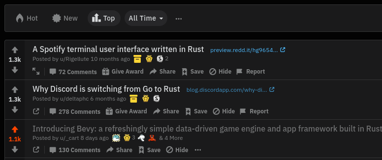
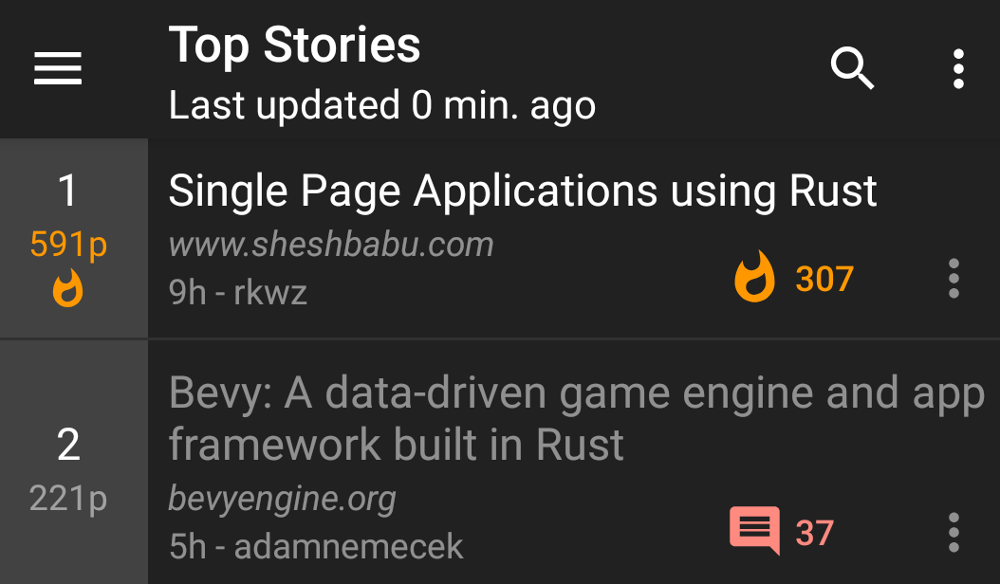
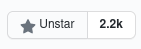
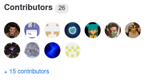
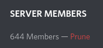
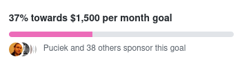
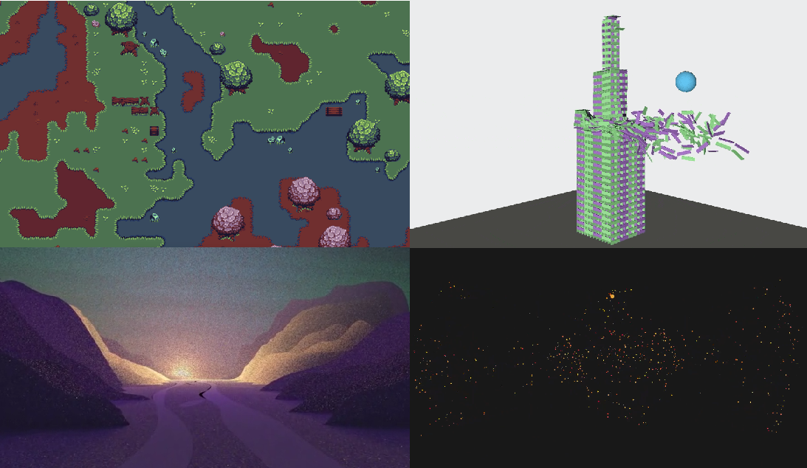

+++
title = "Scaling Bevy"
date = 2020-08-19
[extra]
author = "Carter Anderson"
twitter = "cart_cart"
github = "cart"
youtube = "cartdev"
image = "balance-scale.svg"
show_image = false
+++

First, I want to take a moment to highlight just how wild the last week has been. [**Bevy was only released a week ago**](/news/introducing-bevy) and we've already hit some pretty major milestones:

<!-- more -->

    

        <h4> 3rd most popular /r/rust post <i>of all time</i></h4>
        
    

    

        <h4>#2 on Hacker News</h4>
        
    

    

        <h4>2,200 Github Stars</h4>
        
    

    

        <h4>26 contributors</h4>
        
    

    

        <h4>644 Discord Users</h4>
        
    

    

        <h4 style="text-align: center"><a href="https://github.com/sponsors/cart">37% of the way to making my full time Bevy development sustainable</a></h4>
        
    

    

        <h3 style="text-align: center;"><a href="https://github.com/bevyengine/awesome-bevy">A truly awesome number of community-developed plugins, games, and apps</a></h3>
        
    

## How can Bevy operate at this scale?

I didn't in my wildest dreams anticipate a community to show up so quickly and in such force. Clearly the Bevy project resonates with people! This is wonderful, but it also presents some interesting challenges that I thought I would have a lot more time to solve:

* **I am a bottleneck**: Right now I am the only one with the right to merge code. This can't change until people get ramped up and trust is built.
* **Everyone is fresh**: Everyone is new to the codebase, so changes require a lot of scrutiny, and developers need a lot of guidance.
* **No structure**: We don't have an organization or a well-defined development process.

Before we try to solve these problems, I think we need to ask ourselves:

### What made Bevy "good"?

I think this is actually a relatively straightforward answer. I think it boils down to:

1. **Learn from the best**: I thoroughly reviewed at all of the existing options, learned all I could from them, and either built something new based on those learnings or made iterative improvements
2. **Freedom to experiment**: I was unencumbered by stability guarantees, pressure to make the "right" call every time, or deadlines
3. **Focus**: I was able to work on Bevy full time with zero distractions for ~5 months

How can we replicate this process at the new scale of the Bevy community? And how can I personally replicate this now that my job title has changed from "solo incognito moonshot project architect" to "lead architect" / "project manager" / "community manager" of a project with a developer community numbering in the thousands?

## The Plan

I don't think now is the time to get bogged down in complex organizational structures or RFC processes. Eventually we will need those tools, but I don't think we're there yet. Instead I'm going to try to re-create the conditions I've been operating under for the last five months:

### BDFALAICMI

I plan on being a **B**enevolent **D**ictator **F**or **A**s **L**ong **A**s **I** **C**an **M**anage **I**t. I will personally review every PR that gets merged and every design decision made. Eventually (if we do this right) that will become impossible, but we aren’t there yet. As I build trust in contributors and the project expands I will eventually start delegating. But I will always bias toward “small and focused”. My general skill-set and preference is to be a full time software developer / architect, but I have accepted that I need to balance that with being a project and community manager. My short term goal will be to drive down our massive Issue and PR backlog :)

### Focus Focus Focus

[We have a long road ahead of us](https://github.com/bevyengine/bevy/projects/1). Building an engine is a lot like leveling up a skill tree in a game. Some features can't (or shouldn't) be built until we have built their predecessors. An example of this is the Bevy Editor. Before we break ground on the editor, we need to make sure Bevy UI and Bevy Scenes are in a good spot. I am just one person. I have limited bandwidth to build designs and review proposals, so I can't afford to waste energy on the editor yet.

At a given point in time, Bevy will have 3 [focus areas](https://github.com/bevyengine/bevy/labels/focus-area). These areas will receive priority for my time, and I will try my best to direct contributors to those areas. This doesn't mean others aren't free to explore other areas they are interested in. Just don't expect to get them merged quickly. Ideally you're building a standalone plugin that doesn't require being directly merged into the Bevy repo anyway.

### Fast and Loose

I don't want to get stuck in "design hell". We can debate the best way to build a PBR renderer for years. But without implementations and hard data, it is very hard to determine what is _actually best in practice_. _I want to see code_. Production-readiness is a non-feature. A good idea is nice, but if there is no implementation it isn't real to me. We need capable people to take good ideas and make them real. The faster we can try different approaches, the better. For now the general process will be:

1. Identify a focus area and communicate the general direction Bevy should be taking in this area
2. Encourage contributors to create their own "prototype" crates. In some cases I will create my own. The Bevy project will provide a centralized list of these crates, which will facilitate discover-ability and help consolidate efforts. If you make a crate, please use the `bevy_prototype_XXX` format for crate names to respect the `bevy_XXX` namespace. This approach will allow us to "scale out" without too much process or centralization.
3. Once we have working prototypes we can start to try building consensus. We can afford to take our time here. The prototype features will already be out there for the people that want them. The cost of merging something too early is high. Merging something is a signal that we have picked a path and are _committed to it_. At that point experimentation becomes costly and painful for Bevy crate consumers. For now I will have the final say on what gets merged and when it happens. It will be the job of the community to convince me to take a given path, but I promise I'm reasonable! And I will defer to subject matter experts when it makes sense.

### Collaborate

Bevy has caught the attention of many popular Rust projects. [We are currently discussing the best way to collaborate with Amethyst Engine](https://community.amethyst.rs/t/bevy-engine-addressing-the-elephant-in-the-room). I'm also talking to a number of other Rust project leads about the best way to make Bevy a good ecosystem player. As much as possible we should be building up common foundations. Please reach out to me (Twitter DMs or on Discord) if you know of potential collaboration areas.

## Bevy's Current Focus Areas

Here are Bevy's current focus areas. I will direct my attention and attempt to direct everyone elses' attention to them. There are no deadlines. We will take as long as we need to get them right. I will work as hard as I can (full-time) to ensure we make quick progress on them:

### [Editor-Ready UI](https://github.com/bevyengine/bevy/issues/254)

Before we can start work on the Bevy Editor, we need a solid UI implementation. Bevy UI already has nice "flexbox" layout, and we already have a first stab at buttons and interaction events. But Bevy UI still needs a lot more experimentation if we're going to find the "right" patterns and paradigms. **Editor-Ready UI** has the following requirements:

* Embraces the Bevy architecture: Bevy ECS, Bevy Scenes, Bevy Assets, Bevy Events
* A Canvas-style API for drawing widgets with shapes and anti-aliased curves
* Define a consistent way to implement widgets
* A core set of widgets: buttons, inputs, resizable panels, etc
* Theme-ability
* "Interaction" and "focus" events
* Translation-friendly. We can't be anglo-centric here

Suggesting other UI frameworks or stacks is out of scope. The Bevy Editor _will be_ built on top of Bevy UI. See the [Introducing Bevy](https://bevyengine.org/news/introducing-bevy/) blog post for my rationale.

### [Physically Based Rendering (PBR)](https://github.com/bevyengine/bevy/issues/179)

PBR is a standard-ish way of rendering realistically in 3D. There is both a lot of interest and a lot of brain-power in this area, so it makes sense to build PBR now. This focus area has the following (minimum) requirements:

* PBR Shaders (which implies hdr)
* Bloom (to convey hdr)
* Shadowing (forces us to build out a real "pipeline")
* Battle-test the current mid-level rendering abstractions and rework them where necessary

### [Scenes](https://github.com/bevyengine/bevy/issues/255)

Bevy Scenes currently do most of what we want, but they need a bit more work before they can be the foundation of Bevy state management. This focus area is also a requirement for the Bevy Editor.

* **Asset Management:** Inline assets, asset dependencies, stable ids when loaded from the disk
* **Better Scene Format:** Improve the legibility and ergonomics of scene files to make them easy to read and easy to compose by hand. We're shooting for something [close to this](https://gist.github.com/cart/3e77d6537e1a0979a69de5c6749b6bcb).
* **Enabling/Disabling Systems:** Scenes should be able to toggle their required systems on and off when they are added / removed

## Want to help?

If you want to hop on this wild ride with us, here are a few ways you can help:

1. **Contribute To Prototype Plugins**: Start building new prototype Bevy plugins and contribute to the one's others are working on. Ideally in the focus areas above. At this point we are looking for fast prototypes that demonstrate new ideas. If you want to get started on a project within a given focus area:
    * Read through the corresponding [focus-area](https://github.com/bevyengine/bevy/labels/focus-area) issue on GitHub
    * Look for current projects in that issue and find potential collaboration areas.
    * If you can't find an existing project and you want to start one, set up a new crate/repo and link to it in the "focus-area" issue. We will maintain an index of active projects at the top of the thread. We will also encourage collaboration when it looks like there are overly-redundant efforts.
2. **Assist the Bevy Community**: If you are able, help us resolve issues on the [Bevy Issue Tracker](https://github.com/bevyengine/bevy/issues), review [pull requests](https://github.com/bevyengine/bevy/pulls), and provide help on the [#help channel of our Discord](https://discord.com/channels/691052431525675048/742884593551802431). It is a real challenge to keep up with the sheer volume of work here, so any help is _very very_ appreciated.
3. **Help Me Make Full Time Development Sustainable**: I need your help to make Bevy development sustainable! Five months ago I quit my comfortable Senior Software Engineer job at Microsoft to work on Bevy full time. I am currently paying my rent and living expenses out of pocket. I can't sustain this for long, as much as I want to. [We're already 37% of the way to sustainable development](https://github.com/sponsors/cart) and it has only been two days!

I'm looking forward to seeing you in the [Bevy Community](/community)!
