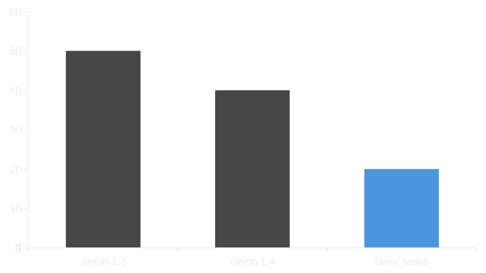
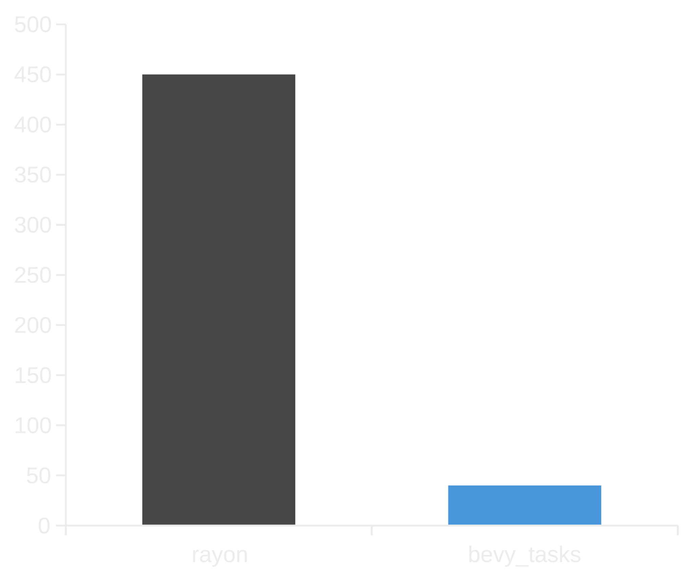
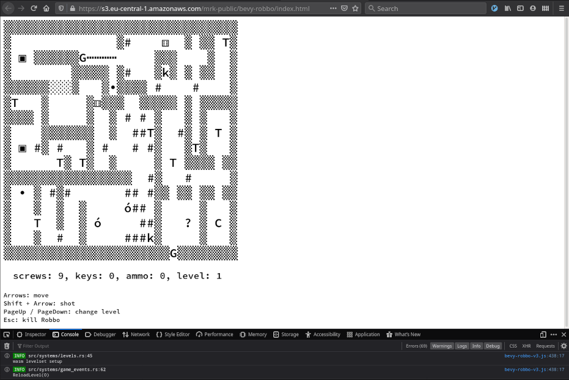
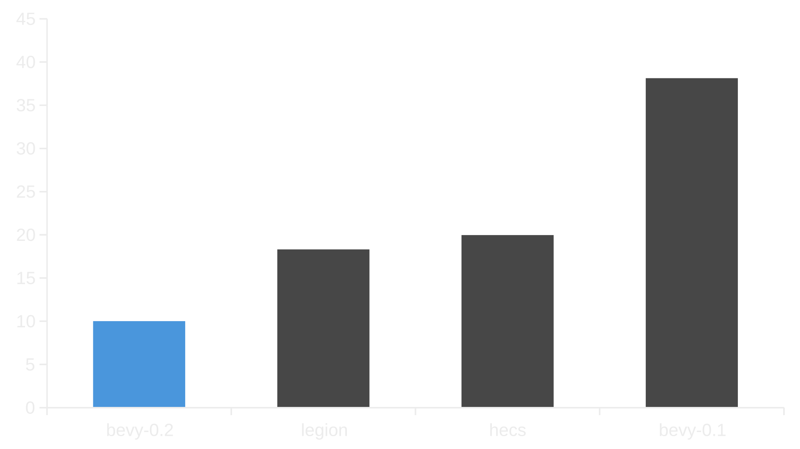

+++
title = "Bevy 0.2"
date = 2020-09-19
[extra]
author = "Carter Anderson"
twitter = "cart_cart"
github = "cart"
youtube = "cartdev"
image = "matching_squares.png"
show_image = true
image_subtitle = "Matching Squares by @TheNeikos"
image_subtitle_link = "https://github.com/TheNeikos/bevy_squares"
+++

A month after the initial Bevy release, and thanks to **87** contributors, **174** pull requests, and our [**generous sponsors**](https://github.com/sponsors/cart), I'm happy to announce the **Bevy 0.2** release on [crates.io](https://crates.io/crates/bevy)!

For those who don't know, Bevy is a refreshingly simple data-driven game engine built in Rust. You can check out [Quick Start Guide](/learn/book/getting-started/) to get started. Bevy is also free and open source forever! You can grab the full [source code](https://github.com/bevyengine/bevy) on GitHub.

Here are some of the highlights from this release:

<!-- more -->

## Async Task System

<div class="release-feature-authors">authors: @lachlansneff and @aclysma</div>

Bevy uses multi-threading throughout the engine: ECS scheduling, asset loading, rendering, etc. Before this release it used [Rayon](https://github.com/rayon-rs/rayon) for almost all of these tasks. Rayon is nice because it is generally as simple as calling `some_list.par_iter().for_each(|x| do_something(x))`. Rayon then automatically breaks the `for_each` into tasks and runs them on as many cores as it can. Rayon is a great choice if you want to easily parallelize code, but it has the downside of being pretty cpu-hungry.

Bevy (and a number of other rust game engines and ecs frameworks using rayon) have received feedback that they were overly cpu hungry / usage was not proportional to "real" work done.

We decided to resolve this problem by building a custom async-friendly task system, which enables the creation of context-specific task pools. For example, you might have separate pools for compute, IO, networking, etc. This also gives us the flexibility to load balance work appropriately according to work type and/or priority. The cpu usage wins have been huge:

### Total Combined Percent CPU Usage - 8 Core Machine (smaller is better)



### Total Combined Percent CPU Usage - 32 Core Machine (smaller is better)



## Initial Web Platform Support

<div class="release-feature-authors">authors: @smokku</div>

(A subset of) Bevy now runs on the web using WebAssembly/WASM! Specifically, Bevy apps can run Bevy ECS schedules, react to input events, create an empty canvas (using winit), and a few other things. This is a huge first step, but it is important to call out that there are still a number of missing pieces, such as 2D/3D rendering, multi-threading, and sound.

Those limitations haven't stopped @mrk-its from building the first WASM Bevy game!

### [bevy-robbo](https://github.com/mrk-its/bevy-robbo) ([playable here](https://mrk.sed.pl/bevy-robbo/ascii/))



They use Bevy for game logic and cleverly work around the render limitations by passing ASCII art game state from [this Bevy system](https://github.com/mrk-its/bevy-robbo/blob/ascii/src/systems/js_render.rs) to [this JavaScript function](https://github.com/mrk-its/bevy-robbo/blob/ascii/wasm/render.js).

You can play around with some Bevy WASM examples by [following the instructions here](https://github.com/bevyengine/bevy/tree/v0.2.0/examples#wasm).

## Parallel Queries

<div class="release-feature-authors">authors: @GrantMoyer</div>

Bevy ECS Queries are a flexible way to retrieve data from the Entity Component System. Systems that _use_ queries already run in parallel, but before this change the queries themselves could not be _iterated_ in parallel. **Bevy 0.2** adds the ability to easily iterate queries in parallel:

```rs
fn system(pool: Res<ComputeTaskPool>, mut query: Query<&mut Transform>) {
    query.iter().par_iter(32).for_each(&pool, |mut transform| {
      transform.translate(Vec3::new(1.0, 0.0, 0.0));
    });
}
```

This provides a nice functional api (similar to Rayon) that runs on top of the new `bevy_tasks` system. It breaks the query up into 32 "batches" and runs each batch as a different task in the bevy task system.

## Transform System Rewrite

<div class="release-feature-authors">authors: @MarekLg</div>

```rs
// old
fn system(translation: &Translation, rotation: &Rotation, scale: &Scale) {
  println!("{} {} {}", translation.0, rotation.0, scale.0);
}

// new
fn system(transform: &Transform) {
  println!("{} {} {}", transform.translation(), transform.rotation(), transform.scale());
}
```

Bevy's old transform system used separate `Translation`, `Rotation`, and `Scale` components as the "source of truth". Users modified with these components in their systems, after which they were synced to a `LocalTransform` component, which was in turn synced to a global `Transform` component, taking hierarchy into account. This was nice for a couple of reasons:

* Slightly more cache efficient to retrieve individual components like `Translation` (because less data needs to be accessed)
* Theoretically more parallel-friendly. Systems that only access `Translation` won't block systems accessing `Rotation`.

However this approach also has some pretty serious downsides:

* The "individual components" are the source of truth, so `LocalTransform` is out of date when user systems are running. If an up to date "full transform" is needed, it must be manually constructed by accessing all three components.
* Very hard to reason about. There are 5 components users need to think about and they all interact with each other differently.
* Setting a Transform to a specific matrix value (ex: `Mat4::look_at()`) was extremely cumbersome, and the value would be immediately overwritten unless the user explicitly disabled component syncing.

Given these issues, we decided to move to a single unified local-to-parent `Transform` component as the source of truth, and a computed `GlobalTransform` component for world-space transforms. We think this api will be much easier to use and to reason about. [Unity is also considering a similar Transform rework for their ECS](https://gist.github.com/joeante/79d25ec3a0e86436e53eb74f3ac82c0c) and a lot of discussion on this topic happened in this [Amethyst Forum Thread](https://community.amethyst.rs/t/legion-transform-design-discussion).

## Joystick/Gamepad Input

<div class="release-feature-authors">authors: @simpuid</div>

The Bevy Input plugin now has cross-platform support for most controllers thanks to the [gilrs](https://gitlab.com/gilrs-project/gilrs) library!

```rs
fn button_system(gamepads: Res<Vec<Gamepad>>, button_input: Res<Input<GamepadButton>>) {
    for gamepad in gamepads.iter() {
        if button_input.just_pressed(GamepadButton(*gamepad, GamepadButtonType::RightTrigger)) {
            println!("Pressed right trigger!");
        }
    }
}
```

## Bevy ECS Performance Improvements

<div class="release-feature-authors">authors: @cart</div>

### Generational Entity IDs

We changed Entity IDs from being random UUIDs to incrementing generational indices. Random UUIDs were nice because they could be created anywhere, were unique across game runs, and could be safely persisted to files or reused across networks. I was really hoping we could make them work, but they ended up being too slow relative to the alternatives. The randomness had a measurable cost and entity locations had to be looked up using a hash map.

By moving to generational indices (we use the hecs implementation), we can directly use entity ids as array indices, which makes entity location lookups lightning fast.

### Read Only Queries

I implemented "read only" traits for queries that don't mutate anything. This allows us to guarantee that a query won't mutate anything.

### Removed locking from World apis

This gives us a really nice speed boost. We can do this safely due to a combination of the new "read only queries" and changing World mutation apis to be a mutable World borrow.

This is not yet enabled for `Queries` in systems because a system could have multiple `Queries`, which could be simultaneously accessed in a way that doesn't make mutable access unique. I think thats a solve-able problem, but it will take a bit more work. Fortunately "for-each" systems don't have any collision risk, so we now use lock-less queries there.

### Direct component lookup (in nanoseconds, smaller is better)

As a result of these optimizations, direct component lookup is _much_ faster than it used to be:



Note that this benchmark used `world.get::<T>(entity)`. `query.get::<T>(entity)` should have results similar to the `hecs` results because it still uses a lock. Eventually I'm hoping that we can remove locks from system queries too.

## Change Log

### Added

* [Task System for Bevy][384]
  * Replaces rayon with a custom designed task system that consists of several "TaskPools".
  * Exports `IOTaskPool`, `ComputePool`, and `AsyncComputePool` in `bevy_tasks` crate.
* [Parallel queries for distributing work over with the `ParallelIterator` trait.][292]
  * e.g. `query.iter().par_iter(batch_size).for_each(/* ... */)`
* [Added gamepad support using Gilrs][280]
* [Implement WASM support for bevy_winit][503]
* [Create winit canvas under WebAssembly][506]
* [Implement single threaded task scheduler for WebAssembly][496]
* [Support for binary glTF (.glb).][271]
* [Support for `Or` in ECS queries.][358]
* [Added methods `unload()` and `unload_sync()` on `SceneSpawner` for unloading scenes.][339].
* [Custom rodio source for audio.][145]
  * `AudioOuput` is now able to play anything `Decodable`.
* [`Color::hex`][362] for creating `Color` from string hex values.
  * Accepts the forms RGB, RGBA, RRGGBB, and RRGGBBAA.
* [`Color::rgb_u8` and `Color::rgba_u8`.][381]
* [Added `bevy_render::pass::ClearColor` to prelude.][396]
* [`SpriteResizeMode` may choose how `Sprite` resizing should be handled. `Automatic` by default.][430]
* [Added methods on `Input<T>`][428] for iterator access to keys.
  * `get_pressed()`, `get_just_pressed()`, `get_just_released()`
* [Derived `Copy` for `MouseScrollUnit`.][270]
* [Derived `Clone` for UI component bundles.][390]
* [Some examples of documentation][338]
* [Update docs for Updated, Changed and Mutated][451]
* Tips for faster builds on macOS: [#312][312], [#314][314], [#433][433]
* Added and documented cargo features
  * [Created document `docs/cargo_features.md`.][249]
  * [Added features for x11 and wayland display servers.][249]
  * [and added a feature to disable libloading.][363] (helpful for WASM support)
* Added more instructions for Linux dependencies
  * [Arch / Manjaro][275], [NixOS][290], [Ubuntu][463] and [Solus][331]
* [Provide shell.nix for easier compiling with nix-shell][491]
* [Add `AppBuilder::add_startup_stage_|before/after`][505]

### Changed

* [Transform rewrite][374]
* [Use generational entity ids and other optimizations][504]
* [Optimize transform systems to only run on changes.][417]
* [Send an AssetEvent when modifying using `get_id_mut`][323]
* [Rename `Assets::get_id_mut` -> `Assets::get_with_id_mut`][332]
* [Support multiline text in `DrawableText`][183]
* [iOS: use shaderc-rs for glsl to spirv compilation][324]
* [Changed the default node size to Auto instead of Undefined to match the Stretch implementation.][304]
* [Load assets from root path when loading directly][478]
* [Add `render` feature][485], which makes the entire render pipeline optional.

### Fixed

* [Properly track added and removed RenderResources in RenderResourcesNode.][361]
  * Fixes issues where entities vanished or changed color when new entities were spawned/despawned.
* [Fixed sprite clipping at same depth][385]
  * Transparent sprites should no longer clip.
* [Check asset path existence][345]
* [Fixed deadlock in hot asset reloading][376]
* [Fixed hot asset reloading on Windows][394]
* [Allow glTFs to be loaded that don't have uvs and normals][406]
* [Fixed archetypes_generation being incorrectly updated for systems][383]
* [Remove child from parent when it is despawned][386]
* [Initialize App.schedule systems when running the app][444]
* [Fix missing asset info path for synchronous loading][486]
* [fix font atlas overflow][495]
* [do not assume font handle is present in assets][490]

### Internal Improvements

* Many improvements to Bevy's CI [#325][325], [#349][349], [#357][357], [#373][373], [#423][423]

[145]: https://github.com/bevyengine/bevy/pull/145
[183]: https://github.com/bevyengine/bevy/pull/183
[249]: https://github.com/bevyengine/bevy/pull/249
[270]: https://github.com/bevyengine/bevy/pull/270
[271]: https://github.com/bevyengine/bevy/pull/271
[275]: https://github.com/bevyengine/bevy/pull/275
[280]: https://github.com/bevyengine/bevy/pull/280
[290]: https://github.com/bevyengine/bevy/pull/290
[292]: https://github.com/bevyengine/bevy/pull/292
[304]: https://github.com/bevyengine/bevy/pull/304
[312]: https://github.com/bevyengine/bevy/pull/312
[314]: https://github.com/bevyengine/bevy/pull/314
[323]: https://github.com/bevyengine/bevy/pull/323
[324]: https://github.com/bevyengine/bevy/pull/324
[325]: https://github.com/bevyengine/bevy/pull/325
[331]: https://github.com/bevyengine/bevy/pull/331
[332]: https://github.com/bevyengine/bevy/pull/332
[338]: https://github.com/bevyengine/bevy/pull/332
[345]: https://github.com/bevyengine/bevy/pull/345
[349]: https://github.com/bevyengine/bevy/pull/349
[357]: https://github.com/bevyengine/bevy/pull/357
[358]: https://github.com/bevyengine/bevy/pull/358
[361]: https://github.com/bevyengine/bevy/pull/361
[362]: https://github.com/bevyengine/bevy/pull/362
[363]: https://github.com/bevyengine/bevy/pull/363
[373]: https://github.com/bevyengine/bevy/pull/373
[374]: https://github.com/bevyengine/bevy/pull/374
[376]: https://github.com/bevyengine/bevy/pull/376
[381]: https://github.com/bevyengine/bevy/pull/381
[383]: https://github.com/bevyengine/bevy/pull/383
[384]: https://github.com/bevyengine/bevy/pull/384
[385]: https://github.com/bevyengine/bevy/pull/385
[386]: https://github.com/bevyengine/bevy/pull/386
[390]: https://github.com/bevyengine/bevy/pull/390
[394]: https://github.com/bevyengine/bevy/pull/394
[396]: https://github.com/bevyengine/bevy/pull/396
[339]: https://github.com/bevyengine/bevy/pull/339
[406]: https://github.com/bevyengine/bevy/pull/406
[417]: https://github.com/bevyengine/bevy/pull/417
[423]: https://github.com/bevyengine/bevy/pull/423
[428]: https://github.com/bevyengine/bevy/pull/428
[430]: https://github.com/bevyengine/bevy/pull/430
[433]: https://github.com/bevyengine/bevy/pull/433
[444]: https://github.com/bevyengine/bevy/pull/444
[451]: https://github.com/bevyengine/bevy/pull/451
[463]: https://github.com/bevyengine/bevy/pull/463
[478]: https://github.com/bevyengine/bevy/pull/478
[485]: https://github.com/bevyengine/bevy/pull/485
[486]: https://github.com/bevyengine/bevy/pull/486
[490]: https://github.com/bevyengine/bevy/pull/490
[491]: https://github.com/bevyengine/bevy/pull/491
[495]: https://github.com/bevyengine/bevy/pull/495
[496]: https://github.com/bevyengine/bevy/pull/496
[503]: https://github.com/bevyengine/bevy/pull/503
[504]: https://github.com/bevyengine/bevy/pull/504
[505]: https://github.com/bevyengine/bevy/pull/505
[506]: https://github.com/bevyengine/bevy/pull/506

## Contributors

A huge thanks to the **87 contributors** that made this release (and associated docs) possible!  

* 0x22fe
* 8bit-pudding
* aarongeorge
* ablakey
* aclysma
* adekau
* aevyrie
* AmionSky
* andreheringer
* AngelOnFira
* ashneverdawn
* BafDyce
* BimDav
* bitshifter
* Bobox214
* Boiethios
* caelunshun
* cart
* CleanCut
* dallenng
* DGriffin91
* Dispersia
* DJMcNab
* eliaspekkala
* EllenNyan
* eXodiquas
* figsoda
* Fishrock123
* FSMaxB
* GabLotus
* GrantMoyer
* guimcaballero
* Halfwhit
* hannobraun
* IceSentry
* ifletsomeclaire
* Incipium
* io12
* jakerr
* jamadazi
* joejoepie
* JohnDoneth
* julhe
* kaflu
* karroffel
* lachlansneff
* lberrymage
* logannc
* Lowentwickler
* MarekLg
* MatteoGgl
* memoryruins
* mfrancis107
* MGlolenstine
* MichaelHills
* MilanVasko
* Moxinilian
* mrk-its
* mtsr
* multun
* naithar
* ncallaway
* ndarilek
* OptimisticPeach
* PrototypeNM1
* reidbhuntley
* RobDavenport
* saicu
* simpuid
* SmiteWindows
* smokku
* StarArawn
* stefee
* tarkah
* TehPers
* Telzhaak
* TheNeikos
* thirdsgames
* TomBebb
* tristanpemble
* verzuz
* VitalyAnkh
* w1th0utnam3
* Waridley
* wyhaya
* Xavientois
* zicklag
