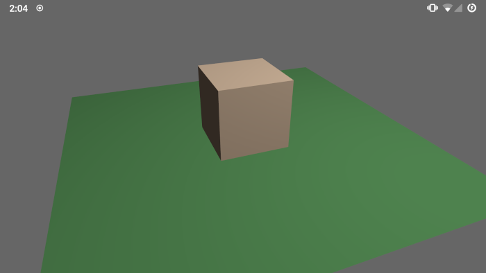
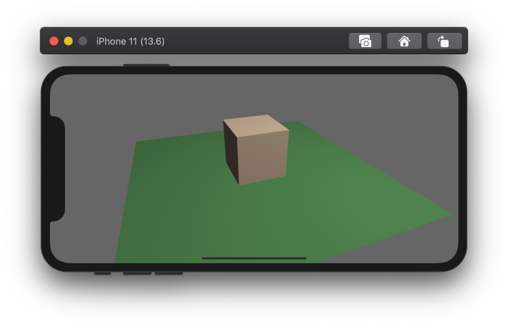
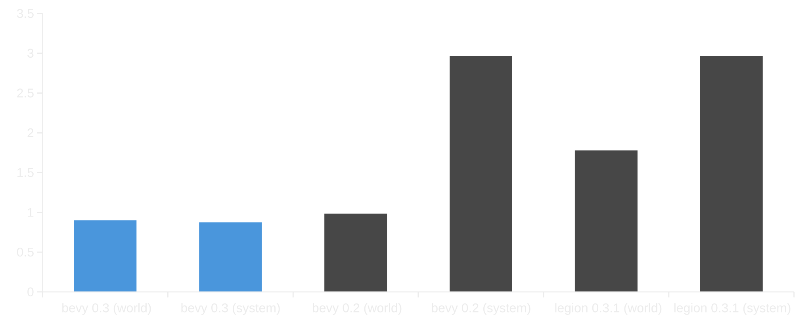
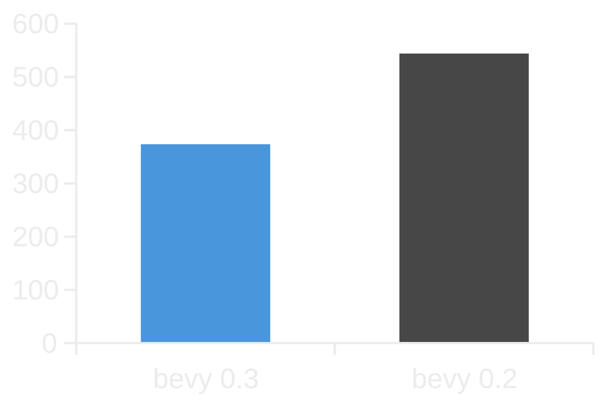
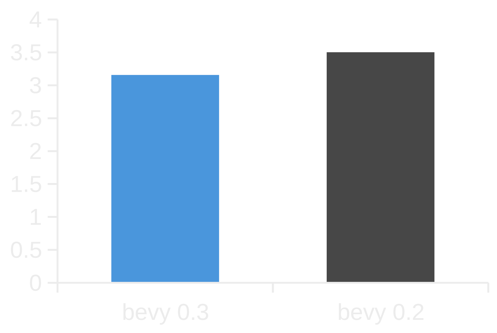
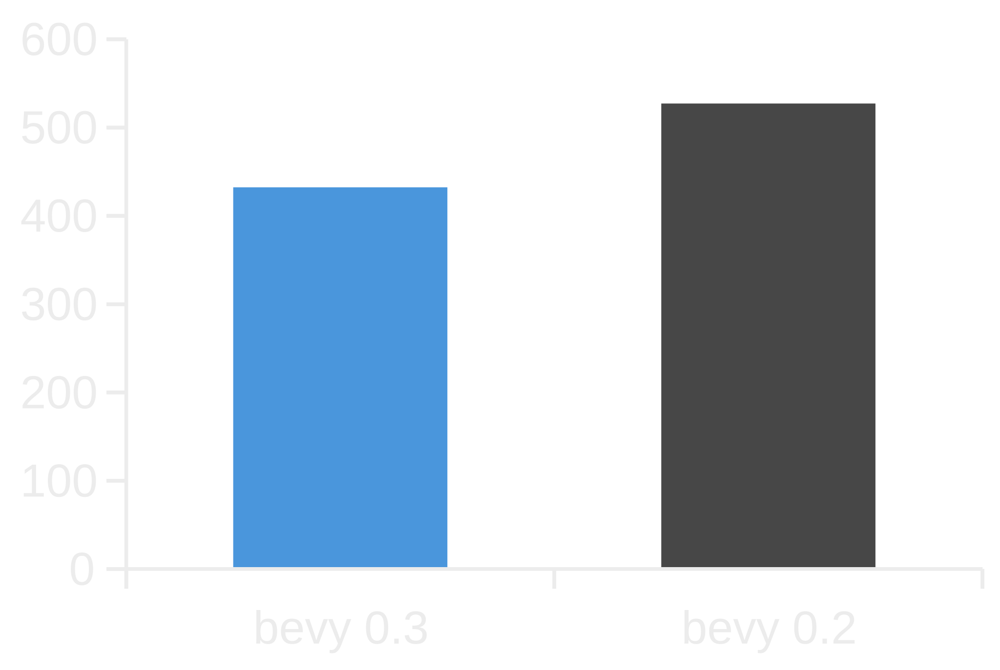
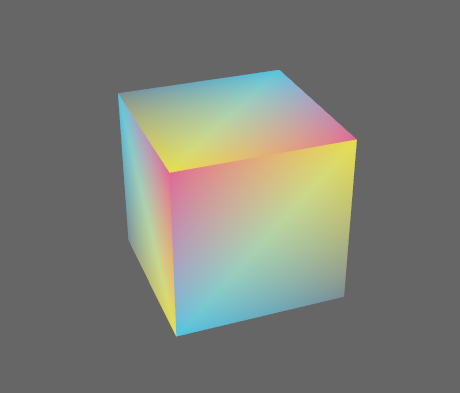
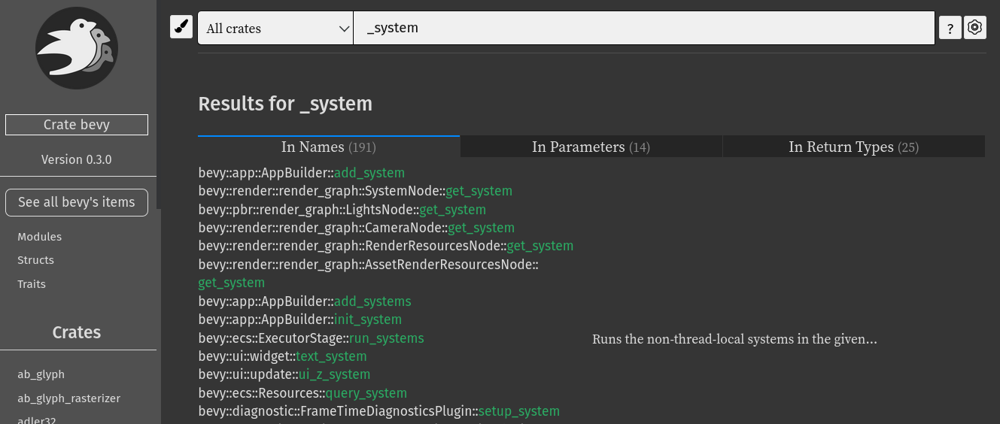

+++
title = "Bevy 0.3"
date = 2020-11-03
[extra]
author = "Carter Anderson"
twitter = "cart_cart"
github = "cart"
youtube = "cartdev"
image = "sheep_game.png"
show_image = true
image_subtitle = "Sheep Game by @schneckerstein"
image_subtitle_link = "https://twitter.com/schneckerstein/status/1309491121555410945"
+++

A little over a month after releasing Bevy 0.2, and thanks to **59** contributors, **122** pull requests, and our [**generous sponsors**](https://github.com/sponsors/cart), I'm happy to announce the **Bevy 0.3** release on [crates.io](https://crates.io/crates/bevy)!

For those who don't know, Bevy is a refreshingly simple data-driven game engine built in Rust. You can check out [Quick Start Guide](/learn/book/getting-started/) to get started. Bevy is also free and open source forever! You can grab the full [source code](https://github.com/bevyengine/bevy) on GitHub.

Here are some of the highlights from this release:

<!-- more -->

## Initial Android Support

<div class="release-feature-authors">authors: @enfipy, @PrototypeNM1, @endragor, @naithar</div>

You can try out the [Bevy Android example](https://github.com/bevyengine/bevy/tree/v0.3.0/examples/android) by following the [instructions here](https://github.com/bevyengine/bevy/blob/v0.3.0/examples/README.md#android). While many things work, please note that this is _very hot_ off the presses. Some features will work and others probably won't. Now is a great time to dive in and help us close the gaps!



This was a massive group effort that spanned multiple projects:

* Bevy: rewrote bevy-glsl-to-spirv to support android / static libraries (@PrototypeNM1, @enfipy)
* Bevy: `bevy_asset` backend using Android Asset Manager (@enfipy)
* Bevy: Touch support (@naithar)
* Bevy: Texture format fix (@enfipy)
* Bevy: UI touch fixes, touch force, and android example (@enfipy)
* Cpal: android audio support (@endragor)
* android-ndk-rs / cargo-apk: fix to support Bevy project structure (@PrototypeNM1)

## Initial iOS Support

<div class="release-feature-authors">authors: @simlay, @MichaelHills, @Dash-L, @naithar</div>

Bevy can now run on iOS!



You can try out the [Bevy iOS example](https://github.com/bevyengine/bevy/tree/v0.3.0/examples/ios) by following the [instructions here](https://github.com/bevyengine/bevy/tree/v0.3.0/examples#ios). This one is also hot off the presses: some features will work and others probably won't.

This was another large group effort that spanned multiple projects:

* Bevy: XCode Project / Example (@simlay with help from @MichaelHills)
* Bevy: Runtime shader compilation using shaderc (@MichaelHills)
* Bevy: Rodio upgrade (@Dash-L)
* Bevy: Touch support (@naithar)
* Winit: Fix iOS portrait view (@MichaelHills)
* RustAudio: iOS support (@simlay and @MichaelHills)

Known issues:

* [Audio doesn't quite work yet](https://github.com/RustAudio/cpal/pull/485)

## WASM Asset Loading

<div class="release-feature-authors">authors: @mrk-its (and ported to the new AssetIo by @cart)</div>

@mrk-its has been hard at work on expanding Bevy's WASM support. In this release we landed WASM asset loading. You can now load assets when you publish to WASM just like you would on any other platform:

```rust
asset_server.load("sprite.png");
```

If the asset hasn't already been loaded, this will make a `fetch()` request to retrieve the asset over HTTP.

@mrk-its has also been building a custom WebGL2 `bevy_render` backend. It is already pretty usable, but its not _quite_ ready yet. Expect more news on this soon!

## Touch Input

<div class="release-feature-authors">authors: @naithar</div>

Bevy now has support for touches:

```rust
fn touch_system(touches: Res<Touches>) {
    // you can iterate all current touches and retrieve their state like this:
    for touch in touches.iter() {
        println!("active touch: {:?}", touch);
    }

    for touch in touches.iter_just_pressed() {
        println!("just pressed {:?}", touch);
    }

    for touch in touches.iter_just_released() {
        println!("just released {:?}", touch);
    }

    for touch in touches.iter_just_cancelled() {
        println!("just cancelled {:?}", touch);
    }
}
```

You can also consume raw touch events using the `Events<TouchInput>` resource.

## Asset System Improvements

<div class="release-feature-authors">authors: @cart</div>

### Asset Handle Reference Counting

Assets are now automatically freed when their "handle reference count" reaches zero. This means you no longer need to think about freeing assets manually:

```rust
// Calling load() now returns a strong handle:
let handle = asset_server.load("sprite.png");

// Note that you no longer need to unwrap() loaded handles. Ergonomics for the win!

// Cloning a handle increases the reference count by one
let second_handle = handle.clone();

// Spawn a sprite and give it our handle
commands.spawn(SpriteComponents {
    material: materials.add(handle.into()),
    ..Default::default()
});

// Later in some other system:
commands.despawn(sprite_entity);

// There are no more active handles to "sprite.png", so it will be freed before the next update
```

### Asset Loaders can now load multiple assets

In past releases, `AssetLoaders` could only produce a single asset of a single type. In **Bevy 0.3**, they can now produce any number of assets for any type. The old behavior was extremely limiting when loading assets like GLTF files, which might produce many meshes, textures, and scenes.

### Sub-Asset Loading

Sometimes you only want to load a specific asset from an asset source. You can now load sub assets like this:

```rust
// Mesh0/Primitive0 references the first mesh primitive in "my_scene.gltf"
let mesh = asset_server.load("my_scene.gltf#Mesh0/Primitive0");
```

### AssetIo Trait

The `AssetServer` is now backed by the `AssetIo` trait. This allows us to load assets from whatever storage we want. This means on desktop we now load from the filesystem, on Android we use the Android Asset Manager, and on the web we make HTTP requests using the `fetch()` api.

### Asset Dependencies

Assets can now depend on other assets, which will automatically be loaded when the original asset is loaded. This is useful when loading something like a "scene" which might reference other asset sources. We utilize this in our new GLTF loader.

### Removed AssetServer::load_sync()

This might rustle some feathers, but `AssetServer::load_sync()` had to go! This api wasn't WASM friendly, encouraged users to block game execution for the sake of convenience (which causes "hitching"), and was incompatible with the new AssetLoader api. Asset loading is now always asynchronous. Users of `load_sync()` should instead `load()` their assets, check load status in their systems, and change game state accordingly.

## GLTF Scene Loader

<div class="release-feature-authors">authors: @cart</div>

Up until this point, the GLTF loader was painfully limited. It could only load the first mesh with a single texture in a GLTF file. For **Bevy 0.3**, we took advantage of the asset system improvements to write a new `GltfLoader` that loads GLTF files as Bevy `Scenes`, along with all meshes and textures in the files.

Here's Bevy loading the Khronos Flight Helmet example, which consists of multiple meshes and textures!


Here is the complete code for a system that loads a GLTF file and spawns it as a scene:

```rust
fn load_gltf_system(mut commands: Commands, asset_server: Res<AssetServer>) {
    let scene_handle = asset_server.load("models/FlightHelmet/FlightHelmet.gltf");
    commands.spawn_scene(scene_handle);
}
```

## Bevy ECS Improvements

<div class="release-feature-authors">authors: @cart</div>

### Query Ergonomics

In this release I finally was able to remove the one thing I _truly despised_ in Bevy ECS. In previous versions of Bevy, iterating over the components in a `Query` looked like this:

```rust
for (a, b) in &mut query.iter() {
    // The `&mut` here just felt so unnatural
}

// Or if you preferred you could do this
for (a, b) in query.iter().iter() {
    // query.iter().iter()? Really???
}
```

Similarly, retrieving a specific entity's component's looked like this:

```rust
if let Ok(mut result) = query.entity(entity) {
    if let Some((a, b)) = result.get() {
        // access components here
    }
}
```

In **Bevy 0.3** you can just do this:

```rust
// iteration
for (a, b) in query.iter() {
    // sweet ergonomic bliss
}

// entity lookup
if let Ok((a,b)) = query.get(entity) {
    // boilerplate be gone!
}
```

You might naturally be thinking something like:

_Why did this take so long? Why would removing a single `&mut` be hard?_

It's a long story! In summary:

* The old api looked the way it did for a reason. It was the result of good design choices that protect against unsafe memory access in a parallel environment.
* `query.iter()` didn't actually return an iterator. It returned a _wrapper_ that held an atomic lock on the component storages. The same was true for the type returned by `query.entity()`
* Removing these "wrapper types" would have allowed unsafe behavior because another Query could access the same components in a way that violated Rust's mutability rules.
* Due to the iterator implementation and quirks in the rust compiler, removing the wrapper type _tanked_ iteration performance by about ~2-3x.

Fortunately we finally found ways to solve all of these problems. The newly added `QuerySets` allow us to completely remove the locks (and wrapper types). And by completely rewriting `QueryIter` we were able to avoid the performance hit that removing the wrapper incurred. Read on for the details!

### 100% Lockless Parallel ECS

Bevy ECS is now completely lock free. In Bevy 0.2, we made direct `World` access and "for-each" systems lock free. This is possible because the Bevy ECS scheduler ensures that systems only run in parallel in ways that respect Rust's mutability rules.

We couldn't remove locks from `Query` systems because of systems like this:

```rust
fn conflicting_query_system(mut q0: Query<&mut A>, mut q1: Query<(&mut A, &B)>) {
    let a = q0.get_mut(some_entity).unwrap();
    let (another_a, b) = q1.get_mut(some_entity).unwrap();
    // Aaah!!! We have two mutable references to some_entity's A component!
    // Very unsafe!
}
```

The locks ensured that the second `q1.get_mut(some_entity)` access panicked, keeping us nice and safe. In **Bevy 0.3**, a system like `conflicting_query_system` will fail when the schedule is constructed. By default, _systems cannot have conflicting queries_.

However there are some cases where a system _needs_ conflicting queries to do what it needs to do. For these cases, we added `QuerySets`:

```rust
fn system(mut queries: QuerySet<(Query<&mut A>, Query<(&mut A, &B)>)>) {
    for a in queries.q0_mut().iter_mut() {
    }

    for (a, b) in queries.q1_mut().iter_mut() {
    }
}
```

By putting our conflicting `Queries` in a `QuerySet`, the Rust borrow checker protects us from unsafe query accesses.

Because of this, we were able to remove _all_ safety checks from `query.iter()` and `query.get(entity)`, which means these methods are now _exactly_ as fast as their `World` counterparts (which we made lock-free in Bevy 0.2).

### Performance Improvements

Bevy had a number of nice performance improvements this release:

* Removed atomic locks from Query access, making Bevy ECS 100% lock free
* Removed archetype "safety checks" from Query access. At this point we have already verified that the given Query access is safe, so we don't need to check again on every call.
* Rewrote `QueryIter` to be simpler (and therefore easier to control optimizations for), which allowed us to remove the iterator wrapper without tanking performance. This also resolved some performance inconsistencies where some system permutations performed optimally and others didn't. Now everything is on the "fast path"!  
* Ported some performance improvements from upstream hecs, which improved iteration over heavily fragmented archetypes and improved component insertion times

#### Getting an Entity's Component (per 100k, in milliseconds, smaller is better)

Note: these numbers are for getting a component 100,000 times, not for an individual component lookup



This is where the big wins were. By removing locks and safety checks from Query systems, we were able to _significantly_ reduce the cost of retrieving a specific entity's component from within a system.

I included a comparison to [Legion ECS](https://github.com/amethyst/legion) (another great archetypal ECS with a parallel scheduler) to illustrate why Bevy's new approach is so cool. Legion exposes a direct "world like" api (called a SubWorld) in its systems. The SubWorld's entry api _cannot_ know ahead of time what types will be passed into it, which means it _must_ do (relatively) expensive safety checks to ensure the user doesn't request access to something they shouldn't.

Bevy's scheduler pre-checks `Queries` once ahead of time, which allows systems to access their results without any additional checks.

The test was to lookup (and modify) a specific entity's component 100,000 times on each system iteration. Here is a quick rundown of how these tests were performed in each case:

* bevy (world): Direct `World` access using `world.get_mut::<A>(entity)`
* bevy (system): A system containing a `Query<&mut A>` that accesses the component using `query.get_mut(entity)`
* legion (world): Direct `World` access using `let entry = world.entry(entity); entry.get_component_mut::<A>()`
* legion (system): A system with `SubWorld` access using `let entry = world.entry(entity); entry.get_component_mut::<A>()`

It's worth noting that using `query.get_component::<T>(entity)` instead of `query.get(entity)` does require safety checks, for the same reason the legion entry api does. We cannot know ahead of time what component type a caller will pass into the method, which means we _must_ check it to make sure it matches the `Query`.

Additionally, here are some relevant [ecs_bench_suite](https://github.com/rust-gamedev/ecs_bench_suite) results (omitted benchmarks had no significant change):

#### Component Insertion (in microseconds, smaller is better)



#### Component Add/Remove (in milliseconds, smaller is better)



#### Fragmented Iteration (in nanoseconds, smaller is better)



### Thread Local Resources

Some resource types cannot (or should not) be passed between threads. This is often true for low level apis like windowing, input, and audio. It is now possible to add "thread local resources" to the `Resources` collection, which can only be accessed from the main thread using "thread local systems":

```rust
// in your app setup
app.add_thread_local_resource(MyResource);

// a thread local system
fn system(world: &mut World, resources: &mut Resources) {
    let my_resource = resources.get_thread_local::<MyResource>().unwrap();
}
```

### Query Api Changes

First, to improve clarity we renamed `query.get::<Component>(entity)` to `query.get_component::<Component>(entity)`. We now return the "full" query result for a specific entity using `query.get(entity)`.

To allow multiple concurrent reads of Queries (where it is safe), we added separate `query.iter()` and `query.iter_mut()` apis, as well as `query.get(entity)` and `query.get_mut(entity)`. Queries that are "read only" can now retrieve their results via an immutable borrow.

## Mesh Improvements

### Flexible Mesh Vertex Attributes

<div class="release-feature-authors">authors: @julhe</div>

Bevy meshes used to require exactly three "vertex attributes": `position`, `normal`, and `uv`. This worked for most things, but there are a number of cases that require other attributes, such as "vertex colors" or "bone weights for animation". **Bevy 0.3** adds support for custom vertex attributes. Meshes can define whatever attributes they want and shaders can consume whatever attributes they want!

[Here is an example](https://github.com/bevyengine/bevy/blob/v0.3.0/examples/shader/mesh_custom_attribute.rs) that illustrates how to define a custom shader that consumes a mesh with an added "vertex color" attribute.



### Index Buffer Specialization

<div class="release-feature-authors">authors: @termhn</div>

Rendering meshes often involves using vertex "indices" to cut down on duplicate vertex information. Bevy used to hard code the precision of these indices to `u16`, which was too small for some cases. Now render pipelines can "specialize" based on a configured index buffer, which now defaults to `u32` to cover most use cases.

## Transform Re-Rewrite

<div class="release-feature-authors">authors: @MarekLg (with some design help from @AThilenius, @bitshifter, @termhn, and @cart)</div>

Transforms are important to get right. They are used in many slices of the engine, user code touches them constantly, and they are relatively expensive to compute: especially transform hierarchies.

In the last release, we vastly simplified Bevy's transform system to use a consolidated `Transform` and `GlobalTransform` instead of multiple separate `Translation`, `Rotation`, and `Scale` components (which were synced to `Transform` and `GlobalTransform`). This made the user-facing api/dataflow simpler, as well as the underlying implementation. The `Transform` component was backed by a 4x4 matrix. I pressed the big green "merge" button ... happy that we had solved the Transform problem once and for all!

It turns out there was still more work to be done! [@AThilenius pointed out](https://github.com/bevyengine/bevy/issues/229#issuecomment-698953161) that using a 4x4 matrix as the source of truth for an affine transform accumulates error over time. Additionally, the Transform api was still a little cumbersome to use. [At the suggestion of @termhn](https://github.com/bevyengine/bevy/issues/229#issuecomment-699172675) we decided to investigate using a "similarity" as the source of truth. This had the following benefits:

1. no more error accumulation
2. we could directly expose translation/rotation/scale fields, which simplified the api significantly
3. cheaper to store and cheaper to compute hierarchies in some cases

We collectively decided this was a good path forward and now we have a re-rewrite that is even better. Yes this is _another_ breaking change, but thats why we label Bevy as being in the "experimentation phase". Now is the time to break things as often as possible to ensure that we find good apis that will stand the test of time.

This is what the new `Transform` api looks like in a Bevy ECS system:

```rust
fn system(mut transform: Mut<Transform>) {
    // move along the positive x-axis
    transform.translation += Vec3::new(1.0, 0.0, 0.0);

    // rotate 180 degrees (pi) around the y-axis
    transform.rotation *= Quat::from_rotation_y(PI);

    // scale 2x
    transform.scale *= 2.0;
}
```

Compared to the last version this is easier to use, more correct, and should also be slightly faster.

## Gamepad Settings

<div class="release-feature-authors">authors: @simpuid</div>

The newly added `GamepadSettings` resource gives developers the ability to customize gamepad settings on a per-controller, per-axis/button basis:

```rust
fn system(mut gamepad_settings: ResMut<GamepadSettings>) {
    gamepad_settings.axis_settings.insert(
        GamepadAxis(Gamepad(0), GamepadAxisType::LeftStickX),
        AxisSettings {
            positive_high: 0.8,
            positive_low: 0.01,
            ..Default::default()
        },
    );
}
```

## Plugin Groups

<div class="release-feature-authors">authors: @cart</div>

If you've used Bevy, you're probably familiar with this part of `App` initialization:

```rust
app.add_default_plugins();
```

This adds the plugins for all of the "core" engine functionality (rendering, input, audio, windowing, etc). It was straightforward, but also very static. What if you don't want to add _all_ of the default plugins? What if you want to create your own custom set of plugins?

To resolve this, we added `PluginGroups`, which are ordered collections of plugins that can be individually enabled or disabled:

```rust
// This:
app.add_default_plugins()

// Has been replaced by this:
app.add_plugins(DefaultPlugins)

// You can disable specific plugins in a PluginGroup:
app.add_plugins_with(DefaultPlugins, |group| {
    group.disable::<RenderPlugin>()
         .disable::<AudioPlugin>()
});

// And you can create your own PluginGroups:
pub struct HelloWorldPlugins;

impl PluginGroup for HelloWorldPlugins {
    fn build(&mut self, group: &mut PluginGroupBuilder) {
        group.add(PrintHelloPlugin)
             .add(PrintWorldPlugin);
    }
}

app.add_plugins(HelloWorldPlugins);
```

## Dynamic Window Settings

<div class="release-feature-authors">authors: @mockersf</div>

Bevy provides a backend-agnostic windowing api. Up until this point, window settings could only be set once at app startup. If you wanted to set window settings dynamically, you had to directly interact with window backends (ex: winit).

In this release we added the ability to dynamically set window properties at runtime using the Bevy window abstraction:

```rust
// This system dynamically sets the window title to the number of seconds since startup. Because why not?
fn change_title(time: Res<Time>, mut windows: ResMut<Windows>) {
    let window = windows.get_primary_mut().unwrap();
    window.set_title(format!(
        "Seconds since startup: {}", time.seconds_since_startup
    ));
}
```

## Documentation Search-ability

<div class="release-feature-authors">authors: @memoryruins</div>

The  `bevy` crate documentation search function now returns results for all sub-crates (like bevy_sprite). Due to how documentation is generated for re-exported crates, by default the `bevy` search index only covered the "prelude". @memoryruins found a way to fix this problem by creating new modules and exporting the contents of each crate within those modules (as opposed to aliasing the crates).  



## Change Log

### Added

* [Touch Input][696]
* [iOS XCode Project][539]
* [Android Example and use bevy-glsl-to-spirv 0.2.0][740]
* [Introduce Mouse capture API][679]
* [`bevy_input::touch`: implement touch input][696]
* [D-pad support on MacOS][653]
* [Support for Android file system][723]
* [app: PluginGroups and DefaultPlugins][744]
  * `PluginGroup` is a collection of plugins where each plugin can be enabled or disabled.
* [Support to get gamepad button/trigger values using `Axis<GamepadButton>`][683]
* [Expose Winit decorations][627]
* [Enable changing window settings at runtime][644]
* [Expose a pointer of EventLoopProxy to process custom messages][674]
* [Add a way to specify padding/ margins between sprites in a TextureAtlas][460]
* [Add `bevy_ecs::Commands::remove` for bundles][579]
* [impl `Default` for `TextureFormat`][675]
* [Expose current_entity in ChildBuilder][595]
* [`AppBuilder::add_thread_local_resource`][671]
* [`Commands::write_world_boxed` takes a pre-boxed world writer to the ECS's command queue][661]
* [`FrameTimeDiagnosticsPlugin` now shows "frame count" in addition to "frame time" and "fps"][678]
* [Add hierarchy example][565]
* [`WgpuPowerOptions` for choosing between low power, high performance, and adaptive power][397]
* Derive `Debug` for more types: [#597][597], [#632][632]
* Index buffer specialization
  * [Allows the use of U32 indices in Mesh index buffers in addition to the usual U16 indices][568]
  * [Switch to u32 indices by default][572]
* More instructions for system dependencies
  * [Add `systemd-devel` for Fedora Linux dependencies][528]
  * [Add `libudev-dev` to Ubuntu dependencies][538]
  * [Add Void Linux to linux dependencies file][645]
  * [WSL2 instructions][727]
* [Suggest `-Zrun-dsymutil-no` for faster compilation on MacOS][552]

### Changed

* [ecs: ergonomic query.iter(), remove locks, add QuerySets][741]
  * `query.iter()` is now a real iterator!
  * `QuerySet` allows working with conflicting queries and is checked at compile-time.
* [Rename `query.entity()` and `query.get()`][752]
  * `query.get::<Component>(entity)` is now `query.get_component::<Component>(entity)`
  * `query.entity(entity)` is now `query.get(entity)`
* [Asset system rework and GLTF scene loading][693]
* [Introduces WASM implementation of `AssetIo`][703]
* [Move transform data out of Mat4][596]
* [Separate gamepad state code from gamepad event code and other customizations][700]
* [gamepad: expose raw and filtered gamepad events][711]
* [Do not depend on `spirv-reflect` on `wasm32` target][689]
* [Move dynamic plugin loading to its own optional crate][544]
* [Add field to `WindowDescriptor` on wasm32 targets to optionally provide an existing canvas element as winit window][515]
* [Adjust how `ArchetypeAccess` tracks mutable & immutable deps][660]
* [Use `FnOnce` in `Commands` and `ChildBuilder` where possible][535]
* [Runners explicitly call `App.initialize()`][690]
* [sRGB awareness for `Color`][616]
  * Color is now assumed to be provided in the non-linear sRGB colorspace.
    Constructors such as `Color::rgb` and `Color::rgba` will be converted to linear sRGB.
  * New methods `Color::rgb_linear` and `Color::rgba_linear` will accept colors already in linear sRGB (the old behavior)
  * Individual color-components must now be accessed through setters and getters.
* [`Mesh` overhaul with custom vertex attributes][599]
  * Any vertex attribute can now be added over `mesh.attributes.insert()`.
  * See `example/shader/mesh_custom_attribute.rs`
  * Removed `VertexAttribute`, `Vertex`, `AsVertexBufferDescriptor`.
  * For missing attributes (requested by shader, but not defined by mesh), Bevy will provide a zero-filled fallback buffer.
* Despawning an entity multiple times causes a debug-level log message to be emitted instead of a panic: [#649][649], [#651][651]
* [Migrated to Rodio 0.12][692]
  * New method of playing audio can be found in the examples.
* Added support for inserting custom initial values for `Local<T>` system resources [#745][745]
  
### Fixed

* [Properly update bind group ids when setting dynamic bindings][560]
* [Properly exit the app on AppExit event][610]
* [Fix FloatOrd hash being different for different NaN values][618]
* [Fix Added behavior for QueryOne get][543]
* [Update camera_system to fix issue with late camera addition][488]
* [Register `IndexFormat` as a property][664]
* [Fix breakout example bug][685]
* [Fix PreviousParent lag by merging parent update systems][713]
* [Fix bug of connection event of gamepad at startup][730]
* [Fix wavy text][725]

[397]: https://github.com/bevyengine/bevy/pull/397
[460]: https://github.com/bevyengine/bevy/pull/460
[488]: https://github.com/bevyengine/bevy/pull/488
[515]: https://github.com/bevyengine/bevy/pull/515
[528]: https://github.com/bevyengine/bevy/pull/528
[535]: https://github.com/bevyengine/bevy/pull/535
[538]: https://github.com/bevyengine/bevy/pull/538
[539]: https://github.com/bevyengine/bevy/pull/539
[543]: https://github.com/bevyengine/bevy/pull/543
[544]: https://github.com/bevyengine/bevy/pull/544
[552]: https://github.com/bevyengine/bevy/pull/552
[560]: https://github.com/bevyengine/bevy/pull/560
[565]: https://github.com/bevyengine/bevy/pull/565
[568]: https://github.com/bevyengine/bevy/pull/568
[572]: https://github.com/bevyengine/bevy/pull/572
[579]: https://github.com/bevyengine/bevy/pull/579
[595]: https://github.com/bevyengine/bevy/pull/595
[596]: https://github.com/bevyengine/bevy/pull/596
[597]: https://github.com/bevyengine/bevy/pull/597
[599]: https://github.com/bevyengine/bevy/pull/599
[610]: https://github.com/bevyengine/bevy/pull/610
[616]: https://github.com/bevyengine/bevy/pull/616
[618]: https://github.com/bevyengine/bevy/pull/618
[627]: https://github.com/bevyengine/bevy/pull/627
[632]: https://github.com/bevyengine/bevy/pull/632
[644]: https://github.com/bevyengine/bevy/pull/644
[645]: https://github.com/bevyengine/bevy/pull/645
[649]: https://github.com/bevyengine/bevy/pull/649
[651]: https://github.com/bevyengine/bevy/pull/651
[653]: https://github.com/bevyengine/bevy/pull/653
[660]: https://github.com/bevyengine/bevy/pull/660
[661]: https://github.com/bevyengine/bevy/pull/661
[664]: https://github.com/bevyengine/bevy/pull/664
[671]: https://github.com/bevyengine/bevy/pull/671
[674]: https://github.com/bevyengine/bevy/pull/674
[675]: https://github.com/bevyengine/bevy/pull/675
[678]: https://github.com/bevyengine/bevy/pull/678
[679]: https://github.com/bevyengine/bevy/pull/679
[683]: https://github.com/bevyengine/bevy/pull/683
[685]: https://github.com/bevyengine/bevy/pull/685
[689]: https://github.com/bevyengine/bevy/pull/689
[690]: https://github.com/bevyengine/bevy/pull/690
[692]: https://github.com/bevyengine/bevy/pull/692
[693]: https://github.com/bevyengine/bevy/pull/693
[696]: https://github.com/bevyengine/bevy/pull/696
[700]: https://github.com/bevyengine/bevy/pull/700
[703]: https://github.com/bevyengine/bevy/pull/703
[711]: https://github.com/bevyengine/bevy/pull/711
[713]: https://github.com/bevyengine/bevy/pull/713
[723]: https://github.com/bevyengine/bevy/pull/723
[725]: https://github.com/bevyengine/bevy/pull/725
[727]: https://github.com/bevyengine/bevy/pull/727
[730]: https://github.com/bevyengine/bevy/pull/730
[740]: https://github.com/bevyengine/bevy/pull/740
[741]: https://github.com/bevyengine/bevy/pull/741
[744]: https://github.com/bevyengine/bevy/pull/744
[745]: https://github.com/bevyengine/bevy/pull/745
[752]: https://github.com/bevyengine/bevy/pull/752

## Contributors

A huge thanks to the **59 contributors** that made this release (and associated docs) possible!  

* alec-deason
* alexb910
* andrewhickman
* blunted2night
* Bobox214
* cart
* CGMossa
* CleanCut
* ColdIce1605
* Cupnfish
* Dash-L
* DJMcNab
* EllenNyan
* enfipy
* EthanYidong
* Gregoor
* HyperLightKitsune
* ian-h-chamberlain
* J-F-Liu
* Jerald
* jngbsn
* joshuajbouw
* julhe
* kedodrill
* lberrymage
* lee-orr
* liufuyang
* MarekLg
* Mautar55
* memoryruins
* mjhostet
* mockersf
* MrEmanuel
* mrk-its
* mtsr
* naithar
* navaati
* ndarilek
* nic96
* ocornoc
* Olaren15
* PrototypeNM1
* Ratysz
* Raymond26
* robertwayne
* simlay
* simpuid
* smokku
* stjepang
* SvenTS
* sY9sE33
* termhn
* tigregalis
* Vaelint
* W4RH4WK
* walterpie
* will-hart
* zgotsch
* Zooce
