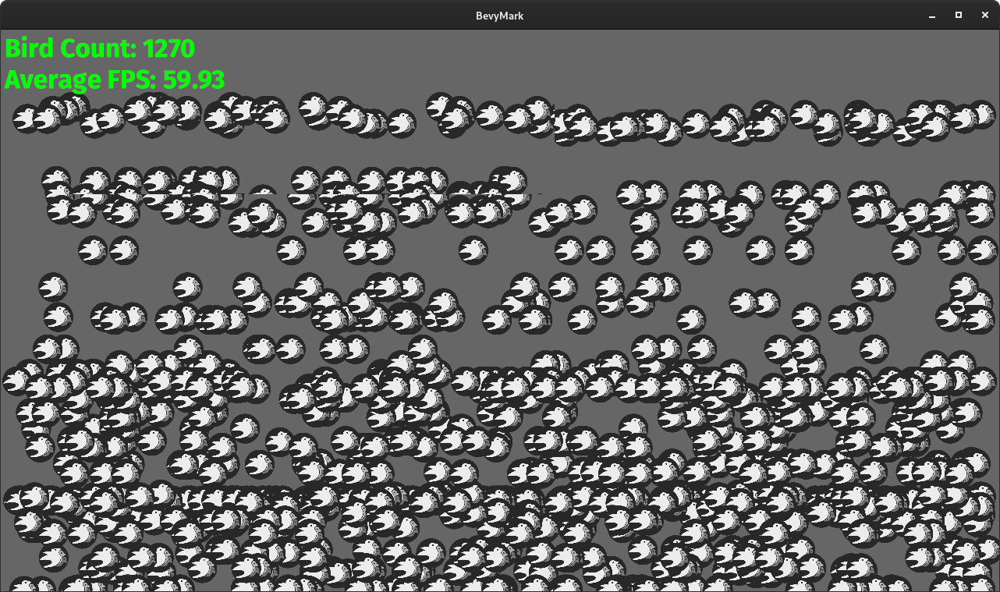

+++
title = "Bevy 0.4"
date = 2020-12-19
[extra]
author = "Carter Anderson"
twitter = "cart_cart"
github = "cart"
youtube = "cartdev"
image = "colonize.png"
show_image = true
image_subtitle = "Screenshot of Colonize: a Dwarf-Fortress/Rimworld-like game being developed in Bevy by @indiv0"
image_subtitle_link = "https://github.com/indiv0/colonize/"
+++

A little over a month after releasing Bevy 0.3, and thanks to **66** contributors, **178** pull requests, and our [**generous sponsors**](https://github.com/sponsors/cart), I'm happy to announce the **Bevy 0.4** release on [crates.io](https://crates.io/crates/bevy)!

For those who don't know, Bevy is a refreshingly simple data-driven game engine built in Rust. You can check out [Quick Start Guide](/learn/book/getting-started/) to get started. Bevy is also free and open source forever! You can grab the full [source code](https://github.com/bevyengine/bevy) on GitHub.

Here are some of the highlights from this release:

<!-- more -->

## WASM + WebGL2

<div class="release-feature-authors">authors: @mrk-its</div>

Bevy now has a WebGL2 render backend! @mrk-its has been hard at work building the [Bevy WebGL2 Plugin](https://github.com/mrk-its/bevy_webgl2) and expanding `bevy_render` to meet the needs of the web. He also put together a nice website showcasing various Bevy examples and games running on the web.

I think the results speak for themselves:

### [Bevy WebGL2 Showcase](https://mrk.sed.pl/bevy-showcase/)

[](https://mrk.sed.pl/bevy-showcase/)

## Cross Platform Main Function

<div class="release-feature-authors">authors: @cart</div>

On most supported Bevy platforms you can just use normal main functions (ex: Windows, MacOS, Linux, and Web). Here is the smallest possible Bevy app that runs on those platforms:

```rust
use bevy::prelude::*;

fn main() {
    App::build().run();
}
```

However some platforms (currently Android and iOS) require additional boilerplate. This arcane magic is error prone, takes up space, and isn't particularly nice to look at. Up until this point, Bevy users had to supply their own boilerplate ... but no more! **Bevy 0.4** adds a new `#[bevy_main]` proc-macro, which inserts the relevant boilerplate for you. This is a big step toward our "write once run anywhere" goal.

This Bevy App has all the code required to run on Windows, MacOS, Linux, Android, iOS, and Web:

```rust
use bevy::prelude::*;

#[bevy_main]
fn main() {
    App::build().run();
}
```

## Live Shader Reloading

<div class="release-feature-authors">authors: @yrns</div>

Bevy can now update changes to shaders at runtime, giving you instant feedback without restarting your app. This video isn't sped up!

<video controls loop><source  src="hot_shader_reloading.mp4" type="video/mp4"/></video>

## ECS Improvements

<div class="release-feature-authors">authors: @cart</div>

It wouldn't be a Bevy update without another round of ECS improvements!

### Flexible ECS Parameters

Prior versions of Bevy forced you to provide system parameters in a specific order:

```rust
/// This system followed the [Commands][Resources][Queries] order and compiled as expected
fn valid_system(mut commands: Commands, time: Res<Time>, query: Query<&Transform>) {
}

/// This system did not follow the required ordering, which caused compilation to fail
fn invalid_system(query: Query<&Transform>, mut commands: Commands, time: Res<Time>) {
}
```

Newbies would fall prey to this constantly. These completely arbitrary constraints were a quirk of the internal implementation. The `IntoSystem` trait was only implemented for specific orders. Supporting every order would have exponentially affected compile times. The internal implementation was also constructed with a [famously complicated macro](https://github.com/bevyengine/bevy/blob/9afe196f1690a6a6e47bf67ac740b4edeffd97bd/crates/bevy_ecs/src/system/into_system.rs#L158).

To resolve this, I completely rewrote how we generate systems. We now use a `SystemParam` trait, which we implement for each parameter type. This has a number of benefits:

* **Significantly Faster Compile Times**: We're seeing a <b style="color: rgb(50, 210, 50)">~25%</b> decrease in clean compile times
* **Use Any Parameter Order You Want**: No more arbitrary order restrictions!
* **Easily Add New Parameters**: It is now easy for us (and for users) to create new parameters. Just implement the `SystemParam` trait!
* **Simpler Implementation**: The new implementation is much smaller and also way easier to maintain and understand.

```rust
// In Bevy 0.4 this system is now perfectly valid. Cool!
fn system(query: Query<&Transform>, commands: &mut Commands, time: Res<Time>) {
}
```

Notice that in **Bevy 0.4**, commands now look like `commands: &mut Commands` instead of `mut commands: Commands`.

### Simplified Query Filters

Up until now, Bevy's Query filters were intermingled with components:

```rust
fn system(query: Query<With<A, Without<B, (&Transform, Changed<Velocity>)>>>) {
}
```

Confused? You wouldn't be the first! You can interpret the query above as "give me immutable references to the `Transform` and `Velocity` components of all entities that have the `A` component, _do not_ have the `B` component, and have a changed Velocity component".

First, the nesting of types via With / Without makes it very unclear whats going on. Additionally, it's hard to tell what the `Changed<Velocity>` parameter does. Is it just a filter? Does it also return a Velocity component? If so, is it immutable or mutable?

It made sense to break up these concepts. In **Bevy 0.4**, Query filters are separate from Query components. The query above looks like this:

```rust
// Query with filters
fn system(query: Query<(&Transform, &Velocity), (With<A>, Without<B>, Changed<Velocity>)>) {
}

// Query without filters
fn system(query: Query<(&Transform, &Velocity)>) {
}
```

This makes it much easier to tell what a Query is doing at a glance. It also makes for more composable behaviors. For example, you can now filter on `Changed<Velocity>` without actually retrieving the `Velocity` component.

And now that filters are a separate type, you can create type aliases for filters that you want to re-use:

```rust
type ChangedVelocity = (With<A>, Without<B>, Changed<Velocity>);

fn system(query: Query<(&Transform, &Velocity), ChangedVelocity>) {
}
```

### System Inputs, Outputs, and Chaining

Systems can now have inputs and outputs. This opens up a variety of interesting behaviors, such as system error handling:

```rust
fn main() {
  App::build()
    .add_system(result_system.system().chain(error_handler.system()))
    .run();
}

fn result_system(query: Query<&Transform>) -> Result<()> {
  let transform = query.get(SOME_ENTITY)?;
  println!("found entity transform: {:?}", transform);
  Ok(())
}

fn error_handler_system(In(result): In<Result<()>>, error_handler: Res<MyErrorHandler>) {
  if let Err(err) = result {
      error_handler.handle_error(err);
  }
}
```

The {{rust_type(type="trait" crate="bevy_ecs" version="0.4.0" name="System" no_mod=true)}} trait now looks like this:

```rust
// Has no inputs and no outputs
System<In = (), Out = ()>

// Takes a usize as input and return a f32
System<In = usize, Out = f32>
```

We use this feature in our new Schedule implementation.

### Schedule V2

Bevy's old Schedule was nice. System registrations were easy to read and easy to compose. But it also had significant limitations:

* Only one Schedule allowed
* Very static: you were limited to using the tools we gave you:
  * stages are just lists of systems
  * stages are added to schedules
  * stages use hard-coded system runners
* Couldn't switch between schedules at runtime
* Couldn't easily support "fixed timestep" scenarios

To solve these problems, I wrote a new Schedule system from scratch. Before you get worried, these are largely _non-breaking_ changes. The high level "app builder" syntax you know and love is still available:

```rust
app.add_system(my_system.system())
```

#### Stage Trait

Stages are now a trait. You can now implement your own {{rust_type(type="trait" crate="bevy_ecs" version="0.4.0" name="Stage" no_mod=true)}} types!

```rust
struct MyStage;

impl Stage for MyStage {
    fn run(&mut self, world: &mut World, resources: &mut Resources) {
        // Do stage stuff here.
        // You have unique access to the World and Resources, so you are free to do anything
    }
}
```

#### Stage Type: {{rust_type(type="struct" crate="bevy_ecs" version="0.4.0" name="SystemStage" no_mod=true)}}

This is basically a "normal" stage. You can add systems to it and you can decide how those systems will be executed (parallel, serial, or custom logic)

```rust
// runs systems in parallel (using the default parallel executor)
let parallel_stage =
    SystemStage::parallel()
        .with_system(a.system())
        .with_system(b.system());

// runs systems serially (in registration order)
let serial_stage =
    SystemStage::serial()
        .with_system(a.system())
        .with_system(b.system());

// you can also write your own custom SystemStageExecutor
let custom_executor_stage =
    SystemStage::new(MyCustomExecutor::new())
        .with_system(a.system())
        .with_system(b.system());
```

#### Stage Type: {{rust_type(type="struct" crate="bevy_ecs" version="0.4.0" name="Schedule" no_mod=true)}}

You read that right! {{rust_type(type="struct" crate="bevy_ecs" version="0.4.0" name="Schedule" no_mod=true)}} now implements the {{rust_type(type="trait" crate="bevy_ecs" version="0.4.0" name="Stage" no_mod=true)}} trait, which means you can nest Schedules within other schedules:

```rust
let schedule = Schedule::default()
    .with_stage("update", SystemStage::parallel()
        .with_system(a.system())
        .with_system(b.system())
    )
    .with_stage("nested", Schedule::default()
        .with_stage("nested_stage", SystemStage::serial()
            .with_system(b.system())
        )
    );
```

#### Run Criteria

You can add "run criteria" to any {{rust_type(type="struct" crate="bevy_ecs" version="0.4.0" name="SystemStage" no_mod=true)}} or {{rust_type(type="struct" crate="bevy_ecs" version="0.4.0" name="Schedule" no_mod=true)}}.

```rust
// A "run criteria" is just a system that returns a `ShouldRun` result
fn only_on_10_criteria(value: Res<usize>) -> ShouldRun {
    if *value == 10 { 
        ShouldRun::Yes 
    } else { 
        ShouldRun::No
    }
}

app
    // this stage only runs when Res<usize> has a value of 10
    .add_stage_after(stage::UPDATE, "only_on_10_stage", SystemStage::parallel()
        .with_run_criteria(only_on_10_criteria.system())
        .with_system(my_system.system())
    )
    // this stage only runs once
    .add_stage_after(stage::RUN_ONCE, "one_and_done", Schedule::default()
        .with_run_criteria(RunOnce::default())
        .with_system(my_system.system())
    )
```

#### Fixed Timestep

You can now run stages on a "fixed timestep".

```rust
// this stage will run once every 0.4 seconds
app.add_stage_after(stage::UPDATE, "fixed_update", SystemStage::parallel()
    .with_run_criteria(FixedTimestep::step(0.4))
    .with_system(my_system.system())
)
```

This builds on top of `ShouldRun::YesAndLoop`, which ensures that the schedule continues to loop until it has consumed all accumulated time.

Check out the excellent ["Fix Your Timestep!"](https://gafferongames.com/post/fix_your_timestep/) article if you want to learn more about fixed timesteps.

#### Typed Stage Builders

Now that stages can be any type, we need a way for {{rust_type(type="trait" crate="bevy_app" version="0.4.0" name="Plugin" no_mod=true plural=true)}} to interact with arbitrary stage types:

```rust
app
    // this "high level" builder pattern still works (and assumes that the stage is a SystemStage)
    .add_system(some_system.system())
    // this "low level" builder is equivalent to add_system()
    .stage(stage::UPDATE, |stage: &mut SystemStage|
        stage.add_system(some_system.system())
    )
    // this works for custom stage types too
    .stage(MY_CUSTOM_STAGE, |stage: &mut MyCustomStage|
        stage.do_custom_thing()
    )
```

### Deprecated For-Each Systems

Prior versions of Bevy supported "for-each" systems, which looked like this:

```rust
// on each update this system runs once for each entity with a Transform component
fn system(time: Res<Time>, entity: Entity, transform: Mut<Transform>) {
    // do per-entity logic here
}
```

From now on, the system above should be written like this:

```rust
// on each update this system runs once and internally iterates over each entity
fn system(time: Res<Time>, query: Query<(Entity, &mut Transform)>) {
    for (entity, mut transform) in query.iter_mut() {
        // do per-entity logic here
    }
}
```

For-each systems were nice to look at and sometimes saved some typing. Why remove them?

1. For-each systems were fundamentally limited in a number of ways. They couldn't iterate removed components, filter, control iteration, or use multiple queries at the same time. This meant they needed to be converted to "query systems" as soon as those features were needed.
2. Bevy should generally have "one way to do things". For-each systems were a slightly more ergonomic way to define a small subset of system types. This forced people to make a "design decision" when they shouldn't need to. It also made examples and tutorials inconsistent according to people's preferences for one or the other.
3. There were a number of "gotchas" for newcomers that constantly come up in our support forums and confused newbies:
    * users expect `&mut T` queries to work in foreach systems (ex: `fn system(a: &mut A) {}`). These can't work because we require `Mut<T>` tracking pointers to ensure change tracking always works as expected. The equivalent `Query<&mut A>` works because we can return the tracking pointer when iterating the Query.
    * A "run this for-each system on some criteria" bug that was common enough that we had to cover it in the Bevy Book.
4. They increased compile times. Removing for-each systems saved me about ~5 seconds on clean Bevy compiles)
5. Their internal implementation required a complicated macro. This affected maintainability.

## States

<div class="release-feature-authors">authors: @cart</div>

By popular demand, Bevy now supports States. These are logical "app states" that allow you to enable/disable systems according to the state your app is in.

States are defined as normal Rust enums:

```rust
#[derive(Clone)]
enum AppState {
    Loading,
    Menu,
    InGame
}
```

You then add them to your app as a resource like this:

```rust
// add a new AppState resource that defaults to the Loading state
app.add_resource(State::new(AppState::Loading))
```

To run systems according to the current state, add a {{rust_type(type="struct" crate="bevy_ecs" version="0.4.0" name="StateStage" no_mod=true)}}:

```rust
app.add_stage_after(stage::UPDATE, STAGE, StateStage::<AppState>::default())
```

You can then add systems for each state value / lifecycle-event like this:

```rust
app
    .on_state_enter(STAGE, AppState::Menu, setup_menu.system())
    .on_state_update(STAGE, AppState::Menu, menu.system())
    .on_state_exit(STAGE, AppState::Menu, cleanup_menu.system())
    .on_state_enter(STAGE, AppState::InGame, setup_game.system())
    .on_state_update(STAGE, AppState::InGame, movement.system())
```

Notice that there are different "lifecycle events":

* **on_enter**: Runs once when first entering a state
* **on_exit**: Runs once when exiting a state
* **on_update**: Runs exactly once on every run of the stage (after any on_enter or on_exit events have been run)

You can queue a state change from a system like this:

```rust
fn system(mut state: ResMut<State<AppState>>) {
    state.set_next(AppState::InGame).unwrap();
}
```

Queued state changes get applied at the end of the StateStage. If you change state within a StateStage, the lifecycle events will occur in the same update/frame. You can do this any number of times (aka it will continue running state lifecycle systems until no more changes are queued). This ensures that multiple state changes can be applied within the same frame.

## GLTF Improvements

<div class="release-feature-authors">authors: @iwikal, @FuriouZz, @rod-salazar</div>

Bevy's GLTF loader now imports Cameras. Here is a simple scene setup in Blender:


And here is how it looks in Bevy (the lighting is different because we don't import lights yet):


There were also a number of other improvements:

* Pixel format conversion while importing images from a GLTF
* Default material loading
* Hierarchy fixes

## Spawn Scenes as Children

<div class="release-feature-authors">authors: @mockersf</div>

Scenes can now be spawned as children like this:

```rust
commands
    .spawn((
        Transform::from_translation(Vec3::new(0.5, 0.0, 0.0)),
        GlobalTransform::default(),
    ))
    .with_children(|parent| {
        parent.spawn_scene(asset_server.load("scene.gltf"));
    });
```

By spawning beneath a parent, this enables you to do things like translate/rotate/scale multiple instances of the same scene:


## Dynamic Linking

<div class="release-feature-authors">authors: @bjorn3, @cart</div>

@bjorn3 discovered that you can force Bevy to dynamically link.

This _significantly_ reduces iterative compile times. Check out how long it takes to compile a change made to the `3d_scene.rs` example with the [Fast Compiles Config](https://bevyengine.org/learn/book/getting-started/setup/) _and_ dynamic linking:


### Time To Compile Change To 3d_scene Example (in seconds, less is better)


We added a cargo feature to easily enable dynamic linking during development

```sh
# for a bevy app
cargo run --features bevy/dynamic

# for bevy examples
cargo run --features dynamic --example breakout
```

Just keep in mind that you should disable the feature when publishing your game.

## Text Layout Improvements

<div class="release-feature-authors">authors: @AlisCode, @tigregalis</div>

Prior Bevy releases used a custom, naive text layout system. It had a number of bugs and limitations, such as the infamous "wavy text" bug:


The new text layout system uses glyph_brush_layout, which fixes the layout bugs and adds a number of new layout options. Note that the "Fira Sans" font used in the example has some stylistic "waviness" ... this isn't a bug:


## Renderer Optimization

<div class="release-feature-authors">authors: @cart</div>

Bevy's render api was built to be easy to use and extend. I wanted to nail down a good api first, but that resulted in a number of performance TODOs that caused some pretty serious overhead.

For **Bevy 0.4** I decided to resolve as many of those TODOs as I could. There is still plenty more to do (like instancing and batching), but Bevy already performs _much_ better than it did before.

### Incrementalize Everything

Most of Bevy's high level render abstractions were designed to be incrementally updated, but when I was first building the engine, ECS change detection wasn't implemented. Now that we have all of these nice optimization tools, it makes sense to use them!

For the first optimization round, I incrementalized as much as I could:

* Added change detection to RenderResourceNode, Sprites, and Transforms, which improved performance when those values don't change
* Only sync asset gpu data when the asset changes
* Share asset RenderResourceBindings across all entities that reference an asset
* Mesh provider system now only updates mesh specialization when it needs to
* Stop clearing bind groups every frame and remove stale bind groups every other frame
* Cache unmatched render resource binding results (which prevents redundant computations per-entity per-frame)
* Don't send render pass state change commands when the state has not actually changed

#### Frame Time to Draw 10,000 Static Sprites (in milliseconds, less is better)


#### Frame Time to Draw 10,000 Moving Sprites (in milliseconds, less is better)


### Optimize Text Rendering (and other immediate rendering)

Text Rendering (and anything else that used the `SharedBuffers` immediate-rendering abstraction) was _extremely_ slow in prior Bevy releases. This was because the `SharedBuffers` abstraction was a placeholder implementation that didn't actually share buffers. By implementing the "real" `SharedBuffers` abstraction, we got a pretty significant text rendering speed boost.

#### Frame Time to Draw "text_debug" Example  (in milliseconds, less is better)


### Mailbox Vsync

Bevy now uses wgpu's "mailbox vsync" by default. This reduces input latency on platforms that support it.

## Reflection

<div class="release-feature-authors">authors: @cart</div>

Rust has a pretty big "reflection" gap. For those who aren't aware, "reflection" is a class of language feature that enables you to interact with language constructs at runtime. They add a form of "dynamic-ness" to what are traditionally static language concepts.

We have bits and pieces of reflection in Rust, such as {{rust_type(type="struct" crate="std", mod="any", name="TypeId")}} and {{rust_type(type="fn" crate="std", mod="any", name="type_name")}}. But when it comes to interacting with datatypes ... we don't have anything yet. This is unfortunate because some problems are inherently dynamic in nature.

When I was first building Bevy, I decided that the engine would benefit from such features. Reflection is a good foundation for scene systems, Godot-like (or Unity-like) property animation systems, and editor inspection tools. I built the `bevy_property` and `bevy_type_registry` crates to fill these needs.

They got the job done, but they were custom-tailored to Bevy's needs, were full of custom jargon (rather than reflecting Rust language constructs directly), didn't handle traits, and had a number of fundamental restrictions on how data could be accessed.

In this release we replaced the old `bevy_property` and `bevy_type_registry` crates with a new {{rust_mod(crate="bevy_reflect" version="0.4.0")}} crate. Bevy Reflect is intended to be a "generic" Rust reflection crate. I'm hoping it will be as useful for non-Bevy projects as it is for Bevy. We now use it for our Scene system, but in the future we will use it for animating Component fields and auto-generating Bevy Editor inspector widgets.

Bevy Reflect enables you to dynamically interact with Rust types by deriving the {{rust_type(type="trait" crate="bevy_reflect" version="0.4.0" name="Reflect" no_mod=true)}} trait:

```rust
#[derive(Reflect)]
struct Foo {
    a: u32,
    b: Vec<Bar>,
    c: Vec<u32>,
}

#[derive(Reflect)]
struct Bar {
    value: String
}

// I'll use this value to illustrate `bevy_reflect` features
let mut foo = Foo {
    a: 1,
    b: vec![Bar { value: "hello world" }]
    c: vec![1, 2]
};
```

### Interact with Fields Using Their Names

```rust
assert_eq!(*foo.get_field::<u32>("a").unwrap(), 1);

*foo.get_field_mut::<u32>("a").unwrap() = 2;

assert_eq!(foo.a, 2);
```

### Patch Your Types With New Values

```rust
let mut dynamic_struct = DynamicStruct::default();
dynamic_struct.insert("a", 42u32);
dynamic_struct.insert("c", vec![3, 4, 5]);

foo.apply(&dynamic_struct);

assert_eq!(foo.a, 42);
assert_eq!(foo.c, vec![3, 4, 5]);
```

### Look Up Nested Fields Using "Path Strings"

```rust
let value = *foo.get_path::<String>("b[0].value").unwrap();
assert_eq!(value.as_str(), "hello world");
```

### Iterate Over Struct Fields

```rust
for (i, value: &Reflect) in foo.iter_fields().enumerate() {
    let field_name = foo.name_at(i).unwrap();
    if let Ok(value) = value.downcast_ref::<u32>() {
        println!("{} is a u32 with the value: {}", field_name, *value);
    } 
}
```

### Automatically Serialize And Deserialize With Serde

This doesn't require manual Serde impls!

```rust
let mut registry = TypeRegistry::default();
registry.register::<u32>();
registry.register::<String>();
registry.register::<Bar>();

let serializer = ReflectSerializer::new(&foo, &registry);
let serialized = ron::ser::to_string_pretty(&serializer, ron::ser::PrettyConfig::default()).unwrap();

let mut deserializer = ron::de::Deserializer::from_str(&serialized).unwrap();
let reflect_deserializer = ReflectDeserializer::new(&registry);
let value = reflect_deserializer.deserialize(&mut deserializer).unwrap();
let dynamic_struct = value.take::<DynamicStruct>().unwrap();

/// reflect has its own partal_eq impl
assert!(foo.reflect_partial_eq(&dynamic_struct).unwrap());
```

### Trait Reflection

You can now call a trait on a given `&dyn Reflect` reference without knowing the underlying type! This is a form of magic that should probably be avoided in most situations. But in the few cases where it is completely necessary, it is very useful:

```rust
#[derive(Reflect)]
#[reflect(DoThing)]
struct MyType {
    value: String,
}

impl DoThing for MyType {
    fn do_thing(&self) -> String {
        format!("{} World!", self.value)
    }
}

#[reflect_trait]
pub trait DoThing {
    fn do_thing(&self) -> String;
}

// First, lets box our type as a Box<dyn Reflect>
let reflect_value: Box<dyn Reflect> = Box::new(MyType {
    value: "Hello".to_string(),
});

/* 
This means we no longer have direct access to MyType or it methods. We can only call Reflect methods on reflect_value. What if we want to call `do_thing` on our type? We could downcast using reflect_value.get::<MyType>(), but what if we don't know the type at compile time?
*/

// Normally in rust we would be out of luck at this point. Lets use our new reflection powers to do something cool!
let mut type_registry = TypeRegistry::default()
type_registry.register::<MyType>();

/*
The #[reflect] attribute we put on our DoThing trait generated a new `ReflectDoThing` struct, which implements TypeData. This was added to MyType's TypeRegistration.
*/

let reflect_do_thing = type_registry
    .get_type_data::<ReflectDoThing>(reflect_value.type_id())
    .unwrap();

// We can use this generated type to convert our `&dyn Reflect` reference to an `&dyn DoThing` reference
let my_trait: &dyn DoThing = reflect_do_thing.get(&*reflect_value).unwrap();

// Which means we can now call do_thing(). Magic!
println!("{}", my_trait.do_thing());
```

## 3D Texture Assets

<div class="release-feature-authors">authors: @bonsairobo</div>

The Texture asset now has support for 3D textures. The new `array_texture.rs` example illustrates how to load a 3d texture and sample from each "layer".


## Logging and Profiling

<div class="release-feature-authors">authors: @superdump, @cart</div>

Bevy finally has built in logging, which is now enabled by default via the new {{rust_type(type="struct" crate="bevy_log" version="0.4.0" name="LogPlugin" no_mod=true)}}. We evaluated various logging libraries and eventually landed on the new `tracing` crate. `tracing` is a structured logger that handles async / parallel logging well (perfect for an engine like Bevy), and enables profiling in addition to "normal" logging.

The {{rust_type(type="struct" crate="bevy_log" version="0.4.0" name="LogPlugin" no_mod=true)}} configures each platform to log to the appropriate backend by default: the terminal on desktop, the console on web, and Android Logs / logcat on Android. We built a new Android `tracing` backend because one didn't exist yet.

### Logging

Bevy's internal plugins now generate `tracing` logs. And you can easily add logs to your own app logic like this:

```rust
// these are imported by default in bevy::prelude::*
trace!("very noisy");
debug!("helpful for debugging");
info!("helpful information that is worth printing by default");
warn!("something bad happened that isn't a failure, but thats worth calling out");
error!("something failed");
```

These lines result in pretty-printed terminal logs:


`tracing` has a ton of useful features like structured logging and filtering. [Check out their documentation for more info.](https://docs.rs/tracing/*/tracing/)

### Profiling

We have added the option to add "tracing spans" to all ECS systems by enabling the `trace` feature. We also have built in support for the `tracing-chrome` extension, which causes Bevy to output traces in the "chrome tracing" format.

If you run your app with `cargo run --features bevy/trace,bevy/trace_chrome` you will get a json file which can be opened in Chrome browsers by visiting the `chrome://tracing` url:


@superdump added support for those nice "span names" to upstream `tracing_chrome`.

## HIDPI

<div class="release-feature-authors">authors: @mockersf, @blunted2night, @cart</div>

Bevy now handles HIDPI / Retina / high pixel density displays properly:

* OS-reported pixel density is now taken into account when creating windows. If a Bevy App asks for a 1280x720 window on a 2x pixel density display, it will create a window that is 2560x1440
* Window width/height is now reported in "logical units" (1280x720 in the example above). Physical units are still available using the `window.physical_width()` and `window.physical_height()` methods.
* Window "swap chains" are created using the physical resolution to ensure we still have crisp rendering (2560x1440 in the example above)
* Bevy UI has been adapted to handle HIDPI scaling correctly

There is still a bit more work to be done here. While Bevy UI renders images and boxes at crisp HIDPI resolutions, text is still rendered using the logical resolution, which means it won't be as crisp as it could be on HIDPI displays.

## Timer Improvements

<div class="release-feature-authors">authors: @amberkowalski, @marcusbuffett, @CleanCut</div>

Bevy's Timer component/resource got a number of quality-of-life improvements: pausing, field accessor methods, ergonomics improvements, and internal refactoring / code quality improvements. Timer Components also no longer tick by default. Timer resources and newtyped Timer components couldn't tick by default, so it was a bit inconsistent to have the (relatively uncommon) "unwrapped component Timer" auto-tick.

The timer api now looks like this:

```rust

struct MyTimer {
    timer: Timer,
}

fn main() {
    App::build()
        .add_resource(MyTimer {
            // a five second non-repeating timer
            timer: Timer::from_seconds(5.0, false),
        })
        .add_system(timer_system.system())
        .run();
}


fn timer_system(time: Res<Time>, my_timer: ResMut<MyTimer>) {
    if my_timer.timer.tick(time.delta_seconds()).just_finished() {
        println!("five seconds have passed");
    }
}
```

## Task System Improvements

<div class="release-feature-authors">authors: @aclysma</div>

@aclysma changed how Bevy Tasks schedules work, which increased performance in the `breakout.rs` example game by <b style="color: rgb(50, 210, 50)">~20%</b> and resolved a [deadlock](https://github.com/bevyengine/bevy/pull/892) when a Task Pool is configured to only have one thread. Tasks are now executed on the calling thread immediately when there is only one task to run, which cuts down on the overhead of moving work to other threads / blocking on them to finish.

## Apple Silicon Support

<div class="release-feature-authors">authors: @frewsxcv, @wyhaya, @scoopr</div>

Bevy now runs on Apple silicon thanks to upstream work on winit (@scoopr) and coreaudio-sys (@wyhaya). @frewsxcv and @wyhaya updated Bevy's dependencies and verified that it builds/runs on Apple's new chips.

## New Examples

### Bevy Contributors

<div class="release-feature-authors">author: @karroffel</div>

@karroffel added a fun example that represents each Bevy contributor as a "Bevy Bird". It scrapes the latest contributor list from git.


### BevyMark

<div class="release-feature-authors">author: @robdavenport</div>

A "bunnymark-style" benchmark illustrating Bevy's sprite rendering performance. This was useful when implementing the renderer optimizations mentioned above.



## Change Log

### Added

* [add bevymark benchmark example][273]
* [gltf: support camera and fix hierarchy][772]
* [Add tracing spans to schedules, stages, systems][789]
* [add example that represents contributors as bevy icons][801]
* [Add received character][805]
* [Add bevy_dylib to force dynamic linking of bevy][808]
* [Added RenderPass::set_scissor_rect][815]
* [`bevy_log`][836]
  * Adds logging functionality as a Plugin.
  * Changes internal logging to work with the new implementation.
* [cross-platform main function][847]
* [Controllable ambient light color][852]
  * Added a resource to change the current ambient light color for PBR.
* [Added more basic color constants][859]
* [Add box shape][883]
* [Expose an EventId for events][894]
* [System Inputs, Outputs, and Chaining][876]
* [Expose an `EventId` for events][894]
* [Added `set_cursor_position` to `Window`][917]
* [Added new Bevy reflection system][926]
  * Replaces the properties system
* [Add support for Apple Silicon][928]
* [Live reloading of shaders][937]
* [Store mouse cursor position in Window][940]
* [Add removal_detection example][945]
* [Additional vertex attribute value types][946]
* [Added WindowFocused event][956]
* [Tracing chrome span names][979]
* [Allow windows to be maximized][1004]
* [GLTF: load default material][1016]
* [can spawn a scene from a ChildBuilder, or directly set its parent when spawning it][1026]
* [add ability to load `.dds`, `.tga`, and `.jpeg` texture formats][1038]
* [add ability to provide custom a `AssetIo` implementation][1037]

### Changed

* [delegate layout reflection to RenderResourceContext][691]
* [Fall back to remove components one by one when failing to remove a bundle][719]
* [Port hecs derive macro improvements][761]
* [Use glyph_brush_layout and add text alignment support][765]
* [upgrade glam and hexasphere][791]
* [Flexible ECS Params][798]
* [Make Timer.tick return &Self][820]
* [FileAssetIo includes full path on error][821]
* [Removed ECS query APIs that could easily violate safety from the public interface][829]
* [Changed Query filter API to be easier to understand][834]
* [bevy_render: delegate buffer aligning to render_resource_context][842]
* [wasm32: non-spirv shader specialization][843]
* [Renamed XComponents to XBundle][863]
* [Check for conflicting system resource parameters][864]
* [Tweaks to TextureAtlasBuilder.finish()][887]
* [do not spend time drawing text with is_visible = false][893]
* [Extend the Texture asset type to support 3D data][903]
* [Breaking changes to timer API][914]
  * Created getters and setters rather than exposing struct members.
* [Removed timer auto-ticking system][931]
  * Added an example of how to tick timers manually.
* [When a task scope produces <= 1 task to run, run it on the calling thread immediately][932]
* [Breaking changes to Time API][934]
  * Created getters to get `Time` state and made members private.
  * Modifying `Time`'s values directly is no longer possible outside of bevy.
* [Use `mailbox` instead of `fifo` for vsync on supported systems][920]
* [switch winit size to logical to be dpi independent][947]
* [Change bevy_input::Touch API to match similar APIs][952]
* [Run parent-update and transform-propagation during the "post-startup" stage (instead of "startup")][955]
* [Renderer Optimization Round 1][958]
* [Change`TextureAtlasBuilder` into expected Builder conventions][969]
* [Optimize Text rendering / SharedBuffers][972]
* [hidpi swap chains][973]
* [optimize asset gpu data transfer][987]
* [naming coherence for cameras][995]
* [Schedule v2][1021]
* [Use shaderc for aarch64-apple-darwin][1027]
* [update `Window`'s `width` & `height` methods to return `f32`][1033]
* [Break out Visible component from Draw][1034]
  * Users setting `Draw::is_visible` or `Draw::is_transparent` should now set `Visible::is_visible` and `Visible::is_transparent`
* [`winit` upgraded from version 0.23 to version 0.24][1043]
* [set is_transparent to true by default for UI bundles][1071]

### Fixed

* [Fixed typos in KeyCode identifiers][857]
* [Remove redundant texture copies in TextureCopyNode][871]
* [Fix a deadlock that can occur when using scope() on ComputeTaskPool from within a system][892]
* [Don't draw text that isn't visible][893]
* [Use `instant::Instant` for WASM compatibility][895]
* [Fix pixel format conversion in bevy_gltf][897]
* [Fixed duplicated children when spawning a Scene][904]
* [Corrected behaviour of the UI depth system][905]
* [Allow despawning of hierarchies in threadlocal systems][908]
* [Fix `RenderResources` index slicing][948]
* [Run parent-update and transform-propagation during the "post-startup" stage][955]
* [Fix collision detection by comparing abs() penetration depth][966]
* [deal with rounding issue when creating the swap chain][997]
* [only update components for entities in map][1023]
* [Don't panic when attempting to set shader defs from an asset that hasn't loaded yet][1035]

[273]: https://github.com/bevyengine/bevy/pull/273
[691]: https://github.com/bevyengine/bevy/pull/691
[719]: https://github.com/bevyengine/bevy/pull/719
[761]: https://github.com/bevyengine/bevy/pull/761
[765]: https://github.com/bevyengine/bevy/pull/765
[772]: https://github.com/bevyengine/bevy/pull/772
[789]: https://github.com/bevyengine/bevy/pull/789
[791]: https://github.com/bevyengine/bevy/pull/791
[798]: https://github.com/bevyengine/bevy/pull/798
[801]: https://github.com/bevyengine/bevy/pull/801
[805]: https://github.com/bevyengine/bevy/pull/805
[808]: https://github.com/bevyengine/bevy/pull/808
[815]: https://github.com/bevyengine/bevy/pull/815
[820]: https://github.com/bevyengine/bevy/pull/820
[821]: https://github.com/bevyengine/bevy/pull/821
[829]: https://github.com/bevyengine/bevy/pull/829
[834]: https://github.com/bevyengine/bevy/pull/834
[836]: https://github.com/bevyengine/bevy/pull/836
[842]: https://github.com/bevyengine/bevy/pull/842
[843]: https://github.com/bevyengine/bevy/pull/843
[847]: https://github.com/bevyengine/bevy/pull/847
[852]: https://github.com/bevyengine/bevy/pull/852
[857]: https://github.com/bevyengine/bevy/pull/857
[859]: https://github.com/bevyengine/bevy/pull/859
[863]: https://github.com/bevyengine/bevy/pull/863
[864]: https://github.com/bevyengine/bevy/pull/864
[871]: https://github.com/bevyengine/bevy/pull/871
[876]: https://github.com/bevyengine/bevy/pull/876
[883]: https://github.com/bevyengine/bevy/pull/883
[887]: https://github.com/bevyengine/bevy/pull/887
[892]: https://github.com/bevyengine/bevy/pull/892
[893]: https://github.com/bevyengine/bevy/pull/893
[894]: https://github.com/bevyengine/bevy/pull/894
[895]: https://github.com/bevyengine/bevy/pull/895
[897]: https://github.com/bevyengine/bevy/pull/897
[903]: https://github.com/bevyengine/bevy/pull/903
[904]: https://github.com/bevyengine/bevy/pull/904
[905]: https://github.com/bevyengine/bevy/pull/905
[908]: https://github.com/bevyengine/bevy/pull/908
[914]: https://github.com/bevyengine/bevy/pull/914
[917]: https://github.com/bevyengine/bevy/pull/917
[920]: https://github.com/bevyengine/bevy/pull/920
[926]: https://github.com/bevyengine/bevy/pull/926
[928]: https://github.com/bevyengine/bevy/pull/928
[931]: https://github.com/bevyengine/bevy/pull/931
[932]: https://github.com/bevyengine/bevy/pull/932
[934]: https://github.com/bevyengine/bevy/pull/934
[937]: https://github.com/bevyengine/bevy/pull/937
[940]: https://github.com/bevyengine/bevy/pull/940
[945]: https://github.com/bevyengine/bevy/pull/945
[946]: https://github.com/bevyengine/bevy/pull/946
[947]: https://github.com/bevyengine/bevy/pull/947
[948]: https://github.com/bevyengine/bevy/pull/948
[952]: https://github.com/bevyengine/bevy/pull/952
[955]: https://github.com/bevyengine/bevy/pull/955
[956]: https://github.com/bevyengine/bevy/pull/956
[958]: https://github.com/bevyengine/bevy/pull/958
[966]: https://github.com/bevyengine/bevy/pull/966
[969]: https://github.com/bevyengine/bevy/pull/969
[972]: https://github.com/bevyengine/bevy/pull/972
[973]: https://github.com/bevyengine/bevy/pull/973
[979]: https://github.com/bevyengine/bevy/pull/979
[987]: https://github.com/bevyengine/bevy/pull/987
[995]: https://github.com/bevyengine/bevy/pull/995
[997]: https://github.com/bevyengine/bevy/pull/997
[1004]: https://github.com/bevyengine/bevy/pull/1004
[1016]: https://github.com/bevyengine/bevy/pull/1016
[1021]: https://github.com/bevyengine/bevy/pull/1021
[1023]: https://github.com/bevyengine/bevy/pull/1023
[1026]: https://github.com/bevyengine/bevy/pull/1026
[1027]: https://github.com/bevyengine/bevy/pull/1027
[1033]: https://github.com/bevyengine/bevy/pull/1033
[1034]: https://github.com/bevyengine/bevy/pull/1034
[1035]: https://github.com/bevyengine/bevy/pull/1035
[1037]: https://github.com/bevyengine/bevy/pull/1037
[1038]: https://github.com/bevyengine/bevy/pull/1038
[1043]: https://github.com/bevyengine/bevy/pull/1043
[1071]: https://github.com/bevyengine/bevy/pull/1071

## Contributors

A huge thanks to the **66 contributors** that made this release (and associated docs) possible!

* @0x6273
* @aclysma
* @ak-1
* @alec-deason
* @AlisCode
* @amberkowalski
* @bjorn3
* @blamelessgames
* @blunted2night
* @bonsairobo
* @cart
* @CleanCut
* @ColdIce1605
* @dallenng
* @e00E
* @easynam
* @frewsxcv
* @FuriouZz
* @Git0Shuai
* @iMplode-nZ
* @iwikal
* @jcornaz
* @Jerald
* @joshuajbouw
* @julhe
* @karroffel
* @Keats
* @Kurble
* @lassade
* @lukors
* @marcusbuffett
* @marius851000
* @memoryruins
* @MGlolenstine
* @milkybit
* @MinerSebas
* @mkhan45
* @mockersf
* @Moxinilian
* @mrk-its
* @mvlabat
* @nic96
* @no1hitjam
* @octtep
* @OptimisticPeach
* @Plecra
* @PrototypeNM1
* @rmsthebest
* @RobDavenport
* @robertwayne
* @rod-salazar
* @sapir
* @sburris0
* @sdfgeoff
* @shirshak55
* @smokku
* @steveyen
* @superdump
* @SvenTS
* @tangmi
* @thebluefish
* @Tiagojdferreira
* @tigregalis
* @toothbrush7777777
* @Veykril
* @yrns
