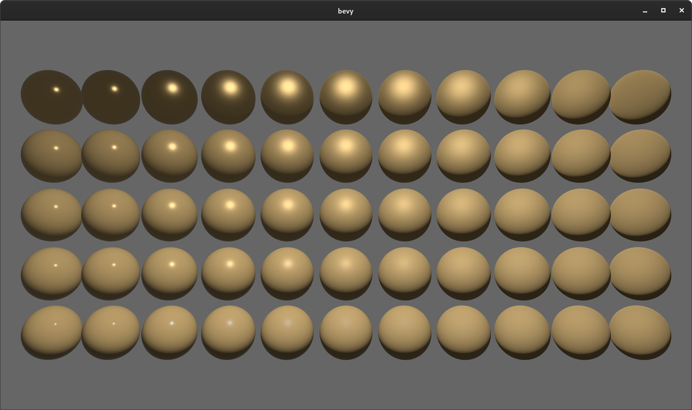
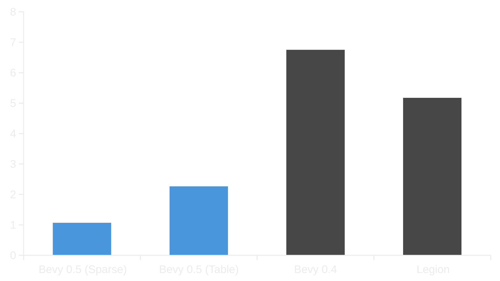
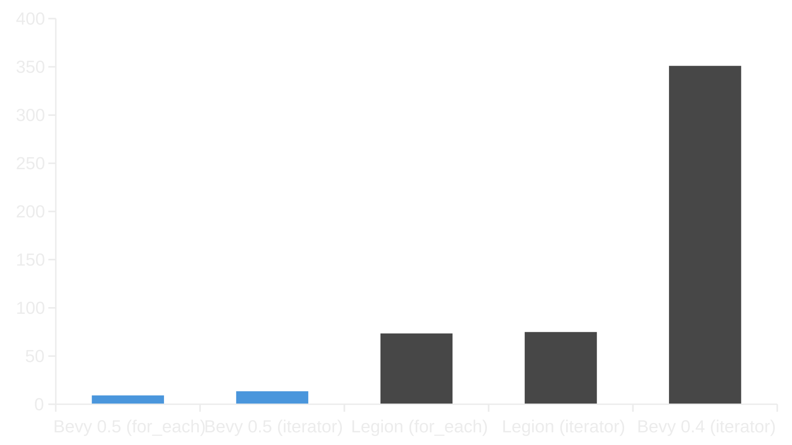
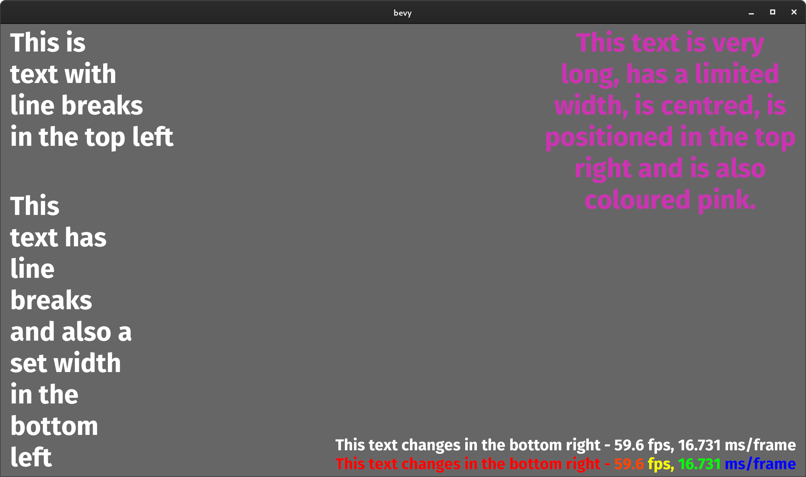
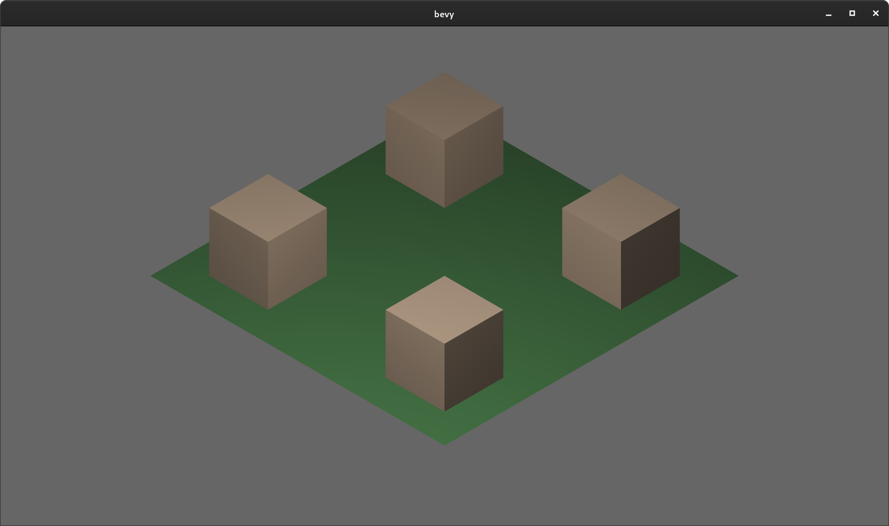
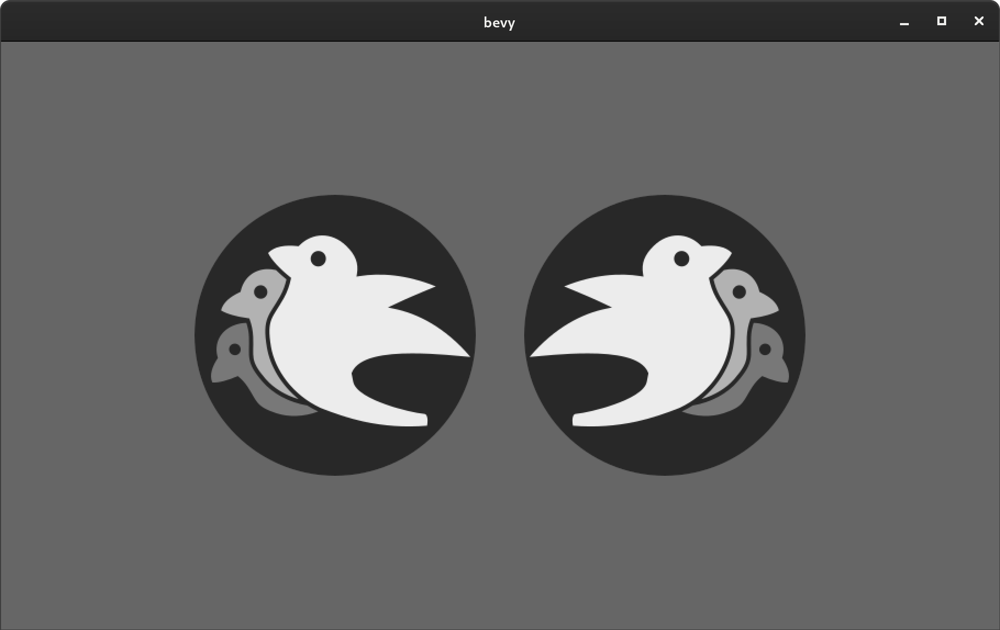
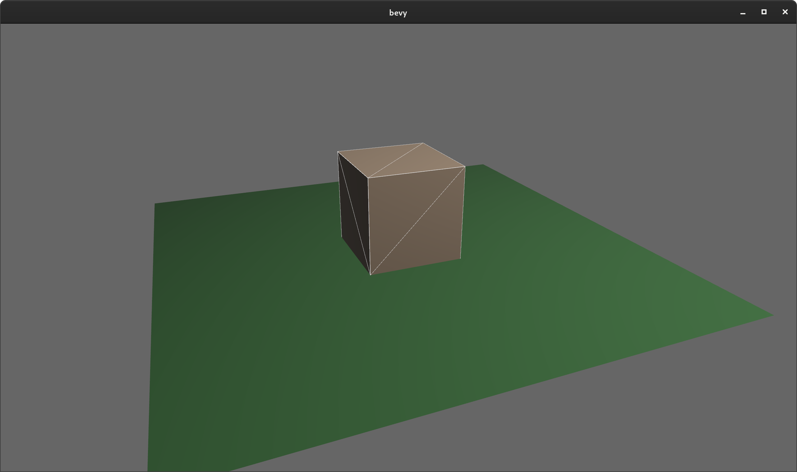
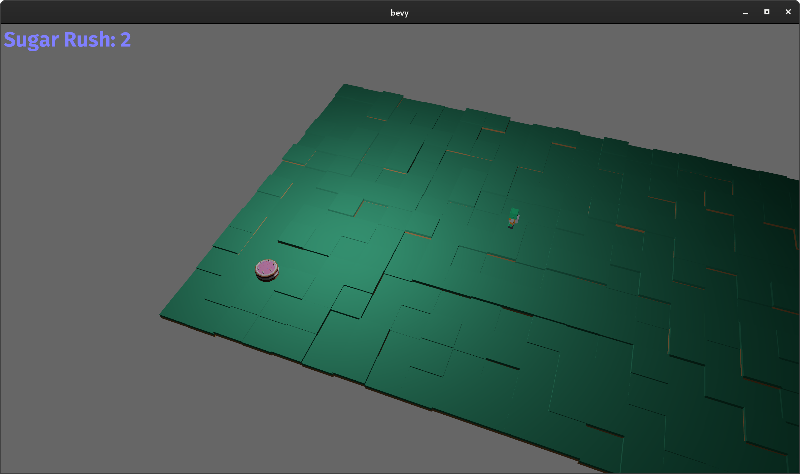

+++
title = "Bevy 0.5"
date = 2021-04-04
[extra]
author = "Carter Anderson"
twitter = "cart_cart"
github = "cart"
youtube = "cartdev"
image = "ante.png"
show_image = true
image_subtitle = "Screenshot of Ante: a voxel builder game being developed in Bevy by @TheNeikos"
image_subtitle_link = ""
+++

Thanks to **88** contributors, **283** pull requests, and our [**generous sponsors**](https://github.com/sponsors/cart), I'm happy to announce the **Bevy 0.5** release on [crates.io](https://crates.io/crates/bevy)!

For those who don't know, Bevy is a refreshingly simple data-driven game engine built in Rust. You can check out [Quick Start Guide](/learn/book/getting-started/) to get started. Bevy is also free and open source forever! You can grab the full [source code](https://github.com/bevyengine/bevy) on GitHub.

**Bevy 0.5** is quite a bit bigger than our past few releases (and took a bit longer) as we have made a number of foundational changes.

Here are some of the highlights from this release:


<!-- more -->

## Physically Based Rendering (PBR)

<div class="release-feature-authors">authors: @StarArawn, @mtsr, @mockersf, @IngmarBitter, @Josh015, @norgate, @cart</div>

Bevy now uses PBR shaders when rendering. PBR is a semi-standard approach to rendering that attempts to use approximations of real-world "physically based" lighting and material properties. We largely use techniques from the [Filament](https://github.com/google/filament/) PBR implementation, but we also incorporate some ideas from [Unreal](https://www.unrealengine.com/en-US/blog/physically-based-shading-on-mobile) and [Disney](https://google.github.io/filament/Filament.html#citation-burley12).

Bevy's `StandardMaterial` now has `base_color`, `roughness`, `metallic`, `reflection`, and `emissive` properties. It also now supports textures for `base_color`, `normal_map`, `metallic_roughness`, `emissive`, and `occlusion` properties. 

The new PBR example helps visualize these new material properties:



## GLTF Improvements

### PBR Textures

<div class="release-feature-authors">authors: @mtsr, @mockersf</div>

The GLTF loader now supports normal maps, metallic/roughness, occlusion, and emissive textures. Our "flight helmet" gltf example utilizes the new PBR texture support and looks much nicer as a result:

<video controls loop><source src="flighthelmet.webm" type="video/webm"/></video>

### Top-Level GLTF Asset

<div class="release-feature-authors">authors: @mockersf</div>

Previously it was hard to interact with GLTF assets because scenes / meshes / textures / and materials were only loaded as "sub assets". Thanks to the new top level GLTF asset type, it is now possible to navigate the contents of the GLTF asset:

```rust
// load GLTF asset on startup
fn setup(mut commands: Commands, assets: Res<AssetServer>) {
    let handle = assets.load("flight_helmet.gltf");
    commands.insert_resource(handle);
}

// access GLTF asset at some later point in time
fn system(handle: Res<Handle<Gltf>>, gltfs: Res<Assets<Gltf>>, materials: Res<Assets<StandardMaterial>>) {
    let gltf = gltfs.get(&handle).unwrap();
    let material_handle = gltf.named_materials.get("MetalPartsMat").unwrap();
    let material = materials.get(material_handle).unwrap();
}
```

## Bevy ECS V2

This release marks a huge step forward for Bevy's ECS. It has significant implications for how Bevy Apps are composed and how well they perform:

* A full rewrite of the ECS core:
    * Massively improved performance across the board
    * "Hybrid" component storage
    * An "Archetype Graph" for faster archetype changes 
    * Stateful queries that cache results across runs
* A brand new parallel System executor:
    * Support for explicit system ordering
    * System Labels
    * System Sets
    * Improved system "run criteria"
    * Increased system parallelism
* "Reliable" change detection:
    * Systems will now always detect component changes, even across frames
* A rewrite of the State system: 
    * A much more natural "stack-based state machine" model
    * Direct integration with the new scheduler 
    * Improved "state lifecycle" events

Read on for the details!

## ECS Core Rewrite

<div class="release-feature-authors">authors: @cart</div>

Up until this point, Bevy used a heavily forked version of [hecs](https://github.com/Ralith/hecs) for our ECS core. Since Bevy's first release, we've learned a lot about Bevy's ECS needs. We've also collaborated with other ECS project leaders, such as [Sander Mertens](https://github.com/SanderMertens) (lead [flecs](https://github.com/SanderMertens/flecs) developer) and [Gijs-Jan Roelofs](https://github.com/gjroelofs) (Xenonauts ECS framework developer). As an "ECS community", we've started to zero in on what the future of ECS could be.

Bevy ECS v2 is our first step into that future. It also means that Bevy ECS is no longer a "hecs fork". We are going out on our own!

### Component Storage (The Problem) 

Two ECS storage paradigms have gained a lot of traction over the years:

* **Archetypal ECS**:
    * Stores components in "tables" with static schemas. Each "column" stores components of a given type. Each "row" is an entity.
    * Each "archetype" has its own table. Adding/removing an entity's component changes the archetype.
    * Enables super-fast Query iteration due to its cache-friendly data layout
    * Comes at the cost of more expensive add/remove operations for an Entity's components, because all components need to be copied to the new archetype's "table"
    * Parallelism-friendly: entities only exist in one archetype at a time so systems that access the same components but in different archetypes can run in parallel 
* **Sparse Set ECS**:
    * Stores components of the same type in densely packed arrays, which are sparsely indexed by densely packed unsigned integers (entity ids)
    * Query iteration is slower than Archetypal ECS because each entity's component could be at any position in the sparse set. This "random access" pattern isn't cache friendly. Additionally, there is an extra layer of indirection because you must first map the entity id to an index in the component array.
    * Adding/removing components is a cheap, constant time operation
    * Less parallelism friendly: systems need to either lock a whole component storage (not granular) or individual entities (expensive)

The old Bevy ECS, hecs, legion, flecs, and Unity DOTS are all "archetypal ecs-es". I personally think "archetypal" storage is a good default for game engines. An entity's archetype doesn't need to change frequently in general, and it ensures "fast by default" query iteration (which is a much more common operation, especially if you design around that constraint). It is also "self optimizing". Users don't need to think about optimizing component layouts for iteration performance. It "just works" without any extra boilerplate.

Shipyard and EnTT are "sparse set ecs-es". They employ "packing" as a way to work around the "suboptimal by default" iteration performance for specific sets of components. This helps, but I don't think this is a good choice for a general purpose engine like Bevy because:

1. "Packs" conflict with each other. If Bevy decides to internally pack the Transform and GlobalTransform components, users are then blocked if they want to pack some custom component with Transform.
2. Users need to take manual action to optimize

Developers selecting an ECS framework are stuck with a hard choice. Select an "archetypal" framework with "fast iteration everywhere" but without the ability to cheaply add/remove components, or select a "sparse set" framework to cheaply add/remove components but with slower iteration performance or manual (and conflicting) pack optimizations.


### Hybrid Component Storage (The Solution)

In Bevy ECS V2, we get to have our cake and eat it too. It now has _both_ of the component storage types above (and more can be added later if needed):

* **Tables** (aka "archetypal" storage in other frameworks)
    * The default storage. If you don't configure anything, this is what you get
    * Fast iteration by default
    * Slower add/remove operations
* **Sparse Sets**
    * Opt-in
    * Slower iteration
    * Faster add/remove operations

These storage types complement each other perfectly. By default Query iteration is fast. If developers know that they want to add/remove a component at high frequencies, they can set the storage to "sparse set":

```rust
app.register_component(
    ComponentDescriptor::new::<MyComponent>(StorageType::SparseSet)
);
```

#### Component Add/Remove Benchmark (in milliseconds, less is better)

This benchmark illustrates adding and removing a single 4x4 matrix component 10,000 times from an entity that has 5 other 4x4 matrix components. The "other" components are included to help illustrate the cost of "table storage" (used by Bevy 0.4, Bevy 0.5 (Table), and Legion), which requires moving the "other" components to a new table.



You may have noticed that **Bevy 0.5 (Table)** is also _way_ faster than **Bevy 0.4**, even though they both use "table storage". This is largely a result of the new "Archetype Graph", which significantly cuts the cost of archetype changes.

### Archetypes

Archetypes are now "just metadata" ... they no longer store components directly. They just describe the "shape" of an entity, and which entities have that shape. Archetypes consist of:

* The `ComponentId`s of each of the Archetype's components (and that component's storage type)
    * Archetypes are uniquely defined by their component layouts
    * For example: entities with "table" components `[A, B, C]` _and_ "sparse set" components `[D, E]` will always be in the same archetype.
* The `TableId` associated with the archetype
    * For now each archetype has exactly one table (which can have no components),
    * There is a 1->Many relationship from Tables->Archetypes. A given table could have any number of archetype components stored in it:
        * Ex: an entity with "table storage" components `[A, B, C]` and "sparse set" components `[D, E]` will share the same `[A, B, C]` table as an entity with `[A, B, C]` table component and `[F]` sparse set components (but they belong to different archetypes).
        * This 1->Many relationship from Archetypes to Tables is how we preserve fast "cache friendly" iteration performance when possible. Whenever we can iterate a Table directly instead of Archetypes, we do so. This ensures a cache-friendly linear scan whenever your Query only uses Table components.
* A list of entities that are in the archetype and the row id of the table they are in
* ArchetypeComponentIds
    * unique densely packed identifiers for (ArchetypeId, ComponentId) pairs
    * used by the schedule executor for cheap system access control
* "Archetype Graph Edges" (see the next section)  

### The "Archetype Graph"

Archetype/Table changes in Bevy (and a number of other archetypal ecs-es) have historically been expensive to compute. First, you need to allocate a new vector of the entity's current component ids, add or remove components based on the operation performed, sort it (to ensure it is order-independent), then hash it to find the archetype (if it exists). And thats all before we get to the _already_ expensive full copy of all components to the new table storage.

The solution is to build a "graph" of archetypes to cache these results. [SanderMertens](https://github.com/SanderMertens) first exposed me to the idea (and he got it from [Gijs-Jan Roelofs](https://github.com/gjroelofs), who came up with it). They propose adding directed edges between archetypes for add/remove component operations. If `ComponentId`s are densely packed, you can use sparse sets to cheaply jump between archetypes.

Bevy takes this one step further by using add/remove `Bundle` edges instead of `Component` edges. Bevy encourages the use of `Bundles` to group add/remove operations. This is largely for "clearer game logic" reasons, but it also helps cut down on the number of archetype changes required. `Bundles` now also have densely-packed `BundleId`s. This allows us to use a _single_ edge for each bundle add/remove operation (rather than needing to traverse N edges ... one for each component). Single component operations are also bundles, so this is strictly an improvement over a "component only" graph.

As a result, an operation that used to be _heavy_ (both for allocations and compute) is now two dirt-cheap array lookups and zero allocations.

### Stateful Queries

World queries are now stateful. This allows us to:

1. Cache archetype (and table) matches
    * This resolves another issue with (naive) archetypal ECS: query performance getting worse as the number of archetypes goes up (and fragmentation occurs).
2. Cache Query Fetch and Filter state
    * The expensive parts of fetch/filter operations (such as hashing the TypeId to find the ComponentId) now only happen once when the Query is first constructed
3. Incrementally build up state
    * When new archetypes are added, we only process the new archetypes (no need to rebuild state for old archetypes)

As a result, the direct `World` query api now looks like this:

```rust
let mut query = world.query::<(&A, &mut B)>();
for (a, mut b) in query.iter_mut(&mut world) {
}
```

However for Systems this is a non-breaking change. Query state management is done internally by the relevant SystemParam.

We have achieved some pretty significant performance wins as a result of the new Query system.

#### "Sparse" Fragmented Iterator Benchmark (in nanoseconds, less is better)

This benchmark runs a query that matches 5 entities within a single archetype and _doesn't_ match 100 other archetypes. This is a reasonable test of "real world" queries in games, which generally have many different entity "types", most of which _don't_ match a given query. This test uses "table storage" across the board.




**Bevy 0.5** marks a huge improvement for cases like this, thanks to the new "stateful queries". **Bevy 0.4** needs to check every archetype each time the iterator is run, whereas **Bevy 0.5** amortizes that cost to zero.

#### Fragmented Iterator Benchmark (in milliseconds, less is better)

This is the [ecs_bench_suite](https://github.com/rust-gamedev/ecs_bench_suite) `frag_iter` benchmark. It runs a query on 27 archetypes with 20 entities each. However unlike the "Sparse Fragmented Iterator Benchmark", there are no "unmatched" archetypes. This test uses "table storage" across the board.


The gains here compared to the last benchmark are smaller because there aren't any unmatched archetypes. However **Bevy 0.5** still gets a nice boost due to better iterator/query impls, amortizing the cost of matched archetypes to zero, and for_each iterators. 

### Stateful SystemParams

<div class="release-feature-authors">authors: @cart, @DJMcNab</div>

Like `Queries`, `SystemParams` now also cache state, which allows us to re-use work across system executions. For example, `Query` system params store the new "stateful query" state mentioned above. Commands store their internal `CommandQueue`. This means you can now safely use as many separate `Commands` parameters in your system as you want. `Local<T>` system params store their `T` value in their state (instead of in Resources). 

Statful SystemParams also enabled a significant slim-down of the internal system state implementation. It is much nicer to look at now.

### Configurable SystemParams

<div class="release-feature-authors">authors: @cart, @DJMcNab</div>

Users can now provide some initial configuration / values for system parameters (when possible). Most SystemParams have no config (the config type is `()`), but the `Local<T>` param now supports user-provided parameters:

```rust
fn foo(value: Local<usize>) {    
}

app.add_system(foo.system().config(|c| c.0 = Some(10)));
```

### Uber Fast "for_each" Query Iterators

Developers now have the choice to use a fast "for_each" iterator, which yields ~1.5-3x iteration speed improvements for "fragmented iteration", and minor ~1.2x iteration speed improvements for unfragmented iteration. 

```rust
fn system(query: Query<(&A, &mut B)>) {
    // you now have the option to do this for a speed boost
    query.for_each_mut(|(a, mut b)| {
    });

    // however normal iterators are still available
    for (a, mut b) in query.iter_mut() {
    }
}
```

We will continue to encourage "normal" iterators as they are more flexible and more "rust idiomatic". But when that extra "oomf" is needed, `for_each` will be there ... waiting for you :)

### World Metadata Improvements

`World` now has queryable `Components`, `Archetypes`, `Bundles`, and `Entities` collections:

```rust
// you can access these new collections from normal systems, just like any other SystemParam
fn system(archetypes: Archetypes, components: Components, bundles: Bundles, entities: Entities) {
}
```

This enables developers to access internal ECS metadata. Each `Archetype`, `Component`, and `Bundle` is now uniquely identified by a "densely packed" `ArchetypeId`, `ComponentId`, and `BundleId` respectively. By making these ids "densely packed", we enable a number of performance improvements:

1. They can be used directly as array indices for their respective collections
2. They can be used as "sparse set indices" instead of "hash map keys" when they map to something else
3. They can be used in bitsets for fast "set-like" operations (unions, diffs, contains, etc)

As a result, many Bevy ECS operations are much cheaper (as evidenced by some of the benchmarks above). Some examples:

* The new parallel system executor uses ArchetypeComponentId bitsets to cheaply determine which systems are compatible with each other.
* Looking up a component storage type is an array lookup instead of a hashmap lookup
* Rust TypeIds are mapped to ComponentIds once (via a hashmap lookup), then all future lookups are cheap array lookups 

### Preparation for Scripting Support

Bevy ECS Components are now decoupled from Rust types. The new `Components` collection stores metadata such as memory layout and destructors. Components also no longer require Rust TypeIds.

New component metadata can be added at any time using `world.register_component()`.

All component storage types (currently Table and Sparse Set) are "blob storage". They can store any value with a given memory layout. This enables data from other sources (ex: a Python data type) to be stored and accessed in the same way as Rust data types.

We haven't completely enabled scripting yet ([and will likely never officially support non-Rust scripting](https://discord.com/channels/691052431525675048/692648082499829760/817178225791729716)), but this is a major step toward enabling community-supported scripting languages.

### Merged Resources into World

Resources had a lot of redundant functionality with Components. They stored typed data, they had access control, they had unique ids, they were queryable via SystemParams, etc. In fact the _only_ major difference between Resources and Components was that Resources were unique (and didn't correlate to an entity).

Separate resources also had the downside of requiring a separate set of access controls, which meant the parallel executor needed to compare more bitsets per system and manage more state.

I initially got the "separate resources" idea from `legion`. I think that design was motivated by the fact that it made the direct world query/resource lifetime interactions more manageable. It certainly made our lives easier when using Resources alongside hecs/bevy_ecs. However we already have a construct for safely and ergonomically managing in-world lifetimes: systems.

I decided to merge Resources into World:

```rust
world.insert_resource(1);
world.insert_resource(2.0);
let a = world.get_resource::<i32>().unwrap();
let mut b = world.get_resource_mut::<f64>().unwrap();
*b = 3.0;

// Resources are still accessed the same way in Systems
fn system(foo: Res<f64>, bar: ResMut<i32>) {
}
```

Resources are now just a special kind of Component. They have their own ComponentIds (and their own resource TypeId->ComponentId scope, so they don't conflict with components of the same type). This allows us to keep the code size small by reusing existing Bevy ECS internals. It also allows the parallel system executor to use a single `Access<ArchetypeComponentId>` per system (which is simpler and more efficient than maintaining both a component access control list and a resource access control list). It should also make scripting language integration easier.

_But_ this merge did create problems for people directly interacting with `World`. What if you need mutable access to multiple resources at the same time? `world.get_resource_mut()` borrows World mutably, which prevents multiple mutable accesses! We solved this with `WorldCell`. 

### WorldCell

WorldCell applies the "access control" concept used by Systems to direct world access:

```rust
let world_cell = world.cell();
let a = world_cell.get_resource_mut::<i32>().unwrap();
let b = world_cell.get_resource_mut::<f64>().unwrap();
```

This adds cheap runtime checks (a sparse set lookup of `ArchetypeComponentId` with a counter to indicate the number of active borrows) to ensure that world accesses do not conflict with each other. Each operation returns a `WorldBorrow<'w, T>` or `WorldBorrowMut<'w, T>` wrapper type, which will release the relevant ArchetypeComponentId resources when dropped.

WorldCell does _not_ use atomic operations. It is non-send, does a mutable borrow of World to prevent other accesses, and uses a simple `Rc<RefCell<ArchetypeComponentAccess>>` wrapper in each WorldBorrow pointer. 

We made this a separate api to enable users to decide what tradeoffs they want. Direct World access has stricter lifetimes, but it is more efficient and does compile time access control. `WorldCell` has looser lifetimes, but incurs a _small_ runtime penalty as a result. 

The api is currently limited to resource access, but it will be extended to queries / entity component access in the future.

### Resource Scopes

WorldCell does not yet support component queries, and even when it does there will sometimes be legitimate reasons to want a mutable world ref _and_ a mutable resource ref (ex: bevy_render and bevy_scene both need this). In these cases we could always drop down to the unsafe `world.get_resource_unchecked_mut()`, but that is not ideal!

Instead developers can use a "resource scope"

```rust
world.resource_scope(|world: &mut World, mut a: Mut<A>| {
})
```

This temporarily removes the `A` resource from `World`, provides mutable pointers to both, and re-adds A to World when finished. Thanks to the move to ComponentIds/sparse sets, this is a cheap operation.

If multiple resources are required, scopes can be nested. We could also consider adding a "resource tuple" to the api if this pattern becomes common and the boilerplate gets nasty.

### Query Conflicts Use ComponentId Instead of ArchetypeComponentId

For safety reasons, systems cannot contain queries that conflict with each other without wrapping them in a `QuerySet`. In **Bevy 0.4**, we used `ArchetypeComponentIds` to determine conflicts. This was nice because it could take into account filters:

```rust
// these queries will never conflict due to their filters
fn filter_system(a: Query<&mut A, With<B>>, b: Query<&mut B, Without<B>>) {
}
```

But it also had a significant downside:
```rust
// these queries will not conflict _until_ an entity with A, B, and C is spawned
fn maybe_conflicts_system(a: Query<(&mut A, &C)>, b: Query<(&mut A, &B)>) {
}
```

The system above will panic at runtime if an entity with A, B, and C is spawned. This makes it hard to trust that your game logic will run without crashing.

In **Bevy 0.5**, I switched to using `ComponentId` instead of `ArchetypeComponentId`. This _is_ more constraining. `maybe_conflicts_system` will now always fail, but it will do it consistently at startup.

Naively, it would also _disallow_ `filter_system`, which would be a significant downgrade in usability. Bevy has a number of internal systems that rely on disjoint queries and I expect it to be a common pattern in userspace. To resolve this, I added a new internal `FilteredAccess<T>` type, which wraps `Access<T>` and adds with/without filters. If two `FilteredAccess` have with/without values that prove they are disjoint, they will no longer conflict.

This means `filter_system` is still perfectly valid in **Bevy 0.5**. I consider this a "best of both worlds" situation. We get most of the benefits of the old implementation, but with consistent and predictable rules enforced at app startup. 

### EntityRef / EntityMut

World entity operations in **Bevy 0.4** require that the user passes in an `entity` id to each operation:

```rust
let entity = world.spawn((A, )); // create a new entity with A
world.get::<A>(entity);
world.insert(entity, (B, C));
world.insert_one(entity, D);
```

This means that each operation needs to look up the entity location / verify its validity. The initial spawn operation also requires a Bundle as input. This can be awkward when no components are required (or one component is required).

These operations have been replaced by `EntityRef` and `EntityMut`, which are "builder-style" wrappers around world that provide read and read/write operations on a single, pre-validated entity:

```rust
// spawn now takes no inputs and returns an EntityMut
let entity = world.spawn()
    .insert(A) // insert a single component into the entity
    .insert_bundle((B, C)) // insert a bundle of components into the entity
    .id() // id returns the Entity id

// Returns EntityMut (or panics if the entity does not exist)
world.entity_mut(entity)
    .insert(D)
    .insert_bundle(SomeBundle::default());

// The `get_X` variants return Options, in case you want to check existence instead of panicking 
world.get_entity_mut(entity)
    .unwrap()
    .insert(E);

if let Some(entity_ref) = world.get_entity(entity) {
    let d = entity_ref.get::<D>().unwrap();
}
```

`Commands` have also been updated to use this new pattern

```rust
let entity = commands.spawn()
    .insert(A)
    .insert_bundle((B, C))
    .insert_bundle(SomeBundle::default())
    .id();
```

`Commands` also still support spawning with a Bundle, which should make migration from **Bevy 0.4** easier. It also cuts down on boilerplate in some situations:

```rust
commands.spawn_bundle(SomeBundle::default());
```

Note that these Command methods use the "type state" pattern, which means this style of chaining is no longer possible:

```rust
// Spawns two entities, each with the components in SomeBundle and the A component
// Valid in Bevy 0.4, but invalid in Bevy 0.5
commands
    .spawn(SomeBundle::default())
    .insert(A)
    .spawn(SomeBundle::default())
    .insert(A);
```

Instead, you should do this:

```rust
commands
    .spawn_bundle(SomeBundle::default())
    .insert(A);
commands
    .spawn_bundle(SomeBundle::default())
    .insert(A);
```

This allows us to make things like "entity id retrieval" infallible and opens the doors to future api improvements.

## New Parallel System Executor

<div class="release-feature-authors">authors: @Ratysz</div>

Bevy's old parallel executor had a number of fundamental limitations:

1. The only way to explicitly define system order was to create new stages. This was both boilerplate-ey and prevented parallelism (because stages run "one by one" in order). We've noticed that system ordering is a common requirement and stages just weren't cutting it.
2. Systems had "implicit" orderings when they accessed conflicting resources. These orderings were hard to reason about.
3. The "implicit orderings" produced execution strategies that often left a lot of parallelism potential on the table.

Fortunately @Ratysz has been [doing](https://ratysz.github.io/article/scheduling-1/) a lot of [research](https://github.com/Ratysz/yaks/) in this area and volunteered to contribute a new executor. The new executor solves all of the issues above and also adds a bunch of new usability improvements. The "ordering" rules are now dead-simple:

1. Systems run in parallel by default
2. Systems with explicit orderings defined will respect those orderings

### Explicit System Dependencies and System Labels

<div class="release-feature-authors">authors: @Ratysz, @TheRawMeatball</div>

Systems can now be assigned one or more `SystemLabel`s. These labels can then be referenced by other systems (within a stage) to run before or after systems with that label:

```rust
app
    .add_system(update_velocity.system().label("velocity"))
    // The "movement" system will run after "update_velocity" 
    .add_system(movement.system().after("velocity"))
```

This produces an equivalent ordering, but it uses `before()` instead.

```rust
app
    // The "update_velocity" system will run before "movement" 
    .add_system(update_velocity.system().before("movement"))
    .add_system(movement.system().label("movement"));
```

Any type that implements the `SystemLabel` trait can be used. In most cases we recommend defining custom types and deriving `SystemLabel` for them. This prevents typos, allows for encapsulation (when needed), and allows IDEs to autocomplete labels:

```rust
#[derive(Debug, Hash, PartialEq, Eq, Clone, SystemLabel)]
pub enum PhysicsSystem {
    UpdateVelocity,
    Movement,
}

app
    .add_system(update_velocity.system().label(PhysicsSystem::UpdateVelocity))
    .add_system(movement.system()
        .label(PhysicsSystem::Movement)
        .after(PhysicsSystem::UpdateVelocity)
    );
```

### Many-to-Many System Labels

Many-to-many labels is a powerful concept that makes it easy to take a dependency on many systems that produce a given behavior/outcome. For example, if you have a system that needs to run after all "physics" has finished updating (see the example above), you could label all "physics systems" with the same `Physics` label:

```rust
#[derive(Debug, Hash, PartialEq, Eq, Clone, SystemLabel)]
pub struct Physics;

#[derive(Debug, Hash, PartialEq, Eq, Clone, SystemLabel)]
pub enum PhysicsSystem {
    UpdateVelocity,
    Movement,
}

app
    .add_system(update_velocity.system()
        .label(PhysicsSystem::UpdateVelocity)
        .label(Physics)
    )
    .add_system(movement.system()
        .label(PhysicsSystem::Movement)
        .label(Physics)
        .after(PhysicsSystem::UpdateVelocity)
    )
    .add_system(runs_after_physics.system().after(Physics));
```

Bevy plugin authors should export labels like this in their public APIs to enable their users to insert systems before/after logic provided by the plugin.

### System Sets

`SystemSet`s are a new way to apply the same configuration to a group of systems, which significantly cuts down on boilerplate. The "physics" example above could be rephrased like this:

```rust
app
    .add_system_set(SystemSet::new()
        // this label is added to all systems in the set
        .label(Physics)
        .with_system(update_velocity.system().label(PhysicsSystem::UpdateVelocity))
        .with_system(movement.system()
            .label(PhysicsSystem::Movement)
            .after(PhysicsSystem::UpdateVelocity)
        )
    )
```

SystemSets can also use `before(Label)` and `after(Label)` to run all systems in the set before/after the given label.

This is also very useful for groups of systems that need to run with the same `RunCriteria`.

```rust
app
    // all systems in this set will run once every two seconds
    .add_system_set(SystemSet::new()
        .with_run_criteria(FixedTimestep::step(2.0))
        .with_system(foo.system())
        .with_system(bar.system())
    )
```

### Improved Run Criteria

Run Criteria are now decoupled from systems and will be re-used when possible. For example, the FixedTimestep criteria in the example above will only be run once per stage run. The executor will re-use the criteria's result for both the `foo` and `bar` system.

Run Criteria can now also be labeled and referenced by other systems:


```rust
fn every_other_time(mut has_ran: Local<bool>) -> ShouldRun {
    *has_ran = !*has_ran;
    if *has_ran {
        ShouldRun::Yes
    } else {
        ShouldRun::No
    }
}

app.add_stage(SystemStage::parallel()
   .with_system_run_criteria(every_other_time.system().label("every_other_time")))
   .add_system(foo.system().with_run_criteria("every_other_time"))
```

Results from Run Criteria can also be "piped" into other criteria, which enables interesting composed behaviors:

```rust
fn once_in_a_blue_moon(In(input): In<ShouldRun>, moon: Res<Moon>) -> ShouldRun {
    if moon.is_blue() {
        input
    } else {
        ShouldRun::No
    }
}

app
    .add_system(foo.with_run_criteria(
        "every_other_time".pipe(once_in_a_blue_moon.system())
    )
```

### Ambiguity Detection and Resolution

While the new executor is now much easier to reason about, it does introduce a new class of error: "system order ambiguities". When two systems interact with the same data, but have no explicit ordering defined, the output they produce is non-deterministic (and often not what the author intended).

Consider the following app:

```rust
fn increment_counter(mut counter: ResMut<usize>) {
    *counter += 1;
}

fn print_every_other_time(counter: Res<usize>) {
    if *counter % 2 == 0 {
        println!("ran");
    }
}

app
    .add_system(increment_counter.system())
    .add_system(print_every_other_time.system())
```

The author clearly intended `print_every_other_time` to run every other update. However, due to the fact that these systems have no order defined, they could run in a different order each update and create a situation where nothing is printed over the course of two updates:

```
UPDATE
- increment_counter (counter now equals 1)
- print_every_other_time (nothing printed)
UPDATE
- print_every_other_time (nothing printed)
- increment_counter (counter now equals 2)
```

The old executor would have implicitly forced `increment_counter` to run first because it conflicts with `print_every_other_time` and it was inserted first. But the new executor requires you to be explicit here (which we believe is a good thing).

To help detect this class of error, we built an opt-in tool that detects these ambiguities and logs them:

```
Execution order ambiguities detected, you might want to add an explicit dependency relation between some of these systems:
 * Parallel systems:
 -- "&app::increment_counter" and "&app::print_every_other_time"
    conflicts: ["usize"]
```

The ambiguity detector found a conflict and mentions that adding an explicit dependency would resolve the conflict:

```rust
app
    .add_system(increment_counter.system().label("increment"))
    .add_system(print_every_other_time.system().after("increment"))
```

There _are_ some cases where ambiguities are _not_ a bug, such as operations on unordered collection like `Assets`. This is why we don't enable the detector by default. You are free to just ignore these ambiguities, but if you want to suppress the messages in the detector (without defining a dependency), you can add your systems to an "ambiguity set":

```rust
app
    .add_system(a.system().in_ambiguity_set("foo"))
    .add_system(b.system().in_ambiguity_set("foo"))
```

I want to stress that this is totally optional. Bevy code should be ergonomic and "fun" to write. If sprinkling ambiguity sets everywhere isn't your cup of tea, just don't worry about it!

We are also actively seeking feedback on the new executor. We believe that the new implementation is easier to understand and encourages self-documenting code. The improved parallelism is also nice! But we want to hear from users (both new users starting fresh and old users porting their codebases to the new executor). This space is all about design tradeoffs and feedback will help us ensure we made the right calls.

## Reliable change detection

<div class="release-feature-authors">authors: @Davier, @bjorn3, @alice-i-cecile, @cart</div>

Global change detection, the ability to run queries on the Changed/Added status of any ECS component or resource, just got a major usability boost: changes are now detected across frames/updates:

```rust
// This is still the same change detection api we all know and love,
// the only difference is that it "just works" in every situation.
fn system(query: Query<Entity, Changed<A>>) {
    // iterates all entities whose A component has changed since
    // the last run of this system 
    for e in query.iter() {
    }
}
```

Global change detection was already a feature that set Bevy apart from other ECS frameworks, but now it is completely "fool proof". It works as expected regardless of system ordering, stage membership, or system run criteria.

The old behavior was "systems detect changes that ocurred in systems that ran before them this frame". This was because we used a `bool` to track when each component/resource is added/modified. This flag was cleared for each component at the end of the frame. As a result, users had to be very careful about order of operations, and using features like "system run criteria" could result in dropped changes if systems didn't run on a given update.

We now use a clever "world tick" design that allows systems to detect changes that happened at _any_ point in time since their last run.

## States V2

<div class="release-feature-authors">authors: @TheRawMeatball</div>

The [last Bevy release](https://bevyengine.org/news/bevy-0-4) added States, which enabled developers to run groups of ECS systems according to the value of a `State<T>` resource. Systems could be run according to "state lifecycle events", such as on_enter, on_update, and on_exit. States make things like separate "loading screen" and "in game" logic easier to encode in Bevy ECS.

The old implementation largely worked, but it had a number of quirks and limitations. First and foremost, it required adding a new `StateStage`, which cut down on parallelism, increased boilerplate, and forced ordering where it wasn't required. Additionally, some of the lifecycle events didn't always behave as expected.

The new State implementation is built on top of the new parallel executor's SystemSet and RunCriteria features, for a much more natural, flexible, and parallel api that builds on existing concepts instead of creating new ones:

```rust
#[derive(Debug, Clone, Eq, PartialEq, Hash)]
enum AppState {
    Menu,
    InGame,
}

fn main() {
    App::build()
        .add_state(AppState::Menu)
        .add_system_set(SystemSet::on_enter(AppState::Menu).with_system(setup_menu.system()))
        .add_system_set(SystemSet::on_update(AppState::Menu).with_system(menu_logic.system()))
        .add_system_set(SystemSet::on_exit(AppState::Menu).with_system(cleanup_menu.system()))
        .add_system_set(SystemSet::on_enter(AppState::InGame).with_system(setup_game.system()))
        .add_system_set(
            SystemSet::on_update(AppState::InGame)
                .with_system(game_logic.system())
                .with_system(more_game_logic.system())
        )
        .run();
}
```

States now use a "stack-based state machine" model. This opens up a number of options for state transitions:

```rust
fn system(mut state: ResMut<State<AppState>>) {
    // Queues up a state change that pushes a new state on to the
    // stack (preserving previous states)
    state.push(AppState::InGame).unwrap();

    // Queues up a state change that removes the current state on
    // the stack and reverts to the previous state
    state.pop().unwrap();

    // Queues up a state change that overwrites the current state at
    // the "top" of the stack
    state.set(AppState::InGame).unwrap();

    // Queues up a state change that replaces the entire stack of states
    state.replace(AppState::InGame).unwrap();
}
```

Just like the old implementation, state changes are applied in the same frame. This means it is possible to transition from states `A->B->C` and run the relevant state lifecycle events without skipping frames. This builds on top of "looping run criteria", which we also use for our "fixed timestep" implementation (and which you can use for your own run criteria logic).

## Event Ergonomics

<div class="release-feature-authors">authors: @TheRawMeatball</div>

Events now have a first-class shorthand syntax for easier consumption:

```rust
// Old Bevy 0.4 syntax
fn system(mut reader: Local<EventReader<SomeEvent>>, events: Res<Events<SomeEvent>>) {
    for event in reader.iter(&events) {
    }
}

// New Bevy 0.5 syntax
fn system(mut reader: EventReader<SomeEvent>) {
    for event in reader.iter() {
    }
}
```

There is also now a symmetrical `EventWriter` api:

```rust
fn system(mut writer: EventWriter<SomeEvent>) {
    writer.send(SomeEvent { ... })
}
```

The old "manual" approach is still possible via `ManualEventReader`:

```rust
fn system(mut reader: Local<ManualEventReader<SomeEvent>>, events: Res<Events<SomeEvent>>) {
    for event in reader.iter(&events) {
    }
}
```

## Other ECS API Changes

### Query::single

<div class="release-feature-authors">authors: @TheRawMeatball</div>

Queries now have `single` and `single_mut` methods, which return a single query result if there is _exactly_ one matching entity:

```rust
fn system(query: Query<&Player>) {
    // only returns Ok if there is exactly one Player
    if let Ok(player) = query.single() {
    }
}
```

### Removed ChangedRes

<div class="release-feature-authors">authors: @TheRawMeatball</div>

We have removed `ChangedRes<A>` in favor of the following:


```rust
fn system(a: Res<A>) {
    if a.is_changed() {
        // do something
    }
}
```

### Optional Resource Queries

<div class="release-feature-authors">authors: @jamadazi</div>

It is now possible for a system to check for Resource existence via `Option` queries:

```rust
fn system(a: Option<Res<A>>) {
    if let Some(a) = a {
        // do something
    }
}
```

### New Bundle Naming Convention

Component Bundles previously used the `XComponents` naming convention (ex: `SpriteComponents`, `TextComponents`, etc). We decided to move to a `XBundle` naming convention (ex: `SpriteBundle`, `TextBundle`, etc) to be more explicit about what these types are and to help prevent new users from conflating Bundles and Components. 

## Rich Text

<div class="release-feature-authors">authors: @tigregalis</div>

Text can now have "sections", each with their own style / formatting. This makes text much more flexible, while still respecting the text layout rules:


This is accomplished using the new "text section" api:

```rust
commands
    .spawn_bundle(TextBundle {
        text: Text {
            sections: vec![
                TextSection {
                    value: "FPS: ".to_string(),
                    style: TextStyle {
                        font: asset_server.load("FiraSans-Bold.ttf"),
                        font_size: 90.0,
                        color: Color::WHITE,
                    },
                },
                TextSection {
                    value: "60.03".to_string(),
                    style: TextStyle {
                        font: asset_server.load("FiraMono-Medium.ttf"),
                        font_size: 90.0,
                        color: Color::GOLD,
                    },
                },
            ],
            ..Default::default()
        },
        ..Default::default()
    })
```

## HIDPI Text

<div class="release-feature-authors">authors: @blunted2night</div>

Text is now rendered according to the current monitor's scale factor. This gives nice, crisp text at any resolution.



## Render Text in 2D World Space

<div class="release-feature-authors">authors: @CleanCut, @blunted2night</div>

Text can now be spawned into 2D scenes using the new `Text2dBundle`. This makes it easier to do things like "draw names above players".


## World To Screen Coordinate Conversions

<div class="release-feature-authors">authors: @aevyrie</div>

It is now possible to convert world coordinates to a given camera's screen coordinates using the new `Camera::world_to_screen()` function. Here is an example of this feature being used to position a UI element on top of a moving 3d object. 

<video controls loop><source src="world_to_screen.mp4" type="video/mp4"/></video>

## 3D Orthographic Camera

<div class="release-feature-authors">authors: @jamadazi</div>

Orthographic cameras can now be used in 3D! This is useful for things like CAD applications and isometric games.



## Orthographic Camera Scaling Modes

<div class="release-feature-authors">authors: @jamadazi</div>

Prior to **Bevy 0.5**, Bevy's orthographic camera had only one mode: "window scaling". It would adapt the projection according to the vertical and horizontal size of the window. This works for some styles of games, but other games need arbitrary window-independent scale factors or scale factors defined by either horizontal or vertical window sizes.

**Bevy 0.5** adds a new `ScalingMode` option to `OrthographicCamera`, which enables developers to customize how the projection is calculated.

It also adds the ability to "zoom" the camera using `OrthographicProjection::scale`.

## Flexible Camera Bindings

<div class="release-feature-authors">authors: @cart</div>

Bevy used to "hack in" camera bindings for each RenderGraph PassNode. This worked when there was only one binding type (the combined `ViewProj` matrix), but many shaders require other camera properties, such as the world space position.

In Bevy 0.5 we removed the "hack" in favor of the `RenderResourceBindings` system used elsewhere. This enables shaders to bind arbitrary camera data (with any set or binding index) and only pull in the data they need.

The new PBR shaders take advantage of this feature, but custom shaders can also use it.

```glsl
layout(set = 0, binding = 0) uniform CameraViewProj {
    mat4 ViewProj;
};
layout(set = 0, binding = 1) uniform CameraPosition {
    vec3 CameraPos;
};
```

## Render Layers

<div class="release-feature-authors">authors: @schell</div>

Sometimes you don't want a camera to draw everything in a scene, or you want to temporarily hide a set of things in the scene. **Bevy 0.5** adds a `RenderLayer` system, which gives developers the ability to add entities to layers by adding the `RenderLayers` component.

Cameras can also have a RenderLayers component, which determines what layers they can see.

```rust
// spawn a sprite on layer 0
commands
    .spawn_bundle(SpriteBundle {
        material: materials.add(Color::rgb(1.0, 0.5, 0.5).into()),
        transform: Transform::from_xyz(0.0, -50.0, 1.0),
        sprite: Sprite::new(Vec2::new(30.0, 30.0)),
    })
    .insert(RenderLayers::layer(0));
// spawn a sprite on layer 1
commands
    .spawn_bundle(SpriteBundle {
        material: materials.add(Color::rgb(1.0, 0.5, 0.5).into()),
        transform: Transform::from_xyz(0.0, -50.0, 1.0),
        sprite: Sprite::new(Vec2::new(30.0, 30.0)),
    })
    .insert(RenderLayers::layer(1));
// spawn a camera that only draws the sprite on layer 1
commands
    .spawn_bundle(OrthographicCameraBundle::new_2d());
    .insert(RenderLayers::layer(1));
```

## Sprite Flipping

<div class="release-feature-authors">authors: @zicklag</div>

Sprites can now be easily (and efficiently) flipped along the x or y axis:



```rust
commands.spawn_bundle(SpriteBundle {
    material: material.clone(),
    transform: Transform::from_xyz(150.0, 0.0, 0.0),
    ..Default::default()
});
commands.spawn_bundle(SpriteBundle {
    material,
    transform: Transform::from_xyz(-150.0, 0.0, 0.0),
    sprite: Sprite {
        // Flip the logo to the left
        flip_x: true,
        // And don't flip it upside-down ( the default )
        flip_y: false,
        ..Default::default()
    },
    ..Default::default()
});
```

## Color Spaces

<div class="release-feature-authors">authors: @mockersf</div>

Color is now internally represented as an enum, which enables lossless (and correct) color representation. This is a significant improvement over the previous implementation, which internally converted all colors to linear sRGB (which could cause precision issues). Colors are now only converted to linear sRGB when they are sent to the GPU. We also took this opportunity to fix some incorrect color constants defined in the wrong color space.

```rust
pub enum Color {
    /// sRGBA color
    Rgba {
        /// Red component. [0.0, 1.0]
        red: f32,
        /// Green component. [0.0, 1.0]
        green: f32,
        /// Blue component. [0.0, 1.0]
        blue: f32,
        /// Alpha component. [0.0, 1.0]
        alpha: f32,
    },
    /// RGBA color in the Linear sRGB colorspace (often colloquially referred to as "linear", "RGB", or "linear RGB").
    RgbaLinear {
        /// Red component. [0.0, 1.0]
        red: f32,
        /// Green component. [0.0, 1.0]
        green: f32,
        /// Blue component. [0.0, 1.0]
        blue: f32,
        /// Alpha component. [0.0, 1.0]
        alpha: f32,
    },
    /// HSL (hue, saturation, lightness) color with an alpha channel
    Hsla {
        /// Hue component. [0.0, 360.0]
        hue: f32,
        /// Saturation component. [0.0, 1.0]
        saturation: f32,
        /// Lightness component. [0.0, 1.0]
        lightness: f32,
        /// Alpha component. [0.0, 1.0]
        alpha: f32,
    },
}
```

## Wireframes

<div class="release-feature-authors">authors: @Neo-Zhixing</div>

Bevy can now draw wireframes using the opt-in `WireframePlugin`



These can either be enabled globally or per-entity by adding the new `Wireframe` component.

## Simple 3D Game Example: Alien Cake Addict

<div class="release-feature-authors">authors: @mockersf</div>

This example serves as a quick introduction to building 3D games in Bevy. It shows how to spawn scenes, respond to input, implement game logic, and handle state transitions. Pick up as many cakes as you can!



## Timer Improvements

<div class="release-feature-authors">authors: @kokounet</div>

Timers now internally use `Duration`s instead of using `f32` representations of seconds. This both increases precision and makes the api a bit nicer to look at.

```rust
fn system(mut timer: ResMut<Timer>, time: Res<Time>) {
    if timer.tick(time.delta()).just_finished() {
        println!("timer just finished");
    }
}
```

## Assets Improvements

<div class="release-feature-authors">authors: @willcrichton, @zicklag, @mockersf, @Archina</div>

Bevy's asset system had a few minor improvements this release:

* Bevy no longer panics on errors when loading assets
* Asset paths with multiple dots are now properly handled
* Improved type safety for "labeled assets" produced by asset loaders 
* Made asset path loading case-insensitive 

## WGPU Configuration Options

<div class="release-feature-authors">authors: @Neo-Zhixing</div>

It is now possible to enable/disable wgpu features (such as `WgpuFeature::PushConstants` and `WgpuFeature::NonFillPolygonMode`) by setting them in the `WgpuOptions` resource:


```rust
app
    .insert_resource(WgpuOptions {
        features: WgpuFeatures {
            features: vec![WgpuFeature::NonFillPolygonMode],
        },
        ..Default::default()
    })

```

Wgpu limits (such as `WgpuLimits::max_bind_groups`) can also now be configured in the `WgpuOptions` resource.

## Scene Instance Entity Iteration

<div class="release-feature-authors">authors: @mockersf</div>

It is now possible to iterate all entities in a spawned scene instance. This makes it possible to perform post-processing on scenes after they have been loaded.


```rust
struct MySceneInstance(InstanceId);

fn setup(
    mut commands: Commands,
    asset_server: Res<AssetServer>,
    mut scene_spawner: ResMut<SceneSpawner>,
) {
    // Spawn a scene and keep its `instance_id`
    let instance_id = scene_spawner.spawn(asset_server.load("model.gltf#Scene0"));
    commands.insert_resource(MySceneInstance(instance_id));
}

fn print_scene_entities(
    scene_spawner: Res<SceneSpawner>,
    scene_instance: Res<MySceneInstance>,
) {
    if let Some(entity_iter) = scene_spawner.iter_instance_entities(scene_instance.0) {
        for entity in entity_iter {
            println!("Found scene entity {:?}", entity);
        }
    }
}
```

## Window Resize Constraints

<div class="release-feature-authors">authors: @digital7-code</div>

Windows can now have "resize constaints". Windows cannot be resized past these constraints

```rust
app
    .insert_resource(WindowDescriptor {
        resize_constraints: WindowResizeConstraints {
            min_height: 200.0,
            max_height: 800.0,
            ..Default::default()
        },
        ..Default::default()
    })
```

## !Send Tasks

<div class="release-feature-authors">authors: @alec-deason</div>

Bevy's async task system now supports `!Send` tasks. Some tasks cannot be sent / run on other threads (such as tasks created by the upcoming Distill asset plugin). "Thread local" tasks can now be spawned in Bevy `TaskPools` like this:

```rust
let pool = TaskPool::default();
pool.scope(|scope| {
    scope.spawn_local(async move {
        println!("I am a local task");
    });
});
```

## Change Log

## Contributors

A huge thanks to the **88 contributors** that made this release (and associated docs) possible!

* mockersf
* CAD97
* willcrichton
* Toniman20
* ElArtista
* lassade
* Divoolej
* msklywenn
* cart
* maxwellodri
* schell
* payload
* guimcaballero
* themilkybit
* Davier
* TheRawMeatball
* alexschrod
* Ixentus
* undinococo
* zicklag
* lambdagolem
* reidbhuntley
* enfipy
* CleanCut
* LukeDowell
* IngmarBitter
* MinerSebas
* ColonisationCaptain
* tigregalis
* siler
* Lythenas
* Restioson
* kokounet
* ryanleecode
* adam-bates
* Neo-Zhixing
* bgourlie
* Telzhaak
* rkr35
* jamadazi
* bjorn3
* VasanthakumarV
* turboMaCk
* YohDeadfall
* rmsc
* szunami
* mnmaita
* WilliamTCarroll
* Ratysz
* OptimisticPeach
* mtsr
* AngelicosPhosphoros
* Adamaq01
* Moxinilian
* tomekr
* jakobhellermann
* sdfgeoff
* Byteron
* aevyrie
* verzuz
* ndarilek
* huhlig
* zaszi
* Puciek
* DJMcNab
* sburris0
* rparrett
* smokku
* TehPers
* alec-deason
* Fishrock123
* woubuc
* Newbytee
* Archina
* StarArawn
* JCapucho
* M2WZ
* TotalKrill
* refnil
* bitshifter
* NiklasEi
* alice-i-cecile
* joshuajbouw
* DivineGod
* ShadowMitia
* memoryruins
* blunted2night
* RedlineTriad
