+++
title = "Bevy 0.6"
date = 2022-01-06
[extra]
author = "Carter Anderson"
twitter = "cart_cart"
github = "cart"
youtube = "cartdev"
image = "bistro_night.png"
show_image = true
image_subtitle = "The Lumberyard Bistro scene rendered in the New Bevy Renderer by @mockersf"
image_subtitle_link = ""
+++

Thanks to **X** contributors, **X** pull requests, and our [**generous sponsors**](https://github.com/sponsors/cart), I'm happy to announce the **Bevy 0.6** release on [crates.io](https://crates.io/crates/bevy)!

For those who don't know, Bevy is a refreshingly simple data-driven game engine built in Rust. You can check out [Quick Start Guide](/learn/book/getting-started/) to get started. Bevy is also free and open source forever! You can grab the full [source code](https://github.com/bevyengine/bevy) on GitHub. Check out [Bevy Assets](https://bevyengine.org/assets) for a collection of community-developed plugins, games, and learning resources.

To update an existing Bevy App or Plugin to **Bevy 0.6**, check out our [0.5 to 0.6 Migration Guide](/learn/book/migration-guides/0.5-0.6/).

There are a _ton_ of improvements in this release, but here are some of the big ones: 

* A brand new modern renderer that is prettier, faster, and easier to extend
* Directional and point light shadows
* Clustered forward rendering
* Frustum culling
* Significantly faster sprite rendering with less boilerplate
* Native WebGL2 support
* High level custom Materials
* More powerful shaders: preprocessors, imports, WGSL support
* Bevy ECS ergonomics and performance improvements. No more `.system()`!

Read on for details!

<!-- more -->

## The New Bevy Renderer

**Bevy 0.6** introduces a brand new modern renderer that is:
* **Faster**: More parallel, less computation per-entity, more efficient CPU->GPU dataflow, and (soon-to-be-enabled) pipelined rendering
* **Simpler**: Fewer layers of abstraction, simpler data flow, improved low-level, mid-level, and high-level interfaces, direct wgpu access 
* **Modular to its core**: Standardized 2d and 3d core pipelines, extensible Render Phases and Views, composable entity/component-driven draw functions, shader imports, extensible and repeatable render pipelines via "sub graphs"
* **Prettier**: We're releasing the new renderer alongside a number of graphical improvements, such as directional and point light shadows, clustered forward rendering (so you can draw more lights in a scene), and spherical area lights. We also have a ton of new features in development (cascaded shadow maps, bloom, particles, shadow filters, and more!)
* **Industry Proven**: It takes inspiration from battle tested renderer architectures, such as [Bungie's pipelined Destiny renderer](https://advances.realtimerendering.com/destiny/gdc_2015/Tatarchuk_GDC_2015__Destiny_Renderer_web.pdf). We also learned a lot from (and worked closely with) other renderer developers in the Rust space, namely @aclysma ([rafx](https://github.com/aclysma/rafx)) and @cwfitzgerald ([rend3](https://github.com/BVE-Reborn/rend3)). The New Bevy Renderer wouldn't be what it is without them and I highly recommend checking out their projects!

I promise I'll qualify all of those fluffy buzz words below. I am confident that the New Bevy Renderer will be a rallying point for the Bevy graphics ecosystem and (hopefully) the Rust graphics ecosystem at large. We still have _plenty_ of work to do, but I'm proud of what we have accomplished so far and I'm excited for the future!


### Why build a new renderer?

Before we cover whats new, its worth discussing why we embarked on such a massive effort. The old Bevy Renderer got a number of things right:
* **Modular render logic** (via the Render Graph)
* **Multiple backends** (both first and third party)
* **High level data-driven api**: this made it easy and ergonomic to write custom per-entity render logic

However it also had a number of _significant_ shortcomings:

* **Complex**: The "high level ease of use" came at the cost of significant implementation complexity, performance overhead, and invented jargon. Users were often overwhelmed when trying to operate at any level but "high level".
* **Often slow**: Features like "sprite rendering" were built on the costly high level abstractions mentioned above. Performance was ... suboptimal when compared to other options in the ecosystem.
* **Renderer complexity in userspace**: It stored a lot of internal render state on each entity. This took up space, computing the state was expensive, and it gunked up userspace with a bunch of "do not touch" render state. This state (or at least, the component metadata) needed to be written to / read from Scenes, which was also suboptimal and error prone.
* **Repeating render logic was troublesome**: Viewports, rendering to multiple textures / windows, and shadow maps were possible, but they required hard-coding, special casing, and boilerplate. This wasn't aligned with our goals for modularity and clarity.

### Why now?

The shortcomings above were acceptable in Bevy's early days, but were clearly holding us back as Bevy grew from a [one person side project](bevyengine.org/news/introducing-bevy) to the most popular Rust game engine on Github (and nearly the most [popular open source game engine ... period](https://github.com/topics/game-engine)). A "passable" renderer no longer cuts it when we have hundreds of contributors, a paid full time developer, thousands of individual users, and a growing number of companies paying people to work on Bevy apps and features. It was time for a change.

For a deeper view into our decision making and development process (including the alternatives we considered) check out the [New Renderer Tracking Issue](https://github.com/bevyengine/bevy/issues/2535). 

### Pipelined Rendering: Extract, Prepare, Queue, Render

<div class="release-feature-authors">authors: @cart</div>

Pipelined Rendering is a cornerstone of the new renderer. It accomplishes a number of goals:

* **Increased Parallelism**: We can now start processing the next frame while rendering the current frame. Given that rendering is often a bottleneck, this can be a huge win when there is also a lot of app work to do.
* **Clearer Dataflow and Structure**: Pipelining requires drawing hard lines between "app logic" and "render logic", with a fixed synchronization point (which we call the "extract" step). This makes it easier to reason about dataflow and ownership. Code can be organized along these lines, which improves clarity.

From a high level, traditional "non-pipelined rendering" looks like this:


Pipelined rendering looks like this:


Much better!

Bevy apps are now split into the Main App, which is where app logic occurs, and the Render App, which has its own separate ECS World and Schedule. The Render App consists of the following ECS stages, which developers add ECS Systems to when they are composing new render features:
* **Extract**: This is the one synchronization point between the App World and the Render World. Relevant Entities, Components, and Resources are read from the App World and written to corresponding Entities, Components, and Resources in the Render World. The goal is to keep this step as quick as possible, as it is the one piece of logic that cannot run in parallel. It is a good rule of thumb to only extract "visible" data that contributes to the rendered frame.
* **Prepare**: Extracted data is then "prepared" by writing it to the GPU. This generally involves writing to GPU Buffers and Textures and creating Bind Groups.
* **Queue**: This "queues" render jobs that feed off of "prepared" data.
* **Render**: This runs the Render Graph, which produces actual render commands from the results stored in the Render World from the Extract, Prepare, and Queue steps. 

So pipelined rendering actually looks more like this, with the next app update occurring after the extract step:


As a quick callout, pipelined rendering doesn't _actually_ happen in parallel yet. I [have a branch](https://github.com/cart/bevy/tree/actual-pipelining) with parallel pipelining enabled, but running app logic in a separate thread currently breaks "non send" resources (because the main app is moved to a separate thread, breaking non send guarantees). There will be a fix for this soon, I just wanted to get the new renderer in peoples' hands as soon as possible! When we enable parallel pipelining, no user-facing code changes will be required.

### Render Graphs and Sub Graphs

<div class="release-feature-authors">authors: @cart</div>


The New Bevy Renderer has a Render Graph, [much like the old Bevy renderer](/news/introducing-bevy/#render-graph). Render Graphs are a way to logically model GPU command construction in a modular way. Graph Nodes pass GPU resources like Textures and Buffers (and sometimes Entities) to each other, forming a directed acyclic graph. When a Graph Node runs, it uses its graph inputs and the Render World to construct GPU command lists.

The biggest change to this API is that we now support Sub Graphs, which are basically "namespaced" Render Graphs that can be run from any Node in the graph with arbitrary inputs. This enables us to define things like a "2d" and "3d" sub graph, which users can insert custom logic into. This opens two doors simultaneously:
* Ability to repeat render logic, but for different views (split screen, mirrors, rendering to a texture, shadow maps)
* Ability for users to extend this repeated logic

### Embracing WGPU

<div class="release-feature-authors">authors: @cart</div>

Bevy has always used [WGPU](https://github.com/gfx-rs/wgpu), a native GPU abstraction layer with support for most graphics backends: Vulkan, Metal, DX12, OpenGL, WebGL2, and WebGPU (and WIP DX11 support). But the old renderer hid it behind our own hardware abstraction layer. In practice, this was largely just a mirror of the WGPU api. It gave us the ability to build own our graphics backends without bothering the WGPU folks, but in practice it created a lot of pain (due to being an imperfect mirror), overhead (due to introducing a dynamic api and requiring global mutex locks over gpu resource collections), and complexity (bevy_render -> wgpu -> Vulkan). In return, we didn't get many practical benefits ... just slightly more autonomy.

The truth of the matter is that WGPU already occupies _exactly_ the space we want it to:
* Multiple backends, with the goal to support as many platforms as possible
* A "baseline" feature set that works almost everywhere with a consistent api
* A "limits" and "features" system that enables opting in to arbitrary (sometimes backend-specific features) and detecting when those features are available. This will be important when we start adding things like raytracing and VR support.
* A modern GPU api, but without the pain and complexity of raw Vulkan. Perfect for user-facing Bevy renderer extensions.

However initially there were a couple of reasons not to make it our "public facing api":
* **Complexity**: WGPU used to be built on top of gfx-hal (an older GPU abstraction layer also built and managed by the WGPU team). These multiple layers of abstraction in multiple repos made contributing to and reasoning about the internals difficult.
* **Licensing**: WGPU used to be licensed under the "copyleft" MPL license, which created concerns about integration with proprietary graphics apis (such as consoles like the Switch).
* **WebGL2 Support**: WGPU used to not have a WebGL2 backend. Bevy's old renderer had a custom WebGL2 backend and we weren't willing to give the Web platform up.

_Almost immediately_ after we voiced these concerns, @kvark kicked off a [relicensing effort](https://github.com/gfx-rs/wgpu/issues/392) that switched WGPU to the Rust-standard dual MIT/Apache-2.0 license. They also removed gfx-hal in favor of a [much simpler and flatter architecture](https://gfx-rs.github.io/2021/08/18/release-0.10.html). Soon after, @zicklag [added a WebGL2 backend](https://github.com/gfx-rs/wgpu/pull/1686). Having resolved all of my remaining hangups, it was clear to me that @kvark's priorities were aligned with mine and that I could trust them to adjust to feedback. And now that WGPU has a flatter architecture, I feel more comfortable forking and maintaining it under the Bevy umbrella if that ever becomes necessary. But I doubt we will ever need to ... WGPU has proven to be a responsive partner and I'm very comfortable letting @kvark own this area, given his expertise.

The New Bevy Renderer tosses out our old intermediate GPU abstraction layer in favor of using WGPU directly. The result is a simpler (and faster) architecture with full and direct access to WGPU. Feedback from Bevy Renderer feature developers so far has been _very positive_.

Bevy was also updated to use the latest and greatest WGPU version: 0.12.

### ECS Driven Rendering

<div class="release-feature-authors">authors: @cart</div>

The new renderer is what I like to call "ECS driven": 

* As we covered previously, the Render World is populated using data Extracted from the App World.
* Scenes are rendered from one or more Views, which are just Entities in the Render World with Components relevant to that View. View Entities can be extended with arbitrary Components, which makes it easy to extend the renderer with custom View data and logic.
* Views can have zero or more generic `RenderPhase<T: PhaseItem>` Components, where T defines the "type and scope" of thing being rendered in the phase (ex: "transparent 3d entities in the main pass"). At its core, a `RenderPhase` is a (potentially sorted) list of Entities to be drawn.
* Entities in a RenderPhase are drawn using DrawFunctions, which read ECS data from the Render World and produces GPU commands.
* DrawFunctions can (optionally) be composed of modular DrawCommands. These are generally scoped to specific actions like `SetStandardMaterialBindGroup`, `DrawMesh`, `SetItemPipeline`, etc. Bevy provides a number of built in DrawCommands and users can also define their own.
* Render Graph Nodes convert a specific View's RenderPhases into GPU commands by iterating each RenderPhases' Entities and running the appropriate Draw Functions.

If that seems complicated ... don't worry! These are what I like to call "mid level" renderer apis. They provide the necessary tools for experienced render feature developers to build modular render plugins with relative ease. We also provide easy to use high level apis like Materials, which cover the majority of "custom shader logic" use cases.

### Bevy's Core Pipeline

<div class="release-feature-authors">authors: @cart, Rob Swain (@superdump), @KirmesBude, @mockersf</div>

The new renderer is _very_ flexible and unopinionated by default. However _too much_ flexibility isn't always desirable. We want a rich Bevy renderer plugin ecosystem where developers have enough freedom to implement what they want, while still maximizing compatibility across plugins.

The new `bevy_core_pipeline` crate is our answer to this problem. It defines a "core" set of Views / Cameras (3d and 2d), Sub Graphs (ClearPass, MainPass2d, MainPass3d), and Render Phases (`Transparent3d`, `Opaque3d`, `AlphaMask3d`, `Transparent2d`). This provides a "common ground" for render feature developers to build on while still maintaining compatibility with each other. As long as developers operate within these constraints, they should be compatible with the wider ecosystem. Developers are also free to operate outside of these constraints, but that also increases the likelihood that they will be incompatible.

Bevy's built in render features build on top of the Core Pipeline (ex: `bevy_sprite` and `bevy_pbr`). The Core Pipeline will continue to expand with things like a standardized "post processing" effect stack.

### Materials

<div class="release-feature-authors">authors: @cart</div>

The new renderer structure gives developers fine grained control over how entities are drawn. Developers can manually define Extract, Prepare, and Queue systems to draw entities using arbitrary render commands in custom or built in {{rust_type(type="trait" crate="bevy_core_pipeline" version="0.6.0" name="RenderPhase" plural=true)}}. However this level of control necessitates understanding the render pipeline internals and involve more boilerplate than most users are willing to tolerate. Sometimes all you want to do is slot your custom material shader into the existing pipelines!

The new {{rust_type(type="trait" crate="bevy_pbr" version="0.6.0" name="Material")}} trait enables users to ignore nitty gritty details in favor of a simpler interface: just implement the {{rust_type(type="trait" crate="bevy_pbr" version="0.6.0" name="Material")}} trait and add a {{rust_type(type="trait" crate="bevy_pbr" version="0.6.0" name="MaterialPlugin")}} for your type. The new [shader_material.rs](https://github.com/bevyengine/bevy/blob/v0.6.0/examples/shader/shader_material.rs) example illustrates this.

```rust
// register the plugin for a CustomMaterial
app.add_plugin(MaterialPlugin::<CustomMaterial>::default())

impl Material for CustomMaterial {
    // the vertex and fragment shaders are optional
    // they use a default mesh shader if they are not defined
    fn fragment_shader(asset_server: &AssetServer) -> Option<Handle<Shader>> {
        Some(asset_server.load("shaders/custom_material.wgsl"))
    }

    fn bind_group(render_asset: &<Self as RenderAsset>::PreparedAsset) -> &BindGroup {
        /* return bind group here */
    }

    fn bind_group_layout(render_device: &RenderDevice) -> BindGroupLayout {
        /* return bind group layout here */
    }
}
```

There is also a {{rust_type(type="trait" crate="bevy_pbr" version="0.6.0" name="SpecializedMaterial")}} variant, which enables "specializing" shaders and pipelines using custom per-entity keys. This extra flexibility isn't always needed, but when you need it, you will be glad to have it!

We also have big plans to make {{rust_type(type="trait" crate="bevy_pbr" version="0.6.0" name="Material" plural=true)}} even better:
* **Bind Group derives**: this should cut down on the boilerplate of passing materials to the GPU.
* **Material Instancing**: materials enable us to implement high level mesh instancing as a simple configuration item for both built in and custom materials.

### Visibility and Frustum Culling

<div class="release-feature-authors">authors: Rob Swain (@superdump)</div>

[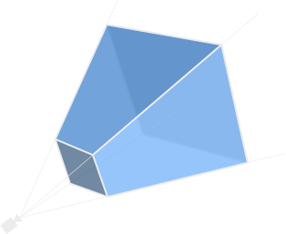](https://en.wikipedia.org/wiki/Viewing_frustum#/media/File:ViewFrustum.svg)

Drawing things is expensive! It requires writing data from the CPU to the GPU, constructing draw calls, and running shaders. We can save a lot of time by _not_ drawing things that the camera can't see. "Frustum culling" is the act of not drawing objects that are outside of the bounds of the camera's view frustum. For large scenes, this can be the difference between a crisp 60 frames per second and chugging to a grinding halt.


**Bevy 0.6** now automatically does frustum culling for 3d objects using their bounding boxes. We might also enable this for 2d objects in future releases, but the wins there will be less pronounced, as drawing sprites is now much cheaper thanks to the new batched rendering.

### Directional Shadows

<div class="release-feature-authors">authors: Rob Swain (@superdump)</div>

Directional Lights can now cast "directional shadows", which are "sun-like" shadows cast from a light source infinitely far away. These can be enabled by setting `DirectionalLight::shadows_enabled` to `true`.

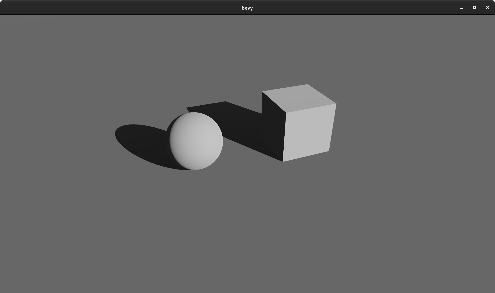

Note: directional shadows currently require more manual configuration than necessary (ex: manual configuration of the shadow projection). We will soon make this more automatic by generating the projection via a combination of simpler settings and fitting the projection to the scene.

### Point Light Shadows

<div class="release-feature-authors">authors: @mtsr, Rob Swain (@superdump), @cart</div>

Point lights can now cast "omnidirectional shadows", which can be enabled by setting `PointLight::shadows_enabled` to `true`:


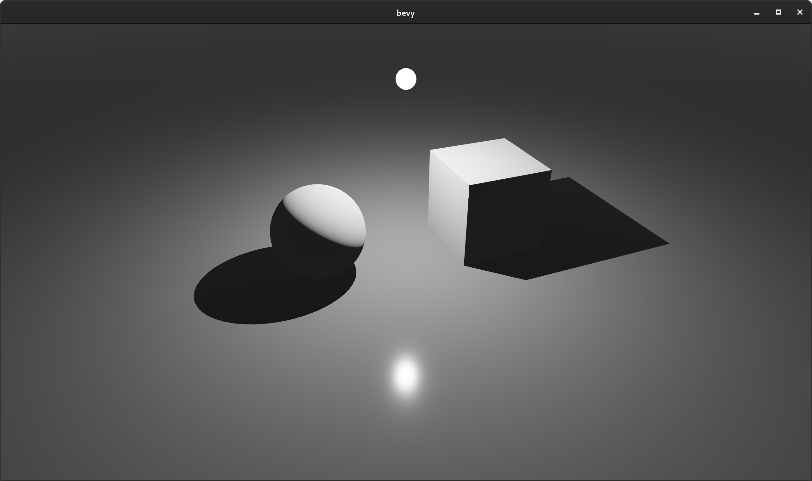

### Enabling and Disabling Entity Shadows

<div class="release-feature-authors">authors: Rob Swain (@superdump)</div>

Mesh entities can opt out of casting shadows by adding the {{rust_type(type="struct" crate="bevy_pbr" version="0.6.0" name="NotShadowCaster")}} component.

```rust
commands.entity(entity).insert(NotShadowCaster);
```

Likewise they can opt out of receiving shadows by adding the {{rust_type(type="struct" crate="bevy_pbr" version="0.6.0" name="NotShadowReceiver")}} component.

```rust
commands.entity(entity).insert(NotShadowReceiver);
```

### Spherical Area Lights

<div class="release-feature-authors">authors: @Josh015</div>

`PointLight` Components can now define a `radius` value, which controls the size of the sphere that emits light. A normal zero-sized "point light" has a radius of zero.

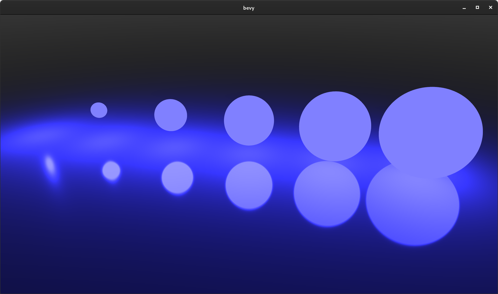

(Note that lights with a radius don't normally take up physical space in the world ... I added meshes to help illustrate light position and size)

### Configurable Alpha Blend Modes

<div class="release-feature-authors">authors: Rob Swain (@superdump)</div>

Bevy's StandardMaterial now has a `blend_mode` field, which can be set to `AlphaMode::Opaque`, `AlphaMode::Mask(f32)`, or `AlphaMode::Blend`. This field is properly set when loading GLTF scenes.

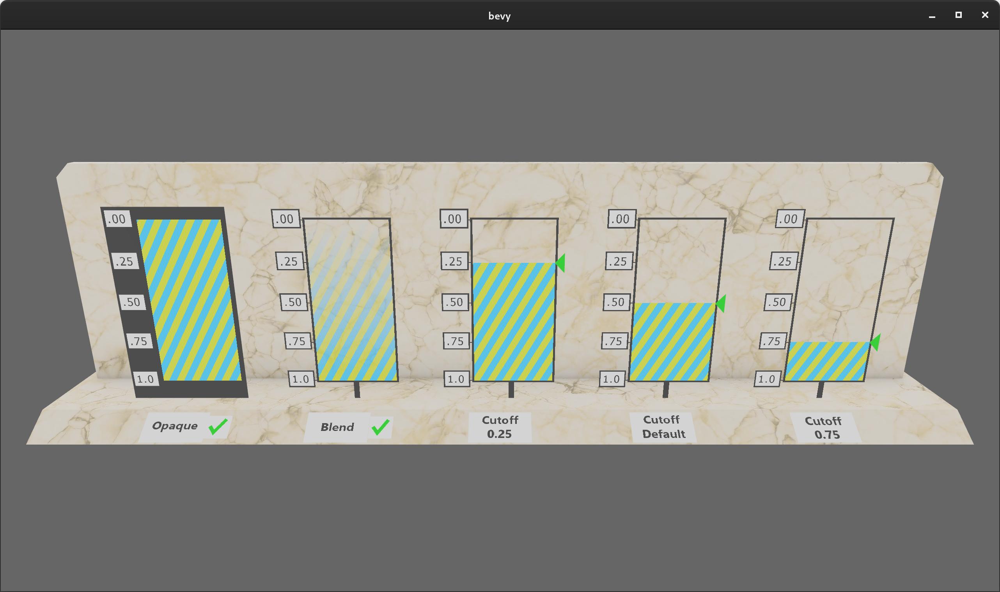

### Clustered Forward Rendering 

<div class="release-feature-authors">authors: Rob Swain (@superdump)</div>

Modern scenes often have many point lights. But when rendering scenes with hundreds of lights, calculating lighting for each light, for each rendered fragment can be prohibitively expensive. Clustered Forward Rendering is a popular approach that increases the number of lights you can have in a scene by dividing up the view frustum into "clusters". Each cluster is then assigned lights based on whether or not they can affect that cluster. This is a form of "culling" that enables fragments to ignore lights that aren't assigned to their cluster.

In practice this can significantly increase the number of lights in the scene:


Clusters are "3d" slices of the view frustum, but when debugging them in screen space they look like squares (which extend "in" to the screen):

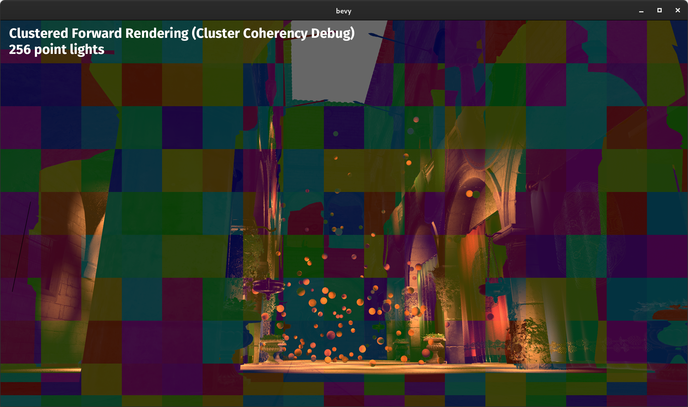

Due to WebGL2's lack of storage buffers, in the interest of cross-platform compatibility, the current implementation is limited to at most 256 lights to ensure lights can fit within a uniform buffer. We can support many more lights on other platforms by using storage buffers, which we will add support for in a future release.

[Click here](https://youtu.be/dElYzzNovEk) for a video that illustrates Bevy's clustered forward rendering.

### Sprite Batching

<div class="release-feature-authors">authors: @cart</div>

Sprites are now rendered in batches according to their texture within a z-level. They are also opportunistically batched across z-levels. This yields significant performance wins because it drastically reduces the number of draw calls required. Combine that with the other performance improvements in the new Bevy Renderer and things start to get very interesting! On my machine, the old Bevy renderer generally started dropping below 60fps at around 8,000 sprites in our "bevymark" benchmark. With the new renderer on that same machine I can get about 120,000 sprites!

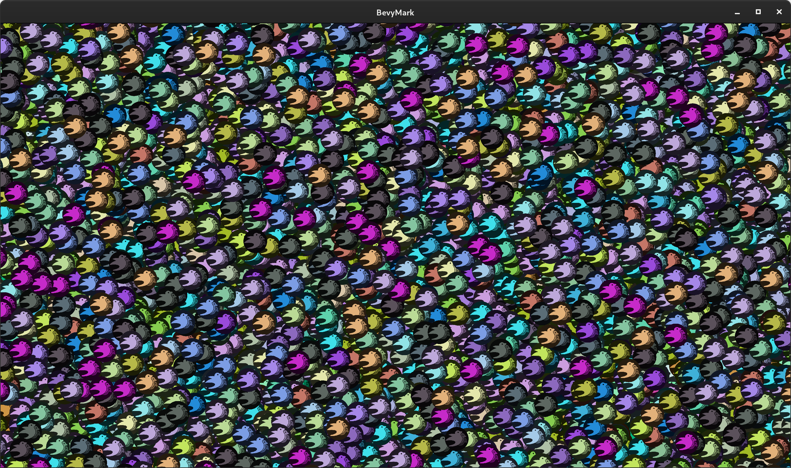


### Sprite Ergonomics

Sprite entities are now simpler to spawn:

```rust
// Old (Bevy 0.5)
fn spawn_sprite(
    mut commands: Commands,
    asset_server: Res<AssetServer>,
    mut materials: ResMut<Assets<ColorMaterial>>,
) {
    let texture_handle = asset_server.load("player.png");
    commands.spawn_bundle(SpriteBundle {
        material: materials.add(texture_handle.into()),
        ..Default::default()
    });
}

// New (Bevy 0.6)
fn spawn_sprite(mut commands: Commands, asset_server: Res<AssetServer>) {
    commands.spawn_bundle(SpriteBundle {
        texture: asset_server.load("player.png"),
        ..Default::default()
    });
}
```

No need to manage sprite materials! Their texture handle is now a direct component and color can now be set directly on the {{rust_type(type="struct" crate="bevy_sprite" version="0.6.0" name="Sprite")}} component.

### WGSL Shaders

Bevy now uses [WGSL](https://www.w3.org/TR/WGSL/) for our built-in shaders and examples. WGSL is a new shader language being developed for WebGPU (although it is a "cross platform" shader language just like GLSL). Bevy still supports GLSL shaders, but WGSL is nice enough that, for now, we are treating it as our "officially recommended" shader language. WGSL is still being developed and polished, but given how much investment it is receiving I believe it is worth betting on. Consider this the start of the "official Bevy shader language" conversation, not the end of it.

```rust
[[group(0), binding(0)]]
var<uniform> view: View;

[[group(1), binding(0)]]
var<uniform> mesh: Mesh;

struct Vertex {
    [[location(0)]] position: vec3<f32>;
};

struct VertexOutput {
    [[builtin(position)]] clip_position: vec4<f32>;
};

[[stage(vertex)]]
fn vertex(vertex: Vertex) -> VertexOutput {
    var out: VertexOutput;
    out.clip_position = view.view_proj * mesh.model * vec4<f32>(vertex.position, 1.0);
    return out;
}
```


### Shader Preprocessor

<div class="release-feature-authors">authors: @cart, Rob Swain (@superdump), @mockersf</div>

Bevy now has its own custom shader preprocessor. It currently supports `# import`, `# ifdef FOO`, `# ifndef FOO`, `# else`, and `# endif`, but we will expand it with more features as our needs grow.

Shader preprocessors are often used to selectively enable shader code:

```rust
#ifdef TEXTURE
[[group(1), binding(0)]]
var sprite_texture: texture_2d<f32>;
#endif
```

This pattern is very useful when defining complicated / configurable shaders (such as Bevy's PBR shader).

### Shader Imports

<div class="release-feature-authors">authors: @cart</div>

The new preprocessor supports importing other shader files (which pulls in their entire contents). This comes in two forms:

Asset path imports:

```rust
# import "shaders/cool_function.wgsl"

[[stage(fragment)]]
fn fragment(input: VertexOutput) -> [[location(0)]] vec4<f32> {
    return cool_function();
}
```

Plugin-provided imports, which can be registered by Bevy Plugins with arbitrary paths:

```rust
# import bevy_pbr::mesh_view_bind_group

[[stage(vertex)]]
fn vertex(vertex: Vertex) -> VertexOutput {
    let world_position = vec4<f32>(vertex.position, 1.0);
    var out: VertexOutput;
    // The `view` variable comes from the imported bind group 
    out.clip_position = view.view_proj * world_position;
    return out;
}
```

We also plan to experiment with using Naga for "partial imports" of specific, named symbols (ex: import a specific function or struct from a file).

### Pipeline Specialization

<div class="release-feature-authors">authors: @cart</div>

When shaders use a preprocessor and have multiple permutations, the associated "render pipeline" needs to be updated to accommodate those permutations (ex: different Vertex Attributes, Bind Groups, etc). To make this process straightforward, we added the SpecializedPipeline trait, which allows defining specializations for a given key:

```rust
impl SpecializedPipeline for MyPipeline {
    type Key = MyPipelineKey;
    fn specialize(&self, key: Self::Key) -> RenderPipelineDescriptor {
        // define a specialized pipeline for the given key here
    }
}
```

Implementors of this trait can then easily and cheaply access specialized pipeline variants (with automatic per-key caching and hot-reloading). If this feels too abstract / advanced, don't worry! This is a "mid level power-user tool", not something most Bevy App developers need to contend with.

### Simpler Shader Stack

Bevy now uses [Naga](https://github.com/gfx-rs/naga) for all of its shader needs. As a result, we were able to remove all of our complicated non-rust shader dependencies: `glsl_to_spriv`, `shaderc`, and `spirv_reflect`. `glsl_to_spriv` was a major producer of platform-specific build dependencies and bugs, so this is a huge win!

### Features Ported to the New Renderer

Render logic for internal Bevy crates had to be rewritten in a number of cases to take advantage of the new renderer. The following people helped with this effort:

* bevy_sprites: @cart, @StarArawn 
* bevy_pbr: Rob Swain (@superdump), @aevyrie, @cart, @zicklag, @jakobhellermann
* bevy_ui: @Davier
* bevy_text: @Davier
* bevy_gltf: Rob Swain (@superdump)

### WebGL2 Support

<div class="release-feature-authors">authors: @zicklag, @mrk-its, @mockersf, Rob Swain (@superdump)</div>

Bevy now has built-in support for deploying to the web using WebGL2 / WASM, thanks to @zicklag adding a native WebGL2 backend to wgpu. There is now no need for the third party `bevy_webgl2` plugin. Any Bevy app can be deployed to the web by running the following commands:

```rust
cargo build --target wasm32-unknown-unknown
wasm-bindgen --out-dir OUTPUT_DIR --target web TARGET_DIR
```

The New Bevy Renderer developers had to carefully operate within the limits of WebGL2 (ex: storage buffers and compute shaders aren't supported in WebGL2), but the results were worth it! You can try out Bevy's WASM support in your browser using our new [Bevy Examples](/examples) page.

[](/examples)

### Infinite Reverse Z Perspective Projection

<div class="release-feature-authors">authors: Rob Swain (@superdump)</div>

For improved precision in the "useful range", the industry has largely adopted "reverse projections" with an "infinite" far plane. The new Bevy renderer was adapted to use the "right handed infinite reverse z" projection. [This Nvidia article](https://developer.nvidia.com/content/depth-precision-visualized) does a great job of explaining why this is so worthwhile. 

### Compute Shaders

The new renderer makes it possible for users to write compute shaders. Our new ["compute shader game of life" example](https://github.com/bevyengine/bevy/blob/main/examples/shader/compute_shader_game_of_life.rs) illustrates how to write compute shaders in Bevy.

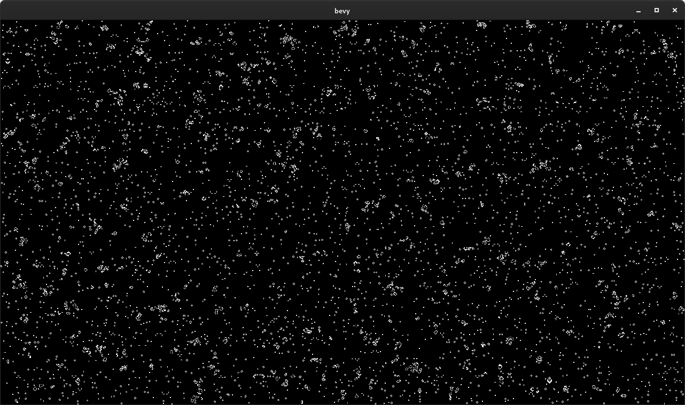


### New Multiple Windows Example

<div class="release-feature-authors">authors: @DJMcNab</div>

The "multiple windows" example has been updated to use the new renderer apis. Thanks to the new renderer apis, this example is now [much nicer to look at](https://github.com/bevyengine/bevy/blob/main/examples/window/multiple_windows.rs) (and will look even nicer when we add high level Render Targets).

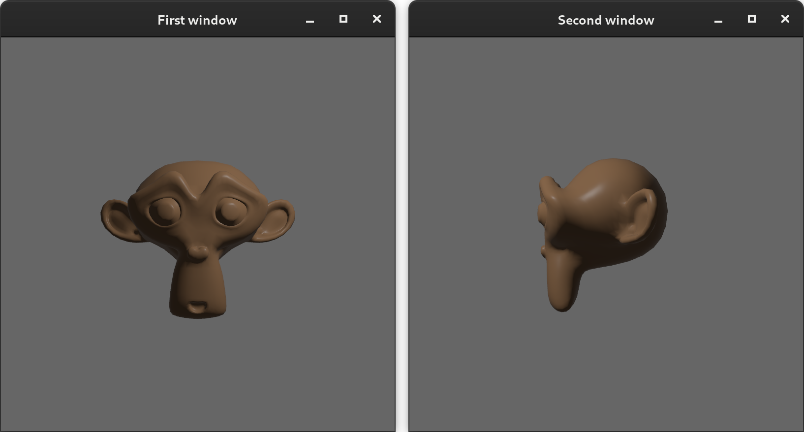

### Crevice

<div class="release-feature-authors">authors: @cart, @mockersf</div>

Bevy's old `Bytes` abstraction has been replaced with a fork of the [crevice](https://github.com/LPGhatguy/crevice) crate, which makes it possible to write normal Rust types to GPU-friendly data layouts. Namely std140 (uniform buffers default to this layout) and std430 (storage buffers default to this layout). Bevy exports `AsStd140` and `AsStd430` derives:

```rust
#[derive(AsStd140)]
pub struct MeshUniform {
    pub transform: Mat4,
    pub inverse_transpose_model: Mat4,
}
```

Coupling an `AsStd140` derive with our new `UniformVec<T>` type makes it easy to write Rust types to shader-ready uniform buffers:

```rust
// WGSL shader
struct Mesh {
    model: mat4x4<f32>;
    inverse_transpose_model: mat4x4<f32>;
};

[[group(2), binding(0)]]
var<uniform> mesh: Mesh;
```

### UV Sphere Mesh Shape

<div class="release-feature-authors">authors: @nside</div>

Bevy now has a built-in "uv sphere" mesh primitive.

```rust
Mesh::from(UVSphere {
    radius: 1.0,
    sectors: 16,
    stacks: 32,
})
```

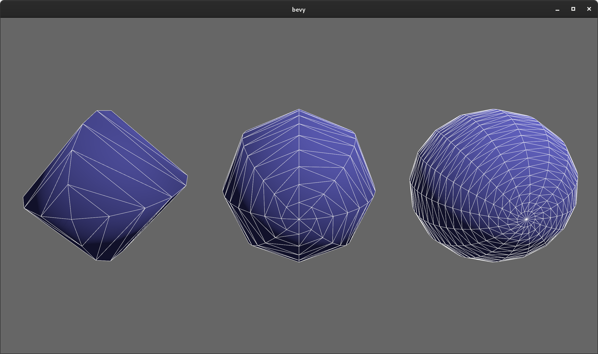

### Flat Normal Computation

<div class="release-feature-authors">authors: @jakobhellermann</div>

The `Mesh` type now has a `compute_flat_normals()` function. Imported GLTF meshes without normals now automatically have flat normals computed, [in accordance with the GLTF spec](https://www.khronos.org/registry/glTF/specs/2.0/glTF-2.0.html#meshes). 

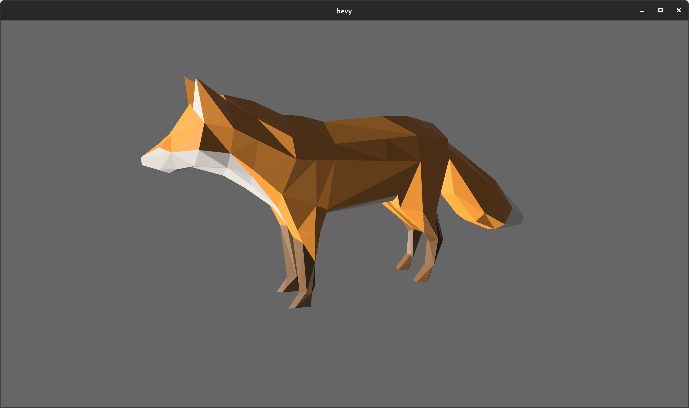

### Faster GLTF Loading

<div class="release-feature-authors">authors: @DJMcNab, @mockers</div>

@DJMcNab fixed nasty non-linear loading of GLTF nodes, which made them load much faster. One complicated scene went from 40 seconds to 0.2 seconds. Awesome!

@mockersf made GLTF textures load asynchronously in Bevy's "IO task pool", which almost halved GLTF scene load times in some cases.

## Bevy ECS

### No more `.system()`!

<div class="release-feature-authors">authors: @DJMcNab, @Ratysz</div>

One of our highest priorities for Bevy ECS is "ergonomics". In the past I have made wild claims that Bevy ECS is the [most ergonomic ECS in existence](https://bevyengine.org/news/introducing-bevy/#ergonomics). We've spent gratuitous amounts of R&D pioneering new API techniques and I believe the results speak for themselves:

```rust
// This is a standalone Bevy 0.5 App that adds a simple `gravity` system to the App's schedule
// and automatically runs it in parallel with other systems
fn main() {
    App::new()
        .add_plugins(DefaultPlugins)
        .add_system(gravity.system())
        .run();
}

fn gravity(time: Res<Time>, mut query: Query<&mut Transform>) {
    for mut transform in query.iter_mut() {
        transform.translation.y += -9.8 * time.delta_seconds();
    }
}
```

I believe we were already the best in the market by a wide margin (especially if you take into account our automatic parallelization and change detection), but we had one thing holding us back from perfection ... that pesky `.system()`! We've tried removing it a number of times, but due to rustc limitations and safety issues, it always eluded us. Finally, @DJMcNab [found a solution](https://github.com/bevyengine/bevy/pull/2398). As a result, in Bevy 0.6 you can now register the system above like this:

```rust
// pure bliss!
App::new()
    .add_system(gravity)
    .run();
```

### The New Component Trait and #[derive(Component)]

<div class="release-feature-authors">authors: @Frizi</div>

In **Bevy 0.6** types no longer implement the {{rust_type(type="trait" crate="bevy_ecs" version="0.6.0" name="Component")}} trait by default. Before you get angry ... stick with me for a second. I promise this is for the best! In past Bevy versions, we got away with "auto implementing" {{rust_type(type="trait" crate="bevy_ecs" version="0.6.0" name="Component")}} for types using this "blanket impl":

```rust
impl<T: Send + Sync + 'static> Component for T {}
```

This removed the need for users to manually implement {{rust_type(type="trait" crate="bevy_ecs" version="0.6.0" name="Component")}} for their types. Early on this seemed like an ergonomics win with no downsides. But Bevy ECS, our understanding of the problem space, and our plans for the future have changed a lot since then:

* **It turns out everything _should not_ be a Component**: Our users _constantly_ accidentally add non-component types as components (newbies accidentally adding Bundles and type constructors as Components are our most common `#help` channel threads on [our Discord](https://discord.gg/bevy)). This class of error is very hard to debug because things just silently "don't work". When everything isn't a Component, rustc can properly yell at you with informative errors when you mess up.
* **Optimizations**: If we implement Component for everything automatically, we can't customize the Component type with associated types. This prevents an entire class of optimization. For example, Bevy ECS now has [multiple Component storage types](/news/bevy-0-5/#hybrid-component-storage-the-solution). By moving the storage type into Component, we enable rustc to optimize checks that would normally need to happen at runtime. @Frizi was able to [significantly improve our Query iterator performance](https://github.com/bevyengine/bevy/pull/2254#issuecomment-857863116) by moving the storage type into Component. I expect us to find more optimizations in this category.
* **Automatic registration**: Moving more logic into Component also gives us the ability to do fancier things in the future like "automatically registering Reflect impls when deriving Component". Non-blanket Component impls do add a small amount of boilerplate, but they also have the potential to massively reduce the "total boilerplate" of an app.
* **Documentation**: Deriving Component serves as a form of self-documentation. Its now easy to tell what types are components at a glance.
* **Decentralized**: In Bevy 0.5 Component-specific configuration like "storage type" had to be registered in a centralized Plugin somewhere. Moving Component configuration into the Component trait decentralizes things and allows users to keep "Component type information" right next to the type itself. 
* **Event Handlers**: Non-blanket Component impls allow us to add event handlers like `on_insert(world: &mut World)` to the Component trait. Very useful! 

Hopefully by now you're convinced that this is the right move. If not ... I'm sorry ... you still need to implement Component manually in Bevy 0.6. You can either derive Component:

```rust
// defaults to "Table" storage
#[derive(Component)]
struct SomeComponent;

// overrides the default storage
#[derive(Component)]
#[component(storage = "SparseSet")]
struct SomeComponent;
```

Or you can manually implement it:

```rust
struct SomeComponent;

impl Component for SomeComponent {
    type Storage = TableStorage;
}

impl Component for Movable {
    type Storage = SparseSetStorage;
}
```

### iter() for mutable Queries

<div class="release-feature-authors">authors: @Guvante</div>

Mutable queries can now be immutably iterated (which returns immutable references):

```rust
fn system(mut players: Query<&mut Player>) {
    for player in players.iter() {
        // player is an immutable reference
    }

    for mut player in players.iter_mut() {
        // player is a mutable reference
    }
}
```

Compare that to the complicated QuerySet that this would have needed in previous Bevy versions to avoid conflicting immutable and mutable Queries:

```rust
// Gross!
fn system(mut players: QuerySet<(QueryState<&Player>, QueryState<&mut Player>)>) {
    for player in players.q0().iter() {
        // player is an immutable reference
    }

    for mut player in players.q1().iter_mut() {
        // player is a mutable reference
    }
}
```

### SystemState

Have you ever wanted to use "system params" directly with a Bevy World? With {{rust_type(type="struct" crate="bevy_ecs" version="0.6.0" name="SystemState")}}, now you can!

```rust
let mut system_state: SystemState<(Res<A>, Query<&B>)> = SystemState::new(&mut world);
let (a, query) = system_state.get(&world);
```

{{rust_type(type="struct" crate="bevy_ecs" version="0.6.0" name="SystemState")}} does all of the same caching that a normal Bevy system does, so reusing the same SystemState results in uber-fast World access.

### Sub Apps

<div class="release-feature-authors">authors: @cart, @zicklag, @bjorn3</div>

The new Bevy renderer requires strict separation between the "main app" and the "render app". To enable this, we added the concept of "sub apps":

```rust
#[derive(Debug, Clone, Copy, Hash, PartialEq, Eq, AppLabel)]
pub struct RenderApp;

let mut render_app = App::empty();
app.add_sub_app(RenderApp, render_app, move |app_world, render_app| {
    // execute app logic here
});

// later
app.sub_app_mut(RenderApp)
    .add_system(some_system);
    .add_system(some_other_system);
```

We plan on exposing more control over scheduling and running sub apps in the future.

### Query::iter_combinations

<div class="release-feature-authors">authors: @Frizi</div>

You can now iterate all permutations of N entities for a given query:

```rust
fn system(query: Query<&Player>) {
    // iterates each possible combination of two entities exactly once
    for [e1, e2] in query.iter_combinations() {
    }

    // iterates each possible combination of three entities exactly once
    for [e1, e2, e3] in query.iter_combinations() {
    }
}
```

This is especially useful for things like "checking for entities for collisions with all other entities". There is also an `iter_combinations_mut` variant. Just be careful ... the time complexity of this grows quickly with large numbers of combinations. With great power comes great responsibility!

The new `iter_combinations.rs` example illustrats how to use this new API to calculate gravity between objects in a "solar system":

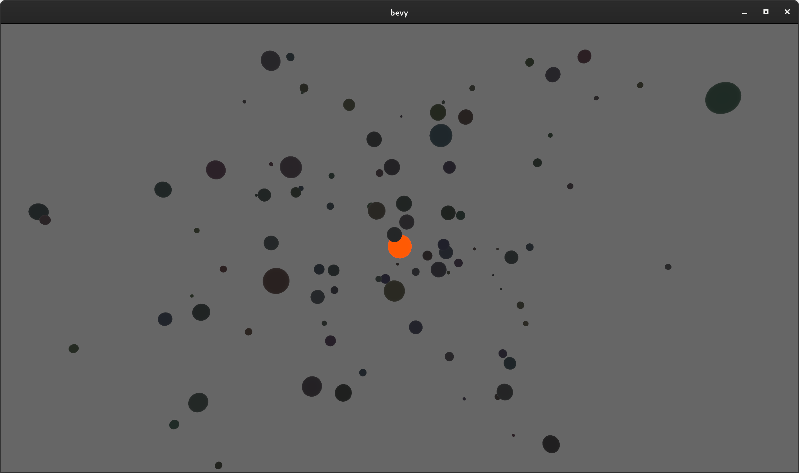

### Optimized System Commands

<div class="release-feature-authors">authors: @NathanSWard</div>

System Commands got a nice performance boost by changing how command buffers are stored and reused:

#### Entity Spawn Benchmark Duration (in microseconds, less is better)

This benchmark spawns entities with a variety of component compositions to ensure we cover a variety of cases. Treat these numbers as relatives, not absolutes.

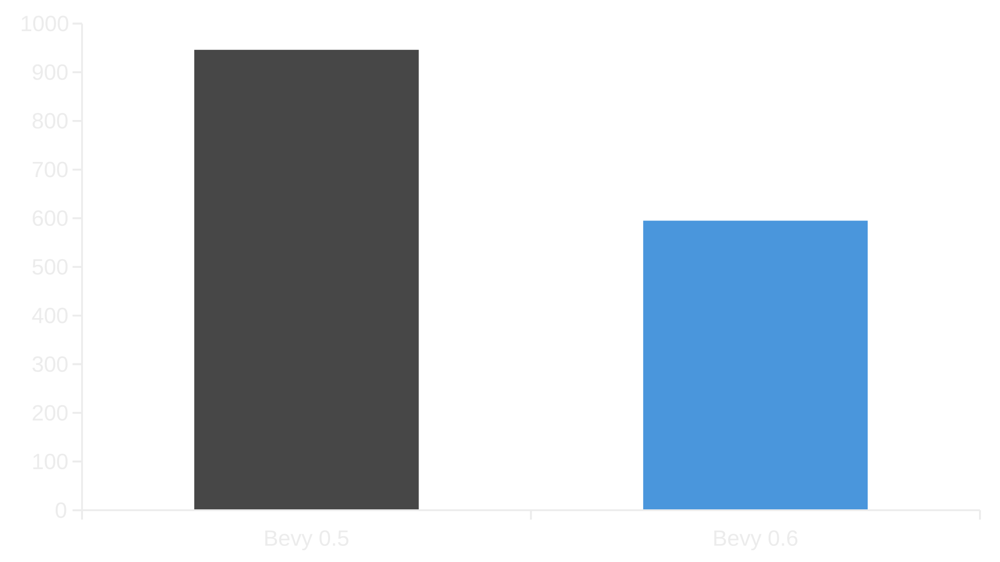

### System Param Lifetimes

<div class="release-feature-authors">authors: @cart, @BoxyUwU, @TheRawMeatball</div>

System and Query lifetimes were made more explicit by splitting out the `'system` and `'world`, lifetimes and using them explicitly where possible. This enables Rust to reason about ECS lifetimes more effectively, especially for read-only lifetimes. This was particularly important because it enabled the new Bevy Renderer to convince WGPU that ECS resources actually live for as long as the Render World.

### Soundness / Correctness Improvements

<div class="release-feature-authors">authors: @BoxyUwU, @TheRawMeatball, @Frizi, @thebluefish, @sapir, @bjorn3, @DJMcNab</div>

Bevy ECS received a solid number of soundness and correctness improvements this release, alongside some unsafe code removals. Queries and internal storages like Tables and BlobVecs in particular had a number of improvements in these areas. And we have even more improvements in the works!

### Hierarchy Convenience Functions

<div class="release-feature-authors">authors: @TheRawMeatball, @jihiggins</div>

```rust
// Despawns all descendants of an entity (its children, its childrens' children, etc)
commands.entity(e).despawn_descendants();

// Removes the given children from the entity
commands.entity(parent).remove_children(&[child1, child2]);
```

## UI

### Overflow::Hidden

<div class="release-feature-authors">authors: @Davier</div>

UI now respects the flexbox `Overflow::Hidden` property. This can be used to cut off child content, which is useful when building things like scrollable lists:

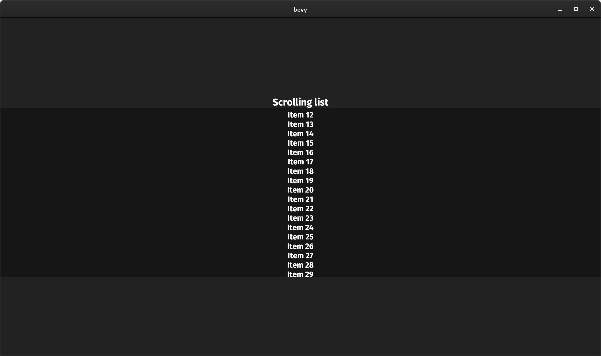

### Text2D Transforms

<div class="release-feature-authors">authors: @nside</div>

`Text2d` now supports arbirtary transformations using the Transform component:`

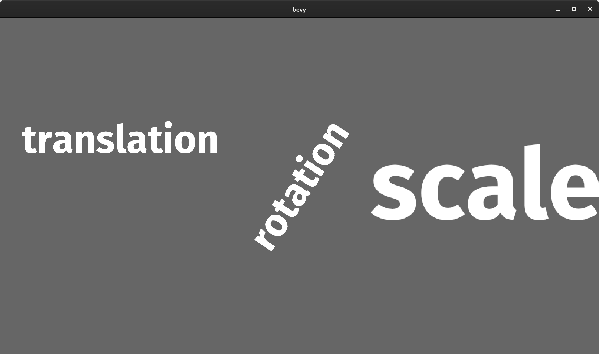

Note that while `Transform::scale` does have it uses, it is generally still a good idea to adjust text size using the "font size" to ensure it renders "crisply".

## Profiling

### More Spans

<div class="release-feature-authors">authors: @cart, @mockersf, @hymm</div>

The new renderer now has tracing spans for frames, the render app schedule, and the Render Graph (with named Sub Graphs spans). The system executor now has finer grained spans, filling in most of the remaining blanks. Applying System Commands also now has spans.

(ignore those weird characters in the spans ... we're investigating that)

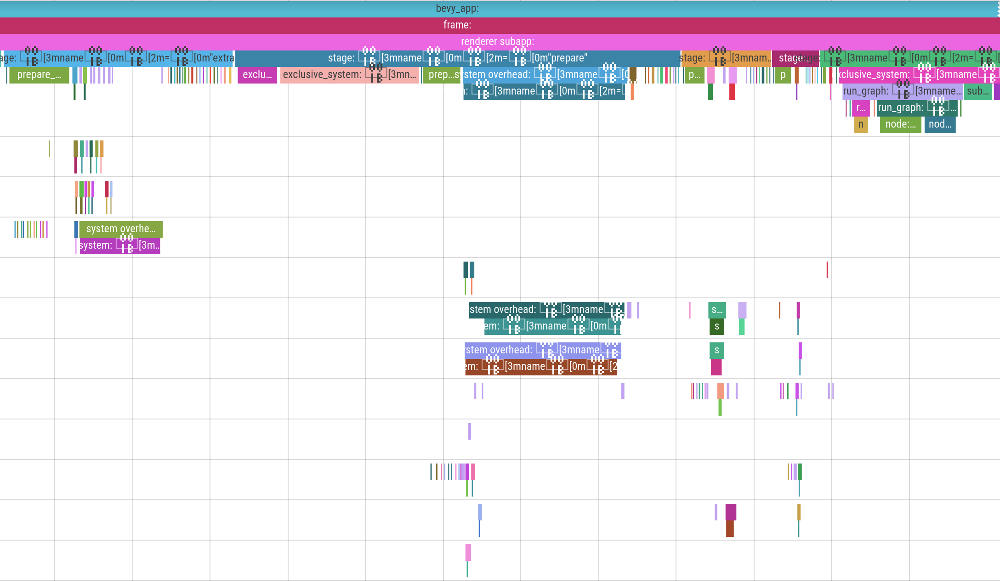

### Tracy Backend

<div class="release-feature-authors">authors: Rob Swain (@superdump)</div>

We now have built in support for the [tracy](https://github.com/wolfpld/tracy) profiler via the `trace_tracy` Cargo feature.

## Transforms

### Friendly Directional Vectors

<div class="release-feature-authors">authors: @guimcaballero</div>

Bevy Transforms now have friendly "directional" functions that return relative vectors:

```rust
// Points to the left of the transform
let left: Vec4 = transform.left();
// Points to the right of the transform
let right: Vec4 = transform.right();
// Points up from the transform
let up: Vec4 = transform.up();
// Points down from the transform
let down: Vec4 = transform.down();
// Points forward from the transform
let forward: Vec4 = transform.forward();
// Points back from the transform
let back: Vec4 = transform.back();
```

### Transform Builder Methods

<div class="release-feature-authors">authors: @Lythenas</div>

Transforms now have helpful `with_translation()`, `with_rotation()`, and `with_scale()` builder methods:

```rust
Transform::from_xyz(0.0, 0.0, 10.0).with_scale(Vec3::splat(2.0))
```

## Rust 2021

<div class="release-feature-authors">authors: @mockersf, @YohDeadfall</div>

Bevy has been updated to use Rust 2021. This means we can take advantage of the new Cargo feature resolver by default (which the new WGPU version requires). Make sure you update your projects to Rust 2021 or you will need to manually enable the new feature resolver!

```toml
[package]
name = "your_app"
version = "0.1.0"
edition = "2021"
```

## Input

### Gamepads Resource

<div class="release-feature-authors">authors: @CrazyRoka</div>

**Bevy 0.6** adds a `Gamepads` resource, which automatically maintains a collection of connected gamepads.

```rust
fn system(gamepads: Res<Gamepads>) {
    // iterates every active game pad
    for gamepad in gamepads.iter() {
    }
}
```

### Input "any" variants 

<div class="release-feature-authors">authors: @DJMcNab</div>

`Input` collections now have an `any_pressed()` function, which returns true when any of the given inputs are pressed. 

```rust
 fn system(input: Res<Input<KeyCode>>) {
    if input.any_pressed([KeyCode::LShift, KeyCode::RShift]) {
        println!("one or both of the two shift keys are pressed");
    }
 }
```

### Window Transparency 

<div class="release-feature-authors">authors: @louisgjohnson</div>

Winit's "window transparency" feature is now exposed in Bevy's Window type. This allows users to build "widget like" apps without backgrounds or window decorations (on platforms that support it). Here is a Bevy app with a transparent background, rendering a Bevy Logo sprite on top of my Linux desktop background. Seamless! Cool!


### FromReflect Trait and Derive

<div class="release-feature-authors">authors: @Davier</div>

Types can now derive the new `FromReflect` trait, which enables creating "clones" of a type using arbitrary `Reflect` impls. This is currently used to make reflected collection types (like `Vec`) work properly, but it will also be useful for "round trip" conversions to and from `Reflect` types.

```rust
#[derive(Reflect, FromReflect)]
struct Foo {
    bar: usize,
}

let foo = Foo::from_reflect(&dyn some_reflected_value).unwrap(); 
```

## Bevy Error Codes

<div class="release-feature-authors">authors: @mockersf, @NiklasEi</div>

To make it easier to search for and discuss common Bevy errors, we decided to add a formal [error codes system](https://github.com/bevyengine/bevy/tree/main/errors), much like the one [that rustc uses](https://github.com/rust-lang/rust/tree/master/compiler/rustc_error_codes/src/error_codes);

Error codes and their descriptions also have an automatically-generated [page on the Bevy website](/learn/errors/).

## Bevy Assets

<div class="release-feature-authors">authors: @mockersf</div>

The curated awesome-bevy Github repo containing a list of Bevy plugins, crates, apps, and learning resources is now reborn as [Bevy Assets](https://github.com/bevyengine/bevy-assets)! 

Bevy Assets introduces:

* A structured toml format
* Asset icons
* [bevy-website integration](/assets)

This is just the beginning! We have plans to integrate with [crates.io](http://crates.io) and github, improve indexing / tagging / searchability, add asset-specific pages, prettier styles, content delivery, and more. Ultimately we want this to grow into something that can enable first class, modern asset-driven workflows.

We have automatically migrated existing awesome-bevy entries, but we encourage creators to customize them! If you are working on something Bevy related, you are highly encouraged to [add a Bevy Assets entry](https://github.com/bevyengine/bevy-assets).

## Dual MIT / Apache-2.0 License

<div class="release-feature-authors">authors: @cart, @DJMcNab</div>

Thanks to the relevant contributors ([all 246 of them](https://github.com/bevyengine/bevy/issues/2373)), Bevy is now dual licensed under MIT _and_ Apache-2.0, at the developers' option. This means developers have the flexibility to choose the license that best suits their specific needs. I want to stress that this is now _less_ restrictive than MIT-only, not more.

I originally chose to license Bevy exclusively under MIT for a variety of reasons:

* People and companies generally know and trust the MIT license more than any other license. Apache 2.0 is less known and trusted.
* It is short and easy to understand
* Many people aren't familiar with the "multiple license options ... choose your favorite" approach. I didn't want to scare people away unnecessarily.
* Other open source engines like Godot have had a lot of success with MIT-only licensing

However there were a variety of issues that have come up that make dual-licensing Bevy under both MIT and Apache-2.0 compelling:

* The MIT license (arguably) requires binaries to reproduce countless copies of the same license boilerplate for every MIT library in use. Apache-2.0 allows us to compress the boilerplate into a single instance of the license.
* The Apache-2.0 license has protections from patent trolls and an explicit contribution licensing clause.
* The Rust ecosystem is largely Apache-2.0. Being available under that license is good for interoperation and opens the doors to upstreaming Bevy code into other projects (Rust, the async ecosystem, etc).
* The Apache license is incompatible with GPLv2, but MIT is compatible. 

## Bevy Org Changes

### More pull request mergers!

I've been at my scalability limits for awhile. It has been  * cough * ... challenging  ... to build the engine features I need to, review every single pull request quickly, and preserve my mental health. I've made it this far ... sometimes by overworking myself and sometimes by letting PRs sit unmerged for longer than I'd like. By scaling out, we can have our cake and eat it too!

* @mockersf now has merge rights for "uncontroversial changes"
* @alice-i-cecile now has merge rights for "uncontroversial documentation changes"

### New issue labels

After [much discussion about naming conventions and colors](https://github.com/bevyengine/bevy/issues/2256), we finally have a [fresh new set of issue labels](https://github.com/bevyengine/bevy/labels) (loosely inspired by the rust repo). The [Bevy Triage Team](https://github.com/orgs/bevyengine/teams/triage-team/members) can finally express themselves fully!

### Comprehensive CONTRIBUTING.md

<div class="release-feature-authors">authors: @alice-i-cecile</div>

We now have a relatively complete [Contributors Guide](https://github.com/bevyengine/bevy/blob/main/CONTRIBUTING.md). If you are interested in contributing code or documentation to Bevy, that is a great place to start! 

### CI Build System Improvements

<div class="release-feature-authors">authors: @mockersf, @NathanSWard, @NiklasEi</div>

We made a ton of CI improvements this release:

* We now fail on cargo doc warnings
* We now use [cargo deny](https://github.com/EmbarkStudios/cargo-deny) to protect against vulnerabilities, duplicate dependencies, and invalid licenses
* PRs are now automatically labeled with the `S-Needs-Triage` label
* Ci stability and speed improvements
* We now check that our benchmarks build
* We now assert compiler errors for compile_fail tests, giving us much stricter guarantees
* Examples are now run using lavapipe (instead of swiftshader) for faster CI validation

## What's Next For Bevy?

Bevy development continues to pick up steam and we have no intention to slow down now!

### The "Train" Release Schedule

In the last two Bevy releases we made massive, sweeping changes to core systems. **Bevy 0.5** was "the one where we rewrote Bevy ECS". **Bevy 0.6** was "the one where we rewrote Bevy Render". These massive reworks took time, and as a result held back a bunch of other useful features and bug fixes.

[The Bevy Community](https://bevyengine.org/community/) has reached relative consensus that we should have a more regular, more predictable release schedule. One where large features can't gum up the system.

From now on, we will cut releases _approximately_ once every three months (as an upper bound ... sometimes we might release early if it makes sense). After the end of a release cycle, we will start preparing to cut a release. If there are small tweaks that need to be made or "life happens" ... we will happily postpone releases. But we won't hold releases back for "big ticket" items any more.

We are balancing a lot of different concerns here:
* Building trust with Bevy contributors that their changes will land in a timely manner
* Building trust with Bevy users that they will receive regular updates and bug fixes
* Giving enough time between releases to cut down on churn in the Bevy Plugin ecosystem (Bevy isn't "stable" yet, but longer releases give reasonable windows of "ecosystem stability") 
* Providing enough content in a release to generate "hype". Bevy release blog posts tend to be a "rallying cry" for the community and I don't want to lose that.
* Establishing proper work / life balance for core developers (crunch is bad!)
    
We will refine this process over time and see what works best.

### More Renderer Features

* **Post Processing Stack / HDR / Bloom**: HDR and bloom [almost made it into Bevy 0.6](https://github.com/bevyengine/bevy/pull/2876), but we decided to hold them back so can polish them a bit and build a proper "modular post processing stack".
* **Skeletal Animation**: Ultimately Bevy will have a general purpose, property based animation system (we already have a [working implementation](https://github.com/bevyengine/bevy/pull/1429)). We've been holding off on adding skeletal animation, so we can slot it in to that system, but in retrospect that was a mistake. People need skeletal animation _now_. In the short term we will build a scoped 3d skeletal animation system, just to get the ball rolling. Then later we will port it to the general purpose system (whenever that is ready), 
* **Global Illumination**: GI will provide a massive boost to the feel of "realism", so it is worth prioritizing at least one form of GI in the sort term.
* **Shadow Filters and Cascades**: Rob Swain (@superdump) has already done a lot of work in this area, so we will hopefully see that materialize in a Bevy release soon.

### UI Refresh

We will break ground on the Bevy Editor this year. To do that, we need a number of improvements to Bevy UI:
* Improved "data driven UI" (potentially "reactive")
* A solid set of pre-constructed widgets
* Generally improved UX

We now have a plethora of UI experiments in the Bevy community. Over the next few months we will refine our scope and begin the process of "selecting a winner".

### Asset Preprocessing

Preprocessing assets is a critical part of a production game engine. It cuts down on startup times, reduces our CPU and GPU memory footprint, enables more complicated development workflows, makes it easier to ship assets with games, and cuts down on the final size of a deployed game. We've made it this far without an asset preprocessing system ... but barely. Solving this problem ASAP is a high priority for me.

### Scene Improvements

Nested scenes, property overrides, inline assets, and nicer syntax are all on the agenda. We already have a number of working experiments in these areas, so we should see relatively quick progress here. 

### The New Bevy Book

The [current Bevy Book](/learn/book/) is a great way to learn how to set up Bevy and dip your toes into writing Bevy Apps. But it barely scratches the surface of what Bevy can do.

To solve this problem @alice-i-cecile has [started working](https://github.com/bevyengine/bevy-website/pull/182) on a new Bevy Book, with the goal of being a complete learning resource for Bevy. If you are interested in helping out, please reach out to them!

### The Bevy Monthly Newsletter

[The Bevy Community](/community/) is a vibrant and active place. Currently most community content is posted in the `#showcase` section of [The Bevy Discord](https://discord.gg/bevy). The upcoming Monthly Bevy Newsletter will be a consolidated, shareable resource that we will post to places like Reddit and Twitter.

## Support Bevy

Sponsorships help make my full time work on Bevy sustainable. If you believe in Bevy's mission, consider sponsoring me (@cart) ... every bit helps!

<a class="header-item header-button header-button-donate" style="margin-left: 0px;" href="https://github.com/sponsors/cart">Donate </a>

## Contributors

A huge thanks to the **X contributors** that made this release (and associated docs) possible!

## Full Change Log
