+++
title = "Bevy 0.6"
date = 2022-01-08
[extra]
author = "Carter Anderson"
twitter = "cart_cart"
github = "cart"
youtube = "cartdev"
image = "bistro_night.png"
show_image = true
image_subtitle = "The Lumberyard Bistro scene rendered in the New Bevy Renderer by @mockersf"
image_subtitle_link = ""
+++

Thanks to **170** contributors, **623** pull requests, and our [**generous sponsors**](https://github.com/sponsors/cart), I'm happy to announce the **Bevy 0.6** release on [crates.io](https://crates.io/crates/bevy)!

For those who don't know, Bevy is a refreshingly simple data-driven game engine built in Rust. You can check out [Quick Start Guide](/learn/book/getting-started/) to get started. Bevy is also free and open source forever! You can grab the full [source code](https://github.com/bevyengine/bevy) on GitHub. Check out [Bevy Assets](https://bevyengine.org/assets) for a collection of community-developed plugins, games, and learning resources.

To update an existing Bevy App or Plugin to **Bevy 0.6**, check out our [0.5 to 0.6 Migration Guide](/learn/book/migration-guides/0.5-0.6/).

There are a _ton_ of improvements, bug fixes and quality of life tweaks in this release. Here are some of the highlights:

* A brand new modern renderer that is prettier, faster, and simpler to extend
* Directional and point light shadows
* Clustered forward rendering
* Frustum culling
* Significantly faster sprite rendering with less boilerplate
* Native WebGL2 support. You can test this out by [running the Bevy Examples in your browser!](/examples)
* High level custom Materials
* More powerful shaders: preprocessors, imports, WGSL support
* Bevy ECS ergonomics and performance improvements. No more `.system()`!

Read on for details!

<!-- more -->

## The New Bevy Renderer

**Bevy 0.6** introduces a brand new modern renderer that is:

* **Faster**: More parallel, less computation per-entity, more efficient CPU->GPU dataflow, and (with soon-to-be-enabled) pipelined rendering
* **Prettier**: We're releasing the new renderer alongside a number of graphical improvements, such as directional and point light shadows, clustered forward rendering (so you can draw more lights in a scene), and spherical area lights. We also have a ton of new features in development (cascaded shadow maps, bloom, particles, shadow filters, and more!)
* **Simpler**: Fewer layers of abstraction, simpler data flow, improved low-level, mid-level, and high-level interfaces, direct wgpu access
* **Modular to its core**: Standardized 2d and 3d core pipelines, extensible Render Phases and Views, composable entity/component-driven draw functions, shader imports, extensible and repeatable render pipelines via "sub graphs"
* **Industry Proven**: We've taken inspiration from battle tested renderer architectures, such as [Bungie's pipelined Destiny renderer](https://advances.realtimerendering.com/destiny/gdc_2015/Tatarchuk_GDC_2015__Destiny_Renderer_web.pdf). We also learned a lot from (and worked closely with) other renderer developers in the Rust space, namely @aclysma ([rafx](https://github.com/aclysma/rafx)) and @cwfitzgerald ([rend3](https://github.com/BVE-Reborn/rend3)). The New Bevy Renderer wouldn't be what it is without them, and I highly recommend checking out their projects!

I promise I'll qualify all of those fluffy buzzwords below. I am confident that the New Bevy Renderer will be a rallying point for the Bevy graphics ecosystem and (hopefully) the Rust graphics ecosystem at large. We still have _plenty_ of work to do, but I'm proud of what we have accomplished so far and I'm excited for the future!


### Why build a new renderer?

Before we cover what's new, it's worth discussing why we embarked on such a massive effort. The old Bevy Renderer got a number of things right:

* **Modular render logic** (via the Render Graph)
* **Multiple backends** (both first and third party)
* **High level data-driven API**: this made it easy and ergonomic to write custom per-entity render logic

However, it also had a number of _significant_ shortcomings:

* **Complex**: The "high-level ease of use" came at the cost of significant implementation complexity, performance overhead, and invented jargon. Users were often overwhelmed when trying to operate at any level but "high-level". When managing "render resources", it was easy to do something "wrong" and hard to tell "what went wrong".
* **Often slow**: Features like "sprite rendering" were built on the costly high-level abstractions mentioned above. Performance was ... suboptimal when compared to other options in the ecosystem.
* **User-facing internals**: It stored a lot of internal render state directly on each entity. This took up space, computing the state was expensive, and it gunked up user-facing APIs with a bunch of "do not touch" render Components. This state (or at least, the component metadata) needed to be written to / read from Scenes, which was also suboptimal and error prone.
* **Repeating render logic was troublesome**: Viewports, rendering to multiple textures / windows, and shadow maps were possible, but they required hard-coding, special casing, and boilerplate. This wasn't aligned with our goals for modularity and clarity.

### Why now?

The shortcomings above were acceptable in Bevy's early days, but were clearly holding us back as Bevy grew from a [one person side project](/news/introducing-bevy) to the most popular Rust game engine on GitHub (and one of the most [popular open source game engines ... period](https://github.com/topics/game-engine)). A "passable" renderer no longer cuts it when we have hundreds of contributors, a paid full-time developer, thousands of individual users, and a growing number of companies paying people to work on Bevy apps and features. It was time for a change.

For a deeper view into our decision-making and development process (including the alternatives we considered) check out the [New Renderer Tracking Issue](https://github.com/bevyengine/bevy/issues/2535).

### Pipelined Rendering: Extract, Prepare, Queue, Render

<div class="release-feature-authors">authors: @cart</div>

Pipelined Rendering is a cornerstone of the new renderer. It accomplishes a number of goals:

* **Increased Parallelism**: We can now start running the main app logic for the next frame, while rendering the current frame. Given that rendering is often a bottleneck, this can be a huge win when there is also a lot of app work to do.
* **Clearer Dataflow and Structure**: Pipelining requires drawing hard lines between "app logic" and "render logic", with a fixed synchronization point (which we call the "extract" step). This makes it easier to reason about dataflow and ownership. Code can be organized along these lines, which improves clarity.

From a high level, traditional "non-pipelined rendering" looks like this:


Pipelined rendering looks like this:


Much better!

Bevy apps are now split into the Main App, which is where app logic occurs, and the Render App, which has its own separate ECS World and Schedule. The Render App consists of the following ECS stages, which developers add ECS Systems to when they are composing new render features:

* **Extract**: This is the one synchronization point between the Main World and the Render World. Relevant Entities, Components, and Resources are read from the Main World and written to corresponding Entities, Components, and Resources in the Render World. The goal is to keep this step as quick as possible, as it is the one piece of logic that cannot run in parallel. It is a good rule of thumb to extract only the minimum amount of data needed for rendering, such as by only considering "visible" entities and only copying the relevant components.
* **Prepare**: Extracted data is then "prepared" by writing it to the GPU. This generally involves writing to GPU Buffers and Textures and creating Bind Groups.
* **Queue**: This "queues" render jobs that feed off of "prepared" data.
* **Render**: This runs the Render Graph, which produces actual render commands from the results stored in the Render World from the Extract, Prepare, and Queue steps.

So pipelined rendering actually looks more like this, with the next app update occurring after the extract step:


As a quick callout, pipelined rendering doesn't _actually_ happen in parallel yet. I [have a branch](https://github.com/cart/bevy/tree/actual-pipelining) with parallel pipelining enabled, but running app logic in a separate thread currently breaks "non send" resources (because the main app is moved to a separate thread, breaking non send guarantees). There will be a fix for this soon, I just wanted to get the new renderer in peoples' hands as soon as possible! When we enable parallel pipelining, no user-facing code changes will be required.

### Render Graphs and Sub Graphs

<div class="release-feature-authors">authors: @cart</div>


The New Bevy Renderer has a Render Graph, [much like the old Bevy renderer](/news/introducing-bevy/#render-graph). Render Graphs are a way to logically model GPU command construction in a modular way. Graph Nodes pass GPU resources like Textures and Buffers (and sometimes Entities) to each other, forming a directed acyclic graph. When a Graph Node runs, it uses its graph inputs and the Render World to construct GPU command lists.

The biggest change to this API is that we now support Sub Graphs, which are basically "namespaced" Render Graphs that can be run from any Node in the graph with arbitrary inputs. This enables us to define things like a "2d" and "3d" sub graph, which users can insert custom logic into. This opens two doors simultaneously:

* The ability to repeat render logic, but for different views (split screen, mirrors, rendering to a texture, shadow maps).
* The ability for users to extend this repeated logic.

### Embracing wgpu

<div class="release-feature-authors">authors: @cart</div>

Bevy has always used [wgpu](https://github.com/gfx-rs/wgpu), a native GPU abstraction layer with support for most graphics backends: Vulkan, Metal, DX12, OpenGL, WebGL2, and WebGPU (and WIP DX11 support). But the old renderer hid it behind our own hardware abstraction layer. In practice, this was largely just a mirror of the wgpu API. It gave us the ability to build our own graphics backends without bothering the wgpu folks, but in practice it created a lot of pain (due to being an imperfect mirror), overhead (due to introducing a dynamic API and requiring global mutex locks over GPU resource collections), and complexity (bevy_render -> wgpu -> Vulkan). In return, we didn't get many practical benefits ... just slightly more autonomy.

The truth of the matter is that wgpu already occupies _exactly_ the space we want it to:

* Multiple backends, with the goal to support as many platforms as possible
* A "baseline" feature set that works almost everywhere with a consistent API
* A "limits" and "features" system that enables opting-in to arbitrary (sometimes backend-specific features) and detecting when those features are available. This will be important when we start adding things like raytracing and VR support.
* A modern GPU API, but without the pain and complexity of raw Vulkan. Perfect for user-facing Bevy renderer extensions.

However, initially there were a couple of reasons not to make it our "public facing API":

* **Complexity**: wgpu used to be built on top of gfx-hal (an older GPU abstraction layer also built and managed by the wgpu team). These multiple layers of abstraction in multiple repos made contributing to and reasoning about the internals difficult. Additionally, I have a rule for "3rd party dependencies publicly exposed in Bevy APIs": we must feel comfortable forking and maintaining them if we need to (ex: upstream stops being maintained, visions diverge, etc). I wasn't particularly comfortable with doing that with the old architecture.
* **Licensing**: wgpu used to be licensed under the "copyleft" MPL license, which created concerns about integration with proprietary graphics apis (such as consoles like the Switch).
* **WebGL2 Support**: wgpu used to not have a WebGL2 backend. Bevy's old renderer had a custom WebGL2 backend and we weren't willing to give up support for the Web as a platform.

_Almost immediately_ after we voiced these concerns, @kvark kicked off a [relicensing effort](https://github.com/gfx-rs/wgpu/issues/392) that switched wgpu to the Rust-standard dual MIT/Apache-2.0 license. They also removed gfx-hal in favor of a [much simpler and flatter architecture](https://gfx-rs.github.io/2021/08/18/release-0.10.html). Soon after, @zicklag [added a WebGL2 backend](https://github.com/gfx-rs/wgpu/pull/1686). Having resolved all of my remaining hangups, it was clear to me that @kvark's priorities were aligned with mine and that I could trust them to adjust to community feedback.

The New Bevy Renderer tosses out our old intermediate GPU abstraction layer in favor of using wgpu directly as our "low-level" GPU api. The result is a simpler (and faster) architecture with full and direct access to wgpu. Feedback from Bevy Renderer feature developers so far has been _very positive_.

Bevy was also updated to use the latest and greatest wgpu version: [0.12](https://github.com/gfx-rs/wgpu/blob/master/CHANGELOG.md#wgpu-012-2021-12-18).

### ECS-Driven Rendering

<div class="release-feature-authors">authors: @cart</div>

The new renderer is what I like to call "ECS-driven":

* As we covered previously, the Render World is populated using data Extracted from the Main World.
* Scenes are rendered from one or more Views, which are just Entities in the Render World with Components relevant to that View. View Entities can be extended with arbitrary Components, which makes it easy to extend the renderer with custom View data and logic. Cameras aren't the only type of View. Views can be defined by the Render App for arbitrary concepts, such as "shadow map perspectives".
* Views can have zero or more generic `RenderPhase<T: PhaseItem>` Components, where T defines the "type and scope" of thing being rendered in the phase (ex: "transparent 3d entities in the main pass"). At its core, a `RenderPhase` is a (potentially sorted) list of Entities to be drawn.
* Entities in a RenderPhase are drawn using DrawFunctions, which read ECS data from the Render World and produce GPU commands.
* DrawFunctions can (optionally) be composed of modular DrawCommands. These are generally scoped to specific actions like `SetStandardMaterialBindGroup`, `DrawMesh`, `SetItemPipeline`, etc. Bevy provides a number of built-in DrawCommands and users can also define their own.
* Render Graph Nodes convert a specific View's RenderPhases into GPU commands by iterating each RenderPhases' Entities and running the appropriate Draw Functions.

If that seems complicated ... don't worry! These are what I like to call "mid-level" renderer APIs. They provide the necessary tools for experienced render feature developers to build modular render plugins with relative ease. We also provide easy to use high-level APIs like Materials, which cover the majority of "custom shader logic" use cases.

### Bevy's Core Pipeline

<div class="release-feature-authors">authors: @cart, Rob Swain (@superdump), @KirmesBude, @mockersf</div>

The new renderer is _very_ flexible and unopinionated by default. However, _too much_ flexibility isn't always desirable. We want a rich Bevy renderer plugin ecosystem where developers have enough freedom to implement what they want, while still maximizing compatibility across plugins.

The new `bevy_core_pipeline` crate is our answer to this problem. It defines a "core" set of Views / Cameras (2d and 3d), Sub Graphs (ClearPass, MainPass2d, MainPass3d), and Render Phases (`Transparent2d`, `Opaque3d`, `AlphaMask3d`, `Transparent3d`). This provides a "common ground" for render feature developers to build on while still maintaining compatibility with each other. As long as developers operate within these constraints, they should be compatible with the wider ecosystem. Developers are also free to operate outside these constraints, but that also increases the likelihood that they will be incompatible.

Bevy's built-in render features build on top of the Core Pipeline (ex: `bevy_sprite` and `bevy_pbr`). The Core Pipeline will continue to expand with things like a standardized "post-processing" effect stack.

### Materials

<div class="release-feature-authors">authors: @cart</div>

The new renderer structure gives developers fine-grained control over how entities are drawn. Developers can manually define Extract, Prepare, and Queue systems to draw entities using arbitrary render commands in custom or built-in {{rust_type(type="trait" crate="bevy_core_pipeline" version="0.6.0" name="RenderPhase" plural=true)}}. However this level of control necessitates understanding the render pipeline internals and involve more boilerplate than most users are willing to tolerate. Sometimes all you want to do is slot your custom material shader into the existing pipelines!

The new {{rust_type(type="trait" crate="bevy_pbr" version="0.6.0" name="Material")}} trait enables users to ignore nitty gritty details in favor of a simpler interface: just implement the {{rust_type(type="trait" crate="bevy_pbr" version="0.6.0" name="Material")}} trait and add a {{rust_type(type="struct" crate="bevy_pbr" version="0.6.0" name="MaterialPlugin")}} for your type. The new [shader_material.rs](https://github.com/bevyengine/bevy/blob/v0.6.0/examples/shader/shader_material.rs) example illustrates this.

```rust
// register the plugin for a CustomMaterial
app.add_plugin(MaterialPlugin::<CustomMaterial>::default())

impl Material for CustomMaterial {
    // the vertex and fragment shaders are optional
    // they use a default "mesh pipeline shader" if they are not defined
    fn fragment_shader(asset_server: &AssetServer) -> Option<Handle<Shader>> {
        Some(asset_server.load("shaders/custom_material.wgsl"))
    }

    fn bind_group_layout(render_device: &RenderDevice) -> BindGroupLayout {
        /* return bind group layout here */
    }

    fn bind_group(render_asset: &<Self as RenderAsset>::PreparedAsset) -> &BindGroup {
        /* return bind group here */
    }
}
```

There is also a {{rust_type(type="trait" crate="bevy_pbr" version="0.6.0" name="SpecializedMaterial")}} variant, which enables "specializing" shaders and pipelines using custom per-entity keys. This extra flexibility isn't always needed, but when you need it, you will be glad to have it! For example, the built-in StandardMaterial uses specialization to toggle whether or not the Entity should receive lighting in the shader.

We also have big plans to make {{rust_type(type="trait" crate="bevy_pbr" version="0.6.0" name="Material" plural=true)}} even better:

* **Bind Group derives**: this should cut down on the boilerplate of passing materials to the GPU.
* **Material Instancing**: materials enable us to implement high-level mesh instancing as a simple configuration item for both built in and custom materials.

### Visibility and Frustum Culling

<div class="release-feature-authors">authors: Rob Swain (@superdump)</div>

[](https://en.wikipedia.org/wiki/Viewing_frustum#/media/File:ViewFrustum.svg)

Drawing things is expensive! It requires writing data from the CPU to the GPU, constructing draw calls, and running shaders. We can save a lot of time by _not_ drawing things that the camera can't see. "Frustum culling" is the act of excluding objects that are outside the bounds of the camera's "view frustum", to avoid wasting work drawing them. For large scenes, this can be the difference between a crisp 60 frames per second and chugging to a grinding halt.

**Bevy 0.6** now automatically does frustum culling for 3d objects using their axis-aligned bounding boxes. We might also enable this for 2d objects in future releases, but the wins there will be less pronounced, as drawing sprites is now much cheaper thanks to the new batched rendering.

### Directional Shadows

<div class="release-feature-authors">authors: Rob Swain (@superdump)</div>

Directional Lights can now cast "directional shadows", which are "sun-like" shadows cast from a light source infinitely far away. These can be enabled by setting `DirectionalLight::shadows_enabled` to `true`.

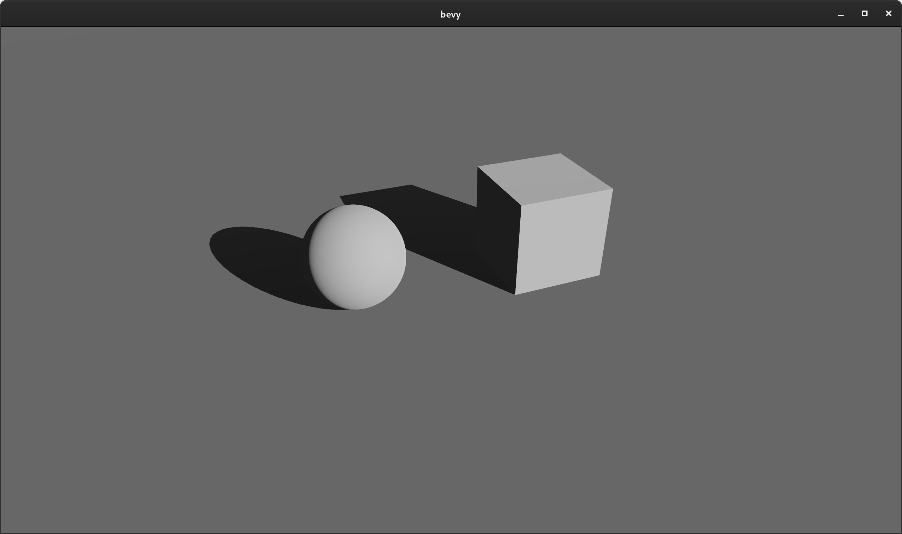

Note: directional shadows currently require more manual configuration than necessary (check out the [`shadow_projection` field in the `DirectionalLight` setup in the shadow_biases.rs example](https://github.com/bevyengine/bevy/blob/main/examples/3d/shadow_biases.rs)). We will soon make this automatic and better quality over a larger range through cascaded shadow maps.

### Point Light Shadows

<div class="release-feature-authors">authors: @mtsr, Rob Swain (@superdump), @cart</div>

Point lights can now cast "omnidirectional shadows", which can be enabled by setting `PointLight::shadows_enabled` to `true`:

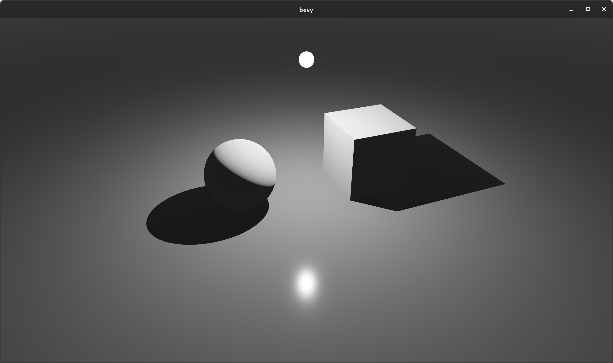

### Enabling and Disabling Entity Shadows

<div class="release-feature-authors">authors: Rob Swain (@superdump)</div>

Mesh entities can opt out of casting shadows by adding the {{rust_type(type="struct" crate="bevy_pbr" version="0.6.0" name="NotShadowCaster")}} component.

```rust
commands.entity(entity).insert(NotShadowCaster);
```

Likewise, they can opt out of receiving shadows by adding the {{rust_type(type="struct" crate="bevy_pbr" version="0.6.0" name="NotShadowReceiver")}} component.

```rust
commands.entity(entity).insert(NotShadowReceiver);
```

### Spherical Area Lights

<div class="release-feature-authors">authors: @Josh015</div>

`PointLight` Components can now define a `radius` value, which controls the size of the sphere that emits light. A normal zero-sized "point light" has a radius of zero.

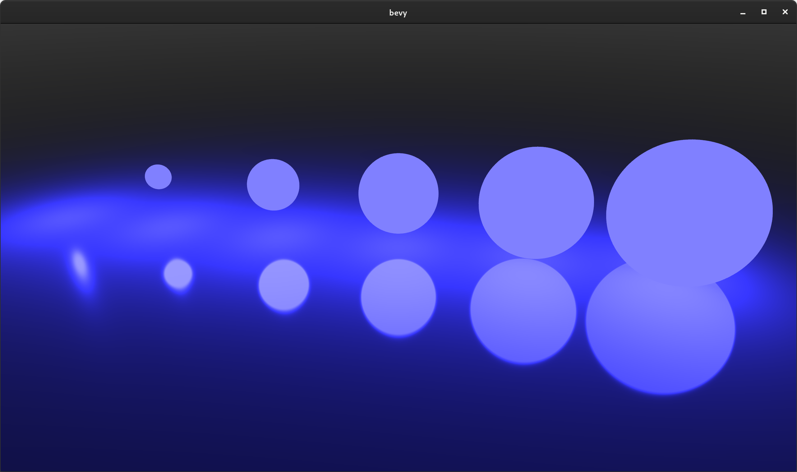

(Note that lights with a radius don't normally take up physical space in the world ... I added meshes to help illustrate light position and size)

### Configurable Alpha Blend Modes

<div class="release-feature-authors">authors: Rob Swain (@superdump)</div>

Bevy's StandardMaterial now has an `alpha_mode` field, which can be set to `AlphaMode::Opaque`, `AlphaMode::Mask(f32)`, or `AlphaMode::Blend`. This field is properly set when loading GLTF scenes.

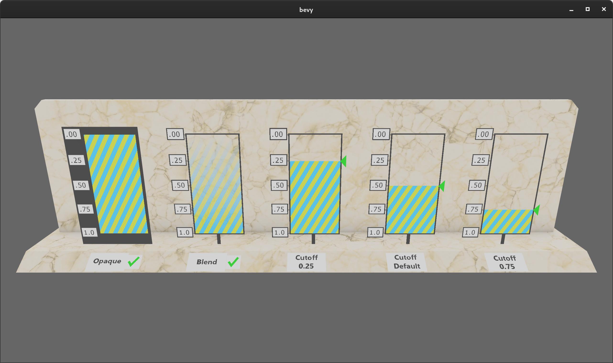

### Clustered Forward Rendering

<div class="release-feature-authors">authors: Rob Swain (@superdump)</div>

Modern scenes often have many point lights. But when rendering scenes, calculating lighting for each light, for each rendered fragment rapidly becomes prohibitively expensive as the number of lights in the scene increases. [Clustered Forward Rendering](http://www.aortiz.me/2018/12/21/CG.html) is a popular approach that increases the number of lights you can have in a scene by dividing up the view frustum into "clusters" (a 3d grid of sub-volumes). Each cluster is assigned lights based on whether they can affect that cluster. This is a form of "culling" that enables fragments to ignore lights that aren't assigned to their cluster.

In practice this can significantly increase the number of lights in the scene:


Clusters are 3d subdivisions of the view frustum. They are cuboids in projected space so for a perspective projection, they are stretched and skewed in view space. When debugging them in screen space, you are looking along a row of clusters and so they look like squares. Different colors within a square represent mesh surfaces being at different depths in the scene and so they belong to different clusters:

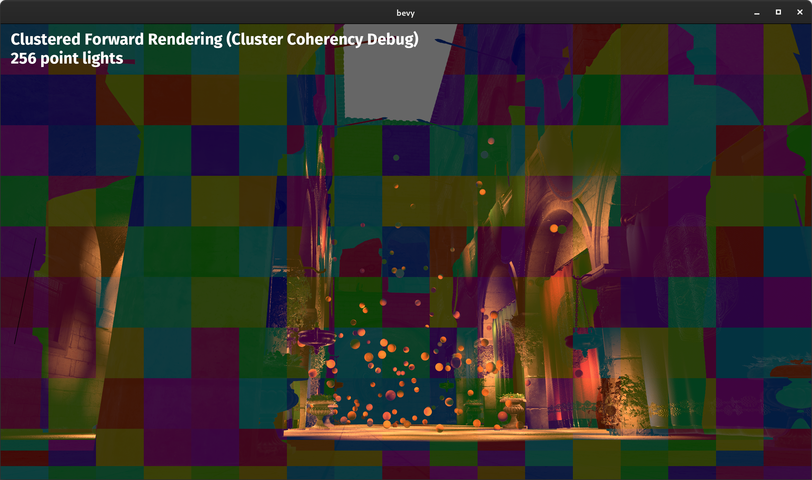

The current implementation is limited to at most 256 lights as we initially prioritized cross-platform compatibility so that everyone could benefit. WebGL2 specifically does not support storage buffers and so the implementation is currently constrained by the maximum uniform buffer size. We can support many more lights on other platforms by using storage buffers, which we will add support for in a future release.

[Click here](https://youtu.be/dElYzzNovEk) for a video that illustrates Bevy's clustered forward rendering.

### Sprite Batching

<div class="release-feature-authors">authors: @cart</div>

Sprites are now rendered in batches according to their texture within a z-level. They are also opportunistically batched across z-levels. This yields significant performance wins because it drastically reduces the number of draw calls required. Combine that with the other performance improvements in the new Bevy Renderer and things start to get very interesting! On my machine, the old Bevy renderer generally started dropping below 60fps at around 8,000 sprites in our "bevymark" benchmark. With the new renderer on that same machine I can get about 100,000 sprites!

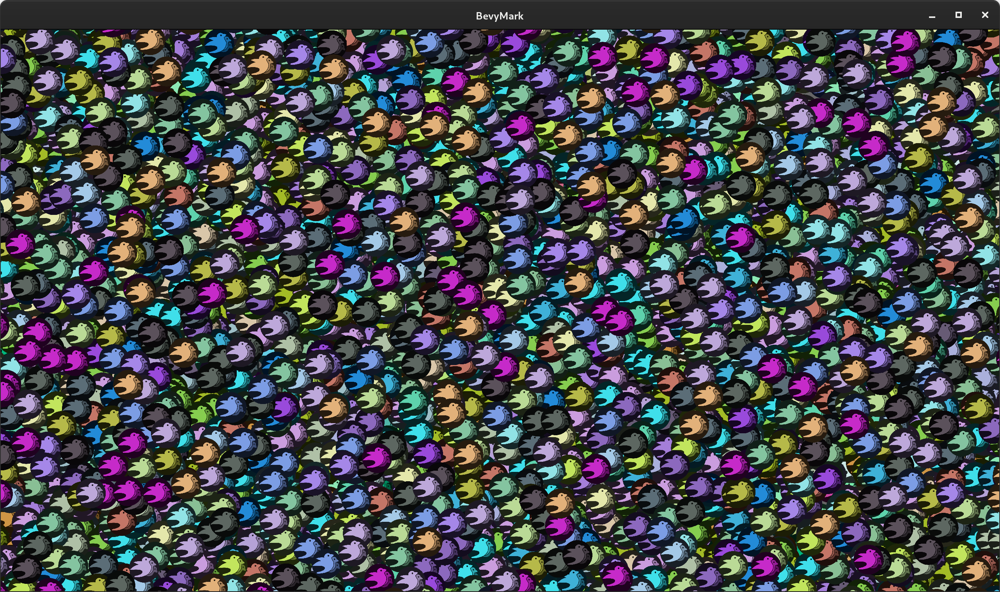

My machine: Nvidia GTX 1070, Intel i7 7700k, 16GB ram, Arch Linux

### Sprite Ergonomics

Sprite entities are now simpler to spawn:

```rust
fn spawn_sprite(mut commands: Commands, asset_server: Res<AssetServer>) {
    commands.spawn_bundle(SpriteBundle {
        texture: asset_server.load("player.png"),
        ..Default::default()
    });
}
```

No need to manage sprite materials! Their texture handle is now a direct component and color can now be set directly on the {{rust_type(type="struct" crate="bevy_sprite" version="0.6.0" name="Sprite")}} component.

<details>
    <summary>To compare, expand this to see the old Bevy 0.5 code</summary>

```rust
// Old (Bevy 0.5)
fn spawn_sprite(
    mut commands: Commands,
    asset_server: Res<AssetServer>,
    mut materials: ResMut<Assets<ColorMaterial>>,
) {
    let texture_handle = asset_server.load("player.png");
    commands.spawn_bundle(SpriteBundle {
        material: materials.add(texture_handle.into()),
        ..Default::default()
    });
}
```

</details>

### WGSL Shaders

Bevy now uses [WGSL](https://www.w3.org/TR/WGSL/) for our built-in shaders and examples. WGSL is a new shader language being developed for WebGPU (although it is a "cross platform" shader language just like GLSL). Bevy still supports GLSL shaders, but WGSL is nice enough that, for now, we are treating it as our "officially recommended" shader language. WGSL is still being developed and polished, but given how much investment it is receiving I believe it is worth betting on. Consider this the start of the "official Bevy shader language" conversation, not the end of it.

```rust
[[group(0), binding(0)]]
var<uniform> view: View;

[[group(1), binding(0)]]
var<uniform> mesh: Mesh;

struct Vertex {
    [[location(0)]] position: vec3<f32>;
};

struct VertexOutput {
    [[builtin(position)]] clip_position: vec4<f32>;
};

[[stage(vertex)]]
fn vertex(vertex: Vertex) -> VertexOutput {
    var out: VertexOutput;
    out.clip_position = view.view_proj * mesh.model * vec4<f32>(vertex.position, 1.0);
    return out;
}
```

### Shader Preprocessor

<div class="release-feature-authors">authors: @cart, Rob Swain (@superdump), @mockersf</div>

Bevy now has its own custom shader preprocessor. It currently supports `#import`, `#ifdef FOO`, `#ifndef FOO`, `#else`, and `#endif`, but we will be expanding it with more features to enable simple, flexible shader code reuse and extension.

Shader preprocessors are often used to conditionally enable shader code:

```rust
#ifdef TEXTURE
[[group(1), binding(0)]]
var sprite_texture: texture_2d<f32>;
#endif
```

This pattern is very useful when defining complicated / configurable shaders (such as Bevy's PBR shader).

### Shader Imports

<div class="release-feature-authors">authors: @cart</div>

The new preprocessor supports importing other shader files (which pulls in their entire contents). This comes in two forms:

Asset path imports:

```rust
#import "shaders/cool_function.wgsl"

[[stage(fragment)]]
fn fragment(input: VertexOutput) -> [[location(0)]] vec4<f32> {
    return cool_function();
}
```

Plugin-provided imports, which can be registered by Bevy Plugins with arbitrary paths:

```rust
#import bevy_pbr::mesh_view_bind_group

[[stage(vertex)]]
fn vertex(vertex: Vertex) -> VertexOutput {
    let world_position = vec4<f32>(vertex.position, 1.0);
    var out: VertexOutput;
    // The `view` variable comes from the imported bind group 
    out.clip_position = view.view_proj * world_position;
    return out;
}
```

We also plan to experiment with using Naga for "partial imports" of specific, named symbols (ex: import a specific function or struct from a file). It's a 'far out' idea, but this could also enable using Naga's intermediate shader representation as a way of combining pieces of shader code written in different languages into one shader.

### Pipeline Specialization

<div class="release-feature-authors">authors: @cart</div>

When shaders use a preprocessor and have multiple permutations, the associated "render pipeline" needs to be updated to accommodate those permutations (ex: different Vertex Attributes, Bind Groups, etc). To make this process straightforward, we added the SpecializedPipeline trait, which allows defining specializations for a given key:

```rust
impl SpecializedPipeline for MyPipeline {
    type Key = MyPipelineKey;
    // The key here is specified for entities when queuing them up in a RenderPhase
    fn specialize(&self, key: Self::Key) -> RenderPipelineDescriptor {
        // define a specialized pipeline for the given key here
    }
}
```

Implementors of this trait can then easily and cheaply access specialized pipeline variants (with automatic per-key caching and hot-reloading). If this feels too abstract / advanced, don't worry! This is a "mid-level power-user tool", not something most Bevy App developers need to contend with.

### Simpler Shader Stack

Bevy now uses [Naga](https://github.com/gfx-rs/naga) for all of its shader needs. As a result, we were able to remove all of our complicated non-rust shader dependencies: `glsl_to_spirv`, `shaderc`, and `spirv_reflect`. `glsl_to_spirv` was a major producer of platform-specific build dependencies and bugs, so this is a huge win!

### Features Ported to the New Renderer

Render logic for internal Bevy crates had to be rewritten in a number of cases to take advantage of the new renderer. The following people helped with this effort:

* bevy_sprites: @cart, @StarArawn, @Davier
* bevy_pbr: Rob Swain (@superdump), @aevyrie, @cart, @zicklag, @jakobhellermann
* bevy_ui: @Davier
* bevy_text: @Davier
* bevy_gltf: Rob Swain (@superdump)

### WebGL2 Support

<div class="release-feature-authors">authors: @zicklag, @mrk-its, @mockersf, Rob Swain (@superdump)</div>

Bevy now has built-in support for deploying to the web using WebGL2 / WASM, thanks to @zicklag adding a native WebGL2 backend to wgpu. There is now no need for the third party `bevy_webgl2` plugin. Any Bevy app can be deployed to the web by running the following commands:

```rust
cargo build --target wasm32-unknown-unknown
wasm-bindgen --out-dir OUTPUT_DIR --target web TARGET_DIR
```

The New Bevy Renderer developers prioritized cross-platform compatibility for the initial renderer feature implementation and so had to carefully operate within the limits of WebGL2 (ex: storage buffers and compute shaders aren't supported in WebGL2), but the results were worth it! Over time, features will be implemented that leverage more modern/advanced features such as compute shaders. But it is important to us that everyone has access to a solid visual experience for their games and applications regardless of their target platform(s).

You can try out Bevy's WASM support in your browser using our new [Bevy Examples](/examples) page:

[](/examples)

### Infinite Reverse Z Perspective Projection

<div class="release-feature-authors">authors: Rob Swain (@superdump)</div>

For improved precision in the "useful range", the industry has largely adopted "reverse projections" with an "infinite" far plane. The new Bevy renderer was adapted to use the "right-handed infinite reverse z" projection. [This Nvidia article](https://developer.nvidia.com/content/depth-precision-visualized) does a great job of explaining why this is so worthwhile.

### Compute Shaders

The new renderer makes it possible for users to write compute shaders. Our new ["compute shader game of life" example](https://github.com/bevyengine/bevy/blob/v0.6.0/examples/shader/compute_shader_game_of_life.rs) (by @jakobhellermann) illustrates how to write compute shaders in Bevy.

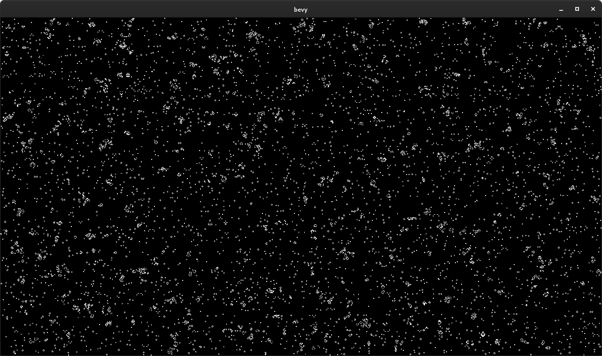

### New Multiple Windows Example

<div class="release-feature-authors">authors: @DJMcNab</div>

The "multiple windows" example has been updated to use the new renderer APIs. Thanks to the new renderer APIs, this example is now [much nicer to look at](https://github.com/bevyengine/bevy/blob/v0.6.0/examples/window/multiple_windows.rs) (and will look even nicer when we add high-level Render Targets).


### Crevice

<div class="release-feature-authors">authors: @cart, @mockersf, Rob Swain (@superdump)</div>

Bevy's old `Bytes` abstraction has been replaced with a fork of the [crevice](https://github.com/LPGhatguy/crevice) crate (by @LPGhatguy), which makes it possible to write normal Rust types to GPU-friendly data layouts. Namely std140 (uniform buffers default to this layout) and std430 (storage buffers default to this layout). Bevy exports `AsStd140` and `AsStd430` derives:

```rust
#[derive(AsStd140)]
pub struct MeshUniform {
    pub transform: Mat4,
    pub inverse_transpose_model: Mat4,
}
```

Coupling an `AsStd140` derive with our new `UniformVec<T>` type makes it easy to write Rust types to shader-ready uniform buffers:

```rust
// WGSL shader
struct Mesh {
    model: mat4x4<f32>;
    inverse_transpose_model: mat4x4<f32>;
};

[[group(2), binding(0)]]
var<uniform> mesh: Mesh;
```

We (in the short term) forked crevice for a couple of reasons:

* To merge [Array Support PR](https://github.com/LPGhatguy/crevice/pull/27/) by @ElectronicRU, as we need support for arrays in our uniforms.  
* To re-export crevice derives and provide an "out of the box" experience for Bevy

Ultimately, we'd like to move back upstream if possible. A big thanks to the crevice developers for building such useful software!

### UV Sphere Mesh Shape

<div class="release-feature-authors">authors: @nside</div>

Bevy now has a built-in "uv sphere" mesh primitive.

```rust
Mesh::from(UVSphere {
    radius: 1.0,
    sectors: 16,
    stacks: 32,
})
```

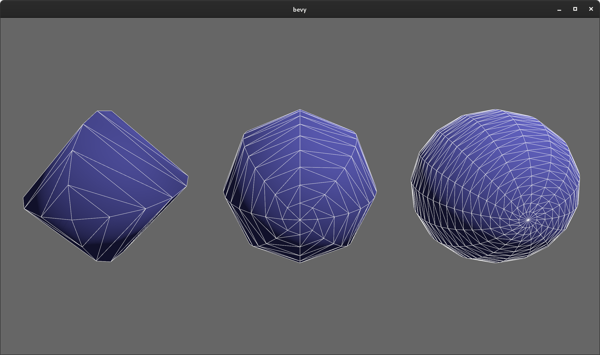

### Flat Normal Computation

<div class="release-feature-authors">authors: @jakobhellermann</div>

The `Mesh` type now has a `compute_flat_normals()` function. Imported GLTF meshes without normals now automatically have flat normals computed, [in accordance with the GLTF spec](https://www.khronos.org/registry/glTF/specs/2.0/glTF-2.0.html#meshes).

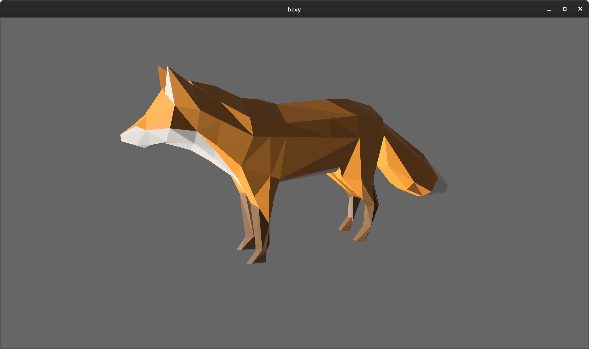

### Faster GLTF Loading

<div class="release-feature-authors">authors: @DJMcNab, @mockersf</div>

@DJMcNab fixed nasty non-linear loading of GLTF nodes, which made them load much faster. One complicated scene went from 40 seconds to 0.2 seconds. Awesome!

@mockersf made GLTF textures load asynchronously in Bevy's "IO task pool", which almost halved GLTF scene load times in some cases.

We are also in the process of adding "compressed texture loading", which will substantially speed up GLTF scene loading, especially for large scenes!

## Bevy ECS

### No more `.system()`!

<div class="release-feature-authors">authors: @DJMcNab, @Ratysz</div>

One of our highest priorities for Bevy ECS is "ergonomics". In the past I have made wild claims that Bevy ECS is the [most ergonomic ECS in existence](https://bevyengine.org/news/introducing-bevy/#ergonomics). We've spent gratuitous amounts of R&D pioneering new API techniques and I believe the results speak for themselves:

```rust
// This is a standalone Bevy 0.5 App that adds a simple `gravity` system to the App's schedule
// and automatically runs it in parallel with other systems
fn main() {
    App::build()
        .add_plugins(DefaultPlugins)
        .add_system(gravity.system())
        .run();
}

fn gravity(time: Res<Time>, mut query: Query<&mut Transform>) {
    for mut transform in query.iter_mut() {
        transform.translation.y += -9.8 * time.delta_seconds();
    }
}
```

I believe we were already the best in the market by a wide margin (especially if you take into account our automatic parallelization and change detection), but we had one thing holding us back from perfection ... that pesky `.system()`! We've tried removing it a number of times, but due to rustc limitations and safety issues, it always eluded us. Finally, @DJMcNab [found a solution](https://github.com/bevyengine/bevy/pull/2398). As a result, in Bevy 0.6 you can now register the system above like this:

```rust
// pure bliss!
App::new()
    .add_plugins(DefaultPlugins)
    .add_system(gravity)
    .run();
```

### The New Component Trait and #[derive(Component)]

<div class="release-feature-authors">authors: @Frizi</div>

In **Bevy 0.6** types no longer implement the {{rust_type(type="trait" crate="bevy_ecs" version="0.6.0" name="Component")}} trait by default. Before you get angry ... stick with me for a second. I promise this is for the best! In past Bevy versions, we got away with "auto implementing" {{rust_type(type="trait" crate="bevy_ecs" version="0.6.0" name="Component")}} for types using this "blanket impl":

```rust
impl<T: Send + Sync + 'static> Component for T {}
```

This removed the need for users to manually implement {{rust_type(type="trait" crate="bevy_ecs" version="0.6.0" name="Component")}} for their types. Early on this seemed like an ergonomics win with no downsides. But Bevy ECS, our understanding of the problem space, and our plans for the future have changed a lot since then:

* **It turns out _not everything_ should be a Component**: Our users _constantly_ accidentally add non-component types as components. New users accidentally adding Bundles and type constructors as Components are our most common `#help` channel threads on [our Discord](https://discord.gg/bevy). This class of error is very hard to debug because things just silently "don't work". When not everything is a Component, rustc can properly yell at you with informative errors when you mess up.
* **Optimizations**: If we implement Component for everything automatically, we can't customize the Component type with associated types. This prevents an entire class of optimization. For example, Bevy ECS now has [multiple Component storage types](/news/bevy-0-5/#hybrid-component-storage-the-solution). By moving the storage type into Component, we enable rustc to optimize checks that would normally need to happen at runtime. @Frizi was able to [significantly improve our Query iterator performance](https://github.com/bevyengine/bevy/pull/2254#issuecomment-857863116) by moving the storage type into Component. I expect us to find more optimizations in this category.
* **Automatic registration**: Moving more logic into Component also gives us the ability to do fancier things in the future like "automatically registering Reflect impls when deriving Component". Non-blanket Component impls do add a small amount of boilerplate, but they also have the potential to massively reduce the "total boilerplate" of an app.
* **Documentation**: Deriving Component serves as a form of self-documentation. It's now easy to tell what types are components at a glance.
* **Organized**: In Bevy 0.5 Component-specific configuration like "storage type" had to be registered in a centralized Plugin somewhere. Moving Component configuration into the Component trait allows users to keep "Component type information" right next to the type itself.
* **Event Handlers**: Non-blanket Component impls will eventually allow us to add event handlers like `on_insert(world: &mut World)` to the Component trait. Very useful!

Hopefully by now you're convinced that this is the right move. If not ... I'm sorry ... you still need to implement Component manually in Bevy 0.6. You can either derive Component:

```rust
// defaults to "Table" storage
#[derive(Component)]
struct SomeComponent;

// overrides the default storage
#[derive(Component)]
#[component(storage = "SparseSet")]
struct SomeComponent;
```

Or you can manually implement it:

```rust
struct SomeComponent;

impl Component for SomeComponent {
    type Storage = TableStorage;
}

impl Component for SomeComponent {
    type Storage = SparseSetStorage;
}
```

### iter() for mutable Queries

<div class="release-feature-authors">authors: @Guvante</div>

Mutable queries can now be immutably iterated, returning immutable references to components:

```rust
fn system(mut players: Query<&mut Player>) {
    for player in players.iter() {
        // player is an immutable reference
    }

    for mut player in players.iter_mut() {
        // player is a mutable reference
    }
}
```

Compare that to the complicated QuerySet that this would have needed in previous Bevy versions to avoid conflicting immutable and mutable Queries:

```rust
// Gross!
fn system(mut players: QuerySet<(QueryState<&Player>, QueryState<&mut Player>)>) {
    for player in players.q0().iter() {
        // player is an immutable reference
    }

    for mut player in players.q1().iter_mut() {
        // player is a mutable reference
    }
}
```

### SystemState

Have you ever wanted to use "system params" directly with a Bevy World? With {{rust_type(type="struct" crate="bevy_ecs" version="0.6.0" name="SystemState")}}, now you can!

```rust
let mut system_state: SystemState<(Res<A>, Query<&B>)> = SystemState::new(&mut world);
let (a, query) = system_state.get(&world);
```

For those working directly with `World`, this is a game changer. It makes it possible to mutably access multiple disjoint Components and Resources (often eliminating the need for more costly abstractions like `WorldCell`).

{{rust_type(type="struct" crate="bevy_ecs" version="0.6.0" name="SystemState")}} does all of the same caching that a normal Bevy system does, so reusing the same SystemState results in uber-fast World access.

### Sub Apps

<div class="release-feature-authors">authors: @cart, @zicklag, @bjorn3</div>

The new Bevy renderer requires strict separation between the "main app" and the "render app". To enable this, we added the concept of "sub-apps":

```rust
#[derive(Debug, Clone, Copy, Hash, PartialEq, Eq, AppLabel)]
pub struct RenderApp;

let mut render_app = App::empty();
app.add_sub_app(RenderApp, render_app, move |app_world, render_app| {
    // execute app logic here
});

// later
app.sub_app_mut(RenderApp)
    .add_system(some_system);
    .add_system(some_other_system);
```

We plan on exposing more control over scheduling, running, and working with sub-apps in the future.

### Query::iter_combinations

<div class="release-feature-authors">authors: @Frizi</div>

You can now iterate all combinations of N entities for a given query:

```rust
fn system(query: Query<&Player>) {
    // iterates each possible combination of two entities exactly once
    for [p1, p2] in query.iter_combinations() {
    }

    // iterates each possible combination of three entities exactly once
    for [p1, p2, p3] in query.iter_combinations() {
    }
}
```

This is especially useful for things like "checking for entities for collisions with all other entities". There is also an `iter_combinations_mut` variant. Just be careful ... the time complexity of this grows exponentially as the number of entities in your combinations increases. With great power comes great responsibility!

The new [iter_combinations example](https://github.com/bevyengine/bevy/blob/v0.6.0/examples/ecs/iter_combinations.rs) illustrates how to use this new API to calculate gravity between objects in a "solar system":

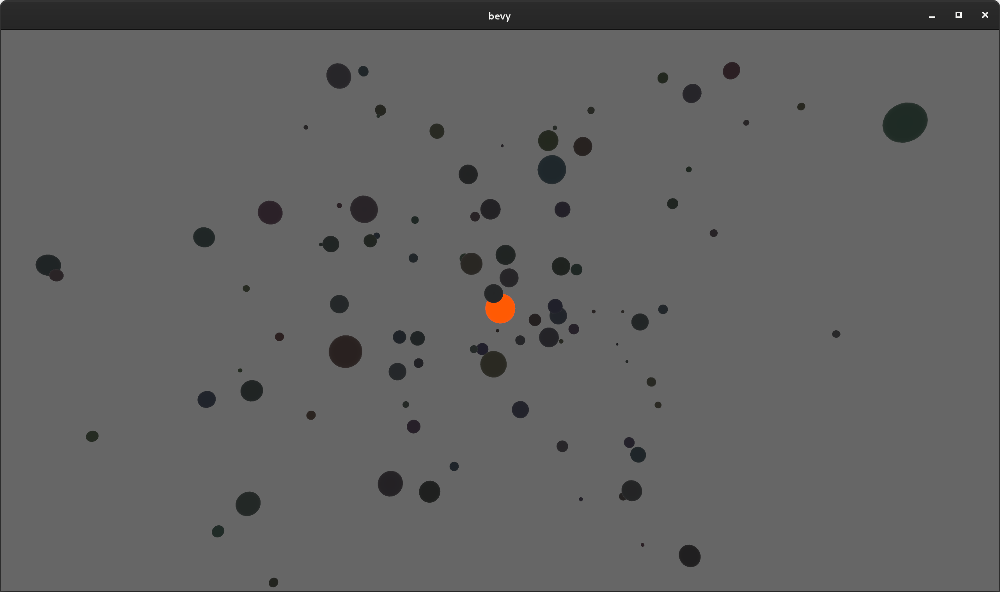

### Optimized System Commands

<div class="release-feature-authors">authors: @NathanSWard</div>

System Commands got a nice performance boost by changing how command buffers are stored and reused:

#### Entity Spawn Benchmark Duration (in microseconds, less is better)

This benchmark spawns entities with a variety of component compositions to ensure we cover a variety of cases. Treat these numbers as relatives, not absolutes.


### System Param Lifetimes

<div class="release-feature-authors">authors: @cart, @BoxyUwU, @TheRawMeatball</div>

System and Query lifetimes were made more explicit by splitting out the `'system` and `'world`, lifetimes and using them explicitly where possible. This enables Rust to reason about ECS lifetimes more effectively, especially for read-only lifetimes. This was particularly important because it enabled the new Bevy Renderer to convince wgpu that ECS resources actually live for as long as the Render World.

Note that this does make the lifetimes on SystemParam derives slightly more complicated as a result:

```rs
#[derive(SystemParam)]
struct CustomParam<'w, 's> {
    res: Res<'w, AssetServer>,
    query: Query<'w, 's, Read<Transform>>,
    local: Local<'s, i32>,
}
```

### Soundness / Correctness Improvements

<div class="release-feature-authors">authors: @BoxyUwU, @TheRawMeatball, @Frizi, @thebluefish, @sapir, @bjorn3, @DJMcNab</div>

Bevy ECS received a solid number of soundness and correctness bug fixes this release, alongside some unsafe code block removals. Queries and internal storages like Tables and BlobVecs in particular had a number of fixes and improvements in these areas. As Bevy ECS matures, our bar for unsafe code blocks and soundness must also mature. Bevy ECS will probably never be 100% free of unsafe code blocks, because we are modeling parallel data access that Rust literally cannot reason about without our help. But we are committed to removing as much unsafe code as we can (and we have a number of refactors in the works to further improve the situation).

### Hierarchy Convenience Functions

<div class="release-feature-authors">authors: @TheRawMeatball, @jihiggins</div>

```rust
// Despawns all descendants of an entity (its children, its childrens' children, etc)
commands.entity(e).despawn_descendants();

// Removes the given children from the entity
commands.entity(parent).remove_children(&[child1, child2]);
```

## UI

### Overflow::Hidden

<div class="release-feature-authors">authors: @Davier</div>

UI now respects the flexbox `Overflow::Hidden` property. This can be used to cut off child content, which is useful when building things like scrollable lists:

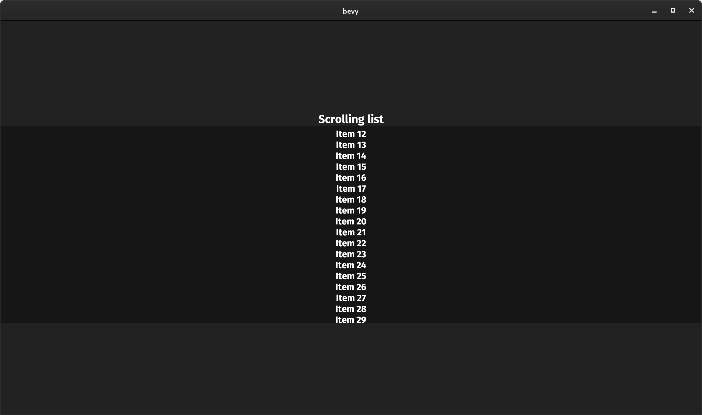

### Text2D Transforms

<div class="release-feature-authors">authors: @nside, @CleanCut</div>

`Text2d` now supports arbitrary transformations using the Transform component:

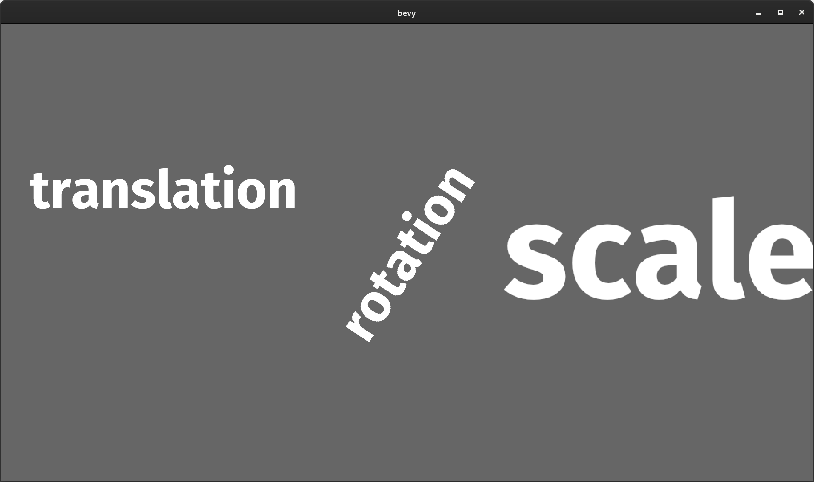

Note that while `Transform::scale` does have its uses, it is generally still a good idea to adjust text size using the "font size" to ensure it renders "crisply".

### Window Transparency

<div class="release-feature-authors">authors: @louisgjohnson</div>

Winit's "window transparency" feature is now exposed in Bevy's Window type. This allows users to build "widget like" apps without backgrounds or window decorations (on platforms that support it). Here is a Bevy app with a transparent background, rendering a Bevy Logo sprite on top of my Linux desktop background. Seamless! Cool!


## Transforms

### Friendly Directional Vectors

<div class="release-feature-authors">authors: @guimcaballero</div>

Bevy Transforms now have friendly "directional" functions that return relative vectors:

```rust
// Points to the left of the transform
let left: Vec4 = transform.left();
// Points to the right of the transform
let right: Vec4 = transform.right();
// Points up from the transform
let up: Vec4 = transform.up();
// Points down from the transform
let down: Vec4 = transform.down();
// Points forward from the transform
let forward: Vec4 = transform.forward();
// Points back from the transform
let back: Vec4 = transform.back();
```

### Transform Builder Methods

<div class="release-feature-authors">authors: @Lythenas</div>

Transforms now have helpful `with_translation()`, `with_rotation()`, and `with_scale()` builder methods:

```rust
Transform::from_xyz(0.0, 0.0, 10.0).with_scale(Vec3::splat(2.0))
```

## Rust 2021

<div class="release-feature-authors">authors: @mockersf, @YohDeadfall</div>

Bevy has been updated to use Rust 2021. This means we can take advantage of the new Cargo feature resolver by default (which both Bevy and the new wgpu version require). Make sure you update your crates to Rust 2021 or you will need to manually enable the new feature resolver with `resolver = "2"` in your Cargo.toml.

```toml
[package]
name = "your_app"
version = "0.1.0"
edition = "2021"
```

Note that "virtual Cargo workspaces" still need to manually define `resolver = "2"`, even in Rust 2021. [Refer to the Rust 2021 documentation](https://doc.rust-lang.org/edition-guide/rust-2021/default-cargo-resolver.html#details) for details.

```toml
[workspace]
resolver = "2" # Important! wgpu/Bevy needs this!
members = [ "my_crate1", "my_crate2" ]
```

## Input

### Gamepads Resource

<div class="release-feature-authors">authors: @CrazyRoka</div>

**Bevy 0.6** adds a `Gamepads` resource, which automatically maintains a collection of connected gamepads.

```rust
fn system(gamepads: Res<Gamepads>) {
    // iterates every active game pad
    for gamepad in gamepads.iter() {
    }
}
```

### Input "any" variants

<div class="release-feature-authors">authors: @DJMcNab</div>

`Input` collections now have an `any_pressed()` function, which returns true when any of the given inputs are pressed.

```rust
 fn system(input: Res<Input<KeyCode>>) {
    if input.any_pressed([KeyCode::LShift, KeyCode::RShift]) {
        println!("one or both of the two shift keys are pressed");
    }
 }
```

## Profiling

### More Spans

<div class="release-feature-authors">authors: @cart, @mockersf, @hymm</div>

The new renderer now has tracing spans for frames, the render app schedule, and the Render Graph (with named Sub Graphs spans). The system executor now has finer grained spans, filling in most of the remaining blanks. Applying System Commands also now has spans.

(ignore those weird characters in the spans ... we're [investigating](https://github.com/bevyengine/bevy/issues/3563) that)

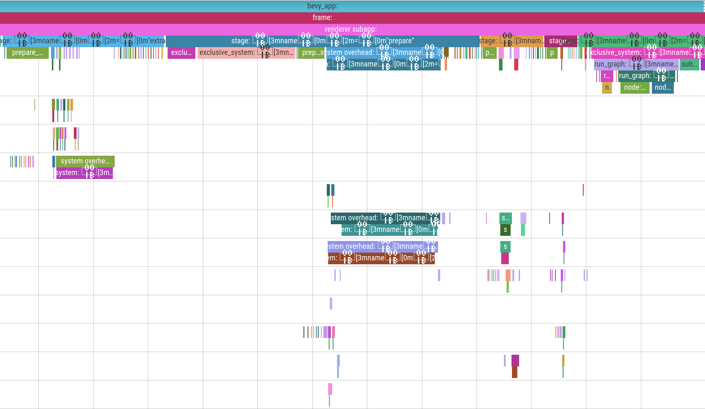

### Tracy Backend

<div class="release-feature-authors">authors: Rob Swain (@superdump)</div>

Bevy now supports the [tracy](https://github.com/wolfpld/tracy) profiler via the `trace_tracy` Cargo feature.

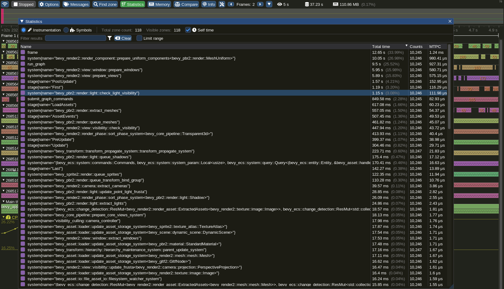

### FromReflect Trait and Derive

<div class="release-feature-authors">authors: @Davier</div>

Types can now derive the new `FromReflect` trait, which enables creating "clones" of a type using arbitrary `Reflect` impls. This is currently used to make reflected collection types (like `Vec`) work properly, but it will also be useful for "round trip" conversions to and from `Reflect` types.

```rust
#[derive(Reflect, FromReflect)]
struct Foo {
    bar: usize,
}

let foo = Foo::from_reflect(&dyn some_reflected_value).unwrap(); 
```

## Bevy Error Codes

<div class="release-feature-authors">authors: @mockersf, @NiklasEi</div>

To make it easier to search for and discuss common Bevy errors, we decided to add a formal [error codes system](https://github.com/bevyengine/bevy/tree/main/errors), much like the one [that rustc uses](https://github.com/rust-lang/rust/tree/master/compiler/rustc_error_codes/src/error_codes);

Error codes and their descriptions also have an automatically-generated [page on the Bevy website](/learn/errors/).

## Bevy Assets

<div class="release-feature-authors">authors: @mockersf</div>

The curated awesome-bevy GitHub repo containing a list of Bevy plugins, crates, apps, and learning resources is now reborn as [Bevy Assets](https://github.com/bevyengine/bevy-assets)!

Bevy Assets introduces:

* A structured toml format
* Asset icons
* [bevy-website integration](/assets)

This is just the beginning! We have plans to integrate with [crates.io](http://crates.io) and GitHub, improve indexing / tagging / searchability, add asset-specific pages, prettier styles, content delivery, and more. Ultimately we want this to grow into something that can enable first-class, modern asset-driven workflows.

We have automatically migrated existing awesome-bevy entries, but we encourage creators to customize them! If you are working on something Bevy related, you are highly encouraged to [add a Bevy Assets entry](https://github.com/bevyengine/bevy-assets).

## Dual MIT / Apache-2.0 License

<div class="release-feature-authors">authors: @cart, @DJMcNab</div>

Thanks to the relevant contributors ([all 246 of them](https://github.com/bevyengine/bevy/issues/2373)), Bevy is now dual licensed under MIT _and_ Apache-2.0, at the developers' option. This means developers have the flexibility to choose the license that best suits their specific needs. I want to stress that this is now _less_ restrictive than MIT-only, not more.

I originally chose to license Bevy exclusively under MIT for a variety of reasons:

* People and companies generally know and trust the MIT license more than any other license. Apache 2.0 is less known and trusted.
* It is short and easy to understand
* Many people aren't familiar with the "multiple license options ... choose your favorite" approach. I didn't want to scare people away unnecessarily.
* Other open source engines like Godot have had a lot of success with MIT-only licensing

However, there were a variety of issues that have come up that make dual-licensing Bevy under both MIT and Apache-2.0 compelling:

* The MIT license (arguably) requires binaries to reproduce countless copies of the same license boilerplate for every MIT library in use. Apache-2.0 allows us to compress the boilerplate into a single instance of the license.
* The Apache-2.0 license has protections from patent trolls and an explicit contribution licensing clause.
* The Rust ecosystem is largely Apache-2.0. Being available under that license is good for interoperation and opens the doors to upstreaming Bevy code into other projects (Rust, the async ecosystem, etc).
* The Apache license is incompatible with GPLv2, but MIT is compatible.

## Bevy Org Changes

### More pull request mergers!

I've been at my scalability limits for a while. It has been _cough_... challenging... to build the engine features I need to, review every single pull request quickly, and preserve my mental health. I've made it this far ... sometimes by overworking myself and sometimes by letting PRs sit unmerged for longer than I'd like. By scaling out, we can have our cake and eat it too!

* @mockersf now has merge rights for "uncontroversial changes"
* @alice-i-cecile now has merge rights for "uncontroversial documentation changes"

### New issue labels

After [much discussion about naming conventions and colors](https://github.com/bevyengine/bevy/issues/2256), we finally have a [fresh new set of issue labels](https://github.com/bevyengine/bevy/labels) (loosely inspired by the rust repo). The [Bevy Triage Team](https://github.com/bevyengine/bevy/blob/main/CONTRIBUTING.md#how-were-organized) can finally express themselves fully!

### Comprehensive CONTRIBUTING.md

<div class="release-feature-authors">authors: @alice-i-cecile</div>

We now have a relatively complete [Contributors Guide](https://github.com/bevyengine/bevy/blob/main/CONTRIBUTING.md). If you are interested in contributing code or documentation to Bevy, that is a great place to start!

### CI Build System Improvements

<div class="release-feature-authors">authors: @mockersf, @NathanSWard, @NiklasEi</div>

We made a ton of CI improvements this release:

* We now fail on cargo doc warnings
* We now use [cargo deny](https://github.com/EmbarkStudios/cargo-deny) to protect against vulnerabilities, duplicate dependencies, and invalid licenses
* PRs are now automatically labeled with the `S-Needs-Triage` label
* Ci stability and speed improvements
* We now check that our benchmarks build
* We now assert compiler errors for compile_fail tests, giving us much stricter guarantees
* Examples are now run using lavapipe (instead of swiftshader) for faster CI validation

## What's Next For Bevy?

Bevy development continues to pick up steam, and we have no intention to slow down now! In addition to the [many RFCs](https://github.com/bevyengine/rfcs/pulls) we have in the works, we also plan on tackling the following over the next few months:

### The "Train" Release Schedule

In the last two Bevy releases we made massive, sweeping changes to core systems. **Bevy 0.5** was "the one where we rewrote Bevy ECS". **Bevy 0.6** was "the one where we rewrote Bevy Render". These massive reworks took time, and as a result held back a bunch of other useful features and bug fixes. They also created pressure to "crunch" and finish big features quickly to unblock releases. Crunching is unhealthy and should be avoided at all costs!

[The Bevy Community](https://bevyengine.org/community/) has reached relative consensus that we should have a more regular, more predictable release schedule. One where large features can't gum up the system.

From now on, we will cut releases _approximately_ once every three months (as an upper bound ... sometimes we might release early if it makes sense). After the end of a release cycle, we will start preparing to cut a release. If there are small tweaks that need to be made or "life happens" ... we will happily postpone releases. But we won't hold releases back for "big ticket" items anymore.

We are balancing a lot of different concerns here:

* Building trust with Bevy contributors that their changes will land in a timely manner
* Building trust with Bevy users that they will receive regular updates and bug fixes
* Giving enough time between releases to cut down on churn in the Bevy Plugin ecosystem (Bevy isn't "stable" yet, but longer releases give reasonable windows of "ecosystem stability")
* Providing enough content in a release to generate "hype". Bevy release blog posts tend to be a "rallying cry" for the community and I don't want to lose that.
* Establishing proper work / life balance for core developers (crunch is bad!)

We will refine this process over time and see what works best.

### More Renderer Features

* **Post-Processing Stack / HDR / Bloom**: HDR and bloom [almost made it into Bevy 0.6](https://github.com/bevyengine/bevy/pull/2876), but we decided to hold them back so we can polish them a bit and build a proper "modular post-processing stack".
* **Skeletal Animation**: Ultimately Bevy will have a general purpose, property based animation system (we already have a [working implementation](https://github.com/bevyengine/bevy/pull/1429)). We've been holding off on adding skeletal animation, so we can slot it in to that system, but in retrospect that was a mistake. People need skeletal animation _now_. In the short term we will build a scoped 3d skeletal animation system, just to get the ball rolling. Then later we will port it to the general purpose system (whenever that is ready),
* **Screen Space Ambient Occlusion (SSAO)**: A popular and straightforward ambient occlusion approximation that can drastically improve render quality.
* **Global Illumination**: GI will provide a massive boost to the feel of "realism", so it is worth prioritizing at least one form of GI in the short term. This is a complicated topic and will require experimentation.
* **Compressed Textures**: This will make scenes load faster and cut down on GPU memory usage.
* **Shadow Filters and Cascades**: Rob Swain (@superdump) has already done a lot of work in this area, so we will hopefully see that materialize in a Bevy release soon.
* **PBR Shader Code Reuse**: We will make it easier to define custom PBR shaders by making the PBR shader more modular and making it easier to import specific parts of the PBR shader.

### UI Refresh

We will break ground on the Bevy Editor this year. To do that, we need a number of improvements to Bevy UI:

* Improved "data driven UI" (potentially "reactive")
* A solid set of pre-constructed widgets
* Generally improved UX

We now have a plethora of UI experiments in the Bevy community. Over the next few months we will refine our scope and begin the process of "selecting a winner".

### Asset Preprocessing

Preprocessing assets is a critical part of a production game engine. It cuts down on startup times, reduces our CPU and GPU memory footprint, enables more complicated development workflows, makes it easier to ship assets with games, and cuts down on the final size of a deployed game. We've made it this far without an asset preprocessing system ... but barely. Solving this problem ASAP is a high priority for me.

### Scene Improvements

Nested scenes, property overrides, inline assets, and nicer syntax are all on the agenda. We already have a number of working experiments in these areas, so we should see relatively quick progress here.

### The New Bevy Book

The [current Bevy Book](/learn/book/) is a great way to learn how to set up Bevy and dip your toes into writing Bevy Apps. But it barely scratches the surface of what Bevy can do.

To solve this problem @alice-i-cecile has [started working](https://github.com/bevyengine/bevy-website/pull/182) on a new Bevy Book, with the goal of being a complete learning resource for Bevy. If you are interested in helping out, please reach out to them!

### The Bevy Monthly Newsletter

[The Bevy Community](/community/) is a vibrant and active place. Currently most community content is posted in the `#showcase` section of [The Bevy Discord](https://discord.gg/bevy). The upcoming Monthly Bevy Newsletter will be a consolidated, shareable resource that we will post to places like Reddit and Twitter.

## Support Bevy

Sponsorships help make my full time work on Bevy sustainable. If you believe in Bevy's mission, consider sponsoring me (@cart) ... every bit helps!

<a class="button button--pink header__cta" href="https://github.com/sponsors/cart">Donate </a>

## Contributors

A huge thanks to the **170 contributors** that made this release (and associated docs) possible! In random order:

* @bilsen
* @jcornaz
* @Guvante
* @Weasy666
* @jakobhellermann
* @gfreezy
* @MichaelHills
* @tcmal
* @temhotaokeaha
* @nicopap
* @dimitribobkov
* @Newbytee
* @TheRawMeatball
* @marcospb19
* @MarenFayre
* @jleflang
* @piedoom
* @FlyingRatBull
* @thomasheartman
* @dburrows0
* @squidboylan
* @GarettCooper
* @nside
* @deprilula28
* @Jbat1Jumper
* @HackerFoo
* @MatheusRich
* @inodentry
* @cryscan
* @aleksator
* @Toqozz
* @concave-sphere
* @jesseviikari
* @dependabot
* @zicklag
* @mnett82
* @guimcaballero
* @lukors
* @alice-i-cecile
* @fintelia
* @BoxyUwU
* @gcoakes
* @folke
* @iwikal
* @tsoutsman
* @phrohdoh
* @julhe
* @Byteron
* @TehPers
* @andoco
* @djeedai
* @branan
* @follower
* @MiniaczQ
* @terrarier2111
* @joshuataylor
* @CleanCut
* @akiross
* @rukai
* @PaperCow
* @CGMossa
* @Josh015
* @gschup
* @james7132
* @MyIsaak
* @Hoidigan
* @mccludav
* @mnmaita
* @sapir
* @gilescope
* @VVishion
* @sarkahn
* @fractaloop
* @KDecay
* @aloucks
* @the-notable
* @mirkoRainer
* @Iaiao
* @hymm
* @jacobgardner
* @Protowalker
* @godsmith99x
* @Weibye
* @lberrymage
* @anchpop
* @willolisp
* @trolleyman
* @msklywenn
* @deontologician
* @johanhelsing
* @memoryruins
* @ahmedcharles
* @vabka
* @bytebuddha
* @louisgjohnson
* @r00ster91
* @parasyte
* @illuninocte
* @jihiggins
* @Dimev
* @szunami
* @tiagolam
* @payload
* @mrk-its
* @Ixentus
* @dintho
* @CptPotato
* @bjorn3
* @CAD97
* @lwansbrough
* @Ratysz
* @vgel
* @dixonwille
* @KirmesBude
* @Tobenaii
* @pbalcer
* @msvbg
* @Philipp-M
* @Waridley
* @StarArawn
* @ickk
* @IceSentry
* @Lythenas
* @Shatur
* @Grindv1k
* @aevyrie
* @wilk10
* @Davier
* @timClicks
* @DJMcNab
* @r4gus
* @rparrett
* @mfdorst
* @Veykril
* @thebluefish
* @forbjok
* @bytemuck
* @dbearden
* @OptimisticPeach
* @Weibye-Breach
* @MrGVSV
* @RichoDemus
* @R3DP1XL
* @jak6jak
* @blaind
* @YohDeadfall
* @cart
* @MinerSebas
* @CrazyRoka
* @NiklasEi
* @superdump
* @lassade
* @yetanothercheer
* @64kramsystem
* @mockersf
* @billyb2
* @molikto
* @mtsr
* @Abhuu
* @kumorig
* @yilinwei
* @Nilirad
* @SarthakSingh31
* @Frizi
* @dataphract
* @Sheepyhead
* @simensgreen
* @NathanSWard
* @remilauzier
* @fluffysquirrels

## Full Change Log

### Added

* [New Renderer][3175]
* [Clustered forward rendering][3153]
* [Frustum culling][2861]
* [Sprite Batching][3060]
* [Materials and MaterialPlugin][3428]
* [2D Meshes and Materials][3460]
* [WebGL2 support][3039]
* [Pipeline Specialization, Shader Assets, and Shader Preprocessing][3031]
* [Modular Rendering][2831]
* [Directional light and shadow][c6]
* [Directional light][2112]
* [Use the infinite reverse right-handed perspective projection][2543]
* [Implement and require `#[derive(Component)]` on all component structs][2254]
* [Shader Imports. Decouple Mesh logic from PBR][3137]
* [Add support for opaque, alpha mask, and alpha blend modes][3072]
* [bevy_gltf: Load light names from gltf][3553]
* [bevy_gltf: Add support for loading lights][3506]
* [Spherical Area Lights][1901]
* [Shader Processor: process imported shader][3290]
* [Add support for not casting/receiving shadows][2726]
* [Add support for configurable shadow map sizes][2700]
* [Implement the `Overflow::Hidden` style property for UI][3296]
* [SystemState][2283]
* [Add a method `iter_combinations` on query to iterate over combinations of query results][1763]
* [Add FromReflect trait to convert dynamic types to concrete types][1395]
* [More pipelined-rendering shader examples][3041]
* [Configurable wgpu features/limits priority][3452]
* [Cargo feature for bevy UI][3546]
* [Spherical area lights example][3498]
* [Implement ReflectValue serialization for Duration][3318]
* [bevy_ui: register Overflow type][3443]
* [Add Visibility component to UI][3426]
* [Implement non-indexed mesh rendering][3415]
* [add tracing spans for parallel executor and system overhead][3416]
* [RemoveChildren command][1925]
* [report shader processing errors in `RenderPipelineCache`][3289]
* [enable Webgl2 optimisation in pbr under feature][3291]
* [Implement Sub-App Labels][2695]
* [Added `set_cursor_icon(...)` to `Window`][3395]
* [Support topologies other than TriangleList][3349]
* [Add an example 'showcasing' using multiple windows][3367]
* [Add an example to draw a rectangle][2957]
* [Added set_scissor_rect to tracked render pass.][3320]
* [Add RenderWorld to Extract step][2555]
* [re-export ClearPassNode][3336]
* [add default standard material in PbrBundle][3325]
* [add methods to get reads and writes of Access<T>][3166]
* [Add despawn_children][2903]
* [More Bevy ECS schedule spans][3281]
* [Added transparency to window builder][3105]
* [Add Gamepads resource][3257]
* [Add support for #else for shader defs][3206]
* [Implement iter() for mutable Queries][2305]
* [add shadows in examples][3201]
* [Added missing wgpu image render resources.][3171]
* [Per-light toggleable shadow mapping][3126]
* [Support nested shader defs][3113]
* [use bytemuck crate instead of Byteable trait][2183]
* [`iter_mut()` for Assets type][3118]
* [EntityRenderCommand and PhaseItemRenderCommand][3111]
* [add position to WindowDescriptor][3070]
* [Add System Command apply and RenderGraph node spans][3069]
* [Support for normal maps including from glTF models][2741]
* [MSAA example][3049]
* [Add MSAA to new renderer][3042]
* [Add support for IndexFormat::Uint16][2990]
* [Apply labels to wgpu resources for improved debugging/profiling][2912]
* [Add tracing spans around render subapp and stages][2907]
* [Add set_stencil_reference to TrackedRenderPass][2885]
* [Add despawn_recursive to EntityMut][2855]
* [Add trace_tracy feature for Tracy profiling][2832]
* [Expose wgpu's StencilOperation with bevy][2819]
* [add get_single variant][2793]
* [Add builder methods to Transform][2778]
* [add get_history function to Diagnostic][2772]
* [Add convenience methods for checking a set of inputs][2760]
* [Add error messages for the spooky insertions][2581]
* [Add Deref implementation for ComputePipeline][2759]
* [Derive thiserror::Error for HexColorError][2740]
* [Spawn specific entities: spawn or insert operations, refactor spawn internals, world clearing][2673]
* [Add ClearColor Resource to Pipelined Renderer][2631]
* [remove_component for ReflectComponent][2682]
* [Added ComputePipelineDescriptor][2628]
* [Added StorageTextureAccess to the exposed wgpu API][2614]
* [Add sprite atlases into the new renderer.][2560]
* [Log adapter info on initialization][2542]
* [Add feature flag to enable wasm for bevy_audio][2397]
* [Allow Option<NonSend<T>> and Option<NonSendMut<T>> as SystemParam][2345]
* [Added helpful adders for systemsets][2366]
* [Derive Clone for Time][2360]
* [Implement Clone for Fetches][2641]
* [Implement IntoSystemDescriptor for SystemDescriptor][2718]
* [implement DetectChanges for NonSendMut][2326]
* [Log errors when loading textures from a gltf file][2260]
* [expose texture/image conversions as From/TryFrom][2175]
* [[ecs] implement is_empty for queries][2271]
* [Add audio to ios example][1007]
* [Example showing how to use AsyncComputeTaskPool and Tasks][2180]
* [Expose set_changed() on ResMut and Mut][2208]
* [Impl AsRef+AsMut for Res, ResMut, and Mut][2189]
* [Add exit_on_esc_system to examples with window][2121]
* [Implement rotation for Text2d][2084]
* [Mesh vertex attributes for skinning and animation][1831]
* [load zeroed UVs as fallback in gltf loader][1803]
* [Implement direct mutable dereferencing][2100]
* [add a span for frames][2053]
* [Add an alias mouse position -> cursor position][2038]
* [Adding `WorldQuery` for `WithBundle`][2024]
* [Automatic System Spans][2033]
* [Add system sets and run criteria example][1909]
* [EnumVariantMeta derive][1972]
* [Added TryFrom for VertexAttributeValues][1963]
* [add render_to_texture example][1927]
* [Added example of entity sorting by components][1817]
* [calculate flat normals for mesh if missing][1808]
* [Add animate shaders example][1765]
* [examples on how to tests systems][1714]
* [Add a UV sphere implementation][1887]
* [Add additional vertex formats][1878]
* [gltf-loader: support data url for images][1828]
* [glTF: added color attribute support][1775]
* [Add synonyms for transform relative vectors][1667]

### Changed

* [Relicense Bevy under the dual MIT or Apache-2.0 license][2509]
* [[ecs] Improve `Commands` performance][2332]
* [Merge AppBuilder into App][2531]
* [Use a special first depth slice for clustered forward rendering][3545]
* [Add a separate ClearPass][3209]
* [bevy_pbr2: Improve lighting units and documentation][2704]
* [gltf loader: do not use the taskpool for only one task][3577]
* [System Param Lifetime Split][2605]
* [Optional `.system`][2398]
* [Optional `.system()`, part 2][2403]
* [Optional `.system()`, part 3][2422]
* [Optional `.system()`, part 4 (run criteria)][2431]
* [Optional `.system()`, part 6 (chaining)][2494]
* [Make the `iter_combinators` examples prettier][3075]
* [Remove dead anchor.rs code][3551]
* [gltf: load textures asynchronously using io task pool][1767]
* [Use fully-qualified type names in Label derive.][3544]
* [Remove Bytes, FromBytes, Labels, EntityLabels][3521]
* [StorageType parameter removed from ComponentDescriptor::new_resource][3495]
* [remove dead code: ShaderDefs derive][3490]
* [Enable Msaa for webgl by default][3489]
* [Renamed Entity::new to Entity::from_raw][3465]
* [bevy::scene::Entity renamed to bevy::scene::DynamicEntity.][3448]
* [make `sub_app` return an `&App` and add `sub_app_mut() -> &mut App`][3309]
* [use ogg by default instead of mp3][3421]
* [enable `wasm-bindgen` feature on gilrs][3420]
* [Use EventWriter for gilrs_system][3413]
* [Add some of the missing methods to `TrackedRenderPass`][3401]
* [Only bevy_render depends directly on wgpu][3393]
* [Update wgpu to 0.12 and naga to 0.8][3375]
* [Improved bevymark: no bouncing offscreen and spawn waves from CLI][3364]
* [Rename render UiSystem to RenderUiSystem][3371]
* [Use updated window size in bevymark example][3335]
* [Enable trace feature for subfeatures using it][3337]
* [Schedule gilrs system before input systems][2989]
* [Rename fixed timestep state and add a test][3260]
* [Port bevy_ui to pipelined-rendering][2653]
* [update wireframe rendering to new renderer][3193]
* [Allow `String` and `&String` as `Id` for `AssetServer.get_handle(id)`][3280]
* [Ported WgpuOptions to new renderer][3282]
* [Down with the system!][2496]
* [Update dependencies `ron` `winit`& fix `cargo-deny` lists][3244]
* [Improve contributors example quality][3258]
* [Expose command encoders][3271]
* [Made Time::time_since_startup return from last tick.][3264]
* [Default image used in PipelinedSpriteBundle to be able to render without loading a texture][3270]
* [make texture from sprite pipeline filterable][3236]
* [iOS: replace cargo-lipo, and update for new macOS][3109]
* [increase light intensity in pbr example][3182]
* [Faster gltf loader][3189]
* [Use crevice std140_size_static everywhere][3168]
* [replace matrix swizzles in pbr shader with index accesses][3122]
* [Disable default features from `bevy_asset` and `bevy_ecs`][3097]
* [Update tracing-subscriber requirement from 0.2.22 to 0.3.1][3076]
* [Update vendored Crevice to 0.8.0 + PR for arrays][3059]
* [change texture atlas sprite indexing to usize][2887]
* [Update derive(DynamicPlugin) to edition 2021][3038]
* [Update to edition 2021 on master][3028]
* [Add entity ID to expect() message][2943]
* [Use RenderQueue in BufferVec][2847]
* [removed unused RenderResourceId and SwapChainFrame][2890]
* [Unique WorldId][2827]
* [add_texture returns index to texture][2864]
* [Update hexasphere requirement from 4.0.0 to 5.0.0][2880]
* [enable change detection for hierarchy maintenance][2411]
* [Make events reuse buffers][2850]
* [Replace `.insert_resource(T::default())` calls with `init_resource::<T>()`][2807]
* [Improve many sprites example][2785]
* [Update glam requirement from 0.17.3 to 0.18.0][2748]
* [update ndk-glue to 0.4][2684]
* [Remove Need for Sprite Size Sync System][2632]
* [Pipelined separate shadow vertex shader][2727]
* [Sub app label changes][2717]
* [Use Explicit Names for Flex Direction][2672]
* [Make default near plane more sensible at 0.1][2703]
* [Reduce visibility of various types and fields][2690]
* [Cleanup FromResources][2601]
* [Better error message for unsupported shader features Fixes #869][2598]
* [Change definition of `ScheduleRunnerPlugin`][2606]
* [Re-implement Automatic Sprite Sizing][2613]
* [Remove with bundle filter][2623]
* [Remove bevy_dynamic_plugin as a default][2578]
* [Port bevy_gltf to pipelined-rendering][2537]
* [Bump notify to 5.0.0-pre.11][2564]
* [Add 's (state) lifetime to `Fetch`][2515]
* [move bevy_core_pipeline to its own plugin][2552]
* [Refactor ECS to reduce the dependency on a 1-to-1 mapping between components and real rust types][2490]
* [Inline world get][2520]
* [Dedupe move logic in remove_bundle and remove_bundle_intersection][2521]
* [remove .system from pipelined code][2538]
* [Scale normal bias by texel size][c26]
* [Make Remove Command's fields public][2449]
* [bevy_utils: Re-introduce `with_capacity()`.][2393]
* [Update rodio requirement from 0.13 to 0.14][2244]
* [Optimize Events::extend and impl std::iter::Extend][2207]
* [Bump winit to 0.25][2186]
* [Improve legibility of RunOnce::run_unsafe param][2181]
* [Update gltf requirement from 0.15.2 to 0.16.0][2196]
* [Move to smallvec v1.6][2074]
* [Update rectangle-pack requirement from 0.3 to 0.4][2086]
* [Make Commands public?][2034]
* [Monomorphize vrious things][1914]
* [Detect camera projection changes][2015]
* [support assets of any size][1997]
* [Separate Query filter access from fetch access during initial evaluation][1977]
* [Provide better error message when missing a render backend][1965]
* [par_for_each: split batces when iterating on a sparse query][1945]
* [Allow deriving `SystemParam` on private types][1936]
* [Angle bracket annotated types to support generics][1919]
* [More detailed errors when resource not found][1864]
* [Moved events to ECS][1823]
* [Use a sorted Map for vertex buffer attributes][1796]
* [Error message improvements for shader compilation/gltf loading][1786]
* [Rename Light => PointLight and remove unused properties][1778]
* [Override size_hint for all Iterators and add ExactSizeIterator where applicable][1734]
* [Change breakout to use fixed timestamp][1541]

### Fixed

* [Fix shadows for non-TriangleLists][3581]
* [Fix error message for the `Component` macro's `component` `storage` attribute.][3534]
* [do not add plugin ExtractComponentPlugin twice for StandardMaterial][3502]
* [load spirv using correct API][3466]
* [fix shader compilation error reporting for non-wgsl shaders][3441]
* [bevy_ui: Check clip when handling interactions][3461]
* [crevice derive macro: fix path to render_resource when importing from bevy][3438]
* [fix parenting of scenes][2410]
* [Do not panic on failed setting of GameOver state in AlienCakeAddict][3411]
* [Fix minimization crash because of cluster updates.][3369]
* [Fix custom mesh pipelines][3381]
* [Fix hierarchy example panic][3378]
* [Fix double drop in BlobVec::replace_unchecked (#2597)][2848]
* [Remove vestigial derives][3343]
* [Fix crash with disabled winit][3330]
* [Fix clustering for orthographic projections][3316]
* [Run a clear pass on Windows without any Views][3304]
* [Remove some superfluous unsafe code][3297]
* [clearpass: also clear views without depth (2d)][3286]
* [Check for NaN in `Camera::world_to_screen()`][3268]
* [Fix sprite hot reloading in new renderer][3207]
* [Fix path used by macro not considering that we can use a sub-crate][3178]
* [Fix torus normals][3549]
* [enable alpha mode for textures materials that are transparent][3202]
* [fix calls to as_rgba_linear][3200]
* [Fix shadow logic][3186]
* [fix: as_rgba_linear used wrong variant][3192]
* [Fix MIME type support for glTF buffer Data URIs][3101]
* [Remove wasm audio feature flag for 2021][3000]
* [use correct size of pixel instead of 4][2977]
* [Fix custom_shader_pipelined example shader][2992]
* [Fix scale factor for cursor position][2932]
* [fix window resize after wgpu 0.11 upgrade][2953]
* [Fix unsound lifetime annotation on `Query::get_component`][2964]
* [Remove double Events::update in bevy-gilrs][2894]
* [Fix bevy_ecs::schedule::executor_parallel::system span management][2905]
* [Avoid some format! into immediate format!][2913]
* [Fix panic on is_resource_* calls (#2828)][2863]
* [Fix window size change panic][2858]
* [fix `Default` implementation of `Image` so that size and data match][2833]
* [Fix scale_factor_override in the winit backend][2784]
* [Fix breakout example scoreboard][2770]
* [Fix Option<NonSend<T>> and Option<NonSendMut<T>>][2757]
* [fix missing paths in ECS SystemParam derive macro v2][2550]
* [Add missing bytemuck feature][2625]
* [Update EntityMut's location in push_children() and insert_children()][2604]
* [Fixed issue with how texture arrays were uploaded with write_texture.][c24]
* [Don't update when suspended to avoid GPU use on iOS.][2482]
* [update archetypes for run criterias][2177]
* [Fix AssetServer::get_asset_loader deadlock][2395]
* [Fix unsetting RenderLayers bit in without fn][2409]
* [Fix view vector in pbr frag to work in ortho][2370]
* [Fixes Timer Precision Error Causing Panic][2362]
* [[assets] Fix `AssetServer::get_handle_path`][2310]
* [Fix bad bounds for NonSend SystemParams][2325]
* [Add minimum sizes to textures to prevent crash][2300]
* [[assets] set LoadState properly and more testing!][2226]
* [[assets] properly set `LoadState` with invalid asset extension][2318]
* [Fix Bevy crashing if no audio device is found][2269]
* [Fixes dropping empty BlobVec][2295]
* [[assets] fix Assets being set as 'changed' each frame][2280]
* [drop overwritten component data on double insert][2227]
* [Despawn with children doesn't need to remove entities from parents children when parents are also removed][2278]
* [reduce tricky unsafety and simplify table structure][2221]
* [Use bevy_reflect as path in case of no direct references][1875]
* [Fix Events::<drain/clear> bug][2206]
* [small ecs cleanup and remove_bundle drop bugfix][2172]
* [Fix PBR regression for unlit materials][2197]
* [prevent memory leak when dropping ParallelSystemContainer][2176]
* [fix diagnostic length for asset count][2165]
* [Fixes incorrect `PipelineCompiler::compile_pipeline()` step_mode][2126]
* [Asset re-loading while it's being deleted][2011]
* [Bevy derives handling generics in impl definitions.][2044]
* [Fix unsoundness in `Query::for_each_mut`][2045]
* [Fix mesh with no vertex attributes causing panic][2036]
* [Fix alien_cake_addict: cake should not be at height of player's location][1954]
* [fix memory size for PointLightBundle][1940]
* [Fix unsoundness in query component access][1929]
* [fixing compilation error on macos aarch64][1905]
* [Fix SystemParam handling of Commands][1899]
* [Fix IcoSphere UV coordinates][1871]
* [fix 'attempted to subtract with overflow' for State::inactives][1668]

[1007]: https://github.com/bevyengine/bevy/pull/1007
[1395]: https://github.com/bevyengine/bevy/pull/1395
[1541]: https://github.com/bevyengine/bevy/pull/1541
[1667]: https://github.com/bevyengine/bevy/pull/1667
[1668]: https://github.com/bevyengine/bevy/pull/1668
[1714]: https://github.com/bevyengine/bevy/pull/1714
[1734]: https://github.com/bevyengine/bevy/pull/1734
[1763]: https://github.com/bevyengine/bevy/pull/1763
[1765]: https://github.com/bevyengine/bevy/pull/1765
[1767]: https://github.com/bevyengine/bevy/pull/1767
[1775]: https://github.com/bevyengine/bevy/pull/1775
[1778]: https://github.com/bevyengine/bevy/pull/1778
[1786]: https://github.com/bevyengine/bevy/pull/1786
[1796]: https://github.com/bevyengine/bevy/pull/1796
[1803]: https://github.com/bevyengine/bevy/pull/1803
[1808]: https://github.com/bevyengine/bevy/pull/1808
[1817]: https://github.com/bevyengine/bevy/pull/1817
[1823]: https://github.com/bevyengine/bevy/pull/1823
[1828]: https://github.com/bevyengine/bevy/pull/1828
[1831]: https://github.com/bevyengine/bevy/pull/1831
[1864]: https://github.com/bevyengine/bevy/pull/1864
[1871]: https://github.com/bevyengine/bevy/pull/1871
[1875]: https://github.com/bevyengine/bevy/pull/1875
[1878]: https://github.com/bevyengine/bevy/pull/1878
[1887]: https://github.com/bevyengine/bevy/pull/1887
[1899]: https://github.com/bevyengine/bevy/pull/1899
[1901]: https://github.com/bevyengine/bevy/pull/1901
[1905]: https://github.com/bevyengine/bevy/pull/1905
[1909]: https://github.com/bevyengine/bevy/pull/1909
[1914]: https://github.com/bevyengine/bevy/pull/1914
[1919]: https://github.com/bevyengine/bevy/pull/1919
[1925]: https://github.com/bevyengine/bevy/pull/1925
[1927]: https://github.com/bevyengine/bevy/pull/1927
[1929]: https://github.com/bevyengine/bevy/pull/1929
[1936]: https://github.com/bevyengine/bevy/pull/1936
[1940]: https://github.com/bevyengine/bevy/pull/1940
[1945]: https://github.com/bevyengine/bevy/pull/1945
[1954]: https://github.com/bevyengine/bevy/pull/1954
[1963]: https://github.com/bevyengine/bevy/pull/1963
[1965]: https://github.com/bevyengine/bevy/pull/1965
[1972]: https://github.com/bevyengine/bevy/pull/1972
[1977]: https://github.com/bevyengine/bevy/pull/1977
[1997]: https://github.com/bevyengine/bevy/pull/1997
[2011]: https://github.com/bevyengine/bevy/pull/2011
[2015]: https://github.com/bevyengine/bevy/pull/2015
[2024]: https://github.com/bevyengine/bevy/pull/2024
[2033]: https://github.com/bevyengine/bevy/pull/2033
[2034]: https://github.com/bevyengine/bevy/pull/2034
[2036]: https://github.com/bevyengine/bevy/pull/2036
[2038]: https://github.com/bevyengine/bevy/pull/2038
[2044]: https://github.com/bevyengine/bevy/pull/2044
[2045]: https://github.com/bevyengine/bevy/pull/2045
[2053]: https://github.com/bevyengine/bevy/pull/2053
[2074]: https://github.com/bevyengine/bevy/pull/2074
[2084]: https://github.com/bevyengine/bevy/pull/2084
[2086]: https://github.com/bevyengine/bevy/pull/2086
[2100]: https://github.com/bevyengine/bevy/pull/2100
[2112]: https://github.com/bevyengine/bevy/pull/2112
[2121]: https://github.com/bevyengine/bevy/pull/2121
[2126]: https://github.com/bevyengine/bevy/pull/2126
[2165]: https://github.com/bevyengine/bevy/pull/2165
[2172]: https://github.com/bevyengine/bevy/pull/2172
[2175]: https://github.com/bevyengine/bevy/pull/2175
[2176]: https://github.com/bevyengine/bevy/pull/2176
[2177]: https://github.com/bevyengine/bevy/pull/2177
[2180]: https://github.com/bevyengine/bevy/pull/2180
[2181]: https://github.com/bevyengine/bevy/pull/2181
[2183]: https://github.com/bevyengine/bevy/pull/2183
[2186]: https://github.com/bevyengine/bevy/pull/2186
[2189]: https://github.com/bevyengine/bevy/pull/2189
[2196]: https://github.com/bevyengine/bevy/pull/2196
[2197]: https://github.com/bevyengine/bevy/pull/2197
[2206]: https://github.com/bevyengine/bevy/pull/2206
[2207]: https://github.com/bevyengine/bevy/pull/2207
[2208]: https://github.com/bevyengine/bevy/pull/2208
[2221]: https://github.com/bevyengine/bevy/pull/2221
[2226]: https://github.com/bevyengine/bevy/pull/2226
[2227]: https://github.com/bevyengine/bevy/pull/2227
[2244]: https://github.com/bevyengine/bevy/pull/2244
[2254]: https://github.com/bevyengine/bevy/pull/2254
[2260]: https://github.com/bevyengine/bevy/pull/2260
[2269]: https://github.com/bevyengine/bevy/pull/2269
[2271]: https://github.com/bevyengine/bevy/pull/2271
[2278]: https://github.com/bevyengine/bevy/pull/2278
[2280]: https://github.com/bevyengine/bevy/pull/2280
[2283]: https://github.com/bevyengine/bevy/pull/2283
[2295]: https://github.com/bevyengine/bevy/pull/2295
[2300]: https://github.com/bevyengine/bevy/pull/2300
[2305]: https://github.com/bevyengine/bevy/pull/2305
[2310]: https://github.com/bevyengine/bevy/pull/2310
[2318]: https://github.com/bevyengine/bevy/pull/2318
[2325]: https://github.com/bevyengine/bevy/pull/2325
[2326]: https://github.com/bevyengine/bevy/pull/2326
[2332]: https://github.com/bevyengine/bevy/pull/2332
[2345]: https://github.com/bevyengine/bevy/pull/2345
[2360]: https://github.com/bevyengine/bevy/pull/2360
[2362]: https://github.com/bevyengine/bevy/pull/2362
[2366]: https://github.com/bevyengine/bevy/pull/2366
[2370]: https://github.com/bevyengine/bevy/pull/2370
[2393]: https://github.com/bevyengine/bevy/pull/2393
[2395]: https://github.com/bevyengine/bevy/pull/2395
[2397]: https://github.com/bevyengine/bevy/pull/2397
[2398]: https://github.com/bevyengine/bevy/pull/2398
[2403]: https://github.com/bevyengine/bevy/pull/2403
[2409]: https://github.com/bevyengine/bevy/pull/2409
[2410]: https://github.com/bevyengine/bevy/pull/2410
[2411]: https://github.com/bevyengine/bevy/pull/2411
[2422]: https://github.com/bevyengine/bevy/pull/2422
[2431]: https://github.com/bevyengine/bevy/pull/2431
[2449]: https://github.com/bevyengine/bevy/pull/2449
[2482]: https://github.com/bevyengine/bevy/pull/2482
[2490]: https://github.com/bevyengine/bevy/pull/2490
[2494]: https://github.com/bevyengine/bevy/pull/2494
[2496]: https://github.com/bevyengine/bevy/pull/2496
[2509]: https://github.com/bevyengine/bevy/pull/2509
[2515]: https://github.com/bevyengine/bevy/pull/2515
[2520]: https://github.com/bevyengine/bevy/pull/2520
[2521]: https://github.com/bevyengine/bevy/pull/2521
[2531]: https://github.com/bevyengine/bevy/pull/2531
[2537]: https://github.com/bevyengine/bevy/pull/2537
[2538]: https://github.com/bevyengine/bevy/pull/2538
[2542]: https://github.com/bevyengine/bevy/pull/2542
[2543]: https://github.com/bevyengine/bevy/pull/2543
[2550]: https://github.com/bevyengine/bevy/pull/2550
[2552]: https://github.com/bevyengine/bevy/pull/2552
[2555]: https://github.com/bevyengine/bevy/pull/2555
[2560]: https://github.com/bevyengine/bevy/pull/2560
[2564]: https://github.com/bevyengine/bevy/pull/2564
[2578]: https://github.com/bevyengine/bevy/pull/2578
[2581]: https://github.com/bevyengine/bevy/pull/2581
[2598]: https://github.com/bevyengine/bevy/pull/2598
[2601]: https://github.com/bevyengine/bevy/pull/2601
[2604]: https://github.com/bevyengine/bevy/pull/2604
[2605]: https://github.com/bevyengine/bevy/pull/2605
[2606]: https://github.com/bevyengine/bevy/pull/2606
[2613]: https://github.com/bevyengine/bevy/pull/2613
[2614]: https://github.com/bevyengine/bevy/pull/2614
[2623]: https://github.com/bevyengine/bevy/pull/2623
[2625]: https://github.com/bevyengine/bevy/pull/2625
[2628]: https://github.com/bevyengine/bevy/pull/2628
[2631]: https://github.com/bevyengine/bevy/pull/2631
[2632]: https://github.com/bevyengine/bevy/pull/2632
[2641]: https://github.com/bevyengine/bevy/pull/2641
[2653]: https://github.com/bevyengine/bevy/pull/2653
[2672]: https://github.com/bevyengine/bevy/pull/2672
[2673]: https://github.com/bevyengine/bevy/pull/2673
[2682]: https://github.com/bevyengine/bevy/pull/2682
[2684]: https://github.com/bevyengine/bevy/pull/2684
[2690]: https://github.com/bevyengine/bevy/pull/2690
[2695]: https://github.com/bevyengine/bevy/pull/2695
[2700]: https://github.com/bevyengine/bevy/pull/2700
[2703]: https://github.com/bevyengine/bevy/pull/2703
[2704]: https://github.com/bevyengine/bevy/pull/2704
[2717]: https://github.com/bevyengine/bevy/pull/2717
[2718]: https://github.com/bevyengine/bevy/pull/2718
[2726]: https://github.com/bevyengine/bevy/pull/2726
[2727]: https://github.com/bevyengine/bevy/pull/2727
[2740]: https://github.com/bevyengine/bevy/pull/2740
[2741]: https://github.com/bevyengine/bevy/pull/2741
[2748]: https://github.com/bevyengine/bevy/pull/2748
[2757]: https://github.com/bevyengine/bevy/pull/2757
[2759]: https://github.com/bevyengine/bevy/pull/2759
[2760]: https://github.com/bevyengine/bevy/pull/2760
[2770]: https://github.com/bevyengine/bevy/pull/2770
[2772]: https://github.com/bevyengine/bevy/pull/2772
[2778]: https://github.com/bevyengine/bevy/pull/2778
[2784]: https://github.com/bevyengine/bevy/pull/2784
[2785]: https://github.com/bevyengine/bevy/pull/2785
[2793]: https://github.com/bevyengine/bevy/pull/2793
[2807]: https://github.com/bevyengine/bevy/pull/2807
[2819]: https://github.com/bevyengine/bevy/pull/2819
[2827]: https://github.com/bevyengine/bevy/pull/2827
[2831]: https://github.com/bevyengine/bevy/pull/2831
[2832]: https://github.com/bevyengine/bevy/pull/2832
[2833]: https://github.com/bevyengine/bevy/pull/2833
[2847]: https://github.com/bevyengine/bevy/pull/2847
[2848]: https://github.com/bevyengine/bevy/pull/2848
[2850]: https://github.com/bevyengine/bevy/pull/2850
[2855]: https://github.com/bevyengine/bevy/pull/2855
[2858]: https://github.com/bevyengine/bevy/pull/2858
[2861]: https://github.com/bevyengine/bevy/pull/2861
[2863]: https://github.com/bevyengine/bevy/pull/2863
[2864]: https://github.com/bevyengine/bevy/pull/2864
[2880]: https://github.com/bevyengine/bevy/pull/2880
[2885]: https://github.com/bevyengine/bevy/pull/2885
[2887]: https://github.com/bevyengine/bevy/pull/2887
[2890]: https://github.com/bevyengine/bevy/pull/2890
[2894]: https://github.com/bevyengine/bevy/pull/2894
[2903]: https://github.com/bevyengine/bevy/pull/2903
[2905]: https://github.com/bevyengine/bevy/pull/2905
[2907]: https://github.com/bevyengine/bevy/pull/2907
[2912]: https://github.com/bevyengine/bevy/pull/2912
[2913]: https://github.com/bevyengine/bevy/pull/2913
[2932]: https://github.com/bevyengine/bevy/pull/2932
[2943]: https://github.com/bevyengine/bevy/pull/2943
[2953]: https://github.com/bevyengine/bevy/pull/2953
[2957]: https://github.com/bevyengine/bevy/pull/2957
[2964]: https://github.com/bevyengine/bevy/pull/2964
[2977]: https://github.com/bevyengine/bevy/pull/2977
[2989]: https://github.com/bevyengine/bevy/pull/2989
[2990]: https://github.com/bevyengine/bevy/pull/2990
[2992]: https://github.com/bevyengine/bevy/pull/2992
[3000]: https://github.com/bevyengine/bevy/pull/3000
[3028]: https://github.com/bevyengine/bevy/pull/3028
[3031]: https://github.com/bevyengine/bevy/pull/3031
[3038]: https://github.com/bevyengine/bevy/pull/3038
[3039]: https://github.com/bevyengine/bevy/pull/3039
[3041]: https://github.com/bevyengine/bevy/pull/3041
[3042]: https://github.com/bevyengine/bevy/pull/3042
[3049]: https://github.com/bevyengine/bevy/pull/3049
[3059]: https://github.com/bevyengine/bevy/pull/3059
[3060]: https://github.com/bevyengine/bevy/pull/3060
[3069]: https://github.com/bevyengine/bevy/pull/3069
[3070]: https://github.com/bevyengine/bevy/pull/3070
[3072]: https://github.com/bevyengine/bevy/pull/3072
[3075]: https://github.com/bevyengine/bevy/pull/3075
[3076]: https://github.com/bevyengine/bevy/pull/3076
[3097]: https://github.com/bevyengine/bevy/pull/3097
[3101]: https://github.com/bevyengine/bevy/pull/3101
[3105]: https://github.com/bevyengine/bevy/pull/3105
[3109]: https://github.com/bevyengine/bevy/pull/3109
[3111]: https://github.com/bevyengine/bevy/pull/3111
[3113]: https://github.com/bevyengine/bevy/pull/3113
[3118]: https://github.com/bevyengine/bevy/pull/3118
[3122]: https://github.com/bevyengine/bevy/pull/3122
[3126]: https://github.com/bevyengine/bevy/pull/3126
[3137]: https://github.com/bevyengine/bevy/pull/3137
[3153]: https://github.com/bevyengine/bevy/pull/3153
[3166]: https://github.com/bevyengine/bevy/pull/3166
[3168]: https://github.com/bevyengine/bevy/pull/3168
[3171]: https://github.com/bevyengine/bevy/pull/3171
[3175]: https://github.com/bevyengine/bevy/pull/3175
[3178]: https://github.com/bevyengine/bevy/pull/3178
[3182]: https://github.com/bevyengine/bevy/pull/3182
[3186]: https://github.com/bevyengine/bevy/pull/3186
[3189]: https://github.com/bevyengine/bevy/pull/3189
[3192]: https://github.com/bevyengine/bevy/pull/3192
[3193]: https://github.com/bevyengine/bevy/pull/3193
[3200]: https://github.com/bevyengine/bevy/pull/3200
[3201]: https://github.com/bevyengine/bevy/pull/3201
[3202]: https://github.com/bevyengine/bevy/pull/3202
[3206]: https://github.com/bevyengine/bevy/pull/3206
[3207]: https://github.com/bevyengine/bevy/pull/3207
[3209]: https://github.com/bevyengine/bevy/pull/3209
[3236]: https://github.com/bevyengine/bevy/pull/3236
[3244]: https://github.com/bevyengine/bevy/pull/3244
[3257]: https://github.com/bevyengine/bevy/pull/3257
[3258]: https://github.com/bevyengine/bevy/pull/3258
[3260]: https://github.com/bevyengine/bevy/pull/3260
[3264]: https://github.com/bevyengine/bevy/pull/3264
[3268]: https://github.com/bevyengine/bevy/pull/3268
[3270]: https://github.com/bevyengine/bevy/pull/3270
[3271]: https://github.com/bevyengine/bevy/pull/3271
[3280]: https://github.com/bevyengine/bevy/pull/3280
[3281]: https://github.com/bevyengine/bevy/pull/3281
[3282]: https://github.com/bevyengine/bevy/pull/3282
[3286]: https://github.com/bevyengine/bevy/pull/3286
[3289]: https://github.com/bevyengine/bevy/pull/3289
[3290]: https://github.com/bevyengine/bevy/pull/3290
[3291]: https://github.com/bevyengine/bevy/pull/3291
[3296]: https://github.com/bevyengine/bevy/pull/3296
[3297]: https://github.com/bevyengine/bevy/pull/3297
[3304]: https://github.com/bevyengine/bevy/pull/3304
[3309]: https://github.com/bevyengine/bevy/pull/3309
[3316]: https://github.com/bevyengine/bevy/pull/3316
[3318]: https://github.com/bevyengine/bevy/pull/3318
[3320]: https://github.com/bevyengine/bevy/pull/3320
[3325]: https://github.com/bevyengine/bevy/pull/3325
[3330]: https://github.com/bevyengine/bevy/pull/3330
[3335]: https://github.com/bevyengine/bevy/pull/3335
[3336]: https://github.com/bevyengine/bevy/pull/3336
[3337]: https://github.com/bevyengine/bevy/pull/3337
[3343]: https://github.com/bevyengine/bevy/pull/3343
[3349]: https://github.com/bevyengine/bevy/pull/3349
[3364]: https://github.com/bevyengine/bevy/pull/3364
[3367]: https://github.com/bevyengine/bevy/pull/3367
[3369]: https://github.com/bevyengine/bevy/pull/3369
[3371]: https://github.com/bevyengine/bevy/pull/3371
[3375]: https://github.com/bevyengine/bevy/pull/3375
[3378]: https://github.com/bevyengine/bevy/pull/3378
[3381]: https://github.com/bevyengine/bevy/pull/3381
[3393]: https://github.com/bevyengine/bevy/pull/3393
[3395]: https://github.com/bevyengine/bevy/pull/3395
[3401]: https://github.com/bevyengine/bevy/pull/3401
[3411]: https://github.com/bevyengine/bevy/pull/3411
[3413]: https://github.com/bevyengine/bevy/pull/3413
[3415]: https://github.com/bevyengine/bevy/pull/3415
[3416]: https://github.com/bevyengine/bevy/pull/3416
[3420]: https://github.com/bevyengine/bevy/pull/3420
[3421]: https://github.com/bevyengine/bevy/pull/3421
[3426]: https://github.com/bevyengine/bevy/pull/3426
[3428]: https://github.com/bevyengine/bevy/pull/3428
[3438]: https://github.com/bevyengine/bevy/pull/3438
[3441]: https://github.com/bevyengine/bevy/pull/3441
[3443]: https://github.com/bevyengine/bevy/pull/3443
[3448]: https://github.com/bevyengine/bevy/pull/3448
[3452]: https://github.com/bevyengine/bevy/pull/3452
[3460]: https://github.com/bevyengine/bevy/pull/3460
[3461]: https://github.com/bevyengine/bevy/pull/3461
[3465]: https://github.com/bevyengine/bevy/pull/3465
[3466]: https://github.com/bevyengine/bevy/pull/3466
[3489]: https://github.com/bevyengine/bevy/pull/3489
[3490]: https://github.com/bevyengine/bevy/pull/3490
[3495]: https://github.com/bevyengine/bevy/pull/3495
[3498]: https://github.com/bevyengine/bevy/pull/3498
[3502]: https://github.com/bevyengine/bevy/pull/3502
[3506]: https://github.com/bevyengine/bevy/pull/3506
[3521]: https://github.com/bevyengine/bevy/pull/3521
[3534]: https://github.com/bevyengine/bevy/pull/3534
[3544]: https://github.com/bevyengine/bevy/pull/3544
[3545]: https://github.com/bevyengine/bevy/pull/3545
[3546]: https://github.com/bevyengine/bevy/pull/3546
[3549]: https://github.com/bevyengine/bevy/pull/3549
[3551]: https://github.com/bevyengine/bevy/pull/3551
[3553]: https://github.com/bevyengine/bevy/pull/3553
[3577]: https://github.com/bevyengine/bevy/pull/3577
[3581]: https://github.com/bevyengine/bevy/pull/3581
[c6]: https://github.com/cart/bevy/pull/6
[c24]: https://github.com/cart/bevy/pull/24
[c26]: https://github.com/cart/bevy/pull/26
