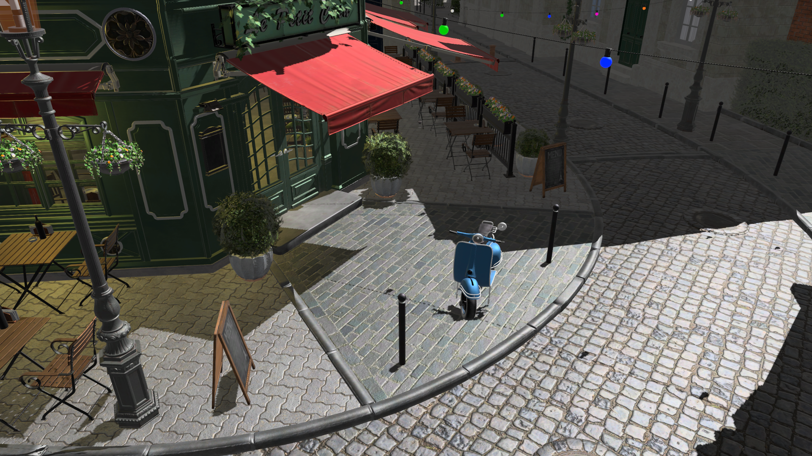
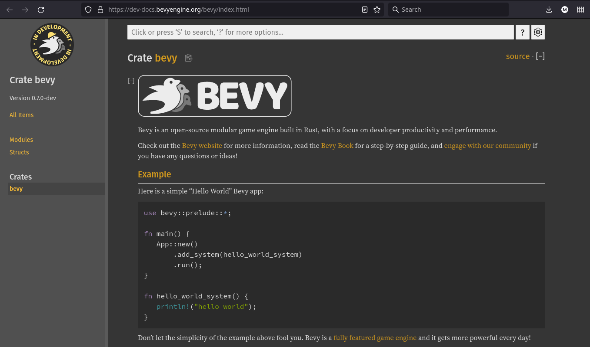
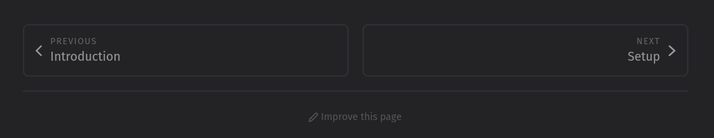
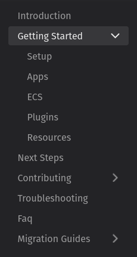
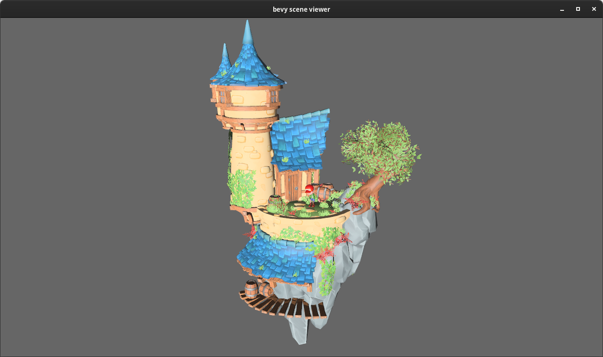

+++
title = "Bevy 0.7"
date = 2022-04-15
[extra]
author = "Carter Anderson"
twitter = "cart_cart"
github = "cart"
youtube = "cartdev"
image = "mushroom.png"
show_image = true
image_subtitle = "'Stylized mushrooms' scene by QumoDone rendered in Bevy. This scene is licensed under Creative Commons Attribution."
image_subtitle_link = "https://sketchfab.com/3d-models/stylized-mushrooms-9d22e02ce2a548959b1c4c4c1d546842"
+++

Thanks to **123** contributors, **349** pull requests, and our [**generous sponsors**](https://github.com/sponsors/cart), I'm happy to announce the **Bevy 0.7** release on [crates.io](https://crates.io/crates/bevy)!

For those who don't know, Bevy is a refreshingly simple data-driven game engine built in Rust. You can check out [Quick Start Guide](/learn/book/getting-started/) to get started. Bevy is also free and open source forever! You can grab the full [source code](https://github.com/bevyengine/bevy) on GitHub. Check out [Bevy Assets](https://bevyengine.org/assets) for a collection of community-developed plugins, games, and learning resources.

To update an existing Bevy App or Plugin to **Bevy 0.7**, check out our [0.6 to 0.7 Migration Guide](/learn/book/migration-guides/0.6-0.7/).

As always, there are a _ton_ of new features, bug fixes, and quality of life tweaks in this release, but here are some of the highlights: 

* Skeletal animation and mesh skinning
* GLTF animation importing
* Unlimited* point lights in a scene
* Improved clustered forward rendering: dynamic/adaptive clustering and faster, more accurate cluster assignment
* Compressed texture support (KTX2 / DDS / .basis): load more textures in a scene, faster
* Compute shader / pipeline specialization: Bevy's flexible shader system was ported to compute shaders, enabling hot reloading, shader defs, and shader imports
* Render to texture: cameras can now be configured to render to a texture instead of a window
* Flexible mesh vertex layouts in shaders
* ECS improvements: Order systems using their names, Query::many_mut, use conflicting parameters in systems via ParamSets, WorldQuery derives
* Documentation improvements: better examples, more doc tests and more coverage
* More audio control: pause, volume, speed, and looping
* Power usage options to enable only updating Bevy Apps when input occurs 

<!-- more -->

## Skeletal Animation

<div class="release-feature-authors">authors: @james7132, @mockersf, @lassade, @Looooong</div>

Bevy finally supports 3D skeletal animation!

<video controls loop><source  src="skeletal_animation.mp4" type="video/mp4"/></video>

<div style="font-size: 1.0rem" class="release-feature-authors">Scene Credits: <a href="https://skfb.ly/6TsvL">Tanabata evening - Kyoto inspired city scene</a> by Mathias Tossens is licensed under <a href="http://creativecommons.org/licenses/by/4.0/">Creative Commons Attribution</a>. Character model and animation are royalty free assets from Mixamo. 
</div>

Skeletal animations can now be played, paused, scrubbed, looped, reversed, and speed controlled using the new [`AnimationPlayer`] component and [`AnimationClip`] asset:

```rust
#[derive(Component)]
struct Animations {
    dance: Handle<AnimationClip>,
}

fn start_dancing(mut query: Query<(&Animations, &mut AnimationPlayer)>) {
    for (animations, mut animation_player) in query.iter_mut() {
        animation_player.play(animations.dance.clone());
    }
}
```

[`AnimationPlayer`] can also be used to animate arbitrary [`Transform`] components, not just skeletons!

This critical feature has been a long time coming, but we wanted to build it in a way that meshed nicely with the [new Bevy renderer](/news/bevy-0-6/#the-new-bevy-renderer) and didn't just "hack things in". This builds on our new [Flexible Mesh Vertex Layouts](/news/bevy-0-7/#flexible-mesh-vertex-layouts), [Shader Imports](/news/bevy-0-6/#shader-imports), and [Material](/news/bevy-0-6/#materials) systems, which ensures that this logic is flexible and reusable, even with non-standard meshes and custom render pipelines.

And we're just getting started! Multi-track animation blending and higher level animation state management should arrive in the very near future. Now is a great time to start contributing animation features to Bevy. We've smashed through most of the foundational technical hurdles and what remains is largely high level api design choices. We already have a couple of draft RFCs open in these areas: [Animation Composition](https://github.com/bevyengine/rfcs/pull/51) and [Animation Primitives](https://github.com/bevyengine/rfcs/pull/49). Feel free to join the conversation!

[`AnimationPlayer`]: https://docs.rs/bevy/0.7.0/bevy/animation/struct.AnimationPlayer.html
[`AnimationClip`]: https://docs.rs/bevy/0.7.0/bevy/animation/struct.AnimationClip.html
[`Transform`]: https://docs.rs/bevy/0.7.0/bevy/transform/components/struct.Transform.html

## GLTF Animation Importing

<div class="release-feature-authors">authors: @mockersf</div>

Bevy's GLTF importer was extended to import GLTF animations into the new [`AnimationPlayer`] system. This supports both "skeletal animation" and arbitrary transform animations:

<video controls loop><source  src="fox.mp4" type="video/mp4"/></video>

```rust
struct FoxAnimations {
    walk: Handle<AnimationClip>,
}

fn setup(mut commands: Commands) {
    commands.spawn_scene(asset_server.load("models/animated/Fox.glb#Scene0"));
    commands.insert_resource(FoxAnimations {
        walk: asset_server.load("models/animated/Fox.glb#Animation0"),
    });
}

fn play_on_load(
    animations: Res<FoxAnimations>,
    mut players: Query<&mut AnimationPlayer, Added<AnimationPlayer>>,
) {
    for mut player in players.iter_mut() {
        player.play(animations.walk.clone()).repeat();
    }
}
```

## Unlimited* Point Lights

<div class="release-feature-authors">authors: Rob Swain (@superdump), @robtfm</div>

Bevy can now render scenes with arbitrary numbers of point lights on platforms that support storage buffers (which is basically everything but WebGL). In the last Bevy release (0.6) we added [Clustered Forward Rendering](/news/bevy-0-6/#clustered-forward-rendering), which is a rendering technique that optimizes each fragment's light calculation costs by assigning lights to sub-volumes of the visible volume, called "clusters". However in the interest of platform compatibility (WebGL), we initially limited ourselves to 256 lights because that is what fit in a uniform buffer binding.

In **Bevy 0.7**, we added the ability to automatically "upgrade" to using unbounded storage buffers for Clustered Forward Rendering on platforms that support them, enabling unlimited* point lights. There is an asterisk there because in practice this is limited by memory and hardware constraints. 

## Light Clustering Features and Optimizations

<div class="release-feature-authors">authors: Rob Swain (@superdump), @robtfm, @dataphract, @cart</div>

With the upper limit of 256 point lights removed, the only limit on lights is what the hardware can support and bottlenecks in our algorithms. To increase the number of lights, we made a number of optimizations to our clustering algorithms.

* **Dynamic Light Clusters**
  * By default cluster x/y slices are now dynamically configured based on the lights in the scene, which can significantly increase performance in some scenes.
  * The clustering behavior is now also user-configurable as FixedZ (the new default dynamic x/y behavior, fixing the number of z slices), custom fixed x/y/z slice values, single-cluster, and "no clustering", giving you control when you know a certain cluster configuration will perform even better.
  * Additionally, in 0.6 the visible volume that is covered by all the clusters basically matched the full visible volume of the view frustum. This meant that if all the point lights were in the foreground, all the clusters beyond the lights were wasted space. In 0.7, it is possible to limit the far bound to be closer than the camera far bound, which means the lights can be spread across more clusters, which can significantly increase rendering performance.
* **Iterative Sphere Refinement**: Bevy now uses the Just Cause 3 iterative sphere refinement approach to cluster assignment, which gives us a ~10% performance increase on some benchmarks and more accurate clustering (which can also improve render performance).
* **Light Frustum Change Detection**: We now use Bevy ECS's change detection feature to only recalculate the view frustum of lights that have changed.
* **Cluster Assignment Optimizations**: The cluster assignment data access patterns and data structures received a variety of tweaks that improved performance.

Here is a video illustrating a progression from the old limit of 256 point lights to 25,000 point lights at 60fps!

(Note that the 25,000 lights example disables the debug light spheres to ensure that light calculations are the bottleneck)

<video controls loop><source  src="many_lights.mp4" type="video/mp4"/></video>

And we have [even more clustering optimizations](https://github.com/bevyengine/bevy/pull/4345) in the works! 

## Configurable Light Visibility 

<div class="release-feature-authors">authors: @robtfm</div>

Lights can now be turned on and off using Bevy's standard [`Visibility`] component:

```rust
commands.spawn(PointLightBundle {
    visibility: Visibility {
        is_visible: false,
    },
    ..default()
});
```

[`Visibility`]: https://docs.rs/bevy/0.7.0/bevy/render/view/struct.Visibility.html

## Compressed GPU Textures

<div class="release-feature-authors">authors: Rob Swain (@superdump)</div>

As scenes grow larger, so do their assets. Compressing these assets is a great way to save space. The Amazon Bistro scene featured below has well over 1GB of compressed textures.

PNG is a popular compressed format, but it must be decompressed before the GPU can use it. This can be a slow process for large scenes. Those textures are then used in their uncompressed form, taking up large quantities of limited memory. Compressed GPU textures can be used directly in their compressed format by the GPU and can be loaded without any additional processing. This reduces load times significantly. As they remain compressed, this also reduces RAM usage significantly.

The Bistro scene took a total of 12.9s to load with PNG textures, but only 1.5s with compressed textures - taking approximately a tenth of the load time! The total RAM usage was ~12GB with uncompressed textures, and 5GB with compressed textures, less than half!

The benefits don't stop there either - because the textures are compressed and can be used by the GPU in that format, reading from them uses less memory bandwidth, which can bring performance benefits. The Bistro scene gains about 10% in frame rate from using compressed textures.




Another benefit is that mipmaps are supported, which makes for smoother, less noisy textures. Bevy currently doesn't have support for automatically generating mipmaps for uncompressed textures, so using compressed textures is a nice way to have mipmaps now!

In summary, Bevy now supports loading compressed textures from `.dds`, `.ktx2`, and `.basis` files. This includes support for the standard ASTC, BCn, and ETC2 formats, as well as 'universal' formats like ETC1S and UASTC that can be transcoded to the standard formats supported by specific systems at runtime. The glTF loader was also extended to support loading these formats.

These features can be enabled using the `dds`, `ktx2`, and `basis-universal` cargo features.

## Render To Texture

<div class="release-feature-authors">authors: @HackerFoo</div>

Bevy now has initial support for rendering to texture by configuring the `render_target` field on `Camera`. This enables scenarios such as mirrors, split screen, 2d UI in 3d space, portals, etc.

<video controls loop><source  src="render_to_texture.mp4" type="video/mp4"/></video>

Note that the current implementation is relatively low level. It will generally require interacting with Bevy's Render Graph and defining new camera types. If you would like to use this feature now, the [render_to_texture example](https://github.com/bevyengine/bevy/blob/main/examples/3d/render_to_texture.rs) illustrates the steps required. We have plans for ["high level render targets"](https://github.com/bevyengine/bevy/discussions/4191) that will make rendering to textures possible in just a few lines of code. Stay tuned for details!

## Bevy-Native Compute Shaders

<div class="release-feature-authors">authors: @Ku95</div>

Bevy's flexible asset-driven shader system was ported to compute shaders/pipelines, enabling hot reloading, [shader defs](https://bevyengine.org/news/bevy-0-6/#shader-preprocessor), [shader imports](https://bevyengine.org/news/bevy-0-6/#shader-imports), and [pipeline specialization](https://bevyengine.org/news/bevy-0-6/#pipeline-specialization) based on user-configurable keys:

```rust
#import "shaders/game_of_life_texture_bind_group.wgsl"

[[stage(compute), workgroup_size(8, 8, 1)]]
fn game_of_life_update([[builtin(global_invocation_id)]] invocation_id: vec3<u32>) {
    let location = vec2<i32>(i32(invocation_id.x), i32(invocation_id.y));
    let alive = is_location_alive(location);

    // shader defs are configurable at runtime, prompting new variants of the shader to be compiled
#ifdef WRITE_OUTPUT
    storageBarrier();
    textureStore(texture, location, vec4<f32>(f32(alive)));
#endif
}
```

## Flexible Mesh Vertex Layouts

<div class="release-feature-authors">authors: @cart, @parasyte</div>

In **Bevy 0.7**, it is now easy to make shaders support any Mesh vertex layout and arbitrary vertex attributes. Bevy's "shader pipeline specialization" system was extended to support "specializing on mesh vertex layouts".

For most Bevy users, this means that [Materials](/news/bevy-0-6/#materials), including the built in [`StandardMaterial`] and custom shader materials now support arbitrary Meshes automatically, provided those Meshes have the vertex attributes required by the material shaders. It also means that if your Mesh is missing any attribute required by its material, rendering can fail gracefully.

We also made use of this system to implement joint weights and indices for our new [Skeletal Animation](/news/bevy-0-7/#skeletal-animation) implementation.

For Bevy users that like to write lower level graphics pipelines, this feature makes it possible to easily and efficiently specialize your pipelines according to Mesh vertex layouts:

```rust
impl SpecializedMeshPipeline for SomeCustomPipeline {
    type Key = SomeCustomKey;

    fn specialize(
        &self,
        key: Self::Key,
        layout: &MeshVertexBufferLayout,
    ) -> Result<RenderPipelineDescriptor, SpecializedMeshPipelineError> {
        // this is a layout that matches the requirements requested,
        // but catered to whatever mesh is currently being rendered
        let vertex_buffer_layout = layout.get_layout(&[
            Mesh::ATTRIBUTE_POSITION.at_shader_location(0),
            Mesh::ATTRIBUTE_NORMAL.at_shader_location(1),
            Mesh::ATTRIBUTE_UV_0.at_shader_location(2),
        ])?;

        Ok(RenderPipelineDescriptor {
            vertex: VertexState {
                buffers: vec![vertex_buffer_layout],
                /* define the rest of the vertex state here */
            },
            /* define the rest of the mesh pipeline here */
        })
    }
```

[`StandardMaterial`]: https://docs.rs/bevy/0.7.0/bevy/pbr/struct.StandardMaterial.html

## Camera Marker Components

<div class="release-feature-authors">authors: @jakobhellermann</div>

In **Bevy 0.7**, Cameras now use the "marker component" pattern to determine the "camera type" (ex: 3D, 2D, UI), rather than using string names.

This means that it is now cheaper and easier to select cameras of a specific type:

```rust
fn move_3d_camera_system(transforms: Query<&mut Transform, With<Camera3d>>) {
    for mut camera in transforms.iter_mut() {
        // move camera here
    }
}
```

## Ergonomic System Ordering

<div class="release-feature-authors">authors: @cart, @aevyrie, @alice-i-cecile, @DJMcNab</div>

Bevy uses "labels" to define ordering constraints between its ECS systems when they run in parallel. In previous versions of Bevy, the only way to order systems was to define custom labels:

```rust
#[derive(SystemLabel, Clone, Hash, Debug, PartialEq, Eq)]
struct UpdateVelocity;

app
  .add_system(update_velocity.label(UpdateVelocity))
  .add_system(movement.after(UpdateVelocity))
```

In **Bevy 0.7**, manually defining labels is no longer required. You can order systems using functions, just like you do when adding systems!

```rust
app
  .add_system(update_velocity)
  .add_system(movement.after(update_velocity))
```

This is accomplished by "auto-labeling" systems with their [`TypeId`] (the label type is [`SystemTypeIdLabel`]). Internally ordering still uses labels.

The Bevy ECS labeling system is powerful and there are still legitimate use cases for custom labels (such as labeling multiple systems with the same label and exporting a stable public API as a plugin author). But most common use cases can take advantage of the ergonomic auto-labeling functionality.

[`TypeId`]: https://doc.rust-lang.org/std/any/struct.TypeId.html
[`SystemTypeIdLabel`]: https://docs.rs/bevy/0.7.0/bevy/ecs/system/struct.SystemTypeIdLabel.html

## Default Shorthand

<div class="release-feature-authors">authors: @cart</div>

Bevy makes heavy use of Rust's [struct update pattern](https://doc.rust-lang.org/book/ch05-01-defining-structs.html#creating-instances-from-other-instances-with-struct-update-syntax) in combination with the `Default` trait when initializing entities. This significantly reduces the amount of typing required by enabling developers to only fill in the fields they want to change.

The standard way of doing this is to write out `..Default::default()`:

```rust
commands.spawn_bundle(SpriteBundle {
    texture: some_texture,
    ..Default::default()
})
```

This is much better than filling in each field's component manually:

```rust
commands.spawn(SpriteBundle {
    texture: some_texture,
    sprite: Default::default(),
    transform: Default::default(),
    global_transform: Default::default(),
    visibility: Default::default(),
});
```

However this can feel repetitive when you're doing it for tens or hundreds of entities. We added a way to make this even easier, without needing to resort to macros:

```rust
commands.spawn_bundle(SpriteBundle {
    texture: some_texture,
    ..default()
})
```

This is equivalent in functionality to `..Default::default()`, it's just more compressed. And you can still use the longer form if you prefer. The `default()` function is included in Bevy's prelude, so you don't need to manually import it. Ergonomics for the win!

## Query::many

<div class="release-feature-authors">authors: @alice-i-cecile</div>

Bevy ECS solves a hard problem: providing easy and fast access to data in parallel while still respecting Rust's strict mutability and ownership rules. Since our first release, we've supported efficiently accessing specific entities in our ECS Queries:

```rust
struct SomeEntities {
    a: Entity,
    b: Entity,
}

fn system(mut query: Query<&mut Transform>, entities: Res<SomeEntities>) {
    let a_transform = query.get_mut(entities.a).unwrap();
}
```

However, to respect Rust's mutability rules, we need to disallow apis that might produce "aliased mutability". Seasoned Bevy users will probably recognize this Rust borrow checker error:

```rust
fn system(mut query: Query<&mut Transform>, entities: Res<SomeEntities>) {
    let a_transform = query.get_mut(entities.a).unwrap();
    // This line fails to compile because `query` is already mutably borrowed above
    let b_transform = query.get_mut(entities.b).unwrap();
}
```

_You_ know Entity A and Entity B are different entities at runtime. But Rust's borrow checker has no way to know that at compile time! I'm sure you can imagine game development scenarios that would benefit from having mutable access to multiple components at the same time. This borrow checker restriction was a common pain point and the workarounds were ... not fun (using scopes to ensure conflicting accesses are dropped, copying data, re-querying things, etc).

Fortunately, **Bevy 0.7** introduces a brand new set of apis to save the day!

```rust
fn system(mut query: Query<&mut Transform>, entities: Res<SomeEntities>) {
    // Takes an array of entities and returns an array of mutable Query results
    // This will panic if there are entity conflicts or the entities do not exist
    let [a_transform, b_transform] = query.many_mut([entities.a, entities.b]);
}
```

There are plenty of variants:

```rust
// Same as many_mut, but returns a Result instead of panicking
if let Ok([a_transform, b_transform]) = query.get_many_mut([entities.a, entities.b]) {
}

// There are also immutable/read-only variants
let [a_transform, b_transform] = query.many([entities.a, entities.b]);
if let Ok([a_transform, b_transform]) = query.get_many([entities.a, entities.b]) {
}
```

And they all support arbitrary numbers of entities:

```rust
let [a, b, c] = query.many([entity_a, entity_b, entity_c]);
```

## ParamSets

<div class="release-feature-authors">authors: @bilsen</div>

To prevent aliased mutability, Bevy ECS disallows systems that have parameters that conflict with each other. For example, if two Queries both request write access to the same component in the same "archetype", that could result in aliased mutable access, so Bevy disallows that system and errors out.

Previous versions of Bevy supported conflicting Queries in the same system using QuerySets, which only allow access to one Query in the set at a time:

```rust
// These queries could each return a mutable A component for the same entity, so they must be put in a set to be considered a valid system. 
fn system(mut set: QuerySet<(QueryState<(&mut A, &B)>, QueryState<(&mut A, &C)>)>) {
    for (a, b) in set.q0().iter_mut() {
    }
}
```

**Bevy 0.7** removes `QuerySet` in favor of `ParamSet`, which generalizes the QuerySet pattern for _any_ system parameter:

```rust
fn system(mut set: ParamSet<(Query<(&mut A, &B)>, Query<(&mut A, &C)>)>) {
    for (a, b) in set.p0().iter_mut() {
    }
}
```

But ParamSets aren't just limited to Queries! Consider this example, where the `EventWriter<Jump>` parameter (which internally accesses the `Events<Jump>` resource) conflicts with the raw access to that resource. Previously, expressing this wouldn't be possible. But with ParamSets, it is!

```rust
fn system(mut set: ParamSet<(EventWriter<Jump>, ResMut<Events<Jump>>)>) {
    for jump_event in set.p1().drain() {
    }
}
```

We still recommend avoiding ParamSets where possible for clarity's sake. But every so often they are a necessary and useful tool!

## Deref / DerefMut Derives

<div class="release-feature-authors">authors: @MrGVSV</div>

Rust encourages the use of the [newtype pattern](https://doc.rust-lang.org/rust-by-example/generics/new_types.html) when expanding a type with new functionality or meaning. This is also a useful tool in Bevy:

```rust
#[derive(Component)]
struct Items(Vec<Item>);

fn give_sword(mut query: Query<&mut Items>) { 
    for mut items in query.iter_mut() {
        items.0.push(Item::new("Flaming Poisoning Raging Sword of Doom"));
    }
}
```

This works just fine, but that `0` at the end of `items.0` sticks out like a sore thumb. Many of us in the Bevy Org think `.0` has no place in public apis. But the newtype pattern is still useful! Ideally, Rust would provide a way to express that `Items` is a new type, while transparently provided access to the `Vec<Item>` stored within. There are designs being discussed by the Rust team, but we don't want to wait for nice things!

Fortunately, the Deref / DerefMut traits in std provide the behavior we want. Users can already manually implement these traits, but for such a common pattern, we decided that providing our own trait derives was worth it. In **Bevy 0.7**, you can now derive Deref and DerefMut, enabling much nicer public apis:

```rust
#[derive(Component, Deref, DerefMut)]
struct Items(Vec<Item>);

fn give_sword(mut query: Query<&mut Items>) { 
    for mut items in query.iter_mut() {
        // No more .0!
        items.push(Item::new("Flaming Poisoning Raging Sword of Doom"));
    }
}
```

Astute `std` doc readers might notice that the Rust team [recommends only using `Deref`/`DerefMut` for smart pointers, to avoid confusion](https://doc.rust-lang.org/std/ops/trait.Deref.html). Components like `Items` are _not_ smart pointers. We choose to ignore this advice, as this pattern works, is already widely used in the Rust ecosystem, and Good UX Comes First.

## WorldQuery Derives

<div class="release-feature-authors">authors: @mvlabat</div>

Sometimes when building Bevy Apps you might find yourself repeating the same sets of components over and over in your queries:

```rust
fn move_players(mut players: Query<(&mut Transform, &mut Velocity, &mut PlayerStats)>) {
    for (transform, velocity, stats) in players.iter_mut() {
    }
}

fn player_gravity(mut players: Query<(Entity, &mut Transform, &mut Velocity, &mut PlayerStats)>) {
    for (entity, transform, velocity, stats) in players.iter_mut() {
    }
}
```

Maybe you've gotten tired of typing the same components over and over. In **Bevy 0.7**, you can now easily create your own custom [`WorldQuery`] trait implementations with the [`WorldQuery`] derive:

```rust
#[derive(WorldQuery)]
#[world_query(mutable)]
struct PlayerMovementQuery<'w> {
    transform: &'w mut Transform,
    velocity: &'w mut Velocity,
    stats: &'w mut PlayerStats,
}

fn move_players(mut players: Query<PlayerMovementQuery>) {
    for player in players.iter_mut() {
    }
}

fn player_gravity(mut players: Query<(Entity, PlayerMovementQuery)>) {
    for (entity, player) in players.iter_mut() {
    }
}
```

[`WorldQuery`]: http://docs.rs/bevy/0.7.0/bevy/ecs/query/trait.WorldQuery.html

## World::resource

<div class="release-feature-authors">authors: @alice-i-cecile</div>

We've noticed that the majority of direct [`World`] resource access immediately unwraps the results of `get_resource`:

```rust
let time = world.get_resource::<Time>().unwrap();
```

In **Bevy 0.7** we added an ergonomic variant that internally panics:

```rust
let time = world.resource::<Time>();
```

There is also a mutable variant:

```rust
let mut time = world.resource_mut::<Time>();
```

The `get_resource` variants are still available for cases where users still want to manually handle the returned `Option`.

[`World`]: https://docs.rs/bevy/0.7.0/bevy/ecs/world/struct.World.html

## AnyOf Queries

<div class="release-feature-authors">authors: @TheRawMeatball</div>

Bevy ECS Queries now support [`AnyOf`], which will return results for entities that match "any of" the given component queries:

```rust
fn system(query: Query<AnyOf<(&A, &B)>>) {
    for (a, b) in query.iter() {
        // Either A or B is guaranteed to be Some
        assert!(a.is_some() || b.is_some())
    }
}
```

For the example above [`AnyOf`] will return entities that have A and not B, B and not A, and both A and B.

[`AnyOf`]: http://docs.rs/bevy/0.7.0/bevy/ecs/query/struct.AnyOf.html

## &World System Param

<div class="release-feature-authors">authors: @bilsen</div>

It is now possible for "normal systems" have `&World` system params, which provide full read-only access to the entire [`World`]:

```rust
fn system(world: &World, transforms: Query<&Transform>) {
}
```

Just keep in mind that `&World` will conflict with _any_ mutable Query:


```rust
fn invalid_system(world: &World, transforms: Query<&mut Transform>) {
}
```


In these cases, consider using our new [ParamSets](/news/bevy-0-7/#paramsets) to resolve the conflict:

```rust
fn valid_system(set: ParamSet<(&World, Query<&mut Transform>)>) {
}
```

## ECS Soundness / Correctness Improvements

<div class="release-feature-authors">authors: @BoxyUwU, @TheRawMeatball, @bjorn3</div>

Bevy ECS received a solid number of soundness and correctness bug fixes this release:
* Removed unsound lifetime annotations on `EntityMut` and `Query`, which could be used to get aliased mutability in some situations.
* Labeled `World::entities_mut` unsafe (because manually modifying entity metadata can invalidate safety assumptions)
* Removed unsound `World::components_mut` (which allowed replacing component metadata, invalidating assumptions made elsewhere in World)
* Fixed a `World::resource_scope` soundness bug
* Used `ManuallyDrop` in resource id initialization instead of `forget()` to avoid invalidating a data pointer before it is used.

We now also run the [miri](https://github.com/rust-lang/miri) interpreter on Bevy ECS in our CI to help detect and prevent future soundness / correctness issues. 

As Bevy ECS matures, our bar for unsafe code blocks and soundness must also mature. Bevy ECS will probably never be 100% free of unsafe code blocks because we are modeling parallel data access that Rust cannot reason about without our help. But we are committed to removing as much unsafe code as we can and improving the quality and scope of our unsafe code.

## Audio Control

<div class="release-feature-authors">authors: @mockersf</div>

Bevy's audio system has been in a ... minimalist state since our first release. Until now, it only supported pressing "play" on audio assets. Third party plugins such as [bevy_kira_audio](https://github.com/NiklasEi/bevy_kira_audio) have filled in the gaps with much more flexible audio solutions.

In **Bevy 0.7** we've started expanding what our built in audio plugin can do. It is now possible to pause, adjust volume, and set playback speed using [`AudioSink`] assets.

Playing audio now returns a `Handle<AudioSink>` which can be used to play/pause/set_speed/set_volume:

```rust
struct BeautifulMusic(Handle<AudioSink>);

fn setup_audio(
    asset_server: Res<AssetServer>,
    audio: Res<Audio>,
    audio_sinks: Res<Assets<AudioSink>>,
) {
    let music = asset_server.load("BeautifulMusic.ogg");
    // play audio and upgrade to a strong handle
    let sink_handle = audio_sinks.get_handle(audio.play(music));
    commands.insert_resource(BeautifulMusic(sink_handle));
}

// later in another system
fn adjust_audio(music: Res<BeautifulMusic>, mut audio_sinks: ResMut<Assets<AudioSink>>) {
    if let Some(sink) = audio_sinks.get(music.0) {
        // pause playback
        sink.pause();
        // start playback again
        sink.play();
        // increase the volume
        sink.set_volume(sink.volume() + 0.1);
        // slow down playback
        sink.set_speed(0.5);
    }
}
```

You can also now loop audio playback:

```rust
audio.play_with_settings(music, PlaybackSettings::LOOP.with_volume(0.75));
```

We plan to continue iterating on these APIs with even more functionality and usability improvements!

[`AudioSink`]: http://docs.rs/bevy/0.7.0/bevy/audio/struct.AudioSink.html

## Sprite Anchors

<div class="release-feature-authors">authors: @mockersf</div>

[`Sprite`] components can now define an [`Anchor`] point (also known as a "pivot" point), which determines the "origin" of the sprite. Sprites still default to a "center" origin, but this is now configurable:

```rust
commands.spawn_bundle(SpriteBundle {
    texture: asset_server.load("bevy_logo.png"),
    sprite: Sprite {
        anchor: Anchor::TopRight,
        ..default()
    },
    ..default()
});
```

<video controls loop><source  src="pivot.mp4" type="video/mp4"/></video>

[`Sprite`]: https://docs.rs/bevy/0.7.0/bevy/sprite/enum.Sprite.html
[`Anchor`]: https://docs.rs/bevy/0.7.0/bevy/sprite/enum.Anchor.html

## EventLoop Power Saving Modes

<div class="release-feature-authors">authors: @aevyrie</div>

By default Bevy will run updates "as fast as it can" (limited by the screen's refresh rate). This is great for most games, but some application types (such as GUI apps) need to prioritize CPU and GPU power usage.

**Bevy 0.7** adds the ability to configure the [`UpdateMode`] in [`WinitConfig`] to configure how Bevy Apps run updates:

* **Continuous**: always update "as soon as possible" (honoring vsync configuration)
* **Reactive**: only update when there is a window event, a redraw is requested, or a configurable wait time has elapsed 
* **ReactiveLowPower**: only update when there is user input (mouse movement, keyboard input, etc), a redraw is requested, or a configurable wait time has elapsed

These settings can be configured separately for focused windows and unfocused windows (enabling you to save power when a window loses focus). 

**ReactiveLowPower** can _significantly_ reduce power / resource usage, but it won't be suitable for every app type, as some apps need to assume that they are constantly being updated as quickly as possible. Therefore these settings are opt-in.

This app demos the various modes available. Note that Game mode was configured to lower its tick rate when it loses focus, which is not the default:

<video controls loop><source  src="power_settings.mp4" type="video/mp4"/></video>

## Documentation improvements

<div class="release-feature-authors">authors: @alice-i-cecile and many more</div>

Great docs make learning, using and building Bevy better.
But as a young engine, they're still a work-in-progress.

### deny-missing-docs

Our docs team (led by `@alice-i-cecile`) has started to [systematically fix that](https://github.com/bevyengine/bevy/issues/3492), with the help of Rust's `#[warn(missing_docs)]` lint.
Since 0.6, we've fully documented (and prevented doc-regressions for):

* `bevy_tasks` by `@james7132`
* `bevy_app` by `@dbearden`
* `bevy_dylib` by `@KDecay`
* `bevy_internal` by `@sheepyhead`

There have been [many other doc improvements](https://github.com/bevyengine/bevy/pulls?q=is%3Apr+is%3Aclosed+label%3AC-Docs) over this time period as well, including the addition of many helpful [doc tests](https://doc.rust-lang.org/rustdoc/documentation-tests.html), and our bar for docs in new code continues to rise.
A huge thanks to everyone making Bevy's docs better.

### New contributors

If you're [interested in contributing](https://github.com/bevyengine/bevy/blob/main/CONTRIBUTING.md), the docs team is always ready to help new contributors get their first Bevy PR merged ASAP.
There have been a _ton_ of new contributors who've helped out with docs, either as a writer or a reviewer.
If this is you: thanks!

### Better examples

For many people, the best way to learn a tool is to see it in action.
We've been steadily polishing our [examples](https://github.com/bevyengine/bevy/tree/latest/examples) with better explanations, more coverage, and higher code quality.
If you're new to Bevy, check out the much-improved [Breakout example](https://github.com/bevyengine/bevy/blob/latest/examples/games/breakout.rs)!

## Dev Docs

<div class="release-feature-authors">authors: @james7132, @mockersf, @aevyrie</div>

We now automatically deploy Bevy's `main` development branch to [https://dev-docs.bevyengine.org](https://dev-docs.bevyengine.org) whenever a change is merged. This will help Bevy documentation authors easily validate their changes. And "bleeding edge" Bevy users can learn about API changes we're working on.



## Website Improvements 

<div class="release-feature-authors">authors: @doup</div>

The [Bevy Book](/learn/book) now has a much nicer pager widget that displays previous / next section names:



We also added an "improve this page" footer link to make it easier for Bevy Book readers to contribute changes. 

The sidebar got an overhaul that improves clarity and makes it possible to open/close sections without clicking on them:



The responsiveness of the website has also been improved and some sections layout much better on mobile. 

## Scene Viewer Tool

<div class="release-feature-authors">authors: Rob Swain (@superdump), @mockersf, @IceSentry, @jakobhellermann</div>

Bevy now has a dedicated scene viewer tool that can load arbitrary GLTF scene files. If you check out the main Bevy repo you can try it out by running:

```
cargo run --release --example scene_viewer /some/path/castle.gltf
```

It has a built in "fly camera" and has tools to play animations and toggle lights and shadows.




## Support Bevy

Sponsorships help make my full time work on Bevy sustainable. If you believe in Bevy's mission, consider sponsoring me (@cart) ... every bit helps!

<a class="header-item header-button header-button-donate" style="margin-left: 0px;" href="https://github.com/sponsors/cart">Donate </a>

## Contributors

A huge thanks to the **123 contributors** that made this release (and associated docs) possible! In random order:

* @mfdorst
* @devjobe
* @PrototypeNM1
* @devil-ira
* @IsseW
* @SuperSamus
* @alice-i-cecile
* @bilsen
* @CooCooCaCha
* @lufog
* @chescock
* @dbearden
* @doup
* @MiniaczQ
* @C-BJ
* @TedDriggs
* @idanarye
* @plof27
* @robtfm
* @ickk
* @rsk700
* @dataphract
* @Looooong
* @mdickopp
* @bjorn3
* @aloucks
* @EpsilonDelphine
* @rparrett
* @CptPotato
* @horvbalint
* @jakobhellermann
* @light4
* @Lindenk
* @rib
* @ItsDoot
* @KDecay
* @p3rsik
* @danieleades
* @parasyte
* @Sorck
* @chenzhekl
* @jch-13
* @SecretPocketCat
* @DJMcNab
* @jak6jak
* @ShadowCurse
* @MrGVSV
* @NiklasEi
* @ZainlessBrombie
* @lwansbrough
* @ramon-bernardo
* @aevyrie
* @OptimisticPeach
* @bitshifter
* @glfmn
* @rezural
* @joshuataylor
* @nakedible
* @GarettCooper
* @rand0m-cloud
* @kirusfg
* @oceantume
* @l4desu-mizu
* @fgiordana-netflix
* @sarkahn
* @Weasy666
* @bytemuck
* @james7132
* @sseemayer
* @pubrrr
* @Sliman4
* @geckoxx
* @Bobox214
* @mirkoRainer
* @Veykril
* @Gingeh
* @pocket7878
* @cart
* @infmagic2047
* @MinerSebas
* @ramirezmike
* @cjglo
* @Sheepyhead
* @L-french
* @JoJoJet
* @Wcubed
* @Shatur
* @reinismu
* @boguscoder
* @tversteeg
* @TheRawMeatball
* @mcobzarenco
* @ezekg
* @hlb8122
* @B-Janson
* @emersonmx
* @mvlabat
* @Nilirad
* @jamesbeilby
* @ryo33
* @cdbfoster
* @blaind
* @fgiordana
* @josh65536
* @CleanCut
* @tornewuff
* @Ku95
* @kcking
* @luke-biel
* @SUPERCILEX
* @BoxyUwU
* @TheAndrewJackson
* @HackerFoo
* @andresovela
* @IceSentry
* @RedlineTriad
* @killercup
* @Azorlogh
* @superdump
* @nebkor
* @mockersf
* @Gordon-F
* @Jupp56

## Full Change Log

### Added

- [Mesh Skinning][4238]
- [Animation Player][4375]
- [Gltf animations][3751]
- [Mesh vertex buffer layouts][3959]
- [Render to a texture][3412]
- [KTX2/DDS/.basis compressed texture support][3884]
- [Audio control - play, pause, volume, speed, loop][3948]
- [Auto-label function systems with SystemTypeIdLabel][4224]
- [Query::get_many][4298]
- [Dynamic light clusters][3968]
- [Always update clusters and remove per-frame allocations][4169]
- [`ParamSet` for conflicting `SystemParam`:s][2765]
- [default() shorthand][4071]
- [use marker components for cameras instead of name strings][3635]
- [Implement `WorldQuery` derive macro][2713]
- [Implement AnyOf queries][2889]
- [Compute Pipeline Specialization][3979]
- [Make get_resource (and friends) infallible][4047]
- [bevy_pbr: Support flipping tangent space normal map y for DirectX normal maps][4433]
- [Faster view frustum culling][4181]
- [Use storage buffers for clustered forward point lights][3989]
- [Add &World as SystemParam][2923]
- [Add text wrapping support to Text2d][4347]
- [Scene Viewer to display glTF files][4183]
- [Internal Asset Hot Reloading][3966]
- [Add FocusPolicy to NodeBundle and ImageBundle][3952]
- [Allow iter combinations on queries with filters][3656]
- [bevy_render: Support overriding wgpu features and limits][3912]
- [bevy_render: Use RenderDevice to get limits/features and expose AdapterInfo][3931]
- [Reduce power usage with configurable event loop][3974]
- [can specify an anchor for a sprite][3463]
- [Implement len and is_empty for EventReaders][2969]
- [Add more FromWorld implementations][3945]
- [Add cart's fork of ecs_bench_suite][4225]
- [bevy_derive: Add derives for `Deref` and `DerefMut`][4328]
- [Add clear_schedule][3941]
- [Add Query::contains][3090]
- [bevy_render: Support removal of nodes, edges, subgraphs][3048]
- [Implement init_resource for `Commands` and `World`][3079]
- [Added method to restart the current state][3328]
- [Simplify sending empty events][2935]
- [impl Command for <impl FnOnce(&mut World)>][2996]
- [Useful error message when two assets have the save UUID][3739]
- [bevy_asset: Add AssetServerSettings watch_for_changes member][3643]
- [Add conversio from Color to u32][4088]
- [Introduce `SystemLabel`'s for `RenderAssetPlugin`, and change `Image` preparation system to run before others][3917]
- [Add a helper for storage buffers similar to `UniformVec`][4079]
- [StandardMaterial: expose a cull_mode option][3982]
- [Expose draw indirect][4056]
- [Add view transform to view uniform][3885]
- [Add a size method on Image.][3696]
- [add Visibility for lights][3958]
- [bevy_render: Provide a way to opt-out of the built-in frustum culling][3711]
- [use error scope to handle errors on shader module creation][3675]
- [include sources in shader validation error][3724]
- [insert the gltf mesh name on the entity if there is one][4119]
- [expose extras from gltf nodes][2154]
- [gltf: add a name to nodes without names][4396]
- [Enable drag-and-drop events on windows][3772]
- [Add transform hierarchy stress test][4170]
- [Add TransformBundle][3054]
- [Add Transform::rotate_around method][3107]
- [example on how to create an animation in code][4399]
- [Add examples for Transforms][2441]
- [Add mouse grab example][4114]
- [examples: add screenspace texture shader example][4063]
- [Add generic systems example][2636]
- [add examples on how to have a data source running in another thread / in a task pool thread][2915]
- [Simple 2d rotation example][3065]
- [Add move sprite example. ][2414]
- [add an example using UI & states to create a game menu][2960]
- [CI runs `cargo miri test -p bevy_ecs`][4310]
- [Tracy spans around main 3D passes][4182]
- [Add automatic docs deployment to GitHub Pages][3535]

### Changed 

- [Proper prehashing][3963]
- [Move import_path definitions into shader source][3976]
- [Make `System` responsible for updating its own archetypes][4115]
- [Some small changes related to run criteria piping][3923]
- [Remove unnecessary system labels][4340]
- [Increment last event count on next instead of iter][2382]
- [Obviate the need for `RunSystem`, and remove it][3817]
- [Cleanup some things which shouldn't be components][2982]
- [Remove the config api][3633]
- [Deprecate `.system`][3302]
- [Hide docs for concrete impls of Fetch, FetchState, and SystemParamState][4250]
- [Move the CoreStage::Startup to a seperate StartupSchedule label][2434]
- [`iter_mut` on Assets: send modified event only when asset is iterated over][3565]
- [check if resource for asset already exists before adding it][3560]
- [bevy_render: Batch insertion for prepare_uniform_components][4179]
- [Change default `ColorMaterial` color to white][3981]
- [bevy_render: Only auto-disable mappable primary buffers for discrete GPUs][3803]
- [bevy_render: Do not automatically enable MAPPABLE_PRIMARY_BUFFERS][3698]
- [increase the maximum number of point lights with shadows to the max supported by the device][4435]
- [perf: only recalculate frusta of changed lights][4086]
- [bevy_pbr: Optimize assign_lights_to_clusters][3984]
- [improve error messages for render graph runner][3930]
- [Skinned extraction speedup][4428]
- [Sprites - keep color as 4 f32][4361]
- [Change scaling mode to FixedHorizontal][4055]
- [Replace VSync with PresentMode][3812]
- [do not set cursor grab on window creation if not asked for][3617]
- [bevy_transform: Use Changed in the query for much faster transform_propagate_system][4180]
- [Split bevy_hierarchy out from bevy_transform][4168]
- [Make transform builder methods const][3045]
- [many_cubes: Add a cube pattern suitable for benchmarking culling changes][4126]
- [Make many_cubes example more interesting][4015]
- [Run tests (including doc tests) in `cargo run -p ci` command][3849]
- [Use more ergonomic span syntax][4246]

### Fixed

- [Remove unsound lifetime annotations on `EntityMut`][4096]
- [Remove unsound lifetime annotations on `Query` methods][4243]
- [Remove `World::components_mut`][4092]
- [unsafeify `World::entities_mut`][4093]
- [Use ManuallyDrop instead of forget in insert_resource_with_id][2947]
- [Backport soundness fix][3685]
- [Fix clicked UI nodes getting reset when hovering child nodes][4194]
- [Fix ui interactions when cursor disappears suddenly][3926]
- [Fix node update][3785]
- [Fix derive(SystemParam) macro][4400]
- [SystemParam Derive fixes][2838]
- [Do not crash if RenderDevice doesn't exist][4427]
- [Fixed case of R == G, following original conversion formula][4383]
- [Fixed the frustum-sphere collision and added tests][4035]
- [bevy_render: Fix Quad flip][3741]
- [Fix HDR asset support][3795]
- [fix cluster tiling calculations][4148]
- [bevy_pbr: Do not panic when more than 256 point lights are added the scene][3697]
- [fix issues with too many point lights][3916]
- [shader preprocessor - do not import if scope is not valid][4012]
- [support all line endings in shader preprocessor][3603]
- [Fix animation: shadow and wireframe support][4367]
- [add AnimationPlayer component only on scene roots that are also animation roots][4417]
- [Fix loading non-TriangleList meshes without normals in gltf loader][4376]
- [gltf-loader: disable backface culling if material is double-sided][4270]
- [Fix glTF perspective camera projection][4006]
- [fix mul_vec3 transformation order: should be scale -> rotate -> translate][3811]

[2154]: https://github.com/bevyengine/bevy/pull/2154
[2382]: https://github.com/bevyengine/bevy/pull/2382
[2414]: https://github.com/bevyengine/bevy/pull/2414
[2434]: https://github.com/bevyengine/bevy/pull/2434
[2441]: https://github.com/bevyengine/bevy/pull/2441
[2636]: https://github.com/bevyengine/bevy/pull/2636
[2713]: https://github.com/bevyengine/bevy/pull/2713
[2765]: https://github.com/bevyengine/bevy/pull/2765
[2838]: https://github.com/bevyengine/bevy/pull/2838
[2889]: https://github.com/bevyengine/bevy/pull/2889
[2915]: https://github.com/bevyengine/bevy/pull/2915
[2923]: https://github.com/bevyengine/bevy/pull/2923
[2935]: https://github.com/bevyengine/bevy/pull/2935
[2947]: https://github.com/bevyengine/bevy/pull/2947
[2960]: https://github.com/bevyengine/bevy/pull/2960
[2969]: https://github.com/bevyengine/bevy/pull/2969
[2982]: https://github.com/bevyengine/bevy/pull/2982
[2996]: https://github.com/bevyengine/bevy/pull/2996
[3045]: https://github.com/bevyengine/bevy/pull/3045
[3048]: https://github.com/bevyengine/bevy/pull/3048
[3054]: https://github.com/bevyengine/bevy/pull/3054
[3065]: https://github.com/bevyengine/bevy/pull/3065
[3079]: https://github.com/bevyengine/bevy/pull/3079
[3090]: https://github.com/bevyengine/bevy/pull/3090
[3107]: https://github.com/bevyengine/bevy/pull/3107
[3302]: https://github.com/bevyengine/bevy/pull/3302
[3328]: https://github.com/bevyengine/bevy/pull/3328
[3412]: https://github.com/bevyengine/bevy/pull/3412
[3463]: https://github.com/bevyengine/bevy/pull/3463
[3535]: https://github.com/bevyengine/bevy/pull/3535
[3560]: https://github.com/bevyengine/bevy/pull/3560
[3565]: https://github.com/bevyengine/bevy/pull/3565
[3603]: https://github.com/bevyengine/bevy/pull/3603
[3617]: https://github.com/bevyengine/bevy/pull/3617
[3633]: https://github.com/bevyengine/bevy/pull/3633
[3635]: https://github.com/bevyengine/bevy/pull/3635
[3643]: https://github.com/bevyengine/bevy/pull/3643
[3656]: https://github.com/bevyengine/bevy/pull/3656
[3675]: https://github.com/bevyengine/bevy/pull/3675
[3685]: https://github.com/bevyengine/bevy/pull/3685
[3696]: https://github.com/bevyengine/bevy/pull/3696
[3697]: https://github.com/bevyengine/bevy/pull/3697
[3698]: https://github.com/bevyengine/bevy/pull/3698
[3711]: https://github.com/bevyengine/bevy/pull/3711
[3724]: https://github.com/bevyengine/bevy/pull/3724
[3739]: https://github.com/bevyengine/bevy/pull/3739
[3741]: https://github.com/bevyengine/bevy/pull/3741
[3751]: https://github.com/bevyengine/bevy/pull/3751
[3772]: https://github.com/bevyengine/bevy/pull/3772
[3785]: https://github.com/bevyengine/bevy/pull/3785
[3795]: https://github.com/bevyengine/bevy/pull/3795
[3803]: https://github.com/bevyengine/bevy/pull/3803
[3811]: https://github.com/bevyengine/bevy/pull/3811
[3812]: https://github.com/bevyengine/bevy/pull/3812
[3817]: https://github.com/bevyengine/bevy/pull/3817
[3849]: https://github.com/bevyengine/bevy/pull/3849
[3884]: https://github.com/bevyengine/bevy/pull/3884
[3885]: https://github.com/bevyengine/bevy/pull/3885
[3912]: https://github.com/bevyengine/bevy/pull/3912
[3916]: https://github.com/bevyengine/bevy/pull/3916
[3917]: https://github.com/bevyengine/bevy/pull/3917
[3923]: https://github.com/bevyengine/bevy/pull/3923
[3926]: https://github.com/bevyengine/bevy/pull/3926
[3930]: https://github.com/bevyengine/bevy/pull/3930
[3931]: https://github.com/bevyengine/bevy/pull/3931
[3941]: https://github.com/bevyengine/bevy/pull/3941
[3945]: https://github.com/bevyengine/bevy/pull/3945
[3948]: https://github.com/bevyengine/bevy/pull/3948
[3952]: https://github.com/bevyengine/bevy/pull/3952
[3958]: https://github.com/bevyengine/bevy/pull/3958
[3959]: https://github.com/bevyengine/bevy/pull/3959
[3963]: https://github.com/bevyengine/bevy/pull/3963
[3966]: https://github.com/bevyengine/bevy/pull/3966
[3968]: https://github.com/bevyengine/bevy/pull/3968
[3974]: https://github.com/bevyengine/bevy/pull/3974
[3976]: https://github.com/bevyengine/bevy/pull/3976
[3979]: https://github.com/bevyengine/bevy/pull/3979
[3981]: https://github.com/bevyengine/bevy/pull/3981
[3982]: https://github.com/bevyengine/bevy/pull/3982
[3984]: https://github.com/bevyengine/bevy/pull/3984
[3989]: https://github.com/bevyengine/bevy/pull/3989
[4006]: https://github.com/bevyengine/bevy/pull/4006
[4012]: https://github.com/bevyengine/bevy/pull/4012
[4015]: https://github.com/bevyengine/bevy/pull/4015
[4035]: https://github.com/bevyengine/bevy/pull/4035
[4047]: https://github.com/bevyengine/bevy/pull/4047
[4055]: https://github.com/bevyengine/bevy/pull/4055
[4056]: https://github.com/bevyengine/bevy/pull/4056
[4063]: https://github.com/bevyengine/bevy/pull/4063
[4071]: https://github.com/bevyengine/bevy/pull/4071
[4079]: https://github.com/bevyengine/bevy/pull/4079
[4086]: https://github.com/bevyengine/bevy/pull/4086
[4088]: https://github.com/bevyengine/bevy/pull/4088
[4092]: https://github.com/bevyengine/bevy/pull/4092
[4093]: https://github.com/bevyengine/bevy/pull/4093
[4096]: https://github.com/bevyengine/bevy/pull/4096
[4114]: https://github.com/bevyengine/bevy/pull/4114
[4115]: https://github.com/bevyengine/bevy/pull/4115
[4119]: https://github.com/bevyengine/bevy/pull/4119
[4126]: https://github.com/bevyengine/bevy/pull/4126
[4148]: https://github.com/bevyengine/bevy/pull/4148
[4168]: https://github.com/bevyengine/bevy/pull/4168
[4169]: https://github.com/bevyengine/bevy/pull/4169
[4170]: https://github.com/bevyengine/bevy/pull/4170
[4179]: https://github.com/bevyengine/bevy/pull/4179
[4180]: https://github.com/bevyengine/bevy/pull/4180
[4181]: https://github.com/bevyengine/bevy/pull/4181
[4182]: https://github.com/bevyengine/bevy/pull/4182
[4183]: https://github.com/bevyengine/bevy/pull/4183
[4194]: https://github.com/bevyengine/bevy/pull/4194
[4224]: https://github.com/bevyengine/bevy/pull/4224
[4225]: https://github.com/bevyengine/bevy/pull/4225
[4238]: https://github.com/bevyengine/bevy/pull/4238
[4243]: https://github.com/bevyengine/bevy/pull/4243
[4246]: https://github.com/bevyengine/bevy/pull/4246
[4250]: https://github.com/bevyengine/bevy/pull/4250
[4252]: https://github.com/bevyengine/bevy/pull/4252
[4270]: https://github.com/bevyengine/bevy/pull/4270
[4298]: https://github.com/bevyengine/bevy/pull/4298
[4310]: https://github.com/bevyengine/bevy/pull/4310
[4328]: https://github.com/bevyengine/bevy/pull/4328
[4332]: https://github.com/bevyengine/bevy/pull/4332
[4340]: https://github.com/bevyengine/bevy/pull/4340
[4347]: https://github.com/bevyengine/bevy/pull/4347
[4361]: https://github.com/bevyengine/bevy/pull/4361
[4367]: https://github.com/bevyengine/bevy/pull/4367
[4375]: https://github.com/bevyengine/bevy/pull/4375
[4376]: https://github.com/bevyengine/bevy/pull/4376
[4383]: https://github.com/bevyengine/bevy/pull/4383
[4396]: https://github.com/bevyengine/bevy/pull/4396
[4399]: https://github.com/bevyengine/bevy/pull/4399
[4400]: https://github.com/bevyengine/bevy/pull/4400
[4403]: https://github.com/bevyengine/bevy/pull/4403
[4405]: https://github.com/bevyengine/bevy/pull/4405
[4417]: https://github.com/bevyengine/bevy/pull/4417
[4420]: https://github.com/bevyengine/bevy/pull/4420
[4426]: https://github.com/bevyengine/bevy/pull/4426
[4427]: https://github.com/bevyengine/bevy/pull/4427
[4428]: https://github.com/bevyengine/bevy/pull/4428
[4433]: https://github.com/bevyengine/bevy/pull/4433
[4435]: https://github.com/bevyengine/bevy/pull/4435
