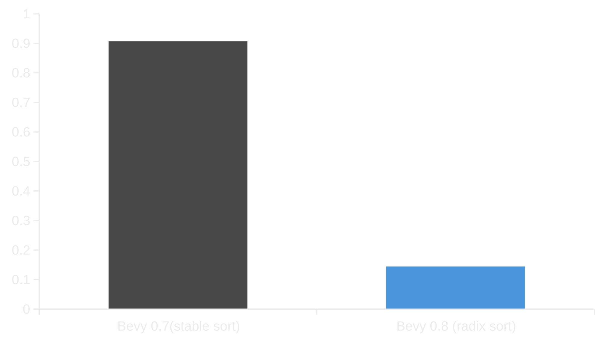

+++
title = "Bevy 0.8"
date = 2022-07-30
[extra]
author = "Carter Anderson"
twitter = "cart_cart"
github = "cart"
youtube = "cartdev"
image = "bevy_terrain.jpg"
show_image = true
image_subtitle = "Bevy-shaped mountains in a Bevy-based Witcher 3 terrain texturing tool built by rmemr"
image_subtitle_link = "https://codeberg.org/rmemr/w3.terrain-texturing"
+++

Thanks to **130** contributors, **461** pull requests, community reviewers, and our [**generous sponsors**](https://github.com/sponsors/cart), I'm happy to announce the **Bevy 0.8** release on [crates.io](https://crates.io/crates/bevy)!

For those who don't know, Bevy is a refreshingly simple data-driven game engine built in Rust. You can check out our [Quick Start Guide](/learn/book/getting-started/) to try it today. It's free and open source forever! You can grab the full [source code](https://github.com/bevyengine/bevy) on GitHub. Check out [Bevy Assets](https://bevyengine.org/assets) for a collection of community-developed plugins, games, and learning resources.

To update an existing Bevy App or Plugin to **Bevy 0.8**, check out our [0.7 to 0.8 Migration Guide](/learn/book/migration-guides/0.7-0.8/).

Since our last release a few months ago we've added a _ton_ of new features, bug fixes, and quality of life tweaks, but here are some of the highlights:

* **New Material System**: Custom shaders are now _much_ easier to define, thanks to the new Material trait and AsBindGroup derive.
* **Camera-driven Rendering**: Each Camera now configures what it renders and how it renders it. Easily layer camera renders on top of each other, do split screen, or render to a texture in just a few lines of code.
* **Built-in Shader Modularization**: Many built-in shader types and functions are now importable. Notably, custom shaders can now import the PBR shader logic
* **Spot Lights**: A new light type that emits light in a cone shape from a fixed point.
* **Visibility Inheritance**: Hiding an entity now also hides all of its descendants in the hierarchy.
* **Upgraded to wgpu 0.13**: Uses a new, more ergonomic WGSL shader syntax.
* **Automatic Mesh Tangent Generation**: If tangents are missing for a mesh, generate them with mikktspace.
* **Renderer Optimizations**: Parallel frustum culling and unstable sorts for unbatched render phases yielded some big wins!
* **Scene Bundle**: Easily spawn scenes using a normal Bevy bundle and extend them with new components and children.
* **Scripting and Modding Progress: Untyped ECS APIs**: A step toward 3rd party scripting language support! Interact with Bevy ECS internals directly via pointers.
* **ECS Query Ergonomics and Usability**: Queries now implement `IntoIter` and mutable queries can be converted to immutable queries.
* **ECS Internals Refactors**: Sweeping changes to Bevy ECS internals that make it simpler, safer, and easier to maintain.
* **Reflection Improvements**: Support for reflecting more types, ECS resource reflection, untyped reflection, improved internals.
* **Hierarchy Commands**: Hierarchy updates now use "transactional commands" to ensure hierarchy consistency at all times.
* **Bevy UI Now Uses Taffy**:  We've swapped to (and help maintain) a collaborative fork of the now abandoned Stretch UI layout library. Exponential blow-up bug begone!

<!-- more -->

## New Material System

<div class="release-feature-authors">authors: @cart, @Wrapperup, @johanhelsing</div>

Bevy has a brand new [`Material`] system that makes defining custom shaders a breeze. Bevy's previous material system required hundreds of lines of "mid-level" boilerplate. This was never the long term plan, just an intermediate step. In **Bevy 0.8**, custom shader materials are as simple as this:

```rust
#[derive(AsBindGroup, TypeUuid, Clone)]
#[uuid = "f690fdae-d598-45ab-8225-97e2a3f056e0"]
pub struct CoolMaterial {
    #[uniform(0)]
    color: Color,
    #[texture(1)]
    #[sampler(2)]
    color_texture: Handle<Image>,
}

// The Material trait has many optional functions for configuration.
// In this case, all we need to set is a fragment shader. Ergonomics!
impl Material for CoolMaterial {
    fn fragment_shader() -> ShaderRef {
        "cool_material.wgsl".into()
    }
}
```

And the `cool_material.wgsl` shader:

```rust
struct CoolMaterial {
    color: vec4<f32>,
};

@group(1) @binding(0)
var<uniform> material: CoolMaterial;
@group(1) @binding(1)
var color_texture: texture_2d<f32>;
@group(1) @binding(2)
var color_sampler: sampler;

@fragment
fn fragment(
    #import bevy_pbr::mesh_vertex_output
) -> @location(0) vec4<f32> {
    return material.color * textureSample(color_texture, color_sampler, uv);
}
```

And just like that, we have a configurable shader material!

This can be used to create whatever effects you want! For example: `@DGriffin91` made this cool "glowing orb" effect:

<video controls loop><source  src="marbles.mp4" type="video/mp4"/></video>

They also made a [nice video tutorial](https://www.youtube.com/watch?v=O6A_nVmpvhc) outlining how to create this material.

This is thanks to the new [`AsBindGroup`] trait / derive, which does all of the hard work of converting the material to GPU-compatible datatypes, writing them to the GPU, and creating the final [`BindGroup`]. The [`AsBindGroup`] trait is powerful: it supports combining multiple fields into the same uniform binding, configuring texture binding types (2D, 3D, filtering, etc), and more. For details, check out the [`AsBindGroup`] docs.

All built-in materials, such as the PBR [`StandardMaterial`] have been ported to use this new system. We strive to make Bevy "internals" the same as user code, and this is no exception! [`Material`] also works seamlessly with our more advanced shader features, such as [shader pipeline specialization](https://github.com/bevyengine/bevy/blob/v0.8.0/examples/shader/shader_defs.rs).

There is also an equivalent [`Material2d`] trait, which enables custom materials in 2D.

[`Material`]: https://docs.rs/bevy/0.8.0/bevy/pbr/trait.Material.html
[`AsBindGroup`]: https://docs.rs/bevy/0.8.0/bevy/render/render_resource/trait.AsBindGroup.html
[`BindGroup`]: https://docs.rs/bevy/0.8.0/bevy/render/render_resource/struct.BindGroup.html
[`StandardMaterial`]: https://docs.rs/bevy/0.8.0/bevy/pbr/struct.StandardMaterial.html
[`Material2d`]: https://docs.rs/bevy/0.8.0/bevy/sprite/trait.Material2d.html

## Camera-Driven Rendering

<div class="release-feature-authors">authors: @cart</div>

In previous versions of Bevy, [`Cameras`][`Camera`] were selected and run as a part of one "global" [`RenderGraph`]. There could only be one "active" camera of a given type, and that camera could only render to one target. The only way to render from multiple perspectives at the same time was to manually extend the render graph with duplicate logic. This was _full_ of complicated low-level renderer boilerplate that wasn't approachable for the average Bevy user.

In **Bevy 0.8**, each [`Camera`] now configures what it renders, how it renders, and what it renders to. An enabled camera will start a new run of a [`RenderGraph`] to a specified [`RenderTarget`]. The render graph defines [modular render logic](/news/bevy-0-6/#render-graphs-and-sub-graphs) for the given camera and the render target defines the window or texture the graph will render to.

This makes scenarios that were previously hundreds (or thousands) of lines of code as simple as setting a few fields on the [`Camera`] entity:

### Render to Textures

Rendering a [`Camera`] to a texture is now a single line of code:

```rust
camera.target = RenderTarget::Image(image_handle);
```

This enables too many scenarios to count: portals, rendering UI to a texture and rendering it in 3d space, in-game security cameras, real-time player portraits rendered in UI widgets ... the sky is the limit!

Here is an example of a "portal effect":

<video controls loop><source  src="portals.mp4" type="video/mp4"/></video>

This is accomplished by rendering a second camera to a texture, synchronizing its orientation with the main player's camera, and using that texture in the main camera's scene.

### Split Screen

Each [`Camera`] now has an optional [`Viewport`], which if set will draw to a section of a [`RenderTarget`] instead of the whole. If you spawn two active cameras and set each camera's [`Viewport`] to draw to half of the window, you have simple, painless split screen!  


### Layered Rendering

Cameras can now be layered on top of each other using the new "camera priority" field:

```rust
// This camera defaults to priority 0 and is rendered "first" / "at the back" 
commands.spawn_bundle(Camera3dBundle::default());
commands.spawn_bundle(Camera3dBundle {
    camera_3d: Camera3d {
        // don't clear the color while rendering this camera
        clear_color: ClearColorConfig::None,
        ..default()
    },
    camera: Camera {
        // renders after / on top of the main camera
        priority: 1,
        ..default()
    },
    ..default()
});
```

"Priority" determines the order cameras are drawn in. The "portal" effect in the [render to textures example above](#render-to-textures) uses priority to render the "portal" camera first, ensuring it is ready to be used by the main camera.

Here is a simple example of two cameras rendering to the same window:


This can be used for things like "custom UI passes", "minimaps", etc.

### Ergonomic Target Size Access

Cameras now store their [`RenderTarget`] size locally, which makes retrieving the size much simpler:

```rust
// Much nicer than needing to look up the size on the target Window or Image manually,
// like you had to in previous Bevy versions!
let target_size = camera.logical_target_size();
let viewport_size = camera.logical_viewport_size();
```

This also means that converting world to screen coordinates for a camera is much easier than it used to be:

```rust
// Bevy 0.7 (old)
camera.world_to_screen(windows, images, camera_transform, world_position);

// Bevy 0.8 (new)
camera.world_to_viewport(camera_transform, world_position);
```

### New Camera Bundles

The old `OrthographicCameraBundle` and `PerspectiveCameraBundle` have been replaced with [`Camera3dBundle`] and [`Camera2dBundle`]. In most cases migration should be as simple as replacing the old names with the new ones. 3D cameras default to "perspective" projections, but they can still be switched to orthographic using the new [`Projection`] component in the bundle.

[`Projection`]: https://docs.rs/bevy/0.8.0/bevy/core_pipeline/core_3d/struct.Camera3dBundle.html#structfield.projection

### No More CameraUiBundle!

Bevy UI now no longer needs a separate camera entity to work. UI "just works" for all camera types and can be enabled or disabled per-camera using the [`UiCameraConfig`] component.

```rust
commands
    .spawn_bundle(Camera3dBundle::default())
    .insert(UiCameraConfig {
        show_ui: false,
    });
```

### Custom Render Graphs

The default 2D and 3D [`RenderGraphs`][`RenderGraph`] for each [`Camera`] can be overridden by setting the [`CameraRenderGraph`] component:

```rust
commands.spawn_bundle(Camera3dBundle {
    camera_render_graph: CameraRenderGraph::new(some_custom_graph),
    ..default()
})
```

This enables you to draw the camera with whatever custom render logic you need! For example, you could replace the built in clustered-forward-rendering with deferred rendering. Note that this generally won't be required: most custom rendering scenarios will be covered by high-level [Materials](#new-material-system) or extending the built-in render graphs. And using the default render graph will ensure maximum compatibility with other plugins.

### Enabling / Disabling Cameras

If a camera is "active", it will render to its [`RenderTarget`]. To activate or deactivate a camera, set the new `is_active` field:

```rust
camera.is_active = true;
```

### RenderLayers

Bevy's existing [`RenderLayers`] system can be used to tell a [`Camera`] to only render entities on specific layers. **Camera-Driven Rendering** pairs nicely with this feature. This enables rendering one set of entities to one camera and another set of entities to another camera. We've ported the [`RenderLayers`] system to all entities with [`Visibility`], so this will all Just Work™.

[`Camera`]: https://docs.rs/bevy/0.8.0/bevy/render/camera/struct.Camera.html
[`RenderGraph`]: https://docs.rs/bevy/0.8.0/bevy/render/render_graph/struct.RenderGraph.html
[`Viewport`]: https://docs.rs/bevy/0.8.0/bevy/render/camera/struct.Viewport.html
[`RenderTarget`]: https://docs.rs/bevy/0.8.0/bevy/render/camera/enum.RenderTarget.html
[`Camera2dBundle`]: https://docs.rs/bevy/0.8.0/bevy/core_pipeline/core_2d/struct.Camera2dBundle.html
[`Camera3dBundle`]: https://docs.rs/bevy/0.8.0/bevy/core_pipeline/core_3d/struct.Camera3dBundle.html
[`UiCameraConfig`]: https://docs.rs/bevy/0.8.0/bevy/ui/entity/struct.UiCameraConfig.html
[`CameraRenderGraph`]: https://docs.rs/bevy/0.8.0/bevy/render/camera/struct.CameraRenderGraph.html
[`RenderLayers`]: https://docs.rs/bevy/0.8.0/bevy/render/view/visibility/struct.RenderLayers.html

## Spotlights

<div class="release-feature-authors">authors: @robtfm</div>

Bevy now has a [`SpotLight`] entity type, which emits light in a cone shape from a point in space.


[`SpotLight`]: https://docs.rs/bevy/0.8.0/bevy/pbr/struct.SpotLight.html

## Visibility Inheritance

<div class="release-feature-authors">authors: @james7132, @cart</div>

Visibility in entity hierarchies (using the [`Visibility`] component) now propagates down the hierarchy. This is hugely useful, as entities in a game often have _many_ entities nested beneath them. A "player entity" is often made up of many pieces: the player sprite or mesh, what the player is wearing / holding, visual effects, etc.

Visibility inheritance means that you only need to hide the top level "player" entity in your code and everything beneath it will be hidden for you.

This "flight helmet" scene consists of many "pieces" nested under the main helmet entity. Hiding all of these "sub entities" is as now as easy as hiding the top level helmet entity.

<video controls loop><source  src="visibility_inheritance.mp4" type="video/mp4"/></video>

```rust
fn hide_helmets(mut helmet_visibilities: Query<&mut Visibility, With<Helmet>>) {
    let mut helmet_visibility = helmet_visibilities.single_mut();
    helmet_visibility.is_visible = false;
}
```

In past versions of Bevy, you had to hide each piece manually!

The "inherited visibility" is computed in the [`PostUpdate`] stage and stored on the [`ComputedVisibility`] component. [`ComputedVisibility`] now has the following functions:

* `is_visible_in_hierarchy()`: Whether or not the entity is visible according to "visibility inheritance".
* `is_visible_in_view()`: Whether or not the entity is visible in any view. This is used for culling entities in cases like "frustum culling".
* `is_visible()`: The canonical place to determine whether or not an entity will be drawn. Combines "view visibility" and "hierarchy visibility".

[`PostUpdate`]: https://docs.rs/bevy/0.8.0/bevy/app/enum.CoreStage.html#variant.PostUpdate
[`Visibility`]: https://docs.rs/bevy/0.8.0/bevy/render/view/struct.Visibility.html
[`ComputedVisibility`]: https://docs.rs/bevy/0.8.0/bevy/render/view/struct.ComputedVisibility.html

### SpatialBundle and VisibilityBundle

<div class="release-feature-authors">authors: @mockersf, @rparrett</div>

With the addition of [Visibility Inheritance](#visibility-inheritance) comes the constraint that visibility propagation requires all elements in the hierarchy to have the appropriate visibility components. When constructing scenes, developers often want to group entities under parent "organizational" entities, which exist solely to group entities together, reposition them, and hide them as a unit. These "organizational" entities still require visibility components to propagate the [`Transform`] and [`Visibility`] to [`GlobalTransform`] and [`ComputedVisibility`] (respectively).

To make this easy, we've added a new [`SpatialBundle`], which adds the components mentioned above. This allows the entity to configure and propagate visibility and transform data without incurring the cost of actually rendering it.

```rust
commands
    // This entity controls the position and visibility of the entities beneath it.
    .spawn_bundle(SpatialBundle {
        transform: Transform::from_xyz(10.0, 20.0, 30.0),
        visibility: Visibility {
            is_visible: true,
        },
        ..default()
    }).with_children(|parent| {
        parent
            .spawn_bundle(TableBundle::default())
            .spawn_bundle(ShopKeeperBundle::default())
            .spawn_bundle(PotionBundle::default());
    });
```

To ensure visibility and transforms are propagated, make sure the whole hierarchy (root -> leaf) has these components:

```rust
commands
    .spawn_bundle(SpatialBundle::default())
    .with_children(|parent| {
        parent
            .spawn_bundle(SpatialBundle::default())
            .with_children(|parent| {
                parent.spawn_bundle(SpatialBundle::default());
            });
    });
```

If you know you don't need [`Transform`] propagation (or your entity already has those components), you can instead use the new [`VisibilityBundle`], which only adds the components required for visibility propagation.

[`Transform`]: https://docs.rs/bevy/0.8.0/bevy/transform/components/struct.Transform.html
[`GlobalTransform`]: https://docs.rs/bevy/0.8.0/bevy/transform/components/struct.GlobalTransform.html
[`SpatialBundle`]: https://docs.rs/bevy/0.8.0/bevy/render/prelude/struct.SpatialBundle.html
[`VisibilityBundle`]: https://docs.rs/bevy/0.8.0/bevy/render/view/struct.VisibilityBundle.html

## Built-in Shader Modularization

<div class="release-feature-authors">authors: Rob Swain (@superdump)</div>

In **Bevy 0.8**, we've started modularizing our built-in shaders. Notably, this means you can now import and run the built-in PBR shader / lighting logic:

```rust
#import bevy_pbr::utils
#import bevy_pbr::clustered_forward
#import bevy_pbr::lighting
#import bevy_pbr::shadows
#import bevy_pbr::pbr_types
#import bevy_pbr::pbr_functions

@fragment
fn fragment(in: FragmentInput) -> @location(0) vec4<f32> {
    var pbr_input: PbrInput = pbr_input_new();
    // set the base color to red
    pbr_input.material.base_color = vec4<f32>(1.0, 0.0, 0.0, 1.0);
    /* set other PbrInput fields here */
    return tone_mapping(pbr(pbr_input))
}
```

We've also modularized our mesh and view binding shader logic. When paired with the [New Material System](#new-material-system), users can now reasonably write custom PBR materials without re-defining all of the PBR logic in their shaders. The new [Array Texture Example](https://github.com/bevyengine/bevy/blob/v0.8.0/examples/shader/array_texture.rs) illustrates how to define a custom PBR shader material using these new APIs:


We also plan on evolving the user experience here. Now that we've broken everything up and modularized it, we'll work on reducing the amount of boilerplate required to extend this logic (cutting down on imports, removing the need to set all PbrInput fields, etc).  

## wgpu 0.13: New WGSL Shader Syntax

<div class="release-feature-authors">authors: @mockersf, wgpu and naga contributors</div>

We've updated to the latest and greatest wgpu version. wgpu 0.13 brings plenty of fixes and improvements, but the most visible change is the new more ergonomic WGSL "attribute" syntax:

Bindings now look like this:

```rust
// wgpu 0.12 (old)
[[group(1), binding(0)]]
var<uniform> material: Material;

// wgpu 0.13 (new)
@group(1) @binding(0)
var<uniform> material: Material;
```

Shader stage entry points and inputs now look like this:

```rust
// wgpu 0.12 (old)
[[stage(vertex)]]
fn vertex([[location(0)]] position: vec3<f32>, [[location(1)]] normal: vec3<f32>) -> VertexOutput {
}

// wgpu 0.13 (new)
@vertex
fn vertex(@location(0) position: vec3<f32>, @location(1) normal: vec3<f32>) -> VertexOutput {
}
```

Much easier on the eyes! (and the fingers!)

## Scene Bundle

<div class="release-feature-authors">authors: @mockersf</div>

In previous versions of Bevy scenes were spawned like this:

```rust
commands.spawn_scene(asset_server.load("some.gltf#Scene0"));
```

This worked, but it made it difficult to actually use the scene in practice. Repositioning the scene required either manually grabbing the scene's entity id and then repositioning it when it spawns, or creating a parent entity with the relevant transform components and "spawning the scene as a child". Additionally, it was challenging to extend scenes with new components.

In **Bevy 0.8**, we've added a [`SceneBundle`], which brings scene spawning in line with our other entity construction APIs:

```rust
commands.spawn_bundle(SceneBundle {
    scene: asset_server.load("some.gltf#Scene0"),
    ..default()
})
```

When the scene loads, it will automatically spawn underneath the entity created by the `spawn_bundle` command. This makes it much easier to transform the scene and add new components at the "root":

```rust
commands
    .spawn_bundle(SceneBundle {
        scene: asset_server.load("player.gltf#Scene0"),
        transform: Transform::from_xyz(10.0, 20.0, 30.0),
        ..default()
    })
    .insert(Player::default());
```

[`SceneBundle`]: https://docs.rs/bevy/0.8.0/bevy/scene/struct.SceneBundle.html

## Parallel Frustum Culling

<div class="release-feature-authors">authors: @aevyrie</div>

Bevy uses ["frustum culling"](/news/bevy-0-6/#visibility-and-frustum-culling) to skip drawing entities that are outside of the camera's view. In **Bevy 0.8**, frustum culling is now done in parallel. When culling thousands of entities, this yields significant performance improvements:

### frustum culling system time vs number of entities culled (lower is better)


Note that "parallel b" stand for "parallel batch size" (number of entities in each batch). We selected 1024 as our batch size in **Bevy 0.8**, as that performs better.

## Automatic Mesh Tangent Generation

<div class="release-feature-authors">authors: Rob Swain (@superdump), @jakobhellermann, @DJMcNab</div>

Vertex tangents are used in tandem with normal maps to give meshes more detailed normals when rendering them. Some imported meshes have normal maps, but don't have vertex tangents calculated. Bevy can now automatically generate vertex tangents for [`Meshes`][`Mesh`] that are missing them using the defacto industry-standard MikkTSpace library / algorithm (Godot, Unity, Unreal, and Blender all use this).

We have started maintaining [our own fork](https://github.com/bevyengine/bevy/tree/v0.8.0/crates/bevy_mikktspace) of the [gltf-rs/mikktspace crate](https://github.com/gltf-rs/mikktspace) so we can:

* update dependencies at the speed required for Bevy;
* [start reining in the unsafe code](https://github.com/bevyengine/bevy/pull/4932), as it currently uses unsafe Rust code auto-generated from the original `mikktspace.h` written in C.

## Default to Linear Texture Filtering

<div class="release-feature-authors">authors: @aevyrie, @cart</div>

Images in Bevy now use linear texture filtering by default, which is more in line with the rest of the gamedev ecosystem (Unity and Godot both default to filtered textures).

This means that textures that require unfiltered pixels (such as "pixel art" sprites) must override this default, either per-image:

```rust
image.sampler_descriptor = ImageSampler::nearest();
```

or globally using the new [`ImageSettings`] resource:

```rust
app.insert_resource(ImageSettings::default_nearest())
```

With that, we get crisp pixel art:


[`ImageSettings`]: https://docs.rs/bevy/0.8.0/bevy/render/texture/struct.ImageSettings.html

## New GlobalTransform Matrix Representation

<div class="release-feature-authors">authors: @HackerFoo</div>

The internal representation of the [`GlobalTransform`] component (representing the "world space" transform for an entity) has been changed from a "similarity" (translation [`Vec3`] / rotation [`Quat`] / scale [`Vec3`]) to an "affine 3D transform" ([`Mat3A`] and a [`Vec3`] translation).

Notably, this allows for shear to be represented. Shear is a controversial topic. Engine and physics programmers tend to hate it. Artists tend to love it. Given that most artist tools and game engines support shear in their equivalent types, we believe it is important to provide this as an option.

[`Mat3A`]: https://docs.rs/bevy/0.8.0/bevy/math/struct.Mat3A.html
[`Vec3`]: https://docs.rs/bevy/0.8.0/bevy/math/struct.Vec3.html
[`Quat`]: https://docs.rs/bevy/0.8.0/bevy/math/struct.Quat.html

## ShaderType derive

<div class="release-feature-authors">authors: @teoxoy</div>

**Bevy 0.8** now uses the [`ShaderType`] trait / derive (provided by the [encase][encase] crate) to easily convert Rust data types to GPU-compatible shader data types.

```rust
// ShaderType requires each field to implement ShaderType,
// which Bevy's math types and Color type implement.
#[derive(ShaderType)]
struct SpriteData {
    position: Vec2,
    color: Color,
}
```

And on the WGSL shader side it looks like this:

```rust
struct SpriteData {
    position: vec2<f32>,
    color: vec4<f32>,
};

@group(1) @binding(0)
var<uniform> sprite_data: SpriteData;
```

This trait can be used in the [new Material system](#new-material-system) if you need to define custom shader uniform or buffer bindings.

[`ShaderType`] replaces the `AsStd140` and `AsStd430` traits / derives (provided by the [crevice](https://github.com/LPGhatguy/crevice) crate) used in previous Bevy versions. This simplifies (and clarifies) the "how to transfer data to the GPU" story in Bevy, while also adding new features, such as support for unbounded Rust vecs (for storage buffers) and configurable dynamic offsets for uniform and storage buffers.

For example, Bevy's built-in lighting pipeline was adjusted to take advantage of this:

```rust
#[derive(ShaderType)]
pub struct GpuPointLightsStorage {
    #[size(runtime)]
    data: Vec<GpuPointLight>,
}
```

[`ShaderType`]: https://docs.rs/bevy/0.8.0/bevy/render/render_resource/trait.ShaderType.html
[encase]: https://github.com/teoxoy/encase

## Render Phase Sorting Optimization

<div class="release-feature-authors">authors: @james7132, Rob Swain (@superdump)</div>

Bevy uses "render phases" to collect per-entity render logic for a render pass. These phases can be sorted to control draw order for a variety of reasons: back-to-front depth sorting for transparency correctness and front-to-back sorting for early fragment discarding during opaque rendering.

When possible, **Bevy 0.8** now uses "unstable sorts" (currently "radix sort"), which yields a significant performance improvement:

### many_cubes stress test "opaque phase" sort times (in milliseconds, less is better)



## Vertex Colors

<div class="release-feature-authors">authors: @HackerFoo, @thebracket</div>

Bevy's 2D and 3D pipelines and [`Materials`][`Material`] now support vertex colors, if a given [`Mesh`] provides them. The PBR [`StandardMaterial`] and the 2D [`ColorMaterial`] build on this and will use the vertex colors if they are set:


[`Mesh`]: https://docs.rs/bevy/0.8.0/bevy/render/mesh/struct.Mesh.html
[`ColorMaterial`]: https://docs.rs/bevy/0.8.0/bevy/sprite/struct.ColorMaterial.html

## Regular Polygon and Circle Mesh Primitives

<div class="release-feature-authors">authors: @rparrett</div>

Bevy now has [`Circle`] and [`RegularPolygon`] [`Mesh`] shapes:


```rust
let pentagon = RegularPolygon::new(10., 5);
let handle = meshes.add(Mesh::from(pentagon));
commands.spawn_bundle(ColorMesh2dBundle {
    mesh: handle.into(),
    ..default()
});
```

[`Circle`]: https://docs.rs/bevy/0.8.0/bevy/prelude/shape/struct.Circle.html
[`RegularPolygon`]: https://docs.rs/bevy/0.8.0/bevy/prelude/shape/struct.RegularPolygon.html

## Scripting and Modding Progress: Untyped ECS APIs

<div class="release-feature-authors">authors: @jakobhellermann</div>

Bevy officially only supports Rust as the "one true way to define app logic". We have [very good reasons for this](https://github.com/bevyengine/bevy/issues/114#issuecomment-672397351) and that philosophy likely won't change any time soon. But we _do_ want to provide the tools needed for the community to build 3rd party scripting / modding plugins for their languages of choice.

When we [released Bevy ECS V2](https://bevyengine.org/news/bevy-0-5/#bevy-ecs-v2), we intentionally built our internal ECS storage with these cases in mind. But we didn't expose public APIs that made it possible to interact with ECS data without normal Rust types.

**Bevy 0.8** adds public "untyped" ECS apis that enable retrieving [lifetimed pointers](#ecs-lifetimed-pointers) to component and resource data using [`ComponentId`] instead of actual Rust types.

```rust
let health_ptr: Ptr = world.entity(player).get_by_id(heath_component_id).unwrap();
```

These, when combined with our reflection APIs, provide the tools needed to start building scripting support!

`@jakobhellermann` has [started building their own JavaScript / TypeScript plugin for Bevy](https://github.com/jakobhellermann/bevy_mod_js_scripting/blob/main/assets/scripts/debug.ts). Note that:

1. This plugin is still very much a work in progress and is not ready to be used in projects.
2. This is an unofficial community effort. Bevy will not be adding official JavaScript/TypeScript support.

Here is a TypeScript snippet from their repository that queries Bevy ECS data from the script:

```typescript
const ballQuery = world.query({
    components: [ballId, transformId, velocityId],
});
for (const item of ballQuery) {
    let [ball, transform, velocity] = item.components;
    velocity = velocity[0];

    info(velocity.toString());
}
```

[`ComponentId`]: https://docs.rs/bevy/0.8.0/bevy/ecs/component/struct.ComponentId.html

## Query IntoIter

<div class="release-feature-authors">authors: @TheRawMeatball</div>

Bevy ECS [`Queries`][`Query`] now implement the [`IntoIterator`] trait, which provides access to Rust's nicer iteration syntax:

```rust
// In previous Bevy versions, iter/iter_mut had to be called manually:
fn system(mut players: Query<&mut Player>) {
    for player in players.iter() {
    }
    
    for mut player in players.iter_mut() {
    }
}

// In Bevy 0.8, you have the option to use this syntax:
fn system(mut players: Query<&mut Player>) {
    for player in &players {
    }
    
    for mut player in &mut players {
    }
}
```

[`IntoIterator`]: https://doc.rust-lang.org/std/iter/trait.IntoIterator.html
[`Query`]: https://docs.rs/bevy/0.8.0/bevy/ecs/system/struct.Query.html

## Query::iter_many

<div class="release-feature-authors">authors: @devil-ira</div>

It is now possible to pass a list of entities to a [`Query`] to iterate over using [`Query::iter_many`], which is significantly more ergonomic than calling `get(entity)` on each individual entity:

```rust
#[derive(Component)]
struct BlueTeam {
    members: Vec<Entity>,
}

fn system(blue_team: Res<BlueTeam>, players: Query<&Player>) {
    info!("Blue Team Assemble!");
    for player in players.iter_many(&blue_team.members) {
        info!("{}", player.name);
    }    
}
```

There is also a [`Query::iter_many_mut`], which provides similar functionality for mutable queries. But to ensure aliased mutability is not allowed, it does not implement iterator. Instead, use this pattern:

```rust
let mut iter = players.iter_many_mut(&blue_team.members);
while let Some(mut player) = iter.fetch_next() {
    player.score += 1;
}
```

[`Query::iter_many`]: https://docs.rs/bevy/0.8.0/bevy/ecs/system/struct.Query.html#method.iter_many
[`Query::iter_many_mut`]: https://docs.rs/bevy/0.8.0/bevy/ecs/system/struct.Query.html#method.iter_many_mut

## Convert Mutable Queries to Read-only

<div class="release-feature-authors">authors: @harudagondi</div>

Mutable [`Queries`][`Query`] can now be converted to their read-only versions, which makes it easier to build and use abstractions over queries:

```rust
fn system(mut players: Query<&mut Player>) {
    for mut player in &mut players {
        // mutate players here
    }

    log_players(players.to_readonly());
}

fn log_players(players: Query<&Players>) {
    for player in &players {
        info!("{player:?}");
    }
}
```

## ECS "lifetimed pointers"

<div class="release-feature-authors">authors: @TheRawMeatball, @BoxyUwU, @jakobhellermann</div>

Bevy ECS has been refactored to use lifetimed, type-erased pointers instead of "raw pointers", which significantly improved the safety and legibility of our internals without compromising performance or flexibility.

From a high level, this enables us to "retain" the lifetime of World borrows throughout our internals while still using type-erased APIs to support scenarios like [3rd party scripting languages](#scripting-and-modding-progress-untyped-ecs-apis).

By retaining this lifetime, we can rely more on Rust's borrow checker to yell at us when we are doing something unsound. And, as it happens, this caught a number of soundness bugs!

## ECS Query Internals Refactors

<div class="release-feature-authors">authors: @BoxyUwU</div>

`@BoxyUwU` has been hard at work refactoring our [`Query`] internals to be simpler and easier to read:

* `ReadOnlyFetch` was replaced with [`ReadOnlyWorldQuery`], moving this trait constraint "up a level", making it easier to express in the type system.
* "QF Fetch generics" were removed from [`Query`] and [`QueryState`] methods and types in favor of [`WorldQuery`] usage, making filters and normal fetches consistent in the type system and simpler to express.

We have more changes in this vein planned for the next release. Bevy ECS internals are becoming considerably easier to understand!

[`ReadOnlyWorldQuery`]: https://docs.rs/bevy/0.8.0/bevy/ecs/query/trait.ReadOnlyWorldQuery.html
[`WorldQuery`]: https://docs.rs/bevy/0.8.0/bevy/ecs/query/trait.WorldQuery.html
[`QueryState`]: https://docs.rs/bevy/0.8.0/bevy/ecs/query/struct.QueryState.html

## ECS Optimizations

<div class="release-feature-authors">authors: @DJMcNab, @james7132</div>

Bevy ECS had a number of optimizations this time around:

* `@james7132` sped up entity moves between tables by reducing the number of copies conducted. For larger components, this is a huge win. The `many_cubes` stress test saw a ~16% speed boost in the `prepare_uniform_components` system, which relies heavily on commands / table moves.
* `@DJMcNab` removed no-op drop function calls for ECS storage internals, which reduced the dropping time for the `many_cubes` stress test from ~150μs to ~80μs.
* `@james7132` changed [`ComponentSparseSet`] indices from `usize` to `u32`, which makes them use less space / making some operations more cache friendly. Sparse Set iteration became ~15% faster with this change.

[`ComponentSparseSet`]: http://docs.rs/bevy/0.8.0/bevy/ecs/storage/struct.ComponentSparseSet.html

## Label Optimizations

<div class="release-feature-authors">authors: @JoJoJet</div>

Bevy relies on "labels" to identify things like systems, stages, and apps. This is useful for things like [defining system dependencies](/news/bevy-0-5/#explicit-system-dependencies-and-system-labels). The traits [`SystemLabel`], [`StageLabel`], and [`AppLabel`] build on the same underlying "typed label" system. It enables developers to define custom labels while retaining type safety. Much better than using something like a string or an integer label!

In **Bevy 0.8** we've optimized the internal representation of labels by removing boxing / trait objects in favor of a single cheap-to-copy-and-compare "system label id" type.

This new representation sped up schedule construction by ~30%!

### time to prepare and compute schedule with 100 systems (in milliseconds, less is better)


This change also removed a number of trait requirements from our label derives:

```rust
// Old (Bevy 0.7)
#[derive(SystemLabel, Debug, Clone, Copy, PartialEq, Eq, Hash)]
enum MovementSystem {
    Velocity,
    Gravity,
}

// New (Bevy 0.8)
#[derive(SystemLabel, Clone)]
enum MovementSystem {
    Velocity,
    Gravity,
}
```

[`SystemLabel`]: https://docs.rs/bevy/0.8.0/bevy/ecs/schedule/trait.SystemLabel.html
[`StageLabel`]: https://docs.rs/bevy/0.8.0/bevy/ecs/schedule/trait.StageLabel.html
[`AppLabel`]: https://docs.rs/bevy/0.8.0/bevy/app/derive.AppLabel.html

## Hierarchy Commands

<div class="release-feature-authors">authors: @james7132</div>

Bevy's entity hierarchy system is based on two components: [`Parent`] (which points to an entity's parent) and [`Children`] (which points to a list of the entity's children). This separation is important, as it makes it easy and cheap to query for "hierarchy roots":

```rust
fn system(roots: Query<Entity, Without<Parent>>) { }
```

In past versions of Bevy, we built a complex system to "maintain" the integrity of the hierarchy. As [`Parent`] / [`Children`] components were added/removed/changed for an entity, we would do our best to sync everything up across the hierarchy.

However this meant that for a given point in time, the hierarchy could be "out of sync" and incorrect.

Our solution to this problem is to remove the deferred "hierarchy maintenance system" in favor of making hierarchy changes "transactional". Hierarchy changes are now done via transactional [`Commands`], and directly modifying the component fields individually is no longer possible. This ensures that for a given point in time, the hierarchy is "correct".

For most Bevy developers this is a non-breaking change, as most hierarchies are already constructed using `with_children` commands:

```rust
commands
    .spawn_bundle(SpatialBundle::default())
    .with_children(|parent| {
        parent.spawn_bundle(SpriteBundle {
            texture: player_texture,
            ..default()
        });
        parent.spawn_bundle(SpriteBundle {
            texture: hat_texture,
            ..default()
        });
    });
```

However for logic that adds/removes child entities from parents at runtime, the following commands must be used:

```rust
// removes the given children from the parent
commands.entity(some_parent).remove_children(&[child1, child2]);
// pushes the given children to the "end" of the parent's Children list
commands.entity(some_parent).push_children(&[child3, child4]);
// inserts the given children into the parent's Children list at the given index 
commands.entity(some_parent).insert_children(1, &[child5]);
```

We've also added [`HierarchyEvent`], which makes it possible for developers to track changes in the hierarchy.

There are still a couple of small holes to close, but staying on the "happy path" is much easier now:

* removing only one of the components is possible (although heavily discouraged)
* adding default values of only one of the components manually is still possible (although heavily discouraged)

We're discussing ways to resolve this class of problem, such as [Archetype Rules / Invariants](https://github.com/bevyengine/bevy/issues/1481).

[`Parent`]: https://docs.rs/bevy/0.8.0/bevy/hierarchy/struct.Parent.html
[`Children`]: https://docs.rs/bevy/0.8.0/bevy/hierarchy/struct.Children.html
[`HierarchyEvent`]: https://docs.rs/bevy/0.8.0/bevy/hierarchy/enum.HierarchyEvent.html

## Bevy Reflection Improvements

Bevy's "Rust reflection" system `bevy_reflect` is a core, foundational piece of Bevy's scene system. It provides a way to dynamically interact with Rust types at run-time without knowing their actual types. We've invested heavily in it this release to prepare for scripting support and scene system improvements.

[`bevy_reflect`](https://crates.io/crates/bevy_reflect) aims to be a "generic" Rust reflection system. It can be used without Bevy. We believe it fills a very real gap in the Rust ecosystem and we encourage the wider Rust community to use it (and contribute!).

### "Untyped" Reflection

<div class="release-feature-authors">authors: @jakobhellermann</div>

The [`Reflect`] derives now automatically add a new [`ReflectFromPtr`] struct to the [`TypeRegistry`] for each reflected type. This enables using the new [untyped ECS apis](#scripting-and-modding-progress-untyped-ecs-apis) in combination with the reflection system. This helps enable things like 3rd party scripting and modding.

[`Reflect`]: https://docs.rs/bevy/0.8.0/bevy/reflect/trait.Reflect.html
[`ReflectFromPtr`]: https://docs.rs/bevy/0.8.0/bevy/reflect/struct.ReflectFromPtr.html
[`TypeRegistry`]: https://docs.rs/bevy/0.8.0/bevy/reflect/struct.TypeRegistry.html

### Default Trait Reflection

<div class="release-feature-authors">authors: @jakobhellermann</div>

It is now possible to construct [`Reflect`] types using their [`Default`] trait impl, provided they register it as part of the [`Reflect`] derive:

```rust
#[derive(Reflect, Default)]
#[reflect(Default)]
struct MyStruct {
    foo: String,
    bar: usize,
}

let registration = type_registry.get(TypeId::of::<MyStruct>()).unwrap();
let reflect_default = registration.data::<ReflectDefault>().unwrap();
// This contains a MyStruct instance with default values
let my_struct: Box<dyn Reflect> = reflect_default.default();
```

This enables constructing components for entities without _any_ compile time information, which is useful for dynamic scenarios like scripting and scenes.

[`Default`]: https://doc.rust-lang.org/std/default/trait.Default.html

### Array Reflection

<div class="release-feature-authors">authors: @NathanSWard, @MrGVSV</div>

Bevy's reflection system now supports reflecting Rust arrays, which can be interacted with in a type-erased manner using the new [`Array`] trait.

```rust
#[derive(Reflect)]
struct Sprite {
    position: [f32; 2],
}

let sprite = Sprite {
    position: [0.1, 0.2],
};

let position = sprite.field("position").unwrap();
if let ReflectRef::Array(array) = position.reflect_ref() {
    let x = array.get(0).unwrap();
    assert_eq!(x.downcast_ref::<f32>(), Some(&0.1));
}
```

[`Array`]: https://docs.rs/bevy/0.8.0/bevy/reflect/trait.Array.html

### Static TypeInfo

<div class="release-feature-authors">authors: @MrGVSV</div>

The [`Reflect`] trait provides dynamic access to a _specific instance_ of a type, but some scenarios (such as deserializing) benefit from knowing type information _before_ we have an instance of a type. This opens the doors to building a Reflect-based `serde` alternative (or at the very least, a serde-less Bevy Scene deserializer).

**Bevy 0.8** adds the ability to retrieve [`TypeInfo`] for any type implementing [`Reflect`]:

```rust
#[derive(Reflect)]
struct Foo {
    a: f32,
    b: usize,
}

let info = Foo::type_info();
if let TypeInfo::Struct(info) = info {
  assert!(info.is::<Foo>());
  assert_eq!(info.type_name(), std::any::type_name::<Foo>(),);
  assert!(info.field("a").unwrap().is::<f32>());
  assert!(info.field_at(1).unwrap().is::<usize>());
}
```

Note that `type_info()` returns `&'static TypeInfo`: it will lazily allocate and store [`TypeInfo`] the first time it is requested, then reuse that on each subsequent request.

Generic types also support [`TypeInfo`]:

```rust
#[derive(Reflect)]
struct Foo<T> {
    value: T
}

let info = Foo::<f32>::type_info();
if let TypeInfo::Struct(info) = info {
  assert!(info.field("value").unwrap().is::<f32>());
}
```

[`TypeInfo`]: https://docs.rs/bevy/0.8.0/bevy/reflect/enum.TypeInfo.html

### Resource Reflection

<div class="release-feature-authors">authors: @Shatur</div>

Bevy ECS resources can now be reflected:

```rust
#[derive(Reflect)]
#[reflect(Resource)]
struct Scoreboard {
    points: usize,
}
```

This registers a [`ReflectResource`] in the [`TypeRegistry`] entry for the type, enabling type-erased read/write operations for the resource in an ECS [`World`].

[`ReflectResource`]: https://docs.rs/bevy/0.8.0/bevy/ecs/reflect/struct.ReflectResource.html
[`World`]: https://docs.rs/bevy/0.8.0/bevy/ecs/world/struct.World.html

### Pretty Reflect Debug Formatting

<div class="release-feature-authors">authors: @MrGVSV</div>

"Debug printing" [`Reflect`] references now provides pretty / useful outputs.

Consider the following example:

```rust
#[derive(Reflect)]
struct Foo {
    a: f32,
    b: Bar,
}

#[derive(Reflect)]
struct Bar {
    x: String,
    y: usize,
}
let foo = Foo {
    a: 42.0,
    b: Bar {
        x: "hello".to_string(),
        y: 123,
    },
};

let foo_reflect: &dyn Reflect = &foo;
println!("{:#?}", foo_reflect);
```

In previous versions of Bevy, this would have printed:

```txt
Reflect(my_crate::Foo)
```

In **Bevy 0.8**, it prints:

```txt
my_crate::Foo {
    a: 42.0,
    b: my_crate::Bar {
        x: "hello",
        y: 123,
    },
}
```

Much better!

### bevy_reflect Internal Refactors

<div class="release-feature-authors">authors: @MrGVSV, @PROMETHIA-27, @jakobhellermann</div>

Now that `bevy_reflect` is starting to get some serious investment and usage, we've invested time in reworking the internals to make them easier to maintain and extend:

* **[`Reflect`] Derive Reorganization**: the derive logic was broken up into smaller, more maintainable pieces. "Metadata structs" were added to collect and organize derive inputs. (`@MrGVSV`)
* **The [`Reflect`] trait is now safe to implement**: Soundness no longer hinges on the implementor doing the right thing, thanks to some changes to the [`Reflect`] interface. As a result, we were able to remove the `unsafe` keyword from the [`Reflect`] trait. (`@PROMETHIA-27`)
* `Serialize` logic is now implemented using [`TypeRegistry`] type data like other reflected trait logic, rather than being hard-coded into [`Reflect`] impls. (`@jakobhellermann`)

## Render World Extract

<div class="release-feature-authors">authors: @DJMcNab, @cart</div>

Note: The renderer APIs discussed here are for developers of advanced custom rendering features and core Bevy renderer developers. If this seems verbose or the intent is confusing, don't worry!

Bevy's [new renderer](/news/bevy-0-6/#the-new-bevy-renderer) "extracts" data needed for rendering from the "main" Bevy app, which enables parallel [pipelined rendering](/news/bevy-0-6/#pipelined-rendering-extract-prepare-queue-render). To facilitate this, in previous versions of Bevy we made the ECS [`RenderStage::Extract`] "special" (and more than a little bit weird). Systems in that stage ran on the "main" app world, but applied the system [`Commands`] to the "render" app world.

This accomplished the goal, but it:

1. **Was confusing**: render feature developers had to "know" that this stage behaved differently from the other "normal" ECS stages in the schedule. Implicitly, [`Commands`] behaved differently and the ECS data access was "flipped". Using "normal" entity spawning apis _would not work as expected_ because the [`Commands`] parameter internally still used the main app's Entities collection.
2. **Prevented parallelism**: directly modifying existing "render world" resources required exclusive access to `ResMut<RenderWorld>`, which prevented these systems from running in parallel. Making this access parallel required unnecessary allocations using [`Commands`], which for "large" (or incrementally updated) extractions was inefficient.

```rust
// Old: Bevy 0.7 (limited parallelism)
fn extract_score(score: Res<Score>, mut render_world: ResMut<RenderWorld>) {
    *render_world.resource_mut::<ExtractedScore>() = ExtractedScore::from(score);
}

// Old: Bevy 0.7 (unnecessary allocations / prevents incremental updates)
fn extract_score(mut commands: Commands, score: Res<Score>) {
    commands.insert_resource(ExtractedScore::from(&score));
}
```

In **Bevy 0.8**, we've made the extract stage "normal". It runs directly on the "render world", just like the other render app stages. To "extract" data from the main app world, just wrap the relevant system parameters in the new [`Extract`] type to retrieve that parameter from the main app world instead:

```rust
// New: Bevy 0.8 (parallel and not weird!)
fn extract_score(mut extracted_score: ResMut<ExtractedScore>, score: Extract<Res<Score>>) {
    *extracted_score = ExtractedScore::from(&score);
}
```

The extract system is now parallel, the data access is consistent with other renderer ECS stages, and the intent of the system is clearer.

[`RenderStage::Extract`]: https://docs.rs/bevy/0.8.0/bevy/render/enum.RenderStage.html#variant.Extract
[`Commands`]: https://docs.rs/bevy/0.8.0/bevy/ecs/system/struct.Commands.html
[`Extract`]: https://docs.rs/bevy/0.8.0/bevy/render/struct.Extract.html

## ExtractResource Trait and Plugin

<div class="release-feature-authors">authors: Rob Swain (@superdump)</div>

Some ECS resources have very simple extract logic:

```rust
fn extract_cool_color(mut extracted_cool_color: ResMut<CoolColor>, cool_color: Extract<Res<CoolColor>>) {
    *extracted_cool_color = cool_color.clone();
}
```

Rather than force developers to write this out manually, **Bevy 0.8** now provides the [`ExtractResource`] trait / derive:

```rust
#[derive(ExtractResource, Clone)]
struct CoolColor {
    color: Color,
}
```

Then, just add the [`ExtractResourcePlugin<CoolColor>`][`ExtractResourcePlugin`] to your [`App`] and the resource will be automatically extracted.

[`ExtractResource`] can also be implemented manually if you need custom logic (or the type needs to change):

```rust
impl ExtactResource for ExtractedCoolColor {
    type Source = CoolColor;
    fn extract_resource(source: &CoolColor) -> Self {
        Self {
            color: source.color.as_rgba_linear(),
        }
    }
}
```

[`ExtractResource`]: https://docs.rs/bevy/0.8.0/bevy/render/extract_resource/trait.ExtractResource.html
[`ExtractResourcePlugin`]: https://docs.rs/bevy/0.8.0/bevy/render/extract_resource/struct.ExtractResourcePlugin.html
[`App`]: https://docs.rs/bevy/0.8.0/bevy/app/struct.App.html

## Taffy migration: a refreshed UI layout library

<div class="release-feature-authors">authors: @alice-i-cecile, @jkelleyrtp, @Weibye, @TimJentzsch, @colepoirier</div>

Bevy's moved off the abandoned [`stretch`](https://crates.io/crates/stretch) UI layout crate and onto its new community-maintained hard fork: [`taffy`](https://crates.io/crates/taffy). Together with the [Dioxus](https://dioxuslabs.com/) team, we've dramatically cleaned up the code base, solved a critical performance issue with deep UI trees and freshened up the docs.

We're looking forward to its continued maintenance and development as the team continues to improve its performance, fix bugs, and add support for alternative layout paradigms.

## ECS Soundness / Correctness Improvements

<div class="release-feature-authors">authors: @TheRawMeatball, @BoxyUwU, @SkiFire13, @jakobhellermann</div>

Bevy ECS received a solid number of soundness and correctness bug fixes this release:

* **Removed `EntityMut::get_unchecked`**: The only way to soundly use this API is already encapsulated within `EntityMut::get`. Therefore there was no reason to keep this unsafe API around.
* **Fixed unsoundness with some `Or`/`AnyOf`/`Option` component access**: Previous Bevy versions allowed unsound versions of these queries. We now properly prevent those uses.
* **Improve soundness of `CommandQueue`**: It is now sound to store Commands with padding or uninitialized bytes. A "use after move" case was also removed.
* **Fix some memory leaks detected by Miri**: Miri detected a case that leaks in our `BlobVec` drop impl. That is now fixed.
* **Lint for missing SAFETY comments in `bevy_ecs`**: We now require safety comments for unsafe code blocks in `bevy_ecs`.

As Bevy ECS matures, our bar for unsafe code blocks and soundness must also mature. Bevy ECS will probably never be 100% free of unsafe code blocks because we are modeling parallel data access that Rust cannot reason about without our help. But we are committed to both removing as much unsafe code as we can and improving the quality of the unsafe code that remains.

## Android Progress: We aren't there yet, but we're closer!

<div class="release-feature-authors">authors: @mockersf</div>

Bevy now "kind of" runs on Android again!

However Android support _is not_ ready yet. There are issues with how we manage render contexts that must be resolved that sometimes break rendering at startup and _always_ break rendering when apps are minimized. Audio also doesn't work yet.

Here is the `load_gltf` Bevy example running on my Pixel 6:


That being said, this is an important step forward, as Bevy developers can now build, deploy, (and in some cases test) Bevy apps on Android!

If you are itching to test Bevy on mobile platforms, our [iOS support](https://github.com/bevyengine/bevy/blob/v0.8.0/examples/README.md#ios) is much more polished. Bevy developers have already started [publishing Bevy-based iOS apps to the Apple App Store](https://noumenal.app/)!

## CI / Build System Improvements

<div class="release-feature-authors">authors: @mockersf, @NiklasEi</div>

As always, Bevy's CI had plenty of improvements this cycle:

* Examples are now run in WASM when validating builds. Screenshots are taken and stored as part of the build outputs to ensure rendering works (`@mockersf`).
* The Bevy examples are now run on a Windows VM once per day to ensure they aren't broken (`@mockersf`).
* License files are now automatically added to all published crates (`@NiklasEi`).
* There is now a workflow to automatically generate a PR with version number bumps for all Bevy crates (`@mockersf`).
* To make the occasional nightly Rust breakage less disruptive, we've parameterized the nightly toolchain to make it easier to pin to a specific nightly. (`@mockersf`)

## Example: Post Processing

<div class="release-feature-authors">authors: @Vrixyz</div>

We've added a new example that shows how to use the new [Camera Driven Rendering](#camera-driven-rendering) and [Shader Materials](#new-material-system) to build a "chromatic aberration" post processing effects using a full screen quad and "render to texture".


We plan on building more formal post processing APIs in future releases, but this approach is relatively straightforward and opens up a lot of doors. Much simpler than extending the lower level [`RenderGraph`]!

Run it by cloning the Bevy repo and running `cargo run --release --example post_processing`.

## Example: Many Animated Foxes

<div class="release-feature-authors">authors: @superdump</div>

This is a fun stress test of our [Skeletal Animation System](/news/bevy-0-7/#skeletal-animation) that renders many animated foxes walking around in a circle.


Run it by cloning the Bevy repo and running `cargo run --release --example many_foxes`.

## WASM Example Build Tool

<div class="release-feature-authors">authors: @mockersf</div>

We've built a tool to make it easier to build and run Bevy's examples in your browser:

In the root of the Bevy repo, run the following command:

```sh
cargo run -p build-wasm-example -- lighting
```

This will run the `cargo build` and `wasm-bindgen` commands, and place the output in the `examples/wasm` folder. Run your favorite "local webserver" command there, such as `python3 -m http.server` and open that url in your browser!

## Website: Improved Examples Page

<div class="release-feature-authors">authors: @doup, @ickk</div>

The [Bevy WASM Examples](/examples/) pages have been reworked:

* They now display loading bars while Bevy App content and assets load
* The design / layout of the page is now much nicer


## Bevy Org Changes

As Bevy grows, we are constantly re-evaluating our development process to accommodate an ever-increasing volume of development. We're long past the point where I can make every decision and I've been slowly delegating responsibilities as my trust in the knowledge and experience of our community members grows.

This release cycle, there were two major changes to the Bevy Org:

1. All existing developers with "delegated merge rights" (`@mockersf` and `@alice-i-cecile`) now have the title "maintainer".
2. Rob Swain (`@superdump`) is now a maintainer. You will probably recognize them from their work on Bevy's renderer. They've been a veritable force of nature, driving forward clustered forward rendering, directional and point light shadows, visibility / frustum culling, alpha blending, compressed GPU textures, and more. Rob has demonstrated deep understanding of rendering algorithms, Bevy internals, and Bevy project direction. I'm certainly looking forward to what they build next!

Being a "maintainer" now works like this:

1. **Maintainers now have no (hard) limits on the "area" of PRs they can merge**. No more limits on "docs only", "rendering only", etc. It is now each maintainers' responsibility to evaluate their areas of comfort. This does increase risk to an extent, but I think it's an important step to allow maintainers to grow organically.
2. **Maintainers can merge "relatively uncontroversial" PRs with at least two community approvals**. Maintainers will collectively decide and enforce what is uncontroversial. Controversial PRs should be labeled with the `S-Controversial` label. Note that "two community approvals" is the minimum requirement. Maintainers are responsible for ensuring the appropriate people have approved a PR.
3. **Maintainers can merge "completely trivial" PRs without two community approvals**. Some examples of "completely trivial": typo fixes, removing unused dependencies or code, and small "api consistency" fixes.
4. **Controversial Decision Making on a Timer**: For all controversial PRs (including RFCs), if two maintainers approve, the PR can be labeled with a `S-Ready-For-Final-Review` label. As soon as this label is added and I have been pinged, a clock starts. If I have not responded with actionable feedback, a "snooze button" / "we aren't ready for this yet", or a veto within a month and a half (45 days), maintainers are free to merge the PR. This gives me the ability to dictate project direction in areas where that is important while also empowering maintainers to move things forward in parallel when that makes sense. We will be calibrating this approach as we go to make sure we strike the right balance between progress, quality, and consistent vision.
5. **I still reserve the right to veto all code changes and make unilateral code changes**. This includes reverting "controversial changes" merged via (4).

We've used this process for most of the last cycle and I'm loving how it is working so far: more trust, more eyes on each decision, faster development velocity, no more trivial fixes sitting in limbo. I still get to enforce consistent vision when that matters, but the community is empowered to drive efforts forward.

## What's Next?

* **Post Processing**: We have a lot of post processing work in the pipeline (some of it almost made it in to this release). The next release will make it easier to write post processing effects (thanks to intermediate HDR textures and a separate tonemapping step), and it will also include built-in effects like bloom and upscaling.
* **Asset Preprocessing**: We will be investing heavily in our asset pipeline, with a focus on:
    1. Pre-processing assets to do expensive work "during development time", so Bevy Apps can be deployed with assets that are prettier, smaller, and/or faster to load.
    2. Enabling configuring assets with `.meta` files. For example, you could define a texture compression level, the filter it should use, or the target format.
* **Scene System Improvements**: This release saw a lot of investment in Reflection. We can now build the next iteration of the scene system on top of it, with a nicer scene format, nested scenes, and improved workflows.  
* **Bevy UI Improvements**: In preparation for the visual Bevy Editor, we will be improving the capabilities and user experince of Bevy UI.
* **Bevy Jam #2**: [Bevy Jam #1](https://itch.io/jam/bevy-jam-1) was a massive success: 74 entries, 1,618 ratings, and lots of good community vibes. Now that **Bevy 0.8** is released, it's time to jam again! We'll release details on this soon. To stay in the loop, follow [@BevyEngine](https://twitter.com/BevyEngine) on Twitter and join the [Official Bevy Discord](https://discord.gg/bevy).

## Support Bevy

Sponsorships help make our work on Bevy sustainable. If you believe in Bevy's mission, consider sponsoring us ... every bit helps!

* **[Carter Anderson (@cart)](https://github.com/sponsors/cart)**: Full-time lead developer, project manager, and creator of Bevy. Focused on building out core engine systems, guiding project direction, and managing the community.
* **[Alice Cecile (@alice-i-cecile)](https://github.com/sponsors/alice-i-cecile)**: Full-time technical project manager, mad scientist, and documentation lead. While she regularly leads expeditions into new domains, ECS will always be home base.
* **[François Mockers (@mockersf)](https://github.com/sponsors/mockersf)**: CI whisperer. Making sure everything is running smoothly and improving Bevy one PR at a time.
* **Rob Swain (@superdump)**: Wielder of light. Turning data into shiny with massive parallelism. Currently hobby hacking so please donate to/sponsor the rest of the team. ❤️

## Contributors

A huge thanks to the **130 contributors** that made this release (and associated docs) possible! In random order:

* @spooky-th-ghost
* @afonsolage
* @mlodato517
* @ostwilkens
* @mattwilkinsonn
* @geckoxx
* @SarthakSingh31
* @zicklag
* @teoxoy
* @nsarlin
* @HackerFoo
* @elijaharita
* @inact1v1ty
* @bjorn3
* @james-j-obrien
* @Daniikk1012
* @nihohit
* @Ku95
* @superdump
* @dilyankostov
* @SkiFire13
* @edwardvear
* @jakobhellermann
* @KDecay
* @TheRawMeatball
* @fadhliazhari
* @colepoirier
* @brandon-reinhart
* @Davier
* @ManevilleF
* @Bobox214
* @RalfJung
* @robtfm
* @its-danny
* @alice-i-cecile
* @MonaMayrhofer
* @yilinwei
* @MrGVSV
* @ickshonpe
* @bzm3r
* @nagisa
* @fgiordana
* @DJMcNab
* @oliverpauffley
* @64kramsystem
* @alteous
* @maniwani
* @hoshino111
* @Kanabenki
* @JoJoJet
* @x-52
* @djeedai
* @BoxyUwU
* @MDeiml
* @GarettCooper
* @hymm
* @mockersf
* @nebkor
* @2ne1ugly
* @BGR360
* @SUPERCILEX
* @CGMossa
* @infmagic2047
* @CleanCut
* @YoshieraHuang
* @kornelski
* @mdickopp
* @SpecificProtagonist
* @PROMETHIA-27
* @eiei114
* @Hoidigan
* @Wcubed
* @adsick
* @nicopap
* @siph
* @C-BJ
* @tamasfe
* @object71
* @LegNeato
* @Elabajaba
* @bytemuck
* @AronDerenyi
* @makspll
* @cryscan
* @NiklasEi
* @grace125
* @NathanSWard
* @IceSentry
* @Vrixyz
* @Piturnah
* @its-justus
* @dataphract
* @thomas992
* @Olexorus
* @ShadowCurse
* @LoipesMas
* @ImDanTheDev
* @johanhelsing
* @wrapperup
* @james7132
* @rebelroad-reinhart
* @SuperSamus
* @manokara
* @Nilirad
* @NeoRaider
* @thebracket
* @sarkahn
* @MrPicklePinosaur
* @Shatur
* @themasch
* @devil-ira
* @fluunke
* @DGriffin91
* @aevyrie
* @henryksloan
* @bwasty
* @MiniaczQ
* @rparrett
* @komadori
* @ChristopherBiscardi
* @dtaralla
* @Sheepyhead
* @TethysSvensson
* @Neopallium
* @FraserLee
* @cart
* @Obdzen
* @oddfacade
* @CAD97
* @XBagon

## Full Change Log

### Added

* [Callable PBR functions][4939]
* [Spotlights][4715]
* [Camera Driven Rendering][4745]
* [Camera Driven Viewports][4898]
* [Visibilty Inheritance, universal `ComputedVisibility`, and `RenderLayers` support][5310]
* [Better Materials: `AsBindGroup` trait and derive, simpler `Material` trait][5053]
* [Derive `AsBindGroup` Improvements: Better errors, more options, update examples][5364]
* [Support `AsBindGroup` for 2d materials as well][5312]
* [Parallel Frustum Culling][4489]
* [Hierarchy commandization][4197]
* [Generate vertex tangents using mikktspace][3872]
* [Add a `SpatialBundle` with `Visibility` and `Transform` components][5344]
* [Add `RegularPolygon` and `Circle` meshes][3730]
* [Add a `SceneBundle` to spawn a scene][2424]
* [Allow higher order systems][4833]
* [Add global `init()` and `get()` accessors for all newtyped `TaskPools`][2250]
* [Add reusable shader functions for transforming position/normal/tangent][4901]
* [Add support for vertex colors][4528]
* [Add support for removing attributes from meshes][5254]
* [Add option to center a window][4999]
* [Add `depth_load_op` configuration field to `Camera3d`][4904]
* [Refactor `Camera` methods and add viewport rect][4948]
* [Add `TextureFormat::R16Unorm` support for `Image`][5249]
* [Add a `VisibilityBundle` with `Visibility` and `ComputedVisibility` components][5335]
* [Add ExtractResourcePlugin][3745]
* [Add depth_bias to SpecializedMaterial][4101]
* [Added `offset` parameter to `TextureAtlas::from_grid_with_padding`][4836]
* [Add the possibility to create custom 2d orthographic cameras][4048]
* [bevy_render: Add `attributes` and `attributes_mut` methods to `Mesh`][3927]
* [Add helper methods for rotating `Transform`s][5151]
* [Enable wgpu profiling spans when using bevy's trace feature][5182]
* [bevy_pbr: rework `extract_meshes`][4240]
* [Add `inverse_projection` and `inverse_view_proj` fields to shader view uniform][5119]
* [Add `ViewRangefinder3d` to reduce boilerplate when enqueuing standard 3D `PhaseItems`][5014]
* [Create `bevy_ptr` standalone crate][4653]
* [Add `IntoIterator` impls for `&Query` and `&mut Query`][4692]
* [Add untyped APIs for `Components` and `Resources`][4447]
* [Add infallible resource getters for `WorldCell`][4104]
* [Add `get_change_ticks` method to `EntityRef` and `EntityMut`][2539]
* [Add comparison methods to `FilteredAccessSet`][4211]
* [Add `Commands::new_from_entities`][4423]
* [Add `QueryState::get_single_unchecked_manual` and its family members][4841]
* [Add `ParallelCommands` system parameter][4749]
* [Add methods for querying lists of entities][4879]
* [Implement `FusedIterator` for eligible `Iterator` types][4942]
* [Add `component_id()` function to `World` and `Components`][5066]
* [Add ability to inspect entity's components][5136]
* [Add a more helpful error to help debug panicking command on despawned entity][5198]
* [Add `ExactSizeIterator` implementation for `QueryCombinatonIter`][5148]
* [Added the `ignore_fields` attribute to the derive macros for `*Label` types][5366]
* [Exact sized event iterators][3863]
* [Add a `clear()` method to the `EventReader` that consumes the iterator][4693]
* [Add helpers to send `Events` from `World`][5355]
* [Add file metadata to `AssetIo`][2123]
* [Add missing audio/ogg file extensions: .oga, .spx][4703]
* [Add `reload_asset` method to `AssetServer`][5106]
* [Allow specifying chrome tracing file path using an environment variable][4618]
* [Create a simple tool to compare traces between executions][4628]
* [Add a tracing span for run criteria][4709]
* [Add tracing spans for `Query::par_for_each` and its variants.][4711]
* [Add a `release_all` method on `Input`][5011]
* [Add a `reset_all` method on `Input`][5015]
* [Add a helper tool to build examples for wasm][4776]
* [bevy_reflect: add a `ReflectFromPtr` type to create `&dyn Reflect` from a `*const ()`][4475]
* [Add a `ReflectDefault` type and add `#[reflect(Default)]` to all component types that implement Default and are user facing][3733]
* [Add a macro to implement `Reflect` for struct types and migrate glam types to use this for reflection][4540]
* [bevy_reflect: reflect arrays][4701]
* [bevy_reflect: reflect char][4790]
* [bevy_reflect: add `GetTypeRegistration` impl for reflected tuples][4226]
* [Add reflection for `Resources`][5175]
* [bevy_reflect: add `as_reflect` and `as_reflect_mut` methods on `Reflect`][4350]
* [Add an `apply_or_insert` method to `ReflectResource` and `ReflectComponent`][5201]
* [bevy_reflect: `IntoIter` for `DynamicList` and `DynamicMap`][4108]
* [bevy_reflect: Add `PartialEq` to reflected `f32`s and `f64`s][4217]
* [Create mutable versions of `TypeRegistry` methods][4484]
* [bevy_reflect: add a `get_boxed` method to `reflect_trait`][4120]
* [bevy_reflect: add `#[reflect(default)]` attribute for `FromReflect`][4140]
* [bevy_reflect: add statically available type info for reflected types][4042]
* [Add an `assert_is_exclusive_system` function][5275]
* [bevy_ui: add a multi-windows check for `Interaction` (we dont yet support multiple windows)][5225]

### Changed

* [Depend on Taffy (a Dioxus and Bevy-maintained fork of Stretch)][4716]
* [Use lifetimed, type erased pointers in bevy_ecs][3001]
* [Migrate to `encase` from `crevice`][4339]
* [Update `wgpu` to 0.13][5168]
* [Pointerfication followup: Type safety and cleanup][4621]
* [bevy_ptr works in no_std environments][4760]
* [Fail to compile on 16-bit platforms][4736]
* [Improve ergonomics and reduce boilerplate around creating text elements][5343]
* [Don't cull `Ui` nodes that have a rotation][5389]
* [Rename `ElementState` to `ButtonState`][4314]
* [Move `Size` to `bevy_ui`][4285]
* [Move `Rect` to `bevy_ui` and rename it to `UiRect`][4276]
* [Modify `FontAtlas` so that it can handle fonts of any size][3592]
* [Rename `CameraUi`][5234]
* [Remove `task_pool` parameter from `par_for_each(_mut)`][4705]
* [Copy `TaskPool` resoures to sub-Apps][4792]
* [Allow closing windows at runtime][3575]
* [Move the configuration of the `WindowPlugin` to a `Resource`][5227]
* [Optionally resize `Window` canvas element to fit parent element][4726]
* [Change window resolution types from tuple to `Vec2`][5276]
* [Update time by sending frame `Instant` through a channel][4744]
* [Split time functionality into `bevy_time`][4187]
* [Split mesh shader files to make the shaders more reusable][4867]
* [Set `naga` capabilities corresponding to `wgpu` features][4824]
* [Separate out PBR lighting, shadows, clustered forward, and utils from pbr.wgsl][4938]
* [Separate PBR and tonemapping into 2 functions][5078]
* [Make `RenderStage::Extract` run on the render world][4402]
* [Change default `FilterMode` of `Image` to `Linear`][4465]
* [bevy_render: Fix KTX2 UASTC format mapping][4569]
* [Allow rendering meshes without UV coordinate data][5222]
* [Validate vertex attribute format on insertion][5259]
* [Use `Affine3A` for `GlobalTransform`to allow any affine transformation][4379]
* [Recalculate entity `AABB`s when meshes change][4944]
* [Change `check_visibility` to use thread-local queues instead of a channel][4663]
* [Allow unbatched render phases to use unstable sorts][5049]
* [Extract resources into their target location][5271]
* [Enable loading textures of unlimited size][5305]
* [Do not create nor execute render passes which have no `PhaseItems` to draw][4643]
* [Filter material handles on extraction][4178]
* [Apply vertex colors to `ColorMaterial` and `Mesh2D`][4812]
* [Make `MaterialPipelineKey` fields public][4508]
* [Simplified API to get NDC from camera and world position][4041]
* [Set `alpha_mode` based on alpha value][4658]
* [Make `Wireframe` respect `VisibleEntities`][4660]
* [Use const `Vec2` in lights cluster and bounding box when possible][4602]
* [Make accessors for mesh vertices and indices public][3906]
* [Use `BufferUsages::UNIFORM` for `SkinnedMeshUniform`][4816]
* [Place origin of `OrthographicProjection` at integer pixel when using `ScalingMode::WindowSize`][4085]
* [Make `ScalingMode` more flexible][3253]
* [Move texture sample out of branch in `prepare_normal`][5129]
* [Make the fields of the `Material2dKey` public][5212]
* [Use collect to build mesh attributes][5255]
* [Replace `ReadOnlyFetch` with `ReadOnlyWorldQuery`][4626]
* [Replace `ComponentSparseSet`'s internals with a `Column`][4909]
* [Remove QF generics from all `Query/State` methods and types][5170]
* [Remove `.system()`][4499]
* [Make change lifespan deterministic and update docs][3956]
* [Make derived `SystemParam` readonly if possible][4650]
* [Merge `matches_archetype` and `matches_table`][4807]
* [Allows conversion of mutable queries to immutable queries][5376]
* [Skip `drop` when `needs_drop` is `false`][4773]
* [Use u32 over usize for `ComponentSparseSet` indicies][4723]
* [Remove redundant `ComponentId` in `Column`][4855]
* [Directly copy moved `Table` components to the target location][5056]
* [`SystemSet::before` and `SystemSet::after` now take `AsSystemLabel`][4503]
* [Converted exclusive systems to parallel systems wherever possible][2774]
* [Improve `size_hint` on `QueryIter`][4244]
* [Improve debugging tools for change detection][4160]
* [Make `RunOnce` a non-manual `System` impl][3922]
* [Apply buffers in `ParamSet`][4677]
* [Don't allocate for `ComponentDescriptors` of non-dynamic component types][4725]
* [Mark mutable APIs under ECS storage as `pub(crate)`][5065]
* [Update `ExactSizeIterator` impl to support archetypal filters (`With`, `Without`)][5124]
* [Removed world cell from places where split multable access is not needed][5167]
* [Add Events to `bevy_ecs` prelude][5159]
* [Improve `EntityMap` API][5231]
* [Implement `From<bool>` for `ShouldRun`.][5306]
* [Allow iter combinations on custom world queries][5286]
* [Simplify design for `*Label`s][4957]
* [Tidy up the code of events][4713]
* [Rename `send_default_event` to `send_event_default` on world][5383]
* [enable optional dependencies to stay optional][5023]
* [Remove the dependency cycles][5171]
* [Enforce type safe usage of Handle::get][4794]
* [Export anyhow::error for custom asset loaders][5359]
* [Update `shader_material_glsl` example to include texture sampling][5215]
* [Remove unused code in game of life shader][5349]
* [Make the contributor birbs bounce to the window height][5274]
* [Improve Gamepad D-Pad Button Detection][5220]
* [bevy_reflect: support map insertion][5173]
* [bevy_reflect: improve debug formatting for reflected types][4218]
* [bevy_reflect_derive: big refactor tidying up the code][4712]
* [bevy_reflect: small refactor and default `Reflect` methods][4739]
* [Make `Reflect` safe to implement][5010]
* [`bevy_reflect`: put `serialize` into external `ReflectSerialize` type][4782]
* [Remove `Serialize` impl for `dyn Array` and friends][4780]
* [Re-enable `#[derive(TypeUuid)]` for generics][4118]
* [Move primitive type registration into `bevy_reflect`][4844]
* [Implement reflection for more `glam` types][5194]
* [Make `reflect_partial_eq` return more accurate results][5210]
* [Make public macros more robust with `$crate`][4655]
* [Ensure that the parent is always the expected entity][4717]
* [Support returning data out of `with_children`][4708]
* [Remove `EntityMut::get_unchecked`][4547]
* [Diagnostics: meaningful error when graph node has wrong number of inputs][4924]
* [Remove redundant `Size` import][5339]
* [Export and register `Mat2`.][5324]
* [Implement `Debug` for `Gamepads`][5291]
* [Update codebase to use `IntoIterator` where possible.][5269]
* [Rename `headless_defaults` example to `no_renderer` for clarity][5263]
* [Remove dead `SystemLabelMarker` struct][5190]
* [bevy_reflect: remove `glam` from a test which is active without the glam feature][5195]
* [Disable vsync for stress tests][5187]
* [Move `get_short_name` utility method from `bevy_reflect` into `bevy_utils`][5174]
* [Derive `Default` for enums where possible][5158]
* [Implement `Eq` and `PartialEq` for `MouseScrollUnit`][5048]
* [Some cleanup for `bevy_ptr`][4668]
* [Move float_ord from `bevy_core` to `bevy_utils`][4189]
* [Remove unused `CountdownEvent`][4290]
* [Some minor cleanups of asset_server][4604]
* [Use `elapsed()` on `Instant`][4599]
* [Make paused `Timers` update `just_finished` on tick][4445]
* [bevy_utils: remove hardcoded log level limit][4580]
* [Make `Time::update_with_instant` public for use in tests][4469]
* [Do not impl Component for Task][4113]
* [Remove nonexistent `WgpuResourceDiagnosticsPlugin`][4541]
* [Update ndk-glue requirement from 0.5 to 0.6][3624]
* [Update tracing-tracy requirement from 0.8.0 to 0.9.0][4786]
* [update image to 0.24][4121]
* [update xshell to 0.2][4789]
* [Update gilrs to v0.9][4848]
* [bevy_log: upgrade to tracing-tracy 0.10.0][4991]
* [update hashbrown to 0.12][5035]
* [Update `clap` to 3.2 in tools using `value_parser`][5031]
* [Updated `glam` to `0.21`.][5142]
* [Update Notify Dependency][5396]

### Fixed

* [bevy_ui: keep `Color` as 4 `f32`s][4494]
* [Fix issues with bevy on android other than the rendering][5130]
* [Update layout/style when scale factor changes too][4689]
* [Fix `Overflow::Hidden` so it works correctly with `scale_factor_override`][3854]
* [Fix `bevy_ui` touch input][4099]
* [Fix physical viewport calculation][5055]
* [Minimally fix the known unsoundness in `bevy_mikktspace`][5299]
* [Make `Transform` propagation correct in the presence of updated children][4608]
* [`StorageBuffer` uses wrong type to calculate the buffer size.][4557]
* [Fix confusing near and far fields in Camera][4457]
* [Allow minimising window if using a 2d camera][4527]
* [WGSL: use correct syntax for matrix access][5039]
* [Gltf: do not import `IoTaskPool` in wasm][5038]
* [Fix skinned mesh normal handling in mesh shader][5095]
* [Don't panic when `StandardMaterial` `normal_map` hasn't loaded yet][5307]
* [Fix incorrect rotation in `Transform::rotate_around`][5300]
* [Fix `extract_wireframes`][5301]
* [Fix type parameter name conflicts of `#[derive(Bundle)]`][4636]
* [Remove unnecessary `unsafe impl` of `Send+Sync` for `ParallelSystemContainer`][5137]
* [Fix line material shader][5348]
* [Fix `mouse_clicked` check for touch][2029]
* [Fix unsoundness with `Or`/`AnyOf`/`Option` component access][4659]
* [Improve soundness of `CommandQueue`][4863]
* [Fix some memory leaks detected by miri][4959]
* [Fix Android example icon][4076]
* [Fix broken `WorldCell` test][5009]
* [Bugfix `State::set` transition condition infinite loop][4890]
* [Fix crash when using `Duration::MAX`][4900]
* [Fix release builds: Move asserts under `#[cfg(debug_assertions)]`][4871]
* [Fix frame count being a float][4493]
* [Fix "unused" warnings when compiling with `render` feature but without `animation`][4714]
* [Fix re-adding a plugin to a `PluginGroup`][2039]
* [Fix torus normals][4520]
* [Add `NO_STORAGE_BUFFERS_SUPPORT` shaderdef when needed][4949]

[2029]: https://github.com/bevyengine/bevy/pull/2029
[2039]: https://github.com/bevyengine/bevy/pull/2039
[2123]: https://github.com/bevyengine/bevy/pull/2123
[2250]: https://github.com/bevyengine/bevy/pull/2250
[2424]: https://github.com/bevyengine/bevy/pull/2424
[2539]: https://github.com/bevyengine/bevy/pull/2539
[2774]: https://github.com/bevyengine/bevy/pull/2774
[3001]: https://github.com/bevyengine/bevy/pull/3001
[3253]: https://github.com/bevyengine/bevy/pull/3253
[3575]: https://github.com/bevyengine/bevy/pull/3575
[3592]: https://github.com/bevyengine/bevy/pull/3592
[3624]: https://github.com/bevyengine/bevy/pull/3624
[3730]: https://github.com/bevyengine/bevy/pull/3730
[3733]: https://github.com/bevyengine/bevy/pull/3733
[3745]: https://github.com/bevyengine/bevy/pull/3745
[3854]: https://github.com/bevyengine/bevy/pull/3854
[3863]: https://github.com/bevyengine/bevy/pull/3863
[3872]: https://github.com/bevyengine/bevy/pull/3872
[3906]: https://github.com/bevyengine/bevy/pull/3906
[3922]: https://github.com/bevyengine/bevy/pull/3922
[3927]: https://github.com/bevyengine/bevy/pull/3927
[3956]: https://github.com/bevyengine/bevy/pull/3956
[4041]: https://github.com/bevyengine/bevy/pull/4041
[4042]: https://github.com/bevyengine/bevy/pull/4042
[4048]: https://github.com/bevyengine/bevy/pull/4048
[4076]: https://github.com/bevyengine/bevy/pull/4076
[4085]: https://github.com/bevyengine/bevy/pull/4085
[4099]: https://github.com/bevyengine/bevy/pull/4099
[4101]: https://github.com/bevyengine/bevy/pull/4101
[4104]: https://github.com/bevyengine/bevy/pull/4104
[4108]: https://github.com/bevyengine/bevy/pull/4108
[4113]: https://github.com/bevyengine/bevy/pull/4113
[4118]: https://github.com/bevyengine/bevy/pull/4118
[4120]: https://github.com/bevyengine/bevy/pull/4120
[4121]: https://github.com/bevyengine/bevy/pull/4121
[4140]: https://github.com/bevyengine/bevy/pull/4140
[4160]: https://github.com/bevyengine/bevy/pull/4160
[4178]: https://github.com/bevyengine/bevy/pull/4178
[4187]: https://github.com/bevyengine/bevy/pull/4187
[4189]: https://github.com/bevyengine/bevy/pull/4189
[4197]: https://github.com/bevyengine/bevy/pull/4197
[4211]: https://github.com/bevyengine/bevy/pull/4211
[4217]: https://github.com/bevyengine/bevy/pull/4217
[4218]: https://github.com/bevyengine/bevy/pull/4218
[4226]: https://github.com/bevyengine/bevy/pull/4226
[4240]: https://github.com/bevyengine/bevy/pull/4240
[4244]: https://github.com/bevyengine/bevy/pull/4244
[4276]: https://github.com/bevyengine/bevy/pull/4276
[4285]: https://github.com/bevyengine/bevy/pull/4285
[4290]: https://github.com/bevyengine/bevy/pull/4290
[4314]: https://github.com/bevyengine/bevy/pull/4314
[4339]: https://github.com/bevyengine/bevy/pull/4339
[4350]: https://github.com/bevyengine/bevy/pull/4350
[4379]: https://github.com/bevyengine/bevy/pull/4379
[4402]: https://github.com/bevyengine/bevy/pull/4402
[4423]: https://github.com/bevyengine/bevy/pull/4423
[4445]: https://github.com/bevyengine/bevy/pull/4445
[4447]: https://github.com/bevyengine/bevy/pull/4447
[4457]: https://github.com/bevyengine/bevy/pull/4457
[4465]: https://github.com/bevyengine/bevy/pull/4465
[4469]: https://github.com/bevyengine/bevy/pull/4469
[4475]: https://github.com/bevyengine/bevy/pull/4475
[4484]: https://github.com/bevyengine/bevy/pull/4484
[4489]: https://github.com/bevyengine/bevy/pull/4489
[4493]: https://github.com/bevyengine/bevy/pull/4493
[4494]: https://github.com/bevyengine/bevy/pull/4494
[4499]: https://github.com/bevyengine/bevy/pull/4499
[4503]: https://github.com/bevyengine/bevy/pull/4503
[4508]: https://github.com/bevyengine/bevy/pull/4508
[4520]: https://github.com/bevyengine/bevy/pull/4520
[4527]: https://github.com/bevyengine/bevy/pull/4527
[4528]: https://github.com/bevyengine/bevy/pull/4528
[4540]: https://github.com/bevyengine/bevy/pull/4540
[4541]: https://github.com/bevyengine/bevy/pull/4541
[4547]: https://github.com/bevyengine/bevy/pull/4547
[4557]: https://github.com/bevyengine/bevy/pull/4557
[4569]: https://github.com/bevyengine/bevy/pull/4569
[4580]: https://github.com/bevyengine/bevy/pull/4580
[4599]: https://github.com/bevyengine/bevy/pull/4599
[4602]: https://github.com/bevyengine/bevy/pull/4602
[4604]: https://github.com/bevyengine/bevy/pull/4604
[4608]: https://github.com/bevyengine/bevy/pull/4608
[4618]: https://github.com/bevyengine/bevy/pull/4618
[4621]: https://github.com/bevyengine/bevy/pull/4621
[4626]: https://github.com/bevyengine/bevy/pull/4626
[4628]: https://github.com/bevyengine/bevy/pull/4628
[4636]: https://github.com/bevyengine/bevy/pull/4636
[4643]: https://github.com/bevyengine/bevy/pull/4643
[4650]: https://github.com/bevyengine/bevy/pull/4650
[4653]: https://github.com/bevyengine/bevy/pull/4653
[4655]: https://github.com/bevyengine/bevy/pull/4655
[4658]: https://github.com/bevyengine/bevy/pull/4658
[4659]: https://github.com/bevyengine/bevy/pull/4659
[4660]: https://github.com/bevyengine/bevy/pull/4660
[4663]: https://github.com/bevyengine/bevy/pull/4663
[4668]: https://github.com/bevyengine/bevy/pull/4668
[4677]: https://github.com/bevyengine/bevy/pull/4677
[4689]: https://github.com/bevyengine/bevy/pull/4689
[4692]: https://github.com/bevyengine/bevy/pull/4692
[4693]: https://github.com/bevyengine/bevy/pull/4693
[4701]: https://github.com/bevyengine/bevy/pull/4701
[4703]: https://github.com/bevyengine/bevy/pull/4703
[4705]: https://github.com/bevyengine/bevy/pull/4705
[4708]: https://github.com/bevyengine/bevy/pull/4708
[4709]: https://github.com/bevyengine/bevy/pull/4709
[4711]: https://github.com/bevyengine/bevy/pull/4711
[4712]: https://github.com/bevyengine/bevy/pull/4712
[4713]: https://github.com/bevyengine/bevy/pull/4713
[4714]: https://github.com/bevyengine/bevy/pull/4714
[4715]: https://github.com/bevyengine/bevy/pull/4715
[4716]: https://github.com/bevyengine/bevy/pull/4716
[4717]: https://github.com/bevyengine/bevy/pull/4717
[4723]: https://github.com/bevyengine/bevy/pull/4723
[4725]: https://github.com/bevyengine/bevy/pull/4725
[4726]: https://github.com/bevyengine/bevy/pull/4726
[4736]: https://github.com/bevyengine/bevy/pull/4736
[4739]: https://github.com/bevyengine/bevy/pull/4739
[4744]: https://github.com/bevyengine/bevy/pull/4744
[4745]: https://github.com/bevyengine/bevy/pull/4745
[4749]: https://github.com/bevyengine/bevy/pull/4749
[4760]: https://github.com/bevyengine/bevy/pull/4760
[4773]: https://github.com/bevyengine/bevy/pull/4773
[4776]: https://github.com/bevyengine/bevy/pull/4776
[4780]: https://github.com/bevyengine/bevy/pull/4780
[4782]: https://github.com/bevyengine/bevy/pull/4782
[4786]: https://github.com/bevyengine/bevy/pull/4786
[4789]: https://github.com/bevyengine/bevy/pull/4789
[4790]: https://github.com/bevyengine/bevy/pull/4790
[4792]: https://github.com/bevyengine/bevy/pull/4792
[4794]: https://github.com/bevyengine/bevy/pull/4794
[4807]: https://github.com/bevyengine/bevy/pull/4807
[4812]: https://github.com/bevyengine/bevy/pull/4812
[4816]: https://github.com/bevyengine/bevy/pull/4816
[4824]: https://github.com/bevyengine/bevy/pull/4824
[4833]: https://github.com/bevyengine/bevy/pull/4833
[4836]: https://github.com/bevyengine/bevy/pull/4836
[4841]: https://github.com/bevyengine/bevy/pull/4841
[4844]: https://github.com/bevyengine/bevy/pull/4844
[4848]: https://github.com/bevyengine/bevy/pull/4848
[4855]: https://github.com/bevyengine/bevy/pull/4855
[4863]: https://github.com/bevyengine/bevy/pull/4863
[4867]: https://github.com/bevyengine/bevy/pull/4867
[4871]: https://github.com/bevyengine/bevy/pull/4871
[4879]: https://github.com/bevyengine/bevy/pull/4879
[4890]: https://github.com/bevyengine/bevy/pull/4890
[4898]: https://github.com/bevyengine/bevy/pull/4898
[4900]: https://github.com/bevyengine/bevy/pull/4900
[4901]: https://github.com/bevyengine/bevy/pull/4901
[4904]: https://github.com/bevyengine/bevy/pull/4904
[4909]: https://github.com/bevyengine/bevy/pull/4909
[4924]: https://github.com/bevyengine/bevy/pull/4924
[4938]: https://github.com/bevyengine/bevy/pull/4938
[4939]: https://github.com/bevyengine/bevy/pull/4939
[4942]: https://github.com/bevyengine/bevy/pull/4942
[4944]: https://github.com/bevyengine/bevy/pull/4944
[4948]: https://github.com/bevyengine/bevy/pull/4948
[4949]: https://github.com/bevyengine/bevy/pull/4949
[4957]: https://github.com/bevyengine/bevy/pull/4957
[4959]: https://github.com/bevyengine/bevy/pull/4959
[4991]: https://github.com/bevyengine/bevy/pull/4991
[4999]: https://github.com/bevyengine/bevy/pull/4999
[5009]: https://github.com/bevyengine/bevy/pull/5009
[5010]: https://github.com/bevyengine/bevy/pull/5010
[5011]: https://github.com/bevyengine/bevy/pull/5011
[5014]: https://github.com/bevyengine/bevy/pull/5014
[5015]: https://github.com/bevyengine/bevy/pull/5015
[5023]: https://github.com/bevyengine/bevy/pull/5023
[5031]: https://github.com/bevyengine/bevy/pull/5031
[5035]: https://github.com/bevyengine/bevy/pull/5035
[5038]: https://github.com/bevyengine/bevy/pull/5038
[5039]: https://github.com/bevyengine/bevy/pull/5039
[5048]: https://github.com/bevyengine/bevy/pull/5048
[5049]: https://github.com/bevyengine/bevy/pull/5049
[5053]: https://github.com/bevyengine/bevy/pull/5053
[5055]: https://github.com/bevyengine/bevy/pull/5055
[5056]: https://github.com/bevyengine/bevy/pull/5056
[5065]: https://github.com/bevyengine/bevy/pull/5065
[5066]: https://github.com/bevyengine/bevy/pull/5066
[5078]: https://github.com/bevyengine/bevy/pull/5078
[5095]: https://github.com/bevyengine/bevy/pull/5095
[5106]: https://github.com/bevyengine/bevy/pull/5106
[5119]: https://github.com/bevyengine/bevy/pull/5119
[5124]: https://github.com/bevyengine/bevy/pull/5124
[5129]: https://github.com/bevyengine/bevy/pull/5129
[5130]: https://github.com/bevyengine/bevy/pull/5130
[5136]: https://github.com/bevyengine/bevy/pull/5136
[5137]: https://github.com/bevyengine/bevy/pull/5137
[5142]: https://github.com/bevyengine/bevy/pull/5142
[5148]: https://github.com/bevyengine/bevy/pull/5148
[5151]: https://github.com/bevyengine/bevy/pull/5151
[5158]: https://github.com/bevyengine/bevy/pull/5158
[5159]: https://github.com/bevyengine/bevy/pull/5159
[5167]: https://github.com/bevyengine/bevy/pull/5167
[5168]: https://github.com/bevyengine/bevy/pull/5168
[5170]: https://github.com/bevyengine/bevy/pull/5170
[5171]: https://github.com/bevyengine/bevy/pull/5171
[5173]: https://github.com/bevyengine/bevy/pull/5173
[5174]: https://github.com/bevyengine/bevy/pull/5174
[5175]: https://github.com/bevyengine/bevy/pull/5175
[5182]: https://github.com/bevyengine/bevy/pull/5182
[5187]: https://github.com/bevyengine/bevy/pull/5187
[5190]: https://github.com/bevyengine/bevy/pull/5190
[5194]: https://github.com/bevyengine/bevy/pull/5194
[5195]: https://github.com/bevyengine/bevy/pull/5195
[5198]: https://github.com/bevyengine/bevy/pull/5198
[5201]: https://github.com/bevyengine/bevy/pull/5201
[5210]: https://github.com/bevyengine/bevy/pull/5210
[5212]: https://github.com/bevyengine/bevy/pull/5212
[5215]: https://github.com/bevyengine/bevy/pull/5215
[5220]: https://github.com/bevyengine/bevy/pull/5220
[5222]: https://github.com/bevyengine/bevy/pull/5222
[5225]: https://github.com/bevyengine/bevy/pull/5225
[5227]: https://github.com/bevyengine/bevy/pull/5227
[5231]: https://github.com/bevyengine/bevy/pull/5231
[5234]: https://github.com/bevyengine/bevy/pull/5234
[5249]: https://github.com/bevyengine/bevy/pull/5249
[5254]: https://github.com/bevyengine/bevy/pull/5254
[5255]: https://github.com/bevyengine/bevy/pull/5255
[5259]: https://github.com/bevyengine/bevy/pull/5259
[5263]: https://github.com/bevyengine/bevy/pull/5263
[5269]: https://github.com/bevyengine/bevy/pull/5269
[5271]: https://github.com/bevyengine/bevy/pull/5271
[5274]: https://github.com/bevyengine/bevy/pull/5274
[5275]: https://github.com/bevyengine/bevy/pull/5275
[5276]: https://github.com/bevyengine/bevy/pull/5276
[5286]: https://github.com/bevyengine/bevy/pull/5286
[5291]: https://github.com/bevyengine/bevy/pull/5291
[5299]: https://github.com/bevyengine/bevy/pull/5299
[5300]: https://github.com/bevyengine/bevy/pull/5300
[5301]: https://github.com/bevyengine/bevy/pull/5301
[5305]: https://github.com/bevyengine/bevy/pull/5305
[5306]: https://github.com/bevyengine/bevy/pull/5306
[5307]: https://github.com/bevyengine/bevy/pull/5307
[5310]: https://github.com/bevyengine/bevy/pull/5310
[5312]: https://github.com/bevyengine/bevy/pull/5312
[5324]: https://github.com/bevyengine/bevy/pull/5324
[5335]: https://github.com/bevyengine/bevy/pull/5335
[5339]: https://github.com/bevyengine/bevy/pull/5339
[5343]: https://github.com/bevyengine/bevy/pull/5343
[5344]: https://github.com/bevyengine/bevy/pull/5344
[5348]: https://github.com/bevyengine/bevy/pull/5348
[5349]: https://github.com/bevyengine/bevy/pull/5349
[5355]: https://github.com/bevyengine/bevy/pull/5355
[5359]: https://github.com/bevyengine/bevy/pull/5359
[5364]: https://github.com/bevyengine/bevy/pull/5364
[5366]: https://github.com/bevyengine/bevy/pull/5366
[5376]: https://github.com/bevyengine/bevy/pull/5376
[5383]: https://github.com/bevyengine/bevy/pull/5383
[5389]: https://github.com/bevyengine/bevy/pull/5389
[5396]: https://github.com/bevyengine/bevy/pull/5396
