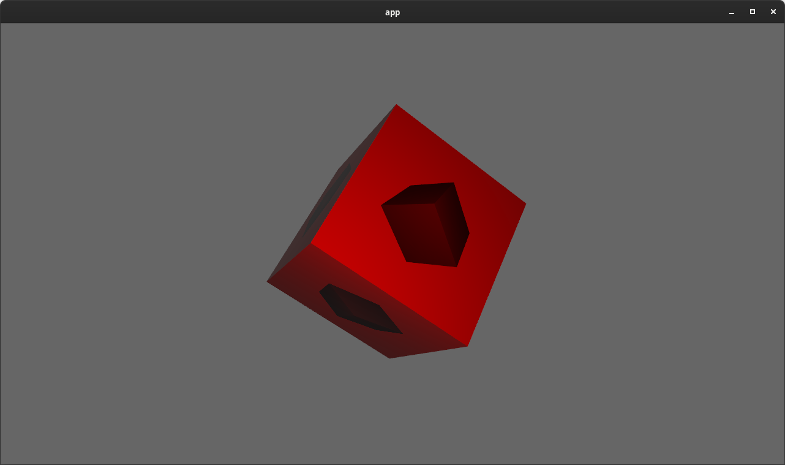
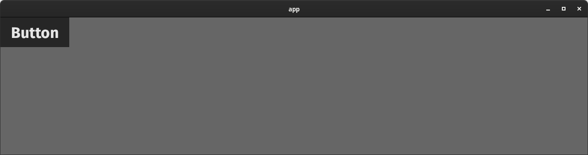

+++
title = "Bevy 0.9"
date = 2022-11-05
[extra]
author = "Carter Anderson"
twitter = "cart_cart"
github = "cart"
youtube = "cartdev"
image = ""
show_image = true
image_subtitle = "TODO_ADD_SPLASH_IMAGE"
image_subtitle_link = "https://bevyengine.org"
+++

Thanks to **X** contributors, **X** pull requests, community reviewers, and our [**generous sponsors**](https://github.com/sponsors/cart), I'm happy to announce the **Bevy 0.9** release on [crates.io](https://crates.io/crates/bevy)!

For those who don't know, Bevy is a refreshingly simple data-driven game engine built in Rust. You can check out our [Quick Start Guide](/learn/book/getting-started/) to try it today. It's free and open source forever! You can grab the full [source code](https://github.com/bevyengine/bevy) on GitHub. Check out [Bevy Assets](https://bevyengine.org/assets) for a collection of community-developed plugins, games, and learning resources.

To update an existing Bevy App or Plugin to **Bevy 0.9**, check out our [0.8 to 0.9 Migration Guide](/learn/book/migration-guides/0.8-0.9/).

Since our last release a few months ago we've added a _ton_ of new features, bug fixes, and quality of life tweaks, but here are some of the highlights:

INSERT_HIGHLIGHTS_HERE

<!-- more -->

## HDR Post Processing, Tonemapping, and Bloom

<div class="release-feature-authors">authors: @ChangeCaps, @jakobhellermann, @cart, @JMS55</div>

Bevy now supports the "bloom" post processing effect, backed by a ton of internal improvements to our HDR (High Dynamic Range) render pipeline.

TODO: REPLACE THIS WITH NICER BLOOM SCENE


Bloom creates a "blurred" effect around bright lights, which emulates how cameras (and our eyes) often perceive light in the real world. High quality bloom builds on top of HDR render pipelines, which represents light and color using more than the standard 8 bits per channel (rgba) used elsewhere. In previous releases Bevy already did [HDR lighting internally in its PBR shader](/news/bevy-0-5/#physically-based-rendering-pbr), but because we were rendering to a "normal" (low dynamic range) texture, we had to lose the extra high dynamic range information when we mapped the HDR lighting to the LDR texture (using a process called tonemapping).

In **Bevy 0.9**, you can now configure cameras to render to HDR textures, which will preserve the high dynamic range information after the "main pass" is finished rendering:

```rust
Camera {
    // Currently this defaults to false, but we will likely
    // switch this to true by default in future releases
    hdr: true,
    ..default()
}
```

This enables post processing effects, such as bloom, to have access to the raw HDR information. When HDR textures are enabled, we delay "tonemapping" until after "HDR post processing effects" have run in our [Render Graph](/news/bevy-0-6/#render-graphs-and-sub-graphs).

Bloom is enabled by adding a [`BloomSettings`] component to a camera with HDR textures enabled:

```rust
commands.spawn((
    Camera3dBundle {
        camera: Camera {
            hdr: true,
            ..default()
        },
        ..default()
    },
    BloomSettings::default(),
));
```

The bloom effect can be overbearing if misconfigured. [`BloomSettings`] has a number of options to tune it, but the most relevant is `intensity`, which can be used to adjust how much the effect is applied:

TODO_ADD_EXAMPLE_OFF_INTENSITY

[`BloomSettings`]: https://docs.rs/bevy/0.9.0/bevy/core_pipeline/bloom/struct.BloomSettings.html

## FXAA: Fast Approximate Anti-Aliasing

<div class="release-feature-authors">authors: @DGriffin91, @cart</div>

**Bevy 0.9** adds support for FXAA (fast approximate anti-aliasing). FXAA is a popular (and cheap!) anti-aliasing approach that uses luminance data contrast to identify edges and blur them:


Bevy already has support for MSAA (multisample anti-aliasing), which does multiple samples when rendering geometry edges, which makes those edges crisper:


Picking an anti-aliasing implementation is all about tradeoffs:

* **MSAA**: Crisp, high quality geometry edges. Leaves other parts of the image (such as textures and shadows) untouched, which can be a pro (crisper outputs) or a con (more aliasing). More expensive than FXAA.
* **FXAA**: Considers the entire image when blurring, including textures, which can be a pro (textures and shadows get anti-aliased) or a con (the image gets blurrier as a whole). Cheap to run (a good choice for mobile or web AA).

Now that our post processing pipeline is maturing, we plan on adding even more anti-aliasing options in future Bevy releases. We already have TAA (temporal anti-aliasing) and SMAA (subpixel morphological anti-aliasing) implementations in the works!

## Post Processing: View Target Double Buffering

<div class="release-feature-authors">authors: @cart</div>

Rendering post processing effects requires both an input texture (containing the "current" render) and an output texture (the "new" render with the effect applied). Previous versions of Bevy only had one main "view target" image. This meant that naively, post processing effects would need to manage and render to their own "intermediate" texture, then write it _back_ to the main target. This is clearly inefficient, as we have a new texture allocation for each effect _and_ we have the extra work of copying the intermediate texture back to the main texture.

To solve this, in **Bevy 0.9** we now "double buffer" our view target textures, which mean we have two copies of them that we flip between. At a given moment in time, one is the current "main" texture and the other is the "next" main texture. Post processing effect developers can now trigger a "post process write", which returns a `source` and `destination` texture. It assumes that an effect will write `source` to `destination` (with or without modifications). `destination` will then become the new "main" texture.

```rust
let post_process = view_target.post_process_write();
render_some_effect(render_context, post_process.source, post_process.destination);
```

This reduces the complexity burden on post processing effect developers and keeps our pipeline nice and efficient. The new [FXAA effect](/news/bevy-0-9/#fxaa-fast-approximate-anti-aliasing) was implemented using this new system. Post processing plugin developers can use that implementation as a reference. 

## Improved Render Target Texture Format Handling

<div class="release-feature-authors">authors: @VitalyAnkh, @cart</div>

**Bevy 0.9** now detects and uses each window's / surface's preferred [`TextureFormat`], rather than using hard-coded compile-time-selected per-platform formats. This means that we automatically support uncommon platforms and configurations. Additionally, Bevy's main passes and post processing passes now render to stable / consistent [`TextureFormats`][`TextureFormat`] (ex: `Rgba16Float` for HDR). We do a final blit from these "standard" textures to the final render target's preferred format. This simplifies render pipeline construction, allows for render pipeline re-use across render targets (even if their formats don't match), and provides consistent and predictable render pipeline behaviors.

This also means that when rendering to a texture, the texture format no longer needs to match the surface's texture format. For example, you can now render to a texture that only has a red channel:



[`TextureFormat`]: https://docs.rs/bevy/0.9.0/bevy/render/render_resource/enum.TextureFormat.html

## New Scene Format

<div class="release-feature-authors">authors: @MrGVSV</div>

**Bevy 0.9** introduces a _much_ improved scene format, which makes scenes smaller, simpler to compose manually, and easier to read. This is backed by a ton of improvements to Bevy Reflect (Bevy's Rust runtime reflection system). Most of the improvements to the Bevy Scene Format are actually generic improvements to all Bevy Reflect serialization!

```rust
// The New Bevy Scene Format
(
  entities: {
    0: (
      components: {
        "game::Player": (
          name: "Reyna",
          position: (
            x: 0.0,
            y: 0.0,
          ),
        ),
        "game::Health": (
          current: 5,
          max: 10,
        ),
        "game::Team": A,
      },
    ),
    1: (
      components: {
        "game::Player": (
          name: "Sova",
          position: (
            x: 10.0,
            y: 0.0,
          ),
        ),
        "game::Health": (
          current: 10,
          max: 10,
        ),
        "game::Team": B,
      },
    ),
  },
)
```

Compare that to the old format:

```rust
// The Old Bevy Scene Format
[
  (
    entity: 0,
    components: [
      {
        "type": "game::Player",
        "struct": {
          "name": {
            "type": "alloc::string::String",
            "value": "Reyna",
          },
          "position": {
            "type": "glam::f32::vec2::Vec2",
            "struct": {
              "x": {
                "type": "f32",
                "value": 0.0,
              },
              "y": {
                "type": "f32",
                "value": 0.0,
              },
            },
          },
        },
      },
      {
        "type": "game::Health",
        "struct": {
          "current": {
            "type": "usize",
            "value": 5,
          },
          "max": {
            "type": "usize",
            "value": 10,
          },
        },
      },
      {
        "type": "game::Team",
        "value": A,
      },
    ],
  ),
  (
    entity: 1,
    components: [
      {
        "type": "game::Player",
        "struct": {
          "name": {
            "type": "alloc::string::String",
            "value": "Sova",
          },
          "position": {
            "type": "glam::f32::vec2::Vec2",
            "struct": {
              "x": {
                "type": "f32",
                "value": 10.0,
              },
              "y": {
                "type": "f32",
                "value": 0.0,
              },
            },
          },
        },
      },
      {
        "type": "game::Health",
        "struct": {
          "current": {
            "type": "usize",
            "value": 10,
          },
          "max": {
            "type": "usize",
            "value": 10,
          },
        },
      },
      {
        "type": "game::Team",
        "value": B,
      },
    ],
  ),
]
```

There are so many improvements that it might be hard to pick them all out!

### Simpler Struct Syntax

Structs now use struct-style formatting instead of complicated map-based representations.

```rust
// Old
{
    "type": "game::Health",
    "struct": {
        "current": {
            "type": "usize",
            "value": 5,
        },
        "max": {
            "type": "usize",
            "value": 10,
        },
    },
},

// New
"game::Health": (
    current: 5,
    max: 10,
),
```

### Simpler Primitive Serialization

Types can now opt in to direct serde serialization, which makes primitive values much nicer to work with:

```rust
// Old
"name": {
    "type": "alloc::string::String",
    "value": "Reyna",
},

// New
name: "Reyna",
```

### Nicer Enum Syntax

Consider the enum:

```rust
pub enum Team {
    A,
    B,
}
```

Lets compare how it is serialized:

```rust
// Old
{
    "type": "game::Team",
    "value": A,
},

// New
"game::Team": A,
```

Also note that Bevy Reflect didn't even directly support enums until **Bevy 0.9**. Older versions of Bevy required using `#[reflect_value]` in combination with normal serde for enums, which was much more complicated. See the Reflect Enum section of this blog post for details!  

### Nicer Tuples

```rust
// Old
{
  "type": "(f32, f32)",
  "tuple": [
    {
      "type": "f32",
      "value": 1.0
    },
    {
      "type": "f32",
      "value": 2.0
    }
  ]
}

// New
{
  "(f32, f32)": (1.0, 2.0)
}
```

### Top Level Struct

Bevy Scenes now have a top level struct, which allows us to add additional values and metadata to the Bevy Scene format in the future (such as version numbers, ECS Resources, assets, etc).

```rust
// Old
[
    /* entities here */
]

// New
(
    entities: (
        /* entities here */
    )
)
```

### Use Maps Where Appropriate

Entity IDs and Component values must be unique in Bevy ECS. To better represent that, we now use map syntax instead of a list.

```rust
// Old
[
  (
    entity: 0,
    components: [ ],
  ),
  (
    entity: 1,
    components: [ ],
  ),
]

// New
(
  entities: {
    0: (
      components: { },
    ),
    1: (
      components: { },
    ),
  },
)
```

## Binary Scene Formats

<div class="release-feature-authors">authors: @MrGVSV</div>

Bevy Scenes can be serialized and deserialized to/from binary formats, such as [`bincode`](https://crates.io/crates/bincode/2.0.0-rc.1), [`postcard`](https://crates.io/crates/postcard), and [`rmp_serde`](https://crates.io/crates/rmp-serde). This required adding support for "non-self-describing" formats to the new scene format.

In the case of postcard, this can be almost 5x smaller (4.53x for the scene above)! Very useful if you are trying to keep the size of the scene small on disk, or send the scene over the network.

## Scene Creation Tooling

- [Create a scene from a dynamic scene][6229]
- [dynamic scene builder][6227]
- [can clone a scene][5855]

## Improved Entity / Component APIs

<div class="release-feature-authors">authors: @DJMcNab, @cart</div>

Spawning entities with components and adding / removing them from entities just got even easier!

First some quick fundamentals: Bevy ECS uses [`Components`][`Component`], to add data and logic to entities. To make entity composition easier, Bevy ECS also has [`Bundles`][`Bundle`], which define groups of components to be added together.

Just like in previous versions of Bevy, Bundles can be tuples of components:

```rust
(Player { name: "Sova" }, Health::new(10), Team::A)
```

The [`Bundle`] trait can also be derived:

```rust
#[derive(Bundle)]
struct PlayerBundle {
  player: Player,
  health: Health,
  team: Team,
}
```

In **Bevy 0.9**, [`Component`] types now _also_ automatically implement the [`Bundle`] trait, which allows us to consolidate all entity component operations under new `spawn`, `insert`, and `remove` apis. Previously, we had separate variants for [`Bundle`] (ex: `insert_bundle(SomeBundle)`) and [`Component`] (ex: `.insert(SomeComponent)`).

The [`Bundle`] trait is now also implemented for tuples of [`Bundles`][`Bundle`] instead of just tuples of [`Components`][`Component`]. The value of this will be made clear in a moment.

First: spawn now takes a bundle:

```rust
// Old (variant 1)
commands.spawn().insert_bundle(SpriteBundle::default());

// Old (variant 2)
commands.spawn_bundle(SpriteBundle::default());

// New
commands.spawn(SpriteBundle::default());
```

Already we've saved some characters, but we're just getting started! Because [`Component`] implements [`Bundle`], we can now also pass in single components into `spawn`:

```rust
// Old
commands.spawn().insert(Player { name: "Sova" });

// New
commands.spawn(Player { name: "Sova" });
```

Things get even more interesting when we introduce [`Bundle`] tuples into the mix, which allow us to combine many operations (covering both components and bundles) into a single `spawn` call:

```rust
// Old
commands
  .spawn_bundle(PlayerBundle::default())
  .insert_bundle(TransformBundle::default())
  .insert(ActivePlayer);

// New
commands.spawn((
  PlayerBundle::default(),
  TransformBundle::default(),
  ActivePlayer,
));
```

This is _much_ easier to type and read. And on top of that, from the perspective of Bevy ECS this is a single "bundle spawn" instead of multiple operations, which cuts down on ["archetype moves"](/news/bevy-0-5/#component-storage-the-problem). This makes this single spawn operation much more efficient!

These principles apply to the insert apis as well:

```rust
// Old
commands
  .insert_bundle(PlayerBundle::default())
  .insert(ActivePlayer);

// New
commands.insert((PlayerBundle::default(), ActivePlayer));
```

They also apply to the remove apis:

```rust
// Old
commands
  .remove_bundle::<PlayerBundle>()
  .remove::<ActivePlayer>();

// New
commands.remove::<(PlayerBundle, ActivePlayer)>();
```

[`Bundle`]: https://docs.rs/bevy/0.9.0/bevy/ecs/bundle/trait.Bundle.html
[`Component`]: https://docs.rs/bevy/0.9.0/bevy/ecs/component/trait.Component.html

## Exclusive System Rework

<div class="release-feature-authors">authors: @cart, @maniwani</div>

In preparation for the larger scheduler changes outlined in the newly-merged [Stageless RFC](https://github.com/bevyengine/rfcs/pull/45), we've started blurring the lines between "exclusive systems" (systems with "exclusive" full mutable access to the ECS [`World`]) and normal systems, which historically have been separate types with strict lines between them.

In **Bevy 0.9**, exclusive systems now implement the normal [`System`] trait! This will ultimately have even larger implications, but in **Bevy 0.9** this means that you no longer need to call `.exclusive_system()` when adding exclusive systems to your schedule:

```rust
fn some_exclusive_system(world: &mut World) { }

// Old
app.add_system(some_exclusive_system.exclusive_system())

// New
app.add_system(some_exclusive_system)
```

We've also expanded exclusive systems to support more system parameters, which vastly improves the user experience of writing exclusive systems, and makes them more efficient by caching state across executions.

[`SystemState`] can now be used to use "normal" system parameters from inside an exclusive system:

```rust
// Old
fn some_system(world: &mut World) {
  let mut state: SystemState<(Res<Time>, Query<&mut Transform>)> =
      SystemState::new(&mut world);
  let (time, mut transforms) = state.get_mut(world);
}

// New
fn some_system(world: &mut World, state: &mut SystemState<(Res<Time>, Query<&mut Transform>)>) {
  let (time, mut transforms) = state.get_mut(world);
}
```

[`QueryState`] can also be used to cache individual queries:

```rust
// Old
fn some_system(world: &mut World) {
  let mut transforms = world.query::<&Transform>();
  for transform in transforms.iter(world) {
  }
}

// New
fn some_system(world: &mut World, transforms: &mut QueryState<&Transform>) {
  for transform in transforms.iter(world) {
  }
}
```

[`Local`] can be used to store local data inside of the exclusive system:

```rust
// Old
#[derive(Resource)]
struct Counter(usize);
fn some_system(world: &mut World) {
  let mut counter = world.resource_mut::<Counter>();
  counter.0 += 1;
}

// New
fn some_system(world: &mut World, mut counter: Local<usize>) {
  *counter += 1;
}
```

[`World`]: https://docs.rs/bevy/0.9.0/bevy/ecs/world/struct.World.html
[`QueryState`]: https://docs.rs/bevy/0.9.0/bevy/ecs/query/struct.QueryState.html
[`SystemState`]: https://docs.rs/bevy/0.9.0/bevy/ecs/system/struct.SystemState.html
[`Local`]: https://docs.rs/bevy/0.9.0/bevy/ecs/system/struct.Local.html

## Bevy ECS Now Uses GATS!

<div class="release-feature-authors">authors: @BoxyUwU</div>

Rust 1.65.0 [stabilized GATs](https://blog.rust-lang.org/2022/11/03/Rust-1.65.0.html) (Generic Associated Types), which enabled us to significantly simplify Bevy ECS Query internals.

For awhile now, Bevy ECS has been hacking around the lack of GATs with a complicated nest of traits (`WorldQuery`, `WorldQueryGats` (a "lack of real GATs hack" trait), and `Fetch`).

In **Bevy 0.9**, we now have a single [`WorldQuery`] trait! This makes Bevy ECS much easier to maintain, extend, debug, document, and understand.

[`WorldQuery`]: https://docs.rs/bevy/0.9.0/bevy/ecs/query/trait.WorldQuery.html

## Derive Resource

<div class="release-feature-authors">authors: @devil-ira</div>

The [`Resource`] trait is now no longer automatically implemented for all types. It must be derived:

```rust
#[derive(Resource)]
struct Counter(usize);
```

This change was made on the tail of [making the same decision](/news/bevy-0-6/#the-new-component-trait-and-derive-component) for [`Component`] types. In short:

1. Auto-implementing [`Resource`] for every type made it very easy to accidentally insert the "wrong" value, such as inserting the constructor function pointer instead of the value itself:

    ```rust
    struct Counter(usize);
    // This inserts the constructor function pointer as a resource!
    // Weird and confusing!
    app.insert_resource(Counter);
    ```

2. Deriving [`Resource`] documents intent in a structured way. Without a derive, resource-ness is implicit by default.
3. Auto-implementing meant that plugins could use the same "common" type in conflicting ways (ex: `std` types like `Vec<usize>`). Not implementing by default means that plugins cannot use these common types in conflicting ways. They must create new types.
4. This opens the door to configuring resource types using the Rust type system (like we already do for components).

[`Resource`]: https://docs.rs/bevy/0.9.0/bevy/ecs/system/trait.Resource.html

## Query Internals Reworks

- [make `WorldQuery` very flat][5205]
- [Clean up Fetch code][4800]

## System Ambiguity 

- [Add methods for silencing system-order ambiguity warnings][6158]
- [Remove ambiguity sets][5916]

- [Extract Resources into their own dedicated storage][4809]

- [Add iter_entities to World #6228][6242]
- [Rename system chaining to system piping][6230]
- [implemented #[bundle(ignore)]][6123]
- [Implement IntoIterator for ECS wrapper types.][5096]

- [Add `send_event` and friends to `WorldCell`][6515]
- [Fix unsound `EntityMut::remove_children`. Add `EntityMut::world_scope`][6464]
- [Remove unnecesary branches/panics from Query accesses][6461]
- [Speed up `Query::get_many` and add benchmarks][6400]
- [Fix query.to_readonly().get_component_mut() soundness bug][6401]
- [Allow access to non-send resource through `World::resource_scope`][6113]
- [Add get_entity to Commands][5854]
- [`Query` filter types must be `ReadOnlyWorldQuery`][6008]
- [Added the ability to get or set the last change tick of a system.][5838]
- [Add a module for common system `chain`/`pipe` adapters][5776]
- [SystemParam for the name of the system you are currently in][5731]
- [Add a change detection bypass and manual control over change ticks][5635]
- [Avoid making `Fetch`s `Clone`][5593]
- [Replace `many_for_each_mut` with `iter_many_mut`.][5402]
- [Start running systems while prepare_systems is running][4919]
- [Skip empty archetypes and tables when iterating over queries][4724]

## Enum Reflection

<div class="release-feature-authors">authors: @MrGVSV</div>

Bevy Reflect now has native support for Rust enums! Bevy Reflect is Bevy's "Rust reflection system", which allows us to access Rust type information about values and types dynamically at runtime.  

In past versions of Bevy, we needed to hack around Bevy Reflect's lack of enum support by treating enum types as "reflected values", which required a lot more work for each type, and it provided less reflected information about the type:

```rust
// Old
#[derive(Copy, Clone, PartialEq, Debug, Default, Serialize, Deserialize, Reflect)]
#[reflect_value(PartialEq, Serialize, Deserialize)]
enum SomeEnum {
  A,
  B(usize),
  C {
    foo: f32,
    bar: bool,
  },
}

// New
#[derive(Reflect)]
enum SomeEnum {
  A,
  B(usize),
  C {
    foo: f32,
    bar: bool,
  },
}
```

No more magic incantations!

Just like other reflected types, Enum reflection provides a lot of new runtime functionality:

```rust
// Access variant names
let value = SomeEnum::A;
assert_eq!("A", value.variant_name());

// Get the variant type
match value.variant_type() {
  VariantType::Unit => {},
  VariantType::Struct => {},
  VariantType::Tuple => {},
}

let mut value = SomeEnum::C {
  foo: 1.23,
  bar: false
};

// Read/write specific fields by name
*value.field_mut("bar").unwrap() = true;

// Iterate over the entire collection of fields
for field in value.iter_fields() {
}

// Detect the value type and retrieve information about it
if let TypeInfo::Enum(info) = value.type_info() {
  if let VariantInfo::Struct(struct_info) = value.variant("C") {
    let first_field = struct_info.field_at(0).unwrap();
    assert_eq!(first_field.name(), "foo");
  }
}
```

Deriving [`Reflect`] on enums also automatically adds support for "reflect-based serialization", which as of **Bevy 0.9** now [has a _much_ nicer syntax](/news/bevy-0-9/#new-scene-format).

[`Reflect`]: https://docs.rs/bevy/0.9.0/bevy/reflect/trait.Reflect.html

- [bevy_reflect: Get owned fields][5728]
- [Add `reflect(skip_serializing)` which retains reflection but disables automatic serialization][5250]
- [bevy_reflect: Add `Reflect::into_reflect`][6502]
- [Add reflect_owned][6494]
- [make `register` on `TypeRegistry` idempotent][6487]
- [Enable Constructing ReflectComponent/Resource][6257]
- [Support multiple `#[reflect]`/`#[reflect_value]` + improve error messages][6237]
- [Make arrays behave like lists in reflection][5987]
- [Add `pop` method for `List` trait.][5797]

## Example: Gamepad Viewer

<div class="release-feature-authors">authors: @rparrett</div>

Bevy now has a gamepad input viewer app, which can be run using `cargo run --example gamepad_viewer` from the Bevy repo. 

<video controls loop><source  src="gamepad.mp4" type="video/mp4"/></video>


- [Add getters and setters for `InputAxis` and `ButtonSettings`][6088]
- [Added keyboard scan input event][5495]

## Axis and Button Settings Validation

<div class="release-feature-authors">authors: @mfdorst, @targrub</div>

[`InputAxis`] and [`ButtonSettings`] now use getters and setters to ensure the integrity of the settings. Setters will return an error instead of allowing invalid state.

For example, attempting to set the "press threshold" of a button to a value lower than the "release threshold" will result in an error:

```rust
button_settings.set_release_threshold(0.65);
// this is too low!
assert!(button_settings.try_set_press_threshold(0.6).is_err())
```

## Time Shader Globals

<div class="release-feature-authors">authors: @IceSentry</div>

Bevy shaders _finally_ have access to built-in time values, removing the need for users to calculate time values and pass them in manually. Time is very useful in shaders, as it opens the doors to animating values.

Here is a simple shader that animates between a black and red color using the time:

```rust
@fragment
fn fragment(in: FragmentInput) -> @location(0) vec4<f32> {
    return vec4<f32>(sin(globals.time * 10.0), 0.0, 0.0, 1.0);
}
```

<video controls loop><source  src="blinking_cube.mp4" type="video/mp4"/></video>

Bevy Shaders now have access to the following globals:
* `time`: time since startup in seconds, wrapping to 0 after 1 hour
* `delta_time`: time since the previous frame in seconds
* `frame_count`: frame count since the start of the app, wrapping to 0 after reaching the max size of a `u32`

## High Entity Renderer Slowdown Optimization

<div class="release-feature-authors">authors: @TheRawMeatball</div>

[Bevy's new renderer](/news/bevy-0-6/#the-new-bevy-renderer) synchronizes entity state between the "main world" and the "render world", which enables parallel pipelined rendering. To implement this, we clear out the render entities every frame to ensure the integrity of the extracted state.

However, it became apparent that the method we were using to clear entities each frame was incurring a per-entity cost that became notable at very high entity counts.

In **Bevy 0.9**, we have significantly optimized the entity clearing, which cuts the cost of clearing 5,000,000 entities from ~360 microseconds to ~120 microseconds. We are also considering a "retained state" extraction model, piggybacking on Bevy ECS's built in change detection, which would remove the need to clear entities entirely (and optimize the extraction processes more generally). Implementing that will be a much larger effort though!

## Vertex Attributes Fully Optional

<div class="release-feature-authors">authors: @IceSentry</div>

In a previous release we [made it possible to make vertex attributes optional by specializing on mesh vertex attributes](/news/bevy-0-7/#flexible-mesh-vertex-layouts). But we left a couple of the common attributes as required: the position and the normal. **Bevy 0.9** finishes the job. All standard mesh vertex attributes are now completely optional. If your mesh doesn't need positions for some reason, Bevy won't stop you!

## Expose Multi Draw Indirect

<div class="release-feature-authors">authors: @Neo-Zhixing</div>


Wgpu has opt-in support for "multi draw indirect" apis on platforms that support them, which are a key piece of implementing efficient "gpu driven rendering". Bevy now exposes these apis through its "tracked render pass" abstraction, enabling developers to build render features using these apis.

## KTX2 Array / Cubemap / Cubemap Array Textures

<div class="release-feature-authors">authors: Rob Swain (@superdump)</div>

Bevy can now properly load KTX2 array, cubemap, and cubemap array texture assets, which opens the doors to scenarios like skyboxes:

<video controls loop><source  src="skybox.mp4" type="video/mp4"/></video>

Bevy doesn't yet have high level support for skyboxes, but we have an example that [illustrates how this feature can be implemented by users](https://github.com/bevyengine/bevy/blob/v0.9.0/examples/3d/skybox.rs)

## Camera::viewport_to_world

<div class="release-feature-authors">authors: @devil-ira</div>

It is often desirable to convert a position "on the screen" to a ray at that position facing out from the camera. For example, if you want to click on something in a 3D scene to select it, you might cast a ray from that point in the camera's view and see if it intersect with any "colliders" in the scene.

Bevy cameras now have a [`viewport_to_world`] function, which provides this functionality:

```rust
let ray = camera.viewport_to_world(transform, cursor_position).unwrap();
if let Some(entity) = physics_context.cast_ray(ray.origin, ray.direction) {
  // select entity
}
```

The following cursor-driven selection uses [`viewport_to_world`] to calculate the ray coming "out" of the cursor, then feeds it into the [`bevy_rapier`](https://rapier.rs/docs/user_guides/bevy_plugin/getting_started_bevy) physics library to detect and pick up the card under the cursor:

<video controls loop><source  src="viewport_to_world.mp4" type="video/mp4"/></video>


[`viewport_to_world`]: https://docs.rs/bevy/0.9.0/bevy/render/camera/struct.Camera.html#method.viewport_to_world

## Multiple Directional Lights

<div class="release-feature-authors">authors: @kurtkuehnert</div>

Bevy now supports multiple directional lights (the new limit is 10 at once). Much like we did for point lights, we will likely make this unbounded on platforms that support storage buffers in the future, but this was a nice first step that maintains compatibility on all platforms.


## WGPU Upgrade

- [Update `wgpu` to 0.14.0, `naga` to `0.10.0`, `winit` to 0.27.4, `raw-window-handle` to 0.5.0, `ndk` to 0.7][6218]

## Sprite Rects

- [Sprite: allow using a sub-region (Rect) of the image][6014]

## Plugin Settings

<div class="release-feature-authors">authors: @cart, @mockersf</div>

In past versions of Bevy, "immutable" Plugin settings were represented as normal ECS resources, which were read as part of plugin init. This presented a number of problems:

1. If a user inserted the plugin settings resource after the plugin was initialized, it would be silently ignored (and use the defaults instead)
2. Users could modify the plugin settings resource after the plugin had been initialized. This created a false sense of control over settings that could no longer be changed.

These were especially problematic and confusing for the `WindowDescriptor` resource, but it was a general problem.

To resolve this, in **Bevy 0.9** we moved plugin settings onto the plugins themselves, and created new apis for overriding the default settings:

```rust
app.add_plugins(DefaultPlugins
  .set(AssetPlugin {
    watch_for_changes: true,
    ..default()
  })
  .set(WindowPlugin {
    window: WindowDescriptor {
      width: 400.0,
      ..default()
    },
    ..default()
  })
)
```

This makes the connection between the settings and the plugin clear, and differentiates these "plugin init" settings from "runtime configurable" settings (which are still represented as ECS resources).

## Plugins are now unique by default

<div class="release-feature-authors">authors: @mockersf</div>

Plugins are now unique by default. Attempting to add a unique plugin to an app more than once will result in an error. Plugins that are not intended to be unique can override the default `is_unique` method:

```rust
impl Plugin for MyPlugin {
  fn build(&self, app: &mut App) {
    app.add_system(some_system);
  }

  fn is_unique(&self) -> bool {
    false
  }
}
```

## Task Pool Panic Handling

<div class="release-feature-authors">authors: @james7132</div>

- [TaskPool Panic Handling][6443]

## Task Pool: Nested Spawns on Scope

<div class="release-feature-authors">authors: @hymm</div>

Bevy's Task Pools now support "nested spawns on scopes":

```rust
let results = task_pool.scope(|scope| {
    scope.spawn(async move {
        scope.spawn(async move { 1 });
        2
    });
});

assert!(results.contains(&1));
assert!(results.contains(&2));
```

This enables adding new tasks to the task pool scope while performing other tasks! This was a requirement for implementing the newly merged [Stageless RFC](https://github.com/bevyengine/rfcs/pull/45), but it enables new patterns for anyone spawning async tasks in Bevy!

## Hierarchy Query Methods

<div class="release-feature-authors">authors: @devil-ira</div>

To make navigating hierarchies easier, we've added some convience methods to `Query<&Children>` and `Query<&Parent>`:

```rust
#[derive(Resource)]
struct SomeEntity(Entity);

fn system(children: Query<&Children>, some_entity: Res<SomeEnitty>) {
  // iterate all descendents of some_entity 
  for entity in children.iter_descendants(some_entity.0) {
  }
  
  // iterate all ancestors of some_entity 
  for entity in children.iter_ancestors(some_entity.0) {
  }
}

fn other_system(parents: Query<&Parent>, some_entity: Res<SomeEnitty>) {
  // iterate all ancestors of some_entity 
  for entity in parents.iter_ancestors(some_entity.0) {
  }
}
```

## Bevy UI: The Origin Is Now In The Top Left

<div class="release-feature-authors">authors: @mahulst</div>

Bevy UI now considers the "top left" of the window to be the "origin" and it extends "downward" (Y-down). To illustrate, consider the following cases where a widget spawned in the "default" location (at the origin).

### Top Left Origin (New)



### Bottom Left Origin (Old)


We chose to make this change because pretty much the _entire_ UI ecosystem uses top left as the origin (Web, Godot, GTK, GPU images, etc).

In the early days when Bevy was still in its infancy, I (`@cart`) originally opted for bottom left (Y-up) for consistency with Bevy's world space 2D and 3D coordinate systems. In theory, I figured this would make everything easier to reason about. But in practice, it turns out this consistency won us nothing. And the behavior defied users' expectations when it came to UI default behaviors. UIs tend to extend downward (from the top), not upward (from the bottom), so overriding the defaults was common practice.

Fortunately, in **Bevy 0.9** we're now aligned with the rest of the ecosystem!

## Bevy UI: Z-Indices

- [Add z-index support with a predictable UI stack][5877]

## Bevy UI scaling

- [Add UI scaling][5814]

## Audio Playback Toggling

<div class="release-feature-authors">authors: @lovelymono</div>

It is now possible to toggle audio playback, which will flip between playing and pausing:

```rust
// Old, manual toggling (still possible)
if audio_sink.is_paused() {
    audio_sink.play();
} else {
    audio_sink.pause();
}

// New, automatic toggling
audio_sink.toggle();
```

## Time Scaling

- [Add global time scaling][5752]

## Time Wrapping

- [Add `TimeUpdateStrategy` resource for manual `Time` updating][6159]
- [add time wrapping to Time][5982]

## What's Next?

* **High Level Post Processing Stack**: Now that we have the core post processing pipeline in place, we need to make a higher level system that makes it easier for users to select, configure, and re-order post processing effects on a per-camera basis. Additionally for performance reasons we want to combine as many post processing effects into a single pass as we can, so we need an opinionated set of post processing apis that facilitate this.
* **More Post Processing Effects**: More anti-aliasing options (TAA, SMAA), more tonemapping algorithm options (Ex: ACES), debanding, SSAO

## Support Bevy

Sponsorships help make our work on Bevy sustainable. If you believe in Bevy's mission, consider sponsoring us ... every bit helps!

* **[Carter Anderson (@cart)](https://github.com/sponsors/cart)**: Full-time lead developer, project manager, and creator of Bevy. Focused on building out core engine systems, guiding project direction, and managing the community.
* **[Alice Cecile (@alice-i-cecile)](https://github.com/sponsors/alice-i-cecile)**: Technical project manager, mad scientist, and documentation lead. While she regularly leads expeditions into new domains, ECS will always be home base.
* **[François Mockers (@mockersf)](https://github.com/sponsors/mockersf)**: CI whisperer. Making sure everything is running smoothly and improving Bevy one PR at a time.
* **Rob Swain (@superdump)**: Wielder of light. Turning data into shiny with massive parallelism. Currently hobby hacking so please donate to/sponsor the rest of the team. ❤️

## Contributors

A huge thanks to the **X contributors** that made this release (and associated docs) possible! In random order:

* @X
 
## Full Change Log

