+++
title = "Bevy 0.9"
date = 2022-11-12
[extra]
author = "Carter Anderson"
twitter = "cart_cart"
github = "cart"
youtube = "cartdev"
image = "bloom_lion.png"
show_image = true
+++

Thanks to **159** contributors, **430** pull requests, community reviewers, and our [**generous sponsors**](https://github.com/sponsors/cart), I'm happy to announce the **Bevy 0.9** release on [crates.io](https://crates.io/crates/bevy)!

For those who don't know, Bevy is a refreshingly simple data-driven game engine built in Rust. You can check out our [Quick Start Guide](/learn/book/getting-started/) to try it today. It's free and open source forever! You can grab the full [source code](https://github.com/bevyengine/bevy) on GitHub. Check out [Bevy Assets](https://bevyengine.org/assets) for a collection of community-developed plugins, games, and learning resources.

To update an existing Bevy App or Plugin to **Bevy 0.9**, check out our [0.8 to 0.9 Migration Guide](/learn/book/migration-guides/0.8-0.9/).

Since our last release a few months ago we've added a _ton_ of new features, bug fixes, and quality of life tweaks, but here are some of the highlights:

<!-- more -->

* **HDR Post Processing, Tonemapping, and Bloom**: Bevy has a new HDR post processing and tonemapping pipeline, which we used to implement the "bloom" post processing effect!
* **FXAA**: Fast approximate anti-aliasing was added, which gives users a new cheap option for screen space anti-aliasing.
* **Deband Dithering**: Hide gradient precision errors with this new post processing effect!
* **Other Post Processing Improvements**: View target double buffering and automatic render target format handling.
* **New Scene Format**: Bevy's new scene format is smaller, simpler to compose manually, and easier to read. Comes in both "human readable" and "binary" variants!
* **Code Driven Scene Construction**: Build scenes dynamically from an existing app using queries and specific entity references.
* **Improved Entity/Component APIs**: Spawning entities with components is now simpler and more ergonomic than ever!
* **Exclusive System Rework**: Exclusive systems (systems with unique ECS World access) are now just "normal" systems with significantly improved usability.
* **Enum Reflection**: Bevy Reflect can now reflect enum types, which exposes them to Bevy's scene system and opens doors to editor tooling for enums.
* **Time Shader Globals**: Time is now passed to shaders as a global, making time-driven animation in custom shaders easy!
* **Plugin Settings**: Plugins can now have settings, which can be overridden in plugin groups, simplifying the plugin configuration story.
* **Bevy UI Z-Indices**: Control how UI elements stack on top of each other using local and global z-indices

## HDR Post Processing, Tonemapping, and Bloom

<div class="release-feature-authors">authors: @ChangeCaps, @jakobhellermann, @cart, @JMS55</div>

Bevy now supports the "bloom" post processing effect, backed by a ton of internal improvements to our HDR (High Dynamic Range) render pipeline.

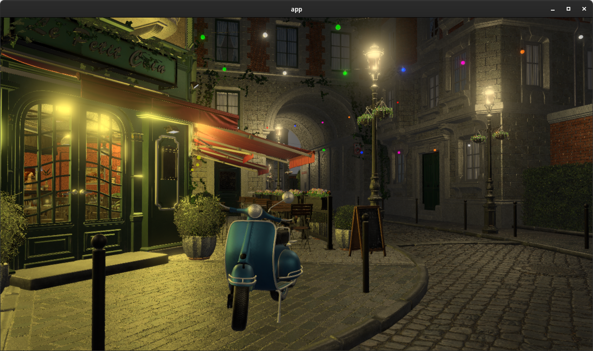

Bloom creates a "blurred" effect around bright lights, which emulates how cameras (and our eyes) often perceive light in the real world. High quality bloom builds on top of HDR render pipelines, which represents light and color using more than the standard 8 bits per channel (rgba) used elsewhere. In previous releases Bevy already did [HDR lighting internally in its PBR shader](/news/bevy-0-5/#physically-based-rendering-pbr), but because we were rendering to a "normal" (low dynamic range) texture, we had to lose the extra high dynamic range information when we mapped the HDR lighting to the LDR texture (using a process called tonemapping).

In **Bevy 0.9**, you can now configure cameras to render to HDR textures, which will preserve the high dynamic range information after the "main pass" is finished rendering:

```rust
Camera {
    // Currently this defaults to false, but we will likely
    // switch this to true by default in future releases
    hdr: true,
    ..default()
}
```

This enables post processing effects, such as bloom, to have access to the raw HDR information. When HDR textures are enabled, we delay "tonemapping" until after "HDR post processing effects" have run in our [Render Graph](/news/bevy-0-6/#render-graphs-and-sub-graphs).

Bloom is enabled by adding a [`BloomSettings`] component to a camera with HDR textures enabled:

```rust
commands.spawn((
    Camera3dBundle {
        camera: Camera {
            hdr: true,
            ..default()
        },
        ..default()
    },
    BloomSettings::default(),
));
```

The bloom effect can be overbearing if misconfigured. [`BloomSettings`] has a number of options to tune it, but the most relevant is `intensity`, which can (and should) be used to adjust how much the effect is applied.

Seriously ... this effect can be obnoxious:

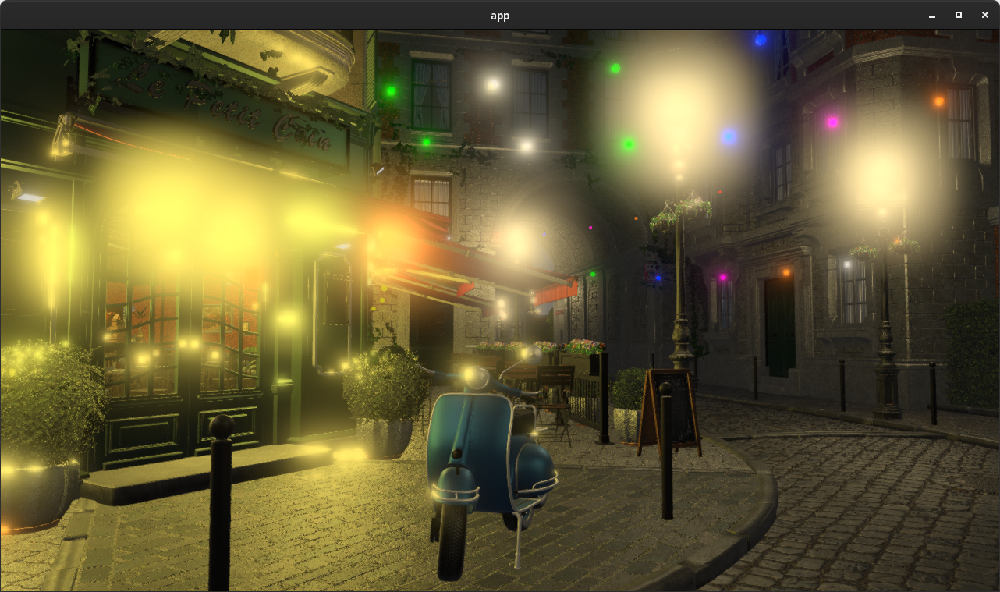

In most cases, it is best to err on the side of subtlety.

HDR rendering is also available in 2D, which means you can also use bloom effects in 2D!

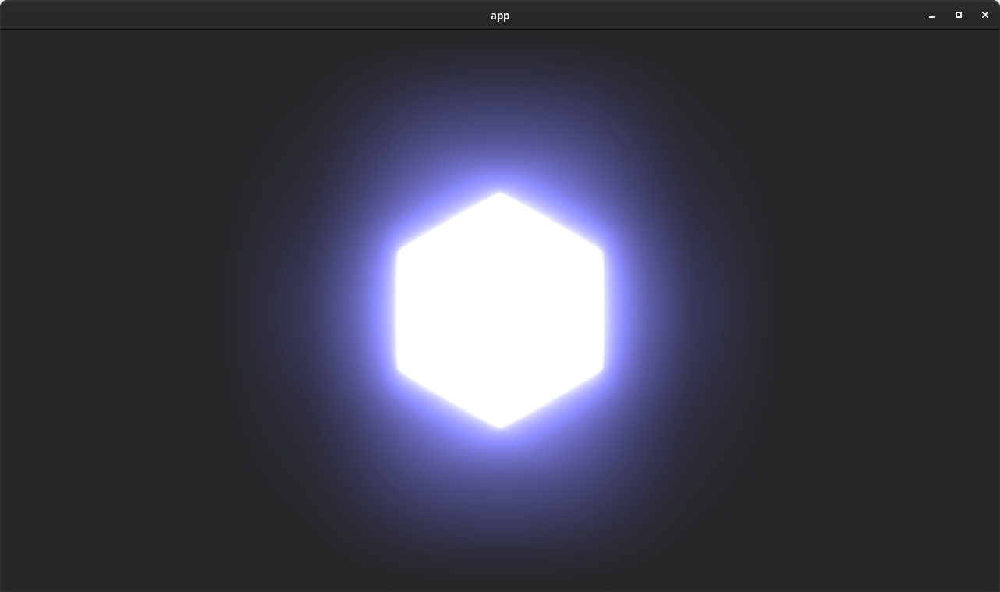

[`BloomSettings`]: https://docs.rs/bevy/0.9.0/bevy/core_pipeline/bloom/struct.BloomSettings.html

## FXAA: Fast Approximate Anti-Aliasing

<div class="release-feature-authors">authors: @DGriffin91, @cart</div>

**Bevy 0.9** adds support for FXAA (fast approximate anti-aliasing). FXAA is a popular (and cheap!) anti-aliasing approach that uses luminance data contrast to identify edges and blur them:

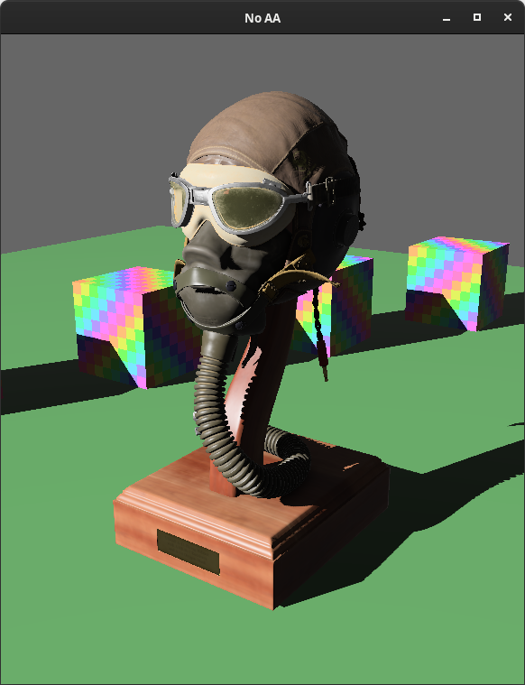


Bevy already has support for MSAA (multisample anti-aliasing), which does multiple samples when rendering geometry edges, which makes those edges crisper:


Picking an anti-aliasing implementation is all about tradeoffs:

* **MSAA**: Crisp, high quality geometry edges. Leaves other parts of the image (such as textures and shadows) untouched, which can be a pro (crisper outputs) or a con (more aliasing). More expensive than FXAA.
* **FXAA**: Considers the entire image when blurring, including textures, which can be a pro (textures and shadows get anti-aliased) or a con (the image gets blurrier as a whole). Cheap to run (a good choice for mobile or web AA).

Now that our post processing pipeline is maturing, we plan on adding even more anti-aliasing options in future Bevy releases. We already have TAA (temporal anti-aliasing) and SMAA (subpixel morphological anti-aliasing) implementations in the works!

## Deband Dithering

<div class="release-feature-authors">authors: @aevyrie</div>

"Color banding" is a known limitation when using 8 bit color channels (which are required by pretty much every device / screen).

This is most visible when trying to render smooth gradients for low noise textures (ex: the lighting on a "pure green" material):


If you look closely at the green plane _or_ the tan cube, you will notice distinct bands for each shade of color. A popular solution to this problem is to "dither" the final image.

**Bevy 0.9** now performs "deband dithering" by default in the tonemapping stage:

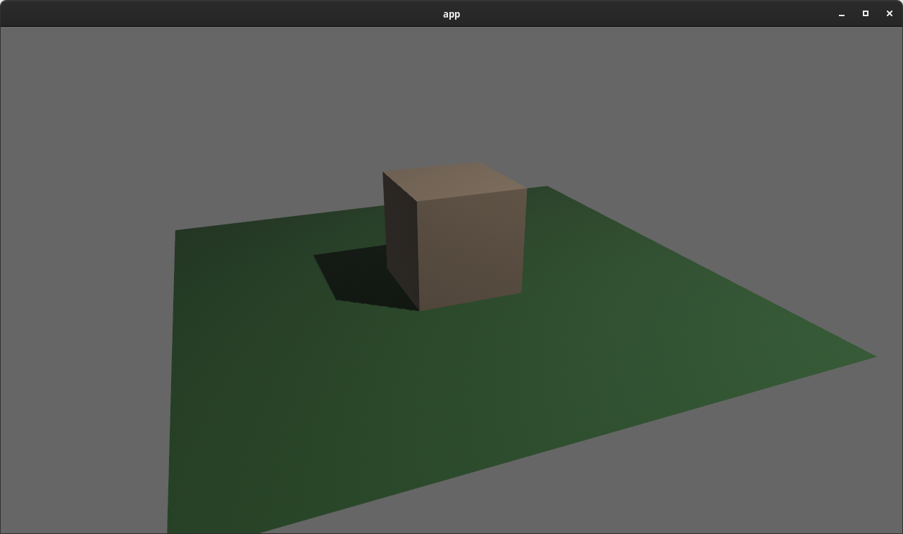

You can enable and disable this per-camera:

```rust
  commands.spawn(Camera3dBundle {
      tonemapping: Tonemapping::Enabled {
          deband_dither: true,
      },
      ..default()
  });
```

## Post Processing: View Target Double Buffering

<div class="release-feature-authors">authors: @cart</div>

Rendering post processing effects requires both an input texture (containing the "current" render) and an output texture (the "new" render with the effect applied). Previous versions of Bevy only had one main "view target" image. This meant that naively, post processing effects would need to manage and render to their own "intermediate" texture, then write it _back_ to the main target. This is clearly inefficient, as we have a new texture allocation for each effect _and_ we have the extra work of copying the intermediate texture back to the main texture.

To solve this, in **Bevy 0.9** we now "double buffer" our view target textures, which means we have two copies of them that we flip between. At a given moment in time, one is the current "main" texture and the other is the "next" main texture. Post processing effect developers can now trigger a "post process write", which returns a `source` and `destination` texture. It assumes that an effect will write `source` to `destination` (with or without modifications). `destination` will then become the new "main" texture.

```rust
let post_process = view_target.post_process_write();
render_some_effect(render_context, post_process.source, post_process.destination);
```

This reduces the complexity burden on post processing effect developers and keeps our pipeline nice and efficient. The new [FXAA effect](/news/bevy-0-9/#fxaa-fast-approximate-anti-aliasing) was implemented using this new system. Post processing plugin developers can use that implementation as a reference.

## Improved Render Target Texture Format Handling

<div class="release-feature-authors">authors: @VitalyAnkh, @cart</div>

**Bevy 0.9** now detects and uses each window's / surface's preferred [`TextureFormat`], rather than using hard-coded compile-time-selected per-platform formats. This means that we automatically support uncommon platforms and configurations. Additionally, Bevy's main passes and post processing passes now render to stable / consistent [`TextureFormats`][`TextureFormat`] (ex: `Rgba16Float` for HDR). We do a final blit from these "standard" textures to the final render target's preferred format. This simplifies render pipeline construction, allows for render pipeline re-use across render targets (even if their formats don't match), and provides consistent and predictable render pipeline behaviors.

This also means that when rendering to a texture, the texture format no longer needs to match the surface's texture format. For example, you can now render to a texture that only has a red channel:

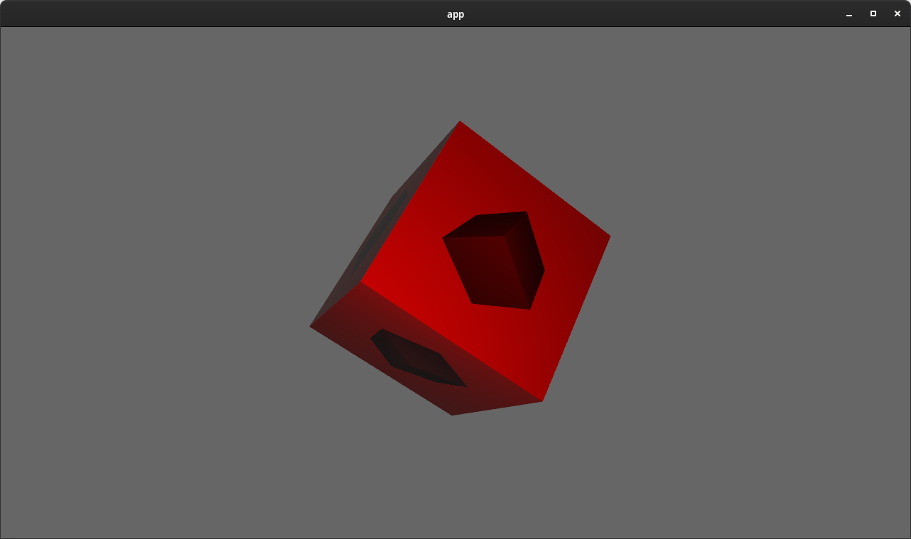

[`TextureFormat`]: https://docs.rs/bevy/0.9.0/bevy/render/render_resource/enum.TextureFormat.html

## New Scene Format

<div class="release-feature-authors">authors: @MrGVSV</div>

**Bevy 0.9** introduces a _much_ improved scene format, which makes scenes smaller, simpler to compose manually, and easier to read. This is backed by a ton of improvements to Bevy Reflect (Bevy's Rust runtime reflection system). Most of the improvements to the Bevy Scene Format are actually generic improvements to all Bevy Reflect serialization!

```rust
// The New Bevy Scene Format
(
  entities: {
    0: (
      components: {
        "game::Player": (
          name: "Reyna",
          position: (
            x: 0.0,
            y: 0.0,
          ),
        ),
        "game::Health": (
          current: 5,
          max: 10,
        ),
        "game::Team": A,
      },
    ),
    1: (
      components: {
        "game::Player": (
          name: "Sova",
          position: (
            x: 10.0,
            y: 0.0,
          ),
        ),
        "game::Health": (
          current: 10,
          max: 10,
        ),
        "game::Team": B,
      },
    ),
  },
)
```

Compare that to the old format:

```rust
// The Old Bevy Scene Format
[
  (
    entity: 0,
    components: [
      {
        "type": "game::Player",
        "struct": {
          "name": {
            "type": "alloc::string::String",
            "value": "Reyna",
          },
          "position": {
            "type": "glam::f32::vec2::Vec2",
            "struct": {
              "x": {
                "type": "f32",
                "value": 0.0,
              },
              "y": {
                "type": "f32",
                "value": 0.0,
              },
            },
          },
        },
      },
      {
        "type": "game::Health",
        "struct": {
          "current": {
            "type": "usize",
            "value": 5,
          },
          "max": {
            "type": "usize",
            "value": 10,
          },
        },
      },
      {
        "type": "game::Team",
        "value": A,
      },
    ],
  ),
  (
    entity: 1,
    components: [
      {
        "type": "game::Player",
        "struct": {
          "name": {
            "type": "alloc::string::String",
            "value": "Sova",
          },
          "position": {
            "type": "glam::f32::vec2::Vec2",
            "struct": {
              "x": {
                "type": "f32",
                "value": 10.0,
              },
              "y": {
                "type": "f32",
                "value": 0.0,
              },
            },
          },
        },
      },
      {
        "type": "game::Health",
        "struct": {
          "current": {
            "type": "usize",
            "value": 10,
          },
          "max": {
            "type": "usize",
            "value": 10,
          },
        },
      },
      {
        "type": "game::Team",
        "value": B,
      },
    ],
  ),
]
```

There are so many improvements that it might be hard to pick them all out!

### Simpler Struct Syntax

Structs now use struct-style formatting instead of complicated map-based representations.

```rust
// Old
{
    "type": "game::Health",
    "struct": {
        "current": {
            "type": "usize",
            "value": 5,
        },
        "max": {
            "type": "usize",
            "value": 10,
        },
    },
},

// New
"game::Health": (
    current: 5,
    max: 10,
),
```

### Simpler Primitive Serialization

Types can now opt in to direct serde serialization, which makes primitive values much nicer to work with:

```rust
// Old
"name": {
    "type": "alloc::string::String",
    "value": "Reyna",
},

// New
name: "Reyna",
```

### Nicer Enum Syntax

Consider the enum:

```rust
pub enum Team {
    A,
    B,
}
```

Lets compare how it is serialized:

```rust
// Old
{
    "type": "game::Team",
    "value": A,
},

// New
"game::Team": A,
```

Also note that Bevy Reflect didn't even directly support enums until **Bevy 0.9**. Older versions of Bevy required using `#[reflect_value]` in combination with normal serde for enums, which was much more complicated. See the [Enum Reflection](#enum-reflection) section of this blog post for details!  

### Nicer Tuples

```rust
// Old
{
  "type": "(f32, f32)",
  "tuple": [
    {
      "type": "f32",
      "value": 1.0
    },
    {
      "type": "f32",
      "value": 2.0
    }
  ]
}

// New
{
  "(f32, f32)": (1.0, 2.0)
}
```

### Top Level Struct

Bevy Scenes now have a top level struct, which allows us to add additional values and metadata to the Bevy Scene format in the future (such as version numbers, ECS Resources, assets, etc).

```rust
// Old
[
    /* entities here */
]

// New
(
    entities: (
        /* entities here */
    )
)
```

### Use Maps Where Appropriate

Entity IDs and Component values must be unique in Bevy ECS. To better represent that, we now use map syntax instead of a list.

```rust
// Old
[
  (
    entity: 0,
    components: [ ],
  ),
  (
    entity: 1,
    components: [ ],
  ),
]

// New
(
  entities: {
    0: (
      components: { },
    ),
    1: (
      components: { },
    ),
  },
)
```

## Binary Scene Formats

<div class="release-feature-authors">authors: @MrGVSV</div>

Bevy Scenes can be serialized and deserialized to/from binary formats, such as [`bincode`](https://crates.io/crates/bincode/2.0.0-rc.1), [`postcard`](https://crates.io/crates/postcard), and [`rmp_serde`](https://crates.io/crates/rmp-serde). This required adding support for "non-self-describing" formats to the new scene format.

In the case of postcard, this can be almost 5x smaller (4.53x for the scene above)! Very useful if you are trying to keep the size of the scene small on disk, or send the scene over the network.

## Dynamic Scene Builder

<div class="release-feature-authors">authors: @mockersf</div>

Bevy Scenes can now be constructed dynamically using the new [`DynamicSceneBuilder`]. Previous versions of Bevy already supported [writing "whole worlds" to scenes](https://github.com/bevyengine/bevy/blob/v0.8.1/examples/scene/scene.rs#L78), but in some cases, users might only want to write _specific_ entities to a scene. **Bevy 0.9**'s [`DynamicSceneBuilder`] makes this possible:

```rust
// Write players to a scene
fn system(world: &World, players: Query<Entity, With<Player>>) {
  let builder = DynamicSceneBuilder::from_world(world);
  builder.extract_entities(players.iter());
  let dynamic_scene = builder.build();
}
```

`extract_entities` accepts any `Entity` iterator.

You can also pass in specific entities:

```rust
builder.extract_entity(entity);
```

[`DynamicSceneBuilder`]: https://docs.rs/bevy/0.9.0/bevy/scene/struct.DynamicSceneBuilder.html

## More Scene Construction Tools

<div class="release-feature-authors">authors: @mockersf</div>

[`Scenes`][`Scene`] can now be cloned:

```rust
let scene = scene.clone_with(type_registry).unwrap();
```

[`DynamicScenes`][`DynamicScene`] can now be converted to [`Scenes`][`Scene`]:

```rust
let scene = Scene::from_dynamic_scene(dynamic_scene, type_registry).unwrap();
```

[`Scene`]: https://docs.rs/bevy/0.9.0/bevy/scene/struct.Scene.html
[`DynamicScene`]: https://docs.rs/bevy/0.9.0/bevy/scene/struct.DynamicScene.html

## Improved Entity / Component APIs

<div class="release-feature-authors">authors: @DJMcNab, @cart</div>

Spawning entities with components and adding / removing them from entities just got even easier!

First some quick fundamentals: Bevy ECS uses [`Components`][`Component`] to add data and logic to entities. To make entity composition easier, Bevy ECS also has [`Bundles`][`Bundle`], which define groups of components to be added together.

Just like in previous versions of Bevy, Bundles can be tuples of components:

```rust
(Player { name: "Sova" }, Health::new(10), Team::A)
```

The [`Bundle`] trait can also be derived:

```rust
#[derive(Bundle)]
struct PlayerBundle {
  player: Player,
  health: Health,
  team: Team,
}
```

In **Bevy 0.9**, [`Component`] types now _also_ automatically implement the [`Bundle`] trait, which allows us to consolidate all entity component operations under new `spawn`, `insert`, and `remove` apis. Previously, we had separate variants for [`Bundle`] (ex: `insert_bundle(SomeBundle)`) and [`Component`] (ex: `.insert(SomeComponent)`).

The [`Bundle`] trait is now also implemented for tuples of [`Bundles`][`Bundle`] instead of just tuples of [`Components`][`Component`]. The value of this will be made clear in a moment.

First, `spawn` now takes a bundle:

```rust
// Old (variant 1)
commands.spawn().insert_bundle(SpriteBundle::default());

// Old (variant 2)
commands.spawn_bundle(SpriteBundle::default());

// New
commands.spawn(SpriteBundle::default());
```

Already we've saved some characters, but we're just getting started! Because [`Component`] implements [`Bundle`], we can now also pass in single components into `spawn`:

```rust
// Old
commands.spawn().insert(Player { name: "Sova" });

// New
commands.spawn(Player { name: "Sova" });
```

Things get even more interesting when we introduce [`Bundle`] tuples into the mix, which allow us to combine many operations (covering both components and bundles) into a single `spawn` call:

```rust
// Old
commands
  .spawn_bundle(PlayerBundle::default())
  .insert_bundle(TransformBundle::default())
  .insert(ActivePlayer);

// New
commands.spawn((
  PlayerBundle::default(),
  TransformBundle::default(),
  ActivePlayer,
));
```

This is _much_ easier to type and read. And on top of that, from the perspective of Bevy ECS this is a single "bundle spawn" instead of multiple operations, which cuts down on ["archetype moves"](/news/bevy-0-5/#component-storage-the-problem). This makes this single spawn operation much more efficient!

These principles apply to the insert apis as well:

```rust
// Old
commands
  .insert_bundle(PlayerBundle::default())
  .insert(ActivePlayer);

// New
commands.insert((PlayerBundle::default(), ActivePlayer));
```

They also apply to the remove apis:

```rust
// Old
commands
  .remove_bundle::<PlayerBundle>()
  .remove::<ActivePlayer>();

// New
commands.remove::<(PlayerBundle, ActivePlayer)>();
```

[`Bundle`]: https://docs.rs/bevy/0.9.0/bevy/ecs/bundle/trait.Bundle.html
[`Component`]: https://docs.rs/bevy/0.9.0/bevy/ecs/component/trait.Component.html

## Exclusive System Rework

<div class="release-feature-authors">authors: @cart, @maniwani</div>

In preparation for the larger scheduler changes outlined in the newly-merged (but not yet implemented) [Stageless RFC](https://github.com/bevyengine/rfcs/pull/45), we've started blurring the lines between "exclusive systems" (systems with "exclusive" full mutable access to the ECS [`World`]) and normal systems, which historically have been separate types with strict lines between them.

In **Bevy 0.9**, exclusive systems now implement the normal [`System`] trait! This will ultimately have even larger implications, but in **Bevy 0.9** this means that you no longer need to call `.exclusive_system()` when adding exclusive systems to your schedule:

```rust
fn some_exclusive_system(world: &mut World) { }

// Old
app.add_system(some_exclusive_system.exclusive_system())

// New
app.add_system(some_exclusive_system)
```

We've also expanded exclusive systems to support more system parameters, which vastly improves the user experience of writing exclusive systems and makes them more efficient by caching state across executions.

[`SystemState`] enables using "normal" system parameters from inside an exclusive system:

```rust
// Old
fn some_system(world: &mut World) {
  let mut state: SystemState<(Res<Time>, Query<&mut Transform>)> =
      SystemState::new(&mut world);
  let (time, mut transforms) = state.get_mut(world);
}

// New
fn some_system(world: &mut World, state: &mut SystemState<(Res<Time>, Query<&mut Transform>)>) {
  let (time, mut transforms) = state.get_mut(world);
}
```

[`QueryState`] enables cached access to individual queries:

```rust
// Old
fn some_system(world: &mut World) {
  let mut transforms = world.query::<&Transform>();
  for transform in transforms.iter(world) {
  }
}

// New
fn some_system(world: &mut World, transforms: &mut QueryState<&Transform>) {
  for transform in transforms.iter(world) {
  }
}
```

[`Local`] enables storing local data inside of the exclusive system:

```rust
// Old
#[derive(Resource)]
struct Counter(usize);
fn some_system(world: &mut World) {
  let mut counter = world.resource_mut::<Counter>();
  counter.0 += 1;
}

// New
fn some_system(world: &mut World, mut counter: Local<usize>) {
  *counter += 1;
}
```

[`World`]: https://docs.rs/bevy/0.9.0/bevy/ecs/world/struct.World.html
[`System`]: https://docs.rs/bevy/0.9.0/bevy/ecs/system/trait.System.html
[`QueryState`]: https://docs.rs/bevy/0.9.0/bevy/ecs/query/struct.QueryState.html
[`SystemState`]: https://docs.rs/bevy/0.9.0/bevy/ecs/system/struct.SystemState.html
[`Local`]: https://docs.rs/bevy/0.9.0/bevy/ecs/system/struct.Local.html

## Bevy ECS Now Uses GATS!

<div class="release-feature-authors">authors: @BoxyUwU</div>

Rust 1.65.0 [stabilized GATs](https://blog.rust-lang.org/2022/11/03/Rust-1.65.0.html) (Generic Associated Types), which enabled us to significantly simplify Bevy ECS Query internals.

For awhile now, Bevy ECS has been hacking around the lack of GATs with a complicated nest of traits (`WorldQuery`, `WorldQueryGats` (a "lack of real GATs hack" trait), and `Fetch`).

In **Bevy 0.9**, we now have a single [`WorldQuery`] trait! This makes Bevy ECS much easier to maintain, extend, debug, document, and understand.

[`WorldQuery`]: https://docs.rs/bevy/0.9.0/bevy/ecs/query/trait.WorldQuery.html

## Derive Resource

<div class="release-feature-authors">authors: @devil-ira, @alice-i-cecile</div>

The [`Resource`] trait is now no longer automatically implemented for all types. It must be derived:

```rust
#[derive(Resource)]
struct Counter(usize);
```

This change was made on the tail of [making the same decision](/news/bevy-0-6/#the-new-component-trait-and-derive-component) for [`Component`] types. In short:

1. Auto-implementing [`Resource`] for every type made it very easy to accidentally insert the "wrong" value, such as inserting the constructor function pointer instead of the value itself:

    ```rust
    struct Counter(usize);
    // This inserts the constructor function pointer as a resource!
    // Weird and confusing!
    app.insert_resource(Counter);
    // This is how it should be done!
    app.insert_resource(Counter(0));
    ```

2. Deriving [`Resource`] documents intent in a structured way. Without a derive, resource-ness is implicit by default.
3. Auto-implementing meant that plugins could use the same "common" type in conflicting ways (ex: `std` types like `Vec<usize>`). Not implementing by default means that plugins cannot use these common types in conflicting ways. They must create new types.
4. This opens the door to configuring resource types using the Rust type system (like we already do for components).

[`Resource`]: https://docs.rs/bevy/0.9.0/bevy/ecs/system/trait.Resource.html

## System Ambiguity Resolution API Improvements

<div class="release-feature-authors">authors: @JoJoJet, @alice-i-cecile</div>

Bevy ECS schedules systems to run in parallel by default. It will safely schedule systems in parallel, honoring dependencies between systems and enforcing Rust's mutability rules. By default, this means that if System A reads a resource and System B writes the resource (and they have no order defined between them), then System A might execute before _or_ after System B. We call these systems "ambiguous". In some situations this ambiguity might matter, in other situations it might not.

Bevy already has a [system ambiguity detection system](https://bevyengine.org/news/bevy-0-5/#ambiguity-detection-and-resolution) which enables users to detect ambiguous systems and resolve the ambiguity (either by adding ordering constraints or ignoring the ambiguity). Users could add systems to "ambiguity sets" to ignore ambiguities between systems in these sets:

```rust
#[derive(AmbiguitySet)]
struct AmbiguousSystems;

app
  .add_system(a.in_ambiguity_set(AmbiguousSystems))
  .add_system(b.in_ambiguity_set(AmbiguousSystems))
```

This was a bit hard to reason about and introduced more boilerplate than necessary.

In **Bevy 0.9**, we have replaced ambiguity sets with simpler `ambiguous_with` calls:

```rust
app
  .add_system(a)
  .add_system(b.ambiguous_with(a))
```

This builds on the existing [`SystemLabel`] approach, which means you can also use labels to accomplish "set-like" ambiguity resolution:

```rust
#[derive(SystemLabel)]
struct Foo;

app
  .add_system(a.label(Foo))
  .add_system(b.label(Foo))
  .add_system(b.ambiguous_with(Foo))
```

## Bevy ECS Optimizations

<div class="release-feature-authors">authors: @james7132, @JoJoJet</div>

We had some _huge_ performance wins in **Bevy 0.9** thanks to `@james7132`:

* The Query fetch abstraction [was reworked](https://github.com/bevyengine/bevy/pull/4800) to hoist common parts out of individual iteration, improving iterator performance on some benchmarks by ~10-20%. `Query::get` performance also saw some improvements.
* [Some unnecessary branches were removed](https://github.com/bevyengine/bevy/pull/6461) from our data access apis, improving performance across most of our ECS benchmarks by ~5-20%!
* The parallel executor [now starts running systems](https://github.com/bevyengine/bevy/pull/4919) while the `prepare_systems` step is running, cutting out a lot of delay when there are many systems with very little work to do. This cut almost 1 millisecond from our `many_foxes` animation benchmark (~12% improvement). That is a _very_ big deal!
* Iterators now [skip empty archetypes and tables](https://github.com/bevyengine/bevy/pull/4724) when iterating over queries, which significantly reduces per-archetype iteration overhead when the archetype is empty.

`@JoJoJet` [also optimized](https://github.com/bevyengine/bevy/pull/6400) `Query::get_many` access by replacing `array::map` with loops, optimizing `get_many` by ~20-30%!

## ECS Change Detection Bypass

<div class="release-feature-authors">authors: @alice-i-cecile</div>

Bevy ECS automatically detects changes to components and resources thanks to some very fancy Rust usage.

However sometimes, a user might make a change that they don't want to be detected. In **Bevy 0.9**, change detection can now be bypassed:

```rust
fn system(mut transforms: Query<&mut Transform>) {
  for transform in &mut transforms {
    transform.bypass_change_detection().translation.x = 1.0;
  }
}
```

## Enum Reflection

<div class="release-feature-authors">authors: @MrGVSV, @Davier, @nicopap</div>

Bevy Reflect now has native support for Rust enums! Bevy Reflect is Bevy's "Rust reflection system", which allows us to access Rust type information about values and types dynamically at runtime.  

In past versions of Bevy, we needed to hack around Bevy Reflect's lack of enum support by treating enum types as "reflected values", which required a lot more work for each type, and it provided less reflected information about the type:

```rust
// Old
#[derive(Copy, Clone, PartialEq, Debug, Default, Serialize, Deserialize, Reflect)]
#[reflect_value(PartialEq, Serialize, Deserialize)]
enum SomeEnum {
  A,
  B(usize),
  C {
    foo: f32,
    bar: bool,
  },
}

// New
#[derive(Reflect)]
enum SomeEnum {
  A,
  B(usize),
  C {
    foo: f32,
    bar: bool,
  },
}
```

No more magic incantations!

Just like other reflected types, Enum reflection provides a lot of new runtime functionality:

```rust
// Access variant names
let value = SomeEnum::A;
assert_eq!("A", value.variant_name());

// Get the variant type
match value.variant_type() {
  VariantType::Unit => {},
  VariantType::Struct => {},
  VariantType::Tuple => {},
}

let mut value = SomeEnum::C {
  foo: 1.23,
  bar: false
};

// Read/write specific fields by name
*value.field_mut("bar").unwrap() = true;

// Iterate over the entire collection of fields
for field in value.iter_fields() {
}

// Detect the value type and retrieve information about it
if let TypeInfo::Enum(info) = value.type_info() {
  if let VariantInfo::Struct(struct_info) = value.variant("C") {
    let first_field = struct_info.field_at(0).unwrap();
    assert_eq!(first_field.name(), "foo");
  }
}
```

Deriving [`Reflect`] on enums also automatically adds support for "reflect-based serialization", which as of **Bevy 0.9** now [has a _much_ nicer syntax](/news/bevy-0-9/#new-scene-format).

[`Reflect`]: https://docs.rs/bevy/0.9.0/bevy/reflect/trait.Reflect.html

## Other Bevy Reflect Improvements

<div class="release-feature-authors">authors: @MrGVSV, @makspll, @Shatur, @themasch, @NathanSWard</div>

We've made a lot of other improvements to Bevy Reflect!

"Container" Reflect traits (Map, List, Array, Tuple) can now be drained to get owned values:

```rust
let container: Box<dyn List> = Box::new(vec![1.0, 2.0]);
let values: Vec<Box<dyn Reflect>> = container.drain();
```

Reflected fields can now opt out of serialization without _also_ opting out of reflection as a whole:

```rust
#[derive(Reflect)]
struct Foo {
  a: i32,
  // fully invisible to reflection, including serialization
  #[reflect(ignore)]
  b: i32,
  // can still be reflected, but will be skipped when serializing
  #[reflect(skip_serializing)]
  c: i32,
}
```

Boxed "reflection type" traits (Struct, Enum, List, etc) can now be converted to the more generic `Box<dyn Reflect>`:

```rust
let list: Box<dyn List> = Box::new(vec![1.0, 2.0]);
let reflect: Box<dyn Reflect> = list.into_reflect();
```

It is now possible to get owned variants of reflected types:

```rust
let value: Box<Sprite> = Box::new(Sprite::default());
if let ReflectOwned::Struct(owned) = value.reflect_owned() {
  // owned is a Box<dyn Struct>
}
```

Arrays in the "reflection path api" can now use list syntax:

```rust
#[derive(Reflect)]
struct Foo {
    bar: [u8; 3],
}

let foo = Foo {
  bar: [10, 20, 30],
};

assert_eq!(*foo.get_path("bar[1]").unwrap(), 20);
```

Reflected Lists now have a pop operation:

```rust
let mut list: Box<dyn List> = Box::new(vec![1u8, 2u8]);
let value: Box<dyn Reflect> = list.pop().unwrap();
assert_eq!(*value.downcast::<u8>().unwrap(), 2u8);
```

## Example: Gamepad Viewer

<div class="release-feature-authors">authors: @rparrett</div>

Bevy now has a gamepad input viewer app, which can be run using `cargo run --example gamepad_viewer` from the Bevy repo.

<video controls loop><source  src="gamepad.mp4" type="video/mp4"/></video>

## Axis and Button Settings Validation

<div class="release-feature-authors">authors: @mfdorst, @targrub</div>

[`InputAxis`] and [`ButtonSettings`] now use getters and setters to ensure the integrity of the settings. Setters will return an error instead of allowing invalid state.

For example, attempting to set the "press threshold" of a button to a value lower than the "release threshold" will result in an error:

```rust
button_settings.set_release_threshold(0.65);
// this is too low!
assert!(button_settings.try_set_press_threshold(0.6).is_err())
```

## ScanCode Input Resource

<div class="release-feature-authors">authors: @Bleb1k</div>

**Bevy 0.9** adds an `Input<ScanCode>` resource, which behaves like `Input<KeyCode>`, but ignores keyboard layout:

```rust
fn system(scan_code: Res<Input<ScanCode>>, key_code: Res<Input<KeyCode>>) {
  // 33 is the scan code for F on a physical keyboard
  if scan_code.pressed(ScanCode(33)) {
    log!("The physical F key is pressed on the keyboard");
  }
  
  if keycode.pressed(KeyCode::F) {
    log!("The logical F key is pressed on the keyboard, taking layout into account.");
  }
}
```

## Time Shader Globals

<div class="release-feature-authors">authors: @IceSentry</div>

Bevy shaders _finally_ have access to built-in time values, removing the need for users to calculate time values and pass them in manually. Time is very useful in shaders, as it opens the doors to animating values.

Here is a simple shader that animates between a black and red color using the time:

```rust
@fragment
fn fragment(in: FragmentInput) -> @location(0) vec4<f32> {
    return vec4<f32>(sin(globals.time * 10.0), 0.0, 0.0, 1.0);
}
```

<video controls loop><source  src="blinking_cube.mp4" type="video/mp4"/></video>

Bevy Shaders now have access to the following globals:

* `time`: time since startup in seconds, wrapping to 0 after 1 hour
* `delta_time`: time since the previous frame in seconds
* `frame_count`: frame count since the start of the app, wrapping to 0 after reaching the max size of a `u32`

## High Entity Renderer Slowdown Optimization

<div class="release-feature-authors">authors: @TheRawMeatball</div>

[Bevy's renderer](/news/bevy-0-6/#the-new-bevy-renderer) synchronizes entity state between the "main world" and the "render world", which enables parallel pipelined rendering. To implement this, we clear out the render entities every frame to ensure the integrity of the extracted state.

However, it became apparent that the method we were using to clear entities each frame was incurring a per-entity cost that became notable at very high entity counts.

In **Bevy 0.9**, we have significantly optimized the entity clearing, which cuts the cost of clearing 5,000,000 entities from ~360 microseconds to ~120 microseconds. We are also considering a "retained state" extraction model, piggybacking on Bevy ECS's built in change detection, which would remove the need to clear entities entirely (and optimize the extraction processes more generally). Implementing that will be a much larger effort though!

## Vertex Attributes Fully Optional

<div class="release-feature-authors">authors: @IceSentry</div>

In a previous release we [made it possible to make vertex attributes optional by specializing on mesh vertex attributes](/news/bevy-0-7/#flexible-mesh-vertex-layouts). But we left a couple of the common attributes as required: the position and the normal. **Bevy 0.9** finishes the job. All standard mesh vertex attributes are now completely optional. If your mesh doesn't need positions for some reason, Bevy won't stop you!

## Expose Multi Draw Indirect

<div class="release-feature-authors">authors: @Neo-Zhixing</div>

Wgpu has opt-in support for "multi draw indirect" apis on platforms that support them, which are a key piece of implementing efficient "gpu driven rendering". Bevy now exposes these apis through its "tracked render pass" abstraction, enabling developers to build render features using these apis.

## KTX2 Array / Cubemap / Cubemap Array Textures

<div class="release-feature-authors">authors: Rob Swain (@superdump)</div>

Bevy can now properly load KTX2 array, cubemap, and cubemap array texture assets, which opens the doors to scenarios like skyboxes:

<video controls loop><source  src="skybox.mp4" type="video/mp4"/></video>

Bevy doesn't yet have high level support for skyboxes, but we have an example that [illustrates how this feature can be implemented by users](https://github.com/bevyengine/bevy/blob/v0.9.0/examples/3d/skybox.rs)

## Camera::viewport_to_world

<div class="release-feature-authors">authors: @devil-ira</div>

It is often desirable to convert a position "on the screen" to a ray at that position facing out from the camera. For example, if you want to click on something in a 3D scene to select it, you might cast a ray from that point in the camera's view and see if it intersect with any "colliders" in the scene.

Bevy cameras now have a [`viewport_to_world`] function, which provides this functionality:

```rust
let ray = camera.viewport_to_world(transform, cursor_position).unwrap();
if let Some(entity) = physics_context.cast_ray(ray.origin, ray.direction) {
  // select entity
}
```

The following cursor-driven selection uses [`viewport_to_world`] to calculate the ray coming "out" of the cursor, then feeds it into the [`bevy_rapier`](https://rapier.rs/docs/user_guides/bevy_plugin/getting_started_bevy) physics library to detect and pick up the card under the cursor:

<video controls loop><source  src="viewport_to_world.mp4" type="video/mp4"/></video>

[`viewport_to_world`]: https://docs.rs/bevy/0.9.0/bevy/render/camera/struct.Camera.html#method.viewport_to_world

## Multiple Directional Lights

<div class="release-feature-authors">authors: @kurtkuehnert</div>

Bevy now supports multiple directional lights (the new limit is 10 at once). Much like we did for point lights, we will likely make this unbounded on platforms that support storage buffers in the future, but this was a nice first step that maintains compatibility on all platforms.


## Sprite Rects

<div class="release-feature-authors">authors: @inodentry</div>

[`Sprites`][`Sprite`] can now define "rects" that select a specific area of their texture to be used as the "sprite":

```rust
Sprite {
  rect: Some(Rect {
    min: Vec2::new(100.0, 0.0),
    max: Vec2::new(200.0, 100.0),
  }),
  ..default()
}
```

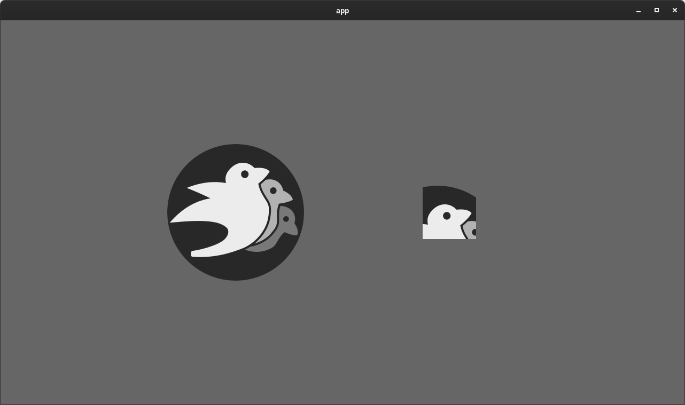

This is similar to how [`TextureAtlasSprite`] / "sprite sheets" work, but without the need to define a texture atlas.

[`Sprite`]: https://docs.rs/bevy/0.9.0/bevy/sprite/struct.Sprite.html
[`TextureAtlasSprite`]: https://docs.rs/bevy/0.9.0/bevy/sprite/struct.TextureAtlasSprite.html

## Plugin Settings

<div class="release-feature-authors">authors: @cart, @mockersf</div>

In past versions of Bevy, "immutable" Plugin settings were represented as normal ECS resources, which were read as part of plugin init. This presented a number of problems:

1. If a user inserted the plugin settings resource after the plugin was initialized, it would be silently ignored (and use the defaults instead)
2. Users could modify the plugin settings resource after the plugin had been initialized. This created a false sense of control over settings that could no longer be changed.

These were especially problematic and confusing for the `WindowDescriptor` resource, but it was a general problem.

To resolve this, in **Bevy 0.9** we moved plugin settings onto the plugins themselves, and created new apis for overriding the default settings:

```rust
app.add_plugins(DefaultPlugins
  .set(AssetPlugin {
    watch_for_changes: true,
    ..default()
  })
  .set(WindowPlugin {
    window: WindowDescriptor {
      width: 400.0,
      ..default()
    },
    ..default()
  })
)
```

This makes the connection between the settings and the plugin clear, and differentiates these "plugin init" settings from "runtime configurable" settings (which are still represented as ECS resources).

## Plugins Are Now Unique By Default

<div class="release-feature-authors">authors: @mockersf</div>

Plugins are now unique by default. Attempting to add a unique plugin to an app more than once will result in an error. Plugins that are not intended to be unique can override the default `is_unique` method:

```rust
impl Plugin for MyPlugin {
  fn build(&self, app: &mut App) {
    app.add_system(some_system);
  }

  fn is_unique(&self) -> bool {
    false
  }
}
```

## Task Pool: Nested Spawns on Scope

<div class="release-feature-authors">authors: @hymm</div>

Bevy's Task Pools now support "nested spawns on scopes":

```rust
let results = task_pool.scope(|scope| {
    scope.spawn(async move {
        scope.spawn(async move { 1 });
        2
    });
});

assert!(results.contains(&1));
assert!(results.contains(&2));
```

This enables adding new tasks to the task pool scope while performing other tasks! This was a requirement for implementing the newly merged (but not yet implemented) [Stageless RFC](https://github.com/bevyengine/rfcs/pull/45), but it enables new patterns for anyone spawning async tasks in Bevy!

## Task Pool Panic Handling

<div class="release-feature-authors">authors: @james7132</div>

Bevy uses its own custom async task pools to manage scheduling parallel, async tasks. In previous versions of Bevy, if a task panicked in one of these pools, it would be non-recoverable unless every scheduled task used `catch_unwind` (which isn't feasible). This would also permanently kill worker threads in the global task pools.

**Bevy 0.9** resolves this problem by calling `catch_unwind` inside the task pool executors.

## Hierarchy Query Methods

<div class="release-feature-authors">authors: @devil-ira</div>

To make navigating hierarchies easier, we've added some convenience methods to `Query<&Children>` and `Query<&Parent>`:

```rust
#[derive(Resource)]
struct SomeEntity(Entity);

fn system(children: Query<&Children>, some_entity: Res<SomeEntity>) {
  // iterate all descendents of some_entity 
  for entity in children.iter_descendants(some_entity.0) {
  }
}

fn other_system(parents: Query<&Parent>, some_entity: Res<SomeEntity>) {
  // iterate all ancestors of some_entity 
  for entity in parents.iter_ancestors(some_entity.0) {
  }
}
```

## Bevy UI: The Origin Is Now In The Top Left

<div class="release-feature-authors">authors: @mahulst</div>

Bevy UI now considers the "top left" of the window to be the "origin" and it extends "downward" (Y-down). To illustrate, consider the following cases where a widget spawned in the "default" location (at the origin).

### Top Left Origin (New)

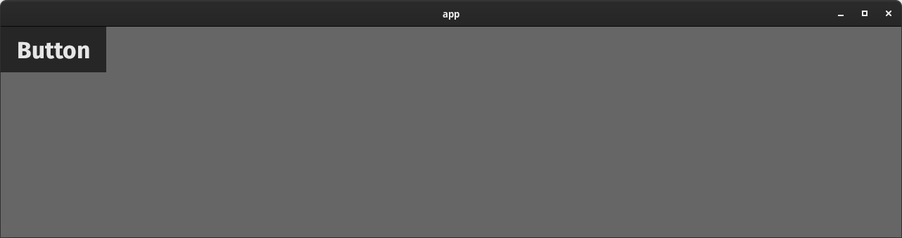

### Bottom Left Origin (Old)


We chose to make this change because pretty much the _entire_ UI ecosystem uses top left as the origin (Web, Godot, GTK, GPU images, etc).

In the early days when Bevy was still in its infancy, I (`@cart`) originally opted for bottom left (Y-up) for consistency with Bevy's world space 2D and 3D coordinate systems. In theory, I figured this would make everything easier to reason about. But in practice, it turns out this consistency won us nothing. And the behavior defied users' expectations when it came to UI default behaviors. UIs tend to extend downward (from the top), not upward (from the bottom), so overriding the defaults was common practice.

Fortunately, in **Bevy 0.9** we're now aligned with the rest of the ecosystem!

## Bevy UI: Z-Indices

<div class="release-feature-authors">authors: @oceantume</div>

Bevy UI elements now have more control over their "z index" (whether or not they are "in front" or "behind" each other). In past versions of Bevy, this was determined entirely by hierarchy: children stack on top of parents and earlier siblings. This is a nice "default" and works for a good portion of UIs, but some types of UI need more control over element ordering.

If you are a web developer and you have ever reached for the `z-index` css property, that is the problem we're discussing here.

**Bevy 0.9** adds a new [`ZIndex`] component, which is an enum with two modes:

* `ZIndex::Local(i32)`: Overrides the depth relative to its siblings.
* `ZIndex::Global(i32)`: Overrides the depth relative to the UI root. Setting this essentially allows UI elements to "escape" z-ordering relative to their parents and instead be ordered relative to the entire UI.

UI items with a higher z-level within the context (local vs global) will show up in front of UI items with a lower z-level. Ties within a z-level fall back to hierarchy order. "Later" children stack on top of "earlier" children.

To illustrate, consider the following UI:

```txt
root (green)
  child1 (red)
  child2 (blue)
```

By default these all have a z-index of 0. The root is at the bottom and each subsequent child stacks "on top":

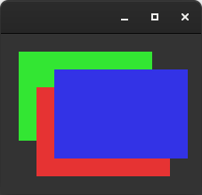

If we want the blue child to stack "behind" the earlier red child, we can set its z-index to a "local" value smaller than the default of 0:

```rust
blue.z_index = ZIndex::Local(-1);
```

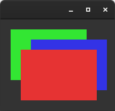

If we want the blue child to stack "behind" the green root, we can set its z-index to a "global" value smaller than the default of 0:

```rust
blue.z_index = ZIndex::Global(-1);
```

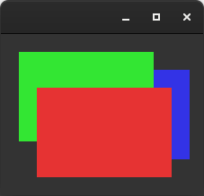

Very useful stuff!

[`ZIndex`]: https://docs.rs/bevy/0.9.0/bevy/ui/enum.ZIndex.html

## Bevy UI Scaling

<div class="release-feature-authors">authors: @Weibye</div>

Bevy UI's global "pixel scale" can now be set using the [`UiScale`] resource:

```rust
// Render UI pixel units 2x bigger
app.insert_resource(UiScale { scale: 2.0 })
```

This allows developers to expose arbitrary scale configuration to users in cases where that flexibility is beneficial.

<video controls loop><source  src="ui_scaling.mp4" type="video/mp4"/></video>

[`UiScale`]: https://docs.rs/bevy/0.9.0/bevy/ui/struct.UiScale.html

## Audio Playback Toggling

<div class="release-feature-authors">authors: @lovelymono</div>

It is now possible to toggle audio playback, which will flip between playing and pausing:

```rust
// Old, manual toggling (still possible)
if audio_sink.is_paused() {
    audio_sink.play();
} else {
    audio_sink.pause();
}

// New, automatic toggling
audio_sink.toggle();
```

## Time Scaling

<div class="release-feature-authors">authors: @maniwani</div>

The "global" time scale can now be configured on [`Time`], which scales the values common functions like `Time::delta_seconds()` return.

```rust
time.set_relative_speed(2.0);
```

In cases where unscaled values are required, you can use the new "raw" variants of these functions:

```rust
// The number of seconds elapsed since the last update, with time scaling taken into account.
let delta = time.delta_seconds();

// The number of seconds elapsed since the last update, with time scaling ignored.
let raw_delta = time.raw_delta_seconds();
```

<video controls loop><source  src="time_scale.mp4" type="video/mp4"/></video>

[`Time`]: https://docs.rs/bevy/0.9.0/bevy/time/struct.Time.html

## Time Wrapping

<div class="release-feature-authors">authors: @IceSentry</div>

Some scenarios, [such as shaders](/news/bevy-0-9/#time-shader-globals), need to represent elapsed time values as `f32`, which will suffer from precision issues pretty quickly. To resolve this, [`Time`] has been extended to support "time wrapping":

```rust
// Wrap once every hour
time.wrapping_period = Duration::from_secs(60 * 60):

// If one hour and 6 seconds have passed since the app started,
// this will return 6 seconds.
let wrapped = time.seconds_since_startup_wrapped_f32();
```

## What's Next?

Here are some of the things

* **High Level Post Processing Stack**: Now that we have the core post processing pipeline in place, we need to make a higher level system that makes it easier for users to select, configure, and re-order post processing effects on a per-camera basis. Additionally for performance reasons we want to combine as many post processing effects into a single pass as we can, so we need an opinionated set of post processing apis that facilitate this.
* **More Post Processing Effects**: More anti-aliasing options (TAA, SMAA), more tonemapping algorithm options (Ex: ACES), SSAO
* **Asset Preprocessing**: We will be investing heavily in our asset pipeline, with a focus on:
  1. Pre-processing assets to do expensive work "during development time", so Bevy Apps can be deployed with assets that are prettier, smaller, and/or faster to load.
  2. Enabling configuring assets with .meta files. For example, you could define a texture compression level, the filter it should use, or the target format.
* **Bevy UI Improvements**: We will continue improving Bevy UI's functionality and expanding its widget library, with a focus on enabling editor experiences.
* **More Scene Improvements**: Nested scenes, implicit defaults, and inline assets.
* **Bevy Editor**: We will start prototyping Bevy Editor experiences, starting with scene editor tooling.
* **Stageless ECS**: Now that the [Stageless RFC](https://github.com/bevyengine/rfcs/pull/45) is merged, we can start implementing stageless scheduling! See the RFC for an outline of the improvements coming. This will be a game changer!

We're also looking for experts in some key areas. Most of our current devs are focused on the efforts above, so if you have interest and experience in the following areas, we would love to hear from you!

* **Animation**: Animation blending, procedural animation, and higher level animation systems. Check out the issues labeled [`A-Animation`](https://github.com/bevyengine/bevy/labels/A-Animation) on GitHub and introduce yourself on the [`#animation-dev`](https://discord.com/channels/691052431525675048/774027865020039209) channel of our Discord.
* **Audio**: We need more control over audio playback, especially when it comes to layering effects. Check out the issues labeled [`A-Audio`](https://github.com/bevyengine/bevy/labels/A-Audio) on GitHub and introduce yourself on the [`#audio-dev`](https://discord.com/channels/691052431525675048/749430447326625812) channel of our Discord.

## Support Bevy

Sponsorships help make our work on Bevy sustainable. If you believe in Bevy's mission, consider sponsoring us ... every bit helps!

* **[Carter Anderson (@cart)](https://github.com/sponsors/cart)**: Full-time lead developer, project manager, and creator of Bevy. Focused on building out core engine systems, guiding project direction, and managing the community.
* **[Alice Cecile (@alice-i-cecile)](https://github.com/sponsors/alice-i-cecile)**: Technical project manager, mad scientist, and documentation lead. While she regularly leads expeditions into new domains, ECS will always be home base.
* **[François Mockers (@mockersf)](https://github.com/sponsors/mockersf)**: CI whisperer. Making sure everything is running smoothly and improving Bevy one PR at a time.
* **Rob Swain (@superdump)**: Wielder of light. Turning data into shiny with massive parallelism. Currently hobby hacking so please donate to/sponsor the rest of the team. ❤️

## Contributors

A huge thanks to the **159 contributors** that made this release (and associated docs) possible! In random order:

* @Edwox
* @targrub
* @fvacek
* @xtr3m3nerd
* @timokoesters
* @Suficio
* @Sergi-Ferrez
* @hymm
* @MrGVSV
* @SleepySwords
* @nicopap
* @Vrixyz
* @McSpidey
* @VitalyAnkh
* @ramirezmike
* @jiftoo
* @TheNeikos
* @ManevilleF
* @KDecay
* @Zearin
* @marlyx
* @StarArawn
* @Ixentus
* @hmeine
* @emersonmx
* @gilescope
* @inodentry
* @robtfm
* @yrns
* @Lucidus115
* @kurtkuehnert
* @zmarlon
* @leereilly
* @galkowskit
* @DGriffin91
* @Ptrskay3
* @strattonbrazil
* @Pand9
* @PROMETHIA-27
* @zicklag
* @lewiszlw
* @contagnas
* @EMachad0
* @SpecificProtagonist
* @BoxyUwU
* @jkb0o
* @xgbwei
* @andresovela
* @0x182d4454fb211940
* @TehPers
* @pcone
* @CleanCut
* @makspll
* @64kramsystem
* @Wandalen
* @coreh
* @Fracey
* @Azervu
* @SyamaMishra
* @BeastLe9enD
* @Weibye
* @Pietrek14
* @NiklasEi
* @TheRawMeatball
* @jgoday
* @7flash
* @light4
* @Ian-Yy
* @Carter0
* @slyedoc
* @devil-ira
* @MDeiml
* @NathanSWard
* @robem
* @Bleb1k
* @bzm3r
* @anchpop
* @aevyrie
* @amiani
* @x3ro
* @NoahShomette
* @bjorn3
* @djeedai
* @bwhitt7
* @oceantume
* @micron-mushroom
* @JMS55
* @asherkin
* @afonsolage
* @shuoli84
* @harudagondi
* @Demiu
* @TimJentzsch
* @gak
* @dataphract
* @raffimolero
* @Moulberry
* @james7132
* @torsteingrindvik
* @jakobhellermann
* @hakolao
* @themasch
* @CatThingy
* @Metadorius
* @merelymyself
* @SludgePhD
* @CGMossa
* @sullyj3
* @ian-h-chamberlain
* @lain-dono
* @mwcz
* @thebluefish
* @manokara
* @mirkoRainer
* @hankjordan
* @cryscan
* @WaffleLapkin
* @mahulst
* @AlexOkafor
* @Davier
* @jwagner
* @CAD97
* @alice-i-cecile
* @james-j-obrien
* @rparrett
* @tguichaoua
* @YohDeadfall
* @msvbg
* @komadori
* @maniwani
* @Shatur
* @LarsDu
* @DJMcNab
* @JoJoJet
* @polarvoid
* @KirmesBude
* @Aceeri
* @ottah
* @IceSentry
* @Piturnah
* @lovelymono
* @maxwellodri
* @oledfish
* @BorisBoutillier
* @mockersf
* @Nilirad
* @elbertronnie
* @maccesch
* @vertesians
* @superdump
* @wanderrful
* @Neo-Zhixing
* @rustui
* @cart
* @JohnTheCoolingFan
* @pascualex
* @fishykins
* @Carlrs
* @leath-dub

## Full Change Log

### Added

* [Bloom][6397]
* [Add FXAA postprocessing][6393]
* [Fix color banding by dithering image before quantization][5264]
* [Plugins own their settings. Rework PluginGroup trait.][6336]
* [Add global time scaling][5752]
* [add globals to mesh view bind group][5409]
* [Add UI scaling][5814]
* [Add FromReflect for Timer][6422]
* [Re-add local bool `has_received_time` in `time_system`][6357]
* [Add default implementation of Serialize and Deserialize to Timer and Stopwatch][6248]
* [add time wrapping to Time][5982]
* [Stopwatch elapsed secs f64][5978]
* [Remaining fn in Timer][5971]
* [Support array / cubemap / cubemap array textures in KTX2][5325]
* [Add methods for silencing system-order ambiguity warnings][6158]
* [bevy_dynamic_plugin: make it possible to handle loading errors][6437]
* [can get the settings of a plugin from the app][6372]
* [Use plugin setup for resource only used at setup time][6360]
* [Add `TimeUpdateStrategy` resource for manual `Time` updating][6159]
* [dynamic scene builder][6227]
* [Create a scene from a dynamic scene][6229]
* [Scene example: write file in a task][5952]
* [Add writing of scene data to Scene example][5949]
* [can clone a scene][5855]
* [Add "end of main pass post processing" render graph node][6468]
* [Add `Camera::viewport_to_world`][6126]
* [Sprite: allow using a sub-region (Rect) of the image][6014]
* [Add missing type registrations for bevy_math types][5758]
* [Add `serialize` feature to `bevy_core`][6423]
* [add serialize feature to bevy_transform][6379]
* [Add associated constant `IDENTITY` to `Transform` and friends.][5340]
* [bevy_reflect: Add `Reflect::into_reflect`][6502]
* [Add reflect_owned][6494]
* [`Reflect` for `Tonemapping` and `ClusterConfig`][6488]
* [add `ReflectDefault` to std types][6429]
* [Add FromReflect for Visibility][6410]
* [Register `RenderLayers` type in `CameraPlugin`][6308]
* [Enable Constructing ReflectComponent/Resource][6257]
* [Support multiple `#[reflect]`/`#[reflect_value]` + improve error messages][6237]
* [Reflect Default for GlobalTransform][6200]
* [Impl Reflect for PathBuf and OsString][6193]
* [Reflect Default for `ComputedVisibility` and `Handle<T>`][6187]
* [Register `Wireframe` type][6152]
* [Derive `FromReflect` for `Transform` and `GlobalTransform`][6015]
* [Make arrays behave like lists in reflection][5987]
* [Implement `Debug` for dynamic types][5948]
* [Implemented `Reflect` for all the ranges][5806]
* [Add `pop` method for `List` trait.][5797]
* [bevy_reflect: `GetTypeRegistration` for `SmallVec<T>`][5782]
* [register missing reflect types][5747]
* [bevy_reflect: Get owned fields][5728]
* [bevy_reflect: Add `FromReflect` to the prelude][5720]
* [implement `Reflect` for `Input<T>`, some misc improvements to reflect value derive][5676]
* [register `Cow<'static, str>` for reflection][5664]
* [bevy_reflect: Relax bounds on `Option<T>`][5658]
* [remove `ReflectMut` in favor of `Mut<dyn Reflect>`][5630]
* [add some info from `ReflectPathError` to the error messages][5626]
* [Added reflect/from reflect impls for NonZero integer types][5556]
* [bevy_reflect: Update enum derives][5473]
* [Add `reflect(skip_serializing)` which retains reflection but disables automatic serialization][5250]
* [bevy_reflect: Reflect enums][4761]
* [Disabling default features support in bevy_ecs, bevy_reflect and bevy][5993]
* [expose window alpha mode][6331]
* [Make bevy_window and bevy_input events serializable][6180]
* [Add window resizing example][5813]
* [feat: add GamepadInfo, expose gamepad names][6342]
* [Derive `Reflect` + `FromReflect` for input types][6232]
* [Make TouchInput and ForceTouch serializable][6191]
* [Add a Gamepad Viewer tool to examples][6074]
* [Derived `Copy` trait for `bevy_input` events, `Serialize`/`Deserialize` for events in `bevy_input` and `bevy_windows`, `PartialEq` for events in both, and `Eq` where possible in both.][6023]
* [Support for additional gamepad buttons and axis][5853]
* [Added keyboard scan input event][5495]
* [Add `set_parent` and `remove_parent` to `EntityCommands`][6189]
* [Add methods to `Query<&Children>` and `Query<&Parent>` to iterate over descendants and ancestors][6185]
* [Add `is_finished` to `Task<T>`][6444]
* [Expose mint feature in bevy_math/glam][5857]
* [Utility methods for Val][6134]
* [Register missing bevy_text types][6029]
* [Add additional constructors for `UiRect` to specify values for specific fields][5988]
* [Add AUTO and UNDEFINED const constructors for `Size`][5761]
* [Add Exponential Moving Average into diagnostics][4992]
* [Add `send_event` and friends to `WorldCell`][6515]
* [Add a method for accessing the width of a `Table`][6249]
* [Add iter_entities to World #6228][6242]
* [Adding Debug implementations for App, Stage, Schedule, Query, QueryState, etc.][6214]
* [Add a method for mapping `Mut<T>` -> `Mut<U>`][6199]
* [implemented #[bundle(ignore)]][6123]
* [Allow access to non-send resource through `World::resource_scope`][6113]
* [Add get_entity to Commands][5854]
* [Added the ability to get or set the last change tick of a system.][5838]
* [Add a module for common system `chain`/`pipe` adapters][5776]
* [SystemParam for the name of the system you are currently in][5731]
* [Warning message for missing events][5730]
* [Add a change detection bypass and manual control over change ticks][5635]
* [Add into_world_mut to EntityMut][5586]
* [Add `FromWorld` bound to `T` in `Local<T>`][5481]
* [Add `From<EntityMut>` for EntityRef (fixes #5459)][5461]
* [Implement IntoIterator for ECS wrapper types.][5096]
* [add `Res::clone`][4109]
* [Add CameraRenderGraph::set][6470]
* [Use wgsl saturate][6318]
* [Add mutating `toggle` method to `Visibility` component][6268]
* [Add globals struct to mesh2d][6222]
* [add support for .comp glsl shaders][6084]
* [Implement `IntoIterator` for `&Extract<P>`][6025]
* [add Debug, Copy, Clone derives to Circle][6009]
* [Add TextureFormat::Rg16Unorm support for Image and derive Resource for SpecializedComputePipelines][5991]
* [Add `bevy_render::texture::ImageSettings` to prelude][5566]
* [Add `Projection` component to prelude.][5557]
* [Expose `Image` conversion functions (fixes #5452)][5527]
* [Macro for Loading Internal Binary Assets][6478]
* [Add `From<String>` for `AssetPath<'a>`][6337]
* [Add Eq & PartialEq to AssetPath][6274]
* [add `ReflectAsset` and `ReflectHandle`][5923]
* [Add warning when using load_folder on web][5827]
* [Expose rodio's Source and Sample traits in bevy_audio][6374]
* [Add a way to toggle `AudioSink`][6321]

### Changed

* [separate tonemapping and upscaling passes][3425]
* [Rework ViewTarget to better support post processing][6415]
* [bevy_reflect: Improve serialization format even more][5723]
* [bevy_reflect: Binary formats][6140]
* [Unique plugins][6411]
* [Support arbitrary RenderTarget texture formats][6380]
* [Make `Resource` trait opt-in, requiring `#[derive(Resource)]` V2][5577]
* [Replace `WorldQueryGats` trait with actual gats][6319]
* [Change UI coordinate system to have origin at top left corner][6000]
* [Move the cursor's origin back to the bottom-left][6533]
* [Add z-index support with a predictable UI stack][5877]
* [TaskPool Panic Handling][6443]
* [Implement `Bundle` for `Component`. Use `Bundle` tuples for insertion][2975]
* [Spawn now takes a Bundle][6054]
* [make `WorldQuery` very flat][5205]
* [Accept Bundles for insert and remove. Deprecate insert/remove_bundle][6039]
* [Exclusive Systems Now Implement `System`. Flexible Exclusive System Params][6083]
* [bevy_scene: Serialize entities to map][6416]
* [bevy_scene: Stabilize entity order in `DynamicSceneBuilder`][6382]
* [bevy_scene: Replace root list with struct][6354]
* [bevy_scene: Use map for scene `components`][6345]
* [Start running systems while prepare_systems is running][4919]
* [Extract Resources into their own dedicated storage][4809]
* [get proper texture format after the renderer is initialized, fix #3897][5413]
* [Add getters and setters for `InputAxis` and `ButtonSettings`][6088]
* [Clean up Fetch code][4800]
* [Nested spawns on scope][4466]
* [Skip empty archetypes and tables when iterating over queries][4724]
* [Increase the `MAX_DIRECTIONAL_LIGHTS` from 1 to 10][6066]
* [bevy_pbr: Normalize skinned normals][6543]
* [remove mandatory mesh attributes][6127]
* [Rename `play` to `start` and add new `play` method that won't overwrite the existing animation if it's already playing][6350]
* [Replace the `bool` argument of `Timer` with `TimerMode`][6247]
* [improve panic messages for add_system_to_stage and add_system_set_to_stage][5847]
* [Use default serde impls for Entity][6194]
* [scenes: simplify return type of iter_instance_entities][5994]
* [Consistently use `PI` to specify angles in examples.][5825]
* [Remove `Transform::apply_non_uniform_scale`][6133]
* [Rename `Transform::mul_vec3` to `transform_point` and improve docs][6132]
* [make `register` on `TypeRegistry` idempotent][6487]
* [do not set cursor grab on window creation if not asked for][6381]
* [Make `raw_window_handle` field in `Window` and `ExtractedWindow` an `Option`.][6114]
* [Support monitor selection for all window modes.][5878]
* [`Gamepad` type is `Copy`; do not require / return references to it in `Gamepads` API][5296]
* [Update tracing-chrome to 0.6.0][6398]
* [Update to ron 0.8][5864]
* [Update clap requirement from 3.2 to 4.0][6303]
* [Update glam 0.22, hexasphere 8.0, encase 0.4][6427]
* [Update `wgpu` to 0.14.0, `naga` to `0.10.0`, `winit` to 0.27.4, `raw-window-handle` to 0.5.0, `ndk` to 0.7][6218]
* [Update to notify 5.0 stable][5865]
* [Update rodio requirement from 0.15 to 0.16][6020]
* [remove copyless][6100]
* [Mark `Task` as `#[must_use]`][6068]
* [Swap out num_cpus for std::thread::available_parallelism][4970]
* [Cleaning up NodeBundle, and some slight UI module re-organization][6473]
* [Make the default background color of `NodeBundle` transparent][6211]
* [Rename `UiColor`  to `BackgroundColor`][6087]
* [changed diagnostics from seconds to milliseconds][5554]
* [Remove unnecesary branches/panics from Query accesses][6461]
* [`debug_checked_unwrap` should track its caller][6452]
* [Speed up `Query::get_many` and add benchmarks][6400]
* [Rename system chaining to system piping][6230]
* [[Fixes #6059] ``Entity``'s “ID” should be named “index” instead][6107]
* [`Query` filter types must be `ReadOnlyWorldQuery`][6008]
* [Remove ambiguity sets][5916]
* [relax `Sized` bounds around change detection types][5917]
* [Remove ExactSizeIterator from QueryCombinationIter][5895]
* [Remove Sync bound from Command][5871]
* [Make most `Entity` methods `const`][5688]
* [Remove `insert_resource_with_id`][5608]
* [Avoid making `Fetch`s `Clone`][5593]
* [Remove `Sync` bound from `Local`][5483]
* [Replace `many_for_each_mut` with `iter_many_mut`.][5402]
* [bevy_ecs: Use 32-bit entity ID cursor on platforms without AtomicI64][4452]
* [Specialize UI pipeline on "hdr-ness"][6459]
* [Allow passing `glam` vector types as vertex attributes][6442]
* [Add multi draw indirect draw calls][6392]
* [Take DirectionalLight's GlobalTransform into account when calculating shadow map volume (not just direction)][6384]
* [Respect mipmap_filter when create ImageDescriptor with linear()/nearest()][6349]
* [use bevy default texture format if the surface is not yet available][6233]
* [log pipeline cache errors earlier][6115]
* [Merge TextureAtlas::from_grid_with_padding into TextureAtlas::from_grid through option arguments][6057]
* [Reconfigure surface on present mode change][6049]
* [Use 3 bits of PipelineKey to store MSAA sample count][5826]
* [Limit FontAtlasSets][5708]
* [Move `sprite::Rect` into `bevy_math`][5686]
* [Make vertex colors work without textures in bevy_sprite][5685]
* [use bevy_default() for texture format in post_processing][5601]
* [don't render completely transparent UI nodes][5537]
* [make TextLayoutInfo a Component][4460]
* [make `Handle::<T>` field id private, and replace with a getter][6176]
* [Remove `AssetServer::watch_for_changes()`][5968]
* [Rename Handle::as_weak() to cast_weak()][5321]
* [Remove `Sync` requirement in `Decodable::Decoder`][5819]

### Fixed

* [Optimize rendering slow-down at high entity counts][5509]
* [bevy_reflect: Fix `DynamicScene` not respecting component registrations during serialization][6288]
* [fixes the types for Vec3 and Quat in scene example to remove WARN from the logs][5751]
* [Fix end-of-animation index OOB][6210]
* [bevy_reflect: Remove unnecessary `Clone` bounds][5783]
* [bevy_reflect: Fix `apply` method for `Option<T>`][5780]
* [Fix outdated and badly formatted docs for `WindowDescriptor::transparent`][6329]
* [disable window pre creation for ios][5883]
* [Remove unnecessary unsafe `Send` and `Sync` impl for `WinitWindows` on wasm.][5863]
* [Fix window centering when scale_factor is not 1.0][5582]
* [fix order of exit/close window systems][5558]
* [bevy_input: Fix process touch event][4352]
* [fix: explicitly specify required version of async-task][6509]
* [Fix `clippy::iter_with_drain`][6485]
* [Use `cbrt()` instead of `powf(1./3.)`][6481]
* [Fix `RemoveChildren` command][6192]
* [Fix inconsistent children removal behavior][6017]
* [tick local executor][6121]
* [Fix panic when the primary window is closed][6545]
* [UI scaling fix][6479]
* [Fix clipping in UI][6351]
* [Fixes scroll example after inverting UI Y axis][6290]
* [Fixes incorrect glyph positioning for text2d][6273]
* [Clean up taffy nodes when UI node entities are removed][5886]
* [Fix unsound `EntityMut::remove_children`. Add `EntityMut::world_scope`][6464]
* [Fix spawning empty bundles][6425]
* [Fix query.to_readonly().get_component_mut() soundness bug][6401]
* [#5817: derive_bundle macro is not hygienic][5835]
* [drop old value in `insert_resource_by_id` if exists][5587]
* [Fix lifetime bound on `From` impl for `NonSendMut` -> `Mut`][5560]
* [Fix `mesh.wgsl` error for meshes without normals][6439]
* [Fix panic when using globals uniform in wasm builds][6460]
* [Resolve most remaining execution-order ambiguities][6341]
* [Call `mesh2d_tangent_local_to_world` with the right arguments][6209]
* [Fixes Camera not being serializable due to missing registrations in core functionality.][6170]
* [fix spot dir nan bug][6167]
* [use alpha mask even when unlit][6047]
* [Ignore `Timeout` errors on Linux AMD & Intel][5957]
* [adjust cluster index for viewport origin][5947]
* [update camera projection if viewport changed][5945]
* [Ensure 2D phase items are sorted before batching][5942]
* [bevy_pbr: Fix incorrect and unnecessary normal-mapping code][5766]
* [Add explicit ordering between `update_frusta` and `camera_system`][5757]
* [bevy_pbr: Fix tangent and normal normalization][5666]
* [Fix shader syntax][5613]
* [Correctly use as_hsla_f32 in `Add<Color>` and `AddAssign<Color>`, fixes #5543][5546]
* [Sync up bevy_sprite and bevy_ui shader View struct][5531]
* [Fix View by adding missing fields present in ViewUniform][5512]
* [Freeing memory held by visible entities vector][3009]
* [Correctly parse labels with '#'][5729]

[6545]: https://github.com/bevyengine/bevy/pull/6545
[6543]: https://github.com/bevyengine/bevy/pull/6543
[6533]: https://github.com/bevyengine/bevy/pull/6533
[6515]: https://github.com/bevyengine/bevy/pull/6515
[6509]: https://github.com/bevyengine/bevy/pull/6509
[6502]: https://github.com/bevyengine/bevy/pull/6502
[6494]: https://github.com/bevyengine/bevy/pull/6494
[6488]: https://github.com/bevyengine/bevy/pull/6488
[6487]: https://github.com/bevyengine/bevy/pull/6487
[6485]: https://github.com/bevyengine/bevy/pull/6485
[6481]: https://github.com/bevyengine/bevy/pull/6481
[6479]: https://github.com/bevyengine/bevy/pull/6479
[6478]: https://github.com/bevyengine/bevy/pull/6478
[6473]: https://github.com/bevyengine/bevy/pull/6473
[6470]: https://github.com/bevyengine/bevy/pull/6470
[6468]: https://github.com/bevyengine/bevy/pull/6468
[6464]: https://github.com/bevyengine/bevy/pull/6464
[6461]: https://github.com/bevyengine/bevy/pull/6461
[6460]: https://github.com/bevyengine/bevy/pull/6460
[6459]: https://github.com/bevyengine/bevy/pull/6459
[6452]: https://github.com/bevyengine/bevy/pull/6452
[6444]: https://github.com/bevyengine/bevy/pull/6444
[6443]: https://github.com/bevyengine/bevy/pull/6443
[6442]: https://github.com/bevyengine/bevy/pull/6442
[6439]: https://github.com/bevyengine/bevy/pull/6439
[6437]: https://github.com/bevyengine/bevy/pull/6437
[6429]: https://github.com/bevyengine/bevy/pull/6429
[6427]: https://github.com/bevyengine/bevy/pull/6427
[6425]: https://github.com/bevyengine/bevy/pull/6425
[6423]: https://github.com/bevyengine/bevy/pull/6423
[6422]: https://github.com/bevyengine/bevy/pull/6422
[6416]: https://github.com/bevyengine/bevy/pull/6416
[6415]: https://github.com/bevyengine/bevy/pull/6415
[6411]: https://github.com/bevyengine/bevy/pull/6411
[6410]: https://github.com/bevyengine/bevy/pull/6410
[6401]: https://github.com/bevyengine/bevy/pull/6401
[6400]: https://github.com/bevyengine/bevy/pull/6400
[6398]: https://github.com/bevyengine/bevy/pull/6398
[6397]: https://github.com/bevyengine/bevy/pull/6397
[6393]: https://github.com/bevyengine/bevy/pull/6393
[6392]: https://github.com/bevyengine/bevy/pull/6392
[6384]: https://github.com/bevyengine/bevy/pull/6384
[6382]: https://github.com/bevyengine/bevy/pull/6382
[6381]: https://github.com/bevyengine/bevy/pull/6381
[6380]: https://github.com/bevyengine/bevy/pull/6380
[6379]: https://github.com/bevyengine/bevy/pull/6379
[6374]: https://github.com/bevyengine/bevy/pull/6374
[6372]: https://github.com/bevyengine/bevy/pull/6372
[6360]: https://github.com/bevyengine/bevy/pull/6360
[6357]: https://github.com/bevyengine/bevy/pull/6357
[6354]: https://github.com/bevyengine/bevy/pull/6354
[6351]: https://github.com/bevyengine/bevy/pull/6351
[6350]: https://github.com/bevyengine/bevy/pull/6350
[6349]: https://github.com/bevyengine/bevy/pull/6349
[6345]: https://github.com/bevyengine/bevy/pull/6345
[6342]: https://github.com/bevyengine/bevy/pull/6342
[6341]: https://github.com/bevyengine/bevy/pull/6341
[6337]: https://github.com/bevyengine/bevy/pull/6337
[6336]: https://github.com/bevyengine/bevy/pull/6336
[6331]: https://github.com/bevyengine/bevy/pull/6331
[6329]: https://github.com/bevyengine/bevy/pull/6329
[6321]: https://github.com/bevyengine/bevy/pull/6321
[6319]: https://github.com/bevyengine/bevy/pull/6319
[6318]: https://github.com/bevyengine/bevy/pull/6318
[6308]: https://github.com/bevyengine/bevy/pull/6308
[6303]: https://github.com/bevyengine/bevy/pull/6303
[6290]: https://github.com/bevyengine/bevy/pull/6290
[6288]: https://github.com/bevyengine/bevy/pull/6288
[6274]: https://github.com/bevyengine/bevy/pull/6274
[6273]: https://github.com/bevyengine/bevy/pull/6273
[6268]: https://github.com/bevyengine/bevy/pull/6268
[6257]: https://github.com/bevyengine/bevy/pull/6257
[6249]: https://github.com/bevyengine/bevy/pull/6249
[6248]: https://github.com/bevyengine/bevy/pull/6248
[6247]: https://github.com/bevyengine/bevy/pull/6247
[6242]: https://github.com/bevyengine/bevy/pull/6242
[6237]: https://github.com/bevyengine/bevy/pull/6237
[6233]: https://github.com/bevyengine/bevy/pull/6233
[6232]: https://github.com/bevyengine/bevy/pull/6232
[6230]: https://github.com/bevyengine/bevy/pull/6230
[6229]: https://github.com/bevyengine/bevy/pull/6229
[6227]: https://github.com/bevyengine/bevy/pull/6227
[6222]: https://github.com/bevyengine/bevy/pull/6222
[6218]: https://github.com/bevyengine/bevy/pull/6218
[6214]: https://github.com/bevyengine/bevy/pull/6214
[6211]: https://github.com/bevyengine/bevy/pull/6211
[6210]: https://github.com/bevyengine/bevy/pull/6210
[6209]: https://github.com/bevyengine/bevy/pull/6209
[6200]: https://github.com/bevyengine/bevy/pull/6200
[6199]: https://github.com/bevyengine/bevy/pull/6199
[6194]: https://github.com/bevyengine/bevy/pull/6194
[6193]: https://github.com/bevyengine/bevy/pull/6193
[6192]: https://github.com/bevyengine/bevy/pull/6192
[6191]: https://github.com/bevyengine/bevy/pull/6191
[6189]: https://github.com/bevyengine/bevy/pull/6189
[6187]: https://github.com/bevyengine/bevy/pull/6187
[6185]: https://github.com/bevyengine/bevy/pull/6185
[6180]: https://github.com/bevyengine/bevy/pull/6180
[6176]: https://github.com/bevyengine/bevy/pull/6176
[6170]: https://github.com/bevyengine/bevy/pull/6170
[6167]: https://github.com/bevyengine/bevy/pull/6167
[6159]: https://github.com/bevyengine/bevy/pull/6159
[6158]: https://github.com/bevyengine/bevy/pull/6158
[6152]: https://github.com/bevyengine/bevy/pull/6152
[6140]: https://github.com/bevyengine/bevy/pull/6140
[6134]: https://github.com/bevyengine/bevy/pull/6134
[6133]: https://github.com/bevyengine/bevy/pull/6133
[6132]: https://github.com/bevyengine/bevy/pull/6132
[6127]: https://github.com/bevyengine/bevy/pull/6127
[6126]: https://github.com/bevyengine/bevy/pull/6126
[6123]: https://github.com/bevyengine/bevy/pull/6123
[6121]: https://github.com/bevyengine/bevy/pull/6121
[6115]: https://github.com/bevyengine/bevy/pull/6115
[6114]: https://github.com/bevyengine/bevy/pull/6114
[6113]: https://github.com/bevyengine/bevy/pull/6113
[6107]: https://github.com/bevyengine/bevy/pull/6107
[6100]: https://github.com/bevyengine/bevy/pull/6100
[6088]: https://github.com/bevyengine/bevy/pull/6088
[6087]: https://github.com/bevyengine/bevy/pull/6087
[6084]: https://github.com/bevyengine/bevy/pull/6084
[6083]: https://github.com/bevyengine/bevy/pull/6083
[6074]: https://github.com/bevyengine/bevy/pull/6074
[6068]: https://github.com/bevyengine/bevy/pull/6068
[6066]: https://github.com/bevyengine/bevy/pull/6066
[6057]: https://github.com/bevyengine/bevy/pull/6057
[6054]: https://github.com/bevyengine/bevy/pull/6054
[6049]: https://github.com/bevyengine/bevy/pull/6049
[6047]: https://github.com/bevyengine/bevy/pull/6047
[6039]: https://github.com/bevyengine/bevy/pull/6039
[6029]: https://github.com/bevyengine/bevy/pull/6029
[6025]: https://github.com/bevyengine/bevy/pull/6025
[6023]: https://github.com/bevyengine/bevy/pull/6023
[6020]: https://github.com/bevyengine/bevy/pull/6020
[6017]: https://github.com/bevyengine/bevy/pull/6017
[6015]: https://github.com/bevyengine/bevy/pull/6015
[6014]: https://github.com/bevyengine/bevy/pull/6014
[6009]: https://github.com/bevyengine/bevy/pull/6009
[6008]: https://github.com/bevyengine/bevy/pull/6008
[6000]: https://github.com/bevyengine/bevy/pull/6000
[5994]: https://github.com/bevyengine/bevy/pull/5994
[5993]: https://github.com/bevyengine/bevy/pull/5993
[5991]: https://github.com/bevyengine/bevy/pull/5991
[5988]: https://github.com/bevyengine/bevy/pull/5988
[5987]: https://github.com/bevyengine/bevy/pull/5987
[5982]: https://github.com/bevyengine/bevy/pull/5982
[5978]: https://github.com/bevyengine/bevy/pull/5978
[5971]: https://github.com/bevyengine/bevy/pull/5971
[5968]: https://github.com/bevyengine/bevy/pull/5968
[5957]: https://github.com/bevyengine/bevy/pull/5957
[5952]: https://github.com/bevyengine/bevy/pull/5952
[5949]: https://github.com/bevyengine/bevy/pull/5949
[5948]: https://github.com/bevyengine/bevy/pull/5948
[5947]: https://github.com/bevyengine/bevy/pull/5947
[5945]: https://github.com/bevyengine/bevy/pull/5945
[5942]: https://github.com/bevyengine/bevy/pull/5942
[5923]: https://github.com/bevyengine/bevy/pull/5923
[5917]: https://github.com/bevyengine/bevy/pull/5917
[5916]: https://github.com/bevyengine/bevy/pull/5916
[5895]: https://github.com/bevyengine/bevy/pull/5895
[5886]: https://github.com/bevyengine/bevy/pull/5886
[5883]: https://github.com/bevyengine/bevy/pull/5883
[5878]: https://github.com/bevyengine/bevy/pull/5878
[5877]: https://github.com/bevyengine/bevy/pull/5877
[5871]: https://github.com/bevyengine/bevy/pull/5871
[5865]: https://github.com/bevyengine/bevy/pull/5865
[5864]: https://github.com/bevyengine/bevy/pull/5864
[5863]: https://github.com/bevyengine/bevy/pull/5863
[5857]: https://github.com/bevyengine/bevy/pull/5857
[5855]: https://github.com/bevyengine/bevy/pull/5855
[5854]: https://github.com/bevyengine/bevy/pull/5854
[5853]: https://github.com/bevyengine/bevy/pull/5853
[5847]: https://github.com/bevyengine/bevy/pull/5847
[5838]: https://github.com/bevyengine/bevy/pull/5838
[5835]: https://github.com/bevyengine/bevy/pull/5835
[5827]: https://github.com/bevyengine/bevy/pull/5827
[5826]: https://github.com/bevyengine/bevy/pull/5826
[5825]: https://github.com/bevyengine/bevy/pull/5825
[5819]: https://github.com/bevyengine/bevy/pull/5819
[5814]: https://github.com/bevyengine/bevy/pull/5814
[5813]: https://github.com/bevyengine/bevy/pull/5813
[5806]: https://github.com/bevyengine/bevy/pull/5806
[5797]: https://github.com/bevyengine/bevy/pull/5797
[5783]: https://github.com/bevyengine/bevy/pull/5783
[5782]: https://github.com/bevyengine/bevy/pull/5782
[5780]: https://github.com/bevyengine/bevy/pull/5780
[5776]: https://github.com/bevyengine/bevy/pull/5776
[5766]: https://github.com/bevyengine/bevy/pull/5766
[5761]: https://github.com/bevyengine/bevy/pull/5761
[5758]: https://github.com/bevyengine/bevy/pull/5758
[5757]: https://github.com/bevyengine/bevy/pull/5757
[5752]: https://github.com/bevyengine/bevy/pull/5752
[5751]: https://github.com/bevyengine/bevy/pull/5751
[5747]: https://github.com/bevyengine/bevy/pull/5747
[5731]: https://github.com/bevyengine/bevy/pull/5731
[5730]: https://github.com/bevyengine/bevy/pull/5730
[5729]: https://github.com/bevyengine/bevy/pull/5729
[5728]: https://github.com/bevyengine/bevy/pull/5728
[5723]: https://github.com/bevyengine/bevy/pull/5723
[5720]: https://github.com/bevyengine/bevy/pull/5720
[5708]: https://github.com/bevyengine/bevy/pull/5708
[5688]: https://github.com/bevyengine/bevy/pull/5688
[5686]: https://github.com/bevyengine/bevy/pull/5686
[5685]: https://github.com/bevyengine/bevy/pull/5685
[5676]: https://github.com/bevyengine/bevy/pull/5676
[5666]: https://github.com/bevyengine/bevy/pull/5666
[5664]: https://github.com/bevyengine/bevy/pull/5664
[5658]: https://github.com/bevyengine/bevy/pull/5658
[5635]: https://github.com/bevyengine/bevy/pull/5635
[5630]: https://github.com/bevyengine/bevy/pull/5630
[5626]: https://github.com/bevyengine/bevy/pull/5626
[5613]: https://github.com/bevyengine/bevy/pull/5613
[5608]: https://github.com/bevyengine/bevy/pull/5608
[5601]: https://github.com/bevyengine/bevy/pull/5601
[5593]: https://github.com/bevyengine/bevy/pull/5593
[5587]: https://github.com/bevyengine/bevy/pull/5587
[5586]: https://github.com/bevyengine/bevy/pull/5586
[5582]: https://github.com/bevyengine/bevy/pull/5582
[5577]: https://github.com/bevyengine/bevy/pull/5577
[5566]: https://github.com/bevyengine/bevy/pull/5566
[5560]: https://github.com/bevyengine/bevy/pull/5560
[5558]: https://github.com/bevyengine/bevy/pull/5558
[5557]: https://github.com/bevyengine/bevy/pull/5557
[5556]: https://github.com/bevyengine/bevy/pull/5556
[5554]: https://github.com/bevyengine/bevy/pull/5554
[5546]: https://github.com/bevyengine/bevy/pull/5546
[5537]: https://github.com/bevyengine/bevy/pull/5537
[5531]: https://github.com/bevyengine/bevy/pull/5531
[5527]: https://github.com/bevyengine/bevy/pull/5527
[5512]: https://github.com/bevyengine/bevy/pull/5512
[5509]: https://github.com/bevyengine/bevy/pull/5509
[5495]: https://github.com/bevyengine/bevy/pull/5495
[5483]: https://github.com/bevyengine/bevy/pull/5483
[5481]: https://github.com/bevyengine/bevy/pull/5481
[5473]: https://github.com/bevyengine/bevy/pull/5473
[5461]: https://github.com/bevyengine/bevy/pull/5461
[5413]: https://github.com/bevyengine/bevy/pull/5413
[5409]: https://github.com/bevyengine/bevy/pull/5409
[5402]: https://github.com/bevyengine/bevy/pull/5402
[5340]: https://github.com/bevyengine/bevy/pull/5340
[5325]: https://github.com/bevyengine/bevy/pull/5325
[5321]: https://github.com/bevyengine/bevy/pull/5321
[5296]: https://github.com/bevyengine/bevy/pull/5296
[5264]: https://github.com/bevyengine/bevy/pull/5264
[5250]: https://github.com/bevyengine/bevy/pull/5250
[5205]: https://github.com/bevyengine/bevy/pull/5205
[5096]: https://github.com/bevyengine/bevy/pull/5096
[4992]: https://github.com/bevyengine/bevy/pull/4992
[4970]: https://github.com/bevyengine/bevy/pull/4970
[4919]: https://github.com/bevyengine/bevy/pull/4919
[4809]: https://github.com/bevyengine/bevy/pull/4809
[4800]: https://github.com/bevyengine/bevy/pull/4800
[4761]: https://github.com/bevyengine/bevy/pull/4761
[4724]: https://github.com/bevyengine/bevy/pull/4724
[4466]: https://github.com/bevyengine/bevy/pull/4466
[4460]: https://github.com/bevyengine/bevy/pull/4460
[4452]: https://github.com/bevyengine/bevy/pull/4452
[4352]: https://github.com/bevyengine/bevy/pull/4352
[4109]: https://github.com/bevyengine/bevy/pull/4109
[3425]: https://github.com/bevyengine/bevy/pull/3425
[3009]: https://github.com/bevyengine/bevy/pull/3009
[2975]: https://github.com/bevyengine/bevy/pull/2975
