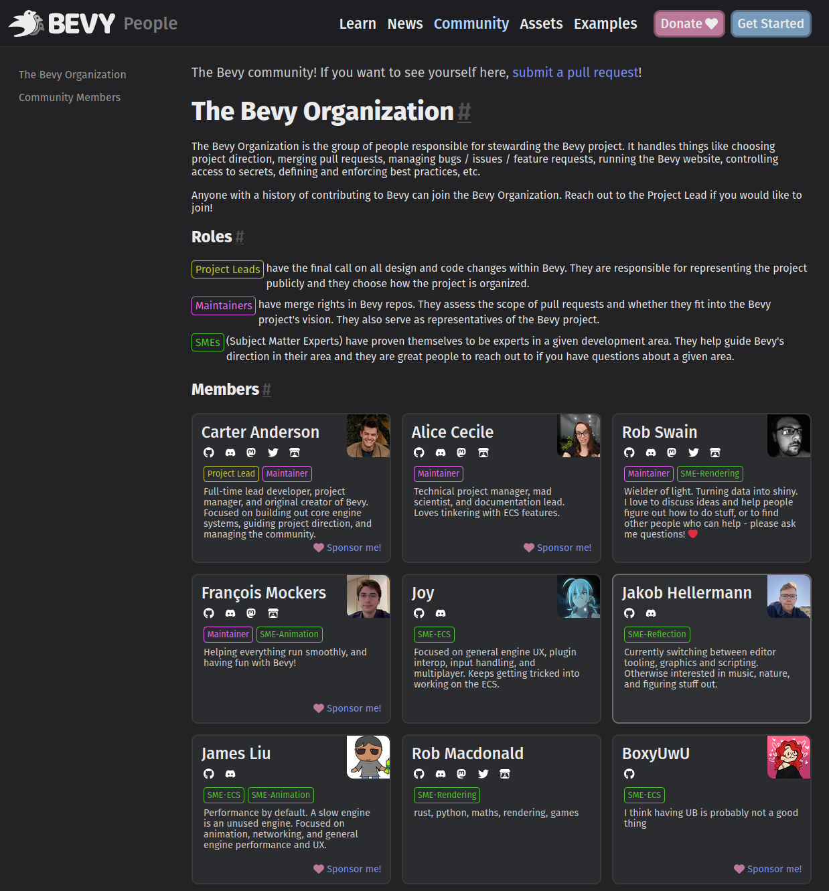

+++
title = "Scaling Bevy Development"
date = 2023-01-14
[extra]
author = "Carter Anderson"
twitter = "cart_cart"
github = "cart"
youtube = "cartdev"
image = "scaling_bevy.svg"
show_image = true
+++

The Bevy community has grown a lot over the past couple of years. We've had over 3,642 pull requests, 599 contributors, 357,917 downloads, and 21,200 github stars. Together we've built the most popular, most used Rust game engine on the market and the [second most popular game engine on GitHub](https://github.com/topics/game-engine). Up until now, in the interest of maintaining a consistent vision and quality bar, I've kept our decision making process as small and centralized as possible. And I scaled out our leadership roles as slowly as possible. I believe this was the right call for Bevy's early days, but we are overdue for changes that bias toward more trust and development agility.

<!-- more -->

## The Current State Of Things

I _have_ been slowly delegating responsibility over time, and each time I placed trust in someone it yielded massive benefits to both the project and my personal well being. We now have 3 more fantastic Maintainers: Alice (@alice-i-cecile), François (@mockersf), and Rob (@superdump). And their scope has grown over time.

But even today, I must personally approve _every_ "controversial" change to Bevy, where "controversial" is basically anything that meaningfully expands our features, user experience, or scope. With the volume of controversial changes we're seeing now, and the number of things I would still like to personally design and build, this is untenable. I have long since reached the limits of my bandwidth and the community has felt those limits for long enough.

When Bevy was younger and the community was newer, this level of conservativeness made sense. I knew what I wanted to build, how the pieces fit together, and what my capabilities were. What I didn't know as well was what everyone else wanted to build, what their capabilities were, and how that all fit into my personal vision.

I can now happily report that the situation has changed. We have proven technical experts in a variety of areas. They regularly design and build huge pieces of Bevy in a way that aligns with our collective vision for the future. Sometimes we have different ideas about what the future should look like, but we almost always reach consensus eventually. They have done outstanding technical work, built trust, and made Bevy amazing. They deserve a seat at the table.

With that preamble out of the way, I am excited to announce two major changes to the Bevy Organization.

## A New Role: Subject Matter Expert

Subject Matter Experts (SME for short) are Bevy developers that have consistently demonstrated technical expertise and synchronized vision within a given "subject area" (ex: Rendering, ECS, Reflection, Animation). They must have contributed and reviewed significant pieces of Bevy within their area. These people have the ability to vote on controversial pull requests in their subject area (both [code changes](https://github.com/bevyengine/bevy) and [RFCs](https://github.com/bevyengine/rfcs)). SMEs are also great people to reach out to if you have questions about a given subject area in Bevy.

If two SMEs within a given subject area approve a "controversial" PR, a maintainer can now merge it. We are intentionally keeping the number of SMEs within a subject area small to make establishing consensus and enforcing a consistent vision easier. For now, 2 SMEs is the bare minimum to allow voting to occur, 3 is the "sweet spot", and 4 will be allowed under some circumstances, but is the "upper limit".

As Project Lead, I can still merge controversial PRs. Consider 2 SME approvals as equivalent to a Project Lead approval. As a last line of defense for cohesion, the Project Lead maintains final say on changes. While I will by default defer to the SMEs, if they approve a PR that I firmly believe is the wrong direction for Bevy, I will still block or revert the change. Preserving consistent vision and quality is critically important to me. But I intend to bias toward trust and consensus as much as possible.

It is the job of SMEs to strive for consensus amongst themselves, the wider Bevy community, and Project Leads. They can merge controversial changes without me, but they still must do their best to anticipate my reaction to those changes (and discuss the changes with me ahead of time when that feels relevant). Likewise, I will try to establish consensus with SMEs and the wider community before making changes myself.

We are rolling out SMEs slowly so we can tweak the process over time and avoid changing too much too quickly. We've largely started with subject areas that have the most activity and the clearest subject matter experts. Join me in welcoming our initial set of SMEs!

* **Rendering**: @superdump (Rob Swain), @robtfm (Rob Macdonald)
* **ECS**: @BoxyUwU (Boxy), @james7132 (James Liu), @maniwani (Joy)
* **Reflection**: @MrGVSV (Gino Valente), @jakobhellermann (Jakob Hellermann)
* **Animation**: @james7132 (James Liu), @mockersf (François Mockers)

Hopefully there aren't too many surprises here. These people have been building fantastic things in their areas for a long time now.

We will be rolling out more subject areas (and the SMEs inside them) as SMEs prove themselves within the Bevy project and express interest. New areas are largely defined by the experts doing work inside them. We expect areas like UI, Editor, and Audio to be populated in reasonably short order.

We have also left spots open in each of the subject areas above. If you believe you meet our SME criteria for any current or proposed subject area and have interest in the role, don't hesitate to reach out to myself or any of the other maintainers. We will consider new candidates regularly. Just because you weren't included in this first batch doesn't mean we don't think you would be a good fit!

## A New Maintainer

We also want to improve our velocity for merging uncontroversial pull requests. And there will be new maintainership load associated with facilitating the SME process. The current maintainers and I have unanimously agreed that it is time to bring on one more maintainer.

Join me in welcoming James Liu (@james7132) as our latest maintainer! James has proven themselves to be a technical expert across many of Bevy's systems (especially ECS, animation, parallelization / task scheduling, and optimization). You may have noticed that they also have the SME role for ECS and Animation. They have contributed huge volumes of code changes, provided solid reviews, are easy to work with, and have a vision for Bevy's future that aligns with ours.

## A New Bevy Organization Document

We have a new [Bevy Organization Document](https://github.com/cart/bevy/blob/sme/docs/the_bevy_organization.md), which describes how the Bevy Organization will work going forward. It outlines the functionality of each role, as well as the expectations we have for them. The previously existing roles (Project Lead, Maintainer) still work the same way, but their definition and scope have been made much clearer.

The biggest changes to the organization are the new SME role and an initial description of "role rotation":

Roles like Project Lead, Maintainer, and SME are intentionally kept in limited supply to ensure a cohesive project vision. However these roles can be taxing, sometimes other aspects of life need to take priority, and qualified motivated people deserve a chance to lead. To resolve these issues, we plan on building in "role rotation". What this looks like hasn't yet been determined (as this issue hasn't come up yet and we are still in the process of scaling out our team), but we will try to appropriately balance the needs and desires of both current and future leaders, while also ensuring consistent vision and continuity for Bevy.

## The Bevy People Page

Bevy is a community-driven project. It makes sense for the people behind Bevy and the roles they fill to be easily discoverable.

To make that happen, François (@mockersf) and I built a new [Bevy People](https://bevyengine.org/community/people/) page. "Bevy people" can opt-in to listing their name and/or pseudonym, their social information (GitHub, Discord, Mastodon, Twitter, personal website, itch.io, etc), a sponsorship link, and a personal bio describing who they are and what they work on.

It also displays the current Bevy Organization roles these people occupy. You _could_ call it an "org chart" if you wanted to, but my anti-bureaucracy reflexes prevent me from doing so. The Bevy community will always be as flat and "people first" as possible.

It is open to anyone (both Bevy Organization members and the wider Bevy community). If you would like to see yourself on this page, [create a pull request here](https://github.com/bevyengine/bevy-community).

This is what it looks like!

## Looking Forward

The next Bevy release (Bevy 0.10) is roughly a month away and I'm very excited for the changes we have in the pipeline. I can't guarantee all of these will make it in, but they're all shaping up nicely:

* **The New "Stageless" ECS Scheduler**: We've fully rebuilt our scheduler to be more flexible. We no longer need "stages" to handle "exclusive system scheduling". Any system of any type can be ordered relative to any other system (even if they have exclusive access to the ECS `World`. Many scheduling APIs are now cleaner and easier to use. And we've taken the chance to improve related APIs like States as well.
* **Depth and Normal Prepass**: This will give rendering feature developers access to the depth buffer and normals during the main render phase, which enables a variety of render features and optimizations.
* **Screen Space Ambient Occlusion**: This is a popular, relatively cheap illumination technique that can make scenes look much more natural. It builds on the Depth Prepass work.
* **Asset Preprocessing**: We're reworking our asset system to allow for pre processing assets into more efficient forms, which can make deployed games faster to load, prettier, and faster. This is a full asset system rework that improves a good portion of our asset APIs.
* **Windows as Entities**: Windows are now ECS Entities instead of Resources, which makes them more natural to construct and query, more extensible, and opens the doors to including them in Bevy Scenes.
* **UI Style Split**: Breaks the monolithic UI style type out into smaller pieces, embracing a less centralized and more extensible pattern.

See you in about a month!
