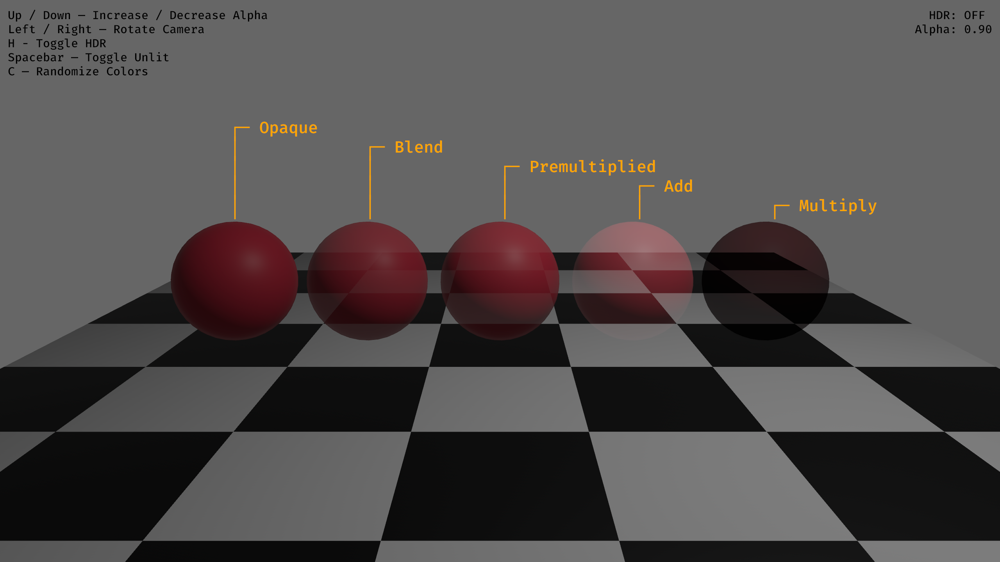
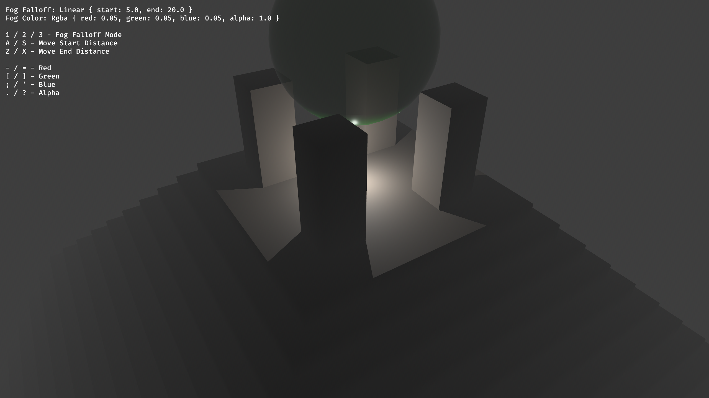

+++
title = "Bevy 0.10"
date = 2023-03-04
[extra]
author = "Bevy Contributors"
+++

Thanks to **X** contributors, **X** pull requests, community reviewers, and our [**generous sponsors**](/community/donate), I'm happy to announce the **Bevy 0.10** release on [crates.io](https://crates.io/crates/bevy)!

For those who don't know, Bevy is a refreshingly simple data-driven game engine built in Rust. You can check out our [Quick Start Guide](/learn/book/getting-started/) to try it today. It's free and open source forever! You can grab the full [source code](https://github.com/bevyengine/bevy) on GitHub. Check out [Bevy Assets](https://bevyengine.org/assets) for a collection of community-developed plugins, games, and learning resources.

To update an existing Bevy App or Plugin to **Bevy 0.10**, check out our [0.9 to 0.10 Migration Guide](/learn/book/migration-guides/0.9-0.10/).

Since our last release a few months ago we've added a _ton_ of new features, bug fixes, and quality of life tweaks, but here are some of the highlights:

<!-- more -->

* **Headliner Feature**: Description here.
* **Simpler, more flexible scheduling**: systems are now stored in a unified schedule, commands can be applied explicitly via `apply_system_buffers` and a whole lot of quality of life and bug fixes.

## Section Template

<div class="release-feature-authors">authors: @Foo, @Bar</div>

Description here.

## Simpler, more flexible scheduling

<div class="release-feature-authors">authors: @alice-i-cecile, @maniwani, @WrongShoe, @cart, @jakobhellermann, @JoJoJet, @geieredgar and a whole lot more </div>

Thanks to the fantastic work of our ECS team, the hotly awaited ["stageless" scheduling RFC](https://github.com/bevyengine/rfcs/blob/main/rfcs/45-stageless.md) has been implemented! But as we all know, plans and implementations (start at [#6587](https://github.com/bevyengine/bevy/pull/6587) by `@maniwani` and [#7267](https://github.com/bevyengine/bevy/pull/7267) by `@alice-i-cecile`) are two different things. Let's take a look at what actually shipped for 0.10.

There's been a lot of changes, but we've put a lot of care into ensuring the [migration path](../../learn/book/migration-guides/0.9-0.10/_index.md) for existing applications is relatively straightforward. Don't sweat it!

## A Single Unified Schedule

Ever wanted to specify that `system_a` runs before `system_b`, only to be met with confusing warnings that `system_b` isn't found because it's in a different stage?

No more! All systems within a single **schedule** are now stored in a single data structure with a global awareness of what's going on.

This simplifies our internal logic, makes your code more robust to refactoring, and allows plugin authors to specify high-level invariants (e.g. "movement must occur before collision checking") without locking themselves in to an exact schedule location.

[!main_schedule_diagram](main_schedule_diagram.svg)

This diagram, made with [@jakobhellermann's `bevy_mod_debugdump` crate](https://github.com/jakobhellermann/bevy_mod_debugdump) shows a simplified version of Bevy's default schedule.

## Configurable System Sets

To support more natural and flexible control over "how are my systems run and scheduled", the idea of a "system set" has been redefined, rolling up the existing "system label" concept into one straightforward but powerful abstraction.

Every system, once it is part of a schedule, stores **system configuration** metadata: which run conditions are attached, how they are ordered relative to other systems or sets and so on.
**System sets** are named collections of systems that share system configuration across all of their members. This is both distributive and additive: ordering systems relative to a system set applies that ordering to _all_ systems in that set, in addition to any configuration on each individual system.

Let's jump right in to what this would look like.

```rust
// System set types are used to provide stable, typed identifiers
// for groups of systems, allowing external systems to order themselves
// without being aware of internal details.
// Each variant of this enum is a distinct system set.
#[derive(SystemSet, Debug, Hash, PartialEq, Eq, Clone)]
enum PhysicsSet {
    Forces,
    Kinematics,
    CollisionDetection
}

app
    // .with_run_criteria -> .run_if <3
    // Note that in this case we're modifying this single `gravity` system, not the entire `PhysicsSet::Forces`
    // as this is a method on a single system.
    // The order of these method calls doesn't matter!
   .add_system(gravity.in_set(PhysicsSet::Forces).run_if(gravity_enabled))
    // Add multiple systems at once with add_systems!    
    .add_systems(
        (apply_acceleration, apply_velocity)
            // Quickly order a list of systems to run one after the next by using .chain()
            .chain()
            .in_set(PhysicsSet::Kinematics),
    )
    .add_system(detect_collisions.in_set(PhysicsSet::CollisionDetection))
    // You can add configuration for an entire set in a single place
    .configure_set(
        PhysicSet::Forces
        .in_base_set(CoreSet::Update)
        .before(PhysicsSet::Kinematics)
    )
    .configure_set(
        PhysicSet::Kinematics
        .in_base_set(CoreSet::PostUpdate)
        // Previously, this would have been impossible,
        // as `CollisionDetection` is run in `Update`, which would be represented by a different stage
        .before(PhysicsSet::CollisionDetection)
        // Ooh run condition combinators :eyes:
        .run_if(not(game_paused))
    )
    .configure_set(
        PhysicSet::CollisionDetection
        .in_base_set(CoreSet::PostUpdate)
    )
```

A system can belong to any number of sets, adding the configuration from each set it belongs to to its own configuration. Similarly, sets can be nested, allowing you to granularly define a clear set of rules for app-level scheduling patterns.

These rules must be compatible with each other: any paradoxes (like a system set inside of itself, or a system that must run both before and after a set) will result in a runtime panic with a helpful error message.

As long as you can construct the type of a system set, you can both order your systems relative to it, and configure its behavior even after it has been initialized elswhere! Crucially system configuration is strictly additive: you cannot _remove_ rules added elsewhere. This is both a "anti-spaghetti" and "plugin privacy" consideration. When this rule is combined with Rust's robust type privacy rules, plugin authors can make careful decisions about which exact invariants need to be upheld, and reorganize code and systems internally without breaking consumers.

## Directly Schedule Exclusive Systems

Ever wished that you could just flush commands or run an exclusive system right before this system but after that system without shuffling your entire schedule to make it work?

Now you can! Thanks to ongoing cleanup work in the ECS scheduling internals, and the unified schedule mentioned above, exclusive systems can now be scheduled and ordered like any other system.

```rust
app
    .add_system(ordinary_system)
    // This works?!
    .add_system(exclusive_system.after(ordinary_system))
```

This is particularly powerful, as **command flushes** (which apply any queued up `Commands` added in systems to e.g. spawn and despawn entities) are now simply performed in the `apply_system_buffers` exclusive system.

```rust
app
    .add_systems((
        system_that_produces_commands,
        // Built-in exclusive system that applies generated commands
        apply_system_buffers,
        system_that_needs_commands_to_have_been_applied
    // chain() creates an ordering between each of these systems,
    // so we know that our commands will have been applied by the time our last system is run
    ).chain().in_set(CoreSet::PostUpdate))
```

Do be careful with this pattern though: it's easy to quickly end up with many poorly ordered exclusive systems, creating bottlenecks and chaos.

Similarly, state transitions can be scheduled manually, one type at a time, in the `apply_state_transitions::<S>` exclusive system.

What will you do with this much power? We're keen to find out!

## It's All Schedules? Managing complex control flow

But what if you want to do something _weird_ with your schedule. Something non-linear, or branching, or looping. What should you reach for?

It turns out, Bevy already _had_ a great tool for this: schedules run inside of an exclusive system. The idea is pretty simple:

1. Construct a schedule, that stores whatever complex logic you want to run.
2. Store that schedule inside of a resource.
3. In an exclusive system, perform any arbitrary Rust logic you want to decide if and how your schedule runs.
4. Temporarily take the schedule out of the world, run it on the rest of the world to mutate both the schedule and the world, and then put it back in.

With the addition of the new `Schedules` resource and the `world.run_schedule(schedule_label: impl ScheduleLabel)`API it's more :sparkles: ergonomic :sparkles: than ever.

```rust
// A schedule!
let mut my_schedule = Schedule::new();
schedule.add_system(my_system);

// A schedule label for it
#[derive(ScheduleLabel, Debug, Hash, PartialEq, Eq, Clone)]
struct MySchedule;

// An exclusive system to run this schedule
fn run_my_schedule(world: &mut World) {
    while very_complex_logic(){
        world.run_schedule(MySchedule);
    }
}

// Behold the ergonomics
app
    .add_schedule(MySchedule, my_schedule)
    .add_system(run_my_schedule);
```

Bevy uses this pattern for five rather different things at 0.10 release:

1. **Startup systems:** these now live in their own schedule, which is run once at the start of the app.
2. **Fixed timestep systems:** another schedule?! The exclusive system that runs this schedule accumulates time, running a while loop that repeatedly runs `CoreSchedule::FixedTimestep` until all of the accumulated time has been spent.
3. **Entering and exiting states:** a bonanza of schedules. Each collection of systems that runs logic to enter and exit a state variant is stored in its own schedule, which are called based on the change in state in the `apply_state_transitions::<S>` exclusive system.
4. **Rendering:** all rendering logic is stored in its own schedule to allow it to run asynchronously relative to gameplay logic.
5. **Controlling the outermost loop:** in order to handle the "startup schedule first, then main schedule" logic, we wrap it all up in a minimal overhead `CoreSchedule::Outer` and then run our schedules as the sole exclusive system there.

Follow the bread crumbs starting at [`CoreSchedule`](https://dev-docs.bevyengine.org/bevy/app/enum.CoreSchedule.html) for more info.

## Simpler Run Conditions

Systems may have any number of run conditions (and inherit them from the sets they belong to), but will only run if all of their run conditions return `true`.
Run criteria have been renamed to the clearer **run conditions**, which can be constructed out of any read-only system that returns `bool`.

With a new blessed pattern for complex control flow, we can finally get rid of looping run criteria. [`ShouldRun::YesAndCheckAgain`](https://docs.rs/bevy/0.9.1/bevy/ecs/schedule/enum.ShouldRun.html) was not exactly straightforward to reason about, either for engine devs or users. It's always a bad sign when your bool-like enums have four possible values.

If you crave that powerful, complex control flow: use the "schedules in exclusive systems" pattern listed above.
For the other 99% of use cases, enjoy the simpler `bool`-based run conditions.

```rust
// Let's make our own run condition
fn game_end_condition(query: Query<&Player>, score: Res<Score>) -> bool {
    let player = query.single();
    player.is_alive() && score.0 > 9000
}

app.add_system(win_game.run_if(game_end_condition));
```

Run conditions can serve as a lightweight optimization tool: each one is evaluated only each schedule update, and shared across the system set. Reducing the number of tasks spawned can really add up. Like always though: benchmark!

Bevy 0.10 is shipping with a lovely collection of built-in [common run conditions](https://dev-docs.bevyengine.org/bevy/ecs/schedule/common_conditions/index.html). Courtesy of [#6587 by `@maniwani`](https://github.com/bevyengine/bevy/pull/6587), [#7579 by `@inodentry`](https://github.com/bevyengine/bevy/pull/7579)and [#7806 by `@jakobhellermann`](https://github.com/bevyengine/bevy/pull/7806), you can quickly check if there are events to process, changes to resources, input states and more.

When you need something more sophisticated, combining run conditions is a breeze. Courtesy of [#7547](https://github.com/bevyengine/bevy/pull/7547), [#7559](https://github.com/bevyengine/bevy/pull/7559), and [#7605](https://github.com/bevyengine/bevy/pull/7605), you can create new run conditions with the use of system piping and the `not`, `and_then` or `or_else` run criteria combinators.

## Simpler States

Previously, looping run criteria were used to power states, but as mentioned above, they've been removed.
How do they work in Bevy 0.10?

1. The current value of the state of type `S` is stored in the `State<S: States>` resource. The pending value is stored in `NextState<S: States>`.
    1. To set the next state, simply mutate the value of the `NextState<S>` resource.
2. Run conditions can read the value of the `State<S>` resource.
    1. Systems with the `in_state(AppState::InGame)` run condition will only run if the value of the `State<AppState>` resource equals `AppState::InGame`.
3. Check for and apply state transitions as part of the `apply_state_transitions<S>` exclusive system. When transitioning between states:
    1. First run the `OnExit(S::VariantLeft)` schedule for the state you're leaving.
    2. Then run the `OnEnter(S::VariantEntered)` schedule.
    3. These schedules are stored in the `Schedules` resource, and can be looked up via their `ScheduleLabel`.
4. When the user calls `app.add_state:<s>()`:
    1. Initialize an `OnEnter` and an `OnExit` schedule for each variant of our state type `S`.
    2. Configure the `OnUpdate(S::Variant)` system set to belong to `CoreSet::Update` and only run when `State<S>` is `S::Variant`.
    3. Add a copy of `apply_state_transitions<S>` to `CoreSet::ApplyStateTransitions`.
    4. Set the starting state of `S` using its `Default` trait.

As a user though, you don't have to worry about those details:

```rust
// Setting up our state type.
// Note that each variant of this enum is a distinct state.
#[derive(States, PartialEq, Eq, Debug, Default)]
enum AppState {
    InGame,
    #[default]
    MainMenu
}

app
    // Don't forget to initialize the state!
    .add_state::<AppState>()
    .add_system(load_main_menu.in_schedule(OnEnter(AppState::MainMenu)))
    .add_system(start_game.in_set(OnUpdate(AppState::MainMenu)))
    .add_system(cleanup_main_menu.in_schedule(OnExit(AppState::MainMenu)))
    .add_system(make_game_fun.in_set(OnUpdate(AppState::InGame)));

fn start_game(
    button_query: Query<&Interaction, With<StartGameButton>>,
    next_state: ResMut<NextState<AppState>>,
){
    let start_game_interaction_state = button_query.single();
    if start_game_interaction_state == Interaction::Pressed {
        *next_state = NextState(AppState::InGame);
    }
}
```

But wait you say: what about my state stack? My elaborate queued transitions?! My meticulous error handling on every operation that I definitely didn't just unwrap?!!

In practice, we found that the state stack was a) very complex to learn b) very prone to exasperating bugs c) mostly ignored.
As a result, states are now "stackless": only one queued state of each type at a time.

Thanks to the help of some brave alpha testers, we're reasonably confident that this shouldn't be too bad to migrate away from.
If you were relying on the state stack, you might choose to:

* rearchitect some of that logic out of states
* use additional state types, which capture orthogonal elements of your app's status
* build your own state stack abstraction using the same patterns as Bevy's first-party version: please let the rest of the community know so you can collaborate!

## Base Sets: Getting Default Behavior Right

Of course the skeptical reader may point out that:

1. Bevy automatically runs its systems in parallel.
2. [The order of systems is nondeterministic unless there is an explicit ordering relationship between them](https://github.com/bevyengine/bevy/blob/latest/examples/ecs/nondeterministic_system_order.rs)?
3. All of the systems are now stored in a single `Schedule` object with no barriers between them?
4. Systems can belong to any number of system sets, each of which can add their own behavior?

Won't this lead to utter chaos and tedious spaghetti-flavored work to resolve every last ordering ambiguity?
Many users _liked_ stages, they were helpful for understanding the structure of my app!

Well, I'm glad you asked, rhetorical skeptic. To reduce this chaos (and ease migration), Bevy 0.10 comes with a brand new collection of system sets with the default plugins: [`CoreSet`](https://dev-docs.bevyengine.org/bevy/app/enum.CoreSet.html), [`StartupSet`](https://dev-docs.bevyengine.org/bevy/app/enum.StartupSet.html) and [`RenderSet`](https://dev-docs.bevyengine.org/bevy/render/enum.RenderSet.html). The similarity of their names to [`CoreStage`](https://docs.rs/bevy/0.9.1/bevy/app/enum.CoreStage.html), [`StartupStage`](https://docs.rs/bevy/0.9.1/bevy/app/enum.StartupStage.html) and [`RenderStage`](https://docs.rs/bevy/0.9.1/bevy/render/enum.RenderStage.html) is not a coincidence: there are command flush points between each set, and existing systems have been migrated directly.

Some parts of the stage-centric architecture were appealing: a clear high level structure, coordination on flush points (to reduce excessive bottlenecks) and good default behavior.
To keep those bits (while excising the frustrating ones), we've introduced the concept of **base sets**, added in [#7466](https://github.com/bevyengine/bevy/pull/7466) by `@cart`. Base sets are system sets, except:

1. Every system (but not every system set) must belong to exactly one base set.
2. Systems that do not specify a base set will be added to the default base set for the schedule.

```rust
// You can add new base sets to any built-in ones
#[derive(Debug, Hash, PartialEq, Eq, Clone, SystemSet)]
#[system_set(base)]
enum MyBaseSet {
    Early,
    Late,
}

app
    // This ends up in CoreSet::Update by default
    .add_system(no_base_set)
    // You must use .in_base_set rather than .in_set for explicitness
    // This is a high-impact decision!
    .add_system(post_update.in_base_set(CoreSet::PostUpdate))
    // Look, it works!
    .add_system(custom_base_set.in_base_set(MyBaseSet::Early))
    // Ordering your base sets relative to CoreSet is probably wise
    .configure_set(MyBaseSet::Early.before(CoreSet::Update))
    .configure_set(MyBaseSet::Late.after(CoreSet::Update));
```

Pretty simple, but what does this buy us?
First, it gives you a clear hook to impose, reason about and visualize high level structure to your schedule. Yearning for a linear, stage-like design? Just order your base sets!
Secondly, it allows Bevy to set good default behavior for systems added by users, without removing their control.

Let me tell you a story, set in a world where all of Mr. Straw Man's points above are true, and no default set is added.

1. A new user adds the `make_player_run` system to their app.
2. Sometimes this system runs before input handling, leading to randomly dropped inputs. Sometimes it runs after rendering, leading to strange flickers.
3. After much frustration, the user discovers that these are due to "system execution order ambiguities".
4. The user runs a specialized tool, digs into the source code of the engine, figures out what order their system should run in relative to the engine's system sets, and then continues on their merry way, doing this for each new system.
5. Bevy (or one of their third-party plugins) updates, breaking all of our poor users system ordering once again.

In practice, there are three broad classes of systems: gameplay logic (the majority of all end user systems), stuff that needs to happen before gameplay logic (like event cleanup and input handling) and stuff that needs to happen after gameplay logic (like rendering and audio).

By broadly ordering the schedule via base sets, we hope that Bevy apps can have good default behavior and clear high level structure without compromising on the scheduling flexibility and explicitness that advanced users crave.
Let us know how it works out for you!

## Polish Matters

As part of this work, we've taken the time to listen to our users and fix some small but high-impact things about how scheduling works.

Compare the following options for adding and ordering four systems, one after the other.

:coffee: **Enterprise-grade** :coffee::

```rust
#[derive(SystemSet, PartialEq, Eq, Clone, Copy, Hash, Debug)]
#[allow(missing_docs)]
pub enum Step {
    A,
    B,
    C,
    D
}

app
    .configure_set(Step::A.before(Step::B))
    .configure_set(Step::B.before(Step::C))
    .configure_set(Step::C.before(Step::D))
    .add_system(a.in_set(Step::A))
    .add_system(b.in_set(Step::B))
    .add_system(c.in_set(Step::C))
    .add_system(d.in_set(Step::D));
```

:weary: **Tedious** :weary::

```rust
app
    .add_system(a.before(b))
    .add_system(b.before(c))
    .add_system(c.before(d))
    .add_system(d);
```

:sparkles: **Ergonomic** :sparkles::

```rust
app.add_systems((a, b, c, d).chain());
```

There's another lovely change lurking in that last example: the `add_systems` API.

Bevy 0.9:

```rust
app
    .add_system_set(SystemSet::on_update(AppState::InGame)
        .with_system(a.before(b))
        .with_system(b.label(MyLabel::Variant))
        .with_system(c)
        .with_run_criteria(blue_moon)
    )    

```

Bevy 0.10:

```rust
app.add_systems(
    (
        a.before(b),
        b.in_set(MySet::Variant),
        c
    )
    .run_if(blue_moon)
    .in_set(OnUpdate(AppState::InGame))
)
```

We've also:

* added trivial single threaded evaluation via the [`SingleThreadedExecutor`](https://dev-docs.bevyengine.org/bevy/ecs/schedule/struct.SingleThreadedExecutor.html) for users who prefer alternate parallelization strategies (or simply don't need it) by `@maniwani` as part of the `bevy_ecs::schedule` rewrite
  * we already default to this on WASM, so don't worry about setting it up for your jam games!
  * wish commands just applied instantly? We've got you: use [`SimpleExecutor`](https://dev-docs.bevyengine.org/bevy/ecs/schedule/struct.SimpleExecutor.html) and trade performance for clarity and convenience to your heart's content.
* added ultra-convenient prebuilt error-handling system piping adaptors in [#6751 by `@edwox`](https://github.com/bevyengine/bevy/pull/6751) so you can quickly and easily use the `?` operator in your Bevy systems and log any failure cases
  * Put an end to the rightward drift: just use `.add_system(fallible_system.pipe(system_adaptor::warn)))` :heart_eyes:
* removed string-based labels: these were prone to nasty conflicts, easy to typo, didn't play nice with IDEs and are no longer needed due to the much improved ergonomics of ordering systems in other forms
* made sure you can pipe data into and out of exclusive systems in [#6698 by `@inodentry`](https://github.com/bevyengine/bevy/pull/6698)
* significantly improved ambiguity detection and cycle reporting: check out the [`ScheduleBuildSettings`](https://dev-docs.bevyengine.org/bevy/ecs/schedule/struct.ScheduleBuildSettings.html) docs for more info. If you haven't tried this out on your app yet: you should take a look!

The Bevy ECS team has worked closely with `@jakobhellerman`, the author of [`bevy_mod_debugdump`](https://crates.io/crates/bevy_mod_debugdump), the leading third-party schedule visualization plugin, to ensure it keeps working better than ever.

It's a great tool that we are looking to build on to create a first party solution: you should strongly consider adding it to your toolbox.

## Spatial Audio

<div class="release-feature-authors">authors: @mockersf, @DGriffin91, @harudagondi, @alice-i-cecile</div>

The library Bevy uses for audio, [`rodio`], contains support for spatial audio. In this version, we now support spatial audio (with certain caveats, like no HRTF and no first class support for `Emitter` and `Listener` components).

Interestingly, during the development of this specific feature, `@harudagondi` found a [bug][reverse-channels-bug] where the audio channels reverse when running the app in either debug or release mode. This turns out to be a `rodio` issue, and this also affects previous versions of Bevy. Thanks to `@dis-da-moe`, the bug has been [fixed upstream][rodio-pr]. See the linked PR for interesting details about audio programming quirks and performance issues.

You can now have spatial audio in your game! Clone the `bevy` repository and invoke `cargo run --example spatial_audio_3d --release` in the command line for a showcase of 3D spatial audio in Bevy.

[`rodio`]: https://crates.io/crates/rodio
[reverse-channels-bug]: https://github.com/RustAudio/rodio/issues/444
[rodio-pr]: https://github.com/RustAudio/rodio/pull/455

## Custom Audio Sources

<div class="release-feature-authors">authors: @dis-da-moe</div>

Bevy supports custom audio sources through the [`Decodable`] trait, but the way to register to the bevy app is very boilerplatey and sparsely documented. In **Bevy 0.10**, a new extension trait for `App` is added and the documentation for [`Decodable`] has vastly improved.

As such, instead of doing this:

```rust
struct MyCustomAudioSource { /* ... */ }

app.add_asset::<MyCustomAudioSource>()
    .init_resource::<Audio<MyCustomAudioSource>>()
    .init_resource::<AudioOutput<MyCustomAudioSource>>()
    .add_system(play_queued_audio_system::<MyCustomAudioSource>.in_base_set(CoreSet::PostUpdate))
```

You only have to do this:

```rust
app.add_audio_source::<MyCustomAudioSource>()
```

Much cleaner!

[`Decodable`]: https://docs.rs/bevy_audio/latest/bevy_audio/trait.Decodable.html

## `Ref<T>` Queries

<div class="release-feature-authors">authors: @Guvante, @JoJoJet</div>

Since Bevy 0.1, `Mut<T>` has been used to enable change detection (along with related types like `ResMut<T>`). It's a simple wrapper type that provides mutable access to a component alongside its change tick metadata, automatically marking a change when the value is mutated.

In **Bevy 0.10**, the change detection family has grown with `Ref<T>`, the immutable variant of `Mut<T>`. Like its mutable sibling, it allows you to react to changes made outside of the current system.

```rust
use bevy::prelude::*;

fn inspect_changes_system<T: Component + Debug>(q: Query<Ref<T>>) {
    // Iterate over each component of type `T` and log its changed status.
    for val in &q {
        if val.is_changed() {
            println!("Value `{val:?}` was last changed at tick {}.", val.last_changed());
        } else {
            println!("Value `{val:?}` is unchanged.");
        }
    }
}
```

We are also deprecating `ChangeTrackers<T>`, which is the old way of inspecting a component's change ticks. This type will be removed in the next version of Bevy.

## Android Support

<div class="release-feature-authors">authors: @mockersf, @slyedoc</div>


Bevy now runs out of the box on Android on more devices. This was unlocked by waiting for the [`Resumed`](https://docs.rs/winit/0.28/winit/event/enum.Event.html#variant.Resumed) event to create the window instead of doing it on startup, matching the [`onResume()`](https://developer.android.com/guide/components/activities/activity-lifecycle#onresume) callback on Android.

To follow the recommendations on the [`Suspended`](https://docs.rs/winit/0.28/winit/event/enum.Event.html#variant.Suspended) event, Bevy will now exit on receiving that event. This is a temporary solution until Bevy is able to recreate rendering resources when being resumed.

Please test on your devices and report successes or issues you may encounter! There is a known issue around touch position on some devices with software buttons, as winit doesn't expose [yet](https://github.com/rust-windowing/winit/issues/2308) the inset size, only the inner size.

As this brings Bevy closer to full support of Android, there isn't a need anymore for separated examples for Android and iOS. They have been regrouped in one ["mobile" example](https://github.com/bevyengine/bevy/tree/v0.10.0/examples/mobile), and the instructions updated ([for Android](https://github.com/bevyengine/bevy/tree/v0.10.0/examples#android) and [for iOS](https://github.com/bevyengine/bevy/tree/v0.10.0/examples#ios)).


## Enable Parallel Pipelined Rendering

<div class="release-feature-authors">authors: @hymm, @james7132</div>


On multithreaded platforms, bevy will now run significantly faster by running simulation and
rendering in parallel. The renderer was rearchitected in [bevy 0.6](https://bevyengine.org/news/bevy-0-6/#pipelined-rendering-extract-prepare-queue-render)
to enable this, but the final step of actually running them in parallel was not done until now.
There was a bit of tricky work to figure out. The render world has a system that has to run on
the main thread, but the task pool only had the ability to run on the world's thread. So, when we send
the render world to another thread we need to accommodate still running render systems on the main
thread. So we added the ability to spawn tasks onto the main thread in addition to the world's thread.


In testing different bevy examples, the gains were typically in the 10% to 30% range.
As seen in the above histogram, the mean frame time of the "many foxes" stress test
is 1.8ms faster than before.

To use pipelined rendering, you just need to add the `PipelinedRenderingPlugin`. If you're
using `DefaultPlugins` then it will automatically be added for you on all platforms except
wasm. Bevy does not currently support multithreading on wasm which is needed for this
feature to work. If you are not using `DefaultPlugins` you can add the plugin manually.

## Added a post-build method on `Plugin`

An optional `setup` method was added to the `Plugin` trait that runs after all the build methods have
been called. This was required to enable pipelined rendering, which needed to remove the sub
app from the app to send it between the main thread and the rendering thread. This is
only valid to do after all the plugin build methods have been called, because any plugin may
want to modify the rendering sub app.

## ECS Optimizations

<div class="release-feature-authors">authors: @james7132, @JoJoJet</div>

ECS underlies the entire engine, so eliminating overhead in the ECS results in engine-wide speedups. In **Bevy 0.10**, we've found quite a few areas where we were able to massively reduce the overhead and improve CPU utilization for the entire engine.

In [#6547](https://github.com/bevyengine/bevy/pull/6547), we enabled [autovectorization](https://en.wikipedia.org/wiki/Automatic_vectorization) when using `Query::for_each`, and its parallel variants. Depending on the target architecture the engine is being compiled for, this can result in a 50-87.5% speed up in query iteration time. In 0.11, we may be extending this optimization to all iterator combinators based on `Iterator::fold`, such as `Iterator::count`. See [this PR](https://github.com/bevyengine/bevy/pull/6773) for more details.

In [#6681](https://github.com/bevyengine/bevy/pull/6681), by tightly packing entity location metadata and avoiding extra memory lookups, we've significantly reduced the overhead when making random query lookups via `Query::get`, seeing up to a 43% reduction in the overhead spent in `Query::get` and `World::get`.

In [#6800](https://github.com/bevyengine/bevy/pull/6800) and [#6902](https://github.com/bevyengine/bevy/pull/6902), we've found that rustc can optimize out compile-time constant branches across function boundaries, moving the branch from runtime to compile time, has resulted in up to a 50% reduction in overhead when using `EntityRef::get`, `EntityMut::insert`, `EntityMut::remove`, and their variants.

In [#6391](https://github.com/bevyengine/bevy/pull/6391), we've reworked `CommandQueue`'s internals to be more CPU-cache friendly, which has shown up to a 37% speedup when encoding and applying commands.

## Adaptive Batching for Parallel Query Iteration

<div class="release-feature-authors">authors: @james7132</div>

`Query::par_for_each` has been the tool everyone reaches for when their queries get too big to run single-threaded. Got 10,0000 entities running around on your screen? No problem, `Query::par_for_each` chunks it up into smaller batches and distributes the workload over multiple threads. However, in **Bevy 0.9** and before, `Query::par_for_each` required callers to provide a batch size to help tune these batches for maximum performance. This rather opaque knob often resulted in users just randomly picking a value and rolling with it, or fine tuning the value based on their development machines. Unfortunately, the most effective value is dependent on the runtime environment (i.e. how many logical cores does a player's computer have) and the state of the ECS World (i.e. how many entities are matched?). Ultimately most users of the API just chose a flat number and lived with the results, good or bad.

```rust
// 0.9
const QUERY_BATCH_SIZE: usize = 32;

query.par_for_each(QUERY_BATCH_SIZE, |mut component| {
   // ...
});
```

In 0.10, you no longer need to provide a batch size! Bevy will automatically evaluate the state of the World and task pools and select a batch size using a heuristic to ensure sufficient parallelism, without incurring too much overhead. This makes parallel queries as easy to use as normal single-threaded queries! While great for most typical use cases, these heuristics may not be suitable for every workload, so we've provided an escape hatch for those who need finer control over the workload distribution. In the future, we may further tune the backing heuristics to try to get the default to be closer to optimal in these workloads. For more complete details on how the heuristics work and what workloads may be considered atypical, see the documentation of [`Query::par_iter`].

```rust
// 0.10
query.par_iter().for_each(|mut component| {
   // ...
});

// Fairly easy to convert from a single threaded for_each. Just change iter to par_iter!
query.iter().for_each(|mut component| {
   // ...
});
```

[`Query::par_iter`]: https://docs.rs/bevy/0.10.0/bevy/ecs/system/struct.Query.html#method.par_iter

## `UnsafeWorldCell` and `UnsafeEntityCell`

<div class="release-feature-authors">authors: @jakobhellermann, @BoxyUwU and @JoJoJet</div>

`UnsafeWorldCell` and `UnsafeEntityCell` allow shared mutable access to parts of the world via unsafe code. It serves a similar purpose as `UnsafeCell`, allowing people to build interior mutability abstractions such as `Cell` `Mutex` `Channel` etc. In bevy `UnsafeWorldCell` will be used to support the scheduler and system param implementations as these are interior mutability abstractions for `World`, it also currently is used to implement `WorldCell`. We're planning to use `UnsafeEntityCell` to implement versions of `EntityRef`/`EntityMut` that only have access to the components on the entity rather than the entire world.

These abstractions were introduced in [#6404](https://github.com/bevyengine/bevy/pull/6404), [#7381](https://github.com/bevyengine/bevy/pull/7381) and [#7568](https://github.com/bevyengine/bevy/pull/7568).

## StandardMaterial Blend Modes

<div class="release-feature-authors">author: Marco Buono (@coreh)</div>

The [`AlphaMode`] enum has been extended in **Bevy 0.10**, bringing support for _additive and multiplicative blending_ to the [`StandardMaterial`]. These two blend modes are staples of the “classic” (non physically-based) computer graphics toolbelt, and are commonly used to achieve a variety of effects.

<!-- TODO: Add video here -->
<video controls loop><source src="" type="video/mp4"/></video>

_Demo showcasing the use of blend modes to create stained glass and fire effects._ (<a href="https://github.com/coreh/bevy-demo-ruins">Source Code</a>)

Additionally, support for semi-transparent textures with [premultiplied alpha](https://en.wikipedia.org/wiki/Alpha_compositing#Straight_versus_premultiplied) has been added, via a dedicated alpha mode.

Here's a high-level overview of the new modes:

- [`AlphaMode::Add`] — Combines the colors of the fragments with the colors behind them in an additive process, (i.e. like light) producing **brighter** results. Useful for effects like fire, holograms, ghosts, lasers and other energy beams. Also known as _Linear Dodge_ in graphics software.
- [`AlphaMode::Multiply`] — Combines the colors of the fragments with the colors behind them in a multiplicative process, (i.e. like pigments) producing **darker** results. Useful for effects approximating partial light transmission like stained glass, window tint film and some colored liquids.
- [`AlphaMode::Premultiplied`] — Behaves very similarly to [`AlphaMode::Blend`], but assumes the color channels have **premultiplied alpha**. Can be used to avoid discolored “outline” artifacts that can occur when using plain alpha-blended textures, or to cleverly create materials that combine additive and regular alpha blending in a single texture, thanks to the fact that for otherwise constant RGB values, `Premultiplied` behaves more like `Blend` for alpha values closer to 1.0, and more like `Add` for alpha values closer to 0.0.



**Note:** Meshes using the new blend modes are drawn on the existing `Transparent3d` render phase, and therefore the same _z-sorting considerations/limitations_ from `AlphaMode::Blend` apply.

For efficiency, `Blend`, `Premultiplied` and `Add` alpha modes all share a single [`MeshPipelineKey`] bitflag and a single [`BlendState`], with conditional logic in the fragment shader producing their differentiated end results. `Multiply` necessitates its own separate [`MeshPipelineKey`] and [`BlendState`] key.

## Distance and Atmospheric Fog

<div class="release-feature-authors">author: Marco Buono (@coreh)</div>

Bevy can now render distance and atmospheric fog effects, bringing a heightened sense of _depth_ and _ambiance_ to your scenes by making objects appear dimmer the further away they are from view.



Fog is controllable per-camera via the new [`FogSettings`] component. Special care has been put in exposing several knobs to give you full artistic control over the look of your fog, including the ability to fade the fog in and out by controlling the alpha channel of the fog color.

```rust
commands.spawn((
    Camera3dBundle::default(),
    FogSettings {
        color: Color::rgba(0.1, 0.2, 0.4, 1.0),
        falloff: FogFalloff::Linear { start: 50.0, end: 100.0 },
    },
));
```

_Exactly how_ fog behaves with regards to distance is controlled via the [`FogFalloff`] enum. All of the “traditional” fog falloff modes from the fixed-function OpenGL 1.x / DirectX 7 days are supported:

[`FogFalloff::Linear`] increases in intensity linearly from 0 to 1 between `start` and `end` parameters. (This example uses values of 0.8 and 2.2, respectively.)

<svg width="370" height="212" viewBox="0 0 370 212" fill="none">
<path d="M331 151H42V49" stroke="currentColor" stroke-width="2"/>
<text font-family="sans-serif" fill="currentColor" style="white-space: pre" font-family="Inter" font-size="12" letter-spacing="0em"><tspan x="136" y="173.864">1</tspan></text>
<text font-family="sans-serif" fill="currentColor" style="white-space: pre" font-family="Inter" font-size="12" letter-spacing="0em"><tspan x="30" y="53.8636">1</tspan></text>
<text font-family="sans-serif" fill="currentColor" style="white-space: pre" font-family="Inter" font-size="12" letter-spacing="0em"><tspan x="42" y="173.864">0</tspan></text>
<text font-family="sans-serif" fill="currentColor" style="white-space: pre" font-family="Inter" font-size="12" letter-spacing="0em"><tspan x="232" y="173.864">2</tspan></text>
<text font-family="sans-serif" fill="currentColor" style="white-space: pre" font-family="Inter" font-size="12" letter-spacing="0em"><tspan x="332" y="173.864">3</tspan></text>
<text font-family="sans-serif" fill="currentColor" style="white-space: pre" font-family="Inter" font-size="12" letter-spacing="0em"><tspan x="161" y="190.864">distance</tspan></text>
<text font-family="sans-serif" transform="translate(10 132) rotate(-90)" fill="currentColor" style="white-space: pre" font-family="Inter" font-size="12" letter-spacing="0em"><tspan x="0" y="11.8636">fog intensity</tspan></text>
<path d="M43 150H117.227L263 48H331" stroke="#FF00E5"/>
<path d="M118 151V49" stroke="#FF00E5" stroke-dasharray="1 4"/>
<path d="M263 151V49" stroke="#FF00E5" stroke-dasharray="1 4"/>
<text font-family="sans-serif" fill="#FF00E5" style="white-space: pre" font-family="Inter" font-size="10" letter-spacing="0em"><tspan x="121" y="58.6364">start</tspan></text>
<text font-family="sans-serif" fill="#FF00E5" style="white-space: pre" font-family="Inter" font-size="10" letter-spacing="0em"><tspan x="267" y="58.6364">end</tspan></text>
</svg>

[`FogFalloff::Exponential`] increases according to an (inverse) exponential formula, controlled by a `density` parameter.

<svg width="370" height="212" viewBox="0 0 370 212" fill="none">
<mask id="mask0_3_31" style="mask-type:alpha" maskUnits="userSpaceOnUse" x="42" y="42" width="286" height="108">
<rect x="42" y="42" width="286" height="108" fill="#D9D9D9"/>
</mask>
<g mask="url(#mask0_3_31)">
<path d="M42 150C42 150 98.3894 53 254.825 53L662 53" stroke="#FF003D" stroke-width="1"/>
<path d="M42 150C42 150 139.499 53 409.981 53L1114 53" stroke="#001AFF" stroke-width="1"/>
<path d="M42 150C42 150 206.348 53 662.281 53L1849 53" stroke="#14FF00" stroke-width="1"/>
</g>
<path d="M331 151H42V49" stroke="currentColor" stroke-width="2"/>
<text font-family="sans-serif" fill="currentColor" style="white-space: pre" font-size="12" letter-spacing="0em"><tspan x="136" y="173.864">1</tspan></text>
<text font-family="sans-serif" fill="currentColor" style="white-space: pre" font-size="12" letter-spacing="0em"><tspan x="30" y="53.8636">1</tspan></text>
<text font-family="sans-serif" fill="currentColor" style="white-space: pre" font-size="12" letter-spacing="0em"><tspan x="42" y="173.864">0</tspan></text>
<text font-family="sans-serif" fill="currentColor" style="white-space: pre" font-size="12" letter-spacing="0em"><tspan x="232" y="173.864">2</tspan></text>
<text font-family="sans-serif" fill="currentColor" style="white-space: pre" font-size="12" letter-spacing="0em"><tspan x="332" y="173.864">3</tspan></text>
<text font-family="sans-serif" fill="#FF003D" style="white-space: pre" font-size="10" letter-spacing="0em"><tspan x="77" y="64.6364">density = 2</tspan></text>
<text font-family="sans-serif" fill="#001AFF" style="white-space: pre" font-size="10" letter-spacing="0em"><tspan x="236" y="76.6364">density = 1</tspan></text>
<text font-family="sans-serif" fill="#14FF00" style="white-space: pre" font-size="10" letter-spacing="0em"><tspan x="205" y="115.636">density = 0.5</tspan></text>
<text font-family="sans-serif" fill="currentColor" style="white-space: pre" font-size="12" letter-spacing="0em"><tspan x="161" y="190.864">distance</tspan></text>
<text font-family="sans-serif" transform="translate(10 132) rotate(-90)" fill="currentColor" style="white-space: pre" font-size="12" letter-spacing="0em"><tspan x="0" y="11.8636">fog intensity</tspan></text>
</svg>

[`FogFalloff::ExponentialSquared`] grows according to a slightly modified (inverse) exponential square formula, also controlled by a `density` parameter.

<svg width="370" height="212" viewBox="0 0 370 212" fill="none">
<mask id="mask0_1_3" style="mask-type:alpha" maskUnits="userSpaceOnUse" x="42" y="42" width="286" height="108">
<rect x="42" y="42" width="286" height="108" fill="#D9D9D9"/>
</mask>
<g mask="url(#mask0_1_3)">
<path d="M42 150C75.4552 150 74.9241 53.1724 166.262 53.1724L404 53.1724" stroke="#FF003D" stroke-width="1"/>
<path d="M42 150C107.986 150 106.939 53.1724 287.091 53.1724L756 53.1724" stroke="#001AFF" stroke-width="1"/>
<path d="M42 150C166.394 150 164.42 53.1724 504.035 53.1724L1388 53.1724" stroke="#14FF00" stroke-width="1"/>
</g>
<path d="M331 151H42V49" stroke="currentColor" stroke-width="2"/>
<text font-family="sans-serif" fill="currentColor" style="white-space: pre" font-size="12" letter-spacing="0em"><tspan x="136" y="173.864">1</tspan></text>
<text font-family="sans-serif" fill="currentColor" style="white-space: pre" font-size="12" letter-spacing="0em"><tspan x="30" y="53.8636">1</tspan></text>
<text font-family="sans-serif" fill="currentColor" style="white-space: pre" font-size="12" letter-spacing="0em"><tspan x="42" y="173.864">0</tspan></text>
<text font-family="sans-serif" fill="currentColor" style="white-space: pre" font-size="12" letter-spacing="0em"><tspan x="232" y="173.864">2</tspan></text>
<text font-family="sans-serif" fill="currentColor" style="white-space: pre" font-size="12" letter-spacing="0em"><tspan x="332" y="173.864">3</tspan></text>
<text font-family="sans-serif" fill="#FF003D" style="white-space: pre" font-size="10" letter-spacing="0em"><tspan x="61" y="54.6364">density = 2</tspan></text>
<text font-family="sans-serif" fill="#001AFF" style="white-space: pre" font-size="10" letter-spacing="0em"><tspan x="168" y="84.6364">density = 1</tspan></text>
<text font-family="sans-serif" fill="#14FF00" style="white-space: pre" font-size="10" letter-spacing="0em"><tspan x="174" y="121.636">density = 0.5</tspan></text>
<text font-family="sans-serif" fill="currentColor" style="white-space: pre" font-size="12" letter-spacing="0em"><tspan x="161" y="190.864">distance</tspan></text>
<text font-family="sans-serif" transform="translate(10 132) rotate(-90)" fill="currentColor" style="white-space: pre" font-size="12" letter-spacing="0em"><tspan x="0" y="11.8636">fog intensity</tspan></text>
</svg>

Additionally, a more sophisticated [`FogFalloff::Atmospheric`] mode is available which provides *more physically accurate* results by taking light `extinction` and `inscattering` into account separately.

[`DirectionalLight`] influence is also supported for all fog modes via the `directional_light_color` and `directional_light_exponent` parameters, mimicking the light dispersion effect seen on sunny outdoor environments.


Since directly controlling the non-linear fog falloff parameters “by hand” can be tricky to get right, a number of helper functions based on [meteorological visibility](https://en.wikipedia.org/wiki/Visibility) are available, such as [`FogFalloff::from_visibility()`]:

```rust
FogSettings {
    // objects retain visibility (>= 5% contrast) for up to 15 units
    falloff: FogFalloff::from_visibility(15.0),
    ..default()
}
```

Fog is applied “forward rendering-style” on the PBR fragment shader, instead of as a post-processing effect, which allows it to properly handle semi-transparent meshes.

The atmospheric fog implementation is largely based on [this great article](https://iquilezles.org/articles/fog/) by Inigo Quilez, Shadertoy co-creator and computer graphics legend. _Thanks for the great write up and inspiration!_

## What's Next?

* **[One-shot systems](https://github.com/bevyengine/bevy/issues/2192):** Run arbitrary systems in a push-based fashion via commands, and store them as callback components for ultra-flexible behavior customization.
* **Better plugins:** Clearer and more standardized tools for [adapting third-party plugins to your app's unique architecture](https://github.com/bevyengine/bevy/issues/2160), eliminating [order-dependence in their initialization](https://github.com/bevyengine/bevy/issues/1255) and defining [dependencies](https://github.com/bevyengine/bevy/issues/69) between them.
* **Pull `!Send` data out of the `World`:** storing non thread-safe data in a structure designed to be sent across threads has caused us no end of headaches. We plan on pulling these out into the `App`, resolving a major blocker for a first-class [multiple worlds](https://github.com/bevyengine/rfcs/pull/43) design.
* **Timestamp window and input events:** As discussed in [#5984](https://github.com/bevyengine/bevy/issues/5984), tracking the exact timing of input events is essential to ensuring that event ordering and timing can be precisely reconstructed.
* **[Opt-out change detection](https://github.com/bevyengine/bevy/issues/4882):** improve performance for tiny components by turning off change detection at compile or run-time.

## Support Bevy

Sponsorships help make our work on Bevy sustainable. If you believe in Bevy's mission, consider [sponsoring us](Bevy ) ... every bit helps!

<a class="button button--pink header__cta" href="/community/donate">Donate </a>

## Contributors

A huge thanks to the **X contributors** that made this release (and associated docs) possible! In random order:

* @Foo

## Full Change Log
