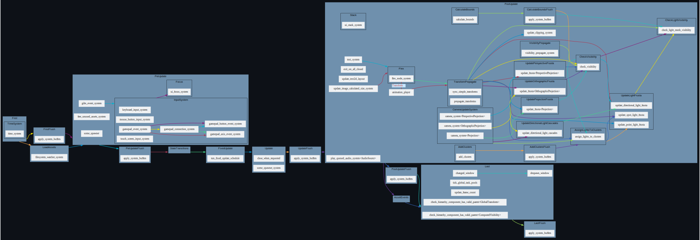
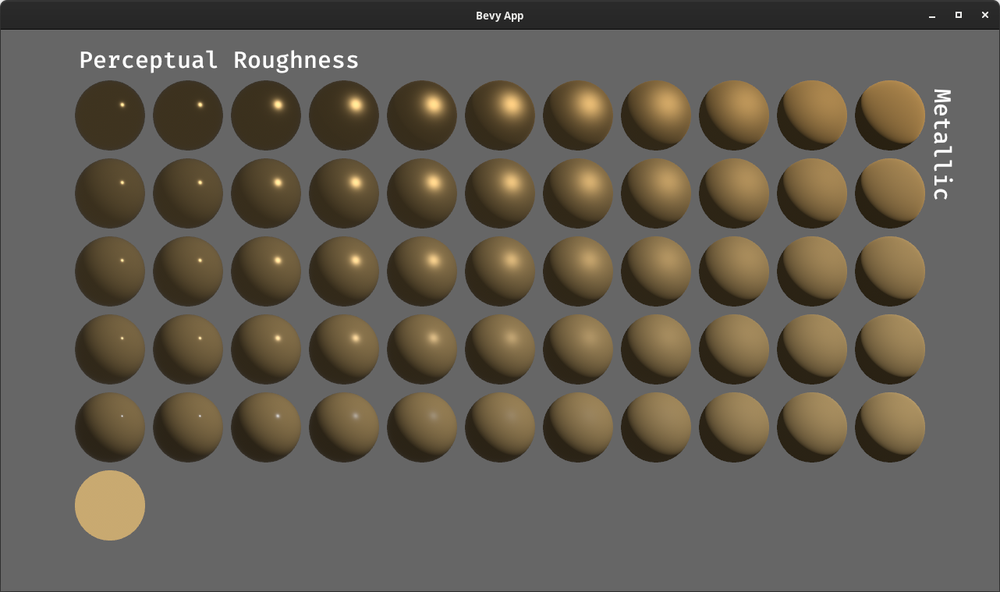
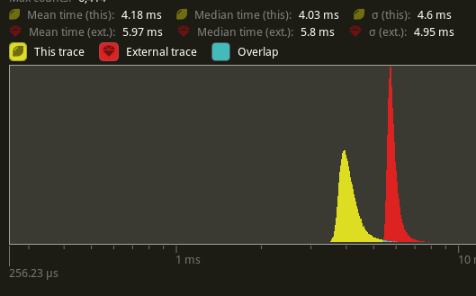

+++
title = "Bevy 0.10"
date = 2023-03-04
[extra]
author = "Bevy Contributors"
image = "ruins.png"
show_image = true
image_subtitle = "Ruins scene illustrating Bevy's new material blend modes and fog. Based on original scene by Casey Hardy (CC Attribution)"
image_subtitle_link = "https://github.com/coreh/bevy-demo-ruins"
+++

Thanks to **173** contributors, **689** pull requests, community reviewers, and our [**generous sponsors**](/community/donate), I'm happy to announce the **Bevy 0.10** release on [crates.io](https://crates.io/crates/bevy)!

For those who don't know, Bevy is a refreshingly simple data-driven game engine built in Rust. You can check out our [Quick Start Guide](/learn/book/getting-started/) to try it today. It's free and open source forever! You can grab the full [source code](https://github.com/bevyengine/bevy) on GitHub. Check out [Bevy Assets](https://bevyengine.org/assets) for a collection of community-developed plugins, games, and learning resources.

To update an existing Bevy App or Plugin to **Bevy 0.10**, check out our [0.9 to 0.10 Migration Guide](/learn/book/migration-guides/0.9-0.10/).

Since our last release a few months ago we've added a _ton_ of new features, bug fixes, and quality of life tweaks, but here are some of the highlights:

<!-- more -->

* **ECS Schedule v3**: Bevy now has much simpler, more flexible scheduling. Systems are now stored in a unified schedule, commands can be applied explicitly via `apply_system_buffers`, and a whole lot of quality of life and bug fixes.
* **Cascaded Shadow Maps**: Higher quality shadow maps that cover larger distances, where the quality follows the camera.
* **Environment Map Lighting**: 360 degree ambient image based lighting that can cheaply and drastically improve the visual quality of a scene.
* **Depth and Normal Prepass**: Render depth and normal textures for a scene prior to the main pass, enabling new effects and (in some cases) improved performance. Shadow mapping uses the prepass shaders, which enables transparent textures to cast shadows.
* **Smooth Skeletal Animation Transitions**: Smoothly transition between two skeletal animations playing at the same time!
* **Improved Android Support**: Bevy now works out of the box on more Android devices (with a couple of caveats)
* **Revamped Bloom**: Bloom now looks better, is easier to control, and has fewer visual artifacts.
* **Distance and Atmospheric Fog**: Add depth and ambiance to your scene with 3D distance and atmospheric fog effects!
* **StandardMaterial Blend Modes**: Achieve a variety of interesting effects with more PBR material blend modes.
* **More Tonemapping Choices**: Choose one of 7 popular tonemapping algorithms for your HDR scenes to achieve the visual style you are looking for.
* **Color Grading**: Control per-camera exposure, gamma, "pre-tonemapping saturation", and "post-tonemapping saturation".
* **Parallel Pipelined Rendering**: App logic and render logic now run in parallel automatically, yielding significant performance wins.
* **Windows as Entities**: Windows are now represented as entities instead of resources, improving the user experience and unlocking new scenarios.
* **Renderer Optimizations**: We spent a _ton_ of effort optimizing the renderer this cycle. Bevy's renderer is snappier than ever!
* **ECS Optimizations**: Likewise, we've turbocharged many common ECS operations. Bevy apps get a nice speed boost!

## ECS Schedule v3

<div class="release-feature-authors">authors: @alice-i-cecile, @maniwani, @WrongShoe, @cart, @jakobhellermann, @JoJoJet, @geieredgar and a whole lot more </div>

Thanks to the fantastic work of our ECS team, the hotly awaited ["stageless" scheduling RFC](https://github.com/bevyengine/rfcs/blob/main/rfcs/45-stageless.md) has been implemented!

**Schedule v3** is the culmination of significant design and implementation work. Scheduling APIs are a central and defining part of the Bevy developer experience, so we had to be very thoughtful and meticulous about this next evolution of the API. In addition to the [RFC PR](https://github.com/bevyengine/rfcs/pull/45), the [initial implementation PR](https://github.com/bevyengine/bevy/pull/6587) by `@maniwani` and the [Bevy Engine internals port PR](https://github.com/bevyengine/bevy/pull/7267) by `@alice-i-cecile` are great places to start if you would like a view into our process and rationale. As we all know, plans and implementations are two different things. Our final implementation is a bit different from the initial RFC (in a good way).

There are a ton of changes, but we've put a lot of care into ensuring the [migration path](/learn/book/migration-guides/0.9-0.10/#migrate-engine-to-schedule-v3-stageless) for existing applications is relatively straightforward. Don't sweat it!

Let's take a look at what shipped in 0.10!

### A Single Unified Schedule

Have you ever wanted to specify that `system_a` runs before `system_b`, only to be met with confusing warnings that `system_b` isn't found because it's in a different stage?

No more! All systems within a single [`Schedule`] are now stored in a single data structure with a global awareness of what's going on.

This simplifies our internal logic, makes your code more robust to refactoring, and allows plugin authors to specify high-level invariants (e.g. "movement must occur before collision checking") without locking themselves into an exact schedule location.

[](main_schedule_diagram.svg)

This diagram made with [@jakobhellermann's `bevy_mod_debugdump` crate](https://github.com/jakobhellermann/bevy_mod_debugdump) shows a simplified version of Bevy's default schedule.

[`Schedule`]: http://dev-docs.bevyengine.org/bevy/ecs/schedule/struct.Schedule.html

### Adding Systems

[`Systems`] (which are just [normal Rust functions!](https://github.com/bevyengine/bevy/tree/v0.10.0/crates/bevy_ecs#systems)) are how you define game logic in Bevy ECS. With **Schedule v3**, you can add systems to your [`App`] just like you did in previous versions:

```rust
app.add_system(gravity)
```

However **Schedule v3** has some new tricks up its sleeve! You can now add multiple systems at once:

```rust
app.add_systems((apply_acceleration, apply_velocity))
```

By default, Bevy runs systems in parallel to each other. In previous versions of Bevy, you ordered systems like this:

```rust
app
    .add_system(walk.before(jump))
    .add_system(jump))
    .add_system(collide.after(jump))
```

You can still do that! But you can now compress this using `add_systems`:

```rust
// much cleaner!
app.add_systems((
    walk.before(jump),
    jump,
    collide.after(jump),
))
```

`before()` and `after()` are definitely useful tools! However, thanks to the new `chain()` function, it is now _much easier_ to run systems in a specific order:

```rust
// This is equivalent to the previous example
app.add_systems((walk, jump, collide).chain())
```

`chain()` will run the systems in the order they were defined. Chaining also pairs with per-system configuration:

```rust
app.add_systems((walk.after(input), jump, collide).chain())
```

[`App`]: http://dev-docs.bevyengine.org/bevy/app/struct.App.html
[`Systems`]: http://dev-docs.bevyengine.org/bevy/ecs/system/trait.System.html

### Configurable System Sets

In **Schedule v3**, the idea of the "system set" has been redefined to support more natural and flexible control over how systems are run and scheduled. The old "system label" concept has been combined with the "set" concept, resulting in one straightforward but powerful abstraction.

[`SystemSets`] are named collections of systems that share system configuration across all of their members. Ordering systems relative to a [`SystemSet`] applies that ordering to _all_ systems in that set, in addition to any configuration on each individual system.

Let's jump right into what this would look like. You define [`SystemSets`] like this:

```rust
#[derive(SystemSet, Debug, Hash, PartialEq, Eq, Clone)]
enum PhysicsSet {
    Movement,
    CollisionDetection,
}
```

You can add systems to sets by calling the [`in_set`] method:

```rust
app.add_system(gravity.in_set(PhysicsSet::Movement))
```

You can combine this with the new system features mentioned above:

```rust
app.add_systems(
    (apply_acceleration, apply_velocity)
        .chain()
        .in_set(PhysicsSet::Movement)
)
```

Systems can belong to any number of sets:

```rust
app.add_system(
    move_player
        .in_set(MoveSet::Player)
        .in_set(PhysicsSet::Movement)
)
```

Configuration is added to sets like this:

```rust
app.configure_set(
    // Run systems in the Movement set before systems in the CollisionDetection set
    PhysicsSet::Movement.before(PhysicsSet::CollisionDetection)
)
```

Sets can be nested inside other sets, which will cause them to inherit the configuration of their parent set:

```rust
app.configure_set(MoveSet::Enemy.in_set(PhysicsSet::Movement))
```

Sets can be configured multiple times:

```rust
// In PlayerPlugin:
app.configure_set(MoveSet::Player.before(MoveSet::Enemy))

// In PlayerTeleportPlugin
app.configure_set(MoveSet::Player.after(PortalSet::Teleport))
```

Crucially system configuration is strictly additive: you cannot _remove_ rules added elsewhere. This is both an "anti-spaghetti" and "plugin privacy" consideration. When this rule is combined with Rust's robust type privacy rules, plugin authors can make careful decisions about which exact invariants need to be upheld, and reorganize code and systems internally without breaking consumers.

Configuration rules _must be compatible with each other_: any paradoxes (like a system set inside of itself, a system that must run both before and after a set, order cycles, etc) will result in a runtime panic with a helpful error message.

[`SystemSet`]: http://dev-docs.bevyengine.org/bevy/ecs/schedule/trait.SystemSet.html
[`SystemSets`]: http://dev-docs.bevyengine.org/bevy/ecs/schedule/trait.SystemSet.html
[`in_set`]: http://dev-docs.bevyengine.org/bevy/ecs/schedule/trait.IntoSystemConfig.html#method.in_set

### Directly Schedule Exclusive Systems

"Exclusive systems" are [`Systems`] that have mutable direct access to the entire ECS [`World`]. For this reason, they cannot be run in parallel with other [`Systems`].

Since Bevy's inception, Bevy devs have wanted to schedule exclusive systems (and flush commands) relative to normal systems.

Now you can! Exclusive systems can now be scheduled and ordered like any other system.

```rust
app
    .add_system(ordinary_system)
    // This works!
    .add_system(exclusive_system.after(ordinary_system))
```

This is particularly powerful, as **command flushes** (which apply queued-up [`Commands`] added in systems to do things like spawn and despawn entities) are now simply performed in the `apply_system_buffers` exclusive system.

```rust
app.add_systems(
    (
        // This system produces some commands
        system_a,
        // This will apply the queued commands from system_a
        apply_system_buffers,
        // This system will have access to the results of
        // system_a's commands
        system_b,
    // This chain ensures the systems above run in the order
    // they are defined
    ).chain()
)
```

Do be careful with this pattern though: it's easy to quickly end up with many poorly ordered exclusive systems, creating bottlenecks and chaos.

What will you do with this much power? We're keen to find out!

### Managing Complex Control Flow with Schedules

But what if you want to do something _weird_ with your [`Schedule`]? Something non-linear, branching, or looping. What should you reach for?

It turns out, Bevy already _had_ a great tool for this: schedules that run inside of an exclusive system. The idea is pretty simple:

1. Construct a schedule, that stores whatever complex logic you want to run.
2. Store that schedule inside of a resource.
3. In an exclusive system, perform any arbitrary Rust logic you want to decide if and how your schedule runs.
4. Temporarily take the schedule out of the [`World`], run it on the rest of the world to mutate both the schedule and the world, and then put it back in.

With the addition of the new [`Schedules`] resource and the `world.run_schedule()` API it's more ✨ ergonomic ✨ than ever.

```rust
// A Schedule!
let mut my_schedule = Schedule::new();
schedule.add_system(my_system);

// A label for our new Schedule!
#[derive(ScheduleLabel, Debug, Hash, PartialEq, Eq, Clone)]
struct MySchedule;

// An exclusive system to run this schedule
fn run_my_schedule(world: &mut World) {
    while very_complex_logic() {
        world.run_schedule(MySchedule);
    }
}

// Behold the ergonomics!
app
    .add_schedule(MySchedule, my_schedule)
    .add_system(run_my_schedule);
```

Bevy uses this pattern for five rather different things in **Bevy 0.10**:

1. **Startup systems:** these now live in their own schedule, which is run once at the start of the app.
2. **Fixed timestep systems:** another schedule?! The exclusive system that runs this schedule accumulates time, running a while loop that repeatedly runs `CoreSchedule::FixedTimestep` until all of the accumulated time has been spent.
3. **Entering and exiting states:** a bonanza of schedules. Each collection of systems that runs logic to enter and exit a state variant is stored in its own schedule, which is called based on the change in state in the `apply_state_transitions::<S>` exclusive system.
4. **Rendering:** all rendering logic is stored in its own schedule to allow it to run asynchronously relative to gameplay logic.
5. **Controlling the outermost loop:** in order to handle the "startup schedule first, then main schedule" logic, we wrap it all up in a minimal overhead `CoreSchedule::Outer` and then run our schedules as the sole exclusive system there.

Follow the breadcrumbs starting at [`CoreSchedule`](https://docs.rs/bevy/0.10.0/bevy/app/enum.CoreSchedule.html) for more info.

[`Schedules`]: http://dev-docs.bevyengine.org/bevy/ecs/schedule/struct.Schedules.html

### Run Conditions

[`Systems`] can have any number of **run conditions**, which are "just" systems that return a `bool`. If the `bool`s returned by _all_ of a system's **run conditions** are `true`, the system will run. Otherwise the system will be skipped for the current run of the schedule:

```rust
// Let's make our own run condition
fn game_win_condition(query: Query<&Player>, score: Res<Score>) -> bool {
    let player = query.single();
    player.is_alive() && score.0 > 9000
}

app.add_system(win_game.run_if(game_win_condition));
```

**Run conditions** also a number of "combinator" operations, thanks to [@JoJoJet](https://github.com/bevyengine/bevy/pull/7547) and [@Shatur](https://github.com/bevyengine/bevy/pull/7559):

They can be negated with `not()`:

```rust
app.add_system(continue_game.run_if(not(game_win_condition)))
```

They can also be combined with `and_then` and `or_else`:

```rust
app.add_system(move_player.run_if(is_alive.or_else(is_zombie)))
```

Bevy 0.10 is shipping with a lovely collection of built-in [common run conditions](https://docs.rs/bevy/0.10.0/bevy/ecs/schedule/common_conditions/index.html). You can easily run systems if there are events to process, timers that elapsed, resources that changed, input state changes, states that changed, and more (thanks to [`@maniwani`](https://github.com/bevyengine/bevy/pull/6587), [`@inodentry`](https://github.com/bevyengine/bevy/pull/7579), [`@jakobhellermann`](https://github.com/bevyengine/bevy/pull/7806), and [`@jabuwu`](https://github.com/bevyengine/bevy/pull/7866)).

**Run conditions** can also serve as a lightweight optimization tool. Run conditions are evaluated on the main thread, and each run criteria is evaluated exactly once each schedule update, at the time of the first system in the set that relies on it. Systems disabled by run conditions don't spawn a task, which can add up across many systems. Like always though: benchmark!

**Run conditions** have replaced the "run criteria" in previous versions of Bevy. We can finally get rid of the dreaded "looping run criteria"! [`ShouldRun::YesAndCheckAgain`](https://docs.rs/bevy/0.9.1/bevy/ecs/schedule/enum.ShouldRun.html) was not exactly straightforward to reason about, either for engine devs or users. It's always a bad sign when your bool-like enums have four possible values. If you crave more complex control flow: use the "schedules in exclusive systems" pattern in the [section above](#directly-schedule-exclusive-systems). For the other 99% of use cases, enjoy the simpler `bool`-based run conditions!

### Simpler States

**Schedule v3** adds a new, much simpler "state system". [`States`] allow you to easily configure different [`App`] logic to run based on the current "state" of the [`App`].

You define [`States`] like this:

```rust
#[derive(States, PartialEq, Eq, Debug, Default)]
enum AppState {
    #[default]
    MainMenu,
    InGame,
}
```

Each variant of the enum corresponds to a different state the [`App`] can be in.

You add [`States`] to your [`App`] like this:

```rust
app.add_state::<AppState>()
```

This will setup your [`App`] to use the given state. It adds the [`State`] resource, which can be used to find the current state the [`App`] is in:

```rust
fn check_state(state: Res<State<AppState>>) {
    info!("We are in the {} state", state.0);
}
```

Additionally, `add_state` will create an `OnUpdate` set for each possible value, which you can then add your systems to. These sets run as part of the normal app update, but only when the app is in a given state:

```rust
app
    .add_systems(
        (main_menu, start_game)
            .in_set(OnUpdate(AppState::MainMenu))
    )
    .add_system(fun_gameplay.in_set(OnUpdate(AppState::InGame)));
```

It will also create `OnEnter` and `OnExit` schedules for each state, which will only run when transitioning from one state to another:

```rust
app
    .add_system(load_main_menu.in_schedule(OnEnter(AppState::MainMenu)))
    .add_system(cleanup_main_menu.in_schedule(OnExit(AppState::MainMenu)))
```

`add_state` also adds the [`NextState`] resource, which can be used to queue a state change:

```rust
fn start_game(
    button_query: Query<&Interaction, With<StartGameButton>>,
    next_state: ResMut<NextState<AppState>>,
){
    if button_query.single() == Interaction::Pressed {
        *next_state = NextState(AppState::InGame);
    }
}
```

This replaces Bevy's previous state system, which was very hard to deal with. It had state stacks, elaborate queued transitions, error handling (that most people just unwrapped). The state stack was very complex to learn, very prone to exasperating bugs, and mostly ignored.

As a result, in **Bevy 0.10** states are now "stackless": only one queued state of each type at a time. After lots of alpha testing, we're reasonably confident that this shouldn't be too bad to migrate away from. If you were relying on the state stack, you have plenty of options:

* Build the "stack" logic on top of the core state system
* Split your state into multiple states, which capture orthogonal elements of your app's status
* Build your own state stack abstraction using the same patterns as Bevy's first-party version. None of the new state logic is hard coded! If you build something, [let the rest of the community know](/assets) so you can collaborate!

[`States`]: http://dev-docs.bevyengine.org/bevy/ecs/schedule/trait.States.html
[`State`]: http://dev-docs.bevyengine.org/bevy/ecs/schedule/struct.State.html
[`NextState`]: http://dev-docs.bevyengine.org/bevy/ecs/schedule/struct.NextState.html

### Base Sets: Getting Default Behavior Right

An astute reader may point out that:

1. Bevy automatically runs its systems in parallel.
2. [The order of systems is nondeterministic unless there is an explicit ordering relationship between them](https://github.com/bevyengine/bevy/blob/latest/examples/ecs/nondeterministic_system_order.rs)
3. All of the systems are now stored in a single `Schedule` object with no barriers between them
4. Systems can belong to any number of system sets, each of which can add their own behavior
5. Bevy is a powerful engine with many internal systems.

Won't this lead to utter chaos and tedious spaghetti-flavored work to resolve every last ordering ambiguity?
Many users _liked_ stages, they were helpful for understanding the structure of an [`App`]!

Well, I'm glad you asked, rhetorical skeptic. To reduce this chaos (and ease migration), **Bevy 0.10** comes with a brand new collection of system sets provided by [`DefaultPlugins`]: [`CoreSet`](https://docs.rs/bevy/0.10.0/bevy/app/enum.CoreSet.html), [`StartupSet`](https://docs.rs/bevy/0.10.0/bevy/app/enum.StartupSet.html), and [`RenderSet`](https://docs.rs/bevy/0.10.0/bevy/render/enum.RenderSet.html). The similarity of their names to the old [`CoreStage`](https://docs.rs/bevy/0.9.1/bevy/app/enum.CoreStage.html), [`StartupStage`](https://docs.rs/bevy/0.9.1/bevy/app/enum.StartupStage.html), and [`RenderStage`](https://docs.rs/bevy/0.9.1/bevy/render/enum.RenderStage.html) is not a coincidence. Much like stages, there are command flush points between each set, and existing systems have been migrated directly.

Some parts of the stage-centric architecture were appealing: a clear high-level structure, coordination on flush points (to reduce excessive bottlenecks), and good default behavior.
To keep those bits (while excising the frustrating ones), we've introduced the concept of **Base Sets** ([added by @cart](https://github.com/bevyengine/bevy/pull/7466)). **Base Sets** are just normal [`SystemSets`], except:

1. Every system can belong to at most one base set.
2. Systems that do not specify a base set will be added to the default base set for the schedule (if the schedule has one).

```rust
// You define base sets exactly like normal sets, with the
// addition of the system_set(base) attribute
#[derive(Debug, Hash, PartialEq, Eq, Clone, SystemSet)]
#[system_set(base)]
enum MyBaseSet {
    Early,
    Late,
}

app
    // This ends up in CoreSet::Update by default
    .add_system(no_explicit_base_set)
    // You must use .in_base_set rather than .in_set for explicitness
    // This is a high-impact decision!
    .add_system(post_update.in_base_set(CoreSet::PostUpdate))
    // Look, it works!
    .add_system(custom_base_set.in_base_set(MyBaseSet::Early))
    // Ordering your base sets relative to CoreSet is probably wise
    .configure_set(MyBaseSet::Early.before(CoreSet::Update))
    .configure_set(MyBaseSet::Late.after(CoreSet::Update));
```

Let me tell you a story, set in a world without **Base Sets**:

1. A new user adds the `make_player_run` system to their app.
2. Sometimes this system runs before input handling, leading to randomly dropped inputs. Sometimes it runs after rendering, leading to strange flickers.
3. After much frustration, the user discovers that these are due to "system execution order ambiguities".
4. The user runs a specialized detection tool, digs into the source code of the engine, figures out what order their system should run in relative to the engine's system sets, and then continues on their merry way, doing this for each new system.
5. Bevy (or one of their third-party plugins) updates, breaking all of our poor users system ordering once again.

The clear problem this illustrates is that _most_ gameplay systems should not need to know or care about "internal systems".

We've found that in practice, there are three broad classes of systems: gameplay logic (the majority of all end user systems), stuff that needs to happen before gameplay logic (like event cleanup and input handling), and stuff that needs to happen after gameplay logic (like rendering and audio).

By broadly ordering the schedule via **Base Sets**, Bevy apps can have good default behavior and clear high-level structure without compromising on the scheduling flexibility and explicitness that advanced users crave.
Let us know how it works out for you!

### Improved System Ambiguity Detection

When multiple systems interact with an ECS resource in conflicting ways, but don't have an ordering constraint between them, we call this an "ambiguity". If your [`App`] has ambiguities, this can cause bugs. We've significantly improved our ambiguity reporting, which can be configured in the new [`ScheduleBuildSettings`](https://docs.rs/bevy/0.10.0/bevy/ecs/schedule/struct.ScheduleBuildSettings.html). Check out the docs for more info. If you haven't tried this out on your app yet: you should take a look!

### Single Threaded Execution

You can now easily switch a [`Schedule`] to single-threaded evaluation via the [`SingleThreadedExecutor`](https://docs.rs/bevy/0.10.0/bevy/ecs/schedule/struct.SingleThreadedExecutor.html) for users who don't want or need parallelism.

```rust
schedule.set_executor_kind(ExecutorKind::SingleThreaded);
```

## Cascaded Shadow Maps

<div class="release-feature-authors">authors: @danchia, Rob Swain (@superdump)</div>

Bevy uses "shadow maps" to cast shadows for lights / objects. Previous versions of Bevy used a simple but limited shadow map implementation for directional light sources. For a given light, you would define the resolution of the shadow map _and_ a manual "view projection" that would determine how the shadow is cast. This had a number of downsides:

* The resolution of the shadow map was fixed. You had to choose something between "cover a large area, but have a lower resolution" and "cover a smaller area, but have a higher resolution".
* The resolution didn't adapt to camera positioning. Shadows might look great in one position, but terrible in another position.
* The "shadow projection" had to be manually defined. This made it hard and unapproachable to configure shadows to match a given scene.

**Bevy 0.10** adds "cascaded shadow maps", which breaks up the camera's view frustum into a series of configurable "cascades", which each have their own shadow map. This enables shadows in the cascade "close to the camera" to be highly detailed, while allowing shadows "far from the camera" to cover a wider area with less detail. Because it uses the camera's view frustum to define the shadow projections, the shadow quality remains consistent as the camera moves through the scene. This also means that users don't need to manually configure shadow projections anymore. They are automatically calculated!

<video controls loop><source  src="shadow_cascades.mp4" type="video/mp4"/></video>

Notice how the nearby shadows are highly detailed whereas the shadows in the distance become less detailed as they get farther away (which doesn't matter as much because they are far away).

While shadow cascades solve important problems, they also introduce new ones. How many cascades should you use? What is the minimum and maximum distance from the camera where shadows should appear? How much overlap should there be between cascades? Be sure to dial in these parameters to fit your scenes.

## Environment Map Lighting

<div class="release-feature-authors">authors: @JMS55</div>

Environment maps are a popular and computationally cheap way to significantly improve the quality of a scene's lighting. It uses a cube map texture to provide 360 degree lighting "from all directions". This is especially apparent for reflective surfaces, but it applies to all lit materials.

This is what the PBR material looks like without environment map lighting:



And this is what the PBR material looks like with environment map lighting:


For scenes that need constant lighting (especially outdoor scenes), environment maps are a great solution. And because environment maps are arbitrary images, artists have a lot of control over the character of the scene's lighting.

## Depth and Normal Prepass

<div class="release-feature-authors">authors: @icesentry, Rob Swain (@superdump), @robtfm, @JMS55</div>

<video controls loop><source  src="force_field.mp4" type="video/mp4"/></video>
<p class="release-feature-authors">This effect uses the depth from the prepass to find the intersection between the ground and the force field</p>

Bevy now has the ability to run a depth and/or normal prepass. This means the depth and normal textures will be generated in a render pass that runs before the main pass and can therefore be used during the main pass. This enables various special effects like Screen Space Ambient Occlusion, Temporal Anti Aliasing, and many more. These are currently being worked on and should be [available in the next release of Bevy](#what-s-next).


<p class="release-feature-authors">In the image on the right, green lines are edges detected in the normal texture and blue lines are edges detected in the depth texture</p>


<p class="release-feature-authors">The depth and normal textures generated by the prepass</p>

Using the prepass essentially means rendering everything twice. The prepass itself is much faster since it does a lot less work than the main pass. The result of the prepass can be used to reduce overdraw in the main pass, but if your scene didn't already suffer from overdraw then enabling the prepass will negatively affect performance.  There are many things that can be done to improve this and we will keep working towards this goal. Like with anything performance related, make sure to measure it for your use case and see if it helps or not.

The prepass is still very useful when working on special effects that require a depth or normal texture, so if you want to use it you can simply add the `DepthPrepass` or `NormalPrepass` components to your camera.

## Shadow Mapping using Prepass Shaders

<div class="release-feature-authors">authors: @geieredgar</div>

Previously, the shader used for shadow mapping was hard-coded and had no knowledge of the material, only meshes. Now in **Bevy 0.10**, a `Material`'s depth prepass shaders are used for shadow mapping. This means that the shaders used to do the shadow mapping for a `Material` are customizable!

As a bonus, the availability of `Material` information during shadow mapping means that we could instantly enable alpha mask shadows allowing foliage to cast shadows according to the alpha values in their texture rather than only based on their geometry.


<div style="font-size: 1.0rem" class="release-feature-authors"><a href="https://developer.nvidia.com/orca/nvidia-emerald-square">NVIDIA ORCA Emerald Square scene</a> (<a href="https://creativecommons.org/licenses/by-nc-sa/3.0/">CC BY-NC-SA 3.0</a>) with alpha mask shadow support</div>

## Smooth Skeletal Animation Transitions

<div class="release-feature-authors">authors: @smessmer</div>

You can now smoothly transition between two (or more) skeletal animations!

<video controls loop><source  src="animation_transition.mp4" type="video/mp4"/></video>

<div style="font-size: 1.0rem" class="release-feature-authors">Character model and animations are royalty free assets from Mixamo.
</div>

With the new [`play_with_transition`] method on the [`AnimationPlayer`] component, you can now specify a transition duration during which the new animation will be linearly blended with the currently playing animation, whose weight will decrease during that duration until it reaches `0.0`.

```rust
#[derive(Component, Default)]
struct ActionTimer(Timer);

#[derive(Component)]
struct Animations {
    run: Handle<AnimationClip>,
    attack: Handle<AnimationClip>,
}

fn run_or_attack(
    mut query: Query<(&mut AnimationPlayer, &mut ActionTimer, &Animations)>,
    keyboard_input: Res<Input<KeyCode>>,
    animation_clips: Res<Assets<AnimationClip>>,
    time: Res<Time>,
) {
    for (mut animation_player, mut timer, animations) in query.iter_mut() {
        // Trigger the attack animation when pressing <space>
        if keyboard_input.just_pressed(KeyCode::Space) {
            let clip = animation_clips.get(&animations.attack).unwrap();
            // Set a timer for when to restart the run animation
            timer.0 = Timer::new(
                Duration::from_secs_f32(clip.duration() - 0.5),
                TimerMode::Once,
            );
            // Will transition over half a second to the attack animation
            animation_player
                .play_with_transition(animations.attack.clone(), Duration::from_secs_f32(0.5));
        }
        if timer.0.tick(time.delta()).just_finished() {
            // Once the attack animation is finished, restart the run animation
            animation_player
                .play_with_transition(animations.run.clone(), Duration::from_secs_f32(0.5))
                .repeat();
        }
    }
}
```

[`AnimationPlayer`]: https://docs.rs/bevy/0.10.0/bevy/animation/struct.AnimationPlayer.html
[`play_with_transition`]: https://docs.rs/bevy/0.10/bevy/animation/struct.AnimationPlayer.html#method.play_with_transition

## Improved Android Support

<div class="release-feature-authors">authors: @mockersf, @slyedoc</div>


Bevy now runs out of the box on Android on more devices. This was unlocked by waiting for the [`Resumed`](https://docs.rs/winit/0.28/winit/event/enum.Event.html#variant.Resumed) event to create the window instead of doing it on startup, matching the [`onResume()`](https://developer.android.com/guide/components/activities/activity-lifecycle#onresume) callback on Android.

To follow the recommendations on the [`Suspended`](https://docs.rs/winit/0.28/winit/event/enum.Event.html#variant.Suspended) event, Bevy will now exit on receiving that event. This is a temporary solution until Bevy is able to recreate rendering resources when being resumed.

Please test on your devices and report successes or issues you may encounter! There is a known issue around touch position on some devices with software buttons, as winit doesn't expose [yet](https://github.com/rust-windowing/winit/issues/2308) the inset size, only the inner size.

As this brings Bevy closer to full support of Android, there isn't a need anymore for separate examples for Android and iOS. They have been regrouped in one ["mobile" example](https://github.com/bevyengine/bevy/tree/v0.10.0/examples/mobile), and the instructions updated ([for Android](https://github.com/bevyengine/bevy/tree/v0.10.0/examples#android) and [for iOS](https://github.com/bevyengine/bevy/tree/v0.10.0/examples#ios)).

Here is the same example running on iOS!


## Revamped Bloom

<div class="release-feature-authors">authors: @StarLederer, @JMS55</div>

Bloom has undergone some major changes and now looks better, is easier to control, and has fewer visual artifacts.
In combination with the new tonemapping options, bloom has been much improved since the previous release!

1. In Bevy 0.9, bloom looked like this.
2. Switching the tonemapper to something like `AcesFitted` is already a big improvement.
3. In Bevy 0.10, bloom now looks like this. It's much more controlled and less overbearing.
4. To make the bloom stronger, rather than raise the `BloomSettings` intensity,
let's double the `emissive` value of each cube.
5. Finally, if you want more extreme bloom similar to the old algorithm, you can change
`BloomSettings::composite_mode` from `BloomCompositeMode::EnergyConserving` to `BloomCompositeMode::Additive`.
6. Explore the new bloom settings in an interactive playground using the new `bloom_3d` (and `bloom_2d`) examples.

<div style="display: grid; grid-template-columns: repeat(auto-fit, minmax(400px, 1fr)); grid-gap: 16px;">
     <div style="position: relative;">
        <div style="position: absolute; top: 0; left: 0; background-color: black; color: white; border-radius: 10px 0 10px 0; width: 30px; height: 30px; padding: 2px; box-shadow: 2px 2px 4px rgba(0,0,0,0.3); text-align: center; opacity: 0.8;">1</div>
        
     </div>
     <div style="position: relative;">
        <div style="position: absolute; top: 0; left: 0; background-color: black; color: white; border-radius: 10px 0 10px 0; width: 30px; height: 30px; padding: 2px; box-shadow: 2px 2px 4px rgba(0,0,0,0.3); text-align: center; opacity: 0.8;">2</div>
        
     </div>
     <div style="position: relative;">
        <div style="position: absolute; top: 0; left: 0; background-color: black; color: white; border-radius: 10px 0 10px 0; width: 30px; height: 30px; padding: 2px; box-shadow: 2px 2px 4px rgba(0,0,0,0.3); text-align: center; opacity: 0.8;">3</div>
        
     </div>
     <div style="position: relative;">
        <div style="position: absolute; top: 0; left: 0; background-color: black; color: white; border-radius: 10px 0 10px 0; width: 30px; height: 30px; padding: 2px; box-shadow: 2px 2px 4px rgba(0,0,0,0.3); text-align: center; opacity: 0.8;">4</div>
        
     </div>
     <div style="position: relative;">
        <div style="position: absolute; top: 0; left: 0; background-color: black; color: white; border-radius: 10px 0 10px 0; width: 30px; height: 30px; padding: 2px; box-shadow: 2px 2px 4px rgba(0,0,0,0.3); text-align: center; opacity: 0.8;">5</div>
        
     </div>
     <div style="position: relative;">
        <div style="position: absolute; top: 0; left: 0; background-color: black; color: white; border-radius: 10px 0 10px 0; width: 30px; height: 30px; padding: 2px; box-shadow: 2px 2px 4px rgba(0,0,0,0.3); text-align: center; opacity: 0.8;">6</div>
        
     </div>
 </div>

## Distance and Atmospheric Fog

<div class="release-feature-authors">author: Marco Buono (@coreh)</div>

Bevy can now render distance and atmospheric fog effects, bringing a heightened sense of _depth_ and _ambiance_ to your scenes by making objects appear dimmer the further away they are from view.


Fog is controllable per camera via the new [`FogSettings`] component. Special care has been put into exposing several knobs to give you full artistic control over the look of your fog, including the ability to fade the fog in and out by controlling the alpha channel of the fog color.

```rust
commands.spawn((
    Camera3dBundle::default(),
    FogSettings {
        color: Color::rgba(0.1, 0.2, 0.4, 1.0),
        falloff: FogFalloff::Linear { start: 50.0, end: 100.0 },
    },
));
```

_Exactly how_ fog behaves with regard to distance is controlled via the [`FogFalloff`] enum. All of the “traditional” fog falloff modes from the fixed-function OpenGL 1.x / DirectX 7 days are supported:

`FogFalloff::Linear` increases in intensity linearly from 0 to 1 between `start` and `end` parameters. (This example uses values of 0.8 and 2.2, respectively.)

<svg width="370" height="212" viewBox="0 0 370 212" fill="none">
<path d="M331 151H42V49" stroke="currentColor" stroke-width="2"/>
<text font-family="sans-serif" fill="currentColor" style="white-space: pre" font-family="Inter" font-size="12" letter-spacing="0em"><tspan x="136" y="173.864">1</tspan></text>
<text font-family="sans-serif" fill="currentColor" style="white-space: pre" font-family="Inter" font-size="12" letter-spacing="0em"><tspan x="30" y="53.8636">1</tspan></text>
<text font-family="sans-serif" fill="currentColor" style="white-space: pre" font-family="Inter" font-size="12" letter-spacing="0em"><tspan x="42" y="173.864">0</tspan></text>
<text font-family="sans-serif" fill="currentColor" style="white-space: pre" font-family="Inter" font-size="12" letter-spacing="0em"><tspan x="232" y="173.864">2</tspan></text>
<text font-family="sans-serif" fill="currentColor" style="white-space: pre" font-family="Inter" font-size="12" letter-spacing="0em"><tspan x="332" y="173.864">3</tspan></text>
<text font-family="sans-serif" fill="currentColor" style="white-space: pre" font-family="Inter" font-size="12" letter-spacing="0em"><tspan x="161" y="190.864">distance</tspan></text>
<text font-family="sans-serif" transform="translate(10 132) rotate(-90)" fill="currentColor" style="white-space: pre" font-family="Inter" font-size="12" letter-spacing="0em"><tspan x="0" y="11.8636">fog intensity</tspan></text>
<path d="M43 150H117.227L263 48H331" stroke="#FF00E5"/>
<path d="M118 151V49" stroke="#FF00E5" stroke-dasharray="1 4"/>
<path d="M263 151V49" stroke="#FF00E5" stroke-dasharray="1 4"/>
<text font-family="sans-serif" fill="#FF00E5" style="white-space: pre" font-family="Inter" font-size="10" letter-spacing="0em"><tspan x="121" y="58.6364">start</tspan></text>
<text font-family="sans-serif" fill="#FF00E5" style="white-space: pre" font-family="Inter" font-size="10" letter-spacing="0em"><tspan x="267" y="58.6364">end</tspan></text>
</svg>

`FogFalloff::Exponential` increases according to an (inverse) exponential formula, controlled by a `density` parameter.

<svg width="370" height="212" viewBox="0 0 370 212" fill="none">
<mask id="mask0_3_31" style="mask-type:alpha" maskUnits="userSpaceOnUse" x="42" y="42" width="286" height="108">
<rect x="42" y="42" width="286" height="108" fill="#D9D9D9"/>
</mask>
<g mask="url(#mask0_3_31)">
<path d="M42 150C42 150 98.3894 53 254.825 53L662 53" stroke="#FF003D" stroke-width="1"/>
<path d="M42 150C42 150 139.499 53 409.981 53L1114 53" stroke="#001AFF" stroke-width="1"/>
<path d="M42 150C42 150 206.348 53 662.281 53L1849 53" stroke="#14FF00" stroke-width="1"/>
</g>
<path d="M331 151H42V49" stroke="currentColor" stroke-width="2"/>
<text font-family="sans-serif" fill="currentColor" style="white-space: pre" font-size="12" letter-spacing="0em"><tspan x="136" y="173.864">1</tspan></text>
<text font-family="sans-serif" fill="currentColor" style="white-space: pre" font-size="12" letter-spacing="0em"><tspan x="30" y="53.8636">1</tspan></text>
<text font-family="sans-serif" fill="currentColor" style="white-space: pre" font-size="12" letter-spacing="0em"><tspan x="42" y="173.864">0</tspan></text>
<text font-family="sans-serif" fill="currentColor" style="white-space: pre" font-size="12" letter-spacing="0em"><tspan x="232" y="173.864">2</tspan></text>
<text font-family="sans-serif" fill="currentColor" style="white-space: pre" font-size="12" letter-spacing="0em"><tspan x="332" y="173.864">3</tspan></text>
<text font-family="sans-serif" fill="#FF003D" style="white-space: pre" font-size="10" letter-spacing="0em"><tspan x="77" y="64.6364">density = 2</tspan></text>
<text font-family="sans-serif" fill="#001AFF" style="white-space: pre" font-size="10" letter-spacing="0em"><tspan x="236" y="76.6364">density = 1</tspan></text>
<text font-family="sans-serif" fill="#14FF00" style="white-space: pre" font-size="10" letter-spacing="0em"><tspan x="205" y="115.636">density = 0.5</tspan></text>
<text font-family="sans-serif" fill="currentColor" style="white-space: pre" font-size="12" letter-spacing="0em"><tspan x="161" y="190.864">distance</tspan></text>
<text font-family="sans-serif" transform="translate(10 132) rotate(-90)" fill="currentColor" style="white-space: pre" font-size="12" letter-spacing="0em"><tspan x="0" y="11.8636">fog intensity</tspan></text>
</svg>

`FogFalloff::ExponentialSquared` grows according to a slightly modified (inverse) exponential square formula, also controlled by a `density` parameter.

<svg width="370" height="212" viewBox="0 0 370 212" fill="none">
<mask id="mask0_1_3" style="mask-type:alpha" maskUnits="userSpaceOnUse" x="42" y="42" width="286" height="108">
<rect x="42" y="42" width="286" height="108" fill="#D9D9D9"/>
</mask>
<g mask="url(#mask0_1_3)">
<path d="M42 150C75.4552 150 74.9241 53.1724 166.262 53.1724L404 53.1724" stroke="#FF003D" stroke-width="1"/>
<path d="M42 150C107.986 150 106.939 53.1724 287.091 53.1724L756 53.1724" stroke="#001AFF" stroke-width="1"/>
<path d="M42 150C166.394 150 164.42 53.1724 504.035 53.1724L1388 53.1724" stroke="#14FF00" stroke-width="1"/>
</g>
<path d="M331 151H42V49" stroke="currentColor" stroke-width="2"/>
<text font-family="sans-serif" fill="currentColor" style="white-space: pre" font-size="12" letter-spacing="0em"><tspan x="136" y="173.864">1</tspan></text>
<text font-family="sans-serif" fill="currentColor" style="white-space: pre" font-size="12" letter-spacing="0em"><tspan x="30" y="53.8636">1</tspan></text>
<text font-family="sans-serif" fill="currentColor" style="white-space: pre" font-size="12" letter-spacing="0em"><tspan x="42" y="173.864">0</tspan></text>
<text font-family="sans-serif" fill="currentColor" style="white-space: pre" font-size="12" letter-spacing="0em"><tspan x="232" y="173.864">2</tspan></text>
<text font-family="sans-serif" fill="currentColor" style="white-space: pre" font-size="12" letter-spacing="0em"><tspan x="332" y="173.864">3</tspan></text>
<text font-family="sans-serif" fill="#FF003D" style="white-space: pre" font-size="10" letter-spacing="0em"><tspan x="61" y="54.6364">density = 2</tspan></text>
<text font-family="sans-serif" fill="#001AFF" style="white-space: pre" font-size="10" letter-spacing="0em"><tspan x="168" y="84.6364">density = 1</tspan></text>
<text font-family="sans-serif" fill="#14FF00" style="white-space: pre" font-size="10" letter-spacing="0em"><tspan x="174" y="121.636">density = 0.5</tspan></text>
<text font-family="sans-serif" fill="currentColor" style="white-space: pre" font-size="12" letter-spacing="0em"><tspan x="161" y="190.864">distance</tspan></text>
<text font-family="sans-serif" transform="translate(10 132) rotate(-90)" fill="currentColor" style="white-space: pre" font-size="12" letter-spacing="0em"><tspan x="0" y="11.8636">fog intensity</tspan></text>
</svg>

Additionally, a more sophisticated `FogFalloff::Atmospheric` mode is available which provides _more physically accurate_ results by taking light `extinction` and `inscattering` into account separately.

[`DirectionalLight`] influence is also supported for all fog modes via the `directional_light_color` and `directional_light_exponent` parameters, mimicking the light dispersion effect seen in sunny outdoor environments.


Since directly controlling the non-linear fog falloff parameters “by hand” can be tricky to get right, a number of helper functions based on [meteorological visibility](https://en.wikipedia.org/wiki/Visibility) are available, such as [`FogFalloff::from_visibility()`](https://docs.rs/bevy/0.10.0/bevy/pbr/enum.FogFalloff.html#method.from_visibility):

```rust
FogSettings {
    // objects retain visibility (>= 5% contrast) for up to 15 units
    falloff: FogFalloff::from_visibility(15.0),
    ..default()
}
```

Fog is applied “forward rendering-style” on the PBR fragment shader, instead of as a post-processing effect, which allows it to properly handle semi-transparent meshes.

The atmospheric fog implementation is largely based on [this great article](https://iquilezles.org/articles/fog/) by Inigo Quilez, Shadertoy co-creator, and computer graphics legend. _Thanks for the great write up and inspiration!_

[`FogSettings`]: https://docs.rs/bevy/0.10.0/bevy/pbr/struct.FogSettings.html
[`FogFalloff`]: https://docs.rs/bevy/0.10.0/bevy/pbr/enum.FogFalloff.html
[`DirectionalLight`]: https://docs.rs/bevy/0.10.0/bevy/pbr/struct.DirectionalLight.html

## StandardMaterial Blend Modes

<div class="release-feature-authors">author: Marco Buono (@coreh)</div>

The [`AlphaMode`] enum has been extended in **Bevy 0.10**, bringing support for _additive and multiplicative blending_ to the [`StandardMaterial`]. These two blend modes are staples of the “classic” (non physically-based) computer graphics toolbelt, and are commonly used to achieve a variety of effects.

<video controls loop><source src="demo-ruins.mp4" type="video/mp4"/></video>

_Demo showcasing the use of blend modes to create stained glass and fire effects._ (<a href="https://github.com/coreh/bevy-demo-ruins">Source Code</a>)

Additionally, support for semi-transparent textures with [premultiplied alpha](https://en.wikipedia.org/wiki/Alpha_compositing#Straight_versus_premultiplied) has been added, via a dedicated alpha mode.

Here's a high-level overview of the new modes:

* [`AlphaMode::Add`](https://docs.rs/bevy/0.10.0/bevy/pbr/enum.AlphaMode.html#variant.Add) — Combines the colors of the fragments with the colors behind them in an additive process, (i.e. like light) producing **brighter** results. Useful for effects like fire, holograms, ghosts, lasers and other energy beams. Also known as _Linear Dodge_ in graphics software.
* [`AlphaMode::Multiply`](https://docs.rs/bevy/0.10.0/bevy/pbr/enum.AlphaMode.html#variant.Multiply) — Combines the colors of the fragments with the colors behind them in a multiplicative process, (i.e. like pigments) producing **darker** results. Useful for effects approximating partial light transmission like stained glass, window tint film and some colored liquids.
* [`AlphaMode::Premultiplied`](https://docs.rs/bevy/0.10.0/bevy/pbr/enum.AlphaMode.html#variant.Premultiplied) — Behaves very similarly to [`AlphaMode::Blend`](https://docs.rs/bevy/0.10.0/bevy/pbr/enum.AlphaMode.html#variant.Blend), but assumes the color channels have **premultiplied alpha**. Can be used to avoid discolored “outline” artifacts that can occur when using plain alpha-blended textures, or to cleverly create materials that combine additive and regular alpha blending in a single texture, thanks to the fact that for otherwise constant RGB values, `Premultiplied` behaves more like `Blend` for alpha values closer to 1.0, and more like `Add` for alpha values closer to 0.0.


**Note:** Meshes using the new blend modes are drawn on the existing `Transparent3d` render phase, and therefore the same _z-sorting considerations/limitations_ from `AlphaMode::Blend` apply.

[`AlphaMode`]: https://docs.rs/bevy/0.10.0/bevy/pbr/enum.AlphaMode.html
[`StandardMaterial`]: https://docs.rs/bevy/0.10.0/bevy/pbr/struct.StandardMaterial.html

## More Tonemapping Choices

<div class="release-feature-authors">authors: @DGriffin91, @JMS55</div>

Tonemapping is the process of transforming raw High Dynamic Range (HDR) information into actual "screen colors" using a "display rendering transform" (DRT). In previous versions of Bevy you had exactly two tonemapping options: Reinhard Luminance or none at all. In **Bevy 0.10** we've added a ton of choices!

### No Tonemapping

This is generally not recommended as HDR lighting is not intended to be used as color.


### Reinhard

A simple method that adapts to the color in a scene: `r = color / (1.0 + color)`. Lots of hue shifting, brights don't desaturate naturally. Bright primaries and secondaries don't desaturate at all.


### Reinhard Luminance

A popular method similar to normal Reinhard that incorporates luminance. It adapts to the amount of light in a scene. This is what we had in previous versions of Bevy. It is still our default algorithm, but this will likely change in the future. Hues shift. Brights don't desaturate much at all across the spectrum.


### ACES Fitted

An extremely popular algorithm used in film and industry (ex: ACES is the default Unreal tonemapping algorithm). When people say "filmic", this is often what they mean.

Not neutral, has a very specific aesthetic, intentional and dramatic hue shifting.
Bright greens and reds turn orange. Bright blues turn magenta. Significantly increased contrast. Brights desaturate across the spectrum.


### AgX

Very neutral. Image is somewhat desaturated when compared to other transforms. Little to no hue shifting. Subtle [Abney shifting](https://en.wikipedia.org/wiki/Abney_effect). [Created by Troy Sobotka](https://github.com/sobotka/AgX)


### Somewhat Boring Display Transform

Has little hue shifting in the darks and mids, but lots in the brights. Brights desaturate across the spectrum.
Is sort of between Reinhard and Reinhard Luminance. Conceptually similar to reinhard-jodie.
Designed as a compromise if you want e.g. decent skin tones in low light, but can't afford to re-do your
VFX to look good without hue shifting. Created by Tomasz Stachowiak.


### TonyMcMapface

Very neutral. Subtle but intentional hue shifting. Brights desaturate across the spectrum.

From the author: Tony is a display transform intended for real-time applications such as games.
It is intentionally boring, does not increase contrast or saturation, and stays close to the
input stimulus where compression isn't necessary.
Brightness-equivalent luminance of the input stimulus is compressed. The non-linearity resembles Reinhard.
Color hues are preserved during compression, except for a deliberate [Bezold–Brücke shift](https://en.wikipedia.org/wiki/Bezold%E2%80%93Br%C3%BCcke_shift).
To avoid posterization, selective desaturation is employed, with care to avoid the [Abney effect](https://en.wikipedia.org/wiki/Abney_effect). [Created by Tomasz Stachowiak](https://github.com/h3r2tic/tony-mc-mapface)


### Blender Filmic

Default Filmic Display Transform from Blender. Somewhat neutral. Hues shift. Brights desaturate across the spectrum.


## Color Grading Control

<div class="release-feature-authors">authors: @DGriffin91</div>

We've added some basic control over color grading parameters such as exposure, gamma, "pre-tonemapping saturation", and "post-tonemapping saturation". These can be configured per camera using the new [`ColorGrading`] component.

[`ColorGrading`]: https://docs.rs/bevy/0.10.0/bevy/render/view/struct.ColorGrading.html

### 0.5 Exposure


### 2.25 Exposure


## Parallel Pipelined Rendering

<div class="release-feature-authors">authors: @hymm, @james7132</div>


On multithreaded platforms, **Bevy 0.10** will now run significantly faster by running simulation and
rendering in parallel. The renderer was rearchitected in [Bevy 0.6](https://bevyengine.org/news/bevy-0-6/#pipelined-rendering-extract-prepare-queue-render)
to enable this, but the final step of actually running them in parallel was not done until now.
There was a bit of tricky work to figure out. The render world has a system that has to run on
the main thread, but the task pool only had the ability to run on the world's thread. So, when we send
the render world to another thread we need to accommodate still running render systems on the main
thread. To accomplish this, we added the ability to spawn tasks onto the main thread in addition to the world's thread.



In testing different Bevy examples, the gains were typically in the 10% to 30% range.
As seen in the above histogram, the mean frame time of the "many foxes" stress test
is 1.8ms faster than before.

To use pipelined rendering, you just need to add the [`PipelinedRenderingPlugin`]. If you're
using [`DefaultPlugins`] then it will automatically be added for you on all platforms except
wasm. Bevy does not currently support multithreading on wasm which is needed for this
feature to work. If you are not using [`DefaultPlugins`] you can add the plugin manually.

[`PipelinedRenderingPlugin`]: https://docs.rs/bevy/0.10.0/bevy/render/pipelined_rendering/struct.PipelinedRenderingPlugin.html
[`DefaultPlugins`]: https://docs.rs/bevy/0.10.0/bevy/struct.DefaultPlugins.html

## Windows as Entities

<div class="release-feature-authors">authors: @aceeri, @Weibye, @cart</div>

In previous versions of Bevy, [`Window`] was represented as an ECS resource (contained in the `Windows` resource). In **Bevy 0.10** [`Window`] is now a component (and therefore windows are represented as entities).

This accomplishes a number of goals:

* It opens the doors to representing Windows in Bevy's scene system
* It exposes `Windows` to Bevy's powerful ECS queries
* It provides granular per-window change detection
* Improves the readability/discoverability of creating, using, and closing windows
* Changing the properties of a window is the same for both initializing and modifying. No more `WindowDescriptor` fuss!
* It allows Bevy developers and users to easily attach new component data to windows

```rust
fn create_window(mut commands: Commands) {
    commands.spawn(Window {
        title: "My window :D".to_string(),
        ..default()
    });
}

fn modify_windows(mut windows: Query<&mut Window>) {
    for window in &mut windows {
        window.title = "My changed window! :D".to_string();
    }
}

fn close_windows(mut commands: Commands, windows: Query<Entity, With<Window>>) {
    for entity in &windows {
        commands.entity(entity).despawn();
    }
}
```

[`Window`]: https://docs.rs/bevy/0.10.0/bevy/window/struct.Window.html

## Renderer Optimizations

<div class="release-feature-authors">authors: @danchia, Rob Swain (@superdump), james7132, @kurtkuehnert, @robfm</div>

Bevy's renderer was ripe for optimization. So we optimized it!

The biggest bottleneck when rendering anything in Bevy is the final render stage, where we collect all of the data in the render world to issue draw calls to the GPU. The core loops here are extremely hot and any extra overhead is noticeable. In **Bevy 0.10**, we've thrown the kitchen sink at this problem and have attacked it from every angle. Overall, these following optimizations should make the render stage **2-3 times faster** than it was in 0.9:

* In [#7639](https://github.com/bevyengine/bevy/pull/7639) by @danchia, we found that even disabled logging has a strong impact on hot loops, netting us 20-50% speedups in the stage.
* In [#6944](https://github.com/bevyengine/bevy/pull/6944) by @james7132, we shrank the core data structures involved in the stage, reducing memory fetches and netting us 9% speedups.
* In [#6885](https://github.com/bevyengine/bevy/pull/6885) by @james7132, we rearchitected our `PhaseItem` and `RenderCommand` infrastructure to combine common operations when fetching component data from the `World`, netting us a 7% speedup.
* In [#7053](https://github.com/bevyengine/bevy/pull/7053) by @james7132, we changed `TrackedRenderPass`'s allocation patterns to minimize branching within these loops, netting a 6% speedup.
* In [#7084](https://github.com/bevyengine/bevy/pull/7084) by @james7132, we altered how we're fetching resources from the World to minimize the use of atomics in the stage, netting a 2% speedup.
* In [#6988](https://github.com/bevyengine/bevy/pull/6988) by @kurtkuehnert, we changed our internal resource IDs to use atomically incremented counters instead of UUIDs, reducing the comparison cost of some of the branches in the stage.

One other ongoing development is enabling the render stage to properly parallelize command encoding across multiple threads. Following [#7248](https://github.com/bevyengine/bevy/pull/7248) by @james7132, we now support ingesting externally created `CommandBuffer`s into the render graph, which should allow users to encode GPU commands in parallel and import them into the render graph. This is currently blocked by wgpu, which locks the GPU device when encoding render passes, but we should be able to support parallel command encoding as soon as that's addressed.

On a similar note, we've made steps to enable higher parallelism in other stages of the rendering pipeline. `PipelineCache` has been a resource that almost every Queue stage system needed to access mutably, but also only rarely needed to be written to. In [#7205](https://github.com/bevyengine/bevy/pull/7205), @danchia changed this to use internal mutability to allow for these systems to parallelize. This doesn't fully allow every system in this stage to parallelize just yet, as there still remain a few common blockers, but it should allow non-conflicting render phases to queue commands at the same time.

Optimization isn't all about CPU time! We've also improved memory usage, compile times, and GPU performance as well!

* We've also reduced the memory usage of `ComputedVisibility` by 50% thanks to @james7132. This was done by replacing the internal storage with a set of bitflags instead of multiple booleans.
* @robfm also used type erasure as a work-around a [rustc performance regression](https://github.com/rust-lang/rust/issues/99188) to ensure that rendering related crates have better compile times, with some of the crates compiling **up to 60% faster**! Full details can be seen in [#5950](https://github.com/bevyengine/bevy/pull/5950).
* In [#7069](https://github.com/bevyengine/bevy/pull/7069), Rob Swain (@superdump) reduced the number of active registers used on the GPU to prevent register spilling, significantly improving GPU-side performance.

Finally, we have made some improvements on specific usage scenarios:

* In [#6833](https://github.com/bevyengine/bevy/pull/6833), @james7132 improved the extraction of bones for mesh skinning by 40-50% by omitting an unnecessary buffer copy.
* In [#7311](https://github.com/bevyengine/bevy/pull/7311), @james7132 improved UI extraction by 33% by lifting a common computation out of a hot loop.

## Parallelized Transform Propagation and Animation Kinematics

<div class="release-feature-authors">authors: @james7132</div>

Transform propagation is one of the core systems of any game engine. If you move a parent entity, you expect its children to move in worldspace. Bevy's transform propagation system happens to be one of the largest bottlenecks for multiple systems: rendering, UI, physics, animation, etc. cannot run until it's complete. It's imperative that transform propagation is fast to avoid blocking all of these systems. In **Bevy 0.9** and before, transform propagation has always been single-threaded and always requires a full hierarchy traversal. As worlds got larger, so did the time spent in this key bottleneck. In **Bevy 0.10**, transform propagation leverages the structure of a well-formed hierarchy to fully run over multiple threads. The full performance benefits entirely depend on how the hierarchy is structured and how many CPU cores are available. In our testing, this has made transform propagation in our `many_foxes` benchmark **4 times faster** on our testing hardware.

If transform propagation can be parallelized, so can forward kinematics for animation. We leveraged the same guaranteed structure of well formed hierarchies to fully parallelize playing skeletal animations. We also enabled a basic entity-path cache lookup to reduce the extra lookups the system was doing. Altogether, we were able to make the animation player system on the same `many_foxes` benchmark **10 times faster**.

Combined with all of the other optimizations seen in this release, our tests on the `many_foxes` benchmark has sped up from ~10ms per frame (~100 FPS) to ~2.3ms per frame (~434 FPS), a near 5x speedup!

## ECS Optimizations

<div class="release-feature-authors">authors: @james7132, @JoJoJet</div>

ECS underlies the entire engine, so eliminating overhead in the ECS results in engine-wide speedups. In **Bevy 0.10**, we've found quite a few areas where we were able to massively reduce the overhead and improve CPU utilization for the entire engine.

In [#6547](https://github.com/bevyengine/bevy/pull/6547), we enabled [autovectorization](https://en.wikipedia.org/wiki/Automatic_vectorization) when using `Query::for_each`, and its parallel variants. Depending on the target architecture the engine is being compiled for, this can result in a 50-87.5% speed up in query iteration time. In 0.11, we may be extending this optimization to all iterator combinators based on `Iterator::fold`, such as `Iterator::count`. See [this PR](https://github.com/bevyengine/bevy/pull/6773) for more details.

In [#6681](https://github.com/bevyengine/bevy/pull/6681), by tightly packing entity location metadata and avoiding extra memory lookups, we've significantly reduced the overhead when making random query lookups via `Query::get`, seeing up to a 43% reduction in the overhead spent in `Query::get` and `World::get`.

In [#6800](https://github.com/bevyengine/bevy/pull/6800) and [#6902](https://github.com/bevyengine/bevy/pull/6902), we've found that rustc can optimize out compile-time constant branches across function boundaries, moving the branch from runtime to compile time, has resulted in up to a 50% reduction in overhead when using `EntityRef::get`, `EntityMut::insert`, `EntityMut::remove`, and their variants.

In [#6391](https://github.com/bevyengine/bevy/pull/6391), we've reworked `CommandQueue`'s internals to be more CPU-cache friendly, which has shown up to a 37% speedup when encoding and applying commands.

## `SystemParam` Improvements

<div class="release-feature-authors">authors: @JoJoJet</div>

Central to Bevy's ECS are `SystemParam`s: these types, such as `Query` and `Res`, dictate what a system can and can't do.
Previously, manually creating one required implementing a family of four inseparable traits.
In **Bevy 0.10**, we've [used generic associated types](https://github.com/bevyengine/bevy/pull/6865) to [reduce this to just two traits](https://github.com/bevyengine/bevy/pull/6919): `SystemParam` and `ReadOnlySystemParam`.

Additionally, the `#[derive(SystemParam)]` macro has received a host of miscellaneous usability improvements:

* **More Flexible**: you are no longer forced to declare lifetimes you don't use. Tuple structs are now allowed, and const generics don't break things.
* **Encapsulated**: a long-standing bug has been fixed that leaked the types of private fields. Now, `SystemParam`s can properly encapsulate private world data.
* **Limitless**: the 16-field limit has been lifted, so you can make your params as ridiculously complex as you want. This is most useful for generated code.

## Deferred World Mutations

<div class="release-feature-authors">authors: @JoJoJet</div>

You probably know that when you send a `Command`, it doesn't mutate the world right away. The command gets stored in the system and applied later on
in the schedule. Deferring mutations in this way has a few benefits:

* Minimizing world accesses: unlike mutable queries (and resources), deferred mutations are free from data access conflicts, which affords greater parallelizability to systems using this pattern.
* Order independence: when performing idempotent operations (like setting a global flag), deferred mutations allow you to not worry about system execution order.
* Structural mutations: deferred mutations are able to change the structure of the world in ways that `Query` and `ResMut` cannot, such as adding components or spawning and despawning entities.

**Bevy 0.10** adds first-class support for this pattern via the `Deferred` system parameter, which accepts a [`SystemBuffer`] trait impl. This lets you create systems with custom deferred mutation behavior while skipping the overhead associated with `Commands`!

```rust
/// Sends events with a delay, but can run in parallel with other event writers.
pub struct EventBuffer<E>(Vec<E>);

// The `SystemBuffer` trait controls how deferred mutations get applied to the world.
impl<E> SystemBuffer for EventBuffer<E> { ... }

fn my_system(mut events: Deferred<EventBuffer<MyEvent>>) {
    // Queue up an event to get sent when commands are applied.
    events.0.push(MyEvent);
}
```

Note that this feature should be used with care -- despite the potential performance benefits, inappropriate usage can actually _worsen_ performance. Any time you perform an optimization, make sure you check that it actually speeds things up!

[`SystemBuffer`]: https://docs.rs/bevy/0.10.0/bevy/ecs/system/trait.SystemBuffer.html

## Ref&lt;T&gt; Queries

<div class="release-feature-authors">authors: @Guvante, @JoJoJet</div>

Since Bevy 0.1, `Mut<T>` has been used to enable change detection (along with related types like `ResMut<T>`). It's a simple wrapper type that provides mutable access to a component alongside its change tick metadata, automatically marking a change when the value is mutated.

In **Bevy 0.10**, the change detection family has grown with `Ref<T>`, the immutable variant of `Mut<T>`. Like its mutable sibling, it allows you to react to changes made outside of the current system.

```rust
use bevy::prelude::*;

fn inspect_changes_system<T: Component + Debug>(q: Query<Ref<T>>) {
    // Iterate over each component of type `T` and log its changed status.
    for val in &q {
        if val.is_changed() {
            println!("Value `{val:?}` was last changed at tick {}.", val.last_changed());
        } else {
            println!("Value `{val:?}` is unchanged.");
        }
    }
}
```

We are also deprecating `ChangeTrackers<T>`, which is the old way of inspecting a component's change ticks. This type will be removed in the next version of Bevy.

## Cubic Curves

<div class="release-feature-authors">authors: @aevyrie</div>

<video controls loop><source  src="cubic_curves.mp4" type="video/mp4"/></video>
<p class="release-feature-authors">This video shows four kinds of cubic curves being smoothly animated with bezier easing. The curve itself is white, green is velocity, red is acceleration, and blue are the control points that determine the shape of the curve.</p>

In preparation for UI animation and hand-tweaked animation curves, cubic curves have been added to `bevy_math`. The implementation provides multiple curves out of the box, useful in various applications:

* `Bezier`: user-drawn splines, and cubic-bezier animation easing for UI - helper methods are provided for cubic animation easing as demonstrated in the above video.
* `Hermite`: smooth interpolation between two points in time where you know both the position and velocity, such as network prediction.
* `Cardinal`: easy interpolation between any number of control points, automatically computing tangents; Catmull-Rom is a type of Cardinal spline.
* `B-Spline`: acceleration-continuous motion, particularly useful for camera paths where a smooth change in velocity (acceleration) is important to prevent harsh jerking motion.

The `CubicGenerator` trait is public, allowing you to define your own custom splines that generate `CubicCurve`s!

### Performance

The position, velocity, and acceleration of a `CubicCurve` can be evaluated at any point. These evaluations all have the same performance cost, regardless of the type of cubic curve being used. On a modern CPU, these evaluations take 1-2 ns, and animation easing - which is an iterative process - takes 15-20 ns.

## AccessKit integration into `bevy_ui`

<div class="release-feature-authors">authors: @ndarilek</div>

Games are for everyone: and the way they're built should reflect that.
Accessible games are rare, and proper support is often an afterthought, both at an engine and a game level.
By building our UI solution with accessibility in mind, we hope to fix that.

Bevy has [joined `egui`](https://github.com/emilk/egui/pull/2294) in making the first steps towards cross-platform accessibility-by-default, with the help of the outstanding [AccessKit](https://github.com/AccessKit/accesskit) crate.
To our knowledge, this makes Bevy the first general purpose game engine with first-party accessibility support.

We've exposed Bevy's UI hierarchy and text elements to screen readers and other assistive devices, managed by the new on-by-default `bevy_a11y` crate.
This is ultimately powered by the new [`AccessibilityNode`](https://docs.rs/bevy/0.10.0/bevy/a11y/struct.AccessibilityNode.html) component, which combines with the existing hierarchy to expose this information directly to AccessKit and the [`Focus`](https://docs.rs/bevy/0.10.0/bevy/a11y/struct.Focus.html) resource, which stores the entity that has keyboard focus.

There's still a lot more to be done here: integrating the focus system with a [gamepad-driven UI controls](https://github.com/bevyengine/rfcs/pull/41) solution, cleaning up the data model to [make sure "accessible by default" is a reality](https://github.com/bevyengine/bevy/issues/7862)), and adding support for remaining features in AccessKit.

Special thanks to `@mcwcampbell`, the lead author of AccessKit, for reviewing our integration and working with us to reduce the number of dependencies upstream, [substantially improving both compile times and final executable size](https://github.com/bevyengine/bevy/pull/6874#issuecomment-1440978453). This is [still a serious challenge on Linux](https://github.com/bevyengine/bevy/pull/6874#issuecomment-1432144117), and so the `accesskit_unix` feature flag is [disabled by default for now](https://github.com/bevyengine/bevy/pull/6874#issuecomment-1433896811).

## Spatial Audio

<div class="release-feature-authors">authors: @mockersf, @DGriffin91, @harudagondi, @alice-i-cecile</div>

The library Bevy uses for audio, [`rodio`], contains support for spatial audio. Bevy 0.10 exposes basic spatial audio. There are still a few caveats, like no HRTF and no first class support for `Emitter` and `Listener` components.

Interestingly, during the development of this specific feature, `@harudagondi` found a [bug][reverse-channels-bug] where the audio channels reverse when running the app in either debug or release mode. This turns out to be a `rodio` issue, and this also affects previous versions of Bevy. Thanks to `@dis-da-moe`, the bug has been [fixed upstream][rodio-pr]. See the linked PR for interesting details about audio programming quirks and performance issues.

You can now have spatial audio in your game! Clone the `bevy` repository and invoke `cargo run --example spatial_audio_3d --release` in the command line for a showcase of 3D spatial audio in Bevy.

[`rodio`]: https://crates.io/crates/rodio
[reverse-channels-bug]: https://github.com/RustAudio/rodio/issues/444
[rodio-pr]: https://github.com/RustAudio/rodio/pull/455

## Custom Audio Sources

<div class="release-feature-authors">authors: @dis-da-moe</div>

Bevy supports custom audio sources through the [`Decodable`] trait, but the way to register to the bevy app is very boilerplatey and sparsely documented. In **Bevy 0.10**, a new extension trait for `App` is added and the documentation for [`Decodable`] has vastly improved.

As such, instead of doing this:

```rust
struct MyCustomAudioSource { /* ... */ }

app.add_asset::<MyCustomAudioSource>()
    .init_resource::<Audio<MyCustomAudioSource>>()
    .init_resource::<AudioOutput<MyCustomAudioSource>>()
    .add_system(play_queued_audio_system::<MyCustomAudioSource>.in_base_set(CoreSet::PostUpdate))
```

You only have to do this:

```rust
app.add_audio_source::<MyCustomAudioSource>()
```

Much cleaner!

[`Decodable`]: https://docs.rs/bevy_audio/latest/bevy_audio/trait.Decodable.html

## ShaderDef Values

<div class="release-feature-authors">authors: @mockersf</div>

Bevy's shader processor now supports ShaderDefs with values, using the new [`ShaderDefVal`]. This allows developers to pass constant values into their shaders:

```rust
let shader_defs = vec![
    ShaderDefVal::Int("MAX_DIRECTIONAL_LIGHTS".to_string(), 10),
];
```

These can be used in `#if` statements to selectively enable shader code based on the value:

```rust
#if MAX_DIRECTIONAL_LIGHTS >= 10
let color = vec4<f32>(1.0, 0.0, 0.0, 1.0);
#else
let color = vec4<f32>(0.0, 1.0, 0.0, 1.0);
#endif
```

ShaderDef values can be inlined into shaders:

```rust
for (var i: u32 = 0u; i < #{MAX_DIRECTIONAL_LIGHTS}; i = i + 1u) {
}
```

They can also be defined inline in shaders:

```rust
#define MAX_DIRECTIONAL_LIGHTS 10
```

ShaderDefs defined in shaders override values passed in from Bevy.

[`ShaderDefVal`]: https://docs.rs/bevy/0.10.0/bevy/render/render_resource/enum.ShaderDefVal.html

## `#else ifdef` Chains in Shaders

<div class="release-feature-authors">authors: @torsteingrindvik</div>

Bevy's shader processor now also supports `#else ifdef` chains like this:

```rust
#ifdef FOO
// foo code
#else ifdef BAR
// bar code
#else ifdef BAZ
// baz code
#else
// fallback code
#endif
```

## New Shader Imports: Global and View

<div class="release-feature-authors">authors: @torsteingrindvik</div>

The `Global` and `View` structs are now importable in shaders using `#import bevy_render::globals` and `#import bevy_render::view`. Bevy's internal shaders now use these imports (saving a lot of redundancy). Previously you either needed to re-define in each shader or import the larger `bevy_pbr::mesh_view_types` (which wasn't always what was needed).

Previously this was needed:

```rust
struct View {
    view_proj: mat4x4<f32>,
    inverse_view_proj: mat4x4<f32>,
    view: mat4x4<f32>,
    inverse_view: mat4x4<f32>,
    projection: mat4x4<f32>,
    inverse_projection: mat4x4<f32>,
    world_position: vec3<f32>,
    // viewport(x_origin, y_origin, width, height)
    viewport: vec4<f32>,
};
```

Now you can just do this!

```rust
#import bevy_render::view
```

## Adaptive Batching for Parallel Query Iteration

<div class="release-feature-authors">authors: @james7132</div>

`Query::par_for_each` has been the tool everyone reaches for when their queries get too big to run single-threaded. Got 100,000 entities running around on your screen? No problem, `Query::par_for_each` chunks it up into smaller batches and distributes the workload over multiple threads. However, in **Bevy 0.9** and before, `Query::par_for_each` required callers to provide a batch size to help tune these batches for maximum performance. This rather opaque knob often resulted in users just randomly picking a value and rolling with it, or fine tuning the value based on their development machines. Unfortunately, the most effective value is dependent on the runtime environment (i.e. how many logical cores does a player's computer have) and the state of the ECS World (i.e. how many entities are matched?). Ultimately most users of the API just chose a flat number and lived with the results, good or bad.

```rust
// 0.9
const QUERY_BATCH_SIZE: usize = 32;

query.par_for_each(QUERY_BATCH_SIZE, |mut component| {
   // ...
});
```

In 0.10, you no longer need to provide a batch size! If you use [`Query::par_iter`], Bevy will automatically evaluate the state of the World and task pools and select a batch size [using a heuristic](https://github.com/bevyengine/bevy/blob/43ea6f239deefd7a497da6ef581a05a63a278605/crates/bevy_ecs/src/query/par_iter.rs#L24) to ensure sufficient parallelism, without incurring too much overhead. This makes parallel queries as easy to use as normal single-threaded queries! While great for most typical use cases, these heuristics may not be suitable for every workload, so we've provided an escape hatch for those who need finer control over the workload distribution. In the future, we may further tune the backing heuristics to try to get the default to be closer to optimal in these workloads.

```rust
// 0.10
query.par_iter().for_each(|component| {
   // ...
});

// Fairly easy to convert from a single-threaded for_each. Just change iter to par_iter!
query.iter().for_each(|component| {
   // ...
});
```

You can also use [`BatchingStrategy`] for more control over batching:

```rust
query
    .par_iter_mut()
    // run with batches of 100
    .batching_strategy(BatchingStrategy::fixed(100))
    .for_each(|mut component| { /* ... */ });
```

See the [`BatchingStrategy`] docs for more info.

[`Query::par_iter`]: https://docs.rs/bevy/0.10.0/bevy/ecs/system/struct.Query.html#method.par_iter
[`BatchingStrategy`]: https://docs.rs/bevy/0.10.0/bevy/ecs/query/struct.BatchingStrategy.html

## `UnsafeWorldCell` and `UnsafeEntityCell`

<div class="release-feature-authors">authors: @jakobhellermann, @BoxyUwU and @JoJoJet</div>

`UnsafeWorldCell` and `UnsafeEntityCell` allow shared mutable access to parts of the world via unsafe code. It serves a similar purpose as `UnsafeCell`, allowing people to build interior mutability abstractions such as `Cell` `Mutex` `Channel` etc. In bevy `UnsafeWorldCell` will be used to support the scheduler and system param implementations as these are interior mutability abstractions for `World`, it also currently is used to implement `WorldCell`. We're planning to use `UnsafeEntityCell` to implement versions of `EntityRef`/`EntityMut` that only have access to the components on the entity rather than the entire world.

These abstractions were introduced in [#6404](https://github.com/bevyengine/bevy/pull/6404), [#7381](https://github.com/bevyengine/bevy/pull/7381) and [#7568](https://github.com/bevyengine/bevy/pull/7568).

## Cylinder Shape

<div class="release-feature-authors">authors: @JayPavlinas, @rparrett, @davidhof</div>

The cylinder shape primitive has joined our zoo of built-in shapes!


## Subdividable Plane Shape

<div class="release-feature-authors">authors: @woodroww</div>

Bevy's [`Plane`] shape can now be subdivided any number of times.


[`Plane`]: https://docs.rs/bevy/0.10.0/bevy/prelude/shape/struct.Plane.html

## Camera Output Modes

<div class="release-feature-authors">authors: @cart, @robtfm</div>

The [camera-driven](/news/bevy-0-8/#camera-driven-rendering) post-processing features [added in Bevy 0.9](/news/bevy-0-9/#hdr-post-processing-tonemapping-and-bloom) add intuitive control over post-processing across multiple cameras in a scene, but there [were a few corner cases](https://github.com/bevyengine/bevy/pull/7490) that didn't _quite_ fit into the hard-coded camera output model. And there were some bugs and limitations related to double-buffered target texture sources of truth being incorrect across cameras and MSAA's sampled texture not containing what it should under some circumstances.

**Bevy 0.10** adds a [`CameraOutputMode`] field to [`Camera`], which gives Bevy app developers the ability to manually configure exactly how (and if) a [`Camera`]'s render results should be written to the final output texture:

```rust
// Configure the camera to write to the final output texture
camera.output_mode = CameraOutputMode::Write {
    // Do not blend with the current state of the output texture
    blend_state: None,
    // Clear the output texture
    color_attachment_load_op: LoadOp::Clear(Default::default()),
};

// Configure the camera to skip writing to the final output texture
// This can save a pass when there are multiple cameras, and can be useful for
// some post-processing situations
camera.output_mode = CameraOutputMode::Skip;
```

_Most_ single-camera and multi-camera setups will not need to touch this setting at all. But if you need it, it will be waiting for you!

MSAA requires an extra intermediate "multisampled" texture, which gets resolved to the "actual" unsampled texture. In some corner case multi-camera setups that render to the same texture, this can create weird / inconsistent results based on whether or not MSAA is enabled or disabled. We've added a new `Camera::msaa_writeback` `bool` field which (when enabled) will write the current state of the unsampled texture to the intermediate MSAA texture (if a previous camera has already rendered to the target on a given frame). This ensures that the state is consistent regardless of MSAA configuration. This defaults to true, so you only need to think about this if you have a multi-camera setup and you _don't_ want MSAA writeback.

[`CameraOutputMode`]: https://docs.rs/bevy/0.10.0/bevy/render/camera/enum.CameraOutputMode.html
[`Camera`]: https://docs.rs/bevy/0.10.0/bevy/render/camera/struct.Camera.html

## Configurable Visibility Component

<div class="release-feature-authors">authors: @ickk</div>

The [`Visibility`] component controls whether or not an [`Entity`] should be rendered. **Bevy 0.10** reworked the type definition: rather than having a single `is_visible: bool` field, we now use an enum with an additional mode:

```rust
pub enum Visibility {
  Hidden,    // unconditionally hidden
  Visible,   // unconditionally visible
  Inherited, // inherit visibility from parent
}
```

Much easier to understand! In previous Bevy versions, "inherited visibility" and "hidden" were essentially the only two options. Now entities can opt to be visible, even if their parent is hidden!

[`Visibility`]: https://docs.rs/bevy/0.10.0/bevy/render/view/enum.Visibility.html
[`Entity`]: https://docs.rs/bevy/0.10.0/bevy/ecs/entity/index.html

## `AsBindGroup` Storage Buffers

<div class="release-feature-authors">authors: @IceSentry, @AndrewB330</div>

[`AsBindGroup`] is a useful Bevy trait that [makes it very easy to pass data into shaders](/news/bevy-0-8/#new-material-system).

**Bevy 0.10** expands this with support for "storage buffer bindings", which are very useful when passing in large / unbounded chunks of data:

```rust
#[derive(AsBindGroup)]
struct CoolMaterial {
    #[uniform(0)]
    color: Color,
    #[texture(1)]
    #[sampler(2)]
    color_texture: Handle<Image>,
    #[storage(3)]
    values: Vec<f32>,
    #[storage(4, read_only, buffer)]
    buffer: Buffer,
}
```

[`AsBindGroup`]: https://docs.rs/bevy/0.10.0/bevy/render/render_resource/trait.AsBindGroup.html

## `ExtractComponent` Derive

<div class="release-feature-authors">authors: @torsteingrindvik</div>

To pass component data from the "main app" to the "render app" for [pipelined rendering](#parallel-pipelined-rendering), we run an "extract step". The [`ExtractComponent`] trait is used to copy data over. In previous versions of Bevy, you had to implement it manually, but now you can derive it!

```rust
#[derive(Component, Clone, ExtractComponent)]
pub struct Car {
    pub wheels: usize,
}
```

This expands to this:

```rust
impl ExtractComponent for Car
{
    type Query = &'static Self;
    type Filter = ();
    type Out = Self;
    fn extract_component(item: QueryItem<'_, Self::Query>) -> Option<Self::Out> {
        Some(item.clone())
    }
}
```

It also supports filters!

```rust
#[derive(Component, Clone, ExtractComponent)]
#[extract_component_filter(With<Fuel>)]
pub struct Car {
    pub wheels: usize,
}
```

[`ExtractComponent`]: https://docs.rs/bevy/0.10.0/bevy/render/extract_component/trait.ExtractComponent.html

## Upgraded wgpu to 0.15

<div class="release-feature-authors">authors: @Elabajaba</div>

**Bevy 0.10** now uses the latest and greatest [`wgpu`](https://github.com/gfx-rs/wgpu) (our choice of low level graphics layer). In addition to [a number of nice API improvements and bug fixes](https://github.com/gfx-rs/wgpu/releases/tag/v0.15.0), `wgpu` now uses the DXC shader compiler for DX12, which is faster, less buggy, and allows for new features.

## Enabled OpenGL Backend by Default

<div class="release-feature-authors">authors: @wangling12</div>

Bevy has supported `wgpu`'s OpenGL backend for a while now, but it was opt-in. This caused Bevy to fail to start up on some machines that don't support modern apis like Vulkan. In **Bevy 0.10** the OpenGL backend is enabled by default, which means machines will automatically fall back to OpenGL if no other API is available.

## Exposed Non-Uniform Indexing Support (Bindless)

<div class="release-feature-authors">authors: @cryscan</div>

**Bevy 0.10** wired up initial support for non-uniform indexing of textures and storage buffers. This is an important step toward modern ["bindless / gpu-driven rendering"](https://vkguide.dev/docs/gpudriven/gpu_driven_engines/), which can unlock significant performance on platforms that support it. Note that this is just making the feature available to render plugin developers. Bevy's core rendering features do not (yet) use the bindless approach.

We've added [a new example](https://github.com/bevyengine/bevy/blob/v0.10.0/examples/shader/texture_binding_array.rs) illustrating how to use this feature:


## Gamepad API Improvements

<div class="release-feature-authors">authors: @DevinLeamy</div>

The [`GamepadEventRaw`] type has been removed in favor of separate [`GamepadConnectionEvent`], [`GamepadAxisChangedEvent`], and [`GamepadButtonChangedEvent`], and the internals have been reworked to accommodate this.

This allows for simpler, more granular event access without filtering down the general [`GamepadEvent`] type. Nice!

```rust
fn system(mut events: EventReader<GamepadConnectionEvent>)
    for event in events.iter() {
    }
}
```

[`GamepadEventRaw`]: https://docs.rs/bevy/0.9.0/bevy/input/gamepad/struct.GamepadEventRaw.html
[`GamepadConnectionEvent`]: https://docs.rs/bevy/0.10.0/bevy/input/gamepad/struct.GamepadConnectionEvent.html
[`GamepadAxisChangedEvent`]: https://docs.rs/bevy/0.10.0/bevy/input/gamepad/struct.GamepadAxisChangedEvent.html
[`GamepadButtonChangedEvent`]: https://docs.rs/bevy/0.10.0/bevy/input/gamepad/struct.GamepadButtonChangedEvent.html
[`GamepadEvent`]: https://docs.rs/bevy/0.10.0/bevy/input/gamepad/enum.GamepadEvent.html

## Input Method Editor (IME) Support

<div class="release-feature-authors">authors: @mockersf</div>

[`Window`] can now configure IME support using `ime_enabled` and `ime_position`, which enables the use of "dead keys", which add support for French, Pinyin, etc:

<video controls loop><source  src="ime.mp4" type="video/mp4"/></video>

## Reflection Paths: Enums and Tuples

<div class="release-feature-authors">authors: @MrGVSV</div>

Bevy's "reflection paths" enable navigating Rust values using a simple (and dynamic) string syntax. **Bevy 0.10** expands this system by adding support for tuples and enums in reflect paths:

```rust
#[derive(Reflect)]
struct MyStruct {
  data: Data,
  some_tuple: (u32, u32),
}

#[derive(Reflect)]
enum Data {
  Foo(u32, u32),
  Bar(bool)
}

let x = MyStruct {
  data: Data::Foo(123),
  some_tuple: (10, 20),
};

assert_eq!(*x.path::<u32>("data.1").unwrap(), 123);
assert_eq!(*x.path::<u32>("some_tuple.0").unwrap(), 10);
```

## Pre-Parsed Reflection Paths

<div class="release-feature-authors">authors: @MrGVSV, @james7132 </div>

Reflection paths enable a lot of interesting and dynamic editor scenarios, but they do have a downside: calling `path()` requires parsing strings every time. To solve this problem we added [`ParsedPath`], which enables pre-parsing paths and then reusing those results on each access:

```rust
let parsed_path = ParsedPath::parse("foo.bar[0]").unwrap();
let element = parsed_path.element::<usize>(&some_value);
```

Much more suitable for repeated access, such as doing the same lookup every frame!

## `ReflectFromReflect`

<div class="release-feature-authors">authors: @MrGVSV</div>

When using Bevy's Rust reflection system, we sometimes end up in a scenario where we have a "dynamic reflect value" representing a certain type `MyType` (even though under the hood, it isn't really that type). Such scenarios happen when we call `Reflect::clone_value`, use the reflection deserializers, or create the dynamic value ourselves. Unfortunately, we can't just call `MyType::from_reflect` as we do not have knowledge of the concrete `MyType` at runtime.

[`ReflectFromReflect`] is a new "type data" struct in the [`TypeRegistry`] that enables `FromReflect` trait operations without any concrete references to a given type. Very cool!

```rust
#[derive(Reflect, FromReflect)]
#[reflect(FromReflect)] // <- Register `ReflectFromReflect`
struct MyStruct(String);

let type_id = TypeId::of::<MyStruct>();

// Register our type
let mut registry = TypeRegistry::default();
registry.register::<MyStruct>();

// Create a concrete instance
let my_struct = MyStruct("Hello world".to_string());

// `Reflect::clone_value` will generate a `DynamicTupleStruct` for tuple struct types
// Note that this is _not_ a MyStruct instance
let dynamic_value: Box<dyn Reflect> = my_struct.clone_value();

// Get the `ReflectFromReflect` type data from the registry
let rfr: &ReflectFromReflect = registry
  .get_type_data::<ReflectFromReflect>(type_id)
  .unwrap();

// Call `FromReflect::from_reflect` on our Dynamic value
let concrete_value: Box<dyn Reflect> = rfr.from_reflect(&dynamic_value);
assert!(concrete_value.is::<MyStruct>());
```

[`ReflectFromReflect`]: https://docs.rs/bevy/0.10.0/bevy/reflect/struct.ReflectFromReflect.html
[`TypeRegistry`]: https://docs.rs/bevy/0.10.0/bevy/reflect/struct.TypeRegistry.html

## Other Reflection Improvements

<div class="release-feature-authors">authors: @james7132, @soqb, @cBournhonesque, @SkiFire13</div>

* [`Reflect`] is now implemented for [`std::collections::VecDeque`]
* Reflected [`List`] types now have `insert` and `remove` operations
* Reflected [`Map`] types now have the `remove` operation
* Reflected generic types now automatically implement [`Reflect`] if the generics also implement Reflect. No need to add manual `T: Reflect` bounds!
* Component Reflection now uses [`EntityRef`] / [`EntityMut`] instead of both [`World`] and [`Entity`], which allows it to be used in more scenarios
* The Reflection deserializer now avoids unnecessarily cloning strings in some scenarios!

[`std::collections::VecDeque`]: https://doc.rust-lang.org/std/collections/vec_deque/struct.VecDeque.html
[`List`]: https://docs.rs/bevy/0.10.0/bevy/reflect/trait.List.html
[`Map`]: https://docs.rs/bevy/0.10.0/bevy/reflect/trait.Map.html
[`Reflect`]: https://docs.rs/bevy/0.10.0/bevy/reflect/trait.Reflect.html
[`EntityRef`]: https://docs.rs/bevy/0.10.0/bevy/ecs/world/struct.EntityRef.html
[`EntityMut`]: https://docs.rs/bevy/0.10.0/bevy/ecs/world/struct.EntityMut.html
[`World`]: https://docs.rs/bevy/0.10.0/bevy/ecs/world/struct.World.html

## Upgraded Taffy To 0.3

<div class="release-feature-authors">authors: @ickshonpe, @rparret</div>

[Taffy](https://crates.io/crates/taffy) is the library we use to compute layouts for `bevy_ui`. Taffy 0.2 significantly improves the performance of nested UIs (our `many_buttons` example is now 8% faster and more deeply nested UIs should see even bigger gains!). It also brings support for the [gap](https://developer.mozilla.org/en-US/docs/Web/CSS/gap) property which makes it easier to creates UI with evenly spaced items. Taffy 0.3 adds some nice API tweaks (and also a grid layout feature, which we have disabled for now as it still needs some integration work).

## Relative Cursor Position

<div class="release-feature-authors">authors: @Pietrek14</div>

We've added a new [`RelativeCursorPosition`] UI component, which when added to a UI entity tracks the cursor position relative to the node. `Some((0, 0))` represents the top-left corner of the node, `Some((1,1))` represents the bottom-right corner of the node, and `None` represents the cursor being "outside of the node".

```rust
commands.spawn((
    NodeBundle::default(),
    RelativeCursorPosition::default(),
));
```

[`RelativeCursorPosition`]: https://docs.rs/bevy/0.10.0/bevy/ui/struct.RelativeCursorPosition.html

## Const Bevy UI Defaults

<div class="release-feature-authors">authors: @james-j-obrien</div>

Bevy uses the [`Default`] trait a lot to make it easy to construct types. Bevy UI types generally implement [`Default`]. However, it has one downside (which is fundamental to Rust): [`Default`] cannot be used in `const` contexts ([yet!](https://blog.rust-lang.org/inside-rust/2022/07/27/keyword-generics.html)). To enable UI layout config to be defined as constants, we've added `DEFAULT` associated constants to most of the Bevy UI types. For example, you can use `Style::DEFAULT` to define a const style:

```rust
const COOL_STYLE: Style = Style {
    size: Size::width(Val::Px(200.0)),
    border: UiRect::all(Val::Px(2.0)),
    ..Style::DEFAULT
};
```

[`Default`]: https://doc.rust-lang.org/std/default/trait.Default.html

## Iterating through a World's Entities

<div class="release-feature-authors">authors: @james7132</div>

In **Bevy 0.9**, `World::iter_entities` allows users to get an iterator over all of the entities in the `World` in `Entity` form. In **Bevy 0.10**, this has been changed to be an iterator over `EntityRef`, which gives full read-only access to all of the entity's components instead of just getting its ID. Its new implementation should also be significantly faster than fetching the `EntityRef` by hand (though note that a `Query` will still be faster if you know the exact components you're looking for). This gives users free rein to arbitrarily read any entity data from the World, and may see use in scripting language integrations and reflection-heavy workflows.

```rust
// Bevy 0.9
for entity in world.iter_entities() {
   if let Some(entity_ref) = world.get_entity(entity) {
      if let Some(component) = entity_ref.get::<MyComponent>() {
         ...
      }
   }
}

// Bevy 0.10
for entity_ref in world.iter_entities() {
   if let Some(component) = entity_ref.get::<MyComponent>() {
      ...
   }
}
```

In the future, we may have a `World::iter_entities_mut` that exposes this functionality, but gives arbitrary mutable access to all entities in the `World`. We avoided implementing this for now due to the potential safety concerns of returning an iterator of `EntityMut`. For more details, see this [GitHub issue](https://github.com/bevyengine/bevy/issues/5504).

## LCH Color Space

<div class="release-feature-authors">authors: @ldubos</div>

Bevy's [`Color`] type now supports the LCH color space (Lightness, Chroma, Hue). LCH has a lot of arguments for it, including that it provides access to about 50% more colors over sRGB. Check out [this article](https://lea.verou.me/2020/04/lch-colors-in-css-what-why-and-how/) for more information.

```rust
Color::Lcha {
    lightness: 1.0,
    chroma: 0.5,
    hue: 200.0,
    alpha: 1.0,
}
```

[`Color`]: https://docs.rs/bevy/0.10.0/bevy/render/color/enum.Color.html

## Optimized `Color::hex` Performance

<div class="release-feature-authors">authors: @wyhaya</div>

[`Color::hex`](https://docs.rs/bevy/0.10.0/bevy/render/color/enum.Color.html#method.hex) is now a `const` function, which brought the runtime of `hex` from ~14ns to ~4ns!

## Split Up `CorePlugin`

<div class="release-feature-authors">authors: @targrub</div>

`CorePlugin` has historically been a bit of a "kitchen sink plugin". "Core" things that didn't fit anywhere else ended up there. This isn't a great organizational strategy, so we broke it up into individual pieces: [`TaskPoolPlugin`], [`TypeRegistrationPlugin`], and [`FrameCountPlugin`].

[`TaskPoolPlugin`]: https://docs.rs/bevy/0.10.0/bevy/core/struct.TaskPoolPlugin.html
[`TypeRegistrationPlugin`]: https://docs.rs/bevy/0.10.0/bevy/core/struct.TypeRegistrationPlugin.html
[`FrameCountPlugin`]: https://docs.rs/bevy/0.10.0/bevy/core/struct.FrameCountPlugin.html

## `EntityCommand`s

<div class="release-feature-authors">authors: @targrub</div>

[`Commands`] are "deferred ECS" operations. They enable developers to define custom ECS operations that are applied after a parallel system has finished running. Many [`Commands`] ran on individual entities, but this pattern was a bit cumbersome:

```rust
struct MyCustomCommand(Entity);

impl Command for MyCustomCommand {
    fn write(self, world: &mut World) {
        // do something with the entity at self.0
    }
}

let id = commands.spawn(SpriteBundle::default()).id();
commmands.add(MyCustomCommand(id));
```

To solve this, in **Bevy 0.10** we added the [`EntityCommand`] trait. This allows the command to be ergonomically applied to spawned entities:

```rust
struct MyCustomCommand;

impl EntityCommand for MyCustomCommand {
    fn write(self, id: Entity, world: &mut World) {
        // do something with the given entity id
    }
}

commands.spawn(SpriteBundle::default()).add(MyCustomCommand);
```

[`EntityCommand`]: https://docs.rs/bevy/0.10.0/bevy/ecs/system/trait.EntityCommand.html
[`Commands`]: https://docs.rs/bevy/0.10.0/bevy/ecs/system/struct.Commands.html

## Pixel Perfect Example

<div class="release-feature-authors">authors: @Ian-Yy</div>

We now have a new ["pixel perfect" example](https://github.com/bevyengine/bevy/blob/v0.10.0/examples/2d/pixel_perfect.rs) that illustrates how to set up pixel-perfect sprites. It uses a cute new Bevy logo sprite!


## UI Text Layout Example

<div class="release-feature-authors">authors: @ickshonpe</div>

We've added a nice ["text layout" example](https://github.com/bevyengine/bevy/blob/v0.10.0/examples/ui/text_layout.rs) that illustrates the various Bevy UI text layout settings:


## CI Improvements

<div class="release-feature-authors">authors: @mockersf</div>

We take CI pretty seriously in Bevy land and we're always on the lookout for new ways to make our lives better. We made a number of nice improvements this cycle:

* We now set an MSRV (minimum supported Rust version) for the `bevy` crate and we have a CI job that checks the MSRV
* CI gives new contributors a friendly welcome message!
* CI now asks for a migration guide when a PR is labeled as a breaking change and no migration guide is present

## The First Subject Matter Expert Release

This was our first release using our new [Subject Matter Expert (SME) system](/news/scaling-bevy-development/). We merged an absolutely massive amount of changes, and this was _despite_ our Project Lead `@cart` being away for about a month for Christmas and snowboarding vacations. We maintained a high quality bar and built amazing things. Suffice it to say the future is looking bright (and sustainable)! Stay tuned for more SME appointments in more areas.

## <a name="what-s-next"></a>What's Next?

* **Asset System Evolution**: We've made good progress on the [next iteration of the Bevy Asset System](https://github.com/bevyengine/bevy/discussions/3972), which will add the ability to preprocess assets and improve the flexibility and usability of the asset system.
* **Kicking off the Bevy Editor Effort**: We are ready to start shifting our focus to building out the Bevy Editor! We've started [gathering requirements](https://github.com/bevyengine/bevy/discussions/7100) and would like to start the initial design phase in the **Bevy 0.11** cycle.  
* **Temporal Anti-Aliasing (TAA)**: We've largely implemented TAA, which uses motion vectors and time to produce a very popular screen space anti-aliasing effect.
* **Screen Space Ambient Occlusion (SSAO)**: This is a popular, relatively cheap illumination technique that can make scenes look much more natural. It builds on the Depth Prepass work.
* **Automated Render Batching and Instancing**: Automatically cut down draw calls by combining geometry or using instancing. This will enable Bevy to render hundreds of thousands of objects without grinding to a halt. We technically already support this, but it must be implemented manually outside of our standard pipeline. This will bring batching and instancing wins "for free" in our built-in render pipeline.
* **One-shot systems:** Run arbitrary systems in a [push-based fashion via commands](https://github.com/bevyengine/bevy/issues/2192), and store them as callback components for ultra-flexible behavior customization.
* **Better plugins:** Clearer and more standardized tools for [adapting third-party plugins to your app's unique architecture](https://github.com/bevyengine/bevy/issues/2160), eliminating [order-dependence in their initialization](https://github.com/bevyengine/bevy/issues/1255) and defining [dependencies](https://github.com/bevyengine/bevy/issues/69) between them.
* **Pull `!Send` data out of the `World`:** storing non thread-safe data in a structure designed to be sent across threads has caused us no end of headaches. We plan on pulling these out into the `App`, resolving a major blocker for a first-class [multiple worlds](https://github.com/bevyengine/rfcs/pull/43) design.
* **Timestamp window and input events:** As discussed in [#5984](https://github.com/bevyengine/bevy/issues/5984), tracking the exact timing of input events is essential to ensuring that event ordering and timing can be precisely reconstructed.
* **Opt-out change detection:** improve performance for tiny components by [turning off change detection at compile or run-time](https://github.com/bevyengine/bevy/issues/4882).
* **Comprehensive Animation Composition:** Supporting non-transitional animation composition (i.e. arbitrary weighted blending of animations). For more complete information, see the [RFC](https://github.com/bevyengine/rfcs/pull/51).
Check out the [**Bevy 0.11 Milestone**](https://github.com/bevyengine/bevy/milestone/11) for an up-to-date list of current work being considered for **Bevy 0.11**.

## Support Bevy

Sponsorships help make our work on Bevy sustainable. If you believe in Bevy's mission, consider [sponsoring us](/community/donate) ... every bit helps!

<a class="button button--pink header__cta" href="/community/donate">Donate </a>

## Contributors

Bevy is made by a [large group of people](/community/people/). A huge thanks to the 173 contributors that made this release (and associated docs) possible! In random order:

* @killercup
* @torsteingrindvik
* @utilForever
* @garychia
* @lewiszlw
* @myreprise1
* @tomaspecl
* @jinleili
* @nicopap
* @edgarssilva
* @aevyrie
* @laundmo
* @AxiomaticSemantics
* @polygon
* @SkiFire13
* @SludgePhD
* @abnormalbrain
* @Testare
* @ldubos
* @SpeedRoll
* @rodolphito
* @hymm
* @rdbo
* @AndrewB330
* @13ros27
* @lupan
* @iwek7
* @ErickMVdO
* @kerkmann
* @davidhof
* @Pietrek14
* @Guvante
* @lidong63
* @Tirthnp
* @x-52
* @Suficio
* @pascualex
* @xgbwei
* @BoxyUwU
* @superdump
* @TheRawMeatball
* @wackbyte
* @StarLederer
* @MrGunflame
* @akimakinai
* @doup
* @komadori
* @darthdeus
* @phuocthanhdo
* @DanielJin21
* @LiamGallagher737
* @oliviacrain
* @IceSentry
* @Vrixyz
* @johanhelsing
* @Dessix
* @woodroww
* @SDesya74
* @alphastrata
* @wyhaya
* @foxzool
* @DasLixou
* @nakedible
* @soqb
* @Dorumin
* @maniwani
* @Elabajaba
* @geieredgar
* @stephenmartindale
* @TimJentzsch
* @holyfight6
* @targrub
* @smessmer
* @redwarp
* @LoopyAshy
* @mareq
* @bjrnt
* @slyedoc
* @kurtkuehnert
* @Charles Bournhonesque
* @cryscan
* @A-Walrus
* @JMS55
* @cBournhonesque
* @SpecificProtagonist
* @Shatur
* @VitalyAnkh
* @aktaboot
* @dis-da-moe
* @chrisjuchem
* @wilk10
* @2ne1ugly
* @zeroacez
* @jabuwu
* @Aceeri
* @coreh
* @SuperSodaSea
* @DGriffin91
* @DanielHZhang
* @mnmaita
* @elbertronnie
* @Zeenobit
* @oCaioOliveira
* @Sjael
* @JonahPlusPlus
* @devmitch
* @alice-i-cecile
* @remiCzn
* @Sasy00
* @sQu1rr
* @Ptipiak
* @zardini123
* @alradish
* @adam-shih
* @LinusKall
* @jakobhellermann
* @Andrii Borziak
* @figsoda
* @james7132
* @l1npengtul
* @danchia
* @AjaxGb
* @VVishion
* @CatThingy
* @zxygentoo
* @nfagerlund
* @silvestrpredko
* @ameknite
* @shuoli84
* @CrystaLamb
* @Nanox19435
* @james-j-obrien
* @mockersf
* @R2Boyo25
* @NeoRaider
* @MrGVSV
* @GuillaumeGomez
* @wangling12
* @AndrewJakubowicz
* @rick68
* @RedMachete
* @tbillington
* @ndarilek
* @Ian-Yy
* @Edwox
* @DevinLeamy
* @TehPers
* @cart
* @mvlabat
* @NiklasEi
* @ItsDoot
* @JayPavlina
* @ickk
* @Molot2032
* @devil-ira
* @inodentry
* @MinerSebas
* @JoJoJet
* @Neo-Zhixing
* @rparrett
* @djeedai
* @Pixelstormer
* @iiYese
* @harudagondi
* @1e1001
* @ickshonpe
* @rezural
* @arewerage
* @ld000
* @imustend
* @robtfm
* @frewsxcv

## Full Changelog
