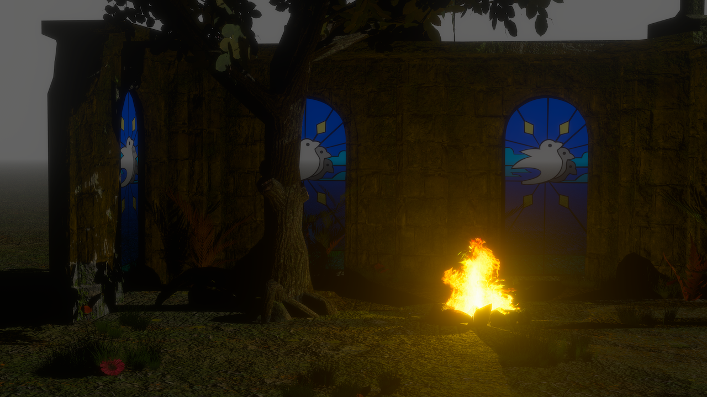
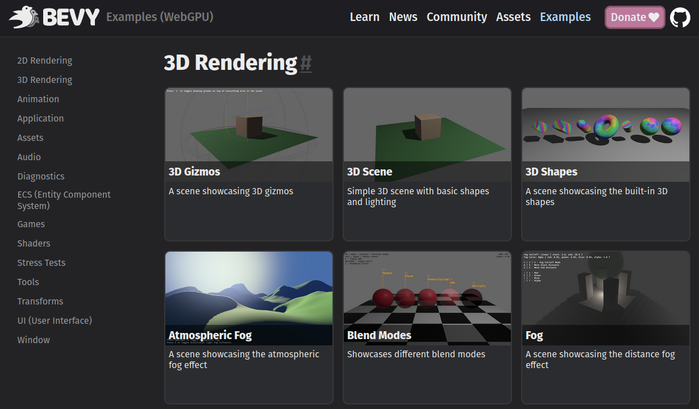

+++
title = "Bevy + WebGPU"
date = 2023-05-17
authors = ["Carter Anderson"]
[extra]
image = "webgpu.svg"
padded_list_image = true
show_image = true
github = "cart"
youtube = "cartdev"
+++

I'm excited to announce that Bevy's main branch now supports WebGPU rendering on the web! This means you can [play with it now by checking out our repo](https://github.com/bevyengine/bevy) provided you have a [supported web browser](https://caniuse.com/webgpu) (WebGPU is still in the process of rolling out). You can also explore our [live WebGPU examples](/examples-webgpu). The upcoming [Bevy 0.11 release](https://github.com/bevyengine/bevy/milestone/11) will have WebGPU support built in, which is slated for release in about a month!

## What is WebGPU?

WebGPU is an [exciting new web standard](https://github.com/gpuweb/gpuweb) for doing modern GPU graphics and compute. It takes inspiration from Vulkan, Direct3D 12, and Metal. In fact, it is generally implemented on top of these APIs under the hood. WebGPU gives us access to more GPU features than WebGL2 (such as compute shaders) and also has the potential to be much faster. It means that more of Bevy's native renderer features are now also available on the web. It also uses the new [WGSL shader language](https://www.w3.org/TR/WGSL). We're very happy with how WGSL has evolved over time and Bevy uses it internally for our shaders. We also added usability features like imports! But with Bevy you still have the option to use GLSL if you prefer.

WebGPU has started making waves because [Chrome just shipped WebGPU support in Chrome 113](https://developer.chrome.com/blog/webgpu-release/), which means people with normal Chrome releases can start testing it. Firefox and Safari also have implementations in the works!

## What is Bevy?



For those who don't know, Bevy is a refreshingly simple cross-platform data-driven game engine built in Rust. It has a modern and extensible 2D and 3D renderer, a best-in-class ECS (entity component system) that is delightful to use, [plenty of features](/), and a vibrant and open [developer community](/community). It currently supports Windows, MacOS, Linux, iOS, and Web. We also have work in progress Android support ... and ambitions for even more platforms in the future!

You can check out our [Quick Start Guide](/learn/quick-start/introduction) to try it today. It is free and open source forever! You can grab the full [source code](https://github.com/bevyengine/bevy) on GitHub. Check out [Bevy Assets](https://bevy.org/assets) for a collection of community-developed plugins, games, and learning resources.

<!-- more -->

## Bevy's WebGPU Example Page

Bevy's native examples can also run right in your browser. This already [worked with WASM / WebGL2](/examples), but we've built a [new and improved Bevy WebGPU example page](/examples-webgpu/) to showcase the new WebGPU backend. Just make sure you [have a compatible browser](https://caniuse.com/webgpu) first as WebGPU is still in the process of rolling out!

[](/examples-webgpu)

## How it Works

Bevy is built on top of the [wgpu] library, which is a modern low-level GPU API that can target pretty much every popular API: Vulkan, Direct3D 12, Metal, OpenGL, WebGL2, and WebGPU. The best backend API is selected for a given platform. It is a "native" rendering API, but it generally follows the WebGPU terminology and API design. Unlike WebGPU, it can provide direct access to the native APIs, which means Bevy enjoys a "best of all worlds" situation:

* Fast and low level rendering backed by the best API for a given operating system + hardware combination
* A much more approachable API than Vulkan, which means Bevy Plugin developers can easily build powerful cross platform renderer features
* Developers can code to the "default" feature set and it will generally work "everywhere"
* Developers can opt in to native feature "extensions" (such as raytracing, VR, etc) on platforms that support them, even if they are not covered by the WebGPU spec. wgpu is very open to exposing new features! A [ray tracing proposal](https://github.com/gfx-rs/wgpu/pull/3507) is currently being developed, some ["bindless" rendering](https://github.com/gfx-rs/wgpu/issues/3637) features have already been implemented (and [exposed in Bevy](https://github.com/bevyengine/bevy/blob/main/examples/shader/texture_binding_array.rs)), and the Bevy community already has some OpenXR experiments in the works!

Bevy was built on [wgpu] from the very beginning, which meant most of the hard work of supporting WebGPU was already done. But we actually only recently did the last mile effort to get WebGPU rendering working, thanks to the [efforts of François Mockers](https://github.com/bevyengine/bevy/pull/8336) (one of Bevy's maintainers). They reworked some of our renderer initialization to satisfy the async requirements of WebGPU initialization. They also adapted some of our renderer features to be compatible. François also built our cool new [WebGPU examples page](/examples-webgpu)!

[wgpu]: https://github.com/gfx-rs/wgpu

## Compiling Bevy Apps for WebGPU

WebGPU support will land in the [next Bevy release](https://github.com/bevyengine/bevy/milestone/11) (**Bevy 0.11**). This means that the [current Bevy release](/news/bevy-0-10) does not support WebGPU! If you would like to test out Bevy + WebGPU _right now_, just use Bevy's `main` branch:

```txt
git clone https://github.com/bevyengine/bevy
```

From there, after [setting up wasm-bindgen](https://github.com/bevyengine/bevy/tree/main/examples#setup-2) you can build any of the Bevy examples for WebGPU using this command:

```txt
cargo run -p build-wasm-example -- --api webgpu load_gltf
```

You can replace the `load_gltf` example with the name of any of [Bevy's examples](https://github.com/bevyengine/bevy/tree/main/examples).

Note that when [building your own Bevy Apps for the Web](https://bevy-cheatbook.github.io/platforms/wasm.html), WebGL2 is still the default backend. This will continue to be true until WebGPU support is more universal.
