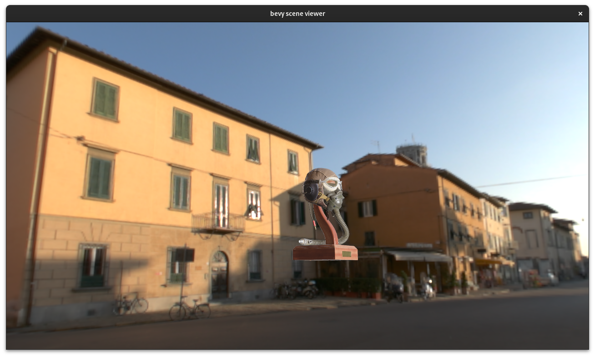

+++
title = "Bevy 0.11"
date = 2023-07-07
[extra]
author = "Bevy Contributors"
+++

Thanks to **X** contributors, **X** pull requests, community reviewers, and our [**generous sponsors**](/community/donate), we're happy to announce the **Bevy 0.11** release on [crates.io](https://crates.io/crates/bevy)!

For those who don't know, Bevy is a refreshingly simple data-driven game engine built in Rust. You can check out our [Quick Start Guide](/learn/book/getting-started/) to try it today. It's free and open source forever! You can grab the full [source code](https://github.com/bevyengine/bevy) on GitHub. Check out [Bevy Assets](https://bevyengine.org/assets) for a collection of community-developed plugins, games, and learning resources.

To update an existing Bevy App or Plugin to **Bevy 0.11**, check out our [0.10 to 0.11 Migration Guide](/learn/migration-guides/0.10-0.11/).

Since our last release a few months ago we've added a _ton_ of new features, bug fixes, and quality of life tweaks, but here are some of the highlights:

<!-- more -->

* **Feature**: description

## Skybox

authors: @JMS55, @superdump

Bevy now has built-in support for displaying an HDRI environment as your scene background.

Simply attach the new [`Skybox`] component to your [`Camera`]. It pairs well with the existing [`EnvironmentMapLight`].

We also plan to have support for built-in procedural skyboxes sometime in the future!

[`Skybox`]: https://docs.rs/bevy/0.11.0/bevy/core_pipeline/struct.Skybox.html
[`Camera`]: https://docs.rs/bevy/0.11.0/bevy/render/camera/struct.Camera.html
[`EnvironmentMapLight`]: https://docs.rs/bevy/0.11.0/bevy/pbr/struct.EnvironmentMapLight.html

## What's Next?

* **X**: Y

Check out the [**Bevy 0.12 Milestone**](https://github.com/bevyengine/bevy/milestone/14) for an up-to-date list of current work being considered for **Bevy 0.12**.

## Support Bevy

Sponsorships help make our work on Bevy sustainable. If you believe in Bevy's mission, consider [sponsoring us](/community/donate) ... every bit helps!

<a class="button button--pink header__cta" href="/community/donate">Donate </a>

## Contributors

Bevy is made by a [large group of people](/community/people/). A huge thanks to the X contributors that made this release (and associated docs) possible! In random order:

* @author
