+++
title = "Bevy 0.11"
date = 2023-07-07
[extra]
author = "Bevy Contributors"
+++

Thanks to **X** contributors, **X** pull requests, community reviewers, and our [**generous sponsors**](/community/donate), we're happy to announce the **Bevy 0.11** release on [crates.io](https://crates.io/crates/bevy)!

For those who don't know, Bevy is a refreshingly simple data-driven game engine built in Rust. You can check out our [Quick Start Guide](/learn/book/getting-started/) to try it today. It's free and open source forever! You can grab the full [source code](https://github.com/bevyengine/bevy) on GitHub. Check out [Bevy Assets](https://bevyengine.org/assets) for a collection of community-developed plugins, games, and learning resources.

To update an existing Bevy App or Plugin to **Bevy 0.11**, check out our [0.10 to 0.11 Migration Guide](/learn/migration-guides/0.10-0.11/).

Since our last release a few months ago we've added a _ton_ of new features, bug fixes, and quality of life tweaks, but here are some of the highlights:

<!-- more -->

* **Morph targets**: Vertex-based animations
* **Parallax mapping**: Materials now support an optional depth map, giving
  flat surfaces a feel of depth through parallaxing the material's textures.
* **Gamepad Rumble API**: an ECS-friendly way of making controllers rumble

## Skybox

<div class="release-feature-authors">authors: @JMS55, @superdump</div>


Bevy now has built-in support for displaying an HDRI environment as your scene background.

Simply attach the new [`Skybox`] component to your [`Camera`]. It pairs well with the existing [`EnvironmentMapLight`].

We also plan to have support for built-in procedural skyboxes sometime in the future!

[`Skybox`]: https://docs.rs/bevy/0.11.0/bevy/core_pipeline/struct.Skybox.html
[`Camera`]: https://docs.rs/bevy/0.11.0/bevy/render/camera/struct.Camera.html
[`EnvironmentMapLight`]: https://docs.rs/bevy/0.11.0/bevy/pbr/struct.EnvironmentMapLight.html

## Screen Space Ambient Occlusion

<div class="release-feature-authors">authors: @JMS55</div>

**Without SSAO**
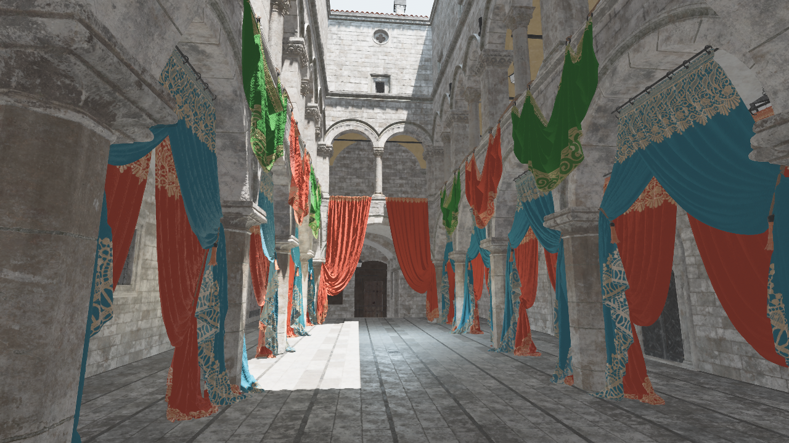

**With SSAO**


**SSAO Only**


Bevy now supports Screen Space Ambient Occlusion (SSAO). While Bevy already supported shadows from direct lights
([`DirectionalLight`], [`PointLight`], [`SpotLight`]) via shadow mapping, Bevy now supports shadows from _indirect_ diffuse lighting such as [`AmbientLight`] or [`EnvironmentMapLight`].

These shadows give scenes a more "grounded" feel, by estimating how much surrounding geometry blocks incoming light via the screen-space depth and normal prepasses. You can try it out in the new [SSAO example](https://github.com/bevyengine/bevy/blob/v0.11.0/examples/3d/ssao.rs).

Note that using SSAO with the newly added Temporal Anti-Aliasing leads to a _large_ increase in quality and noise reduction.

Platform support is currently limited - Only Vulkan and Metal are currently supported. DirectX12 will be supported via an upcoming patch release of `wgpu`, and WebGPU support will come at a later date.

[`DirectionalLight`]: https://docs.rs/bevy/0.11.0/bevy/pbr/struct.DirectionalLight.html
[`PointLight`]: https://docs.rs/bevy/0.11.0/bevy/pbr/struct.PointLight.html
[`SpotLight`]: https://docs.rs/bevy/0.11.0/bevy/pbr/struct.SpotLight.html
[`AmbientLight`]: https://docs.rs/bevy/0.11.0/bevy/pbr/struct.AmbientLight.html

## Temporal Antialiasing

<div class="release-feature-authors">authors: @JMS55, @DGriffin91</div>


Alongside MSAA and FXAA, Bevy now supports Temporal Anti-aliasing (TAA) as an anti-aliasing option.

TAA works by blending the newly rendered frame with past frames in order to smooth out aliasing artifacts in the image. TAA has become increasingly popular in the industry because of its ability to cover up so many rendering artifacts: it smooths out shadows (both global illumination and "casted" shadows), mesh edges, textures, and reduces specular aliasing of light on reflective surfaces. However because the "smoothing" effect is so apparent, some people prefer other methods.

Here's a quick rundown of the following advantages and disadvantages of each anti-aliasing method that Bevy supports:

* **Multi-Sample Antialiasing (MSAA)**
  * Does a good job at smoothing the edges of meshes (anti geometric aliasing). Does not help with specular aliasing. Performance cost scales with triangle count, and performs very poorly on scenes with many triangles
* **Fast Approximate Antialiasing (FXAA)**
  * Does a decent job of dealing with both geometric and specular aliasing. Very little performance cost in all scenes. Somewhat blurry and low quality results
* **Temporal Antialiasing (TAA)**
  * Does a very good job at dealing with both geometric and specular aliasing. Does a good job at dealing with temporal aliasing, where high-frequency details flicker over time or as you move the camera around or as things animate. Performance cost is moderate, and scales only with screen resolution. Chance of "ghosting" where meshes or lighting effects may leave trails behind them that fade over time. Although TAA helps with reducing temporal aliasing, it may also introduce additional temporal aliasing, especially on thin geometry or texture detail rendered at a distance. Requires 2 view's worth of additional GPU memory, as well as enabling the motion vector and depth prepasses. Requires accurate motion vector and depth prepasses, which complicates custom materials

TAA implementations are a series of tradeoffs and rely on heuristics that are easy to get wrong. In Bevy 0.11, TAA is marked as an experimental feature for the following reasons:

* TAA does not currently work with the following Bevy features: skinning, morph targets, and parallax mapping
* TAA currently tends to soften the image a bit, which can be worked around via post-process sharpening
* Our TAA heuristics are not currently user-configurable (and these heuristics are likely to change and evolve)

We will continue to improve quality, compatibility, and performance in future releases. Please report any bugs you encounter!

You can compare all of our anti-aliasing methods in Bevy's improved [anti-aliasing example](https://github.com/bevyengine/bevy/blob/v0.11.0/examples/3d/anti_aliasing.rs).

## Better Proxies

<div class="release-feature-authors">authors: @MrGVSV</div>

Bevy's reflection API has a handful of structs which are collectively known as "dynamic" types.
These include [`DynamicStruct`], [`DynamicTuple`], and more, and they are used to dynamically construct types
of any shape or form at runtime.
These types are also used to create are commonly referred to as "proxies", which are dynamic types
that are used to represent an actual concrete type.

These proxies are what powers the [`Reflect::clone_value`] method, which generates these proxies under the hood
in order to construct a runtime clone of the data.

Unfortunately, this results in a few [subtle footguns] that could catch users by surprise,
such as the hashes of proxies differing from the hashes of the concrete type they represent,
proxies not being considered equivalent to their concrete counterparts, and more.

While this release does not necessarily fix these issues, it does establish a solid foundation for fixing them in the future.
The way it does this is by changing how a proxy is defined.

Before 0.11, a proxy was only defined by cloning the concrete type's [`Reflect::type_name`] string
and returning it as its own `Reflect::type_name`.

Now in 0.11, a proxy is defined by copying a reference to the static [`TypeInfo`] of the concrete type.
This will allow us to access more of the concrete type's type information dynamically, without requiring the `TypeRegistry`.
In a [future release], we will make use of this to store hashing and comparison strategies in the `TypeInfo` directly
in order to mitigate the proxy issues mentioned above.

[`DynamicStruct`]: https://docs.rs/bevy/0.11.0/bevy/reflect/struct.DynamicStruct.html
[`DynamicTuple`]: https://docs.rs/bevy/0.11.0/bevy/reflect/struct.DynamicTuple.html
[`Reflect::clone_value`]: https://docs.rs/bevy/0.11.0/bevy/reflect/trait.Reflect.html#tymethod.clone_value
[subtle footguns]: https://github.com/bevyengine/bevy/issues/6601
[`Reflect::type_name`]: https://docs.rs/bevy/0.11.0/bevy/reflect/trait.Reflect.html#tymethod.type_name
[`TypeInfo`]: https://docs.rs/bevy/0.11.0/bevy/reflect/enum.TypeInfo.html
[future release]: https://github.com/bevyengine/bevy/pull/8695

## `FromReflect` Ergonomics

<div class="release-feature-authors">authors: @MrGVSV</div>

Bevy's [reflection API] commonly passes around data using type-erased `dyn Reflect` trait objects.
This can usually be downcast back to its concrete type using `<dyn Reflect>::downcast_ref::<T>`;
however, this doesn't work if the underlying data has been converted to a "dynamic" representation
(e.g. `DynamicStruct` for struct types, `DynamicList` for list types, etc.).

```rust
let data: Vec<i32> = vec![1, 2, 3];

let reflect: &dyn Reflect = &data;
let cloned: Box<dyn Reflect> = reflect.clone_value();

// `reflect` really is a `Vec<i32>`
assert!(reflect.is::<Vec<i32>>());
assert!(reflect.represents::<Vec<i32>>());

// `cloned` is a `DynamicList`, but represents a `Vec<i32>`
assert!(cloned.is::<DynamicList>());
assert!(cloned.represents::<Vec<i32>>());

// `cloned` is equivalent to the original `reflect`, despite not being a `Vec<i32>`
assert!(cloned.reflect_partial_eq(reflect).unwrap_or_default());
```

To account for this, the [`FromReflect`] trait can be used to convert any `dyn Reflect` trait object
back into its concrete type— whether it is actually that type or a dynamic representation of it.
And it can even be called dynamically using the [`ReflectFromReflect`] type data.

Before 0.11, users had to be manually derive `FromReflect` for every type that needed it,
as well as manually register the `ReflectFromReflect` type data.
This made it cumbersome to use and also meant that it was often forgotten about,
resulting in reflection conversions difficulties for users downstream.

Now in 0.11, `FromReflect` is automatically derived and `ReflectFromReflect` is automatically registered for all types that derive `Reflect`.
This means most types will be `FromReflect`-capable by default,
thus reducing boilerplate and empowering logic centered around `FromReflect`.

Users can still opt out of this behavior by adding the [`#[reflect(from_reflect = false)]`][from_reflect = false] attribute to their type.

```rust
#[derive(Reflect)]
struct Foo;

#[derive(Reflect)]
#[reflect(from_reflect = false)]
struct Bar;

fn test<T: FromReflect>(value: T) {}

test(Foo); // <-- OK!
test(Bar); // <-- ERROR! `Bar` does not implement trait `FromReflect`
```

[reflection API]: https://docs.rs/bevy_reflect/latest/bevy_reflect/index.html
[`FromReflect`]: https://docs.rs/bevy_reflect/latest/bevy_reflect/trait.FromReflect.html
[`ReflectFromReflect`]: https://docs.rs/bevy_reflect/latest/bevy_reflect/struct.ReflectFromReflect.html
[from_reflect = false]: https://docs.rs/bevy_reflect/latest/bevy_reflect/derive.Reflect.html#reflectfrom_reflect--false

## Scene Filtering

<div class="release-feature-authors">authors: @MrGVSV</div>

When serializing data to a scene, all components and [resources](#resource-support-in-scenes) are serialized by default.
In previous versions, you had to use the given `TypeRegistry` to act as a filter, leaving out the types you don't want included.

In 0.11, there's now a dedicated `SceneFilter` type to make filtering easier, cleaner, and more intuitive.
This can be used with [`DynamicSceneBuilder`](https://docs.rs/bevy/0.11.0/bevy/prelude/struct.DynamicSceneBuilder.html) to have fine-grained control over what actually gets serialized.

We can `allow` a subset of types:

```rust
let mut builder = DynamicSceneBuilder::from_world(&world);
let scene = builder
    .allow::<ComponentA>()
    .allow::<ComponentB>()
    .extract_entity(entity)
    .build();
```

Or `deny` them:

```rust
let mut builder = DynamicSceneBuilder::from_world(&world);
let scene = builder
    .deny::<ComponentA>()
    .deny::<ComponentB>()
    .extract_entity(entity)
    .build();
```

## Resource Support in Scenes

<div class="release-feature-authors">authors: @Carbonhell, @Davier</div>

Bevy's scene format is a very useful tool for serializing and deserializing game state to and from scene files.

Previously, the captured state was limited to only entities and their components.
With 0.11, scenes now support serializing resources as well.

This adds a new `resources` field to the scene format:

```rust
(
    resources: {
        "my_game::stats::TotalScore": (
            score: 9001,
        ),
    },
    entities: {
        // Entity scene data...
    },
)
```

## Gamepad Rumble API

<div class="release-feature-authors">authors: @johanhelsing, @nicopap</div>

You can now use the `EventWriter<GamepadRumbleRequest>` system parameter to
trigger controllers force-feedback motors.

[`gilrs`], the crate Bevy uses for gamepad support, allows controlling
force-feedback motors. Sadly, there were no easy way of accessing the
force-feedback API in Bevy without tedious bookkeeping.

Now Bevy has the `GamepadRumbleRequest` event to do just that.

```rust
fn rumble_system(
    gamepads: Res<Gamepads>,
    mut rumble_requests: EventWriter<GamepadRumbleRequest>,
) {
    for gamepad in gamepads.iter() {
        rumble_requests.send(GamepadRumbleRequest::Add {
            gamepad,
            duration: Duration::from_secs(5),
            intensity: GamepadRumbleIntensity::MAX,
        });
    }
}
```

The `GamepadRumbleRequest::Add` event triggers a force-feedback motor,
controlling how long the vibration should last, the motor to activate,
and the vibration strength. `GamepadRumbleRequest::Stop` immediately stops all motors.

[`gilrs`]: https://crates.io/crates/gilrs

## Morph Targets

<div class="release-feature-authors">authors: @nicopap, @cart</div>

Bevy, since the 0.7 release, supports 3D animations.

But it only supported _skeletal_ animations. Leaving on the sidewalk a common
animation type called _morph targets_ (aka blendshapes, aka keyshapes, and a slew
of other name). This is the grandparent of all 3D character animation!
[Crash Bandicoot]'s run cycle used morph targets.

<video controls><source src="morph_targets_video.mp4" type="video/mp4"/></video>
<div style="font-size: 1.0rem" class="release-feature-authors">Character model by <a href="https://www.artstation.com/zambrah">Samuel Rosario</a> (© all rights reserved), used with permission. Modified by nicopap, using the <a href="https://studio.blender.org/characters/snow/v2/">Snow</a> character texture by Demeter Dzadik for Blender Studios <a href="https://creativecommons.org/licenses/by/4.0/">(🅯 CC-BY)</a>.
</div>
<!-- The previous paragraph requires the <a href> tags, since zola doesn't
process markdown markup within tags -->

Nowadays, an animation artist will typically use a skeleton rig for wide
moves and morph targets to clean up the detailed movements.

When it comes to game assets, however, the complex skeleton rigs used by
artists for faces and hands are too heavy. Usually, the poses are
"baked" into morph poses, and facial expression transitions are handled
in the engine through morph targets.

Morph targets is a very simple animation method. Take a model, have a base
vertex position, move the vertices around to create several poses:

<div style="flex-direction:row;display:flex;justify-content:space-evenly">
<div style="display:flex;flex-direction:column;align-items:center;width:20%"><p><b>Default</b></p></div>
<div style="display:flex;flex-direction:column;align-items:center;width:20%"><p><b>Frown</b></p></div>
<div style="display:flex;flex-direction:column;align-items:center;width:20%"><p><b>Smirk</b></p></div>
</div>

Store those poses as a difference between the default base mesh and the variant
pose, then, at runtime, _mix_ each pose. Now that we have the difference with
the base mesh, we can get the variant pose by simply adding to the base
vertices positions.

That's it, the morph target shader looks like this:

```rust
fn morph_vertex(vertex: Vertex) {
    for (var i: u32 = 0u; i < pose_count(); i++) {
        let weight = weight_for_pose(i);
        vertex.position += weight * get_difference(vertex.index, position_offset, i);
        vertex.normal += weight * get_difference(vertex.index, normal_offset, i);
    }
}
```

In Bevy, we store the weights per pose in the `MorphWeights` component.

```rust
fn set_weights_system(mut morph_weights: Query<&mut MorphWeights>) {
    for mut entity_weights in &mut morph_weights {
        let weights = entity_weights.weights_mut();

        weights[0] = 0.5;
        weights[1] = 0.25;
    }
}
```

Now assuming that we have two morph targets, (1) the frown pose, (2)
the smirk pose:

<div style="flex-direction:row;display:flex;justify-content:space-evenly">
<div style="display:flex;flex-direction:column;align-items:center;width:12%">
  <p><b>[0.0, 0.0]</b></p>
  <p style="margin:0;font-size:75%">default pose</p>
  
</div>
<div style="display:flex;flex-direction:column;align-items:center;width:12%">
  <p><b>[1.0, 0.0]</b></p>
  <p style="margin:0;font-size:75%">frown only</p>
  
</div>
<div style="display:flex;flex-direction:column;align-items:center;width:12%">
  <p><b>[0.0, 1.0]</b></p>
  <p style="margin:0;font-size:75%">smirk only</p>
  
</div>
<div style="display:flex;flex-direction:column;align-items:center;width:12%">
  <p><b>[0.5, 0.0]</b></p>
  <p style="margin:0;font-size:75%">half frown</p>
  
</div>
<div style="display:flex;flex-direction:column;align-items:center;width:12%">
  <p><b>[1.0, 1.0]</b></p>
  <p style="margin:0;font-size:75%">both at max</p>
  
</div>
<div style="display:flex;flex-direction:column;align-items:center;width:12%">
  <p><b>[0.5, 0.25]</b></p>
  <p style="margin:0;font-size:75%">bit of both</p>
  
</div>
</div>

While conceptually simple, it requires communicating to the GPU a tremendous
amount of data. Thousand of vertices, each 288 bits, several model variations,
sometimes a hundred.

Bevy's morph target implementation is similar to BabyloneJS's. We store the
vertex data as pixels in a 3D texture. This allows morph targets to not only
run on WebGPU, but also on the WebGL2 wgpu backend.

This could be improved in a number of ways, but it is sufficient for an
initial implementation.

<video controls><source src="morph_target_smirk.mp4" type="video/mp4"/></video>

[Crash Bandicoot]: https://en.wikipedia.org/wiki/Crash_Bandicoot_(video_game)#Gameplay

## Parallax Mapping

<div class="release-feature-authors">author: @nicopap</div>

Bevy now supports parallax mapping and depth maps. Parallax mapping puts normal
maps to shame when it comes to giving "illusion of depth" to a material. The top half of this video uses parallax mapping plus a normal map, whereas the bottom half only uses a normal map:

<video controls loop><source alt="a rotating view of the earth, the top half of the screen uses parallax mapping, while the bottom half does not" src="earth-parallax.webm" type="video/webm"/></video>
<div style="font-size: 1.0rem" class="release-feature-authors">earth view, elevation & night view by NASA (public domain)</div>

Notice how it is not merely the shading of pixels that changes, but their
actual position on screen. The mountaintops hide mountain ridges behind
themselves. High mountains move faster than coastal areas.

Parallax mapping moves pixels according to the perspective and depth on the
surface of the geometry. Adding true 3D depth to flat surfaces.

All of that, without adding a single vertex to the geometry. The whole globe
has exactly 648 vertices. Unlike a more primitive shader, such as displacement
mapping, parallax mapping only requires an additional grayscale image, called
the `depth_map`.

Games often use parallax mapping for cobblestones or brick walls, so
let's make a brick wall in Bevy! First, we spawn a mesh:

```rust
commands.spawn(PbrBundle {
    mesh: meshes.add(shape::Box::new(30.0, 10.0, 1.0).into()),
    material: materials.add(StandardMaterial {
        base_color: Color::WHITE,
        ..default()
    }),
    ..default()
});
```

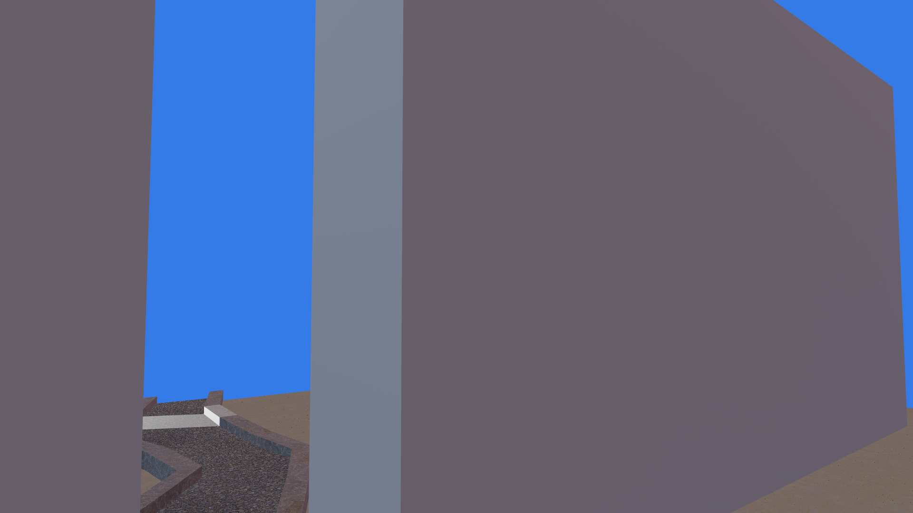

Of course, it's just a flat white box, we didn't add any texture.
So let's add a normal map:

```rust
normal_map_texture: Some(assets.load("normal_map.png")),
```

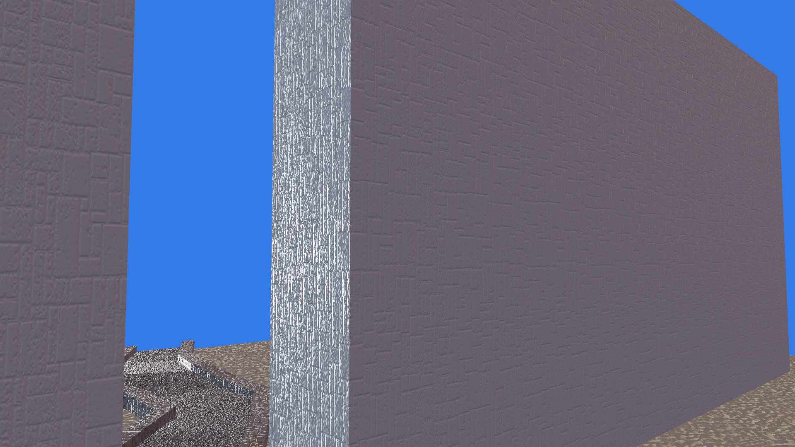

This is much better. The shading changes according to the light direction too!
However, the specular highlights on the corner are overbearing, almost noisy.

Let's see how a depth map can help:

```rust
depth_map: Some(assets.load("depth_map.png")),
```

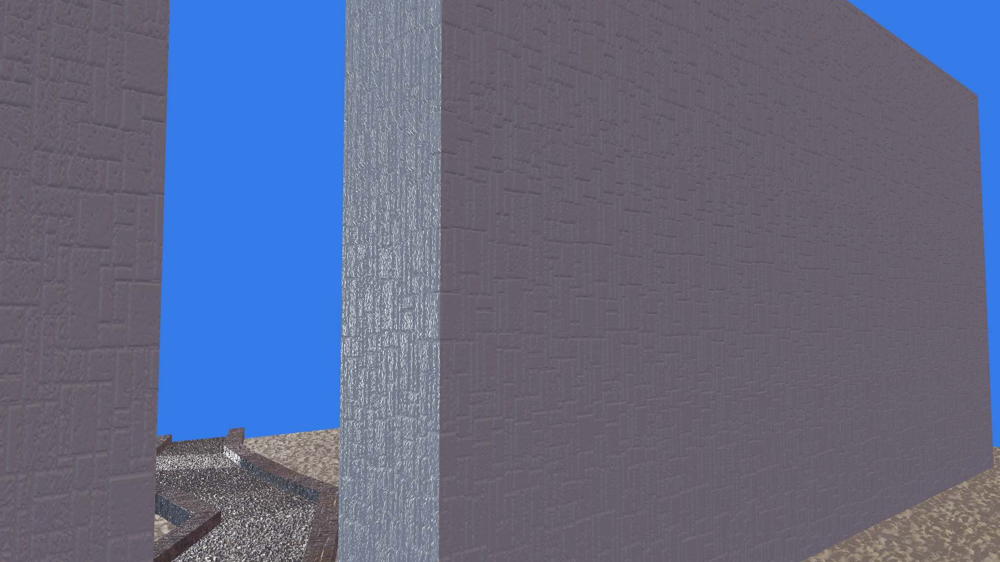

We eliminated the noise! There is also that sweet 3D feel reminiscent of
90's games pre-rendered cinematic sequences.

So what's going on, why does parallax mapping eliminate the ugly specular
lights on the wall?

This is because parallax mapping insets the ridges between bricks, so that they
are occluded by the bricks themselves.

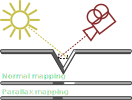

Since normal maps do not "move" the shaded areas, merely shade them
differently, we get those awkward specular highlights. With parallax mapping,
they are gone.

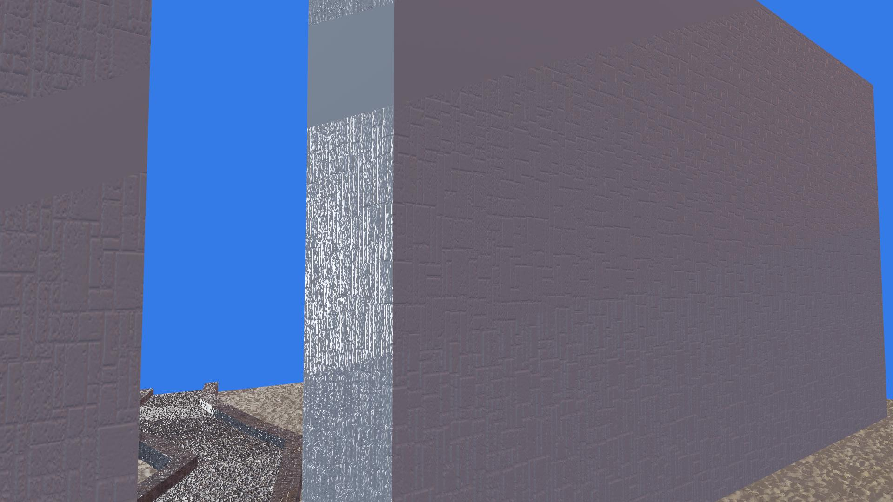

Parallax mapping in Bevy is still very limited. The most painful aspect is that
it is not a standard glTF feature, meaning that the depth texture needs to be
programmatically added to materials if they came from a GLTF file.

Additionally, parallax mapping is incompatible with the temporal antialiasing
shader, doesn't work well on curved surfaces, and doesn't affect object's
silhouettes.

However, those are not fundamental limitations of parallax mapping, and may be
fixed in the future.

## Deref Derive Attribute

<div class="release-feature-authors">authors: @MrGVSV</div>

Bevy code tends to make heavy use of the [newtype](https://doc.rust-lang.org/rust-by-example/generics/new_types.html) pattern,
which is why we have dedicated derives for [`Deref`](https://docs.rs/bevy/latest/bevy/prelude/derive.Deref.html) and [`DerefMut`](https://docs.rs/bevy/latest/bevy/prelude/derive.DerefMut.html).

This previously only worked for structs with a single field:

```rust
#[derive(Resource, Deref, DerefMut)]
struct Score(i32);
```

For 0.11, we've improved these derives by adding the `#[deref]` attribute, which allows them to be used on structs with multiple fields.
This makes working with generic newtypes much easier:

```rust
#[derive(Component, Deref, DerefMut)]
struct Health<T: Character> {
    #[deref] // <- use the `health` field as the `Deref` and `DerefMut` target
    health: u16,
    _character_type: PhantomData<T>,
}
```

## WebGPU Support

<div class="release-feature-authors">authors: @mockersf, many others throughout Bevy's development</div>


Bevy now supports WebGPU rendering on the web (in addition to WebGL 2). WebGPU support is still rolling out, but if you have [a supported web browser][webgpu-support] you can explore our new [live WebGPU examples](/examples-webgpu) page.

### What is WebGPU?

WebGPU is an [exciting new web standard](https://github.com/gpuweb/gpuweb) for doing modern GPU graphics and compute. It takes inspiration from Vulkan, Direct3D 12, and Metal. In fact, it is generally implemented on top of these APIs under the hood. WebGPU gives us access to more GPU features than WebGL2 (such as compute shaders) and also has the potential to be much faster. It means that more of Bevy's native renderer features are now also available on the web. It also uses the new [WGSL shader language](https://www.w3.org/TR/WGSL). We're very happy with how WGSL has evolved over time and Bevy uses it internally for our shaders. We also added usability features like imports! But with Bevy you still have the option to use GLSL if you prefer.

### How it Works

Bevy is built on top of the [wgpu] library, which is a modern low-level GPU API that can target pretty much every popular API: Vulkan, Direct3D 12, Metal, OpenGL, WebGL2, and WebGPU. The best backend API is selected for a given platform. It is a "native" rendering API, but it generally follows the WebGPU terminology and API design. Unlike WebGPU, it can provide direct access to the native APIs, which means Bevy [enjoys a "best of all worlds" situation](/news/bevy-webgpu/#how-it-works).

### WebGPU Examples

Click one of the images below to check out our live WebGPU examples (if your [browser supports it][webgpu-support]):

[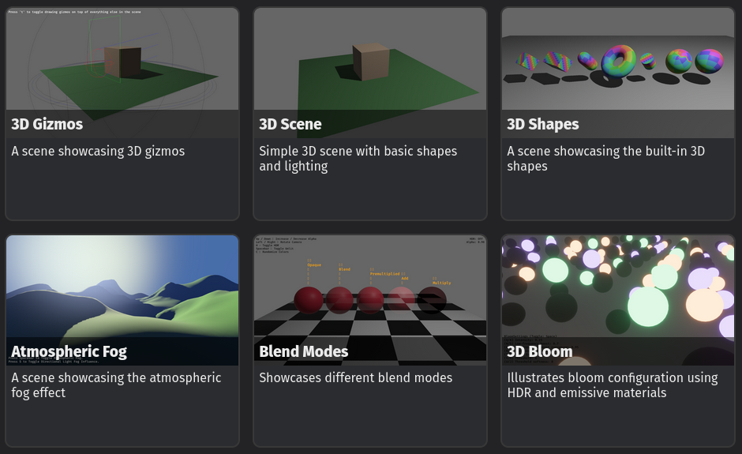](examples-webgpu)

[wgpu]: https://github.com/gfx-rs/wgpu
[webgpu-support]: https://caniuse.com/webgpu

## Improved Shader Imports

<div class="release-feature-authors">authors: @robtfm</div>

Bevy's rendering engine has a lot of great options and features. For example, the PBR `StandardMaterial` pipeline supports desktop/webgpu and webgl, 6 optional mesh attributes, 4 optional textures, and a plethora of optional features like fog, skinning, and alpha blending modes, with more coming in every release.

Many feature combos need specialized shader variants, and with over 3000 lines of shader code split over 50 files in total, the text-substitution-based shader processor was beginning to creak at the seams.

This release we've switched to using [naga_oil](https://github.com/bevyengine/naga_oil), which gives us a module-based shader framework. It compiles each file individually to naga's IR and then combines them into a final shader on demand. This doesn't have much visible impact yet, but it does give a few immediate benefits:

* The engine's shader code is easier to navigate and less magical. Previously there was only a single global scope, so items could be referenced even if they were only imported indirectly. This sometimes made it hard to locate the actual code behind the reference. Now items must be explicitly imported, so you can always tell where a variable or function originated just by looking at the current file: <br/>
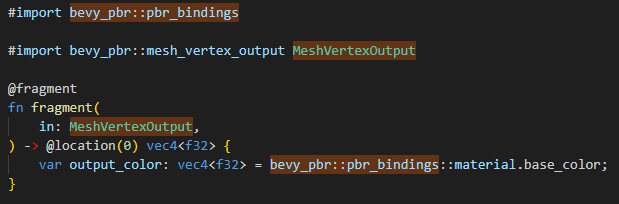
* Shaders now have codespan reporting, an error will point you to the shader file and line number, preventing a lot of hair pulling in complex shader codebases: <br/>
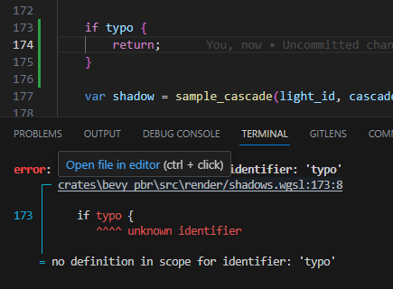
* naga_oil's preprocessor supports a few more conditional directives, you can use `#else if` and `#else ifndef` as well as `#else ifdef` which was previously supported
* Functions, variables and structs are all properly scoped so a shader file doesn't need to use globally unique names to avoid conflicts
* Shader defs can be added to modules directly. For example, any shader that imports `bevy_pbr::mesh_view_types` now has `MAX_DIRECTIONAL_LIGHTS` automatically defined, there's no longer a need to remember to add it for every new pipeline that uses the module.

The future possibilities are more exciting. Using naga IR opens the door to a bunch of nice features that we hope to bring in future releases:

* Automatic bind slot allocation will let plugins extend the core view bindgroup, which means self-contained plugins for features like lighting and shadow methods, common material properties, etc become viable. This will allow us to modularise the core pipelines to make growing the codebase - while keeping support for multiple targets - more sustainable
* "Virtual" shader functions will allow user modifications to core functions (like lighting), and potentially lead to a template-style material system, where users can provide "hooks" that will be called at the right point in the pipeline
* Language interop: mix and match glsl and wgsl, so bevy's pbr pipeline features could be accessed from your glsl material shader, or utils written for glsl could be used in wgsl code. We're hopeful that this can extend to spirv (and rust-gpu) as well
* More cool stuff we haven't thought of yet. Being able to inspect and modify shaders at runtime is very powerful and makes a lot of things possible!

## Schedule-First ECS APIs

<div class="release-feature-authors">authors: @cart</div>

In **Bevy 0.10** we introduced [ECS Schedule V3](/news/bevy-0-10/#ecs-schedule-v3), which _vastly_ improved the capabilities of Bevy ECS system scheduling: scheduler API ergonomics, system chaining, the ability to run exclusive systems and apply deferred system operations at any point in a schedule, a single unified schedule, configurable System Sets, run conditions, and a better State system.

However it pretty quickly became clear that the new system still had some areas to improve:

* **Base Sets were hard to understand and error prone**: What _is_ a Base Set? When do I use them? Why do they exist? Why is my ordering implicitly invalid due to incompatible Base Set ordering? Why do some schedules have a default Base Set while others don't? [Base Sets were confusing!](https://github.com/bevyengine/bevy/pull/8079#base-set-confusion)
* **There were too many ways to schedule a System**: We've accumulated too many scheduling APIs. As of Bevy **0.10**, we had [_SIX_ different ways to add a system to the "startup" schedule](https://github.com/bevyengine/bevy/pull/8079#unify-system-apis). Thats too many ways!
* **Too much implicit configuration**: There were both default Schedules and default Base Sets. In some cases systems had default schedules or default base sets, but in other cases they didn't! [A system's schedule and configuration should be explicit and clear](https://github.com/bevyengine/bevy/pull/8079#schedule-should-be-clear).
* **Adding Systems to Schedules wasn't ergonomic**: Things like `add_system(foo.in_schedule(CoreSchedule::Startup))` were not fun to type or read. We created special-case helpers, such as `add_startup_system(foo)`, but [this required more internal code, user-defined schedules didn't benefit from the special casing, and it completely hid the `CoreSchedule::Startup` symbol!](https://github.com/bevyengine/bevy/pull/8079#ergonomic-system-adding).

### Unraveling the Complexity

If your eyes started to glaze over as you tried to wrap your head around this, or phrases like "implicitly added to the `Update` Base Set" filled you with dread ... don't worry. After [a lot of careful thought](https://github.com/bevyengine/bevy/pull/8079) we've unraveled the complexity and built something clear and simple.

In **Bevy 0.11** the "scheduling mental model" is _much_ simpler thanks to **Schedule-First ECS APIs**:

```rust
app
    .add_systems(Startup, (a, b))
    .add_systems(Update, (c, d, e))
    .add_systems(FixedUpdate, (f, g))
    .add_systems(PostUpdate, h)
    .add_systems(OnEnter(AppState::Menu), enter_menu)
    .add_systems(OnExit(AppState::Menu), exit_menu)
```

* **There is _exactly_ one way to schedule systems**
  * Call `add_systems`, state the schedule name, and specify one or more systems
* **Base Sets have been entirely removed in favor of Schedules, which have friendly / short names**
  * Ex: The `CoreSet::Update` Base Set has become `Update`
* **There is no implicit or implied configuration**
  * Default Schedules and default Base Sets don't exist
* **The syntax is easy on the eyes and ergonomic**
  * Schedules are first so they "line up" when formatted

<details>
    <summary>To compare, expand this to see what it used to be!</summary>

```rust
app
    // Startup system variant 1.
    // Has an implied default StartupSet::Startup base set
    // Has an implied CoreSchedule::Startup schedule
    .add_startup_systems((a, b))
    // Startup system variant 2.
    // Has an implied default StartupSet::Startup base set
    // Has an implied CoreSchedule::Startup schedule
    .add_systems((a, b).on_startup())
    // Startup system variant 3.
    // Has an implied default StartupSet::Startup base set
    .add_systems((a, b).in_schedule(CoreSchedule::Startup))
    // Update system variant 1.
    // `CoreSet::Update` base set and `CoreSchedule::Main` are implied
    .add_system(c)
    // Update system variant 2 (note the add_system vs add_systems difference)
    // `CoreSet::Update` base set and `CoreSchedule::Main` are implied
    .add_systems((d, e))
    // No implied default base set because CoreSchedule::FixedUpdate doesn't have one
    .add_systems((f, g).in_schedule(CoreSchedule::FixedUpdate))
    // `CoreSchedule::Main` is implied, in_base_set overrides the default CoreSet::Update set
    .add_system(h.in_base_set(CoreSet::PostUpdate))
    // This has no implied default base set
    .add_systems(enter_menu.in_schedule(OnEnter(AppState::Menu)))
    // This has no implied default base set
    .add_systems(exit_menu.in_schedule(OnExit(AppState::Menu)))
```

</details>

Note that normal "system sets" still exist! You can still use sets to organize and order your systems:

```rust
app.add_systems(Update, (
    (walk, jump).in_set(Movement),
    collide.after(Movement),
))
```

The `configure_set` API has also been adjusted for parity:

```rust
// before
app.configure_set(Foo.after(Bar).in_schedule(PostUpdate))
// after
app.configure_set(PostUpdate, Foo.after(Bar))
```

## Nested System Tuples and Chaining

<div class="release-feature-authors">authors: @cart</div>

It is now possible to infinitely nest tuples of systems in a `.add_systems` call!

```rust
app.add_systems(Update, (
    (a, (b, c, d, e), f),
    (g, h),
    i
))
```

At first glance, this might not seem very useful. But in combination with per-tuple configuration, it allows you to easily and cleanly express schedules:

```rust
app.add_systems(Update, (
    (attack, defend).in_set(Combat).before(check_health)
    check_health,
    (handle_death, respawn).after(check_health)
))
```

`.chain()` has also been adapted to support arbitrary nesting! The ordering in the example above could be rephrased like this:

```rust
app.add_systems(Update,
    (
        (attack, defend).in_set(Combat)
        check_health,
        (handle_death, respawn)
    ).chain()
)
```

This will run `attack` and `defend` first (in parallel), then `check_health`, then `handle_death` and `respawn` (in parallel).

This allows for powerful and expressive "graph-like" ordering expressions:

```rust
app.add_systems(Update,
    (
        (a, (b, c, d).chain()),
        (e, f),
    ).chain()
)
```

This will run `a` in parallel with `b->c->d`, then after those have finished running it will run `e` and `f` in parallel.

## Simpler RenderGraph Construction

<div class="release-feature-authors">authors: @IceSentry, @cart</div>

Adding `Node`s to the `RenderGraph` requires a lot of boilerplate. In this release, we tried to reduce this for most common operations. No existing APIs have been removed, these are only helpers made to simplify working with the `RenderGraph`.

We added the `RenderGraphApp` trait to the `App`. This trait contains various helper functions to reduce the boilerplate with adding nodes and edges to a graph.

Another pain point of `RenderGraph` `Node`s is passing the view entity through each node and manually updating the query on that view. To fix this we added a `ViewNode` trait and `ViewNodeRunner` that will automatically take care of running the `Query` on the view entity. We also made the view entity a first-class concept of the `RenderGraph`. So you can now access the view entity the graph is currently running on from anywhere in the graph without passing it around between each `Node`.

All these new APIs assume that your Node implements `FromWorld` or `Default`.

Here's what it looks like in practice for the `BloomNode`:

```rust
// Adding the node to the 3d graph
render_app
    // To run a ViewNode you need to create a ViewNodeRunner
    .add_render_graph_node::<ViewNodeRunner<BloomNode>>(
        CORE_3D,
        core_3d::graph::node::BLOOM,
    );

// Defining the node
#[derive(Default)]
struct BloomNode;
// This can replace your `impl Node` block of any existing `Node` that operated on a view
impl ViewNode for BloomNode {
    // You need to define your view query as an associated type
    type ViewQuery = (
        &'static ExtractedCamera,
        &'static ViewTarget,
        &'static BloomSettings,
    );
    // You don't need Node::input() or Node::update() anymore. If you still need these they are still available but they have an empty default implementation.
    fn run(
        &self,
        graph: &mut RenderGraphContext,
        render_context: &mut RenderContext,
        // This is the result of your query. If it is empty the run function will not be called
        (camera, view_target, bloom_settings): QueryItem<Self::ViewQuery>,
        world: &World,
    ) -> Result<(), NodeRunError> {
        // When using the ViewNode you probably won't need the view entity but here's how to get it if you do
        let view_entity = graph.view_entity();

        // Run the node
    }
}
```

## `#[reflect(default)]` on Enum Variant Fields

<div class="release-feature-authors">authors: @MrGVSV</div>

When using the `FromReflect` trait, fields marked `#[reflect(default)]` will be set to their `Default` value if they don't exist on the reflected object.

Previously, this was only supported on struct fields.
Now, it is also supported on all enum variant fields.

```rust
#[derive(Reflect)]
enum MyEnum {
    Data {
        #[reflect(default)]
        a: u32,
        b: u32,
    },
}

let mut data = DynamicStruct::default ();
data.insert("b", 1);

let dynamic_enum = DynamicEnum::new("Data", data);

let my_enum = MyEnum::from_reflect( & dynamic_enum).unwrap();
assert_eq!(u32::default(), my_enum.a);
```

## UI Texture Atlas Support

<div class="release-feature-authors">authors: @mwbryant</div>

Previously UI `ImageBundle` Nodes could only use handles to full images without an ergonomic way to use `TextureAtlases` in UI.  In this release we add support for an `AtlasImageBundle` UI Node which brings the existing `TextureAtlas` support into UI.  

This was achieved by merging the existing mechanisms that allows text rendering to select which glyph to use and the mechanisms that allow for `TextureAtlasSprite`.

<video controls><source src="texture_atlas_ui.mp4" type="video/mp4"/></video>

## EntityRef Queries

<div class="release-feature-authors">authors: @james7132</div>

[`EntityRef`] now implements [`WorldQuery`], which makes it easier to query for arbitrary components in your ECS systems:

```rust
fn system(query: Query<EntityRef>) {
    for entity in &query {
        if let Some(mesh) = entity.get::<Handle<Mesh>>() {
            let transform = entity.get::<Transform>().unwrap();
        }
    }
}
```

Note that [`EntityRef`] queries access every entity and every component in the entire [`World`] by default. This means that they will conflict with any "mutable" query:

```rust
/// These queries will conflict, making this system invalid
fn system(query: Query<EntityRef>, mut enemies: Query<&mut Enemy>) { }
```

To resolve conflicts (or reduce the number of entities accessed), you can add filters:

```rust
/// These queries will not conflict
fn system(
    players: Query<EntityRef, With<Player>>,
    mut enemies: Query<&mut Enemy, Without<Player>>
) {
    // only iterates players
    for entity in &players {
        if let Some(mesh) = entity.get::<Handle<Mesh>>() {
            let transform = entity.get::<Transform>().unwrap();
        }
    }
}
```

Note that it will generally still be more ergonomic (and more efficient) to query for the components you want directly:

```rust
fn system(players: Query<(&Transform, &Handle<Mesh>), With<Player>>) {
    for (transform, mesh) in &players {
    }
}
```

[`EntityRef`]: https://docs.rs/bevy/0.11.0/bevy/ecs/world/struct.EntityRef.html
[`WorldQuery`]: https://docs.rs/bevy/0.11.0/bevy/ecs/query/trait.WorldQuery.html
[`World`]: https://docs.rs/bevy/0.11.0/bevy/ecs/world/struct.World.html

## Screenshot API

<div class="release-feature-authors">authors: @TheRawMeatball</div>

Bevy now has a simple screenshot API that can save a screenshot of a given window to the disk:

```rust
fn take_screenshot(
    mut screenshot_manager: ResMut<ScreenshotManager>,
    input: Res<Input<KeyCode>>,
    primary_window: Query<Entity, With<PrimaryWindow>>,
) {
    if input.just_pressed(KeyCode::Space) {
        screenshot_manager
            .save_screenshot_to_disk(primary_window.single(), "screenshot.png")
            .unwrap();
    }
}
```

## RenderTarget::TextureView

<div class="release-feature-authors">authors: @mrchantey</div>

The [`Camera`] [`RenderTarget`] can now be set to a wgpu [`TextureView`]. This allows 3rd party Bevy Plugins to manage a [`Camera`]'s texture. One particularly interesting use case that this enables is XR/VR support. A few community members have already [proven this out!](https://github.com/bevyengine/bevy/issues/115#issuecomment-1436749201)

[`RenderTarget`]: https://docs.rs/bevy/0.11.0/bevy/render/camera/enum.RenderTarget.html
[`TextureView`]: https://docs.rs/bevy/0.11.0/bevy/render/render_resource/struct.TextureView.html

## New Default Tonemapping Method

<div class="release-feature-authors">authors: @JMS55</div>

In **Bevy 0.10** we [made tonemapping configurable with a ton of new tonemapping options](/news/bevy-0-10/#more-tonemapping-choices). In **Bevy 0.11** we've switched the default tonemapping method from "Reinhard luminance" tonemapping to "TonyMcMapface":

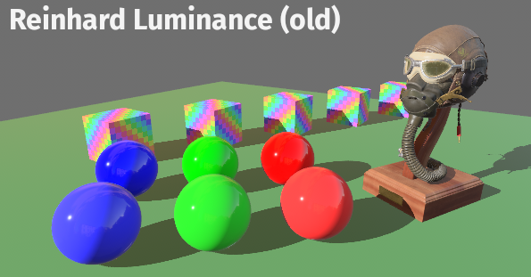

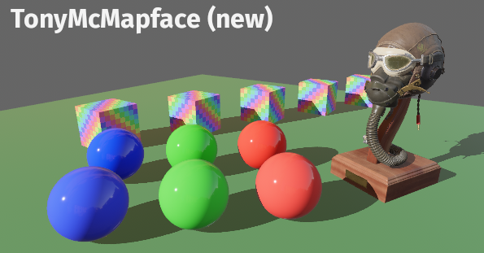

TonyMcMapface ([created by Tomasz Stachowiak](https://github.com/h3r2tic/tony-mc-mapface)) is a much more neutral display transform that tries to stay as close to the input "light" as possible. This helps retain artistic choices in the scene. Notably, brights desaturate across the entire spectrum (unlike Reinhard luminance). It also works much better with bloom when compared to Reinhard luminance.

## Robust Contrast Adaptive Sharpening

<div class="release-feature-authors">authors: @Elabajaba</div>

Effects like TAA and FXAA can cause the final render to become blurry. Sharpening post processing effects can help counteract that. In **Bevy 0.11** we've added a port of AMD's Robust Constrast Adaptive Sharpening (RCAS).

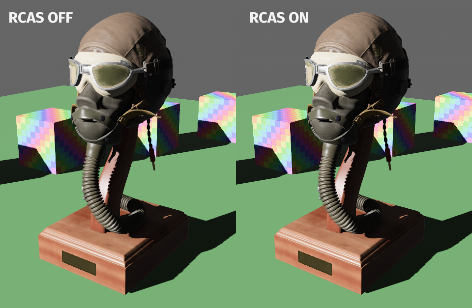

Notice that the texture on the leather part of the helmet is much crisper!

## <a name="what-s-next"></a>What's Next?

* **X**: Y

Check out the [**Bevy 0.12 Milestone**](https://github.com/bevyengine/bevy/milestone/14) for an up-to-date list of current work being considered for **Bevy 0.12**.

## Support Bevy

Sponsorships help make our work on Bevy sustainable. If you believe in Bevy's mission, consider [sponsoring us](/community/donate) ... every bit helps!

<a class="button button--pink header__cta" href="/community/donate">Donate </a>

## Contributors

Bevy is made by a [large group of people](/community/people/). A huge thanks to the X contributors that made this release (and associated docs) possible! In random order:

* @author
