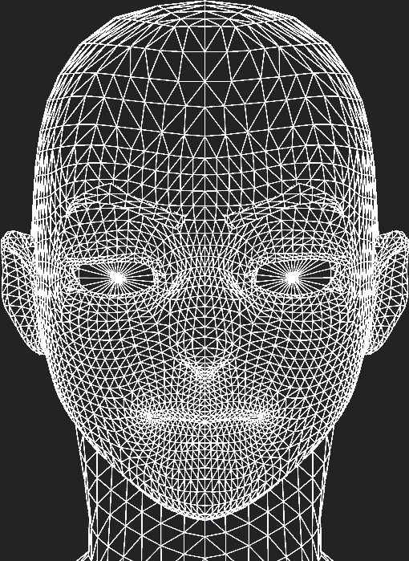
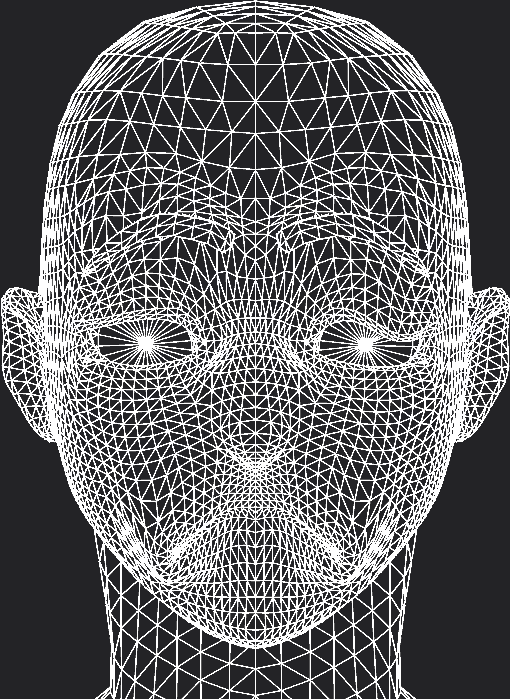
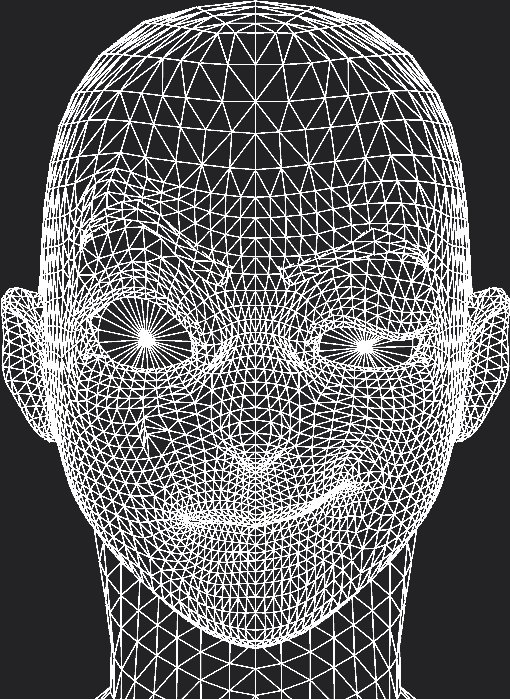
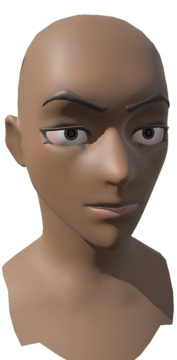
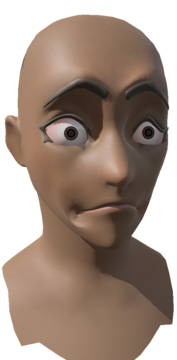
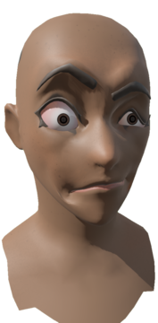

+++
title = "Bevy 0.11"
date = 2023-07-07
[extra]
author = "Bevy Contributors"
+++

Thanks to **X** contributors, **X** pull requests, community reviewers, and our [**generous sponsors**](/community/donate), we're happy to announce the **Bevy 0.11** release on [crates.io](https://crates.io/crates/bevy)!

For those who don't know, Bevy is a refreshingly simple data-driven game engine built in Rust. You can check out our [Quick Start Guide](/learn/book/getting-started/) to try it today. It's free and open source forever! You can grab the full [source code](https://github.com/bevyengine/bevy) on GitHub. Check out [Bevy Assets](https://bevyengine.org/assets) for a collection of community-developed plugins, games, and learning resources.

To update an existing Bevy App or Plugin to **Bevy 0.11**, check out our [0.10 to 0.11 Migration Guide](/learn/migration-guides/0.10-0.11/).

Since our last release a few months ago we've added a _ton_ of new features, bug fixes, and quality of life tweaks, but here are some of the highlights:

<!-- more -->

* **Morph targets**: Vertex-based animations

## Morph Targets

<div class="release-feature-authors">authors: @nicopap, @cart</div>

Bevy, since the 0.7 release, supports 3D animations.

But it only supported _skeletal_ animations. Leaving on the sidewalk a common
animation type called _morph targets_ (aka blendshapes, aka keyshapes, and a slew
of other name). This is the grandparent of all 3D character animation!
[Crash Bandicoot]'s run cycle used morph targets.

<video controls><source src="morph_targets_video.mp4" type="video/mp4"/></video>
<div style="font-size: 1.0rem" class="release-feature-authors">Character model by <a href="https://www.artstation.com/zambrah">Samuel Rosario</a> (© all rights reserved), used with permission. Modified by nicopap, using the <a href="https://studio.blender.org/characters/snow/v2/">Snow</a> character texture by Demeter Dzadik for Blender Studios <a href="https://creativecommons.org/licenses/by/4.0/">(🅯 CC-BY)</a>.
</div>
<!-- The previous paragraph requires the <a href> tags, since zola doesn't
process markdown markup within tags -->

Nowadays, an animation artist will typically use a skeleton rig for wide
moves and morph targets to clean up the detailed movements.

When it comes to game assets, however, the complex skeleton rigs used by
artists for faces and hands are too heavy. Usually, the poses are
"baked" into morph poses, and facial expression transitions are handled
in the engine through morph targets.

Morph targets is a very simple animation method. Take a model, have a base
vertex position, move the vertices around to create several poses:

<div style="flex-direction:row;display:flex;justify-content:space-evenly">
<div style="display:flex;flex-direction:column;align-items:center;width:20%"><p><b>Default</b></p></div>
<div style="display:flex;flex-direction:column;align-items:center;width:20%"><p><b>Frown</b></p></div>
<div style="display:flex;flex-direction:column;align-items:center;width:20%"><p><b>Smirk</b></p></div>
</div>

Store those poses as a difference between the default base mesh and the variant
pose, then, at runtime, _mix_ each pose. Now that we have the difference with
the base mesh, we can get the variant pose by simply adding to the base
vertices positions.

That's it, the morph target shader looks like this:

```rust
fn morph_vertex(vertex: Vertex) {
    for (var i: u32 = 0u; i < pose_count(); i++) {
        let weight = weight_for_pose(i);
        vertex.position += weight * get_difference(vertex.index, position_offset, i);
        vertex.normal += weight * get_difference(vertex.index, normal_offset, i);
    }
}
```

In Bevy, we store the weights per pose in the `MorphWeights` component.

```rust
fn set_weights_system(mut morph_weights: Query<&mut MorphWeights>) {
    for mut entity_weights in &mut morph_weights {
        let weights = entity_weights.weights_mut();

        weights[0] = 0.5;
        weights[1] = 0.25;
    }
}
```

Now assuming that we have two morph targets, (1) the frown pose, (2)
the smirk pose:

<div style="flex-direction:row;display:flex;justify-content:space-evenly">
<div style="display:flex;flex-direction:column;align-items:center;width:12%">
  <p><b>[0.0, 0.0]</b></p>
  <p style="margin:0;font-size:75%">default pose</p>
  
</div>
<div style="display:flex;flex-direction:column;align-items:center;width:12%">
  <p><b>[1.0, 0.0]</b></p>
  <p style="margin:0;font-size:75%">frown only</p>
  
</div>
<div style="display:flex;flex-direction:column;align-items:center;width:12%">
  <p><b>[0.0, 1.0]</b></p>
  <p style="margin:0;font-size:75%">smirk only</p>
  
</div>
<div style="display:flex;flex-direction:column;align-items:center;width:12%">
  <p><b>[0.5, 0.0]</b></p>
  <p style="margin:0;font-size:75%">half frown</p>
  
</div>
<div style="display:flex;flex-direction:column;align-items:center;width:12%">
  <p><b>[1.0, 1.0]</b></p>
  <p style="margin:0;font-size:75%">both at max</p>
  
</div>
<div style="display:flex;flex-direction:column;align-items:center;width:12%">
  <p><b>[0.5, 0.25]</b></p>
  <p style="margin:0;font-size:75%">bit of both</p>
  
</div>
</div>

While conceptually simple, it requires communicating to the GPU a tremendous
amount of data. Thousand of vertices, each 288 bits, several model variations,
sometimes a hundred.

Bevy's morph target implementation is similar to BabyloneJS's. We store the
vertex data as pixels in a 3D texture. This allows morph targets to not only
run on WebGPU, but also on the WebGL2 wgpu backend.

This could be improved in a number of ways, but it is sufficient for an
initial implementation.

<video controls><source src="morph_target_smirk.mp4" type="video/mp4"/></video>

[Crash Bandicoot]: https://en.wikipedia.org/wiki/Crash_Bandicoot_(video_game)#Gameplay

## <a name="what-s-next"></a>What's Next?

* **X**: Y

Check out the [**Bevy 0.12 Milestone**](https://github.com/bevyengine/bevy/milestone/14) for an up-to-date list of current work being considered for **Bevy 0.12**.

## Support Bevy

Sponsorships help make our work on Bevy sustainable. If you believe in Bevy's mission, consider [sponsoring us](/community/donate) ... every bit helps!

<a class="button button--pink header__cta" href="/community/donate">Donate </a>

## Contributors

Bevy is made by a [large group of people](/community/people/). A huge thanks to the X contributors that made this release (and associated docs) possible! In random order:

* @author
