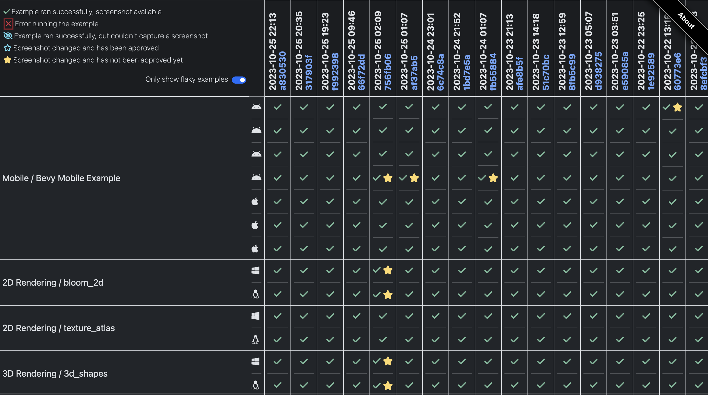

+++
title = "Bevy 0.12"
date = 2023-10-21
[extra]
author = "Bevy Contributors"
+++

Thanks to **X** contributors, **X** pull requests, community reviewers, and our [**generous sponsors**](/community/donate), we're happy to announce the **Bevy 0.12** release on [crates.io](https://crates.io/crates/bevy)!

For those who don't know, Bevy is a refreshingly simple data-driven game engine built in Rust. You can check out our [Quick Start Guide](/learn/book/getting-started/) to try it today. It's free and open source forever! You can grab the full [source code](https://github.com/bevyengine/bevy) on GitHub. Check out [Bevy Assets](https://bevyengine.org/assets) for a collection of community-developed plugins, games, and learning resources.

To update an existing Bevy App or Plugin to **Bevy 0.12**, check out our [0.11 to 0.12 Migration Guide](/learn/migration-guides/0.11-0.12/).

Since our last release a few months ago we've added a _ton_ of new features, bug fixes, and quality of life tweaks, but here are some of the highlights:

<!-- more -->

## CI Improvements

<div class="release-feature-authors">authors: @ameknite, @mockersf</div>

To help ensure examples are reusable outside of Bevy repository, CI will now fail if an example
uses an import from `bevy_internal` instead if `bevy`.

The daily mobile check job will build on more iOS and Android devices:

* iPhone 13 on iOS 15
* iPhone 14 on iOS 16
* iPhone 15 on iOS 17
* Xiaomi Redmi Note 11 on Android 11
* Google Pixel 6 on Android 12
* Samsung Galaxy S23 on Android 13
* Google Pixel 8 on Android 14

## Example tooling improvements

<div class="release-feature-authors">authors: @mockersf</div>

The example showcase tool can now build all examples for WebGL2 or WebGPU. This is used to update
the website with all Wasm-compatible examples, which you can find
[here](https://bevyengine.org/examples/) for WebGL2, or
[here](https://bevyengine.org/examples-webgpu/) for WebGPU.

It is now also capable of capturing a screenshot while running all examples:

```sh
cargo run -p example-showcase -- run --screenshot
```

Some options are available to help with the execution, you can check them with `--help`.

Those screenshots are displayed on the example pages on the website, and can be used to check that
a PR didn't introduce a visible regression.

## Example execution in CI

<div class="release-feature-authors">authors: @mockersf, @rparrett</div>

All examples are now executed in CI on Windows with DX12, and on Linux with Vulkan. When possible,
a screenshot is taken and compared to the last execution. If an example crashes, the log is saved.
The mobile example is also executed on the same devices as the daily mobile check job.

A report of all those executions is built and available
[here](https://thebevyflock.github.io/bevy-example-runner/).

[](https://thebevyflock.github.io/bevy-example-runner/)

If you want to help sponsor tests on more platforms, get in touch!

## <a name="what-s-next"></a>What's Next?

We have plenty of work that is pretty much finished and is therefore very likely to land in **Bevy 0.13**:

Check out the [**Bevy 0.13 Milestone**](https://github.com/bevyengine/bevy/milestone/17) for an up-to-date list of current work being considered for **Bevy 0.13**.

## Support Bevy

Sponsorships help make our work on Bevy sustainable. If you believe in Bevy's mission, consider [sponsoring us](/community/donate) ... every bit helps!

<a class="button button--pink header__cta" href="/community/donate">Donate </a>

## Contributors

Bevy is made by a [large group of people](/community/people/). A huge thanks to the X contributors that made this release (and associated docs) possible! In random order:
