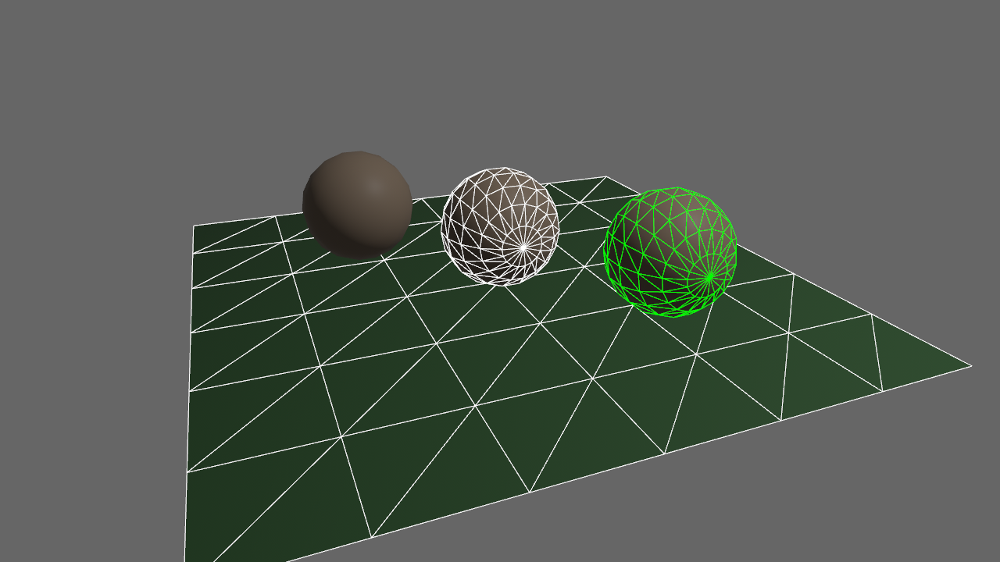

+++
title = "Bevy 0.12"
date = 2023-10-21
[extra]
author = "Bevy Contributors"
+++

Thanks to **X** contributors, **X** pull requests, community reviewers, and our [**generous sponsors**](/community/donate), we're happy to announce the **Bevy 0.12** release on [crates.io](https://crates.io/crates/bevy)!

For those who don't know, Bevy is a refreshingly simple data-driven game engine built in Rust. You can check out our [Quick Start Guide](/learn/book/getting-started/) to try it today. It's free and open source forever! You can grab the full [source code](https://github.com/bevyengine/bevy) on GitHub. Check out [Bevy Assets](https://bevyengine.org/assets) for a collection of community-developed plugins, games, and learning resources.

To update an existing Bevy App or Plugin to **Bevy 0.12**, check out our [0.11 to 0.12 Migration Guide](/learn/migration-guides/0.11-0.12/).

Since our last release a few months ago we've added a _ton_ of new features, bug fixes, and quality of life tweaks, but here are some of the highlights:

<!-- more -->

## Deferred Rendering

<div class="release-feature-authors">authors: @DGriffin91</div>

The two most popular "rendering styles" are:

* **Forward Rendering**: do all material/lighting calculations in a single render pass
  * **Pros**: Simpler to work with. Works on / performs better on more hardware. Supports MSAA. Handles transparency nicely.
  * **Cons**: Lighting is more expensive / fewer lights supported in a scene, some rendering effects are impossible (or harder) without a prepass
* **Deferred Rendering**: do one or more pre-passes that collect relevant information about a scene, then do material/lighting calculations in _screen space_ in a final pass after that.
  * **Pros**: Enables some rendering effects that are not possible in forward rendering. This is especially important for GI techniques, cuts down on shading cost by only shading visible fragments, can support more lights in a scene
  * **Cons**: More complicated to work with. Requires doing prepasses, which can be more expensive than an equivalent forward renderer in some situations (although the reverse can also be true), uses more texture bandwidth (which can be prohibitive on some devices), doesn't support MSAA, transparency is harder / less straightforward.

Bevy's renderer has historically been a "forward renderer". More specifically, it is a [Clustered Forward / Forward+](/news/bevy-0-7/#unlimited-point-lights) renderer, which means we break the view frustum up into clusters and assign lights to those clusters, allowing us to render many more lights than a traditional forward renderer.

However, as Bevy has grown, it has slowly moved into "hybrid renderer" territory. In previous releases, we added a [Depth and Normal Prepass](/news/bevy-0-10/#depth-and-normal-prepass) to enable [TAA](/news/bevy-0-11/#temporal-anti-aliasing), [SSAO](/news/bevy-0-11/#screen-space-ambient-occlusion), and [Alpha Texture Shadow Maps](/news/bevy-0-10/#shadow-mapping-using-prepass-shaders). We also added a Motion Vector Prepass to enable TAA.

In **Bevy 0.12** we added support for Deferred Rendering (building on the existing prepass work). Each material can choose whether it will go through the forward or deferred path, and this can be configured per-material-instance. Bevy also has a new [`DefaultOpaqueRendererMethod`] resource, which configures the global default, which is set to "forward" by default. The global default can be overridden per-material.

When deferred is enabled for the PBR [`StandardMaterial`], the deferred prepass packs PBR information into the Gbuffer, which looks like this:


The deferred prepass also produces a "deferred lighting pass ID" texture, which determines what lighting shader to run for the fragment:


A depth texture is also produced:


These are passed into the final deferred lighting shader. The final render looks like this:


Note that the cube in front of the flight helmet model is using forward rendering, which is why it is black in both of the deferred lighting textures above. This illustrates that you can use both forward and deferred materials in the same scene!

Note that for most use cases, we recommend using forward by default, unless a feature explicitly needs deferred or your rendering conditions benefit from deferred style. Forward has the fewest surprises and will work better on more devices.

[`StandardMaterial`]: https://dev-docs.bevyengine.org/bevy/pbr/struct.StandardMaterial.html
[`DefaultOpaqueRendererMethod`]: https://dev-docs.bevyengine.org/bevy/pbr/struct.DefaultOpaqueRendererMethod.html

## PCF Shadow Filtering

<div class="release-feature-authors">authors: @superdump (Rob Swain), @JMS55</div>

Shadow aliasing is a very common problem in 3D apps:


Those "jagged lines" in the shadow are the result of the shadow map being "too small" to accurately represent the shadow from this perspective. The shadow map above is stored in a 512x512 texture, which is a lower resolution than most people will use for most of their shadows. This was selected to show a "bad" case of jaggies. Note that Bevy defaults to 2048x2048 shadowmaps.

One "solution" is to bump up the resolution. Here is what it looks like with a 4096x4096 shadow map.


Looking better! However this still isn't a perfect solution. Large shadowmaps aren't feasible on all hardware. They are significantly more expensive. And even if you can afford super high resolution shadows, you can still encounter this issue if you place an object in the wrong place, or point your light in the wrong direction. You can use Bevy's [Cascaded Shadow Maps](/news/bevy-0-10/#cascaded-shadow-maps) (which are enabled by default) to cover a larger area, with higher detail close to the camera and less detail farther away. However even under these conditions, you will still probably encounter these aliasing issues.

**Bevy 0.12** introduces **PCF Shadow Filtering** (Percentage-Closer Filtering), which is a popular technique that takes multiple samples from the shadow map and compares with an interpolated mesh surface depth-projected into the frame of reference of the light. It then calculates the percentage of samples in the depth buffer that are closer to the light than the mesh surface. In short, this creates a "blur" effect that improves shadow quality, which is especially evident when a given shadow doesn't have enough "shadow map detail".

**Bevy 0.12**'s default PCF approach is the [`ShadowMapFilter::Castano13`] method by Ignacio Castaño (used in The Witness). Here it is with a 512x512 shadow map:

<b style="display:block; margin-bottom: -18px">Drag this image to compare (Castano)</b>
<div class="image-compare" style="aspect-ratio: 16 / 9" data-title-a="PCF Off" data-title-b="PCF On">
  
  
</div>

Much better!

We also implemented the [`ShadowMapFilter::Jimenez14`] method by Jorge Jimenez (used in Call of Duty Advanced Warfare). This can be slightly cheaper than Castano, but it can flicker. It benefits from [Temporal Anti-Aliasing (TAA)](/news/bevy-0-11/#temporal-anti-aliasing) which can reduce the flickering. It can also blend shadow cascades a bit more smoothly than Castano.

<b style="display:block; margin-bottom: -18px">Drag this image to compare (Jimenez)</b>
<div class="image-compare" style="aspect-ratio: 16 / 9" data-title-a="PCF Off" data-title-b="PCF On">
  
  
</div>

[`ShadowMapFilter::Castano13`]: https://dev-docs.bevyengine.org/bevy/pbr/enum.ShadowFilteringMethod.html#variant.Castano13
[`ShadowMapFilter::Jimenez14`]: https://dev-docs.bevyengine.org/bevy/pbr/enum.ShadowFilteringMethod.html#variant.Jimenez14
`
## Bevy Asset V2

<div class="release-feature-authors">authors: @cart</div>

Asset pipelines are a central part of the gamedev process. Bevy's old asset system was suitable for some classes of app, but it had a number of limitations that prevented it from serving the needs of other classes, especially higher end 3D apps.

Bevy Asset V2 is a completely new asset system that learns from the best parts of Bevy Asset V1 while adding support for a number of important scenarios: **Asset Importing/Preprocessing**, **Asset Meta Files**, **Multiple Asset Sources**, **Recursive Asset Dependency Load Events**, **Async Asset I/O**, **Faster and More Featureful Asset Handles**, and more!

Most existing user-facing asset code will either require no changes at all, or minimal changes. Custom [`AssetLoader`] or [`AssetReader`] code will need to change slightly, but generally the changes should be very minimal. Bevy Asset V2 (despite being a completely new implementation) largely just expands what Bevy is capable of.

[`AssetLoader`]: https://dev-docs.bevyengine.org/bevy/asset/trait.AssetLoader.html
[`AssetReader`]: https://dev-docs.bevyengine.org/bevy/asset/io/trait.AssetReader.html

### Asset Preprocessing


Asset preprocessing is the ability to take an input asset of a given type, process it in some way (generally during development time), and then use the result as the final asset in your application. Think of it as an "asset compiler".

This enables a number of scenarios:

* **Reduce Work In Released Apps**: Many assets aren't _composed_ in their ideal form for release. Scenes might be defined in a human-readable text format that is slower to load. Images might be defined in formats that require more work to decode and upload to the GPU, or take up more space on the GPU when compared to GPU-friendly formats (ex: PNG images vs Basis Universal). Preprocessing enables developers to convert to release-optimal formats ahead of time, making apps start up faster, take up fewer resources, and perform better. It also enables moving computation work that _would_ have been done at runtime to development time. For example, generating mipmaps for images.
* **Compression**: Minimize the disk space and/or bandwidth that an asset takes up in deployed apps
* **Transformation**: Some "asset source files" aren't in the right format by default. You can have an asset of type `A` and transform it into type `B`.

If you are building an app that tests the limits of your hardware with optimal formats ... or you just want to cut down on startup / loading times, asset preprocessing is for you.

For an in-depth technical breakdown of the implementation we chose, check out the [Bevy Asset V2 pull request](https://github.com/bevyengine/bevy/pull/8624).

### Enabling Pre-Processing

To enable asset pre-processing, just configure your [`AssetPlugin`] like this:

```rust
app.add_plugins(DefaultPlugins.set(
    AssetPlugin {
        mode: AssetMode::Processed,
        ..default()
    }
))
```

This will configure the asset system to look for assets in the `imported_assets` folder instead of the `assets` "source folder". During development, enable the `asset_processor` cargo feature flag like this:

```sh
cargo run --features bevy/asset_processor
```

This will start the [`AssetProcessor`] in parallel with your app. It will run until all assets are read from their source (defaults to the `assets` folder), processed, and the results have been written to their destination (defaults to the `imported_assets` folder). This pairs with asset hot-reloading. If you make a change, this will be detected by the [`AssetProcessor`], the asset will be reprocessed, and the result will be hot-reloaded in your app.

[`AssetPlugin`]: https://dev-docs.bevyengine.org/bevy/asset/struct.AssetPlugin.html
[`AssetProcessor`]: https://dev-docs.bevyengine.org/bevy/asset/processor/struct.AssetProcessor.html

### Incremental and Dependency Aware

**Bevy Asset V2** will only process assets that have changed. To accomplish this, it computes and stores hashes of each asset source file:

```rust
hash: (132, 61, 201, 41, 85, 80, 72, 189, 132, 81, 252, 156, 4, 227, 196, 207),
```

It also tracks the asset dependencies used when processing an asset. If a dependency has changed, the dependant asset will also be re-processed!

### Transactional and Reliable

**Bevy Asset V2** uses write-ahead logging (a technique commonly used by databases) to recover from crashes / forced exists. Whenever possible it avoids full-reprocessing and only reprocesses incomplete transactions.

The [`AssetProcessor`] can close (either intentionally or unintentionally) at any point in time and it will pick up right where it left off!

If a Bevy App asks to load an asset that is currently being processed (or re-processed), the load will asynchronously wait until both the processed asset and its meta file have been written. This ensures that a loaded asset file and meta file always "match" for a given load.

### Asset Meta Files

Assets now support (optional) `.meta` files. This enables configuring things like:

* **The asset "action"**
  * This configures how Bevy's asset system should handle the asset:
    * `Load`: Load the asset without processing
    * `Process`: Pre-process the asset prior to loading
    * `Ignore`: Do not process or load the asset
* **[`AssetLoader`] settings**
  * You can use meta files to set any [`AssetLoader`] you want
  * Configure loader settings like "how to filter an image", "adjusting the up axis in 3D scenes", etc
* **[`Process`] settings** (if using the `Process` action)
  * You can use meta files to set any [`Process`] implementation you want
  * Configure processor settings like "what type of compression to use", "whether or not to generate mipmaps", etc

A meta file for an unprocessed image looks like this:

```rust
(
    meta_format_version: "1.0",
    asset: Load(
        loader: "bevy_render::texture::image_loader::ImageLoader",
        settings: (
            format: FromExtension,
            is_srgb: true,
        ),
    ),
)
```

A meta file for an image configured to be processed looks like this:

```rust
(
    meta_format_version: "1.0",
    asset: Process(
        processor: "bevy_asset::processor::process::LoadAndSave<bevy_render::texture::image_loader::ImageLoader, bevy_render::texture::compressed_image_saver::CompressedImageSaver>",
        settings: (
            loader_settings: (
                format: FromExtension,
                is_srgb: true,
            ),
            saver_settings: (),
        ),
    ),
)
```

If the asset processor is enabled, meta files will be automatically generated for assets.

The final "output" metadata for the processed image looks like this:

```rust
(
    meta_format_version: "1.0",
    processed_info: Some((
        hash: (132, 61, 201, 41, 85, 80, 72, 189, 132, 81, 252, 156, 4, 227, 196, 207),
        full_hash: (81, 90, 244, 190, 16, 134, 202, 154, 3, 211, 78, 199, 216, 21, 132, 216),
        process_dependencies: [],
    )),
    asset: Load(
        loader: "bevy_render::texture::image_loader::ImageLoader",
        settings: (
            format: Format(Basis),
            is_srgb: true,
        ),
    ),
)
```

This is what is written to the `imported_assets` folder.

Note that the `Process` asset mode has changed to `Load`. This is because in the released app, we will load the final processed image "normally" like any other image asset. Note that in this case, the input and the output asset _both_ use [`ImageLoader`]. However the processed asset _can_ use a different loader if the context demands it.

Also note the addition of the `processed_info` metadata. This is used to determine if an asset needs to be reprocessed. `hash` is a combined hash of the asset source file and the asset meta file. This can be used to detect if the asset has changed. `process_dependencies` contains information (and hashes) of any asset dependencies used to produce the final processed asset. `full_hash` is a combination of `hash` and `processed_info` data to quickly determine if an asset has changed.

The final processed asset and metadata files can be viewed and interacted with like any other file. However they are intended to be read-only. Configuration should happen on the _source asset_, not the _final processed asset_.

[`Process`]: https://dev-docs.bevyengine.org/bevy/asset/processor/trait.Process.html
[`ImageLoader`]: https://dev-docs.bevyengine.org/bevy/render/texture/struct.ImageLoader.html

### `CompressedImageSaver`


<div style="font-size: 1.0rem" class="release-feature-authors">Sponza scene with textures processed into Basis Universal (with mipmaps) using Bevy Asset V2</div>

**Bevy 0.12** ships with a barebones [`CompressedImageSaver`] that writes images to [Basis Universal](https://github.com/BinomialLLC/basis_universal) (a GPU-friendly image interchange format) and generates [mipmaps](https://en.wikipedia.org/wiki/Mipmap). Importantly, mipmaps reduce aliasing artifacts when sampling images from different distances. This fills an important gap, as Bevy previously had no way to generate mipmaps on its own (it relied on external tooling). This can be enabled with the `basis-universal` cargo feature.

[`CompressedImageSaver`]: https://dev-docs.bevyengine.org/bevy/render/texture/struct.CompressedImageSaver.html

### Preprocessing is Optional!

In future Bevy releases we will likely recommended enabling processing for the majority of apps. We don't _yet_ recommend it for most use cases for a few reasons:

1. Most of our built-in assets don't have processors implemented for them yet. The [`CompressedImageSaver`] is the only built-in processor and it has a bare-minimum set of features.
2. We have not implemented "asset migrations" yet. Whenever an asset changes its settings format (which is used in meta files), we need to be able to automatically migrate existing asset meta files to the new version.
3. As people adopt processing, we expect some flux as we respond to feedback.

Despite (eventually) recommending that most people enable asset processing, we also acknowledge that Bevy is used in a variety of applications. Asset processing introduces additional complexity and workflow changes that some people will not want!

This is why Bevy offers two asset modes:

* [`AssetMode::Unprocessed`]: Assets will be loaded directly from the asset source folder (defaults to `assets`) without any preprocessing. They are assumed to be in their "final format". This is the mode/workflow Bevy users are currently used to.
* [`AssetMode::Processed`]: Assets will be pre-processed at development time. They will be read from their source folder (defaults to `assets`) and then written to their destination folder (defaults to `imported_assets`).

To enable this, Bevy uses a novel approach to assets: the difference between a processed and unprocessed asset is perspective. They both use the same `.meta` format and they use the same [`AssetLoader`] interface.

A [`Process`] implementation can be defined using arbitrary logic, but we heavily encourage using the [`LoadAndSave`] [`Process`] implementation. [`LoadAndSave`] takes any [`AssetLoader`] and passes the results to an [`AssetSaver`].

That means if you already have an [`ImageLoader`], which loads images, all you need to do is write some `ImageSaver` which will write the image in some optimized format. This both saves development work and makes it easy to support both processed and unprocessed scenarios.

[`AssetMode::Unprocessed`]: https://dev-docs.bevyengine.org/bevy/asset/enum.AssetMode.html
[`AssetMode::Processed`]: https://dev-docs.bevyengine.org/bevy/asset/enum.AssetMode.html
[`LoadAndSave`]: https://dev-docs.bevyengine.org/bevy/asset/processor/struct.LoadAndSave.html
[`AssetSaver`]: https://dev-docs.bevyengine.org/bevy/asset/saver/trait.AssetSaver.html

### Built To Run Anywhere

Unlike many other asset processors in this space, Bevy Asset V2's [`AssetProcessor`] is intentionally architected to run on any platform. It doesn't use platform-limited databases or require the ability/permission to run a networked server. It can be deployed alongside a released app if your application logic requires processing at runtime.

One notable exception: we still need to make a few changes before it can run on the web, but it was built with web support in mind.

### Recursive Asset Dependency Load Events

The [`AssetEvent`] enum now has an [`AssetEvent::LoadedWithDependencies`] variant. This is emitted when an [`Asset`], its dependencies, and all descendant / recursive dependencies have loaded.

This makes it easy to wait until an [`Asset`] is "fully loaded" before doing something.

[`AssetEvent`]: https://dev-docs.bevyengine.org/bevy/asset/enum.AssetEvent.html

### Multiple Asset Sources

It is now possible to register more than one [`AssetSource`] (which replaces the old monolithic "asset provider" system).

Loading from the "default" [`AssetSource`] looks exactly like it does in previous Bevy versions:

```rust
sprite.texture = assets.load("path/to/sprite.png");
```

But in **Bevy 0.12** you can now register named [`AssetSource`] entries. For example you could register a `remote` [`AssetSource`] that loads assets from an HTTP server:

```rust
sprite.texture = assets.load("remote://path/to/sprite.png");
```

Features like hot-reloading, meta files, and asset processing are supported across all sources.

You can register a new [`AssetSource`] like this:

```rust
// reads assets from the "other" folder, rather than the default "assets" folder
app.register_asset_source(
    // This is the "name" of the new source, used in asset paths.
    // Ex: "other://path/to/sprite.png"
    "other",
    // This is a repeatable source builder. You can configure readers, writers,
    // processed readers, processed writers, asset watchers, etc.
    AssetSource::build()
        .with_reader(|| Box::new(FileAssetReader::new("other")))
    )
)
```

[`AssetSource`]: https://dev-docs.bevyengine.org/bevy/asset/io/struct.AssetSource.html

### Embedded Assets

One of the features motivating **Multiple Asset Sources** was improving our "embedded-in-binary" asset loading. The old `load_internal_asset!` approach had a number of issues (see the relevant section in [this PR](https://github.com/bevyengine/bevy/pull/9885)).

The old system looked like this:

```rust
pub const MESH_SHADER_HANDLE: Handle<Shader> = Handle::weak_from_u128(3252377289100772450);

load_internal_asset!(app, MESH_SHADER_HANDLE, "mesh.wgsl", Shader::from_wgsl);
```

This required a lot of boilerplate and didn't integrate cleanly with the rest of the asset system. The [`AssetServer`] was not aware of these assets, hot-reloading required a special-cased second [`AssetServer`], and you couldn't load assets using an [`AssetLoader`] (they had to be constructed in memory). Not ideal!

To prove out the **Multiple Asset Sources** implementation, we built a new `embedded` [`AssetSource`], which replaces the old `load_interal_asset!` system with something that naturally fits into the asset system:

```rust
// Called in `crates/bevy_pbr/src/render/mesh.rs`
embedded_asset!(app, "mesh.wgsl");

// later in the app
let shader: Handle<Shader> = asset_server.load("embedded://bevy_pbr/render/mesh.wgsl");
```

That is a lot less boilerplate than the old approach!

And because the `embedded` source is just like any other asset source, it can support hot-reloading cleanly ... unlike the old system. To hot-reload assets embedded in the binary (ex: to get live updates on a shader you have embedded in the binary), just enable the new `embedded_watcher` cargo feature.

Much better!

### Extendable

Almost everything in **Bevy Asset V2** can be extended with trait impls:

* **[`Asset`]**: Define new asset types
* **[`AssetReader`]**: Define custom [`AssetSource`] read logic
* **[`AssetWriter`]**: Define custom [`AssetSource`] write logic
* **[`AssetWatcher`]**: Define custom [`AssetSource`] watching / hot-reloading logic
* **[`AssetLoader`]**: Define custom load logic for a given [`Asset`] type
* **[`AssetSaver`]**: Define custom save logic for a given [`Asset`] type
* **[`Process`]**: Define fully bespoke processor logic (or use the more opinionated [`LoadAndSave`] [`Process`] impl)

[`Asset`]: https://dev-docs.bevyengine.org/bevy/asset/trait.Asset.html
[`AssetWatcher`]: https://dev-docs.bevyengine.org/bevy/asset/io/trait.AssetWatcher.html

### Async Asset I/O

The new [`AssetReader`] and [`AssetWriter`] APIs are async! This means naturally async backends (like networked APIs) can directly call `await` on futures.

The filesystem impls (such as [`FileAssetReader`]) offload file IO to a separate thread and the future resolves when the file operation has finished.

[`AssetWriter`]: https://dev-docs.bevyengine.org/bevy/asset/io/trait.AssetWriter.html
[`FileAssetReader`]: https://dev-docs.bevyengine.org/bevy/asset/io/file/struct.FileAssetReader.html

### Improved Hot-Reloading Workflow

Previous versions of Bevy required manually enabling asset hot-reloading in your app code (in addition to enabling the `filesystem_watcher` cargo feature):

```rust
// Enabling hot reloading in old versions of Bevy
app.add_plugins(DefaultPlugins.set(AssetPlugin::default().watch_for_changes()))
```

This was suboptimal because released versions of apps generally don't want filesystem watching enabled.

In **Bevy 0.12** we've improved this workflow by making the new `file_watcher` cargo feature enable file watching in your app by default. During development, just run your app with the feature enabled:

```sh
cargo run --features bevy/file_watcher
```

When releasing, just omit that feature. No code changes required!

```sh
cargo build --release
```

### Better Asset Handles

Asset handles now use a single `Arc` at their core to manage the lifetime of an asset. This simplifies the internals significantly and also enables us to make more asset information available directly from handles.

Notably, in **Bevy 0.12** we use this to provide direct [`AssetPath`] access from the [`Handle`]:

```rust
// Previous version of Bevy
let path = asset_server.get_handle_path(&handle);

// Bevy 0.12
let path = handle.path();
```

Handles now also use a smaller / cheaper-to-look-up [`AssetIndex`] internally, which uses generational indices to look up assets in dense storage.

[`AssetPath`]: https://dev-docs.bevyengine.org/bevy/asset/struct.AssetPath.html
[`Handle`]: https://dev-docs.bevyengine.org/bevy/asset/enum.Handle.html
[`AssetIndex`]: https://dev-docs.bevyengine.org/bevy/asset/struct.AssetIndex.html

### True Copy-on-Write Asset Paths

The [`AssetServer`] and [`AssetProcessor`] do a lot of [`AssetPath`] cloning (across many threads). In previous versions of Bevy, [`AssetPath`] was backed by Rust's [`Cow`] type. However in Rust, cloning an "owned" [`Cow`] results in a clone of the internal value. This is _not_ the "clone on write" behavior we want for [`AssetPath`]. We use [`AssetPath`] across threads, so we _need_ to start with an "owned" value.

To prevent all of this cloning and re-allocating of strings, we've built our own [`CowArc`] type, which [`AssetPath`] uses internally. It has two tricks up its sleeve:

1. The "owned" variant is an `Arc<str>`, which we can cheaply clone without reallocating the string.
2. Almost _all_ [`AssetPath`] values defined in code come from a `&'static str`. We've created a special [`CowArc::Static`] variant that retains this static-ness, meaning we do _zero_ allocations even when turning a borrow into an "owned [`AssetPath`]".

[`Cow`]: https://doc.rust-lang.org/std/borrow/enum.Cow.html
[`AssetServer`]: https://dev-docs.bevyengine.org/bevy/asset/struct.AssetServer.html
[`CowArc`]: https://dev-docs.bevyengine.org/bevy/utils/enum.CowArc.html
[`CowArc::Static`]: https://dev-docs.bevyengine.org/bevy/utils/enum.CowArc.html#variant.Static

## CI Improvements

<div class="release-feature-authors">authors: @ameknite, @mockersf</div>

To help ensure examples are reusable outside of the Bevy repository, CI will now fail if an example
uses an import from `bevy_internal` instead of `bevy`.

Additionally, the daily mobile check job now builds on more iOS and Android devices:

* iPhone 13 on iOS 15
* iPhone 14 on iOS 16
* iPhone 15 on iOS 17
* Xiaomi Redmi Note 11 on Android 11
* Google Pixel 6 on Android 12
* Samsung Galaxy S23 on Android 13
* Google Pixel 8 on Android 14

## Example tooling improvements

<div class="release-feature-authors">authors: @mockersf</div>

The example showcase tool can now build all examples for WebGL2 or WebGPU. This is used to update
the website with all Wasm-compatible examples, which you can find
[here](https://bevyengine.org/examples/) for WebGL2, or
[here](https://bevyengine.org/examples-webgpu/) for WebGPU.

It is now also capable of capturing a screenshot while running all examples:

```sh
cargo run -p example-showcase -- run --screenshot
```

Some options are available to help with the execution, you can check them with `--help`.

Those screenshots are displayed on the example pages on the website, and can be used to check that
a PR didn't introduce a visible regression.

## Example execution in CI

<div class="release-feature-authors">authors: @mockersf, @rparrett</div>

All examples are now executed in CI on Windows with DX12, and on Linux with Vulkan. When possible,
a screenshot is taken and compared to the last execution. If an example crashes, the log is saved.
The mobile example is also executed on the same devices as the daily mobile check job.

A report of all those executions is built and available
[here](https://thebevyflock.github.io/bevy-example-runner/).

[](https://thebevyflock.github.io/bevy-example-runner/)

If you want to help sponsor tests on more platforms, get in touch!

## Suspend and Resume on Android

<div class="release-feature-authors">authors: @mockersf</div>

On Android, applications no longer crash on suspend. Instead, they are paused, and no systems
will run until the application is resumed.

<video controls><source src="suspend-resume.mp4" type="video/mp4"/></video>

Background tasks working in other threads, like playing audio, won't be stopped. When the
application will be suspended, a [`Lifetime`] event `ApplicationLifetime::Suspended` is sent,
corresponding to the [`onStop()`] callback. You should take care to pause tasks that shouldn't
run in the background, and resume them when receiving the `ApplicationLifetime::Resumed` event
(corresponding to the [`onRestart()`] callback).

```rust
fn handle_lifetime_events(
    mut lifetime_events: EventReader<ApplicationLifetime>,
    music_controller: Query<&AudioSink>,
) {
    for event in lifetime_events.read() {
        match event {
            // Upon receiving the `Suspended` event, the application has 1 frame before it is paused
            // As audio happens in an independent thread, it needs to be stopped
            ApplicationLifetime::Suspended => music_controller.single().pause(),
            // On `Resumed``, audio can continue playing
            ApplicationLifetime::Resumed => music_controller.single().play(),
            // `Started` is the only other event for now, more to come in the next Bevy version
            _ => (),
        }
    }
}
```
[`Lifetime`]: https://docs.rs/bevy/0.12.0/bevy/window/enum.Lifetime.html
[`onStop()`]: https://developer.android.com/reference/android/app/Activity#onStop()
[`onRestart()`]: https://developer.android.com/reference/android/app/Activity#onRestart()

## AccessKit Integration Improvements

<div class="release-feature-authors">authors: @ndarilek</div>

Bevy 0.10's [AccessKit](https://accesskit.dev) integration made it incredibly easy for the engine to take the lead and push updates to the accessibility tree. But as any good dance partner knows, sometimes it's best not to lead but to follow.

This release adds the `ManageAccessibilityUpdates` resource which, when set to `false`, stops the engine from updating the tree on its own. This paves the way for third-party UIs with Bevy and AccessKit integration to send updates directly to Bevy. When the UI is ready to return control, `ManageAccessibilityUpdates` is set to `true` Bevy picks up where it left off and starts sending updates again.

AccessKit itself was also simplified, and this release capitalizes on that to shrink the surface area of our integration. If you're curious about how things work internally or want to help, the `bevy_a11y` crate is now more approachable than ever.

## Wireframe Improvements

<div class="release-feature-authors">authors: @IceSentry</div>

The wireframes now use bevy's Material abstraction. This means it will automatically use the new batching and instancing features while being easier to maintain. This change also made it easier to add support for colored wireframe. You can configure the color globally or per mesh using the `WireframeColor` component. It's also now possible to disable wireframe rendering by using the `NeverRenderWireframe` component.



## Reflect Commands

<div class="release-feature-authors">authors: @NoahShomette</div>

It is now possible to insert and remove reflect components from an entity in a normal system via new functions on [`Commands`]!

```rust
#[derive(Component, Reflect, Default)]
#[reflect(Component)]
struct Component(u32);

fn reflect_commands(mut commands: Commands) {
    let boxed_reflect_component: Box<dyn Reflect> = Box::new(Component(916));

    let entity = commands
        .spawn_empty()
        .insert_reflect(boxed_reflect_component.clone_value()).id();

    commands.entity(entity).remove_reflect(boxed_reflect_component.type_name().to_owned());

}
```

The above commands use the [`AppTypeRegistry`] by default. If you use a different TypeRegistry then you can use the ...`with_registry` commands instead.

```rust
 #[derive(Resource)]
 struct TypeRegistryResource {
     type_registry: TypeRegistry,
 }

 impl AsRef<TypeRegistry> for TypeRegistryResource {
     fn as_ref(&self) -> &TypeRegistry {
         &self.type_registry
     }
 }

 fn reflect_commands_with_registry(mut commands: Commands) {
    let boxed_reflect_component: Box<dyn Reflect> = Box::new(Component(916));

    let entity = commands
        .spawn_empty()
        .insert_reflect_with_registry::<TypeRegistryResource>(boxed_reflect_component.clone_value()).id();

    commands.entity(entity).remove_reflect_with_registry::<TypeRegistryResource>(boxed_reflect_component.type_name().to_owned());

}
```

See [`ReflectCommandExt`] for more examples and documentation

[`Commands`]: https://docs.rs/bevy/0.12.0/bevy/ecs/system/struct.Commands.html

[`AppTypeRegistry`]: https://docs.rs/bevy/0.12.0/bevy/ecs/reflect/struct.AppTypeRegistry.html

[`ReflectCommandExt`]: https://docs.rs/bevy/0.12.0/bevy/ecs/reflect/trait.ReflectCommandExt.html

## Limit Background FPS

<div class="release-feature-authors">authors: @maniwani</div>

If an app has no window in focus, Bevy will now limit its update rate (to 60Hz by default).

Before, many Bevy apps running on desktop operating systems (particularly macOS) would see spikes in CPU usage whenever their windows were minimized or completely covered, even with VSync enabled. The reason for this is that many desktop window managers ignore VSync for windows that aren't visible. As VSync normally limits how often an app updates, that speed limit vanishes while it's effectively disabled.

Now, apps running in the background will sleep in between updates to limit their FPS.

The one caveat is that most operating systems will not report if a window is visible, only if it has focus. So the throttle is based on focus, not visibility. 60Hz was then chosen as the default to maintain high FPS in cases where the window is not focused but still visible.

## `AnimationPlayer` API Improvements

<div class="release-feature-authors">authors: @devinleamy</div>

The `AnimationPlayer` now has new methods for controlling playback, and utilities for checking
if an animation is playing or completed, and getting its `AnimationClip` handle.

`set_elapsed` and has been removed in favor of `seek_to`. `elapsed` now
returns the actual elapsed time and is not affected by the animation speed. `stop_repeating` have been removed
in favor of `set_repeat(RepeatAnimation::Never)`.

```rust
let mut player = q_animation_player.single_mut();
// Check if an animation is complete.
if player.is_finished() {
    // Set the playback mode.
    player.set_repeat(RepeatAnimation::Forever);
    player.set_repeat(RepeatAnimation::Never);
    player.set_repeat(RepeatAnimation::Count(4));
}
// Get a handle to the playing AnimationClip.
let clip_handle = player.animation_clip();
// Seek to 1s in the current clip.
player.seek_to(1.0);
```

## Ignore Ambiguous Components and Resources

<div class="release-feature-authors">authors: @hymm</div>

Ambiguity Reporting is an optional feature of Bevy's scheduler. When enabled it reports conflicts between systems that modify the same data, but are not ordered in relation to each other. While some reported conflicts can cause subtle bugs, many do not. Bevy has a couple existing methods and two new ones for ignoring these.

The existing APIs: `ambiguous_with`, which ignores conflicts between specific sets, and `ambiguous_with_all`, which ignores all conflicts with the set it's applied to. In addition, there are now 2 new APIs that let you ignore conflicts on a type of data, `allow_ambiguous_component` and `allow_ambiguous_resource`. These ignore all conflicts between systems on that specific type, component or resource, in a world.

```rust
#[derive(Resource)]
struct R;

// These systems are ambiguous on R
fn system_1(_: ResMut<R>) {}
fn system_2(_: Res<R>) {}

let mut app = App::new();
app.configure_schedules(ScheduleBuildSettings {
  ambiguity_detection: LogLevel::Error,
  ..default()
});
app.insert_resource(R);

app.add_systems(Update, ( system_1, system_2 ));
app.allow_ambiguous_resource::<R>();

// Running the app does not error.
app.update();
```

Bevy is now using this to ignore conflicts between the `Assets<T>` resources. Most of these ambiguities are modifying different assets and thus do not matter.

## Spatial Audio API Ergonomics

<div class="release-feature-authors">authors: @rparrett, @hymm, @mockersf</div>

A simple "stereo" (non-HRTF) spatial audio implementation was heroically [put together](https://bevyengine.org/news/bevy-0-10/#spatial-audio) at the last minute for Bevy 0.10, but the implementation was somewhat bare-bones and not very user-friendly. Users needed to write their own systems to update audio sinks with emitter and listener positions.

Now users can just add a `TransformBundle` to their `AudioBundle`s and Bevy will take care of the rest!

```rust
commands.spawn((
    TransformBundle::default(),
    AudioBundle {
        source: asset_server.load("sounds/bonk.ogg"),
        settings: PlaybackSettings::DESPAWN.with_spatial(true),
    },
));
```

## Added HSL methods to `Color` struct

<div class="release-feature-authors">authors: @idedary</div>

You can now use `h()`, `s()`, `l()` together with their `set_h()`, `set_s()`, `set_l()` and `with_h()`, `with_s()`, `with_l()` variants to manipulate _Hue_, _Saturation_ and _Lightness_ values of a `Color` struct without cloning. Previously you could do that with only RGBA values.

```rust
// Returns HSL component values
let color = Color::ORANGE;
let hue = color.h();
// ...

// Changes the HSL component values
let mut color = Color::PINK;
color.set_s(0.5);
// ...

// Modifies existing colors and returns them
let color = Color::VIOLET.with_l(0.7);
// ...
```

## One-Shot Systems

<div class="release-feature-authors">authors: @alice-i-cecile @pascualex, @Trashtalk217, @Zeenobit</div>

Ordinarily, systems run once per frame, as part of a schedule.
But this isn't always the right fit.
Maybe you're responding to a very rare event like in a complex turn-based game, or simply don't want to clutter your schedule with a new system for every single button.
One-shot systems flip that logic on its head, and provide you the ability to run arbitrary logic on demand, using the powerful and familiar system syntax.

```rust
#[derive(Resource, Default, Debug)]
struct Counter(u8);

fn increment(mut counter: ResMut<Counter>) {
    counter.0 += 1;
    println!("{}", counter.0);
}

fn foo(world: &mut World) {
    world.init_resource::<Counter>();
    let id = world.register_system(increment);
    let _ = world.run_system(id); // prints 1
    let _ = world.run_system(id); // prints 2
}
```

There are three simple steps to using one-shot systems: register a system, store its `SystemId`, and then use either exclusive world access or commands to run the corresponding system.

A lot becomes possible with just that, however `SystemId`s really start showing their power, when they're wrapped into components.

```rust
use bevy::ecs::system::SystemId;

#[derive(Component)]
struct Callback(SystemId);

// calling all callbacks!
fn call_all(query: Query<&Callback>, mut commands: Commands) {
    for callback in query.iter() {
        commands.run_system(callback.0);
    }
}
```

One-shot systems can then be attached to UI elements, like buttons, actions in an RPG, or any other entity. You might even feel inspired to implement the bevy scheduling graph with one-shot systems and [`aery`](https://docs.rs/aery/latest/aery/) (let us know how that goes, by the way).

One-shot systems are very flexible.
They can be nested, so you can call `run_system` from within a one-shot system.
It's possible to have multiple instances of one system registered at a time, each with their own `Local` variables and cached system state.
It also plays nice with asset-driven workflows: recording a mapping from a string to an identifier in a serialized callback is much nicer than trying to do so with Rust functions!

Still, one-shot systems are not without their limitations.
Currently, exclusive systems and systems designed for system piping (with either an `In` parameter or a return type) can't be used at all.
You also can't call a one-shot systems from itself, recursion isn't possible.
Lastly, one-shot systems are always evaluated sequentially, rather than in parallel.
While this reduces both complexity and overhead, for certain workloads this can be meaningfully slower than using a schedule with a parallel executor.

However, when you're just prototyping or writing a unit test, it can be a real hassle: two whole functions and some weird identifier?
For these situations, you can use the `World::run_system_once` method.

```rust
use bevy::ecs::system::RunSystemOnce;

#[derive(Resource, Default, Debug)]
struct Counter(u8);

fn increment(mut counter: ResMut<Counter>) {
    counter.0 += 1;
    println!("{}", counter.0);
}

let mut world = World::new();
world.init_resource::<Counter>();
world.run_system_once(increment); // prints 1
world.run_system_once(increment); // prints 2
```

This is great for unit testing systems and queries, and it's both lower overhead and simpler to use. However, there is one caveat. Some systems have state, either in the form of `Local` arguments, change detection, or `EventReader`s. This state isn't saved between two `run_system_once` calls, creating odd behavior. The `Local`s reset every run, while change detection will _always_ detect data as added/changed. Be careful and you'll be alright.

## Unified `Time`

<div class="release-feature-authors">authors: @nakedible @maniwani @alice-i-cecile</div>

Bevy 0.12 brings two major quality of life improvements to `FixedUpdate`.

- `Time` now returns the contextually correct values for systems running in `FixedUpdate`. (As such, `FixedTime` has been removed.)
- `FixedUpdate` can no longer snowball into a "death spiral" (where the app freezes because `FixedUpdate` steps are enqueued faster than it can run them).

The `FixedUpdate` schedule and its companion `FixedTime` resource were introduced in Bevy 0.10, and it soon became apparent that `FixedTime` was lacking. Its methods were different from `Time` and it didn't even track "total time elapsed" like `Time` did, to name a few examples. Having two different "time" APIs also meant you had to write systems to specifically support "fixed timestep" or "variable timestep" and not both. It was desirable to not have this split as it can lead to incompatibilities between plugins down the road (which is sometimes the case with plugins in other game engines).

Now, you can just write systems that read `Time` and schedule them in either context.

```rust
// This system will see a constant delta time if scheduled in `FixedUpdate` or
// a variable delta time if scheduled in `Update`.
fn integrate_velocity(
    mut query: Query<(&mut Transfrom, &Velocity)>,
    time: Res<Time>,
) {
    for (mut transform, velocity) in &mut query {
        transform.translation.x += velocity.x * time.delta_seconds();
        transform.translation.y += velocity.y * time.delta_seconds();
    }
}
```

Most systems should continue to use `Time`, but behind the scenes, the methods from previous APIs have been refactored into four clocks:

- `Time<Real>`
- `Time<Virtual>`
- `Time<Fixed>`
- `Time<()>`

`Time<Real>` measures the true, unedited frame and app durations. For diagnostics/profiling, use that one. It's also used to derive the others. `Time<Virtual>` can be sped up, slowed down, and paused, and `Time<Fixed>` chases `Time<Virtual>` in fixed increments. Lastly, `Time<()>` is automatically overwritten with the current value of `Time<Fixed>` or `Time<Virtual>` upon entering or exiting `FixedUpdate`. When a system borrows `Time`, it actually borrows `Time<()>`.

Try the new `time` example to get a better feel for these resources.

The fix for the windup problem was limiting how much `Time<Virtual>` can advance from a single frame. This then limits how many times `FixedUpdate` can be queued for the next frame, and so things like frame lag or your computer waking up from a long sleep can no longer cause a death spiral. So now, the app won't freeze, but things happening in `FixedUpdate` will appear to slow down since it'll be running at a temporarily reduced rate.


## Reduced Tracing Overhead

<div class="release-feature-authors">authors: @hymm, @james7132</div>

Bevy uses the [tracing](https://crates.io/crates/tracing) library to measure system running time (among other things). This is useful for determining where bottlenecks in frame time are and measuring performance improvements. These traces can be visualized using the [tracy](https://github.com/wolfpld/tracy) tool. However, using tracing's spans has a significant overhead to it. A large part of the per-span overhead is due to allocating the string description of the span. By caching the spans for systems, commands, and parallel iteration, we have significantly reduced the CPU time overhead when using tracing. In the PR that introduced system span caching, our "many foxes" stress test went from 5.35 ms to 4.54 ms. In the PR that added caching for the parallel iteration spans, our "many cubes" stress test went from 8.89 ms to 6.8 ms.


## <a name="what-s-next"></a>What's Next?

We have plenty of work that is pretty much finished and is therefore very likely to land in **Bevy 0.13**:

Check out the [**Bevy 0.13 Milestone**](https://github.com/bevyengine/bevy/milestone/17) for an up-to-date list of current work being considered for **Bevy 0.13**.


## Support Bevy

Sponsorships help make our work on Bevy sustainable. If you believe in Bevy's mission, consider [sponsoring us](/community/donate) ... every bit helps!

<a class="button button--pink header__cta" href="/community/donate">Donate </a>

## Contributors

Bevy is made by a [large group of people](/community/people/). A huge thanks to the X contributors that made this release (and associated docs) possible! In random order:
