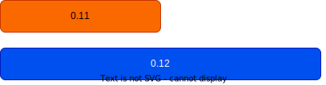
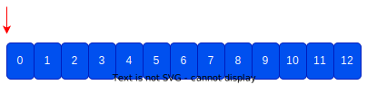

+++
title = "Bevy 0.12"
date = 2023-10-21
[extra]
author = "Bevy Contributors"
+++

Thanks to **X** contributors, **X** pull requests, community reviewers, and our [**generous sponsors**](/community/donate), we're happy to announce the **Bevy 0.12** release on [crates.io](https://crates.io/crates/bevy)!

For those who don't know, Bevy is a refreshingly simple data-driven game engine built in Rust. You can check out our [Quick Start Guide](/learn/book/getting-started/) to try it today. It's free and open source forever! You can grab the full [source code](https://github.com/bevyengine/bevy) on GitHub. Check out [Bevy Assets](https://bevyengine.org/assets) for a collection of community-developed plugins, games, and learning resources.

To update an existing Bevy App or Plugin to **Bevy 0.12**, check out our [0.11 to 0.12 Migration Guide](/learn/migration-guides/0.11-0.12/).

Since our last release a few months ago we've added a _ton_ of new features, bug fixes, and quality of life tweaks, but here are some of the highlights:

<!-- more -->

## Feature Name

<div class="release-feature-authors">authors: @author</div>

## Automatic Batching/Instancing of Draw Commands

<div class="release-feature-authors">authors: Rob Swain (@superdump)</div>

**Bevy 0.12** now automatically batches/instances draw commands where possible. This cuts down the number of draw calls, which yields significant performance wins!

This required a number of architectural changes, including how we store and access per-entity mesh data (more on this later).

Here are some benches of the old unbatched approach (0.11) to the new batched approach (0.12):

### 2D Mesh Bevymark (frames per second, more is better)

This renders 160,000 entities with textured quad meshes (160 groups of 1,000 entities each, each group sharing a material). This means we can batch each group, resulting in only 160 instanced draw calls when batching is enabled.


<div style="font-size: 1.0rem" class="release-feature-authors">Tested on an M1 Max, limiting the BatchedUniformBuffer batch size to 1 versus how it works in 0.12.</div>

### 3D Mesh "Many Cubes" (frames per second, more is better)

This renders 160,000 cubes, of which ~11,700 are visible in the view. These are drawn using a single instanced draw of all visible cubes which enables up to **100% increase in frame rate (2x)**!


<div style="font-size: 1.0rem" class="release-feature-authors">Tested on an M1 Max, limiting the BatchedUniformBuffer batch size to 1 versus how it works in 0.12.</div>

These performance benefits can be leveraged on all platforms, including WebGL2!

### What can be batched?

Batching/Instancing can only happen for GPU data that doesn't require "rebinding". This means if something like a pipeline (shaders), bind group (shader-accessible bound data), vertex / index buffer (mesh) is different, it cannot be batched.

From a high level, currently entities with the same material and mesh can be batched.

We are investigating ways to make more data accessible without rebinds, such as bindless textures, combining meshes into larger buffers, etc.

### Opting Out

If you would like to opt out an entity from automatic batching, you can add the new [`NoAutomaticBatching`] component to it.

This is generally for cases where you are doing custom, non-standard renderer features that don't play nicely with batching's assumptions. For example, it assumes view bindings are constant across draws and that Bevy's-built-in entity batching logic is used.

[`NoAutomaticBatching`]: https://dev-docs.bevyengine.org/bevy/render/batching/struct.NoAutomaticBatching.html

## The Road to GPU-driven Rendering

<div class="release-feature-authors">authors: Rob Swain (@superdump), @james-j-obrien, @JMS55, @inodentry, @robtfm, @nicopap, @teoxoy, @IceSentry, @Elabajaba</div>

Bevy's renderer performance for 2D and 3D meshes can improve a lot. There are bottlenecks on both the CPU and GPU side, which can be lessened to give significantly higher frame rates. As always with Bevy, we want to make the most of the platforms you use, from the constraints of WebGL2 and mobile devices, to the highest-end native discrete graphics cards. A solid foundation can support all of this.

In **Bevy 0.12** we have started reworking rendering data structures, data flow, and draw patterns to unlock new optimizations. This enabled the Automatic Batching/Instancing we landed in **Bevy 0.12** and also helps pave the way for other significant wins in the future, such as GPU-driven rendering.

### What are CPU- and GPU-driven rendering?

CPU-driven rendering is where draw commands are created on the CPU. In Bevy this means "in Rust code", more specifically in render graph nodes. This is how Bevy currently kicks off draws.

In GPU-driven rendering, the draw commands are encoded on the GPU by [compute shaders](https://www.khronos.org/opengl/wiki/Compute_Shader). This leverages GPU parallelism, and unlocks more advanced culling optimizations that are infeasible to do on the CPU, among many other methods that bring large performance benefits.

### What needs to change?

Historically Bevy's general GPU data pattern has been to bind each piece of data per-entity and issue a draw call per-entity. In some cases we did store data in uniform buffers in "array style" and accessed with dynamic offsets, but this still resulted in rebinding at each offset.

All of this rebinding has performance implications, both on the CPU and the GPU. On the CPU, it means encoding draw commands has many more steps to process and so takes more time than necessary. In the graphics API and on the GPU, it means many more rebinds and separate draw commands.

Avoiding rebinding is both a big performance benefit for CPU-driven rendering and is necessary to enable GPU-driven rendering.

To avoid rebinds, the general data pattern we are aiming for is:

* For each data type (meshes, materials, transforms, textures), create a single array (or a small number of arrays) containing all of the items of that data type
* Bind these arrays a small number of times (ideally once), avoiding per-entity/per-draw rebinds

In **Bevy 0.12** we've started this process in earnest! We've made a number of architectural changes that are already yielding fruit. Thanks to these changes, we can now [automatically batch and instance draws](#automatic-batching-instancing-of-draw-commands) for entities with the exact same mesh and material. And as we progress further down this path, we can batch/instance across a wider variety of cases, cutting out more and more CPU work until eventually we are "fully GPU-driven".

### Reorder Render Sets

<div class="release-feature-authors">authors: Rob Swain (@superdump), @james-j-obrien, @inodentry</div>

The order of draws needs to be known for some methods of instanced draws so that the data can be laid out, and looked up in order. For example, when per-instance data is stored in an instance-rate vertex buffer.

The render set order before **Bevy 0.12** caused some problems with this as data had to be prepared (written to the GPU) before knowing the draw order. Not ideal when our plan is to have an ordered list of entity data on the GPU! The previous order of sets was:


This caused friction (and suboptimal instancing) in a number of current (and planned) renderer features. Most notably in previous versions of Bevy, it caused these problems for sprite batching.  

The new render set order in 0.12 is:


`PrepareAssets` was introduced because we only want to queue entities for drawing if their assets have been prepared. Per-frame data preparation still happens in the `Prepare` set, specifically in its `PrepareResources` subset. That is now after `Queue` and `Sort`, so the order of draws is known. This also made a lot more sense for batching, as it is now known at the point of batching whether an entity that is of another type in the render phase needs to be drawn. Bind groups now have a clear subset where they should be created ... `PrepareBindGroups`.

### BatchedUniformBuffer and GpuArrayBuffer

OK, so we need to put many pieces of data of the same type into buffers in a way that we can bind them as few times as possible and draw multiple instances from them. How can we do that?

In previous versions of Bevy, per-instance `MeshUniform` data is stored in a uniform buffer with each instance's data aligned to a dynamic offset. When drawing each mesh entity, we update the dynamic offset, which is close to rebinding. It looks like this:


<div style="font-size: 1.0rem" class="release-feature-authors">Red arrows are 'rebinds' to update the dynamic offset, blue boxes are instance data, orange boxes are padding for dynamic offset alignment, which is a requirement of GPUs and graphics APIs.</div>

Instance-rate vertex buffers are one way, but they are very constrained to having a specific order. They are/may be suitable for per-instance data like mesh entity transforms, but they can't be used for material data. The other main options are uniform buffers, storage buffers, and data textures.

WebGL2 does not support storage buffers, only uniform buffers. Uniform buffers have a minimum guaranteed size per binding of 16kB on WebGL2. Storage buffers, where available, have a minimum guaranteed size of 128MB.

Data textures are far more awkward for structured data. And on platforms that don't support linear data layouts, they will perform worse.

Given these constraints, we want to use storage buffers on platforms where they are supported, and we want to use uniform buffers on platforms where they are not supported (ex: WebGL 2).

#### BatchedUniformBuffer

<div class="release-feature-authors">authors: Rob Swain (@superdump), @JMS55, @teoxoy, @robtfm, @konsolas</div>

For uniform buffers, we have to assume that on WebGL2 we may only be able to access 16kB of data at a time. Taking an example, `MeshUniform` requires 144 bytes per instance, which means we can have a batch of 113 instances per 16kB binding. If we want to draw more than 113 entities in total, we need a way of managing a uniform buffer of data that can be bound at a dynamic offset per batch of instances. This is what `BatchedUniformBuffer` is designed to solve.

`BatchedUniformBuffer` looks like this:


<div style="font-size: 1.0rem" class="release-feature-authors">Red arrows are 'rebinds' to update the dynamic offset, blue boxes are instance data, orange boxes are padding for dynamic offset alignment.</div>

Notice how the instance data can be packed much more tightly, fitting the same amount of used data in less space. Also, we only need to update the dynamic offset of the binding for each batch.

#### GpuArrayBuffer

<div class="release-feature-authors">authors: Rob Swain (@superdump), @JMS55, @IceSentry, @mockersf</div>

Given that we need to support both uniform and storage buffers for a given data type, this increases the level of complexity required to implement new low-level renderer features (both in Rust code and in shaders). When confronted with this complexity, some developers might choose instead only use storage buffers (effectively dropping support for WebGL 2).

To make it as easy as possible to support both storage types, we developed [`GpuArrayBuffer`]. This is a generic collection of `T` values that abstracts over `BatchedUniformBuffer` and [`StorageBuffer`]. It will use the right storage for the current platform / GPU.

The data in a [`StorageBuffer`] looks like this:


<div style="font-size: 1.0rem" class="release-feature-authors">Red arrows are 'rebinds', blue boxes are instance data.</div>

All the instance data can be placed directly one after the other, and we only have to bind once. There is no need for any dynamic offset binding, so there is no need for any padding for alignment.

[Check out this annotated code example](https://gist.github.com/cart/3a9f190bd5e789a7d42317c28843ffca) that illustrates using [`GpuArrayBuffer`] to support both uniform and storage buffer bindings.

[`GpuArrayBuffer`]: https://dev-docs.bevyengine.org/bevy/render/render_resource/enum.GpuArrayBuffer.html
[`StorageBuffer`]: https://dev-docs.bevyengine.org/bevy/render/render_resource/struct.StorageBuffer.html

### 2D / 3D Mesh Entities using GpuArrayBuffer

<div class="release-feature-authors">authors: Rob Swain (@superdump), @robtfm, @Elabajaba</div>

The 2D and 3D mesh entity rendering was migrated to use [`GpuArrayBuffer`] for the mesh uniform data.

Just avoiding the rebinding of the mesh uniform data buffer gives about a 6% increase in frame rates!

## EntityHashMap Renderer Optimization

<div class="release-feature-authors">authors: Rob Swain (@superdump), @robtfm, @pcwalton, @jancespivo, @SkiFire13, @nicopap</div>

Since **Bevy 0.6**, Bevy's renderer has extracted data from the "main world" into a separate "render world". This enables [Pipelined Rendering](/news/bevy-0-6/#pipelined-rendering-extract-prepare-queue-render), which renders frame N in the render app, while the main app simulates frame N+1.

Part of the design involves clearing the render world of all entities between frames. This enables consistent Entity mapping between the main and render worlds while still being able to spawn new entities in the render world that don't exist in the main world.

Unfortunately, this ECS usage pattern also incurred some significant performance problems. To get good "linear iteration read performance", we wanted to use "table storage" (Bevy's default ECS storage model). However in the renderer, entities are cleared and respawned each frame, components are inserted across many systems and different parts of the render app schedule. This resulted in a lot of "archetype moves" as new components were inserted from various renderer contexts. When an entity moves to a new archetype, all of its "table storage" components are copied into the new archetype's table. This can be expensive across many archetype moves and/or large table moves.

This was unfortunately leaving a lot of performance on the table. Many ideas were discussed over a long period for how to improve this.

### The Path Forward

The main two paths forward were:

1. Persist render world entities and their component data across frames
2. Stop using entity table storage for storing component data in the render world

We have decided to explore option (2) for **Bevy 0.12** as persisting entities involves solving other problems that have no simple and satisfactory answers (ex: how do we keep the worlds perfectly in sync without leaking data). We may find those answers eventually, but for now we chose the path of least resistance!

We landed on using `HashMap<Entity, T>` with an optimized hash function designed by @SkiFire13, and inspired by [`rustc-hash`](https://github.com/rust-lang/rustc-hash). This is exposed as [`EntityHashMap`] and is the new way to store component data in the render world.

This [yielded significant performance wins](https://github.com/bevyengine/bevy/pull/9903).

[`EntityHashMap`]: https://dev-docs.bevyengine.org/bevy/utils/type.EntityHashMap.html

### Usage

The easiest way to use it is to use the new [`ExtractInstancesPlugin`]. This wil extract all entities matching a query, or only those that are visible, extracting multiple components at once into one target type.

It is a good idea to group component data that will be accessed together into one target type to avoid having to do multiple lookups.

To extract two components from visible entities:

```rust
struct MyType {
    a: ComponentA,
    b: ComponentB,
}

impl ExtractInstance for MyType {
    type Query = (Read<ComponentA>, Read<ComponentB>);
    type Filter = ();

    fn extract((a, b): QueryItem<'_, Self::Query>) -> Option<Self> {
        Some(MyType {
          a: a.clone(),
          b: b.clone(),
        })
    }
}

app.add_plugins(ExtractInstancesPlugin::<MyType>::extract_visible());
```

[`ExtractInstancesPlugin`]: https://dev-docs.bevyengine.org/bevy/render/extract_instances/struct.ExtractInstancesPlugin.html

## Sprite Instancing

<div class="release-feature-authors">authors: Rob Swain (@superdump)</div>

In previous versions of Bevy, Sprites were rendered by generating a vertex buffer containing 4 vertices per sprite with position, UV, and possibly color data. This has proven to be very effective. However, having to split batches of sprites into multiple draws because they use a different color is suboptimal.

Sprite rendering now uses an instance-rate vertex buffer to store the per-instance data. Instance-rate vertex buffers are stepped when the instance index changes, rather than when the vertex index changes. The new buffer contains an affine transformation matrix that enables translation, scaling, and rotation in one transform. It contains per-instance color, and UV offset and scale.

This retains all the functionality of the previous method, enables the additional flexibility of any sprite being able to have a color tint and all still be drawn in the same batch, and uses a total of 80 bytes per sprite, versus 144 bytes previously.

This resulted in a performance improvement of up to **40%** versus the previous method!

## Improved bevymark Example

<div class="release-feature-authors">authors: Rob Swain (@superdump), @IceSentry</div>

The bevymark example needed to be improved to enable benchmarking the batching / instanced draw changes. Modes were added to:

* draw 2D quad meshes instead of sprites: `--mode mesh2d`
* vary the per-instance color data instead of only varying the colour per wave of birds: `--vary-per-instance`
* generate a number of material / sprite textures and randomly choose from them either per wave or per instance depending on the vary per instance setting: `--material-texture-count 10`
* spawn the birds in random z order (new default), or in draw order: `--ordered-z`

This allows benchmarking of different situations for batching / instancing in the next section.

## <a name="what-s-next"></a>What's Next?

We have plenty of work in progress! Some of this will likely land in **Bevy 0.13**.

Check out the [**Bevy 0.13 Milestone**](https://github.com/bevyengine/bevy/milestone/17) for an up-to-date list of current work being considered for **Bevy 0.13**.

* **More Batching/Instancing Improvements**: Put skinned mesh data into storage buffers to enable instanced drawing of skinned mesh entities with the same mesh/skin/material. Put material data in the new GpuArrayBuffer to enable batching of draws of entities with the same mesh, material type, and textures, but different material data.
* **GPU driven rendering**: We plan on driving rendering via the GPU by creating draw calls in compute shaders (on platforms that support it). We have [experiments using meshlets](https://github.com/bevyengine/bevy/pull/10164) and plan to explore other approaches as well. This will involve putting textures into bindless texture arrays and putting meshes in one big buffer to avoid rebinds.

## Support Bevy

Sponsorships help make our work on Bevy sustainable. If you believe in Bevy's mission, consider [sponsoring us](/community/donate) ... every bit helps!

<a class="button button--pink header__cta" href="/community/donate">Donate </a>

## Contributors

Bevy is made by a [large group of people](/community/people/). A huge thanks to the X contributors that made this release (and associated docs) possible! In random order:
