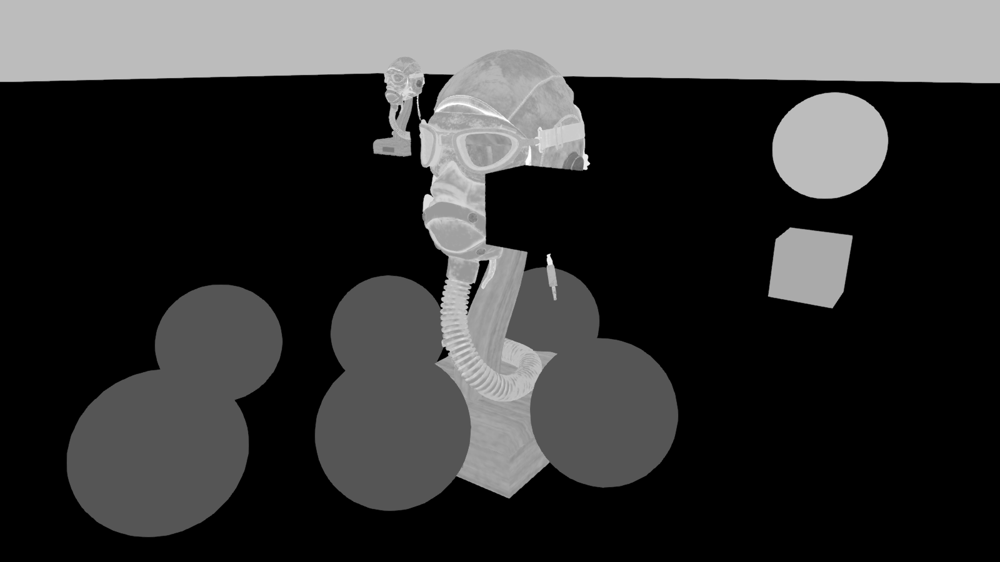
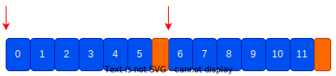

+++
title = "Bevy 0.12"
date = 2023-11-04
[extra]
author = "Bevy Contributors"
image = "cover.gif"
show_image = true
image_subtitle = "A relaxing 'tiny planet' city builder by Jos Feenstra (made with Bevy)"
image_subtitle_link = "https://twitter.com/i_am_feenster"

+++

Thanks to **185** contributors, **567** pull requests, community reviewers, and our [**generous sponsors**](/community/donate), we're happy to announce the **Bevy 0.12** release on [crates.io](https://crates.io/crates/bevy)!

For those who don't know, Bevy is a refreshingly simple data-driven game engine built in Rust. You can check out our [Quick Start Guide](/learn/book/getting-started/) to try it today. It's free and open source forever! You can grab the full [source code](https://github.com/bevyengine/bevy) on GitHub. Check out [Bevy Assets](https://bevyengine.org/assets) for a collection of community-developed plugins, games, and learning resources.

To update an existing Bevy App or Plugin to **Bevy 0.12**, check out our [0.11 to 0.12 Migration Guide](/learn/migration-guides/0.11-0.12/).

Since our last release a few months ago we've added a _ton_ of new features, bug fixes, and quality of life tweaks, but here are some of the highlights:

* **Deferred Rendering**: (Optional) support for rendering in a Deferred style, which complements Bevy's existing Forward+ renderer by adding support for new effects and different performance tradeoffs. Bevy is now a "hybrid" renderer, meaning you can use both at the same time!
* **Bevy Asset V2**: A brand new asset system that adds support for asset preprocessing, asset configuration (via .meta files), multiple asset sources, recursive dependency load tracking, and more!
* **PCF Shadow Filtering**: Bevy now has smoother shadows thanks to Percentage-Closer Filtering.
* **StandardMaterial Light Transmission**: Bevy's PBR material now supports light transmission, making it possible to simulate materials like glass, water, plastic, foliage, paper, wax, marble, etc.  
* **Material Extensions**: Materials can now build on other materials. You can now easily write shaders that build on existing materials, such as Bevy's PBR StandardMaterial.
* **Rusty Shader Imports**: Bevy's granular shader import system now uses Rust-style imports, expanding the capabilities and usability of the import system.
* **Suspend and Resume on Android**: Bevy now supports suspend and resume events on Android, which was the last big missing piece in our Android story. Bevy now supports Android!
* **Automatic Batching and Instancing of Draw Commands**: Draw commands are now automatically batched / instanced when possible, yielding significant render performance wins.
* **Renderer Optimizations**: Bevy's renderer dataflow has been reworked to squeeze out more performance and prepare the way for future GPU-driven rendering.
* **One Shot Systems**: ECS Systems can now be run on-demand from other systems!

<!-* more -->

## Deferred Rendering

<div class="release-feature-authors">authors: @DGriffin91</div>

The two most popular "rendering styles" are:

* **Forward Rendering**: do all material/lighting calculations in a single render pass
  * **Pros**: Simpler to work with. Works on / performs better on more hardware. Supports MSAA. Handles transparency nicely.
  * **Cons**: Lighting is more expensive / fewer lights supported in a scene, some rendering effects are impossible (or harder) without a prepass
* **Deferred Rendering**: do one or more pre-passes that collect relevant information about a scene, then do material/lighting calculations in _screen space_ in a final pass after that.
  * **Pros**: Enables some rendering effects that are not possible in forward rendering. This is especially important for GI techniques, cuts down on shading cost by only shading visible fragments, can support more lights in a scene
  * **Cons**: More complicated to work with. Requires doing prepasses, which can be more expensive than an equivalent forward renderer in some situations (although the reverse can also be true), uses more texture bandwidth (which can be prohibitive on some devices), doesn't support MSAA, transparency is harder / less straightforward.

Bevy's renderer has historically been a "forward renderer". More specifically, it is a [Clustered Forward / Forward+](/news/bevy-0-7/#unlimited-point-lights) renderer, which means we break the view frustum up into clusters and assign lights to those clusters, allowing us to render many more lights than a traditional forward renderer.

However, as Bevy has grown, it has slowly moved into "hybrid renderer" territory. In previous releases, we added a [Depth and Normal Prepass](/news/bevy-0-10/#depth-and-normal-prepass) to enable [TAA](/news/bevy-0-11/#temporal-anti-aliasing), [SSAO](/news/bevy-0-11/#screen-space-ambient-occlusion), and [Alpha Texture Shadow Maps](/news/bevy-0-10/#shadow-mapping-using-prepass-shaders). We also added a Motion Vector Prepass to enable TAA.

In **Bevy 0.12** we added optional support for Deferred Rendering (building on the existing prepass work). Each material can choose whether it will go through the forward or deferred path, and this can be configured per-material-instance. Bevy also has a new [`DefaultOpaqueRendererMethod`] resource, which configures the global default. This is set to "forward" by default. The global default can be overridden per-material.

Lets break down the components of this deferred render:


When deferred is enabled for the PBR [`StandardMaterial`], the deferred prepass packs PBR information into the Gbuffer, which can be broken up into:

**Base Color**


**Depth**


**Normals**


**Perceptual Roughness**


**Metallic**


The deferred prepass also produces a "deferred lighting pass ID" texture, which determines what lighting shader to run for the fragment:


These are passed into the final deferred lighting shader.

Note that the cube in front of the flight helmet model and the ground plane are using forward rendering, which is why they are black in both of the deferred lighting textures above. This illustrates that you can use both forward and deferred materials in the same scene!

Note that for most use cases, we recommend using forward by default, unless a feature explicitly needs deferred or your rendering conditions benefit from deferred style. Forward has the fewest surprises and will work better on more devices.

[`StandardMaterial`]: https://dev-docs.bevyengine.org/bevy/pbr/struct.StandardMaterial.html
[`DefaultOpaqueRendererMethod`]: https://dev-docs.bevyengine.org/bevy/pbr/struct.DefaultOpaqueRendererMethod.html

## PCF Shadow Filtering

<div class="release-feature-authors">authors: @superdump (Rob Swain), @JMS55</div>

Shadow aliasing is a very common problem in 3D apps:


Those "jagged lines" in the shadow are the result of the shadow map being "too small" to accurately represent the shadow from this perspective. The shadow map above is stored in a 512x512 texture, which is a lower resolution than most people will use for most of their shadows. This was selected to show a "bad" case of jaggies. Note that Bevy defaults to 2048x2048 shadowmaps.

One "solution" is to bump up the resolution. Here is what it looks like with a 4096x4096 shadow map.


Looking better! However this still isn't a perfect solution. Large shadowmaps aren't feasible on all hardware. They are significantly more expensive. And even if you can afford super high resolution shadows, you can still encounter this issue if you place an object in the wrong place, or point your light in the wrong direction. You can use Bevy's [Cascaded Shadow Maps](/news/bevy-0-10/#cascaded-shadow-maps) (which are enabled by default) to cover a larger area, with higher detail close to the camera and less detail farther away. However even under these conditions, you will still probably encounter these aliasing issues.

**Bevy 0.12** introduces **PCF Shadow Filtering** (Percentage-Closer Filtering), which is a popular technique that takes multiple samples from the shadow map and compares with an interpolated mesh surface depth-projected into the frame of reference of the light. It then calculates the percentage of samples in the depth buffer that are closer to the light than the mesh surface. In short, this creates a "blur" effect that improves shadow quality, which is especially evident when a given shadow doesn't have enough "shadow map detail".

**Bevy 0.12**'s default PCF approach is the [`ShadowMapFilter::Castano13`] method by Ignacio Castaño (used in The Witness). Here it is with a 512x512 shadow map:

<b style="display:block; margin-bottom: -18px">Drag this image to compare (Castano)</b>

<div class="image-compare" style="aspect-ratio: 16 / 9" data-title-a="PCF On" data-title-b="PCF Off">
  
  
</div>

Much better!

We also implemented the [`ShadowMapFilter::Jimenez14`] method by Jorge Jimenez (used in Call of Duty Advanced Warfare). This can be slightly cheaper than Castano, but it can flicker. It benefits from [Temporal Anti-Aliasing (TAA)](/news/bevy-0-11/#temporal-anti-aliasing) which can reduce the flickering. It can also blend shadow cascades a bit more smoothly than Castano.

<b style="display:block; margin-bottom: -18px">Drag this image to compare (Jimenez)</b>

<div class="image-compare" style="aspect-ratio: 16 / 9" data-title-a="PCF On" data-title-b="PCF Off">
  
  
</div>

[`ShadowMapFilter::Castano13`]: https://dev-docs.bevyengine.org/bevy/pbr/enum.ShadowFilteringMethod.html#variant.Castano13
[`ShadowMapFilter::Jimenez14`]: https://dev-docs.bevyengine.org/bevy/pbr/enum.ShadowFilteringMethod.html#variant.Jimenez14

## `StandardMaterial` Light Transmission

<div class="release-feature-authors">author: Marco Buono (@coreh)</div>

The [`StandardMaterial`] now supports a number of light transmission-related properties:

* `specular_transmission`
* `diffuse_transmission`
* `thickness`
* `ior`
* `attenuation_color`
* `attenuation_distance`

These allow you to more realistically represent a wide variety of physical materials, including **clear and frosted glass, water, plastic, foliage, paper, wax, marble, porcelain and more**.

Diffuse transmission is an inexpensive addition to the PBR lighting model, while specular transmission is a somewhat more resource-intensive screen-space effect, that can accurately model refraction and blur effects.


<div style="font-size: 1.0rem" class="release-feature-authors">
    Different light transmission properties and their interactions with existing PBR properties.
</div>

To complement the new transmission properties, a new [`TransmittedShadowReceiver`] component has been introduced, which can be added to entities with diffuse transmissive materials to receive shadows cast from the opposite side of the mesh. This is most useful for rendering thin, two-sided translucent objects like tree leaves or paper.

Additionally, two extra fields have been added to the [`Camera3d`] component: `screen_space_specular_transmission_quality` and `screen_space_specular_transmission_steps`. These are used to control the quality of the screen-space specular transmission effect (number of taps), and how many “layers of transparency” are supported when multiple transmissive objects are in front of each other.

> **Important:** Each additional “layer of transparency” incurs in a texture copy behind the scenes, adding to the bandwidth cost, so it's recommended to keep this value as low as possible.

Finally, importer support for the following glTF extensions has been added:

* `KHR_materials_transmission`
* `KHR_materials_ior`
* `KHR_materials_volume`

### Compatibility

Both specular and diffuse transmission are compatible with all supported platforms, including mobile and Web.

The optional `pbr_transmission_textures` Cargo feature allows using textures to modulate the `specular_transmission`, `diffuse_transmission` and `thickness` properties. It's disabled by default in order to reduce the number of texture bindings used by the standard material. (These are
severely constrained on lower-end platforms and older GPUs!)

`DepthPrepass` and TAA can greatly improve the quality of the screen-space specular transmission effect, and are recommended to be used with it, on the platforms where they are supported.

### Implementation Details

Specular transmission is implemented via a new `Transmissive3d` screen space refraction phase, which joins the existing `Opaque3d`, `AlphaMask3d` and `Transparent3d` phases. During this phase, one or more snapshots of the main texture are taken, which are used as “backgrounds” for the refraction effects.

Each fragment's surface normal and IOR used along with the view direction to calculate a refracted ray. (Via Snell's law.)
This ray is then propagated through the mesh's volume (by a distance controlled by the `thickness` property), producing an exit point.
The “background” texture is then sampled at that point. Perceptual roughness is used along with interleaved gradient noise and multiple spiral taps, to produce a blur effect.

Diffuse transmission is implemented via a second, reversed and displaced fully-diffuse Lambertian lobe, which is added to the existing PBR lighting calculations. This is a simple and relatively cheap approximation, but works reasonably well.

[`TransmittedShadowReceiver`]: https://dev-docs.bevyengine.org/bevy/pbr/struct.TransmittedShadowReceiver.html
[`Camera3d`]: https://dev-docs.bevyengine.org/bevy/core_pipeline/core_3d/struct.Camera3d.html
[`DepthPrepass`]: https://dev-docs.bevyengine.org/bevy/core_pipeline/prepass/struct.DepthPrepass.html

## Bevy Asset V2

<div class="release-feature-authors">authors: @cart</div>

Asset pipelines are a central part of the gamedev process. Bevy's old asset system was suitable for some classes of app, but it had a number of limitations that prevented it from serving the needs of other classes, especially higher end 3D apps.

Bevy Asset V2 is a completely new asset system that learns from the best parts of Bevy Asset V1 while adding support for a number of important scenarios: **Asset Importing/Preprocessing**, **Asset Meta Files**, **Multiple Asset Sources**, **Recursive Asset Dependency Load Events**, **Async Asset I/O**, **Faster and More Featureful Asset Handles**, and more!

Most existing user-facing asset code will either require no changes at all, or minimal changes. Custom [`AssetLoader`] or [`AssetReader`] code will need to change slightly, but generally the changes should be very minimal. Bevy Asset V2 (despite being a completely new implementation) largely just expands what Bevy is capable of.

[`AssetLoader`]: https://dev-docs.bevyengine.org/bevy/asset/trait.AssetLoader.html
[`AssetReader`]: https://dev-docs.bevyengine.org/bevy/asset/io/trait.AssetReader.html

### Asset Preprocessing


Asset preprocessing is the ability to take an input asset of a given type, process it in some way (generally during development time), and then use the result as the final asset in your application. Think of it as an "asset compiler".

This enables a number of scenarios:

* **Reduce Work In Released Apps**: Many assets aren't _composed_ in their ideal form for release. Scenes might be defined in a human-readable text format that is slower to load. Images might be defined in formats that require more work to decode and upload to the GPU, or take up more space on the GPU when compared to GPU-friendly formats (ex: PNG images vs Basis Universal). Preprocessing enables developers to convert to release-optimal formats ahead of time, making apps start up faster, take up fewer resources, and perform better. It also enables moving computation work that _would_ have been done at runtime to development time. For example, generating mipmaps for images.
* **Compression**: Minimize the disk space and/or bandwidth that an asset takes up in deployed apps
* **Transformation**: Some "asset source files" aren't in the right format by default. You can have an asset of type `A` and transform it into type `B`.

If you are building an app that tests the limits of your hardware with optimal formats ... or you just want to cut down on startup / loading times, asset preprocessing is for you.

For an in-depth technical breakdown of the implementation we chose, check out the [Bevy Asset V2 pull request](https://github.com/bevyengine/bevy/pull/8624).

### Enabling Pre-Processing

To enable asset pre-processing, just configure your [`AssetPlugin`] like this:

```rust
app.add_plugins(DefaultPlugins.set(
    AssetPlugin {
        mode: AssetMode::Processed,
        ..default()
    }
))
```

This will configure the asset system to look for assets in the `imported_assets` folder instead of the `assets` "source folder". During development, enable the `asset_processor` cargo feature flag like this:

```sh
cargo run --features bevy/asset_processor
```

This will start the [`AssetProcessor`] in parallel with your app. It will run until all assets are read from their source (defaults to the `assets` folder), processed, and the results have been written to their destination (defaults to the `imported_assets` folder). This pairs with asset hot-reloading. If you make a change, this will be detected by the [`AssetProcessor`], the asset will be reprocessed, and the result will be hot-reloaded in your app.

[`AssetPlugin`]: https://dev-docs.bevyengine.org/bevy/asset/struct.AssetPlugin.html
[`AssetProcessor`]: https://dev-docs.bevyengine.org/bevy/asset/processor/struct.AssetProcessor.html

### Should You Enable Pre-Processing Today?

In future Bevy releases we will recommended enabling processing for the majority of apps. We don't _yet_ recommend it for most use cases for a few reasons:

1. Most of our built-in assets don't have processors implemented for them yet. The [`CompressedImageSaver`] is the only built-in processor and it has a bare-minimum set of features.
2. We have not implemented "asset migrations" yet. Whenever an asset changes its settings format (which is used in meta files), we need to be able to automatically migrate existing asset meta files to the new version.
3. As people adopt processing, we expect some flux as we respond to feedback.

### Incremental and Dependency Aware

**Bevy Asset V2** will only process assets that have changed. To accomplish this, it computes and stores hashes of each asset source file:

```rust
hash: (132, 61, 201, 41, 85, 80, 72, 189, 132, 81, 252, 156, 4, 227, 196, 207),
```

It also tracks the asset dependencies used when processing an asset. If a dependency has changed, the dependant asset will also be re-processed!

### Transactional and Reliable

**Bevy Asset V2** uses write-ahead logging (a technique commonly used by databases) to recover from crashes / forced exists. Whenever possible it avoids full-reprocessing and only reprocesses incomplete transactions.

The [`AssetProcessor`] can close (either intentionally or unintentionally) at any point in time and it will pick up right where it left off!

If a Bevy App asks to load an asset that is currently being processed (or re-processed), the load will asynchronously wait until both the processed asset and its meta file have been written. This ensures that a loaded asset file and meta file always "match" for a given load.

### Asset Meta Files

Assets now support (optional) `.meta` files. This enables configuring things like:

* **The asset "action"**
  * This configures how Bevy's asset system should handle the asset:
    * `Load`: Load the asset without processing
    * `Process`: Pre-process the asset prior to loading
    * `Ignore`: Do not process or load the asset
* **[`AssetLoader`] settings**
  * You can use meta files to set any [`AssetLoader`] you want
  * Configure loader settings like "how to filter an image", "adjusting the up axis in 3D scenes", etc
* **[`Process`] settings** (if using the `Process` action)
  * You can use meta files to set any [`Process`] implementation you want
  * Configure processor settings like "what type of compression to use", "whether or not to generate mipmaps", etc

A meta file for an unprocessed image looks like this:

```rust
(
    meta_format_version: "1.0",
    asset: Load(
        loader: "bevy_render::texture::image_loader::ImageLoader",
        settings: (
            format: FromExtension,
            is_srgb: true,
            sampler: Default,
        ),
    ),
)
```

A meta file for an image configured to be processed looks like this:

```rust
(
    meta_format_version: "1.0",
    asset: Process(
        processor: "bevy_asset::processor::process::LoadAndSave<bevy_render::texture::image_loader::ImageLoader, bevy_render::texture::compressed_image_saver::CompressedImageSaver>",
        settings: (
            loader_settings: (
                format: FromExtension,
                is_srgb: true,
                sampler: Default,
            ),
            saver_settings: (),
        ),
    ),
)
```

If the asset processor is enabled, meta files will be automatically generated for assets.

The final "output" metadata for the processed image looks like this:

```rust
(
    meta_format_version: "1.0",
    processed_info: Some((
        hash: (132, 61, 201, 41, 85, 80, 72, 189, 132, 81, 252, 156, 4, 227, 196, 207),
        full_hash: (81, 90, 244, 190, 16, 134, 202, 154, 3, 211, 78, 199, 216, 21, 132, 216),
        process_dependencies: [],
    )),
    asset: Load(
        loader: "bevy_render::texture::image_loader::ImageLoader",
        settings: (
            format: Format(Basis),
            is_srgb: true,
            sampler: Default,
        ),
    ),
)
```

This is what is written to the `imported_assets` folder.

Note that the `Process` asset mode has changed to `Load`. This is because in the released app, we will load the final processed image "normally" like any other image asset. Note that in this case, the input and the output asset _both_ use [`ImageLoader`]. However the processed asset _can_ use a different loader if the context demands it. Also note the addition of the `processed_info` metadata, which is used to determine if an asset needs to be reprocessed.

The final processed asset and metadata files can be viewed and interacted with like any other file. However they are intended to be read-only. Configuration should happen on the _source asset_, not the _final processed asset_.

[`Process`]: https://dev-docs.bevyengine.org/bevy/asset/processor/trait.Process.html
[`ImageLoader`]: https://dev-docs.bevyengine.org/bevy/render/texture/struct.ImageLoader.html

### `CompressedImageSaver`


<div style="font-size: 1.0rem" class="release-feature-authors">Sponza scene with textures processed into Basis Universal (with mipmaps) using Bevy Asset V2</div>

**Bevy 0.12** ships with a barebones [`CompressedImageSaver`] that writes images to [Basis Universal](https://github.com/BinomialLLC/basis_universal) (a GPU-friendly image interchange format) and generates [mipmaps](https://en.wikipedia.org/wiki/Mipmap). Mipmaps reduce aliasing artifacts when sampling images from different distances. This fills an important gap, as Bevy previously had no way to generate mipmaps on its own (it relied on external tooling). This can be enabled with the `basis-universal` cargo feature.

[`CompressedImageSaver`]: https://dev-docs.bevyengine.org/bevy/render/texture/struct.CompressedImageSaver.html

### Preprocessing is Optional!

Despite eventually ([in future Bevy releases](#should-you-enable-pre-processing-today)) recommending that most people enable asset processing, we also acknowledge that Bevy is used in a variety of applications. Asset processing introduces additional complexity and workflow changes that some people will not want!

This is why Bevy offers two asset modes:

* [`AssetMode::Unprocessed`]: Assets will be loaded directly from the asset source folder (defaults to `assets`) without any preprocessing. They are assumed to be in their "final format". This is the mode/workflow Bevy users are currently used to.
* [`AssetMode::Processed`]: Assets will be pre-processed at development time. They will be read from their source folder (defaults to `assets`) and then written to their destination folder (defaults to `imported_assets`).

To enable this, Bevy uses a novel approach to assets: the difference between a processed and unprocessed asset is perspective. They both use the same `.meta` format and they use the same [`AssetLoader`] interface.

A [`Process`] implementation can be defined using arbitrary logic, but we heavily encourage using the [`LoadAndSave`] [`Process`] implementation. [`LoadAndSave`] takes any [`AssetLoader`] and passes the results to an [`AssetSaver`].

That means if you already have an [`ImageLoader`], which loads images, all you need to do is write some `ImageSaver` which will write the image in some optimized format. This both saves development work and makes it easy to support both processed and unprocessed scenarios.

[`AssetMode::Unprocessed`]: https://dev-docs.bevyengine.org/bevy/asset/enum.AssetMode.html
[`AssetMode::Processed`]: https://dev-docs.bevyengine.org/bevy/asset/enum.AssetMode.html
[`LoadAndSave`]: https://dev-docs.bevyengine.org/bevy/asset/processor/struct.LoadAndSave.html
[`AssetSaver`]: https://dev-docs.bevyengine.org/bevy/asset/saver/trait.AssetSaver.html

### Built To Run Anywhere

Unlike many other asset processors in the gamedev space, Bevy Asset V2's [`AssetProcessor`] is intentionally architected to run on any platform. It doesn't use platform-limited databases or require the ability/permission to run a networked server. It can be deployed alongside a released app if your application logic requires processing at runtime.

One notable exception: we still need to make a few changes before it can run on the web, but it was built with web support in mind.

### Recursive Asset Dependency Load Events

The [`AssetEvent`] enum now has an [`AssetEvent::LoadedWithDependencies`] variant. This is emitted when an [`Asset`], its dependencies, and all descendant / recursive dependencies have loaded.

This makes it easy to wait until an [`Asset`] is "fully loaded" before doing something.

[`AssetEvent`]: https://dev-docs.bevyengine.org/bevy/asset/enum.AssetEvent.html
[`AssetEvent::LoadedWithDependencies`]: https://dev-docs.bevyengine.org/bevy/asset/enum.AssetEvent.html

### Multiple Asset Sources

It is now possible to register more than one [`AssetSource`] (which replaces the old monolithic "asset provider" system).

Loading from the "default" [`AssetSource`] looks exactly like it does in previous Bevy versions:

```rust
sprite.texture = assets.load("path/to/sprite.png");
```

But in **Bevy 0.12** you can now register named [`AssetSource`] entries. For example you could register a `remote` [`AssetSource`] that loads assets from an HTTP server:

```rust
sprite.texture = assets.load("remote://path/to/sprite.png");
```

Features like hot-reloading, meta files, and asset processing are supported across all sources.

You can register a new [`AssetSource`] like this:

```rust
// reads assets from the "other" folder, rather than the default "assets" folder
app.register_asset_source(
    // This is the "name" of the new source, used in asset paths.
    // Ex: "other://path/to/sprite.png"
    "other",
    // This is a repeatable source builder. You can configure readers, writers,
    // processed readers, processed writers, asset watchers, etc.
    AssetSource::build()
        .with_reader(|| Box::new(FileAssetReader::new("other")))
    )
)
```

[`AssetSource`]: https://dev-docs.bevyengine.org/bevy/asset/io/struct.AssetSource.html

### Embedded Assets

One of the features motivating **Multiple Asset Sources** was improving our "embedded-in-binary" asset loading. The old `load_internal_asset!` approach had a number of issues (see the relevant section in [this PR](https://github.com/bevyengine/bevy/pull/9885)).

The old system looked like this:

```rust
pub const MESH_SHADER_HANDLE: Handle<Shader> = Handle::weak_from_u128(3252377289100772450);

load_internal_asset!(app, MESH_SHADER_HANDLE, "mesh.wgsl", Shader::from_wgsl);
```

This required a lot of boilerplate and didn't integrate cleanly with the rest of the asset system. The [`AssetServer`] was not aware of these assets, hot-reloading required a special-cased second [`AssetServer`], and you couldn't load assets using an [`AssetLoader`] (they had to be constructed in memory). Not ideal!

To prove out the **Multiple Asset Sources** implementation, we built a new `embedded` [`AssetSource`], which replaces the old `load_interal_asset!` system with something that naturally fits into the asset system:

```rust
// Called in `crates/bevy_pbr/src/render/mesh.rs`
embedded_asset!(app, "mesh.wgsl");

// later in the app
let shader: Handle<Shader> = asset_server.load("embedded://bevy_pbr/render/mesh.wgsl");
```

That is a lot less boilerplate than the old approach!

And because the `embedded` source is just like any other asset source, it can support hot-reloading cleanly ... unlike the old system. To hot-reload assets embedded in the binary (ex: to get live updates on a shader you have embedded in the binary), just enable the new `embedded_watcher` cargo feature.

Much better!

### Extendable

Almost everything in **Bevy Asset V2** can be extended with trait impls:

* **[`Asset`]**: Define new asset types
* **[`AssetReader`]**: Define custom [`AssetSource`] read logic
* **[`AssetWriter`]**: Define custom [`AssetSource`] write logic
* **[`AssetWatcher`]**: Define custom [`AssetSource`] watching / hot-reloading logic
* **[`AssetLoader`]**: Define custom load logic for a given [`Asset`] type
* **[`AssetSaver`]**: Define custom save logic for a given [`Asset`] type
* **[`Process`]**: Define fully bespoke processor logic (or use the more opinionated [`LoadAndSave`] [`Process`] impl)

[`Asset`]: https://dev-docs.bevyengine.org/bevy/asset/trait.Asset.html
[`AssetWatcher`]: https://dev-docs.bevyengine.org/bevy/asset/io/trait.AssetWatcher.html

### Async Asset I/O

The new [`AssetReader`] and [`AssetWriter`] APIs are async! This means naturally async backends (like networked APIs) can directly call `await` on futures.

The filesystem impls (such as [`FileAssetReader`]) offload file IO to a separate thread and the future resolves when the file operation has finished.

[`AssetWriter`]: https://dev-docs.bevyengine.org/bevy/asset/io/trait.AssetWriter.html
[`FileAssetReader`]: https://dev-docs.bevyengine.org/bevy/asset/io/file/struct.FileAssetReader.html

### Improved Hot-Reloading Workflow

Previous versions of Bevy required manually enabling asset hot-reloading in your app code (in addition to enabling the `filesystem_watcher` cargo feature):

```rust
// Enabling hot reloading in old versions of Bevy
app.add_plugins(DefaultPlugins.set(AssetPlugin::default().watch_for_changes()))
```

This was suboptimal because released versions of apps generally don't want filesystem watching enabled.

In **Bevy 0.12** we've improved this workflow by making the new `file_watcher` cargo feature enable file watching in your app by default. During development, just run your app with the feature enabled:

```sh
cargo run --features bevy/file_watcher
```

When releasing, just omit that feature. No code changes required!

```sh
cargo build --release
```

### Better Asset Handles

Asset handles now use a single [`Arc`] at their core to manage the lifetime of an asset. This simplifies the internals significantly and also enables us to make more asset information available directly from handles.

Notably, in **Bevy 0.12** we use this to provide direct [`AssetPath`] access from the [`Handle`]:

```rust
// Previous version of Bevy
let path = asset_server.get_handle_path(&handle);

// Bevy 0.12
let path = handle.path();
```

Handles now also use a smaller / cheaper-to-look-up [`AssetIndex`] internally, which uses generational indices to look up assets in dense storage.

[`Arc`]: https://doc.rust-lang.org/std/sync/struct.Arc.html
[`AssetPath`]: https://dev-docs.bevyengine.org/bevy/asset/struct.AssetPath.html
[`Handle`]: https://dev-docs.bevyengine.org/bevy/asset/enum.Handle.html
[`AssetIndex`]: https://dev-docs.bevyengine.org/bevy/asset/struct.AssetIndex.html

### True Copy-on-Write Asset Paths

The [`AssetServer`] and [`AssetProcessor`] do a lot of [`AssetPath`] cloning (across many threads). In previous versions of Bevy, [`AssetPath`] was backed by Rust's [`Cow`] type. However in Rust, cloning an "owned" [`Cow`] results in a clone of the internal value. This is _not_ the "clone on write" behavior we want for [`AssetPath`]. We use [`AssetPath`] across threads, so we _need_ to start with an "owned" value.

To prevent all of this cloning and re-allocating of strings, we've built our own [`CowArc`] type, which [`AssetPath`] uses internally. It has two tricks up its sleeve:

1. The "owned" variant is an `Arc<str>`, which we can cheaply clone without reallocating the string.
2. Almost _all_ [`AssetPath`] values defined in code come from a `&'static str`. We've created a special [`CowArc::Static`] variant that retains this static-ness, meaning we do _zero_ allocations even when turning a borrow into an "owned [`AssetPath`]".

[`Cow`]: https://doc.rust-lang.org/std/borrow/enum.Cow.html
[`AssetServer`]: https://dev-docs.bevyengine.org/bevy/asset/struct.AssetServer.html
[`CowArc`]: https://dev-docs.bevyengine.org/bevy/utils/enum.CowArc.html
[`CowArc::Static`]: https://dev-docs.bevyengine.org/bevy/utils/enum.CowArc.html#variant.Static

## Suspend and Resume on Android

<div class="release-feature-authors">authors: @mockersf</div>

On Android, applications no longer crash on suspend. Instead, they are paused, and no systems
will run until the application is resumed.

This resolves the last "big" showstopper for Android apps! Bevy now supports Android!

<video controls><source src="suspend-resume.mp4" type="video/mp4"/></video>

Background tasks working in other threads, like playing audio, won't be stopped. When the
application will be suspended, a [`Lifetime`] event `ApplicationLifetime::Suspended` is sent,
corresponding to the [`onStop()`] callback. You should take care to pause tasks that shouldn't
run in the background, and resume them when receiving the `ApplicationLifetime::Resumed` event
(corresponding to the [`onRestart()`] callback).

```rust
fn handle_lifetime_events(
    mut lifetime_events: EventReader<ApplicationLifetime>,
    music_controller: Query<&AudioSink>,
) {
    for event in lifetime_events.read() {
        match event {
            // Upon receiving the `Suspended` event, the application has 1 frame before it is paused
            // As audio happens in an independent thread, it needs to be stopped
            ApplicationLifetime::Suspended => music_controller.single().pause(),
            // On `Resumed``, audio can continue playing
            ApplicationLifetime::Resumed => music_controller.single().play(),
            // `Started` is the only other event for now, more to come in the next Bevy version
            _ => (),
        }
    }
}
```

[`Lifetime`]: https://docs.rs/bevy/0.12.0/bevy/window/enum.Lifetime.html
[`onStop()`]: https://developer.android.com/reference/android/app/Activity#onStop()
[`onRestart()`]: https://developer.android.com/reference/android/app/Activity#onRestart()

## Material Extensions

<div class="release-feature-authors">authors: @robtfm</div>

Bevy has a powerful shader import system, allowing modular (and granular) shader code reuse. In previous versions of Bevy, this meant that in theory, you could import Bevy's PBR shader logic and use it in your own shaders. However in practice this was challenging, as you had to re-wire everything up yourself, which required intimate knowledge of the base material. For complicated materials like Bevy's PBR [`StandardMaterial`], this was full of boilerplate, resulted in code duplication, and was prone to errors.

In **Bevy 0.12**, we've built a **Material Extensions** system, which enables defining new materials that build on existing materials:


This is accomplished via a new [`ExtendedMaterial`] type:

```rust
app.add_plugin(
    MaterialPlugin::<ExtendedMaterial<StandardMaterial, QuantizedMaterial>>::default()
);

#[derive(Asset, AsBindGroup, TypePath, Debug, Clone)]
struct QuantizedMaterial {
    // Start at a high binding number to ensure bindings don't conflict
    // with the base material
    #[uniform(100)]
    quantize_steps: u32,
}

impl MaterialExtension for QuantizedMaterial {
    fn fragment_shader() -> ShaderRef {
        "quantized_material.wgsl".into()
    }
}

let material = ExtendedMaterial<StandardMaterial, QuantizedMaterial> {
    base: StandardMaterial::from(Color::rgb(0.1, 0.1, 0.8)),
    extension: QuantizedMaterial { quantize_steps: 2 },
};
```

We also paired this with some [`StandardMaterial`] shader refactors to make it much easier to pick and choose which parts you want:

```rust
// quantized_material.wgsl

struct QuantizedMaterial {
    quantize_steps: u32,
}

@group(1) @binding(100)
var<uniform> my_extended_material: QuantizedMaterial;

@fragment
fn fragment(
    input: VertexOutput,
    @builtin(front_facing) is_front: bool,
) -> FragmentOutput {
    // Generate a PbrInput struct from the StandardMaterial bindings
    var pbr_input = pbr_input_from_standard_material(input, is_front);

    // Alpha discard
    pbr_input.material.base_color = alpha_discard(
        pbr_input.material,
        pbr_input.material.base_color
    );

    var out: FragmentOutput;

    // Apply lighting
    out.color = apply_pbr_lighting(pbr_input);

    // Our "quantize" effect
    out.color = vec4<f32>(vec4<u32>(out.color * f32(my_extended_material.quantize_steps))) / f32(my_extended_material.quantize_steps);

    // Apply in-shader post processing.
    // Ex: fog, alpha-premultiply, etc. For non-hdr cameras: tonemapping and debanding
    out.color = main_pass_post_lighting_processing(pbr_input, out.color);

    return out;
}
```

This _vastly_ simplifies writing custom PBR materials, making it accessible to pretty much everyone!

[`ExtendedMaterial`]: https://dev-docs.bevyengine.org/bevy/pbr/struct.ExtendedMaterial.html

## Automatic Batching/Instancing of Draw Commands

<div class="release-feature-authors">authors: @superdump (Rob Swain)</div>

**Bevy 0.12** now automatically batches/instances draw commands where possible. This cuts down the number of draw calls, which yields significant performance wins!

This required a number of architectural changes, including how we store and access per-entity mesh data (more on this later).

Here are some benches of the old unbatched approach (0.11) to the new batched approach (0.12):

### 2D Mesh Bevymark (frames per second, more is better)

This renders 160,000 entities with textured quad meshes (160 groups of 1,000 entities each, each group sharing a material). This means we can batch each group, resulting in only 160 instanced draw calls when batching is enabled.


<div style="font-size: 1.0rem" class="release-feature-authors">Tested on an M1 Max, limiting the BatchedUniformBuffer batch size to 1 versus how it works in 0.12.</div>

### 3D Mesh "Many Cubes" (frames per second, more is better)

This renders 160,000 cubes, of which ~11,700 are visible in the view. These are drawn using a single instanced draw of all visible cubes which enables up to **100% increase in frame rate (2x)**!


<div style="font-size: 1.0rem" class="release-feature-authors">Tested on an M1 Max, limiting the BatchedUniformBuffer batch size to 1 versus how it works in 0.12.</div>

These performance benefits can be leveraged on all platforms, including WebGL2!

### What can be batched?

Batching/Instancing can only happen for GPU data that doesn't require "rebinding" (binding is making data available to shaders / pipelines, which incurs a runtime cost). This means if something like a pipeline (shaders), bind group (shader-accessible bound data), vertex / index buffer (mesh) is different, it cannot be batched.

From a high level, currently entities with the same material and mesh can be batched.

We are investigating ways to make more data accessible without rebinds, such as bindless textures, combining meshes into larger buffers, etc.

### Opting Out

If you would like to opt out an entity from automatic batching, you can add the new [`NoAutomaticBatching`] component to it.

This is generally for cases where you are doing custom, non-standard renderer features that don't play nicely with batching's assumptions. For example, it assumes view bindings are constant across draws and that Bevy's-built-in entity batching logic is used.

[`NoAutomaticBatching`]: https://dev-docs.bevyengine.org/bevy/render/batching/struct.NoAutomaticBatching.html

## The Road to GPU-driven Rendering

<div class="release-feature-authors">authors: @superdump (Rob Swain), @james-j-obrien, @JMS55, @inodentry, @robtfm, @nicopap, @teoxoy, @IceSentry, @Elabajaba</div>

Bevy's renderer performance for 2D and 3D meshes can improve a lot. There are bottlenecks on both the CPU and GPU side, which can be lessened to give significantly higher frame rates. As always with Bevy, we want to make the most of the platforms you use, from the constraints of WebGL2 and mobile devices, to the highest-end native discrete graphics cards. A solid foundation can support all of this.

In **Bevy 0.12** we have started reworking rendering data structures, data flow, and draw patterns to unlock new optimizations. This enabled the **Automatic Batching/Instancing** we landed in **Bevy 0.12** and also helps pave the way for other significant wins in the future, such as GPU-driven rendering. We aren't quite ready for GPU-driven rendering, but we've started down that path in **Bevy 0.12**!

### What are CPU* and GPU-driven rendering?

CPU-driven rendering is where draw commands are created on the CPU. In Bevy this means "in Rust code", more specifically in render graph nodes. This is how Bevy currently kicks off draws.

In GPU-driven rendering, the draw commands are encoded on the GPU by [compute shaders](https://www.khronos.org/opengl/wiki/Compute_Shader). This leverages GPU parallelism, and unlocks more advanced culling optimizations that are infeasible to do on the CPU, among many other methods that bring large performance benefits.

### What needs to change?

Historically Bevy's general GPU data pattern has been to bind each piece of data per-entity and issue a draw call per-entity. In some cases we did store data in uniform buffers in "array style" and accessed with dynamic offsets, but this still resulted in rebinding at each offset.

All of this rebinding has performance implications, both on the CPU and the GPU. On the CPU, it means encoding draw commands has many more steps to process, taking more time than necessary. On the GPU (and in the graphics API), it means many more rebinds and separate draw commands.

Avoiding rebinding is both a big performance benefit for CPU-driven rendering and is necessary to enable GPU-driven rendering.

To avoid rebinds, the general data pattern we are aiming for is:

* For each data type (meshes, materials, transforms, textures), create a single array (or a small number of arrays) containing all of the items of that data type
* Bind these arrays a small number of times (ideally once), avoiding per-entity/per-draw rebinds

In **Bevy 0.12** we've started this process in earnest! We've made a number of architectural changes that are already yielding fruit. Thanks to these changes, we can now [automatically batch and instance draws](#automatic-batching-instancing-of-draw-commands) for entities with the exact same mesh and material. And as we progress further down this path, we can batch/instance across a wider variety of cases, cutting out more and more CPU work until eventually we are "fully GPU-driven".

### Reorder Render Sets

<div class="release-feature-authors">authors: @superdump (Rob Swain), @james-j-obrien, @inodentry</div>

The order of draws needs to be known for some methods of instanced draws so that the data can be laid out, and looked up in order. For example, when per-instance data is stored in an instance-rate vertex buffer.

The render set order before **Bevy 0.12** caused some problems with this as data had to be prepared (written to the GPU) before knowing the draw order. Not ideal when our plan is to have an ordered list of entity data on the GPU! The previous order of sets was:


This caused friction (and suboptimal instancing) in a number of current (and planned) renderer features. Most notably in previous versions of Bevy, it caused these problems for sprite batching.  

The new render set order in 0.12 is:


`PrepareAssets` was introduced because we only want to queue entities for drawing if their assets have been prepared. Per-frame data preparation still happens in the `Prepare` set, specifically in its `PrepareResources` subset. That is now after `Queue` and `Sort`, so the order of draws is known. This also made a lot more sense for batching, as it is now known at the point of batching whether an entity that is of another type in the render phase needs to be drawn. Bind groups now have a clear subset where they should be created ... `PrepareBindGroups`.

### BatchedUniformBuffer and GpuArrayBuffer

OK, so we need to put many pieces of data of the same type into buffers in a way that we can bind them as few times as possible and draw multiple instances from them. How can we do that?

In previous versions of Bevy, per-instance `MeshUniform` data is stored in a uniform buffer with each instance's data aligned to a dynamic offset. When drawing each mesh entity, we update the dynamic offset, which can be close in cost to rebinding. It looks like this:


<div style="font-size: 1.0rem" class="release-feature-authors">Red arrows are 'rebinds' to update the dynamic offset, blue boxes are instance data, orange boxes are padding for dynamic offset alignment, which is a requirement of GPUs and graphics APIs.</div>

Instance-rate vertex buffers are one way, but they are very constrained to having a specific order. They are/may be suitable for per-instance data like mesh entity transforms, but they can't be used for material data. The other main options are uniform buffers, storage buffers, and data textures.

WebGL2 does not support storage buffers, only uniform buffers. Uniform buffers have a minimum guaranteed size per binding of 16kB on WebGL2. Storage buffers, where available, have a minimum guaranteed size of 128MB.

Data textures are far more awkward for structured data. And on platforms that don't support linear data layouts, they will perform worse.

Given these constraints, we want to use storage buffers on platforms where they are supported, and we want to use uniform buffers on platforms where they are not supported (ex: WebGL 2).

#### BatchedUniformBuffer

<div class="release-feature-authors">authors: @superdump (Rob Swain), @JMS55, @teoxoy, @robtfm, @konsolas</div>

For uniform buffers, we have to assume that on WebGL2 we may only be able to access 16kB of data at a time. Taking an example, `MeshUniform` requires 144 bytes per instance, which means we can have a batch of 113 instances per 16kB binding. If we want to draw more than 113 entities in total, we need a way of managing a uniform buffer of data that can be bound at a dynamic offset per batch of instances. This is what `BatchedUniformBuffer` is designed to solve.

`BatchedUniformBuffer` looks like this:


<div style="font-size: 1.0rem" class="release-feature-authors">Red arrows are 'rebinds' to update the dynamic offset, blue boxes are instance data, orange boxes are padding for dynamic offset alignment.</div>

Notice how the instance data can be packed much more tightly, fitting the same amount of used data in less space. Also, we only need to update the dynamic offset of the binding for each batch.

#### GpuArrayBuffer

<div class="release-feature-authors">authors: @superdump (Rob Swain), @JMS55, @IceSentry, @mockersf</div>

Given that we need to support both uniform and storage buffers for a given data type, this increases the level of complexity required to implement new low-level renderer features (both in Rust code and in shaders). When confronted with this complexity, some developers might choose instead only use storage buffers (effectively dropping support for WebGL 2).

To make it as easy as possible to support both storage types, we developed [`GpuArrayBuffer`]. This is a generic collection of `T` values that abstracts over `BatchedUniformBuffer` and [`StorageBuffer`]. It will use the right storage for the current platform / GPU.

The data in a [`StorageBuffer`] looks like this:


<div style="font-size: 1.0rem" class="release-feature-authors">Red arrows are 'rebinds', blue boxes are instance data.</div>

All the instance data can be placed directly one after the other, and we only have to bind once. There is no need for any dynamic offset binding, so there is no need for any padding for alignment.

[Check out this annotated code example](https://gist.github.com/cart/3a9f190bd5e789a7d42317c28843ffca) that illustrates using [`GpuArrayBuffer`] to support both uniform and storage buffer bindings.

[`GpuArrayBuffer`]: https://dev-docs.bevyengine.org/bevy/render/render_resource/enum.GpuArrayBuffer.html
[`StorageBuffer`]: https://dev-docs.bevyengine.org/bevy/render/render_resource/struct.StorageBuffer.html

### 2D / 3D Mesh Entities using GpuArrayBuffer

<div class="release-feature-authors">authors: @superdump (Rob Swain), @robtfm, @Elabajaba</div>

The 2D and 3D mesh entity rendering was migrated to use [`GpuArrayBuffer`] for the mesh uniform data.

Just avoiding the rebinding of the mesh uniform data buffer gives about a 6% increase in frame rates!

## EntityHashMap Renderer Optimization

<div class="release-feature-authors">authors: @superdump (Rob Swain), @robtfm, @pcwalton, @jancespivo, @SkiFire13, @nicopap</div>

Since **Bevy 0.6**, Bevy's renderer has extracted data from the "main world" into a separate "render world". This enables [Pipelined Rendering](/news/bevy-0-6/#pipelined-rendering-extract-prepare-queue-render), which renders frame N in the render app, while the main app simulates frame N+1.

Part of the design involves clearing the render world of all entities between frames. This enables consistent Entity mapping between the main and render worlds while still being able to spawn new entities in the render world that don't exist in the main world.

Unfortunately, this ECS usage pattern also incurred some significant performance problems. To get good "linear iteration read performance", we wanted to use "table storage" (Bevy's default ECS storage model). However in the renderer, entities are cleared and respawned each frame, components are inserted across many systems and different parts of the render app schedule. This resulted in a lot of "archetype moves" as new components were inserted from various renderer contexts. When an entity moves to a new archetype, all of its "table storage" components are copied into the new archetype's table. This can be expensive across many archetype moves and/or large table moves.

This was unfortunately leaving a lot of performance on the table. Many ideas were discussed over a long period for how to improve this.

### The Path Forward

The main two paths forward were:

1. Persist render world entities and their component data across frames
2. Stop using entity table storage for storing component data in the render world

We have decided to explore option (2) for **Bevy 0.12** as persisting entities involves solving other problems that have no simple and satisfactory answers (ex: how do we keep the worlds perfectly in sync without leaking data). We may find those answers eventually, but for now we chose the path of least resistance!

We landed on using `HashMap<Entity, T>` with an optimized hash function designed by @SkiFire13, and inspired by [`rustc-hash`](https://github.com/rust-lang/rustc-hash). This is exposed as [`EntityHashMap`] and is the new way to store component data in the render world.

This [yielded significant performance wins](https://github.com/bevyengine/bevy/pull/9903).

[`EntityHashMap`]: https://dev-docs.bevyengine.org/bevy/utils/type.EntityHashMap.html

### Usage

The easiest way to use it is to use the new [`ExtractInstancesPlugin`]. This wil extract all entities matching a query, or only those that are visible, extracting multiple components at once into one target type.

It is a good idea to group component data that will be accessed together into one target type to avoid having to do multiple lookups.

To extract two components from visible entities:

```rust
struct MyType {
    a: ComponentA,
    b: ComponentB,
}

impl ExtractInstance for MyType {
    type Query = (Read<ComponentA>, Read<ComponentB>);
    type Filter = ();

    fn extract((a, b): QueryItem<'_, Self::Query>) -> Option<Self> {
        Some(MyType {
          a: a.clone(),
          b: b.clone(),
        })
    }
}

app.add_plugins(ExtractInstancesPlugin::<MyType>::extract_visible());
```

[`ExtractInstancesPlugin`]: https://dev-docs.bevyengine.org/bevy/render/extract_instances/struct.ExtractInstancesPlugin.html

## Sprite Instancing

<div class="release-feature-authors">authors: @superdump (Rob Swain)</div>

In previous versions of Bevy, Sprites were rendered by generating a vertex buffer containing 4 vertices per sprite with position, UV, and possibly color data. This has proven to be very effective. However, having to split batches of sprites into multiple draws because they use a different color is suboptimal.

Sprite rendering now uses an instance-rate vertex buffer to store the per-instance data. Instance-rate vertex buffers are stepped when the instance index changes, rather than when the vertex index changes. The new buffer contains an affine transformation matrix that enables translation, scaling, and rotation in one transform. It contains per-instance color, and UV offset and scale.

This retains all the functionality of the previous method, enables the additional flexibility of any sprite being able to have a color tint and all still be drawn in the same batch, and uses a total of 80 bytes per sprite, versus 144 bytes previously.

This resulted in a performance improvement of up to **40%** versus the previous method!

## Rusty Shader Imports

<div class="release-feature-authors">authors: @robtfm</div>

Bevy shaders now use Rust-like shader imports:

```rust
// old
#import bevy_pbr::forward_io VertexOutput

// new
#import bevy_pbr::forward_io::VertexOutput
```

Like Rust imports, you can use curly braces to import multiple items. Multi-level nesting is also now supported!

```rust
// old
#import bevy_pbr::pbr_functions alpha_discard, apply_pbr_lighting 
#import bevy_pbr                mesh_bindings

// new
#import bevy_pbr::{
    pbr_functions::{alpha_discard, apply_pbr_lighting}, 
    mesh_bindings,
}
```

Like Rust modules, you can now import partial paths:

```rust
#import part::of::path

// later in the shader
path::remainder::function();
```

You can also now use fully qualified paths without importing:

```rust
bevy_pbr::pbr_functions::pbr()
```

Rusty Imports remove a number of "API weirdness" gotchas from the old system and expand the capabilities of the import system. And by reusing Rust syntax and semantics, we remove the need for Bevy users to learn a new system.

## glTF Emissive Strength

<div class="release-feature-authors">authors: @JMS55</div>

Bevy now reads and uses the `KHR_materials_emissive_strength` glTF material extension when loading glTF assets. This adds support for emissive materials when importing glTF from programs like Blender. Each of these cubes has increasing emissive strength:


## Import Second UV Map In glTF Files

<div class="release-feature-authors">authors: @pcwalton</div>

**Bevy 0.12** now imports the second UV map (`TEXCOORD1` or `UV1`) if it is defined in glTF files and exposes it to shaders. Conventionally this is often used for lightmap UVs. This was an often requested feature and it unlocks lightmapping scenarios (both in custom user shaders and in future Bevy releases).

## Wireframe Improvements

<div class="release-feature-authors">authors: @IceSentry</div>

The wireframes now use Bevy's [`Material`] abstraction. This means it will automatically use the new batching and instancing features while being easier to maintain. This change also made it easier to add support for colored wireframe. You can configure the color globally or per mesh using the [`WireframeColor`] component. It's also now possible to disable wireframe rendering by using the [`NoWireframe`] component.


[`Material`]: https://dev-docs.bevyengine.org/bevy/pbr/trait.Material.html
[`WireframeColor`]: https://dev-docs.bevyengine.org/bevy/pbr/wireframe/struct.WireframeColor.html
[`NoWireframe`]: https://dev-docs.bevyengine.org/bevy/pbr/wireframe/struct.NoWireframe.html

## External Renderer Context

<div class="release-feature-authors">authors: @awtterpip</div>

Historically Bevy's [`RenderPlugin`] has been fully responsible for initializing the [`wgpu`] render context. However some 3rd party Bevy Plugins, such as this work-in-progress [`bevy_openxr`](https://github.com/awtterpip/bevy_openxr) plugin, require more control over renderer initialization.

Therefore in **Bevy 0.12**, we've made it possible to pass in the [`wgpu`] render context at startup. This means the 3rd party [`bevy_openxr`] plugin can be a "normal" Bevy plugin without needing to fork Bevy!

Here is a quick video of Bevy VR, courtesy of [`bevy_openxr`]!

<video controls><source src="bevy_openxr.mp4" type="video/mp4"/></video>

[`bevy_openxr`]: https://github.com/awtterpip/bevy_openxr/
[`wgpu`]: https://github.com/gfx-rs/wgpu
[`RenderPlugin`]: https://dev-docs.bevyengine.org/bevy/render/struct.RenderPlugin.html

## Bind Group Ergonomics

<div class="release-feature-authors">authors: @robtfm, @JMS55</div>

When defining "bind groups" for low-level renderer features, we use the following API api:

```rust
render_device.create_bind_group(
    "my_bind_group",
    &my_layout,
    &[
        BindGroupEntry {
            binding: 0,
            resource: BindingResource::Sampler(&my_sampler),
        },
        BindGroupEntry {
            binding: 1,
            resource: my_uniform,
        },
    ],
);
```

This works reasonably well, but for large numbers of bind groups, the `BindGroupEntry` boilerplate makes it harder than necessary to read and write everything (and keep the indices up to date).

**Bevy 0.12** adds additional options:

```rust
// Sets the indices automatically using the index of the tuple item
render_device.create_bind_group(
    "my_bind_group",
    &my_layout,
    &BindGroupEntries::sequential((&my_sampler, my_uniform)),
);
```

```rust
// Manually sets the indices, but without the BindGroupEntry boilerplate!
render_device.create_bind_group(
    "my_bind_group",
    &my_layout,
    &BindGroupEntries::with_indexes((
        (2, &my_sampler),
        (3, my_uniform),
    )),
);
```

## One-Shot Systems

<div class="release-feature-authors">authors: @alice-i-cecile @pascualex, @Trashtalk217, @Zeenobit</div>

Ordinarily, systems run once per frame, as part of a schedule.
But this isn't always the right fit.
Maybe you're responding to a very rare event like in a complex turn-based game, or simply don't want to clutter your schedule with a new system for every single button.
One-shot systems flip that logic on its head, and provide you the ability to run arbitrary logic on demand, using the powerful and familiar system syntax.

```rust
#[derive(Resource, Default, Debug)]
struct Counter(u8);

fn increment(mut counter: ResMut<Counter>) {
    counter.0 += 1;
    println!("{}", counter.0);
}

fn foo(world: &mut World) {
    world.init_resource::<Counter>();
    let id = world.register_system(increment);
    let _ = world.run_system(id); // prints 1
    let _ = world.run_system(id); // prints 2
}
```

There are three simple steps to using one-shot systems: register a system, store its `SystemId`, and then use either exclusive world access or commands to run the corresponding system.

A lot becomes possible with just that, however `SystemId`s really start showing their power, when they're wrapped into components.

```rust
use bevy::ecs::system::SystemId;

#[derive(Component)]
struct Callback(SystemId);

// calling all callbacks!
fn call_all(query: Query<&Callback>, mut commands: Commands) {
    for callback in query.iter() {
        commands.run_system(callback.0);
    }
}
```

One-shot systems can then be attached to UI elements, like buttons, actions in an RPG, or any other entity. You might even feel inspired to implement the Bevy scheduling graph with one-shot systems and [`aery`](https://docs.rs/aery/latest/aery/) (let us know how that goes, by the way).

One-shot systems are very flexible.
They can be nested, so you can call `run_system` from within a one-shot system.
It's possible to have multiple instances of one system registered at a time, each with their own `Local` variables and cached system state.
It also plays nice with asset-driven workflows: recording a mapping from a string to an identifier in a serialized callback is much nicer than trying to do so with Rust functions!

Still, one-shot systems are not without their limitations.
Currently, exclusive systems and systems designed for system piping (with either an `In` parameter or a return type) can't be used at all.
You also can't call a one-shot systems from itself, recursion isn't possible.
Lastly, one-shot systems are always evaluated sequentially, rather than in parallel.
While this reduces both complexity and overhead, for certain workloads this can be meaningfully slower than using a schedule with a parallel executor.

However, when you're just prototyping or writing a unit test, it can be a real hassle: two whole functions and some weird identifier?
For these situations, you can use the `World::run_system_once` method.

```rust
use bevy::ecs::system::RunSystemOnce;

#[derive(Resource, Default, Debug)]
struct Counter(u8);

fn increment(mut counter: ResMut<Counter>) {
    counter.0 += 1;
    println!("{}", counter.0);
}

let mut world = World::new();
world.init_resource::<Counter>();
world.run_system_once(increment); // prints 1
world.run_system_once(increment); // prints 2
```

This is great for unit testing systems and queries, and it's both lower overhead and simpler to use. However, there is one caveat. Some systems have state, either in the form of `Local` arguments, change detection, or `EventReader`s. This state isn't saved between two `run_system_once` calls, creating odd behavior. The `Local`s reset every run, while change detection will _always_ detect data as added/changed. Be careful and you'll be alright.

## system.map

<div class="release-feature-authors">authors: @JoJoJet</div>

**Bevy 0.12** adds a new [`system.map()`] function, which is a cheaper and more ergonomic alternative to [`system.pipe()`].

Unlike [`system.pipe()`], [`system.map()`] just takes a normal closure (instead of another system) that accepts the output of the system as its parameter:

```rust
app.add_systems(Update, my_system.map(error));

fn my_system(res: Res<T>) -> Result<(), Err> {
    // do something that might fail here
}

// An adapter that logs errors 
pub fn error<E: Debug>(result: Result<(), E>) {
    if let Err(warn) = result {
        error!("{:?}", warn);
    }
}
```

Bevy provides built in `error`, `warn`, `debug`, and `info` adapters that can be used with [`system.map()`] to log errors at each of these levels.

[`system.map()`]: https://dev-docs.bevyengine.org/bevy/ecs/system/trait.IntoSystem.html#method.map
[`system.pipe()`]: https://dev-docs.bevyengine.org/bevy/ecs/system/trait.IntoSystem.html#method.pipe

## Simplify Parallel Iteration Method

<div class="release-feature-authors">authors: @JoJoJet</div>

**Bevy 0.12** makes the parallel Query iterator [`for_each()`] compatible with both mutable and immutable queries, reducing API surface and removing the need to write `mut` twice:

```rust
// Before:
query.par_iter_mut().for_each_mut(|x| ...);

// After:
query.par_iter_mut().for_each(|x| ...);
```

[`for_each()`]: https://dev-docs.bevyengine.org/bevy/ecs/query/struct.QueryParIter.html#method.for_each

## Disjoint Mutable World Access Via EntityMut

<div class="release-feature-authors">authors: @JoJoJet</div>

**Bevy 0.12** supports safely accessing multiple [`EntityMut`] values at once, meaning you can mutate multiple entities (with access to _all of their components_) at the same time.

```rust
let [entity1, entity2] = world.many_entities_mut([id1, id2]);
*entity1.get_mut::<Transform>().unwrap() = *entity2.get::<Transform>().unwrap();
```

This also works in queries:

```rust
// This would not have been expressible in previous Bevy versions
// Now it is totally valid!
fn system(q1: Query<&mut A>, q2: Query<EntityMut, Without<A>>) {
}
```

You can now mutably iterate all entities and access arbitrary components within them:

```rust
for mut entity in world.iter_entities_mut() {
    let mut transform = entity.get_mut::<Transform>().unwrap();
    transform.translation.x += 2.0;
}
```

This required reducing the access scope of [`EntityMut`] to _only_ the entity it accesses (previously it had escape hatches that allowed direct [`World`] access). Use [`EntityWorldMut`] for an equivalent to the old "global access" approach.

[`EntityMut`]: https://dev-docs.bevyengine.org/bevy/ecs/world/struct.EntityMut.html
[`EntityWorldMut`]: https://dev-docs.bevyengine.org/bevy/ecs/world/struct.EntityWorldMut.html
[`World`]: https://dev-docs.bevyengine.org/bevy/ecs/world/struct.World.html

## Unified configure_sets API

<div class="release-feature-authors">authors: @geieredgar</div>

Bevy's [Schedule-First API](/news/bevy-0-11/#schedule-first-ecs-apis) introduced in **Bevy 0.11** unified most of the ECS scheduler API surface under a single `add_systems` API. However, we didn't do a unified API for `configure_sets`, meaning there were two different APIs:

```rust
app.configure_set(Update, A.after(B));
app.configure_sets(Update, (A.after(B), B.after(C));
```

In **Bevy 0.12**, we have unified these under a single API to align with the patterns we've used elsewhere and cut down on unnecessary API surface:

```rust
app.configure_sets(Update, A.after(B));
app.configure_sets(Update, (A.after(B), B.after(C));
```

## UI Node Outlines

<div class="release-feature-authors">authors: @ickshonpe</div>

Bevy's UI nodes now support outlines "outside the borders" of UI nodes via the new [`Outline`] component. [`Outline`] does not occupy any space in the layout. This is different than [`Style::border`], which exists "as part of" the node in the layout:


```rust
commands.spawn((
    NodeBundle::default(),
    Outline {
        width: Val::Px(6.),
        offset: Val::Px(6.),
        color: Color::WHITE,
    },
))
```

[`Outline`]: https://dev-docs.bevyengine.org/bevy/ui/struct.Outline.html
[`Style::border`]: https://dev-docs.bevyengine.org/bevy/ui/struct.Style.html

## Unified `Time`

<div class="release-feature-authors">authors: @nakedible @maniwani @alice-i-cecile</div>

Bevy 0.12 brings two major quality of life improvements to [`FixedUpdate`].

* [`Time`] now returns the contextually correct values for systems running in [`FixedUpdate`]. (As such, `FixedTime` has been removed.)
* [`FixedUpdate`] can no longer snowball into a "death spiral" (where the app freezes because [`FixedUpdate`] steps are enqueued faster than it can run them).

The [`FixedUpdate`] schedule and its companion `FixedTime` resource were introduced in Bevy 0.10, and it soon became apparent that `FixedTime` was lacking. Its methods were different from [`Time`] and it didn't even track "total time elapsed" like [`Time`] did, to name a few examples. Having two different "time" APIs also meant you had to write systems to specifically support "fixed timestep" or "variable timestep" and not both. It was desirable to not have this split as it can lead to incompatibilities between plugins down the road (which is sometimes the case with plugins in other game engines).

Now, you can just write systems that read [`Time`] and schedule them in either context.

```rust
// This system will see a constant delta time if scheduled in `FixedUpdate` or
// a variable delta time if scheduled in `Update`.
fn integrate_velocity(
    mut query: Query<(&mut Transfrom, &Velocity)>,
    time: Res<Time>,
) {
    for (mut transform, velocity) in &mut query {
        transform.translation.x += velocity.x * time.delta_seconds();
        transform.translation.y += velocity.y * time.delta_seconds();
    }
}
```

Most systems should continue to use [`Time`], but behind the scenes, the methods from previous APIs have been refactored into four clocks:

* `Time<Real>`
* `Time<Virtual>`
* `Time<Fixed>`
* `Time<()>`

`Time<Real>` measures the true, unedited frame and app durations. For diagnostics/profiling, use that one. It's also used to derive the others. `Time<Virtual>` can be sped up, slowed down, and paused, and `Time<Fixed>` chases `Time<Virtual>` in fixed increments. Lastly, `Time<()>` is automatically overwritten with the current value of `Time<Fixed>` or `Time<Virtual>` upon entering or exiting `FixedUpdate`. When a system borrows `Time`, it actually borrows `Time<()>`.

Try the new [time example](https://github.com/bevyengine/bevy/blob/main/examples/time/time.rs) to get a better feel for these resources.

The fix for the windup problem was limiting how much `Time<Virtual>` can advance from a single frame. This then limits how many times [`FixedUpdate`] can be queued for the next frame, and so things like frame lag or your computer waking up from a long sleep can no longer cause a death spiral. So now, the app won't freeze, but things happening in [`FixedUpdate`] will appear to slow down since it'll be running at a temporarily reduced rate.

[`FixedUpdate`]: https://dev-docs.bevyengine.org/bevy/app/struct.FixedUpdate.html
[`Time`]: https://dev-docs.bevyengine.org/bevy/time/struct.Time.html

## ImageLoader Settings

<div class="release-feature-authors">authors: @cart, @Kanabenki</div>

To take advantage of the new [`AssetLoader`] settings in **Bevy Asset V2**, we've added [`ImageLoaderSettings`] to  [`ImageLoader`].

This means that you can now configure the sampler, SRGB-ness, and the format, on a per-image basis. These are the defaults, as they appear in **Bevy Asset V2** meta files:

```rust
(
    format: FromExtension,
    is_srgb: true,
    sampler: Default,
)
```

When set to `Default`, the image will use whatever is configured in [`ImagePlugin::default_sampler`].

However, you can set these values to whatever you want!

```rust
(
    format: Format(Basis),
    is_srgb: true,
    sampler: Descriptor((
        label: None,
        address_mode_u: ClampToEdge,
        address_mode_v: ClampToEdge,
        address_mode_w: ClampToEdge,
        mag_filter: Nearest,
        min_filter: Nearest,
        mipmap_filter: Nearest,
        lod_min_clamp: 0.0,
        lod_max_clamp: 32.0,
        compare: None,
        anisotropy_clamp: 1,
        border_color: None,
    )),
)
```

[`ImagePlugin::default_sampler`]: https://dev-docs.bevyengine.org/bevy/render/prelude/struct.ImagePlugin.html#structfield.default_sampler
[`ImageLoaderSettings`]: https://dev-docs.bevyengine.org/bevy/render/texture/struct.ImageLoaderSettings.html

## GamepadButtonInput

<div class="release-feature-authors">authors: @bravely-beep</div>

Bevy generally provides two ways to handle input of a given type:

* Events: receive a stream of input events in the order they occur
* The [`Input`] Resource: read the _current_ state of the input

One notable exception was [`GamepadButton`], which was only available via the [`Input`] resource. **Bevy 0.12** adds a new [`GamepadButtonInput`] event, filling this gap.

[`Input`]: https://dev-docs.bevyengine.org/bevy/input/struct.Input.html
[`GamepadButton`]: https://dev-docs.bevyengine.org/bevy/input/gamepad/struct.GamepadButton.html
[`GamepadButtonInput`]: https://dev-docs.bevyengine.org/bevy/input/gamepad/struct.GamepadButtonInput.html

## SceneInstanceReady Event

<div class="release-feature-authors">authors: @Shatur</div>

**Bevy 0.12** adds a new [`SceneInstanceReady`] event, which makes it easy to listen for a specific scene instance to be ready. "Ready" in this case means "fully spawned as an entity".

```rust
#[derive(Resource)]
struct MyScene(Entity);

fn setup(mut commands: Commands, assets: Res<AssetServer>) {
    let scene = SceneBundle {
        scene: assets.load("some.gltf#MyScene"),
        ..default()
    };
    let entity = commands.spawn(scene).id();
    commands.insert_resource(MyScene(entity));
}

fn system(mut events: EventReader<SceneInstanceReady>, my_scene: Res<MyScene>) {
    for event in events.read() {
        if event.parent == my_scene.0 {
            // the scene instance is "ready"
        }
    }
}
```

[`SceneInstanceReady`]: https://dev-docs.bevyengine.org/bevy/scene/struct.SceneInstanceReady.html

## Split Computed Visibility

<div class="release-feature-authors">authors: @JoJoJet</div>

The `ComputedVisibility` component has now been split into [`InheritedVisibility`] (visible in the hierarchy) and [`ViewVisibility`] (visible from a view), making it possible to use Bevy's built-in change detection on both sets of data separately.

[`InheritedVisibility`]: https://dev-docs.bevyengine.org/bevy/render/view/struct.InheritedVisibility.html
[`ViewVisibility`]: https://dev-docs.bevyengine.org/bevy/render/view/struct.ViewVisibility.html

## ReflectBundle

<div class="release-feature-authors">authors: @Shatur</div>

Bevy now supports "Bundle reflection" via [`ReflectBundle`]:

```rust
#[derive(Bundle, Reflect)]
#[reflect(Bundle)]
struct SpriteBundle {
    image: Handle<Image>,
    // other components here
}
```

This makes it possible to create and interact with ECS bundles using Bevy Reflect, meaning you can do these operations dynamically at runtime. This is useful for scripting and asset scenarios.

[`ReflectBundle`]: https://dev-docs.bevyengine.org/bevy/ecs/reflect/struct.ReflectBundle.html

## Reflect Commands

<div class="release-feature-authors">authors: @NoahShomette</div>

It is now possible to insert and remove reflect components from an entity in a normal system via new functions on [`Commands`]!

```rust
#[derive(Component, Reflect, Default)]
#[reflect(Component)]
struct Component(u32);

fn reflect_commands(mut commands: Commands) {
    let boxed_reflect_component: Box<dyn Reflect> = Box::new(Component(916));

    let entity = commands
        .spawn_empty()
        .insert_reflect(boxed_reflect_component.clone_value()).id();

    commands.entity(entity).remove_reflect(boxed_reflect_component.type_name().to_owned());

}
```

The above commands use the [`AppTypeRegistry`] by default. If you use a different TypeRegistry then you can use the ...`with_registry` commands instead.

```rust
 #[derive(Resource)]
 struct TypeRegistryResource {
     type_registry: TypeRegistry,
 }

 impl AsRef<TypeRegistry> for TypeRegistryResource {
     fn as_ref(&self) -> &TypeRegistry {
         &self.type_registry
     }
 }

 fn reflect_commands_with_registry(mut commands: Commands) {
    let boxed_reflect_component: Box<dyn Reflect> = Box::new(Component(916));

    let entity = commands
        .spawn_empty()
        .insert_reflect_with_registry::<TypeRegistryResource>(boxed_reflect_component.clone_value()).id();

    commands.entity(entity).remove_reflect_with_registry::<TypeRegistryResource>(boxed_reflect_component.type_name().to_owned());

}
```

See [`ReflectCommandExt`] for more examples and documentation

[`Commands`]: https://docs.rs/bevy/0.12.0/bevy/ecs/system/struct.Commands.html
[`AppTypeRegistry`]: https://docs.rs/bevy/0.12.0/bevy/ecs/reflect/struct.AppTypeRegistry.html
[`ReflectCommandExt`]: https://docs.rs/bevy/0.12.0/bevy/ecs/reflect/trait.ReflectCommandExt.html

## Limit Background FPS

<div class="release-feature-authors">authors: @maniwani</div>

If an app has no window in focus, Bevy will now limit its update rate (to 60Hz by default).

Before, many Bevy apps running on desktop operating systems (particularly macOS) would see spikes in CPU usage whenever their windows were minimized or completely covered, even with VSync enabled. The reason for this is that many desktop window managers ignore VSync for windows that aren't visible. As VSync normally limits how often an app updates, that speed limit vanishes while it's effectively disabled.

Now, apps running in the background will sleep in between updates to limit their FPS.

The one caveat is that most operating systems will not report if a window is visible, only if it has focus. So the throttle is based on focus, not visibility. 60Hz was then chosen as the default to maintain high FPS in cases where the window is not focused but still visible.

## `AnimationPlayer` API Improvements

<div class="release-feature-authors">authors: @devinleamy</div>

The `AnimationPlayer` now has new methods for controlling playback, and utilities for checking
if an animation is playing or completed, and getting its `AnimationClip` handle.

`set_elapsed` and has been removed in favor of `seek_to`. `elapsed` now
returns the actual elapsed time and is not affected by the animation speed. `stop_repeating` have been removed
in favor of `set_repeat(RepeatAnimation::Never)`.

```rust
let mut player = q_animation_player.single_mut();
// Check if an animation is complete.
if player.is_finished() {
    // Set the playback mode.
    player.set_repeat(RepeatAnimation::Forever);
    player.set_repeat(RepeatAnimation::Never);
    player.set_repeat(RepeatAnimation::Count(4));
}
// Get a handle to the playing AnimationClip.
let clip_handle = player.animation_clip();
// Seek to 1s in the current clip.
player.seek_to(1.0);
```

## Ignore Ambiguous Components and Resources

<div class="release-feature-authors">authors: @hymm</div>

Ambiguity Reporting is an optional feature of Bevy's scheduler. When enabled it reports conflicts between systems that modify the same data, but are not ordered in relation to each other. While some reported conflicts can cause subtle bugs, many do not. Bevy has a couple existing methods and two new ones for ignoring these.

The existing APIs: `ambiguous_with`, which ignores conflicts between specific sets, and `ambiguous_with_all`, which ignores all conflicts with the set it's applied to. In addition, there are now 2 new APIs that let you ignore conflicts on a type of data, `allow_ambiguous_component` and `allow_ambiguous_resource`. These ignore all conflicts between systems on that specific type, component or resource, in a world.

```rust
#[derive(Resource)]
struct R;

// These systems are ambiguous on R
fn system_1(_: ResMut<R>) {}
fn system_2(_: Res<R>) {}

let mut app = App::new();
app.configure_schedules(ScheduleBuildSettings {
  ambiguity_detection: LogLevel::Error,
  ..default()
});
app.insert_resource(R);

app.add_systems(Update, ( system_1, system_2 ));
app.allow_ambiguous_resource::<R>();

// Running the app does not error.
app.update();
```

Bevy is now using this to ignore conflicts between the `Assets<T>` resources. Most of these ambiguities are modifying different assets and thus do not matter.

## Spatial Audio API Ergonomics

<div class="release-feature-authors">authors: @rparrett, @hymm, @mockersf</div>

A simple "stereo" (non-HRTF) spatial audio implementation was heroically [put together](https://bevyengine.org/news/bevy-0-10/#spatial-audio) at the last minute for Bevy 0.10, but the implementation was somewhat bare-bones and not very user-friendly. Users needed to write their own systems to update audio sinks with emitter and listener positions.

Now users can just add a `TransformBundle` to their `AudioBundle`s and Bevy will take care of the rest!

```rust
commands.spawn((
    TransformBundle::default(),
    AudioBundle {
        source: asset_server.load("sounds/bonk.ogg"),
        settings: PlaybackSettings::DESPAWN.with_spatial(true),
    },
));
```

## Pitch Audio Source

<div class="release-feature-authors">authors: @basilefff</div>

Audio can now be played by pitch, which is useful to debug audio issues, to use as a placeholder, or for programmatic audio.

A `Pitch` audio source can be created from its frequency and its duration, and then be used as a source in a `PitchBundle`.

```rust
fn play_pitch(
    mut pitch_assets: ResMut<Assets<Pitch>>,
    mut commands: Commands,
) {
    // This is a A for 1 second
    let pitch_handle = pitch_assets.add(Pitch::new(440.0, Duration::new(1, 0)));
    // Play it now
    commands.spawn(PitchBundle {
        source: pitch_handle,
        ..default()
    });
}
```

Audio is generated at the given frequency using a [sine wave](https://en.wikipedia.org/wiki/Sine_wave#Audio_example). More complex sounds can be created by playing several pitch audio sources at the same time, like chords or hamonics.

## Added HSL methods to `Color` struct

<div class="release-feature-authors">authors: @idedary</div>

You can now use `h()`, `s()`, `l()` together with their `set_h()`, `set_s()`, `set_l()` and `with_h()`, `with_s()`, `with_l()` variants to manipulate _Hue_, _Saturation_ and _Lightness_ values of a `Color` struct without cloning. Previously you could do that with only RGBA values.

```rust
// Returns HSL component values
let color = Color::ORANGE;
let hue = color.h();
// ...

// Changes the HSL component values
let mut color = Color::PINK;
color.set_s(0.5);
// ...

// Modifies existing colors and returns them
let color = Color::VIOLET.with_l(0.7);
// ...
```

## Reduced Tracing Overhead

<div class="release-feature-authors">authors: @hymm, @james7132</div>

Bevy uses the [tracing](https://crates.io/crates/tracing) library to measure system running time (among other things). This is useful for determining where bottlenecks in frame time are and measuring performance improvements. These traces can be visualized using the [tracy](https://github.com/wolfpld/tracy) tool. However, using tracing's spans has a significant overhead to it. A large part of the per-span overhead is due to allocating the string description of the span. By caching the spans for systems, commands, and parallel iteration, we have significantly reduced the CPU time overhead when using tracing. In the PR that introduced system span caching, our "many foxes" stress test went from 5.35 ms to 4.54 ms. In the PR that added caching for the parallel iteration spans, our "many cubes" stress test went from 8.89 ms to 6.8 ms.


## AccessKit Integration Improvements

<div class="release-feature-authors">authors: @ndarilek</div>

Bevy 0.10's [AccessKit](https://accesskit.dev) integration made it incredibly easy for the engine to take the lead and push updates to the accessibility tree. But as any good dance partner knows, sometimes it's best not to lead but to follow.

This release adds the `ManageAccessibilityUpdates` resource which, when set to `false`, stops the engine from updating the tree on its own. This paves the way for third-party UIs with Bevy and AccessKit integration to send updates directly to Bevy. When the UI is ready to return control, `ManageAccessibilityUpdates` is set to `true` Bevy picks up where it left off and starts sending updates again.

AccessKit itself was also simplified, and this release capitalizes on that to shrink the surface area of our integration. If you're curious about how things work internally or want to help, the `bevy_a11y` crate is now more approachable than ever.

## TypePath Migration

<div class="release-feature-authors">authors: @soqb</div>

As a followup to the introduction of [Stable TypePath](/news/bevy-0-11/#stable-typepath) in **Bevy 0.11**, Bevy Reflect now uses [`TypePath`] instead of [`type_name`]. A reflected type's [`TypePath`] is now accessible via [`TypeInfo`] and [`DynamicTypePath`] and [`type_name`] methods have been removed.

[`TypeInfo`]: https://dev-docs.bevyengine.org/bevy/reflect/enum.TypeInfo.html
[`TypePath`]: https://dev-docs.bevyengine.org/bevy/reflect/trait.TypePath.html
[`DynamicTypePath`]: https://dev-docs.bevyengine.org/bevy/reflect/trait.DynamicTypePath.html
[`type_name`]: https://doc.rust-lang.org/std/any/fn.type_name.html

## Improved bevymark Example

<div class="release-feature-authors">authors: @superdump (Rob Swain), @IceSentry</div>

The bevymark example needed to be improved to enable benchmarking the batching / instanced draw changes. Modes were added to:

* draw 2D quad meshes instead of sprites: `--mode mesh2d`
* vary the per-instance color data instead of only varying the colour per wave of birds: `--vary-per-instance`
* generate a number of material / sprite textures and randomly choose from them either per wave or per instance depending on the vary per instance setting: `--material-texture-count 10`
* spawn the birds in random z order (new default), or in draw order: `--ordered-z`

This allows benchmarking of different situations for batching / instancing in the next section.

## CI Improvements

<div class="release-feature-authors">authors: @ameknite, @mockersf</div>

To help ensure examples are reusable outside of the Bevy repository, CI will now fail if an example
uses an import from `bevy_internal` instead of `bevy`.

Additionally, the daily mobile check job now builds on more iOS and Android devices:

* iPhone 13 on iOS 15
* iPhone 14 on iOS 16
* iPhone 15 on iOS 17
* Xiaomi Redmi Note 11 on Android 11
* Google Pixel 6 on Android 12
* Samsung Galaxy S23 on Android 13
* Google Pixel 8 on Android 14

## Example tooling improvements

<div class="release-feature-authors">authors: @mockersf</div>

The example showcase tool can now build all examples for WebGL2 or WebGPU. This is used to update
the website with all Wasm-compatible examples, which you can find
[here](https://bevyengine.org/examples/) for WebGL2, or
[here](https://bevyengine.org/examples-webgpu/) for WebGPU.

It is now also capable of capturing a screenshot while running all examples:

```sh
cargo run -p example-showcase -* run --screenshot
```

Some options are available to help with the execution, you can check them with `--help`.

Those screenshots are displayed on the example pages on the website, and can be used to check that
a PR didn't introduce a visible regression.

## Example execution in CI

<div class="release-feature-authors">authors: @mockersf, @rparrett</div>

All examples are now executed in CI on Windows with DX12, and on Linux with Vulkan. When possible,
a screenshot is taken and compared to the last execution. If an example crashes, the log is saved.
The mobile example is also executed on the same devices as the daily mobile check job.

A report of all those executions is built and available
[here](https://thebevyflock.github.io/bevy-example-runner/).

[](https://thebevyflock.github.io/bevy-example-runner/)

If you want to help sponsor tests on more platforms, get in touch!

## <a name="what-s-next"></a>What's Next?

We have plenty of work in progress! Some of this will likely land in **Bevy 0.13**.

Check out the [**Bevy 0.13 Milestone**](https://github.com/bevyengine/bevy/milestone/17) for an up-to-date list of current work being considered for **Bevy 0.13**.

* **Bevy Scene and UI Evolution**: We are hard at work building out a new Scene and UI system for Bevy. We're experimenting with a brand new [holistic Scene / UI system](https://github.com/bevyengine/bevy/discussions/9538) that will hopefully serve as the foundation for the Bevy Editor and make defining scenes in Bevy much more flexible, capabable, and ergonomic.  
* **More Batching/Instancing Improvements**: Put skinned mesh data into storage buffers to enable instanced drawing of skinned mesh entities with the same mesh/skin/material. Put material data in the new GpuArrayBuffer to enable batching of draws of entities with the same mesh, material type, and textures, but different material data.
* **GPU-Driven Rendering**: We plan on driving rendering via the GPU by creating draw calls in compute shaders (on platforms that support it). We have [experiments using meshlets](https://github.com/bevyengine/bevy/pull/10164) and plan to explore other approaches as well. This will involve putting textures into bindless texture arrays and putting meshes in one big buffer to avoid rebinds.
* **Exposure Settings**: Control [camera exposure settings](https://github.com/bevyengine/bevy/pull/8407) to change the feel and mood of your renders!
* **GPU Picking**: [Efficiently select objects](https://github.com/bevyengine/bevy/pull/8784) with pixel perfect accuracy on the GPU!
* **Per-Object Motion Blur**: [Blur objects as they move](https://github.com/bevyengine/bevy/pull/9924) using their motion vectors
* **UI Node Border Radius and Shadows**: Support for [border radius and shadows](https://github.com/bevyengine/bevy/pull/8973) in Bevy UI
* **System Stepping**: Debug your app by [running systems step by step](https://github.com/bevyengine/bevy/pull/8453) for a given frame
* **Automatic Sync Points**: Support for [automatically inserting sync points](https://github.com/bevyengine/bevy/pull/9822) between systems with dependencies, removing the need for manual insertion and resolving a common source of errors.
* **Lightmap Support**: Support for [rendering pre-baked lightmaps](https://github.com/bevyengine/bevy/pull/10231)

## Support Bevy

Sponsorships help make our work on Bevy sustainable. If you believe in Bevy's mission, consider [sponsoring us](/community/donate) ... every bit helps!

<a class="button button--pink header__cta" href="/community/donate">Donate </a>

## Contributors

Bevy is made by a [large group of people](/community/people/). A huge thanks to the 185 contributors that made this release (and associated docs) possible! In random order:

* @100-TomatoJuice
* @525c1e21-bd67-4735-ac99-b4b0e5262290
* @66OJ66
* @A-Walrus
* @Aceeri
* @aevyrie
* @aleksa2808
* @alexmadeathing
* @alice-i-cecile
* @ameknite
* @anarelion
* @arendjr
* @arsmilitaris
* @awtterpip
* @basilefff
* @BeastLe9enD
* @BrandonDyer64
* @bravely-beep
* @Braymatter
* @bushrat011899
* @Cactus-man
* @cart
* @cBournhonesque
* @cbournhonesque-sc
* @cevans-uk
* @CGMossa
* @ChristopherBiscardi
* @ClayenKitten
* @CleanCut
* @coreh
* @Cptn-Sherman
* @CrumbsTrace
* @cyqsimon
* @d-bucur
* @danchia
* @denshika
* @devil-ira
* @DevinLeamy
* @DGriffin91
* @djeedai
* @dmyyy
* @doonv
* @Dot32IsCool
* @Dworv
* @Elabajaba
* @EmiOnGit
* @ethereumdegen
* @Feilkin
* @fgrust
* @FlippinBerger
* @flisky
* @floppyhammer
* @floreal
* @fornwall
* @gardengim
* @geieredgar
* @GitGhillie
* @HaNaK0
* @hate
* @hesiod
* @hmeine
* @horazont
* @hymm
* @IceSentry
* @ickk
* @ickshonpe
* @IDEDARY
* @iiYese
* @ItsDoot
* @jakobhellermann
* @james-j-obrien
* @james7132
* @jancespivo
* @jfaz1
* @jimmcnulty41
* @JMS55
* @jnhyatt
* @johanhelsing
* @JoJoJet
* @jpsikstus
* @kamirr
* @Kanabenki
* @killercup
* @konsolas
* @kshitijaucharmal
* @lewiszlw
* @louis-le-cam
* @Malax
* @MalekiRe
* @mamekoro
* @ManevilleF
* @maniwani
* @MarkusTheOrt
* @mattdm
* @maxheyer
* @mdickopp
* @miketwenty1
* @MinerSebas
* @MJohnson459
* @mnmaita
* @mockersf
* @MrGunflame
* @MrGVSV
* @nakedible
* @ndarilek
* @Neo-Zhixing
* @nickrart
* @nicoburns
* @nicopap
* @NiklasEi
* @Nilirad
* @NiseVoid
* @NoahShomette
* @nxsaken
* @okwilkins
* @OneFourth
* @opstic
* @ottah
* @pablo-lua
* @papow65
* @pascualex
* @paul-hansen
* @pcwalton
* @photex
* @Pixelstormer
* @PortalRising
* @ptxmac
* @Quicksticks-oss
* @rafalh
* @raffaeleragni
* @RCoder01
* @rdrpenguin04
* @regnarock
* @ricky26
* @rj00a
* @rlidwka
* @robojeb
* @robtfm
* @rodolphito
* @rparrett
* @ryand67
* @s-puig
* @sadikkuzu
* @sebosp
* @SecretPocketCat
* @Selene-Amanita
* @Serverator
* @ShadowMitia
* @Shatur
* @SIGSTACKFAULT
* @SkiFire13
* @skindstrom
* @SludgePhD
* @softmoth
* @soqb
* @SpecificProtagonist
* @st0rmbtw
* @StaffEngineer
* @stepancheg
* @superdump
* @suravshresth
* @SykikXO
* @tadeohepperle
* @tbillington
* @teoxoy
* @Testare
* @tguichaoua
* @TimJentzsch
* @tormeh
* @torsteingrindvik
* @Trashtalk217
* @tsujp
* @Unarmed
* @urben1680
* @viridia
* @VitalyAnkh
* @Vrixyz
* @wackbyte
* @waywardmonkeys
* @Wcubed
* @wpederzoli
* @ycysdf
* @yrns
* @ZacHarroldC5
* @Zeenobit
