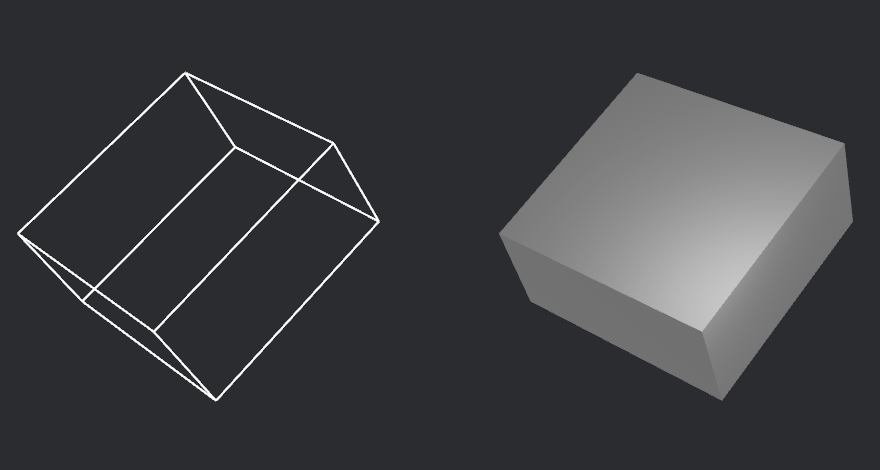
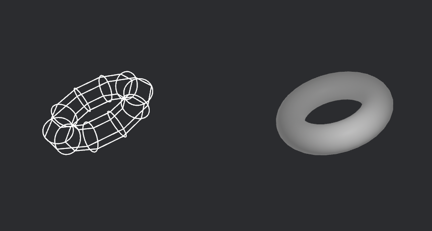

+++
title = "Bevy 0.13"
date = 2024-02-03
[extra]
author = "Bevy Contributors"
image = "TODO.gif"
show_image = true
image_subtitle = "TODO"
image_subtitle_link = "TODO"

+++

Thanks to **TODO** contributors, **TODO** pull requests, community reviewers, and our [**generous sponsors**](/community/donate), we're happy to announce the **Bevy 0.13** release on [crates.io](https://crates.io/crates/bevy)!

For those who don't know, Bevy is a refreshingly simple data-driven game engine built in Rust. You can check out our [Quick Start Guide](/learn/book/getting-started/) to try it today. It's free and open source forever! You can grab the full [source code](https://github.com/bevyengine/bevy) on GitHub. Check out [Bevy Assets](https://bevyengine.org/assets) for a collection of community-developed plugins, games, and learning resources.
And to see what the engine has to offer hands-on, check out the entries in the [latest Bevy Jam](https://itch.io/jam/bevy-jam-4/entries), including the winner [That's a lot of beeeeees](https://andrewb330.itch.io/thats-a-lot-of-beeeeees)

To update an existing Bevy App or Plugin to **Bevy 0.13**, check out our [0.12 to 0.13 Migration Guide](/learn/migration-guides/0.12-0.13/).

Since our last release a few months ago we've added a _ton_ of new features, bug fixes, and quality of life tweaks, but here are some of the highlights:

<!-- more -->

* **First-party primitive shapes:** basic shapes are a core building block of both game engines and video games: we've added a polished collection of them for you to use!
* **System stepping:** completely pause and advance through your game frame-by-frame or system-by-system to interactively debug game logic, all while rendering continues to update.
* **Dynamic queries:** refining queries from within systems is extremely expressive, and is the last big puzzle piece for runtime-defined types and third-party modding and scripting integration.
* **Automatically inferred command flush points:** tired of reasoning about where to put `apply_deferred` and confused about why your commands weren't being applied? Us too! Now, Bevy's scheduler uses ordinary `.before` and `.after` constraints and inspects the system parameters to automatically infer (and deduplicate) synchronization points.
* **Slicing, tiling and nine-patch sprites:** ninepatch layout is a popular tool for smoothly scaling stylized tilesets and UIs. Now in Bevy!
* **Lightmaps:** the first step towards baked global illumination: a fast, popular and pretty lighting technique.
* **Animation interpolation modes:** Bevy now supports non-linear interpolation modes in exported glTF animations.

## Primitive Shapes

<div class="release-feature-authors">authors: @Jondolf, @NiseVoid</div>

Geometric shapes are used all across game development, from primitive mesh shapes and debug gizmos to physics colliders and raycasting. Despite being so commonly used across several domains, Bevy hasn't really had any general-purpose shape representations.

This is changing in Bevy 0.13 with the introduction of first-party **primitive shapes**! They are lightweight geometric primitives designed for maximal interoperability and reusability, allowing Bevy and third-party plugins to use the same set of basic shapes and increase cohesion within the ecosystem. See the original [RFC][Primitive RFC] for more details.

The built-in [collection of primitives] is already quite sizeable:

| 2D                              | 3D                              |
| ------------------------------- | ------------------------------- |
| `Rectangle`                     | `Cuboid`                        |
| `Circle`                        | `Sphere`                        |
| `Ellipse`                       | -                               |
| `Triangle2d`                    | -                               |
| `Plane2d`                       | `Plane3d`                       |
| `Line2d`                        | `Line3d`                        |
| `Segment2d`                     | `Segment3d`                     |
| `Polyline2d`, `BoxedPolyline2d` | `Polyline3d`, `BoxedPolyline3d` |
| `Polygon`, `BoxedPolygon`       | -                               |
| `RegularPolygon`                | -                               |
| `Capsule2d`                     | `Capsule3d`                     |
| -                               | `Cylinder`                      |
| -                               | `Cone`                          |
| -                               | `ConicalFrustum`                |
| -                               | `Torus`                         |

More primitives will be added in future releases.

Some use cases for primitive shapes include meshing, gizmos, bounding volumes, colliders, and raycasting functionality. Several of these have landed in 0.13 already!

[Primitive RFC]: https://github.com/bevyengine/rfcs/blob/main/rfcs/12-primitive-shapes.md
[collection of primitives]: https://dev-docs.bevyengine.org/bevy/math/primitives/index.html

### Rendering

Primitive shapes can be rendered using both meshes and gizmos. In this section, we'll take a closer look the new APIs.

Below, you can see a cuboid and a torus rendered using meshes and gizmos. You can check out at all primitives that can be rendered in the new [Rendering Primitives] example.





[Rendering Primitives]: https://bevyengine.org/examples/Math/render-primitives

#### Meshing

<div class="release-feature-authors">authors: @Jondolf</div>

Previous versions of Bevy have had types like [`Quad`], [`Box`], and [`UVSphere`] for creating meshes from basic shapes. These have been deprecated in favor of a builder-like API using the new geometric primitives.

Primitives that support meshing implement the [`Meshable`] trait. For some shapes, the [`mesh`][`mesh` method] method returns a [`Mesh`] directly:

```rust
let before = Mesh::from(Quad::new(Vec2::new(2.0, 1.0)));
let after = Rectangle::new(2.0, 1.0).mesh(); // Mesh::from also works
```

For most primitives however, it returns a builder for optional configuration:

```rust
// Create a circle mesh with a specified vertex count
let before = Mesh::from(Circle {
    radius: 1.0,
    vertices: 64,
};
let after = Circle::new(1.0).mesh().resolution(64).build();
```

Below are a few more examples of meshing with the new primitives.

```rust
// Icosphere
let before = meshes.add(
    Mesh::try_from(Icosphere {
        radius: 2.0,
        subdivisions: 8,
    })
    .unwrap()
);
let after = meshes.add(Sphere::new(2.0).mesh().ico(8).unwrap());

// Cuboid
// (notice how Assets::add handles mesh convertion automatically)
let before = meshes.add(shape::Box::new(2.0, 1.0, 1.0));
let after = meshes.add(Cuboid::new(2.0, 1.0, 1.0));

// Plane
let before = meshes.add(Plane::from_size(5.0));
let after = meshes.add(Plane3d::default().mesh().size(5.0, 5.0));
```

With the addition of the primitives, meshing is also supported for more shapes, like [`Ellipse`], [`Triangle2d`], and [`Capsule2d`]. However, note that meshing is not yet implemented for all primitives, such as [`Polygon`] and [`Cone`].

Below you can see some meshes in the [`2d_shapes`] and [`3d_shapes`] examples.


Some default values for mesh shape dimensions have also been changed to be more consistent.

[`Quad`]: https://dev-docs.bevyengine.org/bevy/prelude/shape/struct.Quad.html
[`Box`]: https://dev-docs.bevyengine.org/bevy/prelude/shape/struct.Box.html
[`UVSphere`]: https://dev-docs.bevyengine.org/bevy/prelude/shape/struct.UVSphere.html
[`Meshable`]: https://dev-docs.bevyengine.org/bevy/prelude/trait.Meshable.html
[`mesh` method]: https://dev-docs.bevyengine.org/bevy/prelude/trait.Meshable.html#tymethod.mesh
[`Mesh`]: https://dev-docs.bevyengine.org/bevy/prelude/struct.Mesh.html
[`Ellipse`]: https://dev-docs.bevyengine.org/bevy/prelude/struct.Ellipse.html
[`Triangle2d`]: https://dev-docs.bevyengine.org/bevy/prelude/struct.Triangle2d.html
[`Capsule2d`]: https://dev-docs.bevyengine.org/bevy/prelude/struct.Capsule2d.html
[`Polygon`]: https://dev-docs.bevyengine.org/bevy/prelude/struct.Polygon.html
[`Cone`]: https://dev-docs.bevyengine.org/bevy/prelude/struct.Cone.html
[`2d_shapes`]: https://bevyengine.org/examples/2D%20Rendering/2d-shapes/
[`3d_shapes`]: https://bevyengine.org/examples/3D%20Rendering/3d-shapes/

#### Gizmos

<div class="release-feature-authors">authors: @RobWalt</div>

Primitives can also be rendered with [`Gizmos`]. There are two new generic methods:

* [`gizmos.primitive_2d(primitive, position, angle, color)`][`primitive_2d`]
* [`gizmos.primitive_3d(primitive, position, rotation, color)`][`primitive_3d`]

Some primitives can have additional configuration options similar to existing [`Gizmos`] drawing methods.
For example, calling [`primitive_3d`] with a [`Sphere`] returns a [`SphereBuilder`], which offers a `segments` method
to control the level of detail of the sphere.

```rust
let sphere = Sphere { radius };
gizmos
    .primitive_3d(sphere, center, rotation, color)
    .segments(segments);
```

[`Gizmos`]: https://dev-docs.bevyengine.org/bevy/gizmos/prelude/struct.Gizmos.html
[`primitive_2d`]: https://dev-docs.bevyengine.org/bevy/gizmos/prelude/trait.GizmoPrimitive2d.html
[`primitive_3d`]: https://dev-docs.bevyengine.org/bevy/gizmos/prelude/trait.GizmoPrimitive2d.html
[`Sphere`]: https://dev-docs.bevyengine.org/bevy/prelude/struct.Sphere.html
[`SphereBuilder`]: https://dev-docs.bevyengine.org/bevy/gizmos/primitives/dim3/struct.SphereBuilder.html

### Bounding Volumes

<div class="release-feature-authors">authors: @Jondolf, @NiseVoid</div>

In game development, spatial checks have several valuable use cases, such as getting all entities that are in the camera's view frustum or near the player, or finding pairs of physics objects that might be intersecting. To speed up such checks, bounding volumes are used to approximate more complex shapes.

Bevy 0.13 adds some new publicly available bounding volumes: `Aabb2d`, `Aabb3d`, `BoundingCircle`, and `BoundingSphere`. These can be created manually, or generated from primitives shapes.

Each bounding volume implements the `BoundingVolume` trait, providing some general functionality and helpers. The `IntersectsVolume` trait can be used to test for intersections with these volumes. This trait is implemented for bounding volumes themselves, so you can test for intersections between them. This is supported between all existing bounding volume types, but only those in the same dimension.

Here is an example of how bounding volumes are constructed, and how an intersection test is performed:

```rust
// We create an axis-aligned bounding box that is centered at position
let position = Vec2::new(100., 50.);
let half_size = Vec2::splat(20.);
let aabb = Aabb2d::new(position, half_size);

// We create a bounding circle that is centered at position
let position = Vec2::new(80., 70.);
let radius = 30.;
let bounding_circle = BoundingCircle::new(position, radius);

// We check if the volumes are intersecting
let intersects = bounding_circle.intersects(&aabb);
```

There are also two traits for the generation of bounding volumes: `Bounded2d` and `Bounded3d`. These are implemented for the new primitive shapes, so you can easily compute bounding volumes for them:

```rust
// We create a primitive, a hexagon in this case
let hexagon = RegularPolygon::new(50., 6);

let translation = Vec2::new(50., 200.);
let rotation = PI / 2.; // Rotation in radians

// Now we can get an Aabb2d or BoundingCircle from this primitive.
// These methods are part of the Bounded2d trait.
let aabb = hexagon.aabb_2d(translation, rotation);
let circle = hexagon.bounding_circle(translation, rotation);
```

#### Ray Casting and Volume Casting

The bounding volumes also support basic ray casting and volume casting. Ray casting tests if a bounding volume intersects with a given ray, cast from an origin in a direction, until a maximum distance. Volume casts work similarly, but function as if moving a volume along the ray.

This functionality is provided through the new `RayCast2d`, `RayCast3d`, `AabbCast2d`, `AabbCast3d`, `CircleCast`, and `SphereCast` types. They can be used to check for intersections against bounding volumes, and to compute the distance from the origin of the cast to the point of intersection.

Below, you can see ray casting, volume casting, and intersection tests in action:

<video controls><source src="bounding_intersections.mp4" type="video/mp4"/></video>

To make it easier to reason about ray casts in different dimensions, the old `Ray` type has also been split into `Ray2d` and `Ray3d`. The new `Direction2d` and `Direction3d` types are used to ensure that the ray direction remains normalized, providing a type-level guarantee that the vector is always unit-length. These are already in use in some other APIs as well, such as for some primitives and gizmo methods.

## System Stepping

<div class="release-feature-authors">authors: @dmlary</div>

The new system stepping feature (`bevy_debug_stepping`) adds debugger-style
execution control for systems. The [`Stepping`] resource can control which
systems within a schedule execute each frame, and provides step, break, and
continue facilities to enable live debugging. This feature is enabled by
default in the `bevy` crate.

The `Stepping` resource is configured with a list of schedules that it will
control execution of when stepping is enabled. The collection of systems
within those schedules can be thought of as the stepping frame. It can take
multiple step or continue calls to traverse through the entire stepping frame.
During this time, all schedules that have not been added to `Stepping` are
executing each frame. This allows rendering & input handling to continue while
stepping through systems.

### Configuration

To get started the [`Stepping`] resource must be configured with the schedules
it will be controlling, then added to the world:

```rust
// create a new Stepping resource, and add schedules to debug
let mut stepping = Stepping::new();
stepping.add_schedule(Update);
stepping.add_schedule(FixedUpdate);

// add the Stepping resource to the world
app.insert_resource(stepping);
```

The [`Stepping`] resource has no effect until it is enabled with a call to
`Stepping::enable()`. When the `Stepping` resource is present and enabled,
systems within the added schedules will not be run unless we're performing
a system step, continuing the stepping frame, or the system has been exempt
from stepping.

### Execution Control: System Step & Continue Frame

While stepping is enabled, the `Stepping` resource tracks its location within
the stepping frame, maintaining a stepping cursor pointing at the next system
to be executed.
There are two ways systems get executed while stepping is enabled: system step,
and continue frame.

System step (`Stepping::step_frame()`) runs the system at the stepping
cursor, and advances the cursor during the next render frame.
This is useful to see individual changes made by
systems, and see the state of the world prior to executing a system

Continue frame (`Stepping::continue_frame()`) will execute systems starting
from the stepping cursor to the end of the stepping frame during the next frame.
It may stop before the end of the stepping frame if it encounters a system with
a breakpoint. This is useful for advancing quickly through an entire frame,
getting to the start of the next frame, or in combination with breakpoints.

In this video we demonstrate system step & continue frame on the breakout
example with a custom `egui` interface.  The stepping cursor can be seen moving through
the systems list as we click the `step` button.  When the `continue` button is
clicked, you can see the game progress one stepping frame for each click.

<video controls><source src="stepping-step-continue.mp4" type="video/mp4"/></video>

### Breakpoints

When a schedule grows to a certain point, it can take a long time to step
through every system in the schedule just to see the effects of a few systems.
In this case, stepping provides system breakpoints.

You can set a breakpoint on those systems you care about, then use
`Stepping::continue_frame()` to run systems starting at the stepping cursor
until a breakpoint is encountered, or the end of the stepping frame.
If the stepping cursor points at a system with a breakpoint when you call
`Stepping::continue_frame()` that system will run.  This allows you to set
breakpoints through a system, and repeatedly continue the frame to stop prior
to each system of interest.

In this video of the breakout example, we add a breakpoint to
`check_for_collisions()` so we can verify the collision detection & handling
behavior each frame without stepping through all the other systems.

The video shows the stepping cursor moves from the start of the stepping frame
to `check_for_collisions()` the first time we click `continue` in the ui.  On
the next click, `check_for_collisions()` and all remaining systems are run,
moving the cursor back up to the start of the stepping frame.

<video controls><source src="stepping-breakpoint.mp4" type="video/mp4"/></video>

### Disabling Systems

During debugging, it can be helpful to disable systems to narrow down the
source of the problem. `Stepping::never_run()` and `Stepping::never_run_node()`
can be used to disable systems while stepping is enabled. Note that disabling
systems in this manner only has an effect while stepping is enabled. When
stepping is disabled, all disabled systems will resume executing.

In this video of the breakout example, we disable the `check_for_collisions()`
system and use continue frame to move the ball into the center of the blocks,
then re-enable the system to have fun destroying all the blocks from the
inside.

<video controls><source src="stepping-disable-system.mp4" type="video/mp4"/></video>

### Excluding Systems from Stepping

It may be necessary to ensure some systems still run while stepping is enabled.
While best-practice is to have them in a schedule that has not been added to
the `Stepping` resource, it is possible to configure systems to always run
while stepping is enabled. This is primarily useful for event & input handling
systems.

Systems can be configured to always run by calling
`Stepping::always_run()`, or `Stepping::always_run_node()`.
When a system is configured to always run, it will run each rendering frame
even when stepping is enabled.

In this video of the breakout example the `move_paddle()` system is configured
to always run.  We then use the arrow keys to move the paddle while the rest
of the game systems are stopped by stepping.  This allows us to position the
paddle precisely before continuing frame-by-frame as the ball impacts the
paddle.

<video controls><source src="stepping-run-always.mp4" type="video/mp4"/></video>

### Limitations

In this initial implementation of stepping there are some limitations:

* Any system that reads events likely will not step properly
  * Frames still advance normally while stepping is enabled
  * Events can be cleared before a stepped system can read them
  * Best approach here is to configure event-based systems to always run,
    or put them in a schedule not added to `Stepping`
  * Continue with breakpoints may also work in this scenario
* Conditional systems may not run as expected when stepping
  * Similar to event-based systems, if the condition is true for only a short
    time, system may not run when stepped

### Detailed Examples

* [Text-based stepping example](https://github.com/bevyengine/bevy/blob/main/examples/ecs/system_stepping.rs)
* Non-interactive [bevy UI example stepping plugin](https://github.com/bevyengine/bevy/blob/main/examples/games/stepping.rs) used in the breakout example
* Interactive [egui stepping plugin](https://gist.github.com/dmlary/3fd57ebf1f88bb9afa8a6604737dac97) used in demo videos

[`Stepping`]: https://docs.rs/bevy/0.13.0/bevy/ecs/schedule/stepping/Stepping.html

## Dynamic Queries

<div class="release-feature-authors">authors: @TODO</div>

## Transmute Queries

<div class="release-feature-authors">authors: @hymm, james-j-obrien</div>

Have you every wanted to pass a query to a function, but instead of having a
`Query<&Transform>` you have a `Query<(&Transform, &Velocity), With<Enemy>>`?
Well now you can by using the `Query::transmute_lens` method. Query transmutes
allow you to change a query into different query types as long as the
componenets accessed are a subset of the original query. If you do try to access
data that is not in the original query, this method will panic.

```rust
fn reusable_function(lens: &mut QueryLens<&Transform>) {
    let query = lens.query();
    // do something with the query...
}

// We can use the function in a system that takes the exact query.
fn system_1(mut query: Query<&Transform>) {
    reusable_function(&mut query.as_query_lens());
}

// We can also use it with a query that does not match exactly
// by transmuting it.
fn system_2(mut query: Query<(&mut Transform, &Velocity), With<Enemy>>) {
    let mut lens = query.transmute_lens::<&Transform>();
    reusable_function(&mut lens);
}
```

Note that the `QueryLens` will still iterate over the same entities as the
original `Query` it is derived from. A `QueryLens<&Transform>` taken from
a `Query<(&Transform, &Velocity)>`, will only include the `Transform` of
entities with both `Transform` and `Velocity` components.

Besides removing parameters you can also change them in limited ways to the
different smart pointer types. One of the more useful is to change a
`& mut` to a `&`. See the [documentation](https://docs.rs/bevy/latest/bevy/ecs/system/struct.Query.html#method.transmute_lens)
for more details.

One thing to take into consideration is the transmutation is not free.
It works by creating a new state and copying a bunch of the cached data
inside the original query. It's not a expensive operation, but you should
probably avoid doing it inside a hot loop.

## Entity Optimizations

<div class="release-feature-authors">authors: @Bluefinger, @notverymoe, @scottmcm, @bushrat011899, @james7132</div>

`Entity` received a number of changes this cycle, combining laying some more groundwork for relations alongside _related_, and nice to have, performance optimizations. The work here involved a lot of deep-diving into compiler codegen/assembly output, with running lots of benchmarks and testing in order to ensure all changes didn't cause breakages or major problems. Although the work here was dealing with mostly _safe_ code, there were lots of underlying assumptions being changed that could have impacted code elsewhere. This was the most "micro-optimization" oriented set of changes in Bevy 0.13.

### Changing `Entity`'s Layout

This is a story told in two parts, with part one dealing with two PRs: The "Unified Identifier for entities & relations" PR ([#9797](https://github.com/bevyengine/bevy/pull/9797) by @Bluefinger) and "Change Entity::generation from u32 to NonZeroU32 for niche optimization" ([#9907](https://github.com/bevyengine/bevy/pull/9907) by @notverymoe). Fundamentally, they both involved changing the layout and assumptions of `Entity`, unlocking both a needed building block for the Relations feature being worked towards, as well as gaining a needed memory/codegen optimization for `Entity`.

What [#9797](https://github.com/bevyengine/bevy/pull/9797) changed was create a new `Identifier` struct that set out a unified layout for `Entity` and future ID types. The `Identifier` spec lays out a struct with a `u32` low segment and a `u32` high segment, resulting in a struct that can be effectively represented as a special-cased `u64` value. A diagram of `Identifier` layout is as follows, going from Most Significant Bit to Lowest Significant Bit:

```text
|F| High value / Generation       | Low value / Index              |
|-|-------------------------------|--------------------------------|
|1| 31 bits                       | 32 bits                        |

F = Bit Flags
```

```rust
#[derive(Clone, Copy)]
struct Identifier {
    low: u32,
    high: u32,
}
```

The low part can be used as a full `u32` value, but the high part consists of a packed `u32` structure, with the most significant bit reserved as a flag, and the remaining 31-bits to be used as a value. _How_ the low segment and the value part of the high segment are used is not specified by the `Identifer`, only that there are reserved bits in the high segment. This bit is reserved for the purposes of a future `Pair` identifier, which would represent a different _kind_ of identifier with separate semantics/usage compared to an `Entity`. The work here is basically an implementation of the prior art established by Flecs ([citation](https://ajmmertens.medium.com/doing-a-lot-with-a-little-ecs-identifiers-25a72bd2647)), as eventually, these new entities and entity kinds will be used to describe special component types needed for relations. In the future, more flag bits will be reserved at the cost of less available value bits in the high segment.

But on top of this came [#9907](https://github.com/bevyengine/bevy/pull/9907). This PR had the effect of changing both `Entity`/`Identifier` to have a high segment that was `NonZeroU32`:

```rust
#[derive(Clone, Copy)]
struct Identifier {
    low: u32,
    high: NonZeroU32,
}
```

By including a non-zero property within `Entity`/`Identifier`, it allowed the compiler to be able to optimise `Option<Entity>` and so forth to take 8 bytes instead of 12 bytes, as it could now use invalid representations of `Entity`/`Identifier` as the `None` equivalent. The benefit here was reduced memory/cache usage for storing `Option<Entity>` as well as better codegen around methods that use or return `Option<Entity>`. The choice to modify the generation/high segment to be non-zero had the following benefits: It allowed the low/index portion of `Entity` to be zero, so index access of `Entity` from storages/archetypes/buffers in hot code paths remained untouched. Code that touched the high segment or the generation in `Entity` was in less performance sensitive sections, and when spawning, most of that code would be exactly the same, but with initialising generation with a constant `1` instead of a `0`. For `Entity` however, incrementing a generation meant it needed to ensure that if an overflow occurred, it overflowed at 31-bits **and** also overflowed to `1` instead of `0`.

More over, this choice _did not interfere_ with the unified `Identifier` approach. While for `Entity`, the generation would have to be initialised with `1`; for other ID types, the high segment would always be _non-zero_ due to flag bits being set. That means a `Pair` type (which would have an ID in both high and low segments) would be unaffected as it could reference an `Entity` id in the low segment, and have its own id in the high segment.

### Optimizing `Entity`'s Representation and Codegen further

Part two of the `Entity` optimization story continues with initial work on improving `Entity`'s `PartialEq` implementation ([#10519](https://github.com/bevyengine/bevy/pull/10519) by @scottmcm). With `Entity`'s structure, the standard `PartialEq` derive was yielding poor codegen and leaving performance on the table as the compiler was unable to make the correct inferences on how to load `Entity` for comparisons. By removing the short-circuiting implementation that is the default for `PartialEq` derivation, the compiler could output much less assembly for the same operation, yielding some performance improvements in some areas of the codebase.

However, work in this area did not stop with [#10519](https://github.com/bevyengine/bevy/pull/10519). There was further optimization potential still on the table, culminating with the PR "Optimise Entity with repr align & manual PartialOrd/Ord" ([#10558](https://github.com/bevyengine/bevy/pull/10558) by @Bluefinger). There was prior art with this PR that attempted to land similar improvements previously ([#2372](https://github.com/bevyengine/bevy/pull/2372) & [#3788](https://github.com/bevyengine/bevy/pull/3788)) but these didn't get merged due to problems at the time that didn't justify performance gains at the expense of regressions elsewhere or from complicating the `Entity` codebase.

By default, `Entity`/`Identifier`'s representation had two `u32` segments, so the struct had an alignment of 4 bytes for a structure that was 8 bytes in size. Though the same size as a `u64` value, these structs were _under-aligned_ and as such, the compiler could not treat `Entity` as if it were a `u64` value. For reference, a `u64` value has a size and alignment of 8 bytes. Certain optimizations were being left out as the necessary assumptions could not be made at compile time regarding `Entity`. So `Entity`/`Identifier` were changed to have a manually defined layout and alignment, making it clearer to the compiler to treat these structs as if it were a `u64` value:

```rust
#[derive(Clone, Copy)]
#[repr(C, align(8))]
struct Identifier {
    #[cfg(target_endian = "little")]
    low: u32,
    high: NonZeroU32,
    #[cfg(target_endian = "big")]
    low: u32,
}
```

By defining the struct with a `repr(C)`, we could tell the compiler the layout of the struct exactly for both little endian and big endian platforms. By also defining the alignment of the struct to be 8 bytes, `Entity`/`Identifier` both appear to the compiler as if it were a `u64` value. The effect of this is that the `to_bits` method for `Entity`/`Identifier` becomes a simple `mov` operation which could be completely optimised away with LTO and inlining.

Before:

```asm
to_bits:
    shl     rdi, 32
    mov     eax, esi
    or      rax, rdi
    ret
```

After:

```asm
to_bits:
    mov     rax, rdi
    ret
```

_But it doesn't stop there_. This had the effect of making hashing `Entity` even _faster_, yielding further gains on top of [#9903](https://github.com/bevyengine/bevy/pull/9903) (which landed in 0.12). It turned out that the `PartialEq` implementation could be made even quicker, by comparing directly against the bits of one `Entity` with another. With manual implementations of `PartialOrd`/`Ord`, the codegen around `Entity` was improved considerably as the compiler was now being able to treat `Entity` as a pseudo-`u64` value.

For example, this was the codegen for `Entity > Entity` before the various changes:

```asm
greater_than:
    cmp     edi, edx
    jae     .LBB3_2
    xor     eax, eax
    ret

.LBB3_2:
    setne   dl
    cmp     esi, ecx
    seta    al
    or      al, dl
    ret
```

Afterwards, it compiles to this:

```asm
greater_than:
    cmp     rdi, rsi
    seta    al
    ret
```

But why didn't this land before? It turned out that imposing an alignment of 8 bytes on `Entity` made `Option<Entity>` increase in size from the original 12 bytes to 16 bytes. As such, some code paths _suffered_ performance regressions in needing to load and move around 16 byte values. But with niching now possible, the new representation could stay at 8 bytes in size even as an `Option`, preventing the regressions from occurring in the first place.

The micro-optimizations around `EntityHasher` did not end here though, as there was a PR made to "Save an instruction in `EntityHasher`" ([#10648](https://github.com/bevyengine/bevy/pull/10648) by @scottmcm). As [#10558](https://github.com/bevyengine/bevy/pull/10558) provided a significant improvement already to `EntityHasher` performance, the hashing algorithm was revised in a way that allowed LLVM to remove one further instruction in the compiled output. The compiler was already being clever enough to combine a multiply-shift-or operation into a single multiplication, but by expressing the algorithm with slight changes, an `or` instruction could be removed while retaining the desired hashing behaviour for `EntityHasher`.


This had a detectable improvement in benchmarks, ranging from 3-6% improvement in lookups for `EntityHashMap`. These small optimizations may not amount to much on their own, but together they can provide meaningful improvements downstream.


The above results show from where we started (`optimised_eq` being the first PR that introduced the benchmarks with the "Optimise Eq" feature) to where we are now with all the optimisations in place (`optimised_entity`). Improvements across the whole board, with clear performance benefits that should impact multiple areas of the codebase, not just with entity hashing.

### Porting `Query::for_each` to `QueryIter::fold` override

Currently to get the full performance out of iterating over queries, `Query::for_each` must be used in order to take advantage of auto-vectorization and internal iteration optimizations that the compiler can apply. However, this isn't idiomatic rust and is not an iterator method so you can't use it on an iterator chain. However, it is possible to get the same benefits for some iterator methods, for which [#6773](https://github.com/bevyengine/bevy/pull/6773/) by @james7132 sought to achieve. By providing an override to `QueryIter::fold`, it was possible to port the iteration strategies of `Query::for_each` so that `Query::iter` and co could achieve the same gains. Not _every_ iterator method currently benefits from this, as they require overriding `QueryIter::try_fold`, but that is currently still a nightly-only optimisation. This approach is the same used within `std` code.

The result was deduplication of code in a few areas, such as no longer requiring both `Query::for_each` and `Query::for_each_mut`, as one just needs to call `Query::iter` or `Query::iter_mut` instead. So code like:

```rust
fn some_system(mut q_transform: Query<&mut Transform, With<Npc>>) {
    q_transform.for_each_mut(|transform| {
        // Do something...
    });
}
```

Becomes:

```rust
fn some_system(mut q_transform: Query<&mut Transform, With<Npc>>) {
    q_transform.iter_mut().for_each(|transform| {
        // Do something...
    });
}
```

The assembly output was compared as well between what was on main branch versus the PR, with no tangible differences being seen between the old `Query::for_each` and the new `QueryIter::for_each()` output, validating the approach and ensuring the internal iteration optimizations were being applied.

As a plus, the same iternal iteration optimizations in `Query::par_for_each` now reuse code from `for_each`, deduplicating code there as well and enabling users to make use of `par_iter().for_each()`. As a whole, this means there's no longer any need for `Query::for_each`, `Query::for_each_mut`, `Query::_par_for_each`, `Query::par_for_each_mut` so these methods have been deprecated for 0.13 and will be removed in 0.14.

### Reducing `TableRow` `as` casting

Not all improvements were focused around performance. Some small changes were done to improve type safety and tidy-up some of the codebase to have less `as` casting being done on various call sites for `TableRow`. The problem with `as` casting is that in some cases, the cast will fail by truncating the value silently, which could then cause havoc by accessing the wrong row and so forth. [#10811](https://github.com/bevyengine/bevy/pull/10811) by @bushrat011899 was put forward to clean up the API around `TableRow`, providing convenience methods backed by `assert`s to ensure the casting operations could never fail, or if they did, they'd panic correctly.

Naturally, _adding_ asserts in potentially hot codepaths were cause for some concern, necessitating considerable benchmarking efforts to confirm there were regressions and to what level. With careful placing of the new `assert`s, the detected regression for these cases was in the region of 0.1%, but such regressions could easily be masked by compiler randomness, optimizations, etc. But the benefit was a less error-prone API and more robust code, which for a complex codebase such as Bevy's ECS code, every little helps.

### Entity optimizations notes

* [Making the most of ECS identifiers](https://ajmmertens.medium.com/doing-a-lot-with-a-little-ecs-identifiers-25a72bd2647)
* [`Option` representation](https://doc.rust-lang.org/core/option/index.html#representation)

#### QueryIter::fold` override notes

* [Assembly Sanity check for bevyengine/bevy#6773](https://github.com/james7132/bevy_asm_tests/commit/309947cd078086b7edc4b8b5f29b1d04255b1b9a#diff-4c4b34cf83f523fced3bd396ad7ab8e228b4d35bf65c1f0457f7e4e58b14ccc5)
* [rustc bug for autovectorising internal iteration](https://github.com/rust-lang/rust/issues/104914)
* [std `Iter::fold` overriding for perf gains](https://github.com/rust-lang/rust/blob/master/library/core/src/array/iter.rs#L265-L277)

#### `TableRow` Casting notes

* [Rustonomicon on Casts](https://doc.rust-lang.org/nomicon/casts.html)

## `WorldQuery` Trait Split

<div class="release-feature-authors">authors: @wainwrightmark @taizu-jin</div>

A [`Query`] has two type parameters: one for the the data to be fetched, and a second optional one for the filters.

In previous versions of Bevy both parameters had to implement [`WorldQuery`] but there was nothing stopping you from using types intended as filters in the data position (or vice versa).

Apart from making the type signature of the [`Query`] items more complicated (see example below) this usually worked fine as most filters had the same behaviour in either position.

Unfortunately this was not the case for [`Changed`] and [`Added`] which had different (and undocumented) behaviour in the data position and this could lead to bugs in user code.

To allow us to prevent this type of bug at compile time, the [`WorldQuery`] trait has been replaced by two traits: [`QueryData`] and [`QueryFilter`]. The data parameter of a [`Query`] must now be [`QueryData`] and the filter parameter must be [`QueryFilter`].

Most user code should be unaffected or easy to migrate.

```rust
// `With` filter in the data position - will not compile in 0.13
fn my_system(query: Query<(Entity, With<ComponentA>)>)
{
  for (entity, ()) in query.iter(){
    // The type signature of the query items is `(Entity, ())`, which is usable but unwieldy
  }
}

// Still compiles as in 0.12
fn my_system(query: Query<Entity, With<ComponentA>>)
{
  for entity in query.iter(){
  }
}
```

[`Query`]: https://dev-docs.bevyengine.org/bevy/ecs/system/struct.Query.html
[`WorldQuery`]: https://docs.rs/bevy/0.12.0/bevy/ecs/query/trait.WorldQuery.html
[`Changed`]: https://dev-docs.bevyengine.org/bevy/ecs/query/struct.Changed.html
[`Added`]: https://dev-docs.bevyengine.org/bevy/ecs/query/struct.Added.html
[`QueryData`]: https://dev-docs.bevyengine.org/bevy/ecs/query/trait.QueryData.html
[`QueryFilter`]: https://dev-docs.bevyengine.org/bevy/ecs/query/trait.QueryFilter.html

## Automatically Insert `apply_deferred` Systems

<div class="release-feature-authors">authors: @hymm</div>

A common scheduling issue is that one system needs to see the effects of commands
queued in another system. Before 0.13, you would have to manually insert an
`apply_deferred` system between the two. Bevy now detects when a system with commands
is ordered relative to other systems and inserts the `apply_deferred` for you.

```rust
// Before 0.13
app.add_systems(
    Update,
    (
        system_with_commands,
        apply_deferred,
        another_system,
    ).chain()
);
```

```rust
// After 0.13
app.add_systems(
    Update,
    (
        system_with_commands,
        another_system,
    ).chain()
);
```

It also optimizes the automatically inserted `apply_deferred` systems by merging them if
possible. In most cases, it is recommended to remove all manually inserted
`apply_deferred` systems, as allowing Bevy to insert and merge these systems as needed will
usually be faster.

```rust
// This will only add one apply_deferred system.
app.add_systems(
    Update,
    (
        (system_1_with_commands, system_2).chain(),
        (system_3_with_commands, system_4).chain(),
    )
);
```

If this new behavior does not work for you, please consult the migration guide.
There are several new APIs that allow you to opt-out.

## One-Shot Systems Improvements

<div class="release-feature-authors">authors: @Nathan-Fenner</div>

In 0.12, we introduced [one-shot systems](https://bevyengine.org/news/bevy-0-12/#one-shot-systems), a handy way to call systems on demand without having to add them to a schedule.
The initial implementation had some limitations with regards to what systems could and could not be used as one-shot systems.
These limitations have since been resolved, starting with one-shot systems with input and output.

```rust

fn increment_sys(In(increment_by): In<i32>, mut counter: ResMut<Counter>) -> i32 {
    counter.0 += increment_by;
    counter.0
}

let mut world = World::new();
let id = world.register_system(increment_sys);

world.insert_resource(Counter(1));
let count_one = world.run_system_with_input(id, 5).unwrap(); // increment counter by 5 and return 6
let count_two = world.run_system_with_input(id, 2).unwrap(); // increment counter by 2 and return 8
```

Using either `world.run_system_with_input(system_id, input)` or `commands.run_system_with_input(system_id, input)`, you can now supply input parameters to systems that accept them. Additionally, both `world.run_system` and `world.run_system_with_input` now return system output as `Ok(output)`. Note that output cannot be returned when calling the system through commands, because of their deferred nature.

Some smaller improvements to one-shot systems include registering boxed systems with `register_boxed_system` (which was already possible since 0.12.1, but didn't get a blog post) and the ability to register exclusive systems as one-shot systems.

```rust
world.register_system(|world: &mut World| { /* do anything */ });
```

All these improvements round out one-shot systems significantly and they should now behave normally in any Bevy context.

## WGPU Upgrade and Renderer Improvements

<div class="release-feature-authors">authors: @Elabajaba</div>

In Bevy 0.13 we upgraded from `wgpu` 0.17 to `wgpu` 0.19, which includes the long awaited `wgpu` [arcanization](https://gfx-rs.github.io/2023/11/24/arcanization.html) that allows us to do things like compiling shaders asynchronously to avoid shader compilation stutters, and to multithread draw call creation for better performance.

Due to changes in wgpu 0.19, we've added a new `webgpu` feature to Bevy that is now required when doing WebAssembly builds targeting WebGPU. Disabling the `webgl2` feature is no longer required when targeting WebGPU, but the new `webgpu` feature currently overrides the `webgl2` feature when enabled. Library authors, please do not enable the `webgpu` feature by default. In the future we plan on allowing you to target both WebGL2 and WebGPU in the same WebAssembly binary, but it requires reworking parts of the renderer where we're relying on compile time constants when targeting `webgl2`, and adding a way to choose the renderer's backend at runtime on web.

As usual, there's been some changes that may cause issues for custom shaders. We've swapped the material and mesh bind groups, so that mesh data is now in bind group 1, and material data is in bind group 2. This greatly improved our draw call batching when combined with changing the sorting functions for the opaque passes to sort by pipeline and mesh. Previously we were sorting them by distance from the camera. These batching improvements mean we're doing fewer draw calls, which improves CPU performance, especially in larger scenes. We've also removed the `get_instance_index` function in shaders, as it was only required to workaround an upstream bug that has been fixed in wgpu 0.19. For other shader or rendering changes, please see the [migration guide](/learn/migration-guides/0.12-0.13/) and [wgpu's changelog](https://github.com/gfx-rs/wgpu/blob/v0.19/CHANGELOG.md).

## Texture Atlas Rework

<div class="release-feature-authors">authors: @TODO</div>

TODO.

## Sprite Slicing and Tiling

<div class="release-feature-authors">authors: @TODO</div>

TODO.

## Exposure Settings

<div class="release-feature-authors">authors: @TODO</div>

TODO.

## Minimal Reflection Probes

<div class="release-feature-authors">authors: @TODO</div>

TODO.

## Light Maps

<div class="release-feature-authors">authors: @TODO</div>

TODO.

## Light `RenderLayers`

<div class="release-feature-authors">authors: @TODO</div>

TODO.

## Approximate Indirect Specular Occlusion

<div class="release-feature-authors">authors: @TODO</div>

TODO.

## Unload Render Assets From RAM

<div class="release-feature-authors">authors: @TODO</div>

TODO.

## Bind Group Layout Entries

<div class="release-feature-authors">authors: @TODO</div>

TODO.

## Type-Safe Labels for the `RenderGraph`

<div class="release-feature-authors">authors: @bardt, @oceantume</div>

Historically, Bevy's UI elements have been scaled and positioned in the context of the primary window, regardless of the camera settings. This approach made some UI experiences like split-screen multiplayer difficult to implement, and others such as having UI in multiple windows impossible.

We are now introducing a more flexible way of rendering the user interface: Camera-driven UI. Each camera can now have its own UI root, rendering according to its viewport, scale factor, and a target which can be a secondary window or even a texture.

This change unlocks a variety of new UI experiences, including split-screen multiplayer, UI in multiple windows, displaying non-interactive UI in a 3D world, and more.


If there is one camera in the world, you don't need to do anything; your UI will be displayed in that camera's viewport.

```rust
commands.spawn(Camera3dBundle {
    // Camera can have custom viewport, target, etc.
});
commands.spawn(NodeBundle {
    // UI will be rendered to the singular camera's viewport
});
```

For when more control is desirable, or there are multiple cameras, we introduce [`TargetCamera`] component. This component can be added to a root UI node to specify which camera it should be rendered to.

```rust
// For split-screen multiplayer, we set up 2 cameras and 2 UI roots
let left_camera = commands.spawn(Camera3dBundle {
    // Viewport is set to left half of the screen
}).id();

commands
    .spawn((
        TargetCamera(left_camera),
        NodeBundle {
            //...
        }
    ));

let right_camera = commands.spawn(Camera3dBundle {
    // Viewport is set to right half of the screen
}).id();

commands
    .spawn((
        TargetCamera(right_camera),
        NodeBundle {
            //...
        })
    );
```

With this change, we also remove [`UiCameraConfig`] component. If you were using it to hide UI nodes, you can achieve the same outcome by setting [`Visibility`] component on the root node.

```rust
commands.spawn(Camera3dBundle::default());
commands.spawn(NodeBundle {
    visibility: Visibility::Hidden, // UI will be hidden
    // ...
});
```

[`TargetCamera`]: https://docs.rs/bevy/0.13.0/bevy/ui/struct.TargetCamera.html
[`Visibility`]: https://docs.rs/bevy/0.13.0/bevy/render/view/enum.Visibility.html
[`UiCameraConfig`]: https://docs.rs/bevy/0.12.1/bevy/ui/camera_config/struct.UiCameraConfig.html

## Camera-Driven UI

<div class="release-feature-authors">authors: @TODO</div>

TODO.

## Winit Upgrade

<div class="release-feature-authors">authors: @TODO</div>

TODO.

## Animation Interpolation

<div class="release-feature-authors">authors: @TODO</div>

TODO.

## `Animatable` Trait

<div class="release-feature-authors">authors: @TODO</div>

TODO.

## glTF Extensions

<div class="release-feature-authors">authors: @DasLixou</div>

Bevy uses Rust's type system extensively when defining labels, letting developers lean on tooling to catch typos and ease refactors.
But this didn't apply to Bevy's render graph. In the render graph, hard-coded—and potentially overlapping—strings were used to define nodes and sub-graphs.

```rust
// Before 0.13
impl MyRenderNode {
    pub const NAME: &'static str = "my_render_node"
}
```

In Bevy 0.13, we're using a more robust way to name render nodes and render graphs with the help of Rust's type system and Bevy's label system.

```rust
// After 0.13
#[derive(Debug, Hash, PartialEq, Eq, Clone, RenderLabel)]
pub struct MyRenderLabel;
```

With those, the long paths for const-values also get shortened and cleaner which results into this

```rust
// Before 0.13
render_app
    .add_render_graph_node::<ViewNodeRunner<MyRenderNode>>(
        core_3d::graph::NAME,
        MyRenderNode::NAME,
    )
    .add_render_graph_edges(
        core_3d::graph::NAME,
        &[
            core_3d::graph::node::TONEMAPPING,
            MyRenderNode::NAME,
            core_3d::graph::node::END_MAIN_PASS_POST_PROCESSING,
        ],
    );

// After 0.13
use bevy::core_pipeline::core_3d::graph::{Labels3d, SubGraph3d};

render_app
    .add_render_graph_node::<ViewNodeRunner<MyRenderNode>>(
        SubGraph3d,
        MyRenderLabel,
    )
    .add_render_graph_edges(
        SubGraph3d,
        (
            Labels3d::Tonemapping,
            MyRenderLabel,
            Labels3d::EndMainPassPostProcessing,
        ),
    );
```

When you need dynamic labels for render nodes, those can still be achieved via e.g. tuple structs:

```rust
#[derive(Debug, Hash, PartialEq, Eq, Clone, RenderLabel)]
pub struct MyDynamicLabel(&'static str);
```

This is particularly nice because we don't have to store strings in here: we can use integers, custom enums or any other hashable type.

## Extensionless Asset Support

<div class="release-feature-authors">authors: @bushrat011899</div>

In prior versions of Bevy, the default way to choose an [`AssetLoader`] for a particular asset was entirely based around file extensions. The recent addition of [`meta` files] allowed for specifying more granular loading behavior, but file extensions were still required. In Bevy 0.13, the asset type can now be used to infer the [`AssetLoader`].

```rust
// Uses AudioSettingsAssetLoader
let audio = asset_server.load("data/audio.json");

// Uses GraphicsSettingsAssetLoader
let graphics = asset_server.load("data/graphics.json");
```

This is possible because every [`AssetLoader`] is required to declare what **type** of asset it loads, not just the extensions it supports. Since the [`load`] method on [`AssetServer`] was already generic over the type of asset to return, this information is already available to the [`AssetServer`] so that the appropriate [`Handle`] type is returned.

```rust
// The above example with types shown
let audio: Handle<AudioSettings> = asset_server.load::<AudioSettings>("data/audio.json");
let graphics: Handle<GraphicsSettings> = asset_server.load::<GraphicsSettings>("data/graphics.json");
```

Now we can also use it to choose the [`AssetLoader`] itself.

```rust
#[derive(Resource)]
struct Settings {
    audio: Handle<AudioSettings>,
//                ^^^^^^^^^^^^^
//                | This type...
}

fn setup(mut settings: ResMut<Settings>, asset_server: Res<AssetServer>) {
    settings.audio = asset_server.load("data/audio.json");
//                                ^^^^
//                                | ...is passed here...
}

impl AssetLoader for AudioSettingsAssetLoader {
    type Asset = AudioSettings;
//               ^^^^^^^^^^^^^
//               | ...and checked against AssetLoader::Asset

    /* snip */
}
```

When loading an asset, the loader is chosen by checking (in order):

1. The asset `meta` file
2. The type of `Handle<A>` to return
3. The file extension

```rust
// This will be inferred from context to be a glTF asset, ignoring the file extension
let gltf_handle = asset_server.load("models/cube/cube.gltf");

// This still relies on file extension due to the label
let cube_handle = asset_server.load("models/cube/cube.gltf#Mesh0/Primitive0");
//                                                        ^^^^^^^^^^^^^^^^^
//                                                        | Asset path label
```

### File extensions are now optional

Since the asset type can be used to infer the loader, neither the file to be loaded nor the [`AssetLoader`] need to have file extensions.

```rust
pub trait AssetLoader: Send + Sync + 'static {
    /* snip */

    /// Returns a list of extensions supported by this [`AssetLoader`], without the preceding dot.
    fn extensions(&self) -> &[&str] {
        // A default implementation is now provided
        &[]
    }
}
```

Previously, an asset loader with no extensions was very cumbersome to use. Now, they can be used just as easily as any other loader. Likewise, if a file is missing its extension, Bevy can now choose the appropriate loader.

```rust
let license = asset_server.load::<Text>("LICENSE");
```

Appropriate file extensions are still recommended for good project management, but this is now a recommendation rather than a hard requirement.

### Multiple `AssetLoader`'s can be selected for the same asset

Now, a single path can be used by multiple asset handles as long as they are distinct asset types.

```rust
// Load the sound effect for playback
let bang = asset_server.load::<AudioSource>("sound/bang.ogg");

// Load the raw bytes of the same sound effect (e.g, to send over the network)
let bang_blob = asset_server.load::<Blob>("sound/bang.ogg");

// Returns the bang handle since it was already loaded
let bang_again = asset_server.load::<AudioSource>("sound/bang.ogg");
```

Note that the above example uses [turbofish] syntax for clarity. In practice, it's not required, since the type of asset loaded can usually be inferred by surrounding context at the call site.

```rust
#[derive(Resource)]
struct SoundEffects {
    bang: Handle<AudioSource>,
    bang_blog: Handle<Blob>,
}

fn setup(mut effects: ResMut<SoundEffects>, asset_server: Res<AssetServer>) {
    effects.bang = asset_server.load("sound/bang.ogg");
    effects.bang_blob = asset_server.load("sound/bang.ogg");
}
```

### More information

The [`custom_asset` example] has been updated to demonstrate these new features.

[`meta` files]: https://bevyengine.org/news/bevy-0-12/#asset-meta-files
[`AssetServer`]: https://dev-docs.bevyengine.org/bevy/asset/struct.AssetServer.html
[`AssetLoader`]: https://dev-docs.bevyengine.org/bevy/asset/trait.AssetLoader.html
[`load`]: https://dev-docs.bevyengine.org/bevy/asset/struct.AssetServer.html#method.load
[`Handle`]: https://dev-docs.bevyengine.org/bevy/asset/enum.Handle.html
[turbofish]: https://turbo.fish/
[`custom_asset` example]: https://bevyengine.org/examples/Assets/custom-asset/

## Gizmo Configuration

<div class="release-feature-authors">authors: @TODO</div>

TODO.

## <a name="what-s-next"></a>What's Next?

We have plenty of work in progress! Some of this will likely land in **Bevy 0.14**.

Check out the [**Bevy 0.14 Milestone**](https://github.com/bevyengine/bevy/milestone/20) for an up-to-date list of current work that contributors are focusing on for **Bevy 0.14**.

* **More editor experimentation:** TODO
* **bevy_dev_tools:** TODO
* **A revised scene format:** TODO
* **bevy_ui improvements:** TODO
* **The steady march towards relations:** TODO
* **Animation blending:** TODO
* **Irradiance volumes:** TODO

## Support Bevy

Sponsorships help make our work on Bevy sustainable. If you believe in Bevy's mission, consider [sponsoring us](/community/donate) ... every bit helps!

<a class="button button--pink header__cta" href="/community/donate">Donate </a>

## Contributors

Bevy is made by a [large group of people](/community/people/). A huge thanks to the 185 contributors that made this release (and associated docs) possible! In random order:

TODO: add contributors

## Full Changelog

The changes mentioned above are only the most appealing, highest impact changes that we've made this cycle.
Innumerable bug fixes, documentation changes and API usability tweaks made it in too.
For a complete list of changes, check out the PRs listed below.

TODO: add full changelog, sorting by area.
