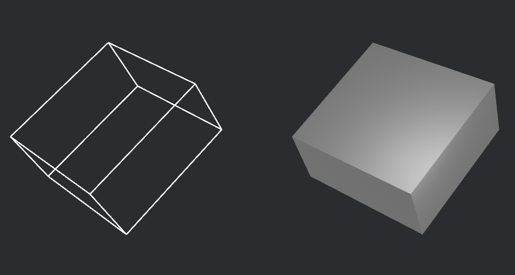
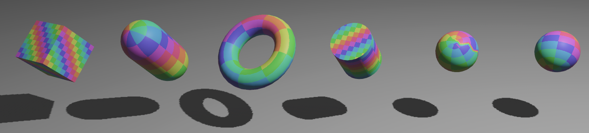
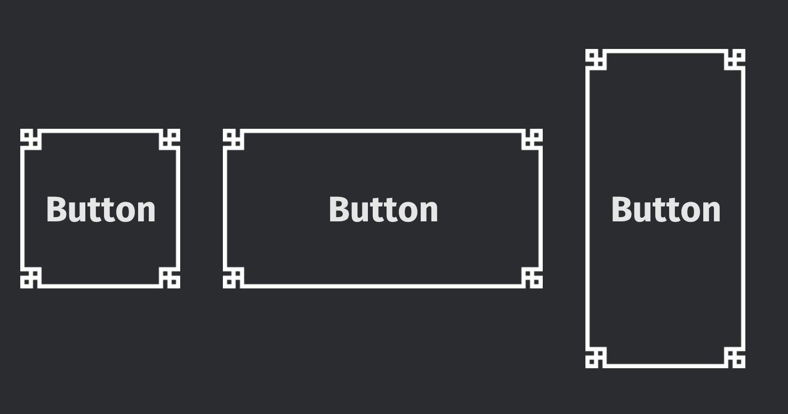

+++
title = "Bevy 0.13"
date = 2024-02-17
authors = ["Bevy Contributors"]
[extra]
image = "jarl.webp"
show_image = true
image_subtitle = "Gameplay from Jarl, an in-production fantasy colony builder made with Bevy"
image_subtitle_link = "https://www.jarl-game.com/"

+++

Thanks to **198** contributors, **672** pull requests, community reviewers, and our [**generous sponsors**](/community/donate), we're happy to announce the **Bevy 0.13** release on [crates.io](https://crates.io/crates/bevy)!

For those who don't know, Bevy is a refreshingly simple data-driven game engine built in Rust. You can check out our [Quick Start Guide](/learn/quick-start) to try it today. It's free and open source forever! You can grab the full [source code](https://github.com/bevyengine/bevy) on GitHub. Check out [Bevy Assets](https://bevyengine.org/assets) for a collection of community-developed plugins, games, and learning resources.
And to see what the engine has to offer hands-on, check out the entries in the [latest Bevy Jam](https://itch.io/jam/bevy-jam-4/entries), including the winner [That's a LOT of beeeeees](https://andrewb330.itch.io/thats-a-lot-of-beeeeees).

To update an existing Bevy App or Plugin to **Bevy 0.13**, check out our [0.12 to 0.13 Migration Guide](/learn/migration-guides/0-12-to-0-13/).

Since our last release a few months ago we've added a _ton_ of new features, bug fixes, and quality of life tweaks, but here are some of the highlights:

<!-- more -->

* **Lightmaps:** A fast, popular baked global illumination technique for static geometry (baked externally in programs like The Lightmapper).
* **Irradiance Volumes / Voxel Global Illumination:** A baked form of global illumination that samples light at the centers of voxels within a cuboid (baked externally in programs like Blender).
* **Approximate Indirect Specular Occlusion**: Improved lighting realism by reducing specular light leaking via specular occlusion.
* **Reflection Probes**: A baked form of axis aligned environment map that allows for realistic reflections for static geometry (baked externally in programs like Blender)
* **Primitive shapes:** Basic shapes are a core building block of both game engines and video games: we've added a polished, ready-to-use collection of them!
* **System stepping:** Completely pause and advance through your game frame-by-frame or system-by-system to interactively debug game logic, all while rendering continues to update.
* **Dynamic queries:** Refining queries from within systems is extremely expressive, and is the last big puzzle piece for runtime-defined types and third-party modding and scripting integration.
* **Automatically inferred command flush points:** Tired of reasoning about where to put `apply_deferred` and confused about why your commands weren't being applied? Us too! Now, Bevy's scheduler uses ordinary `.before` and `.after` constraints and inspects the system parameters to automatically infer (and deduplicate) synchronization points.
* **Slicing, tiling and nine-patch 2D images:** Ninepatch layout is a popular tool for smoothly scaling stylized tilesets and UIs. Now in Bevy!
* **Camera-Driven UI**: UI entity trees can now be selectively added to _any_ camera, rather than being globally applied to all cameras, enabling things like split screen UIs!
* **Camera Exposure**: Realistic / "real world" control over camera exposure via EV100, f-stops, shutter speed, and ISO sensitivity. Lights have also been adjusted to make their units more realistic.
* **Animation interpolation modes:** Bevy now supports non-linear interpolation modes in exported glTF animations.

## Initial Baked Lighting

Computing lighting in real time is expensive;
but for elements of a scene that never move (like rooms or terrain),
we can get prettier lighting and shadows for cheaper by computing it ahead of time using **global illumination**,
then storing the results in a "baked" form that never changes.
Global illumination is a more realistic (and expensive) approach to lighting that often uses ray tracing.
Unlike Bevy's default rendering, it takes light bouncing off of other objects into account,
producing more realistic effects through the inclusion of indirect light.

### Lightmaps

<div class="release-feature-authors">authors: @pcwalton</div>


**Lightmaps** are textures that store pre-computed global illumination results. They have been a mainstay of real-time graphics for decades. **Bevy 0.13** adds initial support for rendering lightmaps computed in other programs, such as [The Lightmapper]. Ultimately we would like to add support for baking lightmaps directly in Bevy, but this first step unlocks lightmap workflows!

Like the [lightmaps example] shows, just load in your baked lightmap image, and then insert a [`Lightmap`] component on the corresponding mesh.

[`Lightmap`]: https://docs.rs/bevy/0.13.0/bevy/pbr/struct.Lightmap.html
[lightmaps example]: https://github.com/bevyengine/bevy/blob/main/examples/3d/lightmaps.rs
[The Lightmapper]: https://github.com/Naxela/The_Lightmapper

### Irradiance Volumes / Voxel Global Illumination

<div class="release-feature-authors">authors: @pcwalton</div>


**Irradiance volumes** (or voxel global illumination) is a technique used for approximating indirect light by first dividing
a scene into cubes (voxels), then sampling the amount of light present at the center of each of those voxels.
This light is then added to objects within that space as they move through it, changing the ambient light level on those objects appropriately.

We've chosen to use the ambient cubes algorithm for this, based on Half Life 2.
This allows us to match Blender's [Eevee renderer], giving users a simple and free path to creating nice-looking irradiance volumes for their own scenes.

Notice how this sphere subtly picks up the colors of the environment as it moves around, thanks to irradiance volumes:

<video controls><source src="irradiance_volume.mp4" type="video/mp4"/></video>

For now, you need to use external tools such as Blender to bake irradiance volumes, but in the future we would like to support baking irradiance volumes directly in Bevy!

[Eevee renderer]: https://docs.blender.org/manual/en/latest/render/eevee/index.html

## Minimal Reflection Probes

<div class="release-feature-authors">authors: @pcwalton</div>

**Environment maps** are 2D textures used to simulate lighting, reflection, and skyboxes in a 3D scene.
**Reflection probes** generalize environment maps to allow for multiple environment maps in the same scene, each of which has its own axis-aligned bounding box.
This is a standard feature of physically-based renderers and was inspired by the [corresponding feature in Blender's Eevee renderer].

In the [reflection probes PR], we've added basic support for these, laying the groundwork for pretty, high-performance reflections in Bevy games.
Like with the baked global illumination work discussed above, these must currently be precomputed externally, then imported into Bevy.
As discussed in the PR, there are quite a few caveats: WebGL2 support is effectively non-existent, sharp and sudden transitions will be observed because there's no blending,
and all cubemaps in the world of a given type (diffuse or specular) must have the same size, format, and mipmap count.


[reflection probes PR]: https://github.com/bevyengine/bevy/pull/11366
[corresponding feature in Blender's Eevee renderer]: https://docs.blender.org/manual/en/latest/render/eevee/light_probes/reflection_cubemaps.html

## Approximate Indirect Specular Occlusion

<div class="release-feature-authors">authors: @aevyrie</div>

Bevy's current PBR renderer over-brightens the image, especially at grazing angles where the fresnel
effect tends to make surfaces behave like mirrors. This over-brightening happens because the
surfaces must reflect _something_, but without path traced or screen-space reflections, the renderer
has to guess _what_ is being reflected. The best guess it can make is to sample the environment cube
map, even if light would've hit something else before reaching the environment light. This artifact,
where light occlusion is ignored, is called specular light leaking.

Consider a car tire; though the rubber might be shiny, you wouldn't expect it to have bright
specular highlights inside a wheel well, because the car itself is blocking (occluding) the light
that would otherwise cause these reflections. Fully checking for occlusion can be computationally
expensive.

**Bevy 0.13** adds support for **Approximate Indirect Specular Occlusion**, which uses our existing [Screen Space Ambient Occlusion](/news/bevy-0-11/#screen-space-ambient-occlusion) to _approximate_ specular occlusion, which can run efficiently in real time while still producing reasonably high quality results:

{{ compare_slider(
    left_title="Specular Occlusion On",
    left_image="specular_occlusion_on.jpg",
    right_title="Specular Occlusion Off",
    right_image="specular_occlusion_off.jpg"
) }}

<div style="font-size: 1.0rem" class="release-feature-authors">Model Credits: <a href="https://sketchfab.com/3d-models/bmw-r1200gs-motorcycle-6550451b0ae547039585a44286b2f530">BMW R1200GS Motorcycle</a> by Moto3D is licensed under <a href="http://creativecommons.org/licenses/by/4.0/">CC-BY-4.0</a>.
</div>

In the future, this could be further improved with screen space reflections (SSR).
However, conventional wisdom is that you should use specular occlusion alongside SSR, because SSR still suffers from light leaking artifacts.

## Primitive Shapes

<div class="release-feature-authors">authors: @Jondolf, @NiseVoid, @aevyrie</div>

Geometric shapes are used all across game development, from primitive mesh shapes and debug gizmos to physics colliders and raycasting. Despite being so commonly used across several domains, Bevy hasn't really had any general-purpose shape representations.

This is changing in **Bevy 0.13** with the introduction of first-party **primitive shapes**! They are lightweight geometric primitives designed for maximal interoperability and reusability, allowing Bevy and third-party plugins to use the same set of basic shapes and increase cohesion within the ecosystem. See the original [RFC][Primitive RFC] for more details.

The built-in [collection of primitives] is already quite sizeable:

| 2D                                  | 3D                                  |
| ----------------------------------- | ----------------------------------- |
| [`Rectangle`]                       | [`Cuboid`]                          |
| [`Circle`]                          | [`Sphere`]                          |
| [`Ellipse`]                         |                                     |
| [`Triangle2d`]                      |                                     |
| [`Plane2d`]                         | [`Plane3d`]                         |
| [`Line2d`]                          | [`Line3d`]                          |
| [`Segment2d`]                       | [`Segment3d`]                       |
| [`Polyline2d`], [`BoxedPolyline2d`] | [`Polyline3d`], [`BoxedPolyline3d`] |
| [`Polygon`], [`BoxedPolygon`]       |                                     |
| [`RegularPolygon`]                  |                                     |
| [`Capsule2d`]                       | [`Capsule3d`]                       |
|                                     | [`Cylinder`]                        |
|                                     | [`Cone`]                            |
|                                     | [`ConicalFrustum`]                  |
|                                     | [`Torus`]                           |

[More primitives] will be added in future releases.

Some use cases for primitive shapes include meshing, gizmos, bounding volumes, colliders, and ray casting functionality. Several of these have landed in 0.13 already!

[Primitive RFC]: https://github.com/bevyengine/rfcs/blob/main/rfcs/12-primitive-shapes.md
[collection of primitives]: https://docs.rs/bevy/0.13.0/bevy/math/primitives/index.html
[`Rectangle`]: https://docs.rs/bevy/0.13.0/bevy/prelude/struct.Rectangle.html
[`Cuboid`]: https://docs.rs/bevy/0.13.0/bevy/prelude/struct.Cuboid.html
[`Circle`]: https://docs.rs/bevy/0.13.0/bevy/prelude/struct.Circle.html
[`Sphere`]: https://docs.rs/bevy/0.13.0/bevy/prelude/struct.Sphere.html
[`Ellipse`]: https://docs.rs/bevy/0.13.0/bevy/prelude/struct.Ellipse.html
[`Triangle2d`]: https://docs.rs/bevy/0.13.0/bevy/prelude/struct.Triangle2d.html
[`Plane2d`]: https://docs.rs/bevy/0.13.0/bevy/prelude/struct.Plane2d.html
[`Plane3d`]: https://docs.rs/bevy/0.13.0/bevy/prelude/struct.Plane3d.html
[`Line2d`]: https://docs.rs/bevy/0.13.0/bevy/prelude/struct.Line2d.html
[`Line3d`]: https://docs.rs/bevy/0.13.0/bevy/prelude/struct.Line3d.html
[`Segment2d`]: https://docs.rs/bevy/0.13.0/bevy/prelude/struct.Segment2d.html
[`Segment3d`]: https://docs.rs/bevy/0.13.0/bevy/prelude/struct.Segment3d.html
[`Polyline2d`]: https://docs.rs/bevy/0.13.0/bevy/prelude/struct.Polyline2d.html
[`Polyline3d`]: https://docs.rs/bevy/0.13.0/bevy/prelude/struct.Polyline3d.html
[`BoxedPolyline2d`]: https://docs.rs/bevy/0.13.0/bevy/prelude/struct.BoxedPolyline2d.html
[`BoxedPolyline3d`]: https://docs.rs/bevy/0.13.0/bevy/prelude/struct.BoxedPolyline3d.html
[`Polygon`]: https://docs.rs/bevy/0.13.0/bevy/prelude/struct.Polygon.html
[`BoxedPolygon`]: https://docs.rs/bevy/0.13.0/bevy/prelude/struct.BoxedPolygon.html
[`RegularPolygon`]: https://docs.rs/bevy/0.13.0/bevy/prelude/struct.RegularPolygon.html
[`Capsule2d`]: https://docs.rs/bevy/0.13.0/bevy/prelude/struct.Capsule2d.html
[`Capsule3d`]: https://docs.rs/bevy/0.13.0/bevy/prelude/struct.Capsule3d.html
[`Cylinder`]: https://docs.rs/bevy/0.13.0/bevy/prelude/struct.Cylinder.html
[`Cone`]: https://docs.rs/bevy/0.13.0/bevy/prelude/struct.Cone.html
[`ConicalFrustum`]: https://docs.rs/bevy/0.13.0/bevy/prelude/struct.ConicalFrustum.html
[`Torus`]: https://docs.rs/bevy/0.13.0/bevy/prelude/struct.Torus.html
[More primitives]: https://github.com/bevyengine/bevy/issues/10572

### Rendering

Primitive shapes can be rendered using both meshes and gizmos. In this section, we'll take a closer look at the new APIs.

Below, you can see a cuboid and a torus rendered using meshes and gizmos. You can check out all primitives that can be rendered in the new [Rendering Primitives] example.




[Rendering Primitives]: https://bevyengine.org/examples/Math/render-primitives

#### Meshing

<div class="release-feature-authors">authors: @Jondolf</div>

Previous versions of Bevy have had types like [`Quad`], [`Box`], and [`UVSphere`] for creating meshes from basic shapes. These have been deprecated in favor of a builder-like API using the new geometric primitives.

Primitives that support meshing implement the [`Meshable`] trait. For some shapes, the [`mesh`][`mesh` method] method returns a [`Mesh`] directly:

```rust
let before = Mesh::from(Quad::new(Vec2::new(2.0, 1.0)));
let after = Rectangle::new(2.0, 1.0).mesh(); // Mesh::from also works
```

For most primitives however, it returns a builder for optional configuration:

```rust
// Create a circle mesh with a specified vertex count
let before = Mesh::from(Circle {
    radius: 1.0,
    vertices: 64,
});
let after = Circle::new(1.0).mesh().resolution(64).build();
```

Below are a few more examples of meshing with the new primitives.

```rust
// Icosphere
let before = meshes.add(
    Mesh::try_from(Icosphere {
        radius: 2.0,
        subdivisions: 8,
    })
    .unwrap()
);
let after = meshes.add(Sphere::new(2.0).mesh().ico(8).unwrap());

// Cuboid
// (notice how Assets::add now also handles mesh conversion automatically)
let before = meshes.add(Mesh::from(shape::Box::new(2.0, 1.0, 1.0)));
let after = meshes.add(Cuboid::new(2.0, 1.0, 1.0));

// Plane
let before = meshes.add(Mesh::from(Plane::from_size(5.0)));
let after = meshes.add(Plane3d::default().mesh().size(5.0, 5.0));
```

With the addition of the primitives, meshing is also supported for more shapes, like [`Ellipse`], [`Triangle2d`], and [`Capsule2d`]. However, note that meshing is not yet implemented for all primitives, such as [`Polygon`] and [`Cone`].

Below you can see some meshes in the [`2d_shapes`] and [`3d_shapes`] examples.




Some default values for mesh shape dimensions have also been changed to be more consistent.

[`Quad`]: https://docs.rs/bevy/0.13.0/bevy/prelude/shape/struct.Quad.html
[`Box`]: https://docs.rs/bevy/0.13.0/bevy/prelude/shape/struct.Box.html
[`UVSphere`]: https://docs.rs/bevy/0.13.0/bevy/prelude/shape/struct.UVSphere.html
[`Meshable`]: https://docs.rs/bevy/0.13.0/bevy/prelude/trait.Meshable.html
[`mesh` method]: https://docs.rs/bevy/0.13.0/bevy/prelude/trait.Meshable.html#tymethod.mesh
[`Mesh`]: https://docs.rs/bevy/0.13.0/bevy/prelude/struct.Mesh.html
[`2d_shapes`]: https://bevyengine.org/examples/2D%20Rendering/2d-shapes/
[`3d_shapes`]: https://bevyengine.org/examples/3D%20Rendering/3d-shapes/

#### Gizmos

<div class="release-feature-authors">authors: @RobWalt</div>

Primitives can also be rendered with [`Gizmos`]. There are two new generic methods:

* [`gizmos.primitive_2d(primitive, position, angle, color)`][`primitive_2d`]
* [`gizmos.primitive_3d(primitive, position, rotation, color)`][`primitive_3d`]

Some primitives can have additional configuration options similar to existing [`Gizmos`] drawing methods.
For example, calling [`primitive_3d`] with a [`Sphere`] returns a [`SphereBuilder`], which offers a `segments` method
to control the level of detail of the sphere.

```rust
let sphere = Sphere { radius };
gizmos
    .primitive_3d(sphere, center, rotation, color)
    .segments(segments);
```

[`Gizmos`]: https://docs.rs/bevy/0.13.0/bevy/gizmos/prelude/struct.Gizmos.html
[`primitive_2d`]: https://docs.rs/bevy/0.13.0/bevy/gizmos/prelude/trait.GizmoPrimitive2d.html
[`primitive_3d`]: https://docs.rs/bevy/0.13.0/bevy/gizmos/prelude/trait.GizmoPrimitive2d.html
[`SphereBuilder`]: https://docs.rs/bevy/0.13.0/bevy/gizmos/primitives/dim3/struct.SphereBuilder.html

### Bounding Volumes

<div class="release-feature-authors">authors: @NiseVoid, @Jondolf</div>

In game development, spatial checks have several valuable use cases, such as getting all entities that are in the camera's view frustum or near the player, or finding pairs of physics objects that might be intersecting. To speed up such checks, bounding volumes are used to approximate more complex shapes.

**Bevy 0.13** adds some new publicly available bounding volumes: [`Aabb2d`], [`Aabb3d`], [`BoundingCircle`], and [`BoundingSphere`]. These can be created manually, or generated from primitive shapes.

Each bounding volume implements the [`BoundingVolume`] trait, providing some general functionality and helpers. The [`IntersectsVolume`] trait can be used to test for intersections with these volumes. This trait is implemented for bounding volumes themselves, so you can test for intersections between them. This is supported between all existing bounding volume types, but only those in the same dimension.

Here is an example of how bounding volumes are constructed, and how an intersection test is performed:

```rust
// We create an axis-aligned bounding box that is centered at position
let position = Vec2::new(100., 50.);
let half_size = Vec2::splat(20.);
let aabb = Aabb2d::new(position, half_size);

// We create a bounding circle that is centered at position
let position = Vec2::new(80., 70.);
let radius = 30.;
let bounding_circle = BoundingCircle::new(position, radius);

// We check if the volumes are intersecting
let intersects = bounding_circle.intersects(&aabb);
```

There are also two traits for the generation of bounding volumes: [`Bounded2d`] and [`Bounded3d`]. These are implemented for the new primitive shapes, so you can easily compute bounding volumes for them:

```rust
// We create a primitive, a hexagon in this case
let hexagon = RegularPolygon::new(50., 6);

let translation = Vec2::new(50., 200.);
let rotation = PI / 2.; // Rotation in radians

// Now we can get an Aabb2d or BoundingCircle from this primitive.
// These methods are part of the Bounded2d trait.
let aabb = hexagon.aabb_2d(translation, rotation);
let circle = hexagon.bounding_circle(translation, rotation);
```

[`Aabb2d`]: https://docs.rs/bevy/0.13.0/bevy/math/bounding/struct.Aabb2d.html
[`Aabb3d`]: https://docs.rs/bevy/0.13.0/bevy/math/bounding/struct.Aabb3d.html
[`BoundingCircle`]: https://docs.rs/bevy/0.13.0/bevy/math/bounding/struct.BoundingCircle.html
[`BoundingSphere`]: https://docs.rs/bevy/0.13.0/bevy/math/bounding/struct.BoundingSphere.html
[`BoundingVolume`]: https://docs.rs/bevy/0.13.0/bevy/math/bounding/trait.BoundingVolume.html
[`IntersectsVolume`]: https://docs.rs/bevy/0.13.0/bevy/math/bounding/trait.IntersectsVolume.html
[`Bounded2d`]: https://docs.rs/bevy/0.13.0/bevy/math/bounding/trait.Bounded2d.html
[`Bounded3d`]: https://docs.rs/bevy/0.13.0/bevy/math/bounding/trait.Bounded3d.html

#### Ray Casting and Volume Casting

The bounding volumes also support basic ray casting and volume casting. Ray casting tests if a bounding volume intersects with a given ray, cast from an origin in a direction, until a maximum distance. Volume casts work similarly, but function as if moving a volume along the ray.

This functionality is provided through the new [`RayCast2d`], [`RayCast3d`], [`AabbCast2d`], [`AabbCast3d`], [`BoundingCircleCast`], and [`BoundingSphereCast`] types. They can be used to check for intersections against bounding volumes, and to compute the distance from the origin of the cast to the point of intersection.

Below, you can see ray casting, volume casting, and intersection tests in action:

<video controls><source src="bounding_intersections.mp4" type="video/mp4"/></video>

To make it easier to reason about ray casts in different dimensions, the old [`Ray`] type has also been split into [`Ray2d`] and [`Ray3d`]. The new [`Direction2d`] and [`Direction3d`] types are used to ensure that the ray direction remains normalized, providing a type-level guarantee that the vector is always unit-length. These are already in use in some other APIs as well, such as for some primitives and gizmo methods.

[`RayCast2d`]: https://docs.rs/bevy/0.13.0/bevy/math/bounding/struct.RayCast2d.html
[`RayCast3d`]: https://docs.rs/bevy/0.13.0/bevy/math/bounding/struct.RayCast3d.html
[`AabbCast2d`]: https://docs.rs/bevy/0.13.0/bevy/math/bounding/struct.AabbCast2d.html
[`AabbCast3d`]: https://docs.rs/bevy/0.13.0/bevy/math/bounding/struct.AabbCast3d.html
[`BoundingCircleCast`]: https://docs.rs/bevy/0.13.0/bevy/math/bounding/struct.BoundingCircleCast.html
[`BoundingSphereCast`]: https://docs.rs/bevy/0.13.0/bevy/math/bounding/struct.BoundingSphereCast.html
[`Ray`]: https://docs.rs/bevy/0.12.1/bevy/math/struct.Ray.html
[`Ray2d`]: https://docs.rs/bevy/0.13.0/bevy/math/struct.Ray2d.html
[`Ray3d`]: https://docs.rs/bevy/0.13.0/bevy/math/struct.Ray3d.html
[`Direction2d`]: https://docs.rs/bevy/0.13.0/bevy/math/primitives/struct.Direction2d.html
[`Direction3d`]: https://docs.rs/bevy/0.13.0/bevy/math/primitives/struct.Direction3d.html

## System Stepping

<div class="release-feature-authors">authors: @dmlary</div>

**Bevy 0.13** adds support for **System Stepping**, which adds debugger-style
execution control for systems.

The [`Stepping`] resource controls which
systems within a schedule execute each frame, and provides step, break, and
continue functionality to enable live debugging.

```rust
let mut stepping = Stepping::new();
```

You add the schedules you want to step through to the [`Stepping`] resource. The systems in these schedules can be thought of as the "stepping frame". Systems in the "stepping frame" won't run unless a relevant step or continue action occurs. Schedules that are not added will run on every update, even while stepping. This enables core functionality like rendering to continue working.

```rust
stepping.add_schedule(Update);
stepping.add_schedule(FixedUpdate);
```

Stepping is disabled by default, even when the resource is inserted. To enable it in apps, feature flags, dev consoles and obscure hotkeys all work great.

```rust
#[cfg(feature = "my_stepping_flag")]
stepping.enable();
```

Finally, you add the [`Stepping`] resource to the ECS [`World`].

```rust
app.insert_resource(stepping);
```

[`World`]: https://docs.rs/bevy/0.13.0/bevy/ecs/world/struct.World.html

### System Step & Continue Frame

The "step frame" action runs the system at the stepping
cursor, and advances the cursor during the next render frame.
This is useful to see individual changes made by
systems, and see the state of the world prior to executing a system

```rust
stepping.step_frame()
```

The "continue frame" action will execute systems starting
from the stepping cursor to the end of the stepping frame during the next frame.
It may stop before the end of the stepping frame if it encounters a system with
a breakpoint. This is useful for advancing quickly through an entire frame,
getting to the start of the next frame, or in combination with breakpoints.

```rust
stepping.continue_frame()
```

This video demonstrates these actions on the breakout
example with a custom `egui` interface.  The stepping cursor can be seen moving through
the systems list as we click the `step` button.  When the `continue` button is
clicked, you can see the game progress one stepping frame for each click.

<video controls><source src="stepping-step-continue.mp4" type="video/mp4"/></video>

### Breakpoints

When a schedule grows to a certain point, it can take a long time to step
through every system in the schedule just to see the effects of a few systems.
In this case, stepping provides system breakpoints.

This video illustrates how a breakpoint on `check_for_collisions()` behaves with "step" and "continue" actions:

<video controls><source src="stepping-breakpoint.mp4" type="video/mp4"/></video>

### Disabling Systems During Stepping

During debugging, it can be helpful to disable systems to narrow down the
source of the problem. `Stepping::never_run()` and `Stepping::never_run_node()`
can be used to disable systems while stepping is enabled.

### Excluding Systems from Stepping

It may be necessary to ensure some systems still run while stepping is enabled.
While best-practice is to have them in a schedule that has not been added to
the `Stepping` resource, it is possible to configure systems to always run
while stepping is enabled. This is primarily useful for event & input handling
systems.

Systems can be configured to always run by calling
`Stepping::always_run()`, or `Stepping::always_run_node()`.
When a system is configured to always run, it will run each rendering frame
even when stepping is enabled.

### Limitations

There are some limitations in this initial implementation of stepping:

* **Systems that reads events likely will not step properly**: Because frames still advance normally while stepping is enabled, events can be cleared before a stepped system can read them. The best approach here is to configure event-based systems to always run, or put them in a schedule not added to `Stepping`. "Continue" with breakpoints may also work in this scenario.
* **Conditional systems may not run as expected when stepping**: Similar to event-based systems, if the run condition is true for only a short time, system may not run when stepped.

### Detailed Examples

* [Text-based stepping example](https://github.com/bevyengine/bevy/blob/main/examples/ecs/system_stepping.rs)
* Non-interactive [bevy UI example stepping plugin](https://github.com/bevyengine/bevy/blob/main/examples/games/stepping.rs) used in the breakout example
* Interactive [egui stepping plugin](https://gist.github.com/dmlary/3fd57ebf1f88bb9afa8a6604737dac97) used in demo videos

[`Stepping`]: https://docs.rs/bevy/0.13.0/bevy/ecs/schedule/stepping/Stepping.html

## Camera Exposure

<div class="release-feature-authors">authors: @superdump (Rob Swain), @JMS55, @cart</div>

In the real world, the brightness of an image captured by a camera is determined by its exposure: the amount of light that the camera's sensor or film incorporates. This is controlled by several mechanics of the camera:

* **Aperture**: Measured in F-Stops, the aperture opens and closes to control how much light is allowed into the camera's sensor or film by physically blocking off lights from specific angles, similar to the pupil of an eye.
* **Shutter Speed**: How long the camera's shutter is open, which is the duration of time that the camera's sensor or film is exposed to light.
* **ISO Sensitivity**: How sensitive the camera's sensor or film is to light. A higher value indicates a higher sensitivity to light.

Each of these plays a role in how much light the final image receives. They can be combined into a final EV number (exposure value), such as the semi-standard EV100 (the exposure value for ISO 100). Higher EV100 numbers mean that more light is required to get the same result. For example, a sunny day scene might require an EV100 of about 15, whereas a dimly lit indoor scene might require an EV100 of about 7.

In **Bevy 0.13**, you can now configure the EV100 on a per-camera basis using the new [`Exposure`] component. You can set it directly using the [`Exposure::ev100`] field, or you can use the new [`PhysicalCameraParameters`] struct to calculate an ev100 using "real world" camera settings like f-stops, shutter speed, and ISO sensitivity.

This is important because Bevy's "physically based" renderer (PBR) is intentionally grounded in reality. Our goal is for people to be able to use real-world units in their lights and materials and have them behave as close to reality as possible.

{{ compare_slider(
    left_title="EV100 9.7",
    left_image="exposure_97.jpg",
    right_title="EV100 15",
    right_image="exposure_15.jpg"
) }}

Note that prior versions of Bevy hard-coded a static EV100 for some of its light types. In **Bevy 0.13** it is configurable _and_ consistent across all light types. We have also bumped the default EV100 to 9.7, which is a [number we chose to best match Blender's default exposure](https://github.com/bevyengine/bevy/issues/11577#issuecomment-1942873507). It also happens to be a nice "middle ground" value that sits somewhere between indoor lighting and overcast outdoor lighting.

You may notice that point lights now require _significantly_ higher intensity values (in lumens). This (sometimes) million-lumen values might feel exorbitant. Just reassure yourself that (1) it actually requires a lot of light to meaningfully register in an overcast outdoor environment and (2) Blender exports lights on these scales (and we are calibrated to be as close as possible to them).

[`PhysicalCameraParameters`]: https://docs.rs/bevy/0.13.0/bevy/render/camera/struct.PhysicalCameraParameters.html
[`Exposure`]: https://docs.rs/bevy/0.13.0/bevy/render/camera/struct.Exposure.html
[`Exposure::ev100`]: https://docs.rs/bevy/0.13.0/bevy/render/camera/struct.Exposure.html#structfield.ev100

## Camera-Driven UI

<div class="release-feature-authors">authors: @bardt, @oceantume</div>

Historically, Bevy's UI elements have been scaled and positioned in the context of the primary window, regardless of the camera settings. This approach made some UI experiences like split-screen multiplayer difficult to implement, and others such as having UI in multiple windows impossible.

**Bevy 0.13** introduces **Camera-Driven UI**. Each camera can now have its own UI root, rendering according to its viewport, scale factor, and a target which can be a secondary window or even a texture.

This change unlocks a variety of new UI experiences, including split-screen multiplayer, UI in multiple windows, displaying non-interactive UI in a 3D world, and more.


If there is one camera in the world, you don't need to do anything; your UI will be displayed in that camera's viewport.

```rust
commands.spawn(Camera3dBundle {
    // Camera can have custom viewport, target, etc.
});
commands.spawn(NodeBundle {
    // UI will be rendered to the singular camera's viewport
});
```

When more control is desirable, or there are multiple cameras, we introduce the [`TargetCamera`] component. This component can be added to a root UI node to specify which camera it should be rendered to.

```rust
// For split-screen multiplayer, we set up 2 cameras and 2 UI roots
let left_camera = commands.spawn(Camera3dBundle {
    // Viewport is set to left half of the screen
}).id();

commands
    .spawn((
        TargetCamera(left_camera),
        NodeBundle {
            //...
        }
    ));

let right_camera = commands.spawn(Camera3dBundle {
    // Viewport is set to right half of the screen
}).id();

commands
    .spawn((
        TargetCamera(right_camera),
        NodeBundle {
            //...
        })
    );
```

With this change, we also removed the [`UiCameraConfig`] component. If you were using it to hide UI nodes, you can achieve the same outcome by configuring a [`Visibility`] component on the root node.

```rust
commands.spawn(Camera3dBundle::default());
commands.spawn(NodeBundle {
    visibility: Visibility::Hidden, // UI will be hidden
    // ...
});
```

[`TargetCamera`]: https://docs.rs/bevy/0.13.0/bevy/ui/struct.TargetCamera.html
[`Visibility`]: https://docs.rs/bevy/0.13.0/bevy/render/view/enum.Visibility.html
[`UiCameraConfig`]: https://docs.rs/bevy/0.12.1/bevy/ui/camera_config/struct.UiCameraConfig.html

## Texture Slicing and Tiling

<div class="release-feature-authors">authors: @ManevilleF</div>

3D rendering gets a lot of love, but 2D features matter too!
We're pleased to add CPU-based _slicing and tiling_ to both `bevy_sprite` and `bevy_ui` in **Bevy 0.13**!

This behavior is controlled by a new optional component: [`ImageScaleMode`].

[`ImageScaleMode`]: https://docs.rs/bevy/0.13.0/bevy/prelude/enum.ImageScaleMode.html

### 9 slicing

Adding `ImageScaleMode::Sliced` to an entity with a sprite or UI bundle enables [9 slicing](https://en.wikipedia.org/wiki/9-slice_scaling),
keeping the image proportions during resizes, avoiding stretching of the texture.


This is very useful for UI, allowing your pretty textures to look right even as the size of your element changes.



<div style="font-size: 1.0rem;" class="release-feature-authors">
Border texture by <a href="https://kenney.nl/assets/fantasy-ui-borders">Kenney</a>
</div>

```rust
commands.spawn((
    SpriteSheetBundle::default(),
    ImageScaleMode::Sliced(TextureSlicer {
        // The image borders are 20 pixels in every direction
        border: BorderRect::square(20.0),
        // we don't stretch the corners more than their actual size (20px)
        max_corner_scale: 1.0,
        ..default()
    }),
));
```

### Tiling

Adding `ImageMode::Tiled { .. }` to your 2D sprite entities enables _texture tiling_: repeating the image until their entire area is filled.
This is commonly used for backgrounds and surfaces.

<video controls><source src="logo_tiling.mp4" type="video/mp4"/></video>

```rust
commands.spawn((
    SpriteSheetBundle::default(),
    ImageScaleMode::Tiled {
        // The image will repeat horizontally
        tile_x: true,
        // The image will repeat vertically
        tile_y: true,
        // The texture will repeat if the drawing rect is larger than the image size
        stretch_value: 1.0,
    },
));
```

## Dynamic Queries

<div class="release-feature-authors">authors: @james-j-obrien, @jakobhellermann, @Suficio</div>

In Bevy ECS, queries use a type-powered DSL. The full type of the query (what component to access, which filter to use) must be specified at compile time.

Sometimes we can't know what data the query wants to access at compile time. Some scenarios just cannot be done with static queries:

* Defining queries in scripting languages like Lua or JavaScript.
* Defining new components from a scripting language and query them.
* Adding a runtime filter to entity inspectors like [`bevy-inspector-egui`].
* Adding a [Quake-style console] to modify or query components from a prompt at runtime.
* Creating an [editor with remote capabilities].

Dynamic queries make these all possible. And these are only the plans we've heard about so far!

The standard way of defining a [`Query`] is by using them as system parameters:

```rust
fn take_damage(mut player_health: Query<(Entity, &mut Health), With<Player>>) {
    // ...
}
```

**This won't change.** And for most (if not all) gameplay use cases, you will
continue to happily use the delightfully simple [`Query`] API.

However, consider this situation: as a game or mod developer I want to list entities
with a specific component through a text prompt. Similar to how the Quake console works.
What would that look like?

```rust
#[derive(Resource)]
struct UserQuery(String);

// user_query is entered as a text prompt by the user when the game is running.
// In a system, it's quickly apparent that we can't use `Query`.
fn list_entities_system(user_query: Res<UserQuery>, query: Query<FIXME, With<FIXME>>) {}

// Even when using the more advanced `World` API, we are stuck.
fn list_entities(user_query: String, world: &mut World) {
    // FIXME: what type goes here?
    let query = world.query::<FIXME>();
}
```

It's impossible to choose a type based on the value of `user_query`!
[`QueryBuilder`] solves this problem.

```rust
fn list_entities(
    user_query: String,
    type_registry: &TypeRegistry,
    world: &mut World,
) -> Option<()> {
    let name = user_query.split(' ').next()?;
    let type_id = type_registry.get_with_short_type_path(name)?.type_id();
    let component_id = world.components().get_id(type_id)?;

    let query = QueryBuilder::<FilteredEntityRef>::new(&mut world)
        .ref_id(component_id)
        .build();

    for entity_ref in query.iter(world) {
        let ptr = entity_ref.get_by_id(component_id);
        // Convert `ptr` into a `&dyn Reflect` and use it.
    }
    Some(())
}
```

It is still an error-prone, complex, and unsafe API, but it makes something that was previously
impossible possible.
We expect third-party crates to provide convenient wrappers around the `QueryBuilder` API,
some of which will undoubtedly make their way upstream.

[`bevy-inspector-egui`]: https://crates.io/crates/bevy-inspector-egui
[Quake-style console]: https://github.com/doonv/bevy_dev_console
[editor with remote capabilities]: https://makeshift-bevy-web-editor.vercel.app/
[`QueryBuilder`]: https://docs.rs/bevy/0.13.0/bevy/ecs/prelude/struct.QueryBuilder.html

## Query Transmutation

<div class="release-feature-authors">authors: @hymm, james-j-obrien</div>

Have you ever wanted to pass a query to a function, but instead of having a
`Query<&Transform>` you have a `Query<(&Transform, &Velocity), With<Enemy>>`?
In **Bevy 0.13** you can, thanks to the new [`QueryLens`] and [`Query::transmute_lens()`] method.

Query transmutes
allow you to change a query into different query types as long as the
components accessed are a subset of the original query. If you do try to access
data that is not in the original query, this method will panic.

```rust
fn reusable_function(lens: &mut QueryLens<&Transform>) {
    let query = lens.query();
    // do something with the query...
}

// We can use the function in a system that takes the exact query.
fn system_1(mut query: Query<&Transform>) {
    reusable_function(&mut query.as_query_lens());
}

// We can also use it with a query that does not match exactly
// by transmuting it.
fn system_2(mut query: Query<(&mut Transform, &Velocity), With<Enemy>>) {
    let mut lens = query.transmute_lens::<&Transform>();
    reusable_function(&mut lens);
}
```

Note that the [`QueryLens`] will still iterate over the same entities as the
original [`Query`] it is derived from. A `QueryLens<&Transform>` taken from
a `Query<(&Transform, &Velocity)>`, will only include the `Transform` of
entities with both `Transform` and `Velocity` components.

Besides removing parameters you can also change them in limited ways to the
different smart pointer types. One of the more useful is to change a
`&mut` to a `&`. See the [documentation](https://docs.rs/bevy/latest/bevy/ecs/system/struct.Query.html#method.transmute_lens)
for more details.

One thing to take into consideration is the transmutation is not free.
It works by creating a new state and copying cached data
inside the original query. It's not an expensive operation, but you should
avoid doing it inside a hot loop.

[`Query::transmute_lens()`]: https://docs.rs/bevy/0.13.0/bevy/ecs/system/struct.Query.html#method.transmute_lens
[`QueryLens`]: https://docs.rs/bevy/0.13.0/bevy/ecs/system/struct.QueryLens.html

## `WorldQuery` Trait Split

<div class="release-feature-authors">authors: @wainwrightmark @taizu-jin</div>

A [`Query`] has two type parameters: one for the data to be fetched, and a second optional one for the filters.

In previous versions of Bevy both parameters simply required [`WorldQuery`]: there was nothing stopping you from using types intended as filters in the data position (or vice versa).

Apart from making the type signature of the [`Query`] items more complicated (see example below) this usually worked fine as most filters had the same behavior in either position.

Unfortunately this was not the case for [`Changed`] and [`Added`] which had different (and undocumented) behavior in the data position and this could lead to bugs in user code.

To allow us to prevent this type of bug at compile time, the [`WorldQuery`] trait has been replaced by two traits: [`QueryData`] and [`QueryFilter`]. The data parameter of a [`Query`] must now be [`QueryData`] and the filter parameter must be [`QueryFilter`].

Most user code should be unaffected or easy to migrate.

```rust
// Probably a subtle bug: `With` filter in the data position - will not compile in 0.13
fn my_system(query: Query<(Entity, With<ComponentA>)>)
{
    // The type signature of the query items is `(Entity, ())`, which is usable but unwieldy
  for (entity, _) in query.iter(){
  }
}

// Idiomatic, compiles in both 0.12 and 0.13
fn my_system(query: Query<Entity, With<ComponentA>>)
{
  for entity in query.iter(){
  }
}
```

[`Query`]: https://docs.rs/bevy/0.13.0/bevy/ecs/system/struct.Query.html
[`WorldQuery`]: https://docs.rs/bevy/0.12.0/bevy/ecs/query/trait.WorldQuery.html
[`Changed`]: https://docs.rs/bevy/0.13.0/bevy/ecs/query/struct.Changed.html
[`Added`]: https://docs.rs/bevy/0.13.0/bevy/ecs/query/struct.Added.html
[`QueryData`]: https://docs.rs/bevy/0.13.0/bevy/ecs/query/trait.QueryData.html
[`QueryFilter`]: https://docs.rs/bevy/0.13.0/bevy/ecs/query/trait.QueryFilter.html

## Automatically Insert `apply_deferred` Systems

<div class="release-feature-authors">authors: @hymm</div>

When writing gameplay code, you might commonly have one system that wants to
immediately see the effects of commands queued in another system.
Before **Bevy 0.13**, you would have to manually insert an `apply_deferred` system between the two,
a special system which causes those commands to be applied when encountered.
Bevy now detects when a system with commands
is ordered relative to other systems and inserts the `apply_deferred` for you.

```rust
// Before 0.13
app.add_systems(
    Update,
    (
        system_with_commands,
        apply_deferred,
        another_system,
    ).chain()
);
```

```rust
// After 0.13
app.add_systems(
    Update,
    (
        system_with_commands,
        another_system,
    ).chain()
);
```

This resolves a common beginner footgun: if two systems are ordered, shouldn't the second always see the results of the first?

Automatically inserted `apply_deferred` systems are optimized by automatically merging them if
possible. In most cases, it is recommended to remove all manually inserted
`apply_deferred` systems, as allowing Bevy to insert and merge these systems as needed will
usually be both faster and involve less boilerplate.

```rust
// This will only add one apply_deferred system.
app.add_systems(
    Update,
    (
        (system_1_with_commands, system_2).chain(),
        (system_3_with_commands, system_4).chain(),
    )
);
```

If this new behavior does not work for you, please consult the migration guide.
There are several new APIs that allow you to opt-out.

## More Flexible One-Shot Systems

<div class="release-feature-authors">authors: @Nathan-Fenner</div>

In **Bevy 0.12**, we introduced [one-shot systems](https://bevyengine.org/news/bevy-0-12/#one-shot-systems), a handy way to call systems on demand without having to add them to a schedule.
The initial implementation had some limitations in regard to what systems could and could not be used as one-shot systems.
In **Bevy 0.13**, these limitations have been resolved.

One-shot systems now support inputs and outputs.

```rust
fn increment_sys(In(increment_by): In<i32>, mut counter: ResMut<Counter>) -> i32 {
    counter.0 += increment_by;
    counter.0
}

let mut world = World::new();
let id = world.register_system(increment_sys);

world.insert_resource(Counter(1));
let count_one = world.run_system_with_input(id, 5).unwrap(); // increment counter by 5 and return 6
let count_two = world.run_system_with_input(id, 2).unwrap(); // increment counter by 2 and return 8
```

Running a system now returns the system output as `Ok(output)`. Note that output cannot be returned when calling one-shot systems through commands, because of their deferred nature.

Exclusive systems can now be registered as one-shot systems:

```rust
world.register_system(|world: &mut World| { /* do anything */ });
```

Boxed systems can now be registered with `register_boxed_system`.

These improvements round out one-shot systems significantly: they should now work just like any other Bevy system.

## wgpu 0.19 Upgrade and Rendering Performance Improvements

<div class="release-feature-authors">authors: @Elabajaba, @JMS55</div>

In **Bevy 0.13** we upgraded from `wgpu` 0.17 to `wgpu` 0.19, which includes the long awaited `wgpu` [arcanization](https://gfx-rs.github.io/2023/11/24/arcanization.html) that allows us to [compile shaders asynchronously](https://github.com/bevyengine/bevy/pull/10812) to avoid shader compilation stutters and [multithread draw call creation](https://github.com/bevyengine/bevy/pull/9172 ) for better performance in CPU-bound scenes.

Due to changes in wgpu 0.19, we've added a new `webgpu` feature to Bevy that is now required when doing WebAssembly builds targeting WebGPU. Disabling the `webgl2` feature is no longer required when targeting WebGPU, but the new `webgpu` feature currently overrides the `webgl2` feature when enabled. Library authors, please do not enable the `webgpu` feature by default. In the future we plan on allowing you to target both WebGL2 and WebGPU in the same WebAssembly binary, but we aren't quite there yet.

We've swapped the material and mesh bind groups, so that mesh data is now in bind group 1, and material data is in bind group 2. This greatly improved our draw call batching when combined with changing the sorting functions for the opaque passes to sort by pipeline and mesh. Previously we were sorting them by distance from the camera. These batching improvements mean we're doing fewer draw calls, which improves CPU performance, especially in larger scenes. We've also removed the `get_instance_index` function in shaders, as it was only required to work around an upstream bug that has been fixed in wgpu 0.19. For other shader or rendering changes, please see the [migration guide](/learn/migration-guides/0-12-to-0-13/) and [wgpu's changelog](https://github.com/gfx-rs/wgpu/blob/v0.19/CHANGELOG.md).

Many small changes both to Bevy and `wgpu` summed up to make a modest but measurable difference in our performance on realistic 3D scenes!
We ran some quick tests on both **Bevy 0.12** and **Bevy 0.13** on the same machine on four complex scenes: [Bistro], [Sponza], [San Miguel] and [Hidden Alley].


As you can see, these scenes are substantially more detailed than most video game environments, but that screenshot was being rendered in Bevy at better than 60 FPS at 1440p resolution!
Between Bevy 0.12 and Bevy 0.13 we saw frame times decrease by about 5-10% across the scenes tested. Nice work!


[Bistro]: https://github.com/DGriffin91/bevy_bistro_scene
[Sponza]: https://github.com/DGriffin91/bevy_sponza_scene
[San Miguel]: https://github.com/DGriffin91/bevy_san_miguel_scene
[Hidden Alley]: https://blog.polyhaven.com/hidden-alley/

## Unload Rendering Assets from RAM

<div class="release-feature-authors">authors: @JMS55, @mockersf, @brianreavis</div>

Meshes and the textures used to define their materials take up a ton of memory:
in many games, memory usage is the biggest limitation on the resolution and polygon count of the game!
Moreover, transferring that data from system RAM (used by the CPU) to the VRAM (used by the GPU) can be a real performance bottleneck.

**Bevy 0.13** adds the ability to unload this data from system RAM, once it has been successfully transferred to VRAM. To configure this behavior for your asset, set the [`RenderAssetUsages`] field to specify whether to retain the data in the main (CPU) world, the render (GPU) world, or both.

This behavior is currently off by default for most asset types as it [has some caveats] (given that the asset becomes unavailable to logic on the CPU), but we strongly recommend enabling it for your assets whenever possible for significant memory usage wins (and we will likely enable it by default in the future).

Texture atlases and font atlases now only extract data that's actually in use
to VRAM, rather than wasting work sending _all_ possible images or characters to VRAM every frame.
Neat!

[has some caveats]: https://github.com/bevyengine/bevy/pull/11212
[`RenderAssetUsages`]: https://docs.rs/bevy/0.13.0/bevy/render/render_asset/struct.RenderAssetUsages.html

## Better Batching Through Smarter Sorting

<div class="release-feature-authors">authors: @Elabajaba</div>

One of the core techniques used to speed up rendering is to draw many similar objects together at the same time.
In this case, Bevy was already using a technique called "batching", which allows us to combine multiple similar operations,
reducing the number of expensive draw calls (instructions to the GPU) that are being made.

However, our strategy for defining these batches was far from optimal.
Previously, we were sorting by distance to the camera, and _then_ checking if multiple of the same meshes were adjacent to each other in that sorted list.
In realistic scenes, this is unlikely to find many candidates for merging!

In **Bevy 0.13**, we first sort by pipeline (effectively the type of material being used), and then by mesh identity.
This strategy results in better batching, improving overall FPS by double-digit percentages on the [realistic scene tested](https://syntystore.com/products/polygon-fantasy-kingdom)!


## Animation Interpolation Methods

<div class="release-feature-authors">authors: @mockersf</div>

Generally, animations are defined by their **keyframes**: snapshots of the position (and other state) or objects at moments along a timeline.
But what happens between those keyframes? Game engines need to **interpolate** between them, smoothly transitioning from one state to the next.

The simplest interpolation method is linear: the animated object just moves an equal distance towards the next keyframe every unit of time.
But this isn't always the desired effect! Both stop-motion-style and more carefully smoothed animations have their place.

Bevy now supports both step and cubic spline interpolation in animations.
Most of the time, this will just be parsed correctly from the glTF files, but when setting [`VariableCurve`] manually,
there's a new [`Interpolation`] field to set.

[`VariableCurve`]: https://docs.rs/bevy/0.13.0/bevy/animation/struct.VariableCurve.html
[`Interpolation`]: https://docs.rs/bevy/0.13.0/bevy/animation/enum.Interpolation.html


## `Animatable` Trait

<div class="release-feature-authors">authors: @james7132</div>

When you think of "animation": you're probably imagining moving objects through space.
Translating them back and forth, rotating them, maybe even squashing and stretching them.
But in modern game development, animation is a powerful shared set of tools and concepts for "changing things over time".
Transforms are just the beginning: colors, particle effects, opacity and even boolean values like visibility can all be animated!

In **Bevy 0.13**, we've taken the first step towards [this vision](https://github.com/bevyengine/rfcs/blob/main/rfcs/51-animation-composition.md),
with the [`Animatable`] trait.

```rust
/// An animatable value type.
pub trait Animatable: Reflect + Sized + Send + Sync + 'static {
    /// Interpolates between `a` and `b` with  a interpolation factor of `time`.
    ///
    /// The `time` parameter here may not be clamped to the range `[0.0, 1.0]`.
    fn interpolate(a: &Self, b: &Self, time: f32) -> Self;

    /// Blends one or more values together.
    ///
    /// Implementors should return a default value when no inputs are provided here.
    fn blend(inputs: impl Iterator<Item = BlendInput<Self>>) -> Self;

    /// Post-processes the value using resources in the [`World`].
    /// Most animatable types do not need to implement this.
    fn post_process(&mut self, _world: &World) {}
}
```

This is the first step towards animation blending and an asset-driven animation graph which is essential for shipping large scale 3D games in Bevy.
But for now, this is just a building block. We've implemented this for a few key types (`Transform`, `f32` and `glam`'s `Vec` types) and published the trait.
Slot it into your games and crates, and team up with other contributors to help `bevy_animation` become just as pleasant and featureful as the rest of the engine.

[`Animatable`]: https://docs.rs/bevy/0.13.0/bevy/prelude/trait.Animatable.html

## Extensionless Asset Support

<div class="release-feature-authors">authors: @bushrat011899</div>

In prior versions of Bevy, the default way to choose an [`AssetLoader`] for a particular asset was entirely based on file extensions. The [recent addition of .meta files] allowed for specifying more granular loading behavior, but file extensions were still required. In **Bevy 0.13**, the asset type can now be used to infer the [`AssetLoader`].

```rust
// Uses AudioSettingsAssetLoader
let audio = asset_server.load("data/audio.json");

// Uses GraphicsSettingsAssetLoader
let graphics = asset_server.load("data/graphics.json");
```

This is possible because every [`AssetLoader`] is required to declare what **type** of asset it loads, not just the extensions it supports. Since the [`load`] method on [`AssetServer`] was already generic over the type of asset to return, this information is already available to the [`AssetServer`].

```rust
// The above example with types shown
let audio: Handle<AudioSettings> = asset_server.load::<AudioSettings>("data/audio.json");
let graphics: Handle<GraphicsSettings> = asset_server.load::<GraphicsSettings>("data/graphics.json");
```

Now we can also use it to choose the [`AssetLoader`] itself.

When loading an asset, the loader is chosen by checking (in order):

1. The asset `meta` file
2. The type of `Handle<A>` to return
3. The file extension

```rust
// This will be inferred from context to be a glTF asset, ignoring the file extension
let gltf_handle = asset_server.load("models/cube/cube.gltf");

// This still relies on file extension due to the label
let cube_handle = asset_server.load("models/cube/cube.gltf#Mesh0/Primitive0");
//                                                        ^^^^^^^^^^^^^^^^^
//                                                        | Asset path label
```

### File Extensions Are Now Optional

Since the asset type can be used to infer the loader, neither the file to be loaded nor the [`AssetLoader`] need to have file extensions.

```rust
pub trait AssetLoader: Send + Sync + 'static {
    /* snip */

    /// Returns a list of extensions supported by this [`AssetLoader`], without the preceding dot.
    fn extensions(&self) -> &[&str] {
        // A default implementation is now provided
        &[]
    }
}
```

Previously, an asset loader with no extensions was very cumbersome to use. Now, they can be used just as easily as any other loader. Likewise, if a file is missing its extension, Bevy can now choose the appropriate loader.

```rust
let license = asset_server.load::<Text>("LICENSE");
```

Appropriate file extensions are still recommended for good project management, but this is now a recommendation rather than a hard requirement.

### Multiple Asset Loaders With The Same Asset

Now, a single path can be used by multiple asset handles as long as they are distinct asset types.

```rust
// Load the sound effect for playback
let bang = asset_server.load::<AudioSource>("sound/bang.ogg");

// Load the raw bytes of the same sound effect (e.g, to send over the network)
let bang_blob = asset_server.load::<Blob>("sound/bang.ogg");

// Returns the bang handle since it was already loaded
let bang_again = asset_server.load::<AudioSource>("sound/bang.ogg");
```

Note that the above example uses [turbofish] syntax for clarity. In practice, it's not required, since the type of asset loaded can usually be inferred at the call site.

```rust
#[derive(Resource)]
struct SoundEffects {
    bang: Handle<AudioSource>,
    bang_blob: Handle<Blob>,
}

fn setup(mut effects: ResMut<SoundEffects>, asset_server: Res<AssetServer>) {
    effects.bang = asset_server.load("sound/bang.ogg");
    effects.bang_blob = asset_server.load("sound/bang.ogg");
}
```

The [`custom_asset` example] has been updated to demonstrate these new features.

[recent addition of .meta files]: https://bevyengine.org/news/bevy-0-12/#asset-meta-files
[`AssetServer`]: https://docs.rs/bevy/0.13.0/bevy/asset/struct.AssetServer.html
[`AssetLoader`]: https://docs.rs/bevy/0.13.0/bevy/asset/trait.AssetLoader.html
[`load`]: https://docs.rs/bevy/0.13.0/bevy/asset/struct.AssetServer.html#method.load
[turbofish]: https://turbo.fish/
[`custom_asset` example]: https://bevyengine.org/examples/Assets/custom-asset/

## Texture Atlas Rework

<div class="release-feature-authors">authors: @ManevilleF</div>

Texture atlases efficiently combine multiple images into a single larger texture called an atlas.

**Bevy 0.13** significantly reworks them to reduce boilerplate and make them more data-oriented.
Say goodbye to `TextureAtlasSprite` and `UiTextureAtlasImage` components (and their corresponding `Bundle` types). Texture atlasing is now enabled by adding a single _additional_ component to normal sprite and image entities: [`TextureAtlas`].

### Why?

Texture atlases (sometimes called sprite sheets) simply draw a custom _section_ of a given texture. This is _still_ Sprite-like or Image-like behavior, we're just drawing a subset. The new [`TextureAtlas`] component embraces that by storing:

* a `Handle<TextureAtlasLayout>`, an asset mapping an index to a `Rect` section of a texture
* a `usize` index defining which section `Rect` of the layout we want to display

[`TextureAtlas`]: https://docs.rs/bevy/0.13.0/bevy/sprite/struct.TextureAtlas.html

## Light `RenderLayers`

<div class="release-feature-authors">authors: @robftm</div>

[`RenderLayers`] are Bevy's answer to quickly hiding and showing entities en masse by filtering what a Camera can see ... great for things like customizing the first-person view of what a character is holding (or making sure vampires don't show up in your mirrors!).

[`RenderLayers`] [now play nice] with lights, fixing a serious limitation to make sure this awesome feature can shine appropriately!

[`RenderLayers`]: https://docs.rs/bevy/latest/bevy/render/view/struct.RenderLayers.html
[now play nice]: https://github.com/bevyengine/bevy/pull/10742

## Bind Group Layout Entries

<div class="release-feature-authors">authors: @IceSentry</div>

We added a new API, inspired by the bind group entries API from 0.12, to declare bind group layouts. This new API is based on using built-in functions to define bind group layout resources and automatically set the index based on its position.

Here's a short example of how declaring a new layout looks:

```rust
let layout = render_device.create_bind_group_layout(
    "post_process_bind_group_layout",
    &BindGroupLayoutEntries::sequential(
        ShaderStages::FRAGMENT,
        (
            texture_2d_f32(),
            sampler(SamplerBindingType::Filtering),
            uniform_buffer::<PostProcessingSettings>(false),
        ),
    ),
);
```

## Type-Safe Labels for the `RenderGraph`

<div class="release-feature-authors">authors: @DasLixou</div>

Bevy uses Rust's type system extensively when defining labels, letting developers lean on tooling to catch typos and ease refactors.
But this didn't apply to Bevy's render graph. In the render graph, hard-codedand potentially overlappingstrings were used to define nodes and sub-graphs.

```rust
// Before 0.13
impl MyRenderNode {
    pub const NAME: &'static str = "my_render_node"
}
```

In **Bevy 0.13**, we're using a more robust way to name render nodes and render graphs with the help of the type-safe label pattern already used by `bevy_ecs`.

```rust
// After 0.13
#[derive(Debug, Hash, PartialEq, Eq, Clone, RenderLabel)]
pub struct PrettyFeature;
```

With those, the long paths for const-values become shorter and cleaner:

```rust
// Before 0.13
render_app
    .add_render_graph_node::<ViewNodeRunner<PrettyFeatureNode>>(
        core_3d::graph::NAME,
        PrettyFeatureNode::NAME,
    )
    .add_render_graph_edges(
        core_3d::graph::NAME,
        &[
            core_3d::graph::node::TONEMAPPING,
            PrettyFeatureNode::NAME,
            core_3d::graph::node::END_MAIN_PASS_POST_PROCESSING,
        ],
    );

// After 0.13
use bevy::core_pipeline::core_3d::graph::{Node3d, Core3d};

render_app
    .add_render_graph_node::<ViewNodeRunner<PrettyFeatureNode>>(
        Core3d,
        PrettyFeature,
    )
    .add_render_graph_edges(
        Core3d,
        (
            Node3d::Tonemapping,
            PrettyFeature,
            Node3d::EndMainPassPostProcessing,
        ),
    );
```

When you need dynamic labels for render nodes, those can still be achieved via e.g. tuple structs:

```rust
#[derive(Debug, Hash, PartialEq, Eq, Clone, RenderLabel)]
pub struct MyDynamicLabel(&'static str);
```

This is particularly nice because we don't have to store strings here: we can use integers, custom enums or any other hashable type.

## Winit Upgrade

<div class="release-feature-authors">authors: @Thierry Berger, @mockersf</div>

Through the heroic efforts of our contributors and reviewers, Bevy is [now upgraded] to use `winit 0.29`.
[`winit`] is our windowing library: it abstracts over all the different operating systems and input devices that end users might have,
and provides a uniform API to enable a write-once run-anywhere experience.
While this brings with it the usual litany of valuable [bug fixes and stability improvements],
the critical change revolves around how [`KeyCode`] is handled.

Previously, [`KeyCode`] represented the logical meaning of a key on a keyboard:
pressing the same button on the same keyboard when swapping between QWERTY and AZERTY keyboard layouts would give a different result!
Now,  [`KeyCode`] represents the physical location of the key.
Lovers of WASD games know that this is a much better default for games. For most Bevy developers, you can leave your existing code untouched
and simply benefit from better default keybindings for users on non-QWERTY keyboards or layouts.
If you need information about the logical keys pressed, use the [`ReceivedCharacter`] event.

[now upgraded]: https://github.com/bevyengine/bevy/pull/10702
[`winit`]: https://docs.rs/winit/latest/winit/
[bug fixes and stability improvements]: https://github.com/rust-windowing/winit/blob/master/CHANGELOG.md#0292
[`KeyCode`]: https://docs.rs/bevy/latest/bevy/input/keyboard/enum.KeyCode.html
[`ReceivedCharacter`]: https://docs.rs/bevy/latest/bevy/prelude/struct.ReceivedCharacter.html

## Multiple Gizmo Configurations

<div class="release-feature-authors">authors: @jeliag</div>

Gizmos let you quickly draw shapes using
an immediate mode API. Here is how you use them:

```rust
// Bevy 0.12.1
fn set_gizmo_width(mut config: ResMut<GizmoConfig>) {
    // set the line width of every gizmos with this global configuration resource.
    config.line_width = 5.0;
}

fn draw_circles(mut gizmos: Gizmos) {
    // Draw two circles with a 5 pixels outline
    gizmos.circle_2d(vec2(100., 0.), 120., Color::NAVY);
    gizmos.circle_2d(vec2(-100., 0.), 120., Color::ORANGE);
}
```

Add a [`Gizmos`] system param and simply call a few methods. Cool!

Gizmos are also great for crate authors, they can use the same API.
For example, the [`oxidized_navigation`] navmesh library uses gizmos for its debug overlay.
Neat!

However, there is only one global configuration. Therefore,
a dependency could very well affect the game's gizmos.
It could even make them completely unusable.

Not so great. How to solve this? Gizmo groups.

Now, [`Gizmos`] comes with an optional parameter.
By default, it uses a global configuration:

```rust
fn draw_circles(mut default_gizmos: Gizmos) {
    default_gizmos.circle_2d(vec2(100., 0.), 120., Color::NAVY);
}
```

But with a [`GizmoConfigGroup`] parameter, `Gizmos` can choose a distinct configuration:

```rust
fn draw_circles(
    mut default_gizmos: Gizmos,
    // this uses the distinct NavigationGroup config
    mut navigation_gizmos: Gizmos<NavigationGroup>,
) {
    // Two circles with different outline width
    default_gizmos.circle_2d(vec2(100., 0.), 120., Color::NAVY);
    navigation_gizmos.circle_2d(vec2(-100., 0.), 120., Color::ORANGE);
}
```

Create your own gizmo config group by deriving `GizmoConfigGroup`,
and registering it to the `App`:

```rust
#[derive(Default, Reflect, GizmoConfigGroup)]
pub struct NavigationGroup;

impl Plugin for NavigationPlugin {
    fn build(&mut self, app: &mut App) {
        app
            .init_gizmo_group::<NavigationGroup>()
            // ... rest of plugin initialization.
    }
}
```

And this is how you set the configuration of gizmo groups to different values:

```rust
// Bevy 0.13.0
set_gizmo_width(mut config_store: ResMut<GizmoConfigStore>) {
    let config = config_store.config_mut::<DefaultGizmoConfigGroup>().0;
    config.line_width = 20.0;

    let navigation_config = config_store.config_mut::<NavigationGroup>().0;
    navigation_config.line_width = 10.0;
}
```

Now, the navigation gizmos have a fully separate configuration and don't conflict
with the game's gizmos.

Not only that, but the game dev can integrate and toggle the navigation gizmos with their
own debug tools however they wish. Be it a hotkey, a debug overlay UI button, or
an RPC call. The world is your oyster.

[`oxidized_navigation`]: https://crates.io/crates/oxidized_navigation
[`GizmoConfigGroup`]: https://docs.rs/bevy/0.13.0/bevy/gizmos/config/trait.GizmoConfigGroup.html

## glTF Extensions

<div class="release-feature-authors">authors: @CorneliusCornbread</div>

**[glTF]** is a popular standardized open file format, used to store and share 3D models and scenes between different programs.
The trouble with standards though is that you eventually want to _customize_ it, just a little, to better meet your needs.
Khronos Group, in their wisdom, foresaw this and defined a standardized way to customize the format called **[extensions]**.

Extensions can be readily exported from other tools (like Blender), and contain [all sorts] of other useful information: from bleeding edge physically-based material information like anisotropy to performance hints like how to instance meshes.

Because Bevy parses loaded glTF's into our own entity-based hierarchy of objects, getting access to this information when you want to do new rendering things can be hard!
With [the changes by CorneliusCornbread] you can configure the loader to store a raw copy of the glTF file itself with your loaded asset, allowing you to parse and reprocess this information however you please.

[glTF]: https://www.khronos.org/gltf/
[extensions]: https://kcoley.github.io/glTF/extensions/
[all sorts]: https://github.com/KhronosGroup/glTF/blob/main/extensions/README.md
[the changes by CorneliusCornbread]: https://github.com/bevyengine/bevy/pull/11138

## Asset Transformers

<div class="release-feature-authors">authors: @thepackett, @RyanSpaker</div>

Asset processing, at its core, involves implementing the `Process` trait, which takes some byte data representing an asset, transforms it, and then returns the processed byte data. However, implementing the `Process` trait by hand is somewhat involved, and so a generic `LoadAndSave<L: AssetLoader, S: AssetSaver>` `Process` implementation was written to make asset processing more ergonomic.

Using the `LoadAndSave` `Process` implementation, the previous Asset processing pipeline had four stages:

1. An `AssetReader` reads some asset source (filesystem, http, etc) and gets the byte data of an asset.
2. An `AssetLoader` reads the byte data and converts it to a Bevy `Asset`.
3. An `AssetSaver` takes a Bevy `Asset`, processes it, and then converts it back into byte data.
4. An `AssetWriter` then writes the asset byte data back to the asset source.

`AssetSaver`s were responsible for both transforming an asset and converting it into byte data. However, this posed a bit of an issue for code reusability. Every time you wanted to transform some asset, such as an image, you would need to rewrite the portion that converts the asset to byte data. To solve this, `AssetSaver`s are now solely responsible for converting an asset into byte data, and `AssetTransformer`s which are responsible for transforming an asset were introduced. A new `LoadTransformAndSave<L: AssetLoader, T: AssetTransformer, S: AssetSaver>` `Process` implementation was added to utilize the new `AssetTransformer`s.

The new asset processing pipeline, using the `LoadTransformAndSave` `Process` implementation, has five stages:

1. An `AssetReader` reads some asset source (filesystem, http, etc) and gets the byte data of an asset.
2. An `AssetLoader` reads the byte data and converts it to a Bevy `Asset`.
3. An `AssetTransformer` takes an asset and transforms it in some way.
4. An `AssetSaver` takes a Bevy `Asset` and converts it back into byte data.
5. An `AssetWriter` then writes the asset byte data back to the asset source.

In addition to having better code reusability, this change encourages writing `AssetSaver`s for various common asset types, which could be used to add runtime asset saving functionality to the `AssetServer`.

The previous `LoadAndSave` `Process` implementation still exists, as there are some cases where an asset transformation step is unnecessary, such as when saving assets into a compressed format.

See the [Asset Processing Example](<https://github.com/bevyengine/bevy/blob/main/examples/asset/processing/asset_processing.rs>) for a more detailed look into how to use `LoadTransformAndSave` to process a custom asset.

## Entity Optimizations

<div class="release-feature-authors">authors: @Bluefinger, @notverymoe, @scottmcm, @james7132, @NathanSWard</div>

`Entity` (Bevy's 64-bit unique identifier for entities) received several changes this cycle, laying some more groundwork for relations alongside _related_, and nice to have, performance optimizations. The work here involved a lot of deep-diving into compiler codegen/assembly output, with running lots of benchmarks and testing to ensure all changes didn't cause breakages or major problems. Although the work here was dealing with mostly _safe_ code, there were lots of underlying assumptions being changed that could have impacted code elsewhere. This was the most "micro-optimization" oriented set of changes in Bevy 0.13.

* [#9797]: created a unified identifier type, paving the path for us to use the same fast, complex code in both our `Entity` type and the much-awaited relations
* [#9907]: allowed us to store `Option<Entity>` in the same number of bits as `Entity`, by changing the layout of our Entity type to reserve exactly one `u64` value for the `None` variant
* [#10519]: swapped us to a manually crafted `PartialEq` and `Hash` implementation for `Entity` to improve speed and save instructions in our hot loops
* [#10558]: combined the approach of [#9907] and [#10519] to optimize `Entity`'s layout further, and optimized our `PartialOrd` and `Ord` implementations!
* [#10648]: further optimized our entity hashing, changing how we multiply in the hash to save one precious assembly instruction in the optimized compiler output

Full credit is also due to the authors who pursued similar work in [#2372] and [#3788]: while their work was not ultimately merged, it was an incredibly valuable
inspiration and source of prior art to base these more recent changes on.


The above results show from where we started (`optimised_eq` being the first PR that introduced the benchmarks) to where we are now with all the optimizations in place (`optimised_entity`).
There are improvements across the board, with clear performance benefits that should impact multiple areas of the codebase, not just when hashing entities.

There are a ton of crunchy, well-explained details in the linked PRs, including some fascinating assembly output analysis.
If that interests you, open some new tabs in the background!

[#9797]: https://github.com/bevyengine/bevy/pull/9797
[#9907]: https://github.com/bevyengine/bevy/pull/9907
[#10519]: https://github.com/bevyengine/bevy/pull/10519
[#10558]: https://github.com/bevyengine/bevy/pull/10558
[#10648]: https://github.com/bevyengine/bevy/pull/10648
[#2372]: https://github.com/bevyengine/bevy/pull/2372
[#3788]: https://github.com/bevyengine/bevy/pull/3788

## Porting `Query::for_each` to `QueryIter::fold` override

<div class="release-feature-authors">authors: @james7132</div>

Currently to get the full performance out of iterating over queries, `Query::for_each` must be used to take advantage of auto-vectorization and internal iteration optimizations that the compiler can apply. However, this isn't idiomatic rust and is not an iterator method so you can't use it on an iterator chain. However, it is possible to get the same benefits for some iterator methods, for which [#6773](https://github.com/bevyengine/bevy/pull/6773/) by @james7132 sought to achieve. By providing an override to `QueryIter::fold`, it was possible to port the iteration strategies of `Query::for_each` so that `Query::iter` and co could achieve the same gains. Not _every_ iterator method currently benefits from this, as they require overriding `QueryIter::try_fold`, but that is currently still a nightly-only optimisation. This same approach is within the Rust standard library.

This deduplicated code in a few areas, such as no longer requiring both `Query::for_each` and `Query::for_each_mut`, as one just needs to call `Query::iter` or `Query::iter_mut` instead. So code like:

```rust
fn some_system(mut q_transform: Query<&mut Transform, With<Npc>>) {
    q_transform.for_each_mut(|transform| {
        // Do something...
    });
}
```

Becomes:

```rust
fn some_system(mut q_transform: Query<&mut Transform, With<Npc>>) {
    q_transform.iter_mut().for_each(|transform| {
        // Do something...
    });
}
```

The assembly output was compared as well between what was on main branch versus the PR, with no tangible differences being seen between the old `Query::for_each` and the new `QueryIter::for_each()` output, validating the approach and ensuring the internal iteration optimizations were being applied.

As a plus, the same internal iteration optimizations in `Query::par_for_each` now reuse code from `for_each`, deduplicating code there as well and enabling users to make use of `par_iter().for_each()`. As a whole, this means there's no longer any need for `Query::for_each`, `Query::for_each_mut`, `Query::_par_for_each`, `Query::par_for_each_mut` so these methods have been deprecated for 0.13 and will be removed in 0.14.

## Reducing `TableRow` `as` Casting

<div class="release-feature-authors">authors: @bushrat011899</div>

Not all improvements in our ECS internals were focused on performance. Some small changes were made to improve type safety and tidy up some of the codebase to have less `as` casting being done on various call sites for `TableRow`. The problem with `as` casting is that in some cases, the cast will fail by truncating the value silently, which could then cause havoc by accessing the wrong row and so forth. [#10811](https://github.com/bevyengine/bevy/pull/10811) by @bushrat011899 was put forward to clean up the API around `TableRow`, providing convenience methods backed by `assert`s to ensure the casting operations could never fail, or if they did, they'd panic correctly.

Naturally, _adding_ asserts in potentially hot codepaths were cause for some concern, necessitating considerable benchmarking efforts to confirm there were regressions and to what level. With careful placing of the new `assert`s, the detected regression for these cases was in the region of 0.1%, well within noise.
But the benefit was a less error-prone API and more robust code.
With a complex unsafe codebase like `bevy_ecs`, every little bit helps.

## Events Live Longer

Events are a useful tool for passing data into systems and between systems.

Internally, Bevy events are double-buffered, so a given event will be silently dropped once the buffers have swapped twice.
The `Events<T>` resource is set up this way so events are dropped after a predictable amount of time, preventing their queues from growing forever and causing a memory leak.

Before 0.12.1, event queues were swapped every update (i.e. every frame).
That was an issue for games with logic in `FixedUpdate` since it meant events would normally disappear before systems in the next `FixedUpdate` could read them.

Bevy 0.12.1 changed the swap cadence to "every update that runs `FixedUpdate` one or more times" (only if the `TimePlugin` is installed).
This change did resolve the original problem, but it then caused problems in the other direction.
Users were surprised to learn some of their systems with `run_if` conditions would iterate much older events than expected.
(In hindsight, we should have considered it a breaking change and postponed it until this release.)
The change also introduced a bug (fixed in this release) where only one type of event was being dropped.

One proposed future solution to this lingering but unintended coupling between `Update` and `FixedUpdate` is to use event timestamps to change the default range of events visible by `EventReader<T>`.
That way systems in `Update` would skip any events older than a frame while systems in `FixedUpdate` could still see them.

For now, the `<=0.12.0` behavior can be recovered by simply removing the `EventUpdateSignal` resource.

```rust
fn main() {
    let mut app = App::new()
        .add_plugins(DefaultPlugins);
    
    /* ... */

    // If this resource is absent, events are dropped the same way as <=0.12.0.
    app.world.remove_resource::<EventUpdateSignal>();
    
    /* ... */

    app.run();
}
```

## <a name="what-s-next"></a>What's Next?

We have plenty of work in progress! Some of this will likely land in **Bevy 0.14**.

Check out the [**Bevy 0.14 Milestone**](https://github.com/bevyengine/bevy/milestone/20) for an up-to-date list of current work that contributors are focusing on for **Bevy 0.14**.

### More Editor Experimentation

Led by the brilliant JMS55, we've opened up a free-form [playground] to define and answer [key questions] about the design of the `bevy_editor`: not through discussion, but through concrete prototyping.
Should we use an in-process editor (less robust to game crashes) or an external one (more complex)?
Should we ship an editor binary (great for non-programmers) or embed it in the game itself (very hackable)?
Let's find out by doing!

There are some incredible mockups, functional prototypes and third-party editor-adjacent projects out there. Some highlights:

<div style="display: grid; grid-template-columns: 1fr 1fr 1fr 1fr 1fr 1fr; gap: 1rem; align-items: end; justify-items: center; margin: 2rem; font-size: 0.8rem; text-align: center">
  <div style="grid-column: span 2">
    <a href="editor_mockup.png"></a>
    (1) bevy_editor_mockup
  </div>
  <div style="grid-column: span 2">
    <a href="locomotion_graph.png"></a>
    (2) bevy_animation_graph
  </div>
  <div style="grid-column: span 2">
    <a href="space_editor.png"></a>
    (3) space_editor
  </div>
  <div style="grid-column: 2 / span 2">
    <a href="bevy_components.jpg"></a>
    (4) bevy_components
  </div>
  <div style="grid-column: span 2">
    <a href="makeshift_web.jpg"></a>
    (5) bevy_remote
  </div>
</div>

1. A Bevy-branded editor UI mockup by `@!!&Amy` on Discord, imagining what the UX for an ECS-based editor [could look like]
2. [`bevy_animation_graph`]: a fully-functional asset-driven animation graph crate with its own node-based editor for Bevy
3. [`space_editor`]: a polished Bevy-native third-party scene editor that you can use today!
4. [`Blender_bevy_components_workflow`]: an impressively functional ecosystem of tools that lets you use Blender as a seamless level and scene editor for your games today.
5. `@coreh`'s experiment on a [reflection-powered remote protocol], coupled with an interactive web-based editor, allows devs to inspect and control their Bevy games from other processes, languages and even devices! [Try it out live]!

It's really exciting to see this progress, and we're keen to channel that energy and experience into official first-party efforts.

[playground]: https://github.com/bevyengine/bevy_editor_prototypes
[could look like]: https://amytimed.github.io/bevy_editor_mockup/editor/
[key questions]: https://github.com/bevyengine/bevy_editor_prototypes/discussions/1
[`bevy_animation_graph`]: https://crates.io/crates/bevy_animation_graph
[`space_editor`]: https://github.com/rewin123/space_editor
[`Blender_bevy_components_workflow`]: https://github.com/kaosat-dev/Blender_bevy_components_workflow
[reflection-powered remote protocol]: https://github.com/coreh/bevy/pull/1
[Try it out live]: https://makeshift-bevy-web-editor.vercel.app/

### `bevy_dev_tools`

The secret to smooth game development is great tooling.
It's time to give Bevy developers the tools they need to inspect, debug and profile their games as part of the first-party experience.
From FPS meters to system stepping to a first-party equivalent of the fantastic [`bevy-inspector-egui`]: giving these a home in Bevy itself helps us polish them, points new users in the right direction, and allows us to use them in the `bevy_editor` itself.

### A New Scene Format

[Scenes] are Bevy's general-purpose answer to serializing ECS data to disk: tracking entities, components, and resources for both saving games and loading premade levels.
However, the existing .ron-based scene format is hard to hand-author, overly verbose, and brittle; changes to your code (or that of your dependencies!) rapidly invalidate saved scenes.
Cart has been cooking up a [revised scene format] with tight IDE and code integration that tackles these problems and makes authoring content (including UI!) in Bevy a joy. Whether you're writing code, writing scene files, or generating it from a GUI.

[Scenes]: https://github.com/bevyengine/bevy/tree/latest/examples/scene
[revised scene format]: https://github.com/bevyengine/bevy/discussions/9538

### `bevy_ui` Improvements

`bevy_ui` has its fair share of problems and limitations, [both mundane and architectural];
however, there are tangible things we can and are doing to improve this:
an improved scene format offers an end to the boilerplate when defining layouts, [rounded] [corners] just need a little love from reviewers, and the powerful and beloved object picking from [`bevy_mod_picking`] is slated to be upstreamed for both UI and gameplay alike.
A spectacular array of [third-party UI solutions] exists today, and learning from those and committing to a core architecture for UI logic and reactivity is a top priority.

[both mundane and architectural]: https://www.leafwing-studios.com/blog/ecs-gui-framework/
[rounded]: https://github.com/bevyengine/bevy/pull/8973
[corners]: https://github.com/bevyengine/bevy/pull/11813
[third-party UI solutions]: https://bevyengine.org/assets/#ui

### Meshlet Rendering

Split meshes into clusters of triangles called meshlets, which bring many efficiency gains. During the 0.13 development cycle, we made a [lot of progress on this feature](https://github.com/bevyengine/bevy/pull/10164). We implemented a GPU-driven meshlet renderer that can scale to much more triangle-dense scenes, with a much lower CPU load. Memory usage, however, is very high, and we haven't implemented LODs or compression yet. Instead of releasing it half-baked, we're going to continue to iterate, and are very excited to (hopefully) bring you this feature in a future release.


### The Steady March Towards Relations

[Entity-entity relations], the ability to track and manage connections between entities directly in the ECS, has been one of the most requested ECS features for years now.
Following the [trail blazed by `flecs`], the mad scientists over in `#ecs-dev` are steadily [reshaping our internals], [experimenting with external implementations], and shipping the general purpose building blocks (like dynamic queries or [lifecycle hooks]) needed to build a fast, robust and ergonomic solution.

[Entity-entity relations]: https://github.com/bevyengine/bevy/issues/3742
[trail blazed by `flecs`]: https://ajmmertens.medium.com/building-games-in-ecs-with-entity-relationships-657275ba2c6c
[reshaping our internals]: https://github.com/orgs/bevyengine/projects/15
[experimenting with external implementations]: https://crates.io/crates/aery
[lifecycle hooks]: https://github.com/bevyengine/bevy/pull/10756

## Support Bevy

Sponsorships help make our work on Bevy sustainable. If you believe in Bevy's mission, consider [sponsoring us](/community/donate) ... every bit helps!

<a class="button button--pink header__cta" href="/community/donate">Donate </a>

## Contributors

Bevy is made by a [large group of people](/community/people/). A huge thanks to the 198 contributors that made this release (and associated docs) possible! In random order:

* @ickk
* @orph3usLyre
* @tygyh
* @nicopap
* @NiseVoid
* @pcwalton
* @homersimpsons
* @Henriquelay
* @Vrixyz
* @GuillaumeGomez
* @porkbrain
* @Leinnan
* @IceSentry
* @superdump
* @solis-lumine-vorago
* @garychia
* @tbillington
* @Nilirad
* @JMS55
* @kirusfg
* @KirmesBude
* @maueroats
* @mamekoro
* @NiklasEi
* @SIGSTACKFAULT
* @Olle-Lukowski
* @bushrat011899
* @cbournhonesque-sc
* @daxpedda
* @Testare
* @johnbchron
* @BlackPhlox
* @MrGVSV
* @Kanabenki
* @SpecificProtagonist
* @rosefromthedead
* @thepackett
* @wgxer
* @mintlu8
* @AngelOnFira
* @ArthurBrussee
* @viridia
* @GabeeeM
* @Elabajaba
* @brianreavis
* @dmlary
* @akimakinai
* @VitalyAnkh
* @komadori
* @extrawurst
* @NoahShomette
* @valentinegb
* @coreh
* @kristoff3r
* @wackbyte
* @BD103
* @stepancheg
* @bogdiw
* @doup
* @janhohenheim
* @ekropotin
* @thmsgntz
* @alice-i-cecile
* @tychedelia
* @soqb
* @taizu-jin
* @kidrigger
* @fuchsnj
* @TimJentzsch
* @MinerSebas
* @RomainMazB
* @cBournhonesque
* @tripokey
* @cart
* @pablo-lua
* @cuppar
* @TheTacBanana
* @AxiomaticSemantics
* @rparrett
* @richardhozak
* @afonsolage
* @conways-glider
* @ItsDoot
* @MarkusTheOrt
* @DavJCosby
* @thebluefish
* @DGriffin91
* @Shatur
* @MiniaczQ
* @killercup
* @Ixentus
* @hecksmosis
* @nvdaz
* @james-j-obrien
* @seabassjh
* @lee-orr
* @Waridley
* @wainwrightmark
* @robtfm
* @asuratos
* @Ato2207
* @DasLixou
* @SludgePhD
* @torsteingrindvik
* @jakobhellermann
* @fantasyRqg
* @johanhelsing
* @re0312
* @ickshonpe
* @BorisBoutillier
* @lkolbly
* @Friz64
* @rodolphito
* @TheBlckbird
* @HeyZoos
* @nxsaken
* @UkoeHB
* @GitGhillie
* @ibotha
* @ManevilleF
* @andristarr
* @josfeenstra
* @maniwani
* @Trashtalk217
* @benfrankel
* @notverymoe
* @simbleau
* @aevyrie
* @Dig-Doug
* @IQuick143
* @shanecelis
* @mnmaita
* @Braymatter
* @LeshaInc
* @esensar
* @Adamkob12
* @Kees-van-Beilen
* @davidasberg
* @andriyDev
* @hankjordan
* @Jondolf
* @SET001
* @hxYuki
* @matiqo15
* @capt-glorypants
* @hymm
* @HugoPeters1024
* @RyanSpaker
* @bardt
* @tguichaoua
* @SkiFire13
* @st0rmbtw
* @Davier
* @mockersf
* @antoniacobaeus
* @ameknite
* @Pixelstormer
* @bonsairobo
* @matthew-gries
* @NthTensor
* @tjamaan
* @Architector4
* @JoJoJet
* @TrialDragon
* @Gadzev
* @eltociear
* @scottmcm
* @james7132
* @CorneliusCornbread
* @Aztro-dev
* @doonv
* @Malax
* @atornity
* @Bluefinger
* @kayhhh
* @irate-devil
* @AlexOkafor
* @kettle11
* @davidepaci
* @NathanSWard
* @nfagerlund
* @anarelion
* @laundmo
* @nelsontkq
* @jeliag
* @13ros27
* @Nathan-Fenner
* @softmoth
* @xNapha
* @asafigan
* @nothendev
* @SuperSamus
* @devnev
* @RobWalt
* @ThePuzzledDev
* @rafalh
* @dubrowgn
* @Aceeri

## Full Changelog

The changes mentioned above are only the most appealing, highest impact changes that we've made this cycle.
Innumerable bug fixes, documentation changes and API usability tweaks made it in too.
For a complete list of changes, check out the PRs listed below.

### A-Rendering + A-Windowing

* [Allow prepare_windows to run off main thread.][11660]
* [Allow prepare_windows to run off main thread on all platforms][11672]
* [don't run `create_surfaces` system if not needed][11720]
* [fix create_surfaces system ordering][11747]

### A-Animation + A-Reflection

* [Add type registrations for animation types][11889]

### A-Assets

* [Don't `.unwrap()` in `AssetPath::try_parse`][10452]
* [feat: `Debug` implemented for `AssetMode`][10494]
* [Remove rogue : from embedded_asset! docs][10516]
* [use `tree` syntax to explain bevy_rock file structure][10523]
* [Make AssetLoader/Saver Error type bounds compatible with anyhow::Error][10493]
* [Fix untyped labeled asset loading][10514]
* [Add `load_untyped` to LoadContext][10526]
* [fix example custom_asset_reader on wasm][10574]
* [`ReadAssetBytesError::Io`  exposes failing path][10450]
* [Added Method to Allow Pipelined Asset Loading][10565]
* [Add missing asset load error logs for load_folder and load_untyped][10578]
* [Fix wasm builds with file_watcher enabled][10589]
* [Do not panic when failing to create assets folder (#10613)][10614]
* [Use handles for queued scenes in SceneSpawner][10619]
* [Fix file_watcher feature hanging indefinitely][10585]
* [derive asset for enums][10410]
* [Ensure consistency between Un/Typed `AssetId` and `Handle`][10628]
* [Fix Asset Loading Bug][10698]
* [remove double-hasing of typeid for handle][10699]
* [AssetMetaMode][10623]
* [Fix GLTF scene dependencies and make full scene renders predictable][10745]
* [Print precise and correct watch warnings (and only when necessary)][10787]
* [Allow removing and reloading assets with live handles][10785]
* [Add GltfLoaderSettings][10804]
* [Refactor `process_handle_drop_internal()` in bevy_asset][10920]
* [fix base64 padding when loading a gltf file][11053]
* [assets should be kept on CPU by default][11212]
* [Don't auto create assets folder][11218]
* [Use `impl Into<A>` for `Assets::add`][10878]
* [Add `reserve_handle` to `Assets`.][10939]
* [Better error message on incorrect asset label][11254]
* [GLTF extension support][11138]
* [Fix embedded watcher to work with external crates][11370]
* [Added AssetLoadFailedEvent, UntypedAssetLoadFailedEvent][11369]
* [auto create imported asset folder if needed][11284]
* [Fix minor typo][11491]
* [Include asset path in get_meta_path panic message][11504]
* [Fix documentation for `AssetReader::is_directory` function][11538]
* [AssetSaver and AssetTransformer split][11260]
* [AssetPath source parse fix][11543]
* [Allow TextureAtlasBuilder in AssetLoader][11548]
* [Add a getter for asset watching status on `AssetServer`][11578]
* [Make SavedAsset::get_labeled accept &str as label][11612]
* [Added Support for Extension-less Assets][10153]
* [Fix embedded asset path manipulation][10383]
* [Fix AssetTransformer breaking LabeledAssets][11626]
* [Put asset_events behind a run condition][11800]
* [Use Asset Path Extension for `AssetLoader` Disambiguation][11644]

### A-Core + A-App

* [Add Accessibility plugin to default plugins docs][11512]

### A-Accessibility

* [Add html tags required for accessibility][10989]
* [missed negation during accessibility refactor][11206]

### A-Transform

* [Add `Transform::is_finite`][10592]

### A-ECS + A-Hierarchy

* [Add a doc note about despawn footgun][10889]

### A-Text

* [Rename `TextAlignment` to `JustifyText`.][10854]
* [Subtract 1 from text positions to account for glyph texture padding.][11662]

### A-Assets + A-UI

* [UI and unloaded assets: don't filter out nodes with an unloaded image][11205]

### A-Utils + A-Time

* [Make SystemTime available in both native and wasm][10980]

### A-Rendering + A-Assets

* [Fix shader import hot reloading on windows][10502]
* [Unload render assets from RAM][10520]
* [mipmap levels can be 0 and they should be interpreted as 1][11767]

### A-Physics

* [refactor collide code (Adopted)][11106]
* [Use `IntersectsVolume` for breakout example collisions][11500]

### A-ECS + A-Editor + A-App + A-Diagnostics

* [System Stepping implemented as Resource][8453]

### A-Reflection + A-Scenes

* [Implement and register Reflect (value) for CameraRenderGraph and CameraMainTextureUsages][11878]

### A-Audio + A-Windowing

* [Winit update: fix suspend on Android][11403]

### A-Build-System + A-Meta

* [Standardize toml format with taplo][10594]

### A-ECS + A-Time

* [Wait until `FixedUpdate` can see events before dropping them][10077]
* [Add First/Pre/Post/Last schedules to the Fixed timestep][10977]
* [Add run conditions for executing a system after a delay][11095]
* [Add paused run condition][11313]

### A-Meta

* [Add "update screenshots" to release checklist][10369]
* [Remove references to specific projects from the readme][10836]
* [Fix broken link between files][10962]
* [[doc] Fix typo in CONTRIBUTING.md][10971]
* [Remove unused namespace declarations][10965]
* [Add docs link to root `Cargo.toml`][10998]
* [Migrate third party plugins guidelines to the book][11242]
* [Run markdownlint][11386]
* [Improve `config_fast_builds.toml`][11529]
* [Use `-Z threads=0` option in `config_fast_builds.toml`][11541]
* [CONTRIBUTING.md: Mention splitting complex PRs][11703]

### A-Time

* [docs: use `read` instead of deprecated `iter`][10376]
* [Rename `Time::<Fixed>::overstep_percentage()` and `Time::<Fixed>::overstep_percentage_f64()`][10448]
* [Rename `Timer::{percent,percent_left}` to `Timer::{fraction,fraction_remaining}`][10442]
* [Document how to configure FixedUpdate][10564]
* [Add discard_overstep function to `Time<Fixed>`][10453]

### A-Assets + A-Reflection

* [Register `AssetPath` as type for reflection][11483]

### A-Diagnostics + A-Utils

* [move once from bevy_log to bevy_utils, to allow for it's use in bevy_ecs][11419]

### A-Windowing + A-App

* [Revert `App::run()` behavior/Remove `winit` specific code from `bevy_app`][10389]

### A-ECS + A-Scenes

* [Make the MapEntities trait generic over Mappers, and add a simpler EntityMapper][11428]

### A-Hierarchy

* [bevy_hierarchy: add some docs][10598]
* [Make bevy_app and reflect opt-out for bevy_hierarchy.][10721]
* [Add `bevy_hierarchy` Crate and plugin documentation][10951]
* [Rename "AddChild" to "PushChild"][11194]
* [Inline trivial methods in bevy_hierarchy][11332]

### A-ECS + A-App

* [Add custom schedule example][11527]

### A-Transform + A-Math

* [return Direction3d from Transform::up and friends][11604]

### A-UI + A-Text

* [Improved Text Rendering][10537]
* [Feature-gate all references to `bevy_text` in `bevy_ui`][11391]

### A-Input

* [Make ButtonSettings.is_pressed/released public][10534]
* [Rename `Input` to `ButtonInput`][10859]
* [Add method to check if all inputs are pressed][11010]
* [Add window entity to TouchInput events][11128]
* [Extend `Touches` with clear and reset methods][10930]
* [Add logical key data to KeyboardInput][11400]
* [Derive Ord for GamepadButtonType.][11791]
* [Add delta to CursorMoved event][11710]

### A-Rendering + A-Diagnostics

* [Use `warn_once` where relevant instead of manually implementing a single warn check][11693]

### A-Rendering

* [Fix bevy_pbr shader function name][10423]
* [Implement Clone for VisibilityBundle and SpatialBundle][10394]
* [Reexport `wgpu::Maintain`][10461]
* [Use a consistent scale factor and resolution in stress tests][10474]
* [Ignore inactive cameras][10543]
* [Add shader_material_2d example][10542]
* [More inactive camera checks][10555]
* [Fix post processing example to only run effect on camera with settings component][10560]
* [Make sure added image assets are checked in camera_system][10556]
* [Ensure ExtendedMaterial works with reflection (to enable bevy_egui_inspector integration)][10548]
* [Explicit color conversion methods][10321]
* [Re-export wgpu BufferAsyncError][10611]
* [Improve shader_material example][10547]
* [Non uniform transmission samples][10674]
* [Explain how `AmbientLight` is inserted and configured][10712]
* [Add wgpu_pass method to TrackedRenderPass][10722]
* [Add a `depth_bias` to `Material2d`][10683]
* [Use as_image_copy where possible][10733]
* [impl `From<Color>` for ClearColorConfig][10734]
* [Ensure instance_index push constant is always used in prepass.wgsl][10706]
* [Bind group layout entries][10224]
* [prepass vertex shader always outputs world position][10657]
* [Swap material and mesh bind groups][10485]
* [try_insert Aabbs][10801]
* [Fix prepass binding issues causing crashes when not all prepass bindings are used][10788]
* [Fix binding group in custom_material_2d.wgsl][10841]
* [Normalize only nonzero normals for mikktspace normal maps][10905]
* [light renderlayers][10742]
* [Explain how RegularPolygon mesh is generated][10927]
* [Fix Mesh2d normals on webgl][10967]
* [Update to wgpu 0.18][10266]
* [Fix typo in docs for `ViewVisibility`][10979]
* [Add docs to bevy_sprite a little][10947]
* [Fix BindingType import warning][10818]
* [Update texture_atlas example with different padding and sampling][10073]
* [Update AABB when Sprite component changes in calculate_bounds_2d()][11016]
* [OrthographicProjection.scaling_mode is not just for resize][11024]
* [Derive `Debug` for `BloomCompositeMode`][11041]
* [Document None conditions on compute_aabb][11051]
* [Replace calculation with function call][11077]
* [Register Camera types.][11069]
* [Add example for pixel-perfect grid snapping in 2D][8112]
* [Misc cleanup][11134]
* [Keep track of when a texture is first cleared][10325]
* [Fix Mesh::ATTRIBUTE_UV_0 documentation][11110]
* [Do not load prepass normals for transmissive materials][11140]
* [Export tonemapping_pipeline_key (2d), alpha_mode_pipeline_key][11166]
* [Simplify examples/3d/orthographic][11045]
* [Implement lightmaps.][10231]
* [Bump the vertex attribute index for prepass joints.][11191]
* [Fix: Gizmos crash due to the persistence policy being set to `Unload`. Change it to `Keep`][11192]
* [Usability methods for RenderTargets and image handles][10736]
* [Explain Camera physical size is in pixel][11189]
* [update Outdated comment][11243]
* [Revert "Implement minimal reflection probes. (#10057)"][11307]
* [Explain OrthographicProjection.scale][11023]
* [`Mul<f32>` for ScalingMode][11030]
* [Rustdoc examples for OrthographicProjection][11031]
* [Option to enable deterministic rendering][11248]
* [Fix ssao only sampling mip 0][11292]
* [Revert "Implement minimal reflection probes. (#10057)"][11307]
* [Sprite slicing and tiling][10588]
* [Approximate indirect specular occlusion][11152]
* [Texture Atlas rework][5103]
* [Exposure settings (adopted)][11347]
* [Remove Vec from GpuArrayBuffer][11368]
* [Make `DynamicUniformBuffer::push` accept an `&T` instead of `T`][11373]
* [Restore brightness in the remaining three examples after exposure PR][11389]
* [Customizable camera main texture usage][11412]
* [Cleanup deterministic example][11416]
* [Implement minimal reflection probes (fixed macOS, iOS, and Android).][11366]
* [optimize  batch_and_prepare_render_phase][11323]
* [add `storage_texture` option to as_bind_group macro][9943]
* [Revert rendering-related associated type name changes][11027]
* [Meshlet prep][11442]
* [Reuse sampler when creating cached bind groups][10610]
* [Add Animated Material example][11524]
* [Update to wgpu 0.19 and raw-window-handle 0.6][11280]
* [Fix bug where Sprite::rect was ignored][11480]
* [Added documentation explaining the difference between lumens and luxes][11551]
* [Fix infinite asset preparation due to undrained AssetEvent events][11383]
* [Workaround for ICE in the DXC shader compiler in debug builds with an `EnvironmentMapLight`][11487]
* [Refactor tonemapping example's image viewer update into two systems][11519]
* [Add `Mesh` transformation][11454]
* [Fix specular envmap in deferred][11534]
* [Add `Meshable` trait and implement meshing for 2D primitives][11431]
* [Optimize extract_clusters and prepare_clusters systems][10633]
* [RenderAssetPersistencePolicy  RenderAssetUsages][11399]
* [RenderGraph Labelization][10644]
* [Gate diffuse and specular transmission behind shader defs][11627]
* [Add helpers for translate, rotate, and scale operations - Mesh][11675]
* [CameraProjection::compute_frustum][11139]
* [Added formats to `MeshVertexAttribute` constant's docstrings][11705]
* [Async pipeline compilation][10812]
* [sort by pipeline then mesh for non transparent passes for massively better batching][11671]
* [Added remove_indices to Mesh][11733]
* [Implement irradiance volumes.][10268]
* [Mesh insert indices][11745]
* [Don't try to create a uniform buffer for light probes if there are no views.][11751]
* [Properly check for result when getting pipeline in Msaa][11758]
* [wait for render app when main world is dropped][11737]
* [Deprecate shapes in `bevy_render::mesh::shape`][11773]
* [Cache the QueryState used to drop swapchain TextureViews][11781]
* [Multithreaded render command encoding][9172]
* [Fix `Quad` deprecation message mentioning a type that doesn't exist][11798]
* [Stop extracting mesh entities to the render world.][11803]
* [Stop copying the light probe array to the stack in the shader.][11805]
* [Add `Mesh::merge`][11456]
* [Call a TextureAtlasLayout a layout and not an atlas][11783]
* [fix shadow batching][11645]
* [Change light defaults & fix light examples][11581]
* [New Exposure and Lighting Defaults (and calibrate examples)][11868]
* [Change MeshUniform::new() to be public.][11880]
* [Rename Core Render Graph Labels][11882]
* [Support optional clear color in ColorAttachment.][11884]
* [irradiance: use textureSampleLevel for WebGPU support][11893]
* [Add configuration for async pipeline creation on RenderPlugin][11847]
* [Derive Reflect for Exposure][11907]
* [Add `MeshPipelineKey::LIGHTMAPPED` as applicable during the shadow map pass.][11910]
* [Irradiance volume example tweaks][11911]
* [Disable irradiance volumes on WebGL and WebGPU.][11909]
* [Remove `naga_oil` dependency from `bevy_pbr`][11914]

### A-Scenes

* [Re-export `ron` in `bevy_scene`][10529]
* [Fix load scene example to use proper serialization format for rotation field][10638]
* [Mention DynamicSceneBuilder in doc comment][10780]
* [Mention DynamicSceneBuilder in scene example][10441]
* [Implement Std traits for `SceneInstanceReady`][11003]
* [Change SceneSpawner::spawn_dynamic_sync to return InstanceID][11239]
* [Fix scene example][11289]
* [Send `SceneInstanceReady` only once per scene][11002]

### A-Utils

* [bevy_utils: Export `generate_composite_uuid` utility function][10496]
* [Save an instruction in `EntityHasher`][10648]
* [Add SystemTime to bevy_utils][11054]
* [Re-export smallvec crate from bevy_utils][11006]
* [Enable cloning EntityHashMap and PreHashMap][11178]
* [impl `Borrow` and `AsRef` for `CowArc`][11616]
* [Hash stability guarantees][11690]
* [Deprecating hashbrown reexports][11721]
* [Update ahash to 0.8.7][11785]

### A-UI

* [ui material: fix right border width][10421]
* [Add PartialEq to Anchor][10424]
* [UI Material: each material should have its own buffer][10422]
* [UI Materials: ignore entities with a `BackgroundColor` component][10434]
* [Fix panic when using image in UiMaterial][10591]
* [Make clipped areas of UI nodes non-interactive][10454]
* [Fix typo in resolve_outlines_system][10730]
* [Clip outlines by the node's own clipping rect, not the parent's.][10922]
* [Give UI nodes with `Display::None` an empty clipping rect][10942]
* [Create serialize feature for bevy_ui][11188]
* [Made the remaining types from bevy_ui to reflect the Default trait if][11199]
* [Camera-driven UI][10559]
* [fix occasional crash moving ui root nodes][11371]
* [Fix panic on Text UI without Cameras][11405]
* [Allow user to choose default ui camera][11436]
* [Rustdoc links in bevy_ui][11555]
* [Avoid unconditionally unwrapping the Result - UI Stack System][11575]

### A-Assets + A-Diagnostics

* [Fix asset loader registration warning][11870]

### A-Audio + A-Reflection

* [Reflect and register audio-related types][10484]

### A-Audio

* [Add `VolumeLevel::ZERO`][10608]
* [Deduplicate systems in bevy_audio][10906]
* [Non-Intrusive refactor of `play_queued_audio_system()`][10910]
* [docs: AnimationPlayer::play doesn't have transition_duration arg][10970]
* [Remove the ability to ignore global volume][11092]
* [Optional override for global spatial scale][10419]

### A-Tasks

* [Make FakeTask public on singlethreaded context][10517]
* [Re-export `futures_lite` in `bevy_tasks`][10670]
* [bump bevy_tasks futures-lite to 2.0.1][10675]
* [Fix wrong transmuted type in `TaskPool::scope_with_executor_inner`][11455]
* [Use `std::thread::sleep` instead of spin-waiting in the async_compute example][11856]

### A-ECS

* [Use `EntityHashMap` for `EntityMapper`][10415]
* [Allow registering boxed systems][10378]
* [Remove unnecessary if statement in scheduler][10446]
* [Optimize `Entity::eq`][10519]
* [Add 'World::run_system_with_input' function + allow `World::run_system` to get system output][10380]
* [Update `Event` send methods to return `EventId`][10551]
* [Some docs for IntoSystemSet][10563]
* [Link to `In` in `pipe` documentation][10596]
* [Optimise `Entity` with repr align & manual `PartialOrd`/`Ord`][10558]
* [Allow #[derive(Bundle)] on tuple structs (take 3)][10561]
* [Add an `Entry` api to `EntityWorldMut`.][10650]
* [Make impl block for RemovedSystem generic][10651]
* [Append commands][10400]
* [Rustdoc example for Ref][10682]
* [Link to `Main` schedule docs from other schedules][10691]
* [Warn that Added/Changed filters do not see deferred changes][10681]
* [Fix non-functional nondeterministic_system_order example][10719]
* [Copy over docs for `Condition` trait from PR #10718][10748]
* [Implement `Drop` for `CommandQueue`][10746]
* [Split WorldQuery into WorldQueryData and WorldQueryFilter][9918]
* [Make IntoSystemConfigs::into_configs public API (visible in docs)][10624]
* [Override QueryIter::fold to port Query::for_each perf gains to select Iterator combinators][6773]
* [Deprecate QueryState::for_each_unchecked][10815]
* [Clarifying Commands' purpose][10837]
* [Make ComponentId typed in Components][10770]
* [Reduced `TableRow` `as` Casting][10811]
* [Add `EntityCommands.retain` and `EntityWorldMut.retain`][10873]
* [Remove unnecessary ResMut in examples][10879]
* [Add a couple assertions for system types][10893]
* [Remove reference to default schedule][10918]
* [Improve `EntityWorldMut.remove`, `retain` and `despawn` docs by linking to more detail][10943]
* [Reorder fields in SystemSchedule][10764]
* [Rename `WorldQueryData` & `WorldQueryFilter` to `QueryData` & `QueryFilter`][10779]
* [Fix soundness of `UnsafeWorldCell` usage example][10941]
* [Actually check alignment in BlobVec test aligned_zst][10885]
* [Rename `Q` type parameter to `D` when referring to `WorldQueryData`][10782]
* [Allow the editing of startup schedules][10969]
* [Auto insert sync points][9822]
* [Simplify lifetimes in `QueryState` methods][10937]
* [Add is_resource_changed_by_id + is_resource_added_by_id][11012]
* [Rename some lifetimes (ResMut etc) for clarity][11021]
* [Add non-existent entity behavior to Has doc][11025]
* [Fix typo in docs for Has][11028]
* [Add insert_state to App.][11043]
* [Explain Changed, Added are not archetype filters][11049]
* [Add missing colon in `States` documentation][11064]
* [Explain EventWriter limits concurrency][11063]
* [Better doc for SystemName][11084]
* [impl ExclusiveSystemParam for WorldId][11164]
* [impl ExclusiveSystemParam for PhantomData][11153]
* [Remove little warn on bevy_ecs][11149]
* [Rename `ArchetypeEntity::entity` into `ArchetypeEntity::id`][11118]
* [Fixed Typo in the description of EntityMut][11103]
* [Implement Deref and DerefMut for In][11104]
* [impl ExclusiveSystemParam for SystemName][11163]
* [Print a warning for un-applied commands being dropped from a CommandQueue][11146]
* [Implement TypePath for EntityHash][11195]
* [Fix integer overflow in BlobVec::push for ZST][10799]
* [Fix integer overflow in BlobVec::reserve_exact][11234]
* [StateTransitionEvent][11089]
* [Restore support for running `fn` `EntityCommands` on entities that might be despawned][11107]
* [Remove apply_deferred example][11142]
* [Minimize small allocations by dropping the tick Vecs from Resources][11226]
* [Change Entity::generation from u32 to NonZeroU32 for niche optimization][9907]
* [fix B0003 example and update logs][11162]
* [Unified identifer for entities & relations][9797]
* [Simplify conditions][11316]
* [Add example using `State` in docs][11319]
* [Skip rehashing TypeIds][11268]
* [Make `TypeId::hash` more robust in case of upstream rustc changes][11334]
* [Fix doc of [`Schedules`] to mention exclusion of current schedule.][11360]
* [Dynamic queries and builder API][9774]
* [Remove duplicate `#[automatically_derived]` in ECS macro][11388]
* [Get Change Tick methods for Resources][11404]
* [Optional state][11417]
* [Double the capacity when BlobVec is full][11167]
* [document which lifetime is needed for systemparam derive][11321]
* [refactor: Simplify lifetimes for `Commands` and related types][11445]
* [Implement `Debug` for `CommandQueue`][11444]
* [Fix typo in comment][11486]
* [Rename Schedule::name to Schedule::label][11531]
* [Exclusive systems can now be used for one-shot systems][11560]
* [added ability to get `Res<T>` from `World` with `World::get_resource_ref`][11561]
* [bevy_ecs: Add doc example for par_iter_mut (#11311)][11499]
* [Add an example demonstrating how to send and receive events in the same system][11574]
* [Add a doctest example for EntityMapper][11583]
* [Rephrase comment about `Local<T>` for clarity. (Adopted)][11129]
* [Use batch spawn in benchmarks][11611]
* [Fix bug where events are not being dropped][11528]
* [Make Archetypes.archetype_component_count private][10774]
* [Deprecated Various Component Methods from `Query` and `QueryState`][9920]
* [`System::type_id` Consistency][11728]
* [Typo in [`ScheduleLabel`] derive macro][11764]
* [Mention Resource where missing from component/resource related type docs][11769]
* [Expose query accesses][11700]
* [Add a method for detecting changes within a certain scope][11687]
* [Fix double indirection when applying command queues][11822]
* [Immediately poll the executor once before spawning it as a task][11801]
* [Fix small docs misformat in `BundleInfo::new`][11855]
* [`FilteredEntityRef` conversions][11838]

### A-Rendering + A-Animation

* [TextureAtlasBuilder now respects insertion order][11474]
* [normalize joint weights][10539]

### A-ECS + A-Meta

* [resolve all internal ambiguities][10411]

### A-Rendering + A-UI

* [Provide GlobalsUniform in UiMaterial shaders][10739]
* [Include UI node size in the vertex inputs for UiMaterial.][11722]
* [UI Texture 9 slice][11600]
* [Optional ImageScaleMode][11780]

### A-Math

* [Define a basic set of Primitives][10466]
* [Add and impl Primitives][10580]
* [Add winding order for `Triangle2d`][10620]
* [Use minor and major radii for `Torus` primitive shape][10643]
* [Remove `From` implementations from the direction types][10857]
* [Impl `TryFrom` vector for directions and add `InvalidDirectionError`][10884]
* [Add `Direction2d::from_xy` and `Direction3d::from_xyz`][10882]
* [Implement `Neg` for `Direction2d` and `Direction3d`][11179]
* [Add constants for `Direction2d` and `Direction3d`][11180]
* [Add `approx` feature to `bevy_math`][11176]
* [Add `libm` feature to `bevy_math`][11238]
* [Add `new_and_length` method to `Direction2d` and `Direction3d`][11172]
* [Update `glam`, `encase` and `hexasphere`][11082]
* [Implement bounding volume types][10946]
* [Remove `Default` impl for `CubicCurve`][11335]
* [Implement bounding volumes for primitive shapes][11336]
* [Improve `Rectangle` and `Cuboid` consistency][11434]
* [Change `Ellipse` representation and improve helpers][11435]
* [Add `Aabb2d::new` and `Aabb3d::new` constructors][11433]
* [Add geometric primitives to `bevy_math::prelude`][11432]
* [Direction: Rename `from_normalized` to `new_unchecked`][11425]
* [Implement bounding volume intersections][11439]
* [Add `new` constructors for `Circle` and `Sphere`][11526]
* [Derive PartialEq, Serialize, Deserialize and Reflect on primitives][11514]
* [Document RegularPolygon][11017]
* [Add RayTest2d and RayTest3d][11310]
* [Add more constructors and math helpers for primitive shapes][10632]
* [Add `Capsule2d` primitive][11585]
* [Add volume cast intersection tests][11586]
* [Add Clone to intersection test types][11640]
* [Implement `approx` traits for direction types][11650]
* [Support rotating `Direction3d` by `Quat`][11649]
* [Rename RayTest to RayCast][11635]
* [Add example for bounding volumes and intersection tests][11666]
* [Dedicated primitive example][11697]
* [Un-hardcode positions and colors in `2d_shapes` example][11867]

### A-Build-System

* [check for all-features with cargo-deny][10544]
* [Bump actions/github-script from 6 to 7][10653]
* [Add doc_markdown clippy linting config to cargo workspace][10640]
* [Enable `clippy::undocumented_unsafe_blocks` warning across the workspace][10646]
* [Remove trailing whitespace][10723]
* [Move remaining clippy lint definitions to Cargo.toml][10672]
* [Add `clippy::manual_let_else` at warn level to lints][10684]
* [Remove unused import][10963]
* [Rename functions and variables to follow code style][10961]
* [Remove unused variable][10966]
* [add libxkbcommon-x11-0 to the default linux dependencies][11060]
* [fix patches for example showcase after winit update][11058]
* [finish cleaning up dependency bans job][11059]
* [Bump actions/upload-artifact from 2 to 4][11014]
* [Publish dev-docs with GitHub Pages artifacts (2nd attempt)][10892]
* [example showcase patches: use default instead of game mode for desktop][11250]
* [Bump toml_edit in build-template-pages tool][11342]
* [Miri is failing on latest nightly: pin nightly to last known working version][11421]
* [Bump dev-docs pages actions][11418]
* [Unpin nightly for miri][11462]
* [documentation in CI: remove lock file][11507]
* [Bump actions/cache from 3 to 4][11469]
* [simplify animated_material example][11576]
* [example showcase: fix window resized patch][11596]
* [run examples on macOS to validate PRs][11630]
* [Inverse `missing_docs` logic][11676]
* [Bump peter-evans/create-pull-request from 5 to 6][11712]

### A-Gizmos

* [Fix float precision issue in the gizmo shader][10408]
* [Gizmo Arrows][10550]
* [Move Circle Gizmos to Their Own File][10631]
* [move gizmo arcs to their own file][10660]
* [Warn when bevy_sprite and bevy_pbr are not enabled with bevy_gizmos][11296]
* [Multiple Configurations for Gizmos][10342]
* [Fix gizmos app new panic][11420]
* [Use Direction3d for gizmos.circle normal][11422]
* [Implement Arc3D for Gizmos][11540]
* [Insert Gizmos config instead of Init][11580]
* [Drawing Primitives with Gizmos][11072]
* [fix(primitives): fix polygon gizmo rendering bug][11699]
* [Fix global wireframe behavior not being applied on new meshes][11792]
* [Overwrite gizmo group in `insert_gizmo_group`][11860]

### A-Rendering + A-Math

* [Split `Ray` into `Ray2d` and `Ray3d` and simplify plane construction][10856]
* [Introduce AspectRatio struct][10368]
* [Implement meshing for `Capsule2d`][11639]
* [Implement `Meshable` for some 3D primitives][11688]

### A-Core

* [Derive `Debug` for `Framecount`][11573]
* [Don't unconditionally enable bevy_render or bevy_assets if mutli-threaded feature is enabled][11726]

### A-Windowing

* [Some explanations for Window component][10714]
* [don't run update before window creation in winit][10741]
* [add new event `WindowOccluded` from winit][10735]
* [Add comment about scale factor in `WindowMode`][10872]
* [Refactor function `update_accessibility_nodes`][10911]
* [Change `Window` scale factor to f32 (adopted)][10897]
* [Reexport winit::platform::android::activity::* in bevy_winit][11011]
* [Update winit dependency to 0.29][10702]
* [Remove CanvasParentResizePlugin][11057]
* [Use `WindowBuilder::with_append()` to append canvas][11065]
* [Fix perf degradation on web builds][11227]
* [mobile and webgpu: trigger redraw request when needed and improve window creation][11245]
* [Remove unnecessary unsafe impls for WinitWindows on Wasm][11270]
* [Fix Reactive and ReactiveLowPower update modes][11325]
* [Change `WinitPlugin` defaults to limit game update rate when window is not visible (for real this time)][11305]
* [Cleanup bevy winit][11489]
* [Add `name` to `bevy::window::Window`][7650]
* [Avoid unwraps in winit fullscreen handling code][11735]

### A-UI + A-Transform + A-Text

* [UI text rotation and scaling fix][11326]

### A-Animation

* [Fix animations resetting after repeat count][10540]
* [Add Debug, PartialEq and Eq derives to bevy_animation.][10562]
* [support all types of animation interpolation from gltf][10755]
* [Clean up code to find the current keyframe][11306]
* [Skip alloc when updating animation path cache][11330]
* [Replace the `cubic_spline_interpolation` macro with a generic function][11605]
* [Animatable trait for interpolation and blending][4482]

### A-ECS + A-Pointers

* [Replace pointer castings (`as`) by their API equivalent][11818]

### A-ECS + A-Utils

* [Add helper macro's for logging only once][10808]
* [Move `EntityHash` related types into `bevy_ecs`][11498]

### A-Reflection

* [Fix issue with `Option` serialization][10705]
* [fix `insert_reflect` panic caused by `clone_value`][10627]
* [Remove pointless trait implementation exports in `bevy_reflect`][10771]
* [Fix nested generics in Reflect derive][10791]
* [Fix debug printing for dynamic types][10740]
* [reflect: maximally relax `TypePath` bounds][11037]
* [Use `static_assertions` to check for trait impls][11407]
* [Add `ReflectFromWorld` and replace the `FromWorld` requirement on `ReflectComponent` and `ReflectBundle` with `FromReflect`][9623]
* [Fix reflected serialization/deserialization on `Name` component][11447]
* [Add Reflection for Wrapping/Saturating types][11397]
* [Remove TypeUuid][11497]
* [Fix warnings in bevy_reflect][11556]
* [bevy_reflect: Type parameter bounds][9046]
* [bevy_reflect: Split `#[reflect(where)]`][11597]
* [reflection: replace `impl_reflect_struct` with `impl_reflect`][11437]
* [Add the ability to manually create ParsedPaths (+ cleanup)][11029]
* [bevy_reflect: Reflect `&'static str`][11686]
* [Improve DynamicStruct::insert][11068]
* [Missing registrations][11736]
* [Add `ReflectKind`][11664]
* [doc(bevy_reflect): add note about trait bounds on `impl_type_path`][11810]
* [bevy_reflect_derive: Clean up attribute logic][11777]

### A-ECS + A-Tasks

* [Async channel v2][10692]

### A-Pointers

* [Remove a ptr-to-int cast in `CommandQueue::apply`][10475]
* [Fix memory leak in dynamic ECS example][11461]
* [bevy_ptr: fix `unsafe_op_in_unsafe_fn` lint][11610]

### A-ECS + A-Reflection

* [Adding derive Reflect for tick structs][11641]

### A-Reflection + A-Gizmos

* [`#[derive(Reflect)]` on `GizmoConfig`][10483]
* [Register `WireframeColor`][10486]

### No area label

* [Fix intra-doc link warnings][10445]
* [Fix minor issues with custom_asset example][10337]
* [Prepend `root_path` to meta path in HttpWasmAssetReader][10527]
* [support required features in wasm examples showcase][10577]
* [examples showcase: use patches instead of sed for wasm hacks][10601]
* [Add [lints] table, fix  adding `#![allow(clippy::type_complexity)]` everywhere][10011]
* [Bumps async crates requirements to latest major version][10370]
* [delete methods deprecated in 0.12][10693]
* [Ran `cargo fmt` on `benches` crate][10758]
* [Remove unnecessary path prefixes][10749]
* [Fix typos in safety comment][10827]
* [Substitute `get(0)` with `first()`][10847]
* [Remove identity `map` calls][10848]
* [Renamed Accessibility plugin to AccessKitPlugin in bevy_winit][10914]
* [Reorder impl to be the same as the trait][11076]
* [Replace deprecated elements][10999]
* [Remove unnecessary parentheses][10990]
* [Replace deprecated elements][10999]
* [Simplify equality assertions][10988]
* [Add Solus package requrements to linux_dependencies.md][10996]
* [Update base64 requirement from 0.13.0 to 0.21.5][10336]
* [Update sysinfo version to 0.30.0][11071]
* [Remove unnecessary parens][11075]
* [Reorder impl to be the same as the trait][11076]
* [Fix ci xvfb][11143]
* [Replace or document ignored doctests][11040]
* [Add static assertions to bevy_utils for compile-time checks][11182]
* [Fix missed explicit conversions in examples][11261]
* [Remove unused event-listener dependency][11269]
* [Fixed typo in generate_custom_mesh.rs example][11293]
* [Extract examples `CameraController` into a module][11338]
* [Use EntityHashMap whenever possible][11353]
* [Fix link to plugin guidelines][11379]
* [[doc] Fix typo and formatting in CONTRIBUTING.md][11381]
* [add a required feature for shader_material_glsl][11440]
* [Update ruzstd requirement from 0.4.0 to 0.5.0][11467]
* [Tweak gamepad viewer example style][11484]
* [Add `.toml` extension to `.cargo/config_fast_builds`][11506]
* [Add README to benches][11508]
* [Fix panic in examples using argh on the web][11513]
* [Fix cyclic dep][11523]
* [Enable the `unsafe_op_in_unsafe_fn` lint][11591]
* [Update erased-serde requirement from 0.3 to 0.4][11599]
* [Fix example send_and_receive_events][11615]
* [Update cursor.rs][11617]
* [Use the `Continuous` update mode in stress tests when unfocused][11652]
* [Don't auto insert on the extract schedule][11669]
* [Update tracing-tracy requirement from 0.10.4 to 0.11.0 and tracy-client requirement from 0.16.4 to 0.17.0][11678]
* [Use TypeIdMap whenever possible][11684]
* [Fix a few typos in error docs][11709]
* [bevy_render: use the non-send marker from bevy_core][11725]
* [Ignore screenshots generated by `screenshot` example][11797]
* [Docs reflect that `RemovalDetection` also yields despawned entities][11795]
* [bevy_dynamic_plugin: fix `unsafe_op_in_unsafe_fn` lint][11622]
* [Replace `crossbeam::scope` reference with `thread::scope` in docs][11832]
* [Use question mark operator when possible][11865]
* [Fix a few Clippy lints][11866]
* [WebGPU: fix web-sys version][11894]
* [Remove map_flatten from linting rules][11913]
* [Fix duplicate `encase_derive_impl` dependency][11915]

### A-App

* [add regression test for #10385/#10389][10609]
* [Fix typos plugin.rs][11193]
* [Expressively define plugins using functions][11080]
* [Mark `DynamicPluginLoadError` internal error types as source][11618]

### A-Diagnostics

* [Fix Line for tracy version][10663]
* [Some doc to bevy_diagnostic][11020]
* [Print to stderr from panic handler in LogPlugin][11170]
* [Add ability to panic to logs example][11171]
* [Make sure tracy deps conform to compatibility table][11331]
* [Describe purpose of bevy_diagnostic][11327]
* [Add support for updating the tracing subscriber in LogPlugin][10822]
* [Replace `DiagnosticId` by `DiagnosticPath`][9266]
* [fix link to tracy][11521]
* [Fix sysinfo CPU brand output][11850]

### A-Rendering + A-ECS

* [Explain where rendering is][11018]

### A-Assets + A-Math

* [Use glam for computing gLTF node transform][11361]

[4482]: https://github.com/bevyengine/bevy/pull/4482
[5103]: https://github.com/bevyengine/bevy/pull/5103
[6773]: https://github.com/bevyengine/bevy/pull/6773
[7650]: https://github.com/bevyengine/bevy/pull/7650
[8112]: https://github.com/bevyengine/bevy/pull/8112
[8453]: https://github.com/bevyengine/bevy/pull/8453
[9046]: https://github.com/bevyengine/bevy/pull/9046
[9172]: https://github.com/bevyengine/bevy/pull/9172
[9266]: https://github.com/bevyengine/bevy/pull/9266
[9623]: https://github.com/bevyengine/bevy/pull/9623
[9774]: https://github.com/bevyengine/bevy/pull/9774
[9797]: https://github.com/bevyengine/bevy/pull/9797
[9822]: https://github.com/bevyengine/bevy/pull/9822
[9907]: https://github.com/bevyengine/bevy/pull/9907
[9918]: https://github.com/bevyengine/bevy/pull/9918
[9920]: https://github.com/bevyengine/bevy/pull/9920
[9943]: https://github.com/bevyengine/bevy/pull/9943
[10011]: https://github.com/bevyengine/bevy/pull/10011
[10073]: https://github.com/bevyengine/bevy/pull/10073
[10077]: https://github.com/bevyengine/bevy/pull/10077
[10153]: https://github.com/bevyengine/bevy/pull/10153
[10224]: https://github.com/bevyengine/bevy/pull/10224
[10231]: https://github.com/bevyengine/bevy/pull/10231
[10266]: https://github.com/bevyengine/bevy/pull/10266
[10268]: https://github.com/bevyengine/bevy/pull/10268
[10321]: https://github.com/bevyengine/bevy/pull/10321
[10325]: https://github.com/bevyengine/bevy/pull/10325
[10336]: https://github.com/bevyengine/bevy/pull/10336
[10337]: https://github.com/bevyengine/bevy/pull/10337
[10342]: https://github.com/bevyengine/bevy/pull/10342
[10368]: https://github.com/bevyengine/bevy/pull/10368
[10369]: https://github.com/bevyengine/bevy/pull/10369
[10370]: https://github.com/bevyengine/bevy/pull/10370
[10376]: https://github.com/bevyengine/bevy/pull/10376
[10378]: https://github.com/bevyengine/bevy/pull/10378
[10380]: https://github.com/bevyengine/bevy/pull/10380
[10383]: https://github.com/bevyengine/bevy/pull/10383
[10389]: https://github.com/bevyengine/bevy/pull/10389
[10394]: https://github.com/bevyengine/bevy/pull/10394
[10400]: https://github.com/bevyengine/bevy/pull/10400
[10408]: https://github.com/bevyengine/bevy/pull/10408
[10410]: https://github.com/bevyengine/bevy/pull/10410
[10411]: https://github.com/bevyengine/bevy/pull/10411
[10415]: https://github.com/bevyengine/bevy/pull/10415
[10419]: https://github.com/bevyengine/bevy/pull/10419
[10421]: https://github.com/bevyengine/bevy/pull/10421
[10422]: https://github.com/bevyengine/bevy/pull/10422
[10423]: https://github.com/bevyengine/bevy/pull/10423
[10424]: https://github.com/bevyengine/bevy/pull/10424
[10434]: https://github.com/bevyengine/bevy/pull/10434
[10441]: https://github.com/bevyengine/bevy/pull/10441
[10442]: https://github.com/bevyengine/bevy/pull/10442
[10445]: https://github.com/bevyengine/bevy/pull/10445
[10446]: https://github.com/bevyengine/bevy/pull/10446
[10448]: https://github.com/bevyengine/bevy/pull/10448
[10450]: https://github.com/bevyengine/bevy/pull/10450
[10452]: https://github.com/bevyengine/bevy/pull/10452
[10453]: https://github.com/bevyengine/bevy/pull/10453
[10454]: https://github.com/bevyengine/bevy/pull/10454
[10461]: https://github.com/bevyengine/bevy/pull/10461
[10466]: https://github.com/bevyengine/bevy/pull/10466
[10474]: https://github.com/bevyengine/bevy/pull/10474
[10475]: https://github.com/bevyengine/bevy/pull/10475
[10483]: https://github.com/bevyengine/bevy/pull/10483
[10484]: https://github.com/bevyengine/bevy/pull/10484
[10485]: https://github.com/bevyengine/bevy/pull/10485
[10486]: https://github.com/bevyengine/bevy/pull/10486
[10493]: https://github.com/bevyengine/bevy/pull/10493
[10494]: https://github.com/bevyengine/bevy/pull/10494
[10496]: https://github.com/bevyengine/bevy/pull/10496
[10502]: https://github.com/bevyengine/bevy/pull/10502
[10514]: https://github.com/bevyengine/bevy/pull/10514
[10516]: https://github.com/bevyengine/bevy/pull/10516
[10517]: https://github.com/bevyengine/bevy/pull/10517
[10519]: https://github.com/bevyengine/bevy/pull/10519
[10520]: https://github.com/bevyengine/bevy/pull/10520
[10523]: https://github.com/bevyengine/bevy/pull/10523
[10526]: https://github.com/bevyengine/bevy/pull/10526
[10527]: https://github.com/bevyengine/bevy/pull/10527
[10529]: https://github.com/bevyengine/bevy/pull/10529
[10534]: https://github.com/bevyengine/bevy/pull/10534
[10537]: https://github.com/bevyengine/bevy/pull/10537
[10539]: https://github.com/bevyengine/bevy/pull/10539
[10540]: https://github.com/bevyengine/bevy/pull/10540
[10542]: https://github.com/bevyengine/bevy/pull/10542
[10543]: https://github.com/bevyengine/bevy/pull/10543
[10544]: https://github.com/bevyengine/bevy/pull/10544
[10547]: https://github.com/bevyengine/bevy/pull/10547
[10548]: https://github.com/bevyengine/bevy/pull/10548
[10550]: https://github.com/bevyengine/bevy/pull/10550
[10551]: https://github.com/bevyengine/bevy/pull/10551
[10555]: https://github.com/bevyengine/bevy/pull/10555
[10556]: https://github.com/bevyengine/bevy/pull/10556
[10558]: https://github.com/bevyengine/bevy/pull/10558
[10559]: https://github.com/bevyengine/bevy/pull/10559
[10560]: https://github.com/bevyengine/bevy/pull/10560
[10561]: https://github.com/bevyengine/bevy/pull/10561
[10562]: https://github.com/bevyengine/bevy/pull/10562
[10563]: https://github.com/bevyengine/bevy/pull/10563
[10564]: https://github.com/bevyengine/bevy/pull/10564
[10565]: https://github.com/bevyengine/bevy/pull/10565
[10574]: https://github.com/bevyengine/bevy/pull/10574
[10577]: https://github.com/bevyengine/bevy/pull/10577
[10578]: https://github.com/bevyengine/bevy/pull/10578
[10580]: https://github.com/bevyengine/bevy/pull/10580
[10585]: https://github.com/bevyengine/bevy/pull/10585
[10588]: https://github.com/bevyengine/bevy/pull/10588
[10589]: https://github.com/bevyengine/bevy/pull/10589
[10591]: https://github.com/bevyengine/bevy/pull/10591
[10592]: https://github.com/bevyengine/bevy/pull/10592
[10594]: https://github.com/bevyengine/bevy/pull/10594
[10596]: https://github.com/bevyengine/bevy/pull/10596
[10598]: https://github.com/bevyengine/bevy/pull/10598
[10601]: https://github.com/bevyengine/bevy/pull/10601
[10608]: https://github.com/bevyengine/bevy/pull/10608
[10609]: https://github.com/bevyengine/bevy/pull/10609
[10610]: https://github.com/bevyengine/bevy/pull/10610
[10611]: https://github.com/bevyengine/bevy/pull/10611
[10614]: https://github.com/bevyengine/bevy/pull/10614
[10619]: https://github.com/bevyengine/bevy/pull/10619
[10620]: https://github.com/bevyengine/bevy/pull/10620
[10623]: https://github.com/bevyengine/bevy/pull/10623
[10624]: https://github.com/bevyengine/bevy/pull/10624
[10627]: https://github.com/bevyengine/bevy/pull/10627
[10628]: https://github.com/bevyengine/bevy/pull/10628
[10631]: https://github.com/bevyengine/bevy/pull/10631
[10632]: https://github.com/bevyengine/bevy/pull/10632
[10633]: https://github.com/bevyengine/bevy/pull/10633
[10638]: https://github.com/bevyengine/bevy/pull/10638
[10640]: https://github.com/bevyengine/bevy/pull/10640
[10643]: https://github.com/bevyengine/bevy/pull/10643
[10644]: https://github.com/bevyengine/bevy/pull/10644
[10646]: https://github.com/bevyengine/bevy/pull/10646
[10648]: https://github.com/bevyengine/bevy/pull/10648
[10650]: https://github.com/bevyengine/bevy/pull/10650
[10651]: https://github.com/bevyengine/bevy/pull/10651
[10653]: https://github.com/bevyengine/bevy/pull/10653
[10657]: https://github.com/bevyengine/bevy/pull/10657
[10660]: https://github.com/bevyengine/bevy/pull/10660
[10663]: https://github.com/bevyengine/bevy/pull/10663
[10670]: https://github.com/bevyengine/bevy/pull/10670
[10672]: https://github.com/bevyengine/bevy/pull/10672
[10674]: https://github.com/bevyengine/bevy/pull/10674
[10675]: https://github.com/bevyengine/bevy/pull/10675
[10681]: https://github.com/bevyengine/bevy/pull/10681
[10682]: https://github.com/bevyengine/bevy/pull/10682
[10683]: https://github.com/bevyengine/bevy/pull/10683
[10684]: https://github.com/bevyengine/bevy/pull/10684
[10691]: https://github.com/bevyengine/bevy/pull/10691
[10692]: https://github.com/bevyengine/bevy/pull/10692
[10693]: https://github.com/bevyengine/bevy/pull/10693
[10698]: https://github.com/bevyengine/bevy/pull/10698
[10699]: https://github.com/bevyengine/bevy/pull/10699
[10702]: https://github.com/bevyengine/bevy/pull/10702
[10705]: https://github.com/bevyengine/bevy/pull/10705
[10706]: https://github.com/bevyengine/bevy/pull/10706
[10712]: https://github.com/bevyengine/bevy/pull/10712
[10714]: https://github.com/bevyengine/bevy/pull/10714
[10719]: https://github.com/bevyengine/bevy/pull/10719
[10721]: https://github.com/bevyengine/bevy/pull/10721
[10722]: https://github.com/bevyengine/bevy/pull/10722
[10723]: https://github.com/bevyengine/bevy/pull/10723
[10730]: https://github.com/bevyengine/bevy/pull/10730
[10733]: https://github.com/bevyengine/bevy/pull/10733
[10734]: https://github.com/bevyengine/bevy/pull/10734
[10735]: https://github.com/bevyengine/bevy/pull/10735
[10736]: https://github.com/bevyengine/bevy/pull/10736
[10739]: https://github.com/bevyengine/bevy/pull/10739
[10740]: https://github.com/bevyengine/bevy/pull/10740
[10741]: https://github.com/bevyengine/bevy/pull/10741
[10742]: https://github.com/bevyengine/bevy/pull/10742
[10745]: https://github.com/bevyengine/bevy/pull/10745
[10746]: https://github.com/bevyengine/bevy/pull/10746
[10748]: https://github.com/bevyengine/bevy/pull/10748
[10749]: https://github.com/bevyengine/bevy/pull/10749
[10755]: https://github.com/bevyengine/bevy/pull/10755
[10758]: https://github.com/bevyengine/bevy/pull/10758
[10764]: https://github.com/bevyengine/bevy/pull/10764
[10770]: https://github.com/bevyengine/bevy/pull/10770
[10771]: https://github.com/bevyengine/bevy/pull/10771
[10774]: https://github.com/bevyengine/bevy/pull/10774
[10779]: https://github.com/bevyengine/bevy/pull/10779
[10780]: https://github.com/bevyengine/bevy/pull/10780
[10782]: https://github.com/bevyengine/bevy/pull/10782
[10785]: https://github.com/bevyengine/bevy/pull/10785
[10787]: https://github.com/bevyengine/bevy/pull/10787
[10788]: https://github.com/bevyengine/bevy/pull/10788
[10791]: https://github.com/bevyengine/bevy/pull/10791
[10799]: https://github.com/bevyengine/bevy/pull/10799
[10801]: https://github.com/bevyengine/bevy/pull/10801
[10804]: https://github.com/bevyengine/bevy/pull/10804
[10808]: https://github.com/bevyengine/bevy/pull/10808
[10811]: https://github.com/bevyengine/bevy/pull/10811
[10812]: https://github.com/bevyengine/bevy/pull/10812
[10815]: https://github.com/bevyengine/bevy/pull/10815
[10818]: https://github.com/bevyengine/bevy/pull/10818
[10822]: https://github.com/bevyengine/bevy/pull/10822
[10827]: https://github.com/bevyengine/bevy/pull/10827
[10836]: https://github.com/bevyengine/bevy/pull/10836
[10837]: https://github.com/bevyengine/bevy/pull/10837
[10841]: https://github.com/bevyengine/bevy/pull/10841
[10847]: https://github.com/bevyengine/bevy/pull/10847
[10848]: https://github.com/bevyengine/bevy/pull/10848
[10854]: https://github.com/bevyengine/bevy/pull/10854
[10856]: https://github.com/bevyengine/bevy/pull/10856
[10857]: https://github.com/bevyengine/bevy/pull/10857
[10859]: https://github.com/bevyengine/bevy/pull/10859
[10872]: https://github.com/bevyengine/bevy/pull/10872
[10873]: https://github.com/bevyengine/bevy/pull/10873
[10878]: https://github.com/bevyengine/bevy/pull/10878
[10879]: https://github.com/bevyengine/bevy/pull/10879
[10882]: https://github.com/bevyengine/bevy/pull/10882
[10884]: https://github.com/bevyengine/bevy/pull/10884
[10885]: https://github.com/bevyengine/bevy/pull/10885
[10889]: https://github.com/bevyengine/bevy/pull/10889
[10892]: https://github.com/bevyengine/bevy/pull/10892
[10893]: https://github.com/bevyengine/bevy/pull/10893
[10897]: https://github.com/bevyengine/bevy/pull/10897
[10905]: https://github.com/bevyengine/bevy/pull/10905
[10906]: https://github.com/bevyengine/bevy/pull/10906
[10910]: https://github.com/bevyengine/bevy/pull/10910
[10911]: https://github.com/bevyengine/bevy/pull/10911
[10914]: https://github.com/bevyengine/bevy/pull/10914
[10918]: https://github.com/bevyengine/bevy/pull/10918
[10920]: https://github.com/bevyengine/bevy/pull/10920
[10922]: https://github.com/bevyengine/bevy/pull/10922
[10927]: https://github.com/bevyengine/bevy/pull/10927
[10930]: https://github.com/bevyengine/bevy/pull/10930
[10937]: https://github.com/bevyengine/bevy/pull/10937
[10939]: https://github.com/bevyengine/bevy/pull/10939
[10941]: https://github.com/bevyengine/bevy/pull/10941
[10942]: https://github.com/bevyengine/bevy/pull/10942
[10943]: https://github.com/bevyengine/bevy/pull/10943
[10946]: https://github.com/bevyengine/bevy/pull/10946
[10947]: https://github.com/bevyengine/bevy/pull/10947
[10951]: https://github.com/bevyengine/bevy/pull/10951
[10961]: https://github.com/bevyengine/bevy/pull/10961
[10962]: https://github.com/bevyengine/bevy/pull/10962
[10963]: https://github.com/bevyengine/bevy/pull/10963
[10965]: https://github.com/bevyengine/bevy/pull/10965
[10966]: https://github.com/bevyengine/bevy/pull/10966
[10967]: https://github.com/bevyengine/bevy/pull/10967
[10969]: https://github.com/bevyengine/bevy/pull/10969
[10970]: https://github.com/bevyengine/bevy/pull/10970
[10971]: https://github.com/bevyengine/bevy/pull/10971
[10977]: https://github.com/bevyengine/bevy/pull/10977
[10979]: https://github.com/bevyengine/bevy/pull/10979
[10980]: https://github.com/bevyengine/bevy/pull/10980
[10988]: https://github.com/bevyengine/bevy/pull/10988
[10989]: https://github.com/bevyengine/bevy/pull/10989
[10990]: https://github.com/bevyengine/bevy/pull/10990
[10996]: https://github.com/bevyengine/bevy/pull/10996
[10998]: https://github.com/bevyengine/bevy/pull/10998
[10999]: https://github.com/bevyengine/bevy/pull/10999
[11002]: https://github.com/bevyengine/bevy/pull/11002
[11003]: https://github.com/bevyengine/bevy/pull/11003
[11006]: https://github.com/bevyengine/bevy/pull/11006
[11010]: https://github.com/bevyengine/bevy/pull/11010
[11011]: https://github.com/bevyengine/bevy/pull/11011
[11012]: https://github.com/bevyengine/bevy/pull/11012
[11014]: https://github.com/bevyengine/bevy/pull/11014
[11016]: https://github.com/bevyengine/bevy/pull/11016
[11017]: https://github.com/bevyengine/bevy/pull/11017
[11018]: https://github.com/bevyengine/bevy/pull/11018
[11020]: https://github.com/bevyengine/bevy/pull/11020
[11021]: https://github.com/bevyengine/bevy/pull/11021
[11023]: https://github.com/bevyengine/bevy/pull/11023
[11024]: https://github.com/bevyengine/bevy/pull/11024
[11025]: https://github.com/bevyengine/bevy/pull/11025
[11027]: https://github.com/bevyengine/bevy/pull/11027
[11028]: https://github.com/bevyengine/bevy/pull/11028
[11029]: https://github.com/bevyengine/bevy/pull/11029
[11030]: https://github.com/bevyengine/bevy/pull/11030
[11031]: https://github.com/bevyengine/bevy/pull/11031
[11037]: https://github.com/bevyengine/bevy/pull/11037
[11040]: https://github.com/bevyengine/bevy/pull/11040
[11041]: https://github.com/bevyengine/bevy/pull/11041
[11043]: https://github.com/bevyengine/bevy/pull/11043
[11045]: https://github.com/bevyengine/bevy/pull/11045
[11049]: https://github.com/bevyengine/bevy/pull/11049
[11051]: https://github.com/bevyengine/bevy/pull/11051
[11053]: https://github.com/bevyengine/bevy/pull/11053
[11054]: https://github.com/bevyengine/bevy/pull/11054
[11057]: https://github.com/bevyengine/bevy/pull/11057
[11058]: https://github.com/bevyengine/bevy/pull/11058
[11059]: https://github.com/bevyengine/bevy/pull/11059
[11060]: https://github.com/bevyengine/bevy/pull/11060
[11063]: https://github.com/bevyengine/bevy/pull/11063
[11064]: https://github.com/bevyengine/bevy/pull/11064
[11065]: https://github.com/bevyengine/bevy/pull/11065
[11068]: https://github.com/bevyengine/bevy/pull/11068
[11069]: https://github.com/bevyengine/bevy/pull/11069
[11071]: https://github.com/bevyengine/bevy/pull/11071
[11072]: https://github.com/bevyengine/bevy/pull/11072
[11075]: https://github.com/bevyengine/bevy/pull/11075
[11076]: https://github.com/bevyengine/bevy/pull/11076
[11077]: https://github.com/bevyengine/bevy/pull/11077
[11080]: https://github.com/bevyengine/bevy/pull/11080
[11082]: https://github.com/bevyengine/bevy/pull/11082
[11084]: https://github.com/bevyengine/bevy/pull/11084
[11089]: https://github.com/bevyengine/bevy/pull/11089
[11092]: https://github.com/bevyengine/bevy/pull/11092
[11095]: https://github.com/bevyengine/bevy/pull/11095
[11103]: https://github.com/bevyengine/bevy/pull/11103
[11104]: https://github.com/bevyengine/bevy/pull/11104
[11106]: https://github.com/bevyengine/bevy/pull/11106
[11107]: https://github.com/bevyengine/bevy/pull/11107
[11110]: https://github.com/bevyengine/bevy/pull/11110
[11118]: https://github.com/bevyengine/bevy/pull/11118
[11128]: https://github.com/bevyengine/bevy/pull/11128
[11129]: https://github.com/bevyengine/bevy/pull/11129
[11134]: https://github.com/bevyengine/bevy/pull/11134
[11138]: https://github.com/bevyengine/bevy/pull/11138
[11139]: https://github.com/bevyengine/bevy/pull/11139
[11140]: https://github.com/bevyengine/bevy/pull/11140
[11142]: https://github.com/bevyengine/bevy/pull/11142
[11143]: https://github.com/bevyengine/bevy/pull/11143
[11146]: https://github.com/bevyengine/bevy/pull/11146
[11149]: https://github.com/bevyengine/bevy/pull/11149
[11152]: https://github.com/bevyengine/bevy/pull/11152
[11153]: https://github.com/bevyengine/bevy/pull/11153
[11162]: https://github.com/bevyengine/bevy/pull/11162
[11163]: https://github.com/bevyengine/bevy/pull/11163
[11164]: https://github.com/bevyengine/bevy/pull/11164
[11166]: https://github.com/bevyengine/bevy/pull/11166
[11167]: https://github.com/bevyengine/bevy/pull/11167
[11170]: https://github.com/bevyengine/bevy/pull/11170
[11171]: https://github.com/bevyengine/bevy/pull/11171
[11172]: https://github.com/bevyengine/bevy/pull/11172
[11176]: https://github.com/bevyengine/bevy/pull/11176
[11178]: https://github.com/bevyengine/bevy/pull/11178
[11179]: https://github.com/bevyengine/bevy/pull/11179
[11180]: https://github.com/bevyengine/bevy/pull/11180
[11182]: https://github.com/bevyengine/bevy/pull/11182
[11188]: https://github.com/bevyengine/bevy/pull/11188
[11189]: https://github.com/bevyengine/bevy/pull/11189
[11191]: https://github.com/bevyengine/bevy/pull/11191
[11192]: https://github.com/bevyengine/bevy/pull/11192
[11193]: https://github.com/bevyengine/bevy/pull/11193
[11194]: https://github.com/bevyengine/bevy/pull/11194
[11195]: https://github.com/bevyengine/bevy/pull/11195
[11199]: https://github.com/bevyengine/bevy/pull/11199
[11205]: https://github.com/bevyengine/bevy/pull/11205
[11206]: https://github.com/bevyengine/bevy/pull/11206
[11212]: https://github.com/bevyengine/bevy/pull/11212
[11218]: https://github.com/bevyengine/bevy/pull/11218
[11226]: https://github.com/bevyengine/bevy/pull/11226
[11227]: https://github.com/bevyengine/bevy/pull/11227
[11234]: https://github.com/bevyengine/bevy/pull/11234
[11238]: https://github.com/bevyengine/bevy/pull/11238
[11239]: https://github.com/bevyengine/bevy/pull/11239
[11242]: https://github.com/bevyengine/bevy/pull/11242
[11243]: https://github.com/bevyengine/bevy/pull/11243
[11245]: https://github.com/bevyengine/bevy/pull/11245
[11248]: https://github.com/bevyengine/bevy/pull/11248
[11250]: https://github.com/bevyengine/bevy/pull/11250
[11254]: https://github.com/bevyengine/bevy/pull/11254
[11260]: https://github.com/bevyengine/bevy/pull/11260
[11261]: https://github.com/bevyengine/bevy/pull/11261
[11268]: https://github.com/bevyengine/bevy/pull/11268
[11269]: https://github.com/bevyengine/bevy/pull/11269
[11270]: https://github.com/bevyengine/bevy/pull/11270
[11280]: https://github.com/bevyengine/bevy/pull/11280
[11284]: https://github.com/bevyengine/bevy/pull/11284
[11289]: https://github.com/bevyengine/bevy/pull/11289
[11292]: https://github.com/bevyengine/bevy/pull/11292
[11293]: https://github.com/bevyengine/bevy/pull/11293
[11296]: https://github.com/bevyengine/bevy/pull/11296
[11305]: https://github.com/bevyengine/bevy/pull/11305
[11306]: https://github.com/bevyengine/bevy/pull/11306
[11307]: https://github.com/bevyengine/bevy/pull/11307
[11310]: https://github.com/bevyengine/bevy/pull/11310
[11313]: https://github.com/bevyengine/bevy/pull/11313
[11316]: https://github.com/bevyengine/bevy/pull/11316
[11319]: https://github.com/bevyengine/bevy/pull/11319
[11321]: https://github.com/bevyengine/bevy/pull/11321
[11323]: https://github.com/bevyengine/bevy/pull/11323
[11325]: https://github.com/bevyengine/bevy/pull/11325
[11326]: https://github.com/bevyengine/bevy/pull/11326
[11327]: https://github.com/bevyengine/bevy/pull/11327
[11330]: https://github.com/bevyengine/bevy/pull/11330
[11331]: https://github.com/bevyengine/bevy/pull/11331
[11332]: https://github.com/bevyengine/bevy/pull/11332
[11334]: https://github.com/bevyengine/bevy/pull/11334
[11335]: https://github.com/bevyengine/bevy/pull/11335
[11336]: https://github.com/bevyengine/bevy/pull/11336
[11338]: https://github.com/bevyengine/bevy/pull/11338
[11342]: https://github.com/bevyengine/bevy/pull/11342
[11347]: https://github.com/bevyengine/bevy/pull/11347
[11353]: https://github.com/bevyengine/bevy/pull/11353
[11360]: https://github.com/bevyengine/bevy/pull/11360
[11361]: https://github.com/bevyengine/bevy/pull/11361
[11366]: https://github.com/bevyengine/bevy/pull/11366
[11368]: https://github.com/bevyengine/bevy/pull/11368
[11369]: https://github.com/bevyengine/bevy/pull/11369
[11370]: https://github.com/bevyengine/bevy/pull/11370
[11371]: https://github.com/bevyengine/bevy/pull/11371
[11373]: https://github.com/bevyengine/bevy/pull/11373
[11379]: https://github.com/bevyengine/bevy/pull/11379
[11381]: https://github.com/bevyengine/bevy/pull/11381
[11383]: https://github.com/bevyengine/bevy/pull/11383
[11386]: https://github.com/bevyengine/bevy/pull/11386
[11388]: https://github.com/bevyengine/bevy/pull/11388
[11389]: https://github.com/bevyengine/bevy/pull/11389
[11391]: https://github.com/bevyengine/bevy/pull/11391
[11397]: https://github.com/bevyengine/bevy/pull/11397
[11399]: https://github.com/bevyengine/bevy/pull/11399
[11400]: https://github.com/bevyengine/bevy/pull/11400
[11403]: https://github.com/bevyengine/bevy/pull/11403
[11404]: https://github.com/bevyengine/bevy/pull/11404
[11405]: https://github.com/bevyengine/bevy/pull/11405
[11407]: https://github.com/bevyengine/bevy/pull/11407
[11412]: https://github.com/bevyengine/bevy/pull/11412
[11416]: https://github.com/bevyengine/bevy/pull/11416
[11417]: https://github.com/bevyengine/bevy/pull/11417
[11418]: https://github.com/bevyengine/bevy/pull/11418
[11419]: https://github.com/bevyengine/bevy/pull/11419
[11420]: https://github.com/bevyengine/bevy/pull/11420
[11421]: https://github.com/bevyengine/bevy/pull/11421
[11422]: https://github.com/bevyengine/bevy/pull/11422
[11425]: https://github.com/bevyengine/bevy/pull/11425
[11428]: https://github.com/bevyengine/bevy/pull/11428
[11431]: https://github.com/bevyengine/bevy/pull/11431
[11432]: https://github.com/bevyengine/bevy/pull/11432
[11433]: https://github.com/bevyengine/bevy/pull/11433
[11434]: https://github.com/bevyengine/bevy/pull/11434
[11435]: https://github.com/bevyengine/bevy/pull/11435
[11436]: https://github.com/bevyengine/bevy/pull/11436
[11437]: https://github.com/bevyengine/bevy/pull/11437
[11439]: https://github.com/bevyengine/bevy/pull/11439
[11440]: https://github.com/bevyengine/bevy/pull/11440
[11442]: https://github.com/bevyengine/bevy/pull/11442
[11444]: https://github.com/bevyengine/bevy/pull/11444
[11445]: https://github.com/bevyengine/bevy/pull/11445
[11447]: https://github.com/bevyengine/bevy/pull/11447
[11454]: https://github.com/bevyengine/bevy/pull/11454
[11455]: https://github.com/bevyengine/bevy/pull/11455
[11456]: https://github.com/bevyengine/bevy/pull/11456
[11461]: https://github.com/bevyengine/bevy/pull/11461
[11462]: https://github.com/bevyengine/bevy/pull/11462
[11467]: https://github.com/bevyengine/bevy/pull/11467
[11469]: https://github.com/bevyengine/bevy/pull/11469
[11474]: https://github.com/bevyengine/bevy/pull/11474
[11480]: https://github.com/bevyengine/bevy/pull/11480
[11483]: https://github.com/bevyengine/bevy/pull/11483
[11484]: https://github.com/bevyengine/bevy/pull/11484
[11486]: https://github.com/bevyengine/bevy/pull/11486
[11487]: https://github.com/bevyengine/bevy/pull/11487
[11489]: https://github.com/bevyengine/bevy/pull/11489
[11491]: https://github.com/bevyengine/bevy/pull/11491
[11497]: https://github.com/bevyengine/bevy/pull/11497
[11498]: https://github.com/bevyengine/bevy/pull/11498
[11499]: https://github.com/bevyengine/bevy/pull/11499
[11500]: https://github.com/bevyengine/bevy/pull/11500
[11504]: https://github.com/bevyengine/bevy/pull/11504
[11506]: https://github.com/bevyengine/bevy/pull/11506
[11507]: https://github.com/bevyengine/bevy/pull/11507
[11508]: https://github.com/bevyengine/bevy/pull/11508
[11512]: https://github.com/bevyengine/bevy/pull/11512
[11513]: https://github.com/bevyengine/bevy/pull/11513
[11514]: https://github.com/bevyengine/bevy/pull/11514
[11519]: https://github.com/bevyengine/bevy/pull/11519
[11521]: https://github.com/bevyengine/bevy/pull/11521
[11523]: https://github.com/bevyengine/bevy/pull/11523
[11524]: https://github.com/bevyengine/bevy/pull/11524
[11526]: https://github.com/bevyengine/bevy/pull/11526
[11527]: https://github.com/bevyengine/bevy/pull/11527
[11528]: https://github.com/bevyengine/bevy/pull/11528
[11529]: https://github.com/bevyengine/bevy/pull/11529
[11531]: https://github.com/bevyengine/bevy/pull/11531
[11534]: https://github.com/bevyengine/bevy/pull/11534
[11538]: https://github.com/bevyengine/bevy/pull/11538
[11540]: https://github.com/bevyengine/bevy/pull/11540
[11541]: https://github.com/bevyengine/bevy/pull/11541
[11543]: https://github.com/bevyengine/bevy/pull/11543
[11548]: https://github.com/bevyengine/bevy/pull/11548
[11551]: https://github.com/bevyengine/bevy/pull/11551
[11555]: https://github.com/bevyengine/bevy/pull/11555
[11556]: https://github.com/bevyengine/bevy/pull/11556
[11560]: https://github.com/bevyengine/bevy/pull/11560
[11561]: https://github.com/bevyengine/bevy/pull/11561
[11573]: https://github.com/bevyengine/bevy/pull/11573
[11574]: https://github.com/bevyengine/bevy/pull/11574
[11575]: https://github.com/bevyengine/bevy/pull/11575
[11576]: https://github.com/bevyengine/bevy/pull/11576
[11578]: https://github.com/bevyengine/bevy/pull/11578
[11580]: https://github.com/bevyengine/bevy/pull/11580
[11581]: https://github.com/bevyengine/bevy/pull/11581
[11583]: https://github.com/bevyengine/bevy/pull/11583
[11585]: https://github.com/bevyengine/bevy/pull/11585
[11586]: https://github.com/bevyengine/bevy/pull/11586
[11591]: https://github.com/bevyengine/bevy/pull/11591
[11596]: https://github.com/bevyengine/bevy/pull/11596
[11597]: https://github.com/bevyengine/bevy/pull/11597
[11599]: https://github.com/bevyengine/bevy/pull/11599
[11600]: https://github.com/bevyengine/bevy/pull/11600
[11604]: https://github.com/bevyengine/bevy/pull/11604
[11605]: https://github.com/bevyengine/bevy/pull/11605
[11610]: https://github.com/bevyengine/bevy/pull/11610
[11611]: https://github.com/bevyengine/bevy/pull/11611
[11612]: https://github.com/bevyengine/bevy/pull/11612
[11615]: https://github.com/bevyengine/bevy/pull/11615
[11616]: https://github.com/bevyengine/bevy/pull/11616
[11617]: https://github.com/bevyengine/bevy/pull/11617
[11618]: https://github.com/bevyengine/bevy/pull/11618
[11622]: https://github.com/bevyengine/bevy/pull/11622
[11626]: https://github.com/bevyengine/bevy/pull/11626
[11627]: https://github.com/bevyengine/bevy/pull/11627
[11630]: https://github.com/bevyengine/bevy/pull/11630
[11635]: https://github.com/bevyengine/bevy/pull/11635
[11639]: https://github.com/bevyengine/bevy/pull/11639
[11640]: https://github.com/bevyengine/bevy/pull/11640
[11641]: https://github.com/bevyengine/bevy/pull/11641
[11644]: https://github.com/bevyengine/bevy/pull/11644
[11645]: https://github.com/bevyengine/bevy/pull/11645
[11649]: https://github.com/bevyengine/bevy/pull/11649
[11650]: https://github.com/bevyengine/bevy/pull/11650
[11652]: https://github.com/bevyengine/bevy/pull/11652
[11660]: https://github.com/bevyengine/bevy/pull/11660
[11662]: https://github.com/bevyengine/bevy/pull/11662
[11664]: https://github.com/bevyengine/bevy/pull/11664
[11666]: https://github.com/bevyengine/bevy/pull/11666
[11669]: https://github.com/bevyengine/bevy/pull/11669
[11671]: https://github.com/bevyengine/bevy/pull/11671
[11672]: https://github.com/bevyengine/bevy/pull/11672
[11675]: https://github.com/bevyengine/bevy/pull/11675
[11676]: https://github.com/bevyengine/bevy/pull/11676
[11678]: https://github.com/bevyengine/bevy/pull/11678
[11684]: https://github.com/bevyengine/bevy/pull/11684
[11686]: https://github.com/bevyengine/bevy/pull/11686
[11687]: https://github.com/bevyengine/bevy/pull/11687
[11688]: https://github.com/bevyengine/bevy/pull/11688
[11690]: https://github.com/bevyengine/bevy/pull/11690
[11693]: https://github.com/bevyengine/bevy/pull/11693
[11697]: https://github.com/bevyengine/bevy/pull/11697
[11699]: https://github.com/bevyengine/bevy/pull/11699
[11700]: https://github.com/bevyengine/bevy/pull/11700
[11703]: https://github.com/bevyengine/bevy/pull/11703
[11705]: https://github.com/bevyengine/bevy/pull/11705
[11709]: https://github.com/bevyengine/bevy/pull/11709
[11710]: https://github.com/bevyengine/bevy/pull/11710
[11712]: https://github.com/bevyengine/bevy/pull/11712
[11720]: https://github.com/bevyengine/bevy/pull/11720
[11721]: https://github.com/bevyengine/bevy/pull/11721
[11722]: https://github.com/bevyengine/bevy/pull/11722
[11725]: https://github.com/bevyengine/bevy/pull/11725
[11726]: https://github.com/bevyengine/bevy/pull/11726
[11728]: https://github.com/bevyengine/bevy/pull/11728
[11733]: https://github.com/bevyengine/bevy/pull/11733
[11735]: https://github.com/bevyengine/bevy/pull/11735
[11736]: https://github.com/bevyengine/bevy/pull/11736
[11737]: https://github.com/bevyengine/bevy/pull/11737
[11745]: https://github.com/bevyengine/bevy/pull/11745
[11747]: https://github.com/bevyengine/bevy/pull/11747
[11751]: https://github.com/bevyengine/bevy/pull/11751
[11758]: https://github.com/bevyengine/bevy/pull/11758
[11764]: https://github.com/bevyengine/bevy/pull/11764
[11767]: https://github.com/bevyengine/bevy/pull/11767
[11769]: https://github.com/bevyengine/bevy/pull/11769
[11773]: https://github.com/bevyengine/bevy/pull/11773
[11777]: https://github.com/bevyengine/bevy/pull/11777
[11780]: https://github.com/bevyengine/bevy/pull/11780
[11781]: https://github.com/bevyengine/bevy/pull/11781
[11783]: https://github.com/bevyengine/bevy/pull/11783
[11785]: https://github.com/bevyengine/bevy/pull/11785
[11791]: https://github.com/bevyengine/bevy/pull/11791
[11792]: https://github.com/bevyengine/bevy/pull/11792
[11795]: https://github.com/bevyengine/bevy/pull/11795
[11797]: https://github.com/bevyengine/bevy/pull/11797
[11798]: https://github.com/bevyengine/bevy/pull/11798
[11800]: https://github.com/bevyengine/bevy/pull/11800
[11801]: https://github.com/bevyengine/bevy/pull/11801
[11803]: https://github.com/bevyengine/bevy/pull/11803
[11805]: https://github.com/bevyengine/bevy/pull/11805
[11810]: https://github.com/bevyengine/bevy/pull/11810
[11818]: https://github.com/bevyengine/bevy/pull/11818
[11822]: https://github.com/bevyengine/bevy/pull/11822
[11832]: https://github.com/bevyengine/bevy/pull/11832
[11838]: https://github.com/bevyengine/bevy/pull/11838
[11847]: https://github.com/bevyengine/bevy/pull/11847
[11850]: https://github.com/bevyengine/bevy/pull/11850
[11855]: https://github.com/bevyengine/bevy/pull/11855
[11856]: https://github.com/bevyengine/bevy/pull/11856
[11860]: https://github.com/bevyengine/bevy/pull/11860
[11865]: https://github.com/bevyengine/bevy/pull/11865
[11866]: https://github.com/bevyengine/bevy/pull/11866
[11867]: https://github.com/bevyengine/bevy/pull/11867
[11868]: https://github.com/bevyengine/bevy/pull/11868
[11870]: https://github.com/bevyengine/bevy/pull/11870
[11878]: https://github.com/bevyengine/bevy/pull/11878
[11880]: https://github.com/bevyengine/bevy/pull/11880
[11882]: https://github.com/bevyengine/bevy/pull/11882
[11884]: https://github.com/bevyengine/bevy/pull/11884
[11889]: https://github.com/bevyengine/bevy/pull/11889
[11893]: https://github.com/bevyengine/bevy/pull/11893
[11894]: https://github.com/bevyengine/bevy/pull/11894
[11907]: https://github.com/bevyengine/bevy/pull/11907
[11909]: https://github.com/bevyengine/bevy/pull/11909
[11910]: https://github.com/bevyengine/bevy/pull/11910
[11911]: https://github.com/bevyengine/bevy/pull/11911
[11913]: https://github.com/bevyengine/bevy/pull/11913
[11914]: https://github.com/bevyengine/bevy/pull/11914
[11915]: https://github.com/bevyengine/bevy/pull/11915
