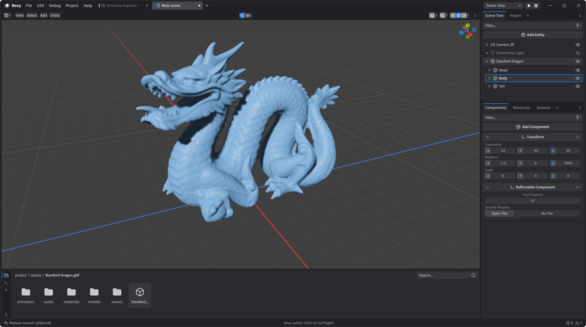

+++
title = "Bevy's Fifth Birthday"
date = 2025-08-10
authors = ["Carter Anderson"]
[extra]
github = "cart"
youtube = "cartdev"
image = "bevy_birthday_birds.svg"
padded_list_image = true
show_image = true
+++

Hey! [@cart](https://www.twitter.com/cart_cart) here (Bevy's creator and Project Lead). The years really fly by these days ... as of today, Bevy is _five years old_!

As is tradition, I will take this as a chance to reflect on the past year and outline our hopes and dreams for the future. If you're curious, check out Bevy's [First](/news/bevys-first-birthday), [Second](/news/bevys-second-birthday), [Third](/news/bevys-third-birthday/), and [Fourth](/news/bevys-fourth-birthday/) birthday posts.

I highly encourage Bevy developers and community members to write their own **Bevy's Fifth Birthday** reflection posts. Just publish your post somewhere (and to social media if you want) and [link to it here](https://github.com/bevyengine/bevy-website/issues/2202). One month from now, we will do a "Reflecting on Bevy's Fifth Year" rollup post that aggregates these in one place. This is our chance as a community to celebrate our wins, identify improvement areas, and calibrate our path for the next year.

For those who don't know, Bevy is a refreshingly simple data-driven game engine and app framework built in Rust. Bevy is also free and open source forever! You can grab the full [source code](https://github.com/bevyengine/bevy) on GitHub. We have a [Quick Start Guide](/learn/quick-start/introduction). You can check out [Bevy Assets](/assets/) for a library of community-developed plugins, crates, games, and learning resources.

This is all made possible by the Bevy Foundation's [generous donors](/donate). If you enjoy Bevy, _please_ consider [supporting our work](/donate)! Every donation goes directly toward improving Bevy for everyone, and we are _drastically_ underfunded for our ambitions.

<!-- more -->

## A Year of Milestones


* **September 25**: [Bevy Foundation is granted 501(c)(3) Public Charity status](https://bevy.org/news/bevy-foundation-501c3/)
  * This gave us tax-exempt status, made donations tax-deductible, and introduced stricter constraints on how we operate (with the goal of making the Bevy Foundation as trustable as possible).
* **November 29**: [Bevy 0.15](/news/bevy-0-15/)
  * We added Required Components, Entity Picking / Selection, Animation Improvements, Curves, Reflection Improvements, Bevy Remote Protocol (BRP), Visibility Bitmask Ambient Occlusion (VBAO), Chromatic Aberration, Volumetric Fog Improvements, Order Independent Transparency, Improved Text Rendering, Gamepads as Entities, UI Box Shadows, and more!
* **April 24**: [Bevy 0.16](/news/bevy-0-16/)
  * We added GPU-Driven Rendering, Procedural Atmospheric Scattering, Decals, Occlusion Culling, ECS Relationships, an Improved Spawn API, Unified Error Handling, no_std Support, Faster Transform Propagation, and more!
* **May**: Bevy hits 2,000,000 downloads on crates.io!
* **May 31st**: [Bevy Jam #6: Chain Reaction](https://itch.io/jam/bevy-jam-6)
  * The sixth official Bevy game jam! 403 people joined, 98 people submitted games, and people left 2,203 ratings. This was our biggest jam turnout yet! [A Fistful of Boomerangs](https://4d4xfun.itch.io/bevy-jam-6) won!
* **June 5th**: The Bevy Foundation acquires the [bevy.org](https://bevy.org) domain and migrates to it
* **June 16**: Bevy hits 40,000 stars on GitHub!
* **July 13**: The Bevy Foundation brings on [François Mockers](https://github.com/mockersf) as a contractor to build and host dedicated gaming hardware, and develop a suite of tools to continuously benchmark and monitor Bevy's performance over time.
* **August 10**: Bevy is now five years old!

## A Year By The Numbers


* **1,291** unique Bevy contributors on [GitHub](https://github.com/bevyengine) (up from 1027)
* **40,900** [GitHub](https://github.com/bevyengine) stars (up from 34,537)
* **4,429** forks on [GitHub](https://github.com/bevyengine) (up from 3,379)
* **12,928** pull requests (9,795 merged) on [GitHub](https://github.com/bevyengine) (up from 9,221 prs and 6,788 merged)
* **7,829** issues (5,316 closed) on [GitHub](https://github.com/bevyengine) (up from 5,624 and 3,816 closed)
* **10,831** commits on [GitHub](https://github.com/bevyengine) (up from 7,770)
* **1,684**  [GitHub Discussions](https://github.com/bevyengine/bevy/discussions) (up from 1,327)
* **442** [Bevy Assets](/assets/) (plugins, crates, games, apps, and learning materials) (up from 382)
* **2,753,203** downloads on [crates.io](https://crates.io/crates/bevy) (up from 1,495,435)
* **21,985** [Bevy Discord](https://discord.com/invite/bevy) members (up from 19,087)
* **5,697** community #showcase entries in the [Bevy Discord](https://discord.com/invite/bevy) (up from 4,447)
* **2,836,825** messages in the [Bevy Discord](https://discord.com/invite/bevy) (up from 2,083,652)

Note that for consistency and clarity all of these numbers are given in "absolute totals", as that is how they are generally reported. For example, we now have 40,900 _total_ GitHub stars ... the number you will see in our repo. I've included the totals as reported last year as well, which can be used to calculate the change in the numbers since last year.

## Things I'm Proud Of


I always try not to repeat myself here, but note that I am still extremely proud of the things I outlined in Bevy's [First](/news/bevys-first-birthday), [Second](/news/bevys-second-birthday), [Third](/news/bevys-third-birthday), and [Fourth]((/news/bevys-fourth-birthday)) birthday posts.

### 1. The Year of Free Range Organic Bevy Development

This year marked a particularly interesting phase change in how Bevy is built. Bevy development has always been community driven, but this year we took the "get out of the way and let them cook" approach to a new level. Last year we introduced the Working Group system, which made it much easier for developers to spin up new unified efforts in an official capacity. This was combined with an increasingly light touch from Bevy leadership: we encouraged collaboration under a single banner, provided high level direction, gave course corrections where necessary, but generally let things evolve organically. This allowed coalitions to form and work to be accomplished relatively unimpeded.

Many of these efforts have not officially landed yet (or have only landed in part), but they are maturing rapidly and, where relevant, _evolving into each other_. Notably, everything I have listed is usable to some degree _right now_, and interested developers can hop on board and contribute.

Every effort I will mention has either landed or has shown significant progress. I expect most of these efforts to land in the next year (many over the next few months), and the Bevy developer experience will be elevated to yet-unseen heights as a result. I predict that this coming year is when Bevy will become a serious contender in the general-purpose game engine space. Please forgive me for the hype building, but I'll be surprised if you aren't hyped after seeing what we've been cooking:

#### GPU-Driven Rendering

In **Bevy 0.16** we landed [initial support for GPU-driven rendering](/news/bevy-0-16/#gpu-driven-rendering), which in scenes with many objects can improve performance by 3x or more:


GPU-driven rendering involves writing scene data to arrays on the GPU, then using the GPU (instead of the CPU) to run visibility calculations and draw what is visible. This is actually a complicated (and evolving) collection of interlocking features, and not all hardware and platforms support them all. But Bevy's renderer is now structured in a way that apps can use what is available, when it is beneficial. This was the work of many, but [`@pcwalton`](https://github.com/pcwalton) was a driving force.

#### Real-Time Ray Tracing

[`@JMS55`](https://github.com/JMS55) has been heading up work on an official high-end real-time GPU-accelerated raytraced lighting solution for Bevy, which we're calling **Solari**. It is still in the _very_ early stages (not yet usable for real games, and still missing a number of features). But it will land in a _very early_ experimental form in **Bevy 0.17**:


If terms like ReSTIR, radiance cache, BLAS compaction, DLSS, or GI excite you, you should check it out!

#### Bevy Editor Design

The Bevy Editor design group has made significant progress on the Bevy Editor's structure and design language. See the group's [collaborative Figma design doc](https://www.figma.com/design/fkYfFPSBgnGkhbQd3HOMsL/Bevy-Editor?node-id=10853-12187&t=spueycI9E9xdY6tx-0) for a breakdown (this was the work of many, but a huge thanks to Rin for facilitating this effort). This is still very much a work in progress (and I haven't personally done a design pass yet, just high level notes here and there), but the design is looking beautiful and functional so far:

[](bevy_editor_design.png)

One of the outputs of this effort is a set of editor widget designs, which feeds into the next effort!

#### Bevy's Standard UI Widgets

Spearheaded by Talin ([`@viridia`](https://github.com/viridia) on GitHub), the [Bevy Standard Widgets](https://github.com/bevyengine/bevy/issues/19236) effort has seen _significant_ progress. The `bevy_core_widgets` crate now provides a set of core "headless" widget functionally (buttons, checkboxes, radio buttons, scrollbars, sliders) that higher level widgets can build on top of. On top of this, the new Bevy Feathers widget library provides a fully featured set of official widgets intended to be used by Bevy developer tools ... including the upcoming Bevy Editor. Feathers widgets implement the Bevy Editor design spec shown above.

This is what our Bevy Feathers widgets look like today!


Many of these widgets will land in experimental form in **Bevy 0.17**. They are experimental because the public API is still rough around the edges in a few places and still very subject to change. One major upcoming change is that Feathers widgets will be ported to BSN, Bevy's next generation scene system, which is the effort I will cover next!

#### BSN: Bevy's Next Generation Scene / UI System

This next one is close to my heart, as it has been my brainchild over the course of the last two years. Bevy will soon be getting BSN: a brand new Scene / UI system that will make defining scenes in code _and_ in the upcoming Bevy Editor easy, powerful, delightful, and _unified_. My [first](https://github.com/bevyengine/bevy/discussions/9538) and [second](https://github.com/bevyengine/bevy/discussions/14437) proposals have culminated in a [draft implementation](https://github.com/bevyengine/bevy/pull/20158) that I put out for initial review and iteration a few weeks ago. It is on track to land (at least partially) in **Bevy 0.18**.

This is what defining BSN in code currently looks like:

```rust
fn todo_list() -> impl Scene {
  bsn! {
    Node {
      flex_direction: FlexDirection::Column,
      row_gap: px(8.0),
    } [
        :todo_item("Item 1"),
        :todo_item("Item 2"),
        :todo_item("Item 3"),
    ]
  }
}
```

BSN will be a huge step forward for game and app developers:

* Use an ergonomic, Rust-ey syntax to define the Bevy ECS data model.
* BSN is general purpose: define your "player" scene the same way you define your UI.
* Define scenes in code (via the `bsn!` macro) _and_ in asset files (in tools like the upcoming Bevy Editor or manually). Code-driven scenes and asset-driven scenes are cross-compatible. Feel free to mix and match!
* The `bsn!` macro was built to support Rust IDE features like go-to definition, autocomplete, and doc-hover out of the box.
* BSN supports inheritance. Fields are layered on top of each other as "patches"
* We're building BSN in such a way that reactive layers can be built on top. People are already experimenting with coarse and fine grained reactive layers.

BSN will sort out many of the remaining pain points in the Bevy API. It will serve as the foundation of the Bevy Editor (we're building the editor as a Bevy App _using_ BSN). It will make Bevy competitive as a general purpose app development framework, and make ECS a compelling and ergonomic alternative to established UI data models. I'm so excited for this next phase!

#### Bevy Hot Reloading

This one was a cross project effort: the core technology ([subsecond](https://crates.io/crates/subsecond) hot patching) was built by the [Dioxus](https://dioxuslabs.com/) team. Bevy (starting in **Bevy 0.17**) will support hot patching changes to Rust code in running apps. Our initial support will be limited to hot reloading ECS systems without structural / function signature changes, but this is already a huge win!

In the future, with something like the proposed [BSN reconciliation implementation](https://github.com/cart/bevy/pull/36), we will support hot-reloading our next-generation scenes defined in Rust code using `bsn!` (Bevy's upcoming next generation scene system). This has already been proven out:

<video controls loop><source  src="hot_patching.mp4" type="video/mp4"/></video>

#### Bevy Audio

Bevy's [Better Audio working group](https://discord.com/channels/691052431525675048/1236113088793677888) has been hard at work building out a fully featured audio system for Bevy, which will hopefully replace Bevy's current bare-bones implementation. [`@BillyDM`](https://github.com/BillyDM/) has been building out the general purpose [Firewheel](https://github.com/BillyDM/Firewheel/) audio engine, and experimental Bevy bindings are being built over in the [`bevy_seedling`](https://github.com/CorvusPrudens/bevy_seedling/) repo.

I haven't personally spent much time in this space yet, but what I've seen so far has been promising. Firewheel's audio graph has me excited about modular audio effect design, and it adds much needed features like audio buses and sampler pools.

#### Bevy CLI

The [Bevy CLI working group](https://discord.com/channels/691052431525675048/1278871953721262090) has also been hard at work developing command line tooling for Bevy. This is still in the alpha phase, but it is [usable now](https://github.com/TheBevyFlock/bevy_cli)! It currently provides:

1. Project Scaffolding: use `bevy new my-project` to set up new Bevy projects from the command line using templates (such as the default [minimal template](https://github.com/TheBevyFlock/bevy_new_minimal)).
2. Run Bevy Lints: use `bevy lint` to run a custom linter similar to Clippy, which helps identify potential problems in your Bevy code and enforce Bevy best practices.
3. Build and run Web Apps: building and running Bevy on the web normally requires a few commands to accomplish. Bevy CLI provides simple commands like `bevy build web` and `bevy run web`.

We haven't upstreamed this work yet, and it will likely go through some more changes before it lands, but it already provides a _ton_ of value.

#### WESL

Bevy uses [WGSL](https://google.github.io/tour-of-wgsl/) as its default shader language. WGSL is a comfy modern shader language, but it is also missing must-have features like shader imports, preprocessors, etc. We were _very_ early adopters of WGSL, meaning we had to solve these problems ourselves.  We implemented our own Bevy-flavored extensions of the WGSL spec.

A group of stakeholders in the WGSL ecosystem (including Bevy) have decided that this problem deserves solving in a collaborative, cross-project, standardized setting. [WESL](https://github.com/wgsl-tooling-wg/wesl-spec) is what the group came up with. It defines a specification as well as tooling like [`wesl-rs`](https://github.com/wgsl-tooling-wg/wesl-rs) to build WGSL shaders from WESL source, and hopefully in the future language server tooling such as autocomplete.

The [WESL-ification working group](https://discord.com/channels/691052431525675048/1365381158421925979) is porting Bevy's shaders to WESL, with the goal of proving WESL's viability and ideally eventually making it our default shader language. We already landed [experimental support for WESL](/news/bevy-0-16/#experimental-wesl-shaders) in **Bevy 0.16**, so you can try it out now!

WESL stands to improve the shader-writing experience for Bevy developers across multiple dimensions, and I'm very excited to get it in the hands of developers. There is still plenty of work to do, but I'm excited for the future!

#### Avian Physics

[Avian Physics](https://github.com/Jondolf/avian) is fully in [`@Jondolf`](https://github.com/Jondolf)'s domain (it is not an official Bevy project). But I mention it because it has matured _a lot_ over the past year. Check out [Jondolf's blog](https://joonaa.dev/) for in-depth blog posts on each release.

Jondolf has recently been exploring "graph coloring" as an optimization, and it has yielded significant fruit. He also took a brief tangent to implement and experiment with [AVBD](https://www.youtube.com/watch?v=bwJgifqvd5M), a promising new approach to physics simulation.

With the Bevy Editor impending, the demand for official upstream physics support will increase significiantly. What this looks like in practice is still very much an open question, but Avian's Bevy-native API certainly sets a high bar.

### 2. Benchmarking and Testing Infrastructure

Bevy development is _rapid_ these days, and it takes constant vigilance to ensure we aren't introducing regressions in key areas like compile time, binary size, and runtime performance.

We have _long_ reached the point where we need automation to help us catch regressions here. To help solve this problem, the Bevy Foundation has brought on François ([`@mockersf`](https://github.com/mockersf/)) as a contractor to acquire and host real (currently mid-tier) gaming hardware on behalf of the Foundation:


François has also been tasked with building a test suite to run on this hardware, and with visualizing it. This is available in an early form here: [Twitcher](https://bevyengine.github.io/twitcher/) (note that we have plans to make this more interactive and nicer to look at). Also note that 

This has already proved useful! We recently enabled the Wayland backend on Linux by default. Twitcher helped us identify that doing so resulted in a 4% increase in clean compile times on Linux (note that the y-axis starts as 69 seconds, not zero):


This provided us immediate visibility into the price we were paying, and allowed us to [have a conversation](https://github.com/bevyengine/bevy/issues/20387) about how to proceed.

A _huge_ thank you to [Bevy's Donors](/donate) for enabling us to fund this work.

### 3. Real Projects™ Using Bevy

This was a great year for real-world Bevy usage!

* [Tiny Glade](https://store.steampowered.com/app/2198150/Tiny_Glade/), a cozy diorama builder, released to _wide_ acclaim on Steam. Tiny Glade built their own renderer on top of core Bevy libraries like Bevy ECS.
* [Foresight](https://www.fslabs.ca/) (one of Bevy's biggest sponsors) is using Bevy to build Foresight Spatial Engine (already used in production) and [SpatialDrive](https://www.spatialdrive.io/) a database built for interacting with and visualizing 3D time series data.
* [Death Trip](https://store.steampowered.com/app/2909010/DEATHTRIP/), a first person shooter in the style of Devil Daggers, was released on Steam
* [LongStory 2](https://store.steampowered.com/app/2427820/LongStory_2/), a cute visual novel, was released on Steam.
* [Nominal](https://nominal.io/connect): is building hardware test apps for real-time automation, analysis, and data capture at the edge.
* [Jarl](https://www.youtube.com/watch?v=AftMi3sBsUI), a colony building game, is prepping for playtests
* [Polders](https://x.com/i_am_feenster/status/1945725222612615449), a historical Dutch city builder, had a talk at [RustNL](https://www.youtube.com/watch?v=90soMwEGZXw) and is coming along beautifully
* [Greenfeet Haven](https://store.steampowered.com/app/2791310/Greenfeet_Haven/) released a demo on Steam
* [Exofactory](https://store.steampowered.com/app/3615720/Exofactory/), a factory builder, is slated for release in Q4 2025.
* [Sunny Shores](https://store.steampowered.com/app/3789870/Sunny_Shores/), an open world block-building sandbox, is coming soon to Early Access on Steam.
* [Toroban](https://store.steampowered.com/app/1961850/Toroban/), an infinitely wrapping puzzle game, is coming soon.
* [Gaia Maker](https://store.steampowered.com/app/3662040/Gaia_Maker/), a terraforming simulation game, got a demo
* [Wee Boats is _cool_](https://bsky.app/profile/poole.ie/post/3lqattsdoek24)
* Sven is [building a spaceflight simulation game](https://bsky.app/profile/embersarc.bsky.social)

[bevy_awesome_prod](https://github.com/Vrixyz/bevy_awesome_prod/) has even more cool projects!

## There Is Always Room For Improvement


### BSN Should Have Landed Faster

It has been two years since I put out my first [BSN proposal](https://github.com/bevyengine/bevy/discussions/9538). At that time, I already had working prototypes. BSN has [come](https://github.com/bevyengine/bevy/discussions/14437) a [long way](https://github.com/bevyengine/bevy/pull/20158/) since then, but it _was_ functional when I published that first proposal, and I didn't share that code.

My natural tendency as a developer is to keep my cards close to my chest. I like to share software that I believe in. If there is a large list of unsolved problems, or I know the software isn't yet shaped the way I want it to be, I don't want to put it out into the world. A large part of that is ego, but it is also about efficiency and peace. There are a lot of eyes on my work. If _I_ have hundreds of unanswered questions about my design, the community will have _thousands_. Putting code and ideas out there thrusts those questions on everyone. If I put work out too early, I feel like I am wasting peoples' attention. Every reviewer needs to grapple with a thing that is not yet logically complete, coherent, or consistent. They will struggle with the missing pieces. They will have questions that I have to answer, but many of those questions don't have answers yet. I then need to get each person in sync with where my head currently is, my values, the current incomplete and not fully coherent state of the implementation, etc. Oftentimes I re-tread the same ground with many different people across many conversations. I have lived this life many times in the past and I will live it many times in the future.

This phenomenon is true. Simultaneously, it is also true that keeping my cards too close to my chest prevents collaboration from occurring. The conversations I'm trying to avoid sometimes (read: often) result in newly discovered information and important course corrections. I am fortunate to have a community full of talented people to collaborate with. In retrospect I am certain we would be farther along if I put my code out there earlier. In just a few weeks after sharing my BSN code, people have submitted 10 pull requests to my branch. Mitigating the cost of the "unanswered questions" is a matter of enumerating the knowns and unknowns, then choosing when and how I engage with the public conversation. I have lived that life many times in the past and I will live it many times in the future.

I still believe both ends of the "share too early" and "share too late" spectrum are inefficient and painful. But I have calibrated my needle to point more in the direction of "share too early".

### The Bevy Foundation is Under-Funded

From one perspective, the Bevy Foundation is doing _very_ well. We are paying living wages to two full-time employees (myself and Alice), and we just brought on François as a part-time contractor.

From another perspective, we are drastically under-funded. Alice and I are _both_ taking an over 50% pay cut to what was already a low-end salary for our experience and skillset, because the alternative was one of us doesn't get to be a full time employee. If we were to work elsewhere, we could make _many_ _many_ times what we make now (people try to poach us regularly!). Of course we're both in it for the love of the game, but we also want this to be a lasting career.

On top of that, based on the size of the Bevy community and the activity in the Bevy repository we are _severely_ understaffed. Alice is doing a heroic job handling project management and keeping the wheels turning, but we need more full-time hands on deck to keep up with the development outputs of the community. We currently often need to make the impossible choice between letting a pull request stagnate (burns community good will and leaves value on the table), merging it before it is fully vetted (quality takes a hit ... not something we can afford to do), or dropping work elsewhere to get it in. If we had more employees we could more effectively keep up with the community's development pace, and we'd have additional full-time experts to build even more features faster.

This all requires additional funding. There are a variety of ways to improve this situation:

1. We can be more proactive about fundraising. This is what I'm doing now! If you like what we're doing here please [donate to the Bevy Foundation](/donate). If your company uses us successfully, or you would like to invest in the future of open-source game development, consider [becoming a corporate sponsor](/donate).
2. The Bevy Foundation can provide services that generate revenue. We're regularly throwing around ideas like hosting a Bevy Asset Store where folks can "tip" us, but we need more fleshed out Editor workflows before we can justify building that out.
3. We can continue to build features as quickly as we can, continue to grow, and hope our donations naturally grow as adoption grows. The problem with this is as the community grows, the work grows too!

_That_ being said, I am _deeply_ grateful to all of our current and past [supporters](/donate).

## Did We Learn From Last Year?

It is important for organizations (and leaders) to learn from their mistakes. Here is my list of "improvement areas" from last year's birthday post, followed by how I think we handled them this year:

> **Still No Editor**

Yes ... Bevy still has no editor (gasp!). But we were _focused_ on The Bevy Editor this year. We worked on: [BSN](https://github.com/bevyengine/bevy/pull/20158/), [Bevy Editor Prototypes](https://github.com/bevyengine/bevy_editor_prototypes), [Bevy Core Widgets](https://github.com/bevyengine/bevy/tree/90c5c123c64537dbdef19674676096177cb5acbb/crates/bevy_core_widgets), [Bevy Feathers](https://github.com/bevyengine/bevy/tree/90c5c123c64537dbdef19674676096177cb5acbb/crates/bevy_feathers), [Bevy Remote Protocol](/news/bevy-0-15/#bevy-remote-protocol-brp) (BRP), [Bevy Editor Designs](https://www.figma.com/design/fkYfFPSBgnGkhbQd3HOMsL/Bevy-Editor?node-id=10853-12187&t=spueycI9E9xdY6tx-0), [inspectors](https://github.com/bevyengine/bevy/pull/20189), and more.

The Bevy Editor is _happening_.

> **Bevy UI Stagnated For Too Long**

Bevy UI is now moving at a rapid pace! Bevy core widgets will land in **Bevy 0.17** and Bevy Feathers is landing in experimental form in **Bevy 0.17**. This year we landed core features like rounded corners, box shadows, border radius, Entity Picking, UI scrolling, and Cosmic Text. We landed Required Components, which makes defining UI much more ergonomic. There is a new, much improved Color API. BSN should land in **Bevy 0.18**, vastly improving the experience of defining UIs. Hot patching will soon make it easier to make tweaks to UIs. There is a proposed [core text input implementation](https://github.com/bevyengine/bevy/pull/20326).

Bevy UI is already _much_ more usable, and in the very near future it will start being _competitive_.

> **We Have Unfilled SME Roles**

This is still true, but our more "organic" development approach this year (mentioned above) made this less painful. The problem this aimed to solve was unblocking development in underserved areas. From what we've seen this year, Working Groups and "organic development" have done a great job of solving this problem. We still need SMEs, but I'm increasingly convinced that SME appointments should happen near the _end_ of the development of a pillar, rather than at the beginning.

## Can @cart Predict The Future?

In last year's birthday post I [made some predictions for the next year](/news/bevys-fourth-birthday/#the-next-year-of-bevy). Let's see how I did!

> **Next Generation Scene / UI**

I did in fact focus on this! As mentioned elsewhere, there is a [draft implementation](https://github.com/bevyengine/bevy/pull/20158/) out now, and it is on track to land in **Bevy 0.18**.

> **The Bevy Editor**

As mentioned above, this _was_ our focus this year. We can see the light at the end of the tunnel!

> **Relations**

We [landed Relationships this year](/news/bevy-0-16/#ecs-relationships)! There are still features to build, such as many-to-many relationships, which have a [proposed implementation](https://github.com/bevyengine/bevy/pull/20377), and "fragmenting relationships", which also have a [proposed implementation](https://github.com/bevyengine/bevy/pull/19153).

## The Next Year of Bevy


The Bevy Community and I take a relatively organic and reactive approach to developing Bevy. It doesn't make sense to outline a long list of "plans" when that isn't really how development works in practice.

That being said, here are some of my personal hopes, dreams, and personal priorities for the next year of Bevy:

* **BSN**: This is a critical cornerstone of the Bevy developer experience _and_ the Bevy Editor. To keep us on track it should land in the next few months.
* **Reactivity Ecosystem**: Reactivity is an important piece of the UI puzzle. Once BSN lands (ideally _before_ it actually lands), we should have an ecosystem of competing reactivity implementations. There are already people working on this!
* **Core / Standard UI Widgets**: We've already built a number of these in Bevy Feathers! By the end of the year I'd like the stable of widgets to be relatively complete, and the public facing API to be comfy.
* **Baseline Editor Platform**: We will build a core visual Bevy Editor platform that can host developer tools such as scene editors and inspectors.

We have [plenty of other work in the pipeline](https://github.com/bevyengine/bevy/pulls), but I'm once again choosing to keep this _very_ focused this year to convey my personal priorities.

One last reminder that Bevy community members should write their own Bevy Birthday blog posts. [Submit them here](https://github.com/bevyengine/bevy-website/issues/2202)!

If any of this excites you, we would love your help! Check out our code on [GitHub](https://github.com/bevyengine/bevy) and start participating in the [Bevy Community](/community/).

Also _please_ consider [donating to The Bevy Foundation](/donate) to ensure we can continue building and leading this wildly ambitious project. The more funds we have, the more we can scale Bevy development!

To many more years of Bevy!

\- [@cart](https://github.com/cart/)


<span class="news-subtitle">The cute Bevy birds in this post are strongly inspired by Ed Duck's [delightful](https://thebevyflock.github.io/the-bird/) Bevy bird design</span>