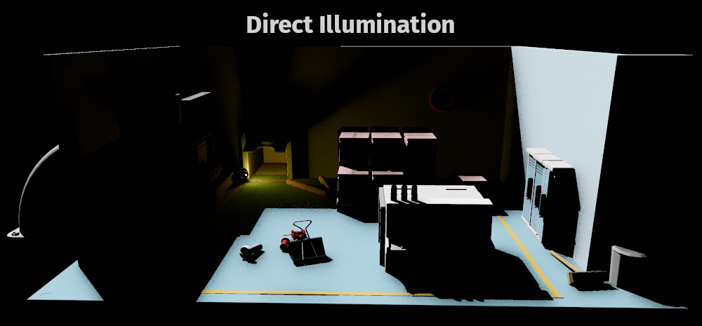
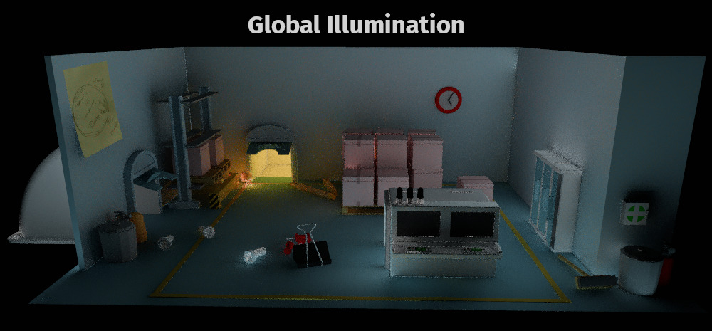
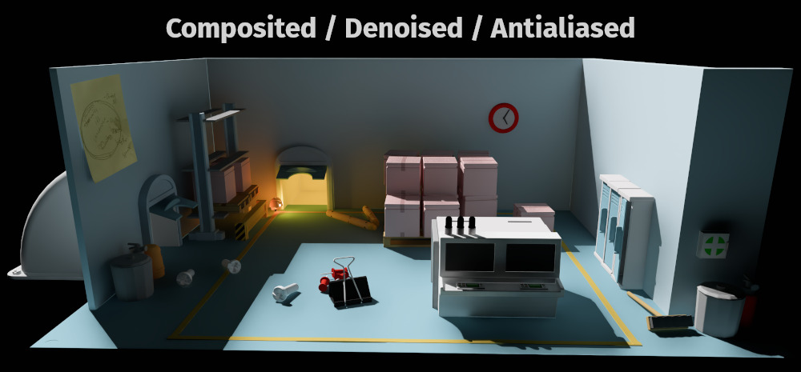
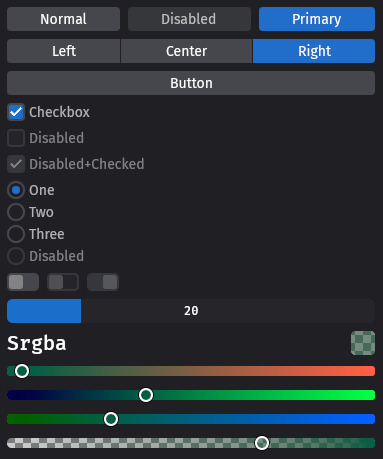
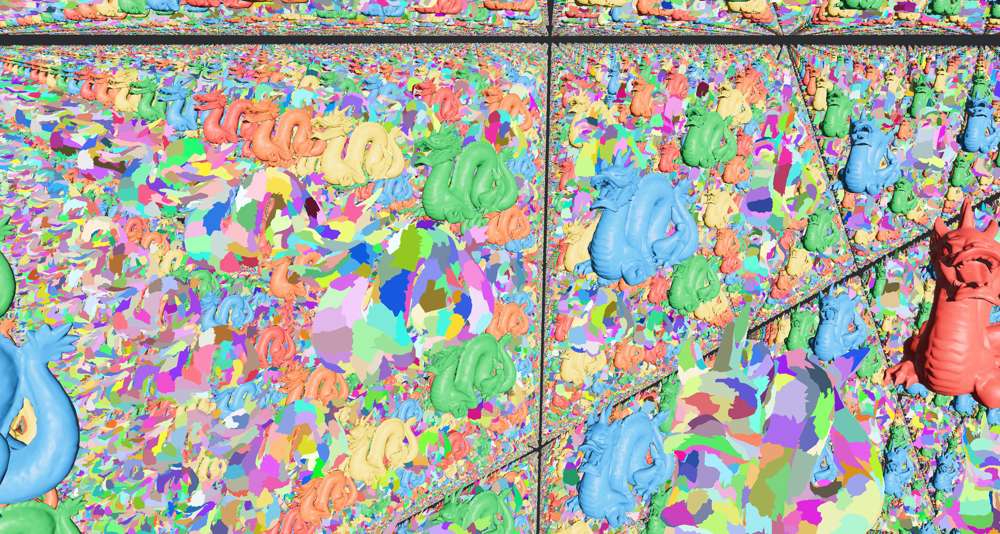
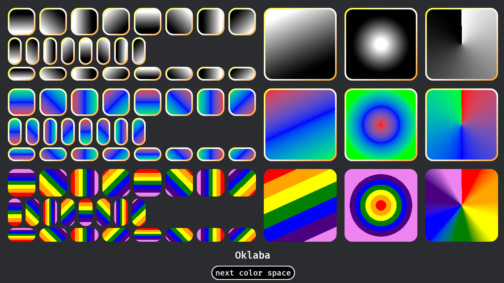
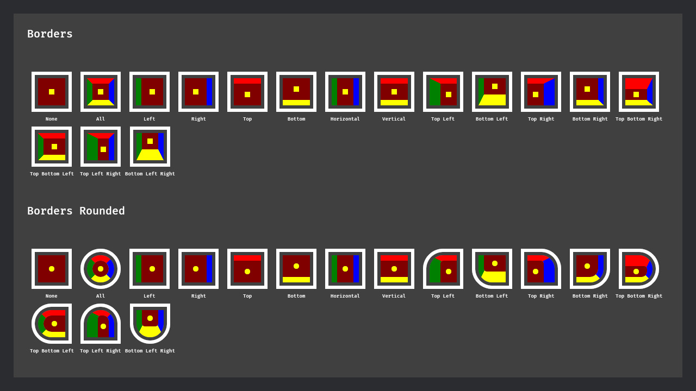

+++
title = "Bevy 0.17"
date = 2025-09-24 
[extra]
public_draft = 2215
status = 'hidden'
image = "cover.jpg"
show_image = true
image_subtitle = "A factory from Exofactory, an in-development factory builder made with Bevy"
image_subtitle_link = "https://store.steampowered.com/app/3615720/Exofactory/"
+++

Thanks to **X** contributors, **X** pull requests, community reviewers, and our [**generous donors**](/donate), we're happy to announce the **Bevy 0.17** release on [crates.io](https://crates.io/crates/bevy)!

For those who don't know, Bevy is a refreshingly simple data-driven game engine built in Rust. You can check out our [Quick Start Guide](/learn/quick-start) to try it today. It's free and open source forever! You can grab the full [source code](https://github.com/bevyengine/bevy) on GitHub. Check out [Bevy Assets](https://bevy.org/assets) for a collection of community-developed plugins, games, and learning resources.

To update an existing Bevy App or Plugin to **Bevy 0.17**, check out our [0.16 to 0.17 Migration Guide](/learn/migration-guides/0-16-to-0-17/).

Since our last release a few months ago we've added a _ton_ of new features, bug fixes, and quality of life tweaks, but here are some of the highlights:

- **Rust hotpatching:** Tired of waiting for Rust to recompile while prototyping? Bevy has integrated `subsecond` by Dioxus, allowing you to opt into hotreloaded Rust code without restarting your program.
- **Raytraced lighting:** Stunning, physically realistic real-time lighting. Some limitations apply, but boy is it pretty.
- **Better observers:** Observers have been wildly popular, offering users a flexible way to respond to changes with very little boilerplate. We've cleaned up their API, clarified how they related to buffered events (now `Messages`) improved the documentation, and made them even more powerful.
- **Experimental UI widgets:** We're shipping a headless UI widget library and an opinionated set of tooling-focused widgets built on top of it now for you to try out!

<!-- more -->

## Experimental Raytraced Lighting: Bevy Solari

{{ heading_metadata(authors=["@JMS55", "@SparkyPotato"] prs=[19058, 19620, 19790, 20020, 20113, 20156, 20213, 20242, 20259, 20406, 20457, 20580, 20596, 20622, 20658, 20659, 20980]) }}

<video controls loop><source  src="solari.mp4" type="video/mp4"/></video>

With the new `bevy_solari` crate, we're making our first steps towards realtime raytraced lighting.

For some background, lighting in video games can be split into two parts: direct and indirect lighting.

Direct lighting is light that is emitted from a light source, bounces off of one surface, and then reaches the camera. Indirect lighting by contrast is light that bounces off of different surfaces many times before reaching the camera. Indirect lighting is also often called global illumination.

In Bevy, direct lighting comes from analytical light components (`DirectionalLight`, `PointLight`, `SpotLight`) and shadow maps. Indirect lighting comes from a hardcoded `AmbientLight`, baked lighting components (`EnvironmentMapLight`, `IrradianceVolume`, `Lightmap`), and screen-space calculations (`ScreenSpaceAmbientOcclusion`, `ScreenSpaceReflections`, `specular_transmission`, `diffuse_transmission`).

The problem with these methods is that they all have large downsides:

- Emissive meshes do not cast light onto other objects, either direct or indirect.
- Shadow maps are very expensive to render and consume a lot of memory, so you're limited to using only a few shadow casting lights. Good shadow quality can be difficult to obtain in large scenes.
- Baked lighting does not update in realtime as objects and lights move around and requires time to bake, slowing down game production.
- Screen-space methods have low quality and do not capture off-screen geometry and light.

Bevy Solari is intended as a completely alternate, high-end lighting solution for Bevy that uses GPU-accelerated raytracing to fix all of the above problems. Emissive meshes properly cast light and shadows, you can have hundreds of shadow casting lights, quality is much better, it requires no baking time, and it supports _fully_ dynamic scenes!

### Try it out

While Bevy 0.17 adds the bevy_solari crate, it is not yet production ready.

However, feel free to run the solari example to check out the progress we've made. There are two different modes you can try out:

A non-realtime "reference" mode that uses pathtracing: `cargo run --release --example solari --features bevy_solari -- --pathtracer`.

A realtime mode that uses a combination of techniques, and currently supports only diffuse materials: `cargo run --release --example solari --features bevy_solari`.

Additionally, if you have a NVIDIA GPU, you can enable DLSS Ray Reconstruction with the realtime mode for a combination of denoising (Bevy Solari does not currently come with any alternate denoisers), lower rendering times, and anti-aliasing: `cargo run --release --example solari --features bevy_solari,dlss`.

### How it works







Our current implementation uses raytraced direct and indirect lighting (also known as global illuminance), which are sampled via ReSTIR DI/GI and uses a world-space irradiance cache to improve GI quality.
Like all raytracing techniques, this produces results that are too noisy for realtime applications.
To resolve this, you need to add a denoising step, which is currently handled via DLSS Ray Reconstruction, although we'd be happy to add support for alternate methods as well in the future.
If you're interested in the crunchy technical details of how this all works: please read [@JMS55's blog post](https://jms55.github.io/posts/2025-09-20-solari-bevy-0-17) for a frame breakdown!

Look forward to more work on Bevy Solari in future releases!

Special thanks to `@Vecvec` for adding raytracing support to wgpu.

## Event / Observer Overhaul

{{ heading_metadata(authors=["@cart", "@Jondolf", "@alice-i-cecile", "@hukasu", "@oscar-benderstone", "@Zeophlite", "@gwafotapa"] prs=[20731, 19596, 19663, 19611, 19935, 20274]) }}

Bevy's Observer API landed a few releases ago, and it has quickly become one of our most popular features. In **Bevy 0.17** we rearchitected and refined the Event and Observer APIs to be clearer, easier to use, and more performant. We plan on rolling out Bevy's [next generation Scene / UI system](https://github.com/bevyengine/bevy/pull/20158/) in the near future, and observers are a key piece! We wanted to ensure they were in a better place for the next phase of Bevy development. The old API had some problems:

1. **Concept names were confusing and ambiguous**: Events could be "observed", "buffered" in `Events` collections, or both. Knowing how to produce or consume a given [`Event`] required too much implied context: "do I write an Observer or use an EventReader system?", "do I trigger the event with or without targets?", what should the targets be?", etc. We need better, less ambiguous ways to refer to events.
2. **The API was not "static" enough**: This relates to (1). Because a given [`Event`] type could be used by and produced for _any context_, we had to provide access to _every possible API_ for _every event type_. It should not be possible to trigger an "entity event" without an entity! An Observer of an event that was not designed to have a target entity should not have functions that return entity targets! Every [`Event`] impl had to define an "entity propagation traversal", even it was not designed to propagate (and even if it didn't target entities at all!). Events should be self documenting, impossible to produce or consume in the wrong context, and should only encode the information that is necessary for that event.
3. **The API did too much work**: Because events could be produced and used in any context, this meant that they all branched through code for every possible context. This incurred unnecessary overhead. It also resulted in lots of unnecessary codegen!

In **Bevy 0.17** we have sorted out these issues without fundamentally changing the shape of the API. Migrations should generally be very straightforward.

### The Rearchitecture

The `Event` trait has been reframed / refocused to increase flexibility, make the API more static, and remove specialized cruft:

```rust
// Old: Bevy 0.16
trait Event {
    // this embedded configuration specific to "propagating entity events" in all events!
    type Traversal: Traversal<Self>;
    const AUTO_PROPAGATE: bool = false;
    fn register_component_id(world: &mut World);
    fn component_id(world: &World) -> Option<ComponentId>;
}

// New: Bevy 0.17
trait Event {
    type Trigger<'a>: Trigger<Self>;
}
```

Every [`Event`] now has an associated [`Trigger`] implementation. The [`Trigger`] trait defines the behavior of `world.trigger()` for that event. [`Trigger`] defines which observers will run, the order they will run in, and the data that is passed to them.

By representing this in the type system, we can constrain behaviors and data to _specific_ types of events statically, making it impossible to "misuse" an [`Event`].
All of Bevy's existing "flavors" of events have been ported to the new [`Event`] / [`Trigger`] system.

### `Event`: global by default

At a glance, the default [`Event`] derive and usage hasn't changed much. Just some shorter / clearer naming. The old API looked like this:

```rust
#[derive(Event)]
struct GameOver {
    score: u32,
}

world.add_observer(|trigger: Trigger<GameOver>| {
    info!("Game over! You scored {} points", trigger.score);
});

world.trigger(GameOver { score: 100 });
```

In **Bevy 0.17**, defining observers has only changed slightly:

```rust
world.add_observer(|game_over: On<GameOver>| {
    info!("Game over! You scored {} points", game_over.score);
});
```

`Trigger` is now `On`. `On` encourages developers to think of this parameter _as the event itself_. This is also reflected in the new naming convention, where we name the variable after the `Event` (ex: `game_over`) rather than the `Trigger` (ex: `trigger`).

Internally things are a bit different though! The [`Event`] derive defaults to being "untargeted" / "global", by setting the `Event::Trigger` to [`GlobalTrigger`]. When it is triggered, only "untargeted" top-level observers will run, and there is _no way_ to trigger it in a different context (ex: events with a [`GlobalTrigger`] cannot target entities!).

### `EntityEvent`: a dedicated trait for entity-targeting events

In previous versions of Bevy, _any_ event could optionally be triggered for an entity. It looked like this:

```rust
#[derive(Event)]
struct Click;

world.trigger_targets(Click, entity);
```

In **Bevy 0.17**, if you want an [`Event`] to target an [`Entity`] (and thus trigger any observers watching for that specific entity), you derive [`EntityEvent`]:

```rust
#[derive(EntityEvent)]
struct Click {
    entity: Entity,
}

world.trigger(Click { entity });
```

Notice that `Click` now has the target entity as a field _on_ the [`Event`], and it now uses the same `world.trigger()` API that other events use. `world.trigger_targets` is no more ... every event is triggered using the same API!

```rust
// This observer will run for _all_ Click events targeting any entity
world.add_observer(|mut click: On<Click>| {});

/// This observer will only run for Click events triggered for `some_entity`
world.entity_mut(some_entity).observe(|mut click: On<Click>| {});
```

[`EntityEvent`] is a new trait:

```rust
trait EntityEvent: Event {
    fn event_target(&self) -> Entity;
    fn event_target_mut(&mut self) -> &mut Entity;
}
```

When it is derived, it defaults to setting the [`Event`] trigger to [`EntityTrigger`]. This will trigger all "untargeted" observers (`world.add_observer()`), just like [`GlobalTrigger`], but it will _also_ trigger any observers that target a specific entity (`world.entity_mut(some_entity).observe()`).

Deriving [`EntityEvent`] will set the `entity_target` to a field named `entity` by default. In some cases (such as events that have multiple entity fields), it might make sense to use a more descriptive name. You can set the target using the `#[event_target]` field attribute:

```rust
#[derive(EntityEvent)]
struct Attack {
    // This will trigger `attacker` observers 
    #[event_target]
    attacker: Entity,
    attacked: Entity,
}
```

### EntityEvent Propagation

An [`EntityEvent`] does not "propagate" by default (and by default they now _statically_ have no access to APIs that control propagation). Propagation can be enabled using the `propagate` attribute (which defaults to using the [`ChildOf`] relationship to "bubble events up the hierarchy"):

```rust
#[derive(EntityEvent)]
#[entity_event(propagate)]
struct Click {
    entity: Entity
}
```

This will set the [`Event`]'s [`Trigger`] to [`PropagateEntityTrigger`].

This enables access to "propagation" functionality like this:

```rust
world.add_observer(|mut click: On<Click>| {
    if SOME_CONDITION {
        // stop the event from "bubbling up"
        click.propagate(false);
    }
});
```

Bevy's `Pointer` events have always tracked the "original target" that an "entity event" was targeting. This was handy! We've enabled this functionality for every [`EntityEvent`] with [`PropagateEntityTrigger`]: simply call `On::original_event_target`.

### Component Lifecycle Events

In past releases, the observer API for lifecycle events looked like this:

```rust
app.add_observer(|trigger: Trigger<OnAdd, Player>| {
    info!("Added player {}", trigger.entity());
});
```

We've ported these over to the new system, and renamed them to match our new naming scheme (ex: `OnAdd` is now [`Add`]). They look like this now:

```rust
app.add_observer(|add: On<Add, Player>| {
    info!("Added player {}", add.entity);
});
```

Component lifecycle events are an [`EntityEvent`] (and thus store the target entity as a field). They use the [`EntityComponentsTrigger`], which allows them to be triggered for specific components on an entity.

### AnimationEvent

"Animation events" are custom events that are registered with an [`AnimationPlayer`] and triggered at a specific point in the animation. [`AnimationEvent`] is a new event sub-trait / derive (much like [`EntityEvent`]). Animation events use the [`AnimationEventTrigger`]. They behave like an [`EntityEvent`] (they trigger observers of the [`AnimationPlayer`]), but they notably _do not store the entity on the event type_. This allows for directly registering them in [`AnimationPlayer`] without needing to set an entity target:

```rust
animation.add_event(
    0.0,
    PrintMessage("Hello".to_string()),
);

world.entity_mut(animation_player).observe(|print_message: On<PrintMessage>| {
    // The `AnimationEventTrigger` still provides access to the animation_player entity
    println!("{} says {}", print_message.trigger().animation_player, print_message.0);
});
```

### Custom Event Triggers

The new [`Trigger`] trait also enables developers to implement their _own_ specialized [`Event`] [`Trigger`] logic.

The [`Event`] derive can specify a custom [`Trigger`] like this:

```rust
#[derive(Event)]
#[event(trigger = CoolTrigger)
struct Jump;
```

Alternatively, developers can create specialized event derives / traits, following the same pattern as `EntityEvent`:

```rust
trait CoolEvent: Event { }

#[derive(CoolEvent)]
struct Jump;

// the derive above would generate this code:
impl CoolEvent for Jump {}
impl Event for Jump {
    type Trigger<'s> = CoolTrigger; 
}
```

### Concept Clarity: Events vs Messages

In previous versions of Bevy, the [`Event`] trait was used for both "observable events" (handled with `Observer`) and "buffered events" (handled with `EventReader`). This made _some_ sense, as both concepts could be considered "events" in their own right. But they are also fundamentally _very_ different things functionally:

1. "Observable events" are consumed one-by-one in Observers, which exist outside of a schedule. "Buffered events" are consumed by iterating over many of them in normal systems, which exist in one or more places inside a schedule.
2. "Observable event" handlers are run _for_ developers. "Buffered event" consumers are responsible for dispatching handler logic themselves.
3. "Observable events" are handled immediately. "Buffered events" are handled at some later moment in time (or not at all).
4. "Observable events" need additional configuration to make them work (ex: `Event::Trigger`). "Buffered events" do not.
5. "Observable events" incur a small amount of per-handler overhead. Handling "buffered events" is as fast as iterating an array.

Most importantly: there was _no way_ for consumers or producers of these events to know _how_ to handle them, just by looking at the type info. Consider some `ProcessingFinished` event from some 3rd party library. Events could either be "buffered" or "observed" (depending on what the sender of the event chooses), so the consumer has _no way_ to know how to consume `ProcessingFinished`. Is their observer not firing because the event isn't happening, or because the creator of the event was sending it as a buffered event instead of "triggering" it?

These are two completely separate systems, with different producer / consumer APIs, different performance considerations, and immediate vs deferred handling. The "things" being sent deserve different concept names to solidify conceptually (and at the type/API level) their intended purpose and context.

In **Bevy 0.17**, [`Event`] is now _exclusively_ the name/trait for the concept of something that is "triggered" and "observed". [`Message`] is the name / trait of something that "buffered": it is "written" via a [`MessageWriter`] and "read" via a [`MessageReader`].

It is still possible to support both contexts by implementing _both traits_, but we expect that to be significantly less common than just choosing one.

[`Event`]: https://dev-docs.bevy.org/bevy/ecs/event/trait.Event.html
[`Trigger`]: https://dev-docs.bevy.org/bevy/ecs/event/trait.Trigger.html
[`GlobalTrigger`]: https://dev-docs.bevy.org/bevy/ecs/event/struct.GlobalTrigger.html
[`EntityEvent`]: https://dev-docs.bevy.org/bevy/ecs/event/trait.EntityEvent.html
[`ChildOf`]: https://dev-docs.bevy.org/bevy/ecs/hierarchy/struct.ChildOf.html
[`PropagateEntityTrigger`]: https://dev-docs.bevy.org/bevy/ecs/event/struct.PropagateEntityTrigger.html
[`Add`]: https://dev-docs.bevy.org/bevy/ecs/lifecycle/struct.Add.html
[`EntityComponentsTrigger`]: https://dev-docs.bevy.org/bevy/ecs/event/struct.EntityComponentsTrigger.html
[`AnimationPlayer`]: https://dev-docs.bevy.org/bevy/animation/struct.AnimationPlayer.html
[`AnimationEvent`]: https://dev-docs.bevy.org/bevy/animation/trait.AnimationEvent.html
[`AnimationEventTrigger`]: https://dev-docs.bevy.org/bevy/animation/struct.AnimationEventTrigger.html

## Experimental UI Widgets: Bevy Feathers

{{ heading_metadata(authors=["@viridia", "@Atlas16A", "@ickshonpe", "@amedoeyes"] prs=[19730, 19900, 19928, 20237, 20169, 20422, 20350, 20548, 20969]) }}



To make it easier for Bevy engine developers and third-party tool creators to make comfortable, visually cohesive tooling,
we're pleased to introduce "Feathers" - a comprehensive Bevy UI widget set. Feathers is meant to be Bevy's "developer tools" widget set, and it will be used to build the upcoming [Bevy Editor](https://bevy.org/news/bevys-fifth-birthday/#bevy-editor-design). It has a utilitarian look and feel, with an opinionated feature-set tailored for editors and graphical utilities. It builds on top of Bevy's new general-purpose "headless" widget set: `bevy_ui_widgets` (covered below). Feathers _can_ be used in games, but that is not its motivating use case.

Feathers currently offers:

- Standard widgets designed to match the look and feel of the planned Bevy Editor.
- Components that can be leveraged to build custom editors, inspectors, and utility interfaces that feel consistent with other Bevy tooling.
- Essential UI elements including buttons, sliders, checkboxes, menu buttons, and more.
- Layout containers for organizing and structuring UI elements.
- Decorative elements such as icons for visual enhancement.
- Initial (simple / primitive) theme support to ensure consistent, configurable visual styling across applications. This is not the "final" Bevy UI theme system, but it provides some baseline functionality.
- Accessibility features with built-in screen reader and assistive technology support.
- Interactive cursor behavior that changes appropriately when hovering over widgets.
- A virtual keyboard suitable for touchscreen text input.

Feathers is still early in development. It is currently hidden behind the `experimental_bevy_feathers` feature flag. Feathers is still incomplete and likely to change in a variety of ways:

- We will port Feathers to BSN (Bevy's [Next-Generation Scene/UI System](https://github.com/bevyengine/bevy/pull/20158/)) when that lands (targeted for **Bevy 0.18**).
- The `observe` API is temporary: we hope to replace these with a general-purpose, [relations-backed solution](https://github.com/bevyengine/bevy/issues/17607).
- We are still working on polishing up some UX issues.
- There are missing widgets and features. Notably the "text input" widget is still being developed.

If you're looking to experiment with building tooling for Bevy, enable it and take `feathers` for a test flight!
Let us know what problems you run into, and feel free to contribute missing widgets and bugs upstream.

If you can't wait to get your hands on `bevy_ui` widgets for your game,
we recommend copying the Feathers code into your project and start hacking away at it!
Feathers can serve as a helpful base to understand how to build and theme widgets in Bevy UI. It also illustrates how to use our new "headless" widget set: `bevy_ui_widgets`.

## Realtime-filtered environment maps

{{ heading_metadata(authors=["@mate-h"] prs=[19076, 20529]) }}


An environment map needs to be processed to be able to support uses beyond a simple skybox,
such as reflections at different roughness levels, and ambient light contribution.
This process is called filtering, and can either be done ahead of time (prefiltering), or
in realtime, although at a reduced quality.

Bevy already supported prefiltering, but its not always possible to prefilter: sometimes,
your environment map is not available until runtime.
Typically this is from realtime reflection probes, but you might also, for example,
be using a procedural skybox.

Now, Bevy supports both modes of filtering!
Adding a `GeneratedEnvironmentMapLight` to a `Camera` entity lets you use any environment map
with Bevy's renderer, and enjoy all the benefits of prefiltering with none of the asset processing.

We've made sure it works with our built-in atmosphere shader too.
To enable this, add the new component `AtmosphereEnvironmentMapLight` to the camera entity.

This is a fully dynamic per-view effect: no pre-baked environment maps are needed.
However, please be aware that light probes are not yet supported.

## Headless Widgets

{{ heading_metadata(authors=["@viridia", "@ickshonpe", "@alice-i-cecile"] prs=[19366, 19584, 19665, 19778, 19803, 20032, 20036, 20086, 20944]) }}

Bevy's `Button` and `Interaction` components have been around for a long time. Unfortunately
these components have a number of shortcomings, such as the fact that they don't use the new
`bevy_picking` framework, or the fact that they are really only useful for creating buttons
and not other kinds of widgets like sliders.

As an art form, games thrive on novelty: the typical game doesn't have boring, standardized controls
reminiscent of a productivity app, but instead will have beautiful, artistic widgets that are
in harmony with the game's overall visual theme. But writing new and unique widgets requires
skill and subtlety, particularly if we want first-class accessibility support. It's not a burden we
want to put on the average indie developer.

In the web development world, "headless" widget libraries, such as
[headlessui](https://headlessui.com/) and [reakit](https://reakit.io/) have become popular. These
provide standardized widgets that implement all of the correct interactions and behavioral logic,
including integration with screen readers, but which are unstyled. It's the responsibility of the
game developer to provide the visual style and animation for the widgets, which can fit the overall
style of their game.

With this release, Bevy introduces a collection of headless widgets. These are components
which can be added to any UI Node to get widget-like behavior. The standard widget set includes buttons,
sliders, scrollbars, checkboxes, radio buttons, and more. This set will likely be expanded in
future releases.

While these widgets are usable today, and are a solid choice for creating your own widgets for your
own game or application, they are still **experimental**. We are still polishing up some aspects of the
developer experience and filling in gaps.
Expect breaking changes as we continue to iterate and improve on them!

We're as excited as you are for first-party widgets,
and we've decided to ship these now precisely so people can try them out:
real-world user feedback is vital for building and improving products.

If you've read this and are still excited to try them out, enable the `experimental_bevy_ui_widgets` feature.

### Standard Widgets

The `bevy_ui_widgets` crate provides implementations of unstyled widgets, such as buttons,
sliders, checkboxes and radio buttons.

- `ui_widgets::Button` is a push button. It emits an activation event when clicked.
- `ui_widgets::Slider` is a standard slider, which lets you edit an `f32` value in a given range.
- `ui_widgets::Scrollbar` can be used to implement scrollbars.
- `ui_widgets::Checkbox` can be used for checkboxes and toggle switches.
- `ui_widgets::RadioButton` and `ui_widgets::RadioGroup` can be used for radio buttons.

### Widget Interaction Marker Components

Many of the standard widgets will define supplementary ECS components that are used to store the widget's
state, similar to how the old `Interaction` component worked, but in a way that is more flexible.
These components include:

- `InteractionDisabled` - a boolean component used to indicate that a component should be
  "grayed out" and non-interactive. Note that these disabled widgets are still visible and can
  have keyboard focus (otherwise the user would have no way to discover them).
- `Hovered` is a simple boolean component that allows detection of whether the widget is being
  hovered using regular Bevy change detection.
- `Checked` is a boolean component that stores the checked state of a checkbox or radio button.
- `Pressed` is used for a button-like widget, and will be true while the button is held down.

The combination of `Hovered` and `Pressed` fulfills the same purpose as the old
`Interaction` component, except that now we can also represent "roll-off" behavior (the state where
you click on a button and then, while holding the mouse down, move the pointer out of the button's
bounds). It also provides additional flexibility in cases where a widget has multiple hoverable
parts, or cases where a widget is hoverable but doesn't have a pressed state (such as a tree-view
expansion toggle).

### Widget Notifications

Applications need a way to be notified when the user interacts with a widget. Currently in `bevy_ui_widgets`
we're experimenting with a `Callback` system, which uses "one shot systems" under the hood. We're also heavily
considering using Events / Observers for this. This is one of the primary reasons for the "experimental" label!

### State Management

See the [Wikipedia Article on State Management](https://en.wikipedia.org/wiki/State_management).

Most of the standard widgets support "external state management" - something that is referred to in the
React.js world as "controlled" widgets. This means that for widgets that edit a parameter value
(such as checkboxes and sliders), the widget doesn't automatically update its own internal value,
but only sends a notification to the app telling it that the value needs to change. It's the
responsibility of the app to handle this notification and update the widget accordingly, and at the
same time update any other game state that is dependent on that parameter.

There are multiple reasons for this, but the main one is this: typical game user interfaces aren't
just passive forms of fields to fill in, but more often represent a dynamic view of live data. As a
consequence, the displayed value of a widget may change even when the user is not directly
interacting with that widget. Externalizing the state avoids the need for two-way data binding, and
instead allows simpler one-way data binding that aligns well with the traditional "Model / View /
Controller" (MVC) design pattern.

That being said, the choice of internal or external state management is up to you: if the widget has
an `on_change` callback that is not `Callback::Ignore`, then the callback is used. If the callback
is `Callback::Ignore`, however, the widget will update its own state automatically. (This is similar
to how React.js does it.)

There are two exceptions to this rule about external state management. First, widgets which don't
edit a value, but which merely trigger an event (such as buttons), don't fall under this rule.
Second, widgets which have complex states that are too large and heavyweight to fit within a
notification event (such as a text editor) can choose to manage their state internally. These latter
widgets will need to implement a two-way data binding strategy.

## Light Textures

{{ heading_metadata(authors=["@robtfm"] prs=[18031]) }}

<video controls loop><source  src="light_textures.mp4" type="video/mp4"/></video>

The new components `PointLightTexture`, `SpotLightTexture`, and `DirectionalLightTexture` allow specifying light textures for lights, also commonly known as "light cookies".
These modulate the intensity of light cast upon surfaces for various artistic effects. See the [`light_textures`](https://github.com/bevyengine/bevy/blob/release-0.17.0/examples/3d/light_textures.rs) example for usage.

## Hot Patching Systems in a Running App

{{ heading_metadata(authors=["@mockersf", "@janhohenheim"] prs=[19309]) }}

Bevy now supports hot patching systems via [subsecond](https://crates.io/crates/subsecond) and the [`dx`](https://crates.io/crates/dioxus-cli) command line tool from the Dioxus project.

When the cargo feature `hotpatching` is enabled, every system can now be modified during execution, and the changes are immediately visible in your game.

`dx` is the Dioxus CLI. To install it run `cargo install dioxus-cli@0.7.0-alpha.1`
TODO: use the fixed version that will match the version of subsecond dependency used in Bevy at release time

Then run `BEVY_ASSET_ROOT="." dx serve --hot-patch --features "bevy/hotpatching"` to test it in your project. You can also try it out using Bevy's [`hotpatching_systems.rs`](https://github.com/bevyengine/bevy/blob/release-0.17.0/examples/ecs/hotpatching_systems.rs) example.

This is just the first step. There are known limitations:

- Only works on the binary crate. Dioxus has plans to expand support here.
- Not supported in Wasm. Dioxus supports this, but the Bevy side needs some work.
- If the system's parameters change, it will not be hot reloaded. This is something we need to work out on the Bevy side.
- It may be sensitive to rust/linker configuration. Dioxus is already pretty good about this though!

We have plans to further expand support, including making the upcoming [`bsn!` macro](https://github.com/bevyengine/bevy/pull/20158/) hot-reloadable (check out [this video](/news/bevys-fifth-birthday/#bevy-hot-reloading) of it in action!).

## Deep Learning Super Sampling (DLSS)

{{ heading_metadata(authors=["@JMS55", "@cart"] prs=[19864, 19817, 20565]) }}

{{ compare_slider(
    left_title="No AA",
    left_image="no_aa.jpg",
    right_title="DLSS",
    right_image="dlss.jpg"
) }}

For users with NVIDIA RTX GPUs, Bevy now offers yet another form of anti-aliasing: DLSS.

Try it out by running Bevy's anti_aliasing example: `cargo run --example anti_aliasing --features dlss --release` (after performing setup from <https://github.com/bevyengine/dlss_wgpu>).

Additionally, we've open sourced <https://github.com/bevyengine/dlss_wgpu> as a standalone crate to help other wgpu-based renderers integrate DLSS.

Compared to Bevy's built-in TAA, DLSS:

- Produces higher quality and more stable images
- Supports upscaling in addition to anti-aliasing, leading to much cheaper render times, particularly when used with GPU-heavy features like Bevy Solari
- Requires a NVIDIA RTX GPU
- Currently requires running via the Vulkan backend on Windows/Linux (no DirectX, macOS, web, or mobile support)

To use DLSS in your app:

- See <https://github.com/bevyengine/dlss_wgpu> for licensing requirements and setup instructions
- Enable Bevy's `dlss` feature
- Insert the `DlssProjectId` resource before `DefaultPlugins` when setting up your app
- Check for the presence of `Option<Res<DlssSuperResolutionSupported>>` at runtime to see if DLSS is supported on the current machine
- Add the `Dlss` component to your camera entity, optionally setting a specific `DlssPerfQualityMode` (defaults to `Auto`)
- Optionally add sharpening via `ContrastAdaptiveSharpening`
- Custom rendering code, including third party crates, should account for the optional `MainPassResolutionOverride` to work with DLSS (see the `custom_render_phase` example)

Note that DLSS integration is expected to have some bugs in this release related to certain rendering effects not respecting upscaling settings, and possible issues with transparencies or camera exposure. Please report any bugs encountered.

Other temporal upscalers like AMD's FidelityFX™ Super Resolution (FSR), Intel's Xe Super Sampling XeSS (XeSS), and Apple's MTLFXTemporalScaler are not integrated in this release. However they all use similar APIs, and would not be a challenge to integrate in future releases.

Support for other swapchain-related features like frame interpolation/extrapolation, latency reduction, or dynamic resolution scaling is not currently planned.

Special thanks to @cwfitzgerald for helping with the [`wgpu`](https://github.com/gfx-rs/wgpu) backend interop APIs.

## Tilemap Chunk Rendering

{{ heading_metadata(authors=["@ConnerPetzold", "@grind086", "@IceSentry"] prs=[18866]) }}


{{ media_caption(url="cupnooble.itch.io/sprout-lands-asset-pack" text="Tilemap Credit: Cup Nooble's Sprout Lands") }}

A performant way to render tilemap chunks has been added as the first building block to Bevy's tilemap support (more to come in future releases!). You can render a chunk by supplying a tileset texture to the `TilemapChunk` component and tile data to `TilemapChunkTileData`. For each tile, `TileData` allows you to specify the index into the tileset, the visibility, and the color tint.

```rust
let chunk_size = UVec2::new(16, 16);
commands.spawn((
    TilemapChunk {
        tileset: assets.load("tileset.png"),
        // the dimensions of the chunk (in tiles)
        chunk_size,
        // the size to render each tile (in pixels) 
        tile_display_size: UVec2::new(32, 32),
    },
    // Fill in random tile data for this chunk using the first five tiles in the set
    TilemapChunkTileData((0..chunk_size.element_product())
        .map(|_| Some(rng.gen_range(0..5)))
        .collect()
    ),
));
```

## `ViewportNode`

{{ heading_metadata(authors=["@chompaa", "@ickshonpe"] prs=[17253]) }}

<video controls loop><source  src="viewport_node.mp4" type="video/mp4"/></video>

Bevy UI now has a `ViewportNode` component, which lets you render camera output directly to a UI node:

```rust
commands.spawn(ViewportNode::new(camera));
```

The referenced `camera` here does require its target to be a `RenderTarget::Image`. See the new [`viewport_node`](https://github.com/bevyengine/bevy/blob/v0.17.0/examples/ui/viewport_node.rs) for more implementation details.

Furthermore, if the `bevy_ui_picking_backend` feature is enabled, you can "pick" using the rendered target. That is, you can use **any** picking backend through the viewport node.

## Data-Driven Materials

{{ heading_metadata(authors=["@tychedelia"] prs=[19667]) }}

Bevy's material system has historically relied on the `Material` and `AsBindGroup` traits in order to provide a
type-safe way to define data that is passed to the shader that renders your material. While this approach has
many advantages, recent improvements to the renderer like GPU-driven rendering in Bevy `0.16` have made the 3D renderer
more siloed and less modular than we would like. Additionally, the type-level split between `Material` and `Material2d`
has meant that every feature implemented for 3D needs a mostly copy-pasted version for 2D, which has caused the 2D
renderer to lag behind in terms of features.

In Bevy `0.17`, we've started the process of refactoring the renderer's mid and low-level APIs to be _data driven_. More
specifically, we've removed the `M: Material` bound from every rendering system in the render world. Rather than being
described statically by a type, the renderer now understands materials in terms of plain data that can be modified at
runtime. Consequently, it is now possible to implement a custom material that doesn't rely on the `Material` trait at
all, for example in the
new [manual material example](https://github.com/bevyengine/bevy/blob/8b36cca28c4ea00425e1414fd88c8b82297e2b96/examples/3d/manual_material.rs).
While this API isn't exactly ergonomic yet, it represents a first step in decoupling the renderer from a specific
high-level material API.

Importantly, for users of the `Material` trait, nothing changes. Our `AsBindGroup` driven API is now just one possible
consumer of the renderer. But adopting a more dynamic, data-first approach creates many opportunities for the renderer
we are hoping to explore in `0.18` and beyond, including:

- Unifying the 2D and 3D rendering implementations. While we'll continue to present an opinionated 2D API that benefits
  users building 2D games, we want every new rendering improvement to the 3D renderer to be at least potentially
  available
  to 2D users.
- Exploring new material representations for a future material editor. While type-safety is great for writing code, it
  poses real problems for being able to dynamically edit a material in a UI like a shader graph or load a material at
  runtime from a serialized format.
- Modularizing more of the mid-level rendering APIs to allow user's writing advanced rendering code access to
  complicated pieces of rendering infrastructure like mesh and bind group allocation, GPU pre-processing, retained
  rendering caches, and custom draw functions.

With this foundation in place, we're actively evolving the renderer to embrace the flexibility and composability
that defines Bevy's ECS. If you'd like to help us explore the possibilities of ECS-driven rendering, please join us on
[Discord](https://discord.gg/bevy) or [GitHub Discussions](https://github.com/bevyengine/bevy/discussions)!

## Raymarched atmosphere and space views

{{ heading_metadata(authors=["@mate-h"] prs=[20766]) }}

<video controls loop><source  src="atmosphere_raymarched.mp4" type="video/mp4"/></video>

Bevy's procedural atmosphere now supports a raymarched rendering path that unlocks accurate views from above the atmosphere. This means **Bevy 0.17** now has two atmosphere rendering modes to choose from:

- [`AtmosphereMode::Raymarched`]
  - Ideal for cinematic shots, planets seen from space, and "flight simulator" type scenes
  - More accurate lighting, but slower
  - Sharper shadows through the atmosphere
- [`AtmosphereMode::LookupTexture`]
  - This is the default
  - Great for ground level and broad outdoor scenes
  - Less accurate lighting at long distances, but faster
  - Softer shadows through the atmosphere

To use it, add an [`Atmosphere`] component to your [`Camera`] and set the rendering method on the camera’s [`AtmosphereSettings`]:

```rust
commands.spawn((
    Camera3d::default(),
    Atmosphere::default(),
    AtmosphereSettings { 
      rendering_method: AtmosphereMode::Raymarched, 
      ..default() 
    }
));
```

You can also adjust the `AtmosphereSettings::sky_max_samples` to configure the maximum number of steps to take when raymarching the atmosphere. Lower numbers are faster and less accurate. Higher numbers are slower and more accurate.

See the updated [`atmosphere` example](https://github.com/bevyengine/bevy/blob/release-0.17.0/examples/3d/atmosphere.rs) for a working reference.

## Procedural Sun Disk

{{ heading_metadata(authors=["@defuz"] prs=[20434]) }}

Any good [procedural atmosphere] deserves a procedural sun to light it.
To enable this, add the [`SunDisk`] component to your [`DirectionalLight`] entity.
The sun will move with your light, playing nicely with any positioning or movement logic you've implemented.

You can set both the `angular_size` and `intensity` of the sun disk, changing the size and brightness of the sun.
We've included a convenient `SunDisk::EARTH` constant, to spare you the tricky experimental trigonometry.

If you've ever stared directly at the sun in real life (not recommended), you'll also be familiar with a spreading glow
that bleeds out into the nearby sky.
This is an effect known as "bloom", which is enabled by adding the [`Bloom`] component to your camera entity.

[procedural atmosphere]: https://bevy.org/news/bevy-0-16/#procedural-atmospheric-scattering
[`SunDisk`]: https://docs.rs/bevy/0.17.0-rc.1/bevy/light/struct.SunDisk.html
[`Bloom`]: https://docs.rs/bevy/0.17.0-rc.1/bevy/post_process/bloom/struct.Bloom.html

## Web Assets

{{ heading_metadata(authors=["@johanhelsing", "@mrchantey", "@jf908", "@atlv24"] prs=[20628]) }}

Bevy now supports downloading assets from the web over http and https.
Use the new `http` and `https` features to enable `http://` and `https://` URLs as asset paths.
This functionality is powered by the [`ureq`](https://github.com/algesten/ureq) crate on native platforms and the fetch API on wasm.

```rust
let image = asset_server.load("https://example.com/image.png");
commands.spawn(Sprite::from_image(image));
```

Security note: if using web assets, be careful about where your URLs are coming from! If you allow arbitrary URLs to enter the asset server, it can potentially be exploited by an attacker to trigger vulnerabilities in our asset loaders, or DOS by downloading enormous files. We are not aware of any such vulnerabilities at the moment, just be careful!

By default these assets aren’t saved anywhere but you can enable the `web_asset_cache` feature to cache assets on your file system.

The implementation has changed quite a bit but this feature originally started out as an upstreaming of the [`bevy_web_asset`](https://github.com/johanhelsing/bevy_web_asset) crate.
Special thanks to @johanhelsing and bevy_web_asset's contributors!

## Reflect Auto Registration

{{ heading_metadata(authors=["@eugineerd"] prs=[15030]) }}

Deriving [`Reflect`] on types opts into **Bevy's** runtime reflection infrastructure, which is used to power systems like runtime component inspection and serialization:

```rust
#[derive(Reflect)]
pub struct Foo {
  a: usize,
}
```

In previous Bevy versions, any top-level
types that derived [`Reflect`] had to be manually registered using [`register_type`]:

```rust
// This would make Foo visible to Bevy
app.register_type::<Foo>()
```

In **Bevy 0.17**, all types that [`#[derive(Reflect)]`] are now automatically registered! This significantly reduces the boilerplate required to use Bevy's reflection features, which will be increasingly important as we build out Bevy's new scene system, entity inspector, and visual editor.

Note that generic types still require manual registration, as these types don't (yet) exist when [`Reflect`] is derived:

```rust
app.register_type::<Container<Item>>()
```

In cases where automatic registration is undesirable, it can be opted-out of by adding the `#[reflect(no_auto_register)]` attribute to the type.

### Supporting unsupported platforms

This feature relies on the [`inventory`] crate to collect all type registrations at compile-time. This is supported on Bevy's most popular platforms: Windows, macOS, iOS, Android, and WebAssembly. However, some niche platforms are not supported by [`inventory`], and while it would be best for
any unsupported platforms to be supported upstream, sometimes it might not be possible. For this reason, there is a different implementation of this feature that works on all platforms.
It comes with some caveats with regards to project structure and might increase compile time, so it is better used as a backup solution. The detailed instructions on how to use this feature
can be found in this [`example`]. Types can also still be manually registered using `app.register_type::<T>()`.

[`Reflect`]: https://docs.rs/bevy/0.17.0/bevy/prelude/trait.Reflect.html
[`inventory`]: https://github.com/dtolnay/inventory
[`example`]: https://github.com/bevyengine/bevy/tree/release-0.17.0/examples/reflection/auto_register_static
[`register_type`]: https://docs.rs/bevy/0.17.0/bevy/prelude/struct.App.html#method.register_type

## Virtual Geometry BVH culling

{{ heading_metadata(authors=["@SparkyPotato", "@atlv24"] prs=[19318]) }}



Bevy's virtual geometry has been greatly optimized with BVH-based culling, making the cost of rendering nearly independent of scene geometry.

These changes have also lifted the previous cluster limit that limited the world to 2^24 clusters (about 4 billion triangles).
There are now _no_ hardcoded limits to scene size. In practice you will only be limited by asset VRAM usage (as asset streaming is not yet implemented),
and total instance count (again, due to temporary limitations we're working on improving).

The screenshot above has 130,000 dragons in the scene, each with about 870,000 triangles, leading to over _115 billion_ total triangles in the scene.

Speaking of concrete GPU cost, the scene above renders in about 3.5 ms on the 4070, with \~3.1 ms being spent on the geometry render and \~0.4 ms on the material evaluation.
After increasing the instance count to over 1 million (almost _900 billion triangles_!), the total increases to about 4.5 ms, with \~4.1 ms on geometry render and material evaluation remaining constant at ~0.4 ms.
This is a 30% increase in GPU time for an almost 8x increase in scene complexity.

Comparing GPU times to **Bevy 0.16** on a much smaller scene with 1,300 instances, previously the full render took 2.2 ms, whereas now in **Bevy 0.17** it takes 1.3 ms.

## Frame Time Graph

{{ heading_metadata(authors=["@IceSentry", "@Zeophlite"] prs=[12561, 19277]) }}

<video controls loop><source  src="fps_overlay.mp4" type="video/mp4"/></video>

When measuring a game's performance, just seeing a number is often not enough. Seeing a graph that shows the history makes it easier to reason about performance. **Bevy 0.17** introduces a new visual "frame time graph" to solve this problem!

To display the frame time graph, enable the `bevy_dev_tools` cargo feature and add in `FpsOverlayPlugin`:

This displays "frame time" not "frames per second", so a longer frame time results in a bigger and wider bar. The color also scales with that frame time. Red is at or bellow the minimum target fps and green is at or above the target maximum frame rate.
Anything between those 2 values will be interpolated between green and red based on the frame time.

The algorithm is highly inspired by [Adam Sawicki's article on visualizing frame times](https://asawicki.info/news_1758_an_idea_for_visualization_of_frame_times).

## `Text2d` Drop Shadows

{{ heading_metadata(authors=["@ickshonpe"] prs=[20463]) }}


`Text2d` is a simple worldspace text API: great for damage numbers and simple labels. Unlike `Text`, its UI sibling, it didn't support drop shadows, so in **Bevy 0.17** we've added dropshadow support to `Text2d`. Add the `Text2dShadow` component to a `Text2d` entity to draw a shadow effect beneath its text.

## Text Background Colors

{{ heading_metadata(authors=["@ickshonpe"] prs=[18892, 20464]) }}


Text in Bevy now supports background colors. Insert the `TextBackgroundColor` component on a UI `Text` or `TextSpan` entity to set a background color for its text section. `TextBackgroundColor` provides the ability to set the color of _each_ "text span", whereas the standard `BackgroundColor` applies to _all_ spans in a `Text` node, and also includes space taken up by padding.

`TextBackgroundColor` also works with `Text2d`: perfect for worldspace tooltips!

## UI Gradients

{{ heading_metadata(authors=["@Ickshonpe"] prs=[18139, 19330, 19992]) }}



Bevy now supports UI nodes that display a gradient that transitions smoothly between two or more colors.

You can now add the `BackgroundGradient` component to a `Node` to set its background to a gradient. If you also set a `BackgroundColor`, the background color is drawn first and the gradient(s) are drawn on top. You can also use the `BorderGradient` component to make the border use a gradient.

Both of these components wrap the `Gradient` enum type, which has three variants:`Linear`, `Conic` and `Radial`.

Each gradient type consists of the geometric properties for that gradient, a list of color stops, and the color space used for interpolation (Bevy defaults to using `InterpolationColorSpace::Oklab`).

```rust
commands.spawn((
    Node { width: px(20), height: px(20) },
    BackgroundGradient::from(LinearGradient {
        angle: 4.,
        stops: vec![
            ColorStop::new(Color::WHITE, percent(15)),
            ColorStop::new(Color::BLACK, percent(85)),
        ],
        ..default()
    })
))
```

## Per-side UI border colors

{{ heading_metadata(authors=["@robtfm"] prs=[18682]) }}



`bevy_ui` now supports distinct border colors on each side of your UI nodes,
controlled with the [`BorderColor`] component.
This feature was borrowed from CSS, where it is commonly used to fake buttons with depth,
but we're looking forward to seeing your creative designs.

[`BorderColor`]: https://docs.rs/bevy/0.17.0-rc.1/bevy/prelude/struct.BorderColor.html

## Specialized UI Transform

{{ heading_metadata(authors=["@Ickshonpe"] prs=[16615]) }}

In Bevy UI `Transform` and `GlobalTransform` have been replaced by `UiTransform` and `UiGlobalTransform`.  `UiTransform` is a specialized 2D UI transform, which more effectively maps to the UI space, improves our internals substantially, and cuts out redundant, unnecessary, often expensive work (such as doing full hierarchical [`Transform`] propagation _in addition_ to the Bevy UI layout algorithm).

## Entity Spawn Ticks

{{ heading_metadata(authors=["@urben1680", "@specificprotagonist"] prs=[19047, 19350]) }}

In previous versions of Bevy, keeping track of which entities have been spawned since the last time a system ran could only be done indirectly by writing your own logic.

The new `SpawnDetails` query data and `Spawned` query filter enable you to find recently spawned entities without any marker components.

### `SpawnDetails`

Use this in your query when you want to get information about the entity's spawn:

```rs
fn print_spawn_details(query: Query<(Entity, SpawnDetails)>) {
    for (entity, spawn_details) in &query {
        if spawn_details.is_spawned() {
            print!(
                "new entity {entity:?} spawned at {:?}",
                spawn_details.spawn_tick()
            );
            // if the `track_location` cargo feature is activated, this contains the source
            // code location where this entity was spawned. This has a runtime cost, so only
            // use it for debugging!
            match spawn_details.spawned_by().into_option() {
                Some(location) => println!(" by {location:?}"),
                None => println!()
            }    
        }
    }
}
```

### `Spawned`

Use this filter in your query if you are only interested in entities that were spawned after the last time your system ran:

```rust
fn system(query: Query<Entity, Spawned>) {
    for entity in &query { /* entity spawned */ }
}
```

Note that, much like `Added` and `Changed` filters, this is a "non archetypal filter", meaning it requires scanning every entity matching the query, including those that weren't spawned since the last run.
Because of this, the system above performs roughly the same as this one:

```rust
fn system(query: Query<(Entity, SpawnDetails)>) {
    for (entity, spawned) in &query {
        if spawned.is_spawned() { /* entity spawned */ }
    }
}
```

### Getter methods

You can also use helper methods on `EntityWorldMut` and `EntityCommands`:

```rust
world.entity(entity).spawn_tick()
```

## ButtonInput for Key

{{ heading_metadata(authors=["@kristoff3r"] prs=[19684]) }}

Bevy now has a `ButtonInput<Key>` resource, similarly to the existing `ButtonInput<KeyCode>` resource.

The difference between `KeyCode` and `Key` is that the former refers to the
button location on a US keyboard independent of the actual layout in use, while
`Key` gives you the actual letter or symbol that was entered. In most cases you
still want to use `KeyCode`, but in some cases it makes more sense to use `Key`,
for example when using '+'/'-' to zoom.

## `Val` helper functions

{{ heading_metadata(authors=["@Ickshonpe", "@TheBlckbird"] prs=[20518, 20551, 20937]) }}

To make `Val`s easier to construct the following helper functions have been added: `px`, `percent`, `vw`, `vh`, `vmin` and `vmax`:

```rust
// Using Val::Px directly:
Node {
    width: Val::Px(200.),
    ..default()
}
// Using the px() helper:
Node {
    width: px(200),
    ..default()
}
```

Each function takes any integer type and returns the value wrapped by its corresponding `Val` variant. There is also an `auto` helper function that maps to `Val::Auto`.

Also included with this release is a fluent interface for constructing `UiRect`s from `Val`s:

```rust
Node {
    border: px(2).all(), 
    padding: percent(20).horizontal().with_top(px(10.)),
    margin: vw(10).left(),
    ..default()
}
```

The available functions are `left`, `right`, `top`, `bottom`, `all`, `horizontal` and `vertical`.
Each function calls the corresponding `UiRect` constructor on `self`, i.e. `fn left(self) -> UiRect { UiRect::left(self) }`.

## glTF Forward Semantics Configuration

{{ heading_metadata(authors=["@janhohenheim"] prs=[19633, 19685, 19816, 20131, 20122]) }}

_CAUTION: This is an experimental feature with [known issues](https://github.com/bevyengine/bevy/issues/20621). Behavior may change in future versions._

Bevy uses the following coordinate system for all worldspace entities that have a `Transform`:

- forward: -Z
- up: Y
- right: X

But glTF is a bit more complicated. Models in glTF scenes use the following coordinate system:

- forward: Z
- up: Y
- right: -X

but cameras and lights in glTF scenes use the following coordinate system:

- forward: -Z
- up: Y
- right: X

As you can see, this clashes with Bevy assumption that everything in the world uses the same coordinate system.
In the past, we only imported glTFs using the camera / light coordinate system for everything, as that is already aligned with Bevy.
In other words, the glTF importer simply assumed that glTF models used -Z as their forward direction, even though they use +Z.

But that meant that on the Bevy side, a glTF model's `Transform::forward()` would actually point backwards from the point of view of the model,
which is counterintuitive and very annoying when working across different art pipelines.

To remedy this, users can now change the import behavior to instead favor correct `Transform::forward()` semantics for models.
The downside is that glTF cameras and lights that have a global identity transform in glTF will now look to +Z instead of -Z in Bevy.
This should not be a problem in many cases, as the whole scene is rotated so that the end result on your screen will be rendered the exact same way.

To globally opt into the behavior that favors glTF models over glTF cameras, you can set `GltfPlugin::use_model_forward_direction`:

```rust
App::new()
    .add_plugins(DefaultPlugins.set(GltfPlugin {
        use_model_forward_direction: true,
        ..default()
    }))
    .run();
```

You can also control this on a per-asset-level:

```rust
let handle = asset_server.load_with_settings(
    "fox.gltf#Scene0",
    |settings: &mut GltfLoaderSettings| {
        settings.use_model_forward_direction = Some(true);
    },
);
```

Setting the above to `None` will fall back to the global setting taken from `GltfPlugin::use_model_forward_direction`.

## `RenderStartup` Schedule

{{ heading_metadata(authors=["@IceSentry", "@andriyDev"] prs=[19841, 19885, 19886, 19897, 19898, 19901, 19912, 19926, 19999, 20002, 20024, 20124, 20147, 20184, 20194, 20195, 20208, 20209, 20210]) }}

In previous versions of Bevy, render `Plugin` code had to look different than other `Plugin` code, due to how the renderer was initialized. In general, renderer resources and systems had to be added in `Plugin::finish`, separate from the typical spot: `Plugin::build`. The fact that `Plugin::finish` resulted in the correct order was a bit arbitrary / incidental.

As a step towards solving this,  **Bevy 0.17** introduces the `RenderStartup` schedule and ports many renderer resources to be initialized in `RenderStartup` with systems. This makes renderer initialization more structured and allows renderer plugin initialization to be defined "normally" in `Plugin::build`. It also allows renderer init code to benefit from the Bevy ECS scheduler, including automatic parallelization and system ordering.

In previous versions, initializing a renderer resource looked like this:

```rust
impl Plugin for MyRenderingPlugin {
    fn build(&self, app: &mut App) {
        // Do nothing??
    }

    fn finish(&self, app: &mut App) {
        let Some(render_app) = app.get_sub_app_mut(RenderApp) else {
            return;
        };

        render_app.init_resource::<MyRenderResource>();
    }
}

#[derive(Resource)]
pub struct MyRenderResource(/* ... */);

impl FromWorld for MyRenderResource {
    fn from_world(world: &mut World) -> Self {
        let render_device = world.resource::<RenderDevice>();
        MyRenderResource(/* ... */)
    }
}
```

In **Bevy 0.17**, it can now be written like this:

```rust
impl Plugin for MyRenderingPlugin {
    fn build(&self, app: &mut App) {
        let Some(render_app) = app.get_sub_app_mut(RenderApp) else {
            return;
        };

        render_app.add_systems(RenderStartup, init_my_resource);
    }
}

#[derive(Resource)]
pub struct MyRenderResource(/* ... */);

fn init_my_resource(mut commands: Commands, render_device: Res<RenderDevice>) {
    commands.insert_resource(MyRenderResource(/* ... */));
}
```

We highly encourage renderer developers to port their own rendering resources to this new approach!

## Generic component propagation

{{ heading_metadata(authors=["@robtfm"] prs=[17575]) }}

When working with large hierarchies of game objects, coordinating the state of the entire tree can be frustrating.
Bevy uses this pattern when working with transforms and visibility internally,
but users have had to reinvent the wheel every time they wanted to use similar patterns.

While this pain was most acute when working with [`RenderLayers`], this pattern is more broadly useful,
and has been exposed to end users in the form of the [`HierarchyPropagatePlugin`].
Some example use cases:

- Synchronizing color and alpha values for "ghost" versions of previewed buildings
- Ensuring that all of the parts of a model are on the same render layer
- Propagating font styles

This plugin has three generics:

- `C: Component`: the type of component that should be propagated
- `F: QueryFilter=()`: if set, only entities which match this filter will be affected by propagation
- `R: Relationship = ChildOf`: the type of tree-like relationship to propagate down

Each copy of this plugin will propagate components of type `C` down the hierarchy, along all entities which match the
query filter of type `F`.
With this plugin enabled for `C`, you can add a [`Propagate<C>`] component to add new components to all children,
add a [`PropagateStop<C>`] component to stop propagation, or even use [`PropagateOver<C>`] to skip this entity during propagation.

This is a very general tool: please let us know what you're using it for and we can continue to add examples to the docs!

[`RenderLayers`]: https://dev-docs.bevy.org/bevy/camera/visibility/struct.RenderLayers.html
[`HierarchyPropagatePlugin`]: https://dev-docs.bevy.org/bevy/app/struct.HierarchyPropagatePlugin.html
[`Propagate<C>`]: https://dev-docs.bevy.org/bevy/app/struct.Propagate.html
[`PropagateStop<C>`]: https://dev-docs.bevy.org/bevy/app/struct.PropagateStop.html
[`PropagateOver<C>`]: https://dev-docs.bevy.org/bevy/app/struct.PropagateOver.html

## Infinite Children

{{ heading_metadata(authors=["@CorvusPrudens"] prs=[18865]) }}

The `children!` macro is a convenient way to spawn children alongside their parents in Bevy code.
When it was introduced in **Bevy 0.16** this was limited to 12 children, due to arbitrary limitations (Rust: please [support variadic generics!](https://blog.rust-lang.org/inside-rust/2025/09/11/program-management-update-2025-08/#variadic-generics)), and not implementing the requisite workarounds.
When working with large UI hierarchies, this could be a real nuisance, forcing users to resort to ugly workarounds.

We've rewritten the macro and lifted this unjust restriction. You are now only limited by Rust's recursion limit: around 1400 children at once.
Rejoice!
If you are manually spawning more than 1400 children in a single macro call, you should reconsider your strategy (such as using `SpawnIter` or `SpawnWith`).

We've made the same change to the `related!` macro, allowing you to spawn huge numbers of related entities in a single call.

## Define scenes without depending on bevy_render

{{ heading_metadata(authors=["@atlv24", "@Ickshonpe", "@zeophlite"] prs=[20485, 20330, 18703, 20587, 20502, 19997, 19991, 20000, 19949, 19943, 19953, 20498, 20496, 20493, 20492, 20491, 20488, 20487, 20486, 20483, 20480, 20479, 20478, 20477, 20473, 20472, 20471, 20470, 20392, 20390, 20388, 20345, 20344, 20051, 19985, 19973, 19965, 19963, 19962, 19960, 19959, 19958, 19957, 19956, 19955, 19954, 16620, 16619, 15700, 15666, 15650]) }}

In **Bevy 0.17** we have decoupled most of the user-facing renderer API from `bevy_render` (Bevy's default built-in renderer, which uses [`wgpu`](https://github.com/gfx-rs/wgpu)). It is now possible to use cameras, lights, shaders, images, meshes, sprites, text, ui, picking, animation, and scenes without depending on `bevy_render`.

With these changes, it is now possible for 3rd party custom renderers to act as drop-in replacements for rendering Bevy scenes, without the need to pull in `bevy_render`.

This is also incredibly important for reducing compile time, especially for 3rd party crates: crate authors can now depend more granularly on the specific crates they need. If they don't need access to renderer internals, they don't need to wait for them to start compiling! This increases the potential for parallel compilation.

Additionally, "shader library only" crates with minimal dependencies are now possible thanks to the new separate `bevy_shader` crate.

## Consistent `*Systems` naming convention for system sets

{{ heading_metadata(authors=["@Jondolf"] prs=[18900]) }}

Names of `SystemSet` types within Bevy and its ecosystem have historically
been very inconsistent. Examples of system set names include `AccessibilitySystem`,
`PickSet`, `StateTransitionSteps`, and `Animation`.

Naming conventions being so wildly inconsistent can make it harder for users to pick names
for their own types, to search for system sets on docs.rs, or to even discern which types
_are_ system sets.

To reign in the inconsistency and help unify the ecosystem, **Bevy 0.17** has renamed most of
its own system sets to follow a consistent `*Systems` naming convention.
As you can see by this very incomplete list of renames, our naming was all over the place:

- `GizmoRenderSystem` → `GizmoRenderSystems`
- `PickSet` → `PickingSystems`
- `Animation` → `AnimationSystems`
- `Update2dText` → `Text2dUpdateSystems`

The `Systems` suffix was chosen over the other popular suffix `Set`,
because `Systems` more clearly communicates that it is specifically
a collection of systems, and it has a lower risk of naming conflicts
with other set types.

For consistency, we recommend that ecosystem crates and users follow suit and also adopt
the `*Systems` naming convention for their system sets where applicable.

## What's Next?

The features above may be great, but what else does Bevy have in flight?
Peering deep into the mists of time (predictions are _extra_ hard when your team is almost all volunteers!), we can see some exciting work taking shape:

- **Better scenes:** Defining scenes, both in code and via assets is too hard. We have a [working prototype](https://github.com/bevyengine/bevy/pull/20158) for a much improved system, and are excited to test and refine both the `bsn!` macro and the `.bsn` asset format over the 0.18 cycle.
- **Fully-fledged UI framework:** `feathers` is a great start, but it's just-barely hatched. We're looking forward to improving ergonomics with the BSN work above, [adding more widgets], solidifying features like theming and screen reader support, and making it easier for you to build per-project design systems that allow you to create consistently styled, low-boilerplate UI.
- **First-party entity inspector:** [Entity inspectors](https://github.com/bevyengine/bevy/pull/20189) are an incredibly valuable debugging tool, both as an ad-hoc dev tool and as a key element of an editor. This will be built with `feathers`, allowing us to refine both its aesthetic and functionality in preparation for more extensive developer tooling.
- **`firewheel` audio:** The [`firewheel`](https://github.com/BillyDM/firewheel) team has been hard at work, creating a production-grade audio solution for Rust. We're encouraged by the draft integration via [`bevy_seedling`](https://github.com/corvusprudens/bevy_seedling), and keen to improve Bevy's first-party audio quality.
- **Improved examples:** Our examples do a great job explaining how to use Bevy, but leave users left fumbling when they want to know how to accomplish a specific task. We're looking to expand our usage examples, and finally add production-grade assets to our examples to show off how Bevy _actually_ looks when showcasing the work of talented artists.

[adding more widgets]: https://github.com/bevyengine/bevy/issues/19236

{{ support_bevy() }}

TODO: contributors

For those interested in a complete changelog, you can see the entire log (and linked pull requests) via the [relevant commit history](https://github.com/bevyengine/bevy/compare/v0.16.0...v0.17.0).
