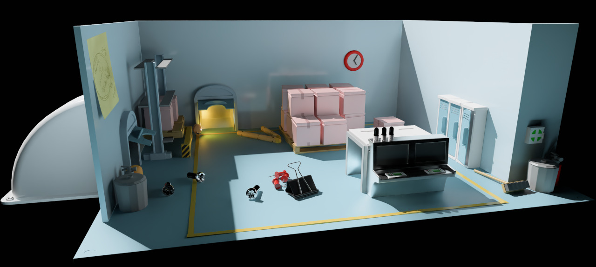

+++
title = "Bevy 0.18"
date = 2026-01-12 
[extra]
public_draft = 2320
status = 'hidden'
# show_image = true
# image = "TODO"
# image_subtitle = "TODO"
# image_subtitle_link = "TODO"
+++

Thanks to **X** contributors, **X** pull requests, community reviewers, and our [**generous donors**](/donate), we're happy to announce the **Bevy 0.18** release on [crates.io](https://crates.io/crates/bevy)!

For those who don't know, Bevy is a refreshingly simple data-driven game engine built in Rust. You can check out our [Quick Start Guide](/learn/quick-start) to try it today. It's free and open source forever! You can grab the full [source code](https://github.com/bevyengine/bevy) on GitHub. Check out [Bevy Assets](https://bevy.org/assets) for a collection of community-developed plugins, games, and learning resources.

To update an existing Bevy App or Plugin to **Bevy 0.18**, check out our [0.17 to 0.18 Migration Guide](/learn/migration-guides/0-17-to-0-18/).

Since our last release a few months ago we've added a _ton_ of new features, bug fixes, and quality of life tweaks, but here are some of the highlights:

- **X:** X

<!-- more -->

## Atmosphere Occlusion and PBR Shading

{{ heading_metadata(authors=["@mate-h"] prs=[21383]) }}

The procedural atmosphere now affects how light reaches objects in your scene! Sunlight automatically picks up the right colors as it travels through the atmosphere, appearing orange or red when the sun is closer to the horizon.

This works seamlessly with volumetric fog and all rendering modes, so your scenes will have more cohesive and realistic lighting right out of the box.

Check out the updated [`atmosphere` example] to see it in action!


[`atmosphere` example]: https://github.com/bevyengine/bevy/blob/latest/examples/3d/atmosphere.rs

## Generalized Atmospheric Scattering Media

{{ heading_metadata(authors=["@ecoskey"] prs=[20838]) }}


{{ media_caption(text="A Mars-like atmosphere rendered in Bevy 0.18") }}

Until now, Bevy's atmospheric scattering system has been fast and beautiful, but
not very customizable. There's only a limited number of ways to customize the
existing parameters, which constrain the system to mostly earth-like scenes.

**Bevy 0.18** introduces a new [`ScatteringMedium`] asset for designing atmospheric
scattering media of all kinds: clear desert skies, foggy coastlines, and
even atmospheres of other planets! We've used Bevy's asset system to the
fullest--alongside some custom optimizations--to make sure rendering stays
fast even for complicated scattering media.

```rust
fn setup_camera(
    mut commands: Commands,
    mut media: ResMut<Assets<ScatteringMedium>>,
) {
    // Also feel free to use `ScatteringMedium::earthlike()`!
    let medium = media.add(ScatteringMedium::new(
        256,
        256,
        [
            ScatteringTerm {
                absorption: Vec3::ZERO,
                scattering: Vec3::new(5.802e-6, 13.558e-6, 33.100e-6),
                falloff: Falloff::Exponential { strength: 12.5 },
                phase: PhaseFunction::Rayleigh,
            },
            ScatteringTerm {
                absorption: Vec3::splat(3.996e-6),
                scattering: Vec3::splat(0.444e-6),
                falloff: Falloff::Exponential { strength: 83.5 },
                phase: PhaseFunction::Mie { asymmetry: 0.8 },
            },
            ScatteringTerm {
                absorption: Vec3::new(0.650e-6, 1.881e-6, 0.085e-6),
                scattering: Vec3::ZERO,
                falloff: Falloff::Tent {
                    center: 0.75,
                    width: 0.3,
                },
                phase: PhaseFunction::Isotropic,
            },
        ],
    ));

    commands.spawn((
        Camera3d,
        Atmosphere::earthlike(medium)
    ));
}
```

[`ScatteringMedium`]: https://docs.rs/bevy/0.18.0/bevy/pbr/struct.ScatteringMedium.html

## Solari Improvements

{{ heading_metadata(authors=["@JMS55", "@SparkyPotato"] prs=[21391, 21355, 21810]) }}


Solari - Bevy's forward-looking realtime raytraced renderer - has seen many improvements in this release. Notably:

- Support for specular materials and reflections
- Faster-reacting lighting
- A large amount of quality/accuracy improvements
- Physically-based soft shadows for directional lights
- Improved performance on larger scenes



For the full list of details, check out the author's [full blog post](https://jms55.github.io/posts/2025-12-27-solari-bevy-0-18).

## More Standard Widgets

{{ heading_metadata(authors=["@viridia", "@PPakalns"] prs=[21636, 21743, 21294]) }}

We are continuing to flesh out the collection of standard widgets first introduced in
**Bevy 0.17**. Note that Bevy's standard widgets are "logical widgets". They are "unthemed".

### Popover

The [`Popover`] component can be placed on an absolutely-positioned UI node to provide
automatic popup positioning. This is inspired by the popular [`floating-ui`] npm package.

Popovers will be placed relative to an anchor element, and positioned so that they don't get
cut off by the window edge. You can specify a list of preferred "placements": top, bottom,
left or right, along with alignment options for each. If the popup is so large that it's
impossible to position it without it getting cut off, it will choose the placement that results
in the most visibility (as determined by the area cut off). (A future version might also
have an option to constrain the popup to be no larger than the window size, but this will be
more useful once we have better support for scrolling.)

This automatic positioning is dynamic, which means that if the anchor element moves around, is
inside a scrolling container, or the window is resized, the popover may "flip" sides in order to
remain fully visible.

Popovers can be used for dropdown menus, but they can also be used for tooltips.

[`floating-ui`]: https://www.npmjs.com/package/@floating-ui/core
[`Popover`]: https://docs.rs/bevy/0.18.0/bevy/ui_widgets/popover/struct.Popover.html

### Menu

The [`MenuPopup`] component uses [`Popover`] to provide a dropdown menu widget. This adds events for opening
and closing the menu, along with keyboard navigation and activation using the focus system.

[`MenuPopup`]: https://docs.rs/bevy/0.18.0/bevy/ui_widgets/struct.MenuPopup.html

### Improvements to `RadioButton` and `RadioGroup`

Following user testing, we've improved the details of our existing [`RadioButton`] and [`RadioGroup`] widgets,
in a fully backward compatible way:

- Event propagation from user interactions will now be canceled even if
  widgets are disabled. Previously, some relevant event propagation
  was not properly canceled.
- [`RadioButton`] now emits a `ValueChange<bool>` entity event when checked,
  even when checked via a [`RadioGroup`]. Consistent with other `Checkable` widgets.
  As a [`RadioButton`] cannot be unchecked through direct user interaction with this widget,
  a [`ValueChange`] event with value `false` can not be triggered for [`RadioButton`].
- If a [`RadioButton`] is focusable, a value change event can be triggered
  using the **Space** or **Enter** keys when focused.
- [`RadioGroup`] is now optional and can be replaced with a custom implementation.

[`RadioButton`]: https://docs.rs/bevy/0.18.0/bevy/ui_widgets/struct.RadioButton.html
[`RadioGroup`]: https://docs.rs/bevy/0.18.0/bevy/ui_widgets/struct.RadioGroup.html
[`ValueChange`]: https://docs.rs/bevy/0.18.0/bevy/ui_widgets/struct.ValueChange.html

## Bevy Feathers Widget: Color Plane

{{ heading_metadata(authors=["@viridia"] prs=[21743]) }}

In our last release we introduced [Bevy Feathers](/news/bevy-0-17/#bevy-feathers-widgets-for-tooling-experimental), an experimental new widget library for building tooling (such as the upcoming Bevy Editor).

In **Bevy 0.18** we've added the [`ColorPlane`] widget: a two-dimensional color picker that allows selecting two different channels within a color space, one along the horizontal axis and one along the vertical. It can be
configured to display a variety of different color spaces: hue vs. lightness, hue vs. saturation,
red vs. blue, and so on.


[`ColorPlane`]: https://docs.rs/bevy/0.18.0/bevy/feathers/controls/enum.ColorPlane.html

## First-party camera controllers

{{ heading_metadata(authors=["@alice-i-cecile", "@syszery"] prs=[20215, 21450, 21520]) }}

To understand a scene, you must look at it through the lens of a camera: explore it, and interact with it.
Because this is such a fundamental operation, game devs have developed a rich collection of tools
called "camera controllers" for manipulating them.

Getting camera controllers feeling _right_ is both tricky and essential: they have a serious
impact on both the feeling of your game and the usability of your software.

Historically, Bevy has left this entirely up to individual game developers:
camera controllers require deep customization and endless twiddling.
However, Bevy as a game engine needs its _own_ camera controllers:
allowing users to quickly and easily explore scenes during development (rather than gameplay).

To that end, we've created [`bevy_camera_controller`]: giving us a place to store, share and refine the camera controllers
that we need for easy development, and yes, an eventual Bevy Editor.
We're kicking it off with a couple of camera controllers, detailed below.

[`bevy_camera_controller`]: https://docs.rs/bevy/0.18.0/bevy/camera_controller/index.html

### `FreeCamera`

The first camera controller that we've introduced is a "free camera", designed for quickly moving around a scene,
completely ignoring both physics and geometry.
You may have heard of a "fly camera" controller before, which is a specialization of a "free camera" controller
designed for fast and fluid movement for covering large amounts of terrain.

Many Bevy examples now use [`FreeCamera`], including the `solari` example (which demos Bevy's experimental raytraced renderer):

<video controls loop><source src="free_camera.mp4" type="video/mp4"/></video>

To add a free camera controller to your project (typically under a `dev_mode` feature flag),
add the [`FreeCameraPlugin`] and the [`FreeCamera`] component to your camera entity.

To configure the settings (speed, behavior, keybindings) or enable / disable the controller modify the [`FreeCamera`] component.
We've done our best to select good defaults, but the details of your scene (especially the scale!) will make a big
difference to what feels right.

[`FreeCameraPlugin`]: https://docs.rs/bevy/0.18.0/bevy/camera_controller/free_camera/struct.FreeCameraPlugin.html
[`FreeCamera`]: https://docs.rs/bevy/0.18.0/bevy/camera_controller/free_camera/struct.FreeCamera.html

### `PanCamera`

The [`PanCamera`] controller is a simple and effective tool designed for 2D games or any project where you need
to pan the camera and zoom in/out with ease. It allows you to move the camera using the WASD keys and zoom
in and out with the mouse wheel or +/- keys.

By adding the [`PanCameraPlugin`] and attaching the [`PanCamera`] component to your camera entity, you can quickly add
this controller to your project.

To configure the camera's zoom levels, speed, or keybindings, simply modify the [`PanCamera`] component. The default
settings should work well for most use cases, but you can adjust them based on your specific needs, especially
for large-scale or high-resolution 2D scenes.

[`PanCamera`]: https://docs.rs/bevy/0.18.0/bevy/camera_controller/pan_camera/struct.PanCamera.html
[`PanCameraPlugin`]: https://docs.rs/bevy/0.18.0/bevy/camera_controller/pan_camera/struct.PanCameraPlugin.html

### Using `bevy_camera_controller` in your own projects

The provided camera controllers are designed to be functional, pleasant debug and dev tools:
add the correct plugin and camera component and you're good to go!

They can also be useful for prototyping, giving you a quick-and-dirty camera controller
as you get your game off the ground.

However, they are deliberately _not_ architected to give you the level of extensibility and customization
needed to make a production-grade camera controller for games.
Customizatibility comes with a real cost in terms of user experience and maintainability,
and because each project only ever needs one or two distinct camera controllers, exposing more knobs and levers is often a questionable design.
Instead, consider vendoring (read: copy-pasting the source code) the camera controller you want to extend
into your project and rewriting the quite-approachable logic to meet your needs,
or looking for [ecosystem camera crates](https://bevy.org/assets/#camera) that correspond to the genre you're building in.

## Automatic Directional Navigation

{{ heading_metadata(authors=["@jbuehler23"] prs=[21668, 22340]) }}

Bevy now supports **automatic directional navigation** for UI elements! With a bit of global setup, 
all of your UI elements can now be navigated between using gamepads or arrow keys.
No more tedious manual wiring of navigation connections for your menus and UI screens.

Previously, creating directional navigation for UI required manually defining every connection between focusable elements using [`DirectionalNavigationMap`]. For dynamic UIs or complex layouts, this was time-consuming and error-prone.

Now, you can simply add the [`AutoDirectionalNavigation`] component to your UI entities, and Bevy will automatically compute navigation connections based on spatial positioning. The system parameter intelligently finds the nearest neighbor in each of the 8 compass directions (North, Northeast, East, etc.), considering:

- **Distance**: Closer elements are preferred
- **Alignment**: Elements that are more directly in line with the navigation direction are favored
- **Overlap**: For cardinal directions (N/S/E/W), the system ensures sufficient perpendicular overlap

[`DirectionalNavigationMap`]: https://docs.rs/bevy/0.18.0/bevy/input_focus/directional_navigation/struct.DirectionalNavigationMap.html
[`AutoDirectionalNavigation`]: https://docs.rs/bevy/0.18.0/bevy/ui/auto_directional_navigation/struct.AutoDirectionalNavigation.html

### How to Use It

Simply add the [`AutoDirectionalNavigation`] component to the UI entities you want users to be able to navigate between:

```rust
commands.spawn((
    Button,
    Node { /* ... */ },
    AutoDirectionalNavigation::default(),
    // ... other components
));
```

To leverage automatic navigation, use the [`AutoDirectionalNavigator`] system parameter instead of the [`DirectionalNavigation`] system parameter:

```rust
fn my_navigation_system(mut auto_directional_navigator: AutoDirectionalNavigator) {
    // ...
    auto_directional_navigator.navigate(CompassOctant::East);
    // ...
}
```

[`AutoDirectionalNavigator`]: https://docs.rs/bevy/0.18.0/bevy/ui/auto_directional_navigation/struct.AutoDirectionalNavigator.html
[`DirectionalNavigation`]:https://docs.rs/bevy/0.18.0/bevy/input_focus/directional_navigation/struct.DirectionalNavigation.html

### Configuration

You can tune the behavior using the [`AutoNavigationConfig`] resource:

```rust
app.insert_resource(AutoNavigationConfig {
    // Minimum overlap required (0.0 = any overlap, 1.0 = perfect alignment)
    min_alignment_factor: 0.0,
    // Optional maximum distance for connections
    max_search_distance: Some(500.0),
    // Whether to strongly prefer well-aligned nodes
    prefer_aligned: true,
});
```

[`AutoNavigationConfig`]: https://docs.rs/bevy/0.18.0/bevy/input_focus/directional_navigation/struct.AutoNavigationConfig.html

### Manual Override

Automatic navigation respects manually-defined edges. If you want to override specific connections (e.g. screen-edge looping),
you can still use `DirectionalNavigationMap::add_edge()` or `add_symmetrical_edge()`, and those connections will take precedence over the auto-generated ones.
You may also call `auto_generate_navigation_edges()` directly, if you have multiple UI layers (though may not be widely used)

## Fullscreen Material

{{ heading_metadata(authors=["@IceSentry"] prs=[20414]) }}

Users often want to run a fullscreen shader but currently the only to do this is to copy the custom_post_processing example which is very verbose and contains a lot of low level details. We introduced a new [`FullscreenMaterial`] trait and [`FullscreenMaterialPlugin`] that let you easily run a fullscreen shader and specify in which order it will run relative to other render passes in the engine.

[`FullscreenMaterial`]: https://docs.rs/bevy/0.18.0/bevy/core_pipeline/fullscreen_material/trait.FullscreenMaterial.html
[`FullscreenMaterialPlugin`]: https://docs.rs/bevy/0.18.0/bevy/core_pipeline/fullscreen_material/struct.FullscreenMaterialPlugin.html

## Row-wise data access

{{ heading_metadata(authors=["@hymm"] prs=[21780]) }}

When working with an ECS, the most natural (and efficient) way to access data is to read and modify the same components
across multiple entities in a batch, using queries in a way that's analogous to extracting columns from a database.
But from time-to-time, users want to consider an entity in its entirety, peering across the entire row.

This approach is much more similar to the traditional "game object" model that users may be familiar with in other game engines,
and can be particularly useful when implementing complex, non-performance-critical logic like writing a character controller.
It also tends to mesh better with other languages and external tools, making it a tempting design for scripting, modding and integration work. 

In theory, doing so should be fairly straightforward, if a bit slow:
we're dividing access to our world into slices across a different axis, but still being careful to avoid forbidden aliasing.
[Initial attempts at implementing this] ran into some difficulty though,
with subtle soundness problems detected during code review.

As a result, we previously introduced unsafe methods for this: `get_components_mut_unchecked`.
These methods are relatively fast (look mom no checks!), but unsafe is frightening and cumbersome to work with,
particularly for an API that's designed for convenience and often most attractive to newcomers.

In Bevy 0.18, we're finally introducing safe equivalents, in the form of [`EntityMut::get_components_mut`] and [`EntityWorldMut::get_components_mut`].
These methods allow you to access multiple mutable or imutable references to the components on a single entity.
To ensure that we don't hand out multiple mutable references to the same data, these APIs use quadratic time complexity (over the number of components accessed)
runtime checks, safely erroring if illegal access was requested.

Quadratic time complexity is bad news, but in many cases, the list of components requested is very small:
two, three or even ten distinct components are not terrible to check outside of a hot loop.
However, some applications (such as scripting interfaces) may still be best suited to using the unsafe API,
relying on other methods to ensure soundness with a lower performance cost.

[Initial attempts at implementing this]: (https://github.com/bevyengine/bevy/pull/13375)
[`EntityMut::get_components_mut`]: https://docs.rs/bevy/latest/bevy/prelude/struct.EntityMut.html#method.get_components_mut_unchecked
[`EntityWorldMut::get_components_mut`]: https://docs.rs/bevy/latest/bevy/prelude/struct.EntityWorldMut.html#method.get_components_mut_unchecked

## Cargo Feature Collections

{{ heading_metadata(authors=["@cart"] prs=[21472]) }}

Historically, Bevy developers have lived one of two lifestyles:

1. Use all of Bevy's default features, potentially compiling many unwanted or unneeded features.
2. Disable Bevy's default features and manually define the complete list of features.

Living in the world of (2) was an exercise in frustration, as the list of bevy features is _massive_ and the features required to accomplish a given task changes regularly across releases. This was an _expert level_ task that required intimate knowledge of engine internals to get right.

**Bevy 0.18** introduces high-level "cargo feature collections" to the `bevy` crate: `2d`, `3d`, and `ui`. This enables developers to easily select the kind of app they want to build, and only compile the pieces of Bevy needed for that app.

This means scenarios like using Bevy as a UI framework, without pulling in the rest of the engine, are now as easy as:

```toml
bevy = { version = "0.18", default-features = false, features = ["ui"] }
```

We've also added mid-level feature collections like `2d_api`, which is Bevy's 2D API _without the default Bevy renderer_. This makes it much easier to swap out the default Bevy renderer for a custom one.

For example, the `2d` profile looks like this:

```toml
2d = [
  "default_app",
  "default_platform",
  "2d_api",
  "2d_bevy_render",
  "ui",
  "scene",
  "audio",
  "picking",
]
```

Someone building a custom 2D renderer now just needs to remove `2d_bevy_render` and provide their own.

Developers can now define their own high-level cargo feature profiles from these mid-level pieces, making it _much_ easier to define the subset of Bevy you want to build into your app.

## Font variations

{{ heading_metadata(authors=["@ickshonpe", "@hansler"] prs=[19020, 21555, 21559, 22038]) }}

**Bevy 0.18** brings more control over how your fonts are expressed!

### Text Strikethroughs and Underlines

`bevy_text` now supports strikethrough and underline. To display text with strikethrough or underline, just add the [`Strikethrough`] or [`Underline`] components to any [`Text`], [`Text2d`], or [`TextSpan`] entity. You can set colors for strikethrough and underline using the [`StrikethroughColor`] and [`UnderlineColor`] components, respectively.

[`Strikethrough`]: https://docs.rs/bevy/0.18.0/bevy/prelude/struct.Strikethrough.html
[`Underline`]: https://docs.rs/bevy/0.18.0/bevy/prelude/struct.Underline.html
[`Text`]: https://docs.rs/bevy/0.18.0/bevy/prelude/struct.Text.html
[`Text2d]: https://docs.rs/bevy/0.18.0/bevy/prelude/struct.Text2d.html
[`TextSection`]: https://docs.rs/bevy/0.18.0/bevy/prelude/struct.TextSection.html
[`StrikethroughColor`]: https://docs.rs/bevy/0.18.0/bevy/prelude/struct.StrikethroughColor.html
[`UnderlineColor`]: https://docs.rs/bevy/0.18.0/bevy/prelude/struct.UnderlineColor.html

### Font Weights

Bevy now supports font weights, allowing you to take advantage of [variable weight fonts] which embed smooth variations of a font into a single file! [`TextFont`] now has a `weight: FontWeight` field. [`FontWeight`] newtypes a `u16` (clamped to a range of 1-1000), with lower values representing thin typefaces and large values representing bold typefaces.


[variable weight fonts]: https://developer.mozilla.org/en-US/docs/Web/CSS/Guides/Fonts/Variable_fonts
[`TextFont`]: https://docs.rs/bevy/0.18.0/bevy/prelude/struct.TextFont.html
[`FontWeight`]: https://docs.rs/bevy/0.18.0/bevy/prelude/struct.FontWeight.html

### OpenType Font Features

[OpenType font features] allow fine-grained control over how text is displayed, including [ligatures](https://en.wikipedia.org/wiki/Ligature_(writing)), [small caps](https://en.wikipedia.org/wiki/Small_caps), and [many more](https://learn.microsoft.com/en-us/typography/opentype/spec/featurelist).

These features can now be used in Bevy, allowing users to add typographic polish (like discretionary ligatures and oldstyle numerals) to their UI. It also allows complex scripts like Arabic or Devanagari to render more correctly with their intended ligatures.

Example usage:

```rust
commands.spawn((
  TextSpan::new("Ligatures: ff, fi, fl, ffi, ffl"),
  TextFont {
    font: opentype_font_handle,
    font_features: FontFeatures::builder()
      .enable(FontFeatureTag::STANDARD_LIGATURES)
      .set(FontFeatureTag::WIDTH, 300)
      .build(),
    ..default()
  },
));
```

[`FontFeatures`] can also be constructed from a list:

```rust
TextFont {
  font: opentype_font_handle,
  font_features: [
    FontFeatureTag::STANDARD_LIGATURES,
    FontFeatureTag::STYLISTIC_ALTERNATES,
    FontFeatureTag::SLASHED_ZERO
  ].into(),
  ..default()
}
```

Note that OpenType font features are only available for `.otf` fonts that support them, and different fonts may support different subsets of OpenType features.

[OpenType font features]: https://developer.mozilla.org/en-US/docs/Web/CSS/Guides/Fonts/OpenType_fonts
[`FontFeatures`]: https://docs.rs/bevy/0.18.0/bevy/text/struct.FontFeatures.html

## Per text-section picking

{{ heading_metadata(authors=["@ickshonpe"] prs=[22047]) }}

Individual text sections belonging to UI text nodes are now pickable, allowing them to be selected,
and can be given observers to respond to user interaction.

This functionality is useful when creating hyperlink-like behavior,
and allows users to create mouse-over tooltips for specific keywords in their games.

## glTF Extensions

{{ heading_metadata(authors=["@christopherbiscardi"] prs=[22106]) }}

[glTF] is a popular open format for 3D models and scenes, and serves as Bevy's primary 3D format.
When making games however, simply relying on the built-in data fields for your objects is not enough.
Additional information like physics colliders or special rendering properties are typically best kept directly with the models.

glTF has two mechanisms for extending glTF files with additional user data: extras and extensions.

**Extras** are meant to be arbitrary application-specific data, often authored by users directly in tools like Blender's custom properties.
Extras are historically well supported by Bevy; if you add a custom property in Blender that data will end up in one of the [`GltfExtras`] components on the relevant entity.

**Extensions** are meant for data that can be shared across applications.
They are more flexible, allowing for new data in more places inside a glTF file, and more powerful as a result.
Extensions can add new object types, such as `lights` from the `KHR_lights_punctual` extension, as well as arbitrary buffers, data that is at the root of the glTF file, and more.

Prior to 0.18, the code to handle extensions like [`KHR_lights_punctual`] was hardcoded into Bevy's glTF loader.
Now, users may implement the [`GltfExtensionHandler`] trait to do stateful processing of glTF data as it loads.

Processing _extension_ data is only half the story here because to process extension data you also have to be able to process the non-extension data like meshes, materials, animations, and more.

Extension handlers can be written for wide variety of use cases, including:

- Insert Bevy Component data on entities
- Convert all [`Mesh3d`] components to [`Mesh2d`]
- Build [`AnimationGraph`]s and insert them on animation roots
- Replace [`StandardMaterial`] with custom materials
- Insert lightmaps

We've added two new examples to show off common use cases:

- [`gltf_extension_animation_graph`] builds an [`AnimationGraph`] and inserts it onto the animation root in a Scene, which means it is now accessible to play animations using the [`AnimationPlayer`] on the same entity later when that scene is spawned.
- [`gltf_extension_mesh_2d`] uses a [`GltfExtensionHandler`] to switch the 3d mesh and material components for their 2d counterparts. This is useful if you're using software like Blender to build 2d worlds.

[`AnimationPlayer`]: https://docs.rs/bevy/0.18.0-rc.2/bevy/animation/struct.AnimationPlayer.html
[glTF]: https://en.wikipedia.org/wiki/GlTF
[`KHR_lights_punctual`]:https://github.com/KhronosGroup/glTF/blob/main/extensions/2.0/Khronos/KHR_lights_punctual/README.md
[`GltfExtensionHandler`]: https://docs.rs/bevy/0.18.0/bevy/gltf/extensions/trait.GltfExtensionHandler.html
[`GltfExtras`]: https://docs.rs/bevy/0.18.0/bevy/gltf/struct.GltfExtras.html
[`Mesh3d`]: https://docs.rs/bevy/0.18.0/bevy/mesh/struct.Mesh3d.html
[`Mesh2d`]:https://docs.rs/bevy/0.18.0/bevy/mesh/struct.Mesh2d.html
[`AnimationGraph`]: https://docs.rs/bevy/0.18.0/bevy/animation/graph/struct.AnimationGraph.html
[`StandardMaterial`]: https://docs.rs/bevy/0.18.0/bevy/pbr/struct.StandardMaterial.html
[`gltf_extension_animation_graph`]: https://github.com/bevyengine/bevy/blob/latest/examples/gltf/gltf_extension_animation_graph.rs
[`gltf_extension_mesh_2d`]: https://github.com/bevyengine/bevy/blob/latest/examples/gltf/gltf_extension_mesh_2d.rs

### Integration with external authoring tools

Extensions typically require an application that is _producing_ the data as well as _consuming_ the data.

For example, [Skein] defines a glTF extension that allows adding Bevy Components to glTF objects.
This is most commonly produced by Blender and consumed by Skein's [`GltfExtensionHandler`] in Bevy.
These components are then inserted on entities in a scene at the same time built-in components like [`Transform`] and [`Mesh3d`] are.

Using glTF Extensions for this data means that other level editors like Trenchbroom can also write the same format to glTF files.
Any third party software that writes component data into a glTF file can use Skein's [`GltfExtensionHandler`], resulting in components being "ready-to-go" when spawning [`Scene`]s.

[Skein]: https://github.com/rust-adventure/skein
[`Transform`]: https://docs.rs/bevy/0.18.0/bevy/prelude/struct.Transform.html
[`Scene`]: https://docs.rs/bevy/0.18.0/bevy/prelude/struct.Scene.html

## Short-type-path asset processors

{{ heading_metadata(authors=["@andriyDev"] prs=[21339]) }}

Asset processors allow manipulating assets at "publish-time" to convert them into a more optimal
form when loading the data at runtime. This can either be done using a default processor, which
processes all assets with a particular file extension, or by specifying the processor in the asset's
meta file.

In previous versions of Bevy, the processor had to be **fully** specified in the asset's meta file.
For example:

```ron
(
    meta_format_version: "1.0",
    asset: Process(
        processor: "bevy_asset::processor::process::LoadTransformAndSave<asset_processing::CoolTextLoader, asset_processing::CoolTextTransformer, asset_processing::CoolTextSaver>",
        settings: (
            loader_settings: (),
            transformer_settings: (),
            saver_settings: (),
        ),
    ),
)
```

As you can see, processor types can be very verbose! In order to make these meta files easier to
manipulate, we now also support using the "short type path" of the asset. This would look like:

```ron
(
    meta_format_version: "1.0",
    asset: Process(
        processor: "LoadTransformAndSave<CoolTextLoader, CoolTextTransformer, CoolTextSaver>",
        settings: (
            loader_settings: (),
            transformer_settings: (),
            saver_settings: (),
        ),
    ),
)
```

## Render Assets diagnostics

{{ heading_metadata(authors=["@hukasu"] prs=[19311]) }}

Create diagnostics plugins `MeshAllocatorDiagnosticPlugin`, `MaterialAllocatorDiagnosticPlugin`,
`RenderAssetDiagnosticPlugin`, and `ErasedRenderAssetDiagnosticPlugin`, that collect measurements
related to `MeshAllocator`s, `MaterialBindGroupAllocator`, `RenderAssets`, and `ErasedRenderAssets`
respectively.

`MeshAllocatorDiagnosticPlugin` and `MaterialDiagnosticPlugin` measure the number of slabs, the total size of memory
allocated by the slabs, and the number of objects allocated in the slabs. Only bindless materials use slabs for their
allocations, non-bindless materials return 0 for all of them.

`RenderAssetDiagnosticsPlugin<RA>` and `ErasedAssetDiagnosticsPlugin<ERA>` measure the number of
assets in `RenderAssets<RA>` and `ErasedRenderAssets<ERA::ErasedAsset>`. `ErasedAssetDiagnosticsPlugin<ERA>`
will report the same number of assets for all `ERA` that share the same `ERA::ErasedAsset`.

```rust
app.add_plugins(DefaultPlugins)
    .add_plugins((
        MeshAllocatorDiagnosticPlugin,
        MaterialAllocatorDiagnosticPlugin::<StandardMaterial>::default(),
        RenderAssetDiagnosticPlugin::<RenderMesh>::new(" render meshes"),
        RenderAssetDiagnosticPlugin::<GpuImage>::new(" gpu images"),
        // ImageMaterial is the name of the manual material used on the `manual_material` example
        ErasedRenderAssetDiagnosticPlugin::<ImageMaterial>::new(" image materials"),
    ));
```

If you also have `LogDiagnosticsPlugin`, the output looks something like this:

```ignore
INFO bevy_diagnostic: mesh_allocator_allocations                                             :    4.000000 meshes (avg 4.000000 meshes)
INFO bevy_diagnostic: mesh_allocator_slabs                                                   :    4.000000 slabs (avg 4.000000 slabs)
INFO bevy_diagnostic: mesh_allocator_slabs_size                                              : 4194360.000000 bytes (avg 4194360.000000 bytes)
INFO bevy_diagnostic: material_allocator_allocations/bevy_pbr::pbr_material::StandardMaterial:   14.000000 materials (avg 14.000000 materials)
INFO bevy_diagnostic: material_allocator_slabs/bevy_pbr::pbr_material::StandardMaterial      :    1.000000 slabs (avg 1.000000 slabs)
INFO bevy_diagnostic: material_allocator_slabs_size/bevy_pbr::pbr_material::StandardMaterial :  576.000000 bytes (avg 576.000000 bytes)
INFO bevy_diagnostic: render_asset/bevy_render::mesh::RenderMesh                             :    5.000000 render meshes (avg 5.000000 render meshes)
INFO bevy_diagnostic: render_asset/bevy_render::texture::gpu_image::GpuImage                 :   10.000000 gpu images (avg 10.000000 gpu images)
INFO bevy_diagnostic: erased_render_asset/manual_material::ImageMaterial                     :    2.000000 image materials (avg 2.000000 image materials)
```

## Easy Marketing Material

{{ heading_metadata(authors=["@mockersf"] prs=[21235, 21237]) }}

Making an awesome, beautiful game is only half the battle: you need to be able to show it to people too!

Bevy has been able to take a screenshot of what's rendered since 0.11.
Despite how useful this functionality is for quickly creating marketing material,
setting it up was relatively involved.

This process has been streamlined, with the new [`EasyScreenshotPlugin`] allowing you to take a screenshot with consistent formatting with a single button press. With its default settings, once you add this plugin to your application, a PNG screenshot will be taken when you press the `PrintScreen` key. You can change the trigger key, or the screenshot format between PNG, JPEG or BMP.

We've taken this one step further, allowing you to record video directly from Bevy, with the new [`EasyScreenRecordPlugin`]. This plugins add a toggle key, space bar by default, that will toggle screen recording. Recording can also be started and stopped programmatically with the [`RecordScreen`] messages.

Screen recording is currently not supported on Windows due to challenges with video codecs.
While all dev-tools features are off-by default, screen recording is a bit trickier to activate due to this limitation.
To enable it, toggle the `screenrecording` feature in the `bevy_dev_tools` crate.

[`EasyScreenshotPlugin`]: https://docs.rs/bevy/0.18.0/bevy/dev_tools/struct.EasyScreenshotPlugin.html
[`EasyScreenRecordPlugin`]: https://dev-docs.bevy.org/bevy/dev_tools/struct.EasyScreenRecordPlugin.html
[`RecordScreen]: https://dev-docs.bevy.org/bevy/dev_tools/enum.RecordScreen.html

## Remove Systems from Schedules

{{ heading_metadata(authors=["@hymm"] prs=[20298]) }}

Previously, the only way to prevent a scheduled system from running was to use [run conditions].
This works well for dynamically toggling whether or not a system runs, but comes with a tiny overhead
each time the schedule is run.

Now, you can completely remove systems from a schedule using [`remove_systems_in_set`]
forcing an expensive schedule rebuild but removing that overhead completely and removing
the systems from any debug tools.

Run conditions (and dedicated schedules run on demand) remain a better tool for most cases,
but completely removing systems may be an attractive option when opting-out of undesired plugin behavior,
modding or changing game settings.

```rust
app.add_systems((system_a, (system_b, system_c).in_set(MySet)));

// remove a system
schedule.remove_systems_in_set(my_system, ScheduleCleanupPolicy::RemoveSystemsOnly);

// remove systems in a set
app.remove_systems_in_set(MySet, ScheduleCleanupPolicy::RemoveSetAndSystems);
```

[`remove_systems_in_set`]: https://docs.rs/bevy/0.18.0/bevy/prelude/struct.App.html#method.remove_systems_in_set
[run conditions]: https://docs.rs/bevy/0.18.0/bevy/prelude/trait.SystemCondition.html

## UI nodes that ignore parent scroll position.

{{ heading_metadata(authors=["@PPakalns"] prs=[21648]) }}

We've added the [`IgnoreScroll`] component, which controls whether a UI element ignores its parent’s `ScrollPosition` along specific axes.

This can be used to achieve basic sticky row and column headers in scrollable UI layouts. See the [`scroll` example] for a demonstration!

[`scroll` example]: https://github.com/bevyengine/bevy/blob/latest/examples/ui/scroll.rs
[`IgnoreScroll`]: https://docs.rs/bevy/0.18.0/bevy/prelude/struct.IgnoreScroll.html 

## Interpolation for colors and layout

{{ heading_metadata(authors=["@viridia"] prs=[21633]) }}

Bevy's [`StableInterpolate`] trait is a lovely foundation for animation,
but sadly there's one important type that it doesn't work with:
the [`Val`] type from `bevy_ui`, used to control the layout of UI elements.
[`Val`] is an enum, representing different length units such as pixels and percentages, and it's not generally possible or even meaningful to
try and interpolate between different units.

However, it's common to want to animate [`Val`] in a way that doesn't require mixing units:
often we just want to slide or stretch the length of a widget such as a toggle switch. We can do this so long as we
check at runtime that both interpolation control points are in the same units.

The new [`TryStableInterpolate`] trait introduces the idea of interpolation that can fail, by returning
a `Result`. Note that "failure" in this case is not necessarily bad: it just means that the
animation player will need to modify the parameter in some other way, such as "snapping" or
"jumping" to the new keyframe without smoothly interpolating. This lets us create complex animations
that incorporate both kinds of parameters: ones that interpolate, and ones that don't.

We've added a blanket implementation of [`TryStableInterpolate`] for all types that impl
[`StableInterpolate`], and these can never fail. There are additional impls for [`Color`] and [`Val`],
which can fail if the control points are not in the same units / color space.

[`StableInterpolate`]: https://docs.rs/bevy/0.18.0/bevy/math/trait.StableInterpolate.html
[`Val`]: https://docs.rs/bevy/0.18.0/bevy/prelude/enum.Val.html
[`Color`]: https://docs.rs/bevy/0.18.0/bevy/color/enum.Color.html
[`TryStableInterpolate`]: https://docs.rs/bevy/0.18.0/bevy/math/trait.TryStableInterpolate.html

## The `AssetReader` trait can now (optionally) support seeking any direction.

{{ heading_metadata(authors=["@andriyDev", "@cart"] prs=[22182]) }}

_TODO: This release note is not up to date with the changes in [#22182](https://github.com/bevyengine/bevy/pull/22182)._

In Bevy 0.15, we replaced the `AsyncSeek` super trait on `Reader` with `AsyncSeekForward`. This
allowed our `Reader` trait to apply to more cases (e.g., it could allow cases like an HTTP request,
which may not support seeking backwards). However, it also meant that we could no longer use seeking
fully where it was available.

To resolve this issue, we now allow `AssetLoader`s to provide a `ReaderRequiredFeatures` to the
`AssetReader`. The `AssetReader` can then choose how to handle those required features. For example,
it can return an error to indicate that the feature is not supported, or it can choose to use a
different `Reader` implementation to fallback in order to continue to support the feature.

This allowed us to bring back the "requirement" the `Reader: AsyncSeek`, but with a more relaxed
policy: the `Reader` may choose to avoid supporting certain features (corresponding to fields in
`ReaderRequiredFeatures`).

Our general recommendation is that if your `Reader` implementation does not support a feature, make
your `AssetReader` just return an error for that feature. Usually, an `AssetLoader` can implement a
fallback itself (e.g., reading all the data into memory and then loading from that), and loaders can
be selected using `.meta` files (allowing for fine-grained opt-in in these cases). However if there
is some reasonable implementation you can provide (even if not optimal), feel free to provide one!

## What's Next?

The features above may be great, but what else does Bevy have in flight?
Peering deep into the mists of time (predictions are _extra_ hard when your team is almost all volunteers!), we can see some exciting work taking shape:

- **X:** X

{{ support_bevy() }}

{{ contributors(version="0.18") }}

For those interested in a complete changelog, you can see the entire log (and linked pull requests) via the [relevant commit history](https://github.com/bevyengine/bevy/compare/v0.17.0...v0.18.0).
