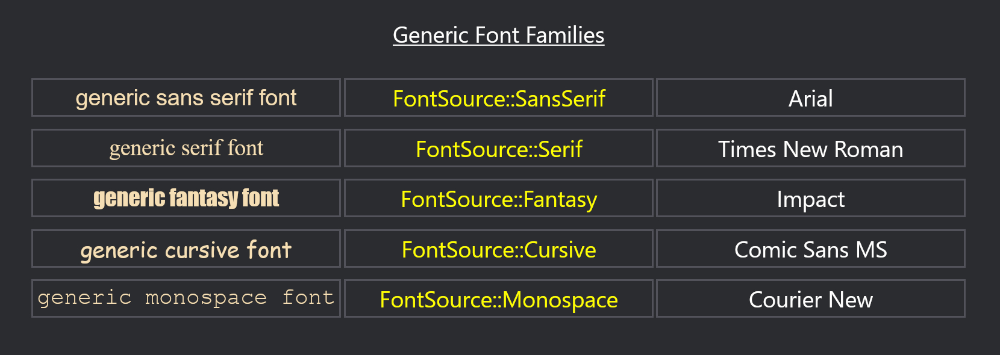
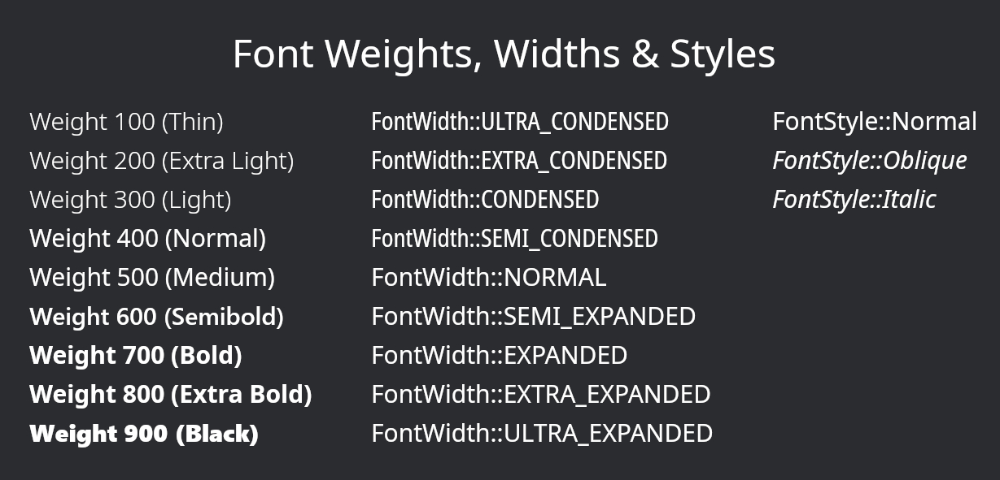
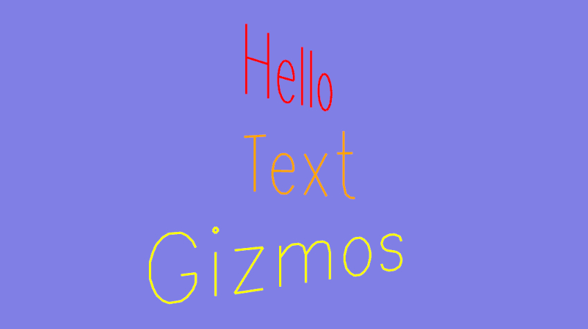

+++
title = "Bevy 0.19"
date = 2026-06-14
[extra]
show_image = true
image = "fields_of_aaru.jpg"
image_subtitle = "Fields of Aaru: a cozy life sim set in the mystical afterlife of Ancient Egypt. Made with Bevy!"
image_subtitle_link = "https://store.steampowered.com/app/4410710/Fields_of_Aaru/"
public_draft = 2474
status = 'hidden'
+++

Thanks to **X** contributors, **X** pull requests, community reviewers, and our [**generous donors**](/donate), we're happy to announce the **Bevy 0.19** release on [crates.io](https://crates.io/crates/bevy)!

For those who don't know, Bevy is a refreshingly simple data-driven game engine built in Rust. You can check out our [Quick Start Guide](/learn/quick-start) to try it today. It's free and open source forever! You can grab the full [source code](https://github.com/bevyengine/bevy) on GitHub. Check out [Bevy Assets](https://bevy.org/assets) for a collection of community-developed plugins, games, and learning resources.

To update an existing Bevy App or Plugin to **Bevy 0.19**, check out our [0.17 to 0.18 Migration Guide](/learn/migration-guides/0-18-to-0-19/).

Since our last release a few months ago we've added a _ton_ of new features, bug fixes, and quality of life tweaks, but here are some of the highlights:

- **X**: X

<!-- more -->

## Next Generation Scenes

{{ heading_metadata(authors=["@cart"] prs=[23413, 23880, 23808, 23905, 24008]) }}

**Bevy 0.19** introduces our brand new, massively improved scene system for Bevy. We've been working on this for a _long time_ (years now!), and we are excited to finally get it in the hands of Bevy developers. It makes defining scenes in code (and ultimately in assets produced by the upcoming Bevy Editor) much nicer.

### BSN (Bevy Scene Notation)

BSN is an ergonomic Rust-like scene syntax which can be defined in Rust code via the `bsn!` macro _and_ in `.bsn` asset files. If you were ever bothered by the verbosity and complexity of spawning complex collections of entities in Bevy, you will probably enjoy what BSN has to offer. BSN can be used to spawn anything in the ECS. This benefits all scenarios, but it is worth calling out explicitly that this makes Bevy UI code significantly easier to read and write.

Note that while **Bevy 0.19** supports scene assets, we aren't yet shipping a first-party `.bsn` asset loader. **Bevy 0.19** focuses on the code-driven workflow, and we plan to roll out the asset driven workflow in the next release.

The new scene system is flexible and format-independent: BSN is our recommended default format, but third parties are free to build their own, and we plan to make formats like `glTF` directly compatible.

A `bsn!` expression is essentially a list of components to add to an entity:

```rust
bsn! {
    Player {
        score: 0
    }
    Team::Blue
}
```

So far this looks and behaves much like Bevy's existing `Bundle` (which is _just_ a collection of components). But BSN has a ton of additional superpowers.

### Optional Fields

In BSN, you don't need to specify every field, or use `..Default::default()`. You only need to set the fields you care about, and the rest will have their default values:

```rust
#[derive(Component, Default, Clone)]
struct Player {
    score: usize,
    coins: usize,
}

bsn! {
    Player {
        score: 0
    }
}
```

You can also just specify the type name if you want all the fields to take on their default values:

```rust
bsn! {
    Player
}
```

Fields values can be arbitrary Rust expressions via `{}` syntax:

```rust
bsn! {
    Player { score: {current_points + 10} }
}
```

### BSN Relationships

BSN has first-class support for ECS Relationships. You can spawn related entities (such as children) inline:

```rust
bsn! {
    Player
    Children [
        Sword,
        Shield,
    ]
}
```

This also works for custom relationships:

```rust
bsn! {
    Player
    Inventory [
        Apple,
        Potion,
    ]
}
```

### Scene Functions

You can define reusable BSN functions like this:

```rust
fn player() -> impl Scene {
    bsn! {
        Player
        Children [ Sword, Shield ]
    }
}
```

These can accept and use parameters:

```rust
fn player(name: &str) -> impl Scene {
    bsn! {
        Name(name)
        Player
    }
}
```

### Scenes are Composable Patches

A BSN expression is a "patch", it does not write a "full" instance of every type it defines. This means you can layer scenes on top of each other:

```rust
fn button() -> impl Scene {
    bsn! {
        Button
        Node { width: px(100) }
    }
}

fn my_button() -> impl Scene {
    bsn! {
        button()
        Node { height: px(100) }
    }
}
```

`my_button` will spawn with a `Node { width: px(100), height: px(100) }` component. Components in scenes are initialized to their defaults, and each additional scene layer writes its fields on top of those defaults.

### Scene Assets and Caching

While **Bevy 0.19** doesn't ship with an official `.bsn` asset loader, it _does_ already functionally support scene asset dependencies. We just don't yet include any built-in loaders for them:

```rust
commands.queue_spawn_scene(bsn! {
    :"player.bsn"
    Transform {
        translation: Vec3 { x: 10. }
    }
})
```

This (if there was a `.bsn` asset loader) would spawn a scene that includes the `"player.bsn"` scene asset and patches the "x position" to be `10`. BSN is dependency-aware: if you use `queue_spawn_scene` instead of `spawn_scene`, it will wait to spawn the scene until all dependencies have loaded. `spawn_scene` will always try to spawn the scene immediately ... if it has scene dependencies that aren't loaded yet it will fail.

Also note the `:`, which is "caching" syntax. When first loaded, this will resolve the `"player.bsn"` scene and cache the results for reuse. This makes spawning multiple instances of the scene much cheaper, as it only needs to resolve whatever is layered "on top" of the cached scene.

We're [working](https://github.com/bevyengine/bevy/pull/23576) on an official `.bsn` asset loader, and we also plan on porting Bevy's glTF loader to the new scene system (so you can depend on `"my_scene.gltf"` just like you would a `my_scene.bsn` file). The `bsn!` macro and spawning system already supports scene assets, so if you're feeling adventurous you can try implementing your own Bevy scene format while you wait for ours!

### Scene Lists

`bsn!` / `Scene` corresponds to a single entity. `bsn_list!` / `SceneList` is the same idea, but applied to lists of entities:

```rust
fn players() -> impl SceneList {
    bsn_list! [
        (#Player1 Team::Blue),
        (#Player2 Team::Red),
    ]
}
```

Entities in a `bsn_list!` are comma separated, and the parentheses to visually indicate entity boundaries are optional:

```rust
fn players() -> impl SceneList {
    bsn_list! [
        #Player1 Team::Blue,
        #Player2 Team::Red,
    ]
}
```

The "BSN relationship syntax" seen above (ex: `Children []`) uses `SceneList`. This means you can pass scene lists as arguments to your scenes:

```rust
fn widget(children: impl SceneList) -> impl Scene {
    bsn! {
        Widget
        Children [ {children} ]
    }
}
```

### Observing Events

`bsn!` entities can easily observe events, making it easy to embed "callback-style" behaviors in your scenes:

```rust
fn button() -> impl Scene {
    bsn! {
        Node { width: px(100), height: px(50) }
        on(|press: On<Pointer<Press>>| {
            info!("button pressed!")
        })
    }
}
```

### Templates

A BSN expression actually defines "templates" for components rather than the actual components themselves. A `Template` is essentially a fancy constructor for a type, which produces an output type (such as a Component). Critically, `Template` has access to the `World`, the current entity, and the "scene spawn context". This enables powerful behaviors, such as loading assets from a given asset path and producing asset handles (ex: `Handle<Image>`).

The "old" approach to spawning via bundles required passing in every ECS dependency into a bundle function and manually using that dependency to produce the final value:

```rust
fn player(asset_server: &AssetServer) -> impl Bundle {
    (
        Player {
            score: 10,
            ..Default::default()
        },
        children! [
            Sprite {
                image: asset_server.load("player.png"),
                ..Default::default()
            }
        ]
    )
}

fn setup(mut commands: Commands, asset_server: Res<AssetServer>) {
    commands.spawn(player(&asset_server))
}
```

This gets _quite_ nasty when spawning complex deeply nested scenes with many dependencies.

BSN makes this all much easier:

```rust
fn player() -> impl Scene {
    bsn! {
        Player { score: 10 }
        Children [
            Sprite { image: "player.png" }
        ]
    }
}

fn setup(mut commands: Commands) {
    commands.spawn_scene(player());
}
```

Spawning a scene no longer requires knowing every little dependency it requires internally, and common actions like loading and assigning assets via their paths is simple!

This does mean that BSN requires types to have a `Template`. This is accomplished via the `FromTemplate` trait, which tells BSN what `Template` type it should use for a given `Component`. `FromTemplate` can be derived, which will also generate a `Template` type for your type. Fortunately, most types _do not_ need to derive or implement `FromTemplate` manually. This is because `FromTemplate` and `Template` is automatically implemented for every type that implements `Default` and `Clone`. These types are "templates of themselves" and are just "passed through". You only need to derive `FromTemplate` if you need template features (such as the `Sprite` use case above, which uses a `Handle<Image>` template to accept `"player.png"`).

### Inline Asset Templates

BSN ships with support for "inline assets" via the `asset_value` template:

```rust
fn cube() -> impl Scene {
    bsn! {
        Mesh3d(asset_value(Cuboid::new(1., 1., 1.)))
    }
}
```

Compare that to what was necessary before!

```rust
fn setup(meshes: Res<Assets<Meshes>>) -> impl Bundle {
    let handle = meshes.add(Cuboid::new(1., 1., 1.));
    Mesh3d(handle)
}
```

### Entity Reference Syntax

BSN has special "entity reference syntax" to define an Entity's `Name` component:

```rust
bsn! {
    #FirstPlayer
    Player
}
```

This is essentially the same as:

```rust
bsn! {
    Name("FirstPlayer")
    Player
}
```

However "entity reference syntax" also enables referencing that entity elsewhere in the scene:

```rust
#[derive(Component, FromTemplate)]
struct Reference(Entity);

bsn! {
    #Root
    Children [
        Reference(#Root)
    ]
}
```

You can access _any_ entity reference defined in a given `bsn! {}` scope anywhere else in that scope:

```rust
bsn! {
    References {
        child: #Child,
        grandchild: #Grandchild,
    }
    Children [
        #Child Children [
            #Grandchild
        ]
    ]
}
```

In the context of `bsn_list!`, this enables defining graph structures:

```rust
bsn_list! [
    (#A PointsTo(#B)),
    (#B PointsTo(#A)),
]
```

### Implicit Into

Most values in "field position" support "implicit `.into()`". This means types that can convert into other types can generally skip manual conversion:

```rust
#[derive(Component, Default, Clone)]
struct Foo(String);

bsn! {
    Foo("hello")
}
```

This works because `"hello"` is a `&str`, which has an `Into<String>` implementation. This is especially nice in the context of defining Bevy UI values:

```rust
// Raw Rust
Node {
    border: UiRect::all(Val::Px(2.0))
    ..Default::default()
}

// BSN
Node { border: px(2) }
```

`px(2)` is just a function that produces a `Val::Px(2.0)`, and `UiRect` has an `Into` impl for `Val`, which produces `UiRect::all` (writes the value to all four border "sides"). The ergonomics here are competitive with things like CSS, but it is fully statically typed and derived from normal Rust trait conversions (these aren't special cased / hard-coded). This means you can build your own!

### Scene Components

It has almost been a Bevy developer rite of passage to define something like a `Player` component, which has complex behaviors that rely on some larger "scene", and then ask questions like "how do I spawn this all together?" and "how do I write code that can safely assume the whole scene is present?". Bevy developers have solved these problems in a variety of creative ways, but there has never been an easy recommended / idiomatic upstream solution.

BSN solves this problem by making it possible to associate a `Scene` with a `Component` via the `SceneComponent` derive:

```rust
#[derive(SceneComponent, Default, Clone)]
struct Player {
    score: usize
}

impl Player {
    fn scene() -> impl Scene {
        bsn! {
            Transform { translation: Vec3 { x: 10. } }
            Children [
                LeftHand,
                RightHand,
            ]
        }
    }
}
```

Scene components can then be spawned like this:

```rust
world.spawn_scene(bsn! {
    @Player { score: 10 }
})
```

Scene Components must be spawned this way (as a "scene component"), and will log errors if they are spawned directly (ex: via `world.spawn(Player::default())`). Critically, this provides the guarantee that if the `Player` component is present, the full scene will also be present at spawn time. As a developer this means you can write code that queries for `Player` and assume that it will have both a `LeftHand` and a `RightHand` child (provided they haven't been removed since being spawned). This was a major missing piece in the Bevy data model!

Scene Components can also define "props" which are passed into the scene function and can inform BSN outputs:

```rust
#[derive(SceneComponent, Default, Clone)]
#[scene(PlayerProps)]
struct Player {
    score: usize,
}

#[derive(Default)]
struct PlayerProps {
    alignment: Alignment
}

impl Player {
    fn scene(props: PlayerProps) -> impl Scene {
        let alignment: Box<dyn Scene> = match props.alignment {
            Alignment::Good => Box::new(bsn! { AngelWings }),
            Alignment::Evil => Box::new(bsn! { DevilHorns }),
        };
        bsn! {
            #Player
            alignment
            Items [ Sword, Shield ]
        }
    }
}

bsn! {
    @Player {
        // this is a "prop"
        @alignment: Alignment::Good,
        // this is a normal field
        score: 10,
    }
}
```

"Props" are evaluated first (before component field patches). Logically, they are evaluated immediately / in-place and the SceneComponent's scene is immediately applied to the current scene. This means the scene they produce can be patched. This _also_ means that you cannot patch "props", as they do not exist later in the scene.

The `SceneComponent` derive also supports shorthand for scene assets:

```rust
#[derive(SceneComponent, Default, Clone)]
#[scene("player.bsn")]
struct Player {
    score: usize
}
```

Again, note that **Bevy 0.19** does not ship with a `.bsn` asset loader. We're working on it!

The `SceneComponent` derive looks for the `Player::scene` function by default, but you can specify a custom function too:

```rust
#[derive(SceneComponent, Default, Clone)]
#[scene(player)]
struct Player {
    score: usize
}

fn player() -> impl Scene {
    bsn! { Player }
}
```

### Scene Spawning Systems

**Bevy 0.19** ships with a helper to easily spawn scene functions. This is a _fully self-contained_ Bevy app that spawns a 2D scene:

```rust
use bevy::prelude::*;

fn main() {
    App::new()
        .add_plugins(DefaultPlugins)
        .add_systems(Startup, level.spawn())
        .run();
}

fn level() -> impl SceneList {
    bsn_list![
        Camera2d,
        Sprite { image: "player.png" }
    ]
}
```

`.spawn()` will turn any function that returns a `Scene` or a `SceneList` into a system that spawns that scene.

## Solari Improvements

{{ heading_metadata(authors=["@JMS55", "@dylansechet"] prs=[22348, 22459, 22468, 22618, 22671, 23442, 23809, 23813, 23898, 23948, 23968]) }}

Solari, Bevy's realtime pathtraced renderer, has gained several improvements and fixes for mirrors and non-metallic materials, performance improvements, and greatly increased temporal stability.

For more details, read [JMS55's blog post](https://jms55.github.io/posts/2026-04-12-solari-bevy-0-19).

## More Feathers widgets

{{ heading_metadata(authors=["@viridia", "@jordanhalase"] prs=[23645, 23707, 23788, 23787, 23804, 23817, 23842, 23744, 23820, 23830, 23869, 23883, 23890, 23993]) }}

*TODO: Add screenshots of the new Feathers widgets (text input, number input, dropdown, pane/group decorators).*

Bevy Feathers, our opinionated UI widget collection designed with the Bevy editor in mind, has added several new widgets this cycle:

- Text input (see the dedicated release note for far more details)
- Number input
- Dropdown menu button and menu divider
- Disclosure toggle (chevron expand/collapse)
- Icon and label (display primitives)
- Pane, subpane, and group (decorative frames for editors)

Existing widgets have also been polished for readability and functionality.
Style tokens are added for mouse pressed in checked and unchecked states, multiple radio groups are now easier to manage with
`radio_self_update`, and a new `FocusCause` field has been added to the `FocusGained` event to let widgets distinguish whether a user
clicked or navigated into it.

For full usage and an interactive demo, try out the [`feathers_gallery`] example.

[`feathers_gallery`]: https://github.com/bevyengine/bevy/blob/main/examples/ui/widgets/feathers_gallery.rs

### Feathers + BSN = ❤️

The Feathers widgets are migrating to BSN, Bevy's next-generation scene system.
The new widgets above are BSN-only from the start; the older widgets (button, checkbox, slider, and friends) now have a `bsn!` definition (their original APIs have been deprecated).

BSN is a better foundation for widgets than the old spawn-function approach.
UI controls are inherently multi-entity assemblages — a slider isn't one node, it's a track, a fill, a thumb, and a label wired together.
BSN describes all of that in one place, reduces boilerplate, and lets you compose widgets together, attach props, reference font/image assets and register observers in the same declaration.

```rust
// Before: label children passed as a generic argument, observer wired separately
commands.spawn(checkbox_bundle(
    MyCheckbox,
    children![(Text::new("Enable shadows"), ThemedText)],
)).observe(|trigger: Trigger<ValueChange<bool>>, mut config: ResMut<ShadowConfig>| {
    config.enabled = trigger.value;
});

// After: caption, extra components, and observer all defined in one call
bsn! {
    :FeathersCheckbox {
        @caption: { bsn! { Text("Enable shadows") ThemedText } }
    }
    MyCheckbox
    on(|change: On<ValueChange<bool>>, mut config: ResMut<ShadowConfig>| {
        config.enabled = change.value;
    })
}
```

In the future, the same BSN syntax used in the `bsn!` macro will be portable to `.bsn` files, letting devs choose and rapidly swap between code-first and asset-driven workflows when defining UI.

## Text input

{{ heading_metadata(authors=["@ickshonpe", "@Zeophlite", "@alice-i-cecile", "@chronicl"] prs=[19106, 23282, 23455, 23475, 23479, 23496, 23679, 23704, 23841, 23947, 23960, 23969, 24023, 24028, 24032]) }}

*TODO: Add a GIF of the EditableText widget with cursor and selection.*

While the ability to capture text is a core requirement for game dev tooling, it's a common task even in games themselves.
Player names, search bars and chat all rely on the ability to enter and submit plain text.

In Bevy 0.19, we've added basic support for text entry, in the form of the `EditableText` widget.
Spawning an entity with this component will create a simple unstyled rectangle of editable text.
Our initial text entry supports:

- Press keys on your keyboard, get text (wow!).
- Cursor navigation: arrow keys, Home/End, and word-level shortcuts (Ctrl/Alt+arrow).
- Selection: Shift+arrow extends by character or word; click and drag with the pointer.
- Multi-click: double-click to select a word, triple-click to select the whole line.
- Backspace and Delete, both for single characters and words.
- Clipboard: uses the OS clipboard with the `system_clipboard` feature enabled, or an in-app buffer without it.
- Unicode-aware navigation and editing: 1 byte/char != 1 character.
- Bidirectional text support, allowing both left-to-right and right-to-left scripts.
- IME (Input Method Editor) support for CJK and other composing scripts.
- Multiline support: newlines, soft-wrapping, and vertical scrolling.
- Horizontal scrolling when content exceeds the visible width.
- Per-character input filtering via `EditableTextFilter`.
- Optional select-all on focus with the `SelectAllOnFocus` component.
- Max character limits via `EditableText::max_characters`.

Many important features are currently unimplemented (placeholder text, undo-redo, password masking...).
While we've been careful to expose and document the internals so that you can readily implement these features in your own projects,
we would like to continue to expand the functionality of the base widget.
Please consider making a PR!

### Usage

To get started, spawn an entity with the `EditableText` component.

```rust
commands.spawn((
    Node {
        width: px(200),
        border: px(2).all(),
        padding: px(8).all(),
        ..default()
    },
    BorderColor::from(Color::WHITE),
    BackgroundColor(Color::srgb(0.1, 0.1, 0.1)),
    EditableText::default(),
    TextFont {
        font_size: FontSize::Px(24.0),
        ..default()
    },
    TextCursorStyle::default(),
));
```

When working with text input, you'll probably want to add the pre-existing `TabNavigationPlugin` as well, to allow users to easily swap input focus.

To read and clear the input on submission:

```rust
fn on_submit(
    input_focus: Res<InputFocus>,
    keyboard: Res<ButtonInput<KeyCode>>,
    mut inputs: Query<&mut EditableText>,
) {
    if keyboard.just_pressed(KeyCode::Enter)
        && let Some(entity) = input_focus.get()
        && let Ok(mut input) = inputs.get_mut(entity)
    {
        println!("Submitted: {}", input.value());
        input.clear();
    }
}
```

`EditableText` integrates with Bevy's `InputFocus` resource, accepting keyboard inputs only when the selected
`EditableText` entity is focused.

The event `TextEditChange` is emitted *after* changes have been applied to the `EditableText`.

### Feathers text input

If you're building editor tooling with Bevy Feathers, there's a pre-built alternative: `FeathersTextInput`.
It wraps `EditableText` and handles several things for you automatically:

- A focus ring appears on the container when the input is focused, and disappears when it isn't.
- Cursor and selection colors update to match the active `UiTheme`.
- The mouse cursor changes to a text beam on hover.
- `TabIndex` is set so keyboard tab navigation works without any extra setup.

You still subscribe to `On<TextEditChange>` to react to the text value — like all Feather's widgets, it handles presentation, not your application logic.

This widget is structured as a container/inner pair:

```rust
bsn! {
    :FeathersTextInputContainer
    Children [
        (
            :FeathersTextInput {
                @max_characters: 20usize,
            }
            MyMarker
            on(on_text_change)
        )
    ]
}

fn on_text_change(
    _trigger: On<TextEditChange>,
    input: Single<&EditableText, With<MyMarker>>,
) {
    println!("{}", input.value());
}
```

Use `EditableText` directly when you need full control over appearance — a way to get the player's name, a styled chat box, or a search bar in your game's UI.
Use `FeathersTextInput` when you want a polished, Feathers-themed widget out of the box.

## Richer text

{{ heading_metadata(authors=["@ickshonpe", "@alice-i-cecile", "@gregcsokas"] prs=[22156, 22396, 22614, 22879, 23380]) }}

Bevy's text system has historically been sparse: pick a font by asset handle, set a size in pixels, done.
Want bold? Load a separate bold font asset.
Want italic? Another asset.
Want the user's system monospace? No luck.
Want text that scales with the viewport? Roll it yourself.

Not anymore.

### Better font selection



`FontSource` now offers three ways to identify a font:

```rust
// By asset handle — same behavior as before, now wrapped in FontSource
TextFont::default().with_font(asset_server.load("fonts/FiraMono.ttf"))

// By family name — resolved from the font database
TextFont { font: FontSource::Family("FiraMono".into()), ..default() }

// By semantic category
TextFont { font: FontSource::Monospace, ..default() }
```

The generic variants — `Serif`, `SansSerif`, `Cursive`, `Fantasy`, `Monospace`, and several UI-specific ones (`SystemUi`, `Emoji`, `Math`, and others) — resolve to configurable defaults. Override them via `FontCx`:

```rust
fn configure_fonts(mut font_cx: ResMut<FontCx>) {
    font_cx.set_serif_family("Merriweather");
    font_cx.set_monospace_family("JetBrains Mono");
}
```

Editor tooling and non-game applications that want to respect the user's font preferences without hardcoding an asset path will find this particularly useful.

System fonts were already loadable via the backend resource in previous releases, but `FontSource::Family` is a cleaner, more powerful way to load them.
Enable the `bevy/system_font_discovery` feature to make installed system fonts available by name; without it, `FontSource::Family("...")` will only find fonts explicitly loaded as Bevy assets.

### Variable font properties



`TextFont` has gained the `weight`, `width`, and `style` fields. Pick a variable font, and say goodbye to separate assets for every variant of a typeface:

```rust
TextFont {
    font: FontSource::SansSerif,
    weight: FontWeight::BOLD,
    style: FontStyle::Italic,
    width: FontWidth::CONDENSED,
    ..default()
}
```

`FontWeight` accepts any value from 1–1000. `FontStyle` is `Normal`, `Italic`, or `Oblique`.
`FontWidth` covers the full OpenType stretch range from `ULTRA_CONDENSED` (50%) to `ULTRA_EXPANDED` (200%).

### Responsive font sizing

*TODO: video of responsive sizing in action*

`font_size` is now a `FontSize` enum rather than a bare `f32`:

```rust
TextFont::from_font_size(FontSize::Px(24.0))   // fixed pixels — unchanged behavior
TextFont::from_font_size(FontSize::Vh(5.0))    // 5% of viewport height
TextFont::from_font_size(FontSize::Rem(1.5))   // relative to the RemSize resource
```

The full set of variants mirrors CSS: `Px`, `Vw`, `Vh`, `VMin`, `VMax`, and `Rem`. `Rem` values scale with the `RemSize` resource, giving you a single knob to resize all relative text at once. Note that `Text2d` resolves viewport units against the primary window, not the render target — a deliberate compromise for entities that can render to multiple viewports.

### Letter spacing

<video controls loop><source src="letter_spacing.mp4" type="video/mp4"/></video>

A new `LetterSpacing` component controls the spacing between characters:

```rust
commands.spawn((
    Text::new("SPACED OUT"),
    LetterSpacing::Px(4.0),
));
```

It follows the same pattern as `LineHeight`, so negative values bring characters closer together. Note that LetterSpacing currently only supports `Px` — `Rem` support remains planned.

While all of these features would have been possible in [`cosmic_text`],
we've chosen to migrate to [`parley`] during this cycle.
Both are solid, modern choices, but we found `parley` had meaningfully better documentation and was somewhat nicer to use.

[`cosmic_text`]: https://github.com/pop-os/cosmic-text
[`Parley`]: https://github.com/linebender/parley

## User settings

{{ heading_metadata(authors=["@viridia", "@mpowell90"] prs=[22891, 23034, 23719, 23812]) }}

The Bevy editor needs a settings system — for layout preferences, tool configuration, and everything else that should persist between sessions. We've built `bevy_settings` as a proper standalone crate so that both the editor and your own games can share a solid, easy-to-use foundation.

You might want to persist:

- Editor panel layouts and tool preferences
- Music and sound volume controls
- Graphics options
- Window position and size
- "Don't show this dialog again"

### Defining settings

Settings groups are plain Rust structs that derive `Resource`, `SettingsGroup`, and `Reflect`:

```rust
#[derive(Resource, SettingsGroup, Reflect, Default)]
#[reflect(Resource, SettingsGroup, Default)]
struct AudioSettings {
    music_volume: f32,
    sfx_volume: f32,
}
```

Adding `PreferencesPlugin` with a unique [reverse-domain] app name will automatically load your settings groups
on startup and insert them as resources:

```rust
app.add_plugins(PreferencesPlugin::new("com.example.mygame"));
```

Once the settings groups are added, you can read them like any other resource:

```rust
fn adjust_volume(audio: Res<AudioSettings>, mut music: ResMut<AudioSink>) {
    music.set_volume(audio.music_volume);
}
```

[reverse-domain]: https://en.wikipedia.org/wiki/Reverse_domain_name_notation

### Saving

To save after a change, queue a `SavePreferencesDeferred` command with a short debounce delay
so rapid changes don't hammer the filesystem:

```rust
fn save_settings_on_volume_changed(
    settings: Res<AudioSettings>,
    mut commands: Commands,
) {
    if !settings.is_changed(){
        return;
    }

    commands.queue(SavePreferencesDeferred(Duration::from_secs_f32(0.5)));
}
```

For save-on-quit (e.g., when the window closes), use `SavePreferencesSync::IfChanged` instead,
which blocks until the write completes before the app exits.

See the [`examples/app/persisting_preferences`](https://github.com/bevyengine/bevy/blob/latest/examples/app/persisting_preferences.rs) example for a complete walkthrough.

### Where files are stored

Settings are saved as TOML files in a folder named after your app's provided name (conventionally a reverse domain name),
inside the OS-specific preferences directory:

- **Linux**: `$XDG_CONFIG_HOME/<app_name>/` (typically `~/.config/<app_name>/`), following the [XDG Base Directory specification](https://specifications.freedesktop.org/basedir-spec/latest/)
- **macOS**: `~/Library/Preferences/<app_name>/`
- **Windows**: `%LOCALAPPDATA%\<app_name>\`
- **WASM**: browser `localStorage` (no filesystem)
- **Other platforms**: preferences are not persisted (`preferences_dir()` returns `None`)

This directory handling comes from the new `dirs` module in `bevy_platform`, which provides
`preferences_dir()` and other standard OS directory locations in a cross-platform way.

---

A special thanks to Andhrimnir (@tecbeast42) for giving Bevy ownership of the `bevy_settings` crate name on `crates.io`.

## More Post-Processing Effects

{{ heading_metadata(authors=["@Breakdown-Dog"] prs=[22564, 23110]) }}

Two new post-processing effects were added in this cycle, both classic tools for giving your camera a more cinematic or stylized look.

### Vignette

{{ compare_slider(
    left_title="Without Vignette",
    left_image="post_processing_base.jpg",
    right_title="With Vignette",
    right_image="post_processing_vignette.jpg"
) }}

Vignette reduces image brightness towards the periphery of the frame, drawing the viewer's eye to the center.
It's a classic tool for simulating the look of a camera lens or adding cinematic tension — but its real power in games is as a dynamic effect.
Think pulsing red on damage (a first-person shooter staple), a low uneven dim for horror dread, or a subtle ease-in on cutscene transitions.
The `intensity` of a vignette is a float value; you can change the vignettes effect by animating it.

To use it, add the `Vignette` component to your camera:

```rust
commands.spawn((
    Camera3d::default(),
    Vignette {
        intensity: 1.0,
        radius: 0.75,
        smoothness: 5.0,
        roundness: 1.0,
        center: Vec2::new(0.5, 0.5),
        edge_compensation: 1.0,
        color: Color::BLACK,
    },
));
```

### Lens Distortion

{{ compare_slider(
    left_title="No Distortion",
    left_image="post_processing_base.jpg",
    right_title="Barrel Distortion",
    right_image="post_processing_barrel_distortion.jpg"
) }}

{{ compare_slider(
    left_title="No Distortion",
    left_image="post_processing_base.jpg",
    right_title="Pincushion Distortion",
    right_image="post_processing_pincushion_distortion.jpg"
) }}

Lens distortion warps the image spatially — positive `intensity` pushes the edges outward (barrel distortion), negative pulls them inward (pincushion distortion).
Racing games ramp up barrel distortion as speed increases, making the world feel like it's bending around the player; push it further and you get a fisheye look, useful for diegetic security cameras, wide-angle surveillance aesthetic or that classic GoPro bodycam look.
Negative values lend themselves to impairment states — drunk, poisoned, or concussed — where you want the world to feel compressed and wrong.

To use it, add the `LensDistortion` component to your camera:

```rust
commands.spawn((
    Camera3d::default(),
    LensDistortion {
        intensity: 0.5,
        scale: 1.0,
        multiplier: Vec2::ONE,
        center: Vec2::splat(0.5),
        edge_curvature: 0.0,
    },
));
```

## Render Recovery

{{ heading_metadata(authors=["@atlv24", "@kfc35"] prs=[22761, 23350, 23349, 23433, 23458, 23444, 23459, 23461, 23463, 22714, 22759, 16481, 24131]) }}

GPU errors previously had no recovery path — a driver crash, an out-of-memory condition, or a device loss would silently hang or crash the app.
This was particularly frustrating in long-lived applications (like art installations)
or on devices with frequent failures, such as VR headsets.
Bevy now surfaces these as typed errors and lets you decide what to do with each one:

```rust
use bevy::render::error_handler::{ErrorType, RenderErrorHandler, RenderErrorPolicy};

app.insert_resource(RenderErrorHandler(
    |error, main_world, render_world| match error.ty {
        ErrorType::DeviceLost => RenderErrorPolicy::Recover(default()),
        ErrorType::OutOfMemory => RenderErrorPolicy::StopRendering,
        ErrorType::Validation => RenderErrorPolicy::Ignore,
        ErrorType::Internal => panic!(),
    },
));
```

`DeviceLost` is the case most games will want to handle: it covers GPU driver crashes, thermal shutdowns, and hardware being physically disconnected.
`RenderErrorPolicy::Recover` reinitializes the renderer and keeps the app running.
`StopRendering` halts rendering but leaves the rest of the app alive — useful if you want to show an error screen or save state before exiting.
`Ignore` silently swallows the error, which is the existing behavior for validation errors. Panicking remains appropriate for `Internal` errors, which indicate bugs.

Be sure to test your error recovery carefully in your games; we've seen hardware-specific cases of flickering during repeated failures (as might be caused by an out-of-memory problem), which are a serious accessibility risk for people with photosensitive epilepsy.
While we're looking to solve that problem for good in later releases, we've currently opted for a conservative default.
If you don't configure a `RenderErrorHandler`, behavior is similar to but not identical to before: Vulkan validation errors are ignored, everything else sends an `AppExit` event to gracefully shut down.

## Render Graph as Systems

{{ heading_metadata(authors=["@tychedelia"] prs=[22144]) }}

Bevy's `RenderGraph` architecture has been replaced with schedules. Render passes are now regular systems that run in
the `Core3d`, `Core2d`, or custom rendering schedules and executed within the render world.

The render graph was originally designed when Bevy's ECS was less mature. In order to add custom rendering
functionality, we required users to implement a trait `Node`, derive a `RenderLabel`, and use a targeted API for ordering
this rendering work relative to other tasks:

```rust
pub struct MyCustomRenderNode;

impl Node for MyCustomNode {
    fn run(
        &self,
        _graph: &mut RenderGraphContext,
        render_context: &mut RenderContext,
        world: &World,
    ) -> Result<(), NodeRunError> {
        let res_a = world.resource::<Res<A>>();
        let encoder = render_context.command_encoder();

        // do some rendering things

        Ok(())
    }
}

#[derive(RenderLabel, Debug, Hash, PartialEq, Eq, Clone)]
pub struct MyCustomRenderNodeLabel;

pub struct MyRenderPlugin;

impl Plugin for MyRenderPlugin {
    fn build(&self, app: &mut App) {
        let Ok(render_app) = app.get_sub_app_mut(RenderApp) else {
            return;
        };

        render_app
            .add_render_graph_node::<ViewNodeRunner<MyCustomNode>>(
                Core3d,
                MyCustomRenderNodeLabel
            )
            .add_render_graph_edge(
                Core3d,
                Node3d::MainPass,
                MyCustomRenderNodeLabel
            );
    }
}
```

As our APIs have evolved, `Schedule` has become capable of expressing the core render graph pattern. This change lets
rendering better leverage familiar Bevy patterns, allowing the above to be expressed as:

```rust
fn my_custom_render_system(mut ctx: RenderContext, res_a: Res<A>) {
    let encoder = ctx.command_encoder();
    // do some rendering things 
}

pub struct MyRenderPlugin;

impl Plugin for MyRenderPlugin {
    fn build(&self, app: &mut App) {
        let Ok(render_app) = app.get_sub_app_mut(RenderApp) else {
            return;
        };

        render_app
            .add_systems(Core3d, my_custom_render_system.after(Core3dSystems::MainPass));
    }
}
```

In the future, expressing rendering work as systems will allow us to explore performance optimizations that take
advantage of the ECS. For example, future work to support read-only schedules could help parallelizing command encoding
by enforcing that a schedule does not mutate the world. We are excited to continue to improve the experience of custom
rendering inside Bevy!

## Improved Skinned Mesh Culling

{{ heading_metadata(authors=["@greeble-dev"] prs=[21837]) }}

In earlier Bevy versions, animated characters and creatures would sometimes vanish mid-animation.
This happened because Bevy used the skeleton's resting position to decide which meshes were on-screen, rather than their actual animated pose.
A character raising their arms could have those arms literally outside the bounding box Bevy used for culling.

Skinned meshes now compute their bounds from actual joint positions each frame, fixing disappearing meshes like those reported in [#4971](https://github.com/bevyengine/bevy/issues/4971). If you load skinned meshes from glTFs, this is automatic — no changes needed.

For hand-crafted skinned meshes, call `Mesh::generate_skinned_mesh_bounds` and add `DynamicSkinnedMeshBounds` to the entity:

```rust
let mut mesh: Mesh = ...;
mesh.generate_skinned_mesh_bounds()?;

entity.insert((
    Mesh3d(meshes.add(mesh)),
    DynamicSkinnedMeshBounds,
));
```

### Limitations

Joint-based bounds only account for skinning. If your mesh uses morph targets, vertex shaders, or anything else that moves vertices independently of joints, the computed bounds may still be wrong and meshes may still cull incorrectly. You should precompute a permissive bounding box,
or disable culling completely.

### Opting out

If you load skinned meshes from glTFs and want the old behavior, set `GltfPlugin::skinned_mesh_bounds_policy`:

```rust
app.add_plugins(DefaultPlugins.set(GltfPlugin {
    skinned_mesh_bounds_policy: GltfSkinnedMeshBoundsPolicy::BindPose,
    ..default()
}))
```

There's also `GltfSkinnedMeshBoundsPolicy::NoFrustumCulling` if you'd rather disable culling for skinned meshes entirely.

### Debugging

To visualize the bounds, enable these gizmos:

```rust
fn toggle_skinned_mesh_bounds(mut config: ResMut<GizmoConfigStore>) {
    config.config_mut::<AabbGizmoConfigGroup>().1.draw_all ^= true;
    config.config_mut::<SkinnedMeshBoundsGizmoConfigGroup>().1.draw_all ^= true;
}
```

Or load a glTF in the scene viewer and press `j` and `b`:

```sh
cargo run --example scene_viewer --features "free_camera" -- "path/to/your.gltf"
```

If you were using [`bevy_mod_skinned_aabb`](https://github.com/greeble-dev/bevy_mod_skinned_aabb), see [Bevy 0.19 and `bevy_mod_skinned_aabb`](https://github.com/greeble-dev/bevy_mod_skinned_aabb/blob/main/notes/bevy_0_19.md) for migration notes.

## Partial Bindless and Reduced Bind Group Overhead

{{ heading_metadata(authors=["@holg"] prs=[23436]) }}

In an ideal world, Bevy users could write a single application and ship it everywhere, with every last one of the messy cross-platform differences beautifully abstracted away.

However, users were reporting that rendering complex scenes on Mac and iOS was markedly slower than on comparable non-Apple hardware.

The reason for this was straightforward enough: no bindless rendering support.
Bindless rendering is how modern engines handle scenes with many different materials efficiently: shaders index into shared pools of textures and buffers rather than rebinding them per draw call.

Metal (Apple's GPU API) has partial bindless support:
they permit texture binding arrays but not buffer binding arrays.
Historically, Bevy required support for both features before it would use bindless, which excluded Metal entirely, even for materials that never use buffer arrays.

Most materials, including `StandardMaterial`, do not need buffer array support.
To ensure those materials take the fast path, Bevy now checks the actual needs of each material.
If you only need texture arrays, your material can be rendered efficiently across Bevy's desktop platforms.
If you use `#[uniform(..., binding_array(...))]`, expect performance degradation on Metal.

We've also fixed two important correctness bugs in the process.
First, we discovered that the sampler limit check was testing the wrong metric: `max_samplers_per_shader_stage` counts binding slots, but the relevant limit is `max_binding_array_sampler_elements_per_shader_stage`, the array element count (a mismatch that could incorrectly disable bindless).
Second, Bevy now also skips creating binding array slots for resource types a material doesn't use, staying within Metal's hard 31 argument buffer slot limit and reducing overhead on all platforms.

Benchmarked on Bistro Exterior (698 materials), 5-minute runs:

| GPU                      | Avg FPS improvement | Min FPS improvement | Memory      |
| ------------------------ | ------------------- | ------------------- | ----------- |
| Apple M2 Max (Metal)     | +18%                | +77%                | −57 MB RAM  |
| NVIDIA 5060 Ti           | +84%                | +174%               | Same        |
| AMD Vega 8 / Ryzen 4800U | Same                | Same                | −88 MB VRAM |
| Intel i360P              | +15%                | Same                | Same        |
| Intel Iris XE            | Same                | Same                | Same        |

[Bistro] is a demanding, fairly realistic scene.
While bindless limitations remain frustrating, especially on Mac where Vulkan isn't an option,
it's lovely to see those performance gains, and to know that Bevy itself is no longer artificially holding our users back.

[Bistro]: https://developer.nvidia.com/orca/amazon-lumberyard-bistro

## Diagnostics overlay

{{ heading_metadata(authors=["@hukasu"] prs=[22486]) }}

*TODO: Add a screenshot of the DiagnosticsOverlay in a real app.*

Bevy's diagnostics have always been easy to dump to the terminal, but displaying them in-game meant wiring up your own UI.
`DiagnosticsOverlayPlugin` adds a built-in overlay for this, with presets for common cases:

```rust
commands.spawn(DiagnosticsOverlay::fps());
commands.spawn(DiagnosticsOverlay::mesh_and_standard_materials());
```

You can also build a custom overlay from any [`DiagnosticPath`] list:

```rust
commands.spawn(DiagnosticsOverlay::new("MyDiagnostics", vec![MyDiagnostics::COUNTER.into()]));
```

By default the overlay shows the smoothed moving average. You can switch to the latest value or the raw moving average via [`DiagnosticsOverlayStatistic`], and configure floating-point precision with [`DiagnosticsOverlayItem::precision`]:

```rust
commands.spawn(DiagnosticsOverlay::new("MyDiagnostics", vec![DiagnosticsOverlayItem {
    path: MyDiagnostics::COUNTER,
    statistic: DiagnosticsOverlayStatistic::Value,
    precision: 4,
}]));
```

## Contiguous query access

{{ heading_metadata(authors=["@Jenya705"] prs=[21984, 24181]) }}

[SIMD] is a critical modern tool for performance optimization, but using it in Bevy has always been harder than it needed to be.
Table components in Bevy are already laid out flat in memory — all `Transform` components are stored as values in a contiguous table, exactly what SIMD wants.
The `Query` iterator just wasn't exposing that structure: it handed you one entity's component at a time, and the compiler had no way to know the underlying data was a contiguous array.

`contiguous_iter` and `contiguous_iter_mut` hand you the whole table slice at once. LLVM can see the contiguous array and auto-vectorize — or you can reach for explicit SIMD yourself.

On a bulk `position += velocity` update over 10,000 entities, this gives some serious speedups:

| Method                          | Time    | Time (AVX2) |
| ------------------------------- | ------- | ----------- |
| Normal iteration                | 5.58 µs | 5.51 µs     |
| Contiguous iteration            | 4.88 µs | 1.87 µs     |
| Contiguous, no change detection | 4.40 µs | 1.58 µs     |

If your project has CPU-heavy workloads (physics engines are a prime example), you should try this out immediately.

```rust
fn apply_health_decay(mut query: Query<(&mut Health, &HealthDecay)>) {
    for (mut health, decay) in query.contiguous_iter_mut().unwrap() {
        for (h, d) in health.iter_mut().zip(decay) {
            h.0 *= d.0;
        }
    }
}
```

The `contiguous_iter` family of methods only returns `Ok` if the query is dense. That means:

- All of the fetched components must use the default "table" storage strategy.
- The query filters cannot disrupt the returned query data. "Archetypal filters" like `With<T>` and `Without<T>` are fine; `Changed<T>` and `Added<T>` are not, since they require a per-entity check that makes it impossible to return raw table slices.

Because these conditions are fixed properties of the query type, you're safe to unwrap here unless you are writing generic code,
or working with dynamic components.

You may have noticed that the table above had *three* rows.
While change detection is a generally useful feature, it does incur measurable performance overhead.
By default, `contiguous_iter_mut` returns `ContiguousMut<T>`.
Just like the ordinary `Mut<T>`, it triggers change detection automatically on dereference.
If you don't care about that, `bypass_change_detection()` gives you the raw `&mut [T]` directly for even faster access.
Vroom!

[SIMD]: https://en.wikipedia.org/wiki/Single_instruction,_multiple_data

## Delayed Commands

{{ heading_metadata(authors=["@Runi-c"] prs=[23090]) }}

Scheduling things to happen some time in the future is a common and useful tool in game development
for everything from gameplay logic to audio cues to VFX.

While this was previously possible through careful use of timers,
getting the details right was surprisingly tricky and naive solutions were heavy on boilerplate.

Now, you can simply delay arbitrary commands to be executed later.

```rust
fn delayed_spawn(mut commands: Commands) {
    commands.delayed().secs(1.0).spawn(DummyComponent);
}

fn delayed_spawn_then_insert(mut commands: Commands) {
    let mut delayed = commands.delayed();
    let entity = delayed.secs(0.5).spawn_empty().id();
    delayed.secs(1.5).entity(entity).insert(DummyComponent);
}
```

Note that this does not have a built-in, blessed cancellation mechanism yet.
We recommend embedding the originating `Entity` into the command if you want to cancel the action if that entity dies or is despawned.

## Accessible Label Component

{{ heading_metadata(authors=["@viridia"] prs=[24308]) }}

The `AccessibleLabel` component allows the a11y `label` property to be specified separately from
other a11y properties.

In most apps, the `label` property comes from application code rather than library code.
However, the design of `accesskit` requires that all a11y properties be stored in a single
large data structure contained in the `AccessibilityNode` component. This creates a usability
conflict with BSN and other methods of spawning complex hierarchies, where composing multiple
components is the primary means of behavioral reuse.

By putting the label in its own component, it can be used as a mixin within BSN templates, allowing
the label to be added by the widget user rather than the widget author.

Internally, this uses component hooks to sync the `AccessibilityNode` properties with the
payload of the `AccessibleLabel` component, satisfying the needs of `accesskit`.

## Text Gizmos

{{ heading_metadata(authors=["@ickshonpe", "@nuts-rice"] prs=[22732, 23120]) }}



Sometimes you just want to slap a label on something while debugging.
Text gizmos are for exactly that: a zero-setup way to draw world-space text anywhere in your scene using a built-in stroke font.

Unlike Bevy's `Text2D` — the right choice for damage numbers, nameplates, and in-game labels — text gizmos are *strictly* for dev tools.
The font is fixed and only supports ASCII; the value is entirely in "text now plz".

Use `Gizmos::text` and `text_2d` to quickly draw text:

```rust
fn draw_text(mut gizmos: Gizmos) {
    gizmos.text_2d(
        Isometry2d::IDENTITY, // Position and rotation of the text in world-space
        "Hello Bevy",         // Only supports ASCII text
        40.0,                 // Font size in screen-space pixels
        Vec2::ZERO,           // Anchor point, zero is centered
        Color::WHITE,         // Color of the text
    );
}
```

If you want to color each section of characters separately, reach for `text_sections` and `text_sections_2d`.

## Parallax Corrected Cubemaps

{{ heading_metadata(authors=["@pcwalton"] prs=[22582]) }}

{{ compare_slider(
    left_title="Correction Off",
    left_image="parallax_correction_off.jpg",
    right_title="Correction On",
    right_image="parallax_correction_on.jpg"
) }}

Bevy previously rendered cubemap reflections as though the environment were infinitely far away.
For outdoor scenes this was often fine, but for indoor scenes and dense environments the result looked wrong —
reflections didn't line up with the actual geometry around the viewer.

The standard fix is parallax correction: each reflection probe gets its own bounding box, and a raytrace against that box determines the correct sampling direction for the cubemap.
Bevy now applies this automatically for light probes, using the probe's influence bounding box as the correction volume.
This is a reasonable default for a cubemap capturing a rectangular room interior, and matches Blender's approach.

Parallax correction is enabled by default. To opt out on a specific probe, add `NoParallaxCorrection`:

```rust
commands.spawn((
    LightProbe,
    EnvironmentMapLight { .. },
    NoParallaxCorrection,
));
```

A new `pccm` example demonstrates the effect, with parallax correction toggleable at runtime.

## Cancellable Web Tasks

{{ heading_metadata(authors=["@NthTensor", "@Gingeh"] prs=[21795]) }}

When a `Task` in Bevy is dropped, it's supposed to be cancelled, stopping the underlying work at the next yield point.
On web, this never worked. `wasm_bindgen_futures::spawn_local` hands your future directly to the JS event loop with no handle to take it back, so Bevy's task wrapper was just a receipt with no power to cancel.

As a result, code that correctly managed task lifetimes on native desktop and mobile platforms silently leaked work on web.

```rust
fn update_background_task(mut task_handle: ResMut<CurrentTask>) {
    // Replaces the old task. On native: the old task is dropped and cancelled.
    // On web: the old task kept running. Oops.
    task_handle.0 = AsyncComputeTaskPool::get().spawn(async { do_work().await });
}
```

Fixing this required a new approach to the WASM executor. The [`web-task`](https://crates.io/crates/web-task) crate, built by our very own `@NthTensor`, builds cooperative cancellation on top of the JS event loop: spawned tasks check an abort flag at every yield point.
Bevy now uses it on WASM, so `Task` drop semantics are finally identical on all platforms.

## Asset Saving

{{ heading_metadata(authors=["@andriyDev"] prs=[22622]) }}

Bevy has had an `AssetSaver` trait since 0.12.
However, it was only ever intended for use inside asset processing pipelines, not for saving assets at runtime.
This left a frustrating gap: if you wanted to save a procedurally generated mesh, a baked lightmap, or the output of an in-editor workflow, there was no supported path to do it.

Now there is. `save_using_saver` lets you save any asset to disk using an `AssetSaver` implementation of your choice.

### 1. Building the `SavedAsset`

For simple assets with no sub-assets, use `SavedAsset::from_asset`:

```rust
let main_asset = InlinedBook {
    lines: vec!["Save me!".to_string(), "Please!".to_string()],
};
let saved_asset = SavedAsset::from_asset(&main_asset);
```

For assets that reference other assets (sub-assets), use `SavedAssetBuilder`:

```rust
let asset_path: AssetPath<'static> = "my/file/path.whatever".into();
let mut builder = SavedAssetBuilder::new(asset_server.clone(), asset_path.clone());

let subasset_1 = Line("howdy".into());
let subasset_2 = Line("goodbye".into());
let handle_1 = builder.add_labeled_asset_with_new_handle(
    "TheFirstLabel", SavedAsset::from_asset(&subasset_1));
let handle_2 = builder.add_labeled_asset_with_new_handle(
    "AnotherOne", SavedAsset::from_asset(&subasset_2));

let main_asset = Book {
    lines: vec![handle_1, handle_2],
};
let saved_asset = builder.build(&main_asset);
```

`SavedAsset` borrows rather than owns its assets.
That means you can build and save in the same async block — no need to transfer ownership first.

### 2. Calling `save_using_saver`

```rust
save_using_saver(
    asset_server.clone(),
    &MyAssetSaver::default(),
    &asset_path,
    saved_asset,
    &MySettings::default(),
).await.unwrap();
```

`save_using_saver` is async.
Generally, you'll want to spawn it with `IoTaskPool::get().spawn(...)`.
You'll also need to implement `AssetSaver` for `MyAssetSaver` to define the serialization format.

## Resources as Components

{{ heading_metadata(authors=["@Trashtalk217", "@cart", "@SpecificProtagonist"] prs=[20934, 22910, 22911, 22919, 22930, 23616, 23716, 24077, 24164]) }}

Resources and components have always been separate concepts in Bevy's ECS, even though they're fundamentally the same thing: data stored in the world. While the simple `Res<Time>` sugar is nice, the only real distinction is cardinality — a resource is a component of which at most one exists at any time.

That separation has been a persistent source of friction.
Many of our tools for components (like hooks, observers and relations) simply weren't available for resources,
and the engine carried a significant amount of duplicated internal machinery to keep the two mechanisms in sync.

In Bevy 0.19, resources are now stored as components on singleton entities,
unifying our internals.

You can now:

- Simplify networking and dev-tools code by assuming that entities + components are the only form of data you need to worry about
- Query over both resources and components to support flexible usage patterns
- Add relationships pointing to resource entities
- Add additional components to your resource entities
- Add lifecycle observers to your resource types
- Add your own hooks to resources
- Mark resources as immutable

We don't intend to ever support:

- Changing the storage type of resources.
  - Resources have consistent insertion and access patterns: this is not a useful performance lever to expose.

## Interactive Transform Gizmo

{{ heading_metadata(authors=["@jbuehler23", "@aevyrie"] prs=[23435]) }}

<video controls loop><source src="transform_gizmo.mp4" type="video/mp4"/></video>

A transform gizmo — the click-and-drag handles for translating, rotating, and scaling objects in a 3D viewport — is one of the first things anyone reaches for when building a level editor. Bevy now has one built in, for your use today and our own use in the future.

Add `TransformGizmoPlugin`, mark a camera with `TransformGizmoCamera`, and tag entities with `TransformGizmoFocus`:

```rust
app.add_plugins(TransformGizmoPlugin);

commands.spawn((Camera3d::default(), TransformGizmoCamera));
commands.spawn((Mesh3d(mesh), TransformGizmoFocus));
```

The plugin is deliberately not connected to user input.
This keeps the gizmo composable for editor authors who already have opinions about input handling. Sensitivity, snapping, and screen-space scaling are all configurable via `TransformGizmoConfig`,
while modes are controlled via the `TransformGizmoMode` resource.

Much of the math and implementation strategy for this widget comes from the [`bevy_transform_gizmo`](https://github.com/fslabs/bevy_transform_gizmo) crate.
Thanks again to Foresight Spatial Labs for their generous open source contributions!

## Infinite Grid

{{ heading_metadata(authors=["@IceSentry"] prs=[23482]) }}

*TODO: Add a screenshot of the infinite grid with a real model.*

A transparent ground-plane grid is a staple of 3D editor tooling: it marks the major axes, orients the scene, and makes scale immediately legible.

Simply drawing lines doesn't work well: the mesh has to end somewhere, and the lines that reach toward the horizon create aliasing artifacts and Moiré patterns no matter how far you extend it.

Our implementation renders the grid as a fullscreen shader: the grid is computed per-pixel in screen space from the camera's perspective, and fades out with distance to eliminate aliasing at the horizon.

To add an infinite grid to your app, register `InfiniteGridPlugin` and spawn the `InfiniteGrid` component:

```rust
use bevy::dev_tools::infinite_grid::{InfiniteGrid, InfiniteGridPlugin};
use bevy::prelude::*;

App::new()
    .add_plugins((DefaultPlugins, InfiniteGridPlugin))
    .add_systems(Startup, setup)
    .run();

fn setup(mut commands: Commands) {
    commands.spawn(InfiniteGrid);
}
```

Grid appearance — colors, fade distance, line scale — is controlled by `InfiniteGridSettings`, which can be placed on the grid entity or on a specific camera to override it per-view:

```rust
use bevy::dev_tools::infinite_grid::{InfiniteGrid, InfiniteGridSettings};

// On the grid entity (applies to all cameras)
commands.spawn((
    InfiniteGrid,
    InfiniteGridSettings {
        fadeout_distance: 200.0,
        ..default()
    },
));

// On a camera (overrides settings for that camera only)
commands.spawn((
    Camera3d::default(),
    InfiniteGridSettings {
        scale: 0.5,
        ..default()
    },
));
```

This is an upstreamed version of the [`bevy_infinite_grid` crate], created and maintained by Foresight Spatial Labs — thank you for building it and generously contributing it to Bevy!

[`bevy_infinite_grid` crate]: https://github.com/fslabs/bevy_infinite_grid

## White furnace test

{{ heading_metadata(authors=["@dylansechet"] prs=[23194, 23203]) }}

{{ compare_slider(
    left_title="Before",
    left_image="white_furnace_before.jpg",
    right_title="After",
    right_image="white_furnace_after.jpg"
) }}

The [white furnace test](https://lousodrome.net/blog/light/2023/10/21/the-white-furnace-test/) is a classic sanity check for physically-based renderers. Place a perfectly reflective object inside a uniform white environment, and it should be indistinguishable from the background, no matter how metallic and rough. Any object that remains visible is a sign that the shader is creating or absorbing energy it shouldn't.

Bevy used to fail this test, meaning something was wrong with our shader math. Two bugs were responsible:

- Seams were visible when using `GeneratedEnvironmentMapLight` for certain surface orientations.
- Partially metallic materials absorbed energy, appearing darker than they should be.

After fixing those, Bevy passes the test. That means your materials will behave more correctly under image-based lighting.

A gray image has never been so exciting!

## Observer Run Conditions

{{ heading_metadata(authors=["@jonas-meyer"] prs=[22602]) }}

Run conditions are a convenient, reusable pattern for skipping systems when certain conditions are met.
Previously, run conditions only worked for ordinary systems.
Observers couldn't use them.

Now, they can!

```rust
#[derive(Resource)]
struct GamePaused(bool);

// Observer only runs when game is not paused
app.add_observer(
    on_damage.run_if(|paused: Res<GamePaused>| !paused.0)
);

// Multiple conditions can be chained (AND semantics)
app.add_observer(
    on_damage
        .run_if(|paused: Res<GamePaused>| !paused.0)
        .run_if(resource_exists::<Player>)
);
```

This works with `add_observer`, entity `.observe()`, and the `Observer` builder pattern.

## Serializing and deserializing asset handles

{{ heading_metadata(authors=["@andriyDev"] prs=[23329]) }}

Asset handles can now be round-tripped successfully during serialization and deserialization.
This is particularly important for world assets — the serialization format written through `DynamicWorld::serialize`, previously called scenes.

This wasn't a matter of just slapping on some derives, because handles aren't raw data: they're a pointer to the actual loaded asset.
As a result, there was no clear way to either persist or reconstruct one.
The new `HandleSerializeProcessor` and `HandleDeserializeProcessor` solve this by storing a handle's identifying information (its asset path) on serialization, then reloading the asset from that path on deserialization. Pass them to `TypedReflectSerializer::with_processor` and `TypedReflectDeserializer::with_processor` if you need the same behavior in your own serialization pipelines.

### Caveat

For this to work, your assets need to be correctly reflected. If your asset looks like:

```rust
#[derive(Asset, TypePath)]
struct MyAsset {
    ...
}
```

Change it to:

```rust
#[derive(Asset, Reflect)]
#[reflect(Asset)]
struct MyAsset {
    ...
}
```

## Self-Referential Relationships

{{ heading_metadata(authors=["@mrchantey"] prs=[22269]) }}

By default, Bevy rejects relationship components that point to the entity they live on. If you insert one, Bevy will log a warning and remove it.
This default exists for good reason: structural relationships like `ChildOf` form hierarchies that Bevy traverses recursively — a self-referential `ChildOf` would produce an infinite loop.

But many relationships are purely semantic. `Likes(self)`, `EmployedBy(self)`, `Healing(self)` — these don't imply any traversal, and self-reference is perfectly valid. You can now opt in with `allow_self_referential`:

```rust
#[derive(Component)]
#[relationship(relationship_target = PeopleILike, allow_self_referential)]
pub struct LikedBy(pub Entity);

#[derive(Component)]
#[relationship_target(relationship = LikedBy)]
pub struct PeopleILike(Vec<Entity>);
```

With the attribute set, inserting a self-referential relationship is accepted without warning.
