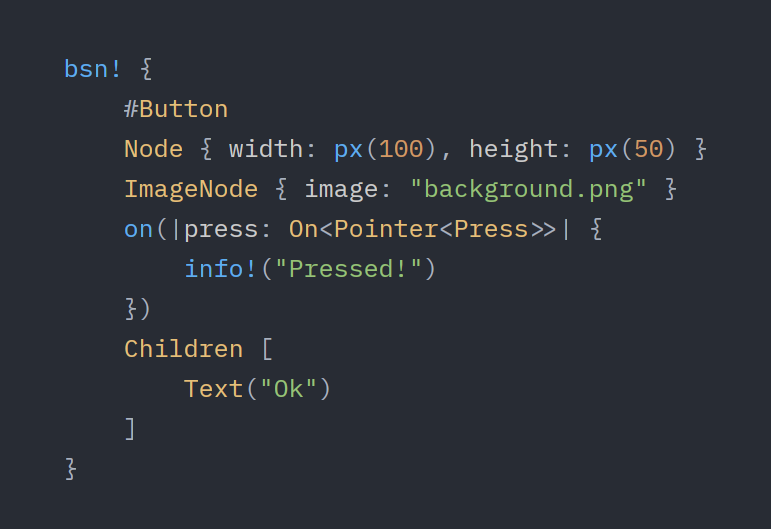
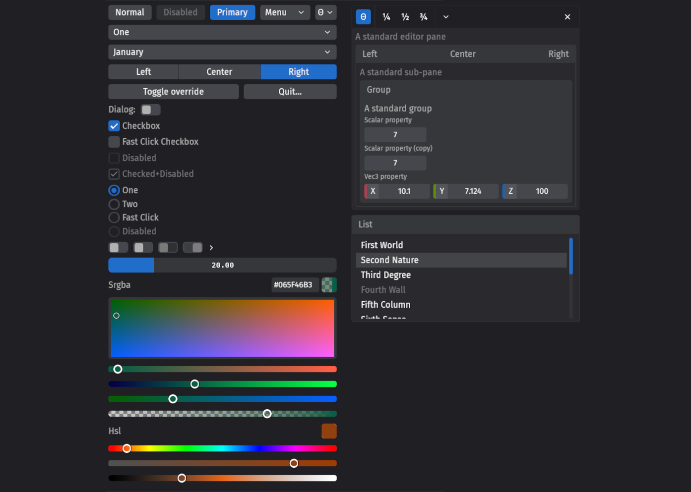
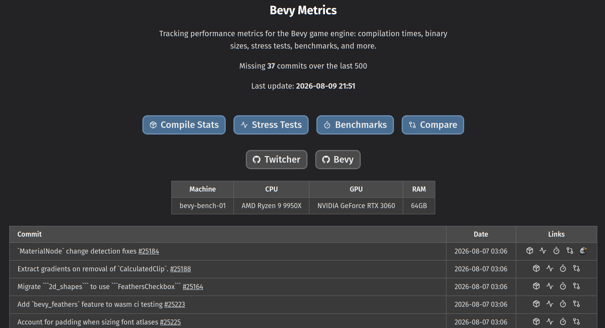

+++
title = "Bevy's Sixth Birthday"
date = 2026-08-10
authors = ["Carter Anderson"]
[extra]
github = "cart"
youtube = "cartdev"
image = "bevy_birthday_birds.png"
padded_list_image = true
show_image = true
+++

Hey! [@cart](https://bsky.app/profile/cart.work/) here (Bevy's creator and Project Lead). It is crazy to say it, but Bevy is _six years old_ now!

As is tradition, I will take this as a chance to reflect on the past year and outline our hopes and dreams for the future. If you're curious, check out Bevy's [First](/news/bevys-first-birthday), [Second](/news/bevys-second-birthday), [Third](/news/bevys-third-birthday/), [Fourth](/news/bevys-fourth-birthday/), and [Fifth](/news/bevys-fifth-birthday/) birthday posts.

I highly encourage Bevy developers and community members to write their own **Bevy's Sixth Birthday** reflection posts. Just publish your post somewhere (and to social media if you want) and [link to it here](https://github.com/bevyengine/bevy-website/issues/2563). One month from now, we will do a "Reflecting on Bevy's Sixth Year" rollup post that aggregates these in one place. This is our chance as a community to celebrate our wins, identify improvement areas, and calibrate our path for the next year.

For those who don't know, Bevy is a refreshingly simple data-driven game engine and app framework built in Rust. Bevy is also free and open source forever! You can grab the full [source code](https://github.com/bevyengine/bevy) on GitHub. We have a [Quick Start Guide](/learn/quick-start/introduction). You can check out [Bevy Assets](/assets/) for a library of community-developed plugins, crates, games, and learning resources.

This is all made possible by the Bevy Foundation's [generous donors](/donate). If you enjoy Bevy, _please_ consider [supporting our work](/donate)! Every donation goes directly toward improving Bevy for everyone, and we are _drastically_ underfunded for our ambitions.

<!-- more -->

## A Year of Milestones


- **August 25**: [Bevy Merch](https://www.bonfire.com/store/bevy-merch/)
  - We launched our new Bevy Merch store so Bevy developers can show their support. Note that we only make $3 on each sale ... the primary purpose of the store is to allow people to rep Bevy out in the wild, not to be a funding source.
- **September 30**: [Bevy 0.17](/news/bevy-0-17/)
  - We landed Solari / Raytraced Lighting, Improved Observers / Events, core Bevy UI Widgets, Bevy Feathers, Rust Hotpatching, Light Textures, DLSS, Tilemap Chunk Rendering, Web-hosted Asset Loading, Reflect Auto-Registration, Frame Time Graphs, UI Gradients, Raymarched Atmosphere, Virtual Geometry, BVH Culling, and more!
- **December 10**: [Bevy Metrics](https://metrics.bevy.org/)
  - Thanks to our [generous donors](/donate) and [François](https://github.com/mockersf)' efforts, we landed an automated metrics system that runs on every Bevy commit, tracking Bevy's runtime performance, compile times, and binary sizes over time. This has helped us catch a ton of regressions and will be a key piece of infrastructure for us going forward.
- **January 13**: [Bevy 0.18](/news/bevy-0-18/)
  - We landed Atmosphere Occlusion and PBR Shading, Generalized Atmospheric Scattering Media, Solari Improvements, PBR Shading Fixes, Font Variations, Automatic Directional Navigation, Fullscreen Materials, Cargo Feature Collections, First Party Camera Controllers, and more!
- **February 7**: [Bevy Jam #7](https://itch.io/jam/bevy-jam-7)
  - The seventh official Bevy game jam! 310 people joined, 64 people submitted games, and people left 1,331 ratings. The theme was Extremely Incohesive Fever Dream, and the participants really took that to heart. The delightfully chaotic (and surprisingly complete) [PvF](https://kaiva-morphin.itch.io/pacmodillo-versunaro-fazberino) won. You should check it out!
- **April 1**: [Bavy Jam #1](https://itch.io/jam/bavy-jam-1)
  - To celebrate April Fools we had our first ever _Bavy_ Jam, with no warning and a 24 hour duration to test BSN before it released. Developers had to use Bevy's main branch to build something rat themed :)
- **June**: Bevy hit 6,000,000 downloads on crates.io!
- **June 19**: [Bevy 0.19](/news/bevy-0-19/)
  - We landed Next Generation Scenes/ BSN, Render Bigger Scenes Faster, Contact Shadows, More Feathers Widgets, Text Input, Richer Text, App Settings, Post Processing Effects, Improved Skinned Mesh Culling, and more!
- **August 10**: Bevy is now six years old!

## A Year By The Numbers


- **1,527** unique Bevy contributors on [GitHub](https://github.com/bevyengine) (up from 1,291)
- **47,529** [GitHub](https://github.com/bevyengine) stars (up from 40,900)
- **5,189** forks on [GitHub](https://github.com/bevyengine) (up from 4,429)
- **16,415** pull requests (12,501 merged) on [GitHub](https://github.com/bevyengine) (up from 12,928 prs and 9,795 merged)
- **9,348** issues (6,373 closed) on [GitHub](https://github.com/bevyengine) (up from 7,829 and 5,316 closed)
- **13,543** commits on [GitHub](https://github.com/bevyengine) (up from 10,831)
- **1,830**  [GitHub Discussions](https://github.com/bevyengine/bevy/discussions) (up from 1,684)
- **501** [Bevy Assets](/assets/) (plugins, crates, games, apps, and learning materials) (up from 442)
- **6,656,483** downloads on [crates.io](https://crates.io/crates/bevy) (up from 2,753,203)
- **23,359** [Bevy Discord](https://discord.com/invite/bevy) members (up from 21,985)
- **6,906** community #showcase entries in the [Bevy Discord](https://discord.com/invite/bevy) (up from 5,697)
- **3,751,524** messages in the [Bevy Discord](https://discord.com/invite/bevy) (up from 2,836,825)

Note that for consistency and clarity all of these numbers are given in "absolute totals", as that is how they are generally reported. For example, we now have 47,529 _total_ GitHub stars ... the number you will see in our repo. I've included the totals as reported last year as well, which can be used to calculate the change in the numbers since last year.

## Things I'm Proud Of


I always try not to repeat myself here, but note that I am still extremely proud of the things I outlined in Bevy's [First](/news/bevys-first-birthday), [Second](/news/bevys-second-birthday), [Third](/news/bevys-third-birthday), [Fourth]((/news/bevys-fourth-birthday)), and [Fifth](/news/bevys-fifth-birthday)) birthday posts.

### BSN

This year we finally landed [BSN: Bevy's next generation scene system](/news/bevy-0-19/#next-generation-scenes):



This was a massive step forward for Bevy's usability. It enables developers to quickly and easily spawn composable, inheritable, interrelated hierarchies of ECS entities and components in a templated, dependency and asset-aware way (some engines call these "prefabs" instead of "scenes"). Developers can compose BSN within their Rust code using the `bsn!` macro, or they can define it in asset files (the `.bsn` asset format should land on Bevy `main` soon).

BSN is also a key piece of Bevy's UI story going forward. UI developers (especially outside of the engine space) expect a certain level of ergonomics that raw Rust cannot provide. With BSN, composing UI in Bevy has never been easier!

```rust
fn button() -> impl Scene {
    bsn! {
        Node { width: px(200), height: px(100) }
        on(|press: On<PointerPress>| info!("pressed!"))
        Children [
            Text("Button")
        ]
    }
}
```

Unlike other popular UI frameworks, BSN is a general purpose ECS-powered data layer, equally useful for game logic, general purpose app logic, and UI logic.

BSN is pivotal for the upcoming Bevy Editor, which will be a normal Bevy app built on top of Bevy UI + BSN. The Bevy Editor will also _compose_ BSN assets via a visual scene editor.

I'm really happy to see people enjoying BSN in the wild. [Exofactory](https://store.steampowered.com/app/3615720/Exofactory/)'s developer [saved 7,364 lines of code](https://exofactory.net/blog/2026-08-02/) after porting their spawning code to BSN. BSN was a multi-year project for me and finally getting "real world" value out of it feels so good.

I'll let the [blog post](/news/bevy-0-19/#next-generation-scenes) explain the BSN details, but this is an exciting time to be a Bevy dev!

### Bevy UI

Bevy's UI story came a long way this year. In addition to landing BSN, we landed our "core Bevy UI widgets", which are behavior-only "style-less" widgets, intended to be used as the shared baseline for styled / higher level widgets. Add the [`Button`](https://docs.rs/bevy/latest/bevy/ui_widgets/struct.Button.html) widget to your entity, and it starts behaving like a button, with button events, press and hover states, keyboard shortcuts, and accessibility features!

```rust
fn button() -> impl Scene {
    bsn! { 
        Button
        Node { width: px(200), height: px(100) }
        on(|activate: On<Activate>| {
            info!("Button activated!")
        })
    }
}
```

We landed buttons, checkboxes, radio buttons, lists, scroll areas / scroll bars, sliders, modal dialogs, menus, and popovers. We also _finally_ landed an upstream text input widget:

<video controls loop><source  src="../bevy-0-19/editable_text.mp4" type="video/mp4"/></video>

Bevy UI now also supports [gradients](/news/bevy-0-17/#ui-gradients), [per-side UI border colors](/news/bevy-0-17/#ui-gradients), [text background colors](/news/bevy-0-17/#text-background-colors), [automatic directional navigation](/news/bevy-0-18/#automatic-directional-navigation), [font variations like strikethroughs, underlines, weights, and ligatures](/news/bevy-0-18/#font-variations), [variable font properties](/news/bevy-0-19/#variable-font-properties), and [better font selection](/news/bevy-0-19/#richer-text).

Things are starting to get quite functional in Bevy UI land!

### Bevy Feathers

We also landed Bevy Feathers early this year (led by [Talin](https://github.com/viridia)), and then significantly evolved and expanded it throughout the year. Bevy Feathers is our opinionated "dev tools" widget set, which builds on the "core Bevy UI widgets" mentioned above.



We're using these widgets to build the Bevy Editor, in addition to things like an ECS inspector, debug menus, etc. 

### Bevy Rendering Devs Go Hard

This year was _packed_ with renderer work. We [landed](/news/bevy-0-17/#bevy-solari-raytraced-lighting-experimental) and [evolved](/news/bevy-0-19/#solari-improvements) Solari, our experimental real-time raytraced renderer (led by [Jasmine](https://github.com/JMS55/)):


This was a MASSIVE year for GPU-driven rendering (led by [@pcwalton](https://github.com/pcwalton/)). On modern hardware, Bevy can now handle huge scenes; drawing millions of entities at playable framerates. Our new `bevy_city` example is a great real world test. It procedurally generates a city with (by default) 55,000 entities (including moving cars) and it can render at 60fps! This requires no special "performance" APIs, just the standard easy-to-use data-driven Bevy APIs.


We've also started landing "renderer unification" work. Bevy's 3D rendering is quite advanced at this point, and we'd like our 2D renderer to share the same infrastructure and benefit from all of the work we've done.

A [few days ago](https://github.com/bevyengine/bevy/pull/25088) we fully adopted [WESL](https://github.com/webgpu-tools/wesl-spec) shaders (migrating away from our custom-built WGSL dialect). WESL extends WGSL to support modules / imports and first class conditional compilation. It has a native Rust toolchain which builds "by default" with no specialized configuration, and we can deploy it "anywhere". We've been collaborating closely with the WESL team to shape the specification and ensure it is a great fit for Bevy.

```rust
import package::{color::palette, shape::star};
import lygia::{draw::fill::fill, generative::snoise::snoise2};
import env::u;

@fragment
fn main(@builtin(position) pos: vec4f) -> @location(0) vec4f {
  let uv = pos.xy / u.resolution;
  var sdf = star(pos.xy, u.resolution);

  @if(noise)  // conditions at runtime or build time
  sdf += snoise2(uv * 8.0 + u.time) * 0.15;

  let shape = fill(sdf, 0.6);
  return vec4f(palette(uv, u.time) * shape, shape);
}
```

The current baseline implementation is a marked improvement over the old Bevy shader experience, but this is just the beginning. They're in the process of building out features like generics, which will allow us to make high level Bevy material shaders much more accessible than they currently are. We're aiming to have a unique "best of all worlds" cohesive implementation that makes the easy stuff easy, without hiding the details away from the tinkerers (in classic Bevy fashion).

We also landed a ton of renderer features: our virtual geometry ("nanite") implementation [got BVH culling](/news/bevy-0-17/#virtual-geometry-bvh-culling), we landed [DLSS support](/news/bevy-0-17/#deep-learning-super-sampling-dlss), [contact shadows](/news/bevy-0-19/#contact-shadows), [physically based screen space reflections](/news/bevy-0-19/#physically-based-screen-space-reflections), [rectangular area lights](/news/bevy-0-19/#rectangular-area-lights), [light textures](/news/bevy-0-17/#light-textures), [real-time filtered environment maps](/news/bevy-0-17/#realtime-filtered-environment-maps), [vastly improved our atmosphere rendering](/news/bevy-0-18/#atmosphere-occlusion-and-pbr-shading), and [fixed some of the "PBR rendering quirkiness"](/news/bevy-0-18/#pbr-shading-fixes) that has plagued us for awhile.

### Jackdaw: The Community-Driven Bevy Editor Experiment

This year we continued to lay the foundations for the Bevy Editor upstream. While we did this, members of the Bevy community (led by [@jbuehler23](https://github.com/jbuehler23)) started using these foundations (BSN, Bevy Remote Protocol, Bevy UI, Bevy Feathers) to build out a functional Bevy Editor prototype called [Jackdaw](https://github.com/jbuehler23/jackdaw). Jackdaw is becoming _dangerously_ functional:

<video controls loop><source  src="jackdaw.mp4" type="video/mp4"/></video>

It already has a visual BSN scene editor, ECS inspection, undo/redo, a dynamic plugin / extension loading system, a material system, terrain editing, a project manager / creator, and geometry editing tooling.

They've done a great job of mapping the space and exercising Bevy's foundations in practice. Once we land a couple more foundational pieces upstream (such as Assets as Entities and `.bsn` asset support), we'll spin up the Bevy Editor Working Group, where I plan on focusing my attention on guiding upstream Bevy Editor development, collaborating with the Jackdaw devs to take the best ideas from Jackdaw and finally _for real this time_ build Bevy's official editor.

### Bevy Metrics

Tracking performance, compile time, and binary size regressions in a game engine is _critical_. Historically, we have done this manually "as needed". Thanks to our [generous donors](/donate) and [François](https://github.com/mockersf)' efforts, we landed [Bevy Metrics](https://metrics.bevy.org/): an automated metrics system that runs on every Bevy commit, tracking Bevy's runtime performance, compile times, and binary sizes over time. This has already helped us catch a ton of regressions and will be a key piece of infrastructure for us going forward.



### Bevy Project Goals

Bevy development is very "ad hoc". Each individual works on what they want to, when they want to. It has historically been hard to track what is currently going on in the project, what our priorities are, what our priorities _aren't_, and where project leadership is currently focusing their attention. This created a lot of unnecessary tension, as contributors would often spend months building something, only to hit a wall because they built the "wrong" thing, or because project leadership didn't have the time to give the contributor's effort the attention it needed to be shepherded upstream. Additionally, Bevy community members (and people interested in Bevy) often asked for a "roadmap", and we'd say "we don't have one" and "that is not how we do things here".

This year I formulated and enacted the light-weight [Bevy Project Goals](https://github.com/orgs/bevyengine/projects/23/views/1) system, which aims to give us the tools we need to prioritize work and collaborate on that work together (check out our [Contributor Guide](https://bevy.org/learn/contribute/project-information/project-goals/) for details). The community can propose new Goals, and we discuss those proposals on a weekly basis to decide if we want to approve, deny, or postpone them. It also allows members of project leadership (the Project Lead ... me, SMEs (Subject Matter experts), and Maintainers) the ability to "staff" Goals, which provides a signal to the community that this Goal is "fast tracked" and will receive immediate attention and stewardship.

This allows leadership to be honest about its capacity (we can't "staff" everything at once) and its priorities (there are some things we _must_ focus on, and some things we _should not_ focus on).

This is notably _not_ a "roadmap". We aren't meaningfully planning the order of future steps ahead of time. We are just communicating the current state of things. This is also not _authoritative_. The Bevy community is still free to build whatever it pleases, whenever it pleases. We just now have a way to collectively decide our direction and create the necessary contribution on ramps and infrastructure to collaborate (ex: Working Groups).

I am personally very happy with Goals (especially their current iteration), and believe they were an important missing piece of our workflow. The rollout wasn't _quite_ as smooth as it should have been (which I'll touch on in the next section). 

### Real Projects™ Using Bevy

This year we had a ton of new Bevy usage, with some exciting Steam releases, demos, and non-game apps.

- [Toroban](https://store.steampowered.com/app/1961850/Toroban/): an infinitely wrapping puzzle game, was released on Steam.
- [Exofactory](https://store.steampowered.com/app/3615720/Exofactory/): a factory building game in a chill open world, made significant progress and had a ton of [interesting devlogs](https://exofactory.net/blog/).
- [Jarl](https://x.com/jarl_game): a fantasy colony simulation game is running playtests at the moment.
- [Polders](https://x.com/i_am_feenster/status/1945725222612615449), a historical Dutch city builder, continued to make significant progress this year.
- [Wee Boats](https://store.steampowered.com/app/3578080/Wee_Boats/) The chill multiplayer boaty honk game, now has a demo on steam!
- Sven is [building a spaceflight simulation game](https://bsky.app/profile/embersarc.bsky.social)
- [Foresight](https://www.fslabs.ca/) (one of Bevy's biggest sponsors) is using Bevy to build Foresight Spatial Engine (already used in production) and [SpatialDrive](https://www.fslabs.ca/spatialdrive) a database built for interacting with and visualizing 3D time series data.
- [Nominal](https://nominal.io/connect): is building hardware test apps for real-time automation, analysis, and data capture at the edge.
- [Gob Johnson's Downhill Marmalade](https://store.steampowered.com/app/3329170/Gob_Johnsons_Downhill_Marmalade/): a fast-paced slalom 'em up fantasy roguelite, released on Steam.
- [Simulo](https://store.steampowered.com/app/3291520/Simulo/), a multiplayer 2D physics sandbox, released on Steam.
- [Insanio](https://store.steampowered.com/app/4177650/INSANIO/): an autobattler where you send misfits into vehicular combat, released on Steam.
- [Court Wizard](https://store.steampowered.com/app/4550880/Court_Wizard/): A roguelite where you cast spells to defend the kingdom, was released on Steam.
- [Willcaster](https://store.steampowered.com/app/4953880/Willcaster/): a game where you guide an ordinary frog on your magical game board, helping him with your spells, was announced on Steam.
- [Unhaunter](https://www.unhaunter.com/): the paranormal investigation simulator, made a lot of progress this year.
- [One Planet](https://store.steampowered.com/app/2348960/One_Planet/): a political strategy game where you take on climate change, was announced on Steam.
- [Manufact](https://manufact.au/): a "design for manufacture" and simulation platform, was released. It uses Bevy as the renderer!

[bevy_awesome_prod](https://github.com/Vrixyz/bevy_awesome_prod/) has even more cool projects!

## There Is Always Room For Improvement


### The Goal System Rollout

The initial rollout and framing of [Bevy Project Goals](https://github.com/orgs/bevyengine/projects/23/views/1) caused some (well-founded) concern and anxiety in the community, as it was phrased in a way that made it feel "dictatorial". One of my Goals for the system was to establish "boundaries". Historically, our process (and lack thereof) organically created a culture of "build first, then yell for attention until you get it". Leadership was constantly derailing itself from its priorities to shepherd whatever happened to land on our doorstep, and this created situations such as _continually_ promising that the Bevy Editor was a priority, yet it never manifesting over the course of many ... _many_ years. That particular case is a complicated, multi-dimensional problem, but prioritizing the upstreaming of arbitrary unrelated work was a big piece of the problem.

This culture bred toxicity in a number of ways. It created resentment in me whenever a new (very cool) thing landed on our doorstep that pulled me away from the work that I strongly believed Bevy _needed_. It created burnout and feelings of betrayal in contributors when their work was left unreviewed indefinitely. It created disillusionment in the wider community when critical foundational pieces (such as BSN) dragged on for years (that particular case is also multi-dimensional ... I could have pushed my work publicly _years_ earlier and embraced public community development rather than polishing it slowly on my own).

These were fundamentally problems of _communication_. Project leadership only has so many hours in the day. We have the right (and responsibility) to choose how we want to spend them. What the project desperately needed was a way to communicate them.

Project Goals were initially framed in a way that focused on that. _Preventing_ working from being done that wasn't "aligned" or "prioritized". Working Groups could only be created for efforts that were currently "staffed" by leadership. Goals were only "active" if they were "staffed", and "unstaffed" Goals were "inactive". While I do think this type of prioritization is necessary to a degree, it was ham-fisted and didn't properly respect Bevy's "organic development culture".

We've ([very recently](https://github.com/bevyengine/bevy-website/pull/2562)) adopted a looser approach. "Staffed" and "unstaffed" are the states (rather than "active" and "inactive"). Working Groups can be formed for any "approved" Goal, even if it is not currently staffed. I believe this strikes the right balance. The community can propose work and collaborate on _anything_ that is approved. We can provide these people with the centralized collaboration infrastructure they need (Working Groups), and they can make progress with or without us. However "staffing" still serves as a signal to the community as to where we are directing our focus, so it can set its expectations accordingly.

### AI Policy

AI has been a constant stressor on the Bevy community this year. We adopted a strict "no-AI" policy this year, which solved many problems but created many others (including fostering toxic witch hunts, incentivizing lying to maintainers, enforcement was a hard / impossible task). We are all very tired and emotionally raw.

[`@alice-i-cecile`](https://github.com/alice-i-cecile) has been working with the community (including me) to draft a new policy. I'm pretty anti-AI myself, I don't use it in my development workflows (I love my craft and don't have much interest in outsourcing it), and I am deeply concerned about the risks of AI adoption when it comes to fostering a community of competent engine developers. I think the new policy strikes the correct balance for our community. We haven't released a new policy yet (we are still working on it) and we aren't interested in starting a wider public conversation at the moment (aka: a conversation outside of the Bevy community). But I am optimistic that we are soon to be on the right track.

### The Bevy Foundation is (Still) Under-Funded

I outlined three paths to improve this last year: proactive fundraising, revenue generating services, and continuing to build the engine to make it more attractive and extend our reach. I didn't meaningfully do either of the first two this year. I did focus heavily on building out Bevy's foundations this year and avoiding sidetracking, and I think we are verging on a level of capability and elegance that will attract developers and funding in greater volumes. I don't think I _should_ be focused on proactive fundraising or revenue generating services until the Bevy technology platform has reached a certain level of completeness, as that is where my competency lies, and I don't feel particularly comfortable evangelizing while there are still key pieces of the puzzle in flight.

We need more full time developers so we can move faster. We need to pay our existing developers baseline salaries that encourage them to stay (rather than the ~54% paycut relative to the baseline that we are paying them today). _Please_ [help us](/donate)!

## Did We Learn From Last Year?

It is important for organizations (and leaders) to learn from their mistakes. Here is my list of "improvement areas" from last year's birthday post, followed by how I think we handled them this year:

> **BSN Should Have Landed Faster**

I believe the core issue here ([`@cart`](https://github.com/cart) developing in isolation for extended periods until things are "good enough" in my eyes) has largely been addressed. BSN development over the past year has been iterative and public. My work on Assets as Entities has evolved in the open and iteratively. I've been making lots of targeted, small, but high value changes to various parts of the engine that I've been wanting to for awhile, with instant feedback loops with the community. I do daily status updates so people can track what I'm currently working on. I'll try my hardest not to slip back in to old patterns, but I'm pretty happy with how things have played out recently. I'm curious to hear what everyone else thinks about this!

> **The Bevy Foundation is Under-Funded**

I discussed this above. This is still a problem! Please support our work by donating to the [Bevy Foundation](/donate)!

## Can @cart Predict The Future?

In last year's birthday post I [made some predictions for the next year](/news/bevys-fifth-birthday/#the-next-year-of-bevy). Let's see how I did!

> **BSN**

We landed BSN. Score!

> **Reactivity Ecosystem**

Bevy does have a reactivity ecosystem! There are BSN reactive impls like [`bevy_reactor`](https://github.com/viridia/bevy_reactor) and [Jasmine's (rough / quick) reactive BSN experiment](https://github.com/JMS55/bevy/tree/react-experiment). There is also [haalka](https://github.com/databasedav/haalka), which uses "functional reactive programming" to produce its own (non-BSN, but Bevy-native) data API.

We haven't yet converged on the correct upstream implementation, but I suspect this will happen within the year now that Bevy UI, Feathers, and BSN are all in a pretty solid place.

> **Core / Standard UI Widgets**

We landed these! Another win!

> **Baseline Editor Platform**

We did not land a baseline editor platform upstream. As mentioned above, we have made solid progress on the foundations. The ECS Inspector working group has a functional inspector implementation. Jackdaw has successfully prototyped what an editor platform could look like. We made significant, tangible, usable progress toward the goal this year. I have been saying "Bevy Editor next year" for many years now. You probably shouldn't trust me when I say it is close now. But we now have the scene system, the UI system, the editor widget library, the asset system, the remote protocol, the design language and mockups, a proven dynamic plugin loading model, and an extremely functional prototype. Additionally, we finally have a Project Lead who has run out of prerequisites to block editor progress on (well ... after Assets as Entities, but that is wrapping up now). We are well positioned to break ground. That is our (and my) next and overriding priority. We can do this!

## The Next Year of Bevy


The Bevy Community and I take a relatively organic and reactive approach to developing Bevy. It doesn't make sense to outline a long list of "plans" when that isn't really how development works in practice.

That being said, here are some of my personal hopes, dreams, and personal priorities for the next year of Bevy:

* **Assets as Entities**: This is what I'm currently working on (with [`@andriyDev`](https://github.com/andriyDev/)). It is a key piece of the editor story, as we need to be able to express complex, nested, templated assets in BSN + the Bevy Editor, and Assets as Entities is what will allow that to happen, as BSN expresses complex, nested, templated _entities_. It will also vastly simplify our asset system internals, make asset events "observable / react-able", and generally make assets feel more cohesive with the rest of Bevy. 
* **`.bsn` Asset Format**: BSN landed with `bsn!` macro support. It also landed with "runtime" support for scene assets. It _didn't_ land with the actual `.bsn` asset loader. The Bevy Editor will produce `.bsn` files, so this is a necessary piece to land. There is a draft PR for this out, although it needs some work. We should be able to land this shortly! 
* **Upstream Bevy Editor MVP**: We need this. You want this. We have proven implementations. We have prioritized progress at the cost of pretty much everything else. We are very, very close now. 
* **Reactivity Ecosystem**: As mentioned above, we have explored the space, we have built the other prerequisites. I'm relatively confident we can land something this year, but I'm personally prioritizing showing upstream progress on the Bevy Editor. Reactivity is likely a part of the final UI / Editor story, but I don't think we should block on it.
* **Excellent Shader and Material Workflows**: We've been focused on modernizing the renderer and landing foundational pieces like WESL. However this has come at the cost of more user-facing shader / custom material complexity. Once the initial "2D / 3D renderer unification" work lands, I think we need to pivot our focus toward the user facing experience / lowering the accessibility bar of custom material shaders. [`@tychedelia`](https://github.com/tychedelia) has big plans for this space and I can't wait to see where this lands. WESL is a solid start, and should serve as a foundation for this work (especially as it evolves).

We have [plenty of other work in the pipeline](https://github.com/bevyengine/bevy/pulls), but I'm once again choosing to keep this _very_ focused this year to convey my personal priorities.

One last reminder that Bevy community members should write their own Bevy Birthday blog posts. [Submit them here](https://github.com/bevyengine/bevy-website/issues/2563)!

If any of this excites you, we would love your help! Check out our code on [GitHub](https://github.com/bevyengine/bevy) and start participating in the [Bevy Community](/community/).

Also _please_ consider [donating to The Bevy Foundation](/donate) to ensure we can continue building and leading this wildly ambitious project. The more funds we have, the more we can scale Bevy development!

To many more years of Bevy!

\- [@cart](https://github.com/cart/)


<span class="news-subtitle">The cute Bevy birds in this post are strongly inspired by Ed Duck's [delightful](https://thebevyflock.github.io/the-bird/) Bevy bird design</span>
