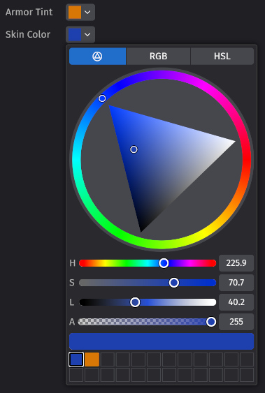
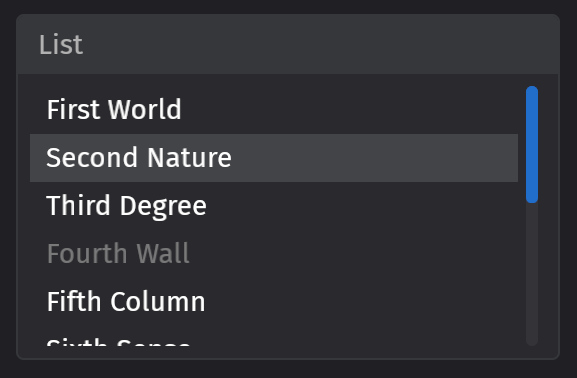
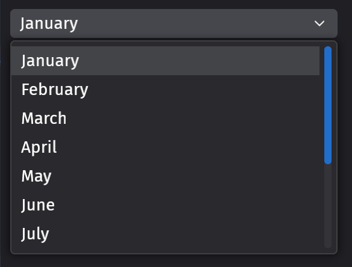
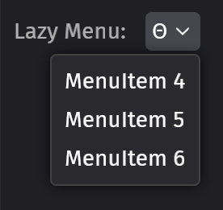
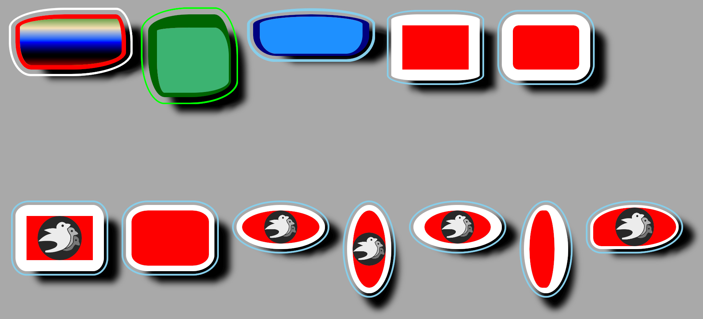
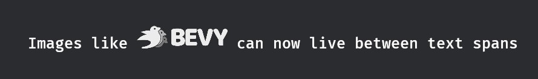

+++
title = "Bevy 0.20"
date = 2026-09-17
[extra]
show_image = true
image = "zorah.jpg"
image_subtitle = "The Zorah scene rendered in Bevy Solari"
public_draft = 2582
status = 'hidden'
+++

Thanks to **227** contributors, **780** pull requests, community reviewers, and our [**generous donors**](/donate), we're happy to announce the **Bevy 0.20** release on [crates.io](https://crates.io/crates/bevy)!

For those who don't know, Bevy is a refreshingly simple data-driven game engine built in Rust. You can check out our [Quick Start Guide](/learn/quick-start) to try it today. It's free and open source forever! You can grab the full [source code](https://github.com/bevyengine/bevy) on GitHub. Check out [Bevy Assets](https://bevy.org/assets) for a collection of community-developed plugins, games, and learning resources.

To update an existing Bevy App or Plugin to **Bevy 0.20**, check out our [0.19 to 0.20 Migration Guide](/learn/migration-guides/0-19-to-0-20/).

Since our last release a few months ago we've added a _ton_ of new features, bug fixes, and quality of life tweaks, but here are some of the highlights:

- **Solari and DLSS**: Solari, Bevy's realtime pathtraced renderer, is now faster, more accurate, supports more Bevy rendering features, and runs on MacOS via Metal!
- **BSN Syntax Improvements**: BSN, Bevy's new scene system, had some syntax changes that made it _much_ easier to read and compose
- **Ready Event**: BSN scene entities now trigger an observable `Ready` event when all of their children have been spawned.
- **More UI Widgets**: Bevy Feathers, Bevy's opinionated editor-centric UI toolkit, now has Color Input, Scrollable List View, Dropdown Selection, and Lazy Menu widgets. The Number Input widget is now scrubbable / draggable, and we've added Headless Tab Widgets.
- **WESL Shaders**: Bevy has officially adopted the WESL shader language (a standardized extension of WGSL). WESL is already an improvement over Bevy's old custom WGSL dialect, and we've been working with the WESL team to plan out the future of shader development in Bevy.
- **Sprite Materials and Extended 2D Materials**: It is now possible to create custom shader materials for Sprites, and 2D mesh materials can now be extended like they can in 3D.
- **Pan Orbit Camera**: Bevy now has a "pan orbit camera", making it possible to navigate scenes in a CAD-like way.

<!-- more -->

## Solari and DLSS

{{ heading_metadata(authors=["@JMS55", "mate-h", "stuartparmenter"] prs=[]) }}


Solari, Bevy's realtime pathtraced renderer, has seen major improvements to pretty much every aspect of the plugin!

Read [JMS55's blog](https://jms55.github.io/posts/2026-09-18-solari-bevy-0-20) for the technical details, or continue reading below for the high level overview.

### Improved Image Quality

Thanks to improvements in our ReSTIR implementation, rendering is now mostly unbiased, leading to much more accurate lighting.

Additionally, thanks to some other changes, moving objects no longer have shadows that lag behind, and reflections now look significantly less shimmery in motion, especially for non-metallic materials.

### Improved Performance

DLSS-RR has gotten very good in recent updates, and for many scenes, ReSTIR costs a decent chunk of performance, and does not significantly improve image quality.

Due to this, we've decided to make ReSTIR optional, and turn it **off by default**.

If you were using Solari in Bevy 0.19, check if the loss of ReSTIR affects your scene, and if so re-enable `SolariLighting::restir`.

With ReSTIR off, expect reduced shadow quality and missing shadows in motion in scenes with many lights. We are exploring cheaper ways of improving light sampling, without ReSTIR, to improve this in the future.

Besides ReSTIR, Solari's scene management code is now retained (similar to retained render world optimizations in previous versions of Bevy), and overall much more optimized, leading to _significantly_ reduced CPU costs.

Additionally, take a look at the new fields in `SolariLighting`. While we aim to set reasonable defaults that will work well across a wide variety of games, there are now many knobs you can tweak to improve performance or quality.

World cache size, per-pixel light sample count, temporal accumulation, and path tracing bounce count can now all be tweaked to improve Solari for your specific game.

### Improved Compatibility

Solari now supports lighting from Atmosphere and EnvironmentMapLights on cameras, in addition to the existing support for DirectionalLight and emissive meshes. We're hoping to add support for the remaining PointLight, SpotLight, and RectLight types in the near future.

Solari now also runs on macOS, but note that there is currently no built-in denoiser included in `bevy_solari` for macOS. MetalFX Ray Reconstruction might be a possible solution in the future (contributions welcome!)

### DLSS Updates

Finally, our `dlss_wgpu` crate has been updated to support the latest version of DLSS, bringing support for DLSS-RR 4.5, which significantly improves denoising quality in Solari.

If you were using DLSS in Bevy 0.19, make sure to [download and setup](https://github.com/bevyengine/dlss_wgpu#downloading-the-dlss-sdk) the newest version of the DLSS SDK, else you will run into compiler errors.

## BSN Syntax Improvements

{{ heading_metadata(authors=[] prs=[25318, 25626]) }}

BSN landed with a few idiosyncrasies that caused friction in practice. We made some changes to BSN's syntax this cycle in the interest of improving its ergonomics and clarity. After this, the syntax _should_ largely be nailed down.

### Explicit scene syntax

All scene references now require `@` prefixes:

```rust
// Before
bsn! {
    scene_variable
    scene_function()
    @SceneComponent
    {scene_expression}
}

// After
bsn! {
    @scene_variable
    @scene_function()
    @SceneComponent
    @{scene_expression}
}
```

In addition to making it easier to spot scene inclusions (and unifying the syntax across cases), this freed us up to make component values _much_ easier to work with!

### No more `template_value` wrappers!

You can now remove all of those pesky `template_value` wrappers from your component values:

```rust
// Before
bsn! {
    template_value(component_variable)
    template_value(component_function())
}

// After
bsn! {
    component_variable
    component_function()
}
```

### Enums "just work"

Enums no longer require `VariantDefaults` or `FromTemplate`, provided they implement `Default` and `Clone`:

```rust
// Before
#[derive(Component, Default, Clone, VariantDefaults)]
enum Foo {
    A { x: u32, y: u32 },
    #[default]
    B,
}

bsn! {
    Foo::B
}

// After
#[derive(Component, Default, Clone)]
enum Foo {
    A { x: u32, y: u32 },
    #[default]
    B,
}

bsn! {
    Foo::B
}
```

If you were using an enum that didn't support `VariantDefaults`, you can now remove the `template_value` wrapper:

```rust
// Before
bsn! {
    template_value(Foo::A)
}
// After
bsn! {
    Foo::A
}
```

The removal of `VariantDefaults` does mean that enums must now have every field specified:

```rust
// Before (y field is initialized to its default value)
bsn! {
    Foo::A { x: 1 }
}

// After (y field must be manually specified)
bsn! {
    Foo::A { x: 1, y: 0 }
}
```

We believe this tradeoff is worth it, as it increases BSN's compatibility with arbitrary Rust enums. Rust doesn't support "enum variant defaults" anyway! 

### Chained method support

The "builder pattern" (and chained methods generally) previously required a `template_value` wrapper. This can now be removed:

```rust
// Before
bsn! {
    template_value(Transform::from_xyz(-2.5, 4.5, 9.0).looking_at(Vec3::ZERO, Vec3::Y))
}
// After
bsn! {
    Transform::from_xyz(-2.5, 4.5, 9.0).looking_at(Vec3::ZERO, Vec3::Y)
}
```

Additionally, you can now remove the `template_value` wrapper in cases like this:

```rust
// Before
bsn! {
    template_value(node.clone())
}
// After
bsn! {
    node.clone()
}
```

In general, you should now be able to remove all `template_value` instances from your BSN declarations!

### Improved list syntax

BSN previously used commas to separate entities, with optional `()` around entities to make the boundaries clearer. This resulted in a lot of syntax noise, line noise, and over-indentation:

```rust
bsn! {
    Node 
    Children [
        (
            #OkButton
            @button("Ok")
        ),
        (
            #CancelButton
            @button("Cancel")
        ),
    ]
}
```

To avoid this, many developers opted for this syntax instead, which made it very hard to visually distinguish entities:

```rust
bsn! {
    Node 
    Children [
        #OkButton
        @button("Ok"),
        #CancelButton
        @button("Cancel"),
    ]
}
```

BSN now uses `--` to separate entities in a list:

```rust
bsn! {
    Node 
    Children [
        #OkButton
        @button("Ok")
        --
        #CancelButton
        @button("Cancel")
    ]
}
```

This gives us the best of all worlds: entities are visually distinct, and there is no over-indentation, line noise, or syntax noise ([the stats](https://github.com/bevyengine/bevy/pull/25678#issuecomment-5547835904) when compared to other competitors in the "markup format" space are very competitive!). Both `()` and `,` have been deprecated in this context.

Using `[]` and `()` for `bsn_list!` (and `bsn!`) is now discouraged / warned against (ex: `bsn_list []`), as it can result in poor rustfmt autoformatting. Instead, use `bsn_list! {}`, which is the only syntax that `rustfmt` won't touch. Don't worry, we
plan to build a BSN auto-formatter!

```rust
bsn_list! {
    #Ok @button("Ok")
    --
    #Cancel @button("Cancel")
}
```

## Ready Event

{{ heading_metadata(authors=["@cart"] prs=[]) }}

We landed BSN, Bevy's next generation scene system, [in our last release](/news/bevy-0-19). It was missing a key piece though: the ability to easily run logic when a scene is fully "ready" and spawned (ex: all dependencies have loaded, the full hierarchy is present, and all of the initial components are inserted in the scene). This is a critical piece for building cohesive, standalone, composable scenes. It is also necessary to properly layer Bevy logic on top of _other_ scene representations (like glTF).

The closest we had was the `Add` event for a given component, which runs "top down" (meaning children are not available). We needed a "bottom up" equivalent to enable building logic that relies on the complete loaded and spawned scene.

The solution is pretty straightforward: trigger a new `Ready` event for each entity in a spawned scene _after_ the full spawn logic has run for that entity (including its descendants).

This enables the following:

```rust
#[derive(SceneComponent, Default, Clone)]
struct Widget;

impl Widget {
    fn scene() -> impl Scene {
        bsn! {
            Node { width: px(100), height: px(100) }
            on(|ready: On<Ready>| {
                info!("The full scene, including 'widget.bsn' contents, is available here")
            })
            Children [
                Text("hello"),
                :"widget.bsn"
            ]
        }
    }
}

world.spawn(bsn!{ @Widget })
```

## More Feathers Widgets

{{ heading_metadata(authors=["@viridia", "@gagnus", "@tmstorey"] prs=[25446, 25079, 24092, 24847, 24784]) }}

Feathers, Bevy's opinionated editor-centric UI toolkit, now has more widgets for you to play with:

### Color Input

Bevy now has a compact color input selector that displays a color picker widget popup when clicked. This includes a color wheel selector, RGB, and HSL selectors, and a recently used colors grid.



### List View / Scrollbar

A scrollable, selectable list view.



### Dropdown Selection

A selection field that when clicked, displays a dropdown containing a list of options to select.



### Lazy Menu

Spawns a menu popup when the menu is opened and _despawns_ it when it is closed. This is in contrast to the normal Menu widget, which just _hides_ the menu.



## Number Input Widget Scrubbing / Dragging

{{ heading_metadata(authors=["@viridia"] prs=[24636, 24701]) }}

The `FeathersNumberInput` widget has been expanded to support both normal text input and scrubbing / dragging. There is a configurable "hard limit" (minimum and maximum value via any input method) and "soft limit" (minimum and maximum value via dragging), in addition to control over floating point precision and step sizes.

<video controls loop><source  src="number_input.mp4" type="video/mp4"/></video>

## Headless Tab Widgets

{{ heading_metadata(authors=["@jbuehler23"] prs=[25515]) }}

`bevy_ui_widgets` now has headless (bring-your-own-visuals) tab behavior: a `TabList` container and `Tab` headers.

Selection is managed "externally". `SelectedTab` on the list holds the selected tab; interaction emits `ValueChange<Option<Entity>>` as a request, applied by the app or by the optional `tablist_self_update` observer.

Tabs support keyboard shortcuts and integrate with Bevy's focus, interaction, and accessibility systems.

```rust
bsn! {
    TabList
    SelectedTab(Some(first_tab))
    on(tablist_self_update)
    Children [
        Tab Children [ Text("General") ]
        --
        Tab Children [ Text("Rendering") ]
    ]
}
```

See the `headless_tabs` example for controlled and self-updating tab lists in both orientations.

## WESL Shaders

{{ heading_metadata(authors=["@tychedelia"] prs=[25088]) }}

Bevy's shaders are now written in [WESL](https://wesl-lang.dev) and the old "Custom Bevy Extended WGSL" language support has been removed.

WESL is a language standard that extends WGSL to add important usability features like modules, imports, conditional compilation, and more.
Bevy has historically handled these things in our own custom WGSL dialect, but we believe it is better for the wider shader ecosystem (and for us) to adopt a common standard where we can pool resources on language improvements, module ecosystems, and IDE tooling. We've been working closely with the WESL team to evolve the standard in a way that fits well into the Bevy picture.

Custom shaders in the old Bevy WGSL dialect need to
be translated to WESL and renamed from `.wgsl` to `.wesl`. Plain WGSL files
with no preprocessor directives will keep working.

### Before: Custom Bevy Extended WGSL

```wgsl
#import bevy_pbr::forward_io::VertexOutput
#import "shaders/util.wgsl"::hsv_to_rgb
#ifdef VERTEX_COLORS
var<private> tint: vec4<f32>;
#endif
@group(2) @binding(#{MATERIAL_BINDING}) var<uniform> color: vec4<f32>;
```

### After: WESL
```wgsl
import bevy_pbr::render::forward_io::VertexOutput;
import super::util::hsv_to_rgb;
@if(VERTEX_COLORS)
var<private> tint: vec4<f32>;
@group(2) @binding(constants::MATERIAL_BINDING) var<uniform> color: vec4<f32>;
```

## Mesh Shaders

{{ heading_metadata(authors=[] prs=[25627]) }}

Mesh shaders are now integrated with Bevy's pipeline cache and are available for advanced users to take advantage of.
Mesh shaders can be used to render:

- Meshlets generated using tools like [meshoptimizer](https://meshoptimizer.org/)
- Procedural grass with dynamic level-of-detail, [as seen here](https://gpuopen.com/learn/mesh_shaders/mesh_shaders-procedural_grass_rendering/)
- Voxels, like [nvidium](https://github.com/MCRcortex/nvidium)
- Particles
- and more

Mesh shaders, at a high level, replace the classic vertex shader with a compute shader.
This allows generating geometry directly on the GPU and passing those generated primitives directly to the fragment shader without using multiple pipelines or intermediary buffers (to pass data from a compute shader to a render pipeline).

A `MeshPipeline` contains:

- an optional task shader (also known as amplification shader)
- a mesh shader
- a fragment shader

The new `MeshPipelineDescriptor` can be used to define a `MeshPipeline`.
That `MeshPipeline` is then used as a `RenderPipeline`, which allows the re-use of Bevy's lower level rendering APIs such as `RenderContext::begin_tracked_render_pass` to take advantage of the new `draw_mesh_tasks` APIs.

```rust
let mut pass = render_context.begin_tracked_render_pass(RenderPassDescriptor {
    label: Some("custom_mesh_shader_pass"),
    color_attachments: &[Some(target.get_color_attachment())],
    depth_stencil_attachment: Some(depth.get_attachment(StoreOp::Store)),
    ..default()
});

pass.set_render_pipeline(mesh_pipeline);
pass.set_bind_group(0, &bind_group, &[view_uniform_offset.offset]);

// draw_mesh_tasks dispatches the task shader if there is one,
// or dispatches the mesh shader if there is no task shader.
pass.draw_mesh_tasks(1, 1, 1);
```

It is notable that mesh shaders are an advanced graphics approach with platform-specific performance considerations, and that this is the initial base support for the feature.
Higher level user APIs, and easy integration with Bevy's `StandardMaterial`, are left to future work.

Mesh shaders are not supported on web platforms.

Check out the new `mesh_shader_intro` example for more usage examples.

## Sprite Materials

{{ heading_metadata(authors=["@cookie1170"] prs=[25415]) }}

<video controls loop><source src="sprite_material.mp4" type="video/mp4"/></video>

Until now, Bevy's sprite renderer has been lacking a major feature: the ability to extend it with custom shaders!
With this release, it's now possible to create custom materials for sprites by implementing the `MaterialExtension2d` trait,
inserting the `SpriteMaterial` component and adding the `SpriteMaterialPlugin` to your app.

The shader can use functions exported from `bevy_sprite_render::sprite_mesh::functions`, including:

```wgsl
// Samples the sprite's final color, including the tint and alpha discard, at a given UV.
fn sample_final_color(uv: vec2<f32>, instance_index: u32) -> vec4<f32>;

// Samples the sprite's texture without tint and alpha discard at a given UV.
fn sample_sprite_texture(uv: vec2<f32>, instance_index: u32) -> vec4<f32>;

// Applies tint and alpha discard to the sprite's color.
fn get_final_color(sprite_color: vec4<f32>, instance_index: u32) -> vec4<f32>;
```

Check out the `sprite_material` example to see it in action!

## 2D Extended Materials

{{ heading_metadata(authors=["@cookie1170"] prs=[25183]) }}

Bevy now provides a 2D analog to 3D's [`ExtendedMaterial`], which can be used to extend an existing material by implementing the `MaterialExtension2d` trait:

```rs
#[derive(AsBindGroup, Reflect, Clone)]
struct MyMaterial {
    #[uniform(20)]
    value: Vec4,
}

impl MaterialExtension2d for MyMaterial {
    fn fragment_shader() -> Option<ShaderRef> {
        Some("my_material.wesl".into())
    }
}
```

This material can now be used in an `ExtendedMaterial2d` struct:

```rs
let handle = materials.add(ExtendedMaterial2d {
    base: ColorMaterial::from_color(Color::WHITE),
    extension: MyMaterial {
        value: Vec4::ZERO,
    },
});
commands.spawn((
    Mesh2d,
    MeshMaterial2d(handle),
));
```

[`ExtendedMaterial`]: https://docs.rs/bevy/latest/bevy/pbr/struct.ExtendedMaterial.html

## Sprite Render Backend Unification

{{ heading_metadata(authors=["@IceSentry"] prs=[25432]) }}

The sprite render backend was replaced by a new backend that reuses a lot of the infrastructure made for 3d.
This resulted in improved performance in many cases and also makes future maintenance and improvements easier.

## Pan Orbit Camera

{{ heading_metadata(authors=["@aevyrie, @taishi-sama"] prs=[25434]) }}

<video controls loop><source  src="pan_orbit_cam.mp4" type="video/mp4"/></video>

We have upstreamed the awesome [`bevy_editor_cam`](https://github.com/aevyrie/bevy_editor_cam) made by [@aevyrie](https://github.com/aevyrie) as the new `PanOrbitCamera` in our `bevy_camera_controller` crate!

### Usage

Add `MeshPickingPlugin` and `DefaultPanOrbitCameraPlugins`:

```rust
app.add_plugins((
    MeshPickingPlugin,
    DefaultPanOrbitCameraPlugins,
))
```

Then add the `PanOrbitCamera` component on any 3D camera.

```rust
commands.spawn((
    Camera3d::default(),
    PanOrbitCamera::default(),
))
```

Full functionality is shown in the `camera/pan_orbit_camera_cad` example.

## Weak System Ordering with `chain_weak`

{{ heading_metadata(authors=["@JMS55"] prs=[25128]) }}

Ordering large groups of systems with `.chain()` is convenient, but it can be
overly strict. If system set `X` is chained before system set `Y`, every system
in `X` must finish before *any* system in `Y` can start, even when the systems
involved never touch the same data. This often leaves worker threads idle while they
wait for a handful of stragglers at the end of a system set, a pattern that shows up
frequently in the render world.

The new `chain_weak()`, `before_weak()`, and `after_weak()` functions provide a looser alternative.
Like their regular counterparts, they request an ordering between successive elements, however that
ordering is only kept between systems whose data accesses actually conflict. Systems that don't
conflict are left unordered and may run in any order, including in parallel.

```rust
schedule.configure_sets(
    (
        ExtractCommands,
        PrepareMeshes,
        CreateViews,
        Specialize,
        PrepareViews,
        Queue,
        PhaseSort,
        Prepare,
        Render,
        Cleanup,
        PostCleanup,
    )
        .chain_weak(),
);
```

When two weakly-ordered systems actually conflict on their data access, a normal
ordering is kept between them, so the earlier one still runs first. Two
systems that conflict only through a non-conflicting system between them in the chain
stay ordered as well. Non-conflicting systems, however, are left free to run in any
order and overlap for increased parallelism!

Two kinds of system are treated as always conflicting, so their ordering is always
kept: an earlier system that produces deferred effects such as `Commands` (so the
later system observes them, with an `ApplyDeferred` sync point inserted as usual), and
exclusive systems (which cannot overlap anything regardless).

Because the scheduler can only see accesses it tracks, dependencies expressed
through interior mutability on read-only accesses, global state, or other untracked
methods are **not** respected. Use `chain_weak` only when your systems don't rely
on such hidden ordering, otherwise stick with `chain`.

## Contextual Theming

{{ heading_metadata(authors=["@viridia"] prs=[24969]) }}

Feathers now supports "contextual theming", meaning that the theme variables can change depending
on the parent entity. So widgets that are inside of a dialog box or subpanel can have different
colors than widgets that are on a regular panel or window background.

The design follows that of popular web toolkits like MUI, Radix, or Chakra. There's a new component,
`ThemeContext`, which lets you select which color scheme the widget's descendants should use;
currently the available schemes are `Base`, `Higher`, `Highest`, and `Floating`, which correspond
to the design plans for the Bevy scene editor.

The theme context is used in conjunction with a new kind of design token, named `SemanticToken`.
The lookup process for a color now requires two stages: the `ThemeToken` is converted into a
`SemanticToken`, and then the combination of `SemanticToken` and `ThemeContext` is used to look up
a color.

In addition to allowing context-specific color choices, this also makes it easier to design new
themes! Instead of having to tediously choose colors for a hundred different theme tokens,
the set of semantic tokens is much smaller, and the relationship between token and color is much
more intuitive.

## Val::Em and Val::Rem

{{ heading_metadata(authors=["@gagnus"] prs=[25231]) }}

Bevy UI now supports `em` and `rem` as sizing units. `em` is the current font size (represented by an `EmSize` component), `rem` is a
global "root" font size (represented by the existing `RemSize` resource).

`EmSize` is derived from `TextFont` when one is on the same entity; propagating it down the hierarchy is left to your app.

This is especially useful if you might want to vary your text size after authoring your UIs, for example as an accessibility feature or
just to improve your UI on different devices.

```rust
bsn! {
    Node { width: em(10) }
    Text("Hello")
    TextFont { font_size: FontSize::Rem(1.5) }
}
```

The default font-size is now `rem(1)` rather than `px(20)`. This is a no-op if you're not changing `RemSize` but it means your
text will scale by default when you do.

## Per-Column Change Ticks

{{ heading_metadata(authors=["@pcwalton", "@SkiFire13"] prs=[25157, 25429]) }}

Components can now opt-in to "column summary change ticks":

```rust
#[derive(Component)]
#[component(summary_tick)]
struct MyComponent {
    /* fields here */
}
```

When enabled, this will store a "column change tick" in addition to a "per-entity change tick", which allows cheaply skipping the whole column of entities when querying for changes, rather than needing to check every entity's component to see if it has changed.

This makes mutations more expensive, as they need to write both the column change tick and the entity change tick, but for entities whose changes are queried often, but change infrequently, this tradeoff can easily be worth it! We've seen change ticks result in a 132x speedup in our GPU mesh extraction code! 

## FixedNode

{{ heading_metadata(authors=["@Ickshonpe"] prs=[24323]) }}

`FixedNode` is a new marker component for Bevy UI.

A UI node entity with the `FixedNode` component is positioned relative to the target camera's viewport rather than its parent element. `FixedNode`s don't inherit their parent's layout, clipping or transform context. They behave like a "root node".

## Elliptical Border Radius

{{ heading_metadata(authors=["@ickshonpe"] prs=[24779]) }}



Bevy UI can now draw Nodes with elliptical border geometry.

The fields of `BorderRadius` are now `CornerRadius`s to enable different radius to be set for each axis.

```rust
let a = BorderRadius::all(CornerRadius::circular(vh(10.)));
let b = BorderRadius::all(vh(10.)); // a == b
let c = BorderRadius::top_right(CornerRadius::new(px(10.), px(20.)));
```

## Schedule Randomization

{{ heading_metadata(authors=["@andriyDev"] prs=[25094]) }}

Before a schedule runs (and therefore, your systems), it first computes the system run order
based on their ordering constraints (`.before()`, `.after()`, `.chain()`) and system
sets. However, in addition to this, the schedule must also resolve **conflicts** - if system A and
system B both mutate component C, and there's no ordering between A and B, the schedule needs to
pick one to run first. So far, the rule has been that this is non-deterministic.

In practice though, schedules pick the order of these conflicting systems "deterministically, but
arbitrarily". Put simply, your systems might accidentally be in the right order, but making an
unrelated change to the graph might suddenly put it in the wrong order. This problem can be very
difficult to detect.

Introducing schedule randomization! This will randomize the order of systems while maintaining any
explicit system ordering constraints. Once the `debug` feature is enabled, `ScheduleBuildSettings`
will include a `shuffle_seed` field, that users can set to randomize their schedules. For example:

```rust
App::new()
    .add_plugins(DefaultPlugins)
    .edit_schedule(Update, |schedule| {
        // Make sure to add the `rand` crate with `cargo add rand`.
        let rng_seed: u64 = rand::random();
        // Consider logging out the seed, so you can reproduce the error if you find a bug!
        info!("Randomizing Update schedule with seed={rng_seed}");
        schedule.set_build_settings(ScheduleBuildSettings {
            shuffle_seed: Some(rng_seed),
            ..Default::default()
        });
    })
    .run();
```

This can be used for "property testing", to verify that your systems satisfy some property despite
different orderings of systems.

There are some caveats however. Currently, when using `auto_insert_apply_deferred`, systems with
commands are always placed before the earliest sync point they can. This means that although your
systems may not have the correct ordering, they might "accidentally" have the correct ordering
because of which sync point it uses. We hope to fix this in the future.

In addition, the multi-threaded executor executes systems greedily: it looks for the first
unexecuted system whose dependencies are finished and that has no other conflicting systems running.
The result is that even if the shuffle results in the order `(A, B, C)`, `C` could run before `B` if
`A` and `B` conflict. **This can be desirable to test**, but consider using the single-threaded
executor to avoid this case.

## Catching Panics

{{ heading_metadata(authors=["@SpecificProtagonist"] prs=[24240]) }}

For long-running programs, crashing can be unacceptable. If, for example, there is a bug in one of your image editor's tools, it's better for that tool to fail or to produce wrong results than to lose all your unsaved work.

Bevy's systems, commands and observers are able to return errors. You can either set an error handler case-by-case, or let the `FallbackErrorHandler` deal with it. But this used to only work for explicitly returned errors: Panics used to bring down the entire app.

In Bevy 0.xx, these panics now get turned into errors and passed to the fallback error handler. By default this re-panics, but now you can choose whether to log an error and continue, or whatever else you want.

## Faster bulk despawning

{{ heading_metadata(authors=["@loreball"] prs=[25743, 25851]) }}

Sometimes, you just want to despawn a *ton* of things at once.
This is reasonably common: Bevy's own [`DespawnOnEnter`] and [`DespawnOnExit`] allow you to quickly clean up entities as you swap the state of your game, tidying up menus or resetting the game after a loss.
While this isn't that much work in total, it's concentrated all at once: if that process is slow, you could see hitches, or longer loading screens.

If you use the new `despawn_all<F: QueryFilter>` command (or one of its siblings) to batch this work,
the ECS can speed things up through reduced overhead: sharing steps across related operations.

| Entities | `despawn` | `despawn_all` | Speedup |
| -------- | --------- | ------------- | ------- |
| 100      | 3.68 µs   | 2.84 µs       | 1.30×   |
| 1,000    | 25.2 µs   | 15.3 µs       | 1.65×   |
| 10,000   | 254.9 µs  | 149.7 µs      | 1.70×   |
| 100,000  | 3.17 ms   | 2.07 ms       | 1.53×   |

_Median of five benchmark runs, AMD Ryzen 9 9950X3D._

If you're using [`DespawnOnEnter`] or [`DespawnOnExit`] you'll see this performance gain for free; no changes to your code needed.

[`DespawnOnExit`]: https://docs.rs/bevy/latest/bevy/prelude/struct.DespawnOnExit.html
[`DespawnOnEnter`]: https://docs.rs/bevy/latest/bevy/prelude/struct.DespawnOnEnter.html
[`despawn_all<F: QueryFilter>`]: https://docs.rs/bevy/0.20/bevy/ecs/system/command/fn.despawn_all.html

## CompressedImageSaver Improvements

{{ heading_metadata(authors=["@JMS55", "@cwfitzgerald"] prs=[24223]) }}

Bevy's `CompressedImageSaver` asset processor has been significantly upgraded with a new compression backend powered by the [`ctt`](https://github.com/cwfitzgerald/ctt) library.

The new `compressed_image_saver` feature compresses textures into BCn formats (for desktop GPUs) or ASTC formats (for mobile GPUs), producing higher-quality output than the previous Basis Universal approach. The compressor automatically selects the best output format based on the input texture's channel count and type — for example, single-channel textures get BC4, HDR textures get BC6H, and standard RGBA textures get BC7.

Try out the new `compressed_image_saver` example to see it in action.

### Automatic Mipmap Generation

No more manually generating mipmaps! The new backend automatically produces a full mip chain during compression. This means less aliasing when textures are viewed at a distance and better GPU cache utilization — all for free, just by running your textures through the asset processor.

### ASTC for Mobile

To target mobile GPUs, set the `BEVY_COMPRESSED_IMAGE_SAVER_ASTC` environment variable with your desired block size (e.g. `4x4`, `6x6`, `8x8`). Larger blocks give smaller files at the cost of quality. All 14 ASTC block sizes are supported.

### Basis Universal is Still Available

The previous Basis Universal compression behavior has been moved to the `compressed_image_saver_universal` feature. This remains the best choice for cross-platform distribution (including WebGPU), since UASTC can be transcoded at load time to whatever format the target GPU supports.

## Bevy Error Context Messages

{{ heading_metadata(authors=["@cookie1170"] prs=[24528]) }}

Similar to the popular `anyhow` crate, `BevyError` now provides an ergonomic way to attach extra context to an error using the `context` method,
which also allows creating a `Result<T, BevyError>` from an `Option<T>`.

This makes it easier to trace back errors with human-readable messages without looking at verbose backtraces.

```rs
fn fallible() -> Result<(), BevyError> {
    // This produces the error message `Failed to parse number: invalid digit found in string`
    let parsed: usize = "I am not a number"
        .parse()
        .context("Failed to parse number")?;

    Ok(())
}
```

`with_context` may be used to produce the error string with a closure instead.

If multiple `context`s were used on the same `BevyError`, they're enumerated below:

```rs
fn fallible() -> Result<Package, BevyError> {
    let path = "package.json";
    let package = std::fs::read_to_string(path)
        .with_context(|| format!("Failed to read {path}"))?;

    serde_json::parse(&package)?
}

fn uses_fallible() -> Result<(), BevyError> {
    let package = fallible().context("Failed to parse package.json")?;
    // Use `package`...
}
```

Will produce the following error if `package.json` is missing:

```rs
Failed to parse package.json

Caused by:
    Failed to read package.json
    No such file or directory (os error 2)
```

## InlineBox and InlineImage

{{ heading_metadata(authors=["@Ickshonpe"] prs=[25710]) }}



`InlineBox` is a new component added to `bevy_text` that allows space to be reserved within text layouts for custom content. Like `TextSpan`, an `InlineBox` entity is only valid when it's a descendant of a root `Text` or `Text2d` entity. `InlineBox` only reserves space, after layout `TextLayoutInfo::inline_boxes` contains the list of boxes and it's left to the user to draw its content. An inline box can be either `InFlow` or `OutOfFlow`. `InFlow` boxes takes up space and flows with the surrounding text. An `OutOfFlow` boxes is given a position as if it is zero-sized and it doesn't displace any text.

`InlineImage` is a new component added to `bevy_ui` that uses `InlineBox` to display images interspersed with text. It takes a color and an image asset handle, the size of its inline box is determined from the size of the image asset.

## What's Next?

No matter how many features we add, the flock will always demand *more*.
Game engines, unfortunately, are never *done*.

Returning by popular demand, let us peer deep into the mists of time,
and see what other features Bevy has in flight!
Like usual, many of these features are "essential components of a Bevy scene editor", even if they are not "the editor itself".
That allows us to ship useful bits and pieces incrementally,
and polish them while we put it all together.

- **X**: TODO

{{ support_bevy() }}

{{ contributors(version="0.20") }}

For those interested in a complete changelog, you can see the entire log (and linked pull requests) via the [relevant commit history](https://github.com/bevyengine/bevy/compare/v0.19.0...v0.20.0).
