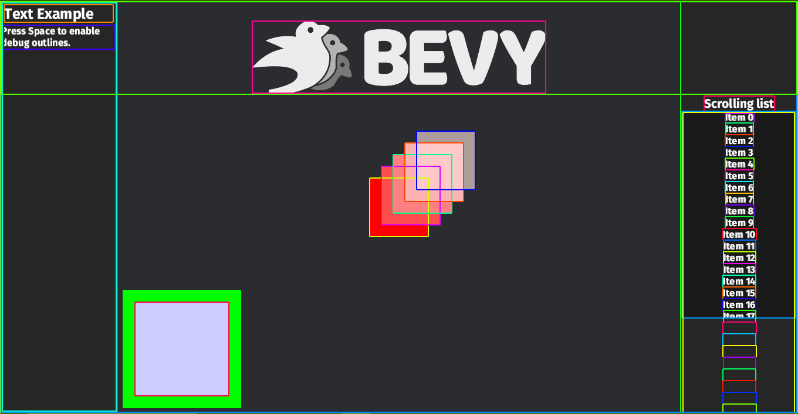

When working with UI on the web, being able to quickly debug the size of all your boxes is wildly useful.
We now have a native [layout tool](https://dev-docs.bevyengine.org/bevy/dev_tools/ui_debug_overlay/struct.DebugUiPlugin.html) which adds gizmos outlines to all [Nodes](https://dev-docs.bevyengine.org/bevy/ui/struct.Node.html)

An example of what the tool looks like after enabled



```rust
use bevy::prelude::*;

// You first have to add the DebugUiPlugin to your app
let mut app = App::new()
    .add_plugins(bevy::dev_tools::ui_debug_overlay::DebugUiPlugin);

// In order to enable the tool at runtime, you can add a system to toggle it
fn toggle_overlay(
    input: Res<ButtonInput<KeyCode>>,
    mut options: ResMut<bevy::dev_tools::ui_debug_overlay::UiDebugOptions>,
) {
    info_once!("The debug outlines are enabled, press Space to turn them on/off");
    if input.just_pressed(KeyCode::Space) {
        // The toggle method will enable the debug_overlay if disabled and disable if enabled
        options.toggle();
    }

}

// And add the system to the app
app.add_systems(Update, toggle_overlay);
```
