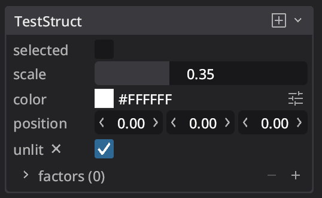

One of the features of Bevy's reflection system is the ability to attach arbitrary "type data" to a type.
This is most often used to allow trait methods to be called dynamically.
However, some users saw it as an opportunity to do other awesome things.

The amazing [bevy-inspector-egui](https://github.com/jakobhellermann/bevy-inspector-egui) used type data to great effect
in order to allow users to configure their inspector UI per field:

```rust
use bevy_inspector_egui::prelude::*;
use bevy_reflect::Reflect;

#[derive(Reflect, Default, InspectorOptions)]
#[reflect(InspectorOptions)]
struct Slider {
    #[inspector(min = 0.0, max = 1.0)]
    value: f32,
}
```

Taking inspiration from this, Bevy 0.14 adds proper support for custom attributes when deriving `Reflect`,
so users and third-party crates should no longer need to create custom type data specifically for this purpose.
These attributes can be attached to structs, enums, fields, and variants using the `#[reflect(@...)]` syntax,
where the `...` can be any expression that resolves to a type implementing `Reflect`.

For example, we can use Rust's built-in `RangeInclusive` type to specify our own range for a field:

```rust
use std::ops::RangeInclusive;
use bevy_reflect::Reflect;

#[derive(Reflect, Default)]
struct Slider {
    #[reflect(@RangeInclusive<f32>::new(0.0, 1.0))]
    // Since this accepts any expression,
    // we could have also used Rust's shorthand syntax:
    // #[reflect(@0.0..=1.0_f32)]
    value: f32,
}
```

Attributes can then be accessed dynamically using [`TypeInfo`](https://docs.rs/bevy/latest/bevy/reflect/enum.TypeInfo.html):

```rust
let TypeInfo::Struct(type_info) = Slider::type_info() else {
    panic!("expected struct");
};

let field = type_info.field("value").unwrap();

let range = field.get_attribute::<RangeInclusive<f32>>().unwrap();
assert_eq!(*range, 0.0..=1.0);
```

This feature opens up a lot of possibilities for things built on top of Bevy's reflection system.
And by making it agnostic to any particular usage, it allows for a wide range of use cases,
including aiding editor work down the road.

In fact, this feature has already been put to use by [`bevy_reactor`](https://github.com/viridia/bevy_reactor/blob/main/examples/complex/reflect_demo.rs)
to power their custom inspector UI:

```rust
#[derive(Resource, Debug, Reflect, Clone, Default)]
pub struct TestStruct {
    pub selected: bool,

    #[reflect(@ValueRange::<f32>(0.0..1.0))]
    pub scale: f32,

    pub color: Srgba,
    pub position: Vec3,
    pub unlit: Option<bool>,

    #[reflect(@ValueRange::<f32>(0.0..10.0))]
    pub roughness: Option<f32>,

    #[reflect(@Precision(2))]
    pub metalness: Option<f32>,

    #[reflect(@ValueRange::<f32>(0.0..1000.0))]
    pub factors: Vec<f32>,
}
```

